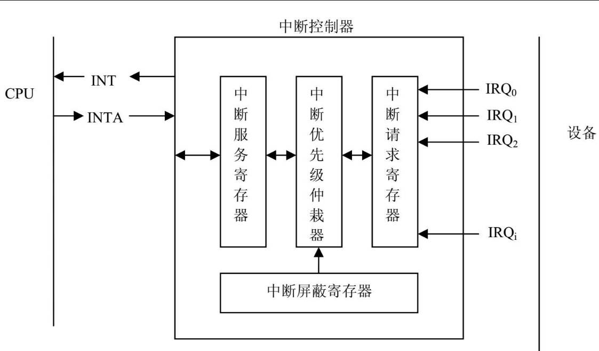
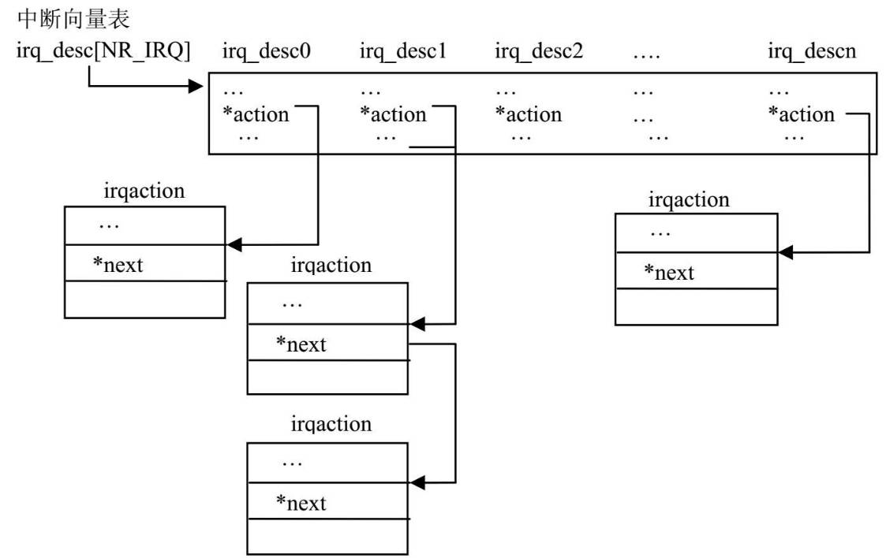

# 硬件中断

现代嵌入式环境有个中断控制器，他接受外部设备的各路中断请求信号，将他们放到中断请求寄存器中，
未被CPU屏蔽的中断请求会送入优先级电路，中断控制器产生一个公共中断请求信号INT，CPU收到信号后
发出响应INTA，中断控制器将最高优先级中断信号线传输给CPU，CPU根据中断信号线找到中断的入口地址。

一旦硬件设计完成，中断控制器对外的引脚数有限所以中断资源有限，且中断号对应的硬件固定，有时
多个设备可以公用一个硬件中断号。在处理中断请求时，会屏蔽其他中断信号(某些中断处理程序允许嵌套)，
如果这时其他中断产生，不能得到CPU响应，所以中断处理程序的执行时间需要尽可能短。

# 中断控制方式
建立硬件中断和处理程序的关系 request_irq/ free_irq

# 中断在内核中的实现
任何资源和硬件要得到内核的识别，必须有相关数据结构表示。
中断的数据结构就是 irq_desc
```c
struct irq_desc {
	// 硬件中断信号线
	unsigned int		irq;
	// 指向高层中断处理程序， 如果为NULL，默认使用  __do_IRQ 
	irq_flow_handler_t	handle_irq;
	void			*handler_data;
	// 指向描述中断信号所属的中断控制器的数据结构
	struct irq_chip		*chip;
	void			*chip_data;
	// 指向描述中断屏蔽字数据结构。
	struct msi_desc		*msi_desc;
	// 指向描述中断信号与中断处理程序对应关系的结构体
	struct irqaction	*action;	/* IRQ action list */
	// 当前中断信号的状态：被屏蔽，响应，等待服务
	unsigned int		status;		/* IRQ status */

	// 中断处理程序的可执行嵌套。当CPU正在执行一个中断处理程序时
	// 一个优先级更高的中断信号产生，CPU 转而执行优先级更高的中
	// 断服务程序。 depth 描述允许的嵌套层数
	unsigned int		depth;		/* nested irq disables */
	// 恢复被高优先级打断的中断服务程序的深度，即可恢复嵌套到几层
	unsigned int		wake_depth;	/* nested wake enables */
	// 本次中断被高优先级中断打断的次数
	unsigned int		irq_count;	/* For detecting broken IRQs */
	// 本次中断最后一次未被CPU响应的时间
	unsigned long		last_unhandled;	/* Aging timer for unhandled count */
	// 本次中断未被CPU响应的次数
	unsigned int		irqs_unhandled;
}; 
```
所有的 irq_desc 实例存放在 irq_desc数组中（该数组名和类型名相同）
```c
struct irq_desc irq_desc[NR_IRQS];
```
NR_IRQS代表了可存放的中断向量个数，和具体CPU平台有关。

Linux内核除了要知道会接受当前硬件环境的哪些信号(irq_desc描述)，还要知道接受到
信号后执行什么函数。信号和函数的关系由 struct irqaction 描述。
```c
struct irqaction {
	// 指向驱动程序实现的中断处理函数
	irq_handler_t handler;
	// 中断类型标志，主要有：
	// SA_SHIRQ : 设备驱动程序可以处理共享中断
	// SA_SAMPLE_RANDOM : 设备将自己标记为一个随机事件源，可以帮助内核产生内部随机数
	// SA_INTERRUPT : CPU允许中断处理程序时，禁止本CPU上其他中断，这种中断程序应该执行的非常快
	unsigned long flags;
	// 中断屏蔽位，描述执行本处理程序时，要屏蔽哪些信号 
	cpumask_t mask;
	// 产生中断信号的设备名，以字符串描述，一个驱动可以由多个设备使用，所以需要一个标识符指明当前的设备
	const char *name;
	// 设备在内核中的数据结构实例，对于网络设备为 net_device
	void *dev_id;
	// 所有共享相同中断信号的处理程序构成链表，当中断发生，CPU需要遍历链表查询是哪个设备产生的中断，并执行正确的中断服务程序
	struct irqaction *next;
	// 中断号，即那根信号中断线向CPU发出的请求
	int irq;
};
```
每个硬件信号可以有多个 irqaction实例，所以一个信号可以被多个硬件公用，每个硬件对应
的处理函数不同。

上图有几层含义：
* 系统有多少硬件中断线，就有多少irq_desc实例，这些实例放在irq_desc[NR_IRQS]数组中。
* 当设备驱动调用request_irq向内核注册自己的中断处理程序时，内核产生一个irqaction实体，描述中断处理程序和中断号的关联
* 内核将 irqaction挂在中断向量表对应中断号描述符中。
* 设备产生中断后将自己的中断号传递给CPU，CPU以中断号为索引查询中断向量表，找到正确的中断描述符，执行挂在上面的中断处理程序

# 软中断
执行中断处理程序时，CPU在特殊的中断上下文，此时CPU会禁止其他所有中断，意味着CPU必须尽快执行完处理程序，否则可能会丢失其他硬件数据。

当中断处理很复杂时，应该把一部分在中断处理程序中执行，剩余部分放到中断后半段执行。
内核有几种实现中断后半段的技术，如 softirq。
实现中断后半段机制分一下几个步骤：
* 将中断后半段适当分类
* 将中断后半段适索引号与处理程序关联，向内核注册中断后半段和他的处理程序
* 在适当时候调度中断后半段执行
* 通知内核执行中断后半段的处理程序 

## 软件中断的分类
当前Linux中，一旦涉及中断，中断处理程序只执行最紧急的任务，比如读入硬件缓冲区的数据，清除硬件状态等，当硬件可以正常工作后，再次允许硬件中断，
大部分数据处理工作在中断后半段执行。
内核定义了6中类型的软件中断：
```c
enum
{
	HI_SOFTIRQ=0,
	TIMER_SOFTIRQ,

	// 用于网络子系统
	NET_TX_SOFTIRQ,
	NET_RX_SOFTIRQ,

	BLOCK_SOFTIRQ,
	TASKLET_SOFTIRQ,
	SCHED_SOFTIRQ,
	HRTIMER_SOFTIRQ,
	RCU_SOFTIRQ,	/* Preferable RCU should always be the last softirq */

	NR_SOFTIRQS
};
```
软件中断的优点是，同一软件中断处理程序可以同时运行在多个CPU上，比如网络包的处理，多个数据包可以在多个CPU上同时处理，只需要控制多个CPU对共享数据的并发访问。

## 软件中断的数据结构
```c
struct softirq_action
{
	void	(*action)(struct softirq_action *);
};

// 软中断向量表
static struct softirq_action softirq_vec[NR_SOFTIRQS];

// 注册软中断
// nr : 软件中断类型
void open_softirq(int nr, void (*action)(struct softirq_action *));
```

网络子系统接受发送数据包的软中断处理程序 net_rx_action，net_tx_action

## 软中断的调用时刻
调用软中断最直接的地方就是硬件中断执行完后立即调度，
除此之外，内核还有几处会查看是否有中断后半段，有则调用do_softirq来执行软中断

内核会在一下几个地方检查软中断
1. do_IRQ
由于大量软中断是硬件中断产生的，所以处理硬件中断立即处理软件中断，如各种硬件中断，时钟中断后常常立即执行do_softirq

do_IRQ的实现和具体架构有关，
```c
unsigned int do_IRQ(struct pt_regs *regs)
{
	struct pt_regs *old_regs;
	/* high bit used in ret_from_ code */
	int overflow;
	unsigned vector = ~regs->orig_ax;
	struct irq_desc *desc;
	unsigned irq;

	// 保存原执行程序的寄存器
	old_regs = set_irq_regs(regs);
	irq_enter();
	// 获取中断号
	irq = __get_cpu_var(vector_irq)[vector];

	overflow = check_stack_overflow();

	// 获取中断描述符
	desc = irq_to_desc(irq);

	if (!execute_on_irq_stack(overflow, desc, irq)) {
		if (unlikely(overflow))
			print_stack_overflow();
		// 执行中断处理程序
		desc->handle_irq(irq, desc);
	}

	// 退出中断恢复寄存器值
	irq_exit();
		// 如果已经退出了中断，且存在软中断，则处理软中断	
		if (!in_interrupt() && local_softirq_pending())
			invoke_softirq();

	set_irq_regs(old_regs);
	return 1;
}
```

2. 从硬件中断和异常(包括系统调用)返回时

3. CPU上打开软中断时
当调用do_softirq时会检查是否已经有挂起的软中断，有则执行

4. 内核线程
为避免某软中断独占CPU（如网络高峰时，NET_TX_SOFTIRQ NET_RX_SOFTIRQ 比其他用户进程优先级高），Linux使用了一组与每个CPU相关的线程，他们名为 ksoftirqd_cpu0, ksoftirqd_cpu1... 来避免这种情况发生。 

5. 程序直接调用软中断
如 netif_rx_ni 从网络设备复制数据包到内核，就会直接调度软中断来处理数据包。

## 软中断的发送
是否存在挂起的软中断是由位图表示，内核提供设置位图的函数
```c

#define __raise_softirq_irqoff(nr) do { or_softirq_pending(1UL << (nr)); } while (0)
#define or_softirq_pending(x)  (local_softirq_pending() |= (x))

inline void raise_softirq_irqoff(unsigned int nr)
{
	__raise_softirq_irqoff(nr);

	if (!in_interrupt())
		wakeup_softirqd();
}
```
## 软中断的执行
```c
do_softirq(void)
	__u32 pending;
	unsigned long flags;

	// 当前必须非中断环境
	if (in_interrupt())
		return;

	// 保存当前硬件中断设置	
	local_irq_save(flags);

	// 获得软中断位图标志
	pending = local_softirq_pending();
	// 如果有挂起的软中断则处理
	if (pending)
		__do_softirq();

	// 恢复硬件中断设置	
	local_irq_restore(flags);


__do_softirq(void)
	struct softirq_action *h;
	__u32 pending;
	int max_restart = MAX_SOFTIRQ_RESTART;
	int cpu;

	// 获得软中断位图标志
	pending = local_softirq_pending();

restart:
	// 清零软中断位图标志
	set_softirq_pending(0);

	// 运行硬件中断
	// 在执行软件中断处理函数时可能被硬件中断打断，
	// 并添加新的软件中断
	local_irq_enable();

	h = softirq_vec;

	// 处理软中断
	do {
		if (pending & 1) {
			h->action(h);
		}
		h++;
		pending >>= 1;
	} while (pending);

	// 禁止硬件中断，因为需要获得在执行软中期间添加的
	// 新的软中断，而硬件中断可以添加新软中断
	local_irq_disable();

	// 获得新加的软中断，如果软中断处理还有剩余次数则
	// 再次执行软中断处理，之所以需要添加最大次数，是为了
	// 避免像网络数据高峰时不停添加软中断，导致系统无法
	// 调度其他任务
	pending = local_softirq_pending();
	if (pending && --max_restart)
		goto restart;

	// 如果还有剩余软中断没有处理完，则唤醒软中断内核线程
	// 确保能尽快处理软中断
	if (pending)
		wakeup_softirqd();

	trace_softirq_exit();

	account_system_vtime(current);
	_local_bh_enable();

	// 此时硬件中断是禁止状态，但是由于 do_softirq 会调用
	// local_irq_restore 恢复硬件中断标志，所以硬件中断会
	// 重新开启（如果调用do_softirq前是开启状态）
```

## 内核线程 ksoftirqd
ksoftirqd 是为了处理剩余的软中断，尽可能在CPU交出前处理剩余软中断。
每个CPUyou一个内核线程，分别为 ksoftirqd_cpu0 ksoftirqd_cpu1

```c
static int ksoftirqd(void * __bind_cpu)
{
	...
	while (!kthread_should_stop()) {
		...

		if (!local_softirq_pending())
			schedule();

		__set_current_state(TASK_RUNNING);

		while (local_softirq_pending()) {
			...
			do_softirq();
			...
		}
		...
		set_current_state(TASK_INTERRUPTIBLE);
	}
	...
}
```
内核将进程优先级分为 -20 到 19, ksoftirqd的优先级为19，为最低的，
这是为了避免如网络流浪高峰时处理软中断的程序独占CPU.

ksoftirqd一旦开始执行，就多次执行 do_softirq 直到 local_softirq_pending 显示没有软中断被挂起，然后将线程设置为 TASK_INTERRUPTIBLE，调用 schedule 释放CPU ,线程可以由wakeup_softirqd唤醒，唤醒过程可以在 \_\_do_softirq ，也可以在 raise_softirq_irqoff

线程执行时间到了，就必须释放CPU，时钟中断处理程序会设置need_resched标志来通知当前进程他们的执行时间片到期了，这时ksoftirqd释放CPU，保持他的状态为 TASK_RUNNING，以后线程的执行可以被恢复。

