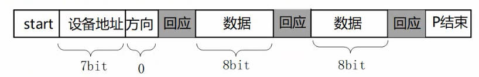

# I2C概述
## 硬件框架


- i2c控制器
- i2c设备

## 软件框架
以电容触摸屏为例：

- APP : read(x, y)
  - 应用程序调用标准方法获得输入的坐标
- i2c device driver
  - 根据不通硬件设备i2c通信协议整理i2c消息，以实现从电容触摸屏读取坐标值，并转换为x, y返回给APP
  - i2c消息的核心内容包括
    - address : 触摸屏挂在哪个i2c 控制器的总线上
    - 操作 : 读操作 
    - reg : 目标为触摸屏的哪个寄存器
- i2c controller driver
  - 按照i2c device driver发来的msg，根据i2c协议或SMBus协议，进行数据发送
  - 接受数据并转换为i2c msg发送给i2c driver

## Linux中的I2C实现


在Linux中，APP通过I2C通信有两条路
- 由i2c device driver负责数据的格式化
  - APP只负责业务逻辑，如果要读写数据，直接调用i2c device driver的标准接口
  - i2c device driver负责构建i2c 消息，如devaddress reg等
  - i2c controller 负责根据i2c msg进行时序通信
- 由APP完成数据的格式化
  - i2c device driver只作为 APP 和 i2c controller之间桥梁，并负责设置 devaddress reg等
  - i2c controller 负责根据i2c msg进行时序通信

# I2C协议
## 硬件连接

- SCK只有主设备控制
- SDA有时由主设备控制，有时由从设备控制
- 一个总线线可以连接多个从设备，主设备在通信时需要声明本轮通信的从设备地址

## 传输数据的类比
体育老师和同学传球, 老师做主设备，同学做从设备。
- 发球
  - 老师: 开始 (start)
  - 老师: A在吗？我把球发给你 (从设备地址和方向)
  - 学生A: 在 (响应)
  - 老师把球发出去 (传输)
  - 学生A收到球后，给老师响应: 收到了 (响应)
  - 老师: 停止 (end)

- 收球
  - 老师: 开始 (start)
  - 老师: B在吗? 把球发给我 (设备地址和方向)
  - 学生B: 在 (响应)
  - 学生B把球发出去 (传输)
  - 老师收到球后，给学生B响应: 收到了 (响应)
  - 老师: 停止 (end)

## 写操作

- 主设备发送开始信号
- 发送从设备地址(7bit)，数据方向(1bit)
- 从设备响应
- 主设备发送数据(8bit)，等待响应
- 从设备响应
- 主设备发送数据(8bit)，等待响应
- 从设备响应
- 主设备发送停止信号

## 读操作

- 主设备发送开始信号
- 发送从设备地址(7bit)，数据方向(1bit)
- 从设备响应
- 从设备发送数据(8bit)，等待响应
- 主设备响应
- 从设备发送数据(8bit)，等待响应
- 主设备响应
- 主设备发送停止信号

# I2C 的重要结构体

## i2c_adapter
```c
struct i2c_adapter {
  const struct i2c_algorithm *algo;  //  其中有i2c时许读写方法
  void *algo_data;

  int timeout;            /* in jiffies */
  int retries;
  struct device dev;      /* the adapter device */

  int nr;         // 是SoC中第几个I2C控制器
  char name[48];
  struct completion dev_released;

  ...
};

// 传输函数
struct i2c_algorithm {
  int (*master_xfer)(struct i2c_adapter *adap, struct i2c_msg *msgs,
             int num);
  ...
};
```

## i2c_client
```c
struct i2c_client {
  unsigned short flags;       /* div., see below      */
  unsigned short addr;        // 设备的地址
  char name[I2C_NAME_SIZE];
  struct i2c_adapter *adapter;  // 挂在的控制器
  struct device dev;      
  int init_irq;           /* irq set at initialization    */
  int irq;            /* irq issued by device     */
  struct list_head detected;
};
```

## i2c_msg
```c
  struct i2c_msg {
      __u16 addr; /* slave address            */
      __u16 flags; //  包含方向
  #define I2C_M_RD        0x0001  /* read data, from slave to master */
                      /* I2C_M_RD is guaranteed to be 0x0001! */
  #define I2C_M_TEN       0x0010  /* this is a ten bit chip address */
  #define I2C_M_DMA_SAFE      0x0200  /* the buffer of this message is DMA safe */
                      /* makes only sense in kernelspace */
                      /* userspace buffers are copied anyway */
  #define I2C_M_RECV_LEN      0x0400  /* length will be first received byte */
  #define I2C_M_NO_RD_ACK     0x0800  /* if I2C_FUNC_PROTOCOL_MANGLING */
  #define I2C_M_IGNORE_NAK    0x1000  /* if I2C_FUNC_PROTOCOL_MANGLING */
  #define I2C_M_REV_DIR_ADDR  0x2000  /* if I2C_FUNC_PROTOCOL_MANGLING */
  #define I2C_M_NOSTART       0x4000  /* if I2C_FUNC_NOSTART */
  #define I2C_M_STOP      0x8000  /* if I2C_FUNC_PROTOCOL_MANGLING */
      __u16 len;      /* msg length               */
      __u8 *buf;      /* pointer to msg data          */
  };
```

## 核心函数
```c
// adapter 发送一个或多个msg
// msg内包含slave address
// 通常一轮i2c操作设计多个msg
// 如从设备中读取数据设计两个msg
// msg1 : 写msg，写寄存器，我要读地址为0x111的数据
// msg2 : 读msg，设备发送的i2c消息填充到msg2中
int i2c_transfer(struct i2c_adapter *adap, struct i2c_msg *msgs, int num)
```


