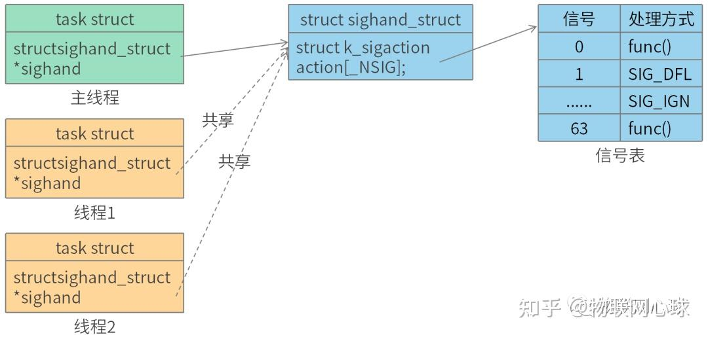
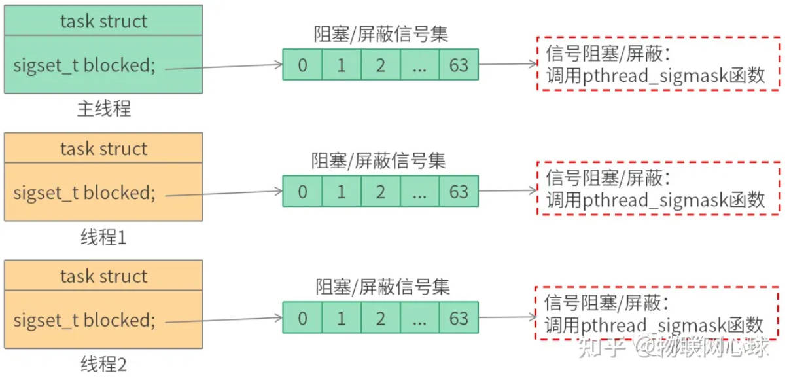
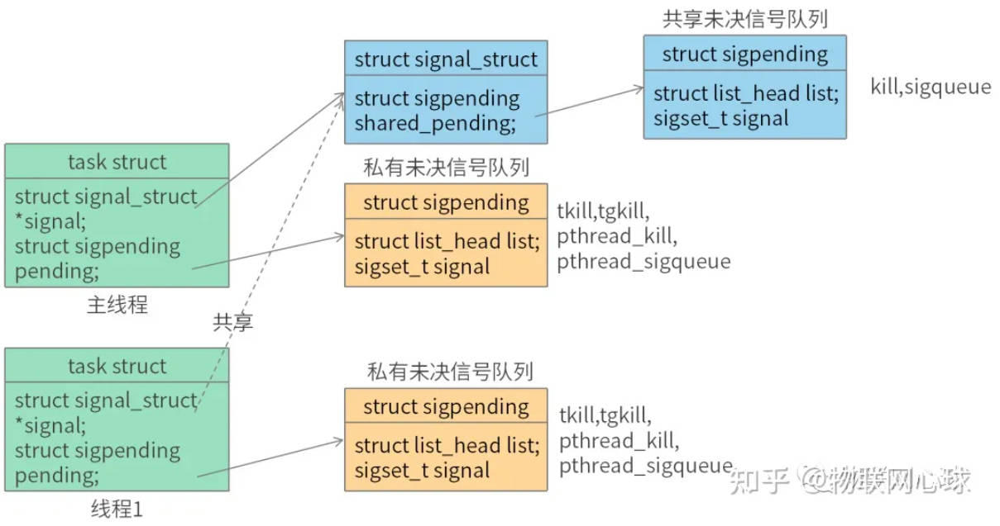

# 信号与线程

## 1.线程与信号的关系

线程与信号关系要遵循以下标准：

- 标准1：同一线程组线程之间共享信号处理函数。
- 标准2：线程有独立的阻塞信号集。
- 标准3：私有未决信号队列和共享未决信号队列。
- 标准4：收到致命信号，线程组退出。

## 2.同一线程组线程之间共享信号处理函数（标准1）。

创建进程时，线程task_struct对象sighand成员会指向主线程指向的struct sighand_struct对象，线程组所有线程共享主线程信号表。

原来的进程此时理解为主线程。

## 3.线程有独立的阻塞信号集（标准2）。

每个线程task_struct都有各自的阻塞/屏蔽信号集（blocked成员）。

通过pthread_sigmask可以设置阻塞/屏蔽信号集，用来屏蔽特定的信号，

进程（主线程）可以由sigprocmask函数或者pthread_sigmask函数来设置阻塞/屏蔽信号集。

sigprocmask函数和pthread_sigmask底层实现方式一样，没有区别。

## 4.私有未决信号队列和共享未决信号队列（标准3）。

每个线程task_struct都有各自的未决信号队列（pending成员）。

每个线程组主线程有一个共享未决信号队列（signal成员），其他线程共享主线程共享未决信号队列。

当主线程收到信号后，如果主线程设置了阻塞/屏蔽信号集，那么该信号会存储在共享未决信号队列，比如通过kill或者sigqueue函数发送给主线程的信号。

其他线程收到信号后，如果线程设置了阻塞/屏蔽信号集，那么该信号会存储在私有未决信号队列，比如通过tkill，tgkill，pthread_kill，以及pthread_sigqueue函数发送给线程的信号。

- 共享未决信号队列信号如何处理？

主线程优先处理共享未决信号队列信号。

其他线程在主线程不方便处理时，才会处理共享未决信号队列信号

常用产生信号函数对比：

 | 函数 | 信号类型 |
 | -- | -- |
 |  kill    			| 共享未决信号  |
 |  sigqueue    		| 共享未决信号 |
 |  tkill    			| 私有未决信号 |
 |  tgkill    			| 私有未决信号 |
 |  pthread_kill    	| 私有未决信号 |
 |  pthread_sigqueue    | 私有未决信号 |

## 5.收到致命信号，线程组退出（标准4）。

所谓致命信号就是能让线程终止的信号，可查看信号默认处理方式表。

这一条标准的目的是为了实现同一线程组里线程的统一退出管理。
