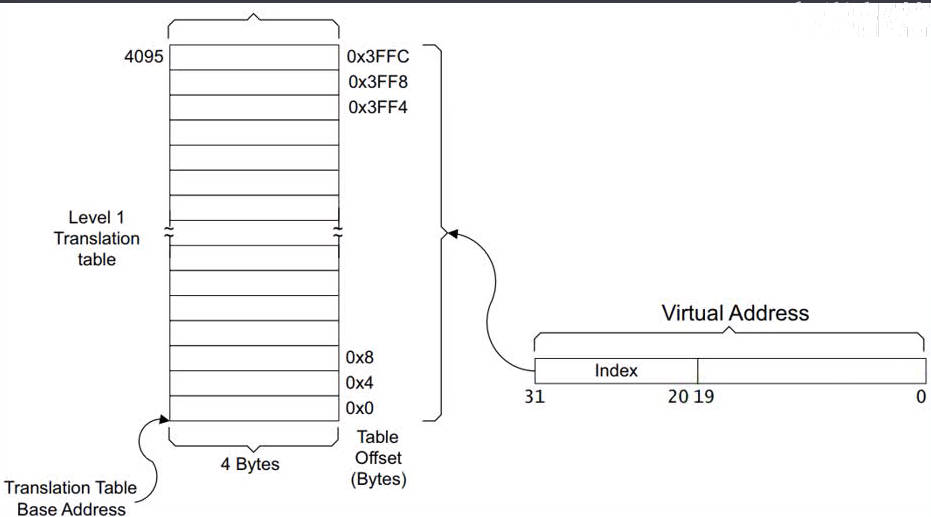
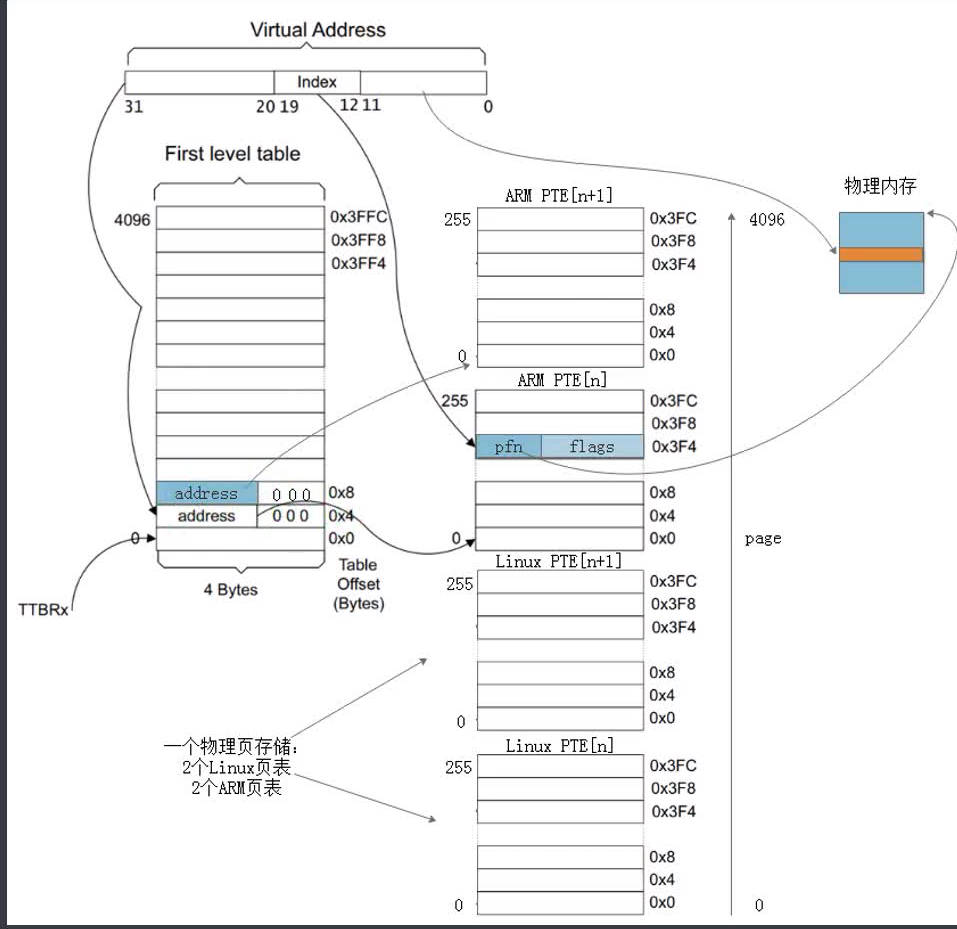

# 0.背景知识
## 0.1 硬件
SRAM : 硬件复杂，成本高，CPU通过A0-A18个地址线一次输入要访问的地址，就能获得数据，所以CPU能直接访问
DDR SRAM: 硬件简单，成本低，但CPU需要通过a0-a10地址线多次输入地址，先输入行地址，再输入列地址，才获得数据，由于有时序问题，所以用sdram控制器实现，cpu不能直接访问。

## 0.2 内存管理的目的
不仅是回收未使用内存，
是减少内存碎片，否则分配大片内存时会失败。

# 1. 物理内存的管理
## 1.1 物理分区

linux将物理内存分为多个区，
ZONE_NORMAL : 操作系统可以直接映射到虚拟地址空间的物理页面，这些页面可以被操作系统直接访问和操作
ZONE_HIGHMEM: 无法直接映射到虚拟地址空间的物理页面，无法直接访问，只能通过如临时内存映射等方式访问
注意：当系统物理空间不足1GB，内核会将所有物理空间视为ZONE_NORMAL，当超过1GB，则出现ZONE_HIGHMEM。

## 1.2 node zone page
抽象出3个类型描述和使用内存
struct node : 表示一定数量的物理内存资源和处理器，允许多个处理器访问共享内存。可理解为多个物理内存条。
struct zone : 表示连续的物理内存区域，包含多个页。按照不同的使用目的，内存被划分成不同的zone，方便管理
struct page : 表示一个物理内存页，通常是4KB或更大的固定大小。

### 1.2.1 struct page 
struct page 表示物理内存页面的信息，每个物理页面对应着一个 struct page 结构体。

物理页面是指系统中的一段连续物理内存，通常是4KB或更大的固定大小。

struct page 包含了描述一个物理页面的各种信息，包括页面的状态、页面的属性、页面的使用情况等。此外，该结构体中还包含了指向该页面所属的内存区域（zone）、页面的引用计数（count）、页面的标志（flags）等重要字段。

在实际的内存管理过程中，操作系统使用 struct page 来管理系统中所有的物理页面，包括分配、释放、映射到虚拟地址等。

```c
struct page *mem_map;
EXPORT_SYMBOL(mem_map);
```
每个zone都有一个mem_map 指向struct page数组，管理此zone下所有物理页。

page数组的索引号称为物理页帧号pfn。通过pfn可以获得物理页的地址
```c
// 如果一个页大小为4KB，则PAGE_SHIFT 为12

pfn = paddr >> PAGE_SHIFT;

#define __pfn_to_phys(pfn)    ((unsigned long long)(pfn) << PAGE_SHIFT)
#define pfn_to_phys(pfn)      __pfn_to_phys(pfn)

unsigned long long phys_addr = pfn_to_phys(pfn);
```

pfn和mem_map数组下标的关系
注意：每个zone和独立的mem_map数组，而pfn是将多个zone合并成一个数组的下标。
所以对于 ZONE_NORMAL 的mem_map 和 pfn的关系为
```c
// pfn 减去 ZONE_NORMAL 的起始页帧号，得到pfn对应的 mem_map 的下标
struct page *page = &mem_map[pfn - zone->zone_start_pfn];
```

pfn和page的转换
```c
#include <linux/mm.h>

struct page *pg = pfn_to_page(pfn);
unsigned int pfn = page_to_pfn(page);
```

### 1.2.2 如何从node到page

```c
// node 中有关内存资源使用对应的 pglist_data 描述
typedef struct pglist_data {
	struct zone node_zones[MAX_NR_ZONES];
	struct zonelist node_zonelists[MAX_ZONELISTS];
	...
};
```

```c
struct zone {
	...
	struct free_area	free_area[MAX_ORDER];
	...
};

struct free_area {
	struct list_head	free_list[MIGRATE_TYPES];
	unsigned long		nr_free;
};
```

## 1.3 伙伴系统 
伙伴系统用于物理页的分配的释放。

物理内存依旧按照frame page划分成固定大小的页，每个frame page都有一个page和其对应。
为了减少内存碎片，将page按不同大小合并成大页。
最小的是 2^0 也就是一个page大小，然后是 2^1 * page 大小，最后是 2^(MAX_ORDER-1)\*page大小
分配：分配内存时会尽可能使用小内存块，比如分配4KB内存，但发现2^2对应的链表依旧分配完了，就从2^3链表取一块进行拆分，加入2^2完成分配。
释放：用户释放内存后，根据内存大小加入对应的链表，然后尽可能进行合并，系统会检查是否有相邻物理地址内存块，有则进行合并，并移到上级链表。


### 1.3.1 迁移类型


每个zone都维护一个伙伴系统
每个数组元素有一个元素为链表的数组，分为三种类型的链表 movable 可移动(如应用程序动态分配的内存)，unmovable 不可移动（如内核的物理内存），reclaimable 可回收（如文件的页缓存）。比如.text对应的内存就应该从 unmovable中分配。

```c
struct page {
   unsigned long private; // page的大小，2^0, 2^1 之类，
                          // 由于buddy中一块内存可能又多个page合并构成，
                          // 返回给用户首个page，
                          // 使用private告诉用户此块内存的大小

   atomic_t _mapcount;    // 是否被虚拟地址映射
                          // 可用于判断此page是否被分配了

   atomic_t _refcount;
};
```

### 1.3.2 zone的三种页缓存
```c
struct zone {
	...
	long lowmem_reserve[MAX_NR_ZONES];
	struct per_cpu_pages	__percpu *per_cpu_pageset;
	struct free_area	free_area[MAX_ORDER];
	...
};
```
对于一个物理内存条，使用node描述，node分为多个zone分别管理，一个zone有三个变量存放page

lowmem_reserve:表示该内存区域中为了避免低内存条件而保留的页数，这些页不能被用户进程或内核缓存使用，只有在系统高负载时才会释放出来。
pageset ： 表示每个 CPU 上的本地页管理器，它包含了用于分配和释放页面的数据结构，以及用于记录该 CPU 上的页面使用情况的变量。
free_area : cpu共享的内存分配区域，使用伙伴系统管理.

这些页缓存都在系统初始化时分配好，等待被使用。
当进程分配内存时，首先从当前CPU的per_cpu_pageset中查找是否有可用的页面，如果找到，直接从本地per_cpu_pageset中分配页面，从而避免不同CPU之间锁竞争。如果当前CPU的per_cpu_pageset中没有可用页面，则尝试从当前zone的free_area中分配页面，如果当前zone的free_area中也没有可用页面，则到其他zone分配页面。


```c
struct per_cpu_pages {
	...
	// 每个元素都是双向链表，每个链表对应一种页面大小，每个链表包含多个struct page。
	struct list_head lists[NR_PCP_LISTS];
};
```

#### per-cpu的意义


即使是单线程进程，也可能存在多CPU之间的竞争。这是因为多CPU核心在同时执行相同的代码时，会共享同一个内存空间。当多个CPU核心尝试访问和修改同一个内存位置时，就会产生竞争条件。

例如，在一个多CPU核心的系统上，如果一个进程在使用全局变量时不加同步机制，那么多个CPU核心就会在同时尝试对该变量进行读写操作，这就会导致竞争条件。此时，由于每个CPU核心都有自己的缓存，不同的CPU核心可能会缓存相同的变量值，导致数据不一致性。

因此，在多CPU环境下，需要采取同步机制（如锁、原子操作、memory barrier等）来保证多个CPU核心之间的互斥访问和数据一致性，避免竞争条件的发生。

将线程绑定到单个CPU可以解决一些CPU之间竞争条件，但可能无法充分利用系统并发性能。

如果使用per_cpu，对同个变量符号，每个CPU都有一个此变量的副本独立存在于内存中，每个CPU运行时只访问自己的变量，从而保证缓存和内存的值一定同步，避免了竞争。

```c
#include <linux/percpu.h>

struct vector {
    int x;
    int y;
    int z;
};

// 有几个CPU就会定义几个 private_vector 变量
DEFINE_PER_CPU(struct vector, private_vector);

void vector_add(struct vector *result, const struct vector *a, const struct vector *b)
{
    result->x = a->x + b->x;
    result->y = a->y + b->y;
    result->z = a->z + b->z;
}

int main()
{
    int i, num_cpus = num_online_cpus();
    struct vector a = {1, 2, 3};
    struct vector b = {4, 5, 6};
    struct vector sum = {0, 0, 0};

    for (i = 0; i < num_cpus; i++) {
        __get_cpu_var(private_vector).x = i; // 每个cpu访问自己的private_vector
        vector_add(&__get_cpu_var(private_vector), &a, &b);
        sum.x += __get_cpu_var(private_vector).x;
        sum.y += __get_cpu_var(private_vector).y;
        sum.z += __get_cpu_var(private_vector).z;
        __put_cpu_var(private_vector);
    }

    printk(KERN_INFO "sum = (%d, %d, %d)\n", sum.x, sum.y, sum.z);

    return 0;
}
```
如果不使用per_cpu，则访问变量时需要获得锁，导致性能降低。

### 1.3.3 伙伴系统的接口
```c
struct page *alloc_pages(gfp_t gfp, unsigned int order);
```
用于申请一块2^order的连续物理内存块
内核内存环境良好，直接进行快速分配
当前内存环境恶劣时，进入慢分配流程，慢分配时可能会进行页内存的迁移，合并等以获得需求大小的struct page.

### 1.3.4 CMA
伙伴系统有个缺点，即最大分配的struct page有限，如 MAX_ORDER 为 11，则最大为 2^11 = 4MB.

如果希望申请大于4MB的内存，需要在初始化时保留一大块内存，等待驱动使用。但当驱动没有使用时，这大块内存被闲置。

为了解决上面问题，内核实现了CMA机制，当内存空闲时，空闲的内存加入伙伴系统，可用于小内存的分配。当驱动等使用CMA分配大块内存时，保证能分配大块连续内存（若已被分配用于小内存，则会进行内存迁移）。


在内存初始化时，专门划分一大块区域用作CMA。

空闲时CMA调用cma_release将内存加入伙伴系统的特定链表，每个节点对应的内存大小为 2^MAX_ORDER。
伙伴系统可以将CMA链表的内存进行拆分加入小页链表，以给用户分配。但是有个限制，即用户分配的内存必须是 movable，因为当CMA需要大块内存分配时，可能需要内存迁移。

当CMA分配大块内存时，调用 cma_alloc从伙伴系统中回收内存。

在设备树或内存配置时指定保留多大空间做cma
```dts
    reserved-memory {
        #address-cells = <1>;
        #size-cells = <1>;
        ranges;

        /* Chipselect 3 is physically at 0x4c000000 */
        vram: vram@4c000000 {
            /* 8 MB of designated video RAM */
            compatible = "shared-dma-pool";
            reg = <0x4c000000 0x00800000>;
            no-map;
        };
    };

```

```c
struct cma {
	unsigned long   base_pfn;
	unsigned long   count;
	unsigned long   *bitmap;
	unsigned int order_per_bit; /* Order of pages represented by one bit */
	spinlock_t	lock;
	char name[CMA_MAX_NAME];
};

#define MAX_CMA_AREAS	(1 + CONFIG_CMA_AREAS)
extern struct cma cma_areas[MAX_CMA_AREAS];
extern unsigned cma_area_count;

```


cma_area : 指向整个cma空间。
base_pfn : 可以找到对应物理地址
count : CMA区域可以分配的最大页面数量（即可用的物理页面数）
order_per_bit : 表示每个位可表示的页面指数。

bitmap : CMA分配情况

bitmap 和 order_per_bit ，若order_per_bit为0，则占用2^0即一个bit位，若为2，则占用2^2即占用4个bit。每个bit位都对应一个页块（如4MB）


### 1.3.5 伙伴系统的初始化
#### memblock
##### memblock的初始化
物理内存有些会被保留，不参与伙伴系统内存分配，比如：内核镜像(.init段除外)，dtb，u-boot(reboot时会被调用)，页表，GPU，camera，音视频编解码，dtb设置为reserved的区域（CMA除外）


要初始化伙伴系统，首先需要区分哪些内存可用于伙伴系统，哪些内存被保留。
memblock是全局变量，其memory属性记录可用于伙伴系统的内存块，reserved属性记录被保留的内存块。
通过 memblock_add，memblock_remove给 memblock.memory添加删除内存块。
通过 memblock_reserve，memblock_free给 memblock.reserved添加删除保留块
```c
  int __init_memblock memblock_add(phys_addr_t base, phys_addr_t size)

  int __init_memblock memblock_remove(phys_addr_t base, phys_addr_t size)

  int __init_memblock memblock_reserve(phys_addr_t base, phys_addr_t size)

  void __init_memblock memblock_free(void *ptr, size_t size)
```

```c
setup_arch
   setup_machine_fdt
      early_init_dt_scan
         early_init_dt_scan_memory
            遍历设备树memory节点，从reg属性获得base,size
            early_init_dt_add_memory_arch(base, size)
               memblock_add_node(base, size, 0, MEMBLOCK_NONE)
                  memblock_add_range(&memblock.memory, base, size, nid, flags) // 将可分配的内存信息加入 memblock.memory

   arm_memblock_init
      early_init_fdt_scan_reserved_mem  // 将保留内存信息加入 memblock.reserved
```

```dts
memory@80000000 {
	device_type = "memory";
	reg = <0 0x80000000 0 0x40000000>;
};

reserved-memory {
	#address-cells = <2>;
	#size-cells = <2>;
	ranges;

	/* Chipselect 2 is physically at 0x18000000 */
	vram: vram@18000000 {
		/* 8 MB of designated video RAM */
		compatible = "shared-dma-pool";
		reg = <0 0x18000000 0 0x00800000>;
		no-map;
	};
};
```
初始化后，memblock_memory_init_regions 和 memblock_reserved_init_regions 分别保留可分配和保留信息


##### memblock 释放内存给伙伴系统
memblock.memory获得可用的内存信息，使用 free_page 添加到伙伴系统
```c
mm_init
   mem_init
   memblock_free_all // 将memblock.memory 记录的内存释放到伙伴系统
      free_low_memory_core_early
         for_each_free_mem_range(i, NUMA_NO_NODE, MEMBLOCK_NONE, &start, &end,
                  NULL)  // memblock.memory 数组获得每个节点的 start, end
             __free_memory_core(start, end);
                __free_pages_memory(start_pfn, end_pfn); // 将地址转换位页号
                   memblock_free_pages(pfn_to_page(start), start, order); // 由页号得到 page
                      __free_pages_core(page, order);

                         __free_pages_ok(page, order, FPI_TO_TAIL | FPI_SKIP_KASAN_POISON);
                            migratetype = get_pfnblock_migratetype(page, pfn);  // 获得可移动属性
                            __free_one_page(page, pfn, zone, order, migratetype, fpi_flags);  //加入伙伴系统
```

#### CMA
在dts中，如果reserved的内存节点有类似属性，则不会被释放给伙伴系统
```dts
removed-dma-pool "linux,dma-default";
no-map
```
如果有如下属性，则会被释放给伙伴系统
```dts
shared-cma-pool "linux,cma-default";
reuse
```

```c
do_initcalls
   for (i = 0; i < cma_area_count; i++) //遍历CMA数组，将每个CMA区域都释放给伙伴系统
      cma_activate_area(&cma_areas[i]);
         cma->bitmap = bitmap_zalloc(cma_bitmap_maxno(cma), GFP_KERNEL);  // 准备bitmap表用于记录有哪些内存释放给了伙伴系统，方便CMA需要时会让伙伴系统归还
         for (pfn = base_pfn; pfn < base_pfn + cma->count;
             pfn += pageblock_nr_pages)
             init_cma_reserved_pageblock(pfn_to_page(pfn));      // 以pageblock为单位释放内存
                set_pageblock_migratetype(page, MIGRATE_CMA); // 将此页标记为CMA类型
                __free_pages(page, pageblock_order);  // 释放page，将page添加到pageblock_order的链表上
```
#### .init段
```c
rest_init
   kernel_init
      free_initmem
         free_initmem_default
            extern char __init_begin[], __init_end[];
            free_reserved_area(&__init_begin, &__init_end,
                     poison, "unused kernel image (initmem)");

               start = (void *)PAGE_ALIGN((unsigned long)start);
               for (pos = start; pos < end; pos += PAGE_SIZE, pages++) {  // 以page为单位释放到伙伴系统
                  struct page *page = virt_to_page(pos);
                  free_reserved_page(page);
                         __free_page(page);
               }
               pr_info("Freeing %s memory: %ldK\n", s, K(pages));
]
```
### 1.3.4 slab
伙伴系统有个缺点：最小分配内存大小为一个页。
为了适合小内存的申请释放，实现了 slab缓存。
slab是从伙伴系统申请一页（一个page或多个page大小），将一页内存分成相同大小的内存块，如32B的slab每个内存块为32B，64Bslab每个内存块大小为64B。
当用户申请小内存时，按照申请的大小到对应的slab缓存中获得内存块，
当用户释放内存时，按照内存大小释放到对应的slab。

比如task_struct是常用的类型，那么可以对task_struct构造一个slab，slab块的大小为64B。


slab各个版本
slab: 老版本实现
slob: 轻量级slab
slub: 对slab的重新实现

#### slab的实现原理
核心三个类型：
kmem_cache, kmem_cache_node, kmem_cache_cpu
kmem_cache，相同大小的slab由同个kmem_cache管理
kmem_cache_node，这时一个元素为指针的数组，除了服务器外通常只有一个元素
kmem_cache_cpu，使用\_\_percpu修饰，每个cpu有单独的一份拷贝。

当用户申请slab时，根据申请大小到对应的kmem_cache，如果希望多cpu访问则从 kmem_cache_node分配，否则从kmem_cache_cpu分配。

空闲的slab由free_list管理，分配时，将首个节点返回给用户，并将free_list指向下一个节点即可。一个slab的申请完了，就移动free_list到下一个slab，如果所有slab都用完了，就从伙伴系统分配一个page构造成 slab。


#### slab的接口
```c
创建和销毁 kmem_cache
kmem_cache_create
kmem_cache_destory

从 kmem_cache 分配一个obj
kmem_cache_alloc
释放 obj到 kmem_cache
kmem_cache_free
```

### 1.3.5 kmalloc
kmalloc是基于伙伴系统和slab实现的，当申请的内存大则从伙伴系统，小则走slab。

# 2. 虚拟地址 
## 2.1 虚拟地址和MMU

当cpu开启MMU后，虚拟地址被转换成物理地址，发给SDRAM

为什么一定要虚拟地址：
Linux环境太复杂，连接器无法在链接节点知道程序的加载地址，所以假定程序都从0地址开始。那么不同进程的地址就重叠了，所以需要运行将链接的地址映射到不同的物理地址。

### 2.1.1 MMU的工作原理

MMU的映射是以页为单位
页表：虚拟地址和物理地址的映射关系表，保存在内存中。
Table Walk Unit：读取页表的硬件，当转换虚拟地址时，他会读取对应的页表
TLBs：页表缓存，由于读取内存太非时间，当转换一个地址时会将附件地址的页表也加载在MMU的TLBs

有个寄存器保存了页表的地址。
当输入虚拟地址和ASSID给MMU，ASSID用于解决不同进程相同虚拟地址的情况，
MMU首先在缓存中查找释放有对应虚拟地址号和ASSID相同的条目，如果有则直接返回物理地址。
如果没有在TLB中找对应的物理地址基地址，若找到返回物理地址，
如果没有则根据寄存器加载内存中的页表，并缓存相邻页表。并返回物理地址


## 2.3 页表
### 2.3.1 一级页表

虚拟地址分为两段:
[31:12] 20位 虚拟页表号: 所以能表示2\^20 = 1M个页表，每个页表对应4KB大小的物理页，所以能映射4GB的物理地址。
[11:0]  12位 页内偏移。
首先根据 虚拟地址第一段 虚拟页表号作为索引，寄存器TIBRx存储了页表的首地址，有索引和首地址就得到物理页号，从而找到了物理页，再加上虚拟地址第二段页内偏移做物理页页内偏移。就得到物理地址。


一级页表有个致命问题：
页表太大，如上为 1M个页表项，一个页表项如果为4B，则为4MB，每个进程都有自己的页表，1K个进程则需要4GB的物理内存存储页表。
所以实际环境不存在一级页表.

### 2.3.2 二级页表

二级页表的虚拟地址分为三段：
一级页表号[20-31]: 12位，4K个一级页表项
二级页表号[12-19]: 8位，256个二级页表项
页内偏移[0-12]：12位，最大偏移4K，也就是一个物理页的大小。

4K \* 256 \* 4K = 4GB ，所以二级页表也能表示4GB虚拟地址，映射4GB物理地址。
由于二级页表只有一级表需要预先分配，二级表用时才分配，所以一个进程的页表占用内存为 16KB 多点。
而且二级页表中二级表可以分散到物理内存，所以不需要占用连续的物理内存。


### 2.3.3 段表

段表类似于一级页表，但是每项映射1MB空间。
使用段表时，虚拟地址分为两段：
[31:20] 索引段表项，段表项记录物理段地址
[19:0]  段内偏移

段表格式


### 2.3.4 ARM下页表段表


### 2.3.5 页表相关代码分析
#### 2.3.5.1 linux和虚拟地址
查看linux的链接脚本

arch/arm/boot/vmlinux.lds
```lds
{
  /DISCARD/ : {
    *(.discard) *(.discard.*) *(.modinfo) *(.gnu.version*)
    *(.ARM.exidx*)
    *(.ARM.extab*)
    *(.note.*)
    *(.rel.*)
    *(.data)
  }
  . = 0;
  ...
```

arch/arm/boot/vmlinux.lds
```lds
OUTPUT_ARCH(arm)
ENTRY(stext)
jiffies = jiffies_64;
SECTIONS
{
 /DISCARD/ : {
  *(.ARM.exidx.exit.text) *(.ARM.extab.exit.text) *(.ARM.exidx.text.exit) *(.ARM.extab.text.exit) *(.exitcall.exit) *(.discard) *(.discard.*) *(.modinfo) *(.gnu.version*)
 }
 . = ((0x80000000)) + 0x00008000;
```

可见对于 zImage 使用地址无关码运行。
vmlinux 使用虚拟地址运行。

所以linux的地址无关码部分必须构建页表，并开启MMU。

再看物理地址
arch/arm/boot/dts/vexpress-v2p-ca9.dts
```dts
	memory@60000000 {
		device_type = "memory";
		reg = <0x60000000 0x40000000>;
	};

	reserved-memory {
		#address-cells = <1>;
		#size-cells = <1>;
		ranges;

		/* Chipselect 3 is physically at 0x4c000000 */
		vram: vram@4c000000 {
			/* 8 MB of designated video RAM */
			compatible = "shared-dma-pool";
			reg = <0x4c000000 0x00800000>;
			no-map;
		};
	};
```
可见，物理地址从 0x60000000 - 0xa0000000,  共 1GB

#### 2.3.5.2 段映射
为了让kernel可运行，再head.S进行段映射。
段映射原理如下


```asm
__turn_mmu_on_loc:
	.long	.                  @ __turn_mmu_on_loc的虚拟地址
	.long	__turn_mmu_on      @ __turn_mmu_on虚拟地址
	.long	__turn_mmu_on_end  @ __turn_mmu_end虚拟地址

	...

	bl	__create_page_tables   @ 建立段表
/*
 * Setup the initial page tables.  We only setup the barest
 * amount which are required to get the kernel running, which
 * generally means mapping in the kernel code.
 *
 * r8 = phys_offset, r9 = cpuid, r10 = procinfo
 *
 * Returns:
 *  r0, r3, r5-r7 corrupted
 *  r4 = physical page table address
 */

__create_page_tables:
	pgtbl	r4, r8				@ page table address

	/*
	 * Clear the swapper page table
	 * 清零页表
	 */
	mov	r0, r4               @ r0 指向页表开始
	mov	r3, #0
	add	r6, r0, #PG_DIR_SIZE @ r6 指向页表结尾
1:	str	r3, [r0], #4         @ 写4字节数据到r0指向的内存，r0 += 4
	str	r3, [r0], #4
	str	r3, [r0], #4
	str	r3, [r0], #4
	teq	r0, r6
	bne	1b

	/*
	 * r7存放mmu flags
	 */
	ldr	r7, [r10, #PROCINFO_MM_MMUFLAGS] @ mm_mmuflags

	/*
	 * Create identity mapping to cater for __enable_mmu.
	 * This identity mapping will be removed by paging_init().
	 * 建立对等映射，准备开启MMU
	 * 开启MMU后，使用虚拟地址，意味着必须要提供有效的页表
	 * 所以在开启MMU前需要设置页表，开启MMU的代码的物理地址等于
	 * 虚拟地址，也就是对等映射
	 */
	adr	r0, __turn_mmu_on_loc @ r0存放__turn_mmu_on_loc的物理地址

	ldmia	r0, {r3, r5, r6} @ 从r0指向的内存依次写入寄存器r3,r5,r6
                             @ r3 : __turn_mmu_on_loc的虚拟地址
                             @ r5 : __turn_mmu_on虚拟地址
                             @ r6 : __turn_mmu_on_end 虚拟地址

	sub	r0, r0, r3          @ r0 = r0 - r3
                            @ virt->phys offset
                            @ r0 存放 __turn_mmu_loc物理地址减去 __turn_mmu_loc 虚拟地址 得到的偏移值

	add	r5, r5, r0          @ phys __turn_mmu_on
	add	r6, r6, r0          @ phys __turn_mmu_on_end

	mov	r5, r5, lsr #SECTION_SHIFT  @ r5=r5>>20
                                    @ 得到物理基地址
                                    @ 对等映射：将物理地址当成虚拟地址
                                    @ 虚拟地址>>20 得到 页表索引号

	mov	r6, r6, lsr #SECTION_SHIFT  @ r6=r6>>20
                                    @ 得到物理基地址
                                    @ 对等映射：将物理地址当成虚拟地址
                                    @ 虚拟地址>>20 得到 页表索引号

1:	orr	r3, r7, r5, lsl #SECTION_SHIFT  @ flags + kernel base
                                        @ r3 = r7 | r5<<20
                                        @ 将物理基地址做高位，位或上mmu flags 得到填充页表的值

	str	r3, [r4, r5, lsl #PMD_ORDER]    @ identity mapping
                                        @ 将r3页表项值填充到页表
                                        @ 页表的地址计算：
                                        @     r4 + r5<<2
                                        @     页表基地址 + 页索引号 * 4   得到页表项地址
                                        @     之所以乘以4，是因为一个页表项占4字节

	cmp	r5, r6              @ 比较当前页表号和结束页表号
	addlo	r5, r5, #1      @ next section
                            @ 当r5 < r6 时，r5 = r5+1 , 也就是r5为下一个页表号

	blo	1b                  @ 当r5 < r6 时，循环

	/*
	 * Map our RAM from the start to the end of the kernel .bss section.
	 * 映射kernel镜像
	 */
	add	r0, r4, #PAGE_OFFSET >> (SECTION_SHIFT - PMD_ORDER) @ r0为kernel的起始页的地址
                                                            @ 因为第一个页号被对等映射占据，
                                                            @ 所以kernel的从第二个页开始
                                                            @ r0 = 页表基地址 + 第二个页的偏移地址

	ldr	r6, =(_end - 1)     @ kernel的虚拟地址的结束地址

	orr	r3, r8, r7          @ r8:kernel镜像物理起始地址的基地址
                            @ r3 = phys_offset | mmu flags

	add	r6, r4, r6, lsr #(SECTION_SHIFT - PMD_ORDER)  @ 得到镜像虚拟结束地址对应的页的地址
                                                      @ 将 r6 >> (20 - 2) 可以理解为
                                                      @ (r6 >> 20) * 4
                                                      @ 首先将虚拟地址右移20位，得到页号
                                                      @ 再将页号乘以 4 得到偏移地址
                                                      @ 将页表基地址加上偏移地址得到结束页的地址

1:	str	r3, [r0], #1 << PMD_ORDER             @ 将物理基地址和mmu flags写道对应页表项       
                                              @ 将 *r0 = r3 ,写4B
                                              @ r0 += 4

	add	r3, r3, #1 << SECTION_SHIFT           @ 增加物理基地址 
	                                          @ 1 << 20 位保证只对物理基地址增加，不修改mmc flags

	cmp	r0, r6       @ 比较当前页表项地址和镜像的结束页表项地址 
	bls	1b           @ 如果 r0 < r6 循环
```

## 2.4 虚拟空间管理

用户空间和内核空间的比例是可调整的，menuconfig 时设置 PAGE_OFFSET
可以是 3:1 , 2:2 , 1:3 ...
增加内核空间，就能尽可能让内核使用线性映射，而非vmalloc，vmalloc的效率低。


kernel对虚拟空间的管理不是全部都按照线性映射，而是分区管理，各个区的管理方式不同。

### 2.4.1 对线性映射区的管理
* 线性映射区的划分

PAGE_OFFSET : 用于划分用户空间和内核空间，0+PAGE_OFFSET 得到内核空间的起始地址
PHYS_OFFSET : 内存在物理地址的偏移，0 + PHYS_OFFSET 得到物理内存的起始地址

把线性映射区映射的物理内存称为低端内存，剩余的物理内存称为高端内存。

内核有如下方法用于线性映射区物理地址和虚拟地址之间的转换
```c
static inline phys_addr_t __virt_to_phys_nodebug(unsigned long x)
{
	return (phys_addr_t)x - PAGE_OFFSET + PHYS_OFFSET;
}

static inline unsigned long __phys_to_virt(phys_addr_t x)
{
	return x - PHYS_OFFSET + PAGE_OFFSET;
}
```

* 线性映射区与高端内存的大小
由于线性映射区，虚拟地址和物理地址的转换只存在一个偏移值，特别高效，
所以应该尽可能将内核的虚拟空间作为线性映射区，kmalloc申请的虚拟空间都是线性映射区的，

随着物理内存增大，线性映射区增大，但线性映射区有个上限，因为虚拟空间有限，需要留vmalloc和特殊映射区，
最少需要给 vmalloc 和 特殊映射区留 240MB。
所以当PAGE_OFFSET划分位：
3GB/1GB: [3G, 3G + 760MB] 为线性映射
2GB/2GB: [2G, 2G + 1760MB] 为线性映射
对于64位操作系统，虚拟空间足够大，所有物理内存都划分位线性映射，不存在高端内存。

内核确定高端内存和低端内存
```c
phys_addr_t arm_lowmem_limit __initdata = 0;

void __init adjust_lowmem_bounds(void)
	vmalloc_limit = (u64)(uintptr_t)vmalloc_min - PAGE_OFFSET + PHYS_OFFSET; // vmalloc_min : vmalloc和线性映射的最小边界
	                                                                         // 将其映射到物理地址
	for_each_mem_range(i, &block_start, &block_end) { // 遍历物理内存块
		if (block_start < vmalloc_limit) {
			if (block_end > lowmem_limit) 
				lowmem_limit = min_t(u64, vmalloc_limit, block_end);
							 
	arm_lowmem_limit = lowmem_limit;
	high_memory = __va(arm_lowmem_limit - 1) + 1;
```

### 2.4.2 二级页表的创建
#### 注意细节

1. 由于linux需要的有些属性 arm不支持，比如脏页，所以实际有两个页表，ARM的二级页表项，Linux的二级页表项。
   由于给二级页表项分配物理空间时，一次分配一个物理页，即4KB，所以2KB用于arm，2KB用于linux。
   并且都存放两个一级页表对应的二级页表项。

####
```c
setup_arch
   adjust_lowmem_bounds // 确定低端内存 arm_lowmem_limit 指向低端内存的结束
   paging_init
      prepare_page_table // 将页表置零
	                     // 清零空间包括：
	                     // 1. 0 - PAGE_OFFSET (用户空间)
						 // 2. __pfn_to_phys(arm_lowmem_limit)(线性映射结束) - VMALLOC_START 
						 //    在线性映射到VMALLOC_START之间有8MB的隔离虚拟空间，需要清零
      map_lowmem    // 映射所有的低端内存
```
#### map_lowmem
```c
static void __init map_lowmem(void)
{
	// 获得kernel镜像的物理内存
	// KERNEL_START - __init_end 主要包括代码段，不包括.data段
	phys_addr_t kernel_x_start = round_down(__pa(KERNEL_START), SECTION_SIZE);
	phys_addr_t kernel_x_end = round_up(__pa(__init_end), SECTION_SIZE);
	phys_addr_t start, end;
	u64 i;

	// 遍历memblock.memory
	/* Map all the lowmem memory banks. */
	for_each_mem_range(i, &start, &end) {
		struct map_desc map;

		// 只映射所有的低端内存
		if (end > arm_lowmem_limit)
			end = arm_lowmem_limit;
		if (start >= end)
			break;

		if (end < kernel_x_start) {
			// 如果此内存块属于内核镜像
			map.pfn = __phys_to_pfn(start); // 物理页帧号
			map.virtual = __phys_to_virt(start); // 使用线性映射的方式计算得到虚拟地址
			map.length = end - start; // 内存大小
			map.type = MT_MEMORY_RWX; // 权限为 RWX，注意有可执行

			create_mapping(&map);
		} else if (start >= kernel_x_end) {
			// 如果不属于内核镜像部分的物理内存，则只有读写权限
			map.pfn = __phys_to_pfn(start);
			map.virtual = __phys_to_virt(start);
			map.length = end - start;
			map.type = MT_MEMORY_RW;

			create_mapping(&map);
		} else {
			// 如果有部分属于内核镜像的物理内存，则分开映射，将属于的部分
			// 使用读写执行权限，其他为读写权限
			/* This better cover the entire kernel */
			if (start < kernel_x_start) {
				map.pfn = __phys_to_pfn(start);
				map.virtual = __phys_to_virt(start);
				map.length = kernel_x_start - start;
				map.type = MT_MEMORY_RW;

				create_mapping(&map);
			}

			map.pfn = __phys_to_pfn(kernel_x_start);
			map.virtual = __phys_to_virt(kernel_x_start);
			map.length = kernel_x_end - kernel_x_start;
			map.type = MT_MEMORY_RWX;

			create_mapping(&map);

			if (kernel_x_end < end) {
				map.pfn = __phys_to_pfn(kernel_x_end);
				map.virtual = __phys_to_virt(kernel_x_end);
				map.length = end - kernel_x_end;
				map.type = MT_MEMORY_RW;

				create_mapping(&map);
			}
		}
	}
}
```

#### create_mapping
```c
static void __init create_mapping(struct map_desc *md)
{
	if (md->virtual != vectors_base() && md->virtual < TASK_SIZE) {
		pr_warn("BUG: not creating mapping for 0x%08llx at 0x%08lx in user region\n",
			(long long)__pfn_to_phys((u64)md->pfn), md->virtual);
		return;
	}

	if (md->type == MT_DEVICE &&
	    md->virtual >= PAGE_OFFSET && md->virtual < FIXADDR_START &&
	    (md->virtual < VMALLOC_START || md->virtual >= VMALLOC_END)) {
		pr_warn("BUG: mapping for 0x%08llx at 0x%08lx out of vmalloc space\n",
			(long long)__pfn_to_phys((u64)md->pfn), md->virtual);
	}

	__create_mapping(&init_mm, md, early_alloc, false);
}

static void __init __create_mapping(struct mm_struct *mm, struct map_desc *md,
				    void *(*alloc)(unsigned long sz),
				    bool ng)
{
	unsigned long addr, length, end;
	phys_addr_t phys;
	const struct mem_type *type;
	pgd_t *pgd;

	// mem_types预定义了不同读写执行权限时，页表的flags位的值
	// 获得flags的值
	type = &mem_types[md->type];

#ifndef CONFIG_ARM_LPAE
	/*
	 * Catch 36-bit addresses
	 */
	if (md->pfn >= 0x100000) {
		create_36bit_mapping(mm, md, type, ng);
		return;
	}
#endif
	// 只取[31:12]共20位用于求一级页表的下标
	addr = md->virtual & PAGE_MASK; 
	// 根据物理页帧号计算物理地址
	phys = __pfn_to_phys(md->pfn);
	length = PAGE_ALIGN(md->length + (md->virtual & ~PAGE_MASK));

	if (type->prot_l1 == 0 && ((addr | phys | length) & ~SECTION_MASK)) {
		pr_warn("BUG: map for 0x%08llx at 0x%08lx can not be mapped using pages, ignoring.\n",
			(long long)__pfn_to_phys(md->pfn), addr);
		return;
	}

	// 计算对于的页帧
	// mm->pgd + addr >> 21
	// mm->pgd 是一个 u32 的数组
	pgd = pgd_offset(mm, addr);
	// 此页对应的虚拟地址的结束地址
	end = addr + length;
	do {
		// 一轮映射2MB的虚拟地址
		// next = addr + 2MB
		unsigned long next = pgd_addr_end(addr, end);

		// pgd一级页表项，将为其分配4KB的二级页表，映射2MB的虚拟空间
		// addr 虚拟空间的起始地址
		// next 虚拟空间的结束地址
		// phys 映射对应的物理空间的起始地址
		// type 权限
		// alloc 用于分配二级页表
		// ng  false
		alloc_init_p4d(pgd, addr, next, phys, type, alloc, ng);

		phys += next - addr;
		addr = next;
	} while (pgd++, addr != end);
}
```
#### alloc\_init\_p4d alloc\_init\_pud alloc\_init\_pmd
p4d pud pmd 都是一样的，直接分析最后的 alloc\_init\_pmd

```c
static void __init alloc_init_pmd(pud_t *pud, unsigned long addr,
				      unsigned long end, phys_addr_t phys,
				      const struct mem_type *type,
				      void *(*alloc)(unsigned long sz), bool ng)
{
	pmd_t *pmd = pmd_offset(pud, addr); // pmd = pud = p4d = pgd;
	                                    // pmd就指向一级页表项
	unsigned long next;

	do {
		/*
		 * With LPAE, we must loop over to map
		 * all the pmds for the given range.
		 */
		next = pmd_addr_end(addr, end); 

        // 映射物理地址 addr - next
		/*
		 * Try a section mapping - addr, next and phys must all be
		 * aligned to a section boundary.
		 */
		if (type->prot_sect &&
				((addr | next | phys) & ~SECTION_MASK) == 0) {
			__map_init_section(pmd, addr, next, phys, type, ng); // 段映射方式
		} else {
			alloc_init_pte(pmd, addr, next,
				       __phys_to_pfn(phys), type, alloc, ng); // 页映射方式
		}

		phys += next - addr;

	} while (pmd++, addr = next, addr != end);
}
```

#### 分配二级页表，建立二级页表和一级页表的关系
```c
static void __init alloc_init_pte(pmd_t *pmd, unsigned long addr,
				  unsigned long end, unsigned long pfn,
				  const struct mem_type *type,
				  void *(*alloc)(unsigned long sz),
				  bool ng)
{
	// 给二级页表分配空间，并设置一级页表项指向二级页表
	pte_t *pte = arm_pte_alloc(pmd, addr, type->prot_l1, alloc);
	do {
		// 建立虚拟地址和物理地址的映射，写到二级页表
		// pte : 二级页表
		// pfn_pte(pfn, __pgprot(type->prot_pte) : 待映射的物理空间的起始地址
		// 0
		set_pte_ext(pte, pfn_pte(pfn, __pgprot(type->prot_pte)),
			    ng ? PTE_EXT_NG : 0);
		pfn++;
	} while (pte++, addr += PAGE_SIZE, addr != end); // 一共映射2MB的空间
	                                                 // 一次循环映射4KB，需要循环512次
}
```

分配二级页表
```c
static pte_t * __init arm_pte_alloc(pmd_t *pmd, unsigned long addr,
				unsigned long prot,
				void *(*alloc)(unsigned long sz))
{
	if (pmd_none(*pmd)) {
		// 分配512 * 4B + 512 * 4B = 4KB 的物理空间用作二级页表
		pte_t *pte = alloc(PTE_HWTABLE_OFF + PTE_HWTABLE_SIZE);
		// 设置一级页表项指向 ARM二级页表的物理起始地址
		__pmd_populate(pmd, __pa(pte), prot);
	}
	BUG_ON(pmd_bad(*pmd));
	return pte_offset_kernel(pmd, addr);
}
```
#### 设置二级页表

#define set_pte_ext(ptep,pte,ext) cpu_set_pte_ext(ptep,pte,ext)

#define cpu_set_pte_ext			__glue(CPU_NAME,_set_pte_ext)
```asm
// r0 : 二级页表项
// r1 : 物理地址
/*
 *	cpu_v7_set_pte_ext(ptep, pte)
 *
 *	Set a level 2 translation table entry.
 *
 *	- ptep  - pointer to level 2 translation table entry
 *		  (hardware version is stored at +2048 bytes)
 *	- pte   - PTE value to store
 *	- ext	- value for extended PTE bits
 */
ENTRY(cpu_v7_set_pte_ext)
	str	r1, [r0]			@ linux version
	                        // 设置linux二级页表项

    // 设置flags
	// 删除arm页表项不支持的flags如 L_PTE_DIRTY，脏页
	// 增加arm页表项支持的flags
	bic	r3, r1, #0x000003f0
	bic	r3, r3, #PTE_TYPE_MASK
	orr	r3, r3, r2
	orr	r3, r3, #PTE_EXT_AP0 | 2

	tst	r1, #1 << 4
	orrne	r3, r3, #PTE_EXT_TEX(1)

	eor	r1, r1, #L_PTE_DIRTY
	tst	r1, #L_PTE_RDONLY | L_PTE_DIRTY 
	orrne	r3, r3, #PTE_EXT_APX

	tst	r1, #L_PTE_USER
	orrne	r3, r3, #PTE_EXT_AP1

	tst	r1, #L_PTE_XN
	orrne	r3, r3, #PTE_EXT_XN

	tst	r1, #L_PTE_YOUNG
	tstne	r1, #L_PTE_VALID
	eorne	r1, r1, #L_PTE_NONE
	tstne	r1, #L_PTE_NONE
	moveq	r3, #0

 ARM(	str	r3, [r0, #2048]! )  // 设置arm二级页表项
 THUMB(	add	r0, r0, #2048 )
 THUMB(	str	r3, [r0] )          
	ALT_SMP(W(nop))
	ALT_UP (mcr	p15, 0, r0, c7, c10, 1)		@ flush_pte
	bx	lr
ENDPROC(cpu_v7_set_pte_ext)
```
