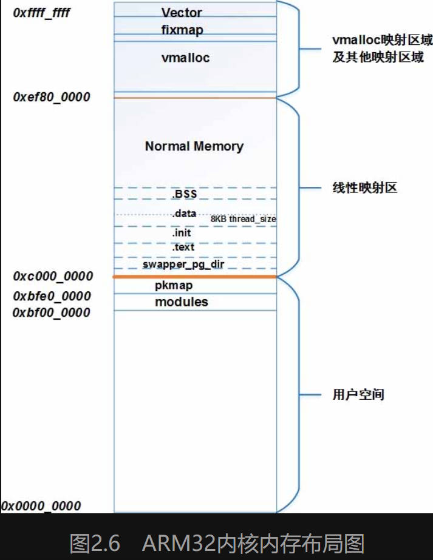

# 0. QEMU调试Linux
## kernel配置
为了简单，使用initramfs


## qemu
## qemu调试kernel
安装arm gdb
```shell
apt install gdb-arm-none-eabi
```


```shell
Kernel hacking -->
	Compile-time checks and compiler options -->
		[*] Compile the kernel with debug info

Gerneral setup -->
	[*] init ram filesystem 
		 (_install) initramfs source files

Boot options -->
	() default kernel command string

kernel features-->
	memory split (3G/1G user/kernel split) -->
		[*]high memory support
```

启动qemu

```shell
qemu-system-arm -M vexpress-a9 -smp 4 -m 1024M  \
	-kernel arch/arm/boot/zImage  \
	-append "rdinit=/linuxrc console=ttyAMA0 loglevel=8" \
	-dtb arch/arm/boot/dts/vexpress-v2p-ca9.dtb \
	-nographic \
	-S -s
```
-S : qemu会冻结CPU，直到远程GDB输入相应控制命令
-s : 在1234端口接受GDB的调试连接


另一个终端启动ARM gdb
```shell
arm-none-eabi-gdb --tui vmlinux
(gdb) target remote localhost:1234
(gdb) b start_kernel
(gdb) c
```

取消编译器优化
在源文件开头，写这句：（可以强制指定 本文件内以下源码全部O0编译）：
```c
#pragma GCC optimize ("O0")

// 单个函数
__attribute__((optimize("O0")))
```


# 1. 内存全景浏览

关键点：
MMU, 页表, 物理内存，物理页面，映射关系，按需分配，缺页中断，写时复制

物理内存和物理页面，接触到 struct pg_data_t , struct zone 和 struct page 。
怎么分配物理页面，接触伙伴系统机制，和页面分配器。

MMU的工作原理,
Linux内核如何建立页表映射，包括用户空间，内核空间页表的建立.
如何查询页表，修改页表。


物理内存怎么建立和虚拟内存的映射关系？
进程的虚拟内存用 struct vm_area_struct ，虚拟内存和物理内存采用建立页表的方法建立映射关系，
为什么进程地址空间建立映射的也页面有的叫匿名页面，有的叫page cache页面呢？


了解malloc怎么分配物理内存，接触到缺页中断

这时虚拟内存和物理内存已经建立和映射，这是以页为基础，如果需要小于一个页面的内存，slab机制就诞生了。

上面已经建立起虚拟内存和物理内存的基本框图，但是用户持续分配导致物理内存不足怎么办？
页回收机制和反向映射机制就产生了。

长时间运行后，产生大量碎片内存怎么办？
内存规整机制就产生了。

## 1.1 内存管理的硬件结构
### CPU获取内存数据

开启MMU后，CPU发出的地址被认为是虚拟地址，由MMU完成地址转换。
MMU根据页表进行地址转换，对于二级映射需要查询两次页表，而页表在RAM中，为了提升效率MMU由TLB缓存，缓存下最近查询的页表项。
如果TLB命中则直接转换成功，否则查询RAM中的页表，最后发出物理地址到L1缓存，
如果L1缓存没有命中，则查询L2缓存，如果没有命中，则查询RAM。
当物理内存紧缺时，可以将物理页面交换到flash的swap区

### MMU如何完成地址转换


TTBRx : arm寄存器，用于存储一级页表的基地址
L1 索引 20 ... 31 bit 共12bit用于存储二级页表项在一级页表中的索引号
L2 索引 12 ... 19 bit 共8bit 用于存储物理内存前缀在二级页表中的索引号
页索引  11 ... 0  bit 共12bit记录物理内存后部分的地址值

需要注意，地址转换为MMU硬件自动完成，软件只需要完成页表的初始化。

#### 为什么 huge page能减少tlb miss
每次tlb miss的惩罚是很大的，一次tlb miss会导致两次访问内存（对于二级映射）。所以减少tlb miss是很有用的。
使用 huge page 能减少tlb miss

上图中根据页索引可以看出page 大小为4K，相当于把虚拟内存按4K大小分割，再使用 L1 , L2 索引寻址。
如果使用 huge page，且 page的大小为2M，那么页索引部分能表示2M的空间，所以 L1, L2 部分变少。
对于访问2M的内存，使用4K page，最坏情况 tlb miss 512 次
使用2M page, 最坏情况 tlb miss 1 次

## 1.2 Linux内存模块全景图

* VMA : 用于管理用户进程的虚拟空间分配，注意内核的虚拟空间分配不使用VMA，由内核自己管理
* 缺页中断 : 由于用户进程虚拟空间和物理空间是迟绑定的，所以当用户进程访问虚拟空间时，若并没有分配物理页，则触发缺页中断，进行分配物理页面
* 匿名页面 : 匿名页面为进程的私有数据，没有关联文件，如 堆栈空间，mmap匿名映射的空间。由于是进程私有页面，不存在写回机制(所谓写回就是将数据写回到flash并释放内存)，但可以 swap 到flash
* page cache : 关联文件，为进程共有数据，有写回。当内存不足时会写回并回收page
* 页面回收：page管理会有水位，当水位较低时，暂停处理页面分配的申请，进行页面回收，回收的方式有 页面迁移，内存规则，OOM，当水位高时继续正常分配
* slab : 用于内核测分配小物理内存块，由于内核有很多数据结构会大量分配，可以分配一个page将其分割为固定大小的内存块(相当于内存池)，大小为具体数据结构的大小，此page就专门用于分配对于数据结构的内存。
* 伙伴系统：管理page分配
* 页表管理：
* 反向映射：根据page，找到关联的一个或多个vma，以找到进程记录该page的 pte，用于实现页面回收
* KSM : 页面合并，合并内容相同的匿名页面，主要用于KVM，比如主机启动多个KVM，其中大量匿名页面数据一样，就可以合并成一个，以释放页面。
* Huge page : 分配2M或1G的页，通常用于服务器，主要减少tlb miss
* 页迁移：迁移可迁移的页面到内存节点
* 内存规整：缓解内存碎片化
* OOM : 当内存紧缺无法通过迁移和碎片化等常规方式解决时，杀掉占用内存多的进程，强制回收page

## 1.3 虚拟空间和物理空间
### 1.3.1 从内核进程看内存

* 虚拟内存空间 : 由于CPU位数为32位，最大只有4GB寻址，所以虚拟内存空间固定为4GB，并且分割为内核空间和用户进程空间，分割比例可调节，默认为1:3
* 内核进程和用户进程 : 内核进程只有一个，用户进程由很多个，而用户进程都有内核态，所以每个用户进程的页表都有内核页表，并且所有用户进程的页表只有用户进程虚拟空间对应的页表项不同，内核虚拟空间对应的页表项相同，也就是说当一个用户进程成内核态时，它就成了内核进程，并且和其他进入内核态的用户进程共享虚拟内存空间，相当于他们是不同的内核线程
* 虚拟空间和页表 : 页表记录虚拟空间和物理空间的映射，4KB为单位（对于huge page是2MB或1GB），所以进程的虚拟空间大小决定了页表的总大小。
* 虚拟空间的使用 : 要使用虚拟空间，必须先建立对应的页表，这样MMU才能转换地址成功。
* 内核虚拟空间 : 内核必须要有使用所有物理内存的能力，但是虚拟空间不足，所以一部分虚拟空间必须为动态映射，所以内核的虚拟空间按照映射方式又分为线性映射区和高端映射区，通常线性映射区大小为760M。当物理内存足够小时，则没有高端映射区。
* 内存分配和虚拟地址转换 : 物理内存和虚拟内存是线性映射关系，所以内核即使不通过内存分配器也可以直接使用虚拟内存，但是要实现page的管理，所以必须经过内存分配器分配page，建立映射，再使用虚拟内存。
* 页表和线性映射区 : 虽然线性映射区的映射方式是简单的，但必须需要页表，因为CPU发出的地址信息都当作虚拟地址通过MMU进行转换，MMU不懂什么是线性映射，只知道查询TLB和页表，所以在开启MMU前需要建立页表，只是由于线性映射区的映射关系是静态的，所以页表可以预先建立
* 页表和高端映射区 : 由于高端映射区使用动态映射，所以不能预先建立，在需要使用高端映射区时(vmalloc)才分配虚拟空间和物理空间（来自高端内存），并建立映射关系（也就是构建对于虚拟空间的页表）

### 1.3.2 物理内存的管理

* page : page数据结构描述一个物理页面的属性，注意page不记录物理页面的基地址
* mem_map : 在内存初始化时，会分配一个数组mem_map，数组成员为page
* pfn : 某个page在mem_map中的索引号
* page得到物理页基地址的转换 : 由于page 和 物理内存页是线性映射关系，且页大小固定，所以知道 pfn 就可以知道相关page对应的物理页基地址
```c
#define	__phys_to_pfn(paddr)	((unsigned long)((paddr) >> PAGE_SHIFT))
#define	__pfn_to_phys(pfn)	((phys_addr_t)(pfn) << PAGE_SHIFT)
```
在分配物理内存，建立映射关系时，需要获得页的物理地址 : 只需要从mem_map中分配未使用的page，进而得到pfn，进而得到物理地址
* page的管理 : 对于物理内存空间，分为高端内存空间和低端内存空间，所以有各自的管理方式，用数据结构表示为zone，每个zone都有自己的伙伴系统，在zone初始化时将page加入伙伴系统，分配时从伙伴系统取出page，回收时将page放入伙伴系统

### 1.3.3 从用户进程看内存

虚拟空间的分区 : 编译器和操作系统将用户进程的虚拟空间进一步分区，不同的分区有不同的读写权限等。
mmap : 当用户进程使用brk等系统调用分配内存时，实际只分配了VMA，并使用链式和红黑树组织VMA，mmap为所有VMA的句柄
pgd : 记录进程的一级页表，在fork时复制父进程的一级页表内容，对于二级页表，内核虚拟地址对应的二级页表被所有进程共享，用户进程虚拟地址对应的二级页表在缺页映射时分配，并共享父进程的二级页表，但共享页表为只读权限
VMA : 表示已分配的虚拟内存空间，不一定映射了物理空间
缺页中断 : 使用虚拟内存按需映射物理内存。进程访问虚拟地址时，MMU发现没有对应页表，或只有读权限缺需要写(写时复制)，触发缺页中断。缺页中断进行查询是否分配了对应的VMA，没有则段错误。如果分配了VMA，则分配page或进行写时复制，并将新增映射关系写入页表。

内核进程由于预先建立了页表（线性映射区），所以直接访问内存也不会触发缺页中断。换个角度看，内核一开始就将所有的虚拟内存（线性映射区）当成已分配状态，所以不需要虚拟空间管理，也就不需要VMA

## 1.4 内存重要数据结构之间的关系


# 2. 物理内存
## 描述物理内存的数据结构
### pgdata
pgdata 为内存节点

当linux包含多个内存节点时，涉及内存节点的管理
有两种存储模型
* UMA 均匀存储访问，任意CPU访问任意内存节点的优先级一样
* NUMA 非均匀存储访问，CPU优先访问离自己近的内存节点
在服务器场景下，UMA模型下CPU常常跑到离自己远的内存节点，当然有解决方法。但总之NUMA更适合服务器场景，也更复制。
对于嵌入式场景，使用UMA。对于arm，通常只有一个pgdata.

```c
typedef struct pglist_data {

	// 1. ZONE相关
	// 自己的zone
	struct zone node_zones[MAX_NR_ZONES];
	// 本节点引用的所有zone，包括自己和其他pgdata的zone
	struct zonelist node_zonelists[MAX_ZONELISTS];
	// 自己zone的数量
	int nr_zones; /* number of populated zones in this node */

	// 2. 描述内存节点信息
	unsigned long node_start_pfn;
	unsigned long node_present_pages; /* total number of physical pages */
	unsigned long node_spanned_pages; /* total size of physical page */
	int node_id;

	// 3. 页面回收相关
	wait_queue_head_t kswapd_wait;
	wait_queue_head_t pfmemalloc_wait;
	struct task_struct *kswapd;
	int kswapd_order;
	enum zone_type kswapd_highest_zoneidx;
	...

} pg_data_t;


// UMA节点, 可见只有一个内存节点
extern struct pglist_data contig_page_data;
#define NODE_DATA(nid)		(&contig_page_data)
```

### zone
为什么要有zone？
因为物理内存不同区域的管理方式不同，如高端内存被动态映射，低端内存被线性映射，建立映射的算法不同，时间不同，而且高端内存的映射会被释放，低端内存的映射一只保留。另外还有DMA。
所以不同物理内存区域需要一个zone去描述。
```c
struct zone {
	// 水位管理
	unsigned long _watermark[NR_WMARK];
	unsigned long watermark_boost;

	struct pglist_data	*zone_pgdat;

	// 伙伴系统的数组
	struct free_area	free_area[MAX_ORDER];

	...
} ____cacheline_internodealigned_in_smp; // 让zone L1 cache对齐
```
- 水位管理 : 
  - 高水位 : 正常分配页面
  - 低水位 : 停止分配页面，进行页面回收
  - 最低水位 : 停止分配页面，考虑OOM

### page
```c
struct page {
	unsigned long flags; // 重要标志位集合

	union {
		struct {	/* Page cache and anonymous pages */

			struct list_head lru;
			struct address_space *mapping; // 页面指向的地址空间
			pgoff_t index;		// 对于文件映射，表示此page在文件中的偏移
			                    // 对于匿名页面，表示基于虚拟地址0x0的偏移量

		};
		...
	};

	union {		/* This union is 4 bytes in size. */

		atomic_t _mapcount;  // 页面被用户进程映射的数量, 也就是有多少个pte
		...
	};
	atomic_t _refcount; // 内核中引用该页面的计数, 如果为0，表示应该释放

	...
};
```

#### page 和 其他数据结构的转换
```c
#define __pfn_to_page(pfn)	(mem_map + ((pfn) - ARCH_PFN_OFFSET))
#define __page_to_pfn(page)	((unsigned long)((page) - mem_map) + \
				 ARCH_PFN_OFFSET)
```


## kernel如何知道可用的内存空间的地址范围？
dts中描述了内存资源
```dts
	memory@60000000 {
		device_type = "memory";
		reg = <0x60000000 0x40000000>;
	};
```

内核解析DTS，内存相关
```c
early_init_dt_scan_memory
	分析dts memory节点，获得物理地址 base size 参数,
	调用memblock_add 将 base size信息保存到 memblock.regions[0] 中
```

所以内核根据dts描述的硬件信息获得可用的物理地址范围
 dts --> memblock.regions[0]

## 物理内存的映射——内核的页表
linux使用虚拟地址，在汇编部分建立了零时的段表，
但是段表现在粒度太大，所以这里需要建立页表，
页表复用段表内存空间init\_mm，首先需要将段表空间清零，
```c
prepare_page_table
	遍历虚拟地址调用pmd_clear将对应的页表清零，这里只清零一级页表
	清空的虚拟地址包括
	0 - MODULES_VADDR
	MODULES_VADDR - PAGE_OFFSET
	__phys_to_virt(arm_lowmem_limit(低端物理内存的边界)/物理内存的结束地址) - VMALLOC_START

#define PGDIR_SHIFT		21

// 根据虚拟地址找到pgd页表项下标
#define pgd_index(addr)		((addr) >> PGDIR_SHIFT)

// 根据虚拟地址找到pgd页表项
#define pgd_offset(mm, addr)	((mm)->pgd + pgd_index(addr))

// init_mm 是kernel的pgd页表
#define pgd_offset_k(addr)	pgd_offset(&init_mm, addr)

// 只使用2级页表，则 pgd页表项对应一个pud页表项
static inline pud_t * pud_offset(pgd_t * pgd, unsigned long address)
{
	return (pud_t *)pgd;
}

// 只使用2级页表，则 pud页表项对应一个pmd页表项
static inline pmd_t * pmd_offset(pud_t * pud, unsigned long address)
{
	return (pmd_t *)pud;
}

static inline pmd_t *pmd_off_k(unsigned long virt)
{
	// pmd_offset( pud_offset( pgd页表项 , virt), virt);
	// pmd_offset( pud页表项 , virt);
	// pmd页表项
	return pmd_offset( pud_offset( pgd_offset_k(virt), virt), virt);
}


#define __pmd(x)        ((pmd_t) { (x) } )

#define pmd_clear(pmdp)			\
	do {				\
		pmdp[0] = __pmd(0);	\
		pmdp[1] = __pmd(0);	\
		clean_pmd_entry(pmdp);	\
	} while (0)

// pmd_clear(pmd页表项，也就是pgd页表项)
pmd_clear(pmd_off_k(addr)); // 将页表项置零 
                            // 注意 PGDIR_SHIFT 为21,所以每次操作两个pgd
							// 一个为Linux表，一个为ARM表

```

清零后，建立线性映射，被线性映射的物理内存称为低端内存。
```c
map_lowmem
	// kernel 代码段的起始和结束
	phys_addr_t kernel_x_start = round_down(__pa(_stext), SECTION_SIZE);
	phys_addr_t kernel_x_end = round_up(__pa(__init_end), SECTION_SIZE);

	// 映射所有的低端内存
	for_each_memblock(memory, reg) {
		// 获得可用的物理地址范围
		phys_addr_t start = reg->base;
		phys_addr_t end = start + reg->size;

		struct map_desc map;

		// 线性映射只针对低端物理内存
		if (end > arm_lowmem_limit)
			end = arm_lowmem_limit;
		if (start >= end)
			break;

		// 建立线性映射
		// 注意 kernel的代码段权限只读，
		// 所以物理地址若落在kernel代码段内则要单独映射
		if (end < kernel_x_start) {
			map.pfn = __phys_to_pfn(start);
			map.virtual = __phys_to_virt(start);
			map.length = end - start;
			map.type = MT_MEMORY_RWX;

			create_mapping(&map);
		} else if (start >= kernel_x_end) {
			map.pfn = __phys_to_pfn(start);
			map.virtual = __phys_to_virt(start);
			map.length = end - start;
			map.type = MT_MEMORY_RW;

			create_mapping(&map);
		} else {
			/* This better cover the entire kernel */
			if (start < kernel_x_start) {
				map.pfn = __phys_to_pfn(start);
				map.virtual = __phys_to_virt(start);
				map.length = kernel_x_start - start;
				map.type = MT_MEMORY_RW;

				create_mapping(&map);
			}

			map.pfn = __phys_to_pfn(kernel_x_start);
			map.virtual = __phys_to_virt(kernel_x_start);
			map.length = kernel_x_end - kernel_x_start;
			map.type = MT_MEMORY_RWX;

			create_mapping(&map);

			if (kernel_x_end < end) {
				map.pfn = __phys_to_pfn(kernel_x_end);
				map.virtual = __phys_to_virt(kernel_x_end);
				map.length = end - kernel_x_end;
				map.type = MT_MEMORY_RW;

				create_mapping(&map);
			}
```

## zone的初始化
建立线性映射后，内核可以对内存进行管理，但是内核不是统一对待这些页面，而是采用区块zone的方式来管理。
struct zone成员
```c
// zone经常被访问，所以需要以 L1 cache对齐
struct zone {
	unsigned long watermark[NR_WMARK]; // 页面分配和回收使用

	long lowmem_reserve[MAX_NR_ZONES];

#ifdef CONFIG_NUMA
	int node;
#endif

	struct pglist_data	*zone_pgdat;         // 指向内存节点
	struct per_cpu_pageset __percpu *pageset; // 一部分页面构造percpu副本，减少自旋锁使用

	/* zone_start_pfn == zone_start_paddr >> PAGE_SHIFT */
	unsigned long		zone_start_pfn;  // 开始页面页帧号

	unsigned long		managed_pages;  // zone中被伙伴系统管理的页面数量
	unsigned long		spanned_pages;  // zone中包含的页面数量
	unsigned long		present_pages;  // zone中实际管理的页面数量,有些体系结构下和spanned_pages相等

	const char		*name;

	/* free areas of different sizes */
	struct free_area	free_area[MAX_ORDER]; // 空闲区域数组

	/* Write-intensive fields used from the page allocator */
	spinlock_t		lock;  // 并行访问时用于保护zone的自旋锁

	/* Fields commonly accessed by the page reclaim scanner */
	spinlock_t		lru_lock;  // 对zone中LRU链表并行访问时进行保护的自旋锁
	struct lruvec		lruvec; // LRU链表集合

	/* Zone statistics */
	atomic_long_t		vm_stat[NR_VM_ZONE_STAT_ITEMS]; // zone计数
} ____cacheline_internodealigned_in_smp;
```

通常zone有 ZONE_DMA ZONE_DMA32 ZONE_NORMAL ZONE_HIGHMEM
但arm只有 ZONE_NORMAL ZONE_HIGHMEM

要让zone来管理page，就要让zone知道自己能管理的page的范围。
在find_limit()中计算出 min_low_pfn, max_low_pfn, max_pfn.
min_low_pfn: 物理内存开始地址的页帧号,同时也是normal区域起始页帧号
max_low_pfn: normal区域的结束页帧号
max_pfn: 内存块结束地址页帧号


从kernel启动看物理空间和虚拟空间
```shell
// 物理空间
// 可以看出有两个zone, Normal zone , high zone
  Normal zone: 1520 pages used for memmap
  Normal zone: 0 pages reserved
  Normal zone: 194560 pages, LIFO batch:31
  HighMem zone: 67584 pages, LIFO batch:15

// 虚拟空间
// lowmem 映射 normal zone
// 0xef800000 - 0xc0000000 / 4096 = 194560 pages
// 线性映射关系： 
// 见后面 _virt_to_phys , _phys_to_virt
// 0xef800000 - PAGE_OFFSET(0xc0000000) + PHY_OFFSET(0x60000000) = 0x8f800000(arm_lowmem_limit)
Virtual kernel memory layout:
    vector  : 0xffff0000 - 0xffff1000   (   4 kB)
    fixmap  : 0xffc00000 - 0xfff00000   (3072 kB)
    vmalloc : 0xf0000000 - 0xff000000   ( 240 MB)
    lowmem  : 0xc0000000 - 0xef800000   ( 760 MB)
    pkmap   : 0xbfe00000 - 0xc0000000   (   2 MB)
    modules : 0xbf000000 - 0xbfe00000   (  14 MB)
      .text : 0xc0008000 - 0xc060a270   (6153 kB)
      .init : 0xc060b000 - 0xc13e8000   (14196 kB)
      .data : 0xc13e8000 - 0xc140f3c0   ( 157 kB)
       .bss : 0xc140f3c0 - 0xc1438bf0   ( 167 kB)
```

zone的初始化函数 : free_area_init_core

另一个和zone相关数据结构：zonelist。
伙伴系统从zonelist开始分配内存，zonelist有一个zoneref数组，数组元素的成员有一个zone指针。
zoneref数组的第一个成员指向的zone是页面分配器的第一个候选者，若第一个候选者分配失败之后才考虑其他成员，优先级逐渐降低。
初始化zonelist的函数 build_zonelists_node


```c
enum zone_type {
	ZONE_NORMAL,
	ZONE_HIGHMEM,
	__MAX_NR_ZONES
};

static int build_zonelists_node(pg_data_t *pgdat, struct zonelist *zonelist,
				int nr_zones)
{
	struct zone *zone;
	enum zone_type zone_type = MAX_NR_ZONES;

	do {
		zone_type--;
		zone = pgdat->node_zones + zone_type;
		if (populated_zone(zone)) {
			zoneref_set_zone(zone,
				&zonelist->_zonerefs[nr_zones++]);
			check_highest_zone(zone_type);
		}
	} while (zone_type);

	return nr_zones;
}
```
初始化后： 
```c
  _zonerefs[0]->zone_index = 1 --> ZONE_HIGHMEM
  _zonerefs[1]->zone_index = 0 --> ZONE_NORMAL
```
所以先从高端内存分配


另一个重要的全局变量 mem_map
它是struct page数组，实现快速把虚拟地址映射到物理地址，线性映射。
它的初始化 free_area_init_node -> alloc_node_mem_map

所以对于同个page可能同时被多种映射，如果是低端内存就一定被线性映射，mem_map
也可能有非线性映射 那么从 zone中分配page，再分配个虚拟空间，建立Vmalloc映射

## 虚拟空间划分
32bit Linux 共有虚拟空间 4GB，用户空间和内核空间可以配置。
```c
CONFIG_PAGE_OFFSET
```

设置会影响 PAGE_OFFSET值，这个值也被用于做线性映射的偏移值。
```c
/* PAGE_OFFSET - the virtual address of the start of the kernel image */
#define PAGE_OFFSET		UL(CONFIG_PAGE_OFFSET)
```

线性映射的计算
```c
/*
 * PHYS_OFFSET : 物理内存的起始地址
 */
static inline phys_addr_t __virt_to_phys(unsigned long x)
{
	return (phys_addr_t)x - PAGE_OFFSET + PHYS_OFFSET;
}

static inline unsigned long __phys_to_virt(phys_addr_t x)
{
	return x - PHYS_OFFSET + PAGE_OFFSET;
}
```

## 物理内存的初始化
内核知道物理内存的地址范围和各种zone的布局后，page就要加入伙伴系统。
每个zone 都有一个free_area，这就是伙伴系统管理的基础。
所以每个zone都有一个伙伴系统。
zone有free_area成员，free_area为个类型的链表,为了缓解内存碎片化, 引入类型, 注意迁移类型的最小单元不是page，而是pageblock

```c
struct zone {
	..
	struct free_area free_area[MAX_ORDER];
	..
};

struct free_area {
	struct list_head free_list[MIGRATE_TYPES];
	unsigned long nr_free;
};


enum {
	MIGRATE_UNMOVABLE, // 在内存中有固定位置，不能随意移动，比如内核态分配的内存
	MIGRATE_RECLAIMABLE, // 不能移动，但可以删除回收，比如文件映射
	MIGRATE_MOVABLE, // 可以随意移动，用户态分配的内存
	MIGRATE_PCPTYPES,	/* the number of types on the pcp lists */
	MIGRATE_RESERVE = MIGRATE_PCPTYPES,
	MIGRATE_TYPES
};
```


伙伴系统的特点是：
内存块是2的order幂，把所有空闲的页面分组成11个内存块链表，
每个链表分布包括 1,2,4,...1024个连续的page。
1024个page对应4MB大小的连续物理内存

从/porc/pagetypeinfo可以知道page在链表的分布


存放在2^10链表中的page又被称为pageblock，他们是大小为 4MB

思考，物理页面是如何添加到伙伴系统？是一页一页添加，还是以2的几次幂添加？


```c
// start_kernel -> mm_init -> mem_init -> free_all_bootmem -> free_low_memory_core_early
// 将低端物理内存加入伙伴系统
static unsigned long __init free_low_memory_core_early(void)
{
	unsigned long count = 0;
	phys_addr_t start, end;
	u64 i;

	memblock_clear_hotplug(0, -1);

	// 遍历memblock.memory 其记录了可用的物理内存块范围
	// 得到start end
	for_each_free_mem_range(i, NUMA_NO_NODE, &start, &end, NULL)
		count += __free_memory_core(start, end);

	return count;
}
```

```c
static unsigned long __init __free_memory_core(phys_addr_t start,
				 phys_addr_t end)
{
	unsigned long start_pfn = PFN_UP(start); // 获得startd对应的物理页帧号，注意是上取整，如start位于0 - 1 物理页帧之间，则返回1
	unsigned long end_pfn = min_t(unsigned long,
				      PFN_DOWN(end), max_low_pfn); // 取end下取整的物理页帧号， max_low_pfn 为lowmem的最大页帧号

	if (start_pfn > end_pfn)
		return 0;

	__free_pages_memory(start_pfn, end_pfn);

	return end_pfn - start_pfn;
}

/*
 * 这段代码可以看出page会尽可能加入大的order
 */
static void __init __free_pages_memory(unsigned long start, unsigned long end)
{
	int order;

	while (start < end) {
		/*
		 * 为了尽可能创建大块连续物理内存块，
		 *
		 * 找order也就是找对齐值
		 *
		 * __ffs(x) : ffs(x) - 1
		 * ffs(x)   : 计算x中第一个bit为1的位置
		 *            如ffs(0x63300)，则__ffs(0x63300)为8
		 *            那么这里order为8
		 */
		order = min(MAX_ORDER - 1UL, __ffs(start));

		while (start + (1UL << order) > end)  // 1 << order 是free的page数量
			order--;

		__free_pages_bootmem(pfn_to_page(start), order); // 从start开始释放 1 << order个page

		start += (1UL << order);
	}
}

void __init __free_pages_bootmem(struct page *page, unsigned int order)
{
	unsigned int nr_pages = 1 << order;
	struct page *p = page;
	unsigned int loop;

	page_zone(page)->managed_pages += nr_pages; // 伙伴系统增加管理页面数量
	set_page_refcounted(page); // 设置page的引用计数为1
	__free_pages(page, order); // 添加到伙伴系统, 可以通过 page_zone(page) 获得page所在的zone，所以不需要传递zone参数
}
```

下面是向系统添加一段内存的情况，页帧号范围：[0x8800e, 0xaecea]
可以发现，一开始地址只能对齐order较低的情况，后面都以order=10也就是0x400对齐。


# 页表的映射过程
思考：
	内核空间的页表存放在什么位置?

## ARM32页表映射
### 虚拟地址结构
32bit Linux一般采用3层映射模型，PGD(页面目录), PMD(页面中间目录), PTE(页面映射表)
ARM32 中只用到两层，所以实际代码需要将 PGD 和 PMD 合并。
另外ARM32也可以用段映射，是一层映射模型。
对于页面映射，可以选择64KB的页，和4KB的小页。
默认采用4KB大小的页面。


采用段映射的虚拟地址结构：
31-12 : 段地址
11-0  : 段内偏移

采用页表映射模式的虚拟地址结构
31-20 : PGD地址
19-12 : PTE地址(256项)
11-0  : 页内偏移

当内存映射开启后，CPU放出的地址，只传递给MMU，MMU将认为是虚拟地址，映射成物理地址，发给ddr

实际代码中页表映射模式的虚拟地址结构
```c
// PMD 和 PGD 等价
#define PMD_SHIFT		21
#define PGDIR_SHIFT		21

#define PMD_SIZE		(1UL << PMD_SHIFT)
#define PMD_MASK		(~(PMD_SIZE-1))
#define PGDIR_SIZE		(1UL << PGDIR_SHIFT)
#define PGDIR_MASK		(~(PGDIR_SIZE-1))
```
需要注意ARM支持的页表模式的虚拟地址结构，PGD地址占20bit，但是Linux却使用21bit
因为一个page为4KB，而一个PGD项对应256个PTE，占用256\*4 = 1024字节，
又有arm 和 Linux两个PGD，占用512个PTE，占用2048字节，
所以一个page可以给两个PGD分配，所以linux使用21bit

### create_mapping
create_mapping 用于给定空间建立映射。
该函数使用 map_desc 描述内存区间
```c
struct map_desc {
	unsigned long virtual; // 起始虚拟地址
	unsigned long pfn;     // 起始物理页帧号
	unsigned long length;  // 空间大小
	unsigned int type;     // 权限
};
```

```c
static void __init create_mapping(struct map_desc *md)
{
	unsigned long addr, length, end;
	phys_addr_t phys;
	const struct mem_type *type;
	pgd_t *pgd;

	addr = md->virtual & PAGE_MASK;
	phys = __pfn_to_phys(md->pfn);  // 获得物理地址
	length = PAGE_ALIGN(md->length + (md->virtual & ~PAGE_MASK)); // 映射大小

	pgd = pgd_offset_k(addr); // 获得PGD页表项
	end = addr + length; // 结束物理地址
	do {
		unsigned long next = pgd_addr_end(addr, end); // 下一次映射的起始物理地址
		                                              // 一次映射 PGDIR_SIZE 大小的空间，也就是 2MB

		alloc_init_pud(pgd, addr, next, phys, type);

		phys += next - addr;
		addr = next;
	} while (pgd++, addr != end);
}


#define pgd_offset_k(addr)	pgd_offset(&init_mm, addr)
#define pgd_offset(mm, addr)	((mm)->pgd + pgd_index(addr)) // 这里看出 init_mm.pgd 记录内核页表地址
#define pgd_index(addr)		((addr) >> PGDIR_SHIFT)

struct mm_struct init_mm = {
	...
	.pgd		= swapper_pg_dir, // 内存页表存放在这里
	...
};

#define pgd_addr_end(addr, end)						\
({	unsigned long __boundary = ((addr) + PGDIR_SIZE) & PGDIR_MASK;	\
	(__boundary - 1 < (end) - 1)? __boundary: (end);		\
})

typedef struct { pmdval_t pgd[2]; } pgd_t; // pgd++ 移动两个PGD页表项
typedef u32 pmdval_t;

//-------------------------------------------------------------------------------

static void __init alloc_init_pud(pgd_t *pgd, unsigned long addr,
				  unsigned long end, phys_addr_t phys,
				  const struct mem_type *type)
{
	pud_t *pud = pud_offset(pgd, addr); // pgd项和pud项等价
	unsigned long next;

	do {
		next = pud_addr_end(addr, end);
		alloc_init_pmd(pud, addr, next, phys, type);
		phys += next - addr;
	} while (pud++, addr = next, addr != end); // 由于next等于end所以只循环一次
}

static inline pud_t * pud_offset(pgd_t * pgd, unsigned long address)
{
	return (pud_t *)pgd;
}

#define pud_addr_end(addr, end)			(end)

//-------------------------------------------------------------------------------

static void __init alloc_init_pmd(pud_t *pud, unsigned long addr,
				      unsigned long end, phys_addr_t phys,
				      const struct mem_type *type)
{
	pmd_t *pmd = pmd_offset(pud, addr); // pmd 和 pud等价
	unsigned long next;

	do {
		next = pmd_addr_end(addr, end); // next 等于 end

		if (type->prot_sect &&
				((addr | next | phys) & ~SECTION_MASK) == 0) {
			__map_init_section(pmd, addr, next, phys, type); // ?
		} else {
			alloc_init_pte(pmd, addr, next,
						__phys_to_pfn(phys), type);
		}

		phys += next - addr;

	} while (pmd++, addr = next, addr != end); // 由于 next 等于 end 所以只循环一次
}

static inline pmd_t *pmd_offset(pud_t *pud, unsigned long addr)
{
	return (pmd_t *)pud;
}

#define pmd_addr_end(addr,end) (end)

#define	__phys_to_pfn(paddr)	((unsigned long)((paddr) >> PAGE_SHIFT))
#define	__pfn_to_phys(pfn)	((phys_addr_t)(pfn) << PAGE_SHIFT)


//-------------------------------------------------------------------------------

static void __init alloc_init_pte(pmd_t *pmd, unsigned long addr,
				  unsigned long end, unsigned long pfn,
				  const struct mem_type *type)
{
	pte_t *pte = early_pte_alloc(pmd, addr, type->prot_l1); // 分配page用作pte表，返回pte表的基地址
	do {
		set_pte_ext(pte, pfn_pte(pfn, __pgprot(type->prot_pte)), 0); // 设置PTE页表项,包括Linux 和 arm
		pfn++;
	} while (pte++, addr += PAGE_SIZE, addr != end); // 从最前面可知 end 和addr差了 2MB，而这里一次映射4KB，所以需要循环 512次
}

#define pfn_pte(pfn,prot)	__pte(__pfn_to_phys(pfn) | pgprot_val(prot)) // 获得pte项填充内容
#define set_pte_ext(ptep,pte,ext) cpu_set_pte_ext(ptep,pte,ext)

static pte_t * __init early_pte_alloc(pmd_t *pmd, unsigned long addr, unsigned long prot)
{
	if (pmd_none(*pmd)) {
		pte_t *pte = early_alloc(PTE_HWTABLE_OFF + PTE_HWTABLE_SIZE); // 1024 * sizeof(pte) = 4KB ，刚好是一个page大小
		                                                              // 知道一个PGD项对应256项PTE，
																	  // 所以这里实际映射两个 PGD项，也就是512个PTE
																	  // 又有Linux 和 arm 两种PTE，各2个，共4个，所以为1024个pte
		__pmd_populate(pmd, __pa(pte), prot); // 填充PGD项，使其指向PTE表
	}
	BUG_ON(pmd_bad(*pmd));
	return pte_offset_kernel(pmd, addr);
}

typedef struct { pteval_t pte; } pte_t;
typedef u32 pteval_t;

#define PTRS_PER_PTE		512
#define PTRS_PER_PMD		1
#define PTRS_PER_PGD		2048

#define PTE_HWTABLE_PTRS	(PTRS_PER_PTE)
#define PTE_HWTABLE_OFF		(PTE_HWTABLE_PTRS * sizeof(pte_t)) // 512
#define PTE_HWTABLE_SIZE	(PTRS_PER_PTE * sizeof(u32)) // 512

#define pmd_none(pmd)		(!pmd_val(pmd))
#define pmd_val(x)      ((x).pmd)

static void __init *early_alloc(unsigned long sz)
{
	return early_alloc_aligned(sz, sz);
}
static void __init *early_alloc_aligned(unsigned long sz, unsigned long align)
{
	void *ptr = __va(memblock_alloc(sz, align));
	memset(ptr, 0, sz);
	return ptr;
}

#define __pa(x)			__virt_to_phys((unsigned long)(x))

static inline phys_addr_t __virt_to_phys(unsigned long x)
{
	return (phys_addr_t)x - PAGE_OFFSET + PHYS_OFFSET;
}

static inline unsigned long __phys_to_virt(phys_addr_t x)
{
	return x - PHYS_OFFSET + PAGE_OFFSET;
}

#define pte_offset_kernel(pmd,addr)	(pmd_page_vaddr(*(pmd)) + pte_index(addr)) // pte表基地址加偏移，得到pte项的地址

static inline pte_t *pmd_page_vaddr(pmd_t pmd)
{
	return __va(pmd_val(pmd) & PHYS_MASK & (s32)PAGE_MASK); // 取高[31-12]位，这是pte表的地址
}

#define pmd_val(x)      ((x).pmd)

#define pte_index(addr)		(((addr) >> PAGE_SHIFT) & (PTRS_PER_PTE - 1)) // addr计算出页表项的下标，再乘以4字节

static inline void __pmd_populate(pmd_t *pmdp, phys_addr_t pte,
				  pmdval_t prot)
{
	pmdval_t pmdval = (pte + PTE_HWTABLE_OFF) | prot; // 注意pte地址本身是4KB对齐的，所以低12位没有用，可以设置其他内容
	pmdp[0] = __pmd(pmdval); // 填充Linux PGD项
	pmdp[1] = __pmd(pmdval + 256 * sizeof(pte_t)); // 填充ARM PGD项
	flush_pmd_entry(pmdp);
}
```

# 如何遍历页表 wakl_pgd
```c
static void walk_pgd(struct pg_state *st, struct mm_struct *mm,
			unsigned long start)
{
	pgd_t *pgd = pgd_offset(mm, 0UL); // 找到第一个 pgd项
			pgd_offset_pgd((mm)->pgd, 0UL)
				pgd + pgd_index(0UL);
					pgd + (((a) >> PGDIR_SHIFT) & (PTRS_PER_PGD - 1))
	unsigned i;
	unsigned long addr;

#define PTRS_PER_PGD		2048        // 一共有 2048个pgd
	for (i = 0; i < PTRS_PER_PGD; i++, pgd++) { // 遍历 pgd 表
		addr = start + i * PGDIR_SIZE; // PGDIR_SIZE 是一个pgd项映射的虚拟空间大小
									   // addr 为当前pgd项对应虚拟地址，偏移 start 字节
			addr = start + i * (1UL << PGDIR_SHIFT);

		if (!pgd_none(*pgd)) { // 这里恒为假
			walk_p4d(st, pgd, addr); // 一定走这里
		} else {
			note_page(st, addr, 1, pgd_val(*pgd), NULL);
		}
	}
}

static void walk_p4d(struct pg_state *st, pgd_t *pgd, unsigned long start)
{
	p4d_t *p4d = p4d_offset(pgd, 0); // 对于ARM32为2级页表，不存在 p4d
		return (p4d_t *)pgd;

	unsigned long addr;
	unsigned i;

#define PTRS_PER_P4D		1
	for (i = 0; i < PTRS_PER_P4D; i++, p4d++) {
		addr = start + i * P4D_SIZE;
		if (!p4d_none(*p4d)) {
			walk_pud(st, p4d, addr);
		} else {
			note_page(st, addr, 2, p4d_val(*p4d), NULL);
		}
	}
}

static void walk_pud(struct pg_state *st, p4d_t *p4d, unsigned long start)
{
	pud_t *pud = pud_offset(p4d, 0);
		return (pud_t *)p4d;

	unsigned long addr;
	unsigned i;

#define PTRS_PER_PUD	1
	for (i = 0; i < PTRS_PER_PUD; i++, pud++) {
		addr = start + i * PUD_SIZE;
		if (!pud_none(*pud)) {
			walk_pmd(st, pud, addr);
		} else {
			note_page(st, addr, 3, pud_val(*pud), NULL);
		}
	}
}

static void walk_pmd(struct pg_state *st, pud_t *pud, unsigned long start)
{
	pmd_t *pmd = pmd_offset(pud, 0);
		return (pmd_t *)pud;

	unsigned long addr;
	unsigned i;
	const char *domain;

#define PTRS_PER_PMD		1
	for (i = 0; i < PTRS_PER_PMD; i++, pmd++) {
		addr = start + i * PMD_SIZE;
		domain = get_domain_name(pmd);
		if (pmd_none(*pmd) || pmd_large(*pmd) || !pmd_present(*pmd))
			note_page(st, addr, 4, pmd_val(*pmd), domain);
		else
			walk_pte(st, pmd, addr, domain);

		if (SECTION_SIZE < PMD_SIZE && pmd_large(pmd[1])) {
			addr += SECTION_SIZE;
			pmd++;
			domain = get_domain_name(pmd);
			note_page(st, addr, 4, pmd_val(*pmd), domain);
		}
	}
}

static void walk_pte(struct pg_state *st, pmd_t *pmd, unsigned long start,
		     const char *domain)
{
	pte_t *pte = pte_offset_kernel(pmd, 0);
		return (pte_t *)pmd_page_vaddr(*pmd) + pte_index(address);
			// pmd 就是 pgd， pgd的值高20位为 pte表的地址信息
			// 此地址是物理地址，需要转成虚拟地址
			return (pte_t *)__va(pmd_val(pmd) & PHYS_MASK & (s32)PAGE_MASK); + pte_index(address);
				// 再根据目标虚拟地址高20位作为 pte表的索引值，相加得到pte项
				return (pte_t *)__va(pmd_val(pmd) & PHYS_MASK & (s32)PAGE_MASK) +  \
				(address >> PAGE_SHIFT) & (PTRS_PER_PTE - 1);

	unsigned long addr;
	unsigned i;

#define PTRS_PER_PTE		512 // pte表共有512项
	for (i = 0; i < PTRS_PER_PTE; i++, pte++) {
		addr = start + i * PAGE_SIZE; // 获得当前pte项对应的虚拟空间的基地址
		note_page(st, addr, 5, pte_val(*pte), domain);
	}
}
```

## 如何根据虚拟地址找到对应的物理地址
```c
//首先获得mm, 虚拟地址addr

// 获得管理此虚拟地址的pgd
pgd_t *pgd;
pgd = pgd_offset(mm, addr);

// 获得 pmd
p4d_t *p4d;
p4d = p4d_offset(pdg, addr);

pud_t *pud;
pud = pud_offset(pdg, addr);

pmd_t *pmd;
pmd = pmd_offset(pdg, addr);


// 使用 pte_offset_kernel 得到对应的pte项
pte_t *ptep = pte_offset_kernel(pmd, addr);
pte_t pte = READ_ONCE(*ptep);
printk("pte : %X\n", pte_val(pte));

// 计算物理地址
unsigned int phys = ((pte_val(pte) >> PAGE_SHIFT) << PAGE_SHIFT) | (addr & ((1 << PAGE_SHIFT ) - 1));
```

# 内存的布局图
思考：
	32bit Linux中 ，内核空间线性映射的虚拟地址和物理地址是如何转换？
	32bit Linux中，高端内存起始地址如何计算出来的？
	画出arm32 Linux内核布局图

用户空间和内核空间的比例通常是3:1，内核空间只有1GB，其中部分用于直接映射物理内存，称为线性映射区，
在32bit arm Linux物理地址[0:760MB]被映射到虚拟地址[3GB:3GB+760MB]，
虚拟地址和物理地址的差值为PAGE_OFFSET，即3GB。

线性映射区，虚拟地址和物理地址的转换
```c
#define __pa(x)			__virt_to_phys((unsigned long)(x))
#define __va(x)			((void *)__phys_to_virt((phys_addr_t)(x)))

static inline phys_addr_t __virt_to_phys(unsigned long x)
{
	return (phys_addr_t)x - PAGE_OFFSET + PHYS_OFFSET;
}

static inline unsigned long __phys_to_virt(phys_addr_t x)
{
	return x - PHYS_OFFSET + PAGE_OFFSET;
}
```
PHYS_OFFSET : 内存物理地址的起始地址


那么高端内存的起始地址是如何确定的呢？

```c
static void * __initdata vmalloc_min =
	(void *)(VMALLOC_END - (240 << 20) - VMALLOC_OFFSET); // 结果为760MB

void __init sanity_check_meminfo(void)
{
	phys_addr_t memblock_limit = 0;
	int highmem = 0;
	phys_addr_t vmalloc_limit = __pa(vmalloc_min - 1) + 1;
	struct memblock_region *reg;

	for_each_memblock(memory, reg) {
		phys_addr_t block_start = reg->base;
		phys_addr_t block_end = reg->base + reg->size;
		phys_addr_t size_limit = reg->size;

		if (reg->base >= vmalloc_limit)
			highmem = 1;
		else
			size_limit = vmalloc_limit - reg->base;


		if (!highmem) {
			if (block_end > arm_lowmem_limit) {
				if (reg->size > size_limit)
					arm_lowmem_limit = vmalloc_limit; // 低端物理内存最多到 vmalloc_limit
				else
					arm_lowmem_limit = block_end;
			}

			if (!memblock_limit) {
				if (!IS_ALIGNED(block_start, SECTION_SIZE))
					memblock_limit = block_start;
				else if (!IS_ALIGNED(block_end, SECTION_SIZE))
					memblock_limit = arm_lowmem_limit;
			}

		}
	}

	high_memory = __va(arm_lowmem_limit - 1) + 1; // 确定高端虚拟内存

	if (memblock_limit)
		memblock_limit = round_down(memblock_limit, SECTION_SIZE);
	if (!memblock_limit)
		memblock_limit = arm_lowmem_limit;

	memblock_set_current_limit(memblock_limit);
}
```
内核剩下的264MB高端虚拟内存，用于做什么呢？
保留给vmalloc fixmap和高端向量表使用。
内核很多驱动使用vmalloc分配连续虚拟内存，因为驱动不需要使用连续的物理内存，
vmalloc还能用于高端物理内存的临时映射。一个32bit系统实际的物理内存会超过内核线性映射的长度，但内核要有对所有内存寻找的能力。


内核将物理内存低于760MB的称为线性映射内存（Normal memory），高于760MB的称为高端内存（high memory），
由于32位系统只有4GB寻址空间，对于物理内存高于760MB，低于4GB的情况，可以从保留的240MB虚拟地址空间划分一部分用于动态映射高端内存，
这样内存就可以访问到全部4GB物理内存。
如果物理内存高于4GB，则需要LPE机制扩展物理内存的访问。
用于访问高端内存的虚拟内存是有限的，一部分为临时映射，一部分为固定映射。pkmap就是固定映射。

# 分配物理页面
前面使用过memblock_alloc分配物理内存块，并返回虚拟地址，memblock_alloc在 memblock.region 中查找可用的内存区域，并从中分配所需的内存块。分配内存时，memblock_alloc 会将所选的空闲内存区域从 memblock.region 中删除，并将其标记为已分配状态。
这种分配是不细致的，伙伴系统是基于memblock.regions实现的，实现更好的物理内存管理。

memblock.region 描述的是物理内存的分布情况，包括空闲区域和已经分配的区域等。在 Linux 内核中，伙伴系统是一种用于管理可变大小内存块的内存分配器，它是建立在物理内存之上的，即 memblock.region 描述的物理内存。


## 伙伴系统分配物理内存

alloc_pages是伙伴系统分配物理内存的接口，用于分配一个或多个连续的物理内存页，大小必须是2的整数幂次，
分配连续的物理页，有助于减少内存碎片化，但即使如此内存碎片化也就是令人头痛的问题。
```c
struct page *alloc_pages(gfp_t gfp_mask, unsigned int order);
```
gfp_mask 称为分配掩码，分为两类：
一类叫 zone modifiers : 用于指定从哪个zone中分配页面，由掩码低4位表示，分别为
```c
#define __GFP_DMA	((__force gfp_t)___GFP_DMA)
#define __GFP_HIGHMEM	((__force gfp_t)___GFP_HIGHMEM)
#define __GFP_DMA32	((__force gfp_t)___GFP_DMA32)
#define __GFP_MOVABLE	((__force gfp_t)___GFP_MOVABLE)  /* Page is movable */
#define GFP_ZONEMASK	(__GFP_DMA|__GFP_HIGHMEM|__GFP_DMA32|__GFP_MOVABLE)
```
另一类叫 action modifiers，决定分配行为，
```c
#define __GFP_WAIT	((__force gfp_t)___GFP_WAIT)	/* Can wait and reschedule? */
#define __GFP_HIGH	((__force gfp_t)___GFP_HIGH)	/* Should access emergency pools? */
#define __GFP_IO	((__force gfp_t)___GFP_IO)	/* Can start physical IO? */
#define __GFP_FS	((__force gfp_t)___GFP_FS)	/* Can call down to low-level FS? */
#define __GFP_COLD	((__force gfp_t)___GFP_COLD)	/* Cache-cold page required */
#define __GFP_NOWARN	((__force gfp_t)___GFP_NOWARN)	/* Suppress page allocation failure warning */
#define __GFP_REPEAT	((__force gfp_t)___GFP_REPEAT)	/* See above */
#define __GFP_NOFAIL	((__force gfp_t)___GFP_NOFAIL)	/* See above */
#define __GFP_NORETRY	((__force gfp_t)___GFP_NORETRY) /* See above */
#define __GFP_MEMALLOC	((__force gfp_t)___GFP_MEMALLOC)/* Allow access to emergency reserves */
#define __GFP_COMP	((__force gfp_t)___GFP_COMP)	/* Add compound page metadata */
#define __GFP_ZERO	((__force gfp_t)___GFP_ZERO)	/* Return zeroed page on success */
#define __GFP_NOMEMALLOC ((__force gfp_t)___GFP_NOMEMALLOC) /* Don't use emergency reserves.
							 * This takes precedence over the
							 * __GFP_MEMALLOC flag if both are
							 * set
							 */
#define __GFP_HARDWALL   ((__force gfp_t)___GFP_HARDWALL) /* Enforce hardwall cpuset memory allocs */
#define __GFP_THISNODE	((__force gfp_t)___GFP_THISNODE)/* No fallback, no policies */
#define __GFP_RECLAIMABLE ((__force gfp_t)___GFP_RECLAIMABLE) /* Page is reclaimable */
#define __GFP_NOTRACK	((__force gfp_t)___GFP_NOTRACK)  /* Don't track with kmemcheck */

#define __GFP_NO_KSWAPD	((__force gfp_t)___GFP_NO_KSWAPD)
#define __GFP_OTHER_NODE ((__force gfp_t)___GFP_OTHER_NODE) /* On behalf of other node */
#define __GFP_WRITE	((__force gfp_t)___GFP_WRITE)	/* Allocator intends to dirty page */
```


alloc_pages首先要根据 gfp_mask 决定从哪个zone分配
```c
static inline struct page *alloc_pages_node(int nid, gfp_t gfp_mask,
						unsigned int order)
{
	/* Unknown node is current node */
	if (nid < 0)
		nid = numa_node_id();

	return __alloc_pages(gfp_mask, order, node_zonelist(nid, gfp_mask) /*根据node id 和 gfp_mask，找到从哪个zonelist分配*/);
}

struct page *
__attribute__((optimize("O0")))
__alloc_pages_nodemask(gfp_t gfp_mask /*GFP_KERNEL*/, unsigned int order,
			struct zonelist *zonelist, nodemask_t *nodemask)
{
	struct zoneref *preferred_zoneref;
	struct page *page = NULL;
	unsigned int cpuset_mems_cookie;
	int alloc_flags = ALLOC_WMARK_LOW|ALLOC_CPUSET|ALLOC_FAIR;
	gfp_t alloc_mask; /* The gfp_t that was actually used for allocation */
	struct alloc_context ac = {
		.high_zoneidx = gfp_zone(gfp_mask),  // ZONE_NORMAL(0) 表示使用哪个zone分配
		.nodemask = nodemask,                // 0x0
		.migratetype = gfpflags_to_migratetype(gfp_mask), // 0x0 MIGRATE_UNMOVABLE, 将gfp_mask转换为migrate类型
	};

	...

	// 首先从空闲的page分配，理想情况会成功
	page = get_page_from_freelist(alloc_mask, order, alloc_flags, &ac);
	if (unlikely(!page)) {
		alloc_mask = memalloc_noio_flags(gfp_mask);
		page = __alloc_pages_slowpath(alloc_mask, order, &ac);
	}

	...

	return page;
}

static struct page *
get_page_from_freelist(gfp_t gfp_mask, unsigned int order, int alloc_flags,
						const struct alloc_context *ac)
{
	struct zonelist *zonelist = ac->zonelist;
	struct zoneref *z;
	struct page *page = NULL;
	struct zone *zone;
	nodemask_t *allowednodes = NULL;/* zonelist_cache approximation */
	int zlc_active = 0;		/* set if using zonelist_cache */
	int did_zlc_setup = 0;		/* just call zlc_setup() one time */
	bool consider_zone_dirty = (alloc_flags & ALLOC_WMARK_LOW) &&
				(gfp_mask & __GFP_WRITE);
	int nr_fair_skipped = 0;
	bool zonelist_rescan;

zonelist_scan:
	zonelist_rescan = false;

	// 从zone_list找到合适的zone进行分配
	// 默认优先从 ZONE_HIGHMEM分配，但是 high_zoneidx 指定为0 ZONE_NORMAL，所以这里会从ZONE_NORMAL分配
	for_each_zone_zonelist_nodemask(zone, z, zonelist, ac->high_zoneidx,
								ac->nodemask) {
		unsigned long mark;

		// 检查水平位
		mark = zone->watermark[alloc_flags & ALLOC_WMARK_MASK];
		if (!zone_watermark_ok(zone, order, mark,
				       ac->classzone_idx, alloc_flags)) {

			...
			// 如果当前zone空闲的页面低于水平位，则回收页面 zone_allows_reclaim
			ret = zone_reclaim(zone, gfp_mask, order);

			...
			}
		}

		// 如果空闲页面足够，调用 buffered_rmqueue 从伙伴系统分配页面
try_this_zone:
		page = buffered_rmqueue(ac->preferred_zone, zone, order,
						gfp_mask, ac->migratetype);
		if (page) {
			if (prep_new_page(page, order, gfp_mask, alloc_flags))
				goto try_this_zone;
			return page;
		}
		...
}
```

从伙伴系统中分配
```c
static inline
struct page *buffered_rmqueue(struct zone *preferred_zone,
			struct zone *zone, unsigned int order,
			gfp_t gfp_flags, int migratetype)
{
	unsigned long flags;
	struct page *page;
	bool cold = ((gfp_flags & __GFP_COLD) != 0);

	// 如果需要分配的页面的order为0，即只分配一个page,则从 zone->per_cpu_pages中分配
	if (likely(order == 0)) {
		struct per_cpu_pages *pcp;
		struct list_head *list;

		local_irq_save(flags);
		pcp = &this_cpu_ptr(zone->pageset)->pcp;
		list = &pcp->lists[migratetype];
		if (list_empty(list)) {
			pcp->count += rmqueue_bulk(zone, 0,
					pcp->batch, list,
					migratetype, cold);
			if (unlikely(list_empty(list)))
				goto failed;
		}

		if (cold)
			page = list_entry(list->prev, struct page, lru);
		else
			page = list_entry(list->next, struct page, lru);

		list_del(&page->lru);
		pcp->count--;
	} else {
		// 如果需要分配的页面数量大于1，则调用 __rmqueue 分配
		spin_lock_irqsave(&zone->lock, flags);
		page = __rmqueue(zone, order, migratetype);
		spin_unlock(&zone->lock);
		if (!page)
			goto failed;
		__mod_zone_freepage_state(zone, -(1 << order),
					  get_freepage_migratetype(page));
	}

	// 分配成功后进行一些检查
	__mod_zone_page_state(zone, NR_ALLOC_BATCH, -(1 << order));
	if (atomic_long_read(&zone->vm_stat[NR_ALLOC_BATCH]) <= 0 &&
	    !test_bit(ZONE_FAIR_DEPLETED, &zone->flags))
		set_bit(ZONE_FAIR_DEPLETED, &zone->flags);

	__count_zone_vm_events(PGALLOC, zone, 1 << order);
	zone_statistics(preferred_zone, zone, gfp_flags);
	local_irq_restore(flags);

	VM_BUG_ON_PAGE(bad_range(zone, page), page);
	return page;

failed:
	local_irq_restore(flags);
	return NULL;
}

// __rmqueue -> __rmqueue_smallest
static inline
struct page *__rmqueue_smallest(struct zone *zone, unsigned int order,
						int migratetype)
{
	unsigned int current_order;
	struct free_area *area;
	struct page *page;

	/* Find a page of the appropriate size in the preferred list */
	// 从小order依次遍历，优先从小的内存开始分配，如果不满足则从大的内存切一块
	for (current_order = order; current_order < MAX_ORDER; ++current_order) {
		area = &(zone->free_area[current_order]);
		if (list_empty(&area->free_list[migratetype])) 
			continue; // 如果本order分配完了，则尝试下一个

		page = list_entry(area->free_list[migratetype].next,
							struct page, lru);
		list_del(&page->lru);
		rmv_page_order(page);
		area->nr_free--;
		expand(zone, page, order, current_order, area, migratetype); // 将大块内存切出一块返回为page，剩余的重新加入伙伴系统
		set_freepage_migratetype(page, migratetype);
		return page;
	}

	return NULL;
}

/*
 * page : 被分配的pages，其中包含需要切除的部分
 * low  : 分配的pages的order
 * high : 整个pages的order
 * area : 伙伴池
 */
static inline void expand(struct zone *zone, struct page *page,
	int low, int high, struct free_area *area,
	int migratetype)
{
	unsigned long size = 1 << high; // pages的包含page的数量

	while (high > low) { // 如果还有可以切除的部分，则继续，直到high == low，即pages只剩下需要的数量
		area--;     // 伙伴池退一个
		high--;     // 伙伴池对应的order
		size >>= 1; // 剩余的需要pages数量

		list_add(&page[size].lru, &area->free_list[migratetype]); // 将pages + size 开始，共 1 << high 个page加入伙伴系统 area->free_list
		area->nr_free++;
		set_page_order(&page[size], high);
	}
}
```


## 释放伙伴系统的内存
free_pages -> _free_pages
```c
void free_pages(unsigned long addr, unsigned int order)
{
	if (addr != 0) {
		__free_pages(virt_to_page((void *)addr), order); // 将虚拟地址转换为page, 调用 __free_pages
	}
}

#define virt_to_page(kaddr)	pfn_to_page(virt_to_pfn(kaddr))

#define virt_to_pfn(kaddr) (__pa(kaddr) >> PAGE_SHIFT)

#define __pa(x)			__virt_to_phys((unsigned long)(x))

void __free_pages(struct page *page, unsigned int order)
{
	if (put_page_testzero(page)) {
		if (order == 0)
			free_hot_cold_page(page, false); // 如果order为0，则做特殊处理
		else
			__free_pages_ok(page, order);  // 如果order>0，则释放到伙伴系统
	}
}


__free_pages_ok -> free_one_page -> __free_one_page
static void __free_pages_ok(struct page *page, unsigned int order)
{
	unsigned long flags;
	int migratetype;
	unsigned long pfn = page_to_pfn(page);

	if (!free_pages_prepare(page, order))
		return;

	migratetype = get_pfnblock_migratetype(page, pfn);
	local_irq_save(flags);
	__count_vm_events(PGFREE, 1 << order);
	set_freepage_migratetype(page, migratetype);
	free_one_page(page_zone(page), page, pfn, order, migratetype); // page_zone(page) 得到zone
	local_irq_restore(flags);
}

// 将pages释放到伙伴系统，并做合并操作
static inline void __free_one_page(struct page *page,
		unsigned long pfn,
		struct zone *zone, unsigned int order,
		int migratetype)
{
	unsigned long page_idx;
	unsigned long combined_idx;
	unsigned long uninitialized_var(buddy_idx);
	struct page *buddy;
	int max_order = MAX_ORDER;

	// (1 << max_order) : 得到 pageblock 有多少个 page
	// pfn & ((1<<max_order) -1) : 等价于 pfn % ( (1 << max_order) - 1) ，相当于将整个内存按pageblock进行划分
	// 求要释放的内存在相关pageblock的下标
	page_idx = pfn & ((1 << max_order) - 1);

	// for (; order < max_order - 1; order++) : 由小内存块到大内存块，如果遇到相邻内存块，则合并，并到下一层再次尝试合并
	while (order < max_order - 1) {
		buddy_idx = __find_buddy_index(page_idx, order); // 见下分析
		buddy = page + (buddy_idx - page_idx);
		if (!page_is_buddy(page, buddy, order)) // 检查buddy是否为空闲内存块, 且buddy的order必须等于page的order
			break;

		// 找到了可以合并的buddy
		
		// 将buddy从free_area中取出
		if (page_is_guard(buddy)) {
			clear_page_guard(zone, buddy, order, migratetype);
		} else {
			list_del(&buddy->lru);
			zone->free_area[order].nr_free--;
			rmv_page_order(buddy);
		}

		// 进行合并, 假设order为 1, 则 1<<order 为 0b0010
		// 如果 page_idx : 0b0010 (2), 则 buddy_idx : 0b0000 (0), 则 combined_idx为 0b0000 (0)
		// 如果 page_idx : 0b0100 (4), 则 buddy_idx : 0b0110 (6), 则 combined_idx为 0b0100 (4)
		combined_idx = buddy_idx & page_idx;
		page = page + (combined_idx - page_idx);
		page_idx = combined_idx;
		order++; // order增加，标志着pages变大了
	}
	set_page_order(page, order); //修改page的order，让他代表大的内存

	if ((order < MAX_ORDER-2) && pfn_valid_within(page_to_pfn(buddy))) {
		struct page *higher_page, *higher_buddy;
		combined_idx = buddy_idx & page_idx;
		higher_page = page + (combined_idx - page_idx);
		buddy_idx = __find_buddy_index(combined_idx, order + 1);
		higher_buddy = higher_page + (buddy_idx - combined_idx);
		if (page_is_buddy(higher_page, higher_buddy, order + 1)) {
			list_add_tail(&page->lru,
				&zone->free_area[order].free_list[migratetype]);
			goto out;
		}
	}

	// 将合并出的新pages，添加到对应的链表
	list_add(&page->lru, &zone->free_area[order].free_list[migratetype]);
out:
	zone->free_area[order].nr_free++;
}

/*
 * Locate the struct page for both the matching buddy in our
 * pair (buddy1) and the combined O(n+1) page they form (page).
 *
 * 1) Any buddy B1 will have an order O twin B2 which satisfies
 * the following equation:
 *     B2 = B1 ^ (1 << O)
 * For example, if the starting buddy (buddy2) is #8 its order
 * 1 buddy is #10:
 *     B2 = 8 ^ (1 << 1) = 8 ^ 2 = 10
 *
 * 2) Any buddy B will have an order O+1 parent P which
 * satisfies the following equation:
 *     P = B & ~(1 << O)
 *
 * Assumption: *_mem_map is contiguous at least up to MAX_ORDER
 * 详细分析见下面
 */

static inline unsigned long
__find_buddy_index(unsigned long page_idx, unsigned int order)
{
	return page_idx ^ (1 << order);
}

static inline int page_is_buddy(struct page *page, struct page *buddy,
							unsigned int order)
{

	// 检查buddy是否为空闲内存块
	// PageBuddy(page) 确定page是否空闲
	// page_order(buddy)确定大小
	if (PageBuddy(buddy) && page_order(buddy) == order) {
		/*
		 * zone check is done late to avoid uselessly
		 * calculating zone/node ids for pages that could
		 * never merge.
		 */
		if (page_zone_id(page) != page_zone_id(buddy))
			return 0;

		return 1;
	}
	return 0;
}
```

### __find_buddy_index分析
考虑order为1的情况

page[0-1] 和 page[2-3]互为伙伴，page[4-5]和page[6-7]互为伙伴
所以得出结论：
buddy_idx = page_index + 2^order
buddy_idx = page_index - 2^order
从二进制看，可以得到另一个规律

0 和 4 之间增加或减少一个 1<<order就得到对方的index，其他同理，

| page_idx的第order位 | buddy_idx的第order位 |
| -----------------   | ------------------   |
| 0                   | 1                    |
| 1                   | 0                    |

所以已知page_indx求其buddy_idx，只需要对page_indx的order进行对(1<<order)异或 
```c
static inline unsigned long
__find_buddy_index(unsigned long page_idx, unsigned int order)
{
	return page_idx ^ (1 << order);
}
```

### 合并的讨论


## 特殊处理释放order为0的page

zone->pageset为每个CPU初始化一个percpu变量struct per_cpu_pageset. 当释放order为0的page时，释放到per_cpu_page->list对应的链表中。
```c
void free_hot_cold_page(struct page *page, bool cold /*false*/)
{
	struct zone *zone = page_zone(page);
	struct per_cpu_pages *pcp;
	unsigned long flags;
	unsigned long pfn = page_to_pfn(page);
	int migratetype;

	pcp = &this_cpu_ptr(zone->pageset)->pcp;
	if (!cold)
		list_add(&page->lru, &pcp->lists[migratetype]);
	else
		list_add_tail(&page->lru, &pcp->lists[migratetype]);
	pcp->count++;
	// 如果per_cpu_pages的页面数量大于high水平位，则释放到伙伴系统
	// 一次释放batch个页面
	if (pcp->count >= pcp->high) {
		unsigned long batch = ACCESS_ONCE(pcp->batch);
		free_pcppages_bulk(zone, batch, pcp);
		pcp->count -= batch;
	}

out:
	local_irq_restore(flags);
}
```

```c
struct per_cpu_pages {
	int count;		// 当前zone 中per_cpu_pages的页面数量
	int high;		// 当per_cpu_pages的页面数量高于high水平位，会回收到伙伴系统
	int batch;		// 一次回收到伙伴系统的页面数量

	/* Lists of pages, one per migrate type stored on the pcp-lists */
	struct list_head lists[MIGRATE_PCPTYPES];
};

struct per_cpu_pageset {
	struct per_cpu_pages pcp;
};

```

从per_cpu_pages释放到伙伴系统
```c
static void free_pcppages_bulk(struct zone *zone, int count,
					struct per_cpu_pages *pcp)
{
	int migratetype = 0;
	int batch_free = 0;
	int to_free = count;
	unsigned long nr_scanned;

	spin_lock(&zone->lock);
	nr_scanned = zone_page_state(zone, NR_PAGES_SCANNED);
	if (nr_scanned)
		__mod_zone_page_state(zone, NR_PAGES_SCANNED, -nr_scanned);

	while (to_free) {
		struct page *page;
		struct list_head *list;

		do {
			batch_free++;
			if (++migratetype == MIGRATE_PCPTYPES)
				migratetype = 0;
			list = &pcp->lists[migratetype];
		} while (list_empty(list));

		/* This is the only non-empty list. Free them all. */
		if (batch_free == MIGRATE_PCPTYPES)
			batch_free = to_free;

		do {
			int mt;	/* migratetype of the to-be-freed page */

			page = list_entry(list->prev, struct page, lru);
			/* must delete as __free_one_page list manipulates */
			list_del(&page->lru);
			mt = get_freepage_migratetype(page);
			if (unlikely(has_isolate_pageblock(zone)))
				mt = get_pageblock_migratetype(page);

			/* MIGRATE_MOVABLE list may include MIGRATE_RESERVEs */
			__free_one_page(page, page_to_pfn(page), zone, 0, mt); // 依旧调用 __free_one_page，解释同上
			trace_mm_page_pcpu_drain(page, 0, mt);
		} while (--to_free && --batch_free && !list_empty(list));
	}
	spin_unlock(&zone->lock);
}
```
# 总结
重点：伙伴系统算法 ， zone-based设计
* 理解伙伴系统原理
* 从分配掩码知道可以从哪些zone中分配，分配内存的属性是属于哪些 MIGRATE_TYPES类型。
* 页面分配时从哪个方向来扫描zone 
* zone水平位的判断

# slab
伙伴系统用于分配page，但是很多需求是byte为单位，那么就需要用slab，slab是基于伙伴系统分配page，但是slab在基础上做了自己的算法，以实现对小内存的管理。
slab用于分配固定大小的，以Byte为单位的内存。
需要思考：
* slab如何分配和释放小内存块
* slab有着色的概念，着色有什么用
* slab分配器中的slab对象有没有根据per cpu做优化
* slab增长并导致大量的空闲对象，该如何解决。

```c
// 创建slab描述符
struct kmem_cache *
kmem_cache_create(const char *name, size_t size, size_t align,
		  unsigned long flags, void (*ctor)(void *));

// 释放slab描述符
void kmem_cache_destroy(struct kmem_cache *s);

// 分配slab对象
void *kmem_cache_alloc(struct kmem_cache *cachep, gfp_t flags);

// 释放slab对象
void kmem_cache_free(struct kmem_cache *cachep, void *objp);
```

## slab分配器的创建
核心数据结构
```c
// slab分配器
struct kmem_cache {
	// 每个CPU都有一个，本地CPU的对象缓存池
	struct array_cache __percpu *cpu_cache;

/* 1) Cache tunables. Protected by slab_mutex */
	// 当前CPU本地缓存池为空时，从共享缓存池或者slabs_partial/slabs_free列表中获取对象的数量
	unsigned int batchcount;
	// 当CPU本地缓存池对象数目大于limit时，就主动释放batchcount个对象，便于内核回收和销毁slab
	unsigned int limit;
	// 用于多核系统
	unsigned int shared;

	// 用于计算对象长度，size + align为对象长度
	unsigned int size;
	struct reciprocal_value reciprocal_buffer_size;

/* 2) touched by every alloc & free from the backend */

	// 对象分配掩码
	unsigned int flags;		/* constant flags */
	// 一个slab最多有多少个对象
	unsigned int num;		/* # of objs per slab */

/* 3) cache_grow/shrink */
	/* order of pgs per slab (2^n) */
	// 一个slab占用2^gfporder个页面
	unsigned int gfporder;

	/* force GFP flags, e.g. GFP_DMA */
	gfp_t allocflags;

	// 一个slab对象有几种不同的cache line 
	size_t colour;			// colour的最大数量，slab的colour部分会从0开始增长到 cachep->colour，然后又到0, 单位时 colour_off
	// 一个cache colour的长度，和L1 cache line大小相同
	unsigned int colour_off;	/* colour offset */
	struct kmem_cache *freelist_cache;
	// 每个对象占用1Byte来存放 freelist
	unsigned int freelist_size;

	/* constructor func */
	void (*ctor)(void *obj);

/* 4) cache creation/removal */
	// slab描述符的名称
	const char *name;
	struct list_head list;
	int refcount;
	// 对象的实际大小
	int object_size;
	// 对齐长度
	int align;

	// slab节点，在ARM vexpress中只有一个节点
	struct kmem_cache_node *node[MAX_NUMNODES];
};


// 对象缓冲池，slab给每个CPU提供一个对象缓冲池
struct array_cache {
	// 对象缓存池中可用的对象数目
	unsigned int avail;
	// limit ，batchcount 和 kmem_cache中一样
	unsigned int limit;
	unsigned int batchcount;

	// 从缓冲池中移除对象时，将touched置1，而收缩缓存时，将touched置0
	unsigned int touched;
	// 保存对象的实体
	void *entry[];	/*
};
```

关键函数分析
```c
struct kmem_cache *
kmem_cache_create(const char *name, size_t size, size_t align,
		  unsigned long flags, void (*ctor)(void *))
{
	struct kmem_cache *s;
	const char *cache_name;
	int err;

	// 查找是否有现成的slab描述符
	s = __kmem_cache_alias(name, size, align, flags, ctor);
	if (s)
		goto out_unlock;

	// 没有现成的，就创建一个新的
	s = do_kmem_cache_create(cache_name, size, size,
				 calculate_alignment(flags, align, size),
				 flags, ctor, NULL, NULL);

out_unlock:
	return s;
}

static struct kmem_cache *
do_kmem_cache_create(const char *name, size_t object_size, size_t size,
		     size_t align, unsigned long flags, void (*ctor)(void *),
		     struct mem_cgroup *memcg, struct kmem_cache *root_cache)
{
	struct kmem_cache *s;
	int err;

	// 1. 创建kmem_cache
	s = kmem_cache_zalloc(kmem_cache, GFP_KERNEL);

	// 2.初始化属性
	s->name = name;
	s->object_size = object_size;
	s->size = size;
	s->align = align;
	s->ctor = ctor;

	// 3.创建slab缓冲区
	err = __kmem_cache_create(s, flags);

	// 4. 将kmem_cache slab分配器键入全局链表slab_caches中
	s->refcount = 1;
	list_add(&s->list, &slab_caches);

	return s;
}

int
__kmem_cache_create (struct kmem_cache *cachep, unsigned long flags)
{
	size_t left_over, freelist_size;
	size_t ralign = BYTES_PER_WORD;
	gfp_t gfp;
	int err;
	size_t size = cachep->size;

	// 确保size以BYTES_PER_WORD对齐
	if (size & (BYTES_PER_WORD - 1)) {
		size += (BYTES_PER_WORD - 1);
		size &= ~(BYTES_PER_WORD - 1);
	}

	// 确定align
	if (ralign < cachep->align) {
		ralign = cachep->align;
	}
	if (ralign > __alignof__(unsigned long long))
		flags &= ~(SLAB_RED_ZONE | SLAB_STORE_USER);
	cachep->align = ralign;

	// slab的状态必须大于等于UP，也就是 UP和FULL，当slab初始化完成状态为FULL	
	if (slab_is_available())
		gfp = GFP_KERNEL;
	else
		gfp = GFP_NOWAIT;

	if ((size >= (PAGE_SIZE >> 5)) && !slab_early_init &&
	    !(flags & SLAB_NOLEAKTRACE))
		flags |= CFLGS_OFF_SLAB;

	// 1. 根据 size和align确定 size
	size = ALIGN(size, cachep->align);

	if (FREELIST_BYTE_INDEX && size < SLAB_OBJ_MIN_SIZE)
		size = ALIGN(SLAB_OBJ_MIN_SIZE, cachep->align);

	// 计算需要多少个物理页面，计算slab可以容纳多少个对象	
	left_over = calculate_slab_order(cachep, size, cachep->align, flags);

	if (!cachep->num)
		return -E2BIG;

	freelist_size = calculate_freelist_size(cachep->num, cachep->align);

	/*
	 * If the slab has been placed off-slab, and we have enough space then
	 * move it on-slab. This is at the expense of any extra colouring.
	 */
	if (flags & CFLGS_OFF_SLAB && left_over >= freelist_size) {
		flags &= ~CFLGS_OFF_SLAB;
		left_over -= freelist_size;
	}

	if (flags & CFLGS_OFF_SLAB) {
		/* really off slab. No need for manual alignment */
		freelist_size = calculate_freelist_size(cachep->num, 0);

	}

#define cache_line_size()	L1_CACHE_BYTES
	// colour_off为一个colour的大小，为cache line 的大小
	cachep->colour_off = cache_line_size();
	/* Offset must be a multiple of the alignment. */
	if (cachep->colour_off < cachep->align)
		cachep->colour_off = cachep->align;
	// 最大colour的数量
	cachep->colour = left_over / cachep->colour_off;
	cachep->freelist_size = freelist_size;
	cachep->flags = flags;
	cachep->allocflags = __GFP_COMP;
	if (CONFIG_ZONE_DMA_FLAG && (flags & SLAB_CACHE_DMA))
		cachep->allocflags |= GFP_DMA;
	cachep->size = size;
	cachep->reciprocal_buffer_size = reciprocal_value(size);

	if (flags & CFLGS_OFF_SLAB) {
		cachep->freelist_cache = kmalloc_slab(freelist_size, 0u);
	}

	// this
	err = setup_cpu_cache(cachep, gfp);
	if (err) {
		__kmem_cache_shutdown(cachep);
		return err;
	}

	return 0;
}

// 计算一个slab需要多少order的page，计算slab中可以容纳多少个对象
static size_t calculate_slab_order(struct kmem_cache *cachep,
			size_t size, size_t align, unsigned long flags)
{
	unsigned long offslab_limit;
	size_t left_over = 0;
	int gfporder;

	for (gfporder = 0; gfporder <= KMALLOC_MAX_ORDER; gfporder++) {
		unsigned int num;
		size_t remainder;

		// 计算在2^gfporder的page情况下，可以容纳多少个对象，剩余空间用于cache colour着色
		cache_estimate(gfporder, size, align, flags, &remainder, &num);
		if (!num)
			continue;

		if (num > SLAB_OBJ_MAX_NUM)
			break;

		if (flags & CFLGS_OFF_SLAB) {
			size_t freelist_size_per_obj = sizeof(freelist_idx_t);
			if (IS_ENABLED(CONFIG_DEBUG_SLAB_LEAK))
				freelist_size_per_obj += sizeof(char);
			offslab_limit = size;
			offslab_limit /= freelist_size_per_obj;

 			if (num > offslab_limit)
				break;
		}

		/* Found something acceptable - save it away */
		cachep->num = num;
		cachep->gfporder = gfporder;
		left_over = remainder;

		if (flags & SLAB_RECLAIM_ACCOUNT)
			break;

		if (gfporder >= slab_max_order)
			break;

		if (left_over * 8 <= (PAGE_SIZE << gfporder))
			break;
	}
	return left_over;
}

static void cache_estimate(unsigned long gfporder, size_t buffer_size,
			   size_t align, int flags, size_t *left_over,
			   unsigned int *num)
{
	int nr_objs;
	size_t mgmt_size;
	size_t slab_size = PAGE_SIZE << gfporder;

	
	nr_objs = calculate_nr_objs(slab_size, buffer_size,
				sizeof(freelist_idx_t), align);
	mgmt_size = calculate_freelist_size(nr_objs, align);
	*num = nr_objs;
	*left_over = slab_size - nr_objs*buffer_size - mgmt_size;
}

static int calculate_nr_objs(size_t slab_size, size_t buffer_size,
				size_t idx_size, size_t align)
{
	int nr_objs;
	size_t remained_size;
	size_t freelist_size;
	int extra_space = 0;

	if (IS_ENABLED(CONFIG_DEBUG_SLAB_LEAK))
		extra_space = sizeof(char);
	nr_objs = slab_size / (buffer_size + idx_size + extra_space);

	remained_size = slab_size - nr_objs * buffer_size;
	freelist_size = calculate_freelist_size(nr_objs, align);
	if (remained_size < freelist_size)
		nr_objs--;

	return nr_objs;
}

static size_t calculate_freelist_size(int nr_objs, size_t align)
{
	size_t freelist_size;

	freelist_size = nr_objs * sizeof(freelist_idx_t);
	if (IS_ENABLED(CONFIG_DEBUG_SLAB_LEAK))
		freelist_size += nr_objs * sizeof(char);

	if (align)
		freelist_size = ALIGN(freelist_size, align);

	return freelist_size;
}

setup_cpu_cache -> enable_cpucache
static int enable_cpucache(struct kmem_cache *cachep, gfp_t gfp)
{
	int err;
	int limit = 0;
	int shared = 0;
	int batchcount = 0;

	// 计算空闲对象的最大阈值
	if (cachep->size > 131072)
		limit = 1;
	else if (cachep->size > PAGE_SIZE)
		limit = 8;
	else if (cachep->size > 1024)
		limit = 24;
	else if (cachep->size > 256)
		limit = 54;
	else
		limit = 120;

	shared = 0;
	if (cachep->size <= PAGE_SIZE && num_possible_cpus() > 1)
		shared = 8;

	batchcount = (limit + 1) / 2;
skip_setup:
	err = do_tune_cpucache(cachep, limit, batchcount, shared, gfp);
	if (err)
		printk(KERN_ERR "enable_cpucache failed for %s, error %d.\n",
		       cachep->name, -err);
	return err;
}

do_tune_cpucache -> __do_tune_cpucache
static int __do_tune_cpucache(struct kmem_cache *cachep, int limit,
				int batchcount, int shared, gfp_t gfp)
{
	struct array_cache __percpu *cpu_cache, *prev;
	int cpu;

	// 分配对象缓存池
	cpu_cache = alloc_kmem_cache_cpus(cachep, limit, batchcount);
	if (!cpu_cache)
		return -ENOMEM;

	prev = cachep->cpu_cache;
	cachep->cpu_cache = cpu_cache; // 设置本地CPU缓存
	kick_all_cpus_sync();

	check_irq_on();
	cachep->batchcount = batchcount;
	cachep->limit = limit;
	cachep->shared = shared;

	if (!prev)
		goto alloc_node;

	for_each_online_cpu(cpu) {
		LIST_HEAD(list);
		int node;
		struct kmem_cache_node *n;
		struct array_cache *ac = per_cpu_ptr(prev, cpu);

		node = cpu_to_mem(cpu);
		n = get_node(cachep, node);
		spin_lock_irq(&n->list_lock);
		free_block(cachep, ac->entry, ac->avail, node, &list);
		spin_unlock_irq(&n->list_lock);
		slabs_destroy(cachep, &list);
	}
	free_percpu(prev);

alloc_node:
	// this 
	return alloc_kmem_cache_node(cachep, gfp);
}

static int alloc_kmem_cache_node(struct kmem_cache *cachep, gfp_t gfp)
{
	int node;
	struct kmem_cache_node *n;
	struct array_cache *new_shared;
	struct alien_cache **new_alien = NULL;

	// ARM vexpress只有一个node 
	for_each_online_node(node) {

		if (use_alien_caches) {
			new_alien = alloc_alien_cache(node, cachep->limit, gfp);
			if (!new_alien)
				goto fail;
		}

		// 多核情况分配共享缓存池
		new_shared = NULL;
		if (cachep->shared) {
			new_shared = alloc_arraycache(node,
				cachep->shared*cachep->batchcount,
					0xbaadf00d, gfp);
			if (!new_shared) {
				free_alien_cache(new_alien);
				goto fail;
			}
		}

		// 获取kmem_cache_node节点
		n = get_node(cachep, node);
		if (n) {
			struct array_cache *shared = n->shared;
			LIST_HEAD(list);

			spin_lock_irq(&n->list_lock);

			if (shared)
				free_block(cachep, shared->entry,
						shared->avail, node, &list);

			n->shared = new_shared;
			if (!n->alien) {
				n->alien = new_alien;
				new_alien = NULL;
			}
			n->free_limit = (1 + nr_cpus_node(node)) *
					cachep->batchcount + cachep->num;
			spin_unlock_irq(&n->list_lock);
			slabs_destroy(cachep, &list);
			kfree(shared);
			free_alien_cache(new_alien);
			continue;
		}
		// 如果kmem_cache_node还没有分配则分配
		n = kmalloc_node(sizeof(struct kmem_cache_node), gfp, node);
		if (!n) {
			free_alien_cache(new_alien);
			kfree(new_shared);
			goto fail;
		}

		kmem_cache_node_init(n);
		n->next_reap = jiffies + REAPTIMEOUT_NODE +
				((unsigned long)cachep) % REAPTIMEOUT_NODE;
		n->shared = new_shared;
		n->alien = new_alien;
		n->free_limit = (1 + nr_cpus_node(node)) *
					cachep->batchcount + cachep->num;
		cachep->node[node] = n;
	}
	return 0;

fail:
	if (!cachep->list.next) {
		/* Cache is not active yet. Roll back what we did */
		node--;
		while (node >= 0) {
			n = get_node(cachep, node);
			if (n) {
				kfree(n->shared);
				free_alien_cache(n->alien);
				kfree(n);
				cachep->node[node] = NULL;
			}
			node--;
		}
	}
	return -ENOMEM;
}


struct kmem_cache_node {
	spinlock_t list_lock;

	// 链表的每一个成员都是一个slab
	struct list_head slabs_partial; // slab对象部分空闲
	struct list_head slabs_full;    // slab对象全部被占用
	struct list_head slabs_free;    // slab对象全部空闲
	unsigned long free_objects;     // 上面三个链表中空闲的slab总和
	unsigned int free_limit;        // 允许的空闲对象数目最大阈值
	unsigned int colour_next;	/* Per-node cache coloring */
	struct array_cache *shared;	    // 多核环境，除了本地CPU外，还有共享缓存池
	struct alien_cache **alien;	/* on other nodes */
	unsigned long next_reap;	/* updated without locking */
	int free_touched;		/* updated without locking */

};
```

kmem_cache_alloc只是创建分配框架，预先计算很多数据，比如一次分配多少order的物理页，水平位是多少等。并没有真正分配slab对象，这也体现了kernel对内存使用的精准把控，即用时才分配。


## 分配slab对象
```c
void *kmem_cache_alloc(struct kmem_cache *cachep, gfp_t flags)
{
	void *ret = slab_alloc(cachep, flags, _RET_IP_);
	return ret;
}

static __always_inline void *
slab_alloc(struct kmem_cache *cachep, gfp_t flags, unsigned long caller)
{
	unsigned long save_flags;
	void *objp;

	local_irq_save(save_flags);
	objp = __do_cache_alloc(cachep, flags);
	local_irq_restore(save_flags);

	return objp;
}

__do_cache_alloc -> ____cache_alloc
static inline void *____cache_alloc(struct kmem_cache *cachep, gfp_t flags)
{
	void *objp;
	struct array_cache *ac;
	bool force_refill = false;

	check_irq_off();

	// 获得本地CPU缓存池
	ac = cpu_cache_get(cachep);
	if (likely(ac->avail)) { // 若本地缓存池有slab对象，则从本地分配
		ac->touched = 1;
		objp = ac_get_obj(cachep, ac, flags, false);

		if (objp) {
			STATS_INC_ALLOCHIT(cachep);
			goto out;
		}
		force_refill = true;
	}

	STATS_INC_ALLOCMISS(cachep);
	objp = cache_alloc_refill(cachep, flags, force_refill);
	return objp;
}

static inline void *ac_get_obj(struct kmem_cache *cachep,
			struct array_cache *ac, gfp_t flags, bool force_refill)
{
	void *objp;

	if (unlikely(sk_memalloc_socks()))
		objp = __ac_get_obj(cachep, ac, flags, force_refill);
	else
		objp = ac->entry[--ac->avail];

	return objp;
}

static void *cache_alloc_refill(struct kmem_cache *cachep, gfp_t flags,
							bool force_refill)
{
	int batchcount;
	struct kmem_cache_node *n;
	struct array_cache *ac;
	int node;

	check_irq_off();
	node = numa_mem_id();
	if (unlikely(force_refill))
		goto force_grow;
retry:
	ac = cpu_cache_get(cachep);
	batchcount = ac->batchcount;
	if (!ac->touched && batchcount > BATCHREFILL_LIMIT) {
		batchcount = BATCHREFILL_LIMIT;
	}
	n = get_node(cachep, node);

	BUG_ON(ac->avail > 0 || !n);
	spin_lock(&n->list_lock);

	// 如果共享缓存池有对象，则将batchcount个空闲对象迁移到本地对象缓存池
	if (n->shared && transfer_objects(ac, n->shared, batchcount)) {
		n->shared->touched = 1;
		goto alloc_done;
	}

	// 如果共享缓存池没有对象，就查看slabs_partial链表，和slabs_free链表
	while (batchcount > 0) {
		struct list_head *entry;
		struct page *page;
		/* Get slab alloc is to come from. */
		entry = n->slabs_partial.next;
		if (entry == &n->slabs_partial) {
			n->free_touched = 1;
			entry = n->slabs_free.next;
			if (entry == &n->slabs_free)
				goto must_grow;
		}

		// 如果链表不为空，说明有空闲对象，则取出一个slab，通过slab_get_obj获取对象地址，然后通过ac_put_obj把对象迁移到本地对象缓存池，最后把这个slab挂回到合适的链表。
		page = list_entry(entry, struct page, lru);
		check_spinlock_acquired(cachep);

		while (page->active < cachep->num /*如果page有空闲slab对象*/ && batchcount-- /*迁移一个slab对象*/) {
			ac_put_obj(cachep, ac, slab_get_obj(cachep, page,
									node));
		}

		/* move slabp to correct slabp list: */
		list_del(&page->lru);
		if (page->active == cachep->num)
			list_add(&page->lru, &n->slabs_full);
		else
			list_add(&page->lru, &n->slabs_partial);
	}

must_grow:
	n->free_objects -= ac->avail;
alloc_done:
	spin_unlock(&n->list_lock);

	if (unlikely(!ac->avail)) { // 如果空闲的slab还是不够
		int x;
force_grow:
		x = cache_grow(cachep, flags | GFP_THISNODE, node, NULL);

		/* cache_grow can reenable interrupts, then ac could change. */
		ac = cpu_cache_get(cachep);
		node = numa_mem_id();

		/* no objects in sight? abort */
		if (!x && (ac->avail == 0 || force_refill))
			return NULL;

		if (!ac->avail)		/* objects refilled by interrupt? */
			goto retry;
	}
	ac->touched = 1;

	return ac_get_obj(cachep, ac, flags, force_refill);
}


static int cache_grow(struct kmem_cache *cachep,
		gfp_t flags, int nodeid, struct page *page)
{
	void *freelist;
	size_t offset;
	gfp_t local_flags;
	struct kmem_cache_node *n;

	local_flags = flags & (GFP_CONSTRAINT_MASK|GFP_RECLAIM_MASK);

	check_irq_off();
	n = get_node(cachep, nodeid);
	spin_lock(&n->list_lock);

	// 下一个slab应该包括的colour数目	
	// cache colour 从0增加，每个slab加1，
	// 直到slab描述符的colour最大值，cachep->colour
	// 然后又从0开始计算，
	// colour的大小为cache line的大小，即cachep->colour_off,
	// 这样布局利于提高cache效率
	offset = n->colour_next;
	n->colour_next++;
	if (n->colour_next >= cachep->colour)
		n->colour_next = 0;
	spin_unlock(&n->list_lock);

	offset *= cachep->colour_off;

	if (local_flags & __GFP_WAIT)
		local_irq_enable();

	kmem_flagcheck(cachep, flags);

	// 分配一个slab的page
	if (!page)
		page = kmem_getpages(cachep, local_flags, nodeid);
	if (!page)
		goto failed;

	// 计算slab中cache colour, 和 freelist，以及对象的地址布局，page->freelist时内存块开始地址加上cache colour后的地址，可以想象成一个char类型数据，每个slab对象占用一个数组成员来存放对象序号。
	// page->s_mem是slab中第一个对象的开始地址，内存块开始地址加上cache colour和freelist_size
	// page->slab_cache指向这个cachep
	freelist = alloc_slabmgmt(cachep, page, offset,
			local_flags & ~GFP_CONSTRAINT_MASK, nodeid);
	if (!freelist)
		goto opps1;

	slab_map_pages(cachep, page, freelist);

	cache_init_objs(cachep, page);

	if (local_flags & __GFP_WAIT)
		local_irq_disable();
	check_irq_off();
	spin_lock(&n->list_lock);

	/* Make slab active. */
	list_add_tail(&page->lru, &(n->slabs_free)); // 将新分配的slab加入 slabs_free链表
	STATS_INC_GROWN(cachep);
	n->free_objects += cachep->num;
	spin_unlock(&n->list_lock);
	return 1;
opps1:
	kmem_freepages(cachep, page);
failed:
	if (local_flags & __GFP_WAIT)
		local_irq_disable();
	return 0;
}

static void *alloc_slabmgmt(struct kmem_cache *cachep,
				   struct page *page, int colour_off,
				   gfp_t local_flags, int nodeid)
{
	void *freelist;
	void *addr = page_address(page);

	freelist = addr + colour_off;
	colour_off += cachep->freelist_size;
	page->active = 0;
	page->s_mem = addr + colour_off;
	return freelist;
}

static void slab_map_pages(struct kmem_cache *cache, struct page *page,
			   void *freelist)
{
	page->slab_cache = cache;
	page->freelist = freelist;
}

static void cache_init_objs(struct kmem_cache *cachep,
			    struct page *page)
{
	int i;

	for (i = 0; i < cachep->num; i++) {
		void *objp = index_to_obj(cachep, page, i); // 根据index得到slab对象的地址
		if (cachep->ctor)
			cachep->ctor(objp); // 初始化slab对象
		set_free_obj(page, i, i); // 让freelist[idx]指向slab对象
	}
}

static inline void set_free_obj(struct page *page,
					unsigned int idx, freelist_idx_t val)
{
	((freelist_idx_t *)(page->freelist))[idx] = val;
}

static inline void *index_to_obj(struct kmem_cache *cache, struct page *page,
				 unsigned int idx)
{
	return page->s_mem + cache->size * idx;
}

static void *slab_get_obj(struct kmem_cache *cachep, struct page *page,
				int nodeid)
{
	void *objp;

	objp = index_to_obj(cachep, page, get_free_obj(page, page->active));
	page->active++;

	return objp;
}

static inline void *index_to_obj(struct kmem_cache *cache, struct page *page,
				 unsigned int idx)
{
	return page->s_mem + cache->size * idx;
}

static inline freelist_idx_t get_free_obj(struct page *page, unsigned int idx)
{
	return ((freelist_idx_t *)page->freelist)[idx];
}

static inline void ac_put_obj(struct kmem_cache *cachep, struct array_cache *ac,
								void *objp)
{
	if (unlikely(sk_memalloc_socks()))
		objp = __ac_put_obj(cachep, ac, objp);

	ac->entry[ac->avail++] = objp;
}

```

## 释放slab对象
```c
void kmem_cache_free(struct kmem_cache *cachep, void *objp)
{
	unsigned long flags;
	cachep = cache_from_obj(cachep, objp); // 根据slab对象找到对应的slab描述符
	if (!cachep)
		return;

	local_irq_save(flags);
	__cache_free(cachep, objp, _RET_IP_);
	local_irq_restore(flags);
}

static inline struct kmem_cache *cache_from_obj(struct kmem_cache *s, void *x)
{
	struct kmem_cache *cachep;
	struct page *page;

	page = virt_to_head_page(x);
	cachep = page->slab_cache;
	if (slab_equal_or_root(cachep, s))
		return cachep;

	return s;
}

static inline struct page *virt_to_head_page(const void *x)
{
	struct page *page = virt_to_page(x);

	return page;
}


static inline void __cache_free(struct kmem_cache *cachep, void *objp,
				unsigned long caller)
{
	struct array_cache *ac = cpu_cache_get(cachep); // 得到本地缓存池

	check_irq_off();

	// 如果本地缓存池满了，则回收空闲对象
	if (ac->avail < ac->limit) {
		;
	} else {
		cache_flusharray(cachep, ac);
	}

	// 将要释放的slab对象释放到本地缓存池
	ac_put_obj(cachep, ac, objp);
}

static void cache_flusharray(struct kmem_cache *cachep, struct array_cache *ac)
{
	int batchcount;
	struct kmem_cache_node *n;
	int node = numa_mem_id();
	LIST_HEAD(list);

	batchcount = ac->batchcount;
	check_irq_off();
	n = get_node(cachep, node);
	spin_lock(&n->list_lock);
	if (n->shared) {
		struct array_cache *shared_array = n->shared; // 共享缓存池
		// 如果共享缓存池没有满，则释放到共享缓存池
		int max = shared_array->limit - shared_array->avail;
		if (max) {
			if (batchcount > max)
				batchcount = max;
			memcpy(&(shared_array->entry[shared_array->avail]),
			       ac->entry, sizeof(void *) * batchcount);
			shared_array->avail += batchcount;
			goto free_done;
		}
	}

	// 如果共享缓存池满了，则将本地缓存池batchcount个slab对象释放到 slabs_free slabs_partial 链表
	free_block(cachep, ac->entry, batchcount, node, &list);
free_done:
	spin_unlock(&n->list_lock);
	slabs_destroy(cachep, &list); // 将剩余page释放到伙伴系统
	ac->avail -= batchcount; // 本地缓存池水位下降
	memmove(ac->entry, &(ac->entry[batchcount]), sizeof(void *)*ac->avail);
}

static void free_block(struct kmem_cache *cachep, void **objpp,
			int nr_objects, int node, struct list_head *list)
{
	int i;
	struct kmem_cache_node *n = get_node(cachep, node);

	for (i = 0; i < nr_objects; i++) {
		void *objp;
		struct page *page;

		objp = objpp[i];

		page = virt_to_head_page(objp);
		list_del(&page->lru); // 取出slab，方便重新放置他的位置
		slab_put_obj(cachep, page, objp, node); // 将slab对象加入 freelist
		n->free_objects++;

		if (page->active == 0) {
		// 如果slab全部空闲，则加入slabs_free
			if (n->free_objects > n->free_limit) {
				// 如果node的空闲对象满了，则记录到list,之后释放到伙伴系统
				n->free_objects -= cachep->num;
				list_add_tail(&page->lru, list);
			} else {
				list_add(&page->lru, &n->slabs_free);
			}
		} else {
		// 若部分空闲，则加入slabs_partial
			list_add_tail(&page->lru, &n->slabs_partial);
		}
	}
}

static void slab_put_obj(struct kmem_cache *cachep, struct page *page,
				void *objp, int nodeid)
{
	unsigned int objnr = obj_to_index(cachep, page, objp);
	// 将slab空闲，添加到freelist数组
	page->active--;
	set_free_obj(page, page->active, objnr);
}

static inline void set_free_obj(struct page *page,
					unsigned int idx, freelist_idx_t val)
{
	((freelist_idx_t *)(page->freelist))[idx] = val;
}

static inline unsigned int obj_to_index(const struct kmem_cache *cache,
					const struct page *page, void *obj)
{
	u32 offset = (obj - page->s_mem);
	return offset / cache->size;
}
```

## kmalloc函数
kmalloc的核心是slab机制，会按照内存块的2^order创建多个slab描述符，如16B,32B,64B...32MB等大小，系统会分别命名为kmalloc-16,kmalloc-32,kmalloc-64...的slab描述符，在系统启动时在create_kmalloc_caches()中完成。
如分配一个30B的内存，可用kmalloc(30, GFP_KERNEL)，那么系统会从kmalloc-32的slab描述符中分配一个对象。
```c
static __always_inline void *kmalloc(size_t size, gfp_t flags)
{
	return __kmalloc(size, flags);
}
void *__kmalloc(size_t size, gfp_t flags)
{
	return __do_kmalloc(size, flags, _RET_IP_);
}
static __always_inline void *__do_kmalloc(size_t size, gfp_t flags,
					  unsigned long caller)
{
	struct kmem_cache *cachep;
	void *ret;

	cachep = kmalloc_slab(size, flags);
	if (unlikely(ZERO_OR_NULL_PTR(cachep)))
		return cachep;
	ret = slab_alloc(cachep, flags, caller);

	trace_kmalloc(caller, ret,
		      size, cachep->size, flags);

	return ret;
}
struct kmem_cache *kmalloc_slab(size_t size, gfp_t flags)
{
	int index;

	if (unlikely(size > KMALLOC_MAX_SIZE)) {
		WARN_ON_ONCE(!(flags & __GFP_NOWARN));
		return NULL;
	}

	if (size <= 192) {
		if (!size)
			return ZERO_SIZE_PTR;

		index = size_index[size_index_elem(size)];
	} else
		index = fls(size - 1);

	return kmalloc_caches[index]; // kmalloc_caches是预先分配的不同order的slab描述符数组
}

struct kmem_cache *kmalloc_caches[KMALLOC_SHIFT_HIGH + 1];
```

## slab的问题
1. slab为什么有cache colour着色区？
cache colour着色区让每个slab对应大小不同的cache line，着色区大小的计算为colour_next * colour_off, 其中colour_next从0到slab描述符中计算出的colour最大值，colour_off为L1 cache的行大小，这样可以使不同slab上同一个相对位置的slab对象的起始地址在高速缓存中相互错开，避免cache冲突，改善cache的效率。
2. slab应用per cpu的场景
slab使用per cpu的重要目的之一，提升硬件和cache的使用效率，有两个好处：
* 让一个对象尽可能在同一个CPU上允许，可以让对象尽可能使用同一个cache。
* 防问per cpu类型的本地对象缓存池不需要获取额外的自旋锁，因为不会有另外的CPU来访问这些per cpu类型的对象缓存池。避免自旋锁的竞争。
3. slab slob slub
slab用于普通PC
slob适合微小嵌入式
slub适合大型系统

# 理解cache 

cache和主内存使用一样的地址，所以CPU可以直接用虚拟地址访问cache。
当CPU发出虚拟地址时，会同时发给MMU和cache。
MMU先使用TLB（缓存部分虚拟地址和对应物理地址）查询是否命中，若没有命中则从内存加载映射表进行映射...总之最后得到物理地址。
cache根据虚拟地址找到cache line（cache line 是cache的最小访问单元），并使用MMU给的物理地址和cache line附带的物理地址进行比较，如果匹配，则cache命中，通过虚拟地址的偏移值从cache line 中获得数据返回给CPU，如果没有命中，则访问主内存，加载数据到cache line，然后返回数据给CPU。

cache的寻址方式


cache抖动的原因

比如下面的代码就会导致上面的cache 情况下发生抖动
```c
void func(int *data1, int *data2, int *result, int size)
{
	int i;
	for (i = 0; i < size; i++)
		result[i] = data1[i] + data2[i];
}

main()
{
	func(0x00, 0x40, 0x80, 4);
}
```

# vmalloc
kmalloc 基于slab分配器，slab缓存区建立在一个连续的物理地址的内存块上，所以其缓存的对象也是物理地址连续的。
vmalloc：连续的虚拟地址内存块,但是分配内存是以page为单位，所以适合大内存的分配。
```c
void *vmalloc(unsigned long size)
{
	// 优先使用虚拟内存高端部分
	return __vmalloc_node_flags(size, NUMA_NO_NODE,
				    GFP_KERNEL | __GFP_HIGHMEM);
}

static inline void *__vmalloc_node_flags(unsigned long size,
					int node, gfp_t flags)
{
	return __vmalloc_node(size, 1, flags, PAGE_KERNEL,
					node, __builtin_return_address(0));
}

static void *__vmalloc_node(unsigned long size, unsigned long align,
			    gfp_t gfp_mask, pgprot_t prot,
			    int node, const void *caller)
{
	// VMALLOC_START和VMALLOC_END指定VMALLOC区范围
	// vmallo区是在high memory指定的高端内存开始再加上8MB大小的安全区（VMALLOC_OFFSET）
	return __vmalloc_node_range(size, align, VMALLOC_START, VMALLOC_END,
				gfp_mask, prot, 0, node, caller);
}

void *__vmalloc_node_range(unsigned long size, unsigned long align,
			unsigned long start, unsigned long end, gfp_t gfp_mask,
			pgprot_t prot, unsigned long vm_flags, int node,
			const void *caller)
{
	struct vm_struct *area;
	void *addr;
	unsigned long real_size = size;

	// 需要的空间大小以page对齐
	size = PAGE_ALIGN(size);
	if (!size || (size >> PAGE_SHIFT) > totalram_pages)
		goto fail;

	// 分配虚拟空间
	area = __get_vm_area_node(size, align, VM_ALLOC | VM_UNINITIALIZED |
				vm_flags, start, end, node, gfp_mask, caller);
	if (!area)
		goto fail;

	// 分配物理空间
	addr = __vmalloc_area_node(area, gfp_mask, prot, node);
	if (!addr)
		return NULL;

	return addr;
}
```

分配虚拟空间
```c
static struct vm_struct *__get_vm_area_node(unsigned long size,
		unsigned long align, unsigned long flags, unsigned long start,
		unsigned long end, int node, gfp_t gfp_mask, const void *caller)
{
	struct vmap_area *va;
	struct vm_struct *area;

	BUG_ON(in_interrupt());
	if (flags & VM_IOREMAP)
		align = 1ul << clamp(fls(size), PAGE_SHIFT, IOREMAP_MAX_ORDER);

	size = PAGE_ALIGN(size);
	if (unlikely(!size))
		return NULL;

	area = kzalloc_node(sizeof(*area), gfp_mask & GFP_RECLAIM_MASK, node);
	if (unlikely(!area))
		return NULL;

	// 如果没有VM_NO_GUARD，则多分配一个页做安全垫
	if (!(flags & VM_NO_GUARD))
		size += PAGE_SIZE;

	va = alloc_vmap_area(size, align, start, end, node, gfp_mask);
	if (IS_ERR(va)) {
		kfree(area);
		return NULL;
	}

	setup_vmalloc_vm(area, va, flags, caller);

	return area;
}

// 在vmalloc整个空间中找到一块大小合适且没有使用的空间，称为hole
static struct vmap_area *alloc_vmap_area(unsigned long size,
				unsigned long align,
				unsigned long vstart, unsigned long vend,
				int node, gfp_t gfp_mask)
{
	struct vmap_area *va;
	struct rb_node *n;
	unsigned long addr;
	int purged = 0;
	struct vmap_area *first;

	va = kmalloc_node(sizeof(struct vmap_area),
			gfp_mask & GFP_RECLAIM_MASK, node);
	if (unlikely(!va))
		return ERR_PTR(-ENOMEM);

	kmemleak_scan_area(&va->rb_node, SIZE_MAX, gfp_mask & GFP_RECLAIM_MASK);

	// free_vmap_cache, cached_hole_size, cached_vstart 
	// 这几个变量是想实现，从上次查找结果中开始查找，
	// 是个优化选项
retry:
	spin_lock(&vmap_area_lock);
	if (!free_vmap_cache ||
			size < cached_hole_size ||
			vstart < cached_vstart ||
			align < cached_align) {
nocache:
		cached_hole_size = 0;
		free_vmap_cache = NULL;
	}
	/* record if we encounter less permissive parameters */
	cached_vstart = vstart;
	cached_align = align;

	/* find starting point for our search */
	if (free_vmap_cache) {
		first = rb_entry(free_vmap_cache, struct vmap_area, rb_node);
		addr = ALIGN(first->va_end, align);
		if (addr < vstart)
			goto nocache;
		if (addr + size < addr)
			goto overflow;

	} else {
		// 从vmap_area_root红黑树上查找
		// 其上存放着系统正在使用的vmalloc区块，
		// 遍历左叶子节点找区间地址最小的区块
		// 如果区块地址等于VMALLOC_START，说明是第一个vmalloc区块
		// 如果红黑树没有一个节点，说明整个vmalloc都是空的
		addr = ALIGN(vstart, align);
		if (addr + size < addr)
			goto overflow;

		n = vmap_area_root.rb_node;
		first = NULL;

		while (n) {
			struct vmap_area *tmp;
			tmp = rb_entry(n, struct vmap_area, rb_node);
			if (tmp->va_end >= addr) {
				first = tmp;
				if (tmp->va_start <= addr)
					break;
				n = n->rb_left;
			} else
				n = n->rb_right;
		}
		// 如果addr 在所有的区块的va_end之后，
		// 说明addr, addr+size可以作为新的区块，
		// 否则需要进一步查找
		if (!first)
			goto found;
	}

	// 进一步找hole
	while (addr + size > first->va_start && addr + size <= vend) {
		if (addr + cached_hole_size < first->va_start)
			cached_hole_size = first->va_start - addr;
		addr = ALIGN(first->va_end, align);
		if (addr + size < addr)
			goto overflow;

		if (list_is_last(&first->list, &vmap_area_list))
			goto found;

		first = list_entry(first->list.next,
				struct vmap_area, list);
	}

found:
	if (addr + size > vend)
		goto overflow;

	// 找到新的区块hole，调用__insert_vmap_area把hole注册到红黑树
	va->va_start = addr;
	va->va_end = addr + size;
	va->flags = 0;
	__insert_vmap_area(va);
	free_vmap_cache = &va->rb_node;
	spin_unlock(&vmap_area_lock);

	return va;

overflow:
	spin_unlock(&vmap_area_lock);
	if (!purged) {
		purge_vmap_area_lazy();
		purged = 1;
		goto retry;
	}
	if (printk_ratelimit())
		pr_warn("vmap allocation for size %lu failed: "
			"use vmalloc=<size> to increase size.\n", size);
	kfree(va);
	return ERR_PTR(-EBUSY);
}

// 回到__get_vm_area_node，把刚找到的struct vmap_area *va相关信息填到struct vm_struct *vm中
static void setup_vmalloc_vm(struct vm_struct *vm, struct vmap_area *va,
			      unsigned long flags, const void *caller)
{
	spin_lock(&vmap_area_lock);
	vm->flags = flags;
	vm->addr = (void *)va->va_start;
	vm->size = va->va_end - va->va_start;
	vm->caller = caller;
	va->vm = vm;
	va->flags |= VM_VM_AREA;
	spin_unlock(&vmap_area_lock);
}

```
分配物理空间
```c
static void *__vmalloc_area_node(struct vm_struct *area, gfp_t gfp_mask,
				 pgprot_t prot, int node)
{
	const int order = 0;
	struct page **pages;
	unsigned int nr_pages, array_size, i;
	const gfp_t nested_gfp = (gfp_mask & GFP_RECLAIM_MASK) | __GFP_ZERO;
	const gfp_t alloc_mask = gfp_mask | __GFP_NOWARN;

	// 计算需要的页面数量 
	nr_pages = get_vm_area_size(area) >> PAGE_SHIFT;
	array_size = (nr_pages * sizeof(struct page *));

	area->nr_pages = nr_pages;
	/* Please note that the recursion is strictly bounded. */
	if (array_size > PAGE_SIZE) {
		pages = __vmalloc_node(array_size, 1, nested_gfp|__GFP_HIGHMEM,
				PAGE_KERNEL, node, area->caller);
		area->flags |= VM_VPAGES;
	} else {
		pages = kmalloc_node(array_size, nested_gfp, node);
	}
	area->pages = pages;
	if (!area->pages) {
		remove_vm_area(area->addr);
		kfree(area);
		return NULL;
	}

	// 分配页面
	// 可以看出page是不连续的
	for (i = 0; i < area->nr_pages; i++) {
		struct page *page;

		if (node == NUMA_NO_NODE)
			page = alloc_page(alloc_mask);
		else
			page = alloc_pages_node(node, alloc_mask, order);

		if (unlikely(!page)) {
			/* Successfully allocated i pages, free them in __vunmap() */
			area->nr_pages = i;
			goto fail;
		}
		area->pages[i] = page;
		if (gfp_mask & __GFP_WAIT)
			cond_resched();
	}

	// 建立映射
	if (map_vm_area(area, prot, pages))
		goto fail;
	return area->addr;

fail:
	warn_alloc_failed(gfp_mask, order,
			  "vmalloc: allocation failure, allocated %ld of %ld bytes\n",
			  (area->nr_pages*PAGE_SIZE), area->size);
	vfree(area->addr);
	return NULL;
}

int map_vm_area(struct vm_struct *area, pgprot_t prot, struct page **pages)
{
	unsigned long addr = (unsigned long)area->addr;
	unsigned long end = addr + get_vm_area_size(area);
	int err;

	err = vmap_page_range(addr, end, prot, pages);

	return err > 0 ? 0 : err;
}

static int vmap_page_range(unsigned long start, unsigned long end,
			   pgprot_t prot, struct page **pages)
{
	int ret;

	ret = vmap_page_range_noflush(start, end, prot, pages);
	flush_cache_vmap(start, end);
	return ret;
}

// 设置页表，建立映射
static int vmap_page_range_noflush(unsigned long start, unsigned long end,
				   pgprot_t prot, struct page **pages)
{
	pgd_t *pgd;
	unsigned long next;
	unsigned long addr = start;
	int err = 0;
	int nr = 0;

	BUG_ON(addr >= end);
	pgd = pgd_offset_k(addr); // 找到虚拟地址addr对应的pgd页表项 
	do {
		next = pgd_addr_end(addr, end); // 保存下一个pgd对应的虚拟地址next
		err = vmap_pud_range(pgd, addr, next, prot, pages, &nr);
		if (err)
			return err;
	} while (pgd++, addr = next, addr != end); //设置下一个pgd

	return nr;
}

// pud pmd 都指向pgd，所以最后调用vmap_pte_range
static int vmap_pte_range(pmd_t *pmd, unsigned long addr,
		unsigned long end, pgprot_t prot, struct page **pages, int *nr)
{
	pte_t *pte;

	pte = pte_alloc_kerne(pmd, addr); // 分配pte, 并设置pmd页表项指向pte
	if (!pte)
		return -ENOMEM;
	do {
		struct page *page = pages[*nr];

		if (WARN_ON(!pte_none(*pte)))
			return -EBUSY;
		if (WARN_ON(!page))
			return -ENOMEM;
		set_pte_at(&init_mm, addr, pte, mk_pte(page, prot)/*生成pte值*/); // 设置pte
		(*nr)++;
	} while (pte++, addr += PAGE_SIZE, addr != end);
	return 0;
}
```

# VMA操作
进程地址空间在内核中使用struct vm_area_struct描述，简称VMA
```c
struct vm_area_struct {
	/* The first cache line has the info for VMA tree walking. */

	// 虚拟空间的起始地址和结束地址
	unsigned long vm_start;	
	unsigned long vm_end;

	// 进程的VMA都连城一个链表
	struct vm_area_struct *vm_next, *vm_prev;

	// 红黑树节点, 每个进程的struct mm_struct都有一个红黑树mm->mm_rb
	struct rb_node vm_rb;

	unsigned long rb_subtree_gap;

	
	struct mm_struct *vm_mm; // 指向所属进程的struct mm_struct
	pgprot_t vm_page_prot;   // VMA的访问权限
	unsigned long vm_flags;  // VMA的标志位

	struct {
		struct rb_node rb;
		unsigned long rb_subtree_last;
	} shared;

	// 用于管理RMAP反向映射
	struct list_head anon_vma_chain;
	struct anon_vma *anon_vma;

	// 方法集合，用于VMA中执行各种操作，通常用于文件映射
	const struct vm_operations_struct *vm_ops;

	// 指定文件映射的偏移量，单位不是Byte，而是页面的大小 PAGE_SIZE
	unsigned long vm_pgoff;	

	// 指向file实列，描述被映射的文件
	struct file * vm_file;	
	void * vm_private_data;	
};

// struct mm_struct是进程内存管理的核心数据结构
struct mm_struct {
	struct vm_area_struct *mmap;		/* list of VMAs */
	struct rb_root mm_rb;
	...
}
```
每个VMA都要连接到mm_struct的链表和红黑树
* mmap形成的单链表，进程所有的VMA都链接到这个链表中，表头是mm_struct->mmap
* mm_rb是红黑树的根，每个进程都有一棵VMA红黑树
VMA按照起始地址以递增的方式插入mm_struct->mmap链表中，当进程有大量VMA时，扫描链表和查找特定的VMA是非常低效的，所以内核中通常要靠红黑树来协助，提高查找速度。

## vma查找

```c
struct vm_area_struct *find_vma(struct mm_struct *mm, unsigned long addr)
{
	struct rb_node *rb_node;
	struct vm_area_struct *vma;

	// 从current->vmacache[VMACACHE_SIZE]中记录最近访问过的vma
	// 返回 vma->vm_start <= addr && vma->vm_end
	// 由于局部性原理，很大概率可以找到
	vma = vmacache_find(mm, addr);
	if (likely(vma))
		return vma;

	rb_node = mm->mm_rb.rb_node;
	vma = NULL;

	while (rb_node) { // 当rb_node 为NULL时， 要么没有vma，要么 addr < vma->vm_end
		struct vm_area_struct *tmp;

		tmp = rb_entry(rb_node, struct vm_area_struct, vm_rb);

		if (tmp->vm_end > addr) {
			vma = tmp;
			if (tmp->vm_start <= addr) // vma->vm_start <= addr < vma->vm_end
				break;
			rb_node = rb_node->rb_left;
		} else
			rb_node = rb_node->rb_right;
	}

	if (vma)
		vmacache_update(addr, vma);
	return vma;
}
```
find_vma返回addr在vma中，距离addr最近的上一个vma


```c
static inline struct vm_area_struct * find_vma_intersection(struct mm_struct * mm, unsigned long start_addr, unsigned long end_addr)
{
	struct vm_area_struct * vma = find_vma(mm,start_addr);

	if (vma && end_addr <= vma->vm_start)
		vma = NULL;
	return vma;
}
```
find_vma_intersection 返回 start_addr, end_addr 在某个vma中

```c
struct vm_area_struct *
find_vma_prev(struct mm_struct *mm, unsigned long addr,
			struct vm_area_struct **pprev)
{
	struct vm_area_struct *vma;

	vma = find_vma(mm, addr);
	if (vma) {
		*pprev = vma->vm_prev;
	} else {
		struct rb_node *rb_node = mm->mm_rb.rb_node;
		*pprev = NULL;
		while (rb_node) {
			*pprev = rb_entry(rb_node, struct vm_area_struct, vm_rb);
			rb_node = rb_node->rb_right;
		}
	}
	return vma;
}
```
返回vma前一个，或者最右边的一个


## vma插入

```c
int insert_vm_struct(struct mm_struct *mm, struct vm_area_struct *vma)
{
	struct vm_area_struct *prev;
	struct rb_node **rb_link, *rb_parent;

	if (!vma->vm_file) {
		BUG_ON(vma->anon_vma);
		vma->vm_pgoff = vma->vm_start >> PAGE_SHIFT;
	}
	// 找到要插入的位置
	if (find_vma_links(mm, vma->vm_start, vma->vm_end,
			   &prev, &rb_link, &rb_parent))
		return -ENOMEM;
	if ((vma->vm_flags & VM_ACCOUNT) &&
	     security_vm_enough_memory_mm(mm, vma_pages(vma)))
		return -ENOMEM;
	// 插入红黑树
	vma_link(mm, vma, prev, rb_link, rb_parent);
	return 0;
}
```

## vma合并
在加入新的vma时，内核会尝试将他和一个或多个现存的vma合并
```c
struct vm_area_struct *vma_merge(struct mm_struct *mm,
			struct vm_area_struct *prev, unsigned long addr,
			unsigned long end, unsigned long vm_flags,
			struct anon_vma *anon_vma, struct file *file,
			pgoff_t pgoff, struct mempolicy *policy)
{
	pgoff_t pglen = (end - addr) >> PAGE_SHIFT;
	struct vm_area_struct *area, *next;
	int err;

	/*
	 * We later require that vma->vm_flags == vm_flags,
	 * so this tests vma->vm_flags & VM_SPECIAL, too.
	 */
	if (vm_flags & VM_SPECIAL)
		return NULL;

	if (prev)
		next = prev->vm_next;
	else
		next = mm->mmap;
	area = next;
	if (next && next->vm_end == end)		/* cases 6, 7, 8 */
		next = next->vm_next;

	/*
	 * Can it merge with the predecessor?
	 */
	if (prev && prev->vm_end == addr &&
			mpol_equal(vma_policy(prev), policy) &&
			can_vma_merge_after(prev, vm_flags,
						anon_vma, file, pgoff)) {
		/*
		 * OK, it can.  Can we now merge in the successor as well?
		 */
		if (next && end == next->vm_start &&
				mpol_equal(policy, vma_policy(next)) &&
				can_vma_merge_before(next, vm_flags,
					anon_vma, file, pgoff+pglen) &&
				is_mergeable_anon_vma(prev->anon_vma,
						      next->anon_vma, NULL)) {
							/* cases 1, 6 */
			err = vma_adjust(prev, prev->vm_start,
				next->vm_end, prev->vm_pgoff, NULL); // 从 prev->vm_start 到 next->vm_end 合并
		} else					/* cases 2, 5, 7 */
			err = vma_adjust(prev, prev->vm_start,
				end, prev->vm_pgoff, NULL);  // 从 prev->vm_start 到 end 合并
		if (err)
			return NULL;
		khugepaged_enter_vma_merge(prev, vm_flags);
		return prev;
	}

	/*
	 * Can this new request be merged in front of next?
	 */
	if (next && end == next->vm_start &&
			mpol_equal(policy, vma_policy(next)) &&
			can_vma_merge_before(next, vm_flags,
					anon_vma, file, pgoff+pglen)) {
		if (prev && addr < prev->vm_end)	/* case 4 */
			err = vma_adjust(prev, prev->vm_start,
				addr, prev->vm_pgoff, NULL);
		else					/* cases 3, 8 */
			err = vma_adjust(area, addr, next->vm_end,
				next->vm_pgoff - pglen, NULL);
		if (err)
			return NULL;
		khugepaged_enter_vma_merge(area, vm_flags);
		return area;
	}

	return NULL;
}
```


# malloc
malloc是个内存池，底层使用brk分配
```c
SYSCALL_DEFINE1(brk, unsigned long, brk)
{
	unsigned long retval;
	unsigned long newbrk, oldbrk;
	struct mm_struct *mm = current->mm;
	unsigned long min_brk;
	bool populate;

	down_write(&mm->mmap_sem);

	if (current->brk_randomized)
		min_brk = mm->start_brk;
	else
		min_brk = mm->end_data;
	if (brk < min_brk) // 如果brk小于最小值，无效
		goto out;

	if (check_data_rlimit(rlimit(RLIMIT_DATA), brk, mm->start_brk,
			      mm->end_data, mm->start_data))
		goto out;

	newbrk = PAGE_ALIGN(brk);
	oldbrk = PAGE_ALIGN(mm->brk);
	if (oldbrk == newbrk)
		goto set_brk;

	/* Always allow shrinking brk. */
	if (brk <= mm->brk) { // 如果brk向下移动，则释放堆空间
		if (!do_munmap(mm, newbrk, oldbrk-newbrk))
			goto set_brk;
		goto out;
	}

	/* Check against existing mmap mappings. */  // 是否通过mmap分配了
	if (find_vma_intersection(mm, oldbrk, newbrk+PAGE_SIZE))
		goto out;

	/* Ok, looks good - let it rip. */  // 分配
	if (do_brk(oldbrk, newbrk-oldbrk) != oldbrk)
		goto out;

set_brk:
	mm->brk = brk;
	// 如果用了VM_LOCKED ，通常来自系统调用mlockall，
	// 则要立即分配物理页面，
	// 否则会在用户进程访问这些虚拟页面，发生缺页中断时，才分配物理内存，并建立映射关系。
	populate = newbrk > oldbrk && (mm->def_flags & VM_LOCKED) != 0;
	up_write(&mm->mmap_sem);
	if (populate)
		mm_populate(oldbrk, newbrk - oldbrk);
	return brk;

out:
	retval = mm->brk;
	up_write(&mm->mmap_sem);
	return retval;
}
```

用户空间
堆从end_data向上沿伸，栈从用户空间顶部向下沿伸


```c
static unsigned long do_brk(unsigned long addr, unsigned long len)
{
	struct mm_struct *mm = current->mm;
	struct vm_area_struct *vma, *prev;
	unsigned long flags;
	struct rb_node **rb_link, *rb_parent;
	pgoff_t pgoff = addr >> PAGE_SHIFT;
	int error;

	len = PAGE_ALIGN(len);
	if (!len)
		return addr;

	flags = VM_DATA_DEFAULT_FLAGS | VM_ACCOUNT | mm->def_flags;

	// 判断虚拟空间是否够用
	error = get_unmapped_area(NULL, addr, len, 0, MAP_FIXED);
	if (error & ~PAGE_MASK)
		return error;

	error = mlock_future_check(mm, mm->def_flags, len);
	if (error)
		return error;

	/*
	 * mm->mmap_sem is required to protect against another thread
	 * changing the mappings in case we sleep.
	 */
	verify_mm_writelocked(mm);

	/*
	 * Clear old maps.  this also does some error checking for us
	 */
 munmap_back:
 	// 使用虚拟空间为 [addr, addr+len], 找到插入红黑树的位置
	if (find_vma_links(mm, addr, addr + len, &prev, &rb_link, &rb_parent)) {
		if (do_munmap(mm, addr, len)) // 如果和现有空间重叠，则释放这段重叠空间
			return -ENOMEM;
		goto munmap_back;
	}

	/* Check against address space limits *after* clearing old maps... */
	if (!may_expand_vm(mm, len >> PAGE_SHIFT))
		return -ENOMEM;

	if (mm->map_count > sysctl_max_map_count)
		return -ENOMEM;

	if (security_vm_enough_memory_mm(mm, len >> PAGE_SHIFT))
		return -ENOMEM;

	/* Can we just expand an old private anonymous mapping? */
	// 是否有vma 可以和 [addr, addr+len]合并，如果不行则新建vma
	vma = vma_merge(mm, prev, addr, addr + len, flags,
					NULL, NULL, pgoff, NULL);
	if (vma)
		goto out;

	/*
	 * create a vma struct for an anonymous mapping
	 */
	vma = kmem_cache_zalloc(vm_area_cachep, GFP_KERNEL);
	if (!vma) {
		vm_unacct_memory(len >> PAGE_SHIFT);
		return -ENOMEM;
	}

	INIT_LIST_HEAD(&vma->anon_vma_chain);
	vma->vm_mm = mm;
	vma->vm_start = addr;
	vma->vm_end = addr + len;
	vma->vm_pgoff = pgoff;
	vma->vm_flags = flags;
	vma->vm_page_prot = vm_get_page_prot(flags);
	//加入红黑树
	vma_link(mm, vma, prev, rb_link, rb_parent);
out:
	perf_event_mmap(vma);
	mm->total_vm += len >> PAGE_SHIFT;
	if (flags & VM_LOCKED)
		mm->locked_vm += (len >> PAGE_SHIFT);
	vma->vm_flags |= VM_SOFTDIRTY;
	return addr;
}

```

### VM_LOCK
mm_populate -> __mm_populate
```c
int __mm_populate(unsigned long start, unsigned long len, int ignore_errors)
{
	struct mm_struct *mm = current->mm;
	unsigned long end, nstart, nend;
	struct vm_area_struct *vma = NULL;
	int locked = 0;
	long ret = 0;

	VM_BUG_ON(start & ~PAGE_MASK);
	VM_BUG_ON(len != PAGE_ALIGN(len));
	end = start + len;

	for (nstart = start; nstart < end; nstart = nend) {
		/*
		 * We want to fault in pages for [nstart; end) address range.
		 * Find first corresponding VMA.
		 */
		if (!locked) {
			locked = 1;
			down_read(&mm->mmap_sem);
			vma = find_vma(mm, nstart);  // 找到虚拟空间
		} else if (nstart >= vma->vm_end)
			vma = vma->vm_next;
		if (!vma || vma->vm_start >= end)
			break;

		/*
		 * Set [nstart; nend) to intersection of desired address
		 * range with the first VMA. Also, skip undesirable VMA types.
		 */
		// 根据vma和start,len调整 nend nstart
		nend = min(end, vma->vm_end);
		if (vma->vm_flags & (VM_IO | VM_PFNMAP))
			continue;
		if (nstart < vma->vm_start)
			nstart = vma->vm_start;

		/*
		 * Now fault in a range of pages. __mlock_vma_pages_range()
		 * double checks the vma flags, so that it won't mlock pages
		 * if the vma was already munlocked.
		 */
		 // 尽可能的分配page ,并建立映射关系
		ret = __mlock_vma_pages_range(vma, nstart, nend, &locked);
		if (ret < 0) {
			if (ignore_errors) {
				ret = 0;
				continue;	/* continue at next VMA */
			}
			ret = __mlock_posix_error_return(ret);
			break;
		}
		nend = nstart + ret * PAGE_SIZE;
		ret = 0;
	}
	if (locked)
		up_read(&mm->mmap_sem);
	return ret;	/* 0 or negative error code */
}

long __mlock_vma_pages_range(struct vm_area_struct *vma,
		unsigned long start, unsigned long end, int *nonblocking)
{
	struct mm_struct *mm = vma->vm_mm;
	unsigned long nr_pages = (end - start) / PAGE_SIZE;
	int gup_flags;

	VM_BUG_ON(start & ~PAGE_MASK);
	VM_BUG_ON(end   & ~PAGE_MASK);
	VM_BUG_ON_VMA(start < vma->vm_start, vma);
	VM_BUG_ON_VMA(end   > vma->vm_end, vma);
	VM_BUG_ON_MM(!rwsem_is_locked(&mm->mmap_sem), mm);

	gup_flags = FOLL_TOUCH | FOLL_MLOCK;
	/*
	 * We want to touch writable mappings with a write fault in order
	 * to break COW, except for shared mappings because these don't COW
	 * and we would not want to dirty them for nothing.
	 */
	if ((vma->vm_flags & (VM_WRITE | VM_SHARED)) == VM_WRITE)
		gup_flags |= FOLL_WRITE;

	/*
	 * We want mlock to succeed for regions that have any permissions
	 * other than PROT_NONE.
	 */
	if (vma->vm_flags & (VM_READ | VM_WRITE | VM_EXEC))
		gup_flags |= FOLL_FORCE;

	/*
	 * We made sure addr is within a VMA, so the following will
	 * not result in a stack expansion that recurses back here.
	 */
	return __get_user_pages(current, mm, start, nr_pages, gup_flags,
				NULL, NULL, nonblocking);
}

// get_user_pages是很重要的分配物理内存的接口，很多驱动用这个API来为用户态分配物理内存。
long __get_user_pages(struct task_struct *tsk, struct mm_struct *mm,
		unsigned long start, unsigned long nr_pages,
		unsigned int gup_flags, struct page **pages,
		struct vm_area_struct **vmas, int *nonblocking)
{
	long i = 0;
	unsigned int page_mask;
	struct vm_area_struct *vma = NULL;

	if (!nr_pages)
		return 0;

	VM_BUG_ON(!!pages != !!(gup_flags & FOLL_GET));

	/*
	 * If FOLL_FORCE is set then do not force a full fault as the hinting
	 * fault information is unrelated to the reference behaviour of a task
	 * using the address space
	 */
	if (!(gup_flags & FOLL_FORCE))
		gup_flags |= FOLL_NUMA;

	do {
		struct page *page;
		unsigned int foll_flags = gup_flags;
		unsigned int page_increm;

		/* first iteration or cross vma bound */
		if (!vma || start >= vma->vm_end) {
			// 调用find_vma找vma,如果vma->start > start 则扩展vma 
			vma = find_extend_vma(mm, start);
			if (!vma && in_gate_area(mm, start)) {
				int ret;
				ret = get_gate_page(mm, start & PAGE_MASK,
						gup_flags, &vma,
						pages ? &pages[i] : NULL);
				if (ret)
					return i ? : ret;
				page_mask = 0;
				goto next_page;
			}

			if (!vma || check_vma_flags(vma, gup_flags))
				return i ? : -EFAULT;
			if (is_vm_hugetlb_page(vma)) {
				i = follow_hugetlb_page(mm, vma, pages, vmas,
						&start, &nr_pages, i,
						gup_flags);
				continue;
			}
		}
retry:
		/*
		 * If we have a pending SIGKILL, don't keep faulting pages and
		 * potentially allocating memory.
		 */
		 // 如果进程收到SIGKILL则退出
		if (unlikely(fatal_signal_pending(current)))
			return i ? i : -ERESTARTSYS;
		// 在while中加cond_resched,判断本进程是否需要被调度，可以优化系统延迟
		cond_resched();
		// 判断虚拟空间是否已经分配了物理内存
		page = follow_page_mask(vma, start, foll_flags, &page_mask);
		if (!page) {
			int ret;
			// 如果没有分配page，则调用faultin_page，人为的触发缺页中断，handle_mm_fault是处理缺页中断的核心
			ret = faultin_page(tsk, vma, start, &foll_flags,
					nonblocking);
			switch (ret) {
			case 0:
				goto retry;
			case -EFAULT:
			case -ENOMEM:
			case -EHWPOISON:
				return i ? i : ret;
			case -EBUSY:
				return i;
			case -ENOENT:
				goto next_page;
			}
			BUG();
		}
		if (IS_ERR(page))
			return i ? i : PTR_ERR(page);
		if (pages) {
			pages[i] = page;
			flush_anon_page(vma, page, start);
			flush_dcache_page(page);
			page_mask = 0;
		}
next_page:
		if (vmas) {
			vmas[i] = vma;
			page_mask = 0;
		}
		page_increm = 1 + (~(start >> PAGE_SHIFT) & page_mask);
		if (page_increm > nr_pages)
			page_increm = nr_pages;
		i += page_increm;
		start += page_increm * PAGE_SIZE;
		nr_pages -= page_increm;
	} while (nr_pages);
	return i;
}

struct page *follow_page_mask(struct vm_area_struct *vma,
			      unsigned long address, unsigned int flags,
			      unsigned int *page_mask)
{
	pgd_t *pgd;
	pud_t *pud;
	pmd_t *pmd;
	spinlock_t *ptl;
	struct page *page;
	struct mm_struct *mm = vma->vm_mm;

	*page_mask = 0;

	pgd = pgd_offset(mm, address);
	pud = pud_offset(pgd, address);
	pmd = pmd_offset(pud, address);
	return follow_page_pte(vma, address, pmd, flags);
}

static struct page *follow_page_pte(struct vm_area_struct *vma,
		unsigned long address, pmd_t *pmd, unsigned int flags)
{
	struct mm_struct *mm = vma->vm_mm;
	struct page *page;
	spinlock_t *ptl;
	pte_t *ptep, pte;

retry:
	ptep = pte_offset_map_lock(mm, pmd, address, &ptl);
	pte = *ptep;
	if (!pte_present(pte)) { // pte对应页面是否在内存中
		swp_entry_t entry;   // 处理不在内存中的情况
		/*
		 * KSM's break_ksm() relies upon recognizing a ksm page
		 * even while it is being migrated, so for that case we
		 * need migration_entry_wait().
		 */
		if (likely(!(flags & FOLL_MIGRATION)))
			goto no_page;
		if (pte_none(pte))
			goto no_page;
		entry = pte_to_swp_entry(pte);
		if (!is_migration_entry(entry))
			goto no_page;
		pte_unmap_unlock(ptep, ptl);
		migration_entry_wait(mm, pmd, address);
		goto retry;
	}

	if ((flags & FOLL_NUMA) && pte_protnone(pte))
		goto no_page;
	if ((flags & FOLL_WRITE) && !pte_write(pte)) {
		pte_unmap_unlock(ptep, ptl);
		return NULL;
	}

	page = vm_normal_page(vma, address, pte);
	if (unlikely(!page)) {
		if ((flags & FOLL_DUMP) ||
		    !is_zero_pfn(pte_pfn(pte)))
			goto bad_page;
		page = pte_page(pte);
	}

	if (flags & FOLL_GET)
		get_page_foll(page);
	if (flags & FOLL_TOUCH) {
		if ((flags & FOLL_WRITE) &&
		    !pte_dirty(pte) && !PageDirty(page))
			set_page_dirty(page);
		/*
		 * pte_mkyoung() would be more correct here, but atomic care
		 * is needed to avoid losing the dirty bit: it is easier to use
		 * mark_page_accessed().
		 */
		mark_page_accessed(page);
	}
	if ((flags & FOLL_MLOCK) && (vma->vm_flags & VM_LOCKED)) {
		/*
		 * The preliminary mapping check is mainly to avoid the
		 * pointless overhead of lock_page on the ZERO_PAGE
		 * which might bounce very badly if there is contention.
		 *
		 * If the page is already locked, we don't need to
		 * handle it now - vmscan will handle it later if and
		 * when it attempts to reclaim the page.
		 */
		if (page->mapping && trylock_page(page)) {
			lru_add_drain();  /* push cached pages to LRU */
			/*
			 * Because we lock page here, and migration is
			 * blocked by the pte's page reference, and we
			 * know the page is still mapped, we don't even
			 * need to check for file-cache page truncation.
			 */
			mlock_vma_page(page);
			unlock_page(page);
		}
	}
	pte_unmap_unlock(ptep, ptl);
	return page;
bad_page:
	pte_unmap_unlock(ptep, ptl);
	return ERR_PTR(-EFAULT);

no_page:
	pte_unmap_unlock(ptep, ptl);
	if (!pte_none(pte))
		return NULL;
	return no_page_table(vma, flags);
}
```
比较重要的函数
follow_page : 查询页表， 通过虚拟地址addr找对应的page

# mmap
mmap 的flags参数很重要：
MAP_SHARED : 创建共享映射区域，如果共享映射区域关联了文件，修改的内容会同步到磁盘文件。
MAP_PRIVATE : 创建写时复制映射，修改后的内容不会同步到文件。
MAP_ANONYMOUSE : 创建匿名映射，即没有关联文件
MAP_FIXED : 使用参数addr创建映射，如果内核无法指定映射的addr，那么mmap会返回失败，参数addr要求页对齐，如果addr和length指定的进程地址空间和已有的VMA区域重叠，那么内存调用do_munmap函数把这段重叠区销毁，然后重新创建新的内容。
MAP_POPULATE : 对于文件映射，会提前预读文件内容到映射区，该特性只支持私有映射。

## mmap的使用场景
### 私有匿名映射
fd = -1, flags = MAP_ANONYMOUSE | MAP_PRIVATE, 私有匿名映射的最常见用途是glibc分配大块内存，当需要分配的内存大于MMAP_THREASHOLD(128KB)时，glibc默认使用mmap代替brk.
MAP_PRIVATE会导致写时复制，也就是fork后父子进程谁写了私有映射，谁进行复制。

### 共享匿名映射
fd = -1, flags = MAP_ANONYMOUSE | MAP_SHARED, 共享匿名映射让相关进程共享一块内存区域，通常用于父子进程间通信。
有两种方式创建共享匿名映射
1. fd = -1 ，flags = MAP_ANONYMOUSE | MAP_SHARED, 这种情况下，do_mmap_pgoff->mmap_region最终调用shmem_zero_setup打开特殊的设备文件/dev/zero
2. 直接打开/dev/zero，然后使用这个文件句柄来创建mmap
这两种方式最终都是调用到shmem模块创建共享匿名映射

### 私有文件映射
fd != -1, flags = MAP_PRIVATE，私有文件映射最常见场景是加载动态链接库。

### 共享文件映射
fd != -1, flags = MAP_SHARED, 如果prot=PROT_WRITE，那么打开文件时需要指定O_RDWR。通常用于两个场景
1. 读写文件，把文件内容映射到进程地址空间，同时对映射的内容做了修改，内核的写回机制最终会把修改的内容同步到磁盘中
2. 进程间通信

## mmap的流程

可以看出mmap和brk类似，只是多了文件映射和匿名映射的分别.
并且mmap通常也是建立VMA，通过缺页中断分配物理内存。

关于mmap的问题
在一个播放系统中同时打开几十个不同的高清视频文件，发现播放卡顿，打开文件是使用mmap，请分析原因。
由于mmap返回后并没有分配物理内容，当发生缺页中断时，才去读取磁盘中的文件，所以每次播放器真正读取文件时，会导致频繁的缺页中断，而磁盘读取性能差，导致播放视频卡顿。

有些读者认为创建mmap后调用madvise(add, len, MADV_WILLNEED | MADV_SEQUENTIAL)对文件内容提前进行预读和顺序读，有利于改善磁盘读性能，但实际情况是：
MADV_WILLNEED会立即启动磁盘IO进行预读，仅预读指定len长度，因此读取新区域时，要重新调用MADV_WILLNEED，显然不适合于流媒体。
MADV_SEQUENTIAL有用，但改进不大。
对于此问题，能够有效提高流媒体服务IO性能的方法是增大内容默认的预读窗口，现在默认预读大小是128KB，可以通过blockdev --setra命令修改。

# 缺页中断处理
当进程访问没有建立映射关系的内存（虚拟内存），处理器自动触发缺页中断。
缺页中断要考虑很多细节：匿名页面，KSM页面，page cache页面，写时复制，私有映射，共享映射等。

## do_page_fault
硬件中断 -> 中断向量表 -> ... -> do_page_fault
```c
static int __kprobes
do_page_fault(unsigned long addr, unsigned int fsr, struct pt_regs *regs)
{
	struct task_struct *tsk;
	struct mm_struct *mm;
	int fault, sig, code;
	unsigned int flags = FAULT_FLAG_ALLOW_RETRY | FAULT_FLAG_KILLABLE;

	if (notify_page_fault(regs, fsr))
		return 0;

	tsk = current;
	mm  = tsk->mm;

	/* Enable interrupts if they were enabled in the parent context. */
	if (interrupts_enabled(regs))
		local_irq_enable();

	/*
	 * If we're in an interrupt or have no user
	 * context, we must not take the fault..
	 */
	if (in_atomic() || !mm)
		goto no_context;

	if (user_mode(regs))
		flags |= FAULT_FLAG_USER;
	if (fsr & FSR_WRITE)
		flags |= FAULT_FLAG_WRITE;

	/*
	 * As per x86, we may deadlock here.  However, since the kernel only
	 * validly references user space from well defined areas of the code,
	 * we can bug out early if this is from code which shouldn't.
	 */
	// down_read_trylock返回1，成功获得锁，返回0，失败获得锁
	if (!down_read_trylock(&mm->mmap_sem)) {
		// 如果失败，且是内核进程则直接oops
		if (!user_mode(regs) && !search_exception_tables(regs->ARM_pc))
			goto no_context;
		// 如果是用户进程则睡眠等待锁释放
retry:
		down_read(&mm->mmap_sem);
	} else {
		/*
		 * The above down_read_trylock() might have succeeded in
		 * which case, we'll have missed the might_sleep() from
		 * down_read()
		 */
		might_sleep();
	}

	fault = __do_page_fault(mm, addr, fsr, flags, tsk);

	/* If we need to retry but a fatal signal is pending, handle the
	 * signal first. We do not need to release the mmap_sem because
	 * it would already be released in __lock_page_or_retry in
	 * mm/filemap.c. */
	if ((fault & VM_FAULT_RETRY) && fatal_signal_pending(current))
		return 0;

	/*
	 * Major/minor page fault accounting is only done on the
	 * initial attempt. If we go through a retry, it is extremely
	 * likely that the page will be found in page cache at that point.
	 */

	perf_sw_event(PERF_COUNT_SW_PAGE_FAULTS, 1, regs, addr);
	if (!(fault & VM_FAULT_ERROR) && flags & FAULT_FLAG_ALLOW_RETRY) {
		if (fault & VM_FAULT_MAJOR) {
			tsk->maj_flt++;
			perf_sw_event(PERF_COUNT_SW_PAGE_FAULTS_MAJ, 1,
					regs, addr);
		} else {
			tsk->min_flt++;
			perf_sw_event(PERF_COUNT_SW_PAGE_FAULTS_MIN, 1,
					regs, addr);
		}
		if (fault & VM_FAULT_RETRY) {
			/* Clear FAULT_FLAG_ALLOW_RETRY to avoid any risk
			* of starvation. */
			flags &= ~FAULT_FLAG_ALLOW_RETRY;
			flags |= FAULT_FLAG_TRIED;
			goto retry;
		}
	}

	up_read(&mm->mmap_sem);

	// 处理返回情况
	// 缺页处理成功
	/*
	 * Handle the "normal" case first - VM_FAULT_MAJOR / VM_FAULT_MINOR
	 */
	if (likely(!(fault & (VM_FAULT_ERROR | VM_FAULT_BADMAP | VM_FAULT_BADACCESS))))
		return 0;

	/*
	 * If we are in kernel mode at this point, we
	 * have no context to handle this fault with.
	 */
	 // 如果是内核进程，直接进行oops
	if (!user_mode(regs))
		goto no_context;

	if (fault & VM_FAULT_OOM) {
		/*
		 * We ran out of memory, call the OOM killer, and return to
		 * userspace (which will retry the fault, or kill us if we
		 * got oom-killed)
		 */
		pagefault_out_of_memory();
		return 0;
	}

	if (fault & VM_FAULT_SIGBUS) {
		/*
		 * We had some memory, but were unable to
		 * successfully fix up this page fault.
		 */
		sig = SIGBUS;
		code = BUS_ADRERR;
	} else {
		/*
		 * Something tried to access memory that
		 * isn't in our memory map..
		 */
		sig = SIGSEGV;
		code = fault == VM_FAULT_BADACCESS ?
			SEGV_ACCERR : SEGV_MAPERR;
	}
	// 对于用户进程发送信号 SIGSEGV
	__do_user_fault(tsk, addr, fsr, sig, code, regs);
	return 0;

no_context:
	// 内核进程缺页处理失败,oops
	__do_kernel_fault(mm, addr, fsr, regs);
	return 0;
}
```

```c
static inline bool access_error(unsigned int fsr, struct vm_area_struct *vma)
{
	unsigned int mask = VM_READ | VM_WRITE | VM_EXEC;

	if (fsr & FSR_WRITE)
		mask = VM_WRITE;
	if (fsr & FSR_LNX_PF)
		mask = VM_EXEC;

	return vma->vm_flags & mask ? false : true;
}

static int __kprobes
__do_page_fault(struct mm_struct *mm, unsigned long addr, unsigned int fsr,
		unsigned int flags, struct task_struct *tsk)
{
	struct vm_area_struct *vma;
	int fault;

	// 找VMA，如果没有分配相关虚拟内存则错误
	vma = find_vma(mm, addr);
	fault = VM_FAULT_BADMAP;
	if (unlikely(!vma))
		goto out;
	if (unlikely(vma->vm_start > addr))
		goto check_stack;

	/*
	 * Ok, we have a good vm_area for this
	 * memory access, so we can handle it.
	 */
good_area:
	// 查看虚拟内存区域是否有相关权限
	if (access_error(fsr, vma)) {
		fault = VM_FAULT_BADACCESS;
		goto out;
	}

	return handle_mm_fault(mm, vma, addr & PAGE_MASK, flags);

check_stack:
	/* Don't allow expansion below FIRST_USER_ADDRESS */
	if (vma->vm_flags & VM_GROWSDOWN &&
	    addr >= FIRST_USER_ADDRESS && !expand_stack(vma, addr))
		goto good_area;
out:
	return fault;
}
```

```c
handle_mm_fault -> __handle_mm_fault

static int __handle_mm_fault(struct mm_struct *mm, struct vm_area_struct *vma,
			     unsigned long address, unsigned int flags)
{
	pgd_t *pgd;
	pud_t *pud;
	pmd_t *pmd;
	pte_t *pte;

#define pgd_offset(mm, addr)	((mm)->pgd + pgd_index(addr))
	pgd = pgd_offset(mm, address); // 获得pgd页表项
	pud = pud_alloc(mm, pgd, address); // (pud_t *)pgd
	if (!pud)
		return VM_FAULT_OOM;
	pmd = pmd_alloc(mm, pud, address); // (pmd_t *)pud
	if (!pmd)
		return VM_FAULT_OOM;


#define pte_offset_map(pmd,addr)	(__pte_map(pmd) + pte_index(addr))
	pte = pte_offset_map(pmd, address); // 得到pte表项

	return handle_pte_fault(mm, vma, address, pte, pmd, flags);
}

static int handle_pte_fault(struct mm_struct *mm,
		     struct vm_area_struct *vma, unsigned long address,
		     pte_t *pte, pmd_t *pmd, unsigned int flags)
{
	pte_t entry;
	spinlock_t *ptl;

	entry = *pte;
	barrier();
	if (!pte_present(entry)) { // L_PTE_PRESENT 是否置一，表示pte相关物理内存是否在内存中
		if (pte_none(entry)) { // pte是否为0，表示pte是否空闲
			if (vma->vm_ops) { // 是否是文件映射
			// 文件映射
				if (likely(vma->vm_ops->fault))
					return do_fault(mm, vma, address, pte,
							pmd, flags, entry);
			}
			// 匿名映射
			return do_anonymous_page(mm, vma, address,
						 pte, pmd, flags);
		}
		// 如果 L_PTE_PRESENT 为 0，物理页面不在内存中，
		// 并且 pte 被使用了，则说明页面被交换到了磁盘中
		// 需要将其swap回内存
		return do_swap_page(mm, vma, address,
					pte, pmd, flags, entry);
	}
	// 以下是已分配物理页，且物理页在内存中的情况
	// 比如写时复制

	if (pte_protnone(entry) /* 0 */)
		return do_numa_page(mm, vma, address, entry, pte, pmd);

	ptl = pte_lockptr(mm, pmd);
	spin_lock(ptl);
	if (unlikely(!pte_same(*pte, entry)) /* 0 */)
		goto unlock;
	if (flags & FAULT_FLAG_WRITE) { // 需要物理页有写权限
		if (!pte_write(entry)) // 但是当前物理页没有写权限
			return do_wp_page(mm, vma, address,
					pte, pmd, ptl, entry); // 写时复制
		entry = pte_mkdirty(entry); // 当前物理页有写权限，设置为脏页
	}
	// 当前页满足，包括只需要读权限或者 需要写权限，且当前页满足
	entry = pte_mkyoung(entry);  // 设置L_PTE_YOUNG，表示此页面最近被访问，不应该被swap到磁盘
	if (ptep_set_access_flags(vma, address, pte, entry, flags & FAULT_FLAG_WRITE) /* 0 */) {
		update_mmu_cache(vma, address, pte);
	} else {
		if (flags & FAULT_FLAG_WRITE)
			flush_tlb_fix_spurious_fault(vma, address);
	}
unlock:
	pte_unmap_unlock(pte, ptl);
	return 0;
}
```

## 文件映射
	return do_fault(mm, vma, address, pte,
```c
static int do_fault(struct mm_struct *mm, struct vm_area_struct *vma,
		unsigned long address, pte_t *page_table, pmd_t *pmd,
		unsigned int flags, pte_t orig_pte)
{
	pgoff_t pgoff = (((address & PAGE_MASK)
			- vma->vm_start) >> PAGE_SHIFT) + vma->vm_pgoff;

	// 只读权限
	if (!(flags & FAULT_FLAG_WRITE))
		return do_read_fault(mm, vma, address, pmd, pgoff, flags,
				orig_pte);
	// 需要写权限，私有映射
	if (!(vma->vm_flags & VM_SHARED))
		return do_cow_fault(mm, vma, address, pmd, pgoff, flags,
				orig_pte);
	// 共享映射
	return do_shared_fault(mm, vma, address, pmd, pgoff, flags, orig_pte);
}

static int do_read_fault(struct mm_struct *mm, struct vm_area_struct *vma,
		unsigned long address, pmd_t *pmd,
		pgoff_t pgoff, unsigned int flags, pte_t orig_pte)
{
	struct page *fault_page;
	spinlock_t *ptl;
	pte_t *pte;
	int ret = 0;

	/*
	 * Let's call ->map_pages() first and use ->fault() as fallback
	 * if page by the offset is not ready to be mapped (cold cache or
	 * something).
	 */
	 // 如果定义了map_pages方法，可以围绕缺页异常地址周围提前建立映射尽可能多的页面，
	 // 减少缺页中断次数，注意只是和现存page cache建立映射关系，不是创建page cache
	 // 为什么存在为映射的现存page cache？
	 // 因为其他进程可能映射了同个文件，而同个文件的page cache是在文件的 address_space 中管理，
	 // 所以根据file 和 vmf->pgoff 可以找到需要的page 
	 // 如果现存page 则设置这里的pte
	if (vma->vm_ops->map_pages && fault_around_bytes >> PAGE_SHIFT > 1) {
		pte = pte_offset_map_lock(mm, pmd, address, &ptl);
		do_fault_around(vma, address, pte, pgoff, flags);
		if (!pte_same(*pte, orig_pte))
			goto unlock_out;
		pte_unmap_unlock(pte, ptl);
	}

	// 分配page并读取文件数据到page
	ret = __do_fault(vma, address, pgoff, flags, NULL, &fault_page);
	if (unlikely(ret & (VM_FAULT_ERROR | VM_FAULT_NOPAGE | VM_FAULT_RETRY)))
		return ret;

	pte = pte_offset_map_lock(mm, pmd, address, &ptl);
	if (unlikely(!pte_same(*pte, orig_pte))) {
		pte_unmap_unlock(pte, ptl);
		unlock_page(fault_page);
		page_cache_release(fault_page);
		return ret;
	}
	// 建立进程空间和page cache 的映射
	do_set_pte(vma, address, fault_page, pte, false, false);
	unlock_page(fault_page);
unlock_out:
	pte_unmap_unlock(pte, ptl);
	return ret;
}

// do_cow_fault 写时拷贝，分配一个新的page，拷贝数据到new_page，建立和new_page的映射
static int do_cow_fault(struct mm_struct *mm, struct vm_area_struct *vma,
		unsigned long address, pmd_t *pmd,
		pgoff_t pgoff, unsigned int flags, pte_t orig_pte)
{
	struct page *fault_page, *new_page;
	struct mem_cgroup *memcg;
	spinlock_t *ptl;
	pte_t *pte;
	int ret;

	new_page = alloc_page_vma(GFP_HIGHUSER_MOVABLE, vma, address); // 分配page cache
	if (!new_page)
		return VM_FAULT_OOM;

	if (mem_cgroup_try_charge(new_page, mm, GFP_KERNEL, &memcg)) {
		page_cache_release(new_page);
		return VM_FAULT_OOM;
	}

	// 读取文件数据到new_page, fault_page文件的page cache
	ret = __do_fault(vma, address, pgoff, flags, new_page, &fault_page);
	if (unlikely(ret & (VM_FAULT_ERROR | VM_FAULT_NOPAGE | VM_FAULT_RETRY)))
		goto uncharge_out;

	// 如果找到了文件的page cache，将page cache的数据拷贝到new_page
	if (fault_page)
		copy_user_highpage(new_page /* to */, fault_page /* from */, address, vma);
	__SetPageUptodate(new_page);

	pte = pte_offset_map_lock(mm, pmd, address, &ptl);
	if (unlikely(!pte_same(*pte, orig_pte))) {
		pte_unmap_unlock(pte, ptl);
		if (fault_page) {
			unlock_page(fault_page);
			page_cache_release(fault_page);
		} else {
			/*
			 * The fault handler has no page to lock, so it holds
			 * i_mmap_lock for read to protect against truncate.
			 */
			i_mmap_unlock_read(vma->vm_file->f_mapping);
		}
		goto uncharge_out;
	}
	// 设置进程空间映射new_page
	do_set_pte(vma, address, new_page, pte, true, true);
	mem_cgroup_commit_charge(new_page, memcg, false);
	lru_cache_add_active_or_unevictable(new_page, vma);
	pte_unmap_unlock(pte, ptl);
	if (fault_page) {
		unlock_page(fault_page);
		page_cache_release(fault_page);
	} else {
		/*
		 * The fault handler has no page to lock, so it holds
		 * i_mmap_lock for read to protect against truncate.
		 */
		i_mmap_unlock_read(vma->vm_file->f_mapping);
	}
	return ret;
uncharge_out:
	mem_cgroup_cancel_charge(new_page, memcg);
	page_cache_release(new_page);
	return ret;
}

static int do_shared_fault(struct mm_struct *mm, struct vm_area_struct *vma,
		unsigned long address, pmd_t *pmd,
		pgoff_t pgoff, unsigned int flags, pte_t orig_pte)
{
	struct page *fault_page;
	struct address_space *mapping;
	spinlock_t *ptl;
	pte_t *pte;
	int dirtied = 0;
	int ret, tmp;

	// 找到文件page cache，如果没有会分配page，并读取数据，返回到 fault_page
	ret = __do_fault(vma, address, pgoff, flags, NULL, &fault_page);
	if (unlikely(ret & (VM_FAULT_ERROR | VM_FAULT_NOPAGE | VM_FAULT_RETRY)))
		return ret;

	/*
	 * Check if the backing address space wants to know that the page is
	 * about to become writable
	 */
	if (vma->vm_ops->page_mkwrite) {
		unlock_page(fault_page);
		tmp = do_page_mkwrite(vma, fault_page, address);
		if (unlikely(!tmp ||
				(tmp & (VM_FAULT_ERROR | VM_FAULT_NOPAGE)))) {
			page_cache_release(fault_page);
			return tmp;
		}
	}

	pte = pte_offset_map_lock(mm, pmd, address, &ptl);
	if (unlikely(!pte_same(*pte, orig_pte))) {
		pte_unmap_unlock(pte, ptl);
		unlock_page(fault_page);
		page_cache_release(fault_page);
		return ret;
	}
	// 建立映射
	do_set_pte(vma, address, fault_page, pte, true, false);
	pte_unmap_unlock(pte, ptl);

	if (set_page_dirty(fault_page))
		dirtied = 1;
	/*
	 * Take a local copy of the address_space - page.mapping may be zeroed
	 * by truncate after unlock_page().   The address_space itself remains
	 * pinned by vma->vm_file's reference.  We rely on unlock_page()'s
	 * release semantics to prevent the compiler from undoing this copying.
	 */
	mapping = fault_page->mapping;
	unlock_page(fault_page);
	if ((dirtied || vma->vm_ops->page_mkwrite) && mapping) {
		/*
		 * Some device drivers do not set page.mapping but still
		 * dirty their pages
		 */
		balance_dirty_pages_ratelimited(mapping);
	}

	if (!vma->vm_ops->page_mkwrite)
		file_update_time(vma->vm_file);

	return ret;
}
```

## 匿名映射
			return do_anonymous_page(mm, vma, address,

```c
static int do_anonymous_page(struct mm_struct *mm, struct vm_area_struct *vma,
		unsigned long address, pte_t *page_table, pmd_t *pmd,
		unsigned int flags)
{
	struct mem_cgroup *memcg;
	struct page *page;
	spinlock_t *ptl;
	pte_t entry;

	pte_unmap(page_table);

	/* Check if we need to add a guard page to the stack */
	if (check_stack_guard_page(vma, address) < 0)
		return VM_FAULT_SIGSEGV;

	/* Use the zero-page for reads */
	// 如果只需要读，使用zero页面
	if (!(flags & FAULT_FLAG_WRITE) && !mm_forbids_zeropage(mm)) {
		entry = pte_mkspecial(pfn_pte(my_zero_pfn(address),
						vma->vm_page_prot));
		page_table = pte_offset_map_lock(mm, pmd, address, &ptl);
		if (!pte_none(*page_table))
			goto unlock;
		goto setpte;
	}
	// 需要写
	/* Allocate our own private page. */
	if (unlikely(anon_vma_prepare(vma)))
		goto oom;
	// 分配page
	page = alloc_zeroed_user_highpage_movable(vma, address);
	if (!page)
		goto oom;
	/*
	 * The memory barrier inside __SetPageUptodate makes sure that
	 * preceeding stores to the page contents become visible before
	 * the set_pte_at() write.
	 */
	__SetPageUptodate(page);

	if (mem_cgroup_try_charge(page, mm, GFP_KERNEL, &memcg))
		goto oom_free_page;

	// 构造pte填充值
	entry = mk_pte(page, vma->vm_page_prot); if (vma->vm_flags & VM_WRITE)
		entry = pte_mkwrite(pte_mkdirty(entry));

	page_table = pte_offset_map_lock(mm, pmd, address, &ptl);
	if (!pte_none(*page_table))
		goto release;

	inc_mm_counter_fast(mm, MM_ANONPAGES);
	// 建立反向映射
	page_add_new_anon_rmap(page, vma, address);
	mem_cgroup_commit_charge(page, memcg, false);
	lru_cache_add_active_or_unevictable(page, vma);
setpte:
	// 建立映射
	set_pte_at(mm, address, page_table, entry);

	/* No need to invalidate - it was non-present before */
	update_mmu_cache(vma, address, page_table);
unlock:
	pte_unmap_unlock(page_table, ptl);
	return 0;
release:
	mem_cgroup_cancel_charge(page, memcg);
	page_cache_release(page);
	goto unlock;
oom_free_page:
	page_cache_release(page);
oom:
	return VM_FAULT_OOM;
}
```

## 页缓存存在，pte没有可写属性，但希望进行写操作。

			return do_wp_page(mm, vma, address,
```c
static int do_wp_page(struct mm_struct *mm, struct vm_area_struct *vma,
		unsigned long address, pte_t *page_table, pmd_t *pmd,
		spinlock_t *ptl, pte_t orig_pte)
	__releases(ptl)
{
	struct page *old_page, *new_page = NULL;
	pte_t entry;
	int ret = 0;
	int page_mkwrite = 0;
	bool dirty_shared = false;
	unsigned long mmun_start = 0;	/* For mmu_notifiers */
	unsigned long mmun_end = 0;	/* For mmu_notifiers */
	struct mem_cgroup *memcg;

	// 如果old_page为NULL，说明是一个special mapping的页面。
	old_page = vm_normal_page(vma, address, orig_pte);
	if (!old_page) {
		// 如果VAM属性是可写且共享的，则继续使用此页面，
		// 否则跳到gotten分配新页面进行写时复制
		if ((vma->vm_flags & (VM_WRITE|VM_SHARED)) ==
				     (VM_WRITE|VM_SHARED))
			goto reuse;
		goto gotten;
	}

	/*
	 * Take out anonymous pages first, anonymous shared vmas are
	 * not dirty accountable.
	 */
	 // 是匿名页面且不是KSM页面
	if (PageAnon(old_page) && !PageKsm(old_page)) {
		if (!trylock_page(old_page)) { // 避免其他进程正在操作此页面，成功返回true，失败返回false
			page_cache_get(old_page);  // 增加_count
			pte_unmap_unlock(page_table, ptl);
			lock_page(old_page); // 睡眠在page的锁上，直到其他进程释放锁
			page_table = pte_offset_map_lock(mm, pmd, address,
							 &ptl);
			if (!pte_same(*page_table, orig_pte)) {
				unlock_page(old_page); // 如果其他线程修改了pte，跳到unlock，不需要再次处理
				goto unlock;
			}
			page_cache_release(old_page);
		}
#define reuse_swap_page(page)	(page_mapcount(page) == 1)
		if (reuse_swap_page(old_page)) { // old_page是否只有一个进程映射
			// 若只有一个进程映射，则继续使用此页面
			page_move_anon_rmap(old_page, vma, address);
			unlock_page(old_page);
			goto reuse;
		}
		unlock_page(old_page);
	} else if (unlikely((vma->vm_flags & (VM_WRITE|VM_SHARED)) ==
					(VM_WRITE|VM_SHARED))) {
		// 如果是page cache，且VMA需要写且共享
		page_cache_get(old_page); // page->_count++
		/*
		 * Only catch write-faults on shared writable pages,
		 * read-only shared pages can get COWed by
		 * get_user_pages(.write=1, .force=1).
		 */
		if (vma->vm_ops && vma->vm_ops->page_mkwrite) {
			int tmp;

			pte_unmap_unlock(page_table, ptl);
			tmp = do_page_mkwrite(vma, old_page, address); // 将pte改成可写且通知其他等待其可写的进程
			if (unlikely(!tmp || (tmp &
					(VM_FAULT_ERROR | VM_FAULT_NOPAGE)))) {
				page_cache_release(old_page);
				return tmp;
			}
			/*
			 * Since we dropped the lock we need to revalidate
			 * the PTE as someone else may have changed it.  If
			 * they did, we just return, as we can count on the
			 * MMU to tell us if they didn't also make it writable.
			 */
			page_table = pte_offset_map_lock(mm, pmd, address,
							 &ptl);
			if (!pte_same(*page_table, orig_pte)) {
				unlock_page(old_page);
				goto unlock;
			}
			page_mkwrite = 1;
		}

		dirty_shared = true;

reuse:
		// 复用页面，可能是单身匿名页面，共享special mapping，共享写页缓存
		/*
		 * Clear the pages cpupid information as the existing
		 * information potentially belongs to a now completely
		 * unrelated process.
		 */
		if (old_page)
			page_cpupid_xchg_last(old_page, (1 << LAST_CPUPID_SHIFT) - 1);

		flush_cache_page(vma, address, pte_pfn(orig_pte));
		entry = pte_mkyoung(orig_pte); // L_PTE_YOUNG 表示页面最近被访问过，不适合被swap
		entry = maybe_mkwrite(pte_mkdirty(entry), vma); // entry添加写权限
		if (ptep_set_access_flags(vma, address, page_table, entry,1)) // 修改*pte = entry
			update_mmu_cache(vma, address, page_table);
		pte_unmap_unlock(page_table, ptl);
		ret |= VM_FAULT_WRITE;

		if (dirty_shared) {
			struct address_space *mapping;
			int dirtied;

			if (!page_mkwrite)
				lock_page(old_page);

			dirtied = set_page_dirty(old_page);
			VM_BUG_ON_PAGE(PageAnon(old_page), old_page);
			mapping = old_page->mapping;
			unlock_page(old_page);
			page_cache_release(old_page);

			if ((dirtied || page_mkwrite) && mapping) {
				/*
				 * Some device drivers do not set page.mapping
				 * but still dirty their pages
				 */
				balance_dirty_pages_ratelimited(mapping);
			}

			if (!page_mkwrite)
				file_update_time(vma->vm_file);
		}

		return ret;
	}

	/*
	 * Ok, we need to copy. Oh, well..
	 */
	page_cache_get(old_page);
gotten:
	pte_unmap_unlock(page_table, ptl);

	if (unlikely(anon_vma_prepare(vma)))
		goto oom;

	// 分配新页面
	if (is_zero_pfn(pte_pfn(orig_pte))) {
		new_page = alloc_zeroed_user_highpage_movable(vma, address);
		if (!new_page)
			goto oom;
	} else {
		new_page = alloc_page_vma(GFP_HIGHUSER_MOVABLE, vma, address);
		if (!new_page)
			goto oom;
		cow_user_page(new_page, old_page, address, vma); // 将 old_page内容拷贝到new_page
	}
	__SetPageUptodate(new_page);

	if (mem_cgroup_try_charge(new_page, mm, GFP_KERNEL, &memcg))
		goto oom_free_new;

	mmun_start  = address & PAGE_MASK;
	mmun_end    = mmun_start + PAGE_SIZE;
	mmu_notifier_invalidate_range_start(mm, mmun_start, mmun_end);

	/*
	 * Re-check the pte - we dropped the lock
	 */
	page_table = pte_offset_map_lock(mm, pmd, address, &ptl);
	if (likely(pte_same(*page_table, orig_pte))) {
		if (old_page) {
			if (!PageAnon(old_page)) {
				dec_mm_counter_fast(mm, MM_FILEPAGES);
				inc_mm_counter_fast(mm, MM_ANONPAGES);
			}
		} else
			inc_mm_counter_fast(mm, MM_ANONPAGES);
		flush_cache_page(vma, address, pte_pfn(orig_pte));
		entry = mk_pte(new_page, vma->vm_page_prot); // 使用new_page构造新entry
		entry = maybe_mkwrite(pte_mkdirty(entry), vma); // entry添加可写属性
		/*
		 * Clear the pte entry and flush it first, before updating the
		 * pte with the new entry. This will avoid a race condition
		 * seen in the presence of one thread doing SMC and another
		 * thread doing COW.
		 */
		ptep_clear_flush_notify(vma, address, page_table);
		page_add_new_anon_rmap(new_page, vma, address);
		mem_cgroup_commit_charge(new_page, memcg, false);
		lru_cache_add_active_or_unevictable(new_page, vma);
		/*
		 * We call the notify macro here because, when using secondary
		 * mmu page tables (such as kvm shadow page tables), we want the
		 * new page to be mapped directly into the secondary page table.
		 */
		set_pte_at_notify(mm, address, page_table, entry); // 修改本进程的pte
		update_mmu_cache(vma, address, page_table);
		if (old_page) {
			/*
			 * Only after switching the pte to the new page may
			 * we remove the mapcount here. Otherwise another
			 * process may come and find the rmap count decremented
			 * before the pte is switched to the new page, and
			 * "reuse" the old page writing into it while our pte
			 * here still points into it and can be read by other
			 * threads.
			 *
			 * The critical issue is to order this
			 * page_remove_rmap with the ptp_clear_flush above.
			 * Those stores are ordered by (if nothing else,)
			 * the barrier present in the atomic_add_negative
			 * in page_remove_rmap.
			 *
			 * Then the TLB flush in ptep_clear_flush ensures that
			 * no process can access the old page before the
			 * decremented mapcount is visible. And the old page
			 * cannot be reused until after the decremented
			 * mapcount is visible. So transitively, TLBs to
			 * old page will be flushed before it can be reused.
			 */
			page_remove_rmap(old_page);
		}

		/* Free the old page.. */
		new_page = old_page; // 方便之后将old_page->_count--
		ret |= VM_FAULT_WRITE;
	} else
		mem_cgroup_cancel_charge(new_page, memcg);

	if (new_page)
		page_cache_release(new_page);
unlock:
	pte_unmap_unlock(page_table, ptl);
	if (mmun_end > mmun_start)
		mmu_notifier_invalidate_range_end(mm, mmun_start, mmun_end);
	if (old_page) {
		/*
		 * Don't let another task, with possibly unlocked vma,
		 * keep the mlocked page.
		 */
		if ((ret & VM_FAULT_WRITE) && (vma->vm_flags & VM_LOCKED)) {
			lock_page(old_page);	/* LRU manipulation */
			munlock_vma_page(old_page);
			unlock_page(old_page);
		}
		page_cache_release(old_page);
	}
	return ret;
oom_free_new:
	page_cache_release(new_page);
oom:
	if (old_page)
		page_cache_release(old_page);
	return VM_FAULT_OOM;
}
```

## 小结
1. 匿名页面缺页中断 do_anonymous_page
(1) 判断条件: pte的PRESENT没有置为，pte内容为空且没有指定vma->vm_ops->fault()
(2) 应用场景：malloc分配内存

2. 文件映射缺页中断 do_fault
(1) 判断条件: pte的PRESENT没有置为，pte内容为空且指定vma->vm_ops->fault()函数指针
* 如果发送读错误，调用 do_read_fault去读取这个页面
* 如果私有映射VMA中发生写保护错误，那么发生写时复制，分配新页面，将旧页面复制，利用新页面生成pte entry并设置页表项.
* 如果共享映射VMA中发生写保护错误，那么产生脏页，用回写机制回写脏页。
(2) 应用场景：malloc分配内存
* mmap读取文件内容
* 动态库映射

3. swap缺页 do_swap_page
(1) 判断条件: pte的PRESENT没有置为，pte内容不为空

4. 写时复制缺页中断 do_wp_page
(1) do_wp_page最终处理两种情况
* reuse 复用 old_page : 单身匿名页面和可写的共享页面
* gotten 写时复制 : 非单生匿名页面，只读或非共享的文件映射页面

(2) 判断条件 : pte页表项中PRESENT置位，且发生了写错误缺页中断

(3) 应用场景 : fork，父子进程共享父进程匿名页面，属性为只读，当一方需要写时，发生写时复制


# Page
page 是内存管理的核心，本节深入解析page

下面page最常用成员如下
```c
struct page {
	unsigned long flags;		/* Atomic flags, some possibly

	struct list_head lru;
	struct address_space *mapping;
	pgoff_t index;		/* Our offset within mapping. */

	atomic_t _mapcount;
	atomic_t _refcount;
};
```

## flags
* PG_locked : page已经上锁
* PG_error : 页面发生IO错误
* PG_uptodate : 页面内容有效，当对该页面的读操作完成后，设置此标志位
* PG_dirty : 页面内容为脏，当对该页面写操作完成后，还没有进行写回操作
* PG_reclaim : 马上被回收
* PG_unevictable : 页面不可回收

内核提供了一些宏用于读写这些标志位
```c
// 下面的宏用于定义函数
#define TESTPAGEFLAG(uname, lname, policy)				\
static __always_inline int Page##uname(struct page *page)		\
	{ return test_bit(PG_##lname, &policy(page, 0)->flags); }

#define SETPAGEFLAG(uname, lname, policy)				\
static __always_inline void SetPage##uname(struct page *page)		\
	{ set_bit(PG_##lname, &policy(page, 1)->flags); }

#define CLEARPAGEFLAG(uname, lname, policy)				\
static __always_inline void ClearPage##uname(struct page *page)		\
	{ clear_bit(PG_##lname, &policy(page, 1)->flags); }

//  定义函数 PageUptodate
CLEARPAGEFLAG(Uptodate, uptodate, PF_NO_TAIL)

// 使用
v9fs_write_begin
	...
	if (PageUptodate(page))
		goto out;
	...
```

flags 除了存放标志位，还存放zone编号

```c
// 将zone编号存放到page->flags
static inline void set_page_zone(struct page *page, enum zone_type zone)
{
	page->flags &= ~(ZONES_MASK << ZONES_PGSHIFT);
	page->flags |= (zone & ZONES_MASK) << ZONES_PGSHIFT;
}

// 根据page->flags获得 zone
static inline struct zone *page_zone(const struct page *page)
{
	return &NODE_DATA(page_to_nid(page))->node_zones[page_zonenum(page)];
}
```

## mapping
如果page是 page cache， mapping 指向 address_space
如果page是 匿名页面，mapping 指向 anon_vma

address_space : 由于一个文件通常要占用多个page，而page之间是离散的，为了实现跨page的连续读写，内核将同个文件的page按照他们对于文件内容的顺序组合成radix tree，并用file->address_space记录这个tree，tree中的每个page->address_space反向指向 address_space这个句柄。


anon_vma : 用于反向映射

mapping的后两位还被用于判断page是匿名页面还是page cache
```c
#define PAGE_MAPPING_ANON	0x1
#define PAGE_MAPPING_MOVABLE	0x2

static __always_inline int PageAnon(struct page *page)
{
	page = compound_head(page);
	return ((unsigned long)page->mapping & PAGE_MAPPING_ANON) != 0;
}
```

## index
page cache : 此page相对于文件的偏移
anon page : 如果是私有页面，相对于vma的偏移，如果是共享页面，相对于0x0的虚拟地址的偏移

## map_count refcount
- refcount : 表示page数据结构的引用计数，当值为0时，page为空闲，或应该被回收。
- map_count : 表示page对应物理页面的映射计数，即有多少pte对应此物理页面。为-1时表示没有被映射，为0表示只被父进程映射，map_count > 0 表示多个进程映射此页面

对于 mapcount 和 refcount 应该使用内核的接口进行修改

```c
static inline void get_page(struct page *page);
static inline void put_page(struct page *page);
```

## PG_locked
PG_locked是 page->flags的标志位，用于实现页面锁
lock_page ：申请锁，若失败则睡眠等待
trylock_page : 申请锁，若失败则返回

# 反向映射
内存回收时，根据要释放的page，需要找到所有映射该page的pte，并解除映射关系。要找到pte就要知道对应的虚拟地址，而vma记录了虚拟地址，所以反向映射就是根据物理地址找到vma 

## 第2版本的反向映射
1. 父进程分配匿名页面
```c
// 父进程发生缺页中断，分配匿名页面，完成正向映射
static vm_fault_t do_anonymous_page(struct vm_fault *vmf)
	// 分配page 等
	... 
	// 建立方向映射
	page_add_new_anon_rmap(page, vma, vmf->address, false);
		// 设置map_count为0，表示此page只被一个进程映射
		atomic_set(&page->_mapcount, 0);
		__page_set_anon_rmap(page, vma, address/*虚拟地址*/, 1);
			struct anon_vma *anon_vma = vma->anon_vma;
			anon_vma = (void *) anon_vma + PAGE_MAPPING_ANON;
			// 将 page->mapping指向 vma->anon_vma 是反向映射的关键
			page->mapping = (struct address_space *) anon_vma;
			// 对于私有匿名页面, page->index 表示相对于vma的偏移
			page->index = linear_page_index(vma, address);
				pgoff_t pgoff;
				pgoff = (address - vma->vm_start) >> PAGE_SHIFT;
				pgoff += vma->vm_pgoff;
				return pgoff;
```

2. 父进程fork子进程
```c
```


