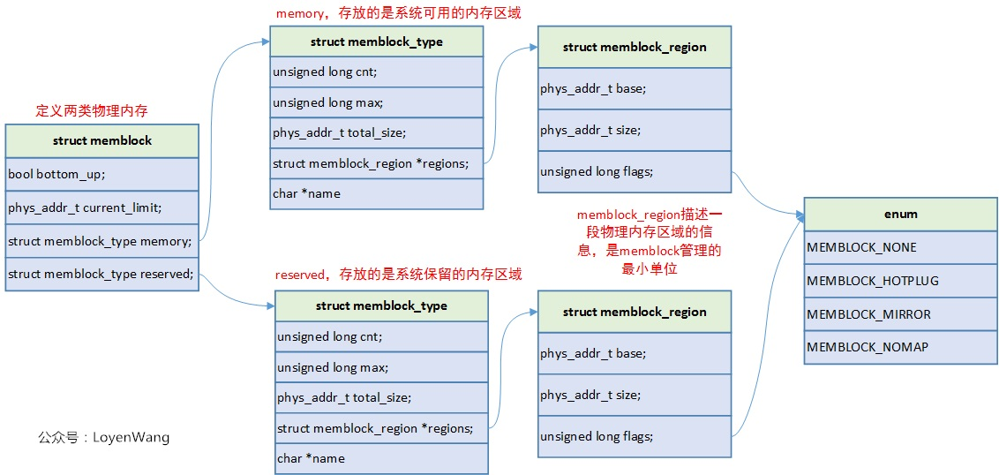
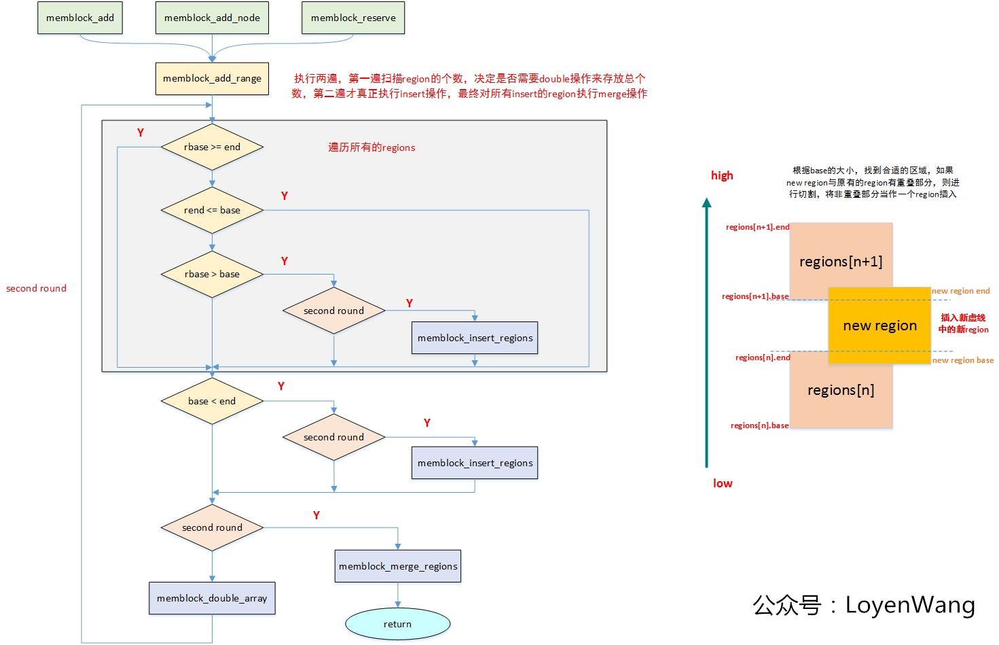
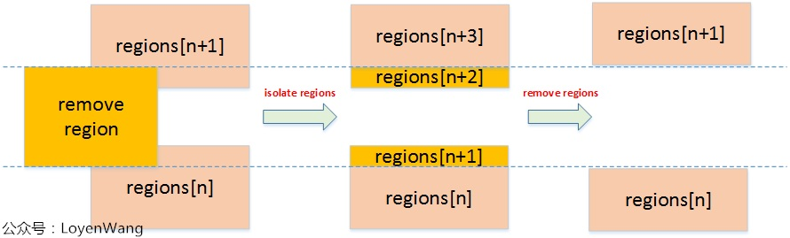
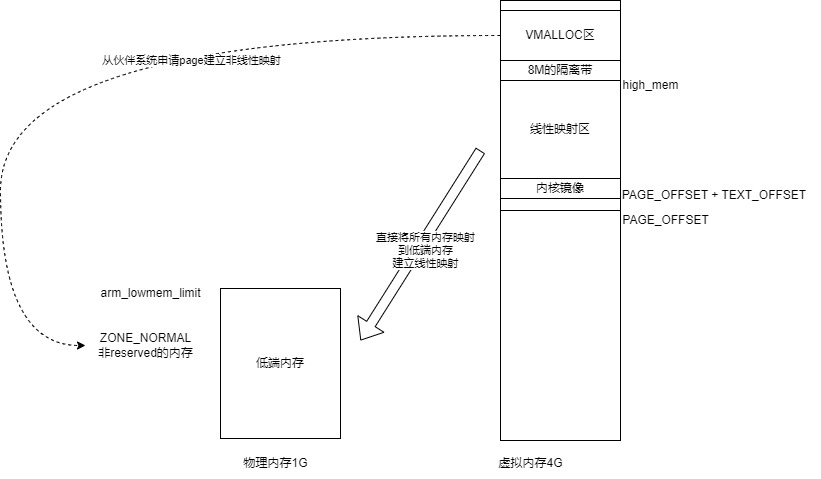
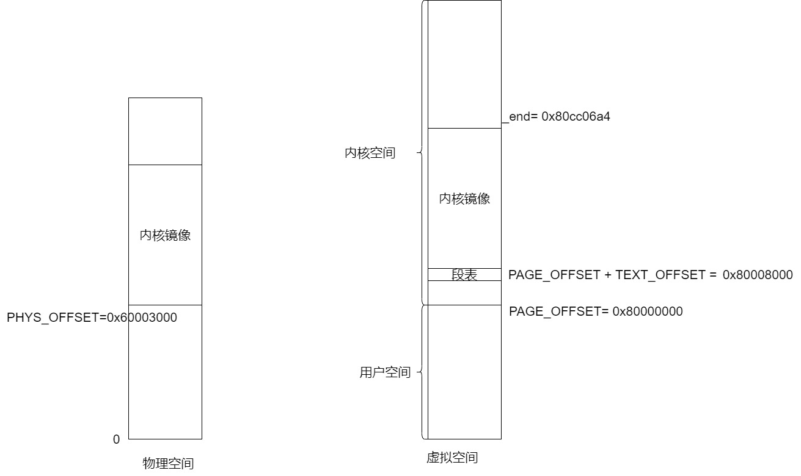
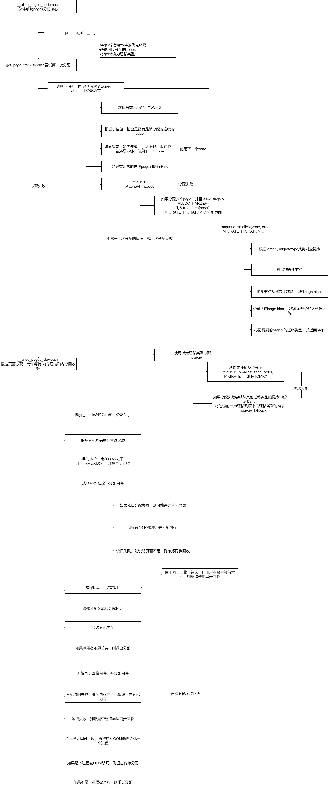
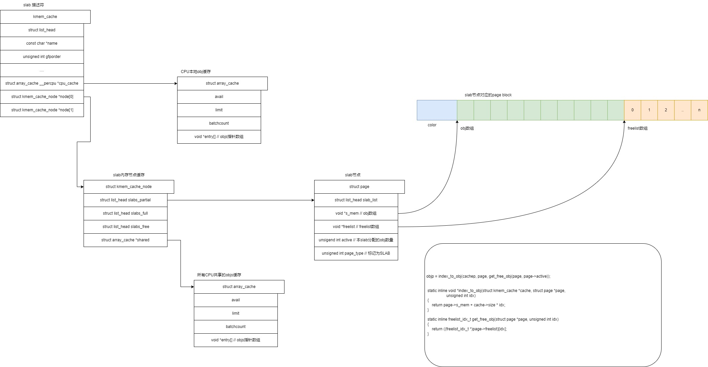
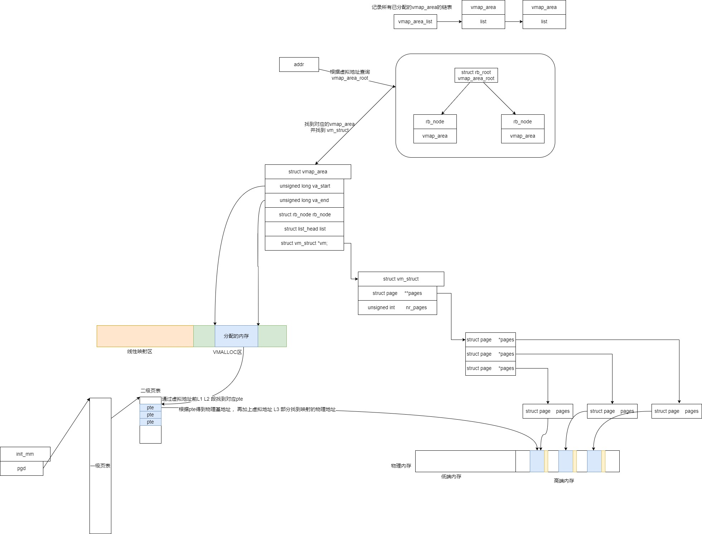
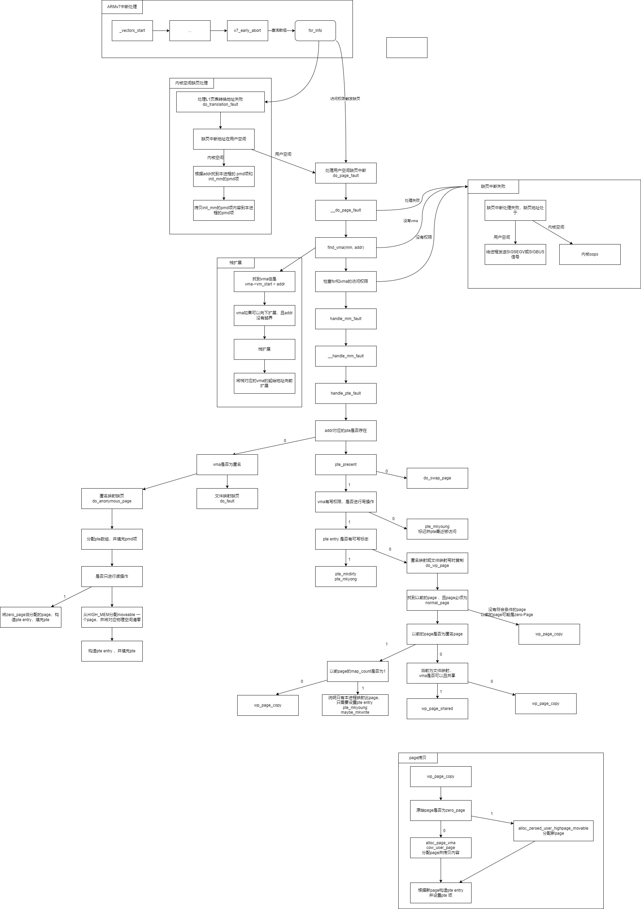

# 物理内存的管理 -- memblock
## 核心数据结构
### memblock 
memblock 内存页帧分配器是 Linux 启动早期内存管理器，在伙伴系统（Buddy System）接管内存管理之前为系统提供内存分配、预留等功能。

memblock 将系统启动时获取的可用内存范围（如从设备树中获取的内存范围）纳入管理，为内核启动阶段内存分配需求提供服务，直到 memblock 分配器将内存管理权移交给伙伴系统。同时 memblock 分配器也维护预留内存（reserved memory），使其不会被分配器直接用于分配，保证其不被非预留者使用。

```c
struct memblock {
	// 分配内存的方向
	// true 从0地址向高地址分配
	// false 从高地址向0地址分配
	bool bottom_up;  
	// 可分配的物理内存的最大地址
	phys_addr_t current_limit;
	// 可使用的内存：包括已分配和未分配
	struct memblock_type memory;
	// 已分配的内存
	struct memblock_type reserved;
};
```
#### memblock_type
memblock_type 描述同类型的可离散的多个物理内存块

```c
struct memblock_type {
	unsigned long cnt; // 记录了结构体中含有的内存区块数量。regions数组有效元素
	unsigned long max; // 结构体中为 regions 数组分配的数量，当需要维护内存区域数目超过 max 后 ，则会倍增 regions 的内存空间
	phys_addr_t total_size; // 当前内存管理集合所管理的所有内存区域的内存大小综合
	struct memblock_region *regions; // 为内存区块数组，描述该集合下管理的所有内存区块，每个数组元素代表一块内存区域，可通过索引获取对应区块。注意区块是按照内存升序或降序排列（由上一层结构中 bottom_up 决定），且相邻数组元素所描述内存必不连续（连续会合并为一个数组元素）。
	char *name; // 为内存类型集合名字，如名为 memory 代表可用内存集合，reserved 代码预留内存集合。
};
```

##### 物理类型 和 内存类型
```c
struct memblock_type memory;
struct memblock_type physmem;
```
内存类型是物理类型的子集，物理类型包含所有物理内存，

引导内核时可以使用 mem=nn[KMG] 指定可用的内存大小，导致部分内存不可见。

内存类型只包含mem=nn[KMG]指定的内存


#### memblock_region
memblock_region 描述一段连续的物理内存块

```c
enum memblock_flags {
	MEMBLOCK_NONE		= 0x0,	// 没有特殊要求的区域
	MEMBLOCK_HOTPLUG	= 0x1,	// 支持的热插拔的内存区域
	MEMBLOCK_MIRROR		= 0x2,  // 支持内存镜像的区域，内存镜像就是内存热备份
	MEMBLOCK_NOMAP		= 0x4,	// 不添加到内核线性映射区
};

// 内存区域
struct memblock_region {
	phys_addr_t base; // 起始物理地址
	phys_addr_t size; // 大小
	enum memblock_flags flags;
#ifdef CONFIG_NEED_MULTIPLE_NODES
	int nid;
#endif
};
```

### 数据结构间的关系


## 主要逻辑

memblock 依次进行

* 可用内存初始化
* 预留内存初始化
* 为内核提供内存管理服务，释放和移交管理权等流程。

### 可用内存初始化

#### 全局变量
```c
static struct memblock_region memblock_memory_init_regions[INIT_MEMBLOCK_REGIONS] __initdata_memblock;
static struct memblock_region memblock_reserved_init_regions[INIT_MEMBLOCK_REGIONS] __initdata_memblock;
#ifdef CONFIG_HAVE_MEMBLOCK_PHYS_MAP
static struct memblock_region memblock_physmem_init_regions[INIT_PHYSMEM_REGIONS] __initdata_memblock;
#endif

struct memblock memblock __initdata_memblock = {
	.memory.regions		= memblock_memory_init_regions,
	.memory.cnt		= 1,	/* empty dummy entry */
	.memory.max		= INIT_MEMBLOCK_REGIONS,
	.memory.name		= "memory",

	.reserved.regions	= memblock_reserved_init_regions,
	.reserved.cnt		= 1,	/* empty dummy entry */
	.reserved.max		= INIT_MEMBLOCK_REGIONS,
	.reserved.name		= "reserved",

#ifdef CONFIG_HAVE_MEMBLOCK_PHYS_MAP
	.physmem.regions	= memblock_physmem_init_regions,
	.physmem.cnt		= 1,	/* empty dummy entry */
	.physmem.max		= INIT_PHYSMEM_REGIONS,
	.physmem.name		= "physmem",
#endif

	.bottom_up		= false,
	.current_limit		= MEMBLOCK_ALLOC_ANYWHERE,
};
```

#### 初始化memblock

```c
start_kernel
	setup_arch(char **cmdline_p)
		mdesc = setup_machine_fdt(atags_vaddr);
			early_init_dt_scan_nodes();
				// 初始化 memblock.memory，即可参与内存分配的区域
				of_scan_flat_dt(early_init_dt_scan_memory, NULL);

		// 确定 arm_lowmem_limit
		adjust_lowmem_bounds();
		// 初始化 memblock.reserve，即不参与内存分配的区域
		arm_memblock_init(mdesc);
			/* 预留内核镜像内存，其中包括.text,.data,.init */
			memblock_reserve(__pa(KERNEL_START), KERNEL_END - KERNEL_START);
			arm_initrd_init();
			// 预留vector page内存
			// 如果CPU支持向量重定向（控制寄存器的V位），则CPU中断向量被映射到这里。
			arm_mm_memblock_reserve();
			//预留架构相关的内存，这里包括内存屏障和安全ram
			if (mdesc->reserve)
				mdesc->reserve();  
			early_init_fdt_reserve_self();  //预留设备树自身加载所占内存
			early_init_fdt_scan_reserved_mem();  //初始化设备树扫描reserved-memory节点预留内存
			dma_contiguous_reserve(arm_dma_limit);  //内核配置参数或命令行参数中预留的DMA连续内存
			arm_memblock_steal_permitted = false;
			memblock_dump_all();

		/* Memory may have been removed so recalculate the bounds. */
		adjust_lowmem_bounds();
```

##### early_init_dt_scan_memory
###### 设备树中memory定义  

注意，新的uboot会检查真实的物理内存情况，如果真实物理内存只有256MB，但是设备树写的是 1GB，则会修改设备树，保证传递给kernel的设备树正确描述硬件

```
/ {
	// reg是 cells数组
	// 一个cell 由 n 个 address-cell 和 m 个 size-cell 组成
	// 一个address-cell 或 size-cell 为 32 位无符号整形数
	// 下面两行定义 n 和 m 的值
	#address-cells = <1>;
	#size-cells = <1>;

	// "memory@60000000" 只是节点的别名，纯粹的字符串
	memory@60000000 {
		// 定义此节点描述内存
		device_type = "memory";

		// 由于上面对n m 的定义
		// 这个 reg 的 一组cell中 address-cell 只有一个
		//                        size-cell 只有一个
		// 这里只定义了一组cell
		// 结合上下文表示 内存节点起始地址 0x60000000, 大小 0x40000000
		reg = <0x60000000 0x40000000>;
	};
}
```
###### 内核如何分析fdt格式的设备树节点
```c
// 假设扫描到 fdt 格式节点  memory@60000000
int __init early_init_dt_scan_memory(unsigned long node, const char *uname,
				     int depth, void *data)
{
	// 从此节点node中获得fdt格式的属性名为"device_type" 的属性值
	// 第三个参数为 plength, 用于返回 值的长度，单位为 __be32
	// 由于知道不是数组类型的值，所以不需要 值的长度
	const char *type = of_get_flat_dt_prop(node, "device_type", NULL);
	const __be32 *reg, *endp;
	int l;
	bool hotpluggable;

	/* We are scanning "memory" nodes only */
	if (type == NULL || strcmp(type, "memory") != 0)
		return 0;

	// 这个属性用于定义预留多少内存，不使用，
	// 可以用于实现输出内存快照
	reg = of_get_flat_dt_prop(node, "linux,usable-memory", &l);
	if (reg == NULL)
		reg = of_get_flat_dt_prop(node, "reg", &l);
	// 如果没有属性 usable-memory,则说明这部分内存可以使用
	// 从 reg属性获得内存的起始地址和大小

	if (reg == NULL)
		return 0;

	// l : 为reg属性值的总长度，单位为 __be32
	// l / sizeof(__be32) : 属性值一共有多少个 __be32 
	// endpd = reg + (l/sizeof(__be32)) : endp指向有效内存块末尾
	endp = reg + (l / sizeof(__be32));
	// 获得另一个属性, 此处为NULL
	hotpluggable = of_get_flat_dt_prop(node, "hotpluggable", NULL);

	// 打印memory scan node memory@60000000, reg size 2
	pr_debug("memory scan node %s, reg size %d,\n", uname, l);

	// reg 为一个数组，数组元素为 address + size
	// address由 n 个 address-cell 表示
	// size 由 m 个 size-cell 表示
	// dt_root_addr_cells 由 #address-cells 定义 n 的值
	// dt_root_size_cells 由 #size-cells 定义 m 的值
	// 接下来需要遍历数组，数组一个元素大小为 n + m， 单位 __be32
	// 也就是 dt_root_addr_cells + dt_root_size_cells
	// endp - reg 为剩余待分析的内存大小，单位 __be32
	// 所以每次遍历移动 reg，直到数组遍历完成，
	// 或者剩余空间不足表示一个数组元素
	while ((endp - reg) >= (dt_root_addr_cells + dt_root_size_cells)) {
		u64 base, size;

		// reg指向待分析的数据起始空间，
		// dt_root_addr_cells 表示 多少个__be32 空间表示一个 address
		// 所以得到一个 address的值，返回为 base
		// 并移动reg到下一个位置，也就是size
		base = dt_mem_next_cell(dt_root_addr_cells, &reg);
		// 同上
		size = dt_mem_next_cell(dt_root_size_cells, &reg);

		if (size == 0)
			continue;
		pr_debug(" - %llx ,  %llx\n", (unsigned long long)base,
		    (unsigned long long)size);

		// 将base , size添加到  memory 子系统
		early_init_dt_add_memory_arch(base, size);

		// hotpluggable为NULL, 遍历下一个数组元素
		// 由于只有一个数组元素，所以返回
		if (!hotpluggable)
			continue;

		if (early_init_dt_mark_hotplug_memory_arch(base, size))
			pr_warn("failed to mark hotplug range 0x%llx - 0x%llx\n",
				base, base + size);
	}

	return 0;
}

```
###### dt_mem_next_cell 获得cell的值并指向下一个cell
```
// s : 本类型的值占用 s 个单元，单位为 __be32
// cellp : 当前扫描到的单位的地址的地址
u64 __init dt_mem_next_cell(int s, const __be32 **cellp)
{
	// 获得当前扫描到的单位的地址
	const __be32 *p = *cellp;

	// 指向下个cell
	*cellp = p + s;
	// 返回当前cell的值
	return of_read_number(p, s);
}

// 可以拼出很大的数
// size是cell的占用单元的数量，单位为__be32
static inline u64 of_read_number(const __be32 *cell, int size)
{
	u64 r = 0;
	for (; size--; cell++)
		r = (r << 32) | be32_to_cpu(*cell);
	return r;
}
```

###### 将从设备树获得的信息添加到memory子系统
```c
void __init __weak early_init_dt_add_memory_arch(u64 base, u64 size)
{
	const u64 phys_offset = MIN_MEMBLOCK_ADDR;

	.. // 过滤非法情况，处理对齐

	memblock_add(base, size);
}

int __init_memblock memblock_add(phys_addr_t base, phys_addr_t size)
{
	phys_addr_t end = base + size - 1;

	memblock_dbg("%s: [%pa-%pa] %pS\n", __func__,
		     &base, &end, (void *)_RET_IP_);

	return memblock_add_range(&memblock.memory, base, size, MAX_NUMNODES, 0);
}

static int __init_memblock memblock_add_range(struct memblock_type *type,
				phys_addr_t base, phys_addr_t size,
				int nid, enum memblock_flags flags)
{
	bool insert = false;
	phys_addr_t obase = base;
	phys_addr_t end = base + memblock_cap_size(base, &size);
	int idx, nr_new;
	struct memblock_region *rgn;

	if (!size)
		return 0;

	/* special case for empty array */
	if (type->regions[0].size == 0) {
		WARN_ON(type->cnt != 1 || type->total_size);
		type->regions[0].base = base;
		type->regions[0].size = size;
		type->regions[0].flags = flags;
		memblock_set_region_node(&type->regions[0], nid);
		type->total_size = size;
		return 0;
	}

	// 如果由多个内存区域添加
	.. 
```

```c
// memblock.memory.regions[i] 表示某一个内存区域	
memblock.memory.regions[0].base = base;   // 0x60000000
memblock.memory.regions[0].size = size;   // 0x40000000
memblock.memory.regions[0].flags = flags; // MEMBLOCK_NONE 没有特殊要求的内存

memblock.memory.total_size = size;        // 所有内存区域的大小0x40000000
```

### 预留内存初始化
将需要保留的内存添加进预留内存类型集合（`memblock.reserved`）,使得后续使用 `memblock` 分配内存时，避开预留内存。例如，在分页系统初始化过程中会调用 `memblock_reserve` 函数将内核程序在内存中的范围保留，保证其不会被覆盖，调用关系如下：
```c
    - paging_init
      - setup_bootmem()
        - memblock_reserve(vmlinux_start, vmlinux_end - vmlinux_start)
```

### memblock的使用
当 memblock 系统完成初始化后，需要申请内存时内核会通过 memblock 系统。

使用者调用 `memblock_alloc` 申请内存，`memblock_free` 释放内存

`setup_vm_final` 函数调用 `create_pgd_mapping` 函数建立页全局目录时，会调用 `alloc_pgd_next` 获取一个页面作为页表。`alloc_pgd_next` 实际是调用 `memblock_phys_alloc` 函数从 `memblock` 分配器中获取一个空闲页面。又如 `setup_log_buf` 中申请存放日志的内存时，会调用 `memblock_alloc` 获得一块内存的虚拟地址。

### memblock和伙伴系统
当内核完成部分初始化功能，并继续启动到要建立以后内核都将使用内存管理系统时，就到了 `memblock` 向伙伴系统移交控制权的时候了。`mm_init` 函数负责建立内存管理系统。该函数会调用 `memblock_free_all` 函数，此函数完成 `memblock` 释放并移交管理权的流程。相关流程如下：

```c
- mm_init
    - mem_init
        - memblock_free_all
```

## 重要函数分析
```c
// 将内存区域添加到 memblock.memory
int memblock_add(phys_addr_t base, phys_addr_t size);
// 从memblock.memory 中删除内存区域
int memblock_remove(phys_addr_t base, phys_addr_t size);
// 释放内存
int memblock_free(phys_addr_t base, phys_addr_t size);
// 从memblock.memory 分配内存
static inline void * __init memblock_alloc(phys_addr_t size,  phys_addr_t align)
```

### memblock_add

memblock_add 添加内存块到 memblock.memory 

另一个类似的接口 memblock_reserve 添加内存块到 memblock.reserve



图中的左侧是函数的执行流程图，执行效果是右侧部分。

右侧部分画的是一个典型的情况，实际的情况可能有多种，但是核心的逻辑都是对插入的region进行判断，

如果出现了物理地址范围重叠的部分，那就进行split操作，最终对具有相同flag的region进行merge操作。

#### memblock_add_range
```c
static int __init_memblock memblock_add_range(struct memblock_type *type,
				phys_addr_t base, phys_addr_t size,
				int nid, enum memblock_flags flags)
{
	bool insert = false;
	phys_addr_t obase = base;
	phys_addr_t end = base + memblock_cap_size(base, &size);
	int idx, nr_new;
	struct memblock_region *rgn;

	if (!size)
		return 0;

	// 添加内存块是从[0]开始添加，如果[0]内存块大小为0，
	// 则说明memblock_type没有添加过内存
	if (type->regions[0].size == 0) {
		WARN_ON(type->cnt != 1 || type->total_size);
		type->regions[0].base = base;
		type->regions[0].size = size;
		type->regions[0].flags = flags;
		memblock_set_region_node(&type->regions[0], nid);
		type->total_size = size;
		return 0;
	}
repeat:
	/*
	 * The following is executed twice.  Once with %false @insert and
	 * then with %true.  The first counts the number of regions needed
	 * to accommodate the new area.  The second actually inserts them.
	 */
	base = obase;
	nr_new = 0;

	for_each_memblock_type(idx, type, rgn) {
		phys_addr_t rbase = rgn->base;
		phys_addr_t rend = rbase + rgn->size;

		//  base  end   rbase   rend
		//          -----|-------|--
		// --|----|--
		// 这种情况肯定和所有已知区域块都不会重叠
		if (rbase >= end)
			break;
		//  rbase  rend   base   end
		//          -----|-------|--
		// --|----|--
		// 和当前区域块无重叠，但是和后面内存块可能重叠，continue
		if (rend <= base)
			continue;

		// 新添加区域和以前的区域有重叠

		/*
		 * @rgn overlaps.  If it separates the lower part of new
		 * area, insert that portion.
		 */
		//  base    rbase  end   rend
		//      -----|------------|--
		// --|--------------|---
		if (rbase > base) {
#ifdef CONFIG_NEED_MULTIPLE_NODES
			WARN_ON(nid != memblock_get_region_node(rgn));
#endif
			WARN_ON(flags != rgn->flags);
			nr_new++;
			if (insert) // 第一次遍历时 insert == false
				memblock_insert_region(type, idx++, base,
						       rbase - base, nid,
						       flags);
		}

		// 上面完成了添加，下一句将剩余空间清零
		//  base    rbase  end   rend
		//      -----|------------|--
		// --|--------------|---
		//
		//                base
		//          rbase  end   rend
		//      -----|------------|--
		//              ----|---
		//

		// 将此情况等价于不相交的情况
		//  rbase    base  rend   end
		//      -----|------------|--
		// --|--------------|---
		//
		//                 base   end
		//                --|-----|--
		// --|--------------|---
		//
		/* area below @rend is dealt with, forget about it */
		base = min(rend, end);
	}

	/* insert the remaining portion */
	if (base < end) {
		// 处理不重叠情况
		//                    base   end
		//                   --|-----|--
		// --|--------------|---
		//	
		//                 base   end
		//                --|-----|--
		// --|--------------|---
		//
		//  base   end
		// --|-----|--
		//       --|--------------|---
		//
		//  base   end
		// --|-----|--
		//          --|--------------|---
		nr_new++;
		if (insert)
			memblock_insert_region(type, idx, base, end - base,
					       nid, flags);
	}

	if (!nr_new)
		return 0;

	/*
	 * If this was the first round, resize array and repeat for actual
	 * insertions; otherwise, merge and return.
	 */
	if (!insert) {
		// 第一次遍历的主要目的就是确保 region[] 足够大
		// 因为使用数组类型，不方便动态添加，所以计算出 nr_new
		// 并一次分配足够的空间
		// 如果 memblock_type.region[]数组不够大，则两倍扩大他
		while (type->cnt + nr_new > type->max)
			if (memblock_double_array(type, obase, size) < 0)
				return -ENOMEM;
		// 第二次遍历，进行插入操作
		insert = true;
		goto repeat;
	} else {
		// 插入完成后，进行合并操作
		//  base   end
		// --|-----|--
		//       --|--------------|---
		//
		//                 base   end
		//                --|-----|--
		// --|--------------|---
		memblock_merge_regions(type);
		return 0;
	}
}
```

#### memblock_merge_regions

合并regions, 可合并的条件
* this->base == next->end
* 并且 this 和 next 是同一个内存节点
* 并且 this->flags == next->flags

```c
static void __init_memblock memblock_merge_regions(struct memblock_type *type)
{
	int i = 0;

	/* cnt never goes below 1 */
	while (i < type->cnt - 1) {
		struct memblock_region *this = &type->regions[i];
		struct memblock_region *next = &type->regions[i + 1];

		if (this->base + this->size != next->base ||
		    memblock_get_region_node(this) !=
		    memblock_get_region_node(next) ||
		    this->flags != next->flags) {
			BUG_ON(this->base + this->size > next->base);
			i++;
			continue;
		}

		this->size += next->size;
		/* move forward from next + 1, index of which is i + 2 */
		// 将next后面的元素往前移动，覆盖掉被合并的元素next
		memmove(next, next + 1, (type->cnt - (i + 2)) * sizeof(*next));
		type->cnt--;
	}
}
```

### memblock_remove



```c
int __init_memblock memblock_remove(phys_addr_t base, phys_addr_t size)
{
	phys_addr_t end = base + size - 1;

	memblock_dbg("%s: [%pa-%pa] %pS\n", __func__,
		     &base, &end, (void *)_RET_IP_);

	return memblock_remove_range(&memblock.memory, base, size);
}

static int __init_memblock memblock_remove_range(struct memblock_type *type,
					  phys_addr_t base, phys_addr_t size)
{
	int start_rgn, end_rgn;
	int i, ret;

	// 找到type.regions[] 内存区域和 [base, end] 重叠的部分，
	// 因为只有重叠部分才是有效可以被删除的部分
	// 并分割现有region，构建新的 memblock_region 保存这些重叠的区域
	// 通过start_rgn ， end_rgn返回重叠regions
	ret = memblock_isolate_range(type, base, size, &start_rgn, &end_rgn);
	if (ret)
		return ret;

	for (i = end_rgn - 1; i >= start_rgn; i--)
		memblock_remove_region(type, i);
	return 0;
}

static void __init_memblock memblock_remove_region(struct memblock_type *type, unsigned long r)
{
	type->total_size -= type->regions[r].size;
	// 数组元素向前移动一个元素，覆盖掉被删除的 region
	memmove(&type->regions[r], &type->regions[r + 1],
		(type->cnt - (r + 1)) * sizeof(type->regions[r]));
	type->cnt--;

	/* Special case for empty arrays */
	if (type->cnt == 0) {
		WARN_ON(type->total_size != 0);
		type->cnt = 1;
		type->regions[0].base = 0;
		type->regions[0].size = 0;
		type->regions[0].flags = 0;
		memblock_set_region_node(&type->regions[0], MAX_NUMNODES);
	}
}

static int __init_memblock memblock_isolate_range(struct memblock_type *type,
					phys_addr_t base, phys_addr_t size,
					int *start_rgn, int *end_rgn)
{
	phys_addr_t end = base + memblock_cap_size(base, &size);
	int idx;
	struct memblock_region *rgn;

	*start_rgn = *end_rgn = 0;

	if (!size)
		return 0;

	/* we'll create at most two more regions */
	while (type->cnt + 2 > type->max)
		if (memblock_double_array(type, base, size) < 0)
			return -ENOMEM;

	for_each_memblock_type(idx, type, rgn) {
		phys_addr_t rbase = rgn->base;
		phys_addr_t rend = rbase + rgn->size;

		// 不可能和regions[]任意元素有重叠,break
		//        rbase
		// baese  end               rend
		//  |------|   
		//         |----------------|-----
		if (rbase >= end)
			break;

		// 和当前区域块无重叠，但是和后面内存块可能重叠，continue
		//      rbase           rend
		//                      base      end
		//                        |--------|--
		//    ---|----------------|-----
		if (rend <= base)
			continue;

		if (rbase < base) {


		// 分割
		//   case 1 :
		//      rbase       base rend end
		//                   |--------|--
		//    ---|----------------|-----
		//
		//              idx[1]_base
		//     idx_base    idx_end   
		//                   |--------|--
		//    ---|-----------|----|-----
		//                      idx[1]_end
		//
		//           继续遍历
		//                  base     end         
		//                   |--------|
		//    ---------------|----|-----
		//                  rbase rend
		//           完全覆盖的情况
		//
		//                     
		//
		//    case 2:
		//     rbase base      end   rend
		//            |---------|
		//    ---|--------------------|---
		//
		//
		//         idx[1]_base
		//            |---------|   idx[1]_end
		//    ---|----|---------------|---
		//    idx_base
		//          idx_end
		//
		//         继续遍历
		//            base      end
		//            |---------|
		//           rbase           rend 
		//    --------|---------------|---
		//        
		//          走下面if (rend > end)的情况
		//    
			/*
			 * @rgn intersects from below.  Split and continue
			 * to process the next region - the new top half.
			 */
			rgn->base = base;
			rgn->size -= base - rbase;
			type->total_size -= base - rbase;
			memblock_insert_region(type, idx, rbase, base - rbase,
					       memblock_get_region_node(rgn),
					       rgn->flags);
		} else if (rend > end) {

		// 分割并保证地址小的在前面
		// base rbase end          rend 
		// |-----------|
		//    ---|----------------|-----
		//
		//   
		//           idx[-1].end
		// |-----------|
		//    ---|-----|----------|-----
		//  idx[-1].base 
		//            idx.base   idx.end
		//
		//          继续遍历
		// base       end           
		// |-----------|
		//    ---|-----|----------------
		//      rbase rend
		//           完全覆盖的情况
		//

			/*
			 * @rgn intersects from above.  Split and redo the
			 * current region - the new bottom half.
			 */
			rgn->base = end;
			rgn->size -= end - rbase;
			type->total_size -= end - rbase;
			memblock_insert_region(type, idx--, rbase, end - rbase,
					       memblock_get_region_node(rgn),
					       rgn->flags);
		} else {

		//      base                   end
		//     rbase                  rend
		//       |----------------------|
		//    ---|----------------------|-----
		//
		//	 base                           end
		//    |------------------------------|
		//    ---|----------------------|-----
		//
		//                             rend
		//   base                      end
		//    |-------------------------|
		//    ---|----------------------|-----
		//       rbase
		// 
		//      rbase                     rend
		//      base                  end
		//       |-------------------------|
		//    ---|----------------------|-----
		//
			/* @rgn is fully contained, record it */
			// 将完全覆盖的reg对于的下标保存
			if (!*end_rgn)
				*start_rgn = idx;
			*end_rgn = idx + 1;
		}
	}

	return 0;
}
```

### memblock_alloc
从 memblock.memory 申请内存块，并清零，并返回虚拟地址

memblock_phys_alloc 从 memblock.memory 申请内存块，

且排除memblock.reserved的内存区域，并返回物理地址

注意成功分配内存块时，并不会对 memblock.memory.regions[] 进行分割，

而是将其中被使用的区域建立新的内存区域加入 memblock.reserved 

```c
#define MEMBLOCK_LOW_LIMIT 0
#define MEMBLOCK_ALLOC_ACCESSIBLE	0

// 从memblock.memory.region[]分配size大小的物理内存，并转换为虚拟地址返回
// 并且返回的内存块数据清零
static inline void * __init memblock_alloc(phys_addr_t size,  phys_addr_t align)
{
	// 根据下面对函数的介绍，
	// 此分配的内存区域下限是 0, 
	// 上限是 memblock.current_limit也就是最大物理地址
	// nid是任意节点
	return memblock_alloc_try_nid(size, align, MEMBLOCK_LOW_LIMIT,
				      MEMBLOCK_ALLOC_ACCESSIBLE, NUMA_NO_NODE);
}

/*
 * size : 将被分配的内存块大小, 字节单位
 * align : 内存区域和块的对齐大小
 * min_addr : 首选分配的内存区域的下限（物理地址）
 * max_addr : 首选分配的内存区域的上限（物理地址），或者使用MEMBLOCK_ALLOC_ACCESSIBLE仅从受memblock.current_limit值限制的内存中进行分配。
 * nid :  要查找的空闲区域的节点ID，使用NUMA_NO_NODE表示任何节点。
 * 
 * 公共函数，在启用时提供附加的调试信息（包括调用者信息）。该函数将分配的内存清零。
 * 返回：
 * 成功时分配内存块的虚拟地址，失败时返回NULL。
 */
void * __init memblock_alloc_try_nid(
			phys_addr_t size, phys_addr_t align,
			phys_addr_t min_addr, phys_addr_t max_addr,
			int nid)
{
	void *ptr;

	ptr = memblock_alloc_internal(size, align,
					   min_addr, max_addr, nid, false);
	if (ptr)
		memset(ptr, 0, size);

	return ptr;
}

// exact_nid : false, 从nid节点分配失败时，尝试从其他内存节点进行分配
// 如果无法满足@min_addr限制，则会放弃该限制，并将分配回退到@min_addr以下的内存。其他约束条件，如节点和镜像内存，将在memblock_alloc_range_nid()中再次处理。
// 分配物理内存块，并返回虚拟地址
static void * __init memblock_alloc_internal(
				phys_addr_t size, phys_addr_t align,
				phys_addr_t min_addr, phys_addr_t max_addr,
				int nid, bool exact_nid)
{
	phys_addr_t alloc;

	// 检查是否启用了 slab 分配器，如果已启用，说明 memblock 已将管理权移交给伙伴系统
	if (WARN_ON_ONCE(slab_is_available()))
		return kzalloc_node(size, GFP_NOWAIT, nid);

	// 分配区域地址最大地址不超过 memblock能提供的最大地址
	if (max_addr > memblock.current_limit)
		max_addr = memblock.current_limit;

	// 分配物理内存块
	alloc = memblock_alloc_range_nid(size, align, min_addr, max_addr, nid,
					exact_nid);

	/* retry allocation without lower limit */
	// 如果使用min_addr限制条件，但分配失败，
	// 则弃用min_addr限制，尝试从min_addr之下的内存进行分配
	if (!alloc && min_addr)
		alloc = memblock_alloc_range_nid(size, align, 0, max_addr, nid,
						exact_nid);

	if (!alloc)
		return NULL;

	// 分配成功后返回虚拟地址
	return phys_to_virt(alloc);
}
```

#### memblock_alloc_range_nid
```c
phys_addr_t __init memblock_alloc_range_nid(phys_addr_t size,
					phys_addr_t align, phys_addr_t start,
					phys_addr_t end, int nid,
					bool exact_nid)
{
	enum memblock_flags flags = choose_memblock_flags();
		return system_has_some_mirror ? MEMBLOCK_MIRROR : MEMBLOCK_NONE;
	phys_addr_t found;

	if (WARN_ONCE(nid == MAX_NUMNODES, "Usage of MAX_NUMNODES is deprecated. Use NUMA_NO_NODE instead\n"))
		nid = NUMA_NO_NODE;

	if (!align) {
		/* Can't use WARNs this early in boot on powerpc */
		dump_stack();
		align = SMP_CACHE_BYTES;
	}

again:
	// 分配物理内存块
	found = memblock_find_in_range_node(size, align, start, end, nid,
					    flags);
	// 如果分配成功，则将内存块[founc, found + size) 加入 reserved
	if (found && !memblock_reserve(found, size))
		goto done;

	// 如果分配失败，且nid不受限制，则从其他nid分配
	if (nid != NUMA_NO_NODE && !exact_nid) {
		found = memblock_find_in_range_node(size, align, start,
						    end, NUMA_NO_NODE,
						    flags);
		// 如果分配成功，则将内存块[founc, found + size) 加入 reserved
		if (found && !memblock_reserve(found, size))
			goto done;
	}

	if (flags & MEMBLOCK_MIRROR) {
		flags &= ~MEMBLOCK_MIRROR;
		pr_warn("Could not allocate %pap bytes of mirrored memory\n",
			&size);
		goto again;
	}

	return 0;

done:
	// 是否进行内存泄露检查
	/* Skip kmemleak for kasan_init() due to high volume. */
	if (end != MEMBLOCK_ALLOC_KASAN)
		kmemleak_alloc_phys(found, size, 0, 0);

	return found;
}
```

#### memblock_find_in_range_node
```c
static phys_addr_t __init_memblock memblock_find_in_range_node(phys_addr_t size,
					phys_addr_t align, phys_addr_t start,
					phys_addr_t end, int nid,
					enum memblock_flags flags)
{
	/* pump up @end */
	if (end == MEMBLOCK_ALLOC_ACCESSIBLE ||
	    end == MEMBLOCK_ALLOC_KASAN)
		end = memblock.current_limit;

	/* avoid allocating the first page */
	start = max_t(phys_addr_t, start, PAGE_SIZE);
	end = max(start, end);

	// 从0地址向高地址分配 还是 从高地址向0地址分配
	if (memblock_bottom_up()) // memblock.bottom_up
		return __memblock_find_range_bottom_up(start, end, size, align,
						       nid, flags);
	else
		return __memblock_find_range_top_down(start, end, size, align,
						      nid, flags);
}

// 从高地址向0地址分配
// start : 内存区域下限，此处是 0 + PAGE_SIZE
// end : 内存区域上限，此处是 memblock.current_limit，也就是最大值
static phys_addr_t __init_memblock
__memblock_find_range_top_down(phys_addr_t start, phys_addr_t end,
			       phys_addr_t size, phys_addr_t align, int nid,
			       enum memblock_flags flags)
{
	phys_addr_t this_start, this_end, cand;
	u64 i;

	// 遍历存在于memblock.memory 但排除 memblock.reserve的内存块
	// 注意并没有修改 memblock.memory.regions[] 
	// 获得 this_start this_end
	for_each_free_mem_range_reverse(i, nid, flags, &this_start, &this_end,
					NULL) {
		// 限制this_start this_end 在 [start, end] 范围内
		this_start = clamp(this_start, start, end);
		this_end = clamp(this_end, start, end);

		// 从 this_end 开始分配内存，即 [this_start, this_end] 这块内存
		// 区域最大能提供 [0, this_end]大小的内存，
		// 如果 this_end < size，则说明内存大小肯定不足
		if (this_end < size)
			continue;

		// 从this_end分配size大小的内存，并确保对齐
		// 如果分配区域在this_start内则说明分配成功
		cand = round_down(this_end - size, align);
		if (cand >= this_start)
			return cand;
	}

	return 0;
}

/**
 * clamp - clamp - 返回一个在给定范围内的值，并进行严格的类型检查
 * @val: current value
 * @lo: lowest allowable value
 * @hi: highest allowable value
 *
 * This macro does strict typechecking of @lo/@hi to make sure they are of the
 * same type as @val.  See the unnecessary pointer comparisons.
 */
#define clamp(val, lo, hi) min((typeof(val))max(val, lo), hi)

/**
 * round_down -  向下舍入到下一个指定的2的幂次方
 * @x: the value to round
 * @y: multiple to round down to (must be a power of 2)
 *
 * Rounds @x down to next multiple of @y (which must be a power of 2).
 * To perform arbitrary rounding down, use rounddown() below.
 */
#define round_down(x, y) ((x) & ~__round_mask(x, y))
```

### memblock_free
```c
/*
 * 释放由 memblock_alloc_xx 分配的内存块[base, base + size)
 * 被释放了的内存，不会被释放给伙伴分配器
 */
int __init_memblock memblock_free(phys_addr_t base, phys_addr_t size)
{
	phys_addr_t end = base + size - 1;

	memblock_dbg("%s: [%pa-%pa] %pS\n", __func__,
		     &base, &end, (void *)_RET_IP_);

	kmemleak_free_part_phys(base, size);
	// memblock_free是释放预留的内存，
	// 当这些内存不存在于memblock.reserved时，就可以从 memblock.memory中分配
	return memblock_remove_range(&memblock.reserved, base, size);
}

static int __init_memblock memblock_remove_range(struct memblock_type *type,
					  phys_addr_t base, phys_addr_t size)
{
	int start_rgn, end_rgn;
	int i, ret;

	ret = memblock_isolate_range(type, base, size, &start_rgn, &end_rgn);
	if (ret)
		return ret;

	for (i = end_rgn - 1; i >= start_rgn; i--)
		memblock_remove_region(type, i);
	return 0;
}
```

### for_each_reserved_mem_range
```c
#define for_each_reserved_mem_range(i, p_start, p_end)			\
	__for_each_mem_range(i, &memblock.reserved, NULL, NUMA_NO_NODE,	\
			     MEMBLOCK_NONE, p_start, p_end, NULL)

#define __for_each_mem_range(i, type_a, type_b, nid, flags,		\
			   p_start, p_end, p_nid)			\
	for (i = 0, __next_mem_range(&i, nid, flags, type_a, type_b,	\
				     p_start, p_end, p_nid);		\
	     i != (u64)ULLONG_MAX;					\
	     __next_mem_range(&i, nid, flags, type_a, type_b,		\
			      p_start, p_end, p_nid))

```

`__next_mem_range` 函数的功能是给出类型为 `type_a` 集合中排除 `type_b` 集合后的可用区间。

故此函数在多处遍历时被使用：

`for_each_free_mem_range` 函数使用它时，`tpye_a` 取 `memblock.memory` ，`tpye_b` 取 `memblock.reserved` ，遍历可被申请的内存。

`for_each_mem_range` 函数使用它时，`tpye_a` 取 `memblock.memory` ，`tpye_b` 取 `NULL` ，直接遍历 `memblock.memory` 可用内存集合区间。

`for_each_reserved_mem_range` 函数使用它时，`tpye_a` 取 `memblock.reserved` ，`tpye_b` 取 `NULL` ，直接遍历 `memblock.reserved` 预留内存集合区间。

## memblock_free_all
当伙伴系统建立后，调用此函数释放所有物理页到伙伴系统

```c
unsigned long __init memblock_free_all(void)
{
	unsigned long pages;

	reset_all_zones_managed_pages();

	pages = free_low_memory_core_early();
	totalram_pages_add(pages);

	return pages;
}
```

# 高端内存的确定
```c
start_kernel
	setup_arch(&command_line);
		...
		mdesc = setup_machine_fdt(atags_vaddr); // 根据设备树memory节点，初始化memblock
		...
		// 计算物理内存的高端和低端
		adjust_lowmem_bounds(); 
		// 将不参与分配的内存加入 memblock.reserved
		// 包括 内核镜像占用的内存, initrd占用的内存
		// 设备树中  /memreserve 节点定义的内存
		// DMA 占用的内存
		arm_memblock_init(mdesc); 
		// 由于memblock.memory可能变化，重新确定物理内存arm_lowmem_limit
		adjust_lowmem_bounds();
		...
		// 完成线性映射
		paging_init(mdesc);
		...

```


## adjust_lowmem_bounds

本函数计算物理内存的高端和低端，

输出全局变量：
* arm_lowmem_limit : 记录低端内存的上限，物理地址
* high_memory : 记录 高端内存的开始，虚拟地址

首先令虚拟地址vmalloc区的底部加上8MB的空洞得到虚拟空间中高端内存和低端内存的分界地址。

然后将其转换为物理地址 `vmalloc_limit`。

然后比较 `vmalloc_limit` 和 `memblock.memory` 可用的物理地址最高位，

以两者中最小的作为物理内存中高端和低端的分界 `arm_lowmem_limit`。

也就是说若线性映射区能覆盖所有的物理内存，则 `arm_lowmem_limit` 为 物理地址最高位，即没有高端物理内存

若不能覆盖，则 `[ block_start , arm_lowmem_limit]`做低端物理内存

`[arm_lowmem_limit, block_end]` 做高端物理内存

若没有开启`CONFIG_HIGHMEM` ，则高端物理内存无法被映射，将高端物理内存移除 `memblock.memory`

```c
/*
 * vmalloc_min : 虚拟地址，vmalloc 区间的最小开始
 * VMALLOC_END : 虚拟地址，VMALLOC区的结束地址
 * (240 << 20) : 240M ，VMALLOC区空间的最小大小
 * VMALLOC_OFFSET : 线性映射区和VMALLOC区之间有一个间隔，大小为VMALLOC_OFFSET, 16MB
 */
static void * __initdata vmalloc_min =
  (void *)(VMALLOC_END - (240 << 20) - VMALLOC_OFFSET);


void __init adjust_lowmem_bounds(void)
{
	phys_addr_t block_start, block_end, memblock_limit = 0;
	u64 vmalloc_limit, i;
	phys_addr_t lowmem_limit = 0;

	// vmalloc_limit : 物理地址，VMALLOC分区在物理地址上的开始
	vmalloc_limit = (u64)(uintptr_t)vmalloc_min - PAGE_OFFSET + PHYS_OFFSET; // 0xd0000000

	for_each_mem_range(i, &block_start, &block_end) {
		if (!IS_ALIGNED(block_start, PMD_SIZE)) {
			phys_addr_t len;

			len = round_up(block_start, PMD_SIZE) - block_start;
			memblock_mark_nomap(block_start, len);
		}
		break;
	}

	for_each_mem_range(i, &block_start, &block_end) {
		if (block_start < vmalloc_limit) {
			if (block_end > lowmem_limit)
				// 如果 vmalloc_limit < block_end 
				// 意味着线性映射无法覆盖所有物理内存
				// 那么物理内存将分为高端内存和低端内存
				lowmem_limit = min_t(u64,
							 vmalloc_limit,
							 block_end);

			if (!memblock_limit) {
				if (!IS_ALIGNED(block_start, PMD_SIZE))
					memblock_limit = block_start;
				else if (!IS_ALIGNED(block_end, PMD_SIZE))
					memblock_limit = lowmem_limit;
			}

		}
	}

	// 记录低端内存的上限，物理地址
	arm_lowmem_limit = lowmem_limit;

	// 记录 高端内存的开始，虚拟地址
	high_memory = __va(arm_lowmem_limit - 1) + 1;

	if (!memblock_limit)
		memblock_limit = arm_lowmem_limit;

	/*
	 * Round the memblock limit down to a pmd size.  This
	 * helps to ensure that we will allocate memory from the
	 * last full pmd, which should be mapped.
	 */
	memblock_limit = round_down(memblock_limit, PMD_SIZE);

	// 如果没有开启高端内存，且 物理内存的结束地址 > 物理内存低端区的上限
	// 则意味着一部分内存无法被线性映射访问，但又没有使用高端内存
	// 所以一部分内存无法被访问，将这部分内存移除memblock
	// 这部分内存为 [ arm_lowmem_limit, end ]
	if (!IS_ENABLED(CONFIG_HIGHMEM) || cache_is_vipt_aliasing()) {
		if (memblock_end_of_DRAM() > arm_lowmem_limit) {
			phys_addr_t end = memblock_end_of_DRAM();

			pr_notice("Ignoring RAM at %pa-%pa\n",
				  &memblock_limit, &end);
			pr_notice("Consider using a HIGHMEM enabled kernel.\n");

			memblock_remove(memblock_limit, end - memblock_limit);
		}
	}

	memblock_set_current_limit(memblock_limit);
}
```

当虚拟内存足够大，则所有物理内存都为低端内存，由`NORMAL_ZONE`管理，线性映射区和 `VMALLOC`区都映射到低端内存。



当虚拟内存不足时，无法线性映射的物理内存区域做高端内存，vmalloc优先映射高端内存.


## 物理内存不同大小情况下，内核的虚拟内存布局

### 未开启开端内存
256MB 物理内存 ，内核空间1GB

lowmem 最大只能为256MB，剩余内核空间几乎都给了vmalloc

所有物理内存都为Normal zone
```
Virtual kernel memory layout:
    fixmap  : 0xffc80000 - 0xfff00000   (2560 kB)
    vmalloc : 0xd0800000 - 0xff800000   ( 752 MB)
    lowmem  : 0xc0000000 - 0xd0000000   ( 256 MB)
    modules : 0xbf000000 - 0xc0000000   (  16 MB)
      .text : 0x(ptrval) - 0x(ptrval)   (9184 kB)
      .init : 0x(ptrval) - 0x(ptrval)   (1024 kB)
      .data : 0x(ptrval) - 0x(ptrval)   ( 620 kB)
       .bss : 0x(ptrval) - 0x(ptrval)   ( 192 kB)
```

512MB 物理内存 ，内核空间1GB

lowmem 最大只能为512MB，剩余内核空间几乎都给了vmalloc

所有物理内存都为Normal zone
```
Virtual kernel memory layout:
    fixmap  : 0xffc80000 - 0xfff00000   (2560 kB)
    vmalloc : 0xe0800000 - 0xff800000   ( 496 MB)
    lowmem  : 0xc0000000 - 0xe0000000   ( 512 MB)
    modules : 0xbf000000 - 0xc0000000   (  16 MB)
      .text : 0x(ptrval) - 0x(ptrval)   (9184 kB)
      .init : 0x(ptrval) - 0x(ptrval)   (1024 kB)
      .data : 0x(ptrval) - 0x(ptrval)   ( 620 kB)
       .bss : 0x(ptrval) - 0x(ptrval)   ( 192 kB)
```

1G 物理内存 ，内核空间1GB

lowmem 最大只能为768MB，剩余内核空间几乎都给了vmalloc

所有物理内存都为Normal zone

```
Zone ranges:
  Normal   [mem 0x0000000060000000-0x000000008fffffff]

Virtual kernel memory layout:
    fixmap  : 0xffc80000 - 0xfff00000   (2560 kB)
    vmalloc : 0xf0800000 - 0xff800000   ( 240 MB)
    lowmem  : 0xc0000000 - 0xf0000000   ( 768 MB)
    modules : 0xbf000000 - 0xc0000000   (  16 MB)
      .text : 0x(ptrval) - 0x(ptrval)   (9184 kB)
      .init : 0x(ptrval) - 0x(ptrval)   (1024 kB)
      .data : 0x(ptrval) - 0x(ptrval)   ( 620 kB)
       .bss : 0x(ptrval) - 0x(ptrval)   ( 192 kB)
```

综上可知，内核虚拟空间高端映射区有个底线，最少划分256M给高端映射区，

这会导致线性映射区可能不能映射所有物理内存，比如上面1G物理内存，1G内核虚拟内存，

线性映射区最大只能为768M，导致部分物理内存无法被映射

### 开启高端内存
1G 物理内存 ，内核空间1GB

由于VMALLOC区至少需要240MB，导致线性映射区不足 768MB

所以物理内存有部分不能线性映射，所以被划分成高端内存

```
Zone ranges:
  Normal   [mem 0x0000000060000000-0x000000008fffffff] 767MB
  HighMem  [mem 0x0000000090000000-0x000000009fffffff] 255MB

Virtual kernel memory layout:
    fixmap  : 0xffc80000 - 0xfff00000   (2560 kB)
    vmalloc : 0xf0800000 - 0xff800000   ( 240 MB)
    lowmem  : 0xc0000000 - 0xf0000000   ( 768 MB)
    pkmap   : 0xbfe00000 - 0xc0000000   (   2 MB)
    modules : 0xbf000000 - 0xbfe00000   (  14 MB)
      .text : 0x(ptrval) - 0x(ptrval)   (9184 kB)
      .init : 0x(ptrval) - 0x(ptrval)   (1024 kB)
      .data : 0x(ptrval) - 0x(ptrval)   ( 621 kB)
       .bss : 0x(ptrval) - 0x(ptrval)   ( 213 kB)
```

# 内存映射
## mm_struct
`mm_struct` 是内存管理和根对象，内核和用户进程有不同的`mm_struct`

内核的`mm_struct`为 全局变量 `init_mm`，用户进程的`mm_struct`为 `task->mm`

建立内存映射的核心就是要初始化 `mm_struct.pgd`

```c
struct mm_struct init_mm = {
	.mm_rb		= RB_ROOT,
	.pgd		= swapper_pg_dir,
	.mm_users	= ATOMIC_INIT(2),
	.mm_count	= ATOMIC_INIT(1),
	.write_protect_seq = SEQCNT_ZERO(init_mm.write_protect_seq),
	MMAP_LOCK_INITIALIZER(init_mm)
	.page_table_lock =  __SPIN_LOCK_UNLOCKED(init_mm.page_table_lock),
	.arg_lock	=  __SPIN_LOCK_UNLOCKED(init_mm.arg_lock),
	.mmlist		= LIST_HEAD_INIT(init_mm.mmlist),
	.user_ns	= &init_user_ns,
	.cpu_bitmap	= CPU_BITS_NONE,
	INIT_MM_CONTEXT(init_mm)
};

EXPORT_SYMBOL(init_mm);
```

## 段映射部分



```asm
/*
 * 建立两个段表映射，一个是对开启MMu代码的恒等映射
 * 一个是内核镜像的映射
 *
 * r8 = phys_offset, r9 = cpuid, r10 = procinfo
 * 
 *  phys_offset : 内核解压后镜像的起始地址
 *  procinfo : CPU信息
 *
 * Returns:
 *  r0, r3, r5-r7 corrupted
 *  r4 = physical page table address
 */
__create_page_tables:
	pgtbl	r4, r8				@ page table address 分配页表内存
	                            @ r4 记录页表地址
	/*
	 * 将段表清零
	 */
	mov	r0, r4
	mov	r3, #0
	add	r6, r0, #PG_DIR_SIZE
1:	str	r3, [r0], #4
	str	r3, [r0], #4
	str	r3, [r0], #4
	str	r3, [r0], #4
	teq	r0, r6
	bne	1b

	ldr	r7, [r10, #PROCINFO_MM_MMUFLAGS] @ 读取MMU flags

	/*
	 * 现在 __turn_mmu_on 的物理地址已经确定（因为代码已经加载完成）
	 * 所以要根据 __turn_mmu_on 到 __turn_mmu_on_end 的物理地址填充页表
	 * 并且由于__turn_mmu_on一部分运行在虚拟地址，一部分运行在物理地址
	 * 所以必须建立恒等映射
	 *
	 * 将开启MMU的代码 __turn_mmu_on 建立恒等映射
	 * __turn_mmu_on代码的虚拟地址范围是 __turn_mmu_on - __turn_mmu_on_end
	 */
	adr	r0, __turn_mmu_on_loc @ r0存放__turn_mmu_on_loc的物理地址
	ldmia	r0, {r3, r5, r6} @ 将r0指向的内存的值依次放到 r3 r5 r6
	                         @ r3 = __turn_mmu_loc 虚拟地址
							 @ r5 = __turn_mmu_on 虚拟地址
							 @ r6 = __turn_mmu_on_end 虚拟地址

	sub	r0, r0, r3			@ virt->phys offset
	                        @ 计算虚拟地址和物理地址间的偏移
							@ r0 = r0 - r3
							@ r0 = __turn_mmu_on_loc物理地址 - __turn_mmu_on_loc虚拟地址

	add	r5, r5, r0			@ phys __turn_mmu_on
							@ 计算 __turn_mmu_on的物理地址
							@ r5 = r5 + r0
							@ r5 = __turn_mmu_on虚拟地址 + offset

	add	r6, r6, r0			@ phys __turn_mmu_on_end
							@ 计算__turn_mmu_on_end的物理地址

	mov	r5, r5, lsr #SECTION_SHIFT  @ r5=r5>>20
                                    @ 对等映射：将物理地址当成虚拟地址
                                    @ 虚拟地址>>20 得到 页表索引号
									@ 同时得到物理地址基地址>>20

	mov	r6, r6, lsr #SECTION_SHIFT  @ r6=r6>>20
                                    @ 对等映射：将物理地址当成虚拟地址
                                    @ 虚拟地址>>20 得到 页表索引号
									@ 同时得到物理地址基地址>>20

1:	orr	r3, r7, r5, lsl #SECTION_SHIFT	@ flags + kernel base
                                        @ r3 = r7 | r5<<20
                                        @ 将物理基地址做高位，
										@ 位或上mmu flags 得到填充页表的值

	str	r3, [r4, r5, lsl #PMD_ORDER]	@ identity mapping
                                        @ 将r3页表项值填充到页表
                                        @ 页表的地址计算：
                                        @     r4 + r5<<2
                                        @     页表基地址 + 页索引号 * 4   得到页表项地址
                                        @     之所以乘以4，是因为一个页表项占4字节

	cmp	r5, r6                  @ 比较当前页表号和结束页表号
	addlo	r5, r5, #1			@ next section
								@ 当r5 < r6 时，r5 = r5+1 , 也就是r5为下一个页表号

	blo	1b                      @ 当r5 < r6 时，循环

	/*
	 * Map our RAM from the start to the end of the kernel .bss section.
	 * 建立内核镜像映射
	 * r4 段表的基地址
	 */
	add	r0, r4, #PAGE_OFFSET >> (SECTION_SHIFT - PMD_ORDER) @ r0记录kernel起始段地址
                                                            @ 因为第一个段被对等映射占据，
                                                            @ 所以kernel的从第二个段开始
                                                            @ r0 = 段表基地址 + 第二个段的偏移地址
	ldr	r6, =(_end - 1)   @ kernel的虚拟地址的结束地址
						  @ _end在vmlinux.lds中定义，是内核镜像结束的连接地址

	orr	r3, r8, r7        @ r8:kernel镜像物理起始地址的基地址
						  @ r3 = r8 | r7
						  @ r3 = 内核镜像物理起始地址的基地址 | MMU-flags

	add	r6, r4, r6, lsr #(SECTION_SHIFT - PMD_ORDER)  @ 得到镜像虚拟结束地址对应的段的地址
                                                      @ 将 r6 >> (20 - 2) 可以理解为
                                                      @ (r6 >> 20) * 4
                                                      @ 首先将虚拟地址右移20位，得到段号
                                                      @ 再将段号乘以 4 得到偏移地址
                                                      @ 将段表基地址加上偏移地址得到结束段的地址

1:	str	r3, [r0], #1 << PMD_ORDER             @ 将物理基地址和mmu flags写道对应页表项       
                                              @ 将 *r0 = r3 ,写4B
                                              @ r0 += 4

	add	r3, r3, #1 << SECTION_SHIFT           @ 增加物理基地址 
	                                          @ 1 << 20 位保证只对物理基地址增加，不修改mmc flags

	cmp	r0, r6       @ 比较当前页表项地址和镜像的结束页表项地址 
	bls	1b           @ 如果 r0 < r6 循环

```


## 建立线性映射 paging_init
```c
setup_arch
	adjust_lowmem_bounds	// 确定高端内存和低端内存，线性映射区 
	paging_init // 进行线性映射
```

```c
void __init paging_init(const struct machine_desc *mdesc)
{
	void *zero_page;

	prepare_page_table(); // 清零部分映射
	map_lowmem(); // 建立线性映射
	// 设置最大memblock最大分配地址不超过 低端内存
	memblock_set_current_limit(arm_lowmem_limit);
	dma_contiguous_remap();
	early_fixmap_shutdown();
	devicemaps_init(mdesc);
	kmap_init();
	tcm_init();

	top_pmd = pmd_off_k(0xffff0000);

	// 分配zero_page, zero_page不属于伙伴系统
	zero_page = early_alloc(PAGE_SIZE);

	// 检查内存条是否故障，统计各个zone拥有的page数量
	bootmem_init();

	// 根据zero_page的虚拟地址，得到其page
	empty_zero_page = virt_to_page(zero_page);
	__flush_dcache_page(NULL, empty_zero_page);
}
```

### prepare_page_table
```c
static inline void prepare_page_table(void)
{
	unsigned long addr;
	phys_addr_t end;

	// 将 内核镜像之下的虚拟空间的映射清零
	for (addr = 0; addr < MODULES_VADDR; addr += PMD_SIZE)
		pmd_clear(pmd_off_k(addr));

	// 将 MODULES_VADDR - PAGE_OFFSET 也就是modules区映射清零
	for ( ; addr < PAGE_OFFSET; addr += PMD_SIZE)
		pmd_clear(pmd_off_k(addr));

	/*
	 * Find the end of the first block of lowmem.
	 */
	end = memblock.memory.regions[0].base + memblock.memory.regions[0].size;
	if (end >= arm_lowmem_limit)
		end = arm_lowmem_limit;

	/*
	 * Clear out all the kernel space mappings, except for the first
	 * memory bank, up to the vmalloc region.
	 */
	for (addr = __phys_to_virt(end);
	     addr < VMALLOC_START; addr += PMD_SIZE)
		pmd_clear(pmd_off_k(addr));
}
```

### map_lowmem
```c
static void __init map_lowmem(void)
{
	// 得到内核代码段的物理空间范围
	// 将内核起始地址_text，转换成物理地址，并按照 SECTION_SIZE大小对齐向下取整
	phys_addr_t kernel_x_start = round_down(__pa(KERNEL_START), SECTION_SIZE);
	// 向上取整
	phys_addr_t kernel_x_end = round_up(__pa(__init_end), SECTION_SIZE);
	phys_addr_t start, end;
	u64 i;

	// 遍历memblock.memory, 遍历所有可用的包括已分配和未分配的物理内存
	// 映射所有低端物理内存, 建立线性映射
	for_each_mem_range(i, &start, &end) {
		struct map_desc map;

		// 映射的物理内存不超过低端内存
		if (end > arm_lowmem_limit)
			end = arm_lowmem_limit;
		if (start >= end)
			break;

		// 将可执行的部分映射成 RWX，其他映射成RW
		if (end < kernel_x_start) {
			map.pfn = __phys_to_pfn(start);
			map.virtual = __phys_to_virt(start);
			map.length = end - start;
			map.type = MT_MEMORY_RWX;

			create_mapping(&map);
		} else if (start >= kernel_x_end) {
			map.pfn = __phys_to_pfn(start);
			map.virtual = __phys_to_virt(start);
			map.length = end - start;
			map.type = MT_MEMORY_RW;

			create_mapping(&map);
		} else {
			/* This better cover the entire kernel */
			if (start < kernel_x_start) {
				map.pfn = __phys_to_pfn(start);
				map.virtual = __phys_to_virt(start);
				map.length = kernel_x_start - start;
				map.type = MT_MEMORY_RW;

				create_mapping(&map);
			}

			map.pfn = __phys_to_pfn(kernel_x_start);
			map.virtual = __phys_to_virt(kernel_x_start);
			map.length = kernel_x_end - kernel_x_start;
			map.type = MT_MEMORY_RWX;

			create_mapping(&map);

			if (kernel_x_end < end) {
				map.pfn = __phys_to_pfn(kernel_x_end);
				map.virtual = __phys_to_virt(kernel_x_end);
				map.length = end - kernel_x_end;
				map.type = MT_MEMORY_RW;

				create_mapping(&map);
			}
		}
	}
}
```

#### create_mapping

对内核页表 `init_mm.pgd` 建立映射

```c
static void __init create_mapping(struct map_desc *md)
{
	// 如果要映射的虚拟地址在用户空间，则报错，并返回
	if (md->virtual != vectors_base() && md->virtual < TASK_SIZE) {
		pr_warn("BUG: not creating mapping for 0x%08llx at 0x%08lx in user region\n",
			(long long)__pfn_to_phys((u64)md->pfn), md->virtual);
		return;
	}

	// 如果要映射的虚拟地址在VMALLOC区外，则包警告
	if (md->type == MT_DEVICE &&
	    md->virtual >= PAGE_OFFSET && md->virtual < FIXADDR_START &&
	    (md->virtual < VMALLOC_START || md->virtual >= VMALLOC_END)) {
		pr_warn("BUG: mapping for 0x%08llx at 0x%08lx out of vmalloc space\n",
			(long long)__pfn_to_phys((u64)md->pfn), md->virtual);
	}

	__create_mapping(&init_mm, md, early_alloc, false);
}

static void __init __create_mapping(struct mm_struct *mm, struct map_desc *md,
				    void *(*alloc)(unsigned long sz),
				    bool ng)
{
	unsigned long addr, length, end;
	phys_addr_t phys;
	const struct mem_type *type;
	pgd_t *pgd;

	// 根据用户输入的type，转换成填充pte的flags
	type = &mem_types[md->type];

	// 虚拟地址 PAGE 对齐，因为映射是以 page为单位
	addr = md->virtual & PAGE_MASK;
	// 得到对齐以page的物理地址
	phys = __pfn_to_phys(md->pfn);
	// 映射的长度也以page对齐
	length = PAGE_ALIGN(md->length + (md->virtual & ~PAGE_MASK));

	if (type->prot_l1 == 0 && ((addr | phys | length) & ~SECTION_MASK)) {
		pr_warn("BUG: map for 0x%08llx at 0x%08lx can not be mapped using pages, ignoring.\n",
			(long long)__pfn_to_phys(md->pfn), addr);
		return;
	}

	// 得到pgd项
	pgd = pgd_offset(mm, addr);
	// 映射虚拟空间的结束地址
	end = addr + length;
	// 以pgd为单位进行映射
	do {
		// 得到下一个pgd对应的虚拟虚拟地址, 如果大于end，则返回end
		unsigned long next = pgd_addr_end(addr, end);

		// 分配p4d,并填充pgd项
		alloc_init_p4d(pgd, addr, next, phys, type, alloc, ng);

		phys += next - addr;
		addr = next;
	} while (pgd++, addr != end);
}

alloc_init_p4d
alloc_init_pud
和上面类似跳过

static void __init alloc_init_pmd(pud_t *pud, unsigned long addr,
				      unsigned long end, phys_addr_t phys,
				      const struct mem_type *type,
				      void *(*alloc)(unsigned long sz), bool ng)
{
	pmd_t *pmd = pmd_offset(pud, addr); // pmd = pud;
	unsigned long next;

	do {
		next = pmd_addr_end(addr, end); // 返回end，因为pmd只有一个pud

		if (type->prot_sect &&
				((addr | next | phys) & ~SECTION_MASK) == 0) {
			// 处理段映射
			__map_init_section(pmd, addr, next, phys, type, ng);
		} else {
			// pte页表映射
			alloc_init_pte(pmd, addr, next,
				       __phys_to_pfn(phys), type, alloc, ng);
		}

		phys += next - addr;

	} while (pmd++, addr = next, addr != end);
}

static void __init alloc_init_pte(pmd_t *pmd, unsigned long addr,
				  unsigned long end, unsigned long pfn,
				  const struct mem_type *type,
				  void *(*alloc)(unsigned long sz),
				  bool ng)
{
	// 如果pte数组没有分配则分配pte数组
	// 并组合pte数组首元素的地址和 L1表的flags 得到的值，
	// 填充pmd项
	// 并返回 addr对应的pte数组第一个元素的虚拟地址
	// 如果pmd项已经填充，则返回addr对应的pte数组第一个元素的虚拟地址
	pte_t *pte = arm_pte_alloc(pmd, addr, type->prot_l1, alloc);

	// 填充pte数组
	// 填充范围，虚拟空间 [addr, end)
	// 映射方式线性映射
	// 这里其实填充两个pte数组
	// 一个arm pte数组，一个linux pte数组
	do {
		set_pte_ext(pte, pfn_pte(pfn, __pgprot(type->prot_pte)),
			    ng ? PTE_EXT_NG : 0);
		pfn++;
	} while (pte++, addr += PAGE_SIZE, addr != end);
}

static pte_t * __init arm_pte_alloc(pmd_t *pmd, unsigned long addr,
				unsigned long prot,
				void *(*alloc)(unsigned long sz))
{
	// 调用此函数时，pmd项极可能已经填充了，也就是pte数组已经分配
	// 则直接返回 addr对应的pte项
	// 如果没有分配，则分配pte数组，并设置pmd，并返回addr对应的pte项

	if (pmd_none(*pmd)) { // pmd项如果没有使用
						  // 分配pte并填充pmd
						  // linux arm pte要分配两组pte
						  // 一组用于arm的 pte flags，一组用于linux pte flags
		pte_t *pte = alloc(PTE_HWTABLE_OFF + PTE_HWTABLE_SIZE);
		// 将 MMU flags 和 pte的物理地址组合 成 pmd的值
		// 填充 pmd项
		__pmd_populate(pmd, __pa(pte), prot);
	}
	BUG_ON(pmd_bad(*pmd));
	// 从pmd找到pte数组，在找到addr对应的pte项
	// 返回指向pte项的指针
	return pte_offset_kernel(pmd, addr);
}

static inline pte_t *pte_offset_kernel(pmd_t *pmd, unsigned long address)
{
	// pmd 指向一个  pmd项
	// *pmd 存放了 pte数组的基地址和 MMU flags
	// (pte_t *)pmd_page_vaddr(*pmd):得到pmd项存放的pte数组第一个元素的虚拟地址
	// pte_index(address) : 得到数组的索引号
	// 最后返回address对应的指向pte项的指针
	return (pte_t *)pmd_page_vaddr(*pmd) + pte_index(address);
}

static inline pte_t *pmd_page_vaddr(pmd_t pmd)
{
	// pmd项的值存放和  pte数组的物理基地址和MMU flags
	// 需要将pte物理基地址取出
	// 并转换为虚拟地址返回
	return __va(pmd_val(pmd) & PHYS_MASK & (s32)PAGE_MASK);
}
```

### bootmem_init
```c
void __init bootmem_init(void)
{
	memblock_allow_resize();
		memblock_can_resize = 1;

	/*
	 * min_low_pfn : 物理内存起始页帧号
	 * max_low_pfn : 低端物理内存最大页帧号
	 * max_pfn : 物理内存最大页帧号
	 */
	find_limits(&min_low_pfn, &max_low_pfn, &max_pfn);
		*max_low = PFN_DOWN(memblock_get_current_limit());
		*min = PFN_UP(memblock_start_of_DRAM());
		*max_high = PFN_DOWN(memblock_end_of_DRAM());
	

	// 检查内存条是否故障
	early_memtest((phys_addr_t)min_low_pfn << PAGE_SHIFT,
		      (phys_addr_t)max_low_pfn << PAGE_SHIFT);

	// 统计各个zone拥有的页面
	zone_sizes_init(min_low_pfn, max_low_pfn, max_pfn);
		unsigned long max_zone_pfn[MAX_NR_ZONES] = { 0 };
		max_zone_pfn[ZONE_NORMAL] = max_low;
#ifdef CONFIG_HIGHMEM
		max_zone_pfn[ZONE_HIGHMEM] = max_high;
#endif
		free_area_init(max_zone_pfn);
}
```

#### free_area_init

```c
/**
   * free_area_init - 初始化所有的pg_data_t和区域数据
   * @max_zone_pfn: 每个区域的最大PFN数组
   *
   * 这将为系统中的每个活动节点调用free_area_init_node()。
   * 使用memblock_set_node()提供的页面范围，计算每个节点中每个区域的大小及其空洞。
   * 如果两个相邻区域之间的最大PFN匹配，则假定该区域为空。
   * 例如，如果arch_max_dma_pfn == arch_max_dma32_pfn，则假定
   * arch_max_dma32_pfn没有页面。还假定一个区域从前一个区域结束的地方开始。
   * 例如，ZONE_DMA32从arch_max_dma_pfn开始。
   */
void __init free_area_init(unsigned long *max_zone_pfn)
{
	unsigned long start_pfn, end_pfn;
	int i, nid, zone;
	bool descending;

	/* Record where the zone boundaries are */
	memset(arch_zone_lowest_possible_pfn, 0,
				sizeof(arch_zone_lowest_possible_pfn));
	memset(arch_zone_highest_possible_pfn, 0,
				sizeof(arch_zone_highest_possible_pfn));

	start_pfn = find_min_pfn_with_active_regions(); // 物理内存起始页帧号
	descending = arch_has_descending_max_zone_pfns(); // false

	for (i = 0; i < MAX_NR_ZONES; i++) {
		if (descending)
			zone = MAX_NR_ZONES - i - 1;
		else
			zone = i;

		if (zone == ZONE_MOVABLE)
			continue;

		end_pfn = max(max_zone_pfn[zone], start_pfn);
		arch_zone_lowest_possible_pfn[zone] = start_pfn;
		arch_zone_highest_possible_pfn[zone] = end_pfn;

		start_pfn = end_pfn;
	}
	// 对于NORMAL_ZONE
	// arch_zone_lowest_possible_pfn[NORMAL_ZONE] = start_pfn
	// arch_zone_lowest_possible_pfn[NORMAL_ZONE] = max_low_pfn
	//
	// 如果没有开启 HIGHMEM
	// arch_zone_lowest_possible_pfn[HIGHMEM_ZONE] = max_low_pfn
	// arch_zone_lowest_possible_pfn[HIGHMEM_ZONE] = max_low_pfn 
	//
	// 如果开启了 HIGHMEM
	// arch_zone_lowest_possible_pfn[HIGHMEM_ZONE] = max_low_pfn
	// arch_zone_lowest_possible_pfn[HIGHMEM_ZONE] = max_high_pfn 
	//

	/* Find the PFNs that ZONE_MOVABLE begins at in each node */
	// vexpress板子没有ZONE_MOVABLE
	memset(zone_movable_pfn, 0, sizeof(zone_movable_pfn));
	find_zone_movable_pfns_for_nodes();

	/* Print out the zone ranges */
	pr_info("Zone ranges:\n");
	for (i = 0; i < MAX_NR_ZONES; i++) {
		if (i == ZONE_MOVABLE)
			continue;
		pr_info("  %-8s ", zone_names[i]);
		if (arch_zone_lowest_possible_pfn[i] ==
				arch_zone_highest_possible_pfn[i])
			pr_cont("empty\n");
		else
			pr_cont("[mem %#018Lx-%#018Lx]\n",
				(u64)arch_zone_lowest_possible_pfn[i]
					<< PAGE_SHIFT,
				((u64)arch_zone_highest_possible_pfn[i]
					<< PAGE_SHIFT) - 1);
	}

	/* Print out the PFNs ZONE_MOVABLE begins at in each node */
	pr_info("Movable zone start for each node\n");
	for (i = 0; i < MAX_NUMNODES; i++) {
		if (zone_movable_pfn[i])
			pr_info("  Node %d: %#018Lx\n", i,
			       (u64)zone_movable_pfn[i] << PAGE_SHIFT);
	}

	/*
	 * Print out the early node map, and initialize the
	 * subsection-map relative to active online memory ranges to
	 * enable future "sub-section" extensions of the memory map.
	 */
	pr_info("Early memory node ranges\n");
	for_each_mem_pfn_range(i, MAX_NUMNODES, &start_pfn, &end_pfn, &nid) {
		pr_info("  node %3d: [mem %#018Lx-%#018Lx]\n", nid,
			(u64)start_pfn << PAGE_SHIFT,
			((u64)end_pfn << PAGE_SHIFT) - 1);
		subsection_map_init(start_pfn, end_pfn - start_pfn);
	}

	/* Initialise every node */
	mminit_verify_pageflags_layout();
	setup_nr_node_ids();
	for_each_online_node(nid) {
		pg_data_t *pgdat = NODE_DATA(nid);
		free_area_init_node(nid);

		/* Any memory on that node */
		if (pgdat->node_present_pages)
			node_set_state(nid, N_MEMORY);
		check_for_memory(pgdat, nid);
	}

	memmap_init();
}
```


1GB物理内存，2GB内核虚拟内存，没有启动HIGHMEM，起始时打印内容:

```
Zone ranges:
  Normal   [mem 0x0000000060000000-0x000000009fffffff]
Movable zone start for each node
Early memory node ranges
  node   0: [mem 0x0000000060000000-0x000000009fffffff]
Initmem setup node 0 [mem 0x0000000060000000-0x000000009fffffff]
```

# 伙伴系统
伙伴系统用于分配连续的物理页，称为 page block。

阶order是伙伴系统的专业术语，表示页的数量，2^n个连续的page称为 n阶page block

满足以下条件两个page block称为伙伴，伙伴才可以合并
* page block必须相邻, 即物理地址连续
* page block 第一个page 号必须是2的整数倍
* 如果合并成 n+1 阶page block，第一页page号必须是2^(n+1)整数倍

简单说，能合并的page block必须是从相同上级page block分割

## 分配标志

内核推荐使用的标志位组合

GFP标志控制分配器的行为。它们告诉我们哪些内存区域可以被使用，分配器应该多努力寻 找空闲的内存，这些内存是否可以被用户空间访问等等

```c
// 不会睡眠，如果内存处于最低水线，则会分配紧急内存
#define GFP_ATOMIC	(__GFP_HIGH|__GFP_ATOMIC|__GFP_KSWAPD_RECLAIM)

// 分配内核数据结构的内存，DMA可用内存，inode 缓存。注意，使用 GFP_KERNEL 意味着 GFP_RECLAIM ，这意味着在有内存压力的情况下可能会触发直接回收；调用上 下文必须允许睡眠。
#define GFP_KERNEL	(__GFP_RECLAIM | __GFP_IO | __GFP_FS)

// 与GFP_KERNEL相同，只是分配会计入kmemcg。
#define GFP_KERNEL_ACCOUNT (GFP_KERNEL | __GFP_ACCOUNT)

// GFP_NOWAIT用于内核分配，不应因直接回收、启动物理IO或使用任何文件系统回调而停滞
#define GFP_NOWAIT	(__GFP_KSWAPD_RECLAIM)

// 调用者必须保证不使用IO，将使用直接回收来丢弃不需要启动任何物理IO的干净页面或slab页面。
// 请尽量避免直接使用此标志，而是使用memalloc_noio_{save,restore}来标记整个不能/不应执行任何IO的范围，并简短说明原因。所有的分配请求都会隐式地继承GFP_NOIO。
#define GFP_NOIO	(__GFP_RECLAIM)

// 调用者必须保证不访问文件，将使用直接回收，但不会使用任何文件系统接口。
// 请尽量避免直接使用此标志，而是使用memalloc_nofs_{save,restore}来标记整个不能/不应递归进入FS层的范围，并简短说明原因。所有的分配请求都会隐式地继承GFP_NOFS。
#define GFP_NOFS	(__GFP_RECLAIM | __GFP_IO)

// 用于用户空间分配，这些分配也需要被内核或硬件直接访问。它通常被硬件用于映射到用户空间（例如图形）的缓冲区，硬件仍然必须DMA到这些缓冲区。这些分配会执行cpuset限制。
// 意味着分配的内存是不可迁移的，它必须被内核直接访问。
#define GFP_USER	(__GFP_RECLAIM | __GFP_IO | __GFP_FS | __GFP_HARDWALL)

// 由于历史原因存在，应尽可能避免使用。
// 该标志表明调用者需要使用最低区域（%ZONE_DMA或x86-64上的16M）。理想情况下，这应该被移除，但这需要仔细审计，因为一些用户确实需要它，而其他用户使用该标志来避免%ZONE_DMA中的低内存储备，并将最低区域视为一种紧急储备。
#define GFP_DMA		__GFP_DMA

// 与%GFP_DMA类似，只是调用者需要一个32位地址。
#define GFP_DMA32	__GFP_DMA32

// 用于可能映射到用户空间的用户空间分配，不需要由内核直接访问，但一旦使用不能移动。一个例子可能是硬件分配，它直接将数据映射到用户空间，但没有寻址限制。
// 意味着所分配的内存是不可迁移的，但也不要求它能被内核直接访问(优先从高端内存分配)。举个 例子就是一个硬件分配内存，这些数据直接映射到用户空间，但没有寻址限制。
#define GFP_HIGHUSER	(GFP_USER | __GFP_HIGHMEM)

// 用于内核不需要直接访问的用户空间分配，但在需要访问时可以使用kmap()。它们预计可以通过页面回收或页面迁移进行移动。通常，LRU上的页面也会使用%GFP_HIGHUSER_MOVABLE进行分配。
// 不要求分配的内存将被内核直接访问，并意味着数据是可迁移的。
#define GFP_HIGHUSER_MOVABLE	(GFP_HIGHUSER | __GFP_MOVABLE)

/* Convert GFP flags to their corresponding migrate type */
#define GFP_MOVABLE_MASK (__GFP_RECLAIMABLE|__GFP_MOVABLE)
#define GFP_MOVABLE_SHIFT 3
```

详细查看 ： https://www.kernel.org/doc/html/latest/translations/zh_CN/core-api/memory-allocation.html

### 分配标志确定zone
```
#define ___GFP_DMA		0x01u     // 从 ZONE_DMA分配
#define ___GFP_HIGHMEM		0x02u // 从 ZONE_HIGHMEM
#define ___GFP_DMA32		0x04u // ZONE_DMA32
#define ___GFP_MOVABLE		0x08u // ZONE_NORMAL

#define GFP_ZONE_TABLE ( \
	(ZONE_NORMAL << 0 * GFP_ZONES_SHIFT)				       \
	| (OPT_ZONE_DMA << ___GFP_DMA * GFP_ZONES_SHIFT)		       \
	| (OPT_ZONE_HIGHMEM << ___GFP_HIGHMEM * GFP_ZONES_SHIFT)	       \
	| (OPT_ZONE_DMA32 << ___GFP_DMA32 * GFP_ZONES_SHIFT)		       \
	| (ZONE_NORMAL << ___GFP_MOVABLE * GFP_ZONES_SHIFT)		       \
	| (OPT_ZONE_DMA << (___GFP_MOVABLE | ___GFP_DMA) * GFP_ZONES_SHIFT)    \
	| (ZONE_MOVABLE << (___GFP_MOVABLE | ___GFP_HIGHMEM) * GFP_ZONES_SHIFT)\
	| (OPT_ZONE_DMA32 << (___GFP_MOVABLE | ___GFP_DMA32) * GFP_ZONES_SHIFT)\
)

static inline enum zone_type gfp_zone(gfp_t flags)
{
	enum zone_type z;
	int bit = (__force int) (flags & GFP_ZONEMASK);

	z = (GFP_ZONE_TABLE >> (bit * GFP_ZONES_SHIFT)) &
					 ((1 << GFP_ZONES_SHIFT) - 1);
	VM_BUG_ON((GFP_ZONE_BAD >> bit) & 1);
	return z;
}

// 返回的zone_type

enum zone_type {
	ZONE_DMA,
	ZONE_DMA32,
	ZONE_NORMAL,
	ZONE_HIGHMEM,
	ZONE_MOVABLE,
	ZONE_DEVICE,
	__MAX_NR_ZONES
};

```

| 管理内存域 | 	描述 |
| -- | -- |
| ZONE_DMA	 |     标记了适合DMA的内存域. 该区域的长度依赖于处理器类型. 这是由于古老的ISA设备强加的边界. 但是为了兼容性, 现代的计算机也可能受此影响 |
| ZONE_DMA32 | 	标记了使用32位地址字可寻址, 适合DMA的内存域. 显然, 只有在53位系统中ZONE_DMA32才和ZONE_DMA有区别, 在32位系统中, 本区域是空的, 即长度为0MB, 在Alpha和AMD64系统上, 该内存的长度可能是从0到4GB |
| ZONE_NORMA | L	标记了可直接映射到内存段的普通内存域. 这是在所有体系结构上保证会存在的唯一内存区域, 但无法保证该地址范围对应了实际的物理地址. 例如, 如果AMD64系统只有两2G内存, 那么所有的内存都属于ZONE_DMA32范围, 而ZONE_NORMAL则为空 |
| ZONE_HIGHM | EM	标记了超出内核虚拟地址空间的物理内存段, 因此这段地址不能被内核直接映射 |
| ZONE_MOVAB | LE	内核定义了一个伪内存域ZONE_MOVABLE, 在防止物理内存碎片的机制memory migration中需要使用该内存域. 供防止物理内存碎片的极致使用 |
| ZONE_DEVIC | E	为支持热插拔设备而分配的Non Volatile Memory非易失性内存 |
| MAX_NR_ZON | ES	充当结束标记, 在内核中想要迭代系统中所有内存域, 会用到该常亮 |

## 备用区域列表

当前结点与系统中其他结点的内存域之前存在一种等级次序

如果指定的ZONE不满足分配请求，可以从备用ZONE借用page

借用必须满足一些规则：
* 一个内存的某个zone可以从另一个节点的相同类型的zone借用物理页
* 高zone可以从低zone借用page，如 ZONE_NORMAL可以从ZONE_DMA借用，ZONE_HIGHMEM可以从ZONE_NORMAL借用
* 低zone不能从高zone借用，如ZONE_NORMAL不能从ZONE_HIGHMEM借用

包含所有节点的备用区域列表有两种排序方法：
- 节点优先顺序: 先根据节点距离从小到达排序，然后在每个节点里再根据区域内存从高到底排序
	- 优点: 选择就近内存
	- 缺点: 容易耗尽高区域
- 区域优先顺序: 先根据区域类型从高到低排序，然后在每个区域类型里再根据节点距离从小到大排序
	- 优点: 减少高区域被耗尽的概率
	- 缺点: 不能保证就近使用内存

默认的排序算法是根据系统环境自动选择排序算法，如果是64位系统，ZONE DMA相对少，则使用节点优先，如果是32位系统，则使用区域优先


我们考虑一个例子, 其中内核想要分配高端内存.

它首先企图在当前结点的高端内存域找到一个大小适当的空闲段. 如果失败, 则查看该结点的普通内存域. 如果还失败, 则试图在该结点的DMA内存域执行分配.

如果在3个本地内存域都无法找到空闲内存, 则查看其他结点. 在这种情况下, 备
选结点应该尽可能靠近主结点, 以最小化由于访问非本地内存引起的性能损失.

内核定义了内存的一个层次结构, 首先试图分配”廉价的”内存. 如果失败, 则根据访问速度和容量, 逐渐尝试分配”更昂贵的”内存.

高端内存是最廉价的, 因为内核没有任何部份依赖于从该内存域分配的内存. 如果高端内存域用尽, 对内核没有任何副作用, 这也是优先分配高端内存的原因.

其次是普通内存域, 这种情况有所不同. 许多内核数据结构必须保存在该内存域, 而不能放置到高端内存域.

因此如果普通内存完全用尽, 那么内核会面临紧急情况. 所以只要高端内存域的内存没有用尽, 都不会从普通内存域分配内存.

最昂贵的是DMA内存域, 因为它用于外设和系统之间的数据传输. 因此从该内存域分配内存是最后一招.

内核还针对当前内存结点的备选结点, 定义了一个等级次序. 这有助于在当前结点所有内存域的内存都用尽时, 确定一个备选结点。内核使用 pg_data_t 中的 zone_list 数组来描述层次结构


```c
typedef struct pglist_data {
	// 本节点的zone
	struct zone node_zones[MAX_NR_ZONES];
	
	// 备用区域列表, 对于UMA，包含所有内存节点的所有zone
	struct zonelist node_zonelists[MAX_ZONELISTS];

	// 本节点zone数量
	int nr_zones; 

} pg_data_t;

// 继续解释 备用区域列表
enum {
	ZONELIST_FALLBACK,	// 包含所有内存节点, 如果本节点分配失败，就会到 node_zonelists[0]中记录的其他zone中查找
#ifdef CONFIG_NUMA
	/*
	 * The NUMA zonelists are doubled because we need zonelists that
	 * restrict the allocations to a single node for __GFP_THISNODE.
	 */
	ZONELIST_NOFALLBACK,	/* zonelist without fallback (__GFP_THISNODE) */
#endif
	MAX_ZONELISTS
};

struct zonelist {
	// 此数组包含有所有的节点的所有zone
	struct zoneref _zonerefs[MAX_ZONES_PER_ZONELIST + 1];
};

struct zoneref {
	struct zone *zone;	/* Pointer to actual zone */
	int zone_idx;		/* zone_idx(zoneref->zone) */
};

#define MAX_ZONES_PER_ZONELIST (MAX_NUMNODES * MAX_NR_ZONES)

```

## 区域水线
首选zone什么时候向备用zone借用内存，根据水线

- `_watermark[WMARK_MIN]`
	-  申请内存时，若首选内存区域的内存少于最低水位，则从备用内存区域借用内存，如果失败，则唤醒所有的内存回收线程，以异步的方式回收内存
- `_watermark[WMARK_LOW]`
	- 
- `_watermark[WMARK_HIGH]`


```c
#define min_wmark_pages(z) (z->_watermark[WMARK_MIN] + z->watermark_boost)
#define low_wmark_pages(z) (z->_watermark[WMARK_LOW] + z->watermark_boost)
#define high_wmark_pages(z) (z->_watermark[WMARK_HIGH] + z->watermark_boost)
#define wmark_pages(z, i) (z->_watermark[i] + z->watermark_boost)

enum zone_watermarks {
	WMARK_MIN,
	WMARK_LOW,
	WMARK_HIGH,
	NR_WMARK
};

struct zone {
	unsigned long _watermark[NR_WMARK]; // 记录zone的三个水线
	unsigned long watermark_boost;

	/*
	 * spanned_pages是区域涵盖的总页数，包括空洞，计算方式为：
	 * spanned_pages = zone_end_pfn - zone_start_pfn;
	 *
	 * present_pages是区域内存在的物理页数，计算方式为：
	 * present_pages = spanned_pages - absent_pages（空洞中的页数）;
	 *
	 * managed_pages是由伙伴系统管理的存在的页数，计算方式为（reserved_pages包括由bootmem分配器分配的页）：
	 * managed_pages = present_pages - reserved_pages;
	 *
	 * 因此，present_pages可以被内存热插拔或内存电源管理逻辑用来通过检查（present_pages - managed_pages）来确定未管理的页。
	 * managed_pages应该被页面分配器和虚拟内存扫描器用来计算各种水印和阈值。
	 *
	 * 锁定规则：
	 *
	 * zone_start_pfn和spanned_pages受span_seqlock保护。
	 * 它是一个序列锁，因为它必须在zone->lock之外进行读取，并且在主要的分配器路径中完成。但是，它的写入频率相当低。
	 *
	 * span_seqlock与zone->lock一起声明，因为它经常在接近zone->lock的地方进行读取。
	 * 他们有机会位于同一个缓存行中是有好处的。
	 *
	 * 运行时对present_pages的写访问应该由mem_hotplug_begin/end()进行保护。
	 * 任何无法容忍present_pages漂移的读者应该使用get_online_mems()来获取稳定的值。
	 */
	atomic_long_t		managed_pages;
	unsigned long		spanned_pages;
	unsigned long		present_pages;
```

```c

unsigned long nr_free_buffer_pages(void)

static unsigned long nr_free_zone_pages(int offset)

```

## 从memblock 到伙伴系统
```c
start_kernel
	setup_arch
		setup_machine_fdt(atags_vaddr); // 根据设备树初始化memblock
		adjust_lowmem_bounds(); // 确定高端内存和低端内存，线性映射区
		arm_memblock_init(mdesc); // 确定memblock.reserved
		adjust_lowmem_bounds(); // 再次确定高端内存低端内存，线性映射区
		paging_init(mdesc); // 建立线性映射

	mm_init
		mem_init(void) // 将memblock的内存交给伙伴系统管理
			memblock_free_all(); // 释放memblock.memory非保留的低端内存到伙伴系统
			free_highpages(); // 释放memblock.memory非保留的高端内存到伙伴系统

```
### memblock_free_all 释放低端内存
```c
atomic_long_t _totalram_pages __read_mostly;

unsigned long __init memblock_free_all(void)
{
	unsigned long pages;

	// 将所有node的所有zone的 managed_pages 清零
	// managed_pages 记录zone管理的page数量
	reset_all_zones_managed_pages();

	// 释放低端内存到伙伴系统
	pages = free_low_memory_core_early();
	totalram_pages_add(pages);
		atomic_long_add(count, &_totalram_pages); // 增加计数器

	// 返回释放的page数量
	return pages;
}

static unsigned long __init free_low_memory_core_early(void)
{
	unsigned long count = 0;
	phys_addr_t start, end;
	u64 i;

	memblock_clear_hotplug(0, -1);

	// 将memblock.resered的页面标记为 PageReserved
	// 不参与伙伴系统
	for_each_reserved_mem_range(i, &start, &end)
		reserve_bootmem_region(start, end);

	// 将属于 memblock.memory 但不属于memblock.reserved的页面加入伙伴系统
	// 只释放低端内存
	for_each_free_mem_range(i, NUMA_NO_NODE, MEMBLOCK_NONE, &start, &end,
				NULL)
		count += __free_memory_core(start, end);

	// 返回加入伙伴系统的page数量
	return count;
}

static unsigned long __init __free_memory_core(phys_addr_t start,
				 phys_addr_t end)
{
	unsigned long start_pfn = PFN_UP(start);
	// 最大释放内存不超过 低端内存最大值
	// 即只释放低端内存
	unsigned long end_pfn = min_t(unsigned long,
				      PFN_DOWN(end), max_low_pfn);

	if (start_pfn >= end_pfn)
		return 0;

	// 加入伙伴系统
	__free_pages_memory(start_pfn, end_pfn);

	// 返回加入和多少个page
	return end_pfn - start_pfn;
}

static void __init __free_pages_memory(unsigned long start, unsigned long end)
{
	int order;

	while (start < end) {
		// 计算最大order值，最大值不超过MAX_ORDER - 1, 这里是10
		// __ffs 返回二进制数字第一个为1的bit的位置
		order = min(MAX_ORDER - 1UL, __ffs(start));

		// (1 << order) : 此order下 page block的大小
		// 如果 start + (1 << order) > end 
		// 说明 [start, end) 大小不足够放到此order
		// 一直循环找到最大的order值
		while (start + (1UL << order) > end)
			order--;

		// 将 start开始，2^order大小的 page block 释放到伙伴系统
		memblock_free_pages(pfn_to_page(start), start, order);

		// 如果 [start, end) 还有剩余，则进行释放
		start += (1UL << order);
	}
}
```
### memblock_free_pages
```c
void __init memblock_free_pages(struct page *page, unsigned long pfn,
							unsigned int order)
	__free_pages_core(page, order);

void __free_pages_core(struct page *page, unsigned int order)
{
	// 根据阶数，获得page block的 page数量
	unsigned int nr_pages = 1 << order;
	struct page *p = page; //指向第一个page
	unsigned int loop;

	/*
	 * When initializing the memmap, __init_single_page() sets the refcount
	 * of all pages to 1 ("allocated"/"not free"). We have to set the
	 * refcount of all involved pages to 0.
	 */
	prefetchw(p);
	// 清除pages的 PageReserved标志，并将page->_refcount引用计数置零
	for (loop = 0; loop < (nr_pages - 1); loop++, p++) {
		prefetchw(p + 1);
		__ClearPageReserved(p);
		set_page_count(p, 0);
	}
	__ClearPageReserved(p);
	set_page_count(p, 0);

	// 增加zone管理page的计数
	atomic_long_add(nr_pages, &page_zone(page)->managed_pages);

	/*
	 * Bypass PCP and place fresh pages right to the tail, primarily
	 * relevant for memory onlining.
	 */
	__free_pages_ok(page, order, FPI_TO_TAIL);
}

static void __free_pages_ok(struct page *page, unsigned int order,
			    fpi_t fpi_flags)
{
	unsigned long flags;
	int migratetype;
	unsigned long pfn = page_to_pfn(page);

	// 完成准备工作
	if (!free_pages_prepare(page, order, true))
		return;

	// 得到迁移类型
	migratetype = get_pfnblock_migratetype(page, pfn);
	local_irq_save(flags);
	__count_vm_events(PGFREE, 1 << order);
	// 添加
	free_one_page(page_zone(page), page, pfn, order, migratetype,
		      fpi_flags);
		__free_one_page(page, pfn, zone, order, migratetype, fpi_flags);
	local_irq_restore(flags);
}
```

#### __free_one_page
```c
/*
 * 伙伴系统分配器的释放函数。
 *
 * 伙伴系统的概念是维护一个直接映射的表（包含位值），用于不同"阶数"的内存块。
 * 底层表包含最小可分配单位（这里是页面）的映射，而每个上层表描述了来自下层的单位对，因此称为"伙伴"。
 * 在高层次上，这里发生的所有事情都是将底层的表项标记为可用，并根据需要向上传播更改，以及一些与VM系统的其他部分协调所需的账户处理。
 * 在每个级别上，我们保持一个页面列表，这些页面是长度为（1 << order）的连续空闲页面的头部，并标记为PageBuddy。
 * 页面的阶数记录在page_private(page)字段中。
 * 因此，当我们分配或释放一个页面时，我们可以推导出另一个页面的状态。
 * 也就是说，如果我们分配了一个小块，并且两个页面都是空闲的，那么剩余区域必须被分割成块。
 * 如果一个块被释放，并且它的伙伴也是空闲的，那么这将触发合并成一个更大尺寸的块。
 *
 * -- nyc
 */

// pfn 必须保证为 2^order 的倍数
static inline void __free_one_page(struct page *page,
		unsigned long pfn,
		struct zone *zone, unsigned int order,
		int migratetype, fpi_t fpi_flags)
{
	struct capture_control *capc = task_capc(zone);
	unsigned long buddy_pfn;
	unsigned long combined_pfn;
	unsigned int max_order;
	struct page *buddy;
	bool to_tail;

	max_order = min_t(unsigned int, MAX_ORDER - 1, pageblock_order);

	VM_BUG_ON(!zone_is_initialized(zone));
	VM_BUG_ON_PAGE(page->flags & PAGE_FLAGS_CHECK_AT_PREP, page);

	VM_BUG_ON(migratetype == -1);
	// 更新统计计数
	if (likely(!is_migrate_isolate(migratetype)))
		__mod_zone_freepage_state(zone, 1 << order, migratetype);

	VM_BUG_ON_PAGE(pfn & ((1 << order) - 1), page);
	VM_BUG_ON_PAGE(bad_range(zone, page), page);

continue_merging:
	// 示例
	// 注意 pfn 只能为 m * 2^order
	// 当前 order 2 , pfn 4，buddy_pfn则是 0
	// 合并后 combined_pfn  = 4 & 0 = 0
	//        page = page + (0 - 4) , 则指向 mem_map + 0
	while (order < max_order) {
		if (compaction_capture(capc, page, order, migratetype)) {
			__mod_zone_freepage_state(zone, -(1 << order),
								migratetype);
			return;
		}
		// 得到伙伴的pfn
		buddy_pfn = __find_buddy_pfn(pfn, order);
		// 得到伙伴的page *
		buddy = page + (buddy_pfn - pfn);

		if (!pfn_valid_within(buddy_pfn)) // 恒为1
			goto done_merging;
		// 现在已经找到了伙伴，但需要确定他是否空闲
		// 如果没有伙伴，则跳转到合并完毕
		if (!page_is_buddy(page, buddy, order))
			goto done_merging;

		// 如果伙伴可以合并则将他从链表取下来，并合并, order++
		// 然后继续找当前order是否还能合并
		if (page_is_guard(buddy))
			clear_page_guard(zone, buddy, order, migratetype);
		else
			del_page_from_free_list(buddy, zone, order);
		combined_pfn = buddy_pfn & pfn;
		page = page + (combined_pfn - pfn);
		pfn = combined_pfn;
		order++;
	}
	if (order < MAX_ORDER - 1) {
		/*
		 * 如果我们到达这里，意味着阶数大于等于pageblock_order。
		 * 我们希望防止在隔离的pageblock和普通的pageblock之间进行合并。
		 * 如果没有这个限制，pageblock的隔离可能会导致错误的freepage或CMA计算。
		 *
		 * 对于更频繁的低阶合并，我们不希望触发这段代码。
		 */
		if (unlikely(has_isolate_pageblock(zone))) {
			int buddy_mt;

			buddy_pfn = __find_buddy_pfn(pfn, order);
			buddy = page + (buddy_pfn - pfn);
			buddy_mt = get_pageblock_migratetype(buddy);

			if (migratetype != buddy_mt
					&& (is_migrate_isolate(migratetype) ||
						is_migrate_isolate(buddy_mt)))
				goto done_merging;
		}
		// 如果不是隔离pageblock则没任何影响，回到continue_merging后会
		// 发现找不到buddy而立即跳到 done_merging
		max_order = order + 1;
		goto continue_merging;
	}

done_merging:
	// 标记pageblock的第一个page为buddy
	// page->private = order
	set_buddy_order(page, order);

	// 使用头插还是尾插加入 zone->free_area[order][migratetype] 链表
	if (fpi_flags & FPI_TO_TAIL)
		to_tail = true;
	else if (is_shuffle_order(order))
		to_tail = shuffle_pick_tail();
	else
		to_tail = buddy_merge_likely(pfn, buddy_pfn, page, order);

	if (to_tail)
		add_to_free_list_tail(page, zone, order, migratetype);
	else
		add_to_free_list(page, zone, order, migratetype);

	/* Notify page reporting subsystem of freed page */
	if (!(fpi_flags & FPI_SKIP_REPORT_NOTIFY))
		page_reporting_notify_free(order);
}

/*
 * 此函数检查一个页面是否空闲，并且是我们可以合并的伙伴。
 * 如果满足以下条件，我们可以合并一个页面和它的伙伴：
 * (a) 伙伴不在一个空洞中（在调用之前进行检查！）&&
 * (b) 伙伴在伙伴系统中 &&
 * (c) 一个页面和它的伙伴具有相同的阶数 &&
 * (d) 一个页面和它的伙伴在同一个区域中。
 *
 * 为了记录一个页面是否在伙伴系统中，我们设置PageBuddy标志。
 * 设置、清除和测试PageBuddy标志由zone->lock进行串行化。
 *
 * 为了记录页面的阶数，我们使用page_private(page)。
 */
static inline bool page_is_buddy(struct page *page, struct page *buddy,
							unsigned int order)
{
	// 只有buddy也做pageblock的第一个page才可能为buddy
	// 也就是 buddy->private == order
	//        PageBuddy(buddy) == true

	if (!page_is_guard(buddy) && !PageBuddy(buddy))
		return false;

	if (buddy_order(buddy) != order)
		return false;

	// 并且在同一个zone
	if (page_zone_id(page) != page_zone_id(buddy))
		return false;

	VM_BUG_ON_PAGE(page_count(buddy) != 0, buddy);

	return true;
}

/*
 * 定位我们成对的伙伴（buddy1）及其组合成的O(n+1)页面（page）的struct page。
 *
 * 1) 任何伙伴B1都有一个满足以下方程的阶数O的双胞胎B2：
 *     B2 = B1 ^ (1 << O)
 * 例如，如果起始伙伴（buddy2）是#8，它的阶数1的伙伴是#10：
 *     B2 = 8 ^ (1 << 1) = 8 ^ 2 = 10
 *
 * 2) 任何伙伴B都有一个满足以下方程的阶数O+1的父节点P：
 *     P = B & ~(1 << O)
 *
 * 假设：*_mem_map至少在MAX_ORDER处是连续的。
 */
static inline unsigned long
__find_buddy_pfn(unsigned long page_pfn, unsigned int order)
{
	return page_pfn ^ (1 << order);
}

static inline void del_page_from_free_list(struct page *page, struct zone *zone,
					   unsigned int order)
{
	/* clear reported state and update reported page count */
	if (page_reported(page))
		__ClearPageReported(page);

	// 从链表中移除
	list_del(&page->lru);
	// 只有pageblock第一个page才设置 buddy标记和 page->private = order
	__ClearPageBuddy(page); // 清除buddy标记
	set_page_private(page, 0); // 清除 page->private
	zone->free_area[order].nr_free--; //  此链表减少个pageblock
}
```


## 从伙伴系统分配内存
### __get_free_pages

从伙伴系统分配内存，返回低端物理内存的线性映射的虚拟地址

```c
unsigned long __get_free_pages(gfp_t gfp_mask, unsigned int order)
{
	struct page *page;

	// 不能分配高端内存，因为无法返回高端内存的虚拟地址
	// 说明此函数应该给内核使用
	page = alloc_pages(gfp_mask & ~__GFP_HIGHMEM, order);
	if (!page)
		return 0;
	return (unsigned long) page_address(page);
}
```

### alloc_pages

返回page block, 不考虑转换虚拟地址

```c
static inline struct page *alloc_pages(gfp_t gfp_mask, unsigned int order)
{
	return alloc_pages_node(numa_node_id(), gfp_mask, order);
}

static inline struct page *alloc_pages_node(int nid, gfp_t gfp_mask,
						unsigned int order)
{
	if (nid == NUMA_NO_NODE)
		nid = numa_mem_id();

	return __alloc_pages_node(nid, gfp_mask, order);
}

static inline struct page *
__alloc_pages_node(int nid, gfp_t gfp_mask, unsigned int order)
{
	VM_BUG_ON(nid < 0 || nid >= MAX_NUMNODES);
	VM_WARN_ON((gfp_mask & __GFP_THISNODE) && !node_online(nid));

	return __alloc_pages(gfp_mask, order, nid);
		return __alloc_pages_nodemask(gfp_mask, order, preferred_nid, NULL);
}
```

### 伙伴系统核心 __alloc_pages_nodemask


```c
struct page *
__alloc_pages_nodemask(gfp_t gfp_mask, unsigned int order, int preferred_nid,
							nodemask_t *nodemask)
{
	struct page *page;
	unsigned int alloc_flags = ALLOC_WMARK_LOW; // zone的低水位, 注意不是MIN
	gfp_t alloc_mask; /* The gfp_t that was actually used for allocation */
	struct alloc_context ac = { };

	if (unlikely(order >= MAX_ORDER)) {
		WARN_ON_ONCE(!(gfp_mask & __GFP_NOWARN));
		return NULL;
	}

	// 分配page的准备工作，根据gfp等信息，初始化 struct alloc_context ac
	gfp_mask &= gfp_allowed_mask;
	alloc_mask = gfp_mask;
	if (!prepare_alloc_pages(gfp_mask, order, preferred_nid, nodemask, &ac, &alloc_mask, &alloc_flags))
		return NULL;

	/*
	 * 在考虑所有本地区域之前，禁止第一次通过回退到会碎片化内存的类型。
	 */
	alloc_flags |= alloc_flags_nofragment(ac.preferred_zoneref->zone, gfp_mask);

	// 第一次分配尝试
	page = get_page_from_freelist(alloc_mask, order, alloc_flags, &ac);
	if (likely(page))
		goto out;

	/*
	 * Apply scoped allocation constraints. This is mainly about GFP_NOFS
	 * resp. GFP_NOIO which has to be inherited for all allocation requests
	 * from a particular context which has been marked by
	 * memalloc_no{fs,io}_{save,restore}.
	 */
	alloc_mask = current_gfp_context(gfp_mask);
	ac.spread_dirty_pages = false;

	/*
	 * Restore the original nodemask if it was potentially replaced with
	 * &cpuset_current_mems_allowed to optimize the fast-path attempt.
	 */
	ac.nodemask = nodemask;

	// 慢速页面分配，允许等待,内存压缩和内存回收等
	page = __alloc_pages_slowpath(alloc_mask, order, &ac);

out:
	if (memcg_kmem_enabled() && (gfp_mask & __GFP_ACCOUNT) && page &&
	    unlikely(__memcg_kmem_charge_page(page, gfp_mask, order) != 0)) {
		__free_pages(page, order);
		page = NULL;
	}

	trace_mm_page_alloc(page, order, alloc_mask, ac.migratetype);

	return page;
}

static inline bool prepare_alloc_pages(gfp_t gfp_mask, unsigned int order,
		int preferred_nid, nodemask_t *nodemask,
		struct alloc_context *ac, gfp_t *alloc_mask,
		unsigned int *alloc_flags)
{
	// 根据gfp得到 zone的优先级号
	ac->highest_zoneidx = gfp_zone(gfp_mask);
	// 获得可以分配的zones
	ac->zonelist = node_zonelist(preferred_nid, gfp_mask);
		// NODE_DATA(nid)->node_zonelists 记录所有节点的区域列表
		// + gfp_zonelist(flags) 也就是 + ZONELIST_FALLBACK
		// 最后返回的 zonelist 记录了所有节点的所有zone, 并且zone是按照一定顺序排序的
		// 分为节点优先级排序和区域优先级排序
		// 对于UMA一个节点情况下，node_zonelists 只有 NORMAL_ZONE 和  HIGHMEM_ZONE
		// 并且 HIGHMEM_ZONE的优先级更高，HIGHMEM_ZONE 排在 NORMAL_ZONE 前面
		// return NODE_DATA(nid)->node_zonelists + gfp_zonelist(flags);
		//                                            return ZONELIST_FALLBACK;
	ac->nodemask = nodemask;
	// 根据gfp得到 是否可以迁移等信息
	ac->migratetype = gfp_migratetype(gfp_mask);

	if (cpusets_enabled()) {
		*alloc_mask |= __GFP_HARDWALL;
		/*
		 * When we are in the interrupt context, it is irrelevant
		 * to the current task context. It means that any node ok.
		 */
		if (!in_interrupt() && !ac->nodemask)
			ac->nodemask = &cpuset_current_mems_allowed;
		else
			*alloc_flags |= ALLOC_CPUSET;
	}

	fs_reclaim_acquire(gfp_mask);
	fs_reclaim_release(gfp_mask);

	might_sleep_if(gfp_mask & __GFP_DIRECT_RECLAIM);

	if (should_fail_alloc_page(gfp_mask, order)) // 恒为 false
		return false;

	*alloc_flags = current_alloc_flags(gfp_mask, *alloc_flags);

	/* Dirty zone balancing only done in the fast path */
	ac->spread_dirty_pages = (gfp_mask & __GFP_WRITE);

	/*
	 * 首选区域被用于统计，但更重要的是，它也被用作区域列表迭代器的起始点。
	 * 对于忽视内存策略的分配，它可能会被重置。
	 */
	// 根据 zoneidx，和节点区域列表zonelist 得到首选区域 preferred_zoneref
	ac->preferred_zoneref = first_zones_zonelist(ac->zonelist,
					ac->highest_zoneidx, ac->nodemask);

	return true;
}

/*
 * 我们从当前节点和gfp_mask获取区域列表。
 * 这个区域列表最多包含MAXNODES*MAX_NR_ZONES个区域。
 * 每个节点有两个区域列表，一个包含所有有内存的区域，一个只包含区域列表所属节点的区域。
 *
 * 对于非DISCONTIGMEM系统的正常情况，NODE_DATA()在编译时被优化为&contig_page_data。
 */
static inline struct zonelist *node_zonelist(int nid, gfp_t flags)
{
	return NODE_DATA(nid)->node_zonelists + gfp_zonelist(flags);
}

/**
 * first_zones_zonelist - 返回在允许的节点掩码内，位于或低于highest_zoneidx的区域列表中的第一个区域
 * @zonelist - 要搜索合适区域的区域列表
 * @highest_zoneidx - 要返回的最高区域的区域索引
 * @nodes - 一个可选的节点掩码，用于过滤区域列表
 * @return - 找到的第一个合适区域的Zoneref指针（见下文）
 *
 * 这个函数返回在给定区域索引或以下，并且在允许的节点掩码内的第一个区域。返回的zoneref是一个光标，可以
 * 用于迭代区域列表与next_zones_zonelist，通过在调用之前将其前进一位。
 *
 * 当没有找到合格的区域时，zoneref->zone为NULL（zoneref本身永远不会为NULL）。这可能是真实发生的，也可能是
 * 由于并发节点掩码更新由于cpuset修改。
 */
static inline struct zoneref *first_zones_zonelist(struct zonelist *zonelist,
					enum zone_type highest_zoneidx,
					nodemask_t *nodes)
{
	return next_zones_zonelist(zonelist->_zonerefs,
							highest_zoneidx, nodes);
}

/**
   * next_zones_zonelist - 返回在允许的节点掩码内，位于或低于highest_zoneidx的下一个区域，以zonelist中的游标作为搜索的起点
   * @z - 用作搜索起点的游标
   * @highest_zoneidx - 要返回的最高区域的区域索引
   * @nodes - 一个可选的节点掩码，用于过滤zonelist
   *
   * 这个函数返回在给定区域索引或以下的下一个区域，该区域在允许的节点掩码内，使用游标作为搜索的起点。
   * 返回的zoneref是一个代表当前正在检查的区域的游标。在再次调用next_zones_zonelist之前，应将其提前一位。
   */
static __always_inline struct zoneref *next_zones_zonelist(struct zoneref *z,
					enum zone_type highest_zoneidx,
					nodemask_t *nodes)
{
	// 对于UMA一个节点的情况
	// zonerefs[0]->zone_index = 1  // ZONE_HIGHMEM
	// zonerefs[1]->zone_index = 0  // ZONE_NORMAL
	// 所以如果highest_zoneidx是 ZONE_HIGHMEM 得到的则，返回 zonerefs[0]
	// 否则继续查找
	if (likely(!nodes && zonelist_zone_idx(z) <= highest_zoneidx))
		return z;
	return __next_zones_zonelist(z, highest_zoneidx, nodes);
}
```

#### get_page_from_freelist

```c
static struct page *
get_page_from_freelist(gfp_t gfp_mask, unsigned int order, int alloc_flags,
						const struct alloc_context *ac)
{
	struct zoneref *z;
	struct zone *zone;
	struct pglist_data *last_pgdat_dirty_limit = NULL;
	bool no_fallback;

retry:
	/*
	 * Scan zonelist, looking for a zone with enough free.
	 * See also __cpuset_node_allowed() comment in kernel/cpuset.c.
	 */
	no_fallback = alloc_flags & ALLOC_NOFRAGMENT;
	z = ac->preferred_zoneref;
	// 如果首选zone 分配失败，则会找下一个符号条件的zone
	// 筛选条件包括 nodemask 和 zone_ref[n]->zone_idx >= highest_zoneidx(优先级)
	for_next_zone_zonelist_nodemask(zone, z, ac->highest_zoneidx,
					ac->nodemask) {
		struct page *page;
		unsigned long mark;

		if (cpusets_enabled() &&
			(alloc_flags & ALLOC_CPUSET) &&
			!__cpuset_zone_allowed(zone, gfp_mask))
				continue;

		 /*
          * 在为写操作分配一个页面缓存页面时，我们
          * 希望从一个在其脏页限制内的节点获取它，
          * 这样，单个节点持有的全局允许脏页的比例不会超过其
          * 份额。脏页限制考虑到了节点的
          * 低内存储备和高水位，这样kswapd
          * 应该能够在不必
          * 从其LRU列表中写入页面的情况下平衡它。
          *
          * XXX：现在，允许分配可能
          * 在慢路径中超过每个节点的脏页限制
          * （spread_dirty_pages未设置）然后进入回收，
          * 这在NUMA设置上很重要，允许
          * 节点一起不足以达到
          * 全局限制。这些情况的适当修复
          * 将需要在
          * 脏页节流和刷新线程中了解节点。
          */
		if (ac->spread_dirty_pages) {
			if (last_pgdat_dirty_limit == zone->zone_pgdat)
				continue;

			if (!node_dirty_ok(zone->zone_pgdat)) {
				last_pgdat_dirty_limit = zone->zone_pgdat;
				continue;
			}
		}

		if (no_fallback && nr_online_nodes > 1 &&
		    zone != ac->preferred_zoneref->zone) {
			int local_nid;

			/*
			 * 如果要移动到一个远程节点，尝试重试但允许
			 * 分片回退。在这里，位置关系比避免分片更重要。
			 */
			local_nid = zone_to_nid(ac->preferred_zoneref->zone);
			if (zone_to_nid(zone) != local_nid) {
				alloc_flags &= ~ALLOC_NOFRAGMENT;
				goto retry;
			}
		}

		//接下来检查所遍历到的内存域是否有足够的空闲页，空闲内存页中是否具有大小为2^order大小的连续内存块。
        //如果没有足够的空闲页或者没有连续内存块可满足分配请求(两者出现任意一个)，则将循环进行到备用列表中
        //的下一个内存域，作同样的检查. 直到找到一个合适的空闲且连续的内存页块, 才会进行try_this_node进行分配
        //获取分配所用水印

		// 得到低水位值，当前 ALLOC_WMARK_MASK 为 低水位
		mark = wmark_pages(zone, alloc_flags & ALLOC_WMARK_MASK);
		//检查zone中空闲内存是否在水印之上
		if (!zone_watermark_fast(zone, order, mark,
				       ac->highest_zoneidx, alloc_flags,
				       gfp_mask)) {

			// 如果不满足水位

			int ret;

#ifdef CONFIG_DEFERRED_STRUCT_PAGE_INIT
			/*
			 * Watermark failed for this zone, but see if we can
			 * grow this zone if it contains deferred pages.
			 */
			if (static_branch_unlikely(&deferred_pages)) {
				if (_deferred_grow_zone(zone, order))
				goto try_this_zone;
			}
#endif
			/* Checked here to keep the fast path fast */
			BUILD_BUG_ON(ALLOC_NO_WATERMARKS < NR_WMARK);
			if (alloc_flags & ALLOC_NO_WATERMARKS)
				goto try_this_zone;

			// 如果不允许内存回收，则继续, 使用下一个zone
			if (node_reclaim_mode == 0 ||
			    !zone_allows_reclaim(ac->preferred_zoneref->zone, zone))
				continue;

			// 内存回收
			ret = node_reclaim(zone->zone_pgdat, gfp_mask, order);
			switch (ret) { // 返回 NODE_RECLAIM_NOSCAN
			case NODE_RECLAIM_NOSCAN:
				/* did not scan */
				continue;
			case NODE_RECLAIM_FULL:
				/* scanned but unreclaimable */
				continue;
			default:
				/* did we reclaim enough */
				if (zone_watermark_ok(zone, order, mark,
					ac->highest_zoneidx, alloc_flags))
					goto try_this_zone;

				continue;
			}
		}

		// 水位满足

try_this_zone:
		// 从这个zone分配page block 
		page = rmqueue(ac->preferred_zoneref->zone, zone, order,
				gfp_mask, alloc_flags, ac->migratetype);
		if (page) {
			prep_new_page(page, order, gfp_mask, alloc_flags);

			/*
			 * If this is a high-order atomic allocation then check
			 * if the pageblock should be reserved for the future
			 */
			if (unlikely(order && (alloc_flags & ALLOC_HARDER)))
				reserve_highatomic_pageblock(page, zone, order);

			return page;
		} else {
			// 分配失败，使用下个zone
#ifdef CONFIG_DEFERRED_STRUCT_PAGE_INIT
			/* Try again if zone has deferred pages */
			if (static_branch_unlikely(&deferred_pages)) {
				if (_deferred_grow_zone(zone, order))
					goto try_this_zone;
			}
#endif
		}
	}

	/*
	 * It's possible on a UMA machine to get through all zones that are
	 * fragmented. If avoiding fragmentation, reset and try again.
	 */
	if (no_fallback) {
		alloc_flags &= ~ALLOC_NOFRAGMENT;
		goto retry;
	}

	return NULL;
}
```

##### zone_watermark_fast

```c
static inline bool zone_watermark_fast(struct zone *z, unsigned int order,
				unsigned long mark, int highest_zoneidx,
				unsigned int alloc_flags, gfp_t gfp_mask)
{
	long free_pages;

	// 获得当前zone的空闲页面数量
	free_pages = zone_page_state(z, NR_FREE_PAGES);
		long x = atomic_long_read(&zone->vm_stat[item]);
		return x;

	// 要分配的内存为 2^order 个 page ，如果仅仅free_pages数量够是不足的
	// 因为还需要满足是连续的page

	/*
	 * 快速检查仅对order-0。如果这失败，则需要
	 * 计算储备。
	 */
	// 检查一个page的情况
	// 因为不需要满足连续性，所以最快速
	if (!order) {
		long usable_free;
		long reserved;

		usable_free = free_pages;
		// 获得空闲的保留内存页
		// 如 若没有指定分配CMA,则CMA为保留内存页
		//    若没有指定要使用紧急内存，则紧急内存为保留内存页
		reserved = __zone_watermark_unusable_free(z, 0, alloc_flags);

		// 得到真正可以使用的空闲的page数量
		usable_free -= min(usable_free, reserved);
		// 如果满足低水位, 有多的1个空闲的page
		// 则说明可以分配
		if (usable_free > mark + z->lowmem_reserve[highest_zoneidx])
			return true;
	}

	// 处理分配多个连续的page的情况
	
	// 检查是否能分配
	if (__zone_watermark_ok(z, order, mark, highest_zoneidx, alloc_flags,
					free_pages))
		return true;

	/*
     * 对于 GFP_ATOMIC order-0 分配，忽略在检查最小水位时的水位提升。
     * 最小水位是忽略提升的点，所以当低于低水位时，会唤醒 kswapd。
     */
	// 以前mark可能是 LOW ，但如果分配一个page失败并满足其他条件则将
	// mark改成MIN，避免线程阻塞
	if (unlikely(!order && (gfp_mask & __GFP_ATOMIC) && z->watermark_boost
		&& ((alloc_flags & ALLOC_WMARK_MASK) == WMARK_MIN))) {
		mark = z->_watermark[WMARK_MIN];
		return __zone_watermark_ok(z, order, mark, highest_zoneidx,
					alloc_flags, free_pages);
	}

	return false;
}

static inline long __zone_watermark_unusable_free(struct zone *z,
				unsigned int order, unsigned int alloc_flags)
{
	const bool alloc_harder = (alloc_flags & (ALLOC_HARDER|ALLOC_OOM));
	long unusable_free = (1 << order) - 1;

	/*
	 * 如果调用者没有ALLOC_HARDER的权限，那么就减去
	 * 高原子储备。这将会高估原子储备的大小，
	 * 但是它可以避免搜索。
	 */
	if (likely(!alloc_harder))
		unusable_free += z->nr_reserved_highatomic;

#ifdef CONFIG_CMA
	/* 如果分配不能使用CMA区域，那就不要使用空闲的CMA页面 */
	if (!(alloc_flags & ALLOC_CMA))
		unusable_free += zone_page_state(z, NR_FREE_CMA_PAGES);
#endif

	return unusable_free;
}

/*
 * 如果空闲基础页面数量超过 'mark'，则返回true。对于高阶检查，
 * 如果达到order-0水印，并且至少有一个适合大小的空闲页面，
 * 它将返回true。现在进行检查可以避免在分配路径中如果没有空闲页面，
 * 需要获取区域锁来进行检查。
 */
bool __zone_watermark_ok(struct zone *z, unsigned int order, unsigned long mark,
			 int highest_zoneidx, unsigned int alloc_flags,
			 long free_pages)
{
	long min = mark; // 记录一般分配的低水位
	int o;
	const bool alloc_harder = (alloc_flags & (ALLOC_HARDER|ALLOC_OOM));

	/* free_pages可能会变为负数 - 这是可以的 */
	free_pages -= __zone_watermark_unusable_free(z, order, alloc_flags);

	// 如果使用高优先级分配则会使用最低水位下的内存
	if (alloc_flags & ALLOC_HIGH)
		min -= min / 2;

	if (unlikely(alloc_harder)) {
		/*
		 * OOM victims can try even harder than normal ALLOC_HARDER
		 * users on the grounds that it's definitely going to be in
		 * the exit path shortly and free memory. Any allocation it
		 * makes during the free path will be small and short-lived.
		 */
		if (alloc_flags & ALLOC_OOM)
			min -= min / 2;
		else
			min -= min / 4;
	}

	// 如果空闲页面不足水位,则分配失败
	if (free_pages <= min + z->lowmem_reserve[highest_zoneidx])
		return false;

	// 检查是否有连续的目标数量的page

	// 如果只分配一个page，则满足分配
	if (!order)
		return true;

	// 查询伙伴系统, 先从本阶链表查询是否有一个page block，如果没有，则查询高阶
	// 对于高阶请求，检查至少有一个适合的页面是空闲的
	for (o = order; o < MAX_ORDER; o++) {
		struct free_area *area = &z->free_area[o];
		int mt;

		if (!area->nr_free)
			continue;

		for (mt = 0; mt < MIGRATE_PCPTYPES; mt++) {
			if (!free_area_empty(area, mt)) // 如果链表不为空，即有一个page block
					return list_empty(&area->free_list[migratetype]);
				return true;
		}

#ifdef CONFIG_CMA
		if ((alloc_flags & ALLOC_CMA) &&
		    !free_area_empty(area, MIGRATE_CMA)) {
			return true;
		}
#endif
		if (alloc_harder && !free_area_empty(area, MIGRATE_HIGHATOMIC))
			return true;
	}
	return false;
}

static inline long __zone_watermark_unusable_free(struct zone *z,
				unsigned int order, unsigned int alloc_flags)
{
	const bool alloc_harder = (alloc_flags & (ALLOC_HARDER|ALLOC_OOM));
	long unusable_free = (1 << order) - 1;

	/*
	 * 如果调用者没有ALLOC_HARDER的权限，那么就减去
	 * 高原子储备。这将会高估原子储备的大小，
	 * 但是它可以避免搜索。
	 */
	if (likely(!alloc_harder))
		unusable_free += z->nr_reserved_highatomic;

#ifdef CONFIG_CMA
	/* 如果分配不能使用CMA区域，那就不要使用空闲的CMA页面 */
	if (!(alloc_flags & ALLOC_CMA))
		unusable_free += zone_page_state(z, NR_FREE_CMA_PAGES);
#endif

	return unusable_free;
}
```

##### rmqueue
```c
/*
 * 从给定的区域分配一个页面。对于 order-0 分配，使用 pcplists。
 */
static inline
struct page *rmqueue(struct zone *preferred_zone,
			struct zone *zone, unsigned int order,
			gfp_t gfp_flags, unsigned int alloc_flags,
			int migratetype)
{
	unsigned long flags;
	struct page *page;

	if (likely(order == 0)) {
        /*
         * MIGRATE_MOVABLE pcplist 可能包含在 CMA 区域的页面，
         * 当不允许使用 CMA 区域时，我们需要跳过它。
         */
		if (!IS_ENABLED(CONFIG_CMA) || alloc_flags & ALLOC_CMA ||
				migratetype != MIGRATE_MOVABLE) {
			page = rmqueue_pcplist(preferred_zone, zone, gfp_flags,
					migratetype, alloc_flags);
			goto out;
		}
	}

    /*
     * 我们绝对不希望调用者试图使用 __GFP_NOFAIL 分配大于 order-1 的页面单位。
     */
	WARN_ON_ONCE((gfp_flags & __GFP_NOFAIL) && (order > 1));
	spin_lock_irqsave(&zone->lock, flags);

	do {
		page = NULL;
        /*
         * 当由于非 CMA 分配上下文跳过 pcplist 时，order-0 请求可以到达这里。
         * HIGHATOMIC 区域是为高阶原子分配保留的，因此 order-0 请求应跳过它。
         */
		if (order > 0 && alloc_flags & ALLOC_HARDER) {
			// 如果设置了ALLOC_HARDER表示一次高优先级的分配，
			// 就从free_list[MIGRATE_HIGHATOMIC]的链表中分配。
			// MIGRATE_HIGHATOMIC类型的页用于一些紧急情况下的内存分配。
			page = __rmqueue_smallest(zone, order, MIGRATE_HIGHATOMIC);
			if (page)
				trace_mm_page_alloc_zone_locked(page, order, migratetype);
		}
		// 使用指定迁移类型分配
		if (!page)
			page = __rmqueue(zone, order, migratetype, alloc_flags);
		// 如果分配成功，并且所有pages都是新分配的，则break
	} while (page && check_new_pages(page, order));
	spin_unlock(&zone->lock);
	if (!page)
		goto failed;
	// 更新zone->vmstat计数器
	__mod_zone_freepage_state(zone, -(1 << order),
				  get_pcppage_migratetype(page));

	__count_zid_vm_events(PGALLOC, page_zonenum(page), 1 << order);
	zone_statistics(preferred_zone, zone);
	local_irq_restore(flags);

out:
    /* 分离测试+清除以避免不必要的原子操作 */
	if (test_bit(ZONE_BOOSTED_WATERMARK, &zone->flags)) {
		clear_bit(ZONE_BOOSTED_WATERMARK, &zone->flags);
		wakeup_kswapd(zone, 0, 0, zone_idx(zone));
	}

	VM_BUG_ON_PAGE(page && bad_range(zone, page), page);
	return page;

failed:
	local_irq_restore(flags);
	return NULL;
}
```

###### __rmqueue_smallest
```c
/*
 * 遍历给定迁移类型的空闲列表，并从空闲列表中移除最小的可用页面
 */
static __always_inline
struct page *__rmqueue_smallest(struct zone *zone, unsigned int order,
						int migratetype)
{
	unsigned int current_order;
	struct free_area *area;
	struct page *page;

    /* 在首选列表中找到合适大小的页面 */
	// 首先从目标order的链表找page block，如果没有，则查询高阶， ++current_order
	for (current_order = order; current_order < MAX_ORDER; ++current_order) {
		// 根据order确定area
		area = &(zone->free_area[current_order]);
		// 根据迁移类型确定链表，并得到首节点
		page = get_page_from_free_area(area, migratetype);
				return list_first_entry_or_null(&area->free_list[migratetype],
								struct page, lru);
		if (!page)
			continue;
		// 将page block 从链表中删除
		del_page_from_free_list(page, zone, current_order);
		// 分割page block, 将多余部分加入伙伴系统
		expand(zone, page, order, current_order, migratetype);
		// 标记分配得到的page的迁移迁移类型
		set_pcppage_migratetype(page, migratetype);
		return page;
	}

	return NULL;
}

static inline struct page *get_page_from_free_area(struct free_area *area,
					    int migratetype)
{
	return list_first_entry_or_null(&area->free_list[migratetype],
					struct page, lru);
}

static inline void del_page_from_free_list(struct page *page, struct zone *zone,
					   unsigned int order)
{
	/* clear reported state and update reported page count */
	if (page_reported(page))
		__ClearPageReported(page);

	list_del(&page->lru);
	__ClearPageBuddy(page);
	set_page_private(page, 0);
	zone->free_area[order].nr_free--;
}

static inline void expand(struct zone *zone, struct page *page,
	int low, int high, int migratetype)
{
	unsigned long size = 1 << high; // size记录被大块page block的大小

	while (high > low) { // 一直切割，直到另一半 order 也为 low
		high--;
		size >>= 1; // 将大块page block分割一半
		VM_BUG_ON_PAGE(bad_range(zone, &page[size]), &page[size]);

		// 没有开启 CONFIG_DEBUG_PAGEALLOC , 返回 false
		if (set_page_guard(zone, &page[size], high, migratetype))
			continue;

		// 将第二半加入伙伴系统
		add_to_free_list(&page[size], zone, high, migratetype);
		// 设置第二半page的 Buddy flag
		set_buddy_order(&page[size], high);
	}
}

static inline void set_pcppage_migratetype(struct page *page, int migratetype)
{
	page->index = migratetype;
}
```

###### __rmqueue
```c
/*
 * 执行从伙伴分配器中删除元素的繁重工作。
 * 在已经获取了 zone->lock 的情况下调用我。
 */
static __always_inline struct page *
__rmqueue(struct zone *zone, unsigned int order, int migratetype,
						unsigned int alloc_flags)
{
	struct page *page;

	if (IS_ENABLED(CONFIG_CMA)) {
		/*
		 * 通过在区域的空闲内存的一半以上在CMA区域时，从CMA分配，
		 * 来平衡常规区域和CMA区域之间的可移动分配。
		 */
		if (alloc_flags & ALLOC_CMA &&
		    zone_page_state(zone, NR_FREE_CMA_PAGES) >
		    zone_page_state(zone, NR_FREE_PAGES) / 2) {
			page = __rmqueue_cma_fallback(zone, order);
			if (page)
				goto out;
		}
	}
retry:
	// 快速分配，从指定迁移类型的链表中分配
	page = __rmqueue_smallest(zone, order, migratetype);
	if (unlikely(!page)) {
		if (alloc_flags & ALLOC_CMA)
			page = __rmqueue_cma_fallback(zone, order);

		// 慢速分配__rmqueue_fallback
		// 执行到__rmqueue_fallback函数表示上面指定迁移类型从伙伴系
		// 统中分配内存失败（指定迁移类型空闲内存不足），所以要用备用迁移列表.
		//
		// 从备用迁移类型的free_area[order][n]链表中偷窃page block，
		// 如果成功会将偷窃到的page block迁移到 free_area[order][migratetype] 链表上
		// 并再次进行分配
		if (!page && __rmqueue_fallback(zone, order, migratetype,
								alloc_flags))
			goto retry;
	}
out:
	if (page)
		trace_mm_page_alloc_zone_locked(page, order, migratetype);
	return page;
}

/*
 * 尝试在后备列表中找到一个空闲的伙伴页，并将其放在请求的迁移类型的空闲列表中，
 * 可能还会有来自同一块的其他页面，这取决于避免碎片化的启发式算法。如果找到了后备，
 * 则返回true，以便__rmqueue_smallest()可以获取它。
 *
 * 对order和current_order使用有符号整数是对这个文件其余部分的有意偏离，
 * 以使for循环条件更简单。
 */
static __always_inline bool
__rmqueue_fallback(struct zone *zone, int order, int start_migratetype,
						unsigned int alloc_flags)
{
	struct free_area *area;
	int current_order;
	int min_order = order;
	struct page *page;
	int fallback_mt;
	bool can_steal;

	/*
	 * 不要从属于其他页块的空闲列表中窃取页面
	 * 即 orders < pageblock_order。如果没有本地区域是空闲的，
	 * 那么在没有ALLOC_NOFRAGMENT的情况下，将重新迭代zonelists。
	 */
	if (alloc_flags & ALLOC_NOFRAGMENT)
		min_order = pageblock_order;

	/*
	 * 第一次尝试偷窃，从最高阶搜索,
	 * 这样可以尽量的将其他迁移列表中的大块分割,避免形成过多的碎片
	 */
	for (current_order = MAX_ORDER - 1; current_order >= min_order;
				--current_order) {
		// 获取当前阶的 free_area
		area = &(zone->free_area[current_order]);
		// 找备用迁移类型 fallback_mt
		fallback_mt = find_suitable_fallback(area, current_order,
				start_migratetype, false, &can_steal);
		if (fallback_mt == -1)
			continue;

		/*
         * 我们不能从页面块中窃取所有的空闲页面，且请求的迁移类型是可移动的。
		 * 在这种情况下，最好窃取并分割最小可用的页面，而不是最大的可用页面
		 * 因为即使下一个可移动的分配回落到与这个不同的页面块中，
		 * 它也不会导致永久性的碎片化。
         */
		// 如果偷窃失败，但目标迁移类型是可以移动的，就从小页面尝试偷窃
		if (!can_steal && start_migratetype == MIGRATE_MOVABLE
					&& current_order > order)
			goto find_smallest;

		goto do_steal;
	}

	return false;

find_smallest:
	// 从小页面尝试偷窃
	for (current_order = order; current_order < MAX_ORDER;
							current_order++) {
		area = &(zone->free_area[current_order]);
		fallback_mt = find_suitable_fallback(area, current_order,
				start_migratetype, false, &can_steal);
		if (fallback_mt != -1)
			break;
	}

	/*
	 * This should not happen - we already found a suitable fallback
	 * when looking for the largest page.
	 */
	VM_BUG_ON(current_order == MAX_ORDER);

do_steal:
	// 找到可以偷窃的迁移类型，进行偷窃
	
	// 从 zone->free_area[order][fallback_mt]链表中返回第一个page block
	page = get_page_from_free_area(area, fallback_mt);
		// return list_first_entry_or_null(&area->free_list[migratetype],
		// 				struct page, lru);

	// 将偷窃到的page block迁移到start_migratetype链表上去
	steal_suitable_fallback(zone, page, alloc_flags, start_migratetype,
								can_steal);

	trace_mm_page_alloc_extfrag(page, order, current_order,
		start_migratetype, fallback_mt);

	return true;

}
```

### __rmqueue_fallback
```c
static inline struct page *
__alloc_pages_slowpath(gfp_t gfp_mask, unsigned int order,
						struct alloc_context *ac)
restart:
	// 将gfp_mask转换为内部的分配flags
	alloc_flags = gfp_to_alloc_flags(gfp_mask);

	// 得到首选区域
	ac->preferred_zoneref = first_zones_zonelist(ac->zonelist,
					ac->highest_zoneidx, ac->nodemask);
	if (!ac->preferred_zoneref->zone)
		goto nopage;

	// 唤醒 kswapd 线程，异步开启内存回收
	if (alloc_flags & ALLOC_KSWAPD)
		wake_all_kswapds(order, gfp_mask, ac);

	// 从LOW水位之下分配内存
	page = get_page_from_freelist(gfp_mask, order, alloc_flags, ac);
	if (page)
		goto got_pg;

	// 如果仍然分配失败，且分配多个页面，则失败的原因可能是内存碎片化
	// 则检查本进程是否能参与内存直接回收
	if (can_direct_reclaim &&
			(costly_order ||
			   (order > 0 && ac->migratetype != MIGRATE_MOVABLE))
			&& !gfp_pfmemalloc_allowed(gfp_mask)) {
		// 对内存进行碎片化整理，并尝试分配
		page = __alloc_pages_direct_compact(gfp_mask, order,
						alloc_flags, ac,
						INIT_COMPACT_PRIORITY,
						&compact_result);
		if (page)
			goto got_pg;

		// 依旧失败，则肯定是页面不足导致，则要开始同步回收
		// 先判断是否可以同步回收

		if (costly_order && (gfp_mask & __GFP_NORETRY)) {
			// 同步回收开销很大，且调用者不希望重试

			// 如果不能继续回收或整理内存
			if (compact_result == COMPACT_SKIPPED ||
			    compact_result == COMPACT_DEFERRED)
				goto nopage;

			// 由于同步内存回收开销太大，继续使用异步内存回收
			compact_priority = INIT_COMPACT_PRIORITY;
		}
	}

	// 进行同步内存回收, 除非现由于开销大，继续使用异步回收

retry:
	// 确保回收线程在我们循环时不会意外睡眠
	if (alloc_flags & ALLOC_KSWAPD)
		wake_all_kswapds(order, gfp_mask, ac);

	// 调整分配区域和分配标志
	reserve_flags = __gfp_pfmemalloc_flags(gfp_mask);
	if (reserve_flags)
		alloc_flags = current_alloc_flags(gfp_mask, reserve_flags);

	if (!(alloc_flags & ALLOC_CPUSET) || reserve_flags) {
		ac->nodemask = NULL;
		ac->preferred_zoneref = first_zones_zonelist(ac->zonelist,
					ac->highest_zoneidx, ac->nodemask);
	}

	// 使用可能调整过的区域列表和分配标志进行分配
	page = get_page_from_freelist(gfp_mask, order, alloc_flags, ac);
	if (page)
		goto got_pg;

	// 如果调用者不愿等待，则退出
	if (!can_direct_reclaim)
		goto nopage;

	// 开始同步回收
	// 本进程直接参与回收页
	page = __alloc_pages_direct_reclaim(gfp_mask, order, alloc_flags, ac,
							&did_some_progress);
	if (page)
		goto got_pg;

	// 分配仍然失败，可能是内存碎片化导致
	// 本进程执行同步模式的内存碎片整理
	page = __alloc_pages_direct_compact(gfp_mask, order, alloc_flags, ac,
					compact_priority, &compact_result);
	if (page)
		goto got_pg;

	// 如果调用者要求不要重试，则放弃
	if (gfp_mask & __GFP_NORETRY)
		goto nopage;

	// 是否需要再次尝试同步回收
	if (should_reclaim_retry(gfp_mask, order, ac, alloc_flags,
				 did_some_progress > 0, &no_progress_loops))
		goto retry;

	// 使用OOM选择一个进程杀死
	page = __alloc_pages_may_oom(gfp_mask, order, ac, &did_some_progress);
	if (page)
		goto got_pg;

	// 如果本进程被OOM杀死，则退出分配
	if (tsk_is_oom_victim(current) &&
	    (alloc_flags & ALLOC_OOM ||
	     (gfp_mask & __GFP_NOMEMALLOC)))
		goto nopage;

	// 如果OOM取得进展，则重试分配
	if (did_some_progress) {
		no_progress_loops = 0;
		goto retry;
	}

nopage:
	if (gfp_mask & __GFP_NOFAIL) {
		// 确保不能失败的内存分配请求
		page = __alloc_pages_cpuset_fallback(gfp_mask, order, ALLOC_HARDER, ac);
		if (page)
			goto got_pg;
	}
fail:
	warn_alloc(gfp_mask, ac->nodemask,
			"page allocation failure: order:%u", order);
got_pg:
	return page;
	}
```

内存整理的返回结果
* COMPACT_NOT_SUITABLE_ZONE：该zone不适合做内存规整
* COMPACT_SKIPPED：内存规整要求不满足，跳过该zone
* COMPACT_DEFERRED:由于之前的一些错误导致内存规整退出
* COMPACT_INACTIVE：上次内存规整未激活
* COMPACT_NO_SUITABLE_PAGE：没有合适的物理页做内存规整
* COMPACT_CONTINUE：下一个页面块pageblock继续做内存规整
* COMPACT_COMPLETE：zone都以及做内存规整扫描完毕，但是没有合适页面做内存规整
* COMPACT_PARTIAL_SKIPPED：直接内存规整已经扫描了部分zone页面，但是仍然没有合适页面做内存规整
* COMPACT_CONTENDED：由于某些锁竞争导致内存规整退出
* COMPACT_SUCCESS：当前zone内存规整满足页面分配要求，可以退出

# slab
## 数据结构
### kmem_cache
```c
struct kmem_cache {
	// CPU本地obj缓存
	struct array_cache __percpu *cpu_cache;

/* 1) Cache tunables. Protected by slab_mutex */
	// 当本地CPU缓存为空时一次从共享obj缓存或slab链表中获得最多batchcount个obj
	// 释放时最多也是batchcount个 obj
	unsigned int batchcount;
	// 当本地obj缓存或共享obj缓存空闲数量超过limit时，释放最多batchcount个obj
	unsigned int limit;
	// 是否是多核，只有shared大于0，表示为多核共享obj缓存时，才创建共享obj缓存池
	unsigned int shared;

	// 一个obj的大小
	unsigned int size;
	struct reciprocal_value reciprocal_buffer_size;
/* 2) touched by every alloc & free from the backend */

	slab_flags_t flags;		/* constant flags */
	// 每个slab对象有多少个obj
	unsigned int num;		

/* 3) cache_grow/shrink */
	// 每个slab占用 order 阶的page
	unsigned int gfporder;

	/* force GFP flags, e.g. GFP_DMA */
	gfp_t allocflags;

	size_t colour;			/* cache colouring range */
	unsigned int colour_off;	/* colour offset */
	// 如果是off-slab的场景，freelist_cache指向一个通用slab cache，用来分配page->freelist的空间
    // 如果是on-slab的场景，freelist_cache是空，page->freelist指向slab的尾部
	struct kmem_cache *freelist_cache;
	// slab对象中freelist占用的大小
	unsigned int freelist_size;

	// obj构造函数, 当新建slab时，会尝试对所有obj调用此构造函数
	void (*ctor)(void *obj);

/* 4) cache creation/removal */
	// slab名称
	const char *name;
	// 所有slab连入 slab_caches 链表
	struct list_head list;
	int refcount;
	int object_size;
	int align;

/* 5) statistics */
	unsigned int useroffset;	/* Usercopy region offset */
	unsigned int usersize;		/* Usercopy region size */

	// slab内存节点
	struct kmem_cache_node *node[MAX_NUMNODES];
};
```
### kmem_cache_ndoe
```c
struct kmem_cache_node {
	spinlock_t list_lock;

	// slab链表
	struct list_head slabs_partial;	
	struct list_head slabs_full;
	struct list_head slabs_free;

	// 三个链表中slab的总数
	unsigned long total_slabs;	

	// slabs_free链表中slab的数量
	unsigned long free_slabs;	

	// 此内存节点空闲的objs，包括slab链表中的obj和 shared共享缓存中的obj
	unsigned long free_objects; 
	// 当slab内存节点空闲的obj数量超过free_limit时，尝试从slabs_free链表中释放slab对象到伙伴系统
	unsigned int free_limit;
	unsigned int colour_next;	/* Per-node cache coloring */
	// 共享obj缓存
	struct array_cache *shared;	/* shared per node */
	struct alien_cache **alien;	/* on other nodes */
	// 用于被动slab回收
	unsigned long next_reap;	/* updated without locking */
	int free_touched;		/* updated without locking */
};
```
### array_cache
```c
// obj缓存池
struct array_cache {
	// 本obj缓存空闲的obj数量
	unsigned int avail; 
	// 当空闲obj数量超过limit，释放batchcount个obj
	unsigned int limit;
	// 一次移动时最多操作batchcount个obj
	unsigned int batchcount;
	// 为1，表示最近为用户分配过obj
	unsigned int touched;
	// obj指针数组， entry[0, avail)存储空闲的obj的指针
	void *entry[];	
};
```

### slab
```c
struct page {
	// 用于连入 kmem_cache_node 的三个slab链表
	struct list_head slab_list; 
	// 指向所属的kmem_cache
	struct kmem_cache *slab_cache;
	// freelist数组，freelist数组元素是char类型，存放obj数组空闲obj元素的索引号
	void *freelist;		/* first free object */ 
	// obj数组
	void *s_mem;
	// 如果为slab，会加上slab类型标记
	unsigned int page_type;
	// 被使用的obj数量，和freelist数组配合使用
	unsigned int active;
```



## 核心函数分析
### kmem_cache_create

kmem_cache_create 会尝试复用现有kmem_cache，如果失败则创建 kmem_cache 和相关数据结构，并根据obj的大小初始化重要字段，如order，batchcount等，

并创建 kmem_cache , kmem_cache_node , array_cache ,但不会分配slab节点


新创建的kmem_cache并没有分配实际的slab，只是创建了整个框架和计算出重要字段

```c
struct kmem_cache *
kmem_cache_create(const char *name, unsigned int size, unsigned int align,
		slab_flags_t flags, void (*ctor)(void *))
	return kmem_cache_create_usercopy(name, size, align, flags, 0, 0,
					  ctor);
		// 尝试复用现有slab
		s = __kmem_cache_alias(name, size, align, flags, ctor);
		if (s)
			return s;
		// 如果没有可复用的slab
		// 创建 kmem_cache
		s = create_cache(cache_name, size,
				 calculate_alignment(flags, align, size),
				 flags, useroffset, usersize, ctor, NULL);
		return s;


static struct kmem_cache *create_cache(const char *name,
		unsigned int object_size, unsigned int align,
		slab_flags_t flags, unsigned int useroffset,
		unsigned int usersize, void (*ctor)(void *),
		struct kmem_cache *root_cache)
	// 从 slab-kmem_cache 分配一个 kmem_cache
	s = kmem_cache_zalloc(kmem_cache, GFP_KERNEL);
	s->name = name;
	s->size = s->object_size = object_size;
	s->align = align;
	s->ctor = ctor;
	s->useroffset = useroffset;
	s->usersize = usersize;

	// 通过计算设置 kmem_cache的各个字段的值
	err = __kmem_cache_create(s, flags);
		cachep->align = ralign;
		cachep->colour_off = cache_line_size();

		set_objfreelist_slab_cache(cachep, size, flags);
			cachep->num = 0;
			left = calculate_slab_order(cachep, size,
					flags | CFLGS_OBJFREELIST_SLAB);
				...
				cachep->num = num;
				cachep->gfporder = gfporder;
				return left // left就是一个slab使用多少字节填充color
			cachep->colour = left / cachep->colour_off;

		// slab的freelist占用多少字节
		cachep->freelist_size = cachep->num * sizeof(freelist_idx_t);
		// 创建 array_cache
		err = setup_cpu_cache(cachep, gfp);
			if (slab_state >= FULL)
				return enable_cpucache(cachep, gfp);
					// 根据经验值计算出 limit , shared , batchcount
					...
					batchcount = (limit + 1) / 2;
					err = do_tune_cpucache(cachep, limit, batchcount, shared, gfp);
						// 创建本地obj缓存，并设置limit batchcount
						cpu_cache = alloc_kmem_cache_cpus(cachep, limit, batchcount);
							size = sizeof(void *) * entries + sizeof(struct array_cache);
							cpu_cache = __alloc_percpu(size, sizeof(void *));
							for_each_possible_cpu(cpu) {
								init_arraycache(per_cpu_ptr(cpu_cache, cpu),
										entries, batchcount);
									ac->avail = 0;
									ac->limit = limit;
									ac->batchcount = batch;
									ac->touched = 0;
							}
					// 获得之前的本地obj缓存，第一次创建prev为NULL
					prev = cachep->cpu_cache;
					// 设置当前本地obj缓存
					cachep->cpu_cache = cpu_cache;

					shared = 0;
					// 只有允许多核且obj大小小于一个页时，才允许使用内存节点共享obj缓存
					if (cachep->size <= PAGE_SIZE && num_possible_cpus() > 1)
						shared = 8;

					// slab描述符记录batchcount limit shared
					cachep->batchcount = batchcount;
					cachep->limit = limit;
					cachep->shared = shared;

					// 如果是第一次创建则直接跳转到初始化kmem_cache_node
					if (!prev)
						goto setup_node;

					.. // 如果之前创建过，则释放上次的本地obj缓存

				setup_node:
					return setup_kmem_cache_nodes(cachep, gfp);
						
						// 给每个内存节点分配一个 kmem_cache_node
						for_each_online_node(node) {
							// 创建，并初始化 kmem_cache_node
							ret = setup_kmem_cache_node(cachep, node, gfp, true);

								// 只有kmem_cache开启共享时，才使用共享obj缓存
								// 创建共享obj缓存
								if (cachep->shared) {
									new_shared = alloc_arraycache(node,
										cachep->shared * cachep->batchcount, 0xbaadf00d, gfp);
								}

								// 创建kmem_cache_node
								ret = init_cache_node(cachep, node, gfp);
									n = kmalloc_node(sizeof(struct kmem_cache_node), gfp, node);
									n->next_reap = jiffies + REAPTIMEOUT_NODE +
											((unsigned long)cachep) % REAPTIMEOUT_NODE;
									n->free_limit =
										(1 + nr_cpus_node(node)) * cachep->batchcount + cachep->num;
									cachep->node[node] = n;

								// 将共享obj缓存绑定到kmem_cache_node
								if (!n->shared || force_change) {
									old_shared = n->shared;
									n->shared = new_shared;
									new_shared = NULL;
								}

						}
						return 0;

	s->refcount = 1;
	// 所有的kmem_cache由 slab_caches 管理
	list_add(&s->list, &slab_caches);

	return s;
```

### kmem_cache_alloc

从kmem_cache中获得申请一个obj对象

```c
void *kmem_cache_alloc(struct kmem_cache *cachep, gfp_t flags)
	void *ret = slab_alloc(cachep, flags, _RET_IP_);
		objp = __do_cache_alloc(cachep, flags);
			return ____cache_alloc(cachep, flags);

static inline void *____cache_alloc(struct kmem_cache *cachep, gfp_t flags)
{
	void *objp;
	struct array_cache *ac;

	check_irq_off();

	// 获得本地CPU obj缓存池
	ac = cpu_cache_get(cachep);
	if (likely(ac->avail)) {
		// 如果本地CPU obj缓存池有剩余对象
		// 则标记该缓冲池最近被分配
		// 且从中取出一个obj，返回
		ac->touched = 1;
		objp = ac->entry[--ac->avail];

		STATS_INC_ALLOCHIT(cachep);
		goto out;
	}

	STATS_INC_ALLOCMISS(cachep);
	// 从共享obj缓存池，或slab链表，搬运一些obj到本地obj缓存池
	// 再分配一个obj
	objp = cache_alloc_refill(cachep, flags);
	// 由于kmemleak_erase会使用ac
	// ac可能被 cache_alloc_refill 更新，所以需要重新获得
	ac = cpu_cache_get(cachep);

out:
	if (objp)
		kmemleak_erase(&ac->entry[ac->avail]);
	return objp;
}
```

#### cache_alloc_refill

本地缓存没有空闲的obj对象，尝试共享缓存或slab节点搬运最多batchcount个obj到本地缓存，并分配一个obj

```c
static void *cache_alloc_refill(struct kmem_cache *cachep, gfp_t flags)
{
	int batchcount;
	struct kmem_cache_node *n;
	struct array_cache *ac, *shared;
	int node;
	void *list = NULL;
	struct page *page;

	check_irq_off();
	// 获得内存节点id
	node = numa_mem_id();

	// 获得本地obj缓存
	ac = cpu_cache_get(cachep);
	batchcount = ac->batchcount;
	if (!ac->touched && batchcount > BATCHREFILL_LIMIT) {
		// 为了节省内存，对于不活跃的slab最多补充 
		// BATCHREFILL_LIMIT个objs
		// 以避免刚补充不久便被回收
		batchcount = BATCHREFILL_LIMIT;
	}
	// 获得内存节点缓存,节点缓存中会共享obj缓存，和slab链表
	n = get_node(cachep, node);

	BUG_ON(ac->avail > 0 || !n);
	// 获得节点共享obj缓存
	shared = READ_ONCE(n->shared);
	// 如果本节点没有空闲的obj
	if (!n->free_objects && (!shared || !shared->avail))
		goto direct_grow;

	spin_lock(&n->list_lock);
	shared = READ_ONCE(n->shared);

	// 如果共享缓存存在
	// 尝试从共享缓存搬运最多batchcount个obj到本地缓存
	if (shared && transfer_objects(ac, shared, batchcount)) {
		// 成功搬运部分obj到本地缓存，可以从本地缓存分配一个obj了
		// 跳到分配处
		shared->touched = 1;
		goto alloc_done;
	}

	// 如果共享缓存为空，则尝试从slab链表搬运obj
	while (batchcount > 0) {
		// 从部分满或全部空闲的slab链表中获得slab
		page = get_first_slab(n, false);
		// 如果链表没有存在空闲obj的链表则必须分配新的slab
		if (!page)
			goto must_grow;

		check_spinlock_acquired(cachep);

		// 将slab中的obj搬运到本地缓存
		batchcount = alloc_block(cachep, ac, page, batchcount);
		// 由于slab节点被使用的obj又改变了，所以调整slab的状态
		// 将slab节点加入满链表，或部分满链表
		fixup_slab_list(cachep, n, page, &list);
	}

must_grow:
	// 由于调用此函数前ac->avail为0，所以现在从节点n分配了
	// ac->avail 个obj
	n->free_objects -= ac->avail;
alloc_done:
	spin_unlock(&n->list_lock);
	fixup_objfreelist_debug(cachep, &list);

direct_grow:
	if (unlikely(!ac->avail)) {
		// 本节点slab链表和obj共享缓存都没有足够的 obj用于分配
		if (sk_memalloc_socks()) {
			void *obj = cache_alloc_pfmemalloc(cachep, n, flags);

			if (obj)
				return obj;
		}

		page = cache_grow_begin(cachep, gfp_exact_node(flags), node);

		/*
		 * cache_grow_begin() can reenable interrupts,
		 * then ac could change.
		 */
		ac = cpu_cache_get(cachep);
		// 从slab对象page分配batchcount个obj对象到本地缓存ac
		if (!ac->avail && page)
			alloc_block(cachep, ac, page, batchcount);
		// 将slab节点加入合适的slab链表，并更新kmem_cache的各个计数器
		cache_grow_end(cachep, page);

		if (!ac->avail)
			return NULL;
	}
	ac->touched = 1;

	// 分配一个obj
	return ac->entry[--ac->avail];
}
```

##### transfer_objects


```c
	// 从共享缓存取batchcount个obj对象到本地缓存
	if (shared && transfer_objects(ac, shared, batchcount)) {

static int transfer_objects(struct array_cache *to,
		struct array_cache *from, unsigned int max)
{
	/* Figure out how many entries to transfer */
	// 计算本次最多可以搬运多少个obj
	// from->avail : 共享缓存可用的空闲obj数量
	// max : 最多一次取多少个obj
	// to->limit - to->avail : 本地缓存最多还能存放多少个obj
	int nr = min3(from->avail, max, to->limit - to->avail);

	if (!nr)
		return 0;

	// 进行搬运
	// 可见entry是指针数组
	memcpy(to->entry + to->avail, from->entry + from->avail -nr,
			sizeof(void *) *nr);

	// 更新计数
	from->avail -= nr;
	to->avail += nr;
	return nr;
}
```

##### get_first_slab

当共享缓存没有空闲的obj，尝试从slab链表分配obj

```c
	// 如果共享缓存为空, 尝试从slab链表分配obj
	while (batchcount > 0) {
		// 从部分满或全部空闲的slab链表中获得slab
		page = get_first_slab(n, false);

static struct page *get_first_slab(struct kmem_cache_node *n, bool pfmemalloc)
{
	struct page *page;

	assert_spin_locked(&n->list_lock);
	// 先尝试从部分空闲链表取slab，失败则从全部空闲链表取slab
	// 这里的page和对于物理页空间已经格式化为slab
	page = list_first_entry_or_null(&n->slabs_partial, struct page,
					slab_list);
	if (!page) {
		n->free_touched = 1;
		page = list_first_entry_or_null(&n->slabs_free, struct page,
						slab_list);
		if (page)
			n->free_slabs--;
	}

	if (sk_memalloc_socks())
		page = get_valid_first_slab(n, page, pfmemalloc);

	return page;
}
```

##### alloc_block

成功从slab获得带空闲obj的slab对象后，从slab对象搬运obj到本地缓存

```c
		// 将slab中的obj搬运到本地缓存
		batchcount = alloc_block(cachep, ac, page, batchcount);

static __always_inline int alloc_block(struct kmem_cache *cachep,
		struct array_cache *ac, struct page *page, int batchcount)
{
	/*
	 * There must be at least one object available for
	 * allocation.
	 */
	BUG_ON(page->active >= cachep->num);

	// page->active : 本slab有多少个obj被占用
	// cachep->num  : 本kmem_cache每个slab有多少个obj
	// batchcount : 最多搬运多少个obj
	// 当本slab有空闲obj对象，进行搬运
	while (page->active < cachep->num && batchcount--) {
		STATS_INC_ALLOCED(cachep);
		STATS_INC_ACTIVE(cachep);
		STATS_SET_HIGH(cachep);

		ac->entry[ac->avail++] = slab_get_obj(cachep, page);
			void *objp;
			// get_free_obj(page, page->active) : 获得freelist数组第一个元素，他的值是slab中s_mem数组的下标
			index_to_obj : 根据数组首元素的地址 page->s_mem + 下标 返回空闲的obj的地址
			objp = index_to_obj(cachep, page, get_free_obj(page, page->active));
			// freelist数组减少一个元素
			page->active++;
			return objp;

	}

	return batchcount;
}

static inline void *index_to_obj(struct kmem_cache *cache, struct page *page,
				 unsigned int idx)
{
	return page->s_mem + cache->size * idx;
}

static inline freelist_idx_t get_free_obj(struct page *page, unsigned int idx)
{
	return ((freelist_idx_t *)page->freelist)[idx];
}
```

##### fixup_slab_list

从slab节点中搬运了部分obj到本地缓存后，将slab移动到合适的 `slabs_full` 或 `slabs_partial` 链表

```c
		fixup_slab_list(cachep, n, page, &list);
static inline void fixup_slab_list(struct kmem_cache *cachep,
				struct kmem_cache_node *n, struct page *page,
				void **list)
{
	/* move slabp to correct slabp list: */
	// 将slab节点移除当前链表
	list_del(&page->slab_list);
	// 如果slab节点全部节点都被使用了, 则加入slabs_full
	if (page->active == cachep->num) {
		list_add(&page->slab_list, &n->slabs_full);
		if (OBJFREELIST_SLAB(cachep))
			page->freelist = NULL;
	} else // 否则加入 slabs_partial
		list_add(&page->slab_list, &n->slabs_partial);
}
```

##### cache_grow_begin

如果内存节点的共享空闲obj缓存和slab链表都没有空闲的obj，则从伙伴系统分配page做slab节点 
```c
		// 从伙伴系统分配page，并初始化为slab
		page = cache_grow_begin(cachep, gfp_exact_node(flags), node);

static struct page *cache_grow_begin(struct kmem_cache *cachep,
				gfp_t flags, int nodeid)
{
	void *freelist;
	size_t offset;
	gfp_t local_flags;
	int page_node;
	struct kmem_cache_node *n;
	struct page *page;

	// 从nodeid内存节点分配slab
	page = kmem_getpages(cachep, local_flags, nodeid);
		// 分配 2^cachep->gfporder 大小的page block
		page = __alloc_pages_node(nodeid, flags, cachep->gfporder);
		// 更新统计计数
		account_slab_page(page, cachep->gfporder, cachep);
		// 标记page做slab
		__SetPageSlab(page);
		return page;

	page_node = page_to_nid(page);
	n = get_node(cachep, page_node);

	// 计算objs数组在page中的偏移值
	// 确保每个slab在的colour错开
	n->colour_next++;
	if (n->colour_next >= cachep->colour)
		n->colour_next = 0;

	offset = n->colour_next;
	if (offset >= cachep->colour)
		offset = 0;

	offset *= cachep->colour_off;

	// 格式化slab节点

	// 确定objs区和freelist区
	freelist = alloc_slabmgmt(cachep, page, offset,
			local_flags & ~GFP_CONSTRAINT_MASK, page_node);

		void *freelist;
		void *addr = page_address(page);
		// 确定objs区
		page->s_mem = addr + colour_off; // offset
		// 当前objs全空闲 
		page->active = 0;
		// 确定freelist区在page block尾端
		freelist = addr + (PAGE_SIZE << cachep->gfporder) -
				cachep->freelist_size;
		return freelist;

	slab_map_pages(cachep, page, freelist);
		page->slab_cache = cache;
		page->freelist = freelist;

	// 初始化本slab所有obj
	// 如果有构造函数，则对所有obj对象调用构造函数
	cache_init_objs(cachep, page);
		for (i = 0; i < cachep->num; i++) {
			// 得到第 i 个 obj的地址
			objp = index_to_obj(cachep, page, i);

			// 如果有构造函数，则调用构造函数
			if (DEBUG == 0 && cachep->ctor)
				cachep->ctor(objp);
		}

		// freelist数组成员记录对应obj的下标
		set_free_obj(page, i, i);
			((freelist_idx_t *)(page->freelist))[idx] = val;

	if (gfpflags_allow_blocking(local_flags))
		local_irq_disable();

	return page;

opps1:
	kmem_freepages(cachep, page);
failed:
	if (gfpflags_allow_blocking(local_flags))
		local_irq_disable();
	return NULL;
}
```

##### cache_grow_end
```c
static void cache_grow_end(struct kmem_cache *cachep, struct page *page)
{
	struct kmem_cache_node *n;
	void *list = NULL;

	check_irq_off();

	if (!page)
		return;

	INIT_LIST_HEAD(&page->slab_list);
	n = get_node(cachep, page_to_nid(page));

	spin_lock(&n->list_lock);
	// 内存节点slab缓存 所有slab节点计数增加
	n->total_slabs++;
	// 如果当前page全部obj空闲，则加入slabs_free，否则加入slabs_full 或 slabs_partial
	if (!page->active) {
		list_add_tail(&page->slab_list, &n->slabs_free);
		n->free_slabs++;
	} else
		fixup_slab_list(cachep, n, page, &list);

	STATS_INC_GROWN(cachep);
	// cachep->num : 一个slab节点有cachep->num个obj
	// page->active : 当前slab节点使用了page->active个obj
	// 更新节点空闲的objs数量
	n->free_objects += cachep->num - page->active;
	spin_unlock(&n->list_lock);

	fixup_objfreelist_debug(cachep, &list);
}
```

### kmem_cache_free
```c
void kmem_cache_free(struct kmem_cache *cachep, void *objp)
{
	unsigned long flags;

	// 进行检查
	// 根据objp，也就是page，找到kmem,检查kmem_cahce和 cachep 是否一样
	cachep = cache_from_obj(cachep, objp);
	if (!cachep)
		return;

	local_irq_save(flags);
	__cache_free(cachep, objp, _RET_IP_);
	local_irq_restore(flags);

	trace_kmem_cache_free(_RET_IP_, objp);
}

static __always_inline void __cache_free(struct kmem_cache *cachep, void *objp,
					 unsigned long caller)
{
	___cache_free(cachep, objp, caller);
}

void ___cache_free(struct kmem_cache *cachep, void *objp,
		unsigned long caller)
{
	struct array_cache *ac = cpu_cache_get(cachep);

	check_irq_off();

	if (ac->avail < ac->limit) {
		STATS_INC_FREEHIT(cachep);
	} else {
		// 如果本地obj缓存满了,先要释放本地obj缓存部分obj
		STATS_INC_FREEMISS(cachep);
		cache_flusharray(cachep, ac);
	}

	// 释放objp到本地缓存
	__free_one(ac, objp);
}

static __always_inline void __free_one(struct array_cache *ac, void *objp)
{
	ac->entry[ac->avail++] = objp;
}
```

#### cache_flusharray

如果本地obj指针缓存满了,先要释放本地obj指针缓存池的部分obj指针元素

```c
		cache_flusharray(cachep, ac);

static void cache_flusharray(struct kmem_cache *cachep, struct array_cache *ac)
{
	int batchcount;
	struct kmem_cache_node *n;
	int node = numa_mem_id();
	LIST_HEAD(list);

	batchcount = ac->batchcount;

	check_irq_off();
	// 得到slab内存节点
	n = get_node(cachep, node);
	spin_lock(&n->list_lock);
	if (n->shared) {
		// 如果有共享obj缓存

		struct array_cache *shared_array = n->shared;
		int max = shared_array->limit - shared_array->avail;
		// 如果共享obj缓存没有满
		// 则移动部分obj到共享obj缓存
		if (max) {
			if (batchcount > max)
				batchcount = max;
			// 注意是从 本地obj指针缓存数组头部开始复制 batchcount个
			// obj指针追加到shared_array->entry 空闲obj数组的末尾
			memcpy(&(shared_array->entry[shared_array->avail]),
			       ac->entry, sizeof(void *) * batchcount);
			shared_array->avail += batchcount;
			goto free_done;
		}
	}

	// 如果没有共享obj缓存或共享obj缓存满了，
	// 则将本地obj多余的空闲obj释放到slab对象

	free_block(cachep, ac->entry, batchcount, node, &list);
free_done:
#if STATS
	{
		int i = 0;
		struct page *page;

		list_for_each_entry(page, &n->slabs_free, slab_list) {
			BUG_ON(page->active);

			i++;
		}
		STATS_SET_FREEABLE(cachep, i);
	}
#endif
	spin_unlock(&n->list_lock);
	ac->avail -= batchcount;
	// 由于释放的是本地缓存的数组头部开始batchcount个obj
	// 所以要将后半部分剩余ac->avail个空闲的obj指针移动到数组开始处
	memmove(ac->entry, &(ac->entry[batchcount]), sizeof(void *)*ac->avail);
	// 释放多余空闲slab对象
	slabs_destroy(cachep, &list);
}
```
##### free_block

如果没有共享obj缓存或共享obj缓存满了，

则将本地obj多余的空闲obj释放到slab对象
```c

	free_block(cachep, ac->entry, batchcount, node, &list);

static void free_block(struct kmem_cache *cachep, void **objpp,
			int nr_objects, int node, struct list_head *list)
{
	int i;
	struct kmem_cache_node *n = get_node(cachep, node);
	struct page *page;

	// 增加空闲obj对象计数器
	n->free_objects += nr_objects;

	for (i = 0; i < nr_objects; i++) {
		void *objp;
		struct page *page;

		// 得到obj的地址
		objp = objpp[i];

		// 根据obj的地址得到所在的page
		// 也就是slab
		page = virt_to_head_page(objp);
		list_del(&page->slab_list);
		check_spinlock_acquired_node(cachep, node);
		// 将obj对应的index加入freelist数组
		slab_put_obj(cachep, page, objp);
		STATS_DEC_ACTIVE(cachep);

		/* fixup slab chains */
		if (page->active == 0) {
			// 如果slab全空，则加入slabs_free链表
			list_add(&page->slab_list, &n->slabs_free);
			n->free_slabs++;
		} else {
			/* Unconditionally move a slab to the end of the
			 * partial list on free - maximum time for the
			 * other objects to be freed, too.
			 */
			// 部分空，加入slabs_partial链表
			list_add_tail(&page->slab_list, &n->slabs_partial);
		}
	}

	// 如果内存节点空闲obj过多，则释放slab_free中的slab对象
	// 这些slab对象是完整的page block可以被释放到伙伴系统
	while (n->free_objects > n->free_limit && !list_empty(&n->slabs_free)) {
		// 释放一个slab，减少一个slab的全部obj数量
		n->free_objects -= cachep->num;

		// 将最后一个slab节点移动到list链表以返回
		page = list_last_entry(&n->slabs_free, struct page, slab_list);
		list_move(&page->slab_list, list);
		n->free_slabs--;
		n->total_slabs--;
	}
}

```

###### slab_put_obj
```c
	// 将obj对应的index加入freelist数组
	slab_put_obj(cachep, page, objp);

static void slab_put_obj(struct kmem_cache *cachep,
			struct page *page, void *objp)
{
	//根据 obj地址和page，得到obj在slab中obj数组的下标
	unsigned int objnr = obj_to_index(cachep, page, objp);

	page->active--;

	// ?
	if (!page->freelist)
		page->freelist = objp + obj_offset(cachep);

	// freelist中记录obj的下标
	set_free_obj(page, page->active, objnr);
}

// 等价于 (offset / cache->size)
static inline unsigned int obj_to_index(const struct kmem_cache *cache,
					const struct page *page, void *obj)
{
	u32 offset = (obj - page->s_mem);
	return reciprocal_divide(offset, cache->reciprocal_buffer_size);
}

static inline void set_free_obj(struct page *page,
					unsigned int idx, freelist_idx_t val)
{
	((freelist_idx_t *)(page->freelist))[idx] = val;
}

```

# kmalloc
```c
static __always_inline void *kmalloc(size_t size, gfp_t flags)
	return __kmalloc(size, flags);


#define PAGE_SHIFT		12
#define KMALLOC_SHIFT_HIGH	(PAGE_SHIFT + 1)
#define KMALLOC_MAX_CACHE_SIZE	(1UL << KMALLOC_SHIFT_HIGH)

void *__kmalloc(size_t size, gfp_t flags)
{
	struct kmem_cache *s;
	void *ret;

	// 当分配大小为两个page，直接从伙伴系统分配
	if (unlikely(size > KMALLOC_MAX_CACHE_SIZE))
		return kmalloc_large(size, flags);

	// 否则从kmalloc-slab从分配

	// 首先根据分配大小，找到合适的kmem_cache
	s = kmalloc_slab(size, flags);

	if (unlikely(ZERO_OR_NULL_PTR(s)))
		return s;

	// 然后从此kmem_cache中分配obj
	ret = slab_alloc(s, flags, _RET_IP_);

	trace_kmalloc(_RET_IP_, ret, size, s->size, flags);

	ret = kasan_kmalloc(s, ret, size, flags);

	return ret;
}
```

## kmalloc_large

```c

#define page_address(page) lowmem_page_address(page)

static __always_inline void *kmalloc_large(size_t size, gfp_t flags)
	// 根据分配大小得到合适阶层
	unsigned int order = get_order(size);
	return kmalloc_order_trace(size, flags, order);
		void *ret = kmalloc_order(size, flags, order);
			// 分配物理页，返回物理地址
			page = alloc_pages(flags, order);
			if (likely(page)) {
				ret = page_address(page); // 转换为虚拟地址
				mod_lruvec_page_state(page, NR_SLAB_UNRECLAIMABLE_B,
							  PAGE_SIZE << order);
			}
		// 返回虚拟地址
		return ret;
```
## kmalloc_slab
```c
struct kmem_cache *kmalloc_slab(size_t size, gfp_t flags)
{
	unsigned int index;

	if (size <= 192) {
		if (!size)
			return ZERO_SIZE_PTR;
		// size_index
		index = size_index[size_index_elem(size)];
	} else {
		if (WARN_ON_ONCE(size > KMALLOC_MAX_CACHE_SIZE))
			return NULL;
		index = fls(size - 1);
	}

	return kmalloc_caches[kmalloc_type(flags)][index];
}
```

# vmalloc
## 核心数据结构
```c

// vmalloc的顶层分配对象
// 记录虚拟空间vmap_area和物理page
struct vm_struct {
	struct vm_struct	*next;   // 暂未看见使用
	void			*addr;       // 起始虚拟地址
	unsigned long		size;    // 虚拟空间大小
	unsigned long		flags;
	struct page		**pages;       // pages指针数组, 记录离散的page
	unsigned int		nr_pages;  // pages指针数组元素个数
	phys_addr_t		phys_addr;     // 起始物理地址
	const void		*caller;       //用于debug记录哪个函数调用分配的vm_struct
};

// 用于内核空间，记录空闲的或非空闲的虚拟空间
struct vmap_area {
	unsigned long va_start;
	unsigned long va_end;   

	struct rb_node rb_node;    
	struct list_head list;  

	/*
	 * The following three variables can be packed, because
	 * a vmap_area object is always one of the three states:
	 *    1) in "free" tree (root is vmap_area_root)
	 *    2) in "busy" tree (root is free_vmap_area_root)
	 *    3) in purge list  (head is vmap_purge_list)
	 */
	union {
		// 当vmap_area表示空间的虚拟空间时
		// 他会被加入 free_vmap_area_root树中
		// 此字段表示 subtree_max_size
		unsigned long subtree_max_size; /* in "free" tree */
		// 当vmap_area表示被占用的虚拟空间时，
		// 使用 vmap_area->vm 记录对应的 vm_struct
		struct vm_struct *vm;           /* in "busy" tree */
		// 当vmap_area被释放时，会先释放到 vmap_purge_list
		// 应该是方便虚拟空间的合并，当 vmap_purge_list 满了，
		// 统一释放 vmap_purge_list中的 vmap_area 到 
		// free_vmap_area_root 树
		struct llist_node purge_list;   /* in purge list */
	};
};

// 记录了被占用的虚拟空间对应的vmap_area
LIST_HEAD(vmap_area_list);
static struct rb_root vmap_area_root = RB_ROOT;


// 空闲的虚拟空间的vmap_area
static struct rb_root free_vmap_area_root = RB_ROOT;
```

## 已分配的vmap_area示意图


## 核心函数分析
### vmalloc_init
```c
static void __init mm_init(void)
	vmalloc_init();

void __init vmalloc_init(void)
{
	struct vmap_area *va;
	struct vm_struct *tmp;
	int i;

	// 创建 struct vmap_area 的slab
	vmap_area_cachep = KMEM_CACHE(vmap_area, SLAB_PANIC);

	for_each_possible_cpu(i) {
		struct vmap_block_queue *vbq;
		struct vfree_deferred *p;

		vbq = &per_cpu(vmap_block_queue, i);
		spin_lock_init(&vbq->lock);
		INIT_LIST_HEAD(&vbq->free);
		p = &per_cpu(vfree_deferred, i);
		init_llist_head(&p->list);
		INIT_WORK(&p->wq, free_work);
	}

	/* Import existing vmlist entries. */
	// 有些vmap_area是静态分配或在本函数调用前就提前分配了的
	// 那些预先分配的vmap_area存放在 vmlist中
	// 现在将他们添加到 vmap_area_root 和 vmap_area_list 中, 统一管理
	for (tmp = vmlist; tmp; tmp = tmp->next) {
		va = kmem_cache_zalloc(vmap_area_cachep, GFP_NOWAIT);
		if (WARN_ON_ONCE(!va))
			continue;

		va->va_start = (unsigned long)tmp->addr;
		va->va_end = va->va_start + tmp->size;
		va->vm = tmp;
		insert_vmap_area(va, &vmap_area_root, &vmap_area_list);
	}

	// 创建vmap_area节点记录空闲的虚拟空间范围，加入 free_vmap_area_root
	vmap_init_free_space();
	vmap_initialized = true;
}

static void vmap_init_free_space(void)
{
	unsigned long vmap_start = 1;
	const unsigned long vmap_end = ULONG_MAX;
	struct vmap_area *busy, *free;

	// vmap_area_list 记录了被占用的虚拟空间的范围
	// 将 1 - ULONG_MAX 的虚拟空间中空闲的虚拟空间加入free_vmap_area_root

	list_for_each_entry(busy, &vmap_area_list, list) {
		if (busy->va_start - vmap_start > 0) {
			free = kmem_cache_zalloc(vmap_area_cachep, GFP_NOWAIT);
			if (!WARN_ON_ONCE(!free)) {
				free->va_start = vmap_start;
				free->va_end = busy->va_start;

				insert_vmap_area_augment(free, NULL,
					&free_vmap_area_root,
						&free_vmap_area_list);
			}
		}

		vmap_start = busy->va_end;
	}

	if (vmap_end - vmap_start > 0) {
		free = kmem_cache_zalloc(vmap_area_cachep, GFP_NOWAIT);
		if (!WARN_ON_ONCE(!free)) {
			free->va_start = vmap_start;
			free->va_end = vmap_end;

			insert_vmap_area_augment(free, NULL,
				&free_vmap_area_root,
					&free_vmap_area_list);
		}
	}
}
```

### vmalloc
```c
void *vmalloc(unsigned long size)
	return __vmalloc_node(size, 1, GFP_KERNEL, NUMA_NO_NODE,
				__builtin_return_address(0));

void *__vmalloc_node(unsigned long size, unsigned long align,
			    gfp_t gfp_mask, int node, const void *caller)
{
	// 从 虚拟地址范围为[VMALLOC_START, VMALLOC_END)中分配size大小对齐align的虚拟空间
	// 并分配page，建立映射
	return __vmalloc_node_range(size, align, VMALLOC_START, VMALLOC_END,
				gfp_mask, PAGE_KERNEL, 0, node, caller);
}
```

```c
void *__vmalloc_node_range(unsigned long size, unsigned long align,
			unsigned long start, unsigned long end, gfp_t gfp_mask,
			pgprot_t prot, unsigned long vm_flags, int node,
			const void *caller)
{
	struct vm_struct *area;
	void *addr;
	unsigned long real_size = size;

	size = PAGE_ALIGN(size);
	if (!size || (size >> PAGE_SHIFT) > totalram_pages())
		goto fail;

	// 从 free_vmap_area_root 管理的空闲虚拟空间中
	// 切割分配虚拟空间，并用 vmap_area 记录
	// 然后分配 vm_struct 记录 vmap_area，并返回 vm_struct 
	area = __get_vm_area_node(real_size, align, VM_ALLOC | VM_UNINITIALIZED |
				vm_flags, start, end, node, gfp_mask, caller);
	if (!area)
		goto fail;

	// 根据分配的虚拟空间大小，计算对于应数据页的数量
	// 创建 page 指针数组，使用order为0，一个页一个页
	// 从伙伴系统中分配page，并记录到page指针数组
	// 将page指针数组记录到vm_struct
	// 根据init_mm->gpd获得内核页表，修改内存页表
	// 建立 page指针数据中所有page和分配虚拟空间之间映射关系
	addr = __vmalloc_area_node(area, gfp_mask, prot, node);
	if (!addr)
		return NULL;

	return addr;

fail:
	warn_alloc(gfp_mask, NULL,
			  "vmalloc: allocation failure: %lu bytes", real_size);
	return NULL;
}
```

#### __get_vm_area_node
```c
static struct vm_struct *__get_vm_area_node(unsigned long size,
		unsigned long align, unsigned long flags, unsigned long start,
		unsigned long end, int node, gfp_t gfp_mask, const void *caller)
{
	struct vmap_area *va;
	struct vm_struct *area;
	unsigned long requested_size = size;

	BUG_ON(in_interrupt());
	size = PAGE_ALIGN(size);
	if (unlikely(!size))
		return NULL;

	if (flags & VM_IOREMAP)
		align = 1ul << clamp_t(int, get_count_order_long(size),
				       PAGE_SHIFT, IOREMAP_MAX_ORDER);

	// 从slab从分配vm_struct
	area = kzalloc_node(sizeof(*area), gfp_mask & GFP_RECLAIM_MASK, node);
	if (unlikely(!area))
		return NULL;

	// 每个vmalloc块有一个page大小的隔离
	if (!(flags & VM_NO_GUARD))
		size += PAGE_SIZE;

	// 从 free_vmap_area_root中分配虚拟空间，并创建vmap_area va记录得到的虚拟空间
	// 并将 va 加入使用中的vmap_area管理结构 : vmap_area_list 和 vmap_area_root
	// 最后返回vmap_area
	va = alloc_vmap_area(size, align, start, end, node, gfp_mask);
	if (IS_ERR(va)) {
		kfree(area);
		return NULL;
	}

	kasan_unpoison_vmalloc((void *)va->va_start, requested_size);

	// 将 vmap_area 装到 vm_struct 里
	setup_vmalloc_vm(area, va, flags, caller);
		vm->flags = flags;
		vm->addr = (void *)va->va_start;
		vm->size = va->va_end - va->va_start;
		vm->caller = caller;
		va->vm = vm;

	// 返回vm_struct
	return area;
}
```
#### __vmalloc_area_node
```c
static void *__vmalloc_area_node(struct vm_struct *area, gfp_t gfp_mask,
				 pgprot_t prot, int node)
{
	const gfp_t nested_gfp = (gfp_mask & GFP_RECLAIM_MASK) | __GFP_ZERO;
	unsigned int nr_pages = get_vm_area_size(area) >> PAGE_SHIFT;
	unsigned int array_size = nr_pages * sizeof(struct page *), i;
	struct page **pages;

	gfp_mask |= __GFP_NOWARN;
	if (!(gfp_mask & (GFP_DMA | GFP_DMA32)))
		gfp_mask |= __GFP_HIGHMEM;

	// 准备 page 指针数组
	if (array_size > PAGE_SIZE) {
		pages = __vmalloc_node(array_size, 1, nested_gfp, node,
					area->caller);
	} else {
		pages = kmalloc_node(array_size, nested_gfp, node);
	}

	if (!pages) {
		remove_vm_area(area->addr);
		kfree(area);
		return NULL;
	}

	area->pages = pages;
	area->nr_pages = nr_pages;

	// 分配物理空间，并将相关page记录到vm_struct->pages指针数组中
	for (i = 0; i < area->nr_pages; i++) {
		struct page *page;

		if (node == NUMA_NO_NODE)
			page = alloc_page(gfp_mask);
		else
			page = alloc_pages_node(node, gfp_mask, 0);

		if (unlikely(!page)) {
			/* Successfully allocated i pages, free them in __vfree() */
			area->nr_pages = i;
			atomic_long_add(area->nr_pages, &nr_vmalloc_pages);
			goto fail;
		}
		area->pages[i] = page;
		if (gfpflags_allow_blocking(gfp_mask))
			cond_resched();
	}
	atomic_long_add(area->nr_pages, &nr_vmalloc_pages);

	// 在init_mm的页表建立映射关系
	if (map_kernel_range((unsigned long)area->addr, get_vm_area_size(area),
			prot, pages) < 0)
		goto fail;

	return area->addr;

fail:
	warn_alloc(gfp_mask, NULL,
			  "vmalloc: allocation failure, allocated %ld of %ld bytes",
			  (area->nr_pages*PAGE_SIZE), area->size);
	__vfree(area->addr);
	return NULL;
}
```

### vfree
```c
void vfree(const void *addr)
	__vfree(addr);
		__vunmap(addr, 1);

static void __vunmap(const void *addr, int deallocate_pages)
{
	struct vm_struct *area;

	if (!addr)
		return;

	if (WARN(!PAGE_ALIGNED(addr), "Trying to vfree() bad address (%p)\n",
			addr))
		return;

	// 根据目标addr从 vmap_area_root 中找到对于的vmap_area
	// 返回 vmap_area->vm ，即 vm_struct
	area = find_vm_area(addr);
	if (unlikely(!area)) {
		WARN(1, KERN_ERR "Trying to vfree() nonexistent vm area (%p)\n",
				addr);
		return;
	}

	// 释放 area->vmap_area, 将内核页表对应项清空
	vm_remove_mappings(area, deallocate_pages);

	if (deallocate_pages) {
		int i;
		// 释放所有物理内存到伙伴系统
		for (i = 0; i < area->nr_pages; i++) {
			struct page *page = area->pages[i];

			BUG_ON(!page);
			__free_pages(page, 0);
		}
		atomic_long_sub(area->nr_pages, &nr_vmalloc_pages);

		kvfree(area->pages);
	}

	// 释放vm_struct 到slab
	kfree(area);
	return;
}
```

# VMA vm_area_struct
vm_area_struct 表示用户空间的虚拟空间

vmap_area 表示内核空间的虚拟内存, 包括 VMALLOC区 fixmap区..

## 数据结构
```c
struct vm_area_struct {
	/* The first cache line has the info for VMA tree walking. */

	// 在所属的 struct mm_struct 中表示的虚拟空间中的起始地址和结束地址
	unsigned long vm_start;		/* Our start address within vm_mm. */
	unsigned long vm_end;		/* The first byte after our end address
					   within vm_mm. */

	/* linked list of VM areas per task, sorted by address */
	// 连入mm_struct->mmap 链表
	struct vm_area_struct *vm_next, *vm_prev;

	// 连入 mm_struct->mm_rb 树
	struct rb_node vm_rb;

	/*
	 * Largest free memory gap in bytes to the left of this VMA.
	 * Either between this VMA and vma->vm_prev, or between one of the
	 * VMAs below us in the VMA rbtree and its ->vm_prev. This helps
	 * get_unmapped_area find a free area of the right size.
	 */
	unsigned long rb_subtree_gap;

	/* Second cache line starts here. */
	// 所属的 mm_struct
	struct mm_struct *vm_mm;	/* The address space we belong to. */

	/*
	 * Access permissions of this VMA.
	 * See vmf_insert_mixed_prot() for discussion.
	 */
	// 访问权限
	// 主要用于设置覆盖的pte的flags
	pgprot_t vm_page_prot;
	// 表示访问权限，共享，私有...
	// 用于程序员使用
	unsigned long vm_flags;		/* Flags, see mm.h. */

	/*
	 * For areas with an address space and backing store,
	 * linkage into the address_space->i_mmap interval tree.
	 */
	struct {
		struct rb_node rb;
		unsigned long rb_subtree_last;
	} shared;

	struct list_head anon_vma_chain; /* Serialized by mmap_lock &
					  * page_table_lock */
	struct anon_vma *anon_vma;	/* Serialized by page_table_lock */

	// 是否为文件映射，如果不为空，则为文件映射
	// 否则为匿名映射
	const struct vm_operations_struct *vm_ops;

	// 以page为单位的此vma的起始地址相对于xx的偏移值
	// 如果vma是page cache ，则是相对文件的0字节开始的偏移值
	// 如果是私有匿名映射，则是相对于整个虚拟地址空间，0地址开始的偏移值
	// 如果是共享匿名映射，则是0
	unsigned long vm_pgoff;		/* Offset (within vm_file) in PAGE_SIZE
					   units */
	// 如果是文件映射，所属的文件会话
	struct file * vm_file;		/* File we map to (can be NULL). */
	void * vm_private_data;		/* was vm_pte (shared mem) */

} __randomize_layout;
```

## VMA 操作
### find_vma
查找指定用户进程的第一个满足 `addr < vm_end` 的vma

返回的vma有两种情况
```
优先返回 addr 在 [vm_start, vm_end] 中的vma
	       addr	
            |
vm_start    |        vm_end
 |---------------------|

如果没有上面情况，则返回addr在vma前
     addr                               
	  |						   
      |     vm_start             vm_end    
 -------------|---------------------|------------
```  

```c
struct vm_area_struct *find_vma(struct mm_struct *mm, unsigned long addr)
{
	struct rb_node *rb_node;
	struct vm_area_struct *vma;

	// 先从缓存中查询
	vma = vmacache_find(mm, addr);
	if (likely(vma))
		return vma;

	// 如果没有缓存，则 vma == NULL
	// 再从 mm->mm_rb 中查询

	rb_node = mm->mm_rb.rb_node;

	while (rb_node) {
		struct vm_area_struct *tmp;

		tmp = rb_entry(rb_node, struct vm_area_struct, vm_rb);

		if (tmp->vm_end > addr) {
			vma = tmp;
			if (tmp->vm_start <= addr)
				break;
			rb_node = rb_node->rb_left;
		} else
			rb_node = rb_node->rb_right;
	}

	// 如果找到了添加到缓存
	if (vma)
		vmacache_update(addr, vma);
	return vma;
}
```

# brk
```c
SYSCALL_DEFINE1(brk, unsigned long, brk)
{
	unsigned long retval;
	unsigned long newbrk, oldbrk, origbrk;
	struct mm_struct *mm = current->mm;
	struct vm_area_struct *next;
	unsigned long min_brk;
	bool populate;
	bool downgraded = false;
	LIST_HEAD(uf);

	if (mmap_write_lock_killable(mm))
		return -EINTR;

	origbrk = mm->brk;

	// 确保新brk不小于堆空间最小范围
	min_brk = mm->start_brk;
	if (brk < min_brk)
		goto out;

	// 确保不超过资源限制
	if (check_data_rlimit(rlimit(RLIMIT_DATA), brk, mm->start_brk,
			      mm->end_data, mm->start_data))
		goto out;

	newbrk = PAGE_ALIGN(brk);
	oldbrk = PAGE_ALIGN(mm->brk);
	if (oldbrk == newbrk) {
		mm->brk = brk;
		goto success;
	}

	if (brk <= mm->brk) {
		int ret;
		// 当新brk小于当前brk时，则收缩用户进程的堆空间
		mm->brk = brk;
		// 解除 [newbrk, oldbrk] 覆盖的vma的映射
		// 并释放相关vma
		// uf == NULL
		// 成功返回 1 ,因为 downgraded == true
		ret = __do_munmap(mm, newbrk, oldbrk-newbrk, &uf, true);
		if (ret < 0) {
			mm->brk = origbrk;
			goto out;
		} else if (ret == 1) { // 解除映射成功
			downgraded = true;
		}
		goto success;
	}

	// ?
	next = find_vma(mm, oldbrk);
	if (next && newbrk + PAGE_SIZE > vm_start_gap(next))
		goto out;

	// 扩大用户进程的堆虚拟空间
	if (do_brk_flags(oldbrk, newbrk-oldbrk, 0, &uf) < 0)
		goto out;
	// 修改进程堆空间范围 
	mm->brk = brk;

success:
	// 如果虚拟空间堆增大，且使用 VM_LOCKED,则需要立即分配物理内存，
	// 并建立映射关系
	populate = newbrk > oldbrk && (mm->def_flags & VM_LOCKED) != 0;
	if (downgraded)
		mmap_read_unlock(mm);
	else
		mmap_write_unlock(mm);
	userfaultfd_unmap_complete(mm, &uf);
	// 分配物理内存并建立映射关系
	if (populate)
		mm_populate(oldbrk, newbrk - oldbrk);
	// 如果没有使用VM_LOCKED直接使用brk，则
	// 只分配虚拟空间，不分配物理页
	return brk;

out:
	retval = origbrk;
	mmap_write_unlock(mm);
	return retval;
}
```
## __do_munmap
当堆空间收缩时，调用此函数解除部分vma的映射

```c
		ret = __do_munmap(mm, newbrk, oldbrk-newbrk, &uf, true);

int __do_munmap(struct mm_struct *mm, unsigned long start, size_t len,
		struct list_head *uf, bool downgrade)
{
	unsigned long end;
	struct vm_area_struct *vma, *prev, *last;

	// 如果start没有按照page大小对齐
	// 或 start 超过了用户空间范围
	// 或 len 超过了剩余的用户空间
	// 则返回错误
	if ((offset_in_page(start)) || start > TASK_SIZE || len > TASK_SIZE-start)
		return -EINVAL;

	len = PAGE_ALIGN(len);
	end = start + len;
	if (len == 0)
		return -EINVAL;

	/* Find the first overlapping VMA */
	vma = find_vma(mm, start);
	if (!vma)
		return 0;
	prev = vma->vm_prev;

//      start end                            
//       |	  |				   
//       |    | vm_start             vm_end    
//  -------------|---------------------|------------
	// 当要unmap的虚拟空间不在管理的vma中时，直接返回
	if (vma->vm_start >= end)
		return 0;

// 以下有三种情况
//       start            end 
//        |				   |	   
//        |     vm_start   |          vm_end    
//   -------------|---------------------|------------
// 
//                        start  end 
//        				   |	  |
//              vm_start   |      |    vm_end    
//   -------------|---------------------|------------
//
//                        start                end
//        				   |	                |
//              vm_start   |           vm_end   |
//   -------------|---------------------|------------

	if (start > vma->vm_start) { 
		int error;

// 下面这种情况unmap后会增加一个 vma
//
//                        start  end 
//        				   |	  |
//              vm_start   |      |    vm_end    
//   -------------|---------------------|------------
//
//  下面这种情况unmap后vma数量不变
//
//                        start                end
//        				   |	                |
//              vm_start   |           vm_end   |
//   -------------|---------------------|------------

		// 增加vma的情况，需要保证不超过资源限制 
		if (end < vma->vm_end && mm->map_count >= sysctl_max_map_count)
			return -ENOMEM;

// case 1
//                        start  end 
//        				   |	  |
//              vm_start   |      |    vm_end    
//   -------------|---------------------|------------
//
//	split 后
//                        start  end 
//        				   |	  |
//              vm_start   |      |    vm_end    
//   -------------|---------------------|------------
//                |        |            |
//            vmastart  vmaend
//                       newstart     newend
// 
// case 2
//
//                        start                end
//        				   |	                |
//              vm_start   |           vm_end   |
//   -------------|---------------------|------------
//
//                        start                end
//        				   |	                |
//              vm_start   |           vm_end   |
//   -------------|---------------------|------------
//                |        |            |
//            prevstart   prevend      
//                        newstart     newend
		// 以start为分界线，将vma分成两个vma 和 newvma
		// 都加入到mm 的vma管理结构
		error = __split_vma(mm, vma, start, 0);
		if (error)
			return error;
		prev = vma;
	}


// 对于以下情况
//
//                               end 
//        				          |
//                     newstart   |    newend    
//                         |      |     |
//   -------------|--------|------------|------------
//                |        |            
//            vmastart  vmaend
//
//   find_vma(mm, end)  会找到 newvma 
//
//   再对newvma以end为分界线分割为两个vma
//
	last = find_vma(mm, end);
	if (last && end > last->vm_start) {
		int error = __split_vma(mm, last, end, 1);
		if (error)
			return error;
	}

	// 不论是case1 case2 prev->next都是需要删除的vma
	vma = vma_next(mm, prev);

	if (unlikely(uf)) {
		int error = userfaultfd_unmap_prep(vma, start, end, uf); // 此函数为空
		if (error)
			return error;
	}

	// 释放vma前，对锁进行释放	
	if (mm->locked_vm) {
		struct vm_area_struct *tmp = vma;
		while (tmp && tmp->vm_start < end) {
			if (tmp->vm_flags & VM_LOCKED) {
				mm->locked_vm -= vma_pages(tmp);
				munlock_vma_pages_all(tmp);
			}

			tmp = tmp->vm_next;
		}
	}

	/* Detach vmas from rbtree */
	// 从树中detach vma 节点和他后面的节点
	// 直到 vma->va_start >= end
	// 所有被detach的节点构成一个链表，
	// 链表头记录在 prev->next
	if (!detach_vmas_to_be_unmapped(mm, vma, prev, end))
		downgrade = false;

	if (downgrade)
		mmap_write_downgrade(mm);

	// 修改页表，解除vma链表中所有vma的映射
	unmap_region(mm, vma, prev, start, end);

	/* Fix up all other VM information */
	// 释放所有vma
	remove_vma_list(mm, vma);

	return downgrade ? 1 : 0;
}
```
### detach_vmas_to_be_unmapped

```c
static bool
detach_vmas_to_be_unmapped(struct mm_struct *mm, struct vm_area_struct *vma,
	struct vm_area_struct *prev, unsigned long end)
{
	struct vm_area_struct **insertion_point;
	struct vm_area_struct *tail_vma = NULL;

	insertion_point = (prev ? &prev->vm_next : &mm->mmap);
	vma->vm_prev = NULL;
	// 从树中删除所有符合条件的节点
	do {
		// 从树中删除vma节点，并对树进行再平衡
		vma_rb_erase(vma, &mm->mm_rb);
		mm->map_count--;
		tail_vma = vma;
		vma = vma->vm_next;
	} while (vma && vma->vm_start < end);
	// 将vma链表挂在 prev->vm_next 上
	*insertion_point = vma;
	if (vma) {
		vma->vm_prev = prev;
		vma_gap_update(vma);
	} else
		mm->highest_vm_end = prev ? vm_end_gap(prev) : 0;
	tail_vma->vm_next = NULL;

	/* Kill the cache */
	vmacache_invalidate(mm);

	if (vma && (vma->vm_flags & VM_GROWSDOWN))
		return false;
	if (prev && (prev->vm_flags & VM_GROWSUP))
		return false;
	return true;
}
```
### unmap_region
```c
static void unmap_region(struct mm_struct *mm,
		struct vm_area_struct *vma, struct vm_area_struct *prev,
		unsigned long start, unsigned long end)
{
	struct vm_area_struct *next = vma_next(mm, prev);
	struct mmu_gather tlb;
	struct vm_area_struct *cur_vma;

	lru_add_drain();
	tlb_gather_mmu(&tlb, mm, start, end);
	update_hiwater_rss(mm);
	// 对vma链表覆盖的虚拟内存进行 解除页表映射
	unmap_vmas(&tlb, vma, start, end);

	// 刷新mmu
	for (cur_vma = vma; cur_vma; cur_vma = cur_vma->vm_next) {
		if ((cur_vma->vm_flags & (VM_PFNMAP|VM_MIXEDMAP)) != 0) {
			tlb_flush_mmu(&tlb);
			break;
		}
	}

	free_pgtables(&tlb, vma, prev ? prev->vm_end : FIRST_USER_ADDRESS,
				 next ? next->vm_start : USER_PGTABLES_CEILING);
	tlb_finish_mmu(&tlb, start, end);
}
```
### remove_vma_list
```c
static void remove_vma_list(struct mm_struct *mm, struct vm_area_struct *vma)
{
	unsigned long nr_accounted = 0;

	/* Update high watermark before we lower total_vm */
	update_hiwater_vm(mm);
	do {
		long nrpages = vma_pages(vma);

		if (vma->vm_flags & VM_ACCOUNT)
			nr_accounted += nrpages;
		vm_stat_account(mm, vma->vm_flags, -nrpages);
		vma = remove_vma(vma);
	} while (vma);
	vm_unacct_memory(nr_accounted);
	validate_mm(mm);
}

static struct vm_area_struct *remove_vma(struct vm_area_struct *vma)
{
	struct vm_area_struct *next = vma->vm_next;

	might_sleep();
	if (vma->vm_ops && vma->vm_ops->close)
		vma->vm_ops->close(vma);
	if (vma->vm_file)
		fput(vma->vm_file);
	mpol_put(vma_policy(vma));
	vm_area_free(vma);
		kmem_cache_free(vm_area_cachep, vma);
	return next;
}
```
## do_brk_flags
```c
static int do_brk_flags(unsigned long addr, unsigned long len, unsigned long flags, struct list_head *uf)
{
	struct mm_struct *mm = current->mm;
	struct vm_area_struct *vma, *prev;
	struct rb_node **rb_link, *rb_parent;
	pgoff_t pgoff = addr >> PAGE_SHIFT;
	int error;
	unsigned long mapped_addr;

	/* Until we need other flags, refuse anything except VM_EXEC. */
	if ((flags & (~VM_EXEC)) != 0)
		return -EINVAL;
	flags |= VM_DATA_DEFAULT_FLAGS | VM_ACCOUNT | mm->def_flags;

	// 检查虚拟地址空间是否能满足 分配 addr, addr + len 的虚拟地址
	mapped_addr = get_unmapped_area(NULL, addr, len, 0, MAP_FIXED);
	if (IS_ERR_VALUE(mapped_addr))
		return mapped_addr;

	error = mlock_future_check(mm, mm->def_flags, len);
	if (error)
		return error;

	/* Clear old maps, set up prev, rb_link, rb_parent, and uf */
	// 解除以前对 [addr, addr + len]虚拟地址的映射
	if (munmap_vma_range(mm, addr, len, &prev, &rb_link, &rb_parent, uf))
		return -ENOMEM;

	/* Check against address space limits *after* clearing old maps... */
	// 检查用户进程虚拟空间限制
	if (!may_expand_vm(mm, flags, len >> PAGE_SHIFT))
		return -ENOMEM;

	if (mm->map_count > sysctl_max_map_count)
		return -ENOMEM;

	if (security_vm_enough_memory_mm(mm, len >> PAGE_SHIFT))
		return -ENOMEM;

	/* Can we just expand an old private anonymous mapping? */
	// 新增映射区如果可以和原有vma合并，则直接扩展原有vma，返回原有vma
	vma = vma_merge(mm, prev, addr, addr + len, flags,
			NULL, NULL, pgoff, NULL, NULL_VM_UFFD_CTX);
	if (vma)
		goto out;

	// 如果不能合并，则创建新的vma
	/*
	 * create a vma struct for an anonymous mapping
	 */
	vma = vm_area_alloc(mm);
	if (!vma) {
		vm_unacct_memory(len >> PAGE_SHIFT);
		return -ENOMEM;
	}

	vma_set_anonymous(vma);
	vma->vm_start = addr;
	vma->vm_end = addr + len;
	vma->vm_pgoff = pgoff;
	vma->vm_flags = flags;
	vma->vm_page_prot = vm_get_page_prot(flags);
	// 加入mm 对vma管理结构
	vma_link(mm, vma, prev, rb_link, rb_parent);
out:
	perf_event_mmap(vma);
	mm->total_vm += len >> PAGE_SHIFT;
	mm->data_vm += len >> PAGE_SHIFT;
	if (flags & VM_LOCKED)
		mm->locked_vm += (len >> PAGE_SHIFT);
	vma->vm_flags |= VM_SOFTDIRTY;
	return 0;
}
```

# mmap

# 缺页中断
为什么需要缺页中断？

为了是实现按需分配内存，在没有缺页中断时，运行某个程序需要将程序所有内容加载到内存，导致内存浪费，和频繁的磁盘IO，所以出现了分段机制，后来又出现了分页机制。他们的实现基础就是缺页中断。

## 硬件基础
ARM32中MMU有两个与存储访问失效相关的寄存器
* 失效状态寄存器 FSR
* 失效地址寄存器 FAR

## 中断基础
ARMv7缺页中断发生时：

_vectors_start -> Vector_dabt -> _dabt_usr/_dabt_svc -> dabt_helper -> v7_early_abort

v7_early_abort 会去读FSR FAR，获得缺页异常的地址和类型。

然后会查询 fsr_info 数组，以获得处理函数
```c
static struct fsr_info fsr_info[] = {
	{ do_bad,		SIGSEGV, 0,		"vector exception"		   },
	{ do_bad,		SIGBUS,	 BUS_ADRALN,	"alignment exception"		   },
	{ do_bad,		SIGKILL, 0,		"terminal exception"		   },
	{ do_bad,		SIGBUS,	 BUS_ADRALN,	"alignment exception"		   },
	{ do_bad,		SIGBUS,	 0,		"external abort on linefetch"	   },
	{ do_translation_fault,	SIGSEGV, SEGV_MAPERR,	"section translation fault"	   },// L1页面转换失效
	{ do_bad,		SIGBUS,	 0,		"external abort on linefetch"	   },
	{ do_page_fault,	SIGSEGV, SEGV_MAPERR,	"page translation fault"	   },   // L2页面转换失败
	{ do_bad,		SIGBUS,	 0,		"external abort on non-linefetch"  },
	{ do_bad,		SIGSEGV, SEGV_ACCERR,	"section domain fault"		   },
	{ do_bad,		SIGBUS,	 0,		"external abort on non-linefetch"  },
	{ do_bad,		SIGSEGV, SEGV_ACCERR,	"page domain fault"		   },
	{ do_bad,		SIGBUS,	 0,		"external abort on translation"	   },
	{ do_sect_fault,	SIGSEGV, SEGV_ACCERR,	"section permission fault"	   },
	{ do_bad,		SIGBUS,	 0,		"external abort on translation"	   },
	{ do_page_fault,	SIGSEGV, SEGV_ACCERR,	"page permission fault"		   }, // 访问权限失效
	....
};
```

## do_translation_fault
如果是1级页表转换地址失败，由此函数处理

```c
static int __kprobes
do_translation_fault(unsigned long addr, unsigned int fsr,
		     struct pt_regs *regs)
{
	unsigned int index;
	pgd_t *pgd, *pgd_k;
	p4d_t *p4d, *p4d_k;
	pud_t *pud, *pud_k;
	pmd_t *pmd, *pmd_k;

	// 如果缺页中断发生在用户空间，则使用do_page_fault处理
	if (addr < TASK_SIZE)
		return do_page_fault(addr, fsr, regs);

	// 缺页中断地址为内核空间地址，但是进程状态为用户态，报错
	if (user_mode(regs))
		goto bad_area;

	// 根据addr得到L1页表的索引值，
	// 并得到进程的对应的L1页表项和init_mm对应的L1页表项
	index = pgd_index(addr);

	pgd = cpu_get_pgd() + index;
	pgd_k = init_mm.pgd + index;

	p4d = p4d_offset(pgd, addr);
	p4d_k = p4d_offset(pgd_k, addr);

	if (p4d_none(*p4d_k))
		goto bad_area;
	if (!p4d_present(*p4d))
		set_p4d(p4d, *p4d_k);

	pud = pud_offset(p4d, addr);
	pud_k = pud_offset(p4d_k, addr);

	if (pud_none(*pud_k))
		goto bad_area;
	if (!pud_present(*pud))
		set_pud(pud, *pud_k);

	pmd = pmd_offset(pud, addr);
	pmd_k = pmd_offset(pud_k, addr);

#ifdef CONFIG_ARM_LPAE
	/*
	 * Only one hardware entry per PMD with LPAE.
	 */
	index = 0;
#else
	/*
	 * On ARM one Linux PGD entry contains two hardware entries (see page
	 * tables layout in pgtable.h). We normally guarantee that we always
	 * fill both L1 entries. But create_mapping() doesn't follow the rule.
	 * It can create inidividual L1 entries, so here we have to call
	 * pmd_none() check for the entry really corresponded to address, not
	 * for the first of pair.
	 */
	index = (addr >> SECTION_SHIFT) & 1;
#endif
	if (pmd_none(pmd_k[index]))
		goto bad_area;

	// 用户进程的L1页表项复制init_mm的L1页表项
	copy_pmd(pmd, pmd_k);
	return 0;

bad_area:
	do_bad_area(addr, fsr, regs);
	return 0;
}
```

## do_page_fault
```c
static int __kprobes
do_page_fault(unsigned long addr, unsigned int fsr, struct pt_regs *regs)
{
	struct task_struct *tsk;
	struct mm_struct *mm;
	int sig, code;
	vm_fault_t fault;
	unsigned int flags = FAULT_FLAG_DEFAULT;

	// 处理用户空间缺页中断

	if (kprobe_page_fault(regs, fsr))
		return 0;

	// arm32用户空间和内核空间共用一个页表
	tsk = current;
	mm  = tsk->mm;

	/* Enable interrupts if they were enabled in the parent context. */
	if (interrupts_enabled(regs))
		local_irq_enable();

	/*
	 * If we're in an interrupt or have no user
	 * context, we must not take the fault..
	 */
	if (faulthandler_disabled() || !mm)
		goto no_context;

	if (user_mode(regs))
		flags |= FAULT_FLAG_USER;
	if ((fsr & FSR_WRITE) && !(fsr & FSR_CM))
		flags |= FAULT_FLAG_WRITE;

	perf_sw_event(PERF_COUNT_SW_PAGE_FAULTS, 1, regs, addr);

	/*
	 * As per x86, we may deadlock here.  However, since the kernel only
	 * validly references user space from well defined areas of the code,
	 * we can bug out early if this is from code which shouldn't.
	 */
	if (!mmap_read_trylock(mm)) {
		if (!user_mode(regs) && !search_exception_tables(regs->ARM_pc))
			goto no_context;
retry:
		mmap_read_lock(mm);
	} else {
		/*
		 * The above down_read_trylock() might have succeeded in
		 * which case, we'll have missed the might_sleep() from
		 * down_read()
		 */
		might_sleep();
#ifdef CONFIG_DEBUG_VM
		if (!user_mode(regs) &&
		    !search_exception_tables(regs->ARM_pc))
			goto no_context;
#endif
	}

	fault = __do_page_fault(mm, addr, fsr, flags, tsk, regs);

	/* If we need to retry but a fatal signal is pending, handle the
	 * signal first. We do not need to release the mmap_lock because
	 * it would already be released in __lock_page_or_retry in
	 * mm/filemap.c. */
	// 如果需要重试处理缺页，但已经有挂起的信号，则先处理信号
	if (fault_signal_pending(fault, regs)) {
		if (!user_mode(regs))
			goto no_context;
		return 0;
	}

	if (!(fault & VM_FAULT_ERROR) && flags & FAULT_FLAG_ALLOW_RETRY) {
		if (fault & VM_FAULT_RETRY) {
			flags |= FAULT_FLAG_TRIED;
			goto retry;
		}
	}

	mmap_read_unlock(mm);

	/*
	 * Handle the "normal" case first - VM_FAULT_MAJOR
	 */
	if (likely(!(fault & (VM_FAULT_ERROR | VM_FAULT_BADMAP | VM_FAULT_BADACCESS))))
		return 0;

	/*
	 * If we are in kernel mode at this point, we
	 * have no context to handle this fault with.
	 */
	if (!user_mode(regs))
		goto no_context;

	if (fault & VM_FAULT_OOM) {
		/*
		 * We ran out of memory, call the OOM killer, and return to
		 * userspace (which will retry the fault, or kill us if we
		 * got oom-killed)
		 */
		pagefault_out_of_memory();
		return 0;
	}

	if (fault & VM_FAULT_SIGBUS) {
		/*
		 * We had some memory, but were unable to
		 * successfully fix up this page fault.
		 */
		sig = SIGBUS;
		code = BUS_ADRERR;
	} else {
		/*
		 * Something tried to access memory that
		 * isn't in our memory map..
		 */
		sig = SIGSEGV;
		code = fault == VM_FAULT_BADACCESS ?
			SEGV_ACCERR : SEGV_MAPERR;
	}

	__do_user_fault(addr, fsr, sig, code, regs);
	return 0;

no_context:
	__do_kernel_fault(mm, addr, fsr, regs);
	return 0;
}
```
### __do_page_fault
```c
static vm_fault_t __kprobes
__do_page_fault(struct mm_struct *mm, unsigned long addr, unsigned int fsr,
		unsigned int flags, struct task_struct *tsk,
		struct pt_regs *regs)
{
	struct vm_area_struct *vma;
	vm_fault_t fault;

	// 在用户空间管理结构vma找到对应vma
	vma = find_vma(mm, addr);
	fault = VM_FAULT_BADMAP;
	// 如果没有vma说明没有分配相关虚拟内存，
	// 或者是内核空间, 则都不予处理
	if (unlikely(!vma))
		goto out;
	// 如果 addr不在 vma覆盖范围
	// 注意 addr是要求vma向下生长
	if (unlikely(vma->vm_start > addr))
		goto check_stack;

	/*
	 * Ok, we have a good vm_area for this
	 * memory access, so we can handle it.
	 */
good_area:
	// 检查是否符合访问权限
	if (access_error(fsr, vma)) {
		fault = VM_FAULT_BADACCESS;
		goto out;
	}

	// 符合访问权限

	return handle_mm_fault(vma, addr & PAGE_MASK, flags, regs);

check_stack:
	/* Don't allow expansion below FIRST_USER_ADDRESS */
	// 如果vma可以向下生长，且 addr没有越过用户空间允许映射的最低
	// 地址，那么说明是栈空间
	// 则对栈进行增长, 如果增长成功则再次进行缺页处理
	if (vma->vm_flags & VM_GROWSDOWN &&
	    addr >= FIRST_USER_ADDRESS && !expand_stack(vma, addr))
		goto good_area;
out:
	return fault;
}

static inline bool access_error(unsigned int fsr, struct vm_area_struct *vma)
{
	unsigned int mask = VM_ACCESS_FLAGS;

	if ((fsr & FSR_WRITE) && !(fsr & FSR_CM))
		mask = VM_WRITE;
	if (fsr & FSR_LNX_PF)
		mask = VM_EXEC;

	return vma->vm_flags & mask ? false : true;
}
```

#### handle_mm_fault
```c
vm_fault_t handle_mm_fault(struct vm_area_struct *vma, unsigned long address,
			   unsigned int flags, struct pt_regs *regs)
{
	vm_fault_t ret;

	__set_current_state(TASK_RUNNING);

	...

	// 如果是巨页，还是普通页
	if (unlikely(is_vm_hugetlb_page(vma)))
		ret = hugetlb_fault(vma->vm_mm, vma, address, flags);
	lse
		ret = __handle_mm_fault(vma, address, flags);

	...

	// 更新统计信息
	mm_account_fault(regs, address, flags, ret);

	return ret;
}
```

##### __handle_mm_fault
```c
static vm_fault_t __handle_mm_fault(struct vm_area_struct *vma,
		unsigned long address, unsigned int flags)
{
	struct vm_fault vmf = {
		.vma = vma,
		// 地址页对齐
		.address = address & PAGE_MASK,
		.flags = flags,
		// 私有匿名映射：address相对于0地址的偏移量，page单位
		// 共享匿名映射: address相对于本vma的偏移量, page单位
		// 文件映射：address相对于文件的偏移量，page单位
		.pgoff = linear_page_index(vma, address), 
		// 根据vma的特点，得到用于分配物理页的gfp掩码
		.gfp_mask = __get_fault_gfp_mask(vma),
	};
	// 是否会修改物理页
	unsigned int dirty = flags & FAULT_FLAG_WRITE;
	struct mm_struct *mm = vma->vm_mm;
	pgd_t *pgd;
	p4d_t *p4d;
	vm_fault_t ret;

	// 处理L1页表项
	pgd = pgd_offset(mm, address);
	p4d = p4d_alloc(mm, pgd, address);
	if (!p4d)
		return VM_FAULT_OOM;

	vmf.pud = pud_alloc(mm, p4d, address);
	if (!vmf.pud)
		return VM_FAULT_OOM;
retry_pud:
	if (pud_none(*vmf.pud) && __transparent_hugepage_enabled(vma)) {
		ret = create_huge_pud(&vmf);
		if (!(ret & VM_FAULT_FALLBACK))
			return ret;
	} else {
		pud_t orig_pud = *vmf.pud;

		barrier();
		if (pud_trans_huge(orig_pud) || pud_devmap(orig_pud)) {

			/* NUMA case for anonymous PUDs would go here */

			if (dirty && !pud_write(orig_pud)) {
				ret = wp_huge_pud(&vmf, orig_pud);
				if (!(ret & VM_FAULT_FALLBACK))
					return ret;
			} else {
				huge_pud_set_accessed(&vmf, orig_pud);
				return 0;
			}
		}
	}

	vmf.pmd = pmd_alloc(mm, vmf.pud, address);
	if (!vmf.pmd)
		return VM_FAULT_OOM;

	/* Huge pud page fault raced with pmd_alloc? */
	if (pud_trans_unstable(vmf.pud))
		goto retry_pud;

	if (pmd_none(*vmf.pmd) && __transparent_hugepage_enabled(vma)) {
		ret = create_huge_pmd(&vmf);
		if (!(ret & VM_FAULT_FALLBACK))
			return ret;
	} else {
		pmd_t orig_pmd = *vmf.pmd;

		barrier();
		if (unlikely(is_swap_pmd(orig_pmd))) {
			VM_BUG_ON(thp_migration_supported() &&
					  !is_pmd_migration_entry(orig_pmd));
			if (is_pmd_migration_entry(orig_pmd))
				pmd_migration_entry_wait(mm, vmf.pmd);
			return 0;
		}
		if (pmd_trans_huge(orig_pmd) || pmd_devmap(orig_pmd)) {
			if (pmd_protnone(orig_pmd) && vma_is_accessible(vma))
				return do_huge_pmd_numa_page(&vmf, orig_pmd);

			if (dirty && !pmd_write(orig_pmd)) {
				ret = wp_huge_pmd(&vmf, orig_pmd);
				if (!(ret & VM_FAULT_FALLBACK))
					return ret;
			} else {
				huge_pmd_set_accessed(&vmf, orig_pmd);
				return 0;
			}
		}
	}

	// 处理pte项
	return handle_pte_fault(&vmf);
}
```

###### handle_pte_fault
```c
static vm_fault_t handle_pte_fault(struct vm_fault *vmf)
{
	pte_t entry;

	if (unlikely(pmd_none(*vmf->pmd))) {
		// 如果pte数组不存在
		// 则addr对应的pte项肯定为没有
		/*
		 * Leave __pte_alloc() until later: because vm_ops->fault may
		 * want to allocate huge page, and if we expose page table
		 * for an instant, it will be difficult to retract from
		 * concurrent faults and from rmap lookups.
		 */
		vmf->pte = NULL;
	} else {
		/* See comment in pte_alloc_one_map() */
		if (pmd_devmap_trans_unstable(vmf->pmd))
			return 0;
		/*
		 * A regular pmd is established and it can't morph into a huge
		 * pmd from under us anymore at this point because we hold the
		 * mmap_lock read mode and khugepaged takes it in write mode.
		 * So now it's safe to run pte_offset_map().
		 */
		// 如果pte数组存在，则根据addr找到对应的pte项
		vmf->pte = pte_offset_map(vmf->pmd, vmf->address);
		vmf->orig_pte = *vmf->pte;

		/*
		 * some architectures can have larger ptes than wordsize,
		 * e.g.ppc44x-defconfig has CONFIG_PTE_64BIT=y and
		 * CONFIG_32BIT=y, so READ_ONCE cannot guarantee atomic
		 * accesses.  The code below just needs a consistent view
		 * for the ifs and we later double check anyway with the
		 * ptl lock held. So here a barrier will do.
		 */
		barrier();
		// 如果pte项为空，则说明没有映射过pte
		if (pte_none(vmf->orig_pte)) {
			pte_unmap(vmf->pte);
			vmf->pte = NULL;
		}
	}

	if (!vmf->pte) {
		// 如果没有映射过pte，则进行缺页处理
		if (vma_is_anonymous(vmf->vma))
			return do_anonymous_page(vmf); // 匿名缺页
		else
			return do_fault(vmf); // 文件缺页
	}

	// 如果pte项被填充了，但pte present为空，则说明
	// page被交换出去了，需要将他swap到内存
	if (!pte_present(vmf->orig_pte))
		return do_swap_page(vmf);

	if (pte_protnone(vmf->orig_pte) && vma_is_accessible(vmf->vma))
		return do_numa_page(vmf);

	vmf->ptl = pte_lockptr(vmf->vma->vm_mm, vmf->pmd);
	spin_lock(vmf->ptl);
	entry = vmf->orig_pte;
	if (unlikely(!pte_same(*vmf->pte, entry))) {
		update_mmu_tlb(vmf->vma, vmf->address, vmf->pte);
		goto unlock;
	}
	// 如果pte项不为空，且pte_present不为空，则说明
	// 可能是权限问题，虚拟内存有写权限，但页表项对应的page只读，
	// 进行写时复制
	if (vmf->flags & FAULT_FLAG_WRITE) {
		if (!pte_write(entry))
			return do_wp_page(vmf);
		// pte对应page可写，则将其标记为脏页
		entry = pte_mkdirty(entry);
	}
	// 标记pte最近被访问过
	entry = pte_mkyoung(entry);
	if (ptep_set_access_flags(vmf->vma, vmf->address, vmf->pte, entry,
				vmf->flags & FAULT_FLAG_WRITE)) {
		update_mmu_cache(vmf->vma, vmf->address, vmf->pte);
	} else {
		/* Skip spurious TLB flush for retried page fault */
		if (vmf->flags & FAULT_FLAG_TRIED)
			goto unlock;
		/*
		 * This is needed only for protection faults but the arch code
		 * is not yet telling us if this is a protection fault or not.
		 * This still avoids useless tlb flushes for .text page faults
		 * with threads.
		 */
		if (vmf->flags & FAULT_FLAG_WRITE)
			flush_tlb_fix_spurious_fault(vmf->vma, vmf->address);
	}
unlock:
	pte_unmap_unlock(vmf->pte, vmf->ptl);
	return 0;
}
```
####### do_anonymous_page
```c
static vm_fault_t do_anonymous_page(struct vm_fault *vmf)
{
	struct vm_area_struct *vma = vmf->vma;
	struct page *page;
	vm_fault_t ret = 0;
	pte_t entry;

	/* File mapping without ->vm_ops ? */
	// 匿名映射缺页中断时一定是私有的，如果vma为共享的，则应该为文件映射
	// 但 vm_ops 为空，则报错
	if (vma->vm_flags & VM_SHARED)
		return VM_FAULT_SIGBUS;

	/*
	 * Use pte_alloc() instead of pte_alloc_map().  We can't run
	 * pte_offset_map() on pmds where a huge pmd might be created
	 * from a different thread.
	 *
	 * pte_alloc_map() is safe to use under mmap_write_lock(mm) or when
	 * parallel threads are excluded by other means.
	 *
	 * Here we only have mmap_read_lock(mm).
	 */
	// 分配pte表, 并将pte表地址填充到pmd
	if (pte_alloc(vma->vm_mm, vmf->pmd))
		return VM_FAULT_OOM;

	/* See the comment in pte_alloc_one_map() */
	if (unlikely(pmd_trans_unstable(vmf->pmd)))
		return 0;

	/* Use the zero-page for reads */
	if (!(vmf->flags & FAULT_FLAG_WRITE) &&
			!mm_forbids_zeropage(vma->vm_mm)) {
		// 如果只需要只读的page，并且没有禁止zero page
		// 则将zero page当作分配，构造相关pte entry
		entry = pte_mkspecial(pfn_pte(my_zero_pfn(vmf->address),
						vma->vm_page_prot));
		// 根据虚拟地址和 pmd 得到pte项
		vmf->pte = pte_offset_map_lock(vma->vm_mm, vmf->pmd,
				vmf->address, &vmf->ptl);
		if (!pte_none(*vmf->pte)) {
			update_mmu_tlb(vma, vmf->address, vmf->pte);
			goto unlock;
		}
		ret = check_stable_address_space(vma->vm_mm);
		if (ret)
			goto unlock;
		/* Deliver the page fault to userland, check inside PT lock */
		if (userfaultfd_missing(vma)) {
			pte_unmap_unlock(vmf->pte, vmf->ptl);
			return handle_userfault(vmf, VM_UFFD_MISSING);
		}
		// 跳转到填充pte项
		goto setpte;
	}

	/* Allocate our own private page. */
	if (unlikely(anon_vma_prepare(vma)))
		goto oom;
	// 优先从HIGH_MEM 分配moveble的一个page
	page = alloc_zeroed_user_highpage_movable(vma, vmf->address);
	if (!page)
		goto oom;

	if (mem_cgroup_charge(page, vma->vm_mm, GFP_KERNEL))
		goto oom_free_page;
	cgroup_throttle_swaprate(page, GFP_KERNEL);

	/*
	 * The memory barrier inside __SetPageUptodate makes sure that
	 * preceding stores to the page contents become visible before
	 * the set_pte_at() write.
	 */
	__SetPageUptodate(page);

	// 构造pte entry
	entry = mk_pte(page, vma->vm_page_prot);
	entry = pte_sw_mkyoung(entry);
	if (vma->vm_flags & VM_WRITE)
		entry = pte_mkwrite(pte_mkdirty(entry));

	vmf->pte = pte_offset_map_lock(vma->vm_mm, vmf->pmd, vmf->address,
			&vmf->ptl);
	if (!pte_none(*vmf->pte)) {
		update_mmu_cache(vma, vmf->address, vmf->pte);
		goto release;
	}

	ret = check_stable_address_space(vma->vm_mm);
	if (ret)
		goto release;

	/* Deliver the page fault to userland, check inside PT lock */
	if (userfaultfd_missing(vma)) {
		pte_unmap_unlock(vmf->pte, vmf->ptl);
		put_page(page);
		return handle_userfault(vmf, VM_UFFD_MISSING);
	}

	inc_mm_counter_fast(vma->vm_mm, MM_ANONPAGES);
	page_add_new_anon_rmap(page, vma, vmf->address, false);
	lru_cache_add_inactive_or_unevictable(page, vma);
setpte:
	// 填充pte项
	set_pte_at(vma->vm_mm, vmf->address, vmf->pte, entry);

	/* No need to invalidate - it was non-present before */
	update_mmu_cache(vma, vmf->address, vmf->pte);
unlock:
	pte_unmap_unlock(vmf->pte, vmf->ptl);
	return ret;
release:
	put_page(page);
	goto unlock;
oom_free_page:
	put_page(page);
oom:
	return VM_FAULT_OOM;
}
```
######## do_wp_page
```c
static vm_fault_t do_wp_page(struct vm_fault *vmf)
	__releases(vmf->ptl)
{
	struct vm_area_struct *vma = vmf->vma;

	if (userfaultfd_pte_wp(vma, *vmf->pte)) {
		pte_unmap_unlock(vmf->pte, vmf->ptl);
		return handle_userfault(vmf, VM_UFFD_WP);
	}

	/*
	 * Userfaultfd write-protect can defer flushes. Ensure the TLB
	 * is flushed in this case before copying.
	 */
	if (unlikely(userfaultfd_wp(vmf->vma) &&
		     mm_tlb_flush_pending(vmf->vma->vm_mm)))
		flush_tlb_page(vmf->vma, vmf->address);

	// 根据pte找到老的page
	vmf->page = vm_normal_page(vma, vmf->address, vmf->orig_pte);
	if (!vmf->page) {
		// 如果page == NULL，则可能是老的page是zero_page
		/*
		 * VM_MIXEDMAP !pfn_valid() case, or VM_SOFTDIRTY clear on a
		 * VM_PFNMAP VMA.
		 *
		 * We should not cow pages in a shared writeable mapping.
		 * Just mark the pages writable and/or call ops->pfn_mkwrite.
		 */
		// 不需要复制page，当page位于共享可写mapping时，
		// 只需要标记page可写并调用ops->pfn_mkwrite
		if ((vma->vm_flags & (VM_WRITE|VM_SHARED)) ==
				     (VM_WRITE|VM_SHARED))
			return wp_pfn_shared(vmf);

		// 如果不是共享可写的page，则进行写时复制
		pte_unmap_unlock(vmf->pte, vmf->ptl);
		return wp_page_copy(vmf);
	}

	/*
	 * Take out anonymous pages first, anonymous shared vmas are
	 * not dirty accountable.
	 */
	if (PageAnon(vmf->page)) {
		struct page *page = vmf->page;

		// 如果是匿名页面，且只有一个进程映射此页面，则说明此页面之前
		// 已经被其他进程的缺页中断进行过复制，则此时只需要修改此页面
		// 为可写
		
		/* PageKsm() doesn't necessarily raise the page refcount */
		if (PageKsm(page) || page_count(page) != 1)
			goto copy;
		if (!trylock_page(page))
			goto copy;
		if (PageKsm(page) || page_mapcount(page) != 1 || page_count(page) != 1) {
			unlock_page(page);
			goto copy;
		}
		/*
		 * Ok, we've got the only map reference, and the only
		 * page count reference, and the page is locked,
		 * it's dark out, and we're wearing sunglasses. Hit it.
		 */
		unlock_page(page);
		wp_page_reuse(vmf);
			entry = pte_mkyoung(vmf->orig_pte);
			entry = maybe_mkwrite(pte_mkdirty(entry), vma);
			ptep_set_access_flags(vma, vmf->address, vmf->pte, entry, 1);

		return VM_FAULT_WRITE;
	} else if (unlikely((vma->vm_flags & (VM_WRITE|VM_SHARED)) ==
					(VM_WRITE|VM_SHARED))) {
		// 是文件映射，且为可写共享，主要标记page为脏页
		return wp_page_shared(vmf);
	}
copy:
	// 匿名页面，有多个进程映射到此页面，需要复制页面
	/*
	 * Ok, we need to copy. Oh, well..
	 */
	get_page(vmf->page);

	pte_unmap_unlock(vmf->pte, vmf->ptl);
	return wp_page_copy(vmf);
}
```
######## wp_page_copy
```c
static vm_fault_t wp_page_copy(struct vm_fault *vmf)
{
	struct vm_area_struct *vma = vmf->vma;
	struct mm_struct *mm = vma->vm_mm;
	struct page *old_page = vmf->page;
	struct page *new_page = NULL;
	pte_t entry;
	int page_copied = 0;
	struct mmu_notifier_range range;

	if (unlikely(anon_vma_prepare(vma)))
		goto oom;

	if (is_zero_pfn(pte_pfn(vmf->orig_pte))) {
		// 如果原来的页面是zero_page，则直接分配个page，并且将
		// 新page对应的物理空间清零，返回新page
		new_page = alloc_zeroed_user_highpage_movable(vma,
							      vmf->address);
		if (!new_page)
			goto oom;
	} else {
		// 普通page，分配新page
		new_page = alloc_page_vma(GFP_HIGHUSER_MOVABLE, vma,
				vmf->address);
		if (!new_page)
			goto oom;

		// 拷贝page
		if (!cow_user_page(new_page, old_page, vmf)) {
			/*
			 * COW failed, if the fault was solved by other,
			 * it's fine. If not, userspace would re-fault on
			 * the same address and we will handle the fault
			 * from the second attempt.
			 */
			put_page(new_page);
			if (old_page)
				put_page(old_page);
			return 0;
		}
	}

	if (mem_cgroup_charge(new_page, mm, GFP_KERNEL))
		goto oom_free_new;
	cgroup_throttle_swaprate(new_page, GFP_KERNEL);

	__SetPageUptodate(new_page);

	mmu_notifier_range_init(&range, MMU_NOTIFY_CLEAR, 0, vma, mm,
				vmf->address & PAGE_MASK,
				(vmf->address & PAGE_MASK) + PAGE_SIZE);
	mmu_notifier_invalidate_range_start(&range);

	/*
	 * Re-check the pte - we dropped the lock
	 */
	// 找到本进程address对应的pte项，先根据pmd项得到pte数组地址，
	// 再加上address得到的index, 最后得到pte项
	vmf->pte = pte_offset_map_lock(mm, vmf->pmd, vmf->address, &vmf->ptl);
	if (likely(pte_same(*vmf->pte, vmf->orig_pte))) {
		if (old_page) {
			if (!PageAnon(old_page)) {
				dec_mm_counter_fast(mm,
						mm_counter_file(old_page));
				inc_mm_counter_fast(mm, MM_ANONPAGES);
			}
		} else {
			inc_mm_counter_fast(mm, MM_ANONPAGES);
		}
		flush_cache_page(vma, vmf->address, pte_pfn(vmf->orig_pte));
		// 得到pte entry, 设置添加可写，脏页
		entry = mk_pte(new_page, vma->vm_page_prot);
		entry = pte_sw_mkyoung(entry);
		entry = maybe_mkwrite(pte_mkdirty(entry), vma);
		/*
		 * Clear the pte entry and flush it first, before updating the
		 * pte with the new entry. This will avoid a race condition
		 * seen in the presence of one thread doing SMC and another
		 * thread doing COW.
		 */
		ptep_clear_flush_notify(vma, vmf->address, vmf->pte);
		page_add_new_anon_rmap(new_page, vma, vmf->address, false);
		lru_cache_add_inactive_or_unevictable(new_page, vma);
		/*
		 * We call the notify macro here because, when using secondary
		 * mmu page tables (such as kvm shadow page tables), we want the
		 * new page to be mapped directly into the secondary page table.
		 */
		// 设置pte项
		set_pte_at_notify(mm, vmf->address, vmf->pte, entry);
		update_mmu_cache(vma, vmf->address, vmf->pte);
		if (old_page) {
			/*
			 * Only after switching the pte to the new page may
			 * we remove the mapcount here. Otherwise another
			 * process may come and find the rmap count decremented
			 * before the pte is switched to the new page, and
			 * "reuse" the old page writing into it while our pte
			 * here still points into it and can be read by other
			 * threads.
			 *
			 * The critical issue is to order this
			 * page_remove_rmap with the ptp_clear_flush above.
			 * Those stores are ordered by (if nothing else,)
			 * the barrier present in the atomic_add_negative
			 * in page_remove_rmap.
			 *
			 * Then the TLB flush in ptep_clear_flush ensures that
			 * no process can access the old page before the
			 * decremented mapcount is visible. And the old page
			 * cannot be reused until after the decremented
			 * mapcount is visible. So transitively, TLBs to
			 * old page will be flushed before it can be reused.
			 */
			page_remove_rmap(old_page, false);
		}

		/* Free the old page.. */
		new_page = old_page;
		page_copied = 1;
	} else {
		update_mmu_tlb(vma, vmf->address, vmf->pte);
	}

	if (new_page)
		put_page(new_page);

	pte_unmap_unlock(vmf->pte, vmf->ptl);
	/*
	 * No need to double call mmu_notifier->invalidate_range() callback as
	 * the above ptep_clear_flush_notify() did already call it.
	 */
	mmu_notifier_invalidate_range_only_end(&range);
	if (old_page) {
		/*
		 * Don't let another task, with possibly unlocked vma,
		 * keep the mlocked page.
		 */
		if (page_copied && (vma->vm_flags & VM_LOCKED)) {
			lock_page(old_page);	/* LRU manipulation */
			if (PageMlocked(old_page))
				munlock_vma_page(old_page);
			unlock_page(old_page);
		}
		put_page(old_page);
	}
	return page_copied ? VM_FAULT_WRITE : 0;
oom_free_new:
	put_page(new_page);
oom:
	if (old_page)
		put_page(old_page);
	return VM_FAULT_OOM;
}
```
## 总结


# 重要的宏和全局变量
```c
#define PAGE_OFFSET		UL(CONFIG_PAGE_OFFSET)
#define TASK_SIZE		(UL(CONFIG_PAGE_OFFSET) - UL(SZ_16M))
#define MODULES_VADDR		(PAGE_OFFSET - SZ_16M)

#ifdef CONFIG_HIGHMEM
#define MODULES_END		(PAGE_OFFSET - PMD_SIZE)
#else
#define MODULES_END		(PAGE_OFFSET)
#endif


```

| 宏定义符号 | 描述 |
| VA_START | 内核地址空间的起始地址 |
| --- | --- |
| PAGE_OFFSET | kernel image的起始虚拟地址，一般而言也就是系统中RAM的首地址，在该地址TEXT_OFFSET之后保存了kernel image。 |
| TASK_SIZE	 | 一般而言，用户地址空间从0开始，大小就是TASK_SIZE，因此，这个宏定义的全称应该是task userspace size。对于ARM64的用户空间进程而言，有两种，一种是运行在AArch64状态下，另外一种是运行在AArch32状态，因此，实际上代码中又定义了TASK_SIZE_32和TASK_SIZE_64两个宏定义。 |
| PHYS_OFFSET | 由于内存和IO统一编址，物理内存的起始地址不是0x0，使用PHYS_OFFSET表示物理空间的起始地址 |


