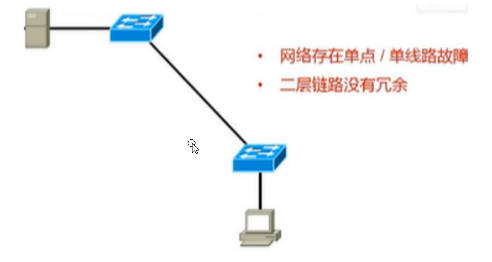
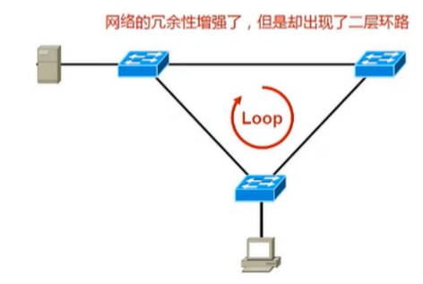
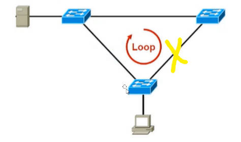

# 网桥

# 核心概念 
## 转发表

| MAC address       | port | age |
| ----------------- | ---- | --- |
| a0:11:22:33:44:55 | 1    | 10  |
| b1:22:22:33:44:55 | 2    | 20  |

- 转发表
 - 每个网桥维护一个MAC转发表
 - 转发表和路由表类似，转发表根据数据包的目的MAC查询转发表，如果匹配，根据转发表的port发送数据包
 - 转发表每一项包含 MAC地址，part , age, 其中 port表示索引号，如eth0 ,eth1

- 地址学习
 - 从某个port入栈的数据包的源MAC域，说明使用此MAC的主机可以从此port访问
 - 每个帧被接受时，根据他的源MAC和port更新转发表
 - 转发表所有项在一段时间后自动删除，15秒

## 生成树协议
### 为什么要STP
为了解决广播风暴

三层协议用 ttl 解决 
二层协议用 stp 解决 

如果使用单链路，存在无冗余的问题，即一条链路断了，必须人工连接另一条链路

如果使用双链路，解决了冗余问题，但是带来ARP广播风暴

使用STP解决ARP广播风暴，原理是主链路工作正常时，不使用备份链路，当主链路断了，则自动启用备份链路

### 生成树流程
#### 选举根桥

