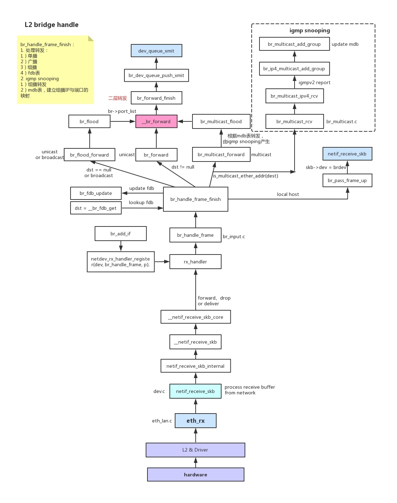

# 网桥

# 核心概念 
## 转发表

| MAC address       | port | age |
| ----------------- | ---- | --- |
| a0:11:22:33:44:55 | 1    | 10  |
| b1:22:22:33:44:55 | 2    | 20  |

- 转发表
 - 每个网桥维护一个MAC转发表
 - 转发表和路由表类似，转发表根据数据包的目的MAC查询转发表，如果匹配，根据转发表的port发送数据包
 - 转发表每一项包含 MAC地址，part , age, 其中 port表示索引号，如eth0 ,eth1

- 地址学习
 - 从某个port入栈的数据包的源MAC域，说明使用此MAC的主机可以从此port访问
 - 每个帧被接受时，根据他的源MAC和port更新转发表
 - 转发表所有项在一段时间后自动删除，15秒

Bridge 维护一个转发数据库（Forwarding Data Base），包含端口号，以及在此端口上学习到的 MAC 地址等信息，用于数据转发（Forwarding）。

数据包根据报文的目的 MAC 查找 FDB 后，将会有以下转发行为之一：
- 报文的目的 MAC 在网桥的另一端口侧，则转发到该端口。
- 找不到对应的转发信息，则泛洪到网桥的所有端口。
- 报文的目的 MAC 为网桥本身的 MAC，则转发到更高的协议层（IP 层）进行处理。
- 报文的目的 MAC 与该数据包进入网桥的端口同侧，则忽略此报文。


## STP

## vlan filter


# VLAN 设备代码分析
## 注册
```c
static int __init vlan_proto_init(void)
```

## send
发送数据包最后调用 `dev->netdev_ops->ndo_start_xmit`

```c
... // 根据目的地址，源地址，设备，查询路由，确定使用vlan设备发送数据帧
dev_queue_xmit(struct sk_buff *skb)
	return __dev_queue_xmit(skb, NULL);
		skb = dev_hard_start_xmit(skb, dev, txq, &rc);
			rc = xmit_one(skb, dev, txq, next != NULL);
				rc = netdev_start_xmit(skb, dev, txq, more);
					rc = __netdev_start_xmit(ops, skb, dev, more);
						return ops->ndo_start_xmit(skb, dev);
```

对于VLAN端口 netdev_ops 为 vlan_netdev_ops

```c
// 调用 vconfig add 添加vlan端口时，创建vlan dev
static int vlan_ioctl_handler(struct net *net, void __user *arg)
	case ADD_VLAN_CMD:
		err = register_vlan_device(dev, args.u.VID);
			new_dev = alloc_netdev(sizeof(struct vlan_dev_priv), name,
					   NET_NAME_UNKNOWN, vlan_setup);
				void vlan_setup(struct net_device *dev)
					dev->netdev_ops = &vlan_netdev_ops;
```

vlan_netdev_ops.ndo_start_xmit 为 vlan_dev_hard_start_xmit

```c
// vlan发送数据帧时，数据帧来源要么是转发，要么是本机生成的，
// 两种情况下，到此函数时，数据帧都绝不会带vlan header
// 对于转发的数据帧，可能数据帧一开始带了vlan header，
// 但是接受函数会去除vlan header，并标记到sk_buff中
static netdev_tx_t vlan_dev_hard_start_xmit(struct sk_buff *skb,
					    struct net_device *dev)
	struct vlan_dev_priv *vlan = vlan_dev_priv(dev);
	struct vlan_ethhdr *veth = (struct vlan_ethhdr *)(skb->data);
	unsigned int len;
	int ret;

	// 通过vlan设备发送的数据帧，绝大部分都要加上vlan header
	// 内核不直接修改skb数据缓存区，而是在skb上标记vlan信息，由硬件添加vlan到数据包
	if (vlan->flags & VLAN_FLAG_REORDER_HDR ||
	    veth->h_vlan_proto != vlan->vlan_proto) {
		u16 vlan_tci;
		vlan_tci = vlan->vlan_id;
		vlan_tci |= vlan_dev_get_egress_qos_mask(dev, skb->priority);
		__vlan_hwaccel_put_tag(skb, vlan->vlan_proto, vlan_tci); // 由网口实现加header
	}

	// 使用真实的设备进行发送
	skb->dev = vlan->real_dev;
	len = skb->len;

	ret = dev_queue_xmit(skb);

	// 更新vlan 设备发包计数器
	if (likely(ret == NET_XMIT_SUCCESS || ret == NET_XMIT_CN)) {
		struct vlan_pcpu_stats *stats;

		stats = this_cpu_ptr(vlan->vlan_pcpu_stats);
		u64_stats_update_begin(&stats->syncp);
		stats->tx_packets++;
		stats->tx_bytes += len;
		u64_stats_update_end(&stats->syncp);
	} else {
		this_cpu_inc(vlan->vlan_pcpu_stats->tx_dropped);
	}

	return ret;

```
## recv data
接受数据包可能三种情况：
1. 无vlan header
2. 有vlan header 但是id不对
3. 有vlan header id正确
```c
static int process_backlog(struct napi_struct *napi, int quota)
	__netif_receive_skb(skb);
		ret = __netif_receive_skb_one_core(skb, false);
			ret = __netif_receive_skb_core(&skb, pfmemalloc, &pt_prev);

another_round:
				// 当开始 skb->dev 为真实设备，比如 eth0, 数据包为802.1q包
				// 第二次运行到这里时，dev为vlan设备，且数据包为802.3包

				skb->skb_iif = skb->dev->ifindex;

				// 当数据帧是带vlan header时，protocol 一定为 ETH_P_8021Q
				// 将数据帧的vlan header信息提取到sk_buff
				// 并去除数据帧vlan header
				if (skb->protocol == cpu_to_be16(ETH_P_8021Q) ||
					skb->protocol == cpu_to_be16(ETH_P_8021AD)) {
					skb = skb_vlan_untag(skb);
						skb->vlan_tci = vlan_tci;
						skb->vlan_present = 1; // vlan_present为1
					                           // 表示skb有vlan信息待处理	
					if (unlikely(!skb))
						goto out;
				}

				...

				// 给所有嗅探器发送skb的拷贝
				// 注意，数据帧的vlan header虽然已经去除，但是skb记录vlan信息
				// 发送给嗅探器的数据帧会重新加上vlan header
				// 所以嗅探器可以抓到 802.1q帧
				list_for_each_entry_rcu(ptype, &ptype_all, list) {
					if (pt_prev)
						ret = deliver_skb(skb, pt_prev, orig_dev);
					pt_prev = ptype;
				}

				list_for_each_entry_rcu(ptype, &skb->dev->ptype_all, list) {
					if (pt_prev)
						ret = deliver_skb(skb, pt_prev, orig_dev);
					pt_prev = ptype;
				}

				...

				// skb->vlan_present == 1 
				// 则交给vlan_do_receive处理
				if (skb_vlan_tag_present(skb)) {
					if (pt_prev) {
						ret = deliver_skb(skb, pt_prev, orig_dev);
						pt_prev = NULL;
					}
					// 主要功能
					// 根据vlan id  proto 找到 vlan设备, 这是个虚拟设备
					// 并设置 skb->dev 为 vlan_dev
					// 如果vlan id 没有找到对应的vlan设备，认为是发送给其他主机的，则返回false，丢弃此包
					// 还有点很重要 skb->vlan_present 设置为 0, 如此返回true后，goto another_round， 
					if (vlan_do_receive(&skb))
						goto another_round;
					else if (unlikely(!skb))
						goto out;
				}

				// 如果是桥设备 rx_handler 不为NULL，
				// 则调用 rx_headler 进行桥处理，如转发
				rx_handler = rcu_dereference(skb->dev->rx_handler);
				if (rx_handler) {
					if (pt_prev) {
						ret = deliver_skb(skb, pt_prev, orig_dev);
						pt_prev = NULL;
					}
					switch (rx_handler(&skb)) {
					case RX_HANDLER_CONSUMED:
						ret = NET_RX_SUCCESS;
						goto out;
					case RX_HANDLER_ANOTHER:
						goto another_round;
					case RX_HANDLER_EXACT:
						deliver_exact = true;
					case RX_HANDLER_PASS:
						break;
					default:
						BUG();
					}
				}

				if (unlikely(skb_vlan_tag_present(skb)) && !netdev_uses_dsa(skb->dev)) {
check_vlan_id:
					if (skb_vlan_tag_get_id(skb)) {
						/* Vlan id is non 0 and vlan_do_receive() above couldn't
						 * find vlan device.
						 */
						// 如果本机没有vlan，但是接受的包带vlan，则将skb标记为发送给其他主机
						// 的报文，可以认为 vlanid 是 mac地址的扩展，
						// 当数据包带vlanid时，skb的mac地址为 mac + vlanid
						// 所以驱动过滤mac地址不相等的skb，剩余的skb在l2层vlan处理时
						// 根据vlan id 进行过滤，只有vlan id 能在对应端口上找到的skb才被
						// 认为是发送给本机的数据包
						skb->pkt_type = PACKET_OTHERHOST;
					} else if (skb->protocol == cpu_to_be16(ETH_P_8021Q) ||
						   skb->protocol == cpu_to_be16(ETH_P_8021AD)) {
						/* Outer header is 802.1P with vlan 0, inner header is
						 * 802.1Q or 802.1AD and vlan_do_receive() above could
						 * not find vlan dev for vlan id 0.
						 */
						__vlan_hwaccel_clear_tag(skb);
						skb = skb_vlan_untag(skb);
						if (unlikely(!skb))
							goto out;
						if (vlan_do_receive(&skb))
							/* After stripping off 802.1P header with vlan 0
							 * vlan dev is found for inner header.
							 */
							goto another_round;
						else if (unlikely(!skb))
							goto out;
						else
							/* We have stripped outer 802.1P vlan 0 header.
							 * But could not find vlan dev.
							 * check again for vlan id to set OTHERHOST.
							 */
							goto check_vlan_id;
					}
					/* Note: we might in the future use prio bits
					 * and set skb->priority like in vlan_do_receive()
					 * For the time being, just ignore Priority Code Point
					 */
					__vlan_hwaccel_clear_tag(skb);
				}


				// 根据数据帧type字段，将skb传递给上层协议
				type = skb->protocol;

				// 比较 ptype_base 中所有协议，将匹配的 packet_type 记录到 pt_prev
				// 如果有多个匹配，则上传前一次匹配的结果
				// 通常只有一个匹配，一般为 pt_prev = &ip_packet_type
				// 所以这里不会进行上传数据包
				if (likely(!deliver_exact)) {
					deliver_ptype_list_skb(skb, &pt_prev, orig_dev, type,
								   &ptype_base[ntohs(type) &
									   PTYPE_HASH_MASK]);
				}

				if (pt_prev)
					*ppt_prev = pt_prev;

				*pskb = skb;
				return ret;

		// 返回到 __netif_receive_skb_one_core
		if (pt_prev)
			// 由于 pt_prev 为 ip_packet_type, 所以调用 ip_rcv
			ret = INDIRECT_CALL_INET(pt_prev->func, ipv6_rcv, ip_rcv, skb,
					 skb->dev, pt_prev, orig_dev);
```

### skb_vlan_untag
```c
struct sk_buff *skb_vlan_untag(struct sk_buff *skb)

	struct vlan_hdr *vhdr;
	u16 vlan_tci;

	// 如果 skb->vlan_present 已经设置了则直接返回
	if (unlikely(skb_vlan_tag_present(skb))) {
		/* vlan_tci is already set-up so leave this for another time */
		return skb;
	}

	// 如果skb被共享，则克隆skb
	skb = skb_share_check(skb, GFP_ATOMIC);

	// 接下来要访问 vlan_hdr 空间，所以先确保skb有这些空间
	/* We may access the two bytes after vlan_hdr in vlan_set_encap_proto(). */
	if (unlikely(!pskb_may_pull(skb, VLAN_HLEN + sizeof(unsigned short))))
		goto err_free;

	vhdr = (struct vlan_hdr *)skb->data;

	// 获得vlan id ，并记录到 skb
	vlan_tci = ntohs(vhdr->h_vlan_TCI);
	__vlan_hwaccel_put_tag(skb, skb->protocol, vlan_tci);
		skb->vlan_proto = vlan_proto;
		skb->vlan_tci = vlan_tci;
		skb->vlan_present = 1;

	// 移动skb->data += VLAN_HLEN, 并重新计算checksum
	skb_pull_rcsum(skb, VLAN_HLEN);

	// 设置上层协议 skb->protocol 比如 ETH_P_802_3
	vlan_set_encap_proto(skb, vhdr);

	// 重组数据帧，去除数据帧中vlan header
	skb = skb_reorder_vlan_header(skb);

	skb_reset_network_header(skb);
	skb_reset_transport_header(skb);
	skb_reset_mac_len(skb);

	return skb;
```

####  skb_reorder_vlan_header
```c
static struct sk_buff *skb_reorder_vlan_header(struct sk_buff *skb)
	// 拷贝skb，因为之后要修改数据缓存区，
	// 所以分配内容包括sk_buff 和 数据缓存区
	skb_cow(skb, skb_headroom(skb);

	// 前面skb->data += VLAN_HLEN，所以当前 data指向 ether type域
	// skb->mac_header 指向源MAC域
	mac_len = skb->data - skb_mac_header(skb);
	if (likely(mac_len > VLAN_HLEN + ETH_TLEN)) {
		// 此时mac_len 包括 源MAC目的MAC域长度 +
		//                  vlan header +    // 长度 VLAN_HLEN
		//                  ETH type      // 长度 ETH_TLEN

		// 将源MAC目的MAC复制到 skb->mac_header + VLAN_HLEN
		// 也就是覆盖了 VLAN header
		memmove(skb_mac_header(skb) + VLAN_HLEN, skb_mac_header(skb),
			mac_len - VLAN_HLEN - ETH_TLEN);
	}

	meta_len = skb_metadata_len(skb);
	if (meta_len) {
		meta = skb_metadata_end(skb) - meta_len;
		memmove(meta + VLAN_HLEN, meta, meta_len);
	}
	
	skb->mac_header += VLAN_HLEN;

	// 返回去除 vlan header的数据帧
	return skb;
```

### vlan_do_receive
```c
bool vlan_do_receive(struct sk_buff **skbp)
{
	struct sk_buff *skb = *skbp;
	__be16 vlan_proto = skb->vlan_proto;
	// 获得vlan id
	u16 vlan_id = skb_vlan_tag_get_id(skb);
	struct net_device *vlan_dev;
	struct vlan_pcpu_stats *rx_stats;

	// 根据vlan id  proto 找到 vlan设备, 这是个虚拟设备
	vlan_dev = vlan_find_dev(skb->dev, vlan_proto, vlan_id);
	if (!vlan_dev)
		return false;

	// 如果skb被共享，则克隆skb
	skb = *skbp = skb_share_check(skb, GFP_ATOMIC);
	if (unlikely(!skb))
		return false;

	// 如果vlan设备没有开启则报错
	if (unlikely(!(vlan_dev->flags & IFF_UP))) {
		kfree_skb(skb);
		*skbp = NULL;
		return false;
	}

	// 将数据帧交给vlan 设备
	skb->dev = vlan_dev;

	// 驱动可能认为这个数据帧不是发给本机的，因为目的MAC不是真实设备MAC
	// 但是可能是vlan的MAC，vlanMAC 可以和真实设备MAC不同
	// 所以这里重新确定是否是发送给本机的
	// 注意，默认情况新建的vlan 设备的mac和真实设备的mac一样
	if (unlikely(skb->pkt_type == PACKET_OTHERHOST)) {
		/* Our lower layer thinks this is not local, let's make sure.
		 * This allows the VLAN to have a different MAC than the
		 * underlying device, and still route correctly. */
		if (ether_addr_equal_64bits(eth_hdr(skb)->h_dest, vlan_dev->dev_addr))
			skb->pkt_type = PACKET_HOST;
	}

	// 如果vlan设备没有设置 VLAN_FLAG_REORDER_HDR 
	// 并且不是 mac vlan
	// 并且不是 桥端口
	// 则将 vlan header 重新添加到 数据帧

	// IFF_MACVLAN_PORT是Linux内核中用于虚拟化MAC地址的网络设备标志。它是一个常量，用于表示一个网络设备是MACVLAN端口。
	// MACVLAN是一种虚拟网络设备，它允许在单个物理网络接口上创建多个虚拟接口，并为每个虚拟接口分配一个独立的MAC地址。这些虚拟接口可以像独立的网络接口一样进行配置和使用，但它们共享物理接口的网络连接。
	// 当一个网络设备被标记为IFF_MACVLAN_PORT时，它表示该设备是一个MACVLAN端口，可以用于创建和管理MACVLAN接口。

	if (!(vlan_dev_priv(vlan_dev)->flags & VLAN_FLAG_REORDER_HDR) &&
	    !netif_is_macvlan_port(vlan_dev) &&
	    !netif_is_bridge_port(vlan_dev)) {
		unsigned int offset = skb->data - skb_mac_header(skb);

		/*
		 * vlan_insert_tag expect skb->data pointing to mac header.
		 * So change skb->data before calling it and change back to
		 * original position later
		 */
		skb_push(skb, offset);
		// 添加vlan header到数据帧
		skb = *skbp = vlan_insert_inner_tag(skb, skb->vlan_proto,
						    skb->vlan_tci, skb->mac_len);
		if (!skb)
			return false;
		skb_pull(skb, offset + VLAN_HLEN);
		skb_reset_mac_len(skb);
	}

	// 根据vlan header的qos，设置skb->priority
	skb->priority = vlan_get_ingress_priority(vlan_dev, skb->vlan_tci);

	__vlan_hwaccel_clear_tag(skb);
		skb->vlan_present = 0;

	// 更新vlan设备的统计计数器
	rx_stats = this_cpu_ptr(vlan_dev_priv(vlan_dev)->vlan_pcpu_stats);

	u64_stats_update_begin(&rx_stats->syncp);
	rx_stats->rx_packets++;
	rx_stats->rx_bytes += skb->len;
	if (skb->pkt_type == PACKET_MULTICAST)
		rx_stats->rx_multicast++;
	u64_stats_update_end(&rx_stats->syncp);

	return true;
}
```


# 桥接受skb代码分析


## br_init
```c
static int __init br_init(void)
	// 注册STP协议
	err = stp_proto_register(&br_stp_proto);

	// 初始化转发数据库
	err = br_fdb_init();

	// 初始化桥 netfilter
	err = br_nf_core_init();

	// 初始化事件通知
	err = register_netdevice_notifier(&br_device_notifier);
	err = register_switchdev_notifier(&br_switchdev_notifier);

	// 初始化桥netlink
	err = br_netlink_init();

	// 初始化桥ioctl
	brioctl_set(br_ioctl_deviceless_stub);
```

## 核心数据结构
### net_bridge
```c
struct net_bridge {
	spinlock_t			lock;
	spinlock_t			hash_lock;
	struct list_head		port_list; // 端口链表
	struct net_device		*dev;    // 桥设备，这是虚拟设备
	struct pcpu_sw_netstats		__percpu *stats;
	unsigned long			options;
	/* These fields are accessed on each packet */
#ifdef CONFIG_BRIDGE_VLAN_FILTERING
	__be16				vlan_proto;
	u16				default_pvid;
	struct net_bridge_vlan_group	__rcu *vlgrp;
#endif

	struct rhashtable		fdb_hash_tbl;
#if IS_ENABLED(CONFIG_BRIDGE_NETFILTER)
	union {
		struct rtable		fake_rtable;
		struct rt6_info		fake_rt6_info;
	};
#endif
	u16				group_fwd_mask;
	u16				group_fwd_mask_required;

	/* STP */
	...
};

```

### net_bridge_port
```c
struct net_bridge_port {
	struct net_bridge		*br; // 端口所属的桥
	struct net_device		*dev; // 端口的设备
	struct list_head		list;

	unsigned long			flags;
#ifdef CONFIG_BRIDGE_VLAN_FILTERING
	struct net_bridge_vlan_group	__rcu *vlgrp;
#endif
	struct net_bridge_port		__rcu *backup_port; // 备用端口

	/* STP */
	u8				priority;
	u8				state;
	u16				port_no;
	unsigned char			topology_change_ack;
	unsigned char			config_pending;
	port_id				port_id;
	port_id				designated_port;
	bridge_id			designated_root;
	bridge_id			designated_bridge;
	u32				path_cost;
	u32				designated_cost;
	unsigned long			designated_age;

	struct timer_list		forward_delay_timer;
	struct timer_list		hold_timer;
	struct timer_list		message_age_timer;
	struct kobject			kobj;
	struct rcu_head			rcu;

#ifdef CONFIG_BRIDGE_IGMP_SNOOPING
	struct bridge_mcast_own_query	ip4_own_query;
#if IS_ENABLED(CONFIG_IPV6)
	struct bridge_mcast_own_query	ip6_own_query;
#endif /* IS_ENABLED(CONFIG_IPV6) */
	unsigned char			multicast_router;
	struct bridge_mcast_stats	__percpu *mcast_stats;
	struct timer_list		multicast_router_timer;
	struct hlist_head		mglist;
	struct hlist_node		rlist;
#endif

#ifdef CONFIG_SYSFS
	char				sysfs_name[IFNAMSIZ];
#endif

#ifdef CONFIG_NET_POLL_CONTROLLER
	struct netpoll			*np;
#endif
#ifdef CONFIG_NET_SWITCHDEV
	int				offload_fwd_mark;
#endif
	u16				group_fwd_mask;
	u16				backup_redirected_cnt;

	struct bridge_stp_xstats	stp_xstats;
}
```

## recv data
在L2层接受skb时，如果skb->dev已经加入了桥(skb->dev->rx_handler不为空)，

则说明此设备作为桥端口使用，

则数据包首先交给桥处理，如果没有加入桥才上传给上层协议

```c
// 网卡驱动调用 netif_receive_skb 传递skb
int netif_receive_skb(struct sk_buff *skb)
	ret = netif_receive_skb_internal(skb);
		ret = __netif_receive_skb(skb);

			... // 给所有嗅探器发送skb的拷贝

			// 处理桥
			rx_handler = rcu_dereference(skb->dev->rx_handler);
			rx_handler(&skb); //  skb->dev->rx_handler 是多少呢？

			... // 给所有匹配的上层协议发送skb的拷贝
```

### dev->rx_handler

当设备加入桥时，dev->rx_handler 通常被设置为为 br_handle_frame

dev->rx_handler_data 为  `struct net_bridge_port *p`

`dev->priv_flags | IFF_BRIDGE_PORT`

```c
int br_add_if(struct net_bridge *br, struct net_device *dev,
	      struct netlink_ext_ack *extack)
	struct net_bridge_port *p;
	p = new_nbp(br, dev);
	err = netdev_rx_handler_register(dev, br_get_rx_handler(dev), p);

rx_handler_func_t *br_get_rx_handler(const struct net_device *dev)
	if (netdev_uses_dsa(dev))
		return br_handle_frame_dummy;
	return br_handle_frame;

int netdev_rx_handler_register(struct net_device *dev,
			       rx_handler_func_t *rx_handler,
			       void *rx_handler_data)
		rcu_assign_pointer(dev->rx_handler_data, rx_handler_data);
		rcu_assign_pointer(dev->rx_handler, rx_handler);
```

### br_handle_frame
```c
static rx_handler_result_t br_handle_frame(struct sk_buff **pskb)

	struct net_bridge_port *p;
	struct sk_buff *skb = *pskb;
	const unsigned char *dest = eth_hdr(skb)->h_dest;

	// 如果skb是回环数据包，不处理
	if (unlikely(skb->pkt_type == PACKET_LOOPBACK))
		return RX_HANDLER_PASS;

	// 获得目的MAC
	const unsigned char *dest = eth_hdr(skb)->h_dest;

	// 丢弃非法源MAC的包，比如源MAC为 广播地址
	if (!is_valid_ether_addr(eth_hdr(skb)->h_source))
		goto drop;

	// 如果 当前skb被共享 skb->users != 1
	// 则克隆skb，并返回新的skb
	skb = skb_share_check(skb, GFP_ATOMIC);

	memset(skb->cb, 0, sizeof(struct br_input_skb_cb));

	// 获得桥端口, 即本网络设备做桥端口使用
	p = br_port_get_rcu(skb->dev);

	// 如果是link local数据包，比如 STP包
	if (unlikely(is_link_local_ether_addr(dest))) {
		...
		return ...;
	}

	// 一般数据包

forward:
	switch (p->state) {
	// 只有当桥处于学习或转发状态才接受数据包
	case BR_STATE_FORWARDING:
	case BR_STATE_LEARNING:
		// 判断是否是发送给本桥的数据包
		if (ether_addr_equal(p->br->dev->dev_addr, dest))
			skb->pkt_type = PACKET_HOST;
	
		// 交给nf处理
		return nf_hook_bridge_pre(skb, pskb);
	default:
drop:
		kfree_skb(skb);
	}
	return RX_HANDLER_CONSUMED;

```

## Forward data
###  nf_hook_bridge_pre
```c
// 如果没有开启 CONFIG_NETFILTER_FAMILY_BRIDGE 则非常简单
static int nf_hook_bridge_pre(struct sk_buff *skb, struct sk_buff **pskb)
	br_handle_frame_finish(net, NULL, skb);
```

### br_handle_frame_finish
```c
int br_handle_frame_finish(struct net *net, struct sock *sk, struct sk_buff *skb)
	struct net_bridge_port *p = br_port_get_rcu(skb->dev);
	enum br_pkt_type pkt_type = BR_PKT_UNICAST;
	struct net_bridge_fdb_entry *dst = NULL;
	struct net_bridge_mdb_entry *mdst;
	bool local_rcv, mcast_hit = false;
	struct net_bridge *br;
	u16 vid = 0;
	u8 state;

	// 没有端口或端口状态为禁用，丢弃包
	if (!p || p->state == BR_STATE_DISABLED)
		goto drop;

	// 更新转发表
	br = p->br;
	if (p->flags & BR_LEARNING)
		br_fdb_update(br, p, eth_hdr(skb)->h_source, vid, 0);

	// 如果开启混淆模式，则桥一定接受
	local_rcv = !!(br->dev->flags & IFF_PROMISC);

	// 确定pkt_type，如果是广播，则桥一定接受
	if (is_multicast_ether_addr(eth_hdr(skb)->h_dest)) {
		/* by definition the broadcast is also a multicast address */
		if (is_broadcast_ether_addr(eth_hdr(skb)->h_dest)) {
			pkt_type = BR_PKT_BROADCAST;
			local_rcv = true; 
		} else {
			pkt_type = BR_PKT_MULTICAST;
			if (br_multicast_rcv(br, p, skb, vid))
				goto drop;
		}
	}

	// 如果只是学习状态，则到此为止
	if (state == BR_STATE_LEARNING)
		goto drop;

	// br->dev ，比如 br0，
	// br0不可能加入其他桥，所以其 rx_handler为NULL。
	// 而其他网口可以加入桥，如果加入了桥，则rx_handler不为NULL
	// 这决定了接受到数据包后如何处理，
	// 如果rx_handler为NULL，则做普通设备处理，
	// 否则，做桥设备处理
	BR_INPUT_SKB_CB(skb)->brdev = br->dev; // 注意br->dev->rx_handler为NULL
	BR_INPUT_SKB_CB(skb)->src_port_isolated = !!(p->flags & BR_ISOLATED);

	// 处理邻居协议的数据包
	// 如果开启了IPv4，则会处理ARP协议
	// 否则若开启IPv6，则会处理ipv6的邻居协议 
	if (IS_ENABLED(CONFIG_INET) &&
	    (skb->protocol == htons(ETH_P_ARP) ||
	     skb->protocol == htons(ETH_P_RARP))) {
		br_do_proxy_suppress_arp(skb, br, vid, p);

	} else if (IS_ENABLED(CONFIG_IPV6) &&
		   skb->protocol == htons(ETH_P_IPV6) &&
		   br_opt_get(br, BROPT_NEIGH_SUPPRESS_ENABLED) &&
		   pskb_may_pull(skb, sizeof(struct ipv6hdr) +
				 sizeof(struct nd_msg)) &&
		   ipv6_hdr(skb)->nexthdr == IPPROTO_ICMPV6) {
			struct nd_msg *msg, _msg;

			msg = br_is_nd_neigh_msg(skb, &_msg);
			if (msg)
				br_do_suppress_nd(skb, br, vid, p, msg);
	}

	// 根据数据包类型和目的地址查询转发表，获得转发端口
	switch (pkt_type) {
	case BR_PKT_MULTICAST:
		mdst = br_mdb_get(br, skb, vid);
		if ((mdst || BR_INPUT_SKB_CB_MROUTERS_ONLY(skb)) &&
		    br_multicast_querier_exists(br, eth_hdr(skb))) {
			if ((mdst && mdst->host_joined) ||
			    br_multicast_is_router(br)) {
				local_rcv = true;
				br->dev->stats.multicast++;
			}
			mcast_hit = true;
		} else {
			local_rcv = true;
			br->dev->stats.multicast++;
		}
		break;
	case BR_PKT_UNICAST:
		dst = br_fdb_find_rcu(br, eth_hdr(skb)->h_dest, vid);
	default:
		// BR_PKT_BROADCAST, dst 为NULL，对所有端口进行转发（除了源端口）
		break;
	}

	if (dst) {
		// 单播的情况，dst不为NULL

		unsigned long now = jiffies;

		// 如果查询转发表发现是本地接受，则调用 br_pass_frame_up 接受数据包
		if (test_bit(BR_FDB_LOCAL, &dst->flags))
			return br_pass_frame_up(skb);

		// 桥转发数据包

		if (now != dst->used)
			dst->used = now;
		br_forward(dst->dst, skb, local_rcv, false);

	} else {
		// 广播或组播
		// 如果是广播，则遍历br->port_list，向每个端口发送一个skb
		// 如果是组播，对所有加入组播的端口发送一个skb

		if (!mcast_hit)
			// 不是组播，则当广播处理
			// 比如收到单播，但是转发表没有找到目的端口，则广播
			br_flood(br, skb, pkt_type, local_rcv, false);
		else
			// 组播
			br_multicast_flood(mdst, skb, local_rcv, false);
	}

	// 组播，本桥也要接受skb
	if (local_rcv)
		return br_pass_frame_up(skb);
```

### br_forward
```c
// br_forward - forward a packet to a specific port

// br_handle_frame_finish
// 		br_forward(dst->dst, skb, local_rcv, false);

// local_rcv ： true/false
// local_orig : false
void br_forward(const struct net_bridge_port *to,
		struct sk_buff *skb, bool local_rcv, bool local_orig)

	if (unlikely(!to))
		goto out;

	/* redirect to backup link if the destination port is down */
	// 如果转发端口无法使用，则使用备用的端口
	if (rcu_access_pointer(to->backup_port) && !netif_carrier_ok(to->dev)) {
		struct net_bridge_port *backup_port;

		backup_port = rcu_dereference(to->backup_port);
		if (unlikely(!backup_port))
			goto out;
		to = backup_port;
	}

	// 过滤掉不应该转发的情况，
	// 如 数据包源端口和转发端口一样
	//    端口不是转发状态
	if (should_deliver(to, skb)) {

		// 不论是本地接受还是转发，最终都调用 __br_forward
		// 区别是本地接受会对skb进行克隆
		if (local_rcv)
			deliver_clone(to, skb, local_orig);
		else
			__br_forward(to, skb, local_orig);
		return;
	}
```

### deliver_clone
```c
static int deliver_clone(const struct net_bridge_port *prev,
			 struct sk_buff *skb, bool local_orig)
{
	struct net_device *dev = BR_INPUT_SKB_CB(skb)->brdev;

	skb = skb_clone(skb, GFP_ATOMIC);
	if (!skb) {
		dev->stats.tx_dropped++;
		return -ENOMEM;
	}

	__br_forward(prev, skb, local_orig);
	return 0;
}
```

### __br_forward
```c
// local_orig : false
static void __br_forward(const struct net_bridge_port *to,
			 struct sk_buff *skb, bool local_orig)

	struct net_bridge_vlan_group *vg;
	struct net_device *indev;
	struct net *net;
	int br_hook;

	vg = nbp_vlan_group_rcu(to);
	skb = br_handle_vlan(to->br, to, vg, skb);
	if (!skb)
		return;

	indev = skb->dev; // 源设备
	skb->dev = to->dev; // 使用目的端口的设备作为数据包发送的设备

	// 如果是本机发出的包，走 NF_BR_LOCAL_OUT ，
	// 否则走 NF_BR_FORWARD
	if (!local_orig) {
		if (skb_warn_if_lro(skb)) {
			kfree_skb(skb);
			return;
		}
		br_hook = NF_BR_FORWARD;
		skb_forward_csum(skb);
		net = dev_net(indev);
	} else {
		if (unlikely(netpoll_tx_running(to->br->dev))) {
			skb_push(skb, ETH_HLEN);
			if (!is_skb_forwardable(skb->dev, skb))
				kfree_skb(skb);
			else
				br_netpoll_send_skb(to, skb);
			return;
		}
		br_hook = NF_BR_LOCAL_OUT;
		net = dev_net(skb->dev);
		indev = NULL;
	}

	NF_HOOK(NFPROTO_BRIDGE, br_hook,
		net, NULL, skb, indev, skb->dev,
		br_forward_finish);


int br_forward_finish(struct net *net, struct sock *sk, struct sk_buff *skb)
{
	skb->tstamp = 0;
	return NF_HOOK(NFPROTO_BRIDGE, NF_BR_POST_ROUTING,
		       net, sk, skb, NULL, skb->dev,
		       br_dev_queue_push_xmit);

}
```
### br_dev_queue_push_xmit
```c
int br_dev_queue_push_xmit(struct net *net, struct sock *sk, struct sk_buff *skb)
{
	skb_push(skb, ETH_HLEN);

	// 确认设备支持转发
	if (!is_skb_forwardable(skb->dev, skb))
		goto drop;

	br_drop_fake_rtable(skb);

	if (skb->ip_summed == CHECKSUM_PARTIAL &&
	    (skb->protocol == htons(ETH_P_8021Q) ||
	     skb->protocol == htons(ETH_P_8021AD))) {
		int depth;

		if (!vlan_get_protocol_and_depth(skb, skb->protocol, &depth))
			goto drop;

		skb_set_network_header(skb, depth);
	}

	// 发送数据包到 qdisc
	dev_queue_xmit(skb);

	return 0;

drop:
	kfree_skb(skb);
	return 0;
}
```

## local input
```c
static int nf_hook_bridge_pre(struct sk_buff *skb, struct sk_buff **pskb)
	// 接受skb
	return br_pass_frame_up(skb);
```
### br_pass_frame_up
```c
static int br_pass_frame_up(struct sk_buff *skb)

	// 获得桥设备
	struct net_device *indev, *brdev = BR_INPUT_SKB_CB(skb)->brdev;
	// 获得桥
	struct net_bridge *br = netdev_priv(brdev);
	struct net_bridge_vlan_group *vg;
	struct pcpu_sw_netstats *brstats = this_cpu_ptr(br->stats);

	// 更新桥的计数器
	u64_stats_update_begin(&brstats->syncp);
	brstats->rx_packets++;
	brstats->rx_bytes += skb->len;
	u64_stats_update_end(&brstats->syncp);

	vg = br_vlan_group_rcu(br);

	/* Reset the offload_fwd_mark because there could be a stacked
	 * bridge above, and it should not think this bridge it doing
	 * that bridge's work forwarding out its ports.
	 */
	br_switchdev_frame_unmark(skb);

	// 如果没有通过vlan，且桥不是混淆模式，则丢弃skb
	if (!(brdev->flags & IFF_PROMISC) &&
	    !br_allowed_egress(vg, skb)) {
		kfree_skb(skb);
		return NET_RX_DROP;
	}

	indev = skb->dev; // 源设备

	// 使用桥设备作为skb的源设备，
	// 注意brdev->rx_handler为NULL, 因为他没有加入任何桥
	skb->dev = brdev; 

	// 过滤vlan
	skb = br_handle_vlan(br, NULL, vg, skb);
	if (!skb)
		return NET_RX_DROP;

	/* update the multicast stats if the packet is IGMP/MLD */
	br_multicast_count(br, NULL, skb, br_multicast_igmp_type(skb),
			   BR_MCAST_DIR_TX);

	return NF_HOOK(NFPROTO_BRIDGE, NF_BR_LOCAL_IN,
		       dev_net(indev), NULL, skb, indev, NULL,
		       br_netif_receive_skb);
		return netif_receive_skb(skb);

```

### br_netif_receive_skb
```c
static int
br_netif_receive_skb(struct net *net, struct sock *sk, struct sk_buff *skb)
{
	br_drop_fake_rtable(skb);

	// 再次调用 netif_receive_skb ，
	// 由于 skb->dev->rx_handler 此时为NULL，
	// 所以不会进入桥相关，而是传给上层协议
	return netif_receive_skb(skb);
}
```

## send data
查询路由，使用br0设备发送数据包，最后调用 dev->ndo_start_xmit
```c
static const struct net_device_ops br_netdev_ops = {
	.ndo_start_xmit		 = br_dev_xmit,
```
### br_dev_xmit
```c
netdev_tx_t br_dev_xmit(struct sk_buff *skb, struct net_device *dev)
{
	struct net_bridge *br = netdev_priv(dev);
	struct net_bridge_fdb_entry *dst;
	struct net_bridge_mdb_entry *mdst;
	struct pcpu_sw_netstats *brstats = this_cpu_ptr(br->stats);
	const struct nf_br_ops *nf_ops;
	u8 state = BR_STATE_FORWARDING;
	const unsigned char *dest;
	u16 vid = 0;

	memset(skb->cb, 0, sizeof(struct br_input_skb_cb));

	// 当前不考虑nf，所以nf_ops默认为NULL
	rcu_read_lock();
	nf_ops = rcu_dereference(nf_br_ops);
	if (nf_ops && nf_ops->br_dev_xmit_hook(skb)) {
		rcu_read_unlock();
		return NETDEV_TX_OK;
	}
	
	// 更新br发送统计
	u64_stats_update_begin(&brstats->syncp);
	brstats->tx_packets++;
	brstats->tx_bytes += skb->len;
	u64_stats_update_end(&brstats->syncp);

	br_switchdev_frame_unmark(skb);
	BR_INPUT_SKB_CB(skb)->brdev = dev;
	BR_INPUT_SKB_CB(skb)->frag_max_size = 0;

	// 调整skb->mac_header 指向 skb->head
	skb_reset_mac_header(skb);
	// 减少数据，增加 headroom
	// skb->data += ETH_HLEN; skb->len -= ETH_HLEN
	skb_pull(skb, ETH_HLEN);

    // bridge vlan filter
	if (!br_allowed_ingress(br, br_vlan_group_rcu(br), skb, &vid, &state))
		goto out;

	if (IS_ENABLED(CONFIG_INET) &&
	    (eth_hdr(skb)->h_proto == htons(ETH_P_ARP) ||
	     eth_hdr(skb)->h_proto == htons(ETH_P_RARP)) &&
	    br_opt_get(br, BROPT_NEIGH_SUPPRESS_ENABLED)) {
		br_do_proxy_suppress_arp(skb, br, vid, NULL);
	} else if (IS_ENABLED(CONFIG_IPV6) &&
		   skb->protocol == htons(ETH_P_IPV6) &&
		   br_opt_get(br, BROPT_NEIGH_SUPPRESS_ENABLED) &&
		   pskb_may_pull(skb, sizeof(struct ipv6hdr) +
				 sizeof(struct nd_msg)) &&
		   ipv6_hdr(skb)->nexthdr == IPPROTO_ICMPV6) {
			struct nd_msg *msg, _msg;

			msg = br_is_nd_neigh_msg(skb, &_msg);
			if (msg)
				br_do_suppress_nd(skb, br, vid, NULL, msg);
	}

	dest = eth_hdr(skb)->h_dest;
	if (is_broadcast_ether_addr(dest)) {
		br_flood(br, skb, BR_PKT_BROADCAST, false, true);
	} else if (is_multicast_ether_addr(dest)) {
		if (unlikely(netpoll_tx_running(dev))) {
			br_flood(br, skb, BR_PKT_MULTICAST, false, true);
			goto out;
		}
		if (br_multicast_rcv(br, NULL, skb, vid)) {
			kfree_skb(skb);
			goto out;
		}

		mdst = br_mdb_get(br, skb, vid);
		if ((mdst || BR_INPUT_SKB_CB_MROUTERS_ONLY(skb)) &&
		    br_multicast_querier_exists(br, eth_hdr(skb)))
			br_multicast_flood(mdst, skb, false, true);
		else
			br_flood(br, skb, BR_PKT_MULTICAST, false, true);
	} else if ((dst = br_fdb_find_rcu(br, dest, vid)) != NULL) {  //查询转发端口
		// 找到端口，单播发送 
		br_forward(dst->dst, skb, false, true);
	} else {
		// 没有找到，广播发送
		br_flood(br, skb, BR_PKT_UNICAST, false, true);
	}
out:
	rcu_read_unlock();
	return NETDEV_TX_OK;
}
```

### br_forward
```c
void br_forward(const struct net_bridge_port *to,
		struct sk_buff *skb, bool local_rcv, bool local_orig)
{
	if (unlikely(!to))
		goto out;

	/* redirect to backup link if the destination port is down */
	// 如果转发端口无法使用，则考虑备用端口
	if (rcu_access_pointer(to->backup_port) && !netif_carrier_ok(to->dev)) {
		struct net_bridge_port *backup_port;

		backup_port = rcu_dereference(to->backup_port);
		if (unlikely(!backup_port))
			goto out;
		to = backup_port;
	}

	// 过滤掉不应该转发的情况，如转发端口是源端口，或者转发端口禁用
	if (should_deliver(to, skb)) {
		if (local_rcv)
			deliver_clone(to, skb, local_orig);
		else
			__br_forward(to, skb, local_orig);
		return;
	}

out:
	if (!local_rcv)
		kfree_skb(skb);
}
```

### __br_forward
```c
static void __br_forward(const struct net_bridge_port *to,
			 struct sk_buff *skb, bool local_orig)
{
	struct net_bridge_vlan_group *vg;
	struct net_device *indev;
	struct net *net;
	int br_hook;

	// 这可能是做交换机策略的vlan逻辑
	vg = nbp_vlan_group_rcu(to);
	skb = br_handle_vlan(to->br, to, vg, skb);
	if (!skb)
		return;

	indev = skb->dev; // br0做源设备
	skb->dev = to->dev; // eth0做输出设备
	if (!local_orig) {
		if (skb_warn_if_lro(skb)) {
			kfree_skb(skb);
			return;
		}
		br_hook = NF_BR_FORWARD;
		skb_forward_csum(skb);
		net = dev_net(indev);
	} else {
		if (unlikely(netpoll_tx_running(to->br->dev))) {
			skb_push(skb, ETH_HLEN);
			if (!is_skb_forwardable(skb->dev, skb))
				kfree_skb(skb);
			else
				br_netpoll_send_skb(to, skb);
			return;
		}
		br_hook = NF_BR_LOCAL_OUT;
		net = dev_net(skb->dev);
		indev = NULL;
	}

	NF_HOOK(NFPROTO_BRIDGE, br_hook,
		net, NULL, skb, indev, skb->dev,
		br_forward_finish);
}
```

### br_forward_finish
```c
int br_forward_finish(struct net *net, struct sock *sk, struct sk_buff *skb)
{
	skb->tstamp = 0;
	return NF_HOOK(NFPROTO_BRIDGE, NF_BR_POST_ROUTING,
		       net, sk, skb, NULL, skb->dev,
		       br_dev_queue_push_xmit);

}
```

### br_dev_queue_push_xmit
```c
int br_dev_queue_push_xmit(struct net *net, struct sock *sk, struct sk_buff *skb)
{
	// 消耗ETH_HLEN headroom
	skb_push(skb, ETH_HLEN);
	if (!is_skb_forwardable(skb->dev, skb))
		goto drop;

	br_drop_fake_rtable(skb);

	if (skb->ip_summed == CHECKSUM_PARTIAL &&
	    (skb->protocol == htons(ETH_P_8021Q) ||
	     skb->protocol == htons(ETH_P_8021AD))) {
		int depth;

		if (!vlan_get_protocol_and_depth(skb, skb->protocol, &depth))
			goto drop;

		skb_set_network_header(skb, depth);
	}

	// 使用端口设备进行发送, 先放入qdisc，最后调用驱动发送
	dev_queue_xmit(skb);

	return 0;

drop:
	kfree_skb(skb);
	return 0;
}
```

# vlan filter 
## br_allowed_ingress

netdev_tx_t br_dev_xmit(struct sk_buff *skb, struct net_device *dev)

	struct net_bridge *br = netdev_priv(dev);
	struct net_bridge_fdb_entry *dst;
	struct net_bridge_mdb_entry *mdst;
	struct pcpu_sw_netstats *brstats = this_cpu_ptr(br->stats);
	const struct nf_br_ops *nf_ops;
	const unsigned char *dest;
	struct ethhdr *eth;
	u16 vid = 0;


	if (!br_allowed_ingress(br, br_vlan_group_rcu(br), skb, &vid))
		goto out;

### br_allowed_ingress

bool br_allowed_ingress(const struct net_bridge *br,
			struct net_bridge_vlan_group *vg, struct sk_buff *skb,
			u16 *vid)
{
	/* If VLAN filtering is disabled on the bridge, all packets are
	 * permitted.
	 */
	if (!br->vlan_enabled) {
		BR_INPUT_SKB_CB(skb)->vlan_filtered = false;
		return true;
	}

	return __allowed_ingress(br, vg, skb, vid);
}
