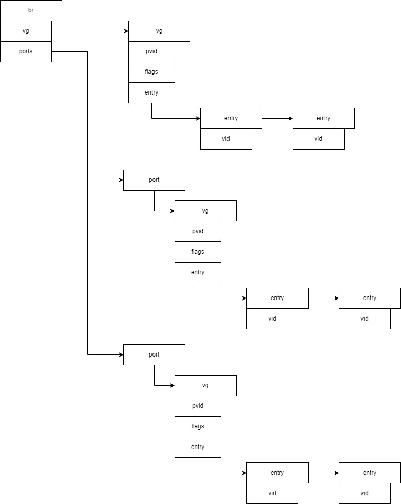
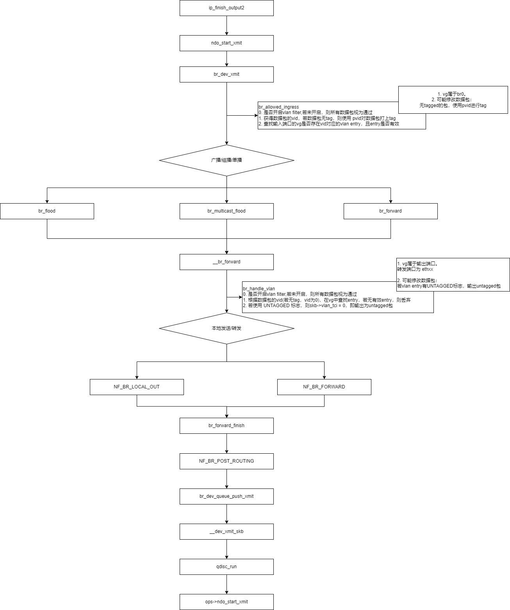
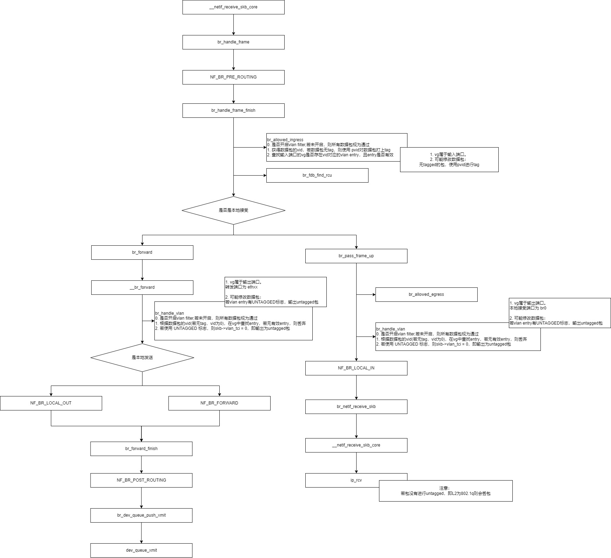

# 数据结构

bridge_id
网桥ID

net_bridge_fdb_entry

net_bridge_port

net_bridge

# 核心函数
## 网桥初始化 br_init

主要完成创建需要的slab池，并注册各种回调。

static const struct stp_proto br_stp_proto = {
	.rcv	= br_stp_rcv,
};

struct rtnl_link_ops br_link_ops __read_mostly = {
    ...
};

static int __init br_init(void)
	err = stp_proto_register(&br_stp_proto);

	err = br_fdb_init();
        br_fdb_cache = kmem_cache_create("bridge_fdb_cache",
                         sizeof(struct net_bridge_fdb_entry),
                         0,
                         SLAB_HWCACHE_ALIGN, NULL);

    // 注册初始化或销毁网络命令空间的 br 的回调函数
	err = register_pernet_subsys(&br_net_ops);

	err = br_nf_core_init();
	err = register_netdevice_notifier(&br_device_notifier);
    // switchdev是为了利用支持硬件转发的交换机，以提高转发性能
	err = register_switchdev_notifier(&br_switchdev_notifier);
	err = br_netlink_init();
    // 初始化 ioctl 各个 cmd 的回调
	brioctl_set(br_ioctl_deviceless_stub);
    

## 创建网桥 br_add_bridge

int br_add_bridge(struct net *net, const char *name)
	struct net_device *dev;
    // 构造dev
	dev = alloc_netdev(sizeof(struct net_bridge), name, NET_NAME_UNKNOWN,
			   br_dev_setup);
            // br 作为 net_device 的派生类，使用 br_dev_setup进行进一步构造
            br_dev_setup(struct net_device *dev)
                dev->netdev_ops = &br_netdev_ops;
                dev->ethtool_ops = &br_ethtool_ops;
                br->dev = dev;
                br_netfilter_rtable_init(br);
                br_stp_timer_init(br);
                br_multicast_init(br);
                ...

	dev_net_set(dev, net);
	dev->rtnl_link_ops = &br_link_ops;
    // 把br注册到kernel
	res = register_netdev(dev);
		ret = dev->netdev_ops->ndo_init(dev);
            br_dev_init(struct net_device *dev)
                br->stats = netdev_alloc_pcpu_stats(struct pcpu_sw_netstats);
                err = br_fdb_hash_init(br);
                err = br_vlan_init(br);
                err = br_multicast_init_stats(br);

## 添加端口

static const struct net_device_ops br_netdev_ops = {
	.ndo_add_slave		 = br_add_slave,
    ...
	.ndo_do_ioctl		 = br_dev_ioctl,
};

// netlink 方式
static int br_add_slave(struct net_device *dev, struct net_device *slave_dev,
			struct netlink_ext_ack *extack)
	struct net_bridge *br = netdev_priv(dev);
	return br_add_if(br, slave_dev, extack);

// ioctl方式
int br_dev_ioctl(struct net_device *dev, struct ifreq *rq, int cmd)
	struct net_bridge *br = netdev_priv(dev);
	switch (cmd) {
	case SIOCBRADDIF:
	case SIOCBRDELIF:
		return add_del_if(br, rq->ifr_ifindex, cmd == SIOCBRADDIF);
            struct net_device *dev;
            dev = __dev_get_by_index(net, ifindex);
            if (isadd)
                ret = br_add_if(br, dev, NULL);
            else
                ret = br_del_if(br, dev);

### br_add_if

int br_add_if(struct net_bridge *br, struct net_device *dev,
	      struct netlink_ext_ack *extack)
	struct net_bridge_port *p;

    // 回环设备和非以太设备不能加入桥
	if ((dev->flags & IFF_LOOPBACK) ||
	    dev->type != ARPHRD_ETHER || dev->addr_len != ETH_ALEN ||
	    !is_valid_ether_addr(dev->dev_addr) ||
	    netdev_uses_dsa(dev))
		return -EINVAL;

    // 桥设备不能再加入桥
	if (dev->netdev_ops->ndo_start_xmit == br_dev_xmit) {
		return -ELOOP;

    // 设备已经加入了另一个桥
	if (netdev_master_upper_dev_get(dev))
		return -EBUSY;

    // 构造端口
	p = new_nbp(br, dev);

	call_netdevice_notifiers(NETDEV_JOIN, dev);

    // 将端口加入kobj sysfs
	err = kobject_init_and_add(&p->kobj, &brport_ktype, &(dev->dev.kobj),
				   SYSFS_BRIDGE_PORT_ATTR);
	err = br_sysfs_addif(p);

    // 设置桥端口设备的特征回调
	err = netdev_rx_handler_register(dev, br_handle_frame, p);
        rcu_assign_pointer(dev->rx_handler_data, rx_handler_data);
        rcu_assign_pointer(dev->rx_handler, rx_handler);

	dev->priv_flags |= IFF_BRIDGE_PORT;

    // 将主设备和从设备建立关联
	err = netdev_master_upper_dev_link(dev, br->dev, NULL, NULL, extack);

    // 端口加入桥
	list_add_rcu(&p->list, &br->port_list);

    // 将接口本地地址条目添加到转发表
	br_fdb_insert(br, p, dev->dev_addr, 0);
        ret = fdb_insert(br, source, addr, vid);

    // 初始化接口的 vlan group，并添加pvid 为 br->default_pvid 的 vlan entry 到 vlan group
	err = nbp_vlan_init(p);
        struct net_bridge_vlan_group *vg;
        vg = kzalloc(sizeof(struct net_bridge_vlan_group), GFP_KERNEL);
        ret = rhashtable_init(&vg->vlan_hash, &br_vlan_rht_params);
        ret = vlan_tunnel_init(vg);
        rcu_assign_pointer(p->vlgrp, vg);
        if (p->br->default_pvid) {
            ret = nbp_vlan_add(p, p->br->default_pvid,
                       BRIDGE_VLAN_INFO_PVID |
                       BRIDGE_VLAN_INFO_UNTAGGED,
                       &changed);

	changed_addr = br_stp_recalculate_bridge_id(br);

## 处理流量

# bridge fdb
每个bridge有自己的转发表，转发表以hash表的结构嵌入bridge，

网桥每学习到一个MAC地址，会在该数据库中插入一个net_bridge_fdb_entry

## fdb_find
以给定的MAC简单搜索net_bridge_fdb_entry，不能用于转发流量

## br_fdb_get
和fdb_find类似，由桥程序调用，用于转发流量，他不考虑过期的数据项

## 转发表的增删改
桥加入新端口时，调用 br_fdb_insert 将端口设备的MAC地址加入fdb

入栈帧学习的MAC地址会由 br_fdb_update 添加到fdb，当该条目已经存在，
则需要更新对入口端口dst的引用，并且更新最近时间戳(ageing_timer)

fdb允许MAC地址重复，但端口不同条目

## 老化
对于每个桥，都有一个定时垃圾回收器(gc_timer)，定期扫描fdb把过期的条目删除，
定时器周期调用 br_fdb_cleanup 扫描fdb，并用fdb_delete删除过期条目

# bridge vlan filter
## data struct

### br
struct net_bridge

### port
struct net_bridge_port

### vg 
struct net_bridge_vlan_group

### entry
struct net_bridge_vlan

### flags
#define BRIDGE_VLAN_INFO_MASTER	(1<<0)	/* Operate on Bridge device as well */
#define BRIDGE_VLAN_INFO_PVID	(1<<1)	/* VLAN is PVID, ingress untagged */
#define BRIDGE_VLAN_INFO_UNTAGGED	(1<<2)	/* VLAN egresses untagged */
#define BRIDGE_VLAN_INFO_RANGE_BEGIN	(1<<3) /* VLAN is start of vlan range */
#define BRIDGE_VLAN_INFO_RANGE_END	(1<<4) /* VLAN is end of vlan range */
#define BRIDGE_VLAN_INFO_BRENTRY	(1<<5) /* Global bridge VLAN entry */

### 对象之间的关系 

## 原理

## init

### brctrl add br0

完成br->vg的初始化，
br->vg 是主VLAN
br->pvid 初始化为1，br->vlan_proto初始化为 ETH_P_8021Q
添加 vid为1的vlan entry，并设置为pvid，untagged

static int br_dev_init(struct net_device *dev)
	err = br_vlan_init(br);
        // 初始化br的vg
        // pvid 默认为 1
        // vlan_proto 默认为 ETH_P_8021Q
        struct net_bridge_vlan_group *vg;
        vg = kzalloc(sizeof(*vg), GFP_KERNEL);
        ret = rhashtable_init(&vg->vlan_hash, &br_vlan_rht_params);
        ret = vlan_tunnel_init(vg);
        INIT_LIST_HEAD(&vg->vlan_list);
        br->vlan_proto = htons(ETH_P_8021Q);
        br->default_pvid = 1;
        rcu_assign_pointer(br->vlgrp, vg);
        // 给 br->vg 添加 vlan entry
        // pvid ： 1
        // untagged : 出栈数据不tagged
        ret = br_vlan_add(br, 1,
                  BRIDGE_VLAN_INFO_PVID | BRIDGE_VLAN_INFO_UNTAGGED |
                  BRIDGE_VLAN_INFO_BRENTRY, &changed);

                // 创建 vlan entry 添加到 br->vg
                // br 的 vlan entry 都是 master
                vg = br_vlan_group(br);
                vlan = br_vlan_find(vg, vid);
                if (vlan)
                    return br_vlan_add_existing(br, vg, vlan, flags, changed);
                vlan = kzalloc(sizeof(*vlan), GFP_KERNEL);
                vlan->stats = netdev_alloc_pcpu_stats(struct br_vlan_stats);
                vlan->vid = vid;
                vlan->flags = flags | BRIDGE_VLAN_INFO_MASTER; // 添加 master
                vlan->flags &= ~BRIDGE_VLAN_INFO_PVID; // 去掉 pvid
                vlan->br = br;
                if (flags & BRIDGE_VLAN_INFO_BRENTRY) // true
                    refcount_set(&vlan->refcnt, 1);
                ret = __vlan_add(vlan, flags);

                    if (br_vlan_is_master(v))
                        br = v->br;
                        dev = br->dev;
                        vg = br_vlan_group(br);

                    if (br_vlan_should_use(v))
                        err = br_fdb_insert(br, p, dev->dev_addr, v->vid);
                        vg->num_vlans++;

                    err = rhashtable_lookup_insert_fast(&vg->vlan_hash, &v->vnode,
                                        br_vlan_rht_params);
                    __vlan_add_list(v);
                    __vlan_add_flags(v, flags);
                        if (br_vlan_is_master(v))
                            vg = br_vlan_group(v->br);
                        if (flags & BRIDGE_VLAN_INFO_PVID)
                            ret = __vlan_add_pvid(vg, v->vid);
                                vg->pvid = vid;
                        if (flags & BRIDGE_VLAN_INFO_UNTAGGED)
                            v->flags |= BRIDGE_VLAN_INFO_UNTAGGED;

## brctrl addif br0 eth0

int br_add_if(struct net_bridge *br, struct net_device *dev,
	      struct netlink_ext_ack *extack)
	struct net_bridge_port *p;
	p = new_nbp(br, dev);
	err = netdev_rx_handler_register(dev, br_handle_frame, p);
	err = nbp_vlan_init(p);

int netdev_rx_handler_register(struct net_device *dev,
			       rx_handler_func_t *rx_handler,
			       void *rx_handler_data)
	rcu_assign_pointer(dev->rx_handler_data, rx_handler_data);
	rcu_assign_pointer(dev->rx_handler, rx_handler);

int nbp_vlan_init(struct net_bridge_port *p)
    // 为端口创建vg
	struct net_bridge_vlan_group *vg;
	vg = kzalloc(sizeof(struct net_bridge_vlan_group), GFP_KERNEL);
	ret = rhashtable_init(&vg->vlan_hash, &br_vlan_rht_params);
	ret = vlan_tunnel_init(vg);
	INIT_LIST_HEAD(&vg->vlan_list);
	rcu_assign_pointer(p->vlgrp, vg);

    // 根据br的pvid给端口添加 vlan entry
    // PVID, UNTAGGED
	if (p->br->default_pvid) { // 默认为1
		ret = nbp_vlan_add(p, p->br->default_pvid,
				   BRIDGE_VLAN_INFO_PVID |
				   BRIDGE_VLAN_INFO_UNTAGGED,
				   &changed);

// 创建vlan entry ，设置vlan->port = port， 进行添加
int nbp_vlan_add(struct net_bridge_port *port, u16 vid, u16 flags,
		 bool *changed)
	struct net_bridge_vlan *vlan;
	vlan = br_vlan_find(nbp_vlan_group(port), vid);
	if (vlan) {
		*changed = __vlan_add_flags(vlan, flags);
		return 0;

	vlan = kzalloc(sizeof(*vlan), GFP_KERNEL);
	vlan->vid = vid;
	vlan->port = port;
	ret = __vlan_add(vlan, flags);

// 将entry 添加到vg
static int __vlan_add(struct net_bridge_vlan *v, u16 flags)
	struct net_bridge_port *p = NULL;
	struct net_bridge_vlan_group *vg;
	struct net_device *dev;
	struct net_bridge *br;

		p = v->port;
		br = p->br;
		dev = p->dev;
		vg = nbp_vlan_group(p);

        // 将vid信息添加到 dev->vlan_info 链表
        // 若硬件支持vlan，则同步给硬件
		err = __vlan_vid_add(dev, br, v->vid, flags);
            return vlan_vid_add(dev, br->vlan_proto, vid);

        // 如果端口添加 vlan 使用了master，则br需要添加同样的vlan
		if (flags & BRIDGE_VLAN_INFO_MASTER) {
			bool changed;
			err = br_vlan_add(br, v->vid,
					  flags | BRIDGE_VLAN_INFO_BRENTRY,
					  &changed);

        // br->vg的vlan都为master vlan，查看br->vg中是否有vid对应的vlan
        // 若无则创建
		masterv = br_vlan_get_master(br, v->vid);
            // 若创建 flags 为 0
            br_vlan_add(br, vid, 0, &changed);

		v->brvlan = masterv;
		v->stats = masterv->stats;

	if (br_vlan_should_use(v)) {
		err = br_fdb_insert(br, p, dev->dev_addr, v->vid);
		vg->num_vlans++;

	err = rhashtable_lookup_insert_fast(&vg->vlan_hash, &v->vnode,
					    br_vlan_rht_params);

	__vlan_add_list(v);
	__vlan_add_flags(v, flags);

// br->vg的vlan都为master vlan
// 查看br->vg是否有vid对应的vlan
// 若没有则添加
static struct net_bridge_vlan *br_vlan_get_master(struct net_bridge *br, u16 vid)
	struct net_bridge_vlan_group *vg;
	struct net_bridge_vlan *masterv;

	vg = br_vlan_group(br);
	masterv = br_vlan_find(vg, vid);
        return br_vlan_lookup(&vg->vlan_hash, vid);
	if (!masterv) {
		if (br_vlan_add(br, vid, 0, &changed))
			return NULL;
		masterv = br_vlan_find(vg, vid);
		refcount_set(&masterv->refcnt, 1);
		return masterv;
	refcount_inc(&masterv->refcnt);
	return masterv;

int br_vlan_add(struct net_bridge *br, u16 vid, u16 flags, bool *changed)
	struct net_bridge_vlan_group *vg;
	struct net_bridge_vlan *vlan;

	vg = br_vlan_group(br);
	vlan = br_vlan_find(vg, vid);

	vlan = kzalloc(sizeof(*vlan), GFP_KERNEL);
	vlan->stats = netdev_alloc_pcpu_stats(struct br_vlan_stats);
	vlan->vid = vid;
	vlan->flags = flags | BRIDGE_VLAN_INFO_MASTER;
	vlan->flags &= ~BRIDGE_VLAN_INFO_PVID;
	vlan->br = br;
	ret = __vlan_add(vlan, flags);
            br = v->br;
            dev = br->dev;
            vg = br_vlan_group(br);
            err = br_fdb_insert(br, p, dev->dev_addr, v->vid);
            vg->num_vlans++;
            err = rhashtable_lookup_insert_fast(&vg->vlan_hash, &v->vnode,
                                br_vlan_rht_params);
            __vlan_add_list(v);
            __vlan_add_flags(v, flags);
                vg = br_vlan_group(v->br);
                ret = __vlan_delete_pvid(vg, v->vid);
                    if (vg->pvid != vid)
                        return false;
                    v->flags &= ~BRIDGE_VLAN_INFO_UNTAGGED;

## 添加vlan

bridge vlan add dev eth0 vid 10 pvid untagged
bridge vlan add dev eth0 vid 10 pvid untagged master
bridge vlan add dev br0 vid 10 pvid untagged self

int br_setlink(struct net_device *dev, struct nlmsghdr *nlh, u16 flags)
	struct net_bridge *br = (struct net_bridge *)netdev_priv(dev);
	struct net_bridge_port *p;
	p = br_port_get_rtnl(dev);
		rtnl_dereference(dev->rx_handler_data) : NULL;
    err = br_afspec(br, p, afspec, RTM_SETLINK, &changed);

static int br_afspec(struct net_bridge *br,
		     struct net_bridge_port *p,
		     struct nlattr *af_spec,
		     int cmd, bool *changed)
	struct bridge_vlan_info *vinfo_curr = NULL;
	struct bridge_vlan_info *vinfo_last = NULL;
	struct nlattr *attr;

    // 从netlink消息解析出 bridge_vlan_info 进行设置
	nla_for_each_nested(attr, af_spec, rem) {
		switch (nla_type(attr)) {
		case IFLA_BRIDGE_VLAN_INFO:
			vinfo_curr = nla_data(attr);
			err = br_process_vlan_info(br, p, cmd, vinfo_curr,
						   &vinfo_last, changed);
                err = br_vlan_info(br, p, cmd, &tmp_vinfo, changed);

static int br_vlan_info(struct net_bridge *br, struct net_bridge_port *p,
			int cmd, struct bridge_vlan_info *vinfo, bool *changed)
	switch (cmd) {
	case RTM_SETLINK:
		if (p) {
            // 在端口上添加，
            // 如果设置了master flag ，则还会在br上添加
			err = nbp_vlan_add(p, vinfo->vid, vinfo->flags,
					   &curr_change);
		} else {
            // 在br上添加
			vinfo->flags |= BRIDGE_VLAN_INFO_BRENTRY;
			err = br_vlan_add(br, vinfo->vid, vinfo->flags,
					  &curr_change);
		}

int nbp_vlan_add(struct net_bridge_port *port, u16 vid, u16 flags,
		 bool *changed)
	struct net_bridge_vlan *vlan;
	vlan = br_vlan_find(nbp_vlan_group(port), vid);
	if (vlan) {
		*changed = __vlan_add_flags(vlan, flags);
		return 0;

	vlan = kzalloc(sizeof(*vlan), GFP_KERNEL);
	vlan->vid = vid;
	vlan->port = port;
	ret = __vlan_add(vlan, flags);

static int __vlan_add(struct net_bridge_vlan *v, u16 flags)
    p = v->port;
    br = p->br;
    dev = p->dev;
    vg = nbp_vlan_group(p);

    err = __vlan_vid_add(dev, br, v->vid, flags);
    if (flags & BRIDGE_VLAN_INFO_MASTER) {
        err = br_vlan_add(br, v->vid,
                  flags | BRIDGE_VLAN_INFO_BRENTRY,
                  &changed);

    masterv = br_vlan_get_master(br, v->vid);
        vg = br_vlan_group(br);
        masterv = br_vlan_find(vg, vid);
        if (!masterv) {
            if (br_vlan_add(br, vid, 0, &changed))
            masterv = br_vlan_find(vg, vid);
        return masterv;

	if (br_vlan_should_use(v)) {
		err = br_fdb_insert(br, p, dev->dev_addr, v->vid);
	err = rhashtable_lookup_insert_fast(&vg->vlan_hash, &v->vnode,
					    br_vlan_rht_params);
	__vlan_add_list(v);
	__vlan_add_flags(v, flags);

## 入栈和转发

### netif_receive_skb_core

static int __netif_receive_skb_core(struct sk_buff **pskb, bool pfmemalloc,
				    struct packet_type **ppt_prev)
	struct packet_type *ptype, *pt_prev;
	rx_handler_func_t *rx_handler;
	struct sk_buff *skb = *pskb;
	struct net_device *orig_dev;

another_round:
	skb->skb_iif = skb->dev->ifindex;

	if (skb->protocol == cpu_to_be16(ETH_P_8021Q) ||
	    skb->protocol == cpu_to_be16(ETH_P_8021AD)) {
		skb = skb_vlan_untag(skb);

    // 抓包
	list_for_each_entry_rcu(ptype, &ptype_all, list) {
		if (pt_prev)
			ret = deliver_skb(skb, pt_prev, orig_dev);
		pt_prev = ptype;
	}
	list_for_each_entry_rcu(ptype, &skb->dev->ptype_all, list) {
		if (pt_prev)
			ret = deliver_skb(skb, pt_prev, orig_dev);
		pt_prev = ptype;
	}

    // 如果是tagged，则根据vid先找real_dev的vlan_dev
    // 如果没有找到vlan_dev返回false, skb 不变
    // 如果找到了并正确处理返回true，
    // 如果找到了但处理失败，如vlan_dev down，则返回false, skb为NULL
	if (skb_vlan_tag_present(skb)) {
		if (vlan_do_receive(&skb))
			goto another_round; // 正确处理，skb变为802.3 , 输入设备为vlan dev
		else if (unlikely(!skb))
			goto out;

    // 若为桥端口, rx_handler为 br_handle_frame
	rx_handler = rcu_dereference(skb->dev->rx_handler);
	if (rx_handler) {
		switch (rx_handler(&skb)) {

### br_handle_frame
rx_handler_result_t br_handle_frame(struct sk_buff **pskb)
	struct net_bridge_port *p;
	struct sk_buff *skb = *pskb;
	const unsigned char *dest = eth_hdr(skb)->h_dest;

    // 非法源MAC丢弃，如 FF:FF:FF:FF:FF:FF
	if (!is_valid_ether_addr(eth_hdr(skb)->h_source))
		goto drop;

	p = br_port_get_rcu(skb->dev); // real_dev

	if (p->flags & BR_VLAN_TUNNEL) {
		if (br_handle_ingress_vlan_tunnel(skb, p,
						  nbp_vlan_group_rcu(p)))
			goto drop;

    // 数据包是否是本地链路地址，即链路协议使用的，而非通用数据包
		/*
		 * See IEEE 802.1D Table 7-10 Reserved addresses
		 *
		 * Assignment		 		Value
		 * Bridge Group Address		01-80-C2-00-00-00
		 * (MAC Control) 802.3		01-80-C2-00-00-01
		 * (Link Aggregation) 802.3	01-80-C2-00-00-02
		 * 802.1X PAE address		01-80-C2-00-00-03
		 *
		 * 802.1AB LLDP 		01-80-C2-00-00-0E
		 *
		 * Others reserved for future standardization
		 */
	if (unlikely(is_link_local_ether_addr(dest))) {
        ...
    }

forward:
    // 端口学习完毕，则进入转发状态
	switch (p->state) {
	case BR_STATE_FORWARDING:
	case BR_STATE_LEARNING:
        // 目的MAC == 本端口的MAC，是发给本机的包
		if (ether_addr_equal(p->br->dev->dev_addr, dest))
			skb->pkt_type = PACKET_HOST;
		NF_HOOK(NFPROTO_BRIDGE, NF_BR_PRE_ROUTING,
			dev_net(skb->dev), NULL, skb, skb->dev, NULL,
			br_handle_frame_finish);
		break;
	default:
drop:
		kfree_skb(skb);

	return RX_HANDLER_CONSUMED;

### br_forward

### br_pass_frame_up
static int br_pass_frame_up(struct sk_buff *skb)
	struct net_device *indev, *brdev = BR_INPUT_SKB_CB(skb)->brdev;
	struct net_bridge *br = netdev_priv(brdev); // 从real_dev 到 br
	struct net_bridge_vlan_group *vg;

	brstats->rx_packets++;
	brstats->rx_bytes += skb->len;

	vg = br_vlan_group_rcu(br); // 得到 br 的 vlan group

    // 除非开启混淆模式（方便抓包）
    // 否则若没通过vlan filter，就丢弃包
	if (!(brdev->flags & IFF_PROMISC) &&
	    !br_allowed_egress(vg, skb)) { // 使用br的 vg进行检测
		kfree_skb(skb);
		return NET_RX_DROP;

	indev = skb->dev; // 输入设备为real_dev
	skb->dev = brdev; // 当前设备改为br

    // BRIDGE_VLAN_INFO_UNTAGGED 则 skb->vlan_tci = 0
    // TODO BR_VLAN_TUNNEL 
	skb = br_handle_vlan(br, NULL, vg, skb); 
	if (!skb)
		return NET_RX_DROP;

    // 如果packet是 IGMP/MLD 则更新组播状态 
	br_multicast_count(br, NULL, skb, br_multicast_igmp_type(skb),
			   BR_MCAST_DIR_TX);

    // 进入 br_nf NF_BR_LOCAL_IN
	return NF_HOOK(NFPROTO_BRIDGE, NF_BR_LOCAL_IN,
		       dev_net(indev), NULL, skb, indev, NULL,
		       br_netif_receive_skb);

## 出栈

### br_dev_xmit
netdev_tx_t br_dev_xmit(struct sk_buff *skb, struct net_device *dev)

	brstats->tx_packets++;
	brstats->tx_bytes += skb->len;

	BR_INPUT_SKB_CB(skb)->brdev = dev;

	skb_reset_mac_header(skb);
	eth = eth_hdr(skb);
	skb_pull(skb, ETH_HLEN);

	if (!br_allowed_ingress(br, br_vlan_group_rcu(br), skb, &vid))
		goto out;

	dest = eth_hdr(skb)->h_dest;
	if (is_broadcast_ether_addr(dest)) {
		br_flood(br, skb, BR_PKT_BROADCAST, false, true);
	} else if (is_multicast_ether_addr(dest)) {
		if (br_multicast_rcv(br, NULL, skb, vid)) {
			kfree_skb(skb);
			goto out;
		}

		mdst = br_mdb_get(br, skb, vid);
		if ((mdst || BR_INPUT_SKB_CB_MROUTERS_ONLY(skb)) &&
		    br_multicast_querier_exists(br, eth_hdr(skb)))
			br_multicast_flood(mdst, skb, false, true);
		else
			br_flood(br, skb, BR_PKT_MULTICAST, false, true);
	} else if ((dst = br_fdb_find_rcu(br, dest, vid)) != NULL) {
		br_forward(dst->dst, skb, false, true);
	} else {
		br_flood(br, skb, BR_PKT_UNICAST, false, true);

### __br_forward
static void __br_forward(const struct net_bridge_port *to,
			 struct sk_buff *skb, bool local_orig)
	struct net_bridge_vlan_group *vg;
	struct net_device *indev;

	vg = nbp_vlan_group_rcu(to);
	skb = br_handle_vlan(to->br, to, vg, skb);

	indev = skb->dev;
	skb->dev = to->dev;

	if (!local_orig) {
		br_hook = NF_BR_FORWARD;
		net = dev_net(indev);
	} else {
		br_hook = NF_BR_LOCAL_OUT;
		net = dev_net(skb->dev);
		indev = NULL;

	NF_HOOK(NFPROTO_BRIDGE, br_hook,
		net, NULL, skb, indev, skb->dev,
		br_forward_finish);

## vlan filter 对数据包的处理
### br_allowed_ingress
bool br_allowed_ingress(const struct net_bridge *br,
			struct net_bridge_vlan_group *vg, struct sk_buff *skb,
			u16 *vid)

    // ip link set br0 type bridge vlan_filtering 1
	if (!br->vlan_enabled) {
		BR_INPUT_SKB_CB(skb)->vlan_filtered = false;
		return true;
	}

	return __allowed_ingress(br, vg, skb, vid);

static bool __allowed_ingress(const struct net_bridge *br,
			      struct net_bridge_vlan_group *vg,
			      struct sk_buff *skb, u16 *vid)
	struct net_bridge_vlan *v;

    // 如果skb->data是vlan包，则确保完成了tag提取
	if (unlikely(!skb_vlan_tag_present(skb) &&
		     skb->protocol == br->vlan_proto)) {
		skb = skb_vlan_untag(skb);

	if (!br_vlan_get_tag(skb, vid)) {
        // 发送的数据包是 tagged frame, 获得vid
		if (skb->vlan_proto != br->vlan_proto) {
			*vid = 0;
			tagged = false;
        }
        tagged = true;
	} else {
        // 发送的数据包是 untagged frame
		tagged = false;
    }

	if (!*vid) { // untagged

        // 获得 vlan group 的 pvid
		u16 pvid = br_get_pvid(vg);

        // 若br没有pvid，则且包没有vid，则丢弃
		if (!pvid)
			goto drop;

        // 任何没有tagged或tag为0的包，使用pvid做包的vid
		*vid = pvid;
		if (likely(!tagged))
			__vlan_hwaccel_put_tag(skb, br->vlan_proto, pvid);
                skb->vlan_proto = vlan_proto;
                skb->vlan_tci = VLAN_TAG_PRESENT | vlan_tci;
        else
            // 优先级标记帧
            // skb->vlan_tci 的 VLAN_TAG_PRESENT已经设置，
            // 但 VID是0，所以只需要更新 VID
			skb->vlan_tci |= pvid;

        // 如果不更新vlan接口状态，则直接返回
		if (!br->vlan_stats_enabled)
			return true;

	}

	v = br_vlan_find(vg, *vid);
    // 找到 vlan entry, 但是 entry 是 master 且不是 brentry 
    // 则只作为上下文，为无效vlan entry
	if (!v || !br_vlan_should_use(v))
		goto drop;

	if (br->vlan_stats_enabled) {
		stats->rx_bytes += skb->len;
		stats->rx_packets++;

	return true;

### br_allowed_egress
bool br_allowed_egress(struct net_bridge_vlan_group *vg,
		       const struct sk_buff *skb)
	const struct net_bridge_vlan *v;
	u16 vid;

	if (!BR_INPUT_SKB_CB(skb)->vlan_filtered)
		return true;

	br_vlan_get_tag(skb, &vid);
        if (skb_vlan_tag_present(skb)) 
            *vid = skb_vlan_tag_get(skb) & VLAN_VID_MASK;
        else
            *vid = 0;
            err = -EINVAL;

	v = br_vlan_find(vg, vid);
        return br_vlan_lookup(&vg->vlan_hash, vid);
            return rhashtable_lookup_fast(tbl, &vid, br_vlan_rht_params);

	if (v && br_vlan_should_use(v))
		return true;

	return false;

