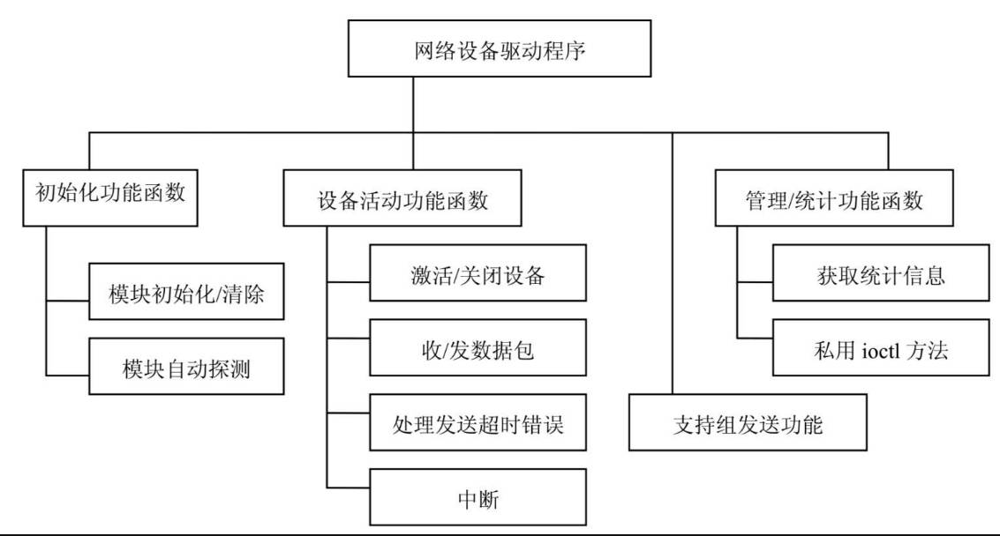
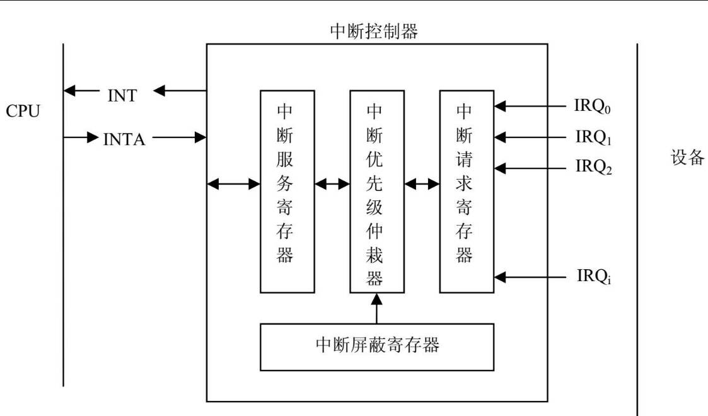
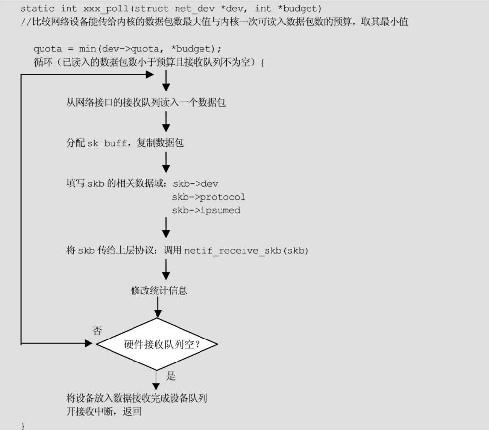

# 介绍
网络设备驱动程序是网络设备和内核之间桥梁，完成网络设备缓冲区和内核空间之间的数据传递。

网络设备驱动程序至少需要完成的功能：

* 接受和发送数据包，注意这些操作都是异步的

* 支持管理任务，如修改网络地址，发送参数等

# 网络驱动程序的构成
## 初始化，探测
如果驱动程序作为模块，在加载模块时init函数构造网络设备的实例 net_device，并注册到内核。

如果驱动程序链接到内核，内核会根据启动参数探测设备，如果匹配，则调用驱动程序的 probe函数

实例化 net_device，并注册到内核。

## 设备活动
net_device创建并注册后，由用户激活就可以进行数据的收发，这些收发都是异步的，所以通常用

中断实现。描述设备活动的函数：

* 激活/停止设备(xx_open/xx_close)

* 收发数据(xx_tx/xx_rx)

* 中断处理程序(xx_interrupt)

## 管理设备
网络设备收发数据时可能出错，需要有出错函数，另外需要对设备工作状态进行统计，方便用户查看，

最后还需要支持用户配置网络参数，如硬件地址，MTU等

* 错误处理/状态统计(xx_tx_timeout/xx_get_state)

* 支持组发送功能的函数(set_muticast_list/set_muticast_address)

* 改变设备配置(change_xxx)

## 总结


网络驱动程序的结构如上，最重要的是数据的收发，由于是异步的，所以内核和网络设备的交互很重要：

当网络设备收到数据时如何通知内核？

当内核发送数据时如何调度网络设备活动？

# 网络设备与内核的交互
网络设备与内核的交互有两个难点：

1. 主机每秒会收到大量的数据包，如何优化中断

2. SMP环境下如何充分利用CPU

## 交互方式概述
### 轮询
CPU周期性查看网络设备寄存器，如果有数据到了，就读取数据。

### 中断
中断在低负载环境可以很好工作，但是高负载情况有如下问题：

1. 网络设备对每个数据包都产生中断，导致中断切换消耗大量时间

2. 中断处理分为两个阶段，阶段一将数据从网络设备复制到内核，阶段二内核协议栈处理数据包，阶段一

的优先级更高，它可以抢占数据处理CPU调度，当网络流量高峰时，网络数据包大量加入入栈队列，导致队

列满了，但是由于处理数据包优先级低，一直没有机会获得CPU将数据包移出队列，导致系统崩溃。

所以Linux网络体系必须对中断做进一步扩展。

### 中断加轮询
当数据包中断发生后，中断下半部禁止网络数据包的中断，以轮询方式读取数据包一段时间，

或者入栈队列满了，然后再开启中断，这种方式就是NAPI模式。

## 中断
### 硬件中断

现代嵌入式环境有个中断控制器，他接受外部设备的各路中断请求信号，将他们放到中断请求寄存器中，

未被CPU屏蔽的中断请求会送入优先级电路，中断控制器产生一个公共中断请求信号INT，CPU收到信号后

发出响应INTA，中断控制器将最高优先级中断号传输给CPU，CPU根据中断号找到中断的入口地址。

一旦硬件设计完成，中断控制器对外的引脚数有限所以中断资源有限，且中断号对应的硬件固定，有时

多个设备可以公用一个硬件中断号。在处理中断请求时，会屏蔽其他中断信号，如果这时其他中断产生，

不能得到CPU响应，所以中断处理程序的执行时间需要尽可能短。

### 网络设备中断事件
* 收到数据包，这是最常见的中断事件

* 发送失败，比如数据包发送超时，响应错误等

* DMA发送结束

驱动发送数据：

同步方式（非DMA）：驱动程序将数据包放到网络设备缓存，就认为发送成功，释放socket buffer

异步方式（DMA）：驱动程序开启DMA发送后，并不知道什么时候发送完成，需要由硬件产生中断通知驱动程序发送操作结束。

当硬件没有足够的缓冲区时，驱动停止内核中该设备发送队列，这样内核就不能发送新的数据包了。

随着数据的不断发送，硬件缓冲区有空，硬件将产生一个中断重启发送队列。

这个过程的逻辑通常是：在数据包发送前，停止内核中对该设备的发送队列，查看设备是否有足够的空间接受新的数据包，

如果有，则重启发送队列，否则在以后以中断方式重启发送队列。
```c

static int
el3_start_xmit(struct sk_buff *skb, struct net_device *dev)
	// 禁止发送队列
	netif_stop_queue (dev);

	...

	// 如果硬件缓存有足够的空间，就重启发送队列
	// 否则些设备寄存器让硬件有足够缓存时通过中断通知内核
	if (inw(ioaddr + TX_FREE) > 1536)
		netif_start_queue(dev);
	else
		/* Interrupt us when the FIFO has room for max-sized packet. */
		outw(SetTxThreshold + 1536, ioaddr + EL3_CMD);
```

### 网络子系统的软中断
网络子系统使用软中断 NET_TX_SOFTIRQ, NET_RX_SOFTIRQ, 都是在 net_dev_init初始化。

因为同一个软中断处理程序可以在不同CPU同时执行，所以网络代码的延迟很小，

两个软中断的优先级都比tasklet一般优先级 TASKLET_SOFTIRQ 高，但低于最高优先级 HI_SOFTIRQ, 保证在网络流量高峰时其他任务也能得到响应。

# 网络驱动程序的实现
## 初始化
驱动程序需要提供xx_probe函数负责探测匹配自己的设备，并构造并注册设备的net_device

drivers/net/isa-skeleton.c 是内核提供的驱动示例

```c
// 内核总线会在初始化时调用此函数
struct net_device * __init netcard_probe(int unit)
{
	// 创建 netdev 以太网类型
	struct net_device *dev = alloc_etherdev(sizeof(struct net_local));
	int err;

	// 根据启动参数等给netdev赋值
	sprintf(dev->name, "eth%d", unit);
	netdev_boot_setup_check(dev);

	// 探测设备
	err = do_netcard_probe(dev);
	if (err)
		goto out;
	return dev;
out:
	free_netdev(dev);
	return ERR_PTR(err);
}

// 探测函数的包装函数
static int __init do_netcard_probe(struct net_device *dev)
{
	int i;
	int base_addr = dev->base_addr;
	int irq = dev->irq;

	// 如果指定了IO端口，则从指定地址探测设备
	if (base_addr > 0x1ff)    /* Check a single specified location. */
		return netcard_probe1(dev, base_addr);
	else if (base_addr != 0)  /* Don't probe at all. */
		return -ENXIO;

	// 没有指定IO端口,遍历可能的IO端口,进行探测
	for (i = 0; netcard_portlist[i]; i++) {
		int ioaddr = netcard_portlist[i];
		if (netcard_probe1(dev, ioaddr) == 0)
			return 0;
		dev->irq = irq;
	}

	return -ENODEV;
}

// 真实的探测函数
static int __init netcard_probe1(struct net_device *dev, int ioaddr)
{
	struct net_local *np;
	static unsigned version_printed;
	int i;
	int err = -ENODEV;

	// 检查IO端口的空间是否已经被占用，如果没有则占用它
	if (!request_region(ioaddr, NETCARD_IO_EXTENT, cardname))
		return -EBUSY;

	// 检查网络设备是否是驱动支持的
	// 检查方法是查看MAC地址前3字节为厂商
	if (inb(ioaddr + 0) != SA_ADDR0
		||	 inb(ioaddr + 1) != SA_ADDR1
		||	 inb(ioaddr + 2) != SA_ADDR2)
		goto out;

	// 设备匹配

	// 记录IO地址
	dev->base_addr = ioaddr;

	// 记录MAC地址
	for (i = 0; i < 6; i++)
		dev->dev_addr[i] = inb(ioaddr + i);

	err = -EAGAIN;
#ifdef jumpered_dma
	//  如果支持DMA，申请DMA
	...
	request_dma(dev->dma, cardname);
	...
#endif	/* jumpered DMA */

	// 初始化设备私有数据结构
	np = netdev_priv(dev);
	spin_lock_init(&np->lock);

	// 初始化驱动函数指针
	dev->open		= net_open;
	dev->stop		= net_close;
	dev->hard_start_xmit	= net_send_packet;
	dev->get_stats		= net_get_stats;
	dev->set_multicast_list = &set_multicast_list;

        dev->tx_timeout		= &net_tx_timeout;
        dev->watchdog_timeo	= MY_TX_TIMEOUT;

	// 注册网络设备
	// 最终 dev 加入 net->dev_base_head 链表
	register_netdev(dev);
		list_add_tail(&dev->dev_list, &net->dev_base_head);
		hlist_add_head(&dev->name_hlist, dev_name_hash(net, dev->name));
		hlist_add_head(&dev->index_hlist, dev_index_hash(net, dev->ifindex));

	return 0;
	...
}
```

## 网络设备的活动功能
### open close
注册网络设备后，不能用于发送数据包，

还需要分配IP，激活设备。

这两个操作在用户空间使用ifconfig执行，ifconfig调用ioctl完成任务：

* ioctl SIOCSIFADDR, 设置IP地址

* ioctl SIOCSIFFLAGS, 设置 dev->flags 的 IFFUP，激活设备

驱动程序没有ioctl，内核会在执行 ioctl SIOCSIFFLAGS时调用驱动的open，或close

1. open
open 完成分配资源，写设备寄存器以激活设备。
```c
static int
net_open(struct net_device *dev)
{
	struct net_local *np = netdev_priv(dev);
	int ioaddr = dev->base_addr;

	// 申请中断, DMA资源
	if (request_irq(dev->irq, &net_interrupt, 0, cardname, dev)) {
		return -EAGAIN;
	}
	if (request_dma(dev->dma, cardname)) {
		free_irq(dev->irq, dev);
		return -EAGAIN;
	}

	// 复位硬件，设置网络设备IO端口地址
	chipset_init(dev, 1);
	outb(0x00, ioaddr);
	np->open_time = jiffies;

	// 启动网络设备发送队列
	netif_start_queue(dev);

	return 0;
}
```

2. stop
```c
static int
net_close(struct net_device *dev)
{
	struct net_local *lp = netdev_priv(dev);
	int ioaddr = dev->base_addr;

	lp->open_time = 0;

	// 停止设备发送队列
	netif_stop_queue(dev);

	// 将发送队列剩余数据包全部发出，释放DMA，中断
	disable_dma(dev->dma);
	outw(0x00, ioaddr+0);
	free_irq(dev->irq, dev);
	free_dma(dev->dma);

	return 0;
}
```
## 发送数据包
当内核要发送数据时调用netdev->hard_start_xmit.

hard_start_xmit会尽可能保证发送成功，

如果成功返回0，内核会释放socket buffer, 

如果返回非0，发送失败，内核会过一段时间后重新发送，这时驱动程序应该停止发送队列，直到错误恢复。

```c
	dev->hard_start_xmit	= net_send_packet;
```

```c
static int net_send_packet(struct sk_buff *skb, struct net_device *dev)
{
	struct net_local *np = netdev_priv(dev);
	int ioaddr = dev->base_addr;
	short length = ETH_ZLEN < skb->len ? skb->len : ETH_ZLEN;
	unsigned char *buf = skb->data;

#if TX_RING
	// 用np->lock保证SMP不冲突
	spin_lock_irq(&np->lock);

	// 将数据包加入网络设备的循环发送队列，记录最近发送时间
	// 加入队列并没有真正放到硬件缓冲区
	add_to_tx_ring(np, skb, length);
	dev->trans_start = jiffies;

	// 如果发送队列满了，告诉内核停止使用该设备发送数据包，即停止发送队列
	if (tx_full(dev))
		netif_stop_queue(dev);

	spin_unlock_irq(&np->lock);
#else
	// 以下是老版本代码，一次发送一个数据包，数据包写入硬件IO端口，更新统计信息，记录起始发送时间
	hardware_send_packet(ioaddr, buf, length);
	np->stats.tx_bytes += skb->len;

	dev->trans_start = jiffies;

	// 如果出错，复位硬件，更新错误统计信息，释放 socket buffer
	if (inw(ioaddr) == /*RU*/81)
		np->stats.tx_aborted_errors++;
	dev_kfree_skb (skb);
#endif

	return 0;
}

// 当网络设备收到数据包时，发送中断，内核调用 net_interrupt
static irqreturn_t net_interrupt(int irq, void *dev_id)
{
	struct net_device *dev = dev_id;
	struct net_local *np;
	int ioaddr, status;
	int handled = 0;

	// 根据IO端口信息，获得中断原因 status
	ioaddr = dev->base_addr;

	np = netdev_priv(dev);
	status = inw(ioaddr + 0);

	if (status == 0)
		goto out;
	handled = 1;

	// 如果是由于接受到数据包导致的中断，调用 net_rx 处理
	if (status & RX_INTR) {
		/* Got a packet(s). */
		net_rx(dev);
	}
#if TX_RING
	// 如果是发送数据包导致的中断，
	// 当使用 TX_RING时，内核只是将数据包缓存到 tx ring就认为发送成功
	// 当设备完成一个数据包的发送后，给CPU发送中断，内核需要完成资源
	// 回收，更新计数等工作
	if (status & TX_INTR) {
		/* Transmit complete. */
		net_tx(dev);
		np->stats.tx_packets++;
		netif_wake_queue(dev);
	}
#endif
	if (status & COUNTERS_INTR) {
		/* Increment the appropriate 'localstats' field. */
		np->stats.tx_window_errors++;
	}
out:
	return IRQ_RETVAL(handled);
}

#if TX_RING
// 设备通知通过中断通知的 处理TX完成事件
void net_tx(struct net_device *dev)
{
	struct net_local *np = netdev_priv(dev);
	int entry;

	/* This protects us from concurrent execution of
	 * our dev->hard_start_xmit function above.
	 */
	spin_lock(&np->lock);

	// 释放所有已经发送了的 skb
	entry = np->tx_old;
	while (tx_entry_is_sent(np, entry)) {
		struct sk_buff *skb = np->skbs[entry];

		np->stats.tx_bytes += skb->len;
		dev_kfree_skb_irq (skb);

		entry = next_tx_entry(np, entry);
	}
	np->tx_old = entry;

	/* If we had stopped the queue due to a "tx full"
	 * condition, and space has now been made available,
	 * wake up the queue.
	 */
	// 如果设备因为tx ring 满了而停止发送则唤醒设备
	if (netif_queue_stopped(dev) && ! tx_full(dev))
		netif_wake_queue(dev);

	spin_unlock(&np->lock);
}
#endif
```
### 网络设备的工作特点

网络设备和CPU是并行工作，网络设备按照给定的MAC层协议自动向网络介质发送或接受数据包，

网络设备和CPU之间通过IO端口（寄存器）和中断进行交互，

当需要发送数据时，CPU将数据写到IO端口，并设置设备控制寄存器开始发送，

当网络设备收到数据包时，他产生中断，CPU执行中断服务程序接受数据包。

当内核调用 dev->hard_start_xmit/ndo_start_xmit (这里就是net_send_packet) 

将数据包放到设备缓冲区，设备会自动将数据发送到网络介质，

当数据包被成功复制到设备缓冲区，内核就认为数据包发送成功，那么dev->hard_start_xmit返回0，


内核和设备之间发送数据包时，需要区分两种技术：

* 老技术，网络设备一次只能容纳一个数据包，如果缓冲区为空，数据包可以立即复制到网络设备上，内核可以释放对应 socket buffer

* 新技术，驱动程序管理着一个循环缓冲区，其中存放16-64个指针，指向要发送的socket buffer, 当一个数据包要发送时，将他的地址放到缓存区，一个数据包发送完成后，网络设备产生中断，刚发送的socket buffer 可以释放。

新技术下， 驱动发送数据前需要检查循环缓冲区（发送队列）释放满了，如果满了则停止队列，直到设备产生发送完成的中断，在中断处理程序中发现有新的空间就重启发送队列。

### 数据发送超时
驱动需要考虑硬件失效的情况，处理方法是设置一个定时器，在向硬件发出发送指令后，启动定时器，如果直到超时发送仍没有结束，则认为发送出错，驱动程序需要处理这个错误。

在示例程序中，probe时初始化了dev->watchdog_timeo，数据包发送过程的时间超过了watchdog_timeo的值，触发发送超时处理函数 tx_timeout，该函数负责分析错误，一般是重启硬件，重新发送。

```c
static void net_tx_timeout(struct net_device *dev)
{
	struct net_local *np = netdev_priv(dev);

	//  重启硬件
	chipset_init(dev, 1);

	// 增加错误统计计数
	np->stats.tx_errors++;

	// 如果有剩余空间，重启发送队列，让内核可以添加新数据包
	// 对于老的数据包，由于发送队列中指向的socket buffer并没有释放，所以会重新发送
	if (!tx_full(dev))
		netif_wake_queue(dev);
}


```

## 接受数据包
接受数据包的主要任务是分配socket buffer,

从设备获得数据包拷贝到socket buffer，并设置 skbuff

将接受的数据包放到CPU输入队列
```c
// 当网络设备收到数据包时，发送中断，内核调用 net_interrupt
static irqreturn_t net_interrupt(int irq, void *dev_id)
{
	struct net_device *dev = dev_id;
	struct net_local *np;
	int ioaddr, status;
	int handled = 0;

	// 根据IO端口信息，获得中断原因 status
	ioaddr = dev->base_addr;

	np = netdev_priv(dev);
	status = inw(ioaddr + 0);

	if (status == 0)
		goto out;
	handled = 1;

	// 如果是由于接受到数据包导致的中断，调用 net_rx 处理
	if (status & RX_INTR) {
		/* Got a packet(s). */
		net_rx(dev);
	}
#if TX_RING
	// 如果是发送数据包导致的中断，
	// 当使用 TX_RING时，内核只是将数据包缓存到 tx ring就认为发送成功
	// 当设备完成一个数据包的发送后，给CPU发送中断，内核需要完成资源
	// 回收，更新计数等工作
	if (status & TX_INTR) {
		/* Transmit complete. */
		net_tx(dev);
		np->stats.tx_packets++;
		netif_wake_queue(dev);
	}
#endif
	if (status & COUNTERS_INTR) {
		/* Increment the appropriate 'localstats' field. */
		np->stats.tx_window_errors++;
	}
out:
	return IRQ_RETVAL(handled);
}

static void
net_rx(struct net_device *dev)
{
	struct net_local *lp = netdev_priv(dev);
	int ioaddr = dev->base_addr;
	int boguscount = 10;

	do {
		// 读取寄存器获取数据包状态和长度
		int status = inw(ioaddr);
		int pkt_len = inw(ioaddr);

		if (pkt_len == 0)		/* Read all the frames? */
			break;			/* Done for now */

		if (status & 0x40) {	/* There was an error. */
			lp->stats.rx_errors++;
			if (status & 0x20) lp->stats.rx_frame_errors++;
			if (status & 0x10) lp->stats.rx_over_errors++;
			if (status & 0x08) lp->stats.rx_crc_errors++;
			if (status & 0x04) lp->stats.rx_fifo_errors++;
		} else {
			// 数据包正确

			/* Malloc up new buffer. */
			struct sk_buff *skb;

			lp->stats.rx_bytes+=pkt_len;

			// 分配 socket buffer
			skb = dev_alloc_skb(pkt_len);
			skb->dev = dev;

			// 拷贝数据包到socket buffer的数据缓存区
			// 使用 memcpy （设备缓冲区为内存映射方式）
			// 或者使用IO端口读取（设备缓冲区使用IO端口方式）
			memcpy(skb_put(skb,pkt_len), (void*)dev->rmem_start,
				   pkt_len);
			insw(ioaddr, skb->data, (pkt_len + 1) >> 1);

			// 将数据包放到CPU接受队列，并更新统计信息
			netif_rx(skb);
			lp->stats.rx_packets++;
			lp->stats.rx_bytes += pkt_len;
		}
	} while (--boguscount);

	return;
}
```

## 中断处理程序
网络设备的中断原因有很多，这里只关心两个

* 接受到一个新的数据包

* 上次发送数据包结束

驱动程序需要区分网络设备中断的原因，然后调用对应的处理方法，

通常硬件中断导致CPU调度驱动的中断处理程序，驱动需要读取设备的寄存器判断中断原因。

```c
static irqreturn_t net_interrupt(int irq, void *dev_id)
{
	struct net_device *dev = dev_id;
	struct net_local *np;
	int ioaddr, status;
	int handled = 0;

	ioaddr = dev->base_addr;

	np = netdev_priv(dev);
	// 读取寄存器状态，如果当前没有中断则退出
	status = inw(ioaddr + 0);
	if (status == 0)
		goto out;

	handled = 1;
	// 接受新数据包导致的中断
	if (status & RX_INTR) {
		/* Got a packet(s). */
		net_rx(dev);
	}
#if TX_RING
	// 数据包发送成功导致的中断
	if (status & TX_INTR) {
		/* Transmit complete. */
		net_tx(dev);
		np->stats.tx_packets++;
		netif_wake_queue(dev);
	}
#endif
	if (status & COUNTERS_INTR) {
		/* Increment the appropriate 'localstats' field. */
		np->stats.tx_window_errors++;
	}
out:
	return IRQ_RETVAL(handled);
}
```
### 处理发送数据包成功的中断
主要任务是更新统计信息，释放已发送的socket buffer, 重启网络设备发送队列
```c
void net_tx(struct net_device *dev)
{
	struct net_local *np = netdev_priv(dev);
	int entry;

	spin_lock(&np->lock);

	entry = np->tx_old;
	while (tx_entry_is_sent(np, entry)) {
		struct sk_buff *skb = np->skbs[entry];

		// 更新统计信息，并释放socket buffer
		np->stats.tx_bytes += skb->len;
		dev_kfree_skb_irq (skb); // 发送NET_TX_SOFTIRQ 软中断
			raise_softirq_irqoff(NET_TX_SOFTIRQ);

		entry = next_tx_entry(np, entry);
	}
	np->tx_old = entry;

	// 如果曾经停止过队列，且现在发送队列有空间，则唤醒队列
	if (netif_queue_stopped(dev) && ! tx_full(dev))
		netif_wake_queue(dev);

	spin_unlock(&np->lock);
}
```

### 处理接受数据包的中断
接受数据包的主要任务是分配socket buffer,

从设备获得数据包拷贝到socket buffer，并设置 skbuff

将接受的数据包放到CPU输入队列
```c
static void
net_rx(struct net_device *dev)
{
	struct net_local *lp = netdev_priv(dev);
	int ioaddr = dev->base_addr;
	int boguscount = 10;

	do {
	// 读取寄存器获取数据包状态和长度
		int status = inw(ioaddr);
		int pkt_len = inw(ioaddr);

		if (pkt_len == 0)		/* Read all the frames? */
			break;			/* Done for now */

		if (status & 0x40) {	/* There was an error. */
			lp->stats.rx_errors++;
			if (status & 0x20) lp->stats.rx_frame_errors++;
			if (status & 0x10) lp->stats.rx_over_errors++;
			if (status & 0x08) lp->stats.rx_crc_errors++;
			if (status & 0x04) lp->stats.rx_fifo_errors++;
		} else {
			// 数据包正确

			/* Malloc up new buffer. */
			struct sk_buff *skb;

			lp->stats.rx_bytes+=pkt_len;

			// 分配 socket buffer
			skb = dev_alloc_skb(pkt_len);
			skb->dev = dev;

			// 拷贝数据包到socket buffer的数据缓存区
			// 使用 memcpy （设备缓冲区为内存映射方式）
			// 或者使用IO端口读取（设备缓冲区使用IO端口方式）
			memcpy(skb_put(skb,pkt_len), (void*)dev->rmem_start,
				   pkt_len);
			insw(ioaddr, skb->data, (pkt_len + 1) >> 1);

			// 将数据包放到CPU接受队列，并更新统计信息
			netif_rx(skb); // 发送 NET_RX_SOFTIRQ 软中断
				__raise_softirq_irqoff(NET_RX_SOFTIRQ);  
			lp->stats.rx_packets++;
			lp->stats.rx_bytes += pkt_len;
		}
	} while (--boguscount);

	return;
}
```
#### 优化接受数据包
一般的接受数据包时，每触发一个中断，接受一个数据包，如果流量高峰会导致中断消耗很大。

NAPI就是用于解决这个问题，NAPI是中断加轮询的方式，当获得接受数据包中断，则进入轮询模式，轮询一段时间接受数据包。

要将一般的接受中断改成NAPI需要注意：

dev->poll : 函数指针，实现轮询读取设备

dev->weight : 描述CPU一次可从设备读入多少数据包

将中断处理关于接受数据包部分改成：

```c
	if (status & RX_INTR) {
		.. // 关中断

		netif_rx_schedule(dev);
	}
```
netif_rx_schedule 会调用 poll

poll 的逻辑为



## 支持组播
网络设备通过分析数据包的MAC层地址判断是否接受数据包，这是硬件判断不需要CPU参与，对于单播和广播的判断很简单，

但是组播，设备通常管理一组组播地址表，主机需要发送加入的组播地址给设备，网络设备根据组播地址表判断是否接受。

所以驱动程序需要提供发送加入组播的功能，任务就是接受内核发送来的组播地址，将其送往设备硬件。

组播包指能被特定组的主机接受的包，组播功能通过为一组主机分配特殊的硬件地址实现。

组播功能最复杂的部分已由应用层和内核实现，驱动接口不需要关心这些问题，对于驱动接口而言，

组播包的发送和其他数据包一样，只需要将其放到设备缓存。内核已经为其分配了正确的地址。

内核需要完成的工作是跟踪有效组播地址列表，因为这些地址随时可能变化，应用程序负责修改组播地址列表，

驱动程序负责接受符合组播地址列表的数据包，传递给内核。

至于驱动应该如何实现，依赖于设备提供的功能，大多数属于下面3种：

1. 硬件接口不能自己处理组播包，这类接口只能接受与自己地址匹配的数据包和所有数据包，只能通过接受所有数据包来实现组播的接受，这种接受方式会导致CPU负荷过大，对于这种设备不能使用组播功能，dev->flags 的 IFFMULTICAST位不应设置。

但点对点接口是特殊，因为点对点设备不做任何过滤，他们总是接受所有数据包。

2. 接口可以区分组播包和其他数据包，这类设备接受所有的组播包，有内核判断是否为发送给本机的组播包，这种工作方式在可接受范围内。

3. 接口可以检测发送的硬件地址，这些接口提供一个组播地址列表，只接受符合组播地址列表的组播包，对于内核而言是最有方式。

### 内核对组播的支持
1. 数据结构
```c
dev->mc_list : 本设备的组播地址表
dev->mc_count : 查看是否需要做组发送，查看mc_count是否为0，比查看mc_list是否为空更快。
```
2. 设备标志
设备标志说明了网络设备是否工作在组发送模式。

IFFMULTICAST : 设备工作在组播模式

IFFALLMULTI : 接受所有的组播包，不使用mc_list 过滤

IFFPROMISC : 混杂模式，接受所有数据包

3. 驱动接口函数 dev->set_muticast_list
```c
static void
set_multicast_list(struct net_device *dev)
{
	short ioaddr = dev->base_addr;
	// 设备使能混杂模式
	if (dev->flags&IFF_PROMISC)
	{
		outw(MULTICAST|PROMISC, ioaddr);
	}
	// 设备接受所有组播包，或组播地址数量大于硬件最大能存放的地址数量
	// 禁止混杂模式，接受所有组播包
	else if((dev->flags&IFF_ALLMULTI) || dev->mc_count > HW_MAX_ADDRS)
	{
		/* Disable promiscuous mode, use normal mode. */
		hardware_set_filter(NULL);

		outw(MULTICAST, ioaddr);
	}
	// 设备接受组播包
	// 禁止混杂模式，接受部分组播包
	else if(dev->mc_count)
	{
		/* Walk the address list, and load the filter */
		hardware_set_filter(dev->mc_list);

		outw(MULTICAST, ioaddr);
	}
	else
		outw(0, ioaddr);
}
```
