# 全景图

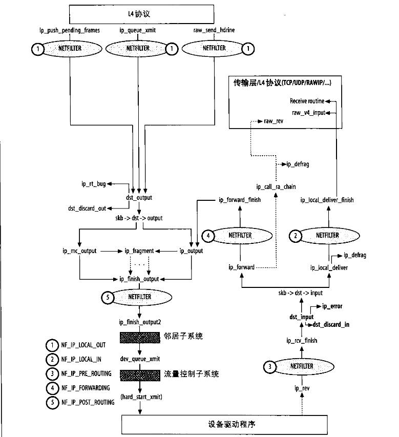

# IP协议
L3层有很多协议，其中使用最多的是IP协议

## IP协议的任务
1. 数据包的校验和检查

2. 防火墙对数据包的过滤

3. IP选项处理

4. 数据的分片和重组

IP协议头描述数据包长度的数据域为16位，所以IP数据包最大为64KB，

但由于网络设备有MTU，所以IP协议需要对数据包进行分片和重组

5. 发送转发接受

在IP层处理数据包分为接受，转发，发送，每一类由不同的IP协议函数处理

## IP协议头
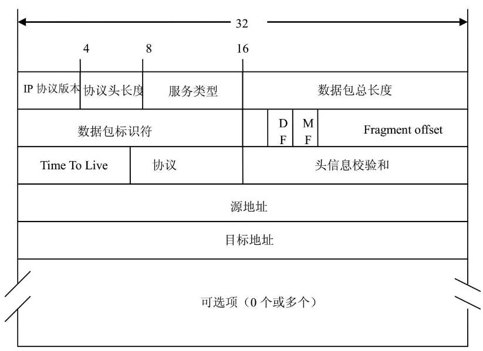

```c
struct iphdr {
#if defined(__LITTLE_ENDIAN_BITFIELD)
	__u8	ihl:4,
		version:4;
#elif defined (__BIG_ENDIAN_BITFIELD)
	__u8	version:4,
  		ihl:4;        // IP协议头长度
#else
#error	"Please fix <asm/byteorder.h>"
#endif
	__u8	tos;       // 服务类型 
	__be16	tot_len;   // IP数据包长度
	__be16	id;        // IP数据包标识符
	__be16	frag_off;  // 分片数据在数据包中的偏移量
	__u8	ttl;       // 数据包生存时间
	__u8	protocol;  // 上层协议
	__sum16	check;     // 校验和
	__be32	saddr;     // 源IP
	__be32	daddr;     // 目的IP
	/*The options start here. */
};
```

## IP子系统初始化
```c
static int __init inet_init(void)
{
	...
	// 注册传输层协议包处理结构体实例
	// ARP协议模块
	arp_init();
		dev_add_pack(&arp_packet_type);
	ip_init();
		ip_rt_init(); // 初始化路由子系统
		inet_initpeers(); // 初始化裸IP
	tcp_v4_init();

	// 创建TCP/UDP使用的slab	
	tcp_init();
	udp_init();

	...

	// 添加IP协议
	dev_add_pack(&ip_packet_type);

	...
}

static struct packet_type ip_packet_type __read_mostly = {
	.type = cpu_to_be16(ETH_P_IP),
	.func = ip_rcv,
	.list_func = ip_list_rcv,
};
```

IP协议处理数据时，会调用网络过滤子系统和路由子系统。

## 与网络过滤子系统的交互
网络过滤子系统在TCP/IP协议栈出现的场合有：
* 接受数据包时
* 转发数据包（路由决策前）
* 转发数据包（路由决策后）
* 发送数据包

上面的每一处，相应的协议处理函数都分两个阶段

第一阶段函数为 do_something(如 ip_rcv) ，do_something只对数据包做必要的合法性检测，或为数据包预留需要的内存空间。

第二阶段函数为 do_something_finish(如 ip_rcv_finish), 是实际完成接受/发送的函数，在do_something完成对数据包合法性检测并预留空间后，在函数结束返回时调用网络过滤子系统的回调函数 NF_HOOK 来对网络数据包进行安全性检查。该回调函数的参数之一就是：当前是哪个功能点处调用的网络过滤回调函数（接受数据包时，还是发送数据包时）。

如果用户使用iptables配置了过滤规则，则会执行过滤回调函数，否则，就跳过数据包过滤，直接执行do_something_finish

网络过滤子系统回调函数的格式为：

```c
NF_HOOK(pf /*协议*/, hook /*hook点*/, 
	skb /*被检查的数据包*/, indev /*输入设备的index*/, 
	outdev /*输出设备*/, okfn /*通过过滤后调用的函数*/) 

static inline int
NF_HOOK(uint8_t pf, unsigned int hook, struct net *net, struct sock *sk,
	struct sk_buff *skb, struct net_device *in, struct net_device *out,
	int (*okfn)(struct net *, struct sock *, struct sk_buff *))
{
	return okfn(net, sk, skb);
}

// 示例
	return NF_HOOK(NFPROTO_IPV4, NF_INET_FORWARD,
		       net, NULL, skb, skb->dev, rt->dst.dev,
		       ip_forward_finish);
```
NF_HOOK 的输出可以以下情况
* 执行 okfn : 如果数据通过安全检查
* -EPERM : 过滤系统扔掉数据包
* -ENOMEM : 过滤系统内存不足

## 与路由子系统的交互
这里介绍在IP层用到查询路由表的API：

* ip_route_input : 接受数据包时调用，根据输入数据包的目的地址，确认是否接受，转发，或扔掉

* ip_route_output_flow : 发送/转发时调用，该函数返回数据包发送路径中网关IP(根据网关IP查询邻居子系统获得下一跳MAC)和发送数据包的网络设备

~~dst_pmtu : 该函数的输入参数为路由表入口，返回数据包发送路径上最大传输单元MTU~~

对路由表查询的结果保存在 skb->dst 

# 输入数据包在IP层的处理
## 从L2到L3
数据链路层调用 netif_receive_skb 上传数据包， netif_receive_skb 会根据 skb->protocol 查询 ptype_base 哈希表，遍历执行哈希链上的 packet_type->func，对于IP协议就是 ip_rcv

skb 随着数据包分析时，结构体变化
```c
// 驱动接受数据包, 分析数据链路层
net_rx
	skb = dev_alloc_skb(length + 2); // 分配的数据包长度增加2，2是为了对齐，因为MAC层头部14字节，为了16字节对齐
		struct sk_buff *skb = alloc_skb(length + NET_SKB_PAD, gfp_mask);
			return __alloc_skb(size, priority, 0, -1);
				skb = kmem_cache_alloc_node(cache, gfp_mask & ~__GFP_DMA, node);
				memset(skb, 0, offsetof(struct sk_buff, tail));
				skb->truesize = size + sizeof(struct sk_buff);
				skb->head = data;
				skb->data = data;
				skb_reset_tail_pointer(skb);
				skb->end = skb->tail + size;

	skb_reserve(skb, 2);	/* longword align L3 header */
	readwords(ioaddr, RX_FRAME_PORT, skb_put(skb, length), length >> 1); // 获得数据包,skb->tail += length
	if (length & 1)
		skb->data[length-1] = readword(ioaddr, RX_FRAME_PORT);
	skb->protocol=eth_type_trans(skb,dev); // 分析数据链路层头部
		skb_reset_mac_header(skb);
			skb->mac_header = skb->data;   // 设置skb->mac_header
		skb_pull(skb, ETH_HLEN); // 将skb->data移动ETH_LEN
		eth = eth_hdr(skb);
			return (struct ethhdr *)skb_mac_header(skb);

		// 分析MAC目的地址，确定数据包是组播，广播，还是发给其他主机
		if (unlikely(is_multicast_ether_addr(eth->h_dest))) {
			if (!compare_ether_addr_64bits(eth->h_dest, dev->broadcast))
				skb->pkt_type = PACKET_BROADCAST;
			else
				skb->pkt_type = PACKET_MULTICAST;
		}
		else if (1 /*dev->flags&IFF_PROMISC */ ) {
			if (unlikely(compare_ether_addr_64bits(eth->h_dest, dev->dev_addr)))
				skb->pkt_type = PACKET_OTHERHOST;
		}
		...

```


数据链路层推送报文给上层
```c
netif_receive_skb
	skb_reset_network_header(skb);
		skb->network_header = skb->data;
	skb_reset_transport_header(skb);
		skb->transport_header = skb->data;
	skb->mac_len = skb->network_header - skb->mac_header;
```
所以当IP层接受数据包时，socket buffer结构如下 
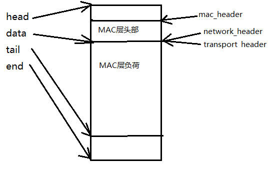

## ip_rcv
```c
int ip_rcv(struct sk_buff *skb, struct net_device *dev, struct packet_type *pt,
	   struct net_device *orig_dev)
{
	struct net *net = dev_net(dev);

	skb = ip_rcv_core(skb, net);
	if (skb == NULL)
		return NET_RX_DROP;

	return NF_HOOK(NFPROTO_IPV4, NF_INET_PRE_ROUTING,
		       net, NULL, skb, dev, NULL,
		       ip_rcv_finish);
}
```

### ip_rcv_core
```c
static struct sk_buff *ip_rcv_core(struct sk_buff *skb, struct net *net)
{
	const struct iphdr *iph;
	u32 len;

	/* When the interface is in promisc. mode, drop all the crap
	 * that it receives, do not try to analyse it.
	 */
	// 通常网卡会过滤掉和自己MAC地址不匹配的数据包
	// 但开启混淆模式后，网卡会接受所有数据包，主要为了给嗅探器，
	// 所以IP协议需要自己过滤掉MAC地址和自己不匹配的数据包
	if (skb->pkt_type == PACKET_OTHERHOST)
		goto drop;

	// 更新信息，为了SNMP协议
	__IP_UPD_PO_STATS(net, IPSTATS_MIB_IN, skb->len);

	// 如果skb被共享，则克隆
	skb = skb_share_check(skb, GFP_ATOMIC);
	if (!skb) {
		__IP_INC_STATS(net, IPSTATS_MIB_INDISCARDS);
		goto out;
	}

	if (!pskb_may_pull(skb, sizeof(struct iphdr)))
		goto inhdr_error;

	iph = ip_hdr(skb);

	/*
	 *	RFC1122: 3.2.1.2 MUST silently discard any IP frame that fails the checksum.
	 *
	 *	Is the datagram acceptable?
	 *
	 *	1.	Length at least the size of an ip header
	 *	2.	Version of 4
	 *	3.	Checksums correctly. [Speed optimisation for later, skip loopback checksums]
	 *	4.	Doesn't have a bogus length
	 */

	if (iph->ihl < 5 || iph->version != 4)
		goto inhdr_error;

	BUILD_BUG_ON(IPSTATS_MIB_ECT1PKTS != IPSTATS_MIB_NOECTPKTS + INET_ECN_ECT_1);
	BUILD_BUG_ON(IPSTATS_MIB_ECT0PKTS != IPSTATS_MIB_NOECTPKTS + INET_ECN_ECT_0);
	BUILD_BUG_ON(IPSTATS_MIB_CEPKTS != IPSTATS_MIB_NOECTPKTS + INET_ECN_CE);
	__IP_ADD_STATS(net,
		       IPSTATS_MIB_NOECTPKTS + (iph->tos & INET_ECN_MASK),
		       max_t(unsigned short, 1, skb_shinfo(skb)->gso_segs));

	if (!pskb_may_pull(skb, iph->ihl*4))
		goto inhdr_error;

	iph = ip_hdr(skb);

	if (unlikely(ip_fast_csum((u8 *)iph, iph->ihl)))
		goto csum_error;

	len = ntohs(iph->tot_len);
	if (skb->len < len) {
		__IP_INC_STATS(net, IPSTATS_MIB_INTRUNCATEDPKTS);
		goto drop;
	} else if (len < (iph->ihl*4))
		goto inhdr_error;

	/* Our transport medium may have padded the buffer out. Now we know it
	 * is IP we can trim to the true length of the frame.
	 * Note this now means skb->len holds ntohs(iph->tot_len).
	 */
	if (pskb_trim_rcsum(skb, len)) {
		__IP_INC_STATS(net, IPSTATS_MIB_INDISCARDS);
		goto drop;
	}

	iph = ip_hdr(skb);
	skb->transport_header = skb->network_header + iph->ihl*4;

	/* Remove any debris in the socket control block */
	memset(IPCB(skb), 0, sizeof(struct inet_skb_parm));
	IPCB(skb)->iif = skb->skb_iif;

	/* Must drop socket now because of tproxy. */
	if (!skb_sk_is_prefetched(skb))
		skb_orphan(skb);

	return skb;

csum_error:
	__IP_INC_STATS(net, IPSTATS_MIB_CSUMERRORS);
inhdr_error:
	__IP_INC_STATS(net, IPSTATS_MIB_INHDRERRORS);
drop:
	kfree_skb(skb);
out:
	return NULL;
}
```

```c
int ip_rcv(struct sk_buff *skb, struct net_device *dev, struct packet_type *pt, struct net_device *orig_dev)
{
	struct iphdr *iph;
	u32 len;

	// 丢弃MAC目标地址为其他主机的数据包
	// 这些数据包由于混杂模式被接受
	if (skb->pkt_type == PACKET_OTHERHOST)
		goto drop;

	IP_INC_STATS_BH(dev_net(dev), IPSTATS_MIB_INRECEIVES);

	// 如果skb->users 大于1，说明skb被其他进程使用，
	// 需要将skb 克隆，返回新的 skb，并将老的skb->users--
	if ((skb = skb_share_check(skb, GFP_ATOMIC)) == NULL) {
			if (skb_shared(skb)) //  skb->users != 1;
				struct sk_buff *nskb = skb_clone(skb, pri);
				kfree_skb(skb);
					if (likely(!atomic_dec_and_test(&skb->users)))
						return;
					__kfree_skb(skb);
				return skb = nskb;

		IP_INC_STATS_BH(dev_net(dev), IPSTATS_MIB_INDISCARDS);
		goto out;
	}

	// 对数据包的IP协议做各种合法性检查：协议头长度，协议版本，校验和，如有任何一项出错，扔掉数据包
	if (!pskb_may_pull(skb, sizeof(struct iphdr)))
		goto inhdr_error;

	iph = ip_hdr(skb);

	if (iph->ihl < 5 || iph->version != 4)
		goto inhdr_error;

	if (!pskb_may_pull(skb, iph->ihl*4))
		goto inhdr_error;

	iph = ip_hdr(skb);

	if (unlikely(ip_fast_csum((u8 *)iph, iph->ihl)))
		goto inhdr_error;

	len = ntohs(iph->tot_len);
	if (skb->len < len) {
		IP_INC_STATS_BH(dev_net(dev), IPSTATS_MIB_INTRUNCATEDPKTS);
		goto drop;
	} else if (len < (iph->ihl*4))
		goto inhdr_error;

	// 传输介质在数据包包尾填充了字节，现在知道数据包真实
	// 长度 iph->tot_len，将socket buffer裁剪成实际大小
	if (pskb_trim_rcsum(skb, len)) {
		IP_INC_STATS_BH(dev_net(dev), IPSTATS_MIB_INDISCARDS);
		goto drop;
	}

	// 清空skb中的控制缓存区，供IP层处理使用
	memset(IPCB(skb), 0, sizeof(struct inet_skb_parm));

	// 调用网络过滤子系统的回调函数，成功通过过滤后调用 ip_rcv_finish
	return NF_HOOK(PF_INET, NF_INET_PRE_ROUTING, skb, dev, NULL,
		       ip_rcv_finish);

inhdr_error:
	IP_INC_STATS_BH(dev_net(dev), IPSTATS_MIB_INHDRERRORS);
drop:
	kfree_skb(skb);
out:
	return NET_RX_DROP;
}
```
## ip_rcv_finish
ip_rcv_finish的工作包括：
* 确定数据包是转发还是上传，如果是转发，需要确定输出设备和下一个接受站点的地址
* 解析和处理部分IP选项

```c
static int ip_rcv_finish(struct sk_buff *skb)
{
	const struct iphdr *iph = ip_hdr(skb);
	struct rtable *rt;

	// 要确定数据包走向，需要查询路由，
	// 如果 skb 还没有查询过路由，则ip_route_input查询路由
	// 如果没有路由条目匹配，则无法处理数据包，丢弃它
	if (skb->dst == NULL) {
		int err = ip_route_input(skb, iph->daddr, iph->saddr, iph->tos,
					 skb->dev);
		if (unlikely(err)) {
			if (err == -EHOSTUNREACH)
				IP_INC_STATS_BH(dev_net(skb->dev),
						IPSTATS_MIB_INADDRERRORS);
			else if (err == -ENETUNREACH)
				IP_INC_STATS_BH(dev_net(skb->dev),
						IPSTATS_MIB_INNOROUTES);
			goto drop;
		}
	}

#ifdef CONFIG_NET_CLS_ROUTE
	// 更新流量控制系统的统计信息
	if (unlikely(skb->dst->tclassid)) {
		struct ip_rt_acct *st = per_cpu_ptr(ip_rt_acct, smp_processor_id());
		u32 idx = skb->dst->tclassid;
		st[idx&0xFF].o_packets++;
		st[idx&0xFF].o_bytes += skb->len;
		st[(idx>>16)&0xFF].i_packets++;
		st[(idx>>16)&0xFF].i_bytes += skb->len;
	}
#endif

	// 如果IP头部长度大于20字节，则有IP选项，处理IP选项
	if (iph->ihl > 5 && ip_rcv_options(skb))
		goto drop;

	// 更新收到各类包的数量：组播包，广播包
	rt = skb->rtable;
	if (rt->rt_type == RTN_MULTICAST)
		IP_INC_STATS_BH(dev_net(rt->u.dst.dev), IPSTATS_MIB_INMCASTPKTS);
	else if (rt->rt_type == RTN_BROADCAST)
		IP_INC_STATS_BH(dev_net(rt->u.dst.dev), IPSTATS_MIB_INBCASTPKTS);

	// 根据数据包的目的地址，在ip_route_input 根据目的地址
	// 设置 skb->dst->input ，当做转发时设置为 ip_forward
	// 当接受时，设置为 ip_local_deliver
	return dst_input(skb);
		return skb->dst->input(skb);

drop:
	kfree_skb(skb);
	return NET_RX_DROP;
}
```

## 数据包的转发
### ip_forward
数据包转发分为两个阶段：ip_forward ,  ip_forward_finish，当程序调用 ip_forward时，转发需要的信息已经准备好了，包括：
* 转发路径路由信息，在skb->dst
* IP选项设置已经解析完成存放在ip_options

处理转发的主要步骤：
* 处理IP选项，主要是在IP协议头中记录本机IP地址和数据包到达主机的时间信息(如果选项要求记录这些信息)
* 基于IP协议头的数据域确定数据可以转发
* 对IP协议头中TTL数据域减一，如果TTL的值变为0，则丢弃包
* 基于路由的MTU，如果数据包长度大于MTU，将数据包分片
* 将数据包通过选定的网络接口发送出去
* 处理错误，如果由于某种原因数据包不能转发，源主机会收到一条ICMP描述遇到的错误，当数据包通过重定向转发时，源主机也会收到ICMP消息。

```c
int ip_forward(struct sk_buff *skb)
{
	struct iphdr *iph;	/* Our header */
	struct rtable *rt;	/* Route we use */
	struct ip_options * opt	= &(IPCB(skb)->opt);

	if (skb_warn_if_lro(skb))
		goto drop;

	// 查看IPsec策略，不通过则丢弃
	if (!xfrm4_policy_check(NULL, XFRM_POLICY_FWD, skb))
		goto drop;

	// 如果设置了alert选项,则交给 ip_call_ra_chain处理, 并返回 NET_RX_SUCCESS
	if (IPCB(skb)->opt.router_alert && ip_call_ra_chain(skb))
		return NET_RX_SUCCESS;

	// 确保数据包目的MAC地址和本机相同
	if (skb->pkt_type != PACKET_HOST)
		goto drop;

	skb_forward_csum(skb);

	// 如果TTL不足则丢弃
	if (ip_hdr(skb)->ttl <= 1)
		goto too_many_hops;

	//  IPsec策略
	if (!xfrm4_route_forward(skb))
		goto drop;

	rt = skb->rtable;

	// 如果有严格源路由选项，但下一跳不为SSR丢弃
	if (opt->is_strictroute && rt->rt_dst != rt->rt_gateway)
		goto sr_failed;

	// 如果数据包长度大于传输路由上的MTU，但协议头设置了IP_DF不能分段
	// 扔掉数据包，给数据包发送个ICMP消息
	if (unlikely(skb->len > dst_mtu(&rt->u.dst) && !skb_is_gso(skb) &&
		     (ip_hdr(skb)->frag_off & htons(IP_DF))) && !skb->local_df) {
		IP_INC_STATS(dev_net(rt->u.dst.dev), IPSTATS_MIB_FRAGFAILS);
		icmp_send(skb, ICMP_DEST_UNREACH, ICMP_FRAG_NEEDED,
			  htonl(dst_mtu(&rt->u.dst)));
		goto drop;
	}

	// 拷贝socket buffer，因为马上要修改数据包
	if (skb_cow(skb, LL_RESERVED_SPACE(rt->u.dst.dev)+rt->u.dst.header_len))
		goto drop;
	iph = ip_hdr(skb);

	// 将ttl减一
	ip_decrease_ttl(iph);

	if (rt->rt_flags&RTCF_DOREDIRECT && !opt->srr && !skb_sec_path(skb))
		ip_rt_send_redirect(skb);

	skb->priority = rt_tos2priority(iph->tos);

	return NF_HOOK(PF_INET, NF_INET_FORWARD, skb, skb->dev, rt->u.dst.dev,
		       ip_forward_finish);

sr_failed:
	/*
	 *	Strict routing permits no gatewaying
	 */
	 icmp_send(skb, ICMP_DEST_UNREACH, ICMP_SR_FAILED, 0);
	 goto drop;

too_many_hops:
	/* Tell the sender its packet died... */
	IP_INC_STATS_BH(dev_net(skb->dst->dev), IPSTATS_MIB_INHDRERRORS);
	icmp_send(skb, ICMP_TIME_EXCEEDED, ICMP_EXC_TTL, 0);
drop:
	kfree_skb(skb);
	return NET_RX_DROP;
}
```
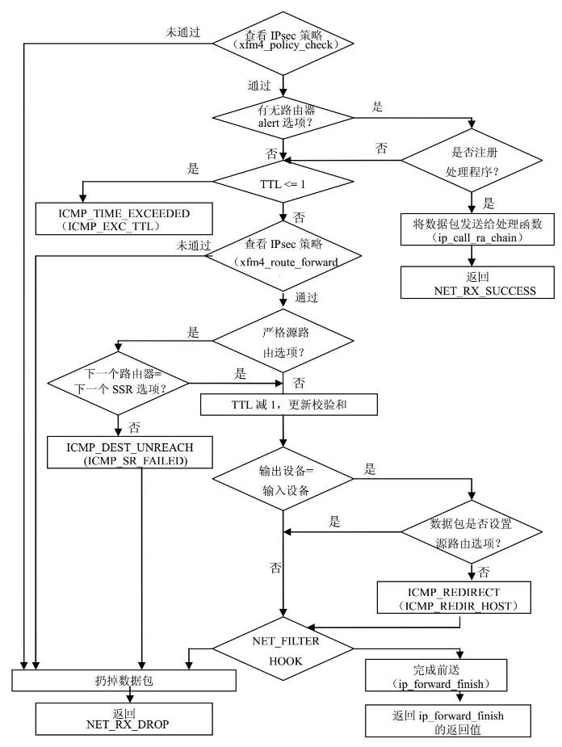

### ip_forward_finish
如果运行到ip_forward_finish，说明数据包通过了安全性和正确性检查
```c
static int ip_forward_finish(struct sk_buff *skb)
{
	struct ip_options * opt	= &(IPCB(skb)->opt);

	IP_INC_STATS_BH(dev_net(skb->dst->dev), IPSTATS_MIB_OUTFORWDATAGRAMS);

	// 如果有IP选项要处理，处理IP选项
	if (unlikely(opt->optlen))
		ip_forward_options(skb);

	return dst_output(skb);
}
```

#### dst_output
无论是转发数据包的数据包发送还是主机数据包的发送，都是调用 dst_output , dst_output 调用 skb->dst->output 虚函数，当发送的数据包为单播时走 ip_output, 发送组播包时走 ip_mc_output

##### ip_output
```c
int ip_output(struct sk_buff *skb)
{
	struct net_device *dev = skb->dst->dev;

	IP_INC_STATS(dev_net(dev), IPSTATS_MIB_OUTREQUESTS);

	skb->dev = dev;
	skb->protocol = htons(ETH_P_IP);

	return NF_HOOK_COND(PF_INET, NF_INET_POST_ROUTING, skb, NULL, dev,
			    ip_finish_output,
			    !(IPCB(skb)->flags & IPSKB_REROUTED));
}
```
```c
static int ip_finish_output(struct sk_buff *skb)
{
#if defined(CONFIG_NETFILTER) && defined(CONFIG_XFRM)
	/* Policy lookup after SNAT yielded a new policy */
	if (skb->dst->xfrm != NULL) {
		IPCB(skb)->flags |= IPSKB_REROUTED;
		return dst_output(skb);
	}
#endif
	// 如果数据包需要分片，但设备不支持分片，则调用 ip_fragment进行分片后调用 ip_finish_output2 
	// 否则直接调用 ip_finish_output2
	if (skb->len > ip_skb_dst_mtu(skb) && !skb_is_gso(skb))
		return ip_fragment(skb, ip_finish_output2);
	else
		return ip_finish_output2(skb);
}
```

```c
static inline int ip_finish_output2(struct sk_buff *skb)
{
	struct dst_entry *dst = skb->dst;
	struct rtable *rt = (struct rtable *)dst;
	struct net_device *dev = dst->dev;
	unsigned int hh_len = LL_RESERVED_SPACE(dev);

	// 更新数据包发送的统计信息
	if (rt->rt_type == RTN_MULTICAST)
		IP_INC_STATS(dev_net(dev), IPSTATS_MIB_OUTMCASTPKTS);
	else if (rt->rt_type == RTN_BROADCAST)
		IP_INC_STATS(dev_net(dev), IPSTATS_MIB_OUTBCASTPKTS);

	// 若headroom 不够用于存放MAC层协议头信息，则重新分配skb空间
	if (unlikely(skb_headroom(skb) < hh_len && dev->header_ops)) {
		struct sk_buff *skb2;

		skb2 = skb_realloc_headroom(skb, LL_RESERVED_SPACE(dev));
		if (skb2 == NULL) {
			kfree_skb(skb);
			return -ENOMEM;
		}
		if (skb->sk)
			skb_set_owner_w(skb2, skb->sk);
		kfree_skb(skb);
		skb = skb2;
	}

	// 将数据包交给邻居子系统输出处理函数 neigh_hh_output或 dst->neighbour->output
	if (dst->hh)
		return neigh_hh_output(dst->hh, skb);
	else if (dst->neighbour)
		return dst->neighbour->output(skb);

	if (net_ratelimit())
		printk(KERN_DEBUG "ip_finish_output2: No header cache and no neighbour!\n");
	kfree_skb(skb);
	return -EINVAL;
}
```

## 数据包入站
当数据包目的IP地址是本机时，skb->dst->input被初始化为 ip_local_deliver.
接受数据包最重要的工作是重组分了片的数据包，转发数据包不需要重组数据包，可以直接发送数据包分片。

### ip_local_deliver
```c
int ip_local_deliver(struct sk_buff *skb)
{
	// 如果数据包被分片，重组分片
	if (ip_hdr(skb)->frag_off & htons(IP_MF | IP_OFFSET)) {
		if (ip_defrag(skb, IP_DEFRAG_LOCAL_DELIVER))
			return 0;
	}

	// 使用过滤子系统进行检查，通过后调用 ip_local_deliver_finish
	return NF_HOOK(PF_INET, NF_INET_LOCAL_IN, skb, skb->dev, NULL,
		       ip_local_deliver_finish);
}
```

ip_local_deliver_finish 的主要工作是：
* 将数据包传给正确的上层处理函数
* 将数据包传给裸ip
* 强制执行数据安全策略（如果内核配置了安全策略）

要实现这些功能需要知道数据包的上层协议，和上层协议处理函数。

和packet_type一样，对于传输层协议封装了 net_protocol 描述协议和协议处理之间的关系。
```c
struct net_protocol {
	// 处理输入数据包
	int			(*handler)(struct sk_buff *skb);
	// 接受ICMP unremovable 错误消息的处理函数
	void			(*err_handler)(struct sk_buff *skb, u32 info);
	int			(*gso_send_check)(struct sk_buff *skb);
	struct sk_buff	       *(*gso_segment)(struct sk_buff *skb,
					       int features);
	struct sk_buff	      **(*gro_receive)(struct sk_buff **head,
					       struct sk_buff *skb);
	int			(*gro_complete)(struct sk_buff *skb);
	// 确认数据包是否使用IPsec
	unsigned int		no_policy:1,
				netns_ok:1;
};
```
所有注册了的传输层协议存放在 inet_protos 哈希表
```c
extern struct net_protocol *inet_protos[MAX_INET_PROTOS];
```


```c
static int ip_local_deliver_finish(struct sk_buff *skb)
{
	struct net *net = dev_net(skb->dev);

	__skb_pull(skb, ip_hdrlen(skb));
		skb->len -= len;
		return skb->data += len;

	skb_reset_transport_header(skb);

	rcu_read_lock();
	{
		int protocol = ip_hdr(skb)->protocol;
		int hash, raw;
		struct net_protocol *ipprot;

	resubmit:
		// 处理裸IP
		// 如果用户注册了裸IP套接字接受数据包，则拷贝一份 socket buffer
		// 加入socket的输入队列
		raw = raw_local_deliver(skb, protocol);
			hash = protocol & (RAW_HTABLE_SIZE - 1);
			raw_sk = sk_head(&raw_v4_hashinfo.ht[hash]);
			if (raw_sk && !raw_v4_input(skb, ip_hdr(skb), hash))
				raw_sk = NULL;

		// 找到传输层输入包处理函数
		hash = protocol & (MAX_INET_PROTOS - 1);
		ipprot = rcu_dereference(inet_protos[hash]);
		if (ipprot != NULL) {
			int ret;

			if (!net_eq(net, &init_net) && !ipprot->netns_ok) {
				if (net_ratelimit())
					printk("%s: proto %d isn't netns-ready\n",
						__func__, protocol);
				kfree_skb(skb);
				goto out;
			}

			if (!ipprot->no_policy) {
				if (!xfrm4_policy_check(NULL, XFRM_POLICY_IN, skb)) {
					kfree_skb(skb);
					goto out;
				}
				nf_reset(skb);
			}
			// 交给传输层处理
			ret = ipprot->handler(skb);
			if (ret < 0) {
				protocol = -ret;
				goto resubmit;
			}
			IP_INC_STATS_BH(net, IPSTATS_MIB_INDELIVERS);
		} else {
			if (!raw) {
				if (xfrm4_policy_check(NULL, XFRM_POLICY_IN, skb)) {
					IP_INC_STATS_BH(net, IPSTATS_MIB_INUNKNOWNPROTOS);
					icmp_send(skb, ICMP_DEST_UNREACH,
						  ICMP_PROT_UNREACH, 0);
				}
			} else
				IP_INC_STATS_BH(net, IPSTATS_MIB_INDELIVERS);
			kfree_skb(skb);
		}
	}
 out:
	rcu_read_unlock();

	return 0;
}
```
ip_local_deliver_finish中 socket buffer的变化
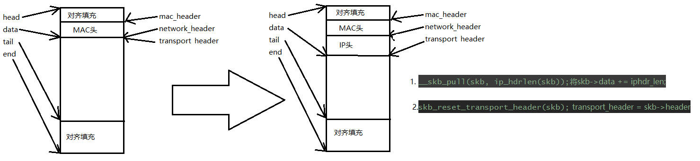

# 输出数据包在IP层的处理
## 传输层到IP层
如果传输层协议不同，使用不同的接口传递数据包给IP层。
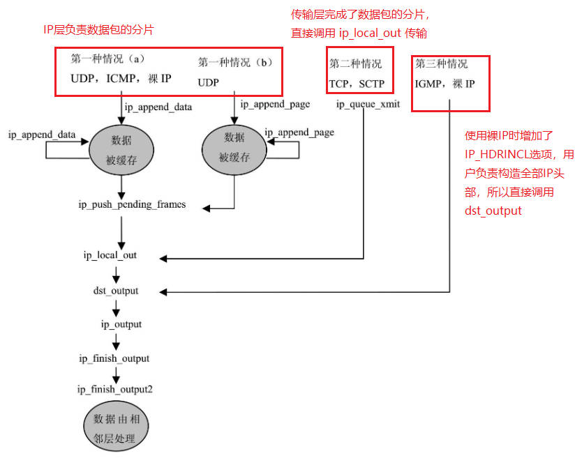

相关函数的功能：
* ip_queue_xmit : 由传输层TCP调用，将数据包由传输层发送到网络层，负责创建IP协议头部和IP选项，并调用 dst_output 继续发送包
* ip_append_data : 由传输层UDP调用，将要发送的数据包添加缓冲区
* ip_append_page : 由传输层UDP调用，将要发送的数据包添加数据页面
* ip_push_pending_frames : 将ip_append_data和ip_append_page创建的输出队列发送出去
* dst_output : 发送数据包时，若目的地址是其他主机，走ip_output
* ip_build_and_send_pkt: 用于TCP发送SYN消息时创建IP协议头部和选项并发送
* ip_send_reply : 用于TCP发送ACK和 RST消息时创建IP协议头部和选项并发送


当传输层向网络层发送数据包时，除了数据包外，还会传递控制信息，这些控制信息用于构建IP协议头，IP选项，数据包分片等，控制信息由用户程序设置，通过socket发送。

## 核心数据结构
套接字在内核的描述为 struct sock
存放数据包控制信息的主要数据结构：
* struct sock : 通用套接字结构
* struct inet_sock : PF_INET协议族特定套接字结构
* struct ipcm_cookie : 发送数据包需要的各种信息
* struct cork : 嵌套在inet_sock中，处理套接字阻塞时的选项信息
* struct dst_entry : 路由表入口
* struct rtable : 路由表结构
* struct in_device : 存放网络设备的所有与IPv4协议相关的配置
* struct in_ifaddr : 描述IPv4网络地址

```c
struct ipcm_cookie
{
	// 输出网络设备的IP地址
	__be32			addr;
	// 输出设备索引号
	int			oif;
	// IP选项
	struct ip_options	*opt;
};
```

```c
struct inet_sock {
	/* sk and pinet6 has to be the first two members of inet_sock */
	// 继承通用套接字属性
	struct sock		sk;
	// 目的IP地址
	__be32			daddr;
	// 与套接字绑定的本地IP地址
	__be32			rcv_saddr;
	// 目的端口
	__be16			dport;
	// 本地端口
	__u16			num;
	// 发送数据包的源IP
	__be32			saddr;
	// 当数据包目标地址为单播时，数据包存活时间ttl
	__s16			uc_ttl;
	// 控制消息标志
	__u16			cmsg_flags;
	// 输出数据包IP选项
	struct ip_options	*opt;
	// 发送数据包的源端口
	__be16			sport;
	// 未分片数据包的标识符
	__u16			id;
	// 数据包服务类型，代表数据包优先级
	__u8			tos;
	// 当数据包目标地址为组播时，数据包的存活时间
	__u8			mc_ttl;
	// 发送路由上网络设备的最大发送单元MTU
	__u8			pmtudisc;
	__u8			recverr:1, // 接受错误标志
				is_icsk:1, // 标志该套接字是一个连接套接字 inet_connection_sock
				freebind:1, // 标志该套接字可以与任意IP地址绑定 
				hdrincl:1,
				mc_loop:1,
				transparent:1;
	// 组发送网络设备的索引号
	int			mc_index;
	// 组发送IP地址
	__be32			mc_addr;
	// 组发送套接字列表
	struct ip_mc_socklist	*mc_list;

	struct {
		// 标志位，当前IPv4只能设置为 IPCORK_OPT
		unsigned int		flags;
		// 产生分片数据段的大小，其大小包括网络层的协议头和负载数据，通常与PMTU值相同
		unsigned int		fragsize;
		struct ip_options	*opt;
		struct dst_entry	*dst;
		// IP数据包的大小，包括所有分段数据总和，不包括IP协议头
		int			length; /* Total length of all frames */
		// 发送数据包的目的IP地址
		__be32			addr;
		// TCP是可靠协议，发送数据包前需要建立连接，并维护连接，fl用于存放通信两端连接信息
		struct flowi		fl;
	} cork;
};

```
### 操作 sock , inet_sock 的关键函数
```c

// 支持TCP协议的套接字，需要管理TCP连接，
// 一旦套接字建立连接，用此函数保存到目标
// 地址的路由到套接字
static inline void
sk_dst_set(struct sock *sk, struct dst_entry *dst);


// 检查套接字中缓存的路由信息是否有效
// 如果路由有效，返回有效路由信息
// 该函数可用于重新提取路由信息
struct dst_entry *
sk_dst_check(struct sock *sk, u32 cookie)

// 指定数据包所属套接字，即设置sk_buff->sk 
static inline void 
skb_set_owner_w(struct sk_buff *skb, struct sock *sk)

// 分配sk_buff所需的内存空间，分配单个缓冲区，或一系列分片数据包 
// 的第一个缓冲区
struct sk_buff *
sock_alloc_send_skb(struct sock *sk, unsigned long size,
				    int noblock, int *errcode)

// 管理分片数据包，除了第一个分片外其余分片
struct sk_buff *
sock_wmalloc(struct sock *sk, unsigned long size, int force,
			     gfp_t priority)
```

## 不需要处理分片 
### ip_queue_xmit
ip_queue_xmit 由 TCP 或 SCTP 调用，由传输层向网络层发送数据包
```c
int ip_queue_xmit(struct sk_buff *skb, int ipfragok)
{
	struct sock *sk = skb->sk;
	struct inet_sock *inet = inet_sk(sk);
	struct ip_options *opt = inet->opt;
	struct rtable *rt;
	struct iphdr *iph;

	// 如果数据包的路由信息已经获得，就不需要在查询路由
	rt = skb->rtable;
	if (rt != NULL)
		goto packet_routed;

	// 如果数据包未被路由，则检查套接字是否已缓存有效路由信息
	rt = (struct rtable *)__sk_dst_check(sk, 0);
	if (rt == NULL) {
		// 如果套接字没有缓存有效路由信息
		// 需要用 ip_route_output_flow 查询路由
		// 如果设置了源路由，则使用 opt->faddr 做目的地址查询路由
		// 如果没有设置源路由，则使用 inet->daddr 做目的地址查询路由
		
		__be32 daddr;

		// 如果没有设置源路由，使用套接字目的地址用于查询路由
		daddr = inet->daddr;

		// 如果IP选项中设置了源路由选项，从选项中读取下一跳IP地址 
		if(opt && opt->srr)
			daddr = opt->faddr;

		// 查询路由
		{
			// 给查询路由的数据结构 flowi 赋值
			struct flowi fl = { .oif = sk->sk_bound_dev_if, // 输出设备
					    .nl_u = { .ip4_u =
						      { .daddr = daddr,  // 对端IP
							.saddr = inet->saddr, // 本地IP
							.tos = RT_CONN_FLAGS(sk) } },
					    .proto = sk->sk_protocol, // 传输层协议
					    .flags = inet_sk_flowi_flags(sk),
					    .uli_u = { .ports =
						       { .sport = inet->sport,
							 .dport = inet->dport } } };

			security_sk_classify_flow(sk, &fl);

			// 查询路由，确保目的地址可以路由
			if (ip_route_output_flow(sock_net(sk), &rt, &fl, sk, 0))
				goto no_route;
		}

		// 将路由信息存储到套接字
		// 这样下次此套接字发送数据包时，就可以不查询路由
		// 如果下次 sk_dst_check 发现路由失效，就再调用
		// ip_route_output_flow 查询新的路由信息
		sk_setup_caps(sk, &rt->u.dst);
	}

	// 将套接字的路由缓存，或刚查询到的路由信息，设置到数据包
	// 并将 dst->__refcnt 加一
	skb->dst = dst_clone(&rt->u.dst);

packet_routed:
	// 数据包已经有路由信息

	// 如果使用了严格源路由，下一跳(rt_gateway)必须和源路由列表中下一跳IP地址(rt->rt_dst)一致
	if (opt && opt->is_strictroute && rt->rt_dst != rt->rt_gateway)
		goto no_route;

	// 现在确保有正确的路由信息了，分配并构造IP协议头

	// 从headroom分配IP协议头空间
	skb_push(skb, sizeof(struct iphdr) + (opt ? opt->optlen : 0));

	// skb->network_header = skb->data
	skb_reset_network_header(skb);

	// 设置IP协议头
	iph = ip_hdr(skb);
	// IP版本号，协议头长度，和服务类型共享16位
	*((__be16 *)iph) = htons((4 << 12) | (5 << 8) | (inet->tos & 0xff));
	// 是否运行对数据包进行分片的标志DF/MF
	if (ip_dont_fragment(sk, &rt->u.dst) && !ipfragok)
		iph->frag_off = htons(IP_DF);
	else
		iph->frag_off = 0;
	// 生存时间
	iph->ttl      = ip_select_ttl(inet, &rt->u.dst);
	// 传输层协议
	iph->protocol = sk->sk_protocol;
	// 源IP
	iph->saddr    = rt->rt_src;
	// 目的IP
	iph->daddr    = rt->rt_dst;
	/* Transport layer set skb->h.foo itself. */

	// 如果包含IP选项，在协议头构建选项信息
	if (opt && opt->optlen) {
		iph->ihl += opt->optlen >> 2;
		ip_options_build(skb, opt, inet->daddr, rt, 0);
	}

	// 根据是否分片，在IP头设置IP数据包的标识符ID
	ip_select_ident_more(iph, &rt->u.dst, sk,
			     (skb_shinfo(skb)->gso_segs ?: 1) - 1);

	// 流量子系统的发送优先级，这个值现在是从 sock 中获得，
	// 如果是在ip_forward中（由于不是本地接受的数据包，所以没有套接字），
	// 它的值是基于 IP ToS 值的转换表得到。
	skb->priority = sk->sk_priority;
	skb->mark = sk->sk_mark;

	return ip_local_out(skb);

no_route:
	IP_INC_STATS(sock_net(sk), IPSTATS_MIB_OUTNOROUTES);
	kfree_skb(skb);
	return -EHOSTUNREACH;
}

int ip_local_out(struct sk_buff *skb)
{
	int err;

	err = __ip_local_out(skb);
	if (likely(err == 1))
		err = dst_output(skb);

	return err;
}

int __ip_local_out(struct sk_buff *skb)
{
	struct iphdr *iph = ip_hdr(skb);

	// 设置IP数据包总长度
	iph->tot_len = htons(skb->len);
	// 计算校验和
	ip_send_check(iph);
	// 如果nf_hook允许数据包通过，调用 dst_output 
	return nf_hook(PF_INET, NF_INET_LOCAL_OUT, skb, NULL, skb->dst->dev,
		       dst_output);
}
```
ip_queue_xmit 对IP协议头的处理


## 需要处理分片 
### ip_append_data
ip_append_data 有传输层调用，缓存要发送的数据，ip_append_data不传送输送，而是把数据放到一个大小适中的缓冲区中，随后的函数来对数据包进行分段处理（如果需要），并将数据包发送出去.
它不创建或管理任何IP协议头，
数据缓存到一定程度，为了将由ip_append_data缓存的数据发送出去，传送层调用ip_push_pending_frames，由ip_push_pending_frames维护IP协议头

如果传输层协议要求快速响应，可以在每次调用ip_append_data函数后，立即调用ip_push_pending_frames将数据包发送出去，
这两个函数的主要作用是，使传输层可以尽量多的缓存数据，直到达到PMTU大小，然后一次性发送，这样发送效率更高。

### ip_append_data 主要功能
1. 缓存传输层要发送的数据
将传送层送来的数据放在缓冲区，当数据累计的PMTU时对数据进行分割，随后网络层和数据链路层很容易在其中加入协议头

2. 优化内存分配
在分配缓冲区时，考虑套接字的控制信息和网络设备输出能力，特别是：
* 短时间内有多个数据段要缓存
如果应用层通知在短时间内有更多数据要缓存发送（通过MSG_MORE），ip_append_data可以为此分配一个较大的缓冲区，当数据从上层协议传来时，可以直接放入缓冲区，不必再分配内存。
* 硬件是否支持 scatler/gather IO功能
如果硬件支持，分段操作可以安排在内存页面中
* 处理传输层校验和
skb->ip_summed说明如何处理传输层的校验和，该数据域初始化基于网络设备的输出能力（硬件是否可以计算校验和）

ip_append_data 是个长而复杂的函数，有大量的局部变量，下面是他们的作用
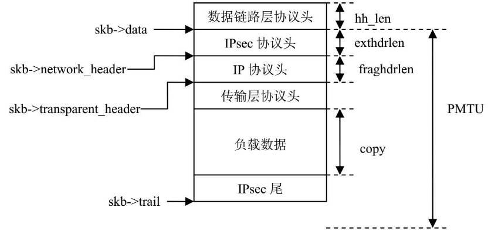

```c
/*
 * sk : 发送该数据包的套接字 
 * getfrag : 传输层协议实例各自实现的函数，用于将传输层从套接字收到的负载
 *           数据复制到缓冲区，getfrag参数指明复制数据的源地址，目的地地址
 *           长度，等信息
 * from : 传输层发送给网络层的数据包的起始地址，地址可以是内核空间的地址，
 *        也可以是用户空间的地址
 * length : 发送数据的总长度(包括协议头)
 * transhdrlen : 传输层协议头的大小 
 * ipc : 发送数据包需要的各种信息，包括目的地址，输出设备，IP选项
 * rtp: 与数据包发送相关的路由在路由表高速缓存中的记录入口
 * flags : MSG_MORE : 由应用程序产生，告诉传输层，短时间内有更多数据包要发送
 *         MSG_DONTWAIT : 当设置此标志时，ip_append_data调用不能被阻塞，
 *         MSG_PROBE : 用户设置此标志，用于探测发送路径信息
 * 
 * 
 */
int ip_append_data(struct sock *sk,
		   int getfrag(void *from, char *to, int offset, int len,
			       int odd, struct sk_buff *skb),
		   void *from, int length, int transhdrlen,
		   struct ipcm_cookie *ipc, struct rtable **rtp,
		   unsigned int flags)
	// 相当复杂，待以后需要时再分析
	   ...
```
简单来说， ip_append_data会根据追加的数据，按照PMTU，创建一个或多个 sk_buff，并加入 sock->sk_write_queue 队列
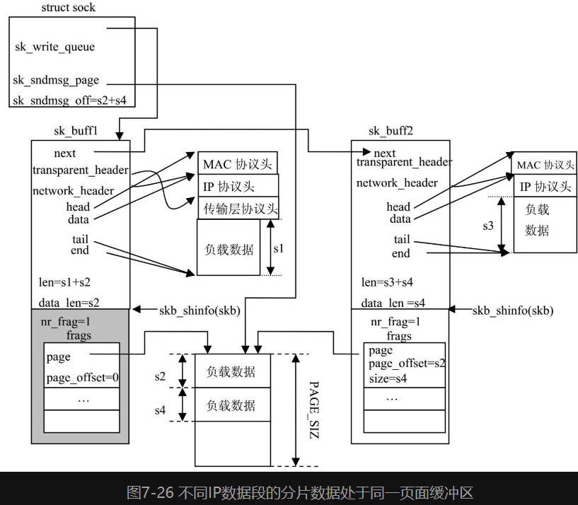


### ip_push_pending_frames
ip_append_data 和 ip_append_page 完成数据缓存并分片后，当传输层要将缓存的数据发送出去时，就调用 ip_push_pending_frames 

ip_push_pending_frames首先从 sk_write_queue 取出第一个sk_buff，并将其余节点链接到 skb->frag_list 上。
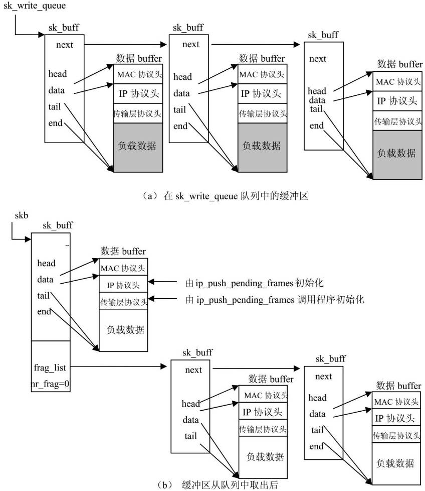

ip_push_pending_frames 只是构建IP协议头，没有查询路由，因为 ip_append_data有个参数就是数据包的路由信息
```c
// sock是要发送数据包的套接字
// sock->sk_write_queue 是发送缓存
int ip_push_pending_frames(struct sock *sk)
{
	struct sk_buff *skb, *tmp_skb;
	struct sk_buff **tail_skb;
	struct inet_sock *inet = inet_sk(sk);
	struct net *net = sock_net(sk);
	struct ip_options *opt = NULL;
	struct rtable *rt = (struct rtable *)inet->cork.dst;
	struct iphdr *iph;
	__be16 df = 0;
	__u8 ttl;
	int err = 0;

	// 取出第一个 sk_buff
	if ((skb = __skb_dequeue(&sk->sk_write_queue)) == NULL)
		goto out;
	tail_skb = &(skb_shinfo(skb)->frag_list);

	// 给每个 socket buffer分片IP协议头空间
	if (skb->data < skb_network_header(skb))
		__skb_pull(skb, skb_network_offset(skb));
	// 取出剩余的socket buffer做分片
	while ((tmp_skb = __skb_dequeue(&sk->sk_write_queue)) != NULL) {
		__skb_pull(tmp_skb, skb_network_header_len(skb));
		*tail_skb = tmp_skb;
		tail_skb = &(tmp_skb->next);
		skb->len += tmp_skb->len;
		skb->data_len += tmp_skb->len;
		skb->truesize += tmp_skb->truesize;
		__sock_put(tmp_skb->sk);
		tmp_skb->destructor = NULL;
		tmp_skb->sk = NULL;
	}

	if (inet->pmtudisc < IP_PMTUDISC_DO)
		skb->local_df = 1;

	if (inet->pmtudisc >= IP_PMTUDISC_DO ||
	    (skb->len <= dst_mtu(&rt->u.dst) &&
	     ip_dont_fragment(sk, &rt->u.dst)))
		df = htons(IP_DF);

	// 如果套接字设置IP选项，则设置IP协议头IP选项
	if (inet->cork.flags & IPCORK_OPT)
		opt = inet->cork.opt;

	// 根据数据包是组播还是单播，选定ttl
	if (rt->rt_type == RTN_MULTICAST)
		ttl = inet->mc_ttl;
	else
		ttl = ip_select_ttl(inet, &rt->u.dst);

	iph = (struct iphdr *)skb->data;
	iph->version = 4;
	iph->ihl = 5;
	if (opt) {
		iph->ihl += opt->optlen>>2;
		ip_options_build(skb, opt, inet->cork.addr, rt, 0);
	}
	iph->tos = inet->tos;
	iph->frag_off = df;
	ip_select_ident(iph, &rt->u.dst, sk);
	iph->ttl = ttl;
	iph->protocol = sk->sk_protocol;
	iph->saddr = rt->rt_src;
	iph->daddr = rt->rt_dst;

	skb->priority = sk->sk_priority;
	skb->mark = sk->sk_mark;
	inet->cork.dst = NULL;
	skb->dst = &rt->u.dst;

	if (iph->protocol == IPPROTO_ICMP)
		icmp_out_count(net, ((struct icmphdr *)
			skb_transport_header(skb))->type);

	// 调用网络过滤子系统对数据包进行检查，
	// 通过后调用 dst_output
	err = ip_local_out(skb);
	if (err) {
		if (err > 0)
			err = inet->recverr ? net_xmit_errno(err) : 0;
		if (err)
			goto error;
	}

out:
	ip_cork_release(inet);
	return err;

error:
	IP_INC_STATS(net, IPSTATS_MIB_OUTDISCARDS);
	goto out;
}
```

### UDP发送数据包的整个过程

```c
int udp_sendmsg(struct kiocb *iocb, struct sock *sk, struct msghdr *msg,
		size_t len)
	// 获得udp的套接字
	struct inet_sock *inet = inet_sk(sk);
	struct udp_sock *up = udp_sk(sk);
	int corkreq = up->corkflag || msg->msg_flags&MSG_MORE;
	...
		// 查询路由信息	
		err = ip_route_output_flow(net, &rt, &fl, sk, 1);

	// 将数据包加入 sk->sk_write_queue 缓存队列，并设置数据包的路由
	err = ip_append_data(sk, getfrag, msg->msg_iov, ulen,
			sizeof(struct udphdr), &ipc, &rt,
			corkreq ? msg->msg_flags|MSG_MORE : msg->msg_flags);
	// 如果加入缓冲失败，则释放缓冲
	if (err)
		udp_flush_pending_frames(sk);
	// 如果corkreq没有设置MSG_MORE，则立即发送缓冲的数据
	else if (!corkreq)
		err = udp_push_pending_frames(sk);
	...
```
udp_push_pending_frames的工作
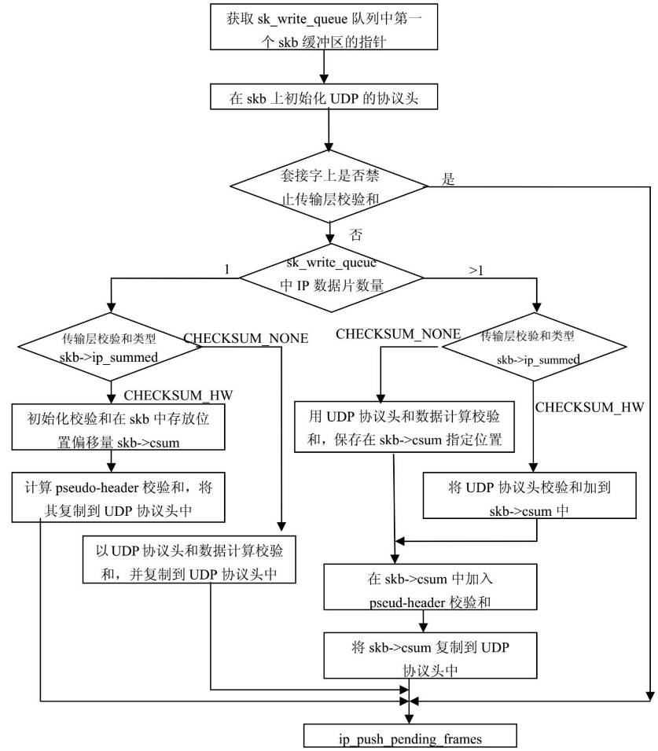

# 总结
IP层数据接受和发送时各API之间调用关系
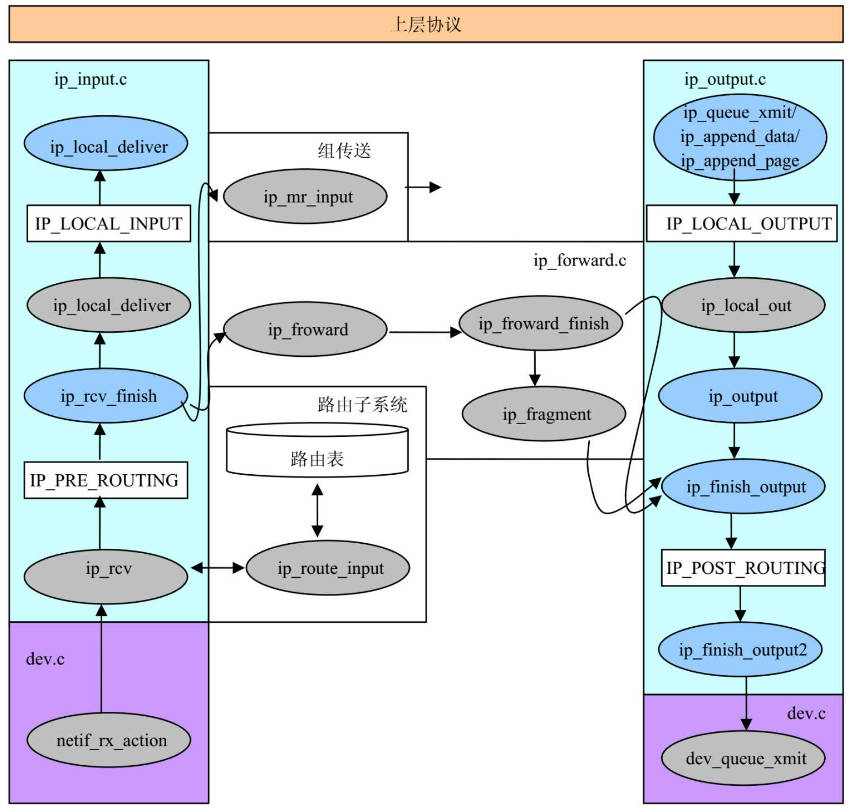

# 与邻居子系统的接口
IP层发送数据时，如果发送的是单播，dst_output调用 ip_output，
```c
int ip_output(struct sk_buff *skb)
{
	struct net_device *dev = skb->dst->dev;

	IP_INC_STATS(dev_net(dev), IPSTATS_MIB_OUTREQUESTS);

	skb->dev = dev;
	skb->protocol = htons(ETH_P_IP);

	return NF_HOOK_COND(PF_INET, NF_INET_POST_ROUTING, skb, NULL, dev,
			    ip_finish_output,
			    !(IPCB(skb)->flags & IPSKB_REROUTED));
}

static int ip_finish_output(struct sk_buff *skb)
{
#if defined(CONFIG_NETFILTER) && defined(CONFIG_XFRM)
	/* Policy lookup after SNAT yielded a new policy */
	if (skb->dst->xfrm != NULL) {
		IPCB(skb)->flags |= IPSKB_REROUTED;
		return dst_output(skb);
	}
#endif
	// 如果数据需要分割，分割后调用 ip_finish_output2 
	if (skb->len > ip_skb_dst_mtu(skb) && !skb_is_gso(skb))
		return ip_fragment(skb, ip_finish_output2);
	else
		return ip_finish_output2(skb);
}

static inline int ip_finish_output2(struct sk_buff *skb)
{
	struct dst_entry *dst = skb->dst;
	struct rtable *rt = (struct rtable *)dst;
	struct net_device *dev = dst->dev;
	unsigned int hh_len = LL_RESERVED_SPACE(dev);

	// 更新统计信息
	if (rt->rt_type == RTN_MULTICAST)
		IP_INC_STATS(dev_net(dev), IPSTATS_MIB_OUTMCASTPKTS);
	else if (rt->rt_type == RTN_BROADCAST)
		IP_INC_STATS(dev_net(dev), IPSTATS_MIB_OUTBCASTPKTS);

	// 如果headroom不够存放MAC头，重新分配socket buffer
	if (unlikely(skb_headroom(skb) < hh_len && dev->header_ops)) {
		struct sk_buff *skb2;

		skb2 = skb_realloc_headroom(skb, LL_RESERVED_SPACE(dev));
		if (skb2 == NULL) {
			kfree_skb(skb);
			return -ENOMEM;
		}
		if (skb->sk)
			skb_set_owner_w(skb2, skb->sk);
		kfree_skb(skb);
		skb = skb2;
	}

	// IP协议调用 dev_queue_xmit 处理硬件发送
	if (dst->hh)
		return neigh_hh_output(dst->hh, skb);
	else if (dst->neighbour)
		return dst->neighbour->output(skb); 

	if (net_ratelimit())
		printk(KERN_DEBUG "ip_finish_output2: No header cache and no neighbour!\n");
	kfree_skb(skb);
	return -EINVAL;
}
```
dst->hh->hh_output 和 dst->neighbour->output 在邻居子系统中被初始化为 dev_queue_xmit

```c
// net/ipv4/arp.c
static struct neigh_ops arp_generic_ops = {
	.family =		AF_INET,
	.solicit =		arp_solicit,
	.error_report =		arp_error_report,
	.output =		neigh_resolve_output,
	.connected_output =	neigh_connected_output,
	.hh_output =		dev_queue_xmit,
	.queue_xmit =		dev_queue_xmit,
};

static struct neigh_ops arp_hh_ops = {
	.family =		AF_INET,
	.solicit =		arp_solicit,
	.error_report =		arp_error_report,
	.output =		neigh_resolve_output,
	.connected_output =	neigh_resolve_output,
	.hh_output =		dev_queue_xmit,
	.queue_xmit =		dev_queue_xmit,
};
```

调用邻居子系统设置MAC协议头，后调用 dev_queue_xmit 发送数据包给链路层
```c
int neigh_resolve_output(struct sk_buff *skb)
{
	...	

	__skb_pull(skb, skb_network_offset(skb));

	...
			dev_hard_header(skb, dev, ntohs(skb->protocol),
					      neigh->ha, NULL, skb->len);
				return dev->header_ops->create(skb, dev, type, daddr, saddr, len); // 调用 eth_header
	...
			rc = neigh->ops->queue_xmit(skb);

}	

int eth_header(struct sk_buff *skb, struct net_device *dev,
	       unsigned short type,
	       const void *daddr, const void *saddr, unsigned len)
{
	struct ethhdr *eth = (struct ethhdr *)skb_push(skb, ETH_HLEN);

	if (type != ETH_P_802_3)
		eth->h_proto = htons(type);
	else
		eth->h_proto = htons(len);

	/*
	 *      Set the source hardware address.
	 */

	if (!saddr)
		saddr = dev->dev_addr;
	memcpy(eth->h_source, saddr, ETH_ALEN);

	if (daddr) {
		memcpy(eth->h_dest, daddr, ETH_ALEN);
		return ETH_HLEN;
	}

	/*
	 *      Anyway, the loopback-device should never use this function...
	 */

	if (dev->flags & (IFF_LOOPBACK | IFF_NOARP)) {
		memset(eth->h_dest, 0, ETH_ALEN);
		return ETH_HLEN;
	}

	return -ETH_HLEN;
}

```

# 数据包的分片和重组
一个已知的IP数据包通常在主机上会重组，中间路由器需要查看整个IP数据时，也会重组数据包，如防火墙和NAT

数据包的分片：
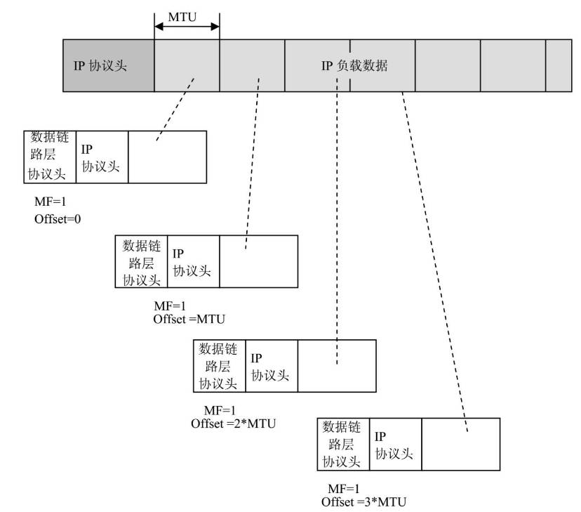

## 数据分片需要考虑的问题

每个IP数据包都可以分片，已经分片的数据包还能再次分。

对于IP选项，分片时，内核不会复制所有选项， 所以只有第一个数据包的信息是完整的

对于校验和，IP校验和只覆盖IP协议头信息，负载数据由上层协议校验，由于每个分片的头信息不同，所以没有分片都需要重新计算校验和

对于效率，分片重组很费CPU，所以分片越多负载越大。对于传输敏感的应用，应该避免分片。

和分片相关的IP协议头数据域
* DF (Don't Fragments)
如果数据包设置了此标志，数据包大小超过某些设备的MTU时，就会被丢弃。主要是视频通信的应用需要，因为他们需要更低的延迟

* MF (More Fragments)
如果对一个数据包进行分片，除了最后一个分片外，所有数据包此域都设置为true

* fragments offset
表示分片在数据包的位置

* ID 
IP数据包的标识符，相同数据包不同分片的ID值一样。

