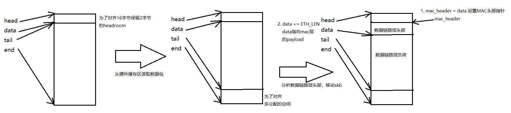

# IP协议
L3层有很多协议，其中使用最多的是IP协议

## IP协议的任务
1. 数据包的校验和检查

2. 防火墙对数据包的过滤

3. IP选项处理

4. 数据的分片和重组
IP协议头描述数据包长度的数据域为16位，所以IP数据包最大为64KB，
但由于网络设备有MTU，所以IP协议需要对数据包进行分片和重组

5. 发送转发接受
在IP层处理数据包分为3类，每一类由不同的IP协议函数处理

## IP协议头


```c
struct iphdr {
#if defined(__LITTLE_ENDIAN_BITFIELD)
	__u8	ihl:4,
		version:4;
#elif defined (__BIG_ENDIAN_BITFIELD)
	__u8	version:4,
  		ihl:4;        // IP协议头长度
#else
#error	"Please fix <asm/byteorder.h>"
#endif
	__u8	tos;       // 服务类型 
	__be16	tot_len;   // IP数据包长度
	__be16	id;        // IP数据包标识符
	__be16	frag_off;  // 分片数据在数据包中的偏移量
	__u8	ttl;       // 数据包生存时间
	__u8	protocol;  // 上层协议
	__sum16	check;     // 校验和
	__be32	saddr;     // 源IP
	__be32	daddr;     // 目的IP
	/*The options start here. */
};
```

## IP子系统初始化
```c
static int __init inet_init(void)
{
	...
	// 注册传输层协议包处理结构体实例
	// ARP协议模块
	arp_init();
		dev_add_pack(&arp_packet_type);
	ip_init();
		ip_rt_init(); // 初始化路由子系统
		inet_initpeers(); // 初始化裸IP
	tcp_v4_init();

	// 创建TCP/UDP使用的slab	
	tcp_init();
	udp_init();

	...

	// 添加IP协议
	dev_add_pack(&ip_packet_type);

	...
}

static struct packet_type ip_packet_type = {
	.type = __constant_htons(ETH_P_IP),
	.func = ip_rcv,
	.gso_send_check = inet_gso_send_check,
	.gso_segment = inet_gso_segment,
	.gro_receive = inet_gro_receive,
	.gro_complete = inet_gro_complete,
};
```

IP协议处理数据时，会多出调用网络过滤子系统和路由子系统。

## 与网络过滤子系统的交互
网络过滤子系统在TCP/IP协议栈出现的场合有：
* 接受数据包时
* 转发数据包（路由决策前）
* 转发数据包（路由决策后）
* 发送数据包

上面的每一处，相应的协议处理函数都分两个阶段
第一阶段函数为 do_something(如 ip_rcv) ，do_something只对数据包做必要的合法性检测，或为数据包预留需要的内存空间。

第二阶段函数为 do_something_finish(如 ip_rcv_finish), 是实际完成接受/发送的函数，在do_something完成对数据包合法性检测并预留空间后，在函数结束返回时调用网络过滤子系统的回调函数 NF_HOOK 来对网络数据包进行安全性检查。该回调函数的参数之一就是：当前是哪个功能点处调用的网络过滤回调函数（接受数据包时，还是发送数据包时）。

如果用户使用iptables配置了过滤规则，则会执行过滤回调函数，否则，就跳过数据包过滤，直接执行do_something_finish

网络过滤子系统回调函数的格式为：
```c
NF_HOOK(pf /*协议*/, hook /*hook点*/, skb /*被检查的数据包*/, indev /*输入设备的index*/, outdev /*输出设备*/, okfn /*通过过滤后调用的函数*/) 
```
NF_HOOK 的输出可以以下情况
* 执行 okfn : 如果数据通过安全检查
* -EPERM : 过滤系统扔掉数据包
* -ENOMEM : 过滤系统内存不足

## 与路由子系统的交互
这里介绍在IP层用到查询路由表的API：
* ip_route_input : 根据输入数据包的目的地址，确认是否接受，转发，或扔掉

* ip_route_output_flow : 在发送一个数据包之前使用，该函数返回数据包发送路径中下一跳的网关IP和发送数据包的网络设备

* dst_pmtu : 该函数的输入参数为路由表入口，返回数据包发送路径上最大传输单元MTU

对路由表查询的结果保存在 skb->dst 


# 输入数据包在IP层的处理
## ip_rcv
数据链路层调用 netif_receive_skb 上传数据包， netif_receive_skb 会根据 skb->protocol 查询 ptype_base 哈希表，遍历执行哈希链上的 packet_type->func，对于IP协议就是 ip_rcv

skb 随着数据包分析时，结构体变化
```c
// 驱动接受数据包, 分析数据链路层
net_rx
	skb = dev_alloc_skb(length + 2); // 分配的数据包长度增加2，2是为了对齐，因为MAC层头部14字节，为了16字节对齐
		struct sk_buff *skb = alloc_skb(length + NET_SKB_PAD, gfp_mask);
			return __alloc_skb(size, priority, 0, -1);
				skb = kmem_cache_alloc_node(cache, gfp_mask & ~__GFP_DMA, node);
				memset(skb, 0, offsetof(struct sk_buff, tail));
				skb->truesize = size + sizeof(struct sk_buff);
				skb->head = data;
				skb->data = data;
				skb_reset_tail_pointer(skb);
				skb->end = skb->tail + size;

	skb_reserve(skb, 2);	/* longword align L3 header */
	readwords(ioaddr, RX_FRAME_PORT, skb_put(skb, length), length >> 1); // 获得数据包,skb->tail += length
	if (length & 1)
		skb->data[length-1] = readword(ioaddr, RX_FRAME_PORT);
	skb->protocol=eth_type_trans(skb,dev); // 分析数据链路层头部
		skb_reset_mac_header(skb);
			skb->mac_header = skb->data;   // 设置skb->mac_header
		skb_pull(skb, ETH_HLEN); // 将skb->data移动ETH_LEN
		eth = eth_hdr(skb);
			return (struct ethhdr *)skb_mac_header(skb);

		// 分析MAC目的地址，确定数据包是组播，广播，还是发给其他主机
		if (unlikely(is_multicast_ether_addr(eth->h_dest))) {
			if (!compare_ether_addr_64bits(eth->h_dest, dev->broadcast))
				skb->pkt_type = PACKET_BROADCAST;
			else
				skb->pkt_type = PACKET_MULTICAST;
		}
		else if (1 /*dev->flags&IFF_PROMISC */ ) {
			if (unlikely(compare_ether_addr_64bits(eth->h_dest, dev->dev_addr)))
				skb->pkt_type = PACKET_OTHERHOST;
		}
		...


```



数据链路层推送报文给上层
```c
netif_receive_skb
	skb_reset_network_header(skb);
		skb->network_header = skb->data;
	skb_reset_transport_header(skb);
		skb->transport_header = skb->data;
	skb->mac_len = skb->network_header - skb->mac_header;
```
所以当IP层接受数据包时，socket buffer结构如下 


```c
int ip_rcv(struct sk_buff *skb, struct net_device *dev, struct packet_type *pt, struct net_device *orig_dev)
{
	struct iphdr *iph;
	u32 len;

	// 丢弃MAC目标地址为其他主机的数据包
	// 这些数据包由于混杂模式被接受
	if (skb->pkt_type == PACKET_OTHERHOST)
		goto drop;

	IP_INC_STATS_BH(dev_net(dev), IPSTATS_MIB_INRECEIVES);

	// 如果skb->users 大于1，说明skb被其他进程使用，
	// 需要将skb 克隆，返回新的 skb，并将老的skb->users--
	if ((skb = skb_share_check(skb, GFP_ATOMIC)) == NULL) {
			if (skb_shared(skb)) //  skb->users != 1;
				struct sk_buff *nskb = skb_clone(skb, pri);
				kfree_skb(skb);
					if (likely(!atomic_dec_and_test(&skb->users)))
						return;
					__kfree_skb(skb);
				return skb = nskb;

		IP_INC_STATS_BH(dev_net(dev), IPSTATS_MIB_INDISCARDS);
		goto out;
	}

	// 对数据包的IP协议做各种合法性检查：协议头长度，协议版本，校验和，如有任何一项出错，扔掉数据包
	if (!pskb_may_pull(skb, sizeof(struct iphdr)))
		goto inhdr_error;

	iph = ip_hdr(skb);

	if (iph->ihl < 5 || iph->version != 4)
		goto inhdr_error;

	if (!pskb_may_pull(skb, iph->ihl*4))
		goto inhdr_error;

	iph = ip_hdr(skb);

	if (unlikely(ip_fast_csum((u8 *)iph, iph->ihl)))
		goto inhdr_error;

	len = ntohs(iph->tot_len);
	if (skb->len < len) {
		IP_INC_STATS_BH(dev_net(dev), IPSTATS_MIB_INTRUNCATEDPKTS);
		goto drop;
	} else if (len < (iph->ihl*4))
		goto inhdr_error;

	// 传输介质在数据包包尾填充了字节，现在知道数据包真实
	// 长度 iph->tot_len，将socket buffer裁剪成实际大小
	if (pskb_trim_rcsum(skb, len)) {
		IP_INC_STATS_BH(dev_net(dev), IPSTATS_MIB_INDISCARDS);
		goto drop;
	}

	// 清空skb中的控制缓存区，供IP层处理使用
	memset(IPCB(skb), 0, sizeof(struct inet_skb_parm));

	// 调用网络过滤子系统的回调函数，成功通过过滤后调用 ip_rcv_finish
	return NF_HOOK(PF_INET, NF_INET_PRE_ROUTING, skb, dev, NULL,
		       ip_rcv_finish);

inhdr_error:
	IP_INC_STATS_BH(dev_net(dev), IPSTATS_MIB_INHDRERRORS);
drop:
	kfree_skb(skb);
out:
	return NET_RX_DROP;
}
```
## ip_rcv_finish
ip_rcv_finish的工作包括：
* 确定数据包是转发还是上传，如果是转发，需要确定输出设备和下一个接受站点的地址
* 解析和处理部分IP选项

```c
static int ip_rcv_finish(struct sk_buff *skb)
{
	const struct iphdr *iph = ip_hdr(skb);
	struct rtable *rt;

	// 要确定数据包走向，需要查询路由，
	// 如果 skb 还没有查询过路由，则ip_route_input查询路由
	// 如果没有路由条目匹配，则无法处理数据包，丢弃它
	if (skb->dst == NULL) {
		int err = ip_route_input(skb, iph->daddr, iph->saddr, iph->tos,
					 skb->dev);
		if (unlikely(err)) {
			if (err == -EHOSTUNREACH)
				IP_INC_STATS_BH(dev_net(skb->dev),
						IPSTATS_MIB_INADDRERRORS);
			else if (err == -ENETUNREACH)
				IP_INC_STATS_BH(dev_net(skb->dev),
						IPSTATS_MIB_INNOROUTES);
			goto drop;
		}
	}

#ifdef CONFIG_NET_CLS_ROUTE
	// 更新流量控制系统的统计信息
	if (unlikely(skb->dst->tclassid)) {
		struct ip_rt_acct *st = per_cpu_ptr(ip_rt_acct, smp_processor_id());
		u32 idx = skb->dst->tclassid;
		st[idx&0xFF].o_packets++;
		st[idx&0xFF].o_bytes += skb->len;
		st[(idx>>16)&0xFF].i_packets++;
		st[(idx>>16)&0xFF].i_bytes += skb->len;
	}
#endif

	// 如果IP头部长度大于20字节，则有IP选项，处理IP选项
	if (iph->ihl > 5 && ip_rcv_options(skb))
		goto drop;

	// 更新收到各类包的数量：组播包，广播包
	rt = skb->rtable;
	if (rt->rt_type == RTN_MULTICAST)
		IP_INC_STATS_BH(dev_net(rt->u.dst.dev), IPSTATS_MIB_INMCASTPKTS);
	else if (rt->rt_type == RTN_BROADCAST)
		IP_INC_STATS_BH(dev_net(rt->u.dst.dev), IPSTATS_MIB_INBCASTPKTS);

	// 根据数据包的目的地址，在ip_route_input 根据目的地址
	// 设置 skb->dst->input ，当做转发时设置为 ip_forward
	// 当接受时，设置为 ip_local_deliver
	return dst_input(skb);
		return skb->dst->input(skb);

drop:
	kfree_skb(skb);
	return NET_RX_DROP;
}
```
