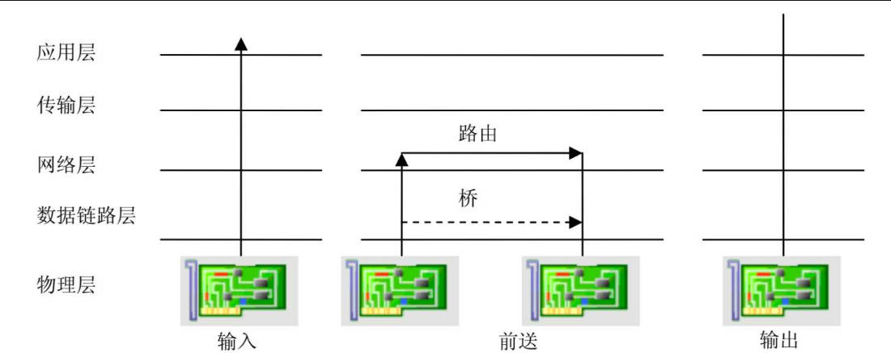
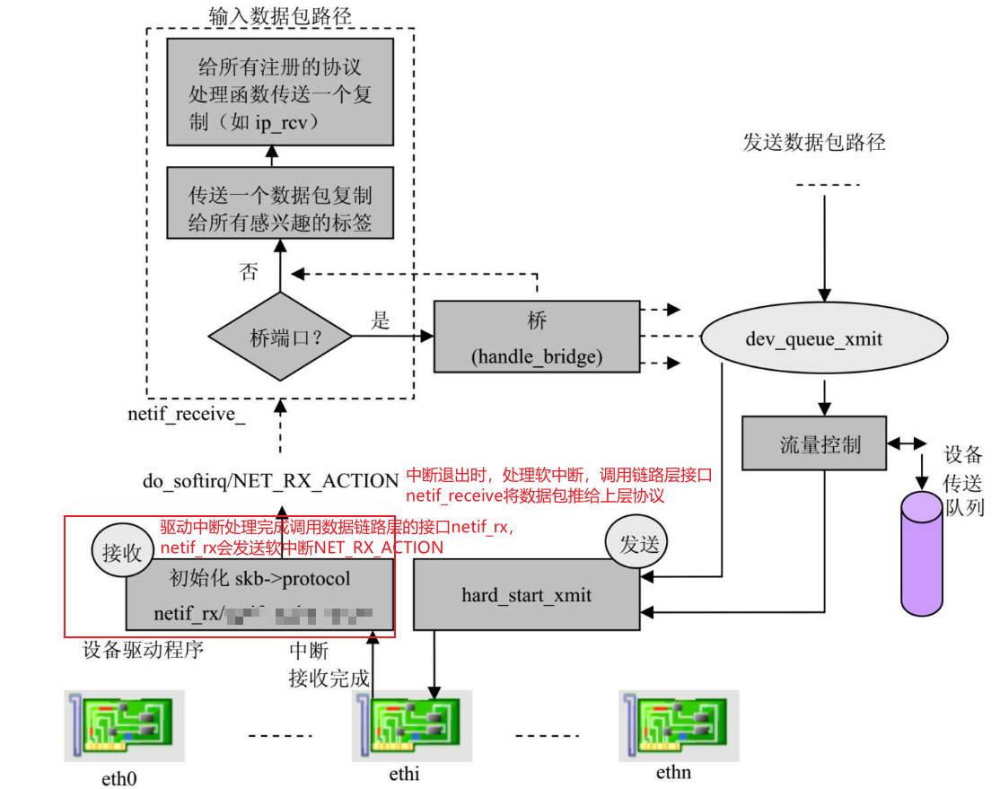
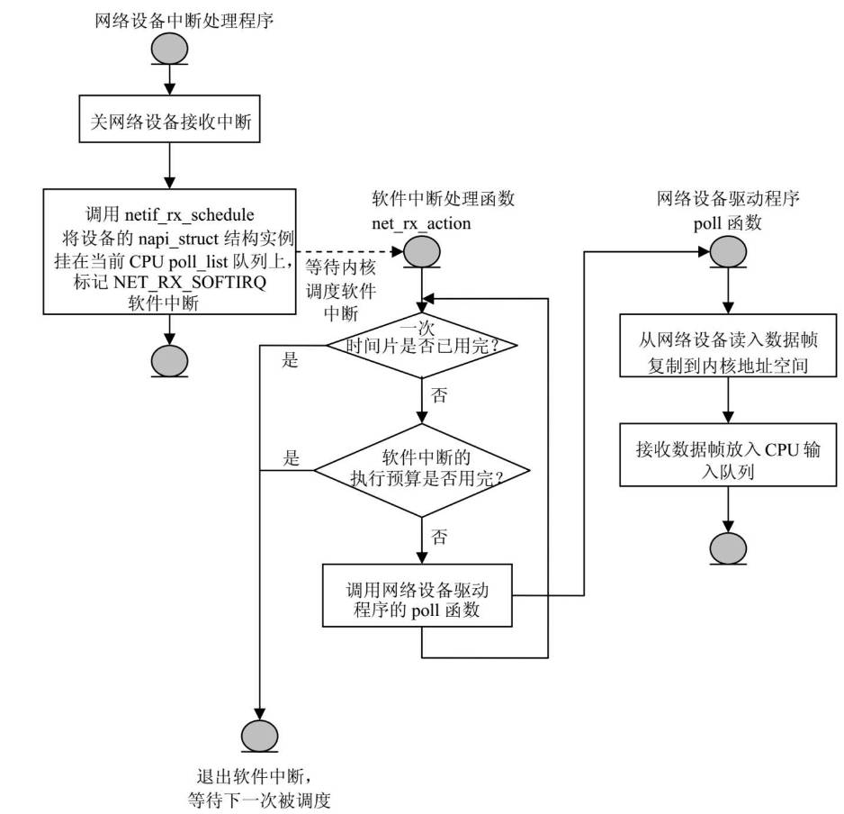
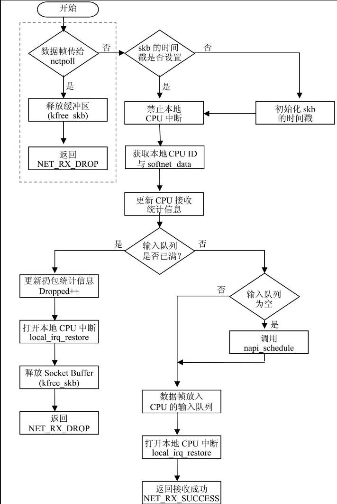
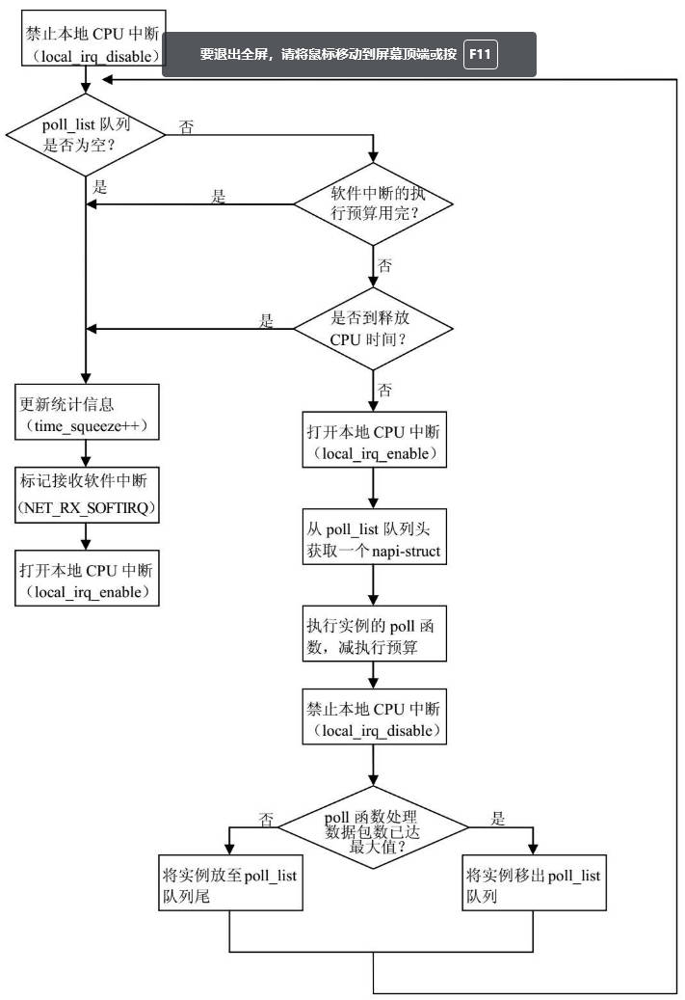
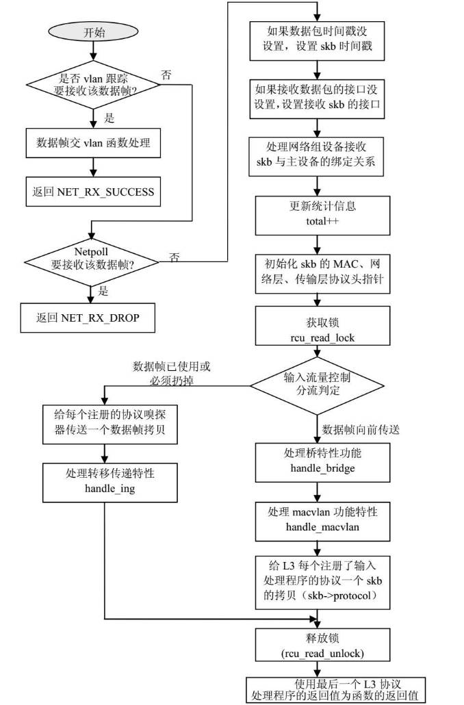
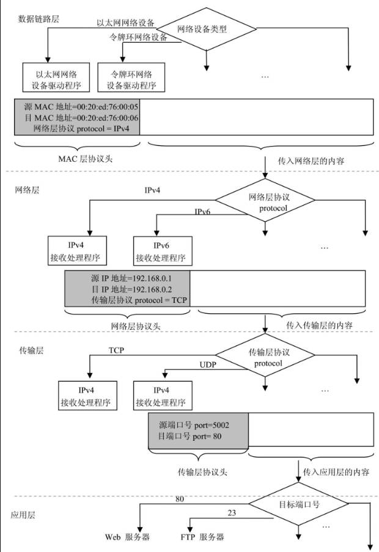
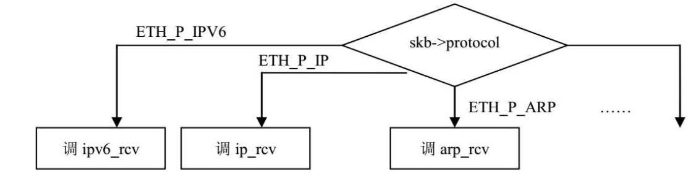
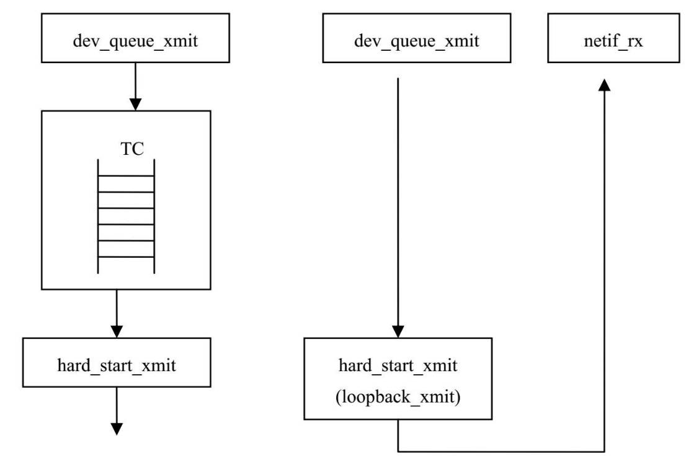
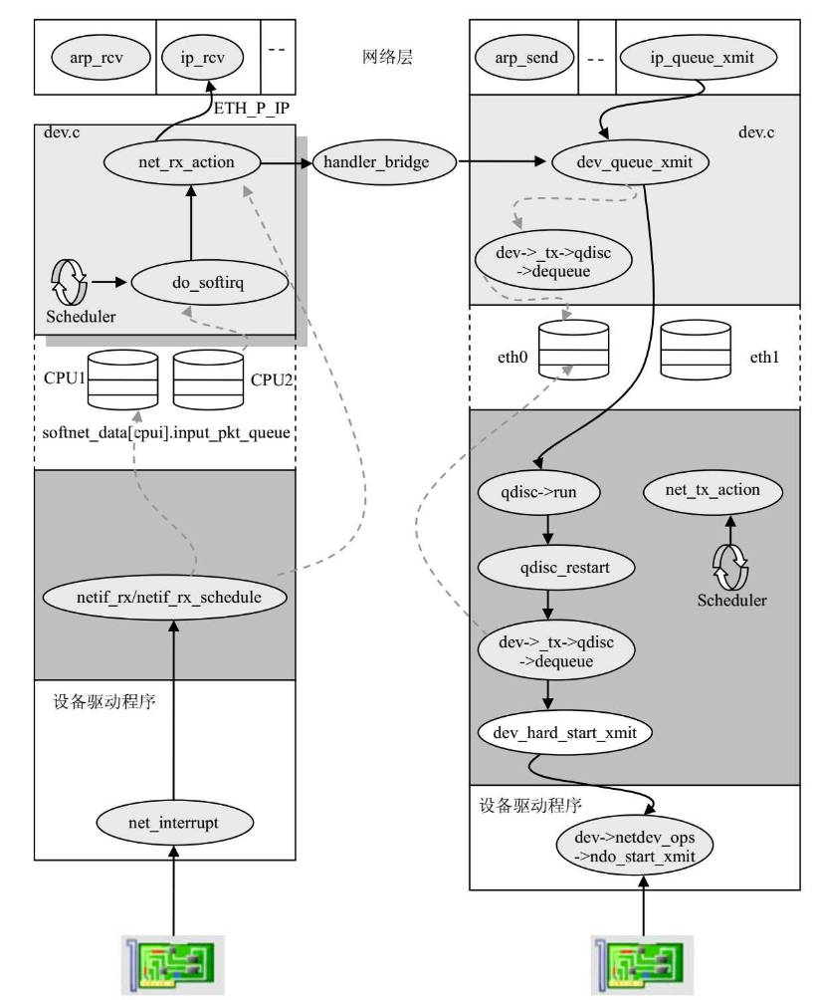

# 简介
## 数据链路层接受数据包
在驱动程序接受数据包的方法net_rx中，数据包被复制到内核空间后，驱动程序调用数据链路层的netif_rx函数将数据帧向上推送，

netif_rx 是驱动程序和数据链路层接受帧之间的API。

在数据链路层还支持一种新的API用于接受数据帧，称为NAPI。

## 数据链路层发送数据包
发送数据包需要解决的问题是，当数据包是主机产生，应该调用数据链路层哪个方法让驱动程序把数据帧发送到硬件缓存上，其二，

如果数据帧不是本机产生，需要本机转发，数据链路层如何确定发送路径。



可以看出，转发的路径确定可以由链路层桥模块，和IP层路由模块决定。

不论是转发的数据包还是本机产生的数据包，其发送方式是一样的。

数据包接受发送过程如下



# 数据结构
驱动的任务是从网络设备获得数据帧构造socket buffer，推送给链路层。

数据链路层的核心任务是：

将驱动接受到的数据帧挂到CPU输入队列，并通知上层协议有数据帧到达，随后上层协议可以从CPU输入队列中获取数据帧并处理。

将上层要发送的数据帧放到设备的输出队列，再由驱动程序的硬件发送函数 hard_start_xmit 将输出队列的数据帧复制到硬件缓冲区。

在数据链路层常会使用接受队列和发送队列，每个队列有两个指针，一个指向相关设备，一个指向存放数据包的socket buffer。

对于发送数据帧，流控子系统为每个设备定义了一个或多个队列。

对于接受数据帧，每个CPU有自己的输入队列。

## napi_struct
除了net_device来描述网络设备外，还定义了napi_struct来管理设备的新特性和操作。

对于支持NAPI的设备接受到数据帧后，该设备的napi_struct会放到CPU的softnet_data的poll_list链表中，

在网络子系统软中断NET_RX_SOFTIRQ被调度执行时，poll_list链表中的设备的poll函数会被一次执行，poll函数一次读入设备缓冲区中的多个输入数据帧。

```c
struct napi_struct {
	// 用于支持放入softnet_data的 poll_list 链表
	struct list_head	poll_list;
	
	// 当state的 NAPISTATESCHED 位为1时，napi_struct才会加入poll_list
	// 当该位为0时，napi_struct会从poll_list中移出
	unsigned long		state;
	// 在NET_RX_SOFTIRQ执行期间，可以从设备读取的最大数据帧数量
	int			weight;
	// 指向驱动程序的 poll方法 
	int			(*poll)(struct napi_struct *, int);
	struct net_device	*dev;
	// 内核全局网络设备链表
	struct list_head	dev_list;
	// 当数据帧被分片后，所有分片数据socket buffer 列表
	struct sk_buff		*gro_list;
	// 存放接受数据帧的socket buffer
	struct sk_buff		*skb;
};
```
## softnet_data
每个CPU有自己的数据结构管理输入输出流量，所以没必要对数据结构加锁，能发挥SMP的性能。

```c
struct softnet_data
{
	// 输出数据帧由流量控制系统管理，不由softnet_data管理，
	// 但事后，软件中断会负责清除已发送完成的 socket buffer
	struct Qdisc		*output_queue;
	// CPU输入数据帧队列
	struct sk_buff_head	input_pkt_queue;
	// 支持NAIP的网络设备链表
	struct list_head	poll_list;
	// 已被成功发送或接受，缓存区可以释放的socket buffer 链表
	// 对于socket buffer的释放在 NET_TX_SOFTIRQ 的处理程序中进行
	struct sk_buff		*completion_queue;

	// backlog.poll 指向 process_backlog 函数
	// 此函数将CPU输入队列input_pkt_queue的数据帧向上层推送
	struct napi_struct	backlog;
};
```

每个CPU有各自的softnet_data，在net_dev_init初始化
```c
static int __init net_dev_init(void)

	...

	for_each_possible_cpu(i) {
		struct softnet_data *queue;

		queue = &per_cpu(softnet_data, i);
		skb_queue_head_init(&queue->input_pkt_queue);
		queue->completion_queue = NULL;
		INIT_LIST_HEAD(&queue->poll_list);

		queue->backlog.poll = process_backlog;
		queue->backlog.weight = weight_p;
		queue->backlog.gro_list = NULL;
	}

	...
```

# 输入数据帧的处理
驱动获得输入数据帧后，在数据链层中如何将数据帧放到CPU的输入队列？

Linux提供了两种机制：

1. netif_rx

它通知内核收到数据帧，标记NET_RX_SOFTIRQ，在软中断中执行后续处理。

这种方式每接受一个数据帧就会处理一个硬件中断。

2. NAPI

这种模式每接受一个中断，可以接受多个数据帧。

## NAPI和老机制的差别
相对于老机制，NAPI需要驱动有如下3点增加：

1. 增加数据结构

除了描述设备的net_device外，还需要napi_struct

2. 实现 poll函数

驱动程序要实现自己的poll函数，来轮询自己的设备，将网络数据帧复制到内核空间socket buffer，再移动到CPU输入队列

3. 对接受中断处理函数进行修改

执行中断处理程序后，不是调用 netif_rx 将socket buffer放到 CPU 输入队列，而是调用netif_rx_schedule

softnet_data 和 napi_struct 和 net_device 之间关系如下


## NAPI的工作流程
网络设备接受到MAC地址地址符合的数据帧后，存入设备缓存区，向CPU发出中断请求。
CPU响应中断请求执行中断处理程序，

网络设备接受中断处理程序构造socket buffer，将数据包从设备缓存区复制到socket buffer数据缓存区，调用链路层接口函数 netif_rx_schedule .

netif_rx_schedule 将 socket buffer 挂到CPU输入数据帧队列，查看设备是否有新的数据帧进入，将设备napi_struct加入CPU的softnet_data->poll_list队列，发送软中断NET_RX_SOFTIRQ



当软中断NET_RX_SOFTIRQ被调度时，其处理函数net_rx_action调用CPU的poll_list队列中设备的poll函数，来读入设备接受到的新数据帧，直到以下条件满足，退出软件中断：

* 一次时间片用完

* 软件中断的执行预算用完

* CPU输入队列满

驱动poll函数的功能就是轮询网络设备，查看设备是否有新的数据帧进入，如果有就一直从网络设备中读入数据帧，复制到内核地址空间socket buffer中，把socket buffer放入CPU 输入队列。

当poll函数读入的数据帧达到一次能读入的最大值时，或设备中已无新数据时，停止调用设备的 poll函数。
 
## netif_rx_schedule
netif_rx_schedule的逻辑如下


```c
static inline void netif_rx_schedule(struct napi_struct *napi)
{

	// 检测是否能被调度
	// 如果napi正在已经被调度，或napi没有标记为可被调度
	// 都不能被调度。
	// 用于确保只有一个nap poll实例被运行。
	// 也确保没有挂起被禁止napi
	if (netif_rx_schedule_prep(napi))
			return !napi_disable_pending(n) &&
				!test_and_set_bit(NAPI_STATE_SCHED, &n->state);

		// 将napi加入 softnet_data.poll_list
		// 并触发软中断 NET_RX_SOFTIRQ
		__netif_rx_schedule(napi);
			local_irq_save(flags);
			list_add_tail(&n->poll_list, &__get_cpu_var(softnet_data).poll_list);
			__raise_softirq_irqoff(NET_RX_SOFTIRQ);
			local_irq_restore(flags);

}
```

## netif_rx
netif_rx是常规网络设备驱动程序在接受中断中调用，用于将输入数据帧放入CPU输入队列中。随后标记软件中断处理后续上层数据帧给TCP/IP协议栈功能。

netif_rx在以下场合被调用：

* 网络设备驱动程序接受中断执行时

* 处理CPU掉线事件的回调函数dev_cpu_callback

* loopback设备的接受数据帧函数

dev_cpu_callback函数是网络子系统注册到CPU事件通知链的函数，在SMP中，当一个CPU掉线，会向事件通知链发送事件消息。dev_cpu_callback将掉线CPU的softnet_data的 completion_queue input_pkt_queue output_queue 的socket buffer 加入其他CPU，使用 netif_rx 完成移动。

常规情况下，netif_rx在设备中断程序中被调用，但有例外，对于loopback设备，不在中断程序，因为loopback是虚拟设备，所以开始执行 netif_rx时要关闭本地CPU中断，等netif_rx执行完成后再开启中断。 (因为如果 netif_rx 在中断服务程序中执行时，中断默认是屏蔽的，而loopback没有中断，导致netif_rx必须先禁止中断，避免被打断)

netif_rx可以在不同CPU上同时运行，因为每个CPU有自己softnet_data.

### netif_rx 的工作流程
netif_rx的主要任务：

* 设置skbuff某些属性，如接受数据帧的时间

* 将接受的数据帧放入CPU的私有输入队列，通过标记软中断通知内核数据帧已经到达

* 更新CPU的接受统计信息



```c
// skb : 接受的数据帧
// 返回值 : 成功将数据帧放入CPU输入队列，返回 NET_RX_SUCCESS
//          扔掉数据帧，返回 NET_RX_DROP
int netif_rx(struct sk_buff *skb)
{
	struct softnet_data *queue;
	unsigned long flags;

	// 如果数据帧是netpoll需要的，则上层协议栈不处理，直接扔掉
	// netpoll的功能是为了让内核在整个网络和IO子系统都失效的情况
	// 下也能收发数据帧，用于远程网络控制终端和通过网络远程调试
	// 内核
	if (netpoll_rx(skb))
		return NET_RX_DROP;

	// 标记数据帧入栈时间
	if (!skb->tstamp.tv64)
		net_timestamp(skb);
			skb->tstamp = ktime_get_real();
				getnstimeofday(&now);
				return timespec_to_ktime(now);

	// 把当前中断开关状态保存到flags，并关闭中断
	// 让 netif_rx 在非中断上半部环境中也能正常使用
	local_irq_save(flags);

	// 获得当前CPU的 softnet_data
	queue = &__get_cpu_var(softnet_data);

	// 更新统计信息
	__get_cpu_var(netdev_rx_stat).total++;

	// 如果输入队列没有满
	if (queue->input_pkt_queue.qlen <= netdev_max_backlog) {
		if (queue->input_pkt_queue.qlen) {
			// 如果输入队列不为空
enqueue:
			// 将skb加入输入队列
			__skb_queue_tail(&queue->input_pkt_queue, skb);
			// 恢复中断状态
			local_irq_restore(flags);
			return NET_RX_SUCCESS;
		}

		// 如果输入队列为空

		// 将 backlog  加入 poll_list，并标记软中断 NET_RX_SOFTIRQ
		// backlog.poll = process_backlog;
		// 在中断下半段时执行 net_rx_action 会遍历poll_list，执行poll,
		// 其中 process_backlog ，负责将CPU输入队列的数据帧推送给上层协议

		// 硬件中断只做最紧急的工作，将数据帧放到CPU输入队列
		// 中断下半部负责数据帧的处理，即推送给上层协议
		napi_schedule(&queue->backlog);
			list_add_tail(&n->poll_list, &__get_cpu_var(softnet_data).poll_list);
			__raise_softirq_irqoff(NET_RX_SOFTIRQ);

		// 跳到进队列
		goto enqueue;
	}

	// 如果输入队列满了，则丢弃数据帧
	__get_cpu_var(netdev_rx_stat).dropped++;
	local_irq_restore(flags);

	kfree_skb(skb);
	return NET_RX_DROP;
}
```

## 网络接受软中断
接受数据帧的硬件中断会设置 NET_RX_SOFTIRQ 软中断，软中断处理程序为 net_rx_action，该函数的任务是推送数据帧给上层协议，

被推送的数据帧来源两个地方：

* 不支持的NAPI时，net_rx_action从CPU输入队列 softnet_data->input_pkt_queue 中获得数据帧，推送给上层协议

* 支持NAPI时，net_rx_action遍历poll_list ，执行 napi_struct->poll 函数，驱动poll函数负责从硬件读取缓存的数据帧并直接推送给上层协议


### net_rx_action 的工作流程


net_rx_action 会展开poll_list链表，获取每个napi_struct，执行它的poll函数，直到：

* poll_list无struct napi_struct

* 处理的数据帧达到net_rx_action可处理的上限（budget）

* net_rx_action执行的时间过长（2个tick，即jiffies + 2），此时释放CPU

CPU的输入队列input_pkt_queue默认最多缓存1000个数据帧，

net_rx_action工作在中断允许的状态，在net_rx_action执行时，可以源源不断加入新的数据包到input_pkt_queue，因此net_rx_action处理的数据帧可能大于1000个，所以需要限制net_rx_action的执行时长，避免影响其他任务执行。


```c
static void net_rx_action(struct softirq_action *h)
{
	// 获得当前CPU的poll_list
	struct list_head *list = &__get_cpu_var(softnet_data).poll_list;
	// 最大执行时长
	unsigned long time_limit = jiffies + 2;
	// 最多接受的数据包数量
	int budget = netdev_budget;
	void *have;

	// 禁止中断
	local_irq_disable();

	// 展开poll_list
	while (!list_empty(list)) {
		struct napi_struct *n;
		int work, weight;

		// 如果budget耗尽，或运行时间过长，说明还有数据包待处理
	 	// 标志NET_RX_SOFTIRQ，退出等待下次被调度。
		if (unlikely(budget <= 0 || time_after(jiffies, time_limit)))
			goto softnet_break;

		// 打开中断
		local_irq_enable();

		// 获得napi_struct
		n = list_entry(list->next, struct napi_struct, poll_list);

		have = netpoll_poll_lock(n);

		// weight为驱动poll函数最多能获得数据帧个数
		weight = n->weight;

		// 首先或调用 backlog.poll =  process_backlog,
		// process_backlog会把input_pkt_queue的数据包
		// 上传到上层协议栈
		// 然后是其他驱动poll，读取数据帧，上传到上层协议栈
		work = 0;
		if (test_bit(NAPI_STATE_SCHED, &n->state))
			work = n->poll(n, weight);

		WARN_ON_ONCE(work > weight);

		budget -= work;

		local_irq_disable();

		/* Drivers must not modify the NAPI state if they
		 * consume the entire weight.  In such cases this code
		 * still "owns" the NAPI instance and therefore can
		 * move the instance around on the list at-will.
		 */
		// 如果poll处理的数据帧数量达到上限，并且设置了 NAPI_STATE_DISABLE，
		// 清除 NAPI_STATE_SCHED， 将该实例移出poll_list，
		// 否则移动到poll_list尾部
		if (unlikely(work == weight)) {
			if (unlikely(napi_disable_pending(n))) // return test_bit(NAPI_STATE_DISABLE, &n->state);

				__napi_complete(n);
					list_del(&n->poll_list);
					clear_bit(NAPI_STATE_SCHED, &n->state);

			else
				list_move_tail(&n->poll_list, list);
		}

		netpoll_poll_unlock(have);
	}
	// 所有的数据包都接受完，直接退出
out:
	local_irq_enable();

	return;

softnet_break:
	// 还有数据未接受，待下次被调度
	__get_cpu_var(netdev_rx_stat).time_squeeze++;
	__raise_softirq_irqoff(NET_RX_SOFTIRQ);
	goto out;
}
```

#### process_backlog

不论驱动是否支持NAPI，backlog 都会添加到  poll_list 队列首部，所以NET_RX_SOFTIRQ中断下半部处理程序 net_rx_action 一定会调用process_backlog.

process_backlog负责将input_pkt_queue的数据包上传给上层协议栈。

```c

int weight_p __read_mostly = 64;            /* old backlog weight */

// quota 是本次调用允许最多上传的数据包数量
static int process_backlog(struct napi_struct *napi, int quota)
{
	// 已上传的数据包数量
	int work = 0;
	struct softnet_data *queue = &__get_cpu_var(softnet_data);
	unsigned long start_time = jiffies;

	napi->weight = weight_p;
	// 取出input_pkt_queue的数据包调用 netif_receive_skb 将其上传给上层协议栈
	// 最多上传 quota个数据包
	do {
		struct sk_buff *skb;

		local_irq_disable();
		skb = __skb_dequeue(&queue->input_pkt_queue);
		if (!skb) {
			// 移出poll_list队列，并清空NAPI_STATE_SCHED
			__napi_complete(napi);
				list_del(&n->poll_list);
				clear_bit(NAPI_STATE_SCHED, &n->state);
			local_irq_enable();
			break;
		}
		local_irq_enable();

		// 推送给上层协议
		netif_receive_skb(skb);
	
	// 如果推送的数据包数量小于 quota
	// 并且 时间没超过一个 jiffies 则继续
	} while (++work < quota && jiffies == start_time);

	return work;
}
```
## netif_receive_skb
netif_receive_skb用于poll_list的napi_struct->poll函数使用，用于上传数据包给上层协议。

netif_receive_skb主要有3个任务：

* 执行本层（数据链路层）的功能特点，如桥，VLAN

* 给每个协议标签发送一个数据帧的复制

* 给skb->protocol指定的网络层协议处理程序发送一个数据帧拷贝

skb->protocol通常在网卡驱动接受数据帧时设置，说明payload应该交给什么协议处理程序

```c

static void net_rx(struct net_device *dev)
	...
	skb = dev_alloc_skb(pkt_len + 2);
	skb_reserve(skb, 2);	/* Align IP on 16 byte boundaries */
	read_block(ioaddr, pkt_len, skb_put(skb,pkt_len), dev->if_port);
	skb->protocol = eth_type_trans(skb, dev); // 设置 根据L2层头部设置payload属于哪个L3协议
	netif_rx(skb);
	...
```

### netif_receive_skb的工作流程



```c
int netif_receive_skb(struct sk_buff *skb)
{
	struct packet_type *ptype, *pt_prev;
	struct net_device *orig_dev;
	struct net_device *null_or_orig;
	int ret = NET_RX_DROP;
	__be16 type;

	// 如果VLAN要处理数据帧，交给VLAN处理
	if (skb->vlan_tci && vlan_hwaccel_do_receive(skb))
		return NET_RX_SUCCESS;

	// 如果netpoll要处理数据帧，交给netpoll处理
	if (netpoll_receive_skb(skb))
		return NET_RX_DROP;

	// 若没有设置入栈时间，则设置
	if (!skb->tstamp.tv64)
		net_timestamp(skb);

	// 若没有设置设备索引号，则设置
	if (!skb->iif)
		skb->iif = skb->dev->ifindex;

	// 处理数据帧与网络设备组的特性
	// 所谓网络设备组就是将一组网络接口当成一个使用，
	// 当网络设备组收到数据包，在数据包交给IP层处理前，
	// 需要将对接受数据帧的设备的引用改成对主设备的引用。
	// 网络设备组可用于实现高可用
	null_or_orig = NULL;
	orig_dev = skb->dev;
	if (orig_dev->master) {
		if (skb_bond_should_drop(skb))
			null_or_orig = orig_dev; /* deliver only exact match */
		else
			skb->dev = orig_dev->master;
	}

	// 更新统计信息，初始化skb IP层 传输层协议头指针
	__get_cpu_var(netdev_rx_stat).total++;

	skb_reset_network_header(skb);
		skb->network_header = skb->data;

	skb_reset_transport_header(skb);
		skb->transport_header = skb->data;

	// 确定 mac_len
	skb->mac_len = skb->network_header - skb->mac_header;

	pt_prev = NULL;

	rcu_read_lock();

#ifdef CONFIG_NET_CLS_ACT
	if (skb->tc_verd & TC_NCLS) {
		skb->tc_verd = CLR_TC_NCLS(skb->tc_verd);
		goto ncls;
	}
#endif

	// 给所有嗅探器发送一个数据帧的拷贝
	list_for_each_entry_rcu(ptype, &ptype_all, list) {
		if (ptype->dev == null_or_orig || ptype->dev == skb->dev ||
		    ptype->dev == orig_dev) {
			if (pt_prev)
				ret = deliver_skb(skb, pt_prev, orig_dev);
			pt_prev = ptype;
		}
	}

	// 如果配置了输入数据帧过滤特性，由 handle_ing决定如何对数据帧进一步处理
	// 以往流量控制系统只用于实现数据帧输出的 QoS功能，现在用户可以为输入数据帧设置过滤器
#ifdef CONFIG_NET_CLS_ACT
	skb = handle_ing(skb, &pt_prev, &ret, orig_dev);
	if (!skb)
		goto out;
ncls:
#endif

	// 处理桥和macvlan特性
	// Macvlan是一种基于MAC地址的虚拟化技术，它允许在单个物理网络接口上创建多个虚拟网络接口，每个接口都有独立的MAC地址。每个macvlan接口都可以像物理接口一样与网络进行通信，具有独立的IP地址、子网掩码和网关。Macvlan接口可以与物理接口或其他macvlan接口进行通信，但它们之间是隔离的，无法直接通信。
	// VLAN是一种基于802.1Q标准的虚拟化技术，它允许将单个物理网络划分为多个逻辑上独立的虚拟局域网（LAN）。每个VLAN都有一个唯一的标识符（VLAN ID），用于区分不同的VLAN。
	skb = handle_bridge(skb, &pt_prev, &ret, orig_dev);
	if (!skb)
		goto out;
	skb = handle_macvlan(skb, &pt_prev, &ret, orig_dev);
	if (!skb)
		goto out;

	// 将数据帧发送给网络层所有注册了的协议实例的接受程序
	type = skb->protocol;
	list_for_each_entry_rcu(ptype,
			&ptype_base[ntohs(type) & PTYPE_HASH_MASK], list) {
		if (ptype->type == type &&
		    (ptype->dev == null_or_orig || ptype->dev == skb->dev ||
		     ptype->dev == orig_dev)) {
			if (pt_prev)
				ret = deliver_skb(skb, pt_prev, orig_dev);
			pt_prev = ptype;
		}
	}

	if (pt_prev) {
		ret = pt_prev->func(skb, skb->dev, pt_prev, orig_dev);
	} else {
		kfree_skb(skb);
		/* Jamal, now you will not able to escape explaining
		 * me how you were going to use this. :-)
		 */
		ret = NET_RX_DROP;
	}

out:
	rcu_read_unlock();
	return ret;
}
```

### 数据链路层和网络层的接口
结合网络设备驱动程序和 netif_rx/netif_rx_schedule 和 net_rx_action 完成了对数据链路层的处理，并使用 netif_receive_skb 将数据包由数据链路层推向网络层。

在Linux环境中TCP/IP协议栈每层都可以有多个协议，数据包可以有一个协议接受，也可以发给同一层的多个协议。另外Linux还支持多个协议栈。

#### 输入数据帧的解析
数据链路层要推送数据帧，就必须知道数据帧在网络层的协议。

在驱动程序的net_rx，很容易解析数据链路层头信息，设置skb->protocol字段，这个字段就指明了上层协议的类型。



根据skb->protocol就知道调用哪个上层协议的接口函数



#### packet_type
为了上下层协议代码的解耦合，Linux定义了一个中间层packet_type用于协议标识符和协议接口程序之间的关系，并将其按照一定数据结构组织。

```c
struct packet_type {
	// 协议标识符
	__be16			type;	/* This is really htons(ether_type). */
	// 只有从哪个设备接受的数据帧才处理
	// 如果dev 为空，则任意来源的数据帧都处理
	struct net_device	*dev;	/* NULL is wildcarded here	     */
	// 接受处理程序
	int			(*func) (struct sk_buff *,
					 struct net_device *,
					 struct packet_type *,
					 struct net_device *);
	struct sk_buff		*(*gso_segment)(struct sk_buff *skb,
						int features);
	int			(*gso_send_check)(struct sk_buff *skb);
	struct sk_buff		**(*gro_receive)(struct sk_buff **head,
					       struct sk_buff *skb);
	int			(*gro_complete)(struct sk_buff *skb);
	// 指向接受处理程序的私有数据
	void			*af_packet_priv;
	// 将packet_type按照链表组织
	struct list_head	list;
};
```

要实现L2到L3层的接口，L3层必须定义并注册一个packet_type
```c
// IPv4协议
static struct packet_type ip_packet_type = {
	.type = __constant_htons(ETH_P_IP),
	.func = ip_rcv,
	.gso_send_check = inet_gso_send_check,
	.gso_segment = inet_gso_segment,
	.gro_receive = inet_gro_receive,
	.gro_complete = inet_gro_complete,
};

// ARP协议
static struct packet_type arp_packet_type = {
	.type =	__constant_htons(ETH_P_ARP),
	.func =	arp_rcv,
};

...

```

内核定义了一个 struct list_head ptype_all链表，用于网络工具和探测器接受数据帧，还定义了 struct list_head ptype_base[PTYPE_HASH_SIZE]只接受与协议标识符匹配的数据帧。

使用 dev_add_pack ， 和 dev_remove_pack 增删协议。

例如IPv4协议，在inet_init注册ip_packet_type
```c

static int __init inet_init(void)
	...
	dev_add_pack(&ip_packet_type);
	...
```

# 输出数据帧的处理

## 发送过程的控制
网络设备完成实例创建，初始化，注册并打开设备后，网络设备就能正常运行收发数据了， 但还需允许/禁止网络设备发送队列来控制内核的发送数据包，因为网络设备发送缓存区如果满了，需要禁止网络设备发送队列，以通知内核不进行数据包发送，否则会发送失败。
网络设备发送队列的禁止/允许由net_device->state状态位 \_\_QUEUE_STATE_XOFF位来描述，内核实现了一系列API来操作，检查该状态位。

```c
// 允许发送过程
static inline void netif_start_queue(struct net_device *dev);

// 禁止发送过程
static inline int netif_queue_stopped(const struct net_device *dev)

// 重启发送过程
static inline void netif_wake_queue(struct net_device *dev)
```
在网络设备open时，除了分配资源，初始化net_device外，还会调用netif_start_queue允许发送，当驱动意识到设备输出缓存不足时，调用netif_queue_stopped通知内核禁止发送，这样可以避免失败发送导致的资源浪费。

例如CS8900A驱动，开始发送前先禁止发送，
```c
static int net_send_packet(struct sk_buff *skb, struct net_device *dev)
	spin_lock_irq(&lp->lock);
	netif_stop_queue(dev);
	...
```
当中断处理时，发现上次发送成功时，再重启发送队列
```c
static irqreturn_t net_interrupt(int irq, void *dev_id)

	...

	while ((status = readword(dev->base_addr, ISQ_PORT))) {
		if (net_debug > 4)printk("%s: event=%04x\n", dev->name, status);
		handled = 1;
		switch(status & ISQ_EVENT_MASK) {
		case ISQ_RECEIVER_EVENT:
			...

		case ISQ_TRANSMITTER_EVENT:
			lp->stats.tx_packets++;
			netif_wake_queue(dev);	/* Inform upper layers. */
			...
```
## 设备输出队列Qdisc的调度
对于输入数据包，驱动可以调用 netif_rx/netif_rx_schedule 将数据包放到 input_pkt_queue 或 将设备放到 poll_list，在 NET_RX_SOFTIRQ 处理程序net_rx_action被调度时完成数据帧处理和推送上层协议。

对于输出数据帧，也有dev_queue_xmit函数，将上层协议发送来的数据帧放到网络设备的发送队列（针对有发送队列的设备），随后流量控制系统按照内核配置的队列管理策略，将网络设备发送队列中的数据帧依次发送出去。发送时，从发送队列获取一个数据帧，将数据帧发送给设备驱动程序的dev->netdev_ops->ndo_start_xmit

dev_queue_xmit 可能因为各种原因执行失败，
1. 网络发送队列被禁止
2. 获取发送队列并发访问锁失败 (应该发送而发送失败)
对于第2种失败情况，内核实现了\_\_netif_schedule来重新调度网络设备发送数据帧，它将网络设备输出队列放到CPU发送队列 softnet_data->output_queue ，随后标记软件中断 NET_TX_SOFTIRQ，当软中断处理程序 net_tx_action 被调度时，CPU输出队列 output_queue 中的设备发送队列会重新被调度来发送数据帧。

```c
// 将设备发送队列加入CPU输出队列
// 并标记软中断NET_TX_SOFTIRQ，待软中断处理函数 发送数据包
void __netif_schedule(struct Qdisc *q)
{
	// 如果网络设备发送队列已经在ouput_queue队列中，则直接返回，返回参加调度
	if (!test_and_set_bit(__QDISC_STATE_SCHED, &q->state))
		__netif_reschedule(q);
}

static inline void __netif_reschedule(struct Qdisc *q)
{
	struct softnet_data *sd;
	unsigned long flags;

	local_irq_save(flags);
	sd = &__get_cpu_var(softnet_data);
	q->next_sched = sd->output_queue;
	sd->output_queue = q;
	raise_softirq_irqoff(NET_TX_SOFTIRQ);
	local_irq_restore(flags);
}
```

另外 netif_wake_queue 相当于调用了 netif_start_queue 和 \_\_netif_schedule.
因为驱动程序负责允许/禁止发送过程，上层内核负责设备的调度，所以netif_wake_queue通常给驱动程序使用，\_\_netif_schedule 给上层内核使用。

驱动程序会在以下情况调用 netif_wake_queue
网络设备驱动使用 watchdog来恢复挂起的发送过程。 net_device->tx_timeout 通常先重启网络设备，这时可能有待发送的数据帧，所以驱动程序应启动发送队列，并调度设备(设置NET_TX_SOFTIRQ)，将设备发送队列放入CPU输出队列。

```c
static inline void netif_wake_queue(struct net_device *dev)
{
	netif_tx_wake_queue(netdev_get_tx_queue(dev, 0));
}

static inline void netif_tx_wake_queue(struct netdev_queue *dev_queue)
{
#ifdef CONFIG_NETPOLL_TRAP
	if (netpoll_trap()) {
		clear_bit(__QUEUE_STATE_XOFF, &dev_queue->state);
		return;
	}
#endif
	if (test_and_clear_bit(__QUEUE_STATE_XOFF, &dev_queue->state))
		__netif_schedule(dev_queue->qdisc);
}
```

## 队列策略接口
网络设备都使用队列来调度管理输出数据帧的流量，内核可以使用队列策略来安排哪个数据帧先发送，队列策略属于流量控制子系统的内容，这里只介绍有发送队列的网络设备驱动程序和数据链路层之间的主要接口和调度队列的方法。

当有一个设备发送队列被调度来发送数据帧时，下一个要发送的数据帧由qdisc_run来选择，
```c

static inline void qdisc_run(struct Qdisc *q)
{
	// 过滤掉正在发送中的设备输出队列
	// 标记输出队列为正在发送中
	if (!test_and_set_bit(__QDISC_STATE_RUNNING, &q->state))
		__qdisc_run(q);
}

void __qdisc_run(struct Qdisc *q)
{
	unsigned long start_time = jiffies;

	// 发送数据帧
	// 直到队列为空，或者时间消耗完，或者驱动输出队列停止
	while (qdisc_restart(q)) {
		if (need_resched() || jiffies != start_time) {
			__netif_schedule(q); // 将设备输出队列重新加入CPU输出队列，
			                     // 并标记软中断等待下次net_tx_action中调用 qdisc_run 
								 // 继续发送该设备输出队列的数据帧
				if (!test_and_set_bit(__QDISC_STATE_SCHED, &q->state))
					q->next_sched = sd->output_queue;
					sd->output_queue = q;
			break;
		}
	}

	// 删除对输出队列正在发送中的标记
	clear_bit(__QDISC_STATE_RUNNING, &q->state);
}

static inline int qdisc_restart(struct Qdisc *q)
{
	struct netdev_queue *txq;
	int ret = NETDEV_TX_BUSY;
	struct net_device *dev;
	spinlock_t *root_lock;
	struct sk_buff *skb;

	// 从设备输出队列中获取一个 skb
	if (unlikely((skb = dequeue_skb(q)) == NULL))
			return skb = q->dequeue(q);
		return 0;

	root_lock = qdisc_lock(q);

	/* And release qdisc */
	spin_unlock(root_lock);

	// 从设备输出队列中获取网络设备
	dev = qdisc_dev(q);
	// 获得输出队列
	txq = netdev_get_tx_queue(dev, skb_get_queue_mapping(skb));

	HARD_TX_LOCK(dev, txq, smp_processor_id());
	// 如果输出队列没有停止或者冻结，则调用 dev_hard_start_xmit发送数据帧
	if (!netif_tx_queue_stopped(txq) &&
	    !netif_tx_queue_frozen(txq))
		ret = dev_hard_start_xmit(skb, dev, txq);
	HARD_TX_UNLOCK(dev, txq);

	spin_lock(root_lock);

	switch (ret) {
	case NETDEV_TX_OK:
		// 发送成功，这时socket buffer没有释放，将在 NET_TX_SOFTIRQ处理
		// 函数中释放所有 socket buffer ，这样效率更高
		ret = qdisc_qlen(q);
		break;

	case NETDEV_TX_LOCKED:
		/* Driver try lock failed */
		// 驱动程序已经被锁定
		ret = handle_dev_cpu_collision(skb, txq, q);
		break;

	default:
		// 驱动程序发现硬件没有足够的缓存发送数据帧，
		// 通常驱动程序已经调用了 netif_stop_queue
		// 将数据帧重新放回输出队列
		if (unlikely (ret != NETDEV_TX_BUSY && net_ratelimit()))
			printk(KERN_WARNING "BUG %s code %d qlen %d\n",
			       dev->name, ret, q->q.qlen);

		ret = dev_requeue_skb(skb, q);
		break;
	}

	// 如果发送成功了，但是驱动通知发送队列停止了，则ret=0通知上层函数应该退出
	if (ret && (netif_tx_queue_stopped(txq) ||
		    netif_tx_queue_frozen(txq)))
		ret = 0;

	return ret;
}
```

## dev_queue_xmit
dev_queue_xmit是网络层执行发送操作和链路层网络设备驱动之间接口。
dev_queue_xmit可以通过两个途径来调用网络设备驱动函数的发送函数ndo_start_xmit
* 流量控制接口：通过qdisc_run 函数执行
* 直接调用ndo_start_xmit：用于不使用流量控制的情况

当dev_queue_xmit发送数据帧时，数据包的已经准备完整（包括输出网络设备，下一条IP地址，MAC地址等），由网络层初始化这些。

dev_queue_xmit的输入参数是skb,
skb->dev是输出设备，skb->data是负载数据地址，skb->len是负载长度
其主要功能如下：
* 查看数据帧是否被分片，如果是，查看网络设备是否支持 scattr/gatter DMA功能，能直接处理数据片。如果不能，则将数据片组成一个完整的数据帧
* 除非设备能完成L4的数据校验和计算，否则确定传输层完成了数据帧的校验和计算
* 选择要发送的数据帧（因为有skb队列，所以由sk_buff指针指向的对象可能不是当前就能发送的数据帧）

```c
int dev_queue_xmit(struct sk_buff *skb)
{
	struct net_device *dev = skb->dev;
	struct netdev_queue *txq;
	struct Qdisc *q;
	int rc = -ENOMEM;

	/* GSO will handle the following emulations directly. */
	if (netif_needs_gso(dev, skb))
		goto gso;

	// 如果负载被分片且硬件不支持 scattr/gatter，则组装分片成完成一个数据包
	if (skb_shinfo(skb)->frag_list &&
	    !(dev->features & NETIF_F_FRAGLIST) &&
	    __skb_linearize(skb) /*组装数据包*/)
		goto out_kfree_skb;

	// 如果被分片的区域在高端内存，也需要函数完成组装
	if (skb_shinfo(skb)->nr_frags &&
	    (!(dev->features & NETIF_F_SG) || illegal_highdma(dev, skb)) &&
	    __skb_linearize(skb))
		goto out_kfree_skb;

	// 传输层校验和计算可有硬件或软件完成，若硬件不支持则会通过 dev->features 通知
	// 软件使用 skb_checksum_help 完成传输层校验和计算

	// 如果数据包还没有计算校验和且硬件不支持计算校验和，就计算校验和
	if (skb->ip_summed == CHECKSUM_PARTIAL) {
		skb_set_transport_header(skb, skb->csum_start -
					      skb_headroom(skb));
		if (!dev_can_checksum(dev, skb) && skb_checksum_help(skb))
			goto out_kfree_skb;
	}

	// 当校验和计算完成，数据包就可以交给网络设备发送

gso:
	/* Disable soft irqs for various locks below. Also
	 * stops preemption for RCU.
	 */
	rcu_read_lock_bh();

	// 获得设备输出队列
	txq = dev_pick_tx(dev, skb);
	q = rcu_dereference(txq->qdisc);

#ifdef CONFIG_NET_CLS_ACT
	skb->tc_verd = SET_TC_AT(skb->tc_verd,AT_EGRESS);
#endif
	// 如果有队列
	if (q->enqueue) {
		// 若使用队列，则将数据包放入队列	
		// 调用 qdisc_run 发送数据包
		// 需要注意由于发送策略，实际先发送的数据包不一定是这里加入的数据包
		spinlock_t *root_lock = qdisc_lock(q);

		spin_lock(root_lock);

		// 测试队列是否处于激活状态，如果是则发送，否则丢弃数据包
		if (unlikely(test_bit(__QDISC_STATE_DEACTIVATED, &q->state))) {
			kfree_skb(skb);
			rc = NET_XMIT_DROP;
		} else {
			// 如果设备输出队列是激活状态，则将数据包放入队列
			rc = qdisc_enqueue_root(skb, q);
			// 尽量将设备输出队列所有数据包发送完
			qdisc_run(q);
		}
		spin_unlock(root_lock);

		goto out;
	}

	// 有的设备没有队列，如loopback，对于这样的设备有数据包待发送时，
	// 会立即发送，接受端也会立即接受，如果错误就直接丢弃，没有第二次机会。
	// 而有队列的设备而言，发送错误会重新加入队列，等待下次发送
	// 如果没有队列，则直接调用 dev_hard_start_xmit发送数据包
	if (dev->flags & IFF_UP) {
		int cpu = smp_processor_id(); /* ok because BHs are off */

		if (txq->xmit_lock_owner != cpu) {

			HARD_TX_LOCK(dev, txq, cpu);

			// 设备发送队列是否满了
			if (!netif_tx_queue_stopped(txq)) {
				// 若可以发送，则调用dev_hard_start_xmit进行发送
				rc = 0;
				if (!dev_hard_start_xmit(skb, dev, txq)) {
					// 如果发送成功，跳转到out，在net_tx_action中统一释放skb内存
					HARD_TX_UNLOCK(dev, txq);
					goto out;
				}
				// 如果发送失败，在此函数释放内存
			}
			HARD_TX_UNLOCK(dev, txq);
			if (net_ratelimit())
				printk(KERN_CRIT "Virtual device %s asks to "
				       "queue packet!\n", dev->name);
		} else {
			if (net_ratelimit())
				printk(KERN_CRIT "Dead loop on virtual device "
				       "%s, fix it urgently!\n", dev->name);
		}
	}

	rc = -ENETDOWN;
	rcu_read_unlock_bh();

out_kfree_skb:
	kfree_skb(skb);
	return rc;
out:
	// 对于成功发送数据包，在net_tx_action 统一释放socket buffer 内存
	rcu_read_unlock_bh();
	return rc;
}
```
有队列发送和无队列发送的对比
* 有发送队列时，调用 q->queue 先将数据包放到设备的输出队列，再调用 qdisc_run由流控系统决定先发送包的顺序，尽可能将输出队列所有包发送完，qdisc_run间接调用 hard_start_xmit 发送数据包，如果发送错误，则将包重新加入输出队列，并标记软中断，待软中断中再次发送。
* 如果没有发送队列，直接调用 hard_start_xmit 发送数据包，如果发送错误就扔掉。
* 不论是否有发送队列，只要数据包发送成功，就在将数据包加入 CPU 的completion_queue ，在输出软中断net_tx_action中统一释放socket buffer


## 发送软件中断
net_rx_action 是网络接受软件中断处理程序，由驱动程序硬件中断处理程序标记触发（少数特殊情况由内核自己触发）
net_tx_action 在以下两个情况触发：
* 当设备允许发送时，由netif_wake_queue 触发，这时net_tx_action发送待发送的的数据包
* 当发送结束时，网络驱动通知内核相关缓存区可以释放时，由dev_kfree_skb_irq触发。这时net_tx_action回收发送成功的socket buffer的内存空间

释放已完成发送的socket buffer的内存放到软件中断net_tx_action中，是因为发送数据包的驱动运行在中断现场，而中断处理程序需要尽可能的快，而释放内存比较耗时。所以将释放内存交给net_tx_action.
驱动程序调用 dev_kfree_skb_irq 将要释放的socket buffer放到CPU completion_queue
net_tx_action 调用 dev_kfree_skb 将 socket buffer空间释放

```c
static void net_tx_action(struct softirq_action *h)
{
	struct softnet_data *sd = &__get_cpu_var(softnet_data);

	// 如果有需要释放的 socket buffer
	if (sd->completion_queue) {
		struct sk_buff *clist;

		// 在中断关闭情况下取出completion_queue，再打开中断
		// 并清零sd->completion_queue，这样net_tx_action
		// 可以被中断打断，并加入新的skb到 CPU completion_queue
		local_irq_disable();
		clist = sd->completion_queue;
		sd->completion_queue = NULL;
		local_irq_enable();

		// 释放所有skb
		while (clist) {
			struct sk_buff *skb = clist;
			clist = clist->next;

			WARN_ON(atomic_read(&skb->users));
			__kfree_skb(skb);
		}
	}

	// 如果CPU 设备发送队列不为空
	if (sd->output_queue) {
		struct Qdisc *head;

		// 原因同上
		local_irq_disable();
		head = sd->output_queue;
		sd->output_queue = NULL;
		local_irq_enable();

		while (head) {
			// 获得一个设备的输出队列
			struct Qdisc *q = head;
			spinlock_t *root_lock;

			// head指向下一个节点
			head = head->next_sched;

			root_lock = qdisc_lock(q);
			if (spin_trylock(root_lock)) {
				// 如果获得锁成功
				smp_mb__before_clear_bit();
				clear_bit(__QDISC_STATE_SCHED,
					  &q->state);
				// 尝试发送该设备输出队列的所有数据包
				// 如果发送失败或重新加入设备输出队列，继续发送
				// 如果运行时间超时，会将设备输出队列重新
				// 加入CPU output_queue
				qdisc_run(q);
				spin_unlock(root_lock);
			} else {
				if (!test_bit(__QDISC_STATE_DEACTIVATED,
					      &q->state)) {
					// 如果设备发送队列是激活状态，但是
					// 获得锁失败，重新将设备发送队列加入
					// CPU output_queue，并标记软中断
					__netif_reschedule(q);
				} else {
					// 如果设备输出队列不是激活状态
					// 则不将队列重新调度，设备输出队列将
					// 离开CPU output_queue
					smp_mb__before_clear_bit();
					clear_bit(__QDISC_STATE_SCHED,
						  &q->state);
				}
			}
		}
	}
}
```

# 释放socket buffer
内核提供了一些API用于在中断或非中断条件下释放socket buffer
```c
// 用于中断和非中断
void dev_kfree_skb_any(struct sk_buff *skb)
{
	if (in_irq() || irqs_disabled())
		dev_kfree_skb_irq(skb);
	else
		dev_kfree_skb(skb);
}

// 用于中断，只是将skb 加入CPU 的 completion_queue
// 并标记NET_TX_SOFTIRQ，在net_tx_action中执行真实释放
void dev_kfree_skb_irq(struct sk_buff *skb)
{
	if (atomic_dec_and_test(&skb->users)) {
		struct softnet_data *sd;
		unsigned long flags;

		local_irq_save(flags);
		sd = &__get_cpu_var(softnet_data);
		skb->next = sd->completion_queue;
		sd->completion_queue = skb;
		raise_softirq_irqoff(NET_TX_SOFTIRQ);
		local_irq_restore(flags);
	}
}

#define dev_kfree_skb(a)	kfree_skb(a)

// 非中断环境，如果skb还有用户则之减少 skb->users
// 如果没有用户，则执行真实释放
void kfree_skb(struct sk_buff *skb)
{
	if (unlikely(!skb))
		return;
	if (likely(atomic_read(&skb->users) == 1))
		smp_rmb();
	else if (likely(!atomic_dec_and_test(&skb->users)))
		return;
	__kfree_skb(skb);
}

void __kfree_skb(struct sk_buff *skb)
{
	skb_release_all(skb);
	kfree_skbmem(skb);
}
```

# watchdog
某些条件下，数据包的发送过程可以被驱动关闭，内核认为发送过程的关闭应该是临时的，所以一段时间后发送过程若没有被打开，内核就认为设备发生了故障，要重启设备。这个检查和故障处理由 watchdog 实现 。

net_device 如下用于实现 watchdog 的域
```c
struct net_device {
	...

	// 每次设备驱动后发送的最后一个数据包的时间戳
	unsigned long		trans_start;	/* Time (in jiffies) of last Tx	*/

	// 由流量控制启动的时钟，时钟超时后执行 dev_watchdog 函数
	struct timer_list	watchdog_timer;

	// 时钟应等待的时间，由驱动程序初始化，该值设置为0时，watchdog_timer 不启动
	int			watchdog_timeo; /* used by dev_watchdog() */

	// 由驱动实现的函数，在watchdog_timeo超时时，内核调用dev_watchdog, dev_watchdog调用 tx_timeout
	// tx_timeout通常会重启设备，并调用 netif_wake_queue 开启发送过程，并将本设备发送队列加入CPU output_queue，并标记软中断 NET_TX_SOFTIRQ，net_tx_action 会重新发送本设备输出队列的数据包
	void			(*tx_timeout) (struct net_device *dev);

	...
};
```

# 总结

