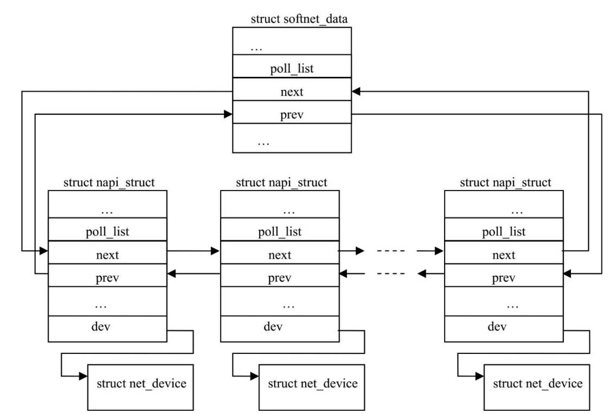
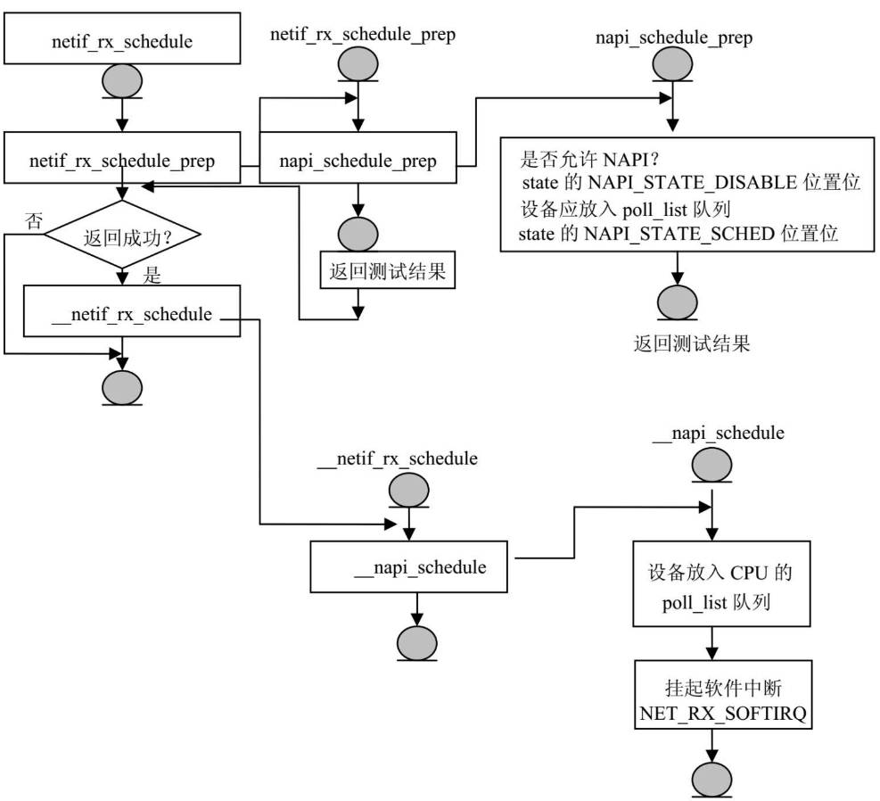

# 简介
## 数据链路层接受数据包
在驱动程序接受数据包的方法net_rx中，数据包被复制到内核空间后，驱动程序调用数据链路层的netif_rx函数将数据帧向上推送，
netif_rx 是驱动程序和数据链路层接受帧之间的API。
在数据链路层还支持一种新的API用于接受数据帧，称为NAPI。

## 数据链路层发送数据包
发送数据包需要解决的问题是，当数据包是主机产生，应该调用数据链路层哪个方法让驱动程序把数据帧发送到硬件缓存上，其二，
如果数据帧不是本机产生，需要本机转发，数据链路层如何确定发送路径。

可以看出，转发的路径确定可以由链路层桥模块，和IP层路由模块决定。
不论是转发的数据包还是本机产生的数据包，其发送方式是一样的。

数据包接受发送过程如下


# 数据结构
驱动的任务是从网络设备获得数据帧构造socket buffer，推送给链路层。

数据链路层的核心任务是：
将驱动接受到的数据帧挂到CPU输入队列，并通知上层协议有数据帧到达，随后上层协议可以从CPU输入队列中获取数据帧并处理。
将上层要发送的数据帧放到设备的输出队列，再由驱动程序的硬件发送函数 hard_start_xmit 将输出队列的数据帧复制到硬件缓冲区。

在数据链路层常会使用接受队列和发送队列，每个队列有两个指针，一个指向相关设备，一个指向存放数据包的socket buffer。
对于发送数据帧，流控子系统为每个设备定义了一个或多个队列。
对于接受数据帧，每个CPU有自己的输入队列。

## napi_struct
除了net_device来描述网络设备外，还定义了napi_struct来管理设备的新特性和操作。
对于支持NAPI的设备接受到数据帧后，该设备的napi_struct会放到CPU的softnet_data的poll_list链表中，在网络子系统软中断NET_RX_SOFTIRQ被调度执行时，poll_list链表中的设备的poll函数会被一次执行，poll函数一次读入设备缓冲区中的多个输入数据帧。
```c
struct napi_struct {
	// 用于支持放入softnet_data的 poll_list 链表
	struct list_head	poll_list;
	
	// 当state的 NAPISTATESCHED 位为1时，napi_struct才会加入poll_list
	// 当该位为0时，napi_struct会从poll_list中移出
	unsigned long		state;
	// 在NET_RX_SOFTIRQ执行期间，可以从设备读取的最大数据帧数量
	int			weight;
	// 指向驱动程序的 poll方法 
	int			(*poll)(struct napi_struct *, int);
	struct net_device	*dev;
	// 内核全局网络设备链表
	struct list_head	dev_list;
	// 当数据帧被分片后，所有分片数据socket buffer 列表
	struct sk_buff		*gro_list;
	// 存放接受数据帧的socket buffer
	struct sk_buff		*skb;
};
```
## softnet_data
每个CPU有自己的数据结构管理输入输出流量，所以没必要对数据结构加锁，能发挥SMP的性能。
```c
struct softnet_data
{
	// 输出数据帧由流量控制系统管理，不由softnet_data管理，
	// 但事后，软件中断会负责清除已发送完成的 socket buffer
	struct Qdisc		*output_queue;
	// CPU输入数据帧队列
	struct sk_buff_head	input_pkt_queue;
	// 支持NAIP的网络设备链表
	struct list_head	poll_list;
	// 已被成功发送或接受，缓存区可以释放的socket buffer 链表
	// 对于socket buffer的释放在 NET_TX_SOFTIRQ 的处理程序中进行
	struct sk_buff		*completion_queue;

	// backlog.poll 指向 process_backlog 函数
	// 此函数将CPU输入队列input_pkt_queue的数据帧向上层推送
	struct napi_struct	backlog;
};
```

每个CPU由各自的softnet_data，在net_dev_init初始化
```c
static int __init net_dev_init(void)

	...

	for_each_possible_cpu(i) {
		struct softnet_data *queue;

		queue = &per_cpu(softnet_data, i);
		skb_queue_head_init(&queue->input_pkt_queue);
		queue->completion_queue = NULL;
		INIT_LIST_HEAD(&queue->poll_list);

		queue->backlog.poll = process_backlog;
		queue->backlog.weight = weight_p;
		queue->backlog.gro_list = NULL;
	}

	...
```

# 输入数据帧的处理
驱动获得输入数据帧后，在数据链层中如何将数据帧放到CPU的输入队列？
Linux提供了两种机制：
1. netif_rx
它通知内核收到数据帧，标记NET_RX_SOFTIRQ，在软中断中执行后续处理。
这种方式每接受一个数据帧就会接受一个硬件中断。

2. NAPI
这种模式每接受一个中断，可以接受多个数据帧。

## NAPI和老机制的差别
相对于老机制，NAPI需要驱动有如下3点增加：
1. 增加数据结构
除了描述设备的net_device外，还需要napi_struct

2. 实现 poll函数
驱动程序要实现自己的poll函数，来轮询自己的设备，将网络数据帧复制到内核空间socket buffer，在移动到CPU输入队列

3. 对接受中断处理函数进行修改
执行中断处理程序后，不是调用 netif_rx 将socket buffer放到 CPU 输入队列，而是调用netif_rx_schedule

softnet_data 和 napi_struct 和 net_device 之间关系如下


## NAPI的工作流程
网络设备接受到MAC地址地址符合的数据帧后，存入设备缓存区，向CPU发出中断请求。
CPU响应中断请求执行中断处理程序，

网络设备接受中断处理程序构造socket buffer，将数据包从设备缓存区复制到socket buffer数据缓存区，调用链路层接口函数 netif_rx_schedule .

netif_rx_schedule 将 socket buffer 挂到CPU输入数据帧队列，查看设备是否有新的数据帧进入，将设备napi_struct加入CPU的poll_list队列，挂起软中断NET_RX_SOFTIRQ


当软中断NET_RX_SOFTIRQ被调度时，其处理函数net_rx_action调用CPU的poll_list队列中设备的poll函数，来读入设备接受到的新数据帧，直到以下条件满足，退出软件中断：
* 一次时间片用完
* 软件中断的执行预算用完
* CPU输入队列满

驱动poll函数的功能就是轮询网络设备，查看设备是否有新的数据帧进入，如果有就一直从网络设备中读入数据帧，复制到内核地址空间socket buffer中，把socket buffer放入CPU 输入队列。
当poll函数读入的数据帧达到一次能读入的最大值时，或设备中已无新数据时，停止调用设备的 poll函数。
 

netif_rx_schedule的逻辑如下


## netif_rx
netif_rx是常规网络设备驱动程序在接受中断中调用，用于将输入数据帧放入CPU输入队列中。随后标记软件中断处理后续上层数据帧给TCP/IP协议栈功能。
netif_rx在一下场合被调用：
* 网络设备驱动程序接受中断执行时
* 处理CPU掉线事件的回调函数dev_cpu_callback
* loopback设备的接受数据帧函数

dev_cpu_callback函数是网络子系统注册到CPU事件通知链的函数，在SMP中，当一个CPU掉线，会向事件通知链发送事件消息。dev_cpu_callback将掉线CPU的softnet_data的 completion_queue input_pkt_queue output_queue 的socket buffer 加入其他CPU，使用 netif_rx 完成移动。

常规情况下，netif_rx在设备中断程序中被调用，但有例外，对于loopback设备，不在中断程序，因为loopback是虚拟设备，所以开始执行 netif_rx时要关闭本地CPU中断，等netif_rx执行完成后再开启中断。 (因为如果 netif_rx 在中断服务程序中执行时，中断默认是屏蔽的，而loopback没有中断，导致netif_rx必须先禁止中断，避免被打断)

netif_rx可以在不同CPU上同时运行，运行每个CPU有自己softnet_data


