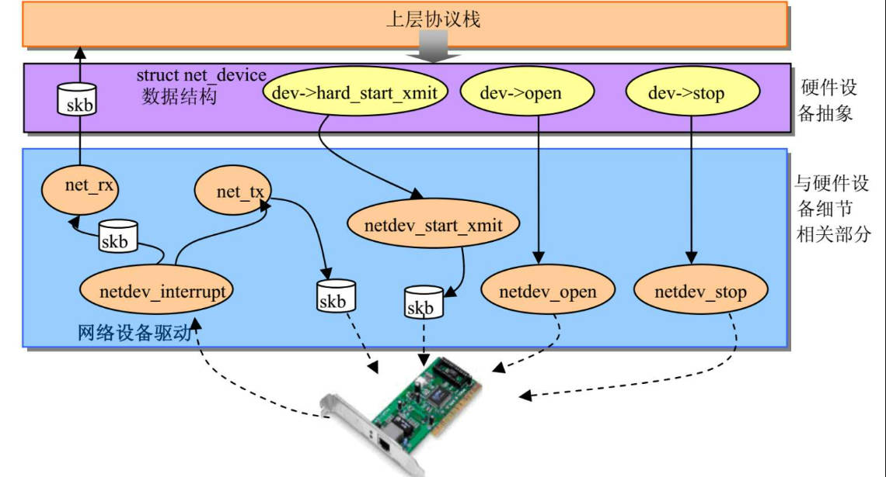
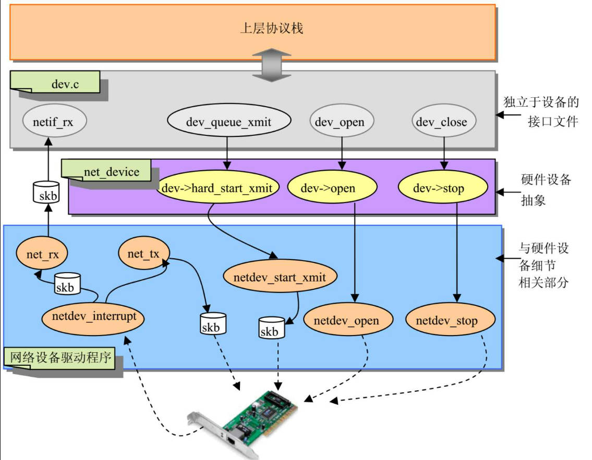

# netdev介绍

netdev 是内核对网络设备的抽象，由于网络设备和其驱动实现都不相同，

为了避免因网络设备的变化导致协议栈的改写，内核实现了统一接口netdev.



协议栈通过调用 netdev的函数指针如，open hard_start_xmit等间接调用

驱动程序打开和发送数据的功能。

这样无论驱动如何变化，协议栈都不需要改写。

内核对这种分层的实现为：

dev.c 中实现统一的接口函数，这些函数通过netdev的函数指针调用驱动的

功能，协议栈调用dev.c的接口函数。



可见netdev需要提前初始化和注册。

netdev作为网络设备的抽象，所以在网络设备驱动中初始化和注册。

# 数据结构
netdev的数据域从来源可以分为

* 描述网络设备的硬件属性，中断，端口地址，驱动的函数指针

* 描述上层协议栈配置信息：IP地址，子网掩码等

netdev的数据域从功能可以分为

* 配置

* 统计

* 设备状态

* 链表管理

* 流量控制

* 常规域

* 函数指针

## 概述
```c
struct net_device
	// 网络设备名
	char			name[IFNAMSIZ];
	// 以设备名建立哈希链表
	struct hlist_node	name_hlist;

	// 设备和内核之间通信的共享缓冲区
	unsigned long		mem_end;	/* shared mem end	*/
	unsigned long		mem_start;	/* shared mem start	*/
	// 存储区映射到内存地址范围的IO起始地址
	unsigned long		base_addr;	/* device I/O address	*/
	// 设备使用的中断号
	unsigned int		irq;		/* device IRQ number	*/

	// 物理接口类型
	unsigned char		if_port;	/* Selectable AUI, TP,..*/
	// dma通道号
	unsigned char		dma;		/* DMA channel		*/

	// 网络设备物理工作状态，
	// 如，设备是否打开，是否连接传输介质
	unsigned long		state;

	// 所有网络设备将组成链表
	// 链表头的基地址为 *dev_base_head
	struct list_head	dev_list;

	// 支持NAPI的设备组成链表
	struct list_head	napi_list;

	// 设备的硬件特性
	unsigned long		features;

	// 设备的唯一索引号
	int			ifindex;
	// iflink 主要用于虚拟网络设备，可用于标识抵达隧道另一端的真实设备
	int			iflink;

	// 工作状态的统计信息：
	// 如 收发的数据包数量和字节数量
	struct net_device_stats	stats;

	// 为实现无线设备扩展功能的函数指针表
	const struct iw_handler_def *	wireless_handlers;
	// 无线功能函数的私有数据
	struct iw_public_data *	wireless_data;

	// 为系统管理员提供的网络接口控制函数
	// 如控制速度，DMA设置，LAN唤醒等
	const struct ethtool_ops *ethtool_ops;

	// 操作数据链路层协议头的函数指针表
	// 如协议头的创建，解析，重构等
	const struct header_ops *header_ops;

	// 设备通信模式状态，ifconfig可以查看
	// 如果 通信是否开启，是否开启广播，混淆模式等
	unsigned int		flags;	/* interface flags (a la BSD)	*/

	// 存放用户空间不可见的标志，
	// 目前主要用于VLAN和以太网桥设备
	unsigned short          priv_flags; /* Like 'flags' but invisible to userspace. */

	// 接口操作状态，即接口是否能传输数据
	unsigned char		operstate; /* RFC2863 operstate */

	// 网络设备一次最多处理的字节数
	unsigned		mtu;	/* interface MTU value		*/

	// 网络设备的类型：
	// 如以太网，令牌环等
	unsigned short		type;	/* interface hardware type	*/

	// 网络设备可传输数据帧头信息的长度，
	// 如以太帧为14
	unsigned short		hard_header_len;	/* hardware hdr length	*/

	// 硬件填写信息时，是否需要在socket buffer中预留headroom 和 tailroom
	unsigned short		needed_headroom;
	unsigned short		needed_tailroom;

	// 有些协议允许网络设备组成一个组，当一个设备使用，
	// 组中有一个设备做主设备。主设备的master不为NULL,其他为NULL
	struct net_device	*master; 

	// 网络设备的硬件地址（MAC地址）
	// 长度为 addr_len
	// 不同网络设备的硬件地址长度不一样
	unsigned char		perm_addr[MAX_ADDR_LEN]; /* permanent hw address */
	unsigned char		addr_len;	/* hardware address length	*/

	// 共享网卡的设备号
	// 有些网卡支持多个linux使用，为了避免冲突，可以向网卡驱动
	// 传递一个16位标识符。
	unsigned short          dev_id;		/* for shared network cards */

	// 网络设备的主机网络地址列表
	// 可以在一个网络设备上配置多个网络地址，
	// 存放在uc_list链表, uc_count表示地址的数量
	struct dev_addr_list	*uc_list;	/* Secondary unicast mac addresses */
	int			uc_count;	/* Number of installed ucasts	*/
	// 工作于混淆模式的主机网络地址个数
	int			uc_promisc;

	// 网络设备的组传送MAC地址列表，即该网络设备属于哪些组传送地址
	struct dev_addr_list	*mc_list;	/* Multicast mac addresses	*/
	int			mc_count;	/* Number of installed mcasts	*/

	// 使用混杂模式的任务的计数器，
	// 当使用该设备的混杂模式的任务增加一个，此变量加一，
	// 当减少一个，变量减一，当为0则退出混杂模式
	// 混杂模式指接受网络上所有数据包，不论MAC地址是否匹配，
	// 这种模式用于检查网络性能和安全性，桥模式也是用该模式。
	int			promiscuity;

	// 这个值大于0时，网络设备监听所有的组播包
	int			allmulti;

	// 各种协议的配置
	void 			*atalk_ptr;	/* AppleTalk link 	*/
	void			*ip_ptr;	/* IPv4 specific data	*/  
	void                    *dn_ptr;        /* DECnet specific data */
	void                    *ip6_ptr;       /* IPv6 specific data */
	void			*ec_ptr;	/* Econet specific data	*/
	void			*ax25_ptr;	/* AX.25 specific data */
	struct wireless_dev	*ieee80211_ptr;	/* IEEE 802.11 specific data,
						   assign before registering */

	// 设备最近一次接收到数据包的事件
	unsigned long		last_rx;	/* Time of last Rx	*/

	// MAC地址
	unsigned char		dev_addr[MAX_ADDR_LEN];	

	// 加入到广播地址中的硬件地址	
	unsigned char		broadcast[MAX_ADDR_LEN];	/* hw bcast add	*/

	// 发送数据包队列
	struct list_head	qdisc_list;
	unsigned long		tx_queue_len;	/* Max frames per queue allowed */

	// 最近发送时间
	unsigned long		trans_start;	/* Time (in jiffies) of last Tx	*/

	// watchdog_timer是网络层设置传输数据包超时的闹钟，
	// 如果超时，则认为发送数据包错误，调用驱动程序的tx_timeout函数
	int			watchdog_timeo; /* used by dev_watchdog() */
	struct timer_list	watchdog_timer;

	// 设备的引用计数
	atomic_t		refcnt ____cacheline_aligned_in_smp;

	// 网络设备的注册和取消注册都使用两步完成，
	// 当第一步完成后，将剩余设备放到todo_list，
	// 由系统调用函数完成第二步
	struct list_head	todo_list;

	// 以设备索引号建立的哈希
	struct hlist_node	index_hlist;

	// 链路查看机制
	struct net_device	*link_watch_next;

	// 设备的析构函数，在卸载设备时调用
	void			(*destructor)(struct net_device *dev);

	// netpoll功能，
	// netpoll用于在网络和IO子系统都不可用时，使内核能收发报文，
	// 用于远程网络控制台，和远程内核调试，
	// 驱动程序不一定支持netpoll
	struct netpoll_info	*npinfo;

	// 中间层私有数据
	void			*ml_priv;

	// 用于实现桥, vlan
	struct net_bridge_port	*br_port;
	struct macvlan_port	*macvlan_port;

	// 表示设备在/sys文件系统 class/net/name目录下的入口
	// 没注册一个网络设备，在 /sys文件系统 class/net目录下都
	// 有一个与设备名相同的目录，
	// 输出网络设备的配置信息，如MAC网络地址，地址长度
	struct device		dev;
```

## 流量管理

在早期的Linux中，netdev有个发送队列，协议栈将skbuff加入发送队列，

并调用netdev->hard_start_xmit以通知网络设备数据已经准备好了，

接下来网络设备将队列中的skbuff加入硬件缓冲区。

现代很多网络设备支持多路发送，这个设计不能符合此特性。

例如，无线网络设备可以有四种不同的服务类型：图像，声音，最好效果

和后台服务。图像和声音的优先级较高，他们需要优先发送，而且这些

数据包很大，所以传输队列很容易满。

所以通常的处理是，如果接收方没有很快接受完成，就丢掉数据包。

后台数据只有在没有别的数据要发送时，才发送他。


## 函数指针
### init
创建网络设备netdev实例，

初始化netdev,初始化数据域：中断号,IO端口地址, 设备名等

向内核注册设备, 使设备处于可工作状态。

### open
打开已注册的设备，初始化设备使其能工作。

注册所有需要的资源，如中断，IO端口，DMA等

### 发送
```c
int	(*hard_start_xmit) (struct sk_buff *skb, struct net_device *dev);
```

要发送的数据存放在 socket buffer 中，当hard_start_xmit 返回成功，

数据就拷贝到设备发送缓存中。

```c
void (*tx_timeout) (struct net_device *dev);
```

一段时间后设备仍然没有发送数据，则调用 tx_timeout处理错误。

通常需要对设备进行复位。

# 网络设备的识别
网络设备驱动可以编译到内核，这时总线会调用驱动的probe，

该函数构造netdev，并注册。

网络设备驱动也可以编译成模块，在模块装载时，init函数构造netdev并注册。

