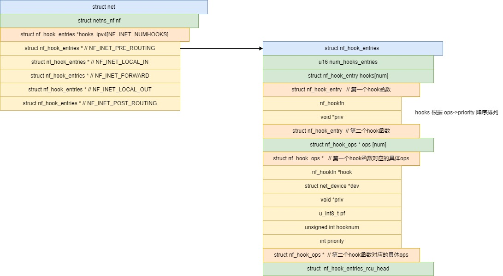
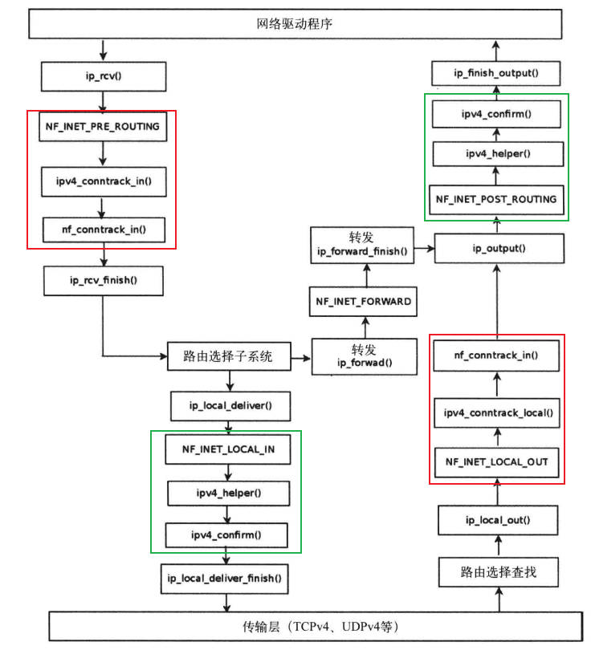

# nf hook
## 内核使用 nf hook 
协议栈在多处使用 NF_HOOK 留下hook点
```c
/*
 * pf : 协议族对于IPv4 NFPROTO_IPV4, IPv6 NFPROTO_IPV6
 * hook : 挂载点 
 * okfn : 当通过nf hook后调用的函数
 */
static inline int
NF_HOOK(uint8_t pf, unsigned int hook, struct net *net, struct sock *sk, struct sk_buff *skb,
	struct net_device *in, struct net_device *out,
	int (*okfn)(struct net *, struct sock *, struct sk_buff *))
{
	int ret = nf_hook(pf, hook, net, sk, skb, in, out, okfn);
	if (ret == 1)
		ret = okfn(net, sk, skb);
	return ret;
}
```
使用示例
```c
	return NF_HOOK(NFPROTO_IPV4, NF_INET_LOCAL_IN,
		       net, NULL, skb, skb->dev, NULL,
		       ip_local_deliver_finish);

```
可使用的挂载点
```c
enum nf_inet_hooks {
	NF_INET_PRE_ROUTING,
	NF_INET_LOCAL_IN,
	NF_INET_FORWARD,
	NF_INET_LOCAL_OUT,
	NF_INET_POST_ROUTING,
	NF_INET_NUMHOOKS,
	NF_INET_INGRESS = NF_INET_NUMHOOKS,
};
```

# 注册nf hook
模块使用如下方法注册hook

```c
int nf_register_net_hook(struct net *net, const struct nf_hook_ops *reg);
int nf_register_net_hooks(struct net *net, const struct nf_hook_ops *reg,
			  unsigned int n);
```


```c
typedef unsigned int nf_hookfn(void *priv,
			       struct sk_buff *skb,
			       const struct nf_hook_state *state);
struct nf_hook_ops {
	/* User fills in from here down. */
	nf_hookfn		*hook;     // hook回调函数
	struct net_device	*dev;
	void			*priv;
	u_int8_t		pf;        // 协议族
	unsigned int		hooknum; // 挂载点
	/* Hooks are ordered in ascending priority. */
	int			priority;       // 优先级，升序排队
};
```

每个hook的返回值
```c
#define NF_DROP 0
#define NF_ACCEPT 1
#define NF_STOLEN 2   // 数据包不传输，由hook方法处理
#define NF_QUEUE 3    // 将数据包排序，供用户空间使用
#define NF_REPEAT 4   // 再次调用hook
#define NF_STOP 5	/* Deprecated, for userspace nf_queue compatibility. */
#define NF_MAX_VERDICT NF_STOP
```
hook 的优先级
```c
enum nf_ip_hook_priorities {
	NF_IP_PRI_FIRST = INT_MIN,
	NF_IP_PRI_RAW_BEFORE_DEFRAG = -450,
	NF_IP_PRI_CONNTRACK_DEFRAG = -400,
	NF_IP_PRI_RAW = -300,              // raw
	NF_IP_PRI_SELINUX_FIRST = -225,
	NF_IP_PRI_CONNTRACK = -200,        // conntrack
	NF_IP_PRI_MANGLE = -150,           // mangle
	NF_IP_PRI_NAT_DST = -100,          // DNAT
	NF_IP_PRI_FILTER = 0,              // filter
	NF_IP_PRI_SECURITY = 50,
	NF_IP_PRI_NAT_SRC = 100,           // SNAT
	NF_IP_PRI_SELINUX_LAST = 225,
	NF_IP_PRI_CONNTRACK_HELPER = 300,
	NF_IP_PRI_CONNTRACK_CONFIRM = INT_MAX,
	NF_IP_PRI_LAST = INT_MAX,
};


```

## nf_register_net_hook


```c
struct nf_hook_ops a = 
	{
		.hook		= ipv4_conntrack_in,
		.pf		= NFPROTO_IPV4,
		.hooknum	= NF_INET_PRE_ROUTING,
		.priority	= NF_IP_PRI_CONNTRACK,   // -200
	};
```

```c
// nf_register_net_hook ->  __nf_register_net_hook

static int __nf_register_net_hook(struct net *net, int pf,
				  const struct nf_hook_ops *reg)
{
	struct nf_hook_entries *p, *new_hooks;
	struct nf_hook_entries __rcu **pp;
	int err;

	switch (pf) {
	case NFPROTO_NETDEV:
		err = nf_ingress_check(net, reg, NF_NETDEV_INGRESS);
		if (err < 0)
			return err;
		break;
	case NFPROTO_INET:
		if (reg->hooknum != NF_INET_INGRESS)
			break;

		err = nf_ingress_check(net, reg, NF_INET_INGRESS);
		if (err < 0)
			return err;
		break;
	}

	// 根据 pf hooknum 获得旧的 插入点, 注意返回的二级指针
	pp = nf_hook_entry_head(net, pf, reg->hooknum, reg->dev);
		switch (pf) {
		case NFPROTO_IPV4:
			if (WARN_ON_ONCE(ARRAY_SIZE(net->nf.hooks_ipv4) <= hooknum))
				return NULL;
			return net->nf.hooks_ipv4 + hooknum;

	mutex_lock(&nf_hook_mutex);

	// 获得旧的插入点
	p = nf_entry_dereference(*pp);

	// 将新的hook信息加入插入点
	new_hooks = nf_hook_entries_grow(p, reg);

	...

	// 释放旧的插入点
	nf_hook_entries_free(p);
	return 0;
}
```

### nf_hook_entries_grow
```c
static struct nf_hook_entries *
nf_hook_entries_grow(const struct nf_hook_entries *old,
		     const struct nf_hook_ops *reg)
{
	unsigned int i, alloc_entries, nhooks, old_entries;
	struct nf_hook_ops **orig_ops = NULL;
	struct nf_hook_ops **new_ops;
	struct nf_hook_entries *new;
	bool inserted = false;

	alloc_entries = 1;
	old_entries = old ? old->num_hook_entries : 0;

	// 如果有旧的插入点，得到 旧的ops 数组
	// 并计算需要拷贝的 ops 项
	if (old) {
		orig_ops = nf_hook_entries_get_hook_ops(old);

		for (i = 0; i < old_entries; i++) {
			if (orig_ops[i] != &dummy_ops)
				alloc_entries++;
		}
	}

	if (alloc_entries > MAX_HOOK_COUNT)
		return ERR_PTR(-E2BIG);

	// 分配空间给新的插入点
	new = allocate_hook_entries_size(alloc_entries);
		struct nf_hook_entries *e;
		size_t alloc = sizeof(*e) +
				   sizeof(struct nf_hook_entry) * num +
				   sizeof(struct nf_hook_ops *) * num +
				   sizeof(struct nf_hook_entries_rcu_head);
		e = kvzalloc(alloc, GFP_KERNEL);
		if (e)
			e->num_hook_entries = num;
		return e;

	// 获得新的ops数组
	new_ops = nf_hook_entries_get_hook_ops(new);
		unsigned int n = e->num_hook_entries;
		const void *hook_end;
		hook_end = &e->hooks[n]; /* this is *past* ->hooks[]! */
		return (struct nf_hook_ops **)hook_end;


	// 按照优先级将新的reg插入到新插入点，并拷贝旧的项
	i = 0;
	nhooks = 0;
	while (i < old_entries) {
		if (orig_ops[i] == &dummy_ops) {
			++i;
			continue;
		}

		if (inserted || reg->priority > orig_ops[i]->priority) {
			new_ops[nhooks] = (void *)orig_ops[i];
			new->hooks[nhooks] = old->hooks[i];
			i++;
		} else {
			new_ops[nhooks] = (void *)reg;
			new->hooks[nhooks].hook = reg->hook;
			new->hooks[nhooks].priv = reg->priv;
			inserted = true;
		}
		nhooks++;
	}

	if (!inserted) {
		new_ops[nhooks] = (void *)reg;
		new->hooks[nhooks].hook = reg->hook;
		new->hooks[nhooks].priv = reg->priv;
	}

	// 返回新的插入点
	return new;
}
```

数据结构图



## nf_hook 的调用
```c
static inline int
NF_HOOK(uint8_t pf, unsigned int hook, struct net *net, struct sock *sk, struct sk_buff *skb,
	struct net_device *in, struct net_device *out,
	int (*okfn)(struct net *, struct sock *, struct sk_buff *))
{
	int ret = nf_hook(pf, hook, net, sk, skb, in, out, okfn);

		// 根据 pf 和 hooknum 找到 hook_entries
		switch (pf) {
		case NFPROTO_IPV4:
			hook_head = rcu_dereference(net->nf.hooks_ipv4[hook]);
			break;
			...
		}

		if (hook_head) {
			struct nf_hook_state state;

			nf_hook_state_init(&state, hook, pf, indev, outdev,
					   sk, net, okfn);
				pstate->hook = hook;
				pstate->pf = pf;
				pstate->in = indev;
				pstate->out = outdev;
				pstate->sk = sk;
				pstate->net = net;
				pstate->okfn = okfn;

			// 从0开始经过 hook entries
			ret = nf_hook_slow(skb, &state, hook_head, 0);
		}
		rcu_read_unlock();

		return ret;

	if (ret == 1)
		ret = okfn(net, sk, skb);
	return ret;
}
```

```c
int nf_hook_slow(struct sk_buff *skb, struct nf_hook_state *state,
		 const struct nf_hook_entries *e, unsigned int s)
{
	unsigned int verdict;
	int ret;

	for (; s < e->num_hook_entries; s++) {
		
		// 执行 hook entry 的 hook方法
		verdict = nf_hook_entry_hookfn(&e->hooks[s], skb, state);
				return entry->hook(entry->priv, skb, state);

		switch (verdict & NF_VERDICT_MASK) {
		case NF_ACCEPT:
			break;
		case NF_DROP:
			kfree_skb(skb);
			ret = NF_DROP_GETERR(verdict);
			if (ret == 0)
				ret = -EPERM;
			return ret;
		case NF_QUEUE:
			ret = nf_queue(skb, state, s, verdict);
			if (ret == 1)
				continue;
			return ret;
		default:
			/* Implicit handling for NF_STOLEN, as well as any other
			 * non conventional verdicts.
			 */
			return 0;
		}
	}

	return 1;
}
```

# conntrack
conntrack 是基于 nf hook 实现，只要使用了conntrack模块，则一定会挂载 conntrack 的 hook
```c
static const struct nf_hook_ops ipv4_conntrack_ops[] = {
	{
		.hook		= ipv4_conntrack_in,
		.pf		= NFPROTO_IPV4,
		.hooknum	= NF_INET_PRE_ROUTING,
		.priority	= NF_IP_PRI_CONNTRACK,   // -200
	},
	{
		.hook		= ipv4_conntrack_local,
		.pf		= NFPROTO_IPV4,
		.hooknum	= NF_INET_LOCAL_OUT,
		.priority	= NF_IP_PRI_CONNTRACK, // -200
	},
	{
		.hook		= ipv4_confirm,
		.pf		= NFPROTO_IPV4,
		.hooknum	= NF_INET_POST_ROUTING,
		.priority	= NF_IP_PRI_CONNTRACK_CONFIRM, // INT_MAX
	},
	{
		.hook		= ipv4_confirm,
		.pf		= NFPROTO_IPV4,
		.hooknum	= NF_INET_LOCAL_IN,
		.priority	= NF_IP_PRI_CONNTRACK_CONFIRM, // INT_MAX
	},
};
```
其中最重要的是 ipv4_conntrack_in  和 ipv4_conntrack_local

他们的优先级高于 nat hook，他们为使用NAT提供必要帮助。



## 注册conntrack hook
```c
int nf_ct_netns_get(struct net *net, u8 nfproto)
	case NFPROTO_INET:
		nf_ct_netns_inet_get(net);
			nf_ct_netns_do_get(struct net *net, u8 nfproto)
					nf_register_net_hooks(net, ipv4_conntrack_ops,
									ARRAY_SIZE(ipv4_conntrack_ops));
```
## 连接跟踪 nf_conntrack_tuple
```c
```

## ipv4_conntrack_in
```c
static unsigned int ipv4_conntrack_in(void *priv,
				      struct sk_buff *skb,
				      const struct nf_hook_state *state)
	return nf_conntrack_in(skb, state);
```
