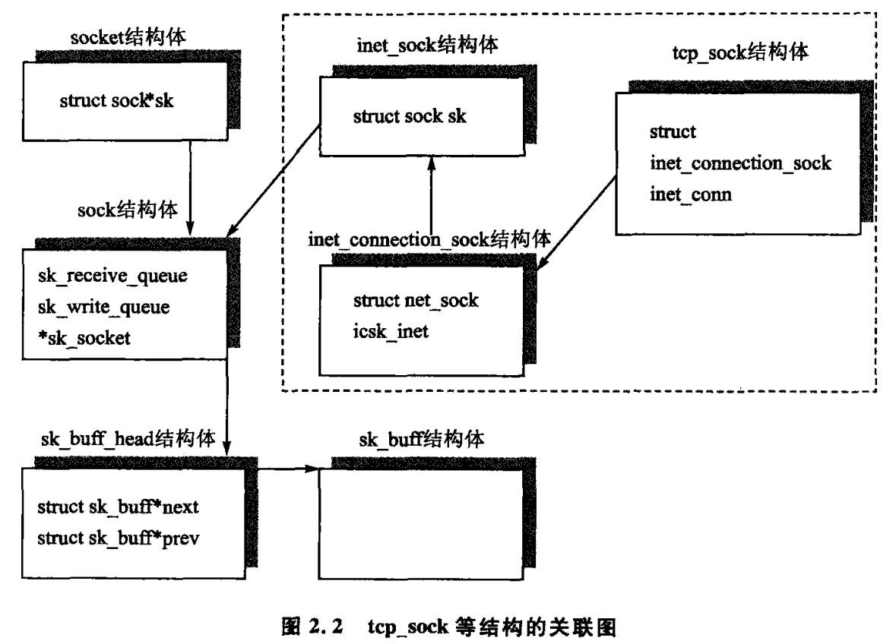
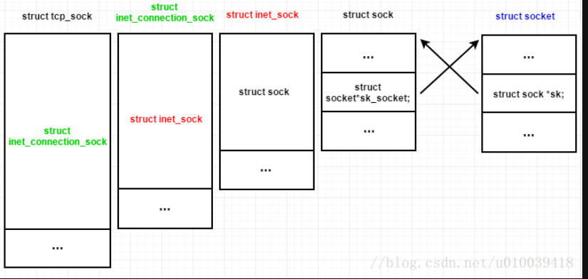

基于 linux-2.6.26

# 1. 网络文件系统

## 网络文件系统的注册
```c
static struct file_system_type sock_fs_type = {
	.name =		"sockfs",
	.get_sb =	sockfs_get_sb,
	.kill_sb =	kill_anon_super,
};

static int __init sock_init(void)
{
	/*
	 *      Initialize sock SLAB cache.
	 */

	sk_init();

	/*
	 *      Initialize skbuff SLAB cache
	 */
	skb_init();

	/*
	 *      Initialize the protocols module.
	 */

	init_inodecache();
	register_filesystem(&sock_fs_type); // 注册网络文件系统
	sock_mnt = kern_mount(&sock_fs_type); // 安装文件系统

	/* The real protocol initialization is performed in later initcalls.
	 */

#ifdef CONFIG_NETFILTER
	netfilter_init();
#endif

	return 0;
}
```

### 分析 kern_mount

```c
#define kern_mount(type) kern_mount_data(type, NULL)

struct vfsmount *kern_mount_data(struct file_system_type *type, void *data)
{
	return vfs_kern_mount(type, MS_KERNMOUNT, type->name, data);
}

struct vfsmount *
vfs_kern_mount(struct file_system_type *type, int flags, const char *name, void *data)
{
	struct vfsmount *mnt;
	char *secdata = NULL;
	int error;

	mnt = alloc_vfsmnt(name);
	

	// 创建super_block, 根dentry 和 根inode
	// super_block->s_root = dentry; dentry->d_inode = inode;
	type->get_sb(type, flags, name, data, mnt);
		sockfs_get_sb(struct file_system_type *fs_type,
					 int flags, const char *dev_name, void *data,
					 struct vfsmount *mnt)
			return get_sb_pseudo(fs_type, "socket:", &sockfs_ops, SOCKFS_MAGIC,
						 mnt);
				struct super_block *s = sget(fs_type, NULL, set_anon_super, NULL);
				s->s_op = ops ? ops : &simple_super_operations; // sockfs_ops
				// 创建根inode
				root = new_inode(s);
					inode = alloc_inode(sb);
						if (sb->s_op->alloc_inode)
							inode = sb->s_op->alloc_inode(sb); // sock_alloc_inode
						else
							inode = (struct inode *) kmem_cache_alloc(inode_cachep, GFP_KERNEL);

				// 创建根dentry
				dentry = d_alloc(NULL, &d_name);
				// 建立 dentry inode super_block vfsmount 关系
				d_instantiate(dentry, root);
				s->s_root = dentry;
				return simple_set_mnt(struct vfsmount mnt, struct super_block *sb);
					mnt->mnt_sb = sb;
					mnt->mnt_root = dget(sb->s_root);

	mnt->mnt_mountpoint = mnt->mnt_root; // 他挂载在自己的根目录
	mnt->mnt_parent = mnt;
	return mnt;
}
```
需要注意sockfs实现的ops
```c
static struct super_operations sockfs_ops = {
	.alloc_inode =	sock_alloc_inode,
	.destroy_inode =sock_destroy_inode,
	.statfs =	simple_statfs,
};
```

# socket的创建

## 重要数据结构
### socket
socket是公用属性集合，与协议无关
```c
struct socket {
	socket_state		state;
	unsigned long		flags;
	const struct proto_ops	*ops;
	struct fasync_struct	*fasync_list; // 异步唤醒队列
	struct file		*file;
	struct sock		*sk; // sock 代表具体协议内容
	wait_queue_head_t	wait; // 等待队列
	short			type; // socket的类型
};
```
### sock
sock 和协议相关，每种协议的sock都不同
```c
struct sock {
	/*
	 * Now struct inet_timewait_sock also uses sock_common, so please just
	 * don't add nothing before this first member (__sk_common) --acme
	 */
	struct sock_common	__sk_common;
#define sk_family		__sk_common.skc_family
#define sk_state		__sk_common.skc_state
#define sk_reuse		__sk_common.skc_reuse
#define sk_bound_dev_if		__sk_common.skc_bound_dev_if
#define sk_node			__sk_common.skc_node
#define sk_bind_node		__sk_common.skc_bind_node
#define sk_refcnt		__sk_common.skc_refcnt
#define sk_hash			__sk_common.skc_hash
#define sk_prot			__sk_common.skc_prot
#define sk_net			__sk_common.skc_net
	unsigned char		sk_shutdown : 2,
				sk_no_check : 2,
				sk_userlocks : 4;
	unsigned char		sk_protocol;
	unsigned short		sk_type;
	int			sk_rcvbuf;
	socket_lock_t		sk_lock;
	/*
	 * The backlog queue is special, it is always used with
	 * the per-socket spinlock held and requires low latency
	 * access. Therefore we special case it's implementation.
	 */
	struct {
		struct sk_buff *head;
		struct sk_buff *tail;
	} sk_backlog;
	wait_queue_head_t	*sk_sleep;
	struct dst_entry	*sk_dst_cache;
	struct xfrm_policy	*sk_policy[2];
	rwlock_t		sk_dst_lock;
	atomic_t		sk_rmem_alloc;
	atomic_t		sk_wmem_alloc;
	atomic_t		sk_omem_alloc;
	int			sk_sndbuf;
	struct sk_buff_head	sk_receive_queue;
	struct sk_buff_head	sk_write_queue;
	struct sk_buff_head	sk_async_wait_queue;
	int			sk_wmem_queued;
	int			sk_forward_alloc;
	gfp_t			sk_allocation;
	int			sk_route_caps;
	int			sk_gso_type;
	unsigned int		sk_gso_max_size;
	int			sk_rcvlowat;
	unsigned long 		sk_flags;
	unsigned long	        sk_lingertime;
	struct sk_buff_head	sk_error_queue;
	struct proto		*sk_prot_creator;
	rwlock_t		sk_callback_lock;
	int			sk_err,
				sk_err_soft;
	atomic_t		sk_drops;
	unsigned short		sk_ack_backlog;
	unsigned short		sk_max_ack_backlog;
	__u32			sk_priority;
	struct ucred		sk_peercred;
	long			sk_rcvtimeo;
	long			sk_sndtimeo;
	struct sk_filter      	*sk_filter;
	void			*sk_protinfo;
	struct timer_list	sk_timer;
	ktime_t			sk_stamp;
	struct socket		*sk_socket;
	void			*sk_user_data;
	struct page		*sk_sndmsg_page;
	struct sk_buff		*sk_send_head;
	__u32			sk_sndmsg_off;
	int			sk_write_pending;
	void			*sk_security;
	__u32			sk_mark;
	/* XXX 4 bytes hole on 64 bit */
	void			(*sk_state_change)(struct sock *sk);
	void			(*sk_data_ready)(struct sock *sk, int bytes);
	void			(*sk_write_space)(struct sock *sk);
	void			(*sk_error_report)(struct sock *sk);
  	int			(*sk_backlog_rcv)(struct sock *sk,
						  struct sk_buff *skb);  
	void                    (*sk_destruct)(struct sock *sk);
};
```
### sk_buff
每种协议都是对 sk_buff 进行封装，每个数据包都对应一个sk_buff
```c
struct sk_buff {
	/* These two members must be first. */
	struct sk_buff		*next;
	struct sk_buff		*prev;

	struct sock		*sk;
	ktime_t			tstamp;
	struct net_device	*dev;

	union {
		struct  dst_entry	*dst;
		struct  rtable		*rtable;
	};
	struct	sec_path	*sp;

	/*
	 * This is the control buffer. It is free to use for every
	 * layer. Please put your private variables there. If you
	 * want to keep them across layers you have to do a skb_clone()
	 * first. This is owned by whoever has the skb queued ATM.
	 */
	char			cb[48];

	unsigned int		len,
				data_len;
	__u16			mac_len,
				hdr_len;
	union {
		__wsum		csum;
		struct {
			__u16	csum_start;
			__u16	csum_offset;
		};
	};
	__u32			priority;
	__u8			local_df:1,
				cloned:1,
				ip_summed:2,
				nohdr:1,
				nfctinfo:3;
	__u8			pkt_type:3,
				fclone:2,
				ipvs_property:1,
				peeked:1,
				nf_trace:1;
	__be16			protocol;

	void			(*destructor)(struct sk_buff *skb);
#if defined(CONFIG_NF_CONNTRACK) || defined(CONFIG_NF_CONNTRACK_MODULE)
	struct nf_conntrack	*nfct;
	struct sk_buff		*nfct_reasm;
#endif
#ifdef CONFIG_BRIDGE_NETFILTER
	struct nf_bridge_info	*nf_bridge;
#endif

	int			iif;
#ifdef CONFIG_NETDEVICES_MULTIQUEUE
	__u16			queue_mapping;
#endif
#ifdef CONFIG_NET_SCHED
	__u16			tc_index;	/* traffic control index */
#ifdef CONFIG_NET_CLS_ACT
	__u16			tc_verd;	/* traffic control verdict */
#endif
#endif
#ifdef CONFIG_IPV6_NDISC_NODETYPE
	__u8			ndisc_nodetype:2;
#endif
	/* 14 bit hole */

#ifdef CONFIG_NET_DMA
	dma_cookie_t		dma_cookie;
#endif
#ifdef CONFIG_NETWORK_SECMARK
	__u32			secmark;
#endif

	__u32			mark;

	sk_buff_data_t		transport_header;
	sk_buff_data_t		network_header;
	sk_buff_data_t		mac_header;
	/* These elements must be at the end, see alloc_skb() for details.  */
	sk_buff_data_t		tail;
	sk_buff_data_t		end;
	unsigned char		*head,
				*data;
	unsigned int		truesize;
	atomic_t		users;
};
```
## sys_socket
socket系统调用最终由sock_create处理
```c
long sys_socket(int family, int type, int protocol)
	struct socket *sock;
	retval = sock_create(family, type, protocol, &sock); //根据协议创建sock
	retval = sock_map_fd(sock); // 分配file,将sock和file绑定,分配fd，安装file
	return retval; // 返回文件描述符
```

### sock_map_fd
sock_map_fd 将 socket 映射到 fd
```c
int sock_map_fd(struct socket *sock)
{
	struct file *newfile;
	int fd = sock_alloc_fd(&newfile); // 分配空闲fd, 分配 struct file
		fd = get_unused_fd();
		return fd;

	if (likely(fd >= 0)) {
		int err = sock_attach_fd(sock, newfile);
			struct qstr name = { .name = "" };

			dentry = d_alloc(sock_mnt->mnt_sb->s_root, &name);  // 分配dentry,初始化
																// 设置sb,和parent
				dentry = kmem_cache_alloc(dentry_cache, GFP_KERNEL);
				dentry->d_parent = dget(parent);
				dentry->d_sb = parent->d_sb;
				...

			dentry->d_op = &sockfs_dentry_operations;
			d_instantiate(dentry, SOCK_INODE(sock)); // 将dentry 和 sock相关inode绑定
			sock->file = file;

			init_file(file, sock_mnt, dentry, FMODE_READ | FMODE_WRITE,
				  &socket_file_ops);
				file->f_op = fop; // socket_file_ops

			SOCK_INODE(sock)->i_fop = &socket_file_ops;
			file->f_flags = O_RDWR;
			file->f_pos = 0;
			file->private_data = sock;

		if (unlikely(err < 0)) {
			put_filp(newfile);
			put_unused_fd(fd);
			return err;
		}
		fd_install(fd, newfile); // 将file安装到进程的文件会话数组
	}
	return fd;
}
```

### sock_create
1. 分配并建立关系file fd inode
2. 分配并建立关系socket sock prot
最终建立关系

```c
int sock_create(int family, int type, int protocol, struct socket **res)
	return __sock_create(current->nsproxy->net_ns, family, type, protocol, res, 0);

struct socket_alloc {
	struct socket socket;
	struct inode vfs_inode;
};

static int __sock_create(struct net *net, int family, int type, int protocol,
			 struct socket **res, int kern)
{
	int err;
	struct socket *sock;
	const struct net_proto_family *pf;

	// 检查协议合法
	if (family < 0 || family >= NPROTO)
		return -EAFNOSUPPORT;
	if (type < 0 || type >= SOCK_MAX)
		return -EINVAL;

	...

	sock = sock_alloc(); // 创建socket
		struct inode *inode;
		struct socket *sock;

		inode = new_inode(sock_mnt->mnt_sb);
			struct inode *sock_alloc_inode(struct super_block *sb)
				struct socket_alloc *ei;
				...
				ei = kmem_cache_alloc(sock_inode_cachep, GFP_KERNEL);
				ei->socket.state = SS_UNCONNECTED;
				return &ei->vfs_inode;

		sock = SOCKET_I(inode);
		inode->i_mode = S_IFSOCK | S_IRWXUGO; // S_IFSOCK极可能用于上层操作的路由
		inode->i_uid = current->fsuid;
		inode->i_gid = current->fsgid;
		return sock;


	sock->type = type; // 记录sock类型

	pf = rcu_dereference(net_families[family]); // 获得协议族操作函数表

	err = pf->create(net, sock, protocol); 	// 执行协议族创建
											// 如果 family为 AF_INET
											// 则调用 inet_create
											// 完成创建 sock, 找到 prot
											// 绑定 socket的sock，sock 的 prot
											// 初始化 socket , sock

	*res = sock; // 返回socket

	return 0;
}
```

那么 net_families[] 在哪里添加呢
```c
int sock_register(const struct net_proto_family *ops)
{
	int err;

	if (net_families[ops->family])
		err = -EEXIST;
	else {
		net_families[ops->family] = ops;
		err = 0;
	}

	return err;
}
```

在每个协议都调用 sock_register，如 AF_INET
```c
// AF_INET
static struct net_proto_family inet_family_ops = {
	.family = PF_INET,
	.create = inet_create,
	.owner	= THIS_MODULE,
};

static int __init inet_init(void)
	(void)sock_register(&inet_family_ops);

// AF_UNIX
static struct net_proto_family unix_family_ops = {
	.family = PF_UNIX,
	.create = unix_create,
	.owner	= THIS_MODULE,
};

static int __init af_unix_init(void)
	sock_register(&unix_family_ops);
```

如果使用AF_INET调用 socket，则 sock_create -> inet_create
### inet_create
大致完成下述功能
0. 根据protocol 找到 struct prot prot
1. 分配struct sock sk, 绑定 sock  prot socket
2. 初始化 socket sock
```c
static int inet_create(struct net *net, struct socket *sock, int protocol)
{
	struct sock *sk;
	struct list_head *p;
	struct inet_protosw *answer;
	struct inet_sock *inet;
	struct proto *answer_prot;
	unsigned char answer_flags;
	char answer_no_check;
	int try_loading_module = 0;
	int err;

	if (sock->type != SOCK_RAW &&
	    sock->type != SOCK_DGRAM &&
	    !inet_ehash_secret)
		build_ehash_secret();

	sock->state = SS_UNCONNECTED;

	/* Look for the requested type/protocol pair. */
	answer = NULL;
lookup_protocol:
	err = -ESOCKTNOSUPPORT;
	rcu_read_lock();

	// protocol 有三种 
	// 	IPPROTO_IP :  虚拟IP类型，和SOCK_RAW 使用，表示原始套接字
	//	IPPROTO_TCP : 和 SOCK_STREAM 使用，表示TCP
	//	IPPROTO_UDP : 和 SOCK_DGRAM 使用，表示UDP
	//
	// static struct list_head inetsw[SOCK_MAX]; 预先注册好的 struct inet_protosw
	// inet_init -> inet_register_protosw 完成注册
	list_for_each_rcu(p, &inetsw[sock->type]) {
		answer = list_entry(p, struct inet_protosw, list);

		/* Check the non-wild match. */
		if (protocol == answer->protocol) {
			if (protocol != IPPROTO_IP)
				break;
		} else {
			/* Check for the two wild cases. */
			if (IPPROTO_IP == protocol) {
				protocol = answer->protocol;
				break;
			}
			if (IPPROTO_IP == answer->protocol)
				break;
		}
		err = -EPROTONOSUPPORT;
		answer = NULL;
	}

	if (unlikely(answer == NULL)) {
		if (try_loading_module < 2) {
			rcu_read_unlock();
			/*
			 * Be more specific, e.g. net-pf-2-proto-132-type-1
			 * (net-pf-PF_INET-proto-IPPROTO_SCTP-type-SOCK_STREAM)
			 */
			if (++try_loading_module == 1)
				request_module("net-pf-%d-proto-%d-type-%d",
					       PF_INET, protocol, sock->type);
			/*
			 * Fall back to generic, e.g. net-pf-2-proto-132
			 * (net-pf-PF_INET-proto-IPPROTO_SCTP)
			 */
			else
				request_module("net-pf-%d-proto-%d",
					       PF_INET, protocol);
			goto lookup_protocol;
		} else
			goto out_rcu_unlock;
	}

	err = -EPERM;
	if (answer->capability > 0 && !capable(answer->capability))
		goto out_rcu_unlock;

	err = -EAFNOSUPPORT;
	if (!inet_netns_ok(net, protocol))
		goto out_rcu_unlock;

	// 如果protocol 为 IPPROTO_TCP , 则 answer 为 inetsw_array[0]
	// 则下面的值为

	sock->ops = answer->ops;			// inet_stream_ops
	answer_prot = answer->prot;			// tcp_prot
	answer_no_check = answer->no_check;	// 0
	answer_flags = answer->flags;		// INET_PROTOSW_PERMANENT | INET_PROTOSW_ICSK
	rcu_read_unlock();

	BUG_TRAP(answer_prot->slab != NULL);

	err = -ENOBUFS;
	sk = sk_alloc(net, PF_INET, GFP_KERNEL, answer_prot);
			struct sock *sk_alloc(struct net *net, int family, gfp_t priority,
					  struct proto *prot)
			struct sock *sk;
			sk = sk_prot_alloc(prot, priority | __GFP_ZERO, family);
			sk->sk_family = family;
			sk->sk_prot = sk->sk_prot_creator = prot; // 建立struct sock和 struct proto 关系
														// 此处 sk->sk_prot为 tcp_prot
			sock_net_set(sk, get_net(net)); // sk->sk_net = net;

	err = 0;
	sk->sk_no_check = answer_no_check;
	if (INET_PROTOSW_REUSE & answer_flags)
		sk->sk_reuse = 1;

	inet = inet_sk(sk);
	inet->is_icsk = (INET_PROTOSW_ICSK & answer_flags) != 0;

	if (SOCK_RAW == sock->type) {
		inet->num = protocol;
		if (IPPROTO_RAW == protocol)
			inet->hdrincl = 1;
	}

	if (ipv4_config.no_pmtu_disc)
		inet->pmtudisc = IP_PMTUDISC_DONT;
	else
		inet->pmtudisc = IP_PMTUDISC_WANT;

	inet->id = 0;

	sock_init_data(sock, sk); // 绑定 struct socket  和 struct sock
		void sock_init_data(struct socket *sock, struct sock *sk)
		sock->sk	=	sk;
		...

	sk->sk_destruct	   = inet_sock_destruct;
	sk->sk_family	   = PF_INET;
	sk->sk_protocol	   = protocol;
	sk->sk_backlog_rcv = sk->sk_prot->backlog_rcv;

	inet->uc_ttl	= -1;
	inet->mc_loop	= 1;
	inet->mc_ttl	= 1;
	inet->mc_index	= 0;
	inet->mc_list	= NULL;

	sk_refcnt_debug_inc(sk);

	if (inet->num) {
		/* It assumes that any protocol which allows
		 * the user to assign a number at socket
		 * creation time automatically
		 * shares.
		 */
		inet->sport = htons(inet->num);
		/* Add to protocol hash chains. */
		sk->sk_prot->hash(sk);
	}

	if (sk->sk_prot->init) {
		err = sk->sk_prot->init(sk); // tcp_v4_init_sock
		if (err)
			sk_common_release(sk);
	}
out:
	return err;
out_rcu_unlock:
	rcu_read_unlock();
	goto out;
}
```

#### tcp_v4_init_sock
```c
static int tcp_v4_init_sock(struct sock *sk)
	struct inet_connection_sock *icsk = inet_csk(sk);
	struct tcp_sock *tp = tcp_sk(sk);

	skb_queue_head_init(&tp->out_of_order_queue);
	tcp_init_xmit_timers(sk);
	tcp_prequeue_init(tp);

	icsk->icsk_rto = TCP_TIMEOUT_INIT;
	tp->mdev = TCP_TIMEOUT_INIT;

	tp->snd_cwnd = 2;

	tp->snd_ssthresh = 0x7fffffff;	/* Infinity */
	tp->snd_cwnd_clamp = ~0;
	tp->mss_cache = 536;

	tp->reordering = sysctl_tcp_reordering;
	icsk->icsk_ca_ops = &tcp_init_congestion_ops;

	sk->sk_state = TCP_CLOSE;

	sk->sk_write_space = sk_stream_write_space;
	sock_set_flag(sk, SOCK_USE_WRITE_QUEUE);

	icsk->icsk_af_ops = &ipv4_specific;
	icsk->icsk_sync_mss = tcp_sync_mss;

	sk->sk_sndbuf = sysctl_tcp_wmem[1];
	sk->sk_rcvbuf = sysctl_tcp_rmem[1];
```
##### sock inet_sock inet_connection_sock tcp_sock 的关系
```c
struct sock {
	/*
	 * Now struct inet_timewait_sock also uses sock_common, so please just
	 * don't add nothing before this first member (__sk_common) --acme
	 */
	struct sock_common	__sk_common;
	...

struct inet_sock {
	/* sk and pinet6 has to be the first two members of inet_sock */
	struct sock		sk;
	...

struct inet_connection_sock {
	/* inet_sock has to be the first member! */
	struct inet_sock	  icsk_inet;
	...

struct tcp_sock {
	/* inet_connection_sock has to be the first member of tcp_sock */
	struct inet_connection_sock	inet_conn;
	...

```
sock 派生 inet_sock 派生 inet_connection_sock 派生 tcp_sock
他们的关系


### sock的构造和协议的注册
以 family 为 AF_INET 为例
```c
static int __init inet_init(void)
	// 注册AF_INET支持的协议
	// struct proto 类型
	// proto_register 将 prot 加入 proto_list 全局变量
	rc = proto_register(&tcp_prot, 1);
	rc = proto_register(&udp_prot, 1);
	rc = proto_register(&raw_prot, 1);

	// 安装协议族的ops到 net_families
	(void)sock_register(&inet_family_ops);

	// 安装基础协议
	// struct net_protocol 类型
	// 将 net_protocol 注册到 inet_protos[]
	if (inet_add_protocol(&icmp_protocol, IPPROTO_ICMP) < 0)
		printk(KERN_CRIT "inet_init: Cannot add ICMP protocol\n");
	if (inet_add_protocol(&udp_protocol, IPPROTO_UDP) < 0)
		printk(KERN_CRIT "inet_init: Cannot add UDP protocol\n");
	if (inet_add_protocol(&tcp_protocol, IPPROTO_TCP) < 0)
		printk(KERN_CRIT "inet_init: Cannot add TCP protocol\n");

	/* Register the socket-side information for inet_create. */
	// static struct list_head inetsw[SOCK_MAX];
	struct list_head *r;
	for (r = &inetsw[0]; r < &inetsw[SOCK_MAX]; ++r)
		INIT_LIST_HEAD(r);

	struct inet_protosw *q;
	for (q = inetsw_array; q < &inetsw_array[INETSW_ARRAY_LEN]; ++q)
		inet_register_protosw(q); // 将 inetsw_array[] 元素 安装到 inetsw[p->type] 链表

			void inet_register_protosw(struct inet_protosw *p)
			// 找到链表最后节点 last_perm
			last_perm = &inetsw[p->type];
			list_for_each(lh, &inetsw[p->type]) {
				answer = list_entry(lh, struct inet_protosw, list);
				if (INET_PROTOSW_PERMANENT & answer->flags) {
					if (protocol == answer->protocol)
						break;
					last_perm = lh;
				}

				answer = NULL;
			}
			if (answer)
				goto out_permanent;
			// 将新的协议 struct inet_protosw 添加到链表尾部
			list_add_rcu(&p->list, last_perm);

	....

```

#### inetsw_array
```c
static struct inet_protosw inetsw_array[] =
{
	{
		.type =       SOCK_STREAM,
		.protocol =   IPPROTO_TCP,
		.prot =       &tcp_prot,
		.ops =        &inet_stream_ops,
		.capability = -1,
		.no_check =   0,
		.flags =      INET_PROTOSW_PERMANENT |
			      INET_PROTOSW_ICSK,
	},

	{
		.type =       SOCK_DGRAM,
		.protocol =   IPPROTO_UDP,
		.prot =       &udp_prot,
		.ops =        &inet_dgram_ops,
		.capability = -1,
		.no_check =   UDP_CSUM_DEFAULT,
		.flags =      INET_PROTOSW_PERMANENT,
       },


       {
	       .type =       SOCK_RAW,
	       .protocol =   IPPROTO_IP,	/* wild card */
	       .prot =       &raw_prot,
	       .ops =        &inet_sockraw_ops,
	       .capability = CAP_NET_RAW,
	       .no_check =   UDP_CSUM_DEFAULT,
	       .flags =      INET_PROTOSW_REUSE,
       }
};
```


#### proto_register
```c
static LIST_HEAD(proto_list);

int proto_register(struct proto *prot, int alloc_slab)
	if (alloc_slab) {
		// 构造slab
		prot->slab = kmem_cache_create(prot->name, prot->obj_size, 0,
					       SLAB_HWCACHE_ALIGN, NULL);
						   ...
		prot->rsk_prot->slab = kmem_cache_create(request_sock_slab_name,
							 prot->rsk_prot->obj_size, 0,
							 SLAB_HWCACHE_ALIGN, NULL);
		prot->twsk_prot->twsk_slab =
			kmem_cache_create(timewait_sock_slab_name,
					  prot->twsk_prot->twsk_obj_size,
					  0, SLAB_HWCACHE_ALIGN,
					  NULL);
	}

	list_add(&prot->node, &proto_list);
```

#### inet_add_protocol
```c
int inet_add_protocol(struct net_protocol *prot, unsigned char protocol)
	hash = protocol & (MAX_INET_PROTOS - 1);
	inet_protos[hash] = prot;

```

#### struct proto
```c
struct proto {
	void			(*close)(struct sock *sk, 
					long timeout);
	int			(*connect)(struct sock *sk,
				        struct sockaddr *uaddr, 
					int addr_len);
	int			(*disconnect)(struct sock *sk, int flags);

	struct sock *		(*accept) (struct sock *sk, int flags, int *err);

	int			(*ioctl)(struct sock *sk, int cmd,
					 unsigned long arg);
	int			(*init)(struct sock *sk);
	int			(*destroy)(struct sock *sk);
	void			(*shutdown)(struct sock *sk, int how);
	int			(*setsockopt)(struct sock *sk, int level, 
					int optname, char __user *optval,
					int optlen);
	int			(*getsockopt)(struct sock *sk, int level, 
					int optname, char __user *optval, 
					int __user *option);  	 
	int			(*compat_setsockopt)(struct sock *sk,
					int level,
					int optname, char __user *optval,
					int optlen);
	int			(*compat_getsockopt)(struct sock *sk,
					int level,
					int optname, char __user *optval,
					int __user *option);
	int			(*sendmsg)(struct kiocb *iocb, struct sock *sk,
					   struct msghdr *msg, size_t len);
	int			(*recvmsg)(struct kiocb *iocb, struct sock *sk,
					   struct msghdr *msg,
					size_t len, int noblock, int flags, 
					int *addr_len);
	int			(*sendpage)(struct sock *sk, struct page *page,
					int offset, size_t size, int flags);
	int			(*bind)(struct sock *sk, 
					struct sockaddr *uaddr, int addr_len);

	int			(*backlog_rcv) (struct sock *sk, 
						struct sk_buff *skb);

	/* Keeping track of sk's, looking them up, and port selection methods. */
	void			(*hash)(struct sock *sk);
	void			(*unhash)(struct sock *sk);
	int			(*get_port)(struct sock *sk, unsigned short snum);

	/* Keeping track of sockets in use */
#ifdef CONFIG_PROC_FS
	unsigned int		inuse_idx;
#endif

	/* Memory pressure */
	void			(*enter_memory_pressure)(void);
	atomic_t		*memory_allocated;	/* Current allocated memory. */
	atomic_t		*sockets_allocated;	/* Current number of sockets. */
	/*
	 * Pressure flag: try to collapse.
	 * Technical note: it is used by multiple contexts non atomically.
	 * All the __sk_mem_schedule() is of this nature: accounting
	 * is strict, actions are advisory and have some latency.
	 */
	int			*memory_pressure;
	int			*sysctl_mem;
	int			*sysctl_wmem;
	int			*sysctl_rmem;
	int			max_header;

	struct kmem_cache		*slab;
	unsigned int		obj_size;

	atomic_t		*orphan_count;

	struct request_sock_ops	*rsk_prot;
	struct timewait_sock_ops *twsk_prot;

	union {
		struct inet_hashinfo	*hashinfo;
		struct hlist_head	*udp_hash;
		struct raw_hashinfo	*raw_hash;
	} h;

	struct module		*owner;

	char			name[32];

	struct list_head	node;
#ifdef SOCK_REFCNT_DEBUG
	atomic_t		socks;
#endif
};
```
# 地址设置
从bind出发
## __sys_bind
```c
int __sys_bind(int fd, struct sockaddr __user *umyaddr, int addrlen)
	sock = sockfd_lookup_light(fd, &err, &fput_needed); // fd -> file -> sock
	move_addr_to_kernel(umyaddr, addrlen, &address); // 将数据拷贝到内核空间
	err = sock->ops->bind(sock,
				  (struct sockaddr *)
				  &address, addrlen); // 调用 inet_bind
```
## inet_bind

### 理解路由表和策略路由
要理解下面的内容，先要知道路由表有255张，除了下面一定有的两张表外，用户可以自定义表
```c
 系统有一定有两张表，
 tb_id == 255 是 MAIN 表，这个表由系统维护，用户不应该修改
/ # ip route show table 255
broadcast 127.0.0.0 dev lo scope link  src 127.0.0.1
local 127.0.0.0/8 dev lo scope host  src 127.0.0.1
local 127.0.0.1 dev lo scope host  src 127.0.0.1
broadcast 127.255.255.255 dev lo scope link  src 127.0.0.1
broadcast 192.168.3.0 dev eth0 scope link  src 192.168.3.10
local 192.168.3.10 dev eth0 scope host  src 192.168.3.10
broadcast 192.168.3.255 dev eth0 scope link  src 192.168.3.10
/ #
 tb_id == 254 是 LOCAL表，由用户设置，不如 ip route 命令添加
/ # ip route show table 254
default via 192.168.3.10 dev eth0 scope link
192.168.3.0/24 dev eth0 scope link  src 192.168.3.10
192.168.3.12 via 192.168.3.10 dev eth0
```
那么路由时应该选择那张路由表呢？
由路由规则决定.
如
```c
# 数据包的来源端 IP 是 192.168.1.10，就参考路由表 10
ip rule add from 192.168.1.10 table 10
# 如果来源端 IP 为 192.168.2.0/24 网段的 IP，就参考路由表 20
ip rule add from 192.168.2.0/24 table 20

# 查看策略表，系统默认会创建三个策略
/ # ip rule
0:      from all lookup local
32766:  from all lookup main
32767:  from all lookup default

匹配路由表的规则和netfilter类似，按照优先级从高到低匹配（数值越小优先级越高）,
首先使用 0 号表匹配，如果没找到，则使用下张表，若所有表都没有找到则路由失败。

而在某张路由表中匹配时，按照最长匹配算法，得到路由项。

具体是使用前缀树算法得到，可以查看当前的路由前缀树：
/ # cat /proc/1/task/1/net/fib_trie
Main:
  +-- 0.0.0.0/0 3 0 5
     |-- 0.0.0.0
        /0 universe UNICAST
     +-- 127.0.0.0/8 2 0 2
        +-- 127.0.0.0/31 1 0 0
           |-- 127.0.0.0
              /32 link BROADCAST
              /8 host LOCAL
           |-- 127.0.0.1
              /32 host LOCAL
        |-- 127.255.255.255
           /32 link BROADCAST
     +-- 192.168.3.0/24 2 0 2
        +-- 192.168.3.0/28 2 0 2
           |-- 192.168.3.0
              /32 link BROADCAST
              /24 link UNICAST
           |-- 192.168.3.10
              /32 host LOCAL
        |-- 192.168.3.255
           /32 link BROADCAST
Local:
  +-- 0.0.0.0/0 3 0 5
     |-- 0.0.0.0
        /0 universe UNICAST
     +-- 127.0.0.0/8 2 0 2
        +-- 127.0.0.0/31 1 0 0
           |-- 127.0.0.0
              /32 link BROADCAST
              /8 host LOCAL
           |-- 127.0.0.1
              /32 host LOCAL
        |-- 127.255.255.255
           /32 link BROADCAST
     +-- 192.168.3.0/24 2 0 2
        +-- 192.168.3.0/28 2 0 2
           |-- 192.168.3.0
              /32 link BROADCAST
              /24 link UNICAST
           |-- 192.168.3.10
```

### IP 层对bind 的检查
	inet_bind 主要确保要绑定的IP能在本机访问到，如何知道IP能在本机访问到呢？
	使用 fib_table_lookup 在 local_table  查询要绑定的地址，获得相关路由条目 fib_alias，
	路由条目的 fib_alias->fa_type 说明应该如何访问此IP。
	其中 RTN_UNICAST 在本机不能直接访问，只能通过下一条或给网关处理
	RTN_LOCAL 在本机可以直接访问
	RTN_BROADCAST 和 RTN_MULTICAST 可以本机直接访问
```c
enum {
	RTN_UNSPEC,
	RTN_UNICAST,		/* Gateway or direct route	*/
	RTN_LOCAL,		/* Accept locally		*/
	RTN_BROADCAST,		/* Accept locally as broadcast,
				   send as broadcast */
	RTN_ANYCAST,		/* Accept locally as broadcast,
				   but send as unicast */
	RTN_MULTICAST,		/* Multicast route		*/
	RTN_BLACKHOLE,		/* Drop				*/
	RTN_UNREACHABLE,	/* Destination is unreachable   */
	RTN_PROHIBIT,		/* Administratively prohibited	*/
	RTN_THROW,		/* Not in this table		*/
	RTN_NAT,		/* Translate this address	*/
	RTN_XRESOLVE,		/* Use external resolver	*/
	__RTN_MAX
};
```

代码分析
```c
int inet_bind(struct socket *sock, struct sockaddr *uaddr, int addr_len)
	struct sock *sk = sock->sk;

	if (sk->sk_prot->bind) // 如果是RAW会走自己的bind
		return sk->sk_prot->bind(sk, uaddr, addr_len);

	return __inet_bind(sk, uaddr, addr_len, BIND_WITH_LOCK);

		int __inet_bind(struct sock *sk, struct sockaddr *uaddr, int addr_len,
				u32 flags)
			struct sockaddr_in *addr = (struct sockaddr_in *)uaddr;
			struct inet_sock *inet = inet_sk(sk);
			struct net *net = sock_net(sk);
			
			// 根据要绑定的地址，获得要绑定的IP的类型
			chk_addr_ret = inet_addr_type_table(net, addr->sin_addr.s_addr, tb_id);
				return __inet_dev_addr_type(net, NULL, addr, tb_id);
					__inet_dev_addr_type(struct net *net,
											const struct net_device *dev,
											__be32 addr, u32 tb_id)
						// 将目标地址封装到 flowi4 
						struct flowi4		fl4 = { .daddr = addr };

						// tb_id 默认位 255
						table = fib_get_table(net, tb_id);
						// 传输fl4 ， 传出 res
						fib_table_lookup(table, &fl4, &res, FIB_LOOKUP_NOREF);
						ret = res.type;
						return ret;


			// 过滤本地不能绑定的IP
			// RTN_UNICAST 此IP需要走网关或直接路由才能访问，所以不能绑定本地主机
			if (!inet_can_nonlocal_bind(net, inet) &&
				addr->sin_addr.s_addr != htonl(INADDR_ANY) &&
				chk_addr_ret != RTN_LOCAL &&       // 此IP在本地可以获得
				chk_addr_ret != RTN_MULTICAST &&   // 此IP为多播,所以可以绑定本地
				chk_addr_ret != RTN_BROADCAST)     // 此Ip为广播，所以可以绑定本地
				goto out;

			// 得到源端口
			snum = ntohs(addr->sin_port);

			// 得到源IP
			inet->inet_rcv_saddr = inet->inet_saddr = addr->sin_addr.s_addr;
			if (chk_addr_ret == RTN_MULTICAST || chk_addr_ret == RTN_BROADCAST)
				inet->inet_saddr = 0;  /* Use device */

			// 调用传输层回调，确保地址可以绑定
			if (snum || !(inet->bind_address_no_port ||
					  (flags & BIND_FORCE_ADDRESS_NO_PORT)))
				if (sk->sk_prot->get_port(sk, snum))
					inet->inet_saddr = inet->inet_rcv_saddr = 0;
					err = -EADDRINUSE;
					goto out_release_sock;

			// 地址绑定合法
			// 设置sock已经绑定的标记
			if (inet->inet_rcv_saddr)
				sk->sk_userlocks |= SOCK_BINDADDR_LOCK;
			if (snum)
				sk->sk_userlocks |= SOCK_BINDPORT_LOCK;

			inet->inet_sport = htons(inet->inet_num);
			inet->inet_daddr = 0;
			inet->inet_dport = 0;

			
			// 将sock的目的地址设置为空，
			// 之后，当发送报文时，会根据当前环境确定目的地址，保证数据路由到正确的目标
			sk_dst_reset(sk);
				sk_dst_set(sk, NULL);

				sk_dst_set(struct sock *sk, struct dst_entry *dst)
					sk_tx_queue_clear(sk); // 发送队列清零
					sk->sk_dst_pending_confirm = 0;
					// 将 sk->sk_dst_cache 设置为NULL, 返回以前的值
					old_dst = xchg((__force struct dst_entry **)&sk->sk_dst_cache, dst);
					dst_release(old_dst);


xchg的效果
int xchg(int *a, int *b)
{
	int tmp = *a;
	*a = *b;
	return tmp;
}
```

### 传输层对 bind 的检查 inet_csk_get_port
数据结构间关系
struct sock
	struct proto		*skc_prot;

struct proto {
	union {
		struct inet_hashinfo	*hashinfo;
	} h;


struct inet_hashinfo {
	struct inet_bind_hashbucket	*bhash;

struct inet_bind_hashbucket {
	spinlock_t		lock;
	struct hlist_head	chain;
};

结构图
```txt
node.a { border: double; }
node { border: dashed; }

[ struct sock || struct proto *sk_prot || sk_bind_node ] { basename: sock1 ; class: a|}
[ struct sock || struct proto *sk_prot || sk_bind_node ] { basename: sock2 ; class: a|}

[ struct sock || struct proto *sk_prot  ] { class: a|;basename: sock}

[ struct proto || struct inet_hashinfo *hashinfo ] {basename : proto; class: a|;}

[ struct inet_hashinfo || struct hlist_head chain || struct inet_hashinfo || struct hlist_head chain ] { basename : inet_hashinfo; class: a||a|; }

[ struct inet_bind_bucket b0 || unsigned short port || node || struct hlist_head owners ] {basename : inet_bind_bucket0 ; class: a|;}

[ struct inet_bind_bucket b1 || unsigned short port || node || struct hlist_head owners ] {basename : inet_bind_bucket1; class: a|}
[ struct inet_bind_bucket b2 || unsigned short port || node || struct hlist_head owners ] {basename : inet_bind_bucket2; class: a|}

[ sock.1 ] ->  {start:east;} [ proto.0 ]  { origin: sock.1; offset: 2,0; }

[ proto.1 ] -> {start:east;} [inet_hashinfo.0] {origin:proto.1; offset: 2,0;}

[ inet_hashinfo.3 ] -> {start:south; end:north} [ inet_bind_bucket0.0 ] {origin:inet_hashinfo.3; offset: 0,2; }

[ inet_bind_bucket0.2] -> [inet_bind_bucket1.2]
[ inet_bind_bucket1.2] -> [inet_bind_bucket2.2]
 
[inet_bind_bucket1.3] -> {start:south; end:north} [sock1.0] {origin:inet_bind_bucket1.3; offset : 0,2;}

[sock1.2] -> [sock2.2]

#============================#
H        struct sock         H
#============================#
'                            '     #================================#
'   struct proto *sk_prot    ' --> H          struct proto          H
+ - - - - - - - - - - - - - -+     #================================#
                                   '                                '     #============================#
                                   ' struct inet_hashinfo *hashinfo ' --> H    struct inet_hashinfo    H
                                   + - - - - - - - - - - - - - - - -+     #============================#
                                                                          '  struct hlist_head chain   '
                                                                          #============================#
                                                                          H    struct inet_hashinfo    H
                                                                          #============================#
                                                                          '  struct hlist_head chain   '
                                                                          + - - - - - - - - - - - - - -+
                                                                            |
                                                                            |
                                                                            v
#============================#     #================================#     #============================#
H struct inet_bind_bucket b2 H     H   struct inet_bind_bucket b1   H     H struct inet_bind_bucket b0 H
#============================#     #================================#     #============================#
'    unsigned short port     '     '      unsigned short port       '     '    unsigned short port     '
+ - - - - - - - - - - - - - -+     + - - - - - - - - - - - - - - - -+     + - - - - - - - - - - - - - -+
'                            '     '                                '     '                            '
'            node            ' <-- '              node              ' <-- '            node            '
+ - - - - - - - - - - - - - -+     + - - - - - - - - - - - - - - - -+     + - - - - - - - - - - - - - -+
'  struct hlist_head owners  '     '    struct hlist_head owners    '     '  struct hlist_head owners  '
+ - - - - - - - - - - - - - -+     + - - - - - - - - - - - - - - - -+     + - - - - - - - - - - - - - -+
                                     |
                                     |
                                     v
                                   #================================#     #============================#
                                   H          struct sock           H     H        struct sock         H
                                   #================================#     #============================#
                                   '     struct proto *sk_prot      '     '   struct proto *sk_prot    '
                                   + - - - - - - - - - - - - - - - -+     + - - - - - - - - - - - - - -+
                                   '                                '     '                            '
                                   '          sk_bind_node          ' --> '        sk_bind_node        '
                                   + - - - - - - - - - - - - - - - -+     + - - - - - - - - - - - - - -+

```


```c
int inet_csk_get_port(struct sock *sk, unsigned short snum /*要绑定的端口*/)
{
	// 获得本sock是否支持端口复用
	bool reuse = sk->sk_reuse && sk->sk_state != TCP_LISTEN;

	struct inet_hashinfo *hinfo = sk->sk_prot->h.hashinfo;
	int ret = 1, port = snum;
	struct inet_bind_hashbucket *head;
	struct net *net = sock_net(sk);
	struct inet_bind_bucket *tb = NULL;
	int l3mdev;

	// 如果没有显示绑定，则随机分配一个端口
	if (!port) 
		head = inet_csk_find_open_port(sk, &tb, &port);
		goto success;

	// 根据port 找到 inet_bind_bucket
	head = &hinfo->bhash[inet_bhashfn(net, port,
					  hinfo->bhash_size)];
	spin_lock_bh(&head->lock);
	inet_bind_bucket_for_each(tb, &head->chain)
		if (net_eq(ib_net(tb), net) && tb->l3mdev == l3mdev &&
		    tb->port == port)
			goto tb_found;
tb_not_found:
	tb = inet_bind_bucket_create(hinfo->bind_bucket_cachep,
				     net, head, port, l3mdev);
	if (!tb)
		goto fail_unlock;
tb_found:
	// 意味着已经有其他sock绑定了此端口
	// 需要检查是否能复用
	if (!hlist_empty(&tb->owners)) {
		if (sk->sk_reuse == SK_FORCE_REUSE)
			goto success;

		if ((tb->fastreuse > 0 && reuse) ||
		    sk_reuseport_match(tb, sk))
			goto success;
		if (inet_csk_bind_conflict(sk, tb, true, true))
			goto fail_unlock;
	}
success:
	inet_csk_update_fastreuse(tb, sk);

	if (!inet_csk(sk)->icsk_bind_hash)
		inet_bind_hash(sk, tb, port);
	WARN_ON(inet_csk(sk)->icsk_bind_hash != tb);
	ret = 0;

fail_unlock:
	spin_unlock_bh(&head->lock);
	return ret;
}
```


### 如何检查端口冲突
```c
// 此时tb上已经有其他sock，检查sock和sk是否端口冲突
// 冲突返回 1
int inet_csk_bind_conflict(const struct sock *sk,
			   const struct inet_bind_bucket *tb)
{
	const __be32 sk_rcv_saddr = inet_rcv_saddr(sk); //  源地址
	struct sock *sk2;
	struct hlist_node *node;
	int reuse = sk->sk_reuse;

	sk_for_each_bound(sk2, node, &tb->owners) {
		if (sk != sk2 &&
		    !inet_v6_ipv6only(sk2) &&
		    (!sk->sk_bound_dev_if || // 如果没有设置绑定设置则冲突
		     !sk2->sk_bound_dev_if ||  // 如果sk 和 sk2 都绑定了设备
		     sk->sk_bound_dev_if == sk2->sk_bound_dev_if)) { //检查设备是否相同
			if (!reuse || !sk2->sk_reuse || // 如果有没有设置resue直接冲突
			    sk2->sk_state == TCP_LISTEN) { //如果都设置了reuse且sk2的状态为TCP_LISTEN
				const __be32 sk2_rcv_saddr = inet_rcv_saddr(sk2);
				if (!sk2_rcv_saddr || !sk_rcv_saddr ||
				    sk2_rcv_saddr == sk_rcv_saddr) // 如果源地址相同则冲突
					break;
			}
		}
	}
	return node != NULL;
}
```
总结如下：
	如果有tcp sock设置相同端口
		如果没有绑定设备，或设备相同
		如果没有设置reuse，或设置了reuse，但以前的sock状态为 TCP_LISTEN
			则检查源地址是否相同
				相同则冲突

	可见 SO_REUSEADDR 只是解决 以前sock状态不为 TCP_LISTEN的情况 的冲突
	所以，对同设备同地址同端口的监听只能有一个sock
	而惊群是由于多个进程监听一个sock，此sock为 TCP_LISTEN，当sock可读时，多个进程都被唤醒。

### 分析 sock 和 inet_bind_bucket 的关系
在TCP情况下调用 bind 
```c
inet_bind
	sk->sk_prot->get_port(sk, snum);
		int inet_csk_get_port(struct sock *sk, unsigned short snum)
			
			// 根据源端口找到 tb
			head = &hashinfo->bhash[inet_bhashfn(snum, hashinfo->bhash_size)];
			inet_bind_bucket_for_each(tb, node, &head->chain)
				if (tb->ib_net == net && tb->port == snum)
					goto tb_found;

			// 如果没有相关tb 则创建
			tb = inet_bind_bucket_create(hashinfo->bind_bucket_cachep,
							net, head, snum);

			// 建立tb 和 sk 的关系
			inet_bind_hash(sk, tb, snum);
```

#### 创建tb inet_bind_bucket_create
```c
struct inet_bind_bucket *inet_bind_bucket_create(struct kmem_cache *cachep,
						 struct net *net,
						 struct inet_bind_hashbucket *head,
						 const unsigned short snum)
{
	struct inet_bind_bucket *tb = kmem_cache_alloc(cachep, GFP_ATOMIC);

	if (tb != NULL) {
		tb->ib_net       = hold_net(net);
		tb->port      = snum;
		tb->fastreuse = 0;
		INIT_HLIST_HEAD(&tb->owners); // tb->owner链表 存放绑定在此snum上的tcp sk
		hlist_add_head(&tb->node, &head->chain); // 所有tb加入hash的一个表
	}
	return tb;
}
```
#### 建立tb和sk的关系
```c
void inet_bind_hash(struct sock *sk, struct inet_bind_bucket *tb,
		    const unsigned short snum)
{
	inet_sk(sk)->num = snum;

	sk_add_bind_node(sk, &tb->owners);
		void sk_add_bind_node(struct sock *sk, struct hlist_head *list)
			hlist_add_head(&sk->sk_bind_node, list);

	inet_csk(sk)->icsk_bind_hash = tb;
}
```

# 路由

## 核心数据结构
	fib_table

## 通过路由函数表函数查找路由信息
	查看 __sys_bind 部分分析

#### 总结 路由查询
```shell
Kernel IP routing table
Destination     Gateway         Genmask         Flags Metric Ref    Use Iface
default         192.168.112.2   0.0.0.0         UG    102    0        0 ens38
default         192.168.3.1     0.0.0.0         UG    20100  0        0 ens33
default         192.168.0.1     0.0.0.0         UG    20101  0        0 ens37
10.10.10.0      0.0.0.0         255.255.255.0   U     0      0        0 wg0
link-local      0.0.0.0         255.255.0.0     U     1000   0        0 ens33
192.168.0.0     0.0.0.0         255.255.255.0   U     101    0        0 ens37
192.168.3.0     0.0.0.0         255.255.255.0   U     100    0        0 ens33
192.168.112.0   0.0.0.0         255.255.255.0   U     102    0        0 ens38
```
当发送报文 源IP 192.168.3.5 目的Ip 192.168.3.81 ， 没有指定设备
获得网络号
192.168.3.81 & 255.255.255.0 = 192.168.3.0  
将网络号和路由项比较，找到合适的路由项
192.168.3.0     0.0.0.0         255.255.255.0   U     100    0        0 ens33
由于没有设置出口设备，所以可以路由，直接从 ens33 发出, 
目标MAC地址为 目标IP的MAC

当发送报文 源IP 192.168.3.5 目的Ip 114.114.114.114 ， 没有指定设备
获得网络号
使用 LAN口任何网络掩码获得网络号都不能找到路由项，
使用WAN口网络掩码，获得网络号 0.0.0.0
找到路由项
default         192.168.112.2   0.0.0.0         UG    102    0        0 ens38
比较出口设备
由于没有设置出口设备，所以可以使用此规则。
因为是WAN口，所以修改下一条为网关地址，从ens38发出
目标MAC地址为 网关MAC


## 路由设置
路由设置可以通过两种方法设置
	用户层命令 net-tools 和 iproute2
	通知链

net-tools 不能设置多路径路由和策略路由。

### 使用net-tools 设置路由
```c
ioctl -> sys_ioctl -> do_vfs_ioctl -> vfs_ioctl -> sock_ioctl -> inet_ioctl -> ip_rt_ioctl

int ip_rt_ioctl(struct net *net, unsigned int cmd, void __user *arg)
{
	struct fib_config cfg;
	struct rtentry rt;
	int err;

	switch (cmd) {
	case SIOCADDRT:		/* Add a route */
	case SIOCDELRT:		/* Delete a route */
		if (!capable(CAP_NET_ADMIN))
			return -EPERM;

		if (copy_from_user(&rt, arg, sizeof(rt)))
			return -EFAULT;

		rtnl_lock();
		err = rtentry_to_fib_config(net, cmd, &rt, &cfg);
		if (err == 0) {
			struct fib_table *tb;

// fib_hash_init中初始化
// tb->tb_insert = fn_hash_insert;
// tb->tb_delete = fn_hash_delete;

			if (cmd == SIOCDELRT) {
				tb = fib_get_table(net, cfg.fc_table);
				if (tb)
					err = tb->tb_delete(tb, &cfg);
				else
					err = -ESRCH;
			} else {
				tb = fib_new_table(net, cfg.fc_table);
				if (tb)
					err = tb->tb_insert(tb, &cfg);
				else
					err = -ENOBUFS;
			}

			/* allocated by rtentry_to_fib_config() */
			kfree(cfg.fc_mx);
		}
		rtnl_unlock();
		return err;
	}
	return -EINVAL;
}
```

###  使用 iproute2 设置路由
iproute2 使用netlink 设置路由
	inet_rtm_newroute
	inet_rtm_delroute
```c
static int inet_rtm_newroute(struct sk_buff *skb, struct nlmsghdr* nlh, void *arg)
{
	struct net *net = sock_net(skb->sk);
	struct fib_config cfg;
	struct fib_table *tb;
	int err;

	err = rtm_to_fib_config(net, skb, nlh, &cfg);
	if (err < 0)
		goto errout;

	tb = fib_new_table(net, cfg.fc_table);
	if (tb == NULL) {
		err = -ENOBUFS;
		goto errout;
	}

	err = tb->tb_insert(tb, &cfg);
errout:
	return err;
}

static int inet_rtm_delroute(struct sk_buff *skb, struct nlmsghdr* nlh, void *arg)
{
	struct net *net = sock_net(skb->sk);
	struct fib_config cfg;
	struct fib_table *tb;
	int err;

	err = rtm_to_fib_config(net, skb, nlh, &cfg);
	if (err < 0)
		goto errout;

	tb = fib_get_table(net, cfg.fc_table);
	if (tb == NULL) {
		err = -ESRCH;
		goto errout;
	}

	err = tb->tb_delete(tb, &cfg);
errout:
	return err;
}
```


### 通知链设置路由
在ip_fib_init中注册过两个通知节点
	register_netdevice_notifier(&fib_netdev_notifier);
	register_inetaddr_notifier(&fib_inetaddr_notifier);
这两个通知点分别被插入到netdev_chain链（网络设备状态变动时通知链）,
inetaddr_chain(地址变动的通知链).
当网络设备安装或初始化时，和IP地址改变时都会触发通知链处理函数：
只不过这次操作地址通知的节点是 fib_inetaddr_event
```c
static struct notifier_block fib_inetaddr_notifier = {
	.notifier_call =fib_inetaddr_event,
};

static struct notifier_block fib_netdev_notifier = {
	.notifier_call =fib_netdev_event,
};
```
所以通知链机制设置路由通过 fib_inetaddr_event 或 fib_netdev_event 处理路由
这两个函数又使用
		fib_add_ifaddr(ifa);
		fib_del_ifaddr(ifa);
实现修改路由.

fib_add_ifaddr 和 fib_del_ifaddr 都使用 fib_magic函数实现对路由地址的操作
```c
void fib_add_ifaddr(struct in_ifaddr *ifa)
{
	struct in_device *in_dev = ifa->ifa_dev;
	struct net_device *dev = in_dev->dev;
	struct in_ifaddr *prim = ifa;
	__be32 mask = ifa->ifa_mask;
	__be32 addr = ifa->ifa_local;
	__be32 prefix = ifa->ifa_address&mask;

	if (ifa->ifa_flags&IFA_F_SECONDARY) {
		prim = inet_ifa_byprefix(in_dev, prefix, mask);
		if (prim == NULL) {
			printk(KERN_WARNING "fib_add_ifaddr: bug: prim == NULL\n");
			return;
		}
	}

	fib_magic(RTM_NEWROUTE, RTN_LOCAL, addr, 32, prim);

	if (!(dev->flags&IFF_UP))
		return;

	/* Add broadcast address, if it is explicitly assigned. */
	if (ifa->ifa_broadcast && ifa->ifa_broadcast != htonl(0xFFFFFFFF))
		fib_magic(RTM_NEWROUTE, RTN_BROADCAST, ifa->ifa_broadcast, 32, prim);

	if (!ipv4_is_zeronet(prefix) && !(ifa->ifa_flags&IFA_F_SECONDARY) &&
	    (prefix != addr || ifa->ifa_prefixlen < 32)) {
		fib_magic(RTM_NEWROUTE, dev->flags&IFF_LOOPBACK ? RTN_LOCAL :
			  RTN_UNICAST, prefix, ifa->ifa_prefixlen, prim);

		/* Add network specific broadcasts, when it takes a sense */
		if (ifa->ifa_prefixlen < 31) {
			fib_magic(RTM_NEWROUTE, RTN_BROADCAST, prefix, 32, prim);
			fib_magic(RTM_NEWROUTE, RTN_BROADCAST, prefix|~mask, 32, prim);
		}
	}
}

static void fib_magic(int cmd, int type, __be32 dst, int dst_len, struct in_ifaddr *ifa)
{
	struct net *net = dev_net(ifa->ifa_dev->dev);
	struct fib_table *tb;
	struct fib_config cfg = {
		.fc_protocol = RTPROT_KERNEL,
		.fc_type = type,
		.fc_dst = dst,
		.fc_dst_len = dst_len,
		.fc_prefsrc = ifa->ifa_local,
		.fc_oif = ifa->ifa_dev->dev->ifindex,
		.fc_nlflags = NLM_F_CREATE | NLM_F_APPEND,
		.fc_nlinfo = {
			.nl_net = net,
		},
	};

	if (type == RTN_UNICAST)
		tb = fib_new_table(net, RT_TABLE_MAIN);
	else
		tb = fib_new_table(net, RT_TABLE_LOCAL);

	if (tb == NULL)
		return;

	cfg.fc_table = tb->tb_id;

	if (type != RTN_LOCAL)
		cfg.fc_scope = RT_SCOPE_LINK;
	else
		cfg.fc_scope = RT_SCOPE_HOST;

	if (cmd == RTM_NEWROUTE)
		tb->tb_insert(tb, &cfg);
	else
		tb->tb_delete(tb, &cfg);
}
```

可见所有设置路由的机制都是通过下面函数实现
	fn_hash_insert
	fn_hash_delete

### fib_new_table
fib_new_table 有两种实现，
下面为开启 CONFIG_IP_MULTIPLE_TABLES
```c
struct fib_table *fib_new_table(struct net *net, u32 id)
{
	struct fib_table *tb;
	unsigned int h;

	if (id == 0)
		id = RT_TABLE_MAIN;
	tb = fib_get_table(net, id); // 查找路由表
	if (tb)
		return tb;

	tb = fib_hash_table(id); // 创建路由表
	if (!tb)
		return NULL;
	h = id & (FIB_TABLE_HASHSZ - 1);
	hlist_add_head_rcu(&tb->tb_hlist, &net->ipv4.fib_table_hash[h]); // 加入哈希表
	return tb;
}
```
另一种
```c
static inline struct fib_table *fib_new_table(struct net *net, u32 id)
{
	return fib_get_table(net, id);
}
```

### fn_hash_insert
```c
static int fn_hash_insert(struct fib_table *tb, struct fib_config *cfg)
{
	struct fn_hash *table = (struct fn_hash *) tb->tb_data; // 根路由区
	struct fib_node *new_f = NULL;
	struct fib_node *f;
	struct fib_alias *fa, *new_fa;
	struct fn_zone *fz;
	struct fib_info *fi;
	u8 tos = cfg->fc_tos;
	__be32 key;
	int err;

	// 确保目标地址合法
	if (cfg->fc_dst_len > 32)
		return -EINVAL;

	// 找到子网路由区
	fz = table->fn_zones[cfg->fc_dst_len];
	if (!fz && !(fz = fn_new_zone(table, cfg->fc_dst_len)))
		return -ENOBUFS;

	key = 0;
	if (cfg->fc_dst) {
		if (cfg->fc_dst & ~FZ_MASK(fz))
			return -EINVAL;
		key = fz_key(cfg->fc_dst, fz);
	}

	fi = fib_create_info(cfg);
	if (IS_ERR(fi))
		return PTR_ERR(fi);

	if (fz->fz_nent > (fz->fz_divisor<<1) &&
	    fz->fz_divisor < FZ_MAX_DIVISOR &&
	    (cfg->fc_dst_len == 32 ||
	     (1 << cfg->fc_dst_len) > fz->fz_divisor))
		fn_rehash_zone(fz);

	f = fib_find_node(fz, key);

	if (!f)
		fa = NULL;
	else
		fa = fib_find_alias(&f->fn_alias, tos, fi->fib_priority);

	/* Now fa, if non-NULL, points to the first fib alias
	 * with the same keys [prefix,tos,priority], if such key already
	 * exists or to the node before which we will insert new one.
	 *
	 * If fa is NULL, we will need to allocate a new one and
	 * insert to the head of f.
	 *
	 * If f is NULL, no fib node matched the destination key
	 * and we need to allocate a new one of those as well.
	 */

	if (fa && fa->fa_tos == tos &&
	    fa->fa_info->fib_priority == fi->fib_priority) {
		struct fib_alias *fa_first, *fa_match;

		err = -EEXIST;
		if (cfg->fc_nlflags & NLM_F_EXCL)
			goto out;

		/* We have 2 goals:
		 * 1. Find exact match for type, scope, fib_info to avoid
		 * duplicate routes
		 * 2. Find next 'fa' (or head), NLM_F_APPEND inserts before it
		 */
		fa_match = NULL;
		fa_first = fa;
		fa = list_entry(fa->fa_list.prev, struct fib_alias, fa_list);
		list_for_each_entry_continue(fa, &f->fn_alias, fa_list) {
			if (fa->fa_tos != tos)
				break;
			if (fa->fa_info->fib_priority != fi->fib_priority)
				break;
			if (fa->fa_type == cfg->fc_type &&
			    fa->fa_scope == cfg->fc_scope &&
			    fa->fa_info == fi) {
				fa_match = fa;
				break;
			}
		}

		if (cfg->fc_nlflags & NLM_F_REPLACE) {
			struct fib_info *fi_drop;
			u8 state;

			fa = fa_first;
			if (fa_match) {
				if (fa == fa_match)
					err = 0;
				goto out;
			}
			write_lock_bh(&fib_hash_lock);
			fi_drop = fa->fa_info;
			fa->fa_info = fi;
			fa->fa_type = cfg->fc_type;
			fa->fa_scope = cfg->fc_scope;
			state = fa->fa_state;
			fa->fa_state &= ~FA_S_ACCESSED;
			fib_hash_genid++;
			write_unlock_bh(&fib_hash_lock);

			fib_release_info(fi_drop);
			if (state & FA_S_ACCESSED)
				rt_cache_flush(-1);
			rtmsg_fib(RTM_NEWROUTE, key, fa, cfg->fc_dst_len, tb->tb_id,
				  &cfg->fc_nlinfo, NLM_F_REPLACE);
			return 0;
		}

		/* Error if we find a perfect match which
		 * uses the same scope, type, and nexthop
		 * information.
		 */
		if (fa_match)
			goto out;

		if (!(cfg->fc_nlflags & NLM_F_APPEND))
			fa = fa_first;
	}

	err = -ENOENT;
	if (!(cfg->fc_nlflags & NLM_F_CREATE))
		goto out;

	err = -ENOBUFS;

	if (!f) {
		new_f = kmem_cache_zalloc(fn_hash_kmem, GFP_KERNEL);
		if (new_f == NULL)
			goto out;

		INIT_HLIST_NODE(&new_f->fn_hash);
		INIT_LIST_HEAD(&new_f->fn_alias);
		new_f->fn_key = key;
		f = new_f;
	}

	new_fa = &f->fn_embedded_alias;
	if (new_fa->fa_info != NULL) {
		new_fa = kmem_cache_alloc(fn_alias_kmem, GFP_KERNEL);
		if (new_fa == NULL)
			goto out;
	}
	new_fa->fa_info = fi;
	new_fa->fa_tos = tos;
	new_fa->fa_type = cfg->fc_type;
	new_fa->fa_scope = cfg->fc_scope;
	new_fa->fa_state = 0;

	/*
	 * Insert new entry to the list.
	 */

	write_lock_bh(&fib_hash_lock);
	if (new_f)
		fib_insert_node(fz, new_f);
	list_add_tail(&new_fa->fa_list,
		 (fa ? &fa->fa_list : &f->fn_alias));
	fib_hash_genid++;
	write_unlock_bh(&fib_hash_lock);

	if (new_f)
		fz->fz_nent++;
	rt_cache_flush(-1);

	rtmsg_fib(RTM_NEWROUTE, key, new_fa, cfg->fc_dst_len, tb->tb_id,
		  &cfg->fc_nlinfo, 0);
	return 0;

out:
	if (new_f)
		kmem_cache_free(fn_hash_kmem, new_f);
	fib_release_info(fi);
	return err;
}
```

#### fib_config

```c
struct fib_config {
	u8			fc_dst_len;  // 地址长度
	u8			fc_tos;      // 服务类型
	u8			fc_protocol; // 路由协议
	u8			fc_scope;    // 路由范围
	u8			fc_type;     // 路由类型
	/* 3 bytes unused */
	u32			fc_table;    // 路由函数表
	__be32			fc_dst;  // 路由目标地址
	__be32			fc_gw;   // 路由网关地址
	int			fc_oif;      // 出口设备ID
	u32			fc_flags;    // 路由标志位
	u32			fc_priority;    // 路由优先级
	__be32			fc_prefsrc; // 
	struct nlattr		*fc_mx; // 指向netlink属性队列
	struct rtnexthop	*fc_mp; // 配置的跳转结构队列
	int			fc_mx_len;
	int			fc_mp_len;
	u32			fc_flow;
	u32			fc_nlflags;       // netlink  标志位
	struct nl_info		fc_nlinfo; // netlink 信息结构
 };
```
##### 设置fib_config
fib_config分别在三条路线的这些地方被设置:
	net-tools : ip_rt_ioctl -> rtentry_to_fib_config
	iproute2 : inet_rtm_newroute -> rtm_to_fib_config
	通知链 : fib_magic


#### fn_new_zone
```c
static struct fn_zone *
fn_new_zone(struct fn_hash *table, int z)
{
	int i;
	struct fn_zone *fz = kzalloc(sizeof(struct fn_zone), GFP_KERNEL);
	if (!fz)
		return NULL;

	if (z) {
		fz->fz_divisor = 16;
	} else {
		fz->fz_divisor = 1;
	}
	fz->fz_hashmask = (fz->fz_divisor - 1);
	fz->fz_hash = fz_hash_alloc(fz->fz_divisor);
	if (!fz->fz_hash) {
		kfree(fz);
		return NULL;
	}
	fz->fz_order = z; // 记录子网掩码位数
	fz->fz_mask = inet_make_mask(z); // 转换成子网掩码
	                                 // 如果z为24, 则子网掩码 255.255.255.0
									 // 如果z为16，则子网掩码 255.255.0.0

	/* Find the first not empty zone with more specific mask */
	for (i=z+1; i<=32; i++)
		if (table->fn_zones[i])
			break;
	write_lock_bh(&fib_hash_lock);
	if (i>32) {
		/* No more specific masks, we are the first. */
		fz->fz_next = table->fn_zone_list;
		table->fn_zone_list = fz;
	} else {
		fz->fz_next = table->fn_zones[i]->fz_next;
		table->fn_zones[i]->fz_next = fz;
	}
	table->fn_zones[z] = fz;
	fib_hash_genid++;
	write_unlock_bh(&fib_hash_lock);
	return fz;
}
```

## 基于输出方向的路由表查询与创建
tcp客户端connect 发起请求时，调用 tcp_v4_connect
	tcp_v4_connect -> ip_route_connect
```c
int tcp_v4_connect(struct sock *sk, struct sockaddr *uaddr, int addr_len)

	// 默认使用目标地址作为下一跳，如果sock设置了固定路由，则使用设置的值做下一跳
	nexthop = daddr = usin->sin_addr.s_addr;
	if (inet_opt && inet_opt->opt.srr) {
		nexthop = inet_opt->opt.faddr;

	orig_sport = inet->inet_sport;
	orig_dport = usin->sin_port;

	
	fl4 = &inet->cork.fl.u.ip4;
	rt = ip_route_connect(fl4, nexthop, inet->inet_saddr,
			      RT_CONN_FLAGS(sk), sk->sk_bound_dev_if,
			      IPPROTO_TCP,
			      orig_sport, orig_dport, sk);


```

```c
rp : 返回或设置路由项的双向指针
dst : 目标地址
src : 源地址
tos : 服务类型
protocol : 这里是IP协议
sport : 源端口
dport : 目标端口
oif : 输出接口ID
static inline int ip_route_connect(struct rtable **rp, __be32 dst,
				   __be32 src, u32 tos, int oif, u8 protocol,
				   __be16 sport, __be16 dport, struct sock *sk,
				   int flags)
{
	struct flowi fl = { .oif = oif,
			    .mark = sk->sk_mark,
			    .nl_u = { .ip4_u = { .daddr = dst,
						 .saddr = src,
						 .tos   = tos } },
			    .proto = protocol,
			    .uli_u = { .ports =
				       { .sport = sport,
					 .dport = dport } } };

	int err;
	struct net *net = sock_net(sk);
	if (!dst || !src) { // 如果没有指定目标地址 或 没有指定源地址，就要查路由表
		err = __ip_route_output_key(net, rp, &fl);
		if (err)
			return err;
		fl.fl4_dst = (*rp)->rt_dst; // 使用路由表的目的地址
		fl.fl4_src = (*rp)->rt_src; // 使用路由表的源地址
		ip_rt_put(*rp); // 递减路由表的路由项计数器
		*rp = NULL;
	}
	security_sk_classify_flow(sk, &fl);
	return ip_route_output_flow(net, rp, &fl, sk, flags); // 再次查找并调整地址
}
```

### 重要的数据结构
#### flowi
用于网络层和传输层
```c
struct flowi {
	int	oif;  // 出口ID
	int	iif;  // 入口ID
	__u32	mark; // 子网掩码

	union {
		struct {
			__be32			daddr; // 目标地址
			__be32			saddr; // 源地址
			__u8			tos;   // 服务类型
			__u8			scope; // 范围
		} ip4_u;
		
		struct {
			struct in6_addr		daddr;
			struct in6_addr		saddr;
			__be32			flowlabel;
		} ip6_u;

		struct {
			__le16			daddr;
			__le16			saddr;
			__u8			scope;
		} dn_u;
	} nl_u; // 主要用于网络层
#define fld_dst		nl_u.dn_u.daddr
#define fld_src		nl_u.dn_u.saddr
#define fld_scope	nl_u.dn_u.scope
#define fl6_dst		nl_u.ip6_u.daddr
#define fl6_src		nl_u.ip6_u.saddr
#define fl6_flowlabel	nl_u.ip6_u.flowlabel
#define fl4_dst		nl_u.ip4_u.daddr
#define fl4_src		nl_u.ip4_u.saddr
#define fl4_tos		nl_u.ip4_u.tos
#define fl4_scope	nl_u.ip4_u.scope

	__u8	proto;
	__u8	flags;
	union {
		struct {
			__be16	sport; // 源端口
			__be16	dport; // 目的端口
		} ports;

		struct {
			__u8	type;
			__u8	code;
		} icmpt;

		struct {
			__le16	sport;
			__le16	dport;
		} dnports;

		__be32		spi;

		struct {
			__u8	type;
		} mht;
	} uli_u; // 主要用于传输层
#define fl_ip_sport	uli_u.ports.sport
#define fl_ip_dport	uli_u.ports.dport
#define fl_icmp_type	uli_u.icmpt.type
#define fl_icmp_code	uli_u.icmpt.code
#define fl_ipsec_spi	uli_u.spi
#define fl_mh_type	uli_u.mht.type
	__u32           secid;	/* used by xfrm; see secid.txt */
} __attribute__((__aligned__(BITS_PER_LONG/8)));
```

#### rtable
```c
struct rtable
{
	union
	{
		struct dst_entry	dst;
	} u;

	/* Cache lookup keys */
	struct flowi		fl;

	struct in_device	*idev;
	
	int			rt_genid;
	unsigned		rt_flags;
	__u16			rt_type;

	__be32			rt_dst;	/* Path destination	*/
	__be32			rt_src;	/* Path source		*/
	int			rt_iif;

	/* Info on neighbour */
	__be32			rt_gateway;

	/* Miscellaneous cached information */
	__be32			rt_spec_dst; /* RFC1122 specific destination */
	struct inet_peer	*peer; /* long-living peer info */
};
```

# 疑问

	fib_table_hash[TABLE_LOCAL_INDEX]
	fib_table_hash[TABLE_MAIN_INDEX]
本地路由表什么时候构建
主路由表呢
本地路由表和主路由表什么关系


