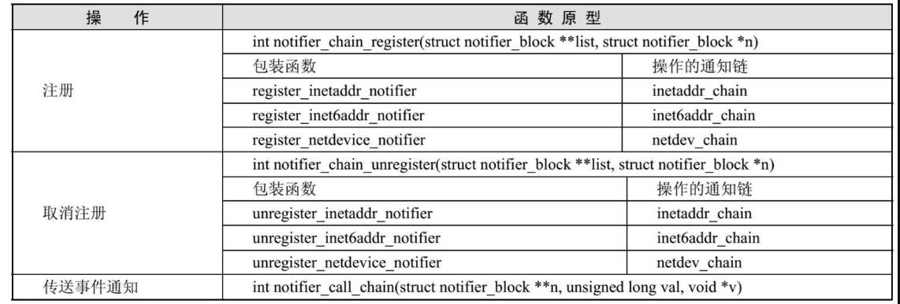

# 简介
Linux模块之间相互依赖，当一个模块发生事件，需要通知其他模块，但问题是，他不知道
谁依赖于他，这就需要事件通知链。

事件通知链是一个函数链表，
被通知方提供事件处理函数，
通知方在事件发生时遍历函数链表，执行函数.

通知链节点定义如下：
```c
struct notifier_block {
	notifier_fn_t notifier_call; // 回调函数
	struct notifier_block __rcu *next; // 所有通知链构成一个链表
	int priority; // 优先级
};
```
由于优先级的存在，通知链会按照一定顺序执行。

对于网络子系统，特别重要的通知链有3个：
* inetaddr_chain : IPv4地址改变时通知
* inet6addr_chain : IPv6地址改变时通知
* netdev_chain : 设备注册，状态变化时通知

网络子系统通知链包装函数


# 设备通知链
## 设备通知链节点的挂入

inet_init -> ... -> devinet_init -> register_netdevice_notifier
```c
static struct notifier_block ip_netdev_notifier = {
	.notifier_call = inetdev_event,
};

devinet_init(void)
	register_netdevice_notifier(&ip_netdev_notifier);
		// 将 节点 ip_netdev_notifier 加入 通知链 netdev_chain
		raw_notifier_chain_register(&netdev_chain, nb);
			notifier_chain_register(&nh->head, n);

		// 调用所有通知链节点 notifier_call 函数，告诉设备期望的事件发生了
		// 前面刚加入了 通知链节点 ip_netdev_notifier ,
		// 所以下面会调用 ip_netdev_notifier 的 notifier_call 函数，
		// 并且调用了两次，分别传入事件 NETDEV_REGISTER 和 NETDEV_UP
		// ip_netdev_notifier 的 notifier_call 函数为 inetdev_event
		for_each_net(net)
			call_netdevice_register_net_notifiers(nb, net);
				// 遍历网络空间下所有设备
				for_each_netdev(net, dev) {
					// 通知事件 NETDEV_REGISTER
					call_netdevice_register_notifiers(nb, dev);
						err = call_netdevice_notifier(nb, NETDEV_REGISTER, dev);
							struct netdev_notifier_info info = {
								.dev = dev,
							};

							return nb->notifier_call(nb, val, &info);

					// 通知事件 NETDEV_UP
					call_netdevice_notifier(nb, NETDEV_UP, dev);

```

### notifier_chain_register 看 二重指针的链表插入
```c
// 将节点 n 加入链表 nl
// 典型的二重指针插入链表
// 下面画图解释
notifier_chain_register(struct notifier_block **nl,
		struct notifier_block *n)
	while ((*nl) != NULL) {
		if (unlikely((*nl) == n))
			return 0;
		if (n->priority > (*nl)->priority)
			break;
		nl = &((*nl)->next);
	}
	*nl = n;
```

两个关键点：
* 无头节点
* 要插入，只需要
```c
// 1. 获得后面节点的地址 
tmp = (*pnext)->next
// 2. 修改被插入节点的next
(*pnext) = tmp
```

二重指针链表图示：
```text
#==============#
H  double ptr  H
#==============#
'    pnext     '
+ - - - - - - -+
  |
  |
  v
#==============#
H   pheader    H
#==============#
' next == NULL '
+ - - - - - - -+

#============#
H  pheader   H
#============#
'            '     #=============#
'    next    ' --> H    node1    H
+ - - - - - -+     #=============#
  ^                '      '      '     #=====================#
  |                ' data ' next ' --> H        node2        H
  |                + - - -+- - - +     #=====================#
#============#                         '      '              '
H double ptr H                         ' data ' next == NULL '
#============#                         + - - -+- - - - - - - +
'   pnext    '
+ - - - - - -+

#=========#
H pheader H
#=========#
'         '     #====================#
'  next   ' --> H       node1        H
+ - - - - +     #====================#
                '      '             '     #=====================#
                ' data '     next    ' --> H        node2        H
                + - - -+- - - - - - -+     #=====================#
                          ^                '      '              '
                          |                ' data ' next == NULL '
                          |                + - - -+- - - - - - - +
                        #============#
                        H double ptr H
                        #============#
                        '   pnext    '
                        + - - - - - -+

#=========#
H pheader H
#=========#
'         '     #=============#
'  next   ' --> H    node1    H
+ - - - - +     #=============#
                '      '      '     #=====================#
                ' data ' next ' --> H        node2        H
                + - - -+- - - +     #=====================#
                                    ' data ' next == NULL '
                                    + - - -+- - - - - - - +
                                              ^
                                              |
                                              |
                                            #=============#
                                            H double ptr  H
                                            #=============#
                                            '    pnext    '
                                            + - - - - - - +
```

## 设备通知链节点的执行 inetdev_event
由 notifier_chain_register 调用两次，分别传入事件 NETDEV_REGISTER 和 NETDEV_UP 
```c
// return nb->notifier_call(nb, val, &info);
// this : ip_netdev_notifier
// event : NETDEV_REGISTER 或 NETDEV_UP
// ptr : \  
// 	struct netdev_notifier_info info = {
// 		.dev = dev,
// 	};
// 

inetdev_event(struct notifier_block *this, unsigned long event, void *ptr)

	// 获得设备
	struct net_device *dev = netdev_notifier_info_to_dev(ptr);
								return info->dev;

	struct in_device *in_dev = __in_dev_get_rtnl(dev);

	...

	switch (event) {
	// 注册设备
	case NETDEV_REGISTER:
		RCU_INIT_POINTER(dev->ip_ptr, NULL);
		break;
	//  启动设备
	case NETDEV_UP:

		if (!inetdev_valid_mtu(dev->mtu))
			break;

		// 检查设备是否为本地环回设备
		if (dev->flags & IFF_LOOPBACK) {
			struct in_ifaddr *ifa = inet_alloc_ifa();

			if (ifa) {
				INIT_HLIST_NODE(&ifa->hash);

				// ifa_local 是本机地址
				// ifa_address 是外部地址
				// 都初始化为 127.0.0.1
				ifa->ifa_local =
				  ifa->ifa_address = htonl(INADDR_LOOPBACK);

				// 这些值都可以通过ifconfig 命令修改
				ifa->ifa_prefixlen = 8;
				ifa->ifa_mask = inet_make_mask(8);
				in_dev_hold(in_dev);
				ifa->ifa_dev = in_dev;
				ifa->ifa_scope = RT_SCOPE_HOST;
				memcpy(ifa->ifa_label, dev->name, IFNAMSIZ);
				set_ifa_lifetime(ifa, INFINITY_LIFE_TIME,
						 INFINITY_LIFE_TIME);
				ipv4_devconf_setall(in_dev);
				neigh_parms_data_state_setall(in_dev->arp_parms);
				// 根据ifa掩码和地址范围状态等内容确定插入位置，
				// 将ifa插入ifa_list队列，
				// 使用 rtmsg_ifa , blocking_notifier_call_chain 
				// 向内核发送通知，调用通知链更新路由表，
				// netlink监听进程也会收到通知，并新增ifa结构变量
				inet_insert_ifa(ifa);
					...
					inet_hash_insert(dev_net(in_dev->dev), ifa);
					rtmsg_ifa(RTM_NEWADDR, ifa, nlh, portid);
					blocking_notifier_call_chain(&inetaddr_chain, NETDEV_UP, ifa);
			}
		}
		ip_mc_up(in_dev);
		fallthrough; // 继续执行下一个case

	// 改变设备的地址
	case NETDEV_CHANGEADDR:
		if (!IN_DEV_ARP_NOTIFY(in_dev))
			break;
		fallthrough;

	case NETDEV_NOTIFY_PEERS:
		/* Send gratuitous ARP to notify of link change */
		inetdev_send_gratuitous_arp(dev, in_dev);
		break;

	// 关闭设备
	case NETDEV_DOWN:
		ip_mc_down(in_dev);
		break;
	...
	}
```

# 地址通知链
## 地址通知链节点的挂入
以 ip_fib_init 看 地址通知链节点的挂入
```c
static struct notifier_block fib_inetaddr_notifier = {
	.notifier_call = fib_inetaddr_event,
};

ip_fib_init(void)
	...
	// 将fib_inetaddr_notifier 插入 inetaddr_chain
	// 并调用 fib_inetaddr_notifier 的 notifier_call 函数
	register_inetaddr_notifier(&fib_inetaddr_notifier);
		blocking_notifier_chain_register(&inetaddr_chain, nb);
			notifier_chain_register(&nh->head, n);
```

## 地址通知链节点的执行 fib_inetaddr_event
内核有一个专门调用通知链的函数 notifier_call_chain , 
下面结合实例分析，以 DM9000网卡驱动为例，
当启动DM9000网卡时驱动程序会调用 dm9000_probe，
dm9000_probe会调用 register_netdev 向内核注册自己的 net_device 设备结构，
期间使用了设备通知链 netdev_chain，回调 fib_netdev_event 完成 DM9000 的设备注册
```c
dm9000_probe(struct platform_device *pdev)
	...
	register_netdev(ndev);
		register_netdevice(dev);
			call_netdevice_notifiers(NETDEV_POST_INIT, dev);
			call_netdevice_notifiers(NETDEV_REGISTER, dev);
				call_netdevice_notifiers_extack(val, dev, NULL);
					struct netdev_notifier_info info = {
						.dev = dev,
						.extack = extack,
					};

					call_netdevice_notifiers_info(val, &info);
						raw_notifier_call_chain(&net->netdev_chain, val, info);
							// 调用 net->netdev_chain head 所有通知链节点的 notifier_call
							// 最终调用 fib_netdev_event 完成对 DM9000 设备的注册
							notifier_call_chain(&nh->head, val, v, -1, NULL);
								nb = rcu_dereference_raw(*nl);
								while (nb) {
									next_nb = rcu_dereference_raw(nb->next);
									nb->notifier_call(nb, val, v);
									nb = next_nb;
								}
```

ioctl 设置地址，看地址通知链的使用。
ioctl -> ... -> inet_ioctl,
如果用于设置地址，最终调用 
```c
devinet_ioctl 
	inet_set_ifa 
		inet_insert_ifa 
			__inet_insert_ifa 
				struct in_validator_info ivi;
				blocking_notifier_call_chain(&inetaddr_validator_chain,
											   NETDEV_UP, &ivi);
				blocking_notifier_call_chain(&inetaddr_chain, NETDEV_UP, ifa);
					notifier_call_chain(&nh->head, val, v, -1, NULL);
```

```c
fib_inetaddr_event(struct notifier_block *this, unsigned long event, void *ptr)
	struct in_ifaddr *ifa = (struct in_ifaddr *)ptr;
	struct net_device *dev = ifa->ifa_dev->dev;
	struct net *net = dev_net(dev);
```


