# 1. 设计
## 什么是 socket buffer
socket buffer 是网络数据包的数据结构。

对socket buffer 的读写操作贯穿TCP/IP各层，为了避免TCP/IP各层都对socket buffer直接修改，而导致程序混乱，

和socket buffer一旦改变TCP/IP各层都需要修改，

所以skbuff 实现了操作接口。对skbuff的读写必须通过他的接口。

## socket buffer的结构

Linux内核网络子系统设计的目的是使网络子系统的实现独立于特定网络协议，

各种网络协议不需要做大改动就能直接加入到TCP/IP协议栈的任何层次中。

skbuff 定义在 skbuff.h 中

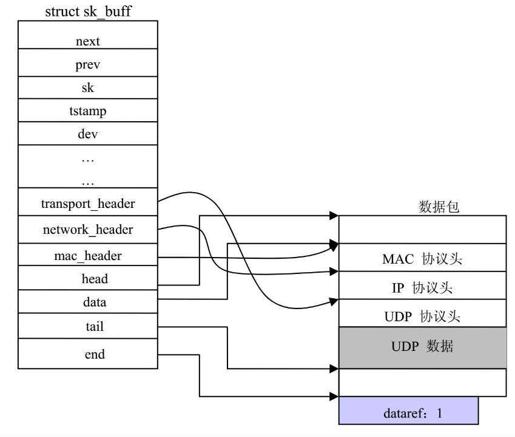

如上所示，一个完整的socket buffer 由两部分组成：

* 数据缓冲区：存放实际要在网络中传送的数据缓存区

* 管理数据结构（struct sk_buff）：当内核处理数据包时，内核需要其他数据来管理和操作数据包，如数据接受、发送事件，状态等。

## socketbuffer 穿越TCP/IP协议栈
下图显示 socket buffer 穿越TCP/IP协议栈的过程

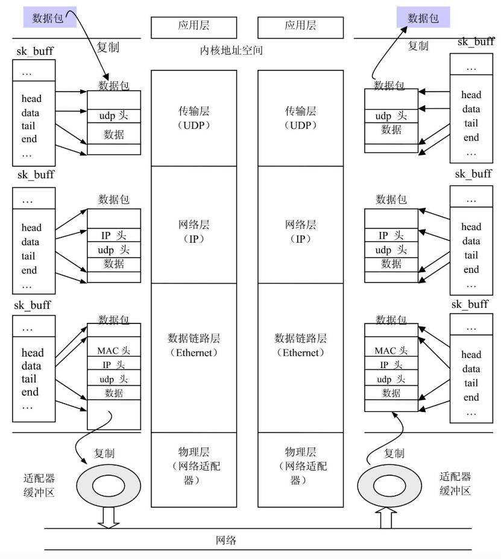

可见使用 socket buffer 传输数据只需要复制两次，

一次是从应用程序的用户空间复制到内核空间，

一次是从内核空间复制到网络适配器的硬件缓存。

### 发送数据包
当应用数据从用户空间拷贝到内核空间，内核套接字层创建 socket buffer，将数据放到数据缓冲区，将数据缓冲区的地址，数据长度等信息

记录到 sk_buff,随着 socket buffer 从上到下穿越TCP/IP协议栈时，各层期间会发生如下事件：

* 各层协议头数据会依次插入到数据缓冲区

* 随着数据缓冲区的更新，sk_buff 中描述协议头数据的地址指针会被赋值。

所以 socket buffer 在创建时，应该一次分配足够空间，用于存放后期增加的协议头数据。

### 接受数据包
当网络适配器接收到发送给本机的数据包后，产生中断通知内核收到了网络数据帧 ，

网卡驱动程序的中断处理程序会调用 dev_alloc_skb 向系统申请一个 socket buffer，

从网卡缓存区复制网络数据帧到 socket buffer的数据缓存区，并设置 sk_buff 各个域：地址，时间，协议等。

当 socket buffer 从下到上穿越TCP/IP协议栈时，会发生如下事件

* sk_buff 各层协议头指针会被依次复位，sk_buff->data 指针会指向有效数据


# 2. socket buffer 结构详解
sk_buff域从功能上大致可以分为：

* 结构管理

* 常规数据

* 网络功能配置相关

## 结构管理域
```c
struct sk_buff {

	// 按照 sk_buff 不同的状态会被组织到不同的队列
	// 如此当 sk_buff 状态变化时，只需要出队列和入队列操作，
	// 避免复制和释放操作
	struct sk_buff		*next;
	struct sk_buff		*prev;

	...

	// 相关的套接字，
	// 如果 sk_buff 是入栈，则 sk 指向接受报文的套接字
	// 如果 sk_buff 是出战，则 sk 指向发送报文的套接字
	// 如果 sk_buff 是转发，则 sk 为 NULL
	struct sock		*sk;

	....

	// 析构函数，通常为NULL
	void		(*destructor)(struct sk_buff *skb);

	...

	// len : 数据包的总长度，不包括sk_buff,只描述数据缓冲区
	//         主缓冲区的数据长度(skb->head指向的数据) + 
	//         各个分片数据的长度，
	//         当数据包大于MTU时进行分片
	//                       
	// data_len : 本sk_buff对应数据包（分片）的长度
	// mac_len : MAC层头信息的长度
	// hdr_len : 仅用于数据包克隆，表示克隆的数据包的头长度
	unsigned int		len,
				data_len;
	__u16			mac_len,
				hdr_len;
	...

	// 使用本 sk_buff 的进程的引用计数
	refcount_t		users;

	// 整个socket buffer 的大小，包括 sk_buff 和 数据缓冲区的长度
	unsigned int		truesize;

	// head, end : 分别指向数据缓冲区的首尾
	// data, tail : 分配指向 有效负荷（包括协议头和用户数据）的首尾
	sk_buff_data_t		tail;
	sk_buff_data_t		end;
	unsigned char		*head,
				*data;
```

1. next prev

socket buffer 会根据其状态和类型（接受，发送，已处理完成）存放在不同的队列，队列使用双向链表实现，

队列的头部定义如下

```c
struct sk_buff_head {
	struct sk_buff	*next;
	struct sk_buff	*prev;

	__u32		qlen; // 本队列元素数量
	spinlock_t	lock;

};
```

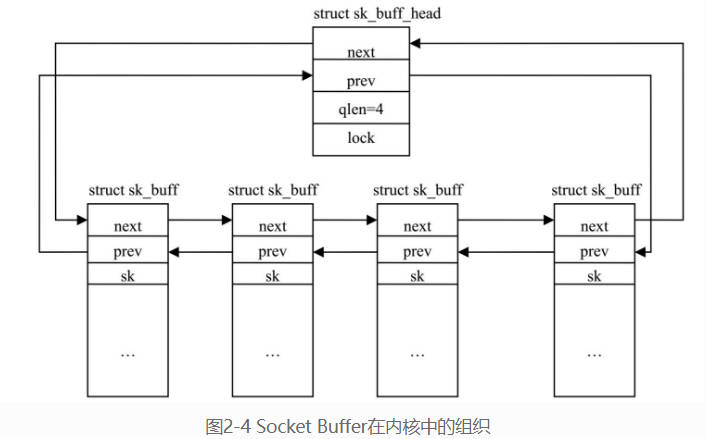

2. struct sock \*sk

指向拥有该socket buffer的套接字(所谓套接字就是地址加端口，用于唯一识别网络应用程序)，

当向外发送，或从网络来的数据的目标地址是本机应用程序时，会设置此项。

当转发数据包时，此项为NULL。

sk_buff->sk 表示最终应该传输给哪个应用程序，或是哪个程序发送的。

3. len

sk_buff->len 指 socket buffer 中有效数据区块的大小

包括：

主缓冲区的数据长度（由sk_buff->head指向）、

各个分片数据的长度（当数据包长度大于网络适配器一次能传输的最大传输单元MTU时，数据包会被分成更小的断）

由于数据区块包括协议头数据，所以skb穿越TCP/IP时会修改 len

4. data_len

单个分片的数据块长度

5. mac_len

链路层协议头的长度

6. hdr_len

hdr_len 用于克隆数据包，表明克隆数据包的头长度。

当克隆数据包时，只做纯数据的克隆（即不克隆数据包的协议头信息），这时需要从 hdr_len获得头长度。

7. users

对所有正在使用该sk_buff的进程数量的引用计数。

另外对 socket buffer 的数据缓存区的引用计数是dataref

使用引用计数是为了避免一个进程还在使用socket buffer时，被另一个进程释放掉。

8. truesize

整个socket buffer的大小，即sk_buff和数据包的长度和, 当skb->len增加时，这个值得到更新

```c
truesize = data_len + sizeof(struct sk_buff)
alloc_skb(truesize);
```

9. tail end head data

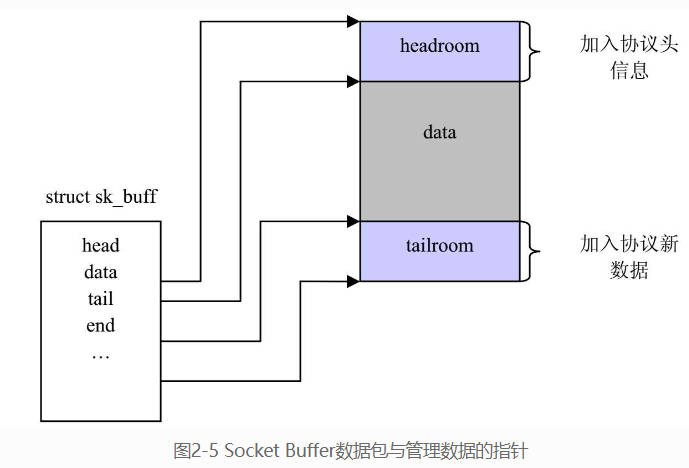

socket buffer数据包缓冲区包括：TCP/IP协议头和尾部检验信息，负载数据。

head end 指向整个数据包缓冲区的首尾。

data tail 负载数据

head data 之间用于添加协议头

tail end 协议包尾部

10. destructor

指向Socket buffer的析构函数，当sk_buff不属于任何套接字时，析构函数通常不需要初始化。

当socket buffer属于某个sock时，通常被初始化为 sock_wfree 或 sock_rfree，这两个函数用于更新sock队列中所持有的内存

## 常规数据域
```c
struct sk_buff {
	...
	// 入栈时间
	ktime_t		tstamp;
	..
	// 相关网络适配器, 接受或发送此数据包的设备
	struct net_device	*dev;
	// 网络适配器的索引号
	// linux中描述网络设备使用 设备名 + 索引号，
	// 如 eth0 eth1
	int			skb_iif;
	...

	// 由路由子系统使用，当接受的数据包需要进行转发时，
	// 则通过这个数据域说明如何进行转发。
	// dst : 一条路由项，存放数据包转发的目的IP和网关
	// rtable : 指明应该在哪个路由表中查找数据包的路由项
	union {
		struct  dst_entry	*dst;
		struct  rtable		*rtable;
	};


	// 控制缓存，存放私有变量或数据的地方
	char			cb[48] __aligned(8);
	...
	// 校验和
	__u8			ip_summed:2;
	union {
		__wsum		csum;
		struct {
			__u16	csum_start;
			__u16	csum_offset;
		};
	};


	...
	__u32			priority;
	...
	__be16			protocol;
	...
	__u16			queue_mapping;
	...
	unsigned long	_skb_refdst;
	...
	__u32		mark;
	...
	__u16			vlan_tci;
	...
	__u16			transport_header;
	__u16			network_header;
	__u16			mac_header;
```
1. tstamp

数据包到达内核的时间，

网卡驱动将数据包从网卡缓存拷贝到内核时进行赋值。

2. dev skb_iif

dev 指向net_device，net_device就是网络适配器在内核中的实例，此处说明此 sk_buff 由哪个网口输入或输出

skb_iif 网络适配器的索引号，Linux中某种类型的网络设备的命名方式是设备名加顺序索引号，如 Ethernet 设备： eth0 eth1

3. dst rtable

当数据包入栈，出栈，转发，都需要查询路由表，将查询的结果保存到 sk_buff 中，

方便后续操作直接使用，避免再次查询。

4. cb

控制缓冲区（control buffer），是各个协议处理数据包时，存放私有变量或数据的地方。

如udp的cb 为 udp_skb_cb

```c
struct udp_skb_cb {
	union {
		struct inet_skb_parm	h4;
#if IS_ENABLED(CONFIG_IPV6)
		struct inet6_skb_parm	h6;
#endif
	} header;
	__u16		cscov;
	__u8		partial_cov;
};
#define UDP_SKB_CB(__skb)	((struct udp_skb_cb *)((__skb)->cb))
```

使用cb

```c
udp6_csum_init(struct sk_buff *skb, struct udphdr *uh, int proto)
	UDP_SKB_CB(skb)->partial_cov = 0;
	UDP_SKB_CB(skb)->cscov = skb->len;
```

5. csum

存放校验和，

当发送数据包时，网络子系统计算校验和，存放到 csum.

当接受数据包时，由硬件网络计算校验和，存放到 csum.

csum_start : skb->head 为起始地址的偏移量，指出校验数据从哪里开始计算。
csum_offset : 以 csum_start 为起始的偏移量，指出校验和存放的位置： csum_start + csum_offset

ip_summed 描述是否可以用硬件实现对IP数据校验的编码和解码。

6. priority

用于实现QoS功能特性，QoS描述了数据包的发送优先级。

如果发送本地产生的数据包，priority 的值由 socket层填写。

如果是转发的数据包， priority的值由路由子系统根据包中IP协议头的 ToS域来填写。

7. protocol

接受数据包的网络层协议。标志了网络数据包应该交给TCP/IP协议栈网络层的哪个协议处理函数

由网卡驱动程序填写。

相关 protocol定义在

include/linux/if_ether.h

8. queue_mapping

具备多个缓冲队列的网络设备的队列映射关系。

早期网络设备只有一个数据发送缓冲区，现在很多网络设备有多个发送缓冲区来存放待发送的网络数据包。

queue_mapping 描述了本网络数据所在的队列和设备硬件发送队列的映射关系

9. mark
数据包为常规数据包的标志

10. vlan_tci
VLAN Tag 控制信息

11. transport_header network_header mac_header

指向协议栈中各层协议头在网络数据包的位置

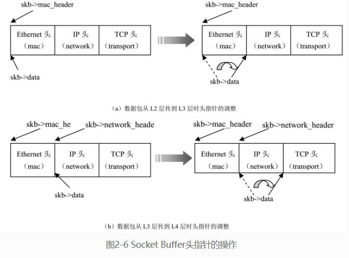

12. pkt_type
根据L2的目的地址对帧进行类型划分，主要值如下：

```c
#define PACKET_HOST		0		/* To us		*/
#define PACKET_BROADCAST	1		/* To all		*/
#define PACKET_MULTICAST	2		/* To group		*/
#define PACKET_OTHERHOST	3		/* To someone else 转发或丢弃 	*/
#define PACKET_OUTGOING		4		/* Outgoing of any type */
#define PACKET_LOOPBACK		5		/* 包发到回环设备，当处理回环设备时，内核可以跳过一些真实设备需要的操作 */
#define PACKET_USER		6		/* To user space	*/
#define PACKET_KERNEL		7		/* To kernel space	*/
/* Unused, PACKET_FASTROUTE and PACKET_LOOPBACK are invisible to user space */
#define PACKET_FASTROUTE	6		/* Fastrouted frame	*/
```

## 网络功能配置域
Linux网络子系统实现了大量功能，这些功能是模块化的。

1. 连接追踪 

连接追踪可以记录什么数据包经过了你的主机，以及他们是如何进入网络连接的。

sk_buff 相关域

\_nfct : 用于连接跟踪计数

nfct_reasm : 用于数据包的重组

2. 桥防火墙 CONFIG_BRIDGE_NETFILTER

3. 流量控制 CONFIG_NET_SCHED

当内核有多个数据包向外发送时，内核必须决定谁先送，谁后送，谁丢弃，

内核实现了多种算法来选择数据包，如果没有选择此功能，内核发送数据包时就使用FIFO策略。
```c
#ifdef CONFIG_NET_SCHED
	__u16			tc_index;	/* traffic control index */
#endif
```
# 3. 操作sk_buff的函数
为sk_buff实现控制函数，让对sk_buff操作的代码和协议栈解耦合，

之后要添加新的操作sk_buff功能，只需要添加对应函数，不会影响原有代码。

按照功能，这些函数可以分为：

* 创建，释放，复制 socket buffer

* 操作 sk_buff的属性

* 管理 socket buffer 队列

函数集中实现在

skbuff.c 和 skbuff.h 中

## 创建和释放 socket buffer

由于 socket buffer 会频繁的创建释放，

内核在系统初始化时已创建了两个 sk_buff 内存池。

```c
struct kmem_cache *skbuff_head_cache __ro_after_init;
static struct kmem_cache *skbuff_fclone_cache __ro_after_init;
```

这两个内存池由 skb_init 创建。

每当需要分配 sk_buff 时，根据所需的sk_buff 是克隆还是非克隆的，分别从对应cache中获得内存对象，

释放 sk_buff时，就将对象放回以上cache.

### 创建 socket buffer
```c
/*
 * size : 存放数据包需要的内存空间大小
 * gfp_mask : 
 *           GFP_ATOMIC : 在中断处理程序中申请内存，gfp_mask 必须为该值，因为中断不能休眠
 *           GFP_KERNEL : 常规内核函数申请内存分配
 *           其他值
 * fclone : 是否对该 sk_buff 克隆，决定了从哪个sk_buff内存对象池中获取sk_buff所需的空间
 *          0 : skbuff_head_cache
 *          1 : skbuff_fclone_cache
 */
struct sk_buff *__alloc_skb(unsigned int size, gfp_t gfp_mask, int flags, int node)

/*
 * 在调用 __alloc_skb 时，应该调用他的包装函数
 * alloc_skb , alloc_skb_fclone
 */
struct sk_buff *alloc_skb(unsigned int size, gfp_t priority);
	return __alloc_skb(size, priority, 0, NUMA_NO_NODE);
			    
struct sk_buff *alloc_skb_fclone(unsigned int size, gfp_t priority)
	return __alloc_skb(size, priority, SKB_ALLOC_FCLONE/*0x01*/, NUMA_NO_NODE /*-1*/);
```


```c
/*
 * __dev_alloc_skb 是 alloc_skb 的包裹函数，
 * 给网络设备驱动程序使用，当网络设备从网络上收到一个数据包时，
 * 它调用此函数向系统申请缓冲区来存放数据包。
 *
 */
struct sk_buff *__dev_alloc_skb(unsigned int length, gfp_t gfp_mask)
	return __netdev_alloc_skb(NULL, length, gfp_mask);

struct sk_buff *dev_alloc_skb(unsigned int length)
	return netdev_alloc_skb(NULL, length);
```
为了提高效率为数据链路层在数据包缓冲区前预留16字节的headroom .

避免头信息增长时原空间不够导致重新分配空间。

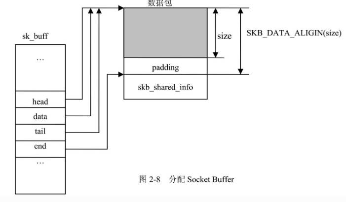

```c
/*
 * 专用于设备分配skb，特点是 使用 GFP_ATOMIC ，不可被中断打断，
 * 设置了 dev
 */

struct sk_buff *netdev_alloc_skb(struct net_device *dev,
					       unsigned int length)
	return __netdev_alloc_skb(dev, length, GFP_ATOMIC);

struct sk_buff *__netdev_alloc_skb(struct net_device *dev, unsigned int len,
				   gfp_t gfp_mask);
```

#### alloc_skb
```c
//	skb = alloc_skb(sizeof(*msg),GFP_KERNEL);
//	skb = alloc_skb(sizeof(*msg),GFP_ATOMIC);
// size : 
// priority : GFP_KERNEL 可被中断， GFP_ATOMIC 不可中断
static inline struct sk_buff *alloc_skb(unsigned int size,
					gfp_t priority)
	return __alloc_skb(size, priority, 0, -1);

// alloc_skb_fclone 的 fclone 为 1
static inline struct sk_buff *alloc_skb_fclone(unsigned int size,
					       gfp_t priority)
	return __alloc_skb(size, priority, 1, -1);

struct sk_buff *__alloc_skb(unsigned int size, gfp_t gfp_mask,
			    int fclone, int node)
	// 根据 fclone 选择 slab缓存池
	cache = fclone ? skbuff_fclone_cache : skbuff_head_cache;

	// 分配skb shell
	skb = kmem_cache_alloc_node(cache, gfp_mask & ~__GFP_DMA, node);

	// 分配数据区
	size = SKB_DATA_ALIGN(size);
	data = kmalloc_node_track_caller(size + sizeof(struct skb_shared_info),
			gfp_mask, node);

	memset(skb, 0, offsetof(struct sk_buff, tail));
	skb->truesize = size + sizeof(struct sk_buff);
	atomic_set(&skb->users, 1);
	skb->head = data;
	skb->data = data;
	skb_reset_tail_pointer(skb);
	skb->end = skb->tail + size;
	/* make sure we initialize shinfo sequentially */
	shinfo = skb_shinfo(skb);
	atomic_set(&shinfo->dataref, 1);
	shinfo->nr_frags  = 0;
	shinfo->gso_size = 0;
	shinfo->gso_segs = 0;
	shinfo->gso_type = 0;
	shinfo->ip6_frag_id = 0;
	shinfo->frag_list = NULL;

	if (fclone) {
		struct sk_buff *child = skb + 1;
		atomic_t *fclone_ref = (atomic_t *) (child + 1);

		skb->fclone = SKB_FCLONE_ORIG;
		atomic_set(fclone_ref, 1);

		child->fclone = SKB_FCLONE_UNAVAILABLE;
	}

	return skb;
```

### 释放 socket buffer
skb从 slab分配，所以是释放到slab缓存中。

skb的释放要考虑 skb->users，当skb->users为0时才真正释放，否则只是将skb->users减一。

skb中有指向其他模块的指针，如路由表，conntrack等，所以他持有对其他数据结构的引用计数，当skb释放时，也需要将与其连接的数据结构的引用计数减一

如果skb的destructor初始化了，释放时还需要调用此函数

skb->skb_shared_info 描述数据包分片，skb_shared_info内部指针指向数据包分片所在内存，释放skb，也要释放分片占用的内存

```c
kfree_skb

kfree_release_all

kfree_release_data

kfree_skbmem

dst_release
```
#### kfree_skb
```c
void kfree_skb(struct sk_buff *skb)
	// 如果users 为 1 ，打开内存屏障，进行skb的释放
	if (likely(atomic_read(&skb->users) == 1))
		smp_rmb();
	// 如果 skb->users 大于1，则将其减一，
	// 如果减一后依旧不为0，则返回
	// 如果为0，则进行释放
	// atomic_dec_and_test函数的意思是,将原子变量减1,并判断是否为0,如果为0则返回真
	else if (likely(!atomic_dec_and_test(&skb->users)))
		return;
	// 真实的释放skb
	__kfree_skb(skb);
		// 释放除了skb壳的所有东西
		skb_release_all(skb);
			// 释放skb引用的其他数据结构
			skb_release_head_state(skb);
				dst_release(skb->dst);
				if (skb->destructor)
					skb->destructor(skb);
				nf_conntrack_put(skb->nfct);
				nf_conntrack_put_reasm(skb->nfct_reasm);
				...
			// 释放分片占用的内存
			skb_release_data(skb);
				if (skb_shinfo(skb)->nr_frags)
					for (i = 0; i < skb_shinfo(skb)->nr_frags; i++)
						put_page(skb_shinfo(skb)->frags[i].page);
				if (skb_shinfo(skb)->frag_list)
					skb_drop_fraglist(skb);
				kfree(skb->head);

		// 释放skb 壳
		kfree_skbmem(skb);
			switch (skb->fclone) {
				// 如果不是clone，释放到 skbuff_head_cache
				case SKB_FCLONE_UNAVAILABLE:
					kmem_cache_free(skbuff_head_cache, skb);
					break;

				// 这部分结合 alloc_skb 可看懂
				// 简单说，clone情况有两个skb,
				// 第一个 skb为 SKB_FCLONE_ORIG
				// 第二个 skb为 SKB_FCLONE_CLONE
				// 释放时如果 fclone_ref 为1，则释放 第一个skb
				// 第二个skb 被设置为 SKB_FCLONE_UNAVAILABLE
				case SKB_FCLONE_ORIG:
					fclone_ref = (atomic_t *) (skb + 2);
					if (atomic_dec_and_test(fclone_ref))
						kmem_cache_free(skbuff_fclone_cache, skb);
					break;

				case SKB_FCLONE_CLONE:
					fclone_ref = (atomic_t *) (skb + 1);
					other = skb - 1;

					/* The clone portion is available for
					 * fast-cloning again.
					 */
					skb->fclone = SKB_FCLONE_UNAVAILABLE;

					if (atomic_dec_and_test(fclone_ref))
						kmem_cache_free(skbuff_fclone_cache, other);
					break;

```

## 数据空间对齐

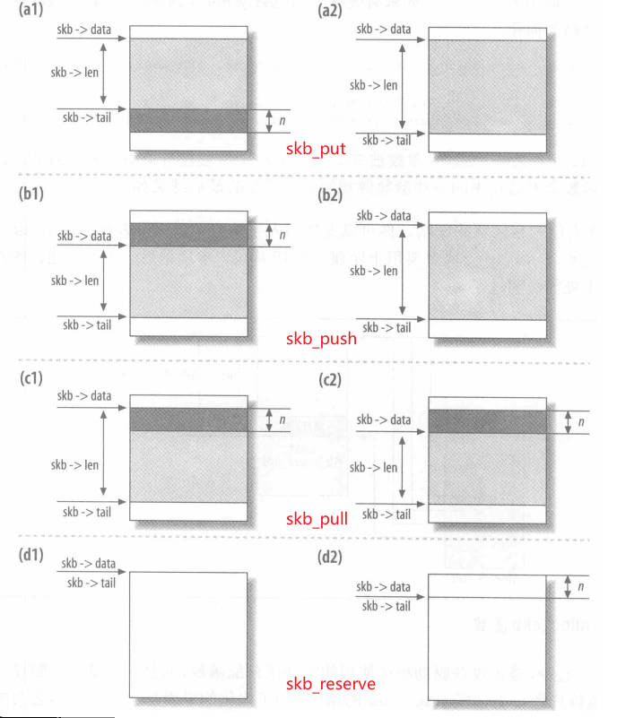

```c
// 增加预留空间headroom
// headroom 就是 skb->head 到 skb->data 之间的空间
// 用于存放待添加的协议头部
static inline void skb_reserve(struct sk_buff *skb, int len)
{
	skb->data += len;
	skb->tail += len;
}
```

```c
// 网卡驱动接受数据包
net_rx(struct net_device *dev)
	skb = dev_alloc_skb(length + 2);
		__dev_alloc_skb(length, GFP_ATOMIC);
			struct sk_buff *skb = alloc_skb(length + NET_SKB_PAD, gfp_mask);
				__alloc_skb(size, priority, 0, -1);
					// 分配 skb
					skb = kmem_cache_alloc_node(cache, gfp_mask & ~__GFP_DMA, node);
					// 分配 数据缓冲区
					size = SKB_DATA_ALIGN(size);
					data = kmalloc_node_track_caller(size + sizeof(struct skb_shared_info),

					memset(skb, 0, offsetof(struct sk_buff, tail));
					skb->truesize = size + sizeof(struct sk_buff);
					atomic_set(&skb->users, 1);

					// skb->head = data
					// skb->data = data
					// skb->tail = data
					// skb->end = data + size;
					skb->head = data;
					skb->data = data;
					skb_reset_tail_pointer(skb);
						skb->tail = skb->data;
					skb->end = skb->tail + size;
					/* make sure we initialize shinfo sequentially */
					shinfo = skb_shinfo(skb);
					atomic_set(&shinfo->dataref, 1);
					
			// skb->head = data
			// skb->data = data + NET_SKB_PAD
			// skb->tail = data + NET_SKB_PAD
			// skb->end = data + size;
			skb_reserve(skb, NET_SKB_PAD);

	// 增加 headroom 2字节，因为 网卡知道接受的数据是以太帧，
	// 所以接下来头部为 14字节，预先后移2字节，保证对齐。
	// skb->head = data
	// skb->data = data + NET_SKB_PAD + 2
	// skb->tail = data + NET_SKB_PAD + 2
	// skb->end = data + size;
	skb_reserve(skb, 2);	/* longword align L3 header */

```

```c
// 从数据缓冲区分配 len 字节空间返回
unsigned char *skb_put(struct sk_buff *skb, unsigned int len)
	unsigned char *tmp = skb_tail_pointer(skb);
		return skb->tail;
	skb->tail += len;
	skb->len  += len;
	return tmp;
```

```c
// 减少headroom ，增加payload 空间
unsigned char *skb_push(struct sk_buff *skb, unsigned int len)
	skb->data -= len;
	skb->len  += len;
	return skb->data;
```

```c
// 增加headroom
unsigned char *skb_pull(struct sk_buff *skb, unsigned int len)
	return unlikely(len > skb->len) ? NULL : __skb_pull(skb, len);
		skb->len -= len;
		return skb->data += len;
```

```c
// 当 payload （skb->data 到 skb->tail）的长度大于len
// skb->tail向上移动，当payload减少到len字节大小
void skb_trim(struct sk_buff *skb, unsigned int len)
	if (skb->len > len)
		__skb_trim(skb, len);
			skb->len = len;
			skb->tail = skb->data + len;
```

## 复制和克隆
当多进程操作 socket buffer时，涉及对 sk_buff 或 数据缓冲区 的修改，

这时需要对 socket buffer 进行复制或克隆

### 克隆
当修改只涉及 sk_buff 时，为了提高效率，只复制sk_buff,
并将dataref计数加一。
保证每个进程有独立的sk_buff，sk_buff 指向相同的数据缓冲区。

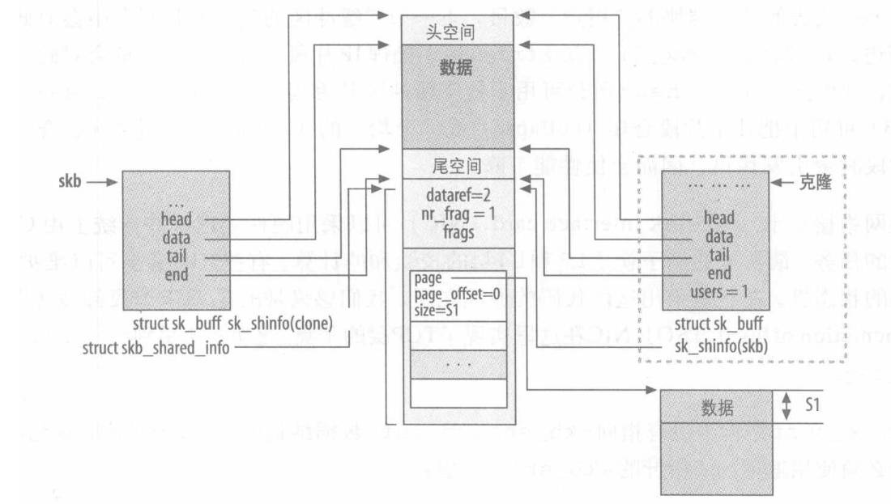

```txt
+----------+     +----------+     +------------+
| process1 | --> | sk_buff1 | --> | data cache |
+----------+     +----------+     +------------+
                                    ^
                                    |
                                    |
+----------+     +----------+       |
| process2 | --> | sk_buff2 | ------+
+----------+     +----------+
```

```c
struct sk_buff *skb_clone(struct sk_buff *skb, gfp_t gfp_mask)
```
skb_clone 产生一个skb的克隆，克隆的skb有如下特点：
* 不放入任何skb管理队列
* 不属于任何套接字 
* 两个skb->cloned都设置为1，克隆出来的skb->users为1.
* 当一个skb被克隆后，他的数据包就不应该被修改了，这时访问数据包不需要加锁。

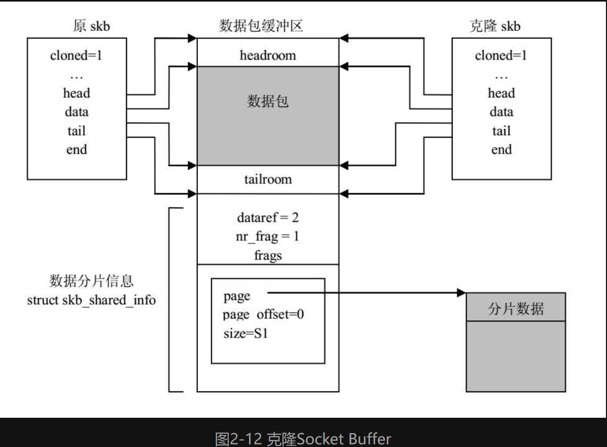

```c
	// skb = skb_clone(skb, GFP_ATOMIC);
struct sk_buff *skb_clone(struct sk_buff *skb, gfp_t gfp_mask)

```

### 复制
当即要修改skb，又要修改数据包，就需要对socket buffer进行复制。
这时有两个选择：
* 如果既要修改主数据包，又要修改分片，就使用  skb_copy
* 如果只修改主数据包，就使用 pskb_copy
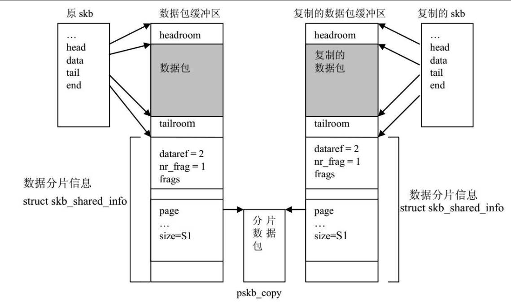
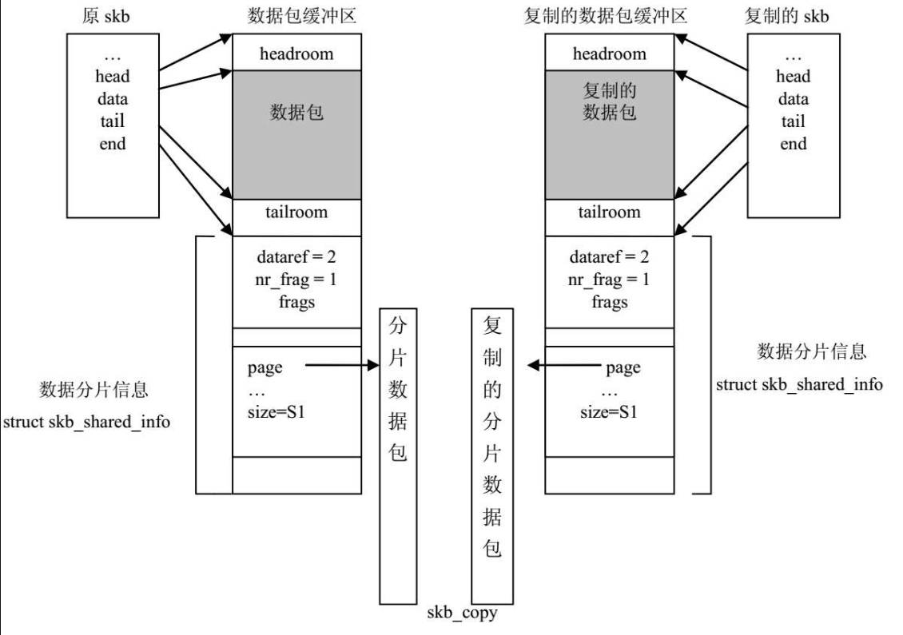

## 队列操作函数
socket buffer被组织在不同队列，内核提供了一系列函数在管理，
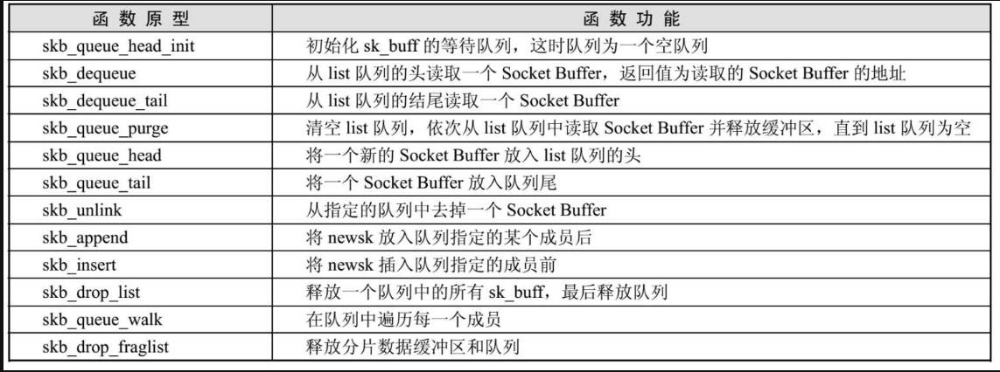
需要注意，这些函数的执行必须是原子操作，
在操作队列前，必须首先获得sk_buff_head结构中的spinlock，
否则操作可能被异步事件(如中断)打断。

## 引用计数操作
```c
// 增加 skb 引用计数
static inline struct sk_buff *skb_get(struct sk_buff *skb)
	atomic_inc(&skb->users);

// 分片数据引用计数加一
static void skb_clone_fraglist(struct sk_buff *skb)
	struct sk_buff *list;
	for (list = skb_shinfo(skb)->frag_list; list; list = list->next)
		skb_get(list);
```

## 协议头指针操作

Linux使用指针或偏移指向协议头的起始地址，提供系列操作


# 4. 数据分片和分段

socket buffer的数据包缓冲区尾部为skb_shared_info，在分配数据包缓冲区空间时，也会分配 skb_shared_info 的空间，并初始化该结构，
```c
#define skb_shinfo(SKB)	((struct skb_shared_info *)(skb_end_pointer(SKB)))

static inline unsigned char *skb_end_pointer(const struct sk_buff *skb)
{
	return skb->end;
}

struct sk_buff *__alloc_skb(unsigned int size, gfp_t gfp_mask,
	...
	shinfo = skb_shinfo(skb);
	atomic_set(&shinfo->dataref, 1);
	shinfo->nr_frags  = 0;
	shinfo->gso_size = 0;
	shinfo->gso_segs = 0;
	shinfo->gso_type = 0;
	shinfo->ip6_frag_id = 0;
	shinfo->frag_list = NULL;

```

skb_shared_info 用于支持IP数据分片，和TCP数据分段。

当数据包超过MTU，需要进行IP数据分片，这些更小的数据片有各自的 skb，而这些 skb 链入主 skb 的 skb_shared_info 链表。

```c
struct skb_shared_info {
	// 对主skb数据包缓冲区的引用计数
	atomic_t	dataref;

	// 数据包被分片的计数，描述数据包被分成多少数据片
	unsigned short	nr_frags;

	// 说明网络硬件是否有硬件实现分片的能力
	unsigned short  gso_type;
	// 给出数据包被分段的数量
	unsigned short	gso_size;
	unsigned short	gso_segs;

	__be32          ip6_frag_id;
	struct sk_buff	*frag_list;
	skb_frag_t	frags[MAX_SKB_FRAGS];
};
```
以前数据分片是CPU完成的，现在是网卡完成，

这种技术称为TSO，或 GSO。

skb_shared_info 紧接在 socket buffer 数据包缓冲区之后，通过 skb->end 指针寻址。

使用 skb_shared_info的目的：

* 支持IP分片

* 支持TCP分段

* 跟踪数据包的引用计数

当用于IP分片时， frag_list 指向包含分片socket buffer的链表。

当用于TCP分段时，frags包含相关页面，其中包含了分段数据。

frags数组的每个元素都是一个管理存放TCP数据段的skb_frag_t 的结构。

```c
/* To allow 64K frame to be packed as single skb without frag_list */
#define MAX_SKB_FRAGS (65536/PAGE_SIZE + 2)

typedef struct skb_frag_struct skb_frag_t;

struct skb_frag_struct {
	struct page *page;
	__u32 page_offset;
	__u32 size;
};
```

操作skb_shared_info的函数

skb_is_nonlinear : 查看socket buffer的数据包是否被分片

skb_linearize : 将分片的小数据包组装成一个完整的大数据包

skb_shinfo : 在skb中并没有指向skb_shared_info的指针，需要用 skb_shinfo 返回该指针


# skb 使用分析
## smsc911x_poll
smsc911x 网卡接受skb
```c
/* return minimum truesize of one skb containing X bytes of data */
#define SKB_TRUESIZE(X) ((X) +						\
			 SKB_DATA_ALIGN(sizeof(struct sk_buff)) +	\
			 SKB_DATA_ALIGN(sizeof(struct skb_shared_info)))

static inline void skb_reset_tail_pointer(struct sk_buff *skb)
{
	skb->tail = skb->data;
}

// 调整headroom
static inline void skb_reserve(struct sk_buff *skb, int len)
{
	skb->data += len;
	skb->tail += len;
}

// add data to a buffer
void *skb_put(struct sk_buff *skb, unsigned int len)
{
	void *tmp = skb_tail_pointer(skb);
	SKB_LINEAR_ASSERT(skb);
	skb->tail += len;
	skb->len  += len;
	if (unlikely(skb->tail > skb->end))
		skb_over_panic(skb, len, __builtin_return_address(0));
	return tmp;
}

#define skb_shinfo(SKB)	((struct skb_shared_info *)(skb_end_pointer(SKB)))

static int smsc911x_poll(struct napi_struct *napi, int budget)

		// 根据网卡寄存器获得 接受的数据包大小 pktlength
		unsigned int rxstat = smsc911x_rx_get_rxstatus(pdata);
		pktlength = ((rxstat & 0x3FFF0000) >> 16);

		skb = netdev_alloc_skb(dev, pktwords << 2);

		// 如果数据帧太小或太大则使用kmalloc分配
		// 此处不考虑其他情况
			if (len <= SKB_WITH_OVERHEAD(1024) ||
				len > SKB_WITH_OVERHEAD(PAGE_SIZE) ||
				(gfp_mask & (__GFP_DIRECT_RECLAIM | GFP_DMA)))
				skb = __alloc_skb(len, gfp_mask, SKB_ALLOC_RX, NUMA_NO_NODE);
					skb = kmem_cache_alloc_node(cache, gfp_mask & ~__GFP_DMA, node);
					skb->truesize = SKB_TRUESIZE(size); // 整个skb真正占用的空间大小
														// 包括 sk_buff 和 skb_shared_info 的大小和数据缓存区的大小(size)
					refcount_set(&skb->users, 1); // 当前skb被一个任务引用

					// head data tail end 都是指向数据缓存区的
					// head 和 end 分别指向数据缓冲区首和尾
					// data 和 tail 分别指向当前已确认的数据帧的首尾, 当前为0
					// 其中 head 和 end 是固定的
					// data 和 tail 是移动的
					skb->head = data;
					skb->data = data;
					skb_reset_tail_pointer(skb);
					skb->end = skb->tail + size;

					// mac_header transport_header 为相对于head的偏移量
					// 如 mac header的位置为 skb->head + skb->mac_header
					//    transport header : skb->head + skb->transport_header
					skb->mac_header = (typeof(skb->mac_header))~0U;
					skb->transport_header = (typeof(skb->transport_header))~0U;

					// shinfo 空间为end之后
					// 当IP包分片时，分片skb记录到主 skb_shinfo(skb)
					shinfo = skb_shinfo(skb);
					memset(shinfo, 0, offsetof(struct skb_shared_info, dataref));

					// 主skb对分片的引用计数
					atomic_set(&shinfo->dataref, 1);

					return skb;

		pktlength = ((rxstat & 0x3FFF0000) >> 16);
		pktwords = (pktlength + NET_IP_ALIGN + 3) >> 2;

		// 从网卡读取数据帧
		pdata->ops->rx_readfifo(pdata,
				 (unsigned int *)skb->data, pktwords);

		/* Align IP on 16B boundary */
		// eth header 是 14B,增加2B，对齐为 16B
		// 即前面读取的数据帧前 2B 是多读的
		skb_reserve(skb, NET_IP_ALIGN);

		// skb增加数据, skb->len 表示数据缓存区中待解析的有效数据长度， 
		//                       也就是 skb->data 到 skb->tail
		// 				skb->data_len 表示数据缓存区中有效负荷长度
		// pktlength - 4 应该是不考虑  校验尾
		skb_put(skb, pktlength - 4);
			skb->tail += len;
			skb->len  += len;

		skb->protocol = eth_type_trans(skb, dev);
			// 记录skb 的输入设备
			skb->dev = dev;
			// 记录下mac header的位置
			skb_reset_mac_header(skb);
				// 也就是说 mac header 的位置为 skb->head + skb->mac_header
				skb->mac_header = skb->data - skb->head;

			// 开始解析eth header
			// 获得eth header 并将 skb->len -= ETH_HLEN, skb->data += ETH_HLEN
			// 表示待解析数据减少，并指向其他待解析数据的头
			eth = (struct ethhdr *)skb->data;
			skb_pull_inline(skb, ETH_HLEN);
				return unlikely(len > skb->len) ? NULL : __skb_pull(skb, len);
					skb->len -= len;
					BUG_ON(skb->len < skb->data_len);
					return skb->data += len;

			// 比较帧目的MAC，确定数据包是发给谁的，
			// 对于单播，如果开启了混淆模式，网卡会接受，
			// 但这里会标记为 PACKET_OTHERHOST
			if (unlikely(!ether_addr_equal_64bits(eth->h_dest,
								  dev->dev_addr))) {
				if (unlikely(is_multicast_ether_addr_64bits(eth->h_dest))) {
					if (ether_addr_equal_64bits(eth->h_dest, dev->broadcast))
						skb->pkt_type = PACKET_BROADCAST;
					else
						skb->pkt_type = PACKET_MULTICAST;
				} else {
					skb->pkt_type = PACKET_OTHERHOST;
				}
			}

			// 返回payload协议，通常为 ETH_P_ARP / ETH_P_IP ... 
			if (likely(eth_proto_is_802_3(eth->h_proto)))
				return eth->h_proto;

		// 推送给上层
		netif_receive_skb(skb);

		// 更新计数器
		dev->stats.rx_packets++;
		dev->stats.rx_bytes += (pktlength - 4);
```

推送给上层时，skb的情况如下

* data : 指向eth帧的payload
* len : 长度为eth帧payload的长度
* data_len : 0
* mac_header : 指向 eth header
* data : 指向eth payload 开始
* tail : 指向 eth payload 结尾
* head : 指向 数据缓存区 开始
* end : 指向 数据缓存区 结尾
* protocol : ETH_P_ARP / ETH_P_IP 
* pkt_type : PACKET_OTHERHOST/PACKET_HOST/PACKET_MULTICAST/PACKET_BROADCAST 

## netif_receive_skb
分析L2层 skb的变化

```c
netif_receive_skb(skb);
static int __netif_receive_skb_one_core(struct sk_buff *skb, bool pfmemalloc)
	struct net_device *orig_dev = skb->dev;
	struct packet_type *pt_prev = NULL;

	// 涉及 vlan brigde 这里不考虑
	ret = __netif_receive_skb_core(&skb, pfmemalloc, &pt_prev);
		skb_reset_network_header(skb);
		skb_reset_transport_header(skb);
		skb_reset_mac_len(skb);

		skb->skb_iif = skb->dev->ifindex;

		type = skb->protocol;

		// 查询skb->protocol 对于的 packet_type
		if (likely(!deliver_exact)) {
			deliver_ptype_list_skb(skb, &pt_prev, orig_dev, type,
						   &ptype_base[ntohs(type) &
							   PTYPE_HASH_MASK]);
		}
		*ppt_prev = pt_prev;

	// 假设走 ip_rcv
	if (pt_prev)
		ret = INDIRECT_CALL_INET(pt_prev->func, ipv6_rcv, ip_rcv, skb,
					 skb->dev, pt_prev, orig_dev);
```

可见如果不是802.3q，则skb没有大的变化

## ip_rcv
```c

static inline unsigned int skb_headlen(const struct sk_buff *skb)
{
	// len 正在解析的有效数据长度，data_len为payload长度
	return skb->len - skb->data_len;
}

// 检查是否有足够的 headlen
// 调用这个函数说明要从 headlen中解析 header了，header的长度为 len
static inline bool pskb_may_pull(struct sk_buff *skb, unsigned int len)
{
	// 通常情况都有足够的空间已解析 header
	if (likely(len <= skb_headlen(skb)))
		return true;
	if (unlikely(len > skb->len))
		return false;

	// 不考虑这情况
	return __pskb_pull_tail(skb, len - skb_headlen(skb)) != NULL;
}

int ip_rcv(struct sk_buff *skb, struct net_device *dev, struct packet_type *pt,
	   struct net_device *orig_dev)
{
	struct net *net = dev_net(dev);

	skb = ip_rcv_core(skb, net); // 对iphdr进行解析，并过滤掉畸形的包
		// 对于单播，如果数据帧目的MAC不是自己，则丢弃
		if (skb->pkt_type == PACKET_OTHERHOST)
			goto drop;

		// 可能克隆
		skb = skb_share_check(skb, GFP_ATOMIC);

		// 确定有足够带解析header空间，够用于解析 iphdr
		if (!pskb_may_pull(skb, sizeof(struct iphdr)))
			goto inhdr_error;

		iph = ip_hdr(skb);

		if (iph->ihl < 5 || iph->version != 4)
			goto inhdr_error;

		if (unlikely(ip_fast_csum((u8 *)iph, iph->ihl)))
			goto csum_error;

		// IP 头是可变长的，所以iphdr->tot_len 表示真个IP头的实际长度
		len = ntohs(iph->tot_len);
		if (skb->len < len) {
			__IP_INC_STATS(net, IPSTATS_MIB_INTRUNCATEDPKTS);
			goto drop;
		} else if (len < (iph->ihl*4))
			goto inhdr_error;

		iph = ip_hdr(skb);

		skb->transport_header = skb->network_header + iph->ihl*4;

		return skb;

	return NF_HOOK(NFPROTO_IPV4, NF_INET_PRE_ROUTING,
		       net, NULL, skb, dev, NULL,
		       ip_rcv_finish);
}
```

此时 skb 的情况如下
* len : 长度为eth帧payload的长度
* data_len : 0
* mac_header : 指向 eth header
* data : 指向 eth payload 开始, 比如 iphdr 开始
* tail : 指向 eth payload 结尾
* head : 指向 数据缓存区 开始
* end : 指向 数据缓存区 结尾
* protocol : ETH_P_ARP / ETH_P_IP 
* pkt_type : PACKET_OTHERHOST/PACKET_HOST/PACKET_MULTICAST/PACKET_BROADCAST 
* transport_header : network_header + iph->ihl\*4
* network_header : skb->head + skb->network_header 为 iphdr

### ip_rcv_finish

```c
static int ip_rcv_finish(struct net *net, struct sock *sk, struct sk_buff *skb)
{
	struct net_device *dev = skb->dev;
	int ret;

	/* if ingress device is enslaved to an L3 master device pass the
	 * skb to its handler for processing
	 */
	skb = l3mdev_ip_rcv(skb);
	if (!skb)
		return NET_RX_SUCCESS;

	ret = ip_rcv_finish_core(net, sk, skb, dev, NULL);
	if (ret != NET_RX_DROP)
		ret = dst_input(skb);
	return ret;
}
```

```c
static int ip_rcv_finish_core(struct net *net, struct sock *sk,
			      struct sk_buff *skb, struct net_device *dev,
			      const struct sk_buff *hint)
{
	const struct iphdr *iph = ip_hdr(skb);
	struct rtable *rt;
	int err;

	// 此时hint为NULL，因该是根据以前的skb进行加速路由的
	if (ip_can_use_hint(skb, iph, hint)) {
		err = ip_route_use_hint(skb, iph->daddr, iph->saddr, iph->tos,
					dev, hint);
		if (unlikely(err))
			goto drop_error;
	}

	// 对 LOCAL_INPUT 的 TCP UDP 数据包进行提前分流
	//
	// 本地套接字的输入数据包处理涉及两个主要的分流过程。一个是用于路由的分流，另一个是用于套接字的分流。
	// 但是，对于某些特定类型的本地套接字，我们可以将这个过程优化为只进行一次分流。
	// 目前，我们只对已建立的TCP套接字执行此操作，但至少在理论上，它可以扩展到其他类型的连接。
	// linux默认开启此功能
	// 如果作用路由器使用，可以关闭此功能
	if (READ_ONCE(net->ipv4.sysctl_ip_early_demux) &&
	    !skb_dst(skb) &&
	    !skb->sk &&
	    !ip_is_fragment(iph)) {
		switch (iph->protocol) {
		case IPPROTO_TCP:
			if (READ_ONCE(net->ipv4.sysctl_tcp_early_demux)) {
				tcp_v4_early_demux(skb);

				/* must reload iph, skb->head might have changed */
				iph = ip_hdr(skb);
			}
			break;
		case IPPROTO_UDP:
			if (READ_ONCE(net->ipv4.sysctl_udp_early_demux)) {
				err = udp_v4_early_demux(skb);
				if (unlikely(err))
					goto drop_error;

				/* must reload iph, skb->head might have changed */
				iph = ip_hdr(skb);
			}
			break;
		}
	}

	/*
	 *	Initialise the virtual path cache for the packet. It describes
	 *	how the packet travels inside Linux networking.
	 */
	// 如果skb没有合法的dst则查询路由
	if (!skb_valid_dst(skb)) {
		err = ip_route_input_noref(skb, iph->daddr, iph->saddr,
					   iph->tos, dev);
			// 查询路由也决定下一步
			rt->dst.output = ip_output;
			if (flags & RTCF_LOCAL)
				rt->dst.input = ip_local_deliver;

		if (unlikely(err))
			goto drop_error;
	} else {
		struct in_device *in_dev = __in_dev_get_rcu(dev);

		if (in_dev && IN_DEV_ORCONF(in_dev, NOPOLICY))
			IPCB(skb)->flags |= IPSKB_NOPOLICY;
	}

	// 解析 iphdr options
	if (iph->ihl > 5 && ip_rcv_options(skb, dev))
		goto drop;

	rt = skb_rtable(skb);
	if (rt->rt_type == RTN_MULTICAST) {
		__IP_UPD_PO_STATS(net, IPSTATS_MIB_INMCAST, skb->len);
	} else if (rt->rt_type == RTN_BROADCAST) {
		__IP_UPD_PO_STATS(net, IPSTATS_MIB_INBCAST, skb->len);
	} else if (skb->pkt_type == PACKET_BROADCAST ||
		   skb->pkt_type == PACKET_MULTICAST) {
		struct in_device *in_dev = __in_dev_get_rcu(dev);

		if (in_dev &&
		    IN_DEV_ORCONF(in_dev, DROP_UNICAST_IN_L2_MULTICAST))
			goto drop;
	}

	return NET_RX_SUCCESS;

drop:
	kfree_skb(skb);
	return NET_RX_DROP;

drop_error:
	if (err == -EXDEV)
		__NET_INC_STATS(net, LINUX_MIB_IPRPFILTER);
	goto drop;
}
```

此时skb 主要加了 dst

### ip_local_deliver
```c
int ip_local_deliver(struct sk_buff *skb)
{
	/*
	 *	Reassemble IP fragments.
	 */
	struct net *net = dev_net(skb->dev);

	if (ip_is_fragment(ip_hdr(skb))) {
		if (ip_defrag(net, skb, IP_DEFRAG_LOCAL_DELIVER))
			return 0;
	}

	return NF_HOOK(NFPROTO_IPV4, NF_INET_LOCAL_IN,
		       net, NULL, skb, skb->dev, NULL,
		       ip_local_deliver_finish);
}

static inline u32 skb_network_header_len(const struct sk_buff *skb)
{
	return skb->transport_header - skb->network_header;
}

static inline void *__skb_pull(struct sk_buff *skb, unsigned int len)
{
	skb->len -= len;
	BUG_ON(skb->len < skb->data_len);
	return skb->data += len;
}

static int ip_local_deliver_finish(struct net *net, struct sock *sk, struct sk_buff *skb)
{
	// skb->network_header 和 skb->transport_header 都在正确位置
	// 所以 skb_network_header_len(skb) 得到真实的 iphdr头部 为 len
	// 而 skb->data当前指向 iphdr
	// skb->data += len; skb->len -= len;
	// 让 skb->data 指向transport_header, 正在解析的数据长度减少
	__skb_pull(skb, skb_network_header_len(skb));

	rcu_read_lock();
	ip_protocol_deliver_rcu(net, skb, ip_hdr(skb)->protocol);
	rcu_read_unlock();

	return 0;
}

void ip_protocol_deliver_rcu(struct net *net, struct sk_buff *skb, int protocol)
{
	const struct net_protocol *ipprot;
	int raw, ret;

resubmit:
	// 发送给原始套接字
	raw = raw_local_deliver(skb, protocol);

	// 根据传输协议号找到上级协议
	ipprot = rcu_dereference(inet_protos[protocol]);
	if (ipprot) {
		if (!ipprot->no_policy) {
			if (!xfrm4_policy_check(NULL, XFRM_POLICY_IN, skb)) {
				kfree_skb(skb);
				return;
			}
			nf_reset_ct(skb);
		}
		// 调用对应的处理函数
		ret = INDIRECT_CALL_2(ipprot->handler, tcp_v4_rcv, udp_rcv,
				      skb);
		if (ret < 0) {
			protocol = -ret;
			goto resubmit;
		}
		__IP_INC_STATS(net, IPSTATS_MIB_INDELIVERS);
	} else {
		if (!raw) {
			if (xfrm4_policy_check(NULL, XFRM_POLICY_IN, skb)) {
				__IP_INC_STATS(net, IPSTATS_MIB_INUNKNOWNPROTOS);
				icmp_send(skb, ICMP_DEST_UNREACH,
					  ICMP_PROT_UNREACH, 0);
			}
			kfree_skb(skb);
		} else {
			__IP_INC_STATS(net, IPSTATS_MIB_INDELIVERS);
			consume_skb(skb);
		}
	}
}
```

此时 skb 的情况如下
* len : 长度为ip层payload的长度, 就是整个 transport header + body
* data_len : 0
* mac_header : 指向 eth header
* data : 指向 transport_header
* tail : 指向 transport body结尾
* head : 指向 数据缓存区 开始
* end : 指向 数据缓存区 结尾
* protocol : TCP UDP ICMP
* pkt_type : PACKET_HOST/PACKET_MULTICAST/PACKET_BROADCAST 
* transport_header : network_header + iph->ihl\*4
* network_header : skb->head + skb->network_header 为 iphdr

## 传输层
### udp_rcv
```c
int udp_rcv(struct sk_buff *skb)
{
	return __udp4_lib_rcv(skb, &udp_table, IPPROTO_UDP);
}

int __udp4_lib_rcv(struct sk_buff *skb, struct udp_table *udptable,
		   int proto)
{
	struct sock *sk;
	struct udphdr *uh;
	unsigned short ulen;
	struct rtable *rt = skb_rtable(skb);
	__be32 saddr, daddr;
	struct net *net = dev_net(skb->dev);
	bool refcounted;

	/*
	 *  Validate the packet.
	 */
	// 确保L4层待解析数据有 udphdr 大小
	if (!pskb_may_pull(skb, sizeof(struct udphdr)))
		goto drop;		/* No space for header. */

	// 当前 skb->data 指向 transport_header, 解析 UDP头
	uh   = udp_hdr(skb);
	ulen = ntohs(uh->len); // ulen包括udp header 和 body的长度
	saddr = ip_hdr(skb)->saddr;
	daddr = ip_hdr(skb)->daddr;

	// 如果udp长度大于当前skb中transport层的长度，则说明被分片了
	// UDP没有重组功能，本应该由IP实现，所以IP应该给完整的包，
	// 所以UDP若收到不完整的包，就只能丢弃	
	if (ulen > skb->len)
		goto short_packet;

	if (proto == IPPROTO_UDP) {
		/* UDP validates ulen. */
		// 过滤非法包,并修剪udp，重新获得udp header
		if (ulen < sizeof(*uh) || pskb_trim_rcsum(skb, ulen))
			goto short_packet;
		uh = udp_hdr(skb);
	}

	if (udp4_csum_init(skb, uh, proto))
		goto csum_error;

	// 如果skb已经接受 sock ，则直接返回
	sk = skb_steal_sock(skb, &refcounted);
			if (skb->sk) {
				struct sock *sk = skb->sk;

				*refcounted = true;
				if (skb_sk_is_prefetched(skb))
					*refcounted = sk_is_refcounted(sk);
				skb->destructor = NULL;
				skb->sk = NULL;
				return sk;
			}
			*refcounted = false;
			return NULL;

	if (sk) {
		// 如果有关联的sock则将skb加入sock的接受队列
		struct dst_entry *dst = skb_dst(skb);
		int ret;

		if (unlikely(rcu_dereference(sk->sk_rx_dst) != dst))
			udp_sk_rx_dst_set(sk, dst);

		ret = udp_unicast_rcv_skb(sk, skb, uh);
		if (refcounted)
			sock_put(sk);
		return ret;
	}

	if (rt->rt_flags & (RTCF_BROADCAST|RTCF_MULTICAST))
		return __udp4_lib_mcast_deliver(net, skb, uh,
						saddr, daddr, udptable, proto);

	// 根据端口找目的的sock, 找到了就发给sock
	sk = __udp4_lib_lookup_skb(skb, uh->source, uh->dest, udptable);
	if (sk)
		return udp_unicast_rcv_skb(sk, skb, uh);

	// 没有找到，报错

	if (!xfrm4_policy_check(NULL, XFRM_POLICY_IN, skb))
		goto drop;
	nf_reset_ct(skb);

	/* No socket. Drop packet silently, if checksum is wrong */
	if (udp_lib_checksum_complete(skb))
		goto csum_error;

	__UDP_INC_STATS(net, UDP_MIB_NOPORTS, proto == IPPROTO_UDPLITE);
	icmp_send(skb, ICMP_DEST_UNREACH, ICMP_PORT_UNREACH, 0);

	/*
	 * Hmm.  We got an UDP packet to a port to which we
	 * don't wanna listen.  Ignore it.
	 */
	kfree_skb(skb);
	return 0;

short_packet:
	net_dbg_ratelimited("UDP%s: short packet: From %pI4:%u %d/%d to %pI4:%u\n",
			    proto == IPPROTO_UDPLITE ? "Lite" : "",
			    &saddr, ntohs(uh->source),
			    ulen, skb->len,
			    &daddr, ntohs(uh->dest));
	goto drop;

csum_error:
	/*
	 * RFC1122: OK.  Discards the bad packet silently (as far as
	 * the network is concerned, anyway) as per 4.1.3.4 (MUST).
	 */
	net_dbg_ratelimited("UDP%s: bad checksum. From %pI4:%u to %pI4:%u ulen %d\n",
			    proto == IPPROTO_UDPLITE ? "Lite" : "",
			    &saddr, ntohs(uh->source), &daddr, ntohs(uh->dest),
			    ulen);
	__UDP_INC_STATS(net, UDP_MIB_CSUMERRORS, proto == IPPROTO_UDPLITE);
drop:
	__UDP_INC_STATS(net, UDP_MIB_INERRORS, proto == IPPROTO_UDPLITE);
	kfree_skb(skb);
	return 0;
}
```


