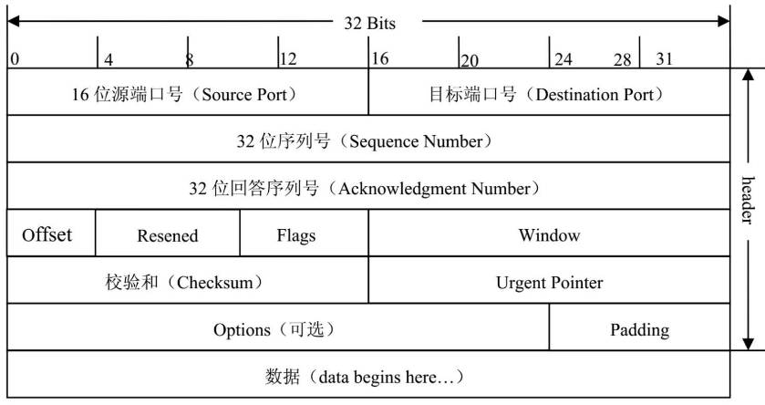
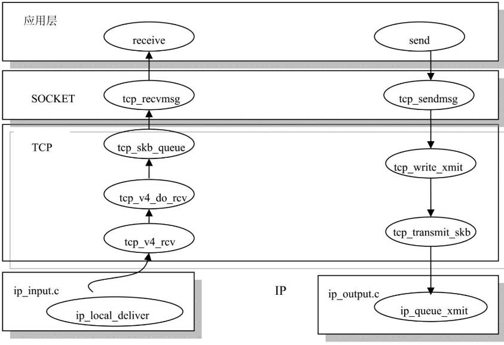
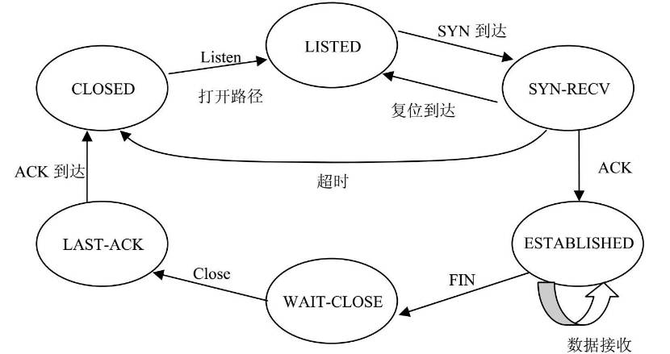
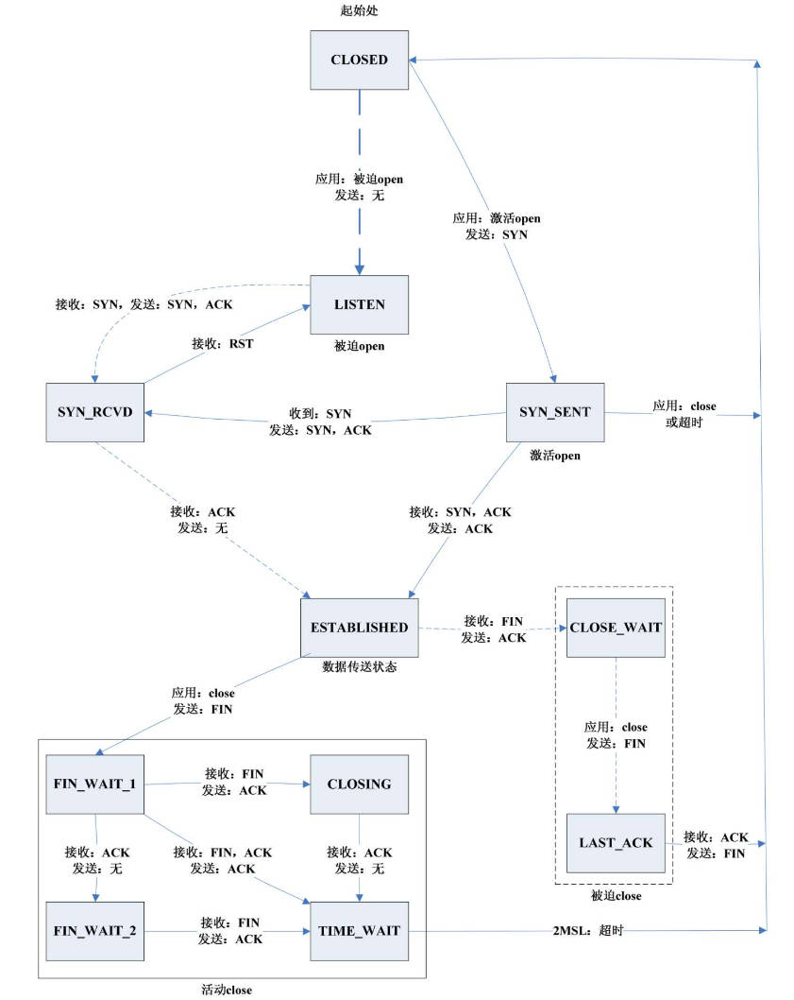
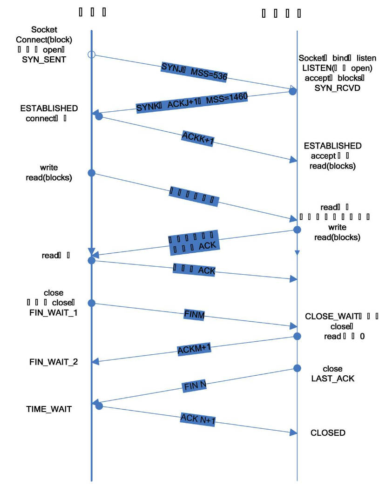
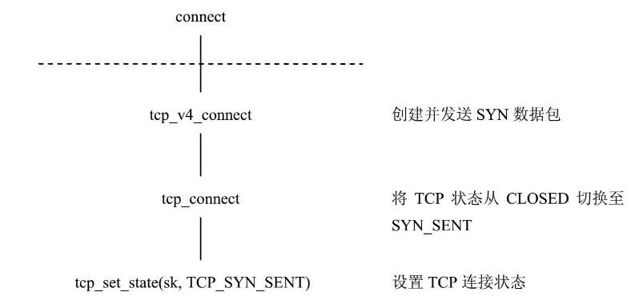

# TCP简介
TCP的特性是，可靠，面向连接，字节流。

TCP使用肯定回答和重传机制保证可靠。一旦发送数据，发送方要等待对方回答，超时后重传，多次重传后放弃，
另一方面每个TCP数据段都有校验检查数据是否受损，如果数据完整，接受方发送ACK，如果数据损坏，接受方丢弃数据段，一段时间后发送方重传未收到ACK的数据段

TCP协议格式


TCP层实现的功能
数据收发：IP层，TCP层，套接字层之间数据的传递
连接管理：在数据开始传输前，建立连接，完成传输后，断开连接
流量控制：保证数据按正确的顺序被接受 
回答超时管理

# 关键数据结构

## TCP协议头
```c
struct tcphdr {
	__be16	source; // 源端口
	__be16	dest; // 目的端口
	__be32	seq; // 数据段中第一个数据字节的序列号
	__be32	ack_seq; // 如果设置回答控制位，该值表示发送方的下一个序列号
#if defined(__LITTLE_ENDIAN_BITFIELD)
	__u16	res1:4,
		doff:4,
		fin:1,
		syn:1,
		rst:1,
		psh:1,
		ack:1,
		urg:1,
		ece:1,
		cwr:1;
#elif defined(__BIG_ENDIAN_BITFIELD)
	__u16	doff:4,  // 数据包长度
		res1:4, // 保留字段
		cwr:1, // 用于网络拥塞和窗口控制, 在原RFC没有定义
		ece:1, // 用于网络拥塞和窗口控制, 在原RFC没有定义
		urg:1, // 接下来传输重要数据
		ack:1, // 本数据段是ACK
		psh:1, // TCP层应立即将数据传送给上次应用
		rst:1, // 本数据段是RST，要求复位连接
		syn:1, // 本数据段是SYN
		fin:1; // 本数据段是FIN
#else
#error	"Adjust your <asm/byteorder.h> defines"
#endif	
	__be16	window; // 当我做接收方时还剩余多少缓存空间用于接受数据
	__sum16	check; // 包含TCP协议头和数据所作的检验和
	__be16	urg_ptr; // 指向重要数据的最后一个字节的地址

};

```
TCP支持长度可变的选项，追加在tcphdr后

## TCP的控制缓存
socket buffer用于存放负载数据，控制缓存存放用户控制管理数据包的信息
```c
struct tcp_skb_cb {
	// 存放数据包使用的IP协议
	union {
		struct inet_skb_parm	h4;
#if defined(CONFIG_IPV6) || defined (CONFIG_IPV6_MODULE)
		struct inet6_skb_parm	h6;
#endif
	} header;	/* For incoming frames		*/

	// 数据段的起始序列号
	__u32		seq;		/* Starting sequence number	*/
	// 最后一个输出数据段列号
	__u32		end_seq;	/* SEQ + FIN + SYN + datalen	*/
	// 用于计算RTT
	__u32		when;		/* used to compute rtt's	*/
	// 与tcphdr->flags 相同
	__u8		flags;		/* TCP header flags.		*/

	/* NOTE: These must match up to the flags byte in a
	 *       real TCP header.
	 */
#define TCPCB_FLAG_FIN		0x01
#define TCPCB_FLAG_SYN		0x02
#define TCPCB_FLAG_RST		0x04
#define TCPCB_FLAG_PSH		0x08
#define TCPCB_FLAG_ACK		0x10
#define TCPCB_FLAG_URG		0x20
#define TCPCB_FLAG_ECE		0x40
#define TCPCB_FLAG_CWR		0x80

	// 保存了选择回答SACK,转发回答FACK的状态标志
	__u8		sacked;		/* State flags for SACK/FACK.	*/
#define TCPCB_SACKED_ACKED	0x01	/* SKB ACK'd by a SACK block	*/
#define TCPCB_SACKED_RETRANS	0x02	/* SKB retransmitted		*/
#define TCPCB_LOST		0x04	/* SKB is lost			*/
#define TCPCB_TAGBITS		0x07	/* All tag bits			*/

#define TCPCB_EVER_RETRANS	0x80	/* Ever retransmitted frame	*/
#define TCPCB_RETRANS		(TCPCB_SACKED_RETRANS|TCPCB_EVER_RETRANS)

	// 与TCP协议头中的ack数据域相同
	__u32		ack_seq;	/* Sequence number ACK'd	*/
};
```

## TCP套接字
```c
struct tcp_sock {
	// 继承AF_INET面向连接套接字
	struct inet_connection_sock	inet_conn;
	// TCP协议头长度
	u16	tcp_header_len;	/* Bytes of tcp header to send		*/
	// 输出数据段的目标
	u16	xmit_size_goal;	/* Goal for segmenting output packets	*/
	// TCP协议头预定向完成标志
	// 该标志将用于确定数据包是否通过 fast path 接受
	__be32	pred_flags;
	// 下一个输入数据段的序列号
 	u32	rcv_nxt;	/* What we want to receive next 	*/
	// 下一个输出数据段的序列号
 	u32	snd_nxt;	/* Next sequence we send		*/
	...

	/* Data for direct copy to user */
	// ucopy 是实现fast path接受的关键
	struct {
		// 输入队列，包含等待由fast path处理的socket buffer链表
		struct sk_buff_head	prequeue;
		// 用户进程，接受prequeue队列中数据的用户进程
		struct task_struct	*task;
		// 向量指针，指向用户地址空间中存放的接受数据的数组
		struct iovec		*iov;
		// prequeue所有socket buffer中数据长度的总和
		int			memory;
		// prequeue上 socket buffer缓存区的个数
		int			len;
#ifdef CONFIG_NET_DMA
		// 用于数据异步复制，当网络设备支持Scatter/Gather IO时，
		// 可以利用DMA直接访问内存，将数据异步从网络设备硬件缓存
		// 区复制到应用程序地址空间的缓存区
		struct dma_chan		*dma_chan;
		int			wakeup;
		struct dma_pinned_list	*pinned_list;
		dma_cookie_t		dma_cookie;
#endif
	} ucopy;


};
```

## TCP协议选项
1. TCP_CORK/ nonagle
不立即发送数据段，直到数据段大小到达最大长度MSS，MSS应该小于MTU，这个选项和TCP_NODELAY是互斥的
该选项存放在 tcp_sock->nonagle

2. TCP_DEFER_ACCEPT
当接收到第一个数据之后，才会创建连接，这是为防止空连接的攻击.
服务端完成握手后，不会建立将此套接字当成已连接套接字 ，只有有真实数据到达后才会建立连接。
如果 val 秒后仍然没有收到数据，则丢弃此连接请求。
这个选项就是用于设置此val值
该选项存放在 tcp_sock->defer_accept

3. TCP_INFO
应用程序使用此选项可以获得大部分套接字配置信息。返回到 struct tcp_info中

4. TCP_KEEPCNT
定义了keepalive的阈值，超过后断开连接
该选项存放在 tcp_sock->keepalive_probes
如果要让该选项生效，还必须设置套接字层 SO_KEEPALIVE

5. TCP_KEEPIDLE
定义心跳包的间隔时间戳,单位秒

6. TCP_KEEPINTVL
两次探测包的间隔
存放在 tcp_sock->deepalive_intval

7. TCP_LINGER2
处于FIN_WAIT2状态的套接字还应存活多长时间。

8. TCP_MAXSEG
决定MSS值

9. TCP_NODELAY
立即发送数据，
存放在tcp_sock->nonagle
如果设置了TCP_CORK，此选项失效

10. TCP_QUICKACK
1: 关闭延迟回答，
0: 允许延迟回答
延迟回答是默认操作，
延迟回答指，ACK会等待下一个待用户数据的段一起发送。
tcp_sock->pingpong

11. TCP_SYNCNT
建立连接失败，重发多少次SYN才放弃

12. TCP_WINDOW_CLAMP
指定窗口大小
tcp_sock->window_clamp

## 应用层传输给传输层的数据结构
当应用层发送数据时，用msghdr发送数据，
传输层根据msghdr将数据构造到socket buffer中
```c
struct msghdr {
	// 不是字符串名字，而是 struct sockaddr_in之类的数据结构
	void	*	msg_name;	/* 套接字名字			*/
	int		msg_namelen;	/* 名字长度		*/
	struct iovec *	msg_iov;	/* 数据块链表			*/
	__kernel_size_t	msg_iovlen;	/* 数据块数量		*/
	void 	*	msg_control;	/* 文件控制描述符指针 */
	__kernel_size_t	msg_controllen;	/* 文件控制链表长度 */
	unsigned	msg_flags;
};

struct iovec
{
	void __user *iov_base;	/* 存放用户数据的空间块地址 */
	__kernel_size_t iov_len; /* 用户空间块大小 */
};
```

msg_flags为应用层给套接字的控制标志

| 标志 | 作用 |
| --- | --- |
| MSG_OOB | 请求out-of-band数据 |
| MSG_PEEK | 从接受队列获得数据，但不将数据移出队列 |
| MSG_DONTROUTE | 不对该数据路由，常用于ping发送ICMP |
| MSG_TRYHARD | 与MSG_DONTROUTE同义 |
| MSG_CTRUNC | 用于SOL_IP内部控制消息 |
| MSG_PROBE | 用于发现MTU数据段 |
| MSG_TRUNC | truncate消息 |
| MSG_EOR | 消息结束 |
| MSG_DONTWAIT | 不被IO阻塞 |
| MSG_WAITALL | 等待所有数据到达 |
| MSG_FIN | 发送FIN |
| MSG_SYN | 发送SYN |
| MSG_CONFIRM | 传输数据包前确认连接有效 |
| MSG_RST | RST段 |
| MSG_ERRQUEUE | 从错误队列读取数据 |
| MSG_NOSIGNAL | 读取已断开连接时，不产生SIGPIPE |
| MSG_MORE | 指明将要发送更多数据 |

# TCP, IP , 套接字之间的接口
套接字层和传输层之间的接口 ： struct proto
IP层和传输层之间的接口： struct net_protocol

## 套接字和TCP的接口
```c
struct proto tcp_prot = {
	.name			= "TCP",
	.owner			= THIS_MODULE,
	// 从close 到 shutdown 用于TCP连接管理
	.close			= tcp_close,
	.connect		= tcp_v4_connect,
	.disconnect		= tcp_disconnect,
	.accept			= inet_csk_accept,
	.ioctl			= tcp_ioctl,
	.init			= tcp_v4_init_sock,
	.destroy		= tcp_v4_destroy_sock,
	.shutdown		= tcp_shutdown,

	.setsockopt		= tcp_setsockopt,
	.getsockopt		= tcp_getsockopt,
	// 接受数据段
	.recvmsg		= tcp_recvmsg,

	.backlog_rcv		= tcp_v4_do_rcv,

	// 管理端口号和打开的sock
	.hash			= inet_hash,
	.unhash			= inet_unhash,
	.get_port		= inet_csk_get_port,

	.enter_memory_pressure	= tcp_enter_memory_pressure,
	.sockets_allocated	= &tcp_sockets_allocated,
	.orphan_count		= &tcp_orphan_count,
	.memory_allocated	= &tcp_memory_allocated,
	.memory_pressure	= &tcp_memory_pressure,
	.sysctl_mem		= sysctl_tcp_mem,
	.sysctl_wmem		= sysctl_tcp_wmem,
	.sysctl_rmem		= sysctl_tcp_rmem,
	.max_header		= MAX_TCP_HEADER,
	.obj_size		= sizeof(struct tcp_sock),
	.slab_flags		= SLAB_DESTROY_BY_RCU,
	.twsk_prot		= &tcp_timewait_sock_ops,
	.rsk_prot		= &tcp_request_sock_ops,
	.h.hashinfo		= &tcp_hashinfo,
#ifdef CONFIG_COMPAT
	.compat_setsockopt	= compat_tcp_setsockopt,
	.compat_getsockopt	= compat_tcp_getsockopt,
#endif
};
```

注册接口
```c
static int __init inet_init(void)
{
	...
	// 为协议实例初始化slab资源，将协议加入 proto_list链表
	proto_register(&tcp_prot, 1);
		prot->slab = kmem_cache_create(prot->name, prot->obj_size, 0,
					SLAB_HWCACHE_ALIGN | prot->slab_flags,
					NULL);
		...
		list_add(&prot->node, &proto_list);
	...
}
```

## TCP层和IP层之间的接口
```c
static struct net_protocol tcp_protocol = {
	.handler =	tcp_v4_rcv,
	.err_handler =	tcp_v4_err,
	.gso_send_check = tcp_v4_gso_send_check,
	.gso_segment =	tcp_tso_segment,
	.gro_receive =	tcp4_gro_receive,
	.gro_complete =	tcp4_gro_complete,
	.no_policy =	1,
	.netns_ok =	1,
};
```
注册协议
```c
static int __init inet_init(void)
{
	...
	// 将传输层协议实例放入 inet_protos数组
	inet_add_protocol(&tcp_protocol, IPPROTO_TCP);
		hash = protocol & (MAX_INET_PROTOS - 1);
		inet_protos[hash] = prot;
	...
}
```
### TCP向IP层的发送接口

```c
struct inet_connection_sock_af_ops ipv4_specific = {
	// IP层发送
	.queue_xmit	   = ip_queue_xmit,
	// 计算TCP校验和
	.send_check	   = tcp_v4_send_check,
	// 创建TCP协议头
	.rebuild_header	   = inet_sk_rebuild_header,
	// 处理连接请求数据段
	.conn_request	   = tcp_v4_conn_request,
	// 收到SYN ACK后创建新的子套接字
	.syn_recv_sock	   = tcp_v4_syn_recv_sock,
	// 从某个站点收到最后一个数据段的时间戳
	.remember_stamp	   = tcp_v4_remember_stamp,
	// IP协议头大小 
	.net_header_len	   = sizeof(struct iphdr),
	.setsockopt	   = ip_setsockopt,
	.getsockopt	   = ip_getsockopt,
	.addr2sockaddr	   = inet_csk_addr2sockaddr,
	.sockaddr_len	   = sizeof(struct sockaddr_in),
	.bind_conflict	   = inet_csk_bind_conflict,
};
```

```c
struct proto tcp_prot = {
	.name			= "TCP",
	...
	.init			= tcp_v4_init_sock,
	...
};

static int tcp_v4_init_sock(struct sock *sk)
	struct inet_connection_sock *icsk = inet_csk(sk);
	struct tcp_sock *tp = tcp_sk(sk);
	...
	icsk->icsk_af_ops = &ipv4_specific;
	...
```

## 初始化TCP套接字
```c
static int tcp_v4_init_sock(struct sock *sk)
{
	struct inet_connection_sock *icsk = inet_csk(sk);
	struct tcp_sock *tp = tcp_sk(sk);

	// 初始化TCP输出队列
	skb_queue_head_init(&tp->out_of_order_queue);
	// 超时时钟
	tcp_init_xmit_timers(sk);
	// 输入队列，用于实现 fast path 接受
	tcp_prequeue_init(tp);

	// 初始化重传时间，RTT参数
	icsk->icsk_rto = TCP_TIMEOUT_INIT;
	tp->mdev = TCP_TIMEOUT_INIT;

	tp->snd_cwnd = 2;

	tp->snd_ssthresh = 0x7fffffff;	/* Infinity */
	tp->snd_cwnd_clamp = ~0;
	tp->mss_cache = 536;

	tp->reordering = sysctl_tcp_reordering;
	icsk->icsk_ca_ops = &tcp_init_congestion_ops;

	// 套接字初始状态为 TCP_CLOSE
	sk->sk_state = TCP_CLOSE;

	sk->sk_write_space = sk_stream_write_space;
	sock_set_flag(sk, SOCK_USE_WRITE_QUEUE);

	icsk->icsk_af_ops = &ipv4_specific;
	icsk->icsk_sync_mss = tcp_sync_mss;
#ifdef CONFIG_TCP_MD5SIG
	tp->af_specific = &tcp_sock_ipv4_specific;
#endif

	// 发送和接受缓存区大小为系统控制值，可由 setsockopt修改
	sk->sk_sndbuf = sysctl_tcp_wmem[1];
	sk->sk_rcvbuf = sysctl_tcp_rmem[1];

	local_bh_disable();
	// tcp_sockets_allocated保存打开了的TCP套接字数量
	percpu_counter_inc(&tcp_sockets_allocated);
	local_bh_enable();

	return 0;
}
```

# 入栈数据
## 从IP层到TCP层
IP层调用 ip_local_deliver，根据IP协议头 iphdr->protocol 查找 net_protocol哈希表，找到上层接口，并调用接受函数，对于TCP，接受函数是 tcp_v4_rcv

### tcp_v4_rcv
tcp_v4_rcv的主要任务是：
* 数据包合法性检查
* 确定使用快路径处理还是慢路径处理

```c
int tcp_v4_rcv(struct sk_buff *skb)
{
	const struct iphdr *iph;
	struct tcphdr *th;
	struct sock *sk;
	int ret;
	struct net *net = dev_net(skb->dev);

	// 确定数据包是发给本机
	if (skb->pkt_type != PACKET_HOST)
		goto discard_it;

	/* Count it even if it's bad */
	TCP_INC_STATS_BH(net, TCP_MIB_INSEGS);

	// 确定数据包至少有TCP协议头大小的数据
	if (!pskb_may_pull(skb, sizeof(struct tcphdr)))
		goto discard_it;

	th = tcp_hdr(skb);

	// 确定整个数据段大小正确 	
	if (th->doff < sizeof(struct tcphdr) / 4)
		goto bad_packet;
	if (!pskb_may_pull(skb, th->doff * 4))
		goto discard_it;

	// 校验数据
	if (!skb_csum_unnecessary(skb) && tcp_v4_checksum_init(skb))
		goto bad_packet;

	th = tcp_hdr(skb);
	iph = ip_hdr(skb);
	TCP_SKB_CB(skb)->seq = ntohl(th->seq);
	TCP_SKB_CB(skb)->end_seq = (TCP_SKB_CB(skb)->seq + th->syn + th->fin +
				    skb->len - th->doff * 4);
	TCP_SKB_CB(skb)->ack_seq = ntohl(th->ack_seq);
	TCP_SKB_CB(skb)->when	 = 0;
	TCP_SKB_CB(skb)->flags	 = iph->tos;
	TCP_SKB_CB(skb)->sacked	 = 0;

	// 查看数据段属于哪个套接字
	sk = __inet_lookup_skb(&tcp_hashinfo, skb, th->source, th->dest);
	if (!sk)
		goto no_tcp_socket;

process:
	// 如果套接字为TCP_TIME_WAIT状态，需要特殊处理
	if (sk->sk_state == TCP_TIME_WAIT)
		goto do_time_wait;

	// IPsec策略检查
	if (!xfrm4_policy_check(sk, XFRM_POLICY_IN, skb))
		goto discard_and_relse;
	nf_reset(skb);

	if (sk_filter(sk, skb))
		goto discard_and_relse;

	skb->dev = NULL;

	// 获得锁，准备处理数据段
	bh_lock_sock_nested(sk);
	ret = 0;

	// 如果sock没有进程在使用，则使用 tcp_v4_do_rcv 将skb加入 prequeue
	// 如果sock正在被加锁使用，则将skb加入 backlog
	if (!sock_owned_by_user(sk)) {
#ifdef CONFIG_NET_DMA
		// 如果支持DMA，以DMA方式完成设备缓存区和用户缓存区之间的传递
		struct tcp_sock *tp = tcp_sk(sk);
		if (!tp->ucopy.dma_chan && tp->ucopy.pinned_list)
			tp->ucopy.dma_chan = dma_find_channel(DMA_MEMCPY);
		if (tp->ucopy.dma_chan)
			ret = tcp_v4_do_rcv(sk, skb);
		else
#endif
		{
			// 如果有进程正阻塞等待此sock的数据, 则尝试将pkt加入prequeue
			// 如果成功加入prequeue，则会在用户进程上下文处理数据，称为fast path
			// 若失败，则用tcp_v4_do_rcv
			if (!tcp_prequeue(sk, skb))
			ret = tcp_v4_do_rcv(sk, skb);
		}
	} else
		sk_add_backlog(sk, skb);
	bh_unlock_sock(sk);

	sock_put(sk);

	return ret;

no_tcp_socket:
	// 如果没有接受该数据段的套接字
	// 检查数据是否损坏，如果没有损坏，
	// 说明对端发送数据包给未打开的套接字，回复 RST

	if (!xfrm4_policy_check(NULL, XFRM_POLICY_IN, skb))
		goto discard_it;

	if (skb->len < (th->doff << 2) || tcp_checksum_complete(skb)) {
bad_packet:
		TCP_INC_STATS_BH(net, TCP_MIB_INERRS);
	} else {
		tcp_v4_send_reset(NULL, skb);
	}

discard_it:
	/* Discard frame. */
	kfree_skb(skb);
	return 0;

discard_and_relse:
	sock_put(sk);
	goto discard_it;

do_time_wait:
	// 当套接字为TCP_TIME_WAIT
	// 首先保证数据包通过IPsec和校验

	if (!xfrm4_policy_check(NULL, XFRM_POLICY_IN, skb)) {
		inet_twsk_put(inet_twsk(sk));
		goto discard_it;
	}

	if (skb->len < (th->doff << 2) || tcp_checksum_complete(skb)) {
		TCP_INC_STATS_BH(net, TCP_MIB_INERRS);
		inet_twsk_put(inet_twsk(sk));
		goto discard_it;
	}

	// 根据数据段的类型分别处理
	switch (tcp_timewait_state_process(inet_twsk(sk), skb, th)) {
	case TCP_TW_SYN: {
		// 收到SYN，打开连接
		struct sock *sk2 = inet_lookup_listener(dev_net(skb->dev),
							&tcp_hashinfo,
							iph->daddr, th->dest,
							inet_iif(skb));
		if (sk2) {
			inet_twsk_deschedule(inet_twsk(sk), &tcp_death_row);
			inet_twsk_put(inet_twsk(sk));
			sk = sk2;
			goto process;
		}
		/* Fall through to ACK */
	}

	case TCP_TW_ACK:
		// 收到最后一个ACK，给对端ACK，并关闭连接
		tcp_v4_timewait_ack(sk, skb);
		break;

	case TCP_TW_RST:
		// 收到FIN包，给对端发送RST
		goto no_tcp_socket;

	case TCP_TW_SUCCESS:;
		// 该数据包属于延迟数据或源ACk的重传，丢弃包
	}
	goto discard_it;
}
```
#### Fast path 和 Slow path
当收到数据包后，首先通过协议头决定去向： fast path 还是 slow path
fast path是内核的优化TCP输入的方式
要进入fast path，需满足：
* 收到数据包中包含的是数据而不是ACK
* 数据段是顺序传送数据中每一个完整的数据段，接受顺序正确
* 当收到数据包时，套接字连接状态为 established
满足以上条件时，数据段会放入 prequeue 队列，这时用户进程被唤醒，用户进程开始处理prequeue队列中的数据段，可以省略很多slow path的步骤。

由于TCP会话期间，至少有一半的数据包不包含ACK，所以有大量的数据包可以放入 prequeue

#### fast path : 初始化

```c
static inline void tcp_prequeue_init(struct tcp_sock *tp)
{
	tp->ucopy.task = NULL; // 处理数据复制的进程
	tp->ucopy.len = 0; // prequeue上数据段的数量
	tp->ucopy.memory = 0; // 数据段的总长度
	skb_queue_head_init(&tp->ucopy.prequeue); // prequeue队列节点 
#ifdef CONFIG_NET_DMA
	tp->ucopy.dma_chan = NULL;
	tp->ucopy.wakeup = 0;
	tp->ucopy.pinned_list = NULL;
	tp->ucopy.dma_cookie = 0;
#endif
}
```

#### fast path : 将数据包 prequeue
socket buffer被放入prequeue 的条件是有一个用户进程在打开的套接字上等待接受数据
```c
static inline int tcp_prequeue(struct sock *sk, struct sk_buff *skb)
{
	struct tcp_sock *tp = tcp_sk(sk);

	// 如果有进程等待接受, 将skb 加入 prequeue
	if (!sysctl_tcp_low_latency && tp->ucopy.task) {
		__skb_queue_tail(&tp->ucopy.prequeue, skb);
		tp->ucopy.memory += skb->truesize;
		if (tp->ucopy.memory > sk->sk_rcvbuf) {
			// 如果skb超过了套接字的接受缓存大小
			// 将prequeue所有skb加入sk->backlog
			// 也就是全部都走 slow path
			struct sk_buff *skb1;

			BUG_ON(sock_owned_by_user(sk));

			while ((skb1 = __skb_dequeue(&tp->ucopy.prequeue)) != NULL) {
				sk_backlog_rcv(sk, skb1);
				NET_INC_STATS_BH(sock_net(sk), LINUX_MIB_TCPPREQUEUEDROPPED);
			}

			// 清空 prequeue 队列
			tp->ucopy.memory = 0;
		} else if (skb_queue_len(&tp->ucopy.prequeue) == 1) {
			// 如果sk有足够的接受缓存，且prequeue只有一个数据段
			// 唤醒用户进程处理
			wake_up_interruptible(sk->sk_sleep);
			if (!inet_csk_ack_scheduled(sk))
				inet_csk_reset_xmit_timer(sk, ICSK_TIME_DACK,
						          (3 * TCP_RTO_MIN) / 4,
							  TCP_RTO_MAX);
		}
		// 返回1表示skb已经处理或放入sk->backlog
		return 1;
	}
	// 返回0表示需要调用函数将skb放入sk->backlog
	return 0;
}
```

#### slow path : 处理backlog队列
slow path是常规处理TCP数据段的情况，根据sock的当前状态来确定skb的去向。

在fast path中，当sock->sk_rcvbuf已满或sock 忙（被别的进程锁定），就将skb放入sock->backlog 队列
将skb放入 backlog 的前提是：
* 输入数据包完整
* 是数据段，不是ACK
* 套接字输入缓存区已满或套接字被其他用户占用

一旦skb放入 backlog, 就调度用户进程，开始从backlog 读取 skb

#### tcp_v4_do_rcv
tcp_v4_do_rcv 完成 slow path

```c
int tcp_v4_do_rcv(struct sock *sk, struct sk_buff *skb)
{
	struct sock *rsk;

	// 如果sk状态是 TCP_ESTABLISHED，可能可以用fast path处理
	// 交给tcp_rcv_established处理，此函数根据协议头判断是否
	// 可以用 fast path，当返回0表示处理成功，返回1则必须回复 RST
	// tcp_rcv_established 将skb加入 sk_receive_queue
	if (sk->sk_state == TCP_ESTABLISHED) { /* Fast path */
		TCP_CHECK_TIMER(sk);
		if (tcp_rcv_established(sk, skb, tcp_hdr(skb), skb->len)) {
			rsk = sk;
			goto reset;
		}
		TCP_CHECK_TIMER(sk);
		return 0;
	}

	// 确保数据包的完整和校验
	if (skb->len < tcp_hdrlen(skb) || tcp_checksum_complete(skb))
		goto csum_err;

	// 如果sk_state == TCP_ESTABLISHED，则立即处理skb的传送
	// 如果sk_state != TCP_ESTABLISHED，则还需要处理TCP状态转换

	// 当sk处于TCP_LISTEN时，需要接受SYN
	// tcp_v4_hnd_req处理连接，并返回建立连接的套接字 nsk
	if (sk->sk_state == TCP_LISTEN) {
		struct sock *nsk = tcp_v4_hnd_req(sk, skb);
		if (!nsk)
			goto discard;

		if (nsk != sk) {
			// 原套接字sk继续监听，
			// 调用tcp_child_process在子套接字nsk上处理接受
			// 如果成功，tcp_child_process返回0，
			// nsk->sk_state 被设置为 TCP_ESTABLISHED
			if (tcp_child_process(sk, nsk, skb)) {
				rsk = nsk;
				goto reset;
			}
			return 0;
		}
	}

	// 若不属于监听或已连接状态，调用 tcp_rcv_state_process
	// 如果返回非0，需要回复RST
	TCP_CHECK_TIMER(sk);
	if (tcp_rcv_state_process(sk, skb, tcp_hdr(skb), skb->len)) {
		rsk = sk;
		goto reset;
	}
	TCP_CHECK_TIMER(sk);
	return 0;

reset:
	tcp_v4_send_reset(rsk, skb);
discard:
	kfree_skb(skb);
	/* Be careful here. If this function gets more complicated and
	 * gcc suffers from register pressure on the x86, sk (in %ebx)
	 * might be destroyed here. This current version compiles correctly,
	 * but you have been warned.
	 */
	return 0;

csum_err:
	TCP_INC_STATS_BH(sock_net(sk), TCP_MIB_INERRS);
	goto discard;
}


 当sock状态为 ESTABLISHED ， tcp_v4_do_rcv 调用 tcp_rcv_established 接受skb
 tcp_rcv_established提供 fast path 和 Slow path两种方式接受
 除了如下情况，均采用fast path
 1. 到来的数据包告诉对方接受窗口为0
 2. 到来的数据发生乱序
 3. 没有剩余空间接受数据
 4. 数据包有无效的标志，窗口值和头部长度
 5. 同时进行双向数据传输
 6. TCP选项无效

int tcp_rcv_established(struct sock ＊sk, struct sk_buff ＊skb, struct tcphdr
＊th, unsigned len)
{
	struct tcp_opt ＊tp = tcp_sk(sk);
	tp->saw_tstamp = 0;
	……
	//处理有ACK标志的数据包
	tcp_ack(sk, skb, 0);
	……
	//发出ACK包，确认接收的情况
	tcp_data_snd_check(sk);
	……
	//把TCP头部从套接字缓冲区中取出
	__skb_pull(skb,tcp_header_len);
	//把存放应用程序数据的缓冲区插入套接字接收队列中
	__skb_queue_tail(&sk->sk_receive_queue, skb);
	……
slow_path:
	//从套接字缓冲区中去掉TCP头部，插入套接字队列中
	tcp_data_queue(sk, skb);
	……
}
```



## 套接字层接受
用户进程调用read获得数据段时，会调用 tcp_recvmsg

tcp_recvmsg从打开的sock上将数据复制到用户空间
```c
int tcp_recvmsg(struct kiocb *iocb, struct sock *sk, struct msghdr *msg,
		size_t len, int nonblock, int flags, int *addr_len)
{
	struct tcp_sock *tp = tcp_sk(sk);
	int copied = 0;
	u32 peek_seq;
	u32 *seq;
	unsigned long used;
	int err;
	int target;		/* Read at least this many bytes */
	long timeo;
	struct task_struct *user_recv = NULL;
	int copied_early = 0;
	struct sk_buff *skb;
	u32 urg_hole = 0;

	lock_sock(sk);

	TCP_CHECK_TIMER(sk);

	err = -ENOTCONN;
	// 如果处于监听状态，说明没有数据，退出
	if (sk->sk_state == TCP_LISTEN)
		goto out;

	timeo = sock_rcvtimeo(sk, nonblock);

	/* Urgent data needs to be handled specially. */
	if (flags & MSG_OOB)
		goto recv_urg;

	// copied_seq是上次读到的序号的后一位，
	// *seq就是马上要读取的用户数据字节序号
	seq = &tp->copied_seq;
	if (flags & MSG_PEEK) {
		peek_seq = tp->copied_seq;
		seq = &peek_seq;
	}

	// target : 本次读取的字节数
	// target  = min(sk->sk_rcvlowat, len);
	// len是用户请求读取的长度
	// sk_rcvlowat  是套接字一次最多读取多少字节
	target = sock_rcvlowat(sk, flags & MSG_WAITALL, len);

#ifdef CONFIG_NET_DMA
	tp->ucopy.dma_chan = NULL;
	preempt_disable();
	skb = skb_peek_tail(&sk->sk_receive_queue);
	{
		int available = 0;

		if (skb)
			available = TCP_SKB_CB(skb)->seq + skb->len - (*seq);
		if ((available < target) &&
		    (len > sysctl_tcp_dma_copybreak) && !(flags & MSG_PEEK) &&
		    !sysctl_tcp_low_latency &&
		    dma_find_channel(DMA_MEMCPY)) {
			preempt_enable_no_resched();
			tp->ucopy.pinned_list =
					dma_pin_iovec_pages(msg->msg_iov, len);
		} else {
			preempt_enable_no_resched();
		}
	}
#endif

	// 循环复制数据到用户空间，直到复制完target字节
	// 或者检查到异常
	do {
		u32 offset;

		/* Are we at urgent data? Stop if we have read anything or have SIGURG pending. */
		// 如果遇到紧急数据
		if (tp->urg_data && tp->urg_seq == *seq) {
			if (copied)
				break;
			if (signal_pending(current)) {
				copied = timeo ? sock_intr_errno(timeo) : -EAGAIN;
				break;
			}
		}

		/* Next get a buffer. */
		// 取出一个skb
		skb = skb_peek(&sk->sk_receive_queue);
		do {
			if (!skb)
				break;

			/* Now that we have two receive queues this
			 * shouldn't happen.
			 */
			// TCP_SKB_CB(skb)->seq 是此数据段的开始序列号
			// *seq 是上次读到的序号的后一位，
			// 所以 seq 一定会大于 TCP_SKB_CB(skb)->seq
			if (before(*seq, TCP_SKB_CB(skb)->seq)) {
				printk(KERN_INFO "recvmsg bug: copied %X "
				       "seq %X\n", *seq, TCP_SKB_CB(skb)->seq);
				break;
			}

			// offset 是对于此数据段已经读取了多少字节
			// 或者说是对于此数据段下次读取的位置相对于起始位置的偏移
			offset = *seq - TCP_SKB_CB(skb)->seq;

			// SYN会消耗一个序列号
			if (tcp_hdr(skb)->syn)
				offset--;

			// 如果此数据段还剩下字节没有读取，则进行读取
			if (offset < skb->len)
				goto found_ok_skb;

			// 如果没有数据需要读取，且这是FIN
			if (tcp_hdr(skb)->fin)
				goto found_fin_ok;

			WARN_ON(!(flags & MSG_PEEK));

			// 读取下个数据段
			skb = skb->next;

		} while (skb != (struct sk_buff *)&sk->sk_receive_queue);

		/* Well, if we have backlog, try to process it now yet. */

		// 如果 sk_receive_queue 读取完了，但是还没有读够target字节
		// 并且sk_backlog不为空
		// 则继续
		if (copied >= target && !sk->sk_backlog.tail)
			break;

		// 处理异常，或信号打断
		if (copied) {
			if (sk->sk_err ||
			    sk->sk_state == TCP_CLOSE ||
			    (sk->sk_shutdown & RCV_SHUTDOWN) ||
			    !timeo ||
			    signal_pending(current))
				break;
		} else {
			if (sock_flag(sk, SOCK_DONE))
				break;

			if (sk->sk_err) {
				copied = sock_error(sk);
				break;
			}

			if (sk->sk_shutdown & RCV_SHUTDOWN)
				break;

			if (sk->sk_state == TCP_CLOSE) {
				if (!sock_flag(sk, SOCK_DONE)) {
					/* This occurs when user tries to read
					 * from never connected socket.
					 */
					copied = -ENOTCONN;
					break;
				}
				break;
			}

			if (!timeo) {
				copied = -EAGAIN;
				break;
			}

			if (signal_pending(current)) {
				copied = sock_intr_errno(timeo);
				break;
			}
		}
		
		// 已经接受的部分数据段，可以发送ACK，通知对端自己窗口的变化
		tcp_cleanup_rbuf(sk, copied);

		// 接受队列已经无数据需要处理， 在处理 prequeue
		// prequeue是由用户进程上下文处理，而不是 bottom half
		if (!sysctl_tcp_low_latency && tp->ucopy.task == user_recv) {
			/* Install new reader */
			if (!user_recv && !(flags & (MSG_TRUNC | MSG_PEEK))) {
				user_recv = current;
				tp->ucopy.task = user_recv;
				tp->ucopy.iov = msg->msg_iov;
			}

			tp->ucopy.len = len;

			WARN_ON(tp->copied_seq != tp->rcv_nxt &&
				!(flags & (MSG_PEEK | MSG_TRUNC)));

			/* Ugly... If prequeue is not empty, we have to
			 * process it before releasing socket, otherwise
			 * order will be broken at second iteration.
			 * More elegant solution is required!!!
			 *
			 * Look: we have the following (pseudo)queues:
			 *
			 * 1. packets in flight
			 * 2. backlog
			 * 3. prequeue
			 * 4. receive_queue
			 *
			 * Each queue can be processed only if the next ones
			 * are empty. At this point we have empty receive_queue.
			 * But prequeue _can_ be not empty after 2nd iteration,
			 * when we jumped to start of loop because backlog
			 * processing added something to receive_queue.
			 * We cannot release_sock(), because backlog contains
			 * packets arrived _after_ prequeued ones.
			 *
			 * Shortly, algorithm is clear --- to process all
			 * the queues in order. We could make it more directly,
			 * requeueing packets from backlog to prequeue, if
			 * is not empty. It is more elegant, but eats cycles,
			 * unfortunately.
			 */
			if (!skb_queue_empty(&tp->ucopy.prequeue))
				goto do_prequeue;

			/* __ Set realtime policy in scheduler __ */
		}

		// prequeue 不处理或为空，

		if (copied >= target) {
			/* Do not sleep, just process backlog. */
			// 处理 backlog队列，
			// release_sock在唤醒等待在套接字上的用户进程前，先遍历
			// backlog上所有的数据包
			release_sock(sk);
			lock_sock(sk);
		} else
			// 如果读取的数据不够，等待新的数据
			sk_wait_data(sk, &timeo);

#ifdef CONFIG_NET_DMA
		tp->ucopy.wakeup = 0;
#endif

		if (user_recv) {
			int chunk;

			/* __ Restore normal policy in scheduler __ */

			// 计算从backlog获得数据量
			if ((chunk = len - tp->ucopy.len) != 0) {
				NET_ADD_STATS_USER(sock_net(sk), LINUX_MIB_TCPDIRECTCOPYFROMBACKLOG, chunk);
				len -= chunk;
				copied += chunk;
			}

			if (tp->rcv_nxt == tp->copied_seq &&
			    !skb_queue_empty(&tp->ucopy.prequeue)) {
do_prequeue:
				// 从prequeue复制数据，并计算获得的数据量
				tcp_prequeue_process(sk);
					while ((skb = __skb_dequeue(&tp->ucopy.prequeue)) != NULL)
						sk_backlog_rcv(sk, skb);
							return sk->sk_backlog_rcv(sk, skb);
							 // sk->sk_backlog_rcv = sk->sk_prot->backlog_rcv; 最后调用 tcp_v4_do_rcv ?
							 

				if ((chunk = len - tp->ucopy.len) != 0) {
					NET_ADD_STATS_USER(sock_net(sk), LINUX_MIB_TCPDIRECTCOPYFROMPREQUEUE, chunk);
					len -= chunk;
					copied += chunk;
				}
			}
		}
		if ((flags & MSG_PEEK) &&
		    (peek_seq - copied - urg_hole != tp->copied_seq)) {
			if (net_ratelimit())
				printk(KERN_DEBUG "TCP(%s:%d): Application bug, race in MSG_PEEK.\n",
				       current->comm, task_pid_nr(current));
			peek_seq = tp->copied_seq;
		}
		continue;

	found_ok_skb:
		/* Ok so how much can we use? */
		used = skb->len - offset;
		if (len < used)
			used = len;

		/* Do we have urgent data here? */
		if (tp->urg_data) {
			u32 urg_offset = tp->urg_seq - *seq;
			if (urg_offset < used) {
				if (!urg_offset) {
					if (!sock_flag(sk, SOCK_URGINLINE)) {
						++*seq;
						urg_hole++;
						offset++;
						used--;
						if (!used)
							goto skip_copy;
					}
				} else
					used = urg_offset;
			}
		}

		// 复制数据到用户空间
		if (!(flags & MSG_TRUNC)) {
#ifdef CONFIG_NET_DMA
			if (!tp->ucopy.dma_chan && tp->ucopy.pinned_list)
				tp->ucopy.dma_chan = dma_find_channel(DMA_MEMCPY);

			if (tp->ucopy.dma_chan) {
				tp->ucopy.dma_cookie = dma_skb_copy_datagram_iovec(
					tp->ucopy.dma_chan, skb, offset,
					msg->msg_iov, used,
					tp->ucopy.pinned_list);

				if (tp->ucopy.dma_cookie < 0) {

					printk(KERN_ALERT "dma_cookie < 0\n");

					/* Exception. Bailout! */
					if (!copied)
						copied = -EFAULT;
					break;
				}
				if ((offset + used) == skb->len)
					copied_early = 1;

			} else
#endif
			{
				err = skb_copy_datagram_iovec(skb, offset,
						msg->msg_iov, used);
				if (err) {
					/* Exception. Bailout! */
					if (!copied)
						copied = -EFAULT;
					break;
				}
			}
		}

		*seq += used;
		copied += used;
		len -= used;

		// 调整TCP窗口
		tcp_rcv_space_adjust(sk);

skip_copy:
		if (tp->urg_data && after(tp->copied_seq, tp->urg_seq)) {
			tp->urg_data = 0;
			tcp_fast_path_check(sk);
		}
		if (used + offset < skb->len)
			continue;

		if (tcp_hdr(skb)->fin)
			goto found_fin_ok;
		if (!(flags & MSG_PEEK)) {
			sk_eat_skb(sk, skb, copied_early);
			copied_early = 0;
		}
		continue;

	found_fin_ok:
		/* Process the FIN. */
		++*seq;
		if (!(flags & MSG_PEEK)) {
			sk_eat_skb(sk, skb, copied_early);
			copied_early = 0;
		}
		break;
	} while (len > 0);

	// 接受队列的数据读取完成，但prequeue有数据必须处理

	if (user_recv) {
		if (!skb_queue_empty(&tp->ucopy.prequeue)) {
			int chunk;

			tp->ucopy.len = copied > 0 ? len : 0;

			tcp_prequeue_process(sk);

			if (copied > 0 && (chunk = len - tp->ucopy.len) != 0) {
				NET_ADD_STATS_USER(sock_net(sk), LINUX_MIB_TCPDIRECTCOPYFROMPREQUEUE, chunk);
				len -= chunk;
				copied += chunk;
			}
		}

		tp->ucopy.task = NULL;
		tp->ucopy.len = 0;
	}

#ifdef CONFIG_NET_DMA
	if (tp->ucopy.dma_chan) {
		dma_cookie_t done, used;

		dma_async_memcpy_issue_pending(tp->ucopy.dma_chan);

		while (dma_async_memcpy_complete(tp->ucopy.dma_chan,
						 tp->ucopy.dma_cookie, &done,
						 &used) == DMA_IN_PROGRESS) {
			/* do partial cleanup of sk_async_wait_queue */
			while ((skb = skb_peek(&sk->sk_async_wait_queue)) &&
			       (dma_async_is_complete(skb->dma_cookie, done,
						      used) == DMA_SUCCESS)) {
				__skb_dequeue(&sk->sk_async_wait_queue);
				kfree_skb(skb);
			}
		}

		/* Safe to free early-copied skbs now */
		__skb_queue_purge(&sk->sk_async_wait_queue);
		tp->ucopy.dma_chan = NULL;
	}
	if (tp->ucopy.pinned_list) {
		dma_unpin_iovec_pages(tp->ucopy.pinned_list);
		tp->ucopy.pinned_list = NULL;
	}
#endif

	/* According to UNIX98, msg_name/msg_namelen are ignored
	 * on connected socket. I was just happy when found this 8) --ANK
	 */

	/* Clean up data we have read: This will do ACK frames. */
	tcp_cleanup_rbuf(sk, copied);

	TCP_CHECK_TIMER(sk);
	release_sock(sk);
	return copied;

out:
	TCP_CHECK_TIMER(sk);
	release_sock(sk);
	return err;

recv_urg:
	err = tcp_recv_urg(sk, timeo, msg, len, flags, addr_len);
	goto out;
}
```

# 出栈数据
TCP的传输有如下特点：
* 异步传输：TCP实际传输独立于应用层
* 汇集从套接字发送来的数据，形成TCP协议数据段，复制到 socket buffer
* 管理socket buffer链表，形成 socket buffer缓存发送队列，准备以后发送
* 管理socket buffer缓冲区分配，如果队列最后一个socket buffer缓冲区满了，但套接字还有新的数据要写入，则分配一个新的 socket buffer

## 从套接字层到TCP层
当用户write套接字时，会调用tcp_sendmsg
主要功能：
* 将数据复制到socket buffer
* 把 socket buffer放到发送队列
* 设置TCP控制块结构，用于构造TCP协议头

```c
int tcp_sendmsg(struct kiocb *iocb, struct socket *sock, struct msghdr *msg,
		size_t size)
{
	struct sock *sk = sock->sk;
	// 用于提取用户输入数据块的地址
	struct iovec *iov;
	struct tcp_sock *tp = tcp_sk(sk);
	struct sk_buff *skb;
	int iovlen /* 输入数据块个数 */, flags;
	int mss_now /* MSS */, size_goal;
	int err, copied;
	long timeo /* 存放SO_SENDTIMEO设置的时长 */;

	lock_sock(sk);
	TCP_CHECK_TIMER(sk);

	// 如果没有使用 MSG_DONTWAIT，则需要获得最长等待时间
	flags = msg->msg_flags;
	timeo = sock_sndtimeo(sk, flags & MSG_DONTWAIT);

	// 如果握手没有完成，则需要等待连接建立
	if ((1 << sk->sk_state) & ~(TCPF_ESTABLISHED | TCPF_CLOSE_WAIT))
		if ((err = sk_stream_wait_connect(sk, &timeo)) != 0)
			goto out_err;

	/* This should be in poll */
	clear_bit(SOCK_ASYNC_NOSPACE, &sk->sk_socket->flags);

	// 获得MSS, tcp最大分段
	mss_now = tcp_current_mss(sk, !(flags&MSG_OOB));
	size_goal = tp->xmit_size_goal;

	// 获得待发送的用户数据
	iovlen = msg->msg_iovlen; // 数据块数量
	iov = msg->msg_iov; // 地址
	copied = 0;

	// 如果连接已经关闭，则报错 EPIPE
	err = -EPIPE;
	if (sk->sk_err || (sk->sk_shutdown & SEND_SHUTDOWN))
		goto do_error;

	// 遍历每个待发送的数据块 
	while (--iovlen >= 0) {
		int seglen = iov->iov_len; // 取得一个数据块的长度
		unsigned char __user *from = iov->iov_base; //  数据块的基地址

		iov++;

		while (seglen > 0) { // 如果该数据块有待发送数据
			int copy;

			// 获取发送队列的最后一个skb, 但不会将skb出队，
			// 尝试在最后一个skb上追加数据
			skb = tcp_write_queue_tail(sk); 
					return skb_peek_tail(&sk->sk_write_queue);

			if (!tcp_send_head(sk) || /*如果发送队列为空*/
			    (copy = size_goal - skb->len) <= 0) { /*或者skb没有足够的空间*/

new_segment:
				// 查看当前sock发送缓存是否还有剩余
				if (!sk_stream_memory_free(sk)) // 当前没有发送缓存
				                                // sk->sk_wmem_queued(发送队列数据总大小) < sk->sk_sndbuf(该套接字发送缓冲区总大小);
					goto wait_for_sndbuf; // 等待有空闲发送缓存

				skb = sk_stream_alloc_skb(sk, select_size(sk),
						sk->sk_allocation); // 分配skb
				if (!skb) // 缓存不够，分配失败
					goto wait_for_memory;

				// 检查是否能硬件校验
				if (sk->sk_route_caps & NETIF_F_ALL_CSUM)
					skb->ip_summed = CHECKSUM_PARTIAL;

				// 将skb添加到sock的发送队列
				skb_entail(sk, skb);
					sk->sk_wmem_queued += skb->truesize;
					__skb_queue_tail(&sk->sk_write_queue, skb);

				copy = size_goal;
			}

			// 现在获得一个skb可以追加数据, 进行追加数据

			// 如果要拷贝的数量copy，大于用户给的数量seglen
			if (copy > seglen)
				copy = seglen;

			/* Where to copy to? */
			if (skb_tailroom(skb) > 0) {
			// skb tailroom 空间，将数据尽可能拷贝到skb 的 tailroom
				/* We have some space in skb head. Superb! */
				if (copy > skb_tailroom(skb))
					copy = skb_tailroom(skb);
				if ((err = skb_add_data(skb, from, copy)) != 0)
					goto do_fault;
			} else {

				// 如果主skb没有tailroom，则将数据追加到
				// 最后一个frags, skb_shinfo(skb)->frags[i - 1] 

				// 如果最后一个 frags 不能用于合并，则新
				// 建一个frags，加入 skb_shinfo(skb)->frags[] 数组。

				int merge = 0;
				int i = skb_shinfo(skb)->nr_frags; // 获得frags数量，为了定位最后的frag
				struct page *page = TCP_PAGE(sk);
				int off = TCP_OFF(sk);

				if (skb_can_coalesce(skb, i, page, off) &&
				    off != PAGE_SIZE) {
					// 能够将数据合并到最后一个 frags
					/* We can extend the last page
					 * fragment. */
					merge = 1;
				} else if (i == MAX_SKB_FRAGS ||
					   (!i &&
					   !(sk->sk_route_caps & NETIF_F_SG))) {
					/* Need to add new fragment and cannot
					 * do this because interface is non-SG,
					 * or because all the page slots are
					 * busy. */
					// 不能合并到最后一个frags，且本 socket buffer 的 frags
					// 数量已经到达最大 MAX_SKB_FRAGS，所以也不能分配新frags
					// 并且设备不支持 SG
					// 那么分配新的socket buffer，加入输出队列
					tcp_mark_push(tp, skb);
					goto new_segment;
				} else if (page) {
					if (off == PAGE_SIZE) {
						// 如果当前page没有剩余空间
						// 准备增加frags
						put_page(page);
						TCP_PAGE(sk) = page = NULL;
						off = 0;
					}
					// 不能合并但page没有使用完, 继续使用此page
				} else
					// 不能合并但可以增加frags，设置新frags的offset为0
					off = 0;

				// 计算使用frag剩余空间还能拷贝的数据
				if (copy > PAGE_SIZE - off)
					copy = PAGE_SIZE - off;

				// 如果sock没有足够的发送缓存，则等待
				if (!sk_wmem_schedule(sk, copy))
					goto wait_for_memory;

				if (!page) {
					/* Allocate new cache page. */
					// 如果page已经使用完了，或没有page，则从伙伴系统分配page
					if (!(page = sk_stream_alloc_page(sk)))
						goto wait_for_memory;
				}

				/* Time to copy data. We are close to
				 * the end! */
				// 将用户发送数据复制到 page
				err = skb_copy_to_page(sk, from, skb, page,
						       off, copy);
				if (err) {
					/* If this page was new, give it to the
					 * socket so it does not get leaked.
					 */
					if (!TCP_PAGE(sk)) {
						TCP_PAGE(sk) = page;
						TCP_OFF(sk) = 0;
					}
					goto do_error;
				}

				/* Update the skb. */
				if (merge) {
					// 如果可以合并，前面拷贝数据到page时，实际上是拷贝到了
					// 最后一个frag的page，所以增加frag的size
					skb_shinfo(skb)->frags[i - 1].size +=
									copy;
				} else {
					// 如果不能合并，前面拷贝到的 page 与 frag无关
					// 将page追加到frags数组
					skb_fill_page_desc(skb, i, page, off, copy);
					if (TCP_PAGE(sk)) {
						get_page(page);
					} else if (off + copy < PAGE_SIZE) {
						// 如果该page没有使用完，将 
						// sk->sk_sndmsg_page = page
						// 方便下次迅速找到有剩余空间的page
						get_page(page);
						TCP_PAGE(sk) = page;
					}
				}

				TCP_OFF(sk) = off + copy;
			}

			if (!copied)
				TCP_SKB_CB(skb)->flags &= ~TCPCB_FLAG_PSH;

			// 增加TCP序号，可以看出TCP序号的增长是以字节为单位的
			tp->write_seq += copy;
			TCP_SKB_CB(skb)->end_seq += copy;
			skb_shinfo(skb)->gso_segs = 0;

			from += copy;
			copied += copy;

			// 如果用户数据发送完了就退出
			if ((seglen -= copy) == 0 && iovlen == 0)
				goto out;

			// 如果skb携带的数据量还没有达到 size_goal 目标数量量，则继续追加数据
			// 或者存在带外数据，带外数据是很紧急的，所以继续追加数据
			if (skb->len < size_goal || (flags & MSG_OOB))
				continue;

			// 根据TCP窗口决定发送数据的数量
			if (forced_push(tp)) {
				// 如果要立即发送数据段，
				tcp_mark_push(tp, skb);
				// 将套接字发送队列上的数据段全部发送
				// 这时即使socket buffer只有少量数据也被发送
				__tcp_push_pending_frames(sk, mss_now, TCP_NAGLE_PUSH);
			} else if (skb == tcp_send_head(sk))
				tcp_push_one(sk, mss_now); // 发送一个数据段
			continue;

wait_for_sndbuf:
			set_bit(SOCK_NOSPACE, &sk->sk_socket->flags);
wait_for_memory:
			// 把NAGLE算法缓存的数据发送出去
			if (copied)
				tcp_push(sk, flags & ~MSG_MORE, mss_now, TCP_NAGLE_PUSH);

			if ((err = sk_stream_wait_memory(sk, &timeo)) != 0)
				goto do_error;

			mss_now = tcp_current_mss(sk, !(flags&MSG_OOB));
			size_goal = tp->xmit_size_goal;
		}
	}

out:
	if (copied)
		tcp_push(sk, flags, mss_now, tp->nonagle);
	TCP_CHECK_TIMER(sk);
	release_sock(sk);
	return copied;

do_fault:
	if (!skb->len) {
		tcp_unlink_write_queue(skb, sk);
		/* It is the one place in all of TCP, except connection
		 * reset, where we can be unlinking the send_head.
		 */
		tcp_check_send_head(sk, skb);
		sk_wmem_free_skb(sk, skb);
	}

do_error:
	if (copied)
		goto out;
out_err:
	err = sk_stream_error(sk, flags, err);
	TCP_CHECK_TIMER(sk);
	release_sock(sk);
	return err;
}

static inline void tcp_push(struct sock *sk, int flags, int mss_now,
			    int nonagle)
{
	struct tcp_sock *tp = tcp_sk(sk);

	if (tcp_send_head(sk)) {
		struct sk_buff *skb = tcp_write_queue_tail(sk);
		if (!(flags & MSG_MORE) || forced_push(tp))
			tcp_mark_push(tp, skb);
		tcp_mark_urg(tp, flags, skb);
		__tcp_push_pending_frames(sk, mss_now,
					  (flags & MSG_MORE) ? TCP_NAGLE_CORK : nonagle);
	}
}

void __tcp_push_pending_frames(struct sock *sk, unsigned int cur_mss,
			       int nonagle)
{
	struct sk_buff *skb = tcp_send_head(sk);

	if (!skb)
		return;

	if (unlikely(sk->sk_state == TCP_CLOSE))
		return;

	if (tcp_write_xmit(sk, cur_mss, nonagle, 0, GFP_ATOMIC))
		tcp_check_probe_timer(sk);
}

static int tcp_write_xmit(struct sock *sk, unsigned int mss_now, int nonagle,
			  int push_one, gfp_t gfp)
{
	struct tcp_sock *tp = tcp_sk(sk);
	struct sk_buff *skb;
	unsigned int tso_segs, sent_pkts;
	int cwnd_quota;
	int result;

	sent_pkts = 0;

	if (!push_one) {
		/* Do MTU probing. */
		result = tcp_mtu_probe(sk);
		if (!result) {
			return 0;
		} else if (result > 0) {
			sent_pkts = 1;
		}
	}

	while ((skb = tcp_send_head(sk))) { // 获得要发送的skb 
										// return sk->sk_send_head;
		unsigned int limit;

		tso_segs = tcp_init_tso_segs(sk, skb, mss_now);
		BUG_ON(!tso_segs);

		cwnd_quota = tcp_cwnd_test(tp, skb);
		if (!cwnd_quota)
			break;

		if (unlikely(!tcp_snd_wnd_test(tp, skb, mss_now)))
			break;

		if (tso_segs == 1) {
			if (unlikely(!tcp_nagle_test(tp, skb, mss_now,
						     (tcp_skb_is_last(sk, skb) ?
						      nonagle : TCP_NAGLE_PUSH))))
				break;
		} else {
			if (!push_one && tcp_tso_should_defer(sk, skb))
				break;
		}

		limit = mss_now;
		if (tso_segs > 1 && !tcp_urg_mode(tp))
			limit = tcp_mss_split_point(sk, skb, mss_now,
						    cwnd_quota);

		// 如果skb的数据长度大于MSS，则进行分片
		if (skb->len > limit &&
		    unlikely(tso_fragment(sk, skb, limit, mss_now)))
			break;

		TCP_SKB_CB(skb)->when = tcp_time_stamp;

		// 发送数据
		if (unlikely(tcp_transmit_skb(sk, skb, 1, gfp)))
			break;

		/* Advance the send_head.  This one is sent out.
		 * This call will increment packets_out.
		 */
		// 指向下一个待发送的skb
		tcp_event_new_data_sent(sk, skb);
			sk->sk_send_head = tcp_write_queue_next(sk, skb);

		tcp_minshall_update(tp, mss_now, skb);
		sent_pkts++;

		if (push_one)
			break;
	}

	if (likely(sent_pkts)) {
		tcp_cwnd_validate(sk);
		return 0;
	}
	return !tp->packets_out && tcp_send_head(sk);
}
```

## TCP数据段的输出
从TCP协议实例向IP层传输时，除了来自用户空间的数据包外，还有大量由TCP协议层产生的数据包，如：
* 重传数据包
* 探测路由最大传输单元
* RST数据包
* SYN数据包
* ACK数据包
* 0窗口探测数据包 等

这些数据包通过不同函数创建，和用户发送数据包，一起通过 tcp_transmit_skb 向IP层传送。

如 
tcp_sendmsg -> 
  tcp_push_one/\_\_tcp_push_pending_frames -> 
    tcp_write_xmit ->
	  tcp_transmit_skb

tcp_transmit_skb的功能：
* 创建TCP协议头
* 将数据段传递给IP层

构造TCP协议头，需要以下重要信息： 
* inet: 包含了AF_INET地址族SOCK_STREAM 类套接字的所有信息
* tp : 包含了TCP配置和连接大部分信息
* tcb : 包含了用于构造TCP协议头的各项标志
* th : 指向TCP协议头数据结构
* icsk : inet连接控制套接字

```c
static int tcp_transmit_skb(struct sock *sk, struct sk_buff *skb, int clone_it,
			    gfp_t gfp_mask)
{
	const struct inet_connection_sock *icsk = inet_csk(sk);
	struct inet_sock *inet;
	struct tcp_sock *tp;
	struct tcp_skb_cb *tcb;
	struct tcp_out_options opts;
	unsigned tcp_options_size, tcp_header_size;
	struct tcp_md5sig_key *md5;
	__u8 *md5_hash_location;
	struct tcphdr *th;
	int err;

	BUG_ON(!skb || !tcp_skb_pcount(skb));

	/* If congestion control is doing timestamping, we must
	 * take such a timestamp before we potentially clone/copy.
	 */
	if (icsk->icsk_ca_ops->flags & TCP_CONG_RTT_STAMP)
		__net_timestamp(skb);

	// skb被其他进程使用，需要克隆
	if (likely(clone_it)) {
		if (unlikely(skb_cloned(skb)))
			skb = pskb_copy(skb, gfp_mask);
		else
			skb = skb_clone(skb, gfp_mask);
		if (unlikely(!skb))
			return -ENOBUFS;
	}

	inet = inet_sk(sk);
	tp = tcp_sk(sk);
	tcb = TCP_SKB_CB(skb);
	memset(&opts, 0, sizeof(opts));

	// skb是SYN类型，则调用 tcp_syn_options 构建SYN选项
	// 否则使用 tcp_established_options ，构造常规选项
	if (unlikely(tcb->flags & TCPCB_FLAG_SYN))
		tcp_options_size = tcp_syn_options(sk, skb, &opts, &md5);
	else
		tcp_options_size = tcp_established_options(sk, skb, &opts,
							   &md5);
	tcp_header_size = tcp_options_size + sizeof(struct tcphdr);

	// 拥塞控制
	if (tcp_packets_in_flight(tp) == 0)
		tcp_ca_event(sk, CA_EVENT_TX_START);

	// 为TCP协议头分配空间
	skb_push(skb, tcp_header_size);
	skb_reset_transport_header(skb);
	skb_set_owner_w(skb, sk);

	// 构造TCP协议头 ，并计算校验和
	th = tcp_hdr(skb);
	th->source		= inet->sport;
	th->dest		= inet->dport;
	th->seq			= htonl(tcb->seq);
	th->ack_seq		= htonl(tp->rcv_nxt);
	*(((__be16 *)th) + 6)	= htons(((tcp_header_size >> 2) << 12) |
					tcb->flags);

	if (unlikely(tcb->flags & TCPCB_FLAG_SYN)) {
		/* RFC1323: The window in SYN & SYN/ACK segments
		 * is never scaled.
		 */
		th->window	= htons(min(tp->rcv_wnd, 65535U));
	} else {
		th->window	= htons(tcp_select_window(sk));
	}
	th->check		= 0;
	th->urg_ptr		= 0;

	/* The urg_mode check is necessary during a below snd_una win probe */
	if (unlikely(tcp_urg_mode(tp) &&
		     between(tp->snd_up, tcb->seq + 1, tcb->seq + 0xFFFF))) {
		th->urg_ptr		= htons(tp->snd_up - tcb->seq);
		th->urg			= 1;
	}

	tcp_options_write((__be32 *)(th + 1), tp, &opts, &md5_hash_location);
	if (likely((tcb->flags & TCPCB_FLAG_SYN) == 0))
		TCP_ECN_send(sk, skb, tcp_header_size);

	icsk->icsk_af_ops->send_check(sk, skb->len, skb);

	if (likely(tcb->flags & TCPCB_FLAG_ACK))
		tcp_event_ack_sent(sk, tcp_skb_pcount(skb));

	if (skb->len != tcp_header_size)
		tcp_event_data_sent(tp, skb, sk);

	// 更新统计数据
	if (after(tcb->end_seq, tp->snd_nxt) || tcb->seq == tcb->end_seq)
		TCP_INC_STATS(sock_net(sk), TCP_MIB_OUTSEGS);

	// 发送数据段到IP层
	// TCP初始化时，queue_xmit 指向 ip_queue_xmit 
	err = icsk->icsk_af_ops->queue_xmit(skb, 0);
	if (likely(err <= 0))
		return err;

	tcp_enter_cwr(sk, 1);

	return net_xmit_eval(err);
}
```
# TCP状态管理




TCP状态保存在 sock->state ，当sock处于不同状态时，对数据包的处理不一样。
整个状态可以分为三个阶段：
* 建立连接
* 数据传输
* 断开连接

管理连接状态机的重要函数 tcp_rcv_state_process , 
它根据收到信息切换TCP连接状态，但在连接还没有建立时，
TIME_WAIT是收到数据包的唯一状态。

## 建立连接
建立连接阶段处理以下状态:
* LISTEN : 被动打开，等待SYN
* SYN_SENT : 主动打开，发送SYN后，等待ACK
* SYN_RECV : 被动打开，收到SYN后，并回复SYN + ACK，等待ACK
* ESTABLISHED : 连接已建立，建立连接阶段结束

当用户调用connect时，内核执行 tcp_v4_connect

tcp_v4_connect 主要功能：
* 创建一个有SYN标志的请求包，并发送出去
* 将TCP状态从CLOSED切换到SYN_SENT
* 初始化TCP部分选项，如数据包序列号，窗口大小，MSS，套接字超时等

```c
int tcp_v4_connect(struct sock *sk, struct sockaddr *uaddr, int addr_len)
{
	struct inet_sock *inet = inet_sk(sk);
	struct tcp_sock *tp = tcp_sk(sk);
	struct sockaddr_in *usin = (struct sockaddr_in *)uaddr;
	struct rtable *rt;
	__be32 daddr /*目标IP*/, nexthop /*网关IP (如果有)*/;
	int tmp;
	int err;

	if (addr_len < sizeof(struct sockaddr_in))
		return -EINVAL;

	if (usin->sin_family != AF_INET)
		return -EAFNOSUPPORT;

	// 如果设置源路由选项，用第一个IP地址做网关地址
	// 如果没有设置，则用目标地址做网关地址
	nexthop = daddr = usin->sin_addr.s_addr;
	if (inet->opt && inet->opt->srr) {
		if (!daddr)
			return -EINVAL;
		nexthop = inet->opt->faddr;
	}

	// 查询到网关地址的路由
	tmp = ip_route_connect(&rt, nexthop, inet->saddr,
			       RT_CONN_FLAGS(sk), sk->sk_bound_dev_if,
			       IPPROTO_TCP,
			       inet->sport, usin->sin_port, sk, 1);
	if (tmp < 0) {
		if (tmp == -ENETUNREACH)
			IP_INC_STATS_BH(sock_net(sk), IPSTATS_MIB_OUTNOROUTES);
		return tmp;
	}

	// 网关地址必须是单播
	if (rt->rt_flags & (RTCF_MULTICAST | RTCF_BROADCAST)) {
		ip_rt_put(rt);
		return -ENETUNREACH;
	}

	// 若没有设置源路由IP选项，则记录路由
	if (!inet->opt || !inet->opt->srr)
		daddr = rt->rt_dst;

	// 若没有绑定套接字源地址，则用路由项设置源地址
	if (!inet->saddr)
		inet->saddr = rt->rt_src;
	inet->rcv_saddr = inet->saddr;

	if (tp->rx_opt.ts_recent_stamp && inet->daddr != daddr) {
		/* Reset inherited state */
		tp->rx_opt.ts_recent	   = 0;
		tp->rx_opt.ts_recent_stamp = 0;
		tp->write_seq		   = 0;
	}

	if (tcp_death_row.sysctl_tw_recycle &&
	    !tp->rx_opt.ts_recent_stamp && rt->rt_dst == daddr) {
		struct inet_peer *peer = rt_get_peer(rt);
		/*
		 * VJ's idea. We save last timestamp seen from
		 * the destination in peer table, when entering state
		 * TIME-WAIT * and initialize rx_opt.ts_recent from it,
		 * when trying new connection.
		 */
		if (peer != NULL &&
		    peer->tcp_ts_stamp + TCP_PAWS_MSL >= get_seconds()) {
			tp->rx_opt.ts_recent_stamp = peer->tcp_ts_stamp;
			tp->rx_opt.ts_recent = peer->tcp_ts;
		}
	}

	// 设置目标端口，目标地址
	inet->dport = usin->sin_port;
	inet->daddr = daddr;

	inet_csk(sk)->icsk_ext_hdr_len = 0;
	if (inet->opt)
		inet_csk(sk)->icsk_ext_hdr_len = inet->opt->optlen;

	tp->rx_opt.mss_clamp = 536;

	/* Socket identity is still unknown (sport may be zero).
	 * However we set state to SYN-SENT and not releasing socket
	 * lock select source port, enter ourselves into the hash tables and
	 * complete initialization after this.
	 */
	// 切换状态为 TCP_SYN_SENT
	tcp_set_state(sk, TCP_SYN_SENT);

	// 将套接字放入TCP连接管理哈希表 
	// 此时 sport 可能为0，inet_hash_connect会分配
	// 一个随机的端口设置sk->sport
	// 这样当建立连接后，接受数据包时，通过数据段的
	// 目的端口查询哈希表可以找到接受套接字
	err = inet_hash_connect(&tcp_death_row, sk);
	if (err)
		goto failure;

	// 由于sport可能改变，重新查询路由
	err = ip_route_newports(&rt, IPPROTO_TCP,
				inet->sport, inet->dport, sk);
	if (err)
		goto failure;

	/* OK, now commit destination to socket.  */
	sk->sk_gso_type = SKB_GSO_TCPV4;

	// 将路由保存到套接字，sk->sk_dst_cache = dst;
	// 如果目标主机是外网主机，则dst保存了网关信息 
	// 如果目标主机是内网主机，则dst保存了目标主机信息
	sk_setup_caps(sk, &rt->u.dst);

	// 初始化TCP数据段序列号
	if (!tp->write_seq)
		tp->write_seq = secure_tcp_sequence_number(inet->saddr,
							   inet->daddr,
							   inet->sport,
							   usin->sin_port);

	inet->id = tp->write_seq ^ jiffies;

	// 完成连接工作
	err = tcp_connect(sk);
	rt = NULL;
	if (err)
		goto failure;

	return 0;

failure:
	tcp_set_state(sk, TCP_CLOSE);
	ip_rt_put(rt);
	sk->sk_route_caps = 0;
	inet->dport = 0;
	return err;
}
```

## 连接状态管理
连接初始化后，状态的管理由 tcp_rcv_state_process完成，

TCP收到数据包后，必须查看数据段协议头，区分是负载数据还是包含控制信息
SYN,FIN,RST,ACK等，根据数据段类型，调用 tcp_rcv_state_process 确定TCP
的连接状态应如何切换, 数据包应如何处理。

大部分状态的切换和处理都在 tcp_rcv_state_process，除了 ESTABLISHED和TIME_WAIT

```c
// 返回 0 正常接受数据包, 或丢弃数据包不回复
// 返回 1 错误，交给上级处理，通常是回复RST
int tcp_rcv_state_process(struct sock *sk, struct sk_buff *skb,
			  struct tcphdr *th, unsigned len)
{
	struct tcp_sock *tp = tcp_sk(sk);
	struct inet_connection_sock *icsk = inet_csk(sk);
	int queued = 0;
	int res;

	tp->rx_opt.saw_tstamp = 0;

	// 按照套接字不同状态对数据段进行处理
	switch (sk->sk_state) {
	case TCP_CLOSE:
		// 套接字已关闭，丢弃包，不回复
		goto discard;

	case TCP_LISTEN:
		// 被动打开，等待SYN

		// 收到ACK，回复RST
		if (th->ack)
			return 1;

		// 收到RST，丢弃
		if (th->rst)
			goto discard;

		// 收到SYN，处理握手
		if (th->syn) {
			if (icsk->icsk_af_ops->conn_request(sk, skb) < 0)
				return 1;

			/* Now we have several options: In theory there is
			 * nothing else in the frame. KA9Q has an option to
			 * send data with the syn, BSD accepts data with the
			 * syn up to the [to be] advertised window and
			 * Solaris 2.1 gives you a protocol error. For now
			 * we just ignore it, that fits the spec precisely
			 * and avoids incompatibilities. It would be nice in
			 * future to drop through and process the data.
			 *
			 * Now that TTCP is starting to be used we ought to
			 * queue this data.
			 * But, this leaves one open to an easy denial of
			 * service attack, and SYN cookies can't defend
			 * against this problem. So, we drop the data
			 * in the interest of security over speed unless
			 * it's still in use.
			 */
			kfree_skb(skb);
			return 0;
		}
		// 其他都丢弃，不回复
		goto discard;

	case TCP_SYN_SENT:
		// 主动打开，发送了SYN，等待 SYN + ACK

		// 对数据段进行合法性检查和校验，如果数据段设置了ACK，
		// 则切换状态为 ESTABLISHED
		queued = tcp_rcv_synsent_state_process(sk, skb, th, len);
		if (queued >= 0)
			return queued;

		/* Do step6 onward by hand. */
		tcp_urg(sk, skb, th);
		__kfree_skb(skb);
		tcp_data_snd_check(sk);
		return 0;
	}

	// 下面的状况可能是
	// SYN_RECV ESTABLISHED CLOSE_WAIT FIN_WAITn TIME_WAIT

	// 对数据包进行有效性检查
	res = tcp_validate_incoming(sk, skb, th, 0);
	if (res <= 0)
		return -res;

	/* step 5: check the ACK field */
	if (th->ack) {
		int acceptable = tcp_ack(sk, skb, FLAG_SLOWPATH);

		switch (sk->sk_state) {
		case TCP_SYN_RECV:
			// 套接字是被动打开，收到了SYN，并回复SYN，ACK，等待ACK
			// 这时收到了ACK，将状态切换为 ESTABLISHED
			if (acceptable) {
				tp->copied_seq = tp->rcv_nxt;
				smp_mb();
				tcp_set_state(sk, TCP_ESTABLISHED);
				sk->sk_state_change(sk);

				/* Note, that this wakeup is only for marginal
				 * crossed SYN case. Passively open sockets
				 * are not waked up, because sk->sk_sleep ==
				 * NULL and sk->sk_socket == NULL.
				 */
				if (sk->sk_socket)
					sk_wake_async(sk,
						      SOCK_WAKE_IO, POLL_OUT);

				tp->snd_una = TCP_SKB_CB(skb)->ack_seq;
				tp->snd_wnd = ntohs(th->window) <<
					      tp->rx_opt.snd_wscale;
				tcp_init_wl(tp, TCP_SKB_CB(skb)->ack_seq,
					    TCP_SKB_CB(skb)->seq);

				/* tcp_ack considers this ACK as duplicate
				 * and does not calculate rtt.
				 * Fix it at least with timestamps.
				 */
				if (tp->rx_opt.saw_tstamp &&
				    tp->rx_opt.rcv_tsecr && !tp->srtt)
					tcp_ack_saw_tstamp(sk, 0);

				if (tp->rx_opt.tstamp_ok)
					tp->advmss -= TCPOLEN_TSTAMP_ALIGNED;

				/* Make sure socket is routed, for
				 * correct metrics.
				 */
				icsk->icsk_af_ops->rebuild_header(sk);

				tcp_init_metrics(sk);

				tcp_init_congestion_control(sk);

				/* Prevent spurious tcp_cwnd_restart() on
				 * first data packet.
				 */
				tp->lsndtime = tcp_time_stamp;

				tcp_mtup_init(sk);
				tcp_initialize_rcv_mss(sk);
				tcp_init_buffer_space(sk);
				tcp_fast_path_on(tp);
			} else {
				return 1;
			}
			break;

		case TCP_FIN_WAIT1:
			// TCP_FIN_WAIT1 收到ACK，切换为TCP_FIN_WAIT2
			if (tp->snd_una == tp->write_seq) {
				tcp_set_state(sk, TCP_FIN_WAIT2);
				sk->sk_shutdown |= SEND_SHUTDOWN;
				dst_confirm(sk->sk_dst_cache);

				if (!sock_flag(sk, SOCK_DEAD))
					/* Wake up lingering close() */
					sk->sk_state_change(sk);
				else {
					int tmo;

					if (tp->linger2 < 0 ||
					    (TCP_SKB_CB(skb)->end_seq != TCP_SKB_CB(skb)->seq &&
					     after(TCP_SKB_CB(skb)->end_seq - th->fin, tp->rcv_nxt))) {
						tcp_done(sk);
						NET_INC_STATS_BH(sock_net(sk), LINUX_MIB_TCPABORTONDATA);
						return 1;
					}

					tmo = tcp_fin_time(sk);
					if (tmo > TCP_TIMEWAIT_LEN) {
						inet_csk_reset_keepalive_timer(sk, tmo - TCP_TIMEWAIT_LEN);
					} else if (th->fin || sock_owned_by_user(sk)) {
						/* Bad case. We could lose such FIN otherwise.
						 * It is not a big problem, but it looks confusing
						 * and not so rare event. We still can lose it now,
						 * if it spins in bh_lock_sock(), but it is really
						 * marginal case.
						 */
						inet_csk_reset_keepalive_timer(sk, tmo);
					} else {
						tcp_time_wait(sk, TCP_FIN_WAIT2, tmo);
						goto discard;
					}
				}
			}
			break;

		case TCP_CLOSING:
			if (tp->snd_una == tp->write_seq) {
				tcp_time_wait(sk, TCP_TIME_WAIT, 0);
				goto discard;
			}
			break;

		case TCP_LAST_ACK:
			if (tp->snd_una == tp->write_seq) {
				tcp_update_metrics(sk);
				tcp_done(sk);
				goto discard;
			}
			break;
		}
	} else
		goto discard;

	/* step 6: check the URG bit */
	tcp_urg(sk, skb, th);

	/* step 7: process the segment text */
	switch (sk->sk_state) {
	case TCP_CLOSE_WAIT:
	case TCP_CLOSING:
	case TCP_LAST_ACK:
		if (!before(TCP_SKB_CB(skb)->seq, tp->rcv_nxt))
			break;
	case TCP_FIN_WAIT1:
	case TCP_FIN_WAIT2:
		/* RFC 793 says to queue data in these states,
		 * RFC 1122 says we MUST send a reset.
		 * BSD 4.4 also does reset.
		 */
		if (sk->sk_shutdown & RCV_SHUTDOWN) {
			if (TCP_SKB_CB(skb)->end_seq != TCP_SKB_CB(skb)->seq &&
			    after(TCP_SKB_CB(skb)->end_seq - th->fin, tp->rcv_nxt)) {
				NET_INC_STATS_BH(sock_net(sk), LINUX_MIB_TCPABORTONDATA);
				tcp_reset(sk);
				return 1;
			}
		}
		/* Fall through */
	case TCP_ESTABLISHED:
		tcp_data_queue(sk, skb);
		queued = 1;
		break;
	}

	/* tcp_data could move socket to TIME-WAIT */
	if (sk->sk_state != TCP_CLOSE) {
		tcp_data_snd_check(sk);
		tcp_ack_snd_check(sk);
	}

	if (!queued) {
discard:
		__kfree_skb(skb);
	}
	return 0;
}
```


