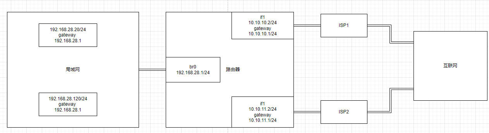

# Linux Advanced Routing & Traffic Control HOWTO
https://lartc.org/howto/index.html

## iproute2
为什么用iproute2 ?
古老的arp ifconfig route 命令虽然能工作，但linux2.2之后对网络子系统进行了重新设计和实现，添加了很多新功能，
为了新功能和更好的效率，需要 iproute2

### ip route 设置路由项
```shell
ip route { add | del | change | append | replace } ROUTE

	ROUTE := NODE_SPEC [ INFO_SPEC ]

	NODE_SPEC := [ TYPE ] PREFIX [ tos TOS ] [ table TABLE_ID ] [ proto
		   RTPROTO ] [ scope SCOPE ] [ metric METRIC ] [ ttl-propagate {
		   enabled | disabled } ]

	INFO_SPEC := { NH | nhid ID } OPTIONS FLAGS [ nexthop NH ] ...

    OPTIONS := FLAGS [ mtu NUMBER ] [ advmss NUMBER ] [ as [ to ] ADDRESS
		   ] rtt TIME ] [ rttvar TIME ] [ reordering NUMBER ] [ window
		   NUMBER ] [ cwnd NUMBER ] [ ssthresh NUMBER ] [ realms REALM ]
		   [ rto_min TIME ] [ initcwnd NUMBER ] [ initrwnd NUMBER ] [
		   features FEATURES ] [ quickack BOOL ] [ congctl NAME ] [ pref
		   PREF ] [ expires TIME ] [ fastopen_no_cookie BOOL ]

    NH := [ encap ENCAP ] [ via [ FAMILY ] ADDRESS ] [ dev STRING ] [
		   weight NUMBER ] NHFLAGS

# 常用
# default: 所有数据包匹配
# via : 下一跳为 192.168.1.1，即MAC地址，即网关
ip route add default via 192.168.1.1

# 匹配条件为目标地址为192.168.4.0/24网段，
# via : 下一调为 192.168.166.1
# dev : 输出设备的wlan0
ip route add 192.168.4.0/24 via 192.168.166.1 dev wlan0

# 匹配条件为目标地址为192.168.1.9
# via : 下一跳为 192.168.166.1
# dev : 输出设备为wlan0
ip route add 192.168.1.9 via 192.168.166.1 dev wlan0

ip route add default via 192.168.1.1 table 1

ip route add 192.168.0.0/24 via 192.168.166.1 table 1

# 获取到目标的单个路由，并按照内核所看到的方式打印其内容
ip route get 169.254.0.0/16

# 删除192.168.4.0网段的网关
ip route del 192.168.4.0/24

# 删除默认网关
ip route del default

# 删除特定路由
ip route flush 10.38.0.0/16

# 清空路由表
ip route flush table main

# src : 当数据包匹配此路由项时，如果数据包没有设置源地址（没有用bind）
#       则使用 src 指定的地址作为源地址进行发送
#       如果数据包有源地址，则不使用src指定的参数
#       src 只作用于本机发出的数据包，且没有显示指定源地址
ip route add 78.22.45.0/24 via 10.45.22.1 src 10.45.22.12
```

### 显示链路
```shell
# ip link show
1: lo: <LOOPBACK,UP,LOWER_UP> mtu 65536 qdisc noqueue state UNKNOWN mode DEFAULT group default qlen 1000
    link/loopback 00:00:00:00:00:00 brd 00:00:00:00:00:00
2: ens33: <BROADCAST,MULTICAST,UP,LOWER_UP> mtu 1500 qdisc fq_codel state UP mode DEFAULT group default qlen 1000
    link/ether 00:0c:29:89:30:6d brd ff:ff:ff:ff:ff:ff
    altname enp2s1
```
iproute 切断了 链路 和 IP地址 的直接联系。

### 显示IP
```shell
root@u22:/# ip addr show
1: lo: <LOOPBACK,UP,LOWER_UP> mtu 65536 qdisc noqueue state UNKNOWN group default qlen 1000
    link/loopback 00:00:00:00:00:00 brd 00:00:00:00:00:00
    inet 127.0.0.1/8 scope host lo
       valid_lft forever preferred_lft forever
    inet6 ::1/128 scope host
       valid_lft forever preferred_lft forever
2: ens33: <BROADCAST,MULTICAST,UP,LOWER_UP> mtu 1500 qdisc fq_codel state UP group default qlen 1000
    link/ether 00:0c:29:89:30:6d brd ff:ff:ff:ff:ff:ff
    altname enp2s1
    inet 192.168.3.2/24 brd 192.168.3.255 scope global noprefixroute ens33
       valid_lft forever preferred_lft forever
    inet6 fe80::da3a:e4d2:87f2:80f0/64 scope link noprefixroute
       valid_lft forever preferred_lft forever
```
需要注意的子网掩码，以127.0.0.1 IP地址为例
255.0.0.0 -> 127.0.0.1/8
255.255.0.0 -> 127.0.0.1/16
255.255.255.0 -> 127.0.0.1/24
255.255.255.255 -> 127.0.0.1/32
显然 8，16，24，32表示为1的bit位数量

还需注意 qdisc

### 显示路由
```shell
root@u22:/# ip route show
default via 192.168.4.2 dev ens38 proto dhcp metric 101
default via 192.168.3.1 dev ens33 proto static metric 20100
169.254.0.0/16 dev ens33 scope link metric 1000
192.168.3.0/24 dev ens33 proto kernel scope link src 192.168.3.2 metric 100
192.168.4.0/24 dev ens38 proto kernel scope link src 192.168.4.128 metric 101
```
第一项用于比较目的地址

带 via 192... 指网关，也就是下一跳的MAC地址为此主机的MAC

dev ensxx 指输出设备

proto dhcp/static 指这条路由项怎么被设置的

metric 表示路由的度量值（metric）。度量值用于确定路由选择的优先级，较低的度量值表示更优先的路由。
当存在多个匹配的路由时，系统会选择度量值最低的路由进行数据包转发。


#### 显示路由的 res.type
IP层收到数据包后，要判断数据包是发送给自己还是单播或广播或组播，通过 ip_route_input 
```c
ip_route_input
	fib_lookup(net, &fl, &res);
	if (res.type == RTN_BROADCAST)
		goto brd_input;
	if (res.type == RTN_LOCAL) {
		goto local_input;
local_input:
		rth = dst_alloc(&ipv4_dst_ops);
		rth->fl.fl4_dst	= daddr;
		rth->rt_dst	= daddr;
		rth->rt_src	= saddr;
		rth->fl.iif	= dev->ifindex;
		rth->u.dst.dev	= net->loopback_dev; // 如果目的地址是本地的数据包交给 loopback_dev 设备进行发送
		                                     // 所以主机内网络通信，传输到链路层后交给的网络设备是loopback_dev，所以不会传输到网线上
		rth->idev	= in_dev_get(rth->u.dst.dev);
		rth->rt_gateway	= daddr; // 本地路由的下一跳就是目的地址
	}

	// 处理单播, 单播的下一跳通常不是目的地址且输出设备也不是 loopback
	// 所以需要根据查询到的路由项res 构造路由缓存
	ip_mkroute_input(skb, &res, &fl, in_dev, daddr, saddr, tos);
		struct rtable* rth = NULL;
		__mkroute_input(skb, res, in_dev, daddr, saddr, tos, &rth);
			rth = dst_alloc(&ipv4_dst_ops);
			rth->fl.fl4_dst	= daddr;
			rth->rt_dst	= daddr;
			rth->fl.fl4_tos	= tos;
			rth->fl.fl4_src	= saddr;
			rth->rt_src	= saddr;
			rth->rt_gateway	= daddr;
			rth->rt_iif 	=
				rth->fl.iif	= in_dev->dev->ifindex; //输出设备由路由项决定
			rth->u.dst.dev	= (out_dev)->dev;
			rth->idev	= in_dev_get(rth->u.dst.dev);
			rth->u.dst.input = ip_forward; // 对于输入的数据包进行转发处理
			rth->u.dst.output = ip_output;

			rt_set_nexthop(rth, res, itag); // 设置下一跳也就是网关
				struct fib_info *fi = res->fi;
				// 只有当路由条目的使用范围为 link 才设置网关
				if (FIB_RES_GW(*res) &&
					FIB_RES_NH(*res).nh_scope == RT_SCOPE_LINK)
					rt->rt_gateway = FIB_RES_GW(*res);


// res.type 有如下可能：
enum
{
	RTN_UNSPEC,
	RTN_UNICAST,		/* Gateway or direct route	*/
	RTN_LOCAL,		/* Accept locally		*/
	RTN_BROADCAST,		/* Accept locally as broadcast,
				   send as broadcast */
	RTN_ANYCAST,		/* Accept locally as broadcast,
				   but send as unicast */
	RTN_MULTICAST,		/* Multicast route		*/
	RTN_BLACKHOLE,		/* Drop				*/
	RTN_UNREACHABLE,	/* Destination is unreachable   */
	RTN_PROHIBIT,		/* Administratively prohibited	*/
	RTN_THROW,		/* Not in this table		*/
	RTN_NAT,		/* Translate this address	*/
	RTN_XRESOLVE,		/* Use external resolver	*/
	__RTN_MAX
};

// 其中 RTN_LOCAL 表示发送给本机
//      RTN_UNICAST 表示需要转发的单播
// 使用 ip-route可以知道路由项的 res.type
// main表内没有一项为local,所以匹配main表任意一项都不会本地接受
root@u22:/# ip route show table main type local

// local表大量为local，匹配local表内，表示本地接受
root@u22:/# ip route show table local type local
local 127.0.0.0/8 dev lo proto kernel scope host src 127.0.0.1
local 127.0.0.1 dev lo proto kernel scope host src 127.0.0.1
local 169.254.7.114 dev ens37 proto kernel scope host src 169.254.7.114
local 192.168.3.2 dev ens33 proto kernel scope host src 192.168.3.2
local 192.168.4.128 dev ens38 proto kernel scope host src 192.168.4.128

// local表内没有一项为unicast，所以不会有转发
root@u22:/# ip route show table local type unicast
// main表内有很多unicast，会转发
root@u22:/# ip route show table main type unicast
default via 192.168.4.2 dev ens38 proto dhcp metric 101
default dev ens37 scope link metric 1003 linkdown
default via 192.168.3.1 dev ens33 proto static metric 20100
169.254.0.0/16 dev ens37 proto kernel scope link src 169.254.7.114 linkdown
169.254.0.0/16 dev ens33 scope link metric 1000
192.168.3.0/24 dev ens33 proto kernel scope link src 192.168.3.2 metric 100
192.168.4.0/24 dev ens38 proto kernel scope link src 192.168.4.128 metric 101

另外使用ip-route还可以查看一个目标地址使用哪条路由项
root@u22:/# ip route get 192.168.5.5
192.168.5.5 via 192.168.4.2 dev ens38 src 192.168.4.128 uid 0
    cache

root@u22:/# ip route get 192.168.3.1
192.168.3.1 dev ens33 src 192.168.3.2 uid 0
    cache
```

### ARP
```shell
root@u22:/# ip neigh show
192.168.4.254 dev ens38 lladdr 00:50:56:ef:b6:3d STALE
192.168.4.2 dev ens38 lladdr 00:50:56:e3:4b:0d STALE
192.168.3.1 dev ens33 lladdr 00:50:56:c0:00:01 REACHABLE

```
删除ARP项
```shell
ip neigh delete <MAC> dev <dev_name>
 ```

### 策略路由

#### 查看策略
```shell
root@u22:/mnt/share/study_kernel/network# ip rule list
0:      from all lookup local
220:    from all lookup 220
32766:  from all lookup main
32767:  from all lookup default
```
其中 main 表就是 ip route 默认操作的表

#### 示例 简单的源策略路由
有两个moden,希望源地址为 10.0.0.10的数据包走 ppp2
ppp0 212.64.94.251 -  212.64.94.1
ppp2 212.64.78.148 - 195.96.98.253

# 当前main表有两个默认路由 ppp2 ppp0
ip route list table main
195.96.98.253 dev ppp2 proto kernel scope link src 212.64.78.148
212.64.94.1 dev ppp0 proto kernel scope link src 212.64.94.251
10.0.0.0/8 dev eth0 proto kernel scope link src 10.0.0.1
127.0.0.0/8 dev lo scope link
default via 212.64.94.1 dev ppp0

# 添加一个表名为 200,别名John
echo 200 John >> /etc/iproute2/rt_tables
# 让源地址为 10.0.0.10 的数据包使用 John 表
ip rule add from 10.0.0.10 table John

# John 表在 main表前
ip rule ls
0:from all lookup local
32765:from 10.0.0.10 lookup John
32766:from all lookup main
32767:from all lookup default

# John表添加规则，所有数据包走 ppp2
ip route add default via 195.96.98.253 dev ppp2 table John

# 刷新路由缓存
ip route flush cache

#### 示例 wireguard的路由
```shell
[#] ip link add wg0 type wireguard
[#] wg setconf wg0 /dev/fd/63
[#] ip -4 address add 10.10.10.85/24 dev wg0
[#] ip link set mtu 1420 up dev wg0
[#] resolvconf -a tun.wg0 -m 0 -x
[#] wg set wg0 fwmark 51820
[#] ip -6 route add ::/0 dev wg0 table 51820
[#] ip -6 rule add not fwmark 51820 table 51820
[#] ip -6 rule add table main suppress_prefixlength 0
[#] nft -f /dev/fd/63
[#] ip -4 route add 0.0.0.0/0 dev wg0 table 51820
[#] ip -4 rule add not fwmark 51820 table 51820
[#] ip -4 rule add table main suppress_prefixlength 0
[#] sysctl -q net.ipv4.conf.all.src_valid_mark=1
[#] nft -f /dev/fd/63
```

```shell
root@u22:~/linux-2.6.29.6# ip rule list
0:      from all lookup local
218:    from all lookup main suppress_prefixlength 0
219:    not from all fwmark 0xca6c lookup 51820
220:    from all lookup 220
32766:  from all lookup main
32767:  from all lookup default
```
wireguard 加了两个策略
```shell

# 对于所有报文，并且 suppress_prefixlength 0 为真使用 main 表
# suppress_prefixlength 可以通过 man ip-rule
#              suppress_prefixlength NUMBER
#                     reject routing decisions that have a prefix length of
#                     NUMBER or less.
#                     拒绝路由条目其前缀长度小于等于NUMBER
# 所以 suppress_prefixlength 0 就是拒绝 xx.xx.xx.xx/0 的路由条目，也就是默认路由条目

218:    from all lookup main suppress_prefixlength 0

# 所以main表中除了默认路由都能生效，比如用户设置的内网路由
# 所以当发送一个到外网的数据包时首先使用 main 表，但是由于默认路由都被拒绝了，所以main表匹配不到，走下面的表

# 除掉fwmark 0xca6c 的数据包都匹配策略，查询 51820 表
# wireguard口出来的包都会被打上 0xca6c的fwmark
219:    not from all fwmark 0xca6c lookup 51820

# 所以一般的数据包会匹配此策略，并查询 51820 表

# 51820 表包含一条默认路由，将所有数据包走 wg0 设备
# wg0将数据包封装，目的地址为VPN服务器地址，通常是外网地址
root@u22:~/linux-2.6.29.6# ip route show table 51820
default dev wg0 scope link

# 然后再次查询路由，由于需要默认路由，且被标记了 0xca6c，
# 所以策略 218 219 都不匹配，220 是空，最终匹配策略 32766
32766:  from all lookup main

# 所以封装的数据包使用默认路由发送给网关，最终发送到VPN服务器
# VPN服务器去除封装，得到原始数据包，
# 然后基于原始数据包目的IP查询路由，确定是转发，还是本机
root@u22:~/linux-2.6.29.6# ip route show table main
default via 192.168.4.2 dev ens38 proto dhcp metric 101
default via 192.168.3.1 dev ens33 proto static metric 20100
10.10.10.0/24 dev wg0 proto kernel scope link src 10.10.10.85
169.254.0.0/16 dev ens33 scope link metric 1000
192.168.3.0/24 dev ens33 proto kernel scope link src 192.168.3.2 metric 100
192.168.4.0/24 dev ens38 proto kernel scope link src 192.168.4.128 metric 101
```
#### 流量分割


