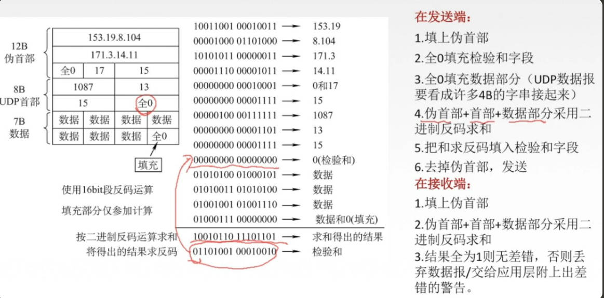
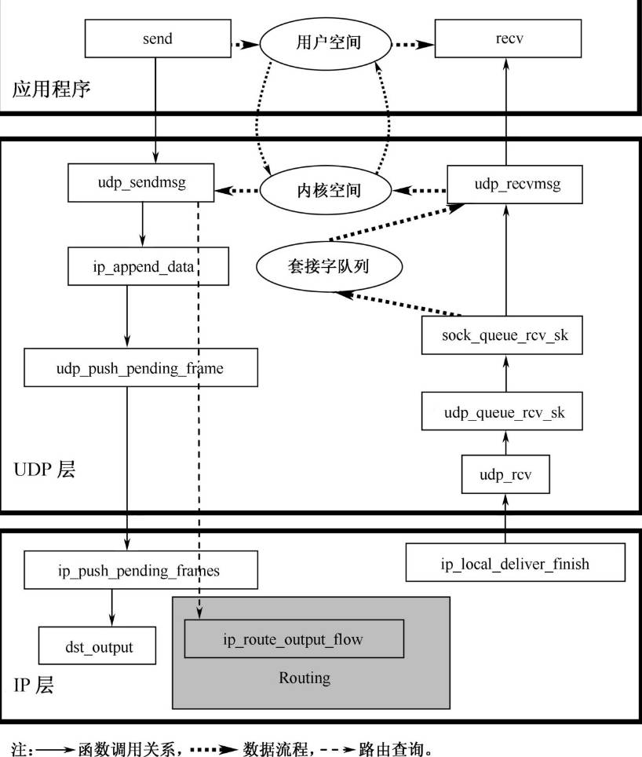

# UDP介绍
UDP是不可靠，无连接的数据包协议，不可靠仅仅意味着UDP中没有检查数据是否到达网络另一端的机制，在主机内，UDP可以保证正确的传递数据。

既然UDP是不可靠协议，为什么应用程序还要选择UDP来做数据传输服务？
因为如果要发送的数据量很小，创建连接的开销，保证可靠发送需要的工作可能比发送数据本身的工作量还要大很多时，UDP就是一个很好的选择。
有的应用程序本身具有保证数据可靠发送的机制，不要求传输层提供这方面服务，这时UDP也是一个很好的选择。
另外一些面向业务的应用程序，如DNS，这类应用程序中，只有一个请求和相关回答需要发送，这时建立连接和维护连接的开销太大，那么UDP也适用于这类应用。

# 核心数据结构
UDP 协议头
```c
struct udphdr {
	__be16	source;
	__be16	dest;
	// 整个数据包的长度，包括协议头和负载数据
	__be16	len;
	// 对协议头和负载数据的校验和
	__sum16	check;
};
```

UDP控制缓冲区
sk_buff结构中有一个控制缓存区，让协议栈存放私有数据，
UDP有自己控制缓存，用于指明UDP协议实例进行校验和的方式等信息

访问udp_skb_cb，通过宏 udp_skb_cb(skb)
```c
struct udp_skb_cb {
	// IPv4 和 IPv6 的选项信息
	union {
		struct inet_skb_parm	h4;
#if defined(CONFIG_IPV6) || defined (CONFIG_IPV6_MODULE)
		struct inet6_skb_parm	h6;
#endif
	} header;
	// UDP计算校验和时，覆盖的UDP数据包长度
	__u16		cscov;
	// 如果设置了这个域，说明只计算部分校验和
	__u8		partial_cov;
};
```

UDP套接字结构
```c
struct udp_sock {
	// AF_INET套接字通用特性
	struct inet_sock inet;
	// 当前是否有等待发送的数据包
	int		 pending;	/* Any pending frames ? */
	// 当前是否需要暂时阻塞套接字
	unsigned int	 corkflag;	/* Cork is required */
	// 此套接字是否为封装的套接字
  	__u16		 encap_type;	/* Is this an Encapsulation socket? */
	/*
	 * Following member retains the information to create a UDP header
	 * when the socket is uncorked.
	 */
	// 等待发送的数据包的总长度
	__u16		 len;		/* total length of pending frames */
	/*
	 * Fields specific to UDP-Lite.
	 */
	// 用于轻UDP套接字创建，
	// pcslen指明当前UDP套接字中等待发送的数据包长度
	// pcrlen 指明当前套接字等待接受的数据包长度
	__u16		 pcslen;
	__u16		 pcrlen;
/* indicator bits used by pcflag: */
#define UDPLITE_BIT      0x1  		/* set by udplite proto init function */
#define UDPLITE_SEND_CC  0x2  		/* set via udplite setsockopt         */
#define UDPLITE_RECV_CC  0x4		/* set via udplite setsocktopt        */
	__u8		 pcflag;        /* marks socket as UDP-Lite if > 0    */
	__u8		 unused[3];
	/*
	 * For encapsulation sockets.
	 */
	// UDP套接字的接受函数
	int (*encap_rcv)(struct sock *sk, struct sk_buff *skb);
};
```

# UDP的接口
## UDP和套接字层的接口
UDP和套接字接口由 struct proto数据结构描述。
数据结构的虚函数如下:
| struct proto 的数据域 | UDP 协议实例的函数 |
| --- | --- |
| close | udp_lib_close |
| connect | ip4_datagram_connect |
| disconnect | udp_disconnect |
| ioctl | udp_ioctl |
| destroy | udp_destroy_sock |
| setsockopt | udp_setsockopt |
| setsockopt | udp_setsockopt |
| getsockopt | udp_getsockopt |
| sendmsg | udp_sendmsg |
| recvmsg | udp_recvmsg |
| sendpage | udp_sendpage |
| backlog_rcv | \_\_udp_queue_rcv_skb |
| hash | udp_lib_hash |
| unhash | udp_lib_unhash |
| get_port | udp_v4_get_port |


由于UDP是无连接套接字，所以它对连接的管理和状态管理比TCP简单很多。
从udp_lib_close 到 udp_destroy_sock 这5个函数用于管理套接字连接。
udp_sendmsg , udp_recvmsg 实现UDP套接字上数据包的发送和接受
在UDP接受期间，必须确定接受到的数据包应该发送给哪个套接字，以便将数据包放入套接字接受队列，随后用户读取。
为了实现接受数据包和套接字的匹配，UDP上打开的所有套接字由 udp_lib_hash函数注册到 struct sock_hash[UDP_HTABLE_SIZE]哈希链表中，端口号是查询哈希链表的hash值，在释放套接字时，调用 udp_lib_unhash, 将套接字结构从UDP 哈希链表中移出。

注册接口
```c
struct proto udp_prot = {
	.name		   = "UDP",
	.owner		   = THIS_MODULE,
	.close		   = udp_lib_close,
	.connect	   = ip4_datagram_connect,
	.disconnect	   = udp_disconnect,
	.ioctl		   = udp_ioctl,
	.destroy	   = udp_destroy_sock,
	.setsockopt	   = udp_setsockopt,
	.getsockopt	   = udp_getsockopt,
	.sendmsg	   = udp_sendmsg,
	.recvmsg	   = udp_recvmsg,
	.sendpage	   = udp_sendpage,
	.backlog_rcv	   = __udp_queue_rcv_skb,
	.hash		   = udp_lib_hash,
	.unhash		   = udp_lib_unhash,
	.get_port	   = udp_v4_get_port,
	.memory_allocated  = &udp_memory_allocated,
	.sysctl_mem	   = sysctl_udp_mem,
	.sysctl_wmem	   = &sysctl_udp_wmem_min,
	.sysctl_rmem	   = &sysctl_udp_rmem_min,
	.obj_size	   = sizeof(struct udp_sock),
	.slab_flags	   = SLAB_DESTROY_BY_RCU,
	.h.udp_table	   = &udp_table,
#ifdef CONFIG_COMPAT
	.compat_setsockopt = compat_udp_setsockopt,
	.compat_getsockopt = compat_udp_getsockopt,
#endif
};

static int __init inet_init(void)
{
	...

	rc = proto_register(&udp_prot, 1);

	...
}
```

## UDP和IP层之间的接口
IP和UDP之间接受数据包的接口由 struct net_protocol描述。
net_protocol 定义了一系列函数指针，都是传输层接受来自网络层数据包的处理函数

在Linux中，要添加一个新的协议，实现起来非常容易，常规步骤为：
1. 按照新协议规范拟定新协议实例需要实现的接受函数
2. 定义 struct net_protocol 变量实例, 如 struct net_protocol my_protocol
3. 将struct net_protocol 实例的函数指针初始化
4. 用接口注册函数 inet_addr_protocol将新协议接口 my_protocol 加入全局数组 struct net_protocol \*inet_protos[MAX_INET_PROTOS];
5. 实现各接口函数

UDP的 struct net_protocol: 
```c
static struct net_protocol udp_protocol = {
	.handler =	udp_rcv,  //  UDP协议接受数据包
	.err_handler =	udp_err, // 处理ICMP错误信息
	.no_policy =	1,
	.netns_ok =	1,
};
```

```c
static int __init inet_init(void)
{
	...

	if (inet_add_protocol(&udp_protocol, IPPROTO_UDP) < 0)
		printk(KERN_CRIT "inet_init: Cannot add UDP protocol\n");

	...
}
```
UDP 和IP层之间没有定义发送接口，为了通过IP层发送数据，UDP协议实例在udp_sendmsg函数中调用IP层发送数据包的回调函数 ip_append_data, 或udp_sendpage 函数中调用 IP 层的回调函数 ip_append_page，将UDP数据包放入IP层。

# 发送UDP数据包的实现
## 初始化一个连接
UDP虽然不提供连接，但是提供connect函数，当用户调用connect后，使用send函数时就不需要传入目标地址。

在UDP协议上支持connect的主要目的是建立到达目标地址的路由，并把该路由放入路由高速缓冲器中。一旦路由建立，接下来通过UDP套接字发送数据包时，就可以直接使用路由高速缓冲区中的信息，这种方式称为快路径。

当在一个打开的 SOCK_DGRAM 类套接字上调用 connect时，套接字层会转而调用 ip4_datagram_connect

```c
// uaddr : 当前UDP套接字要与之创建路由的目标地址
int ip4_datagram_connect(struct sock *sk, struct sockaddr *uaddr, int addr_len)
{
	struct inet_sock *inet = inet_sk(sk); // 转换为AF_INET 套接字
	struct sockaddr_in *usin = (struct sockaddr_in *) uaddr; // IPv4 地址
	struct rtable *rt; // 路由高速缓冲区的入口地址
	__be32 saddr; // 
	int oif; // 输出网络设备的索引号
	int err;

	//  过滤非法目标地址
	if (addr_len < sizeof(*usin))
		return -EINVAL;

	if (usin->sin_family != AF_INET)
		return -EAFNOSUPPORT;

	// 复位sk->sk_dst_cache
	sk_dst_reset(sk);

	// 如果套接字绑定了输出设置，获得输出设备的索引号
	oif = sk->sk_bound_dev_if;
	saddr = inet->saddr;

	// 如果目标地址是组播地址
	if (ipv4_is_multicast(usin->sin_addr.s_addr)) {
		if (!oif)
			oif = inet->mc_index;
		if (!saddr)
			saddr = inet->mc_addr;
	}

	// 为连接寻找路由，成功的话就将路由放入缓冲
	err = ip_route_connect(&rt, usin->sin_addr.s_addr, saddr,
			       RT_CONN_FLAGS(sk), oif,
			       sk->sk_protocol,
			       inet->sport, usin->sin_port, sk, 1);
	if (err) {
		if (err == -ENETUNREACH)
			IP_INC_STATS_BH(sock_net(sk), IPSTATS_MIB_OUTNOROUTES);
		return err;
	}

	// 如果路由为广播地址路由，则释放路由在路由缓冲的入口，返回错误 
	if ((rt->rt_flags & RTCF_BROADCAST) && !sock_flag(sk, SOCK_BROADCAST)) {
		ip_rt_put(rt);
		return -EACCES;
	}
	// 根据路由条目获得的信息更新UDP连接的源地址和目的地址
	if (!inet->saddr)
		inet->saddr = rt->rt_src;	/* Update source address */
	if (!inet->rcv_saddr)
		inet->rcv_saddr = rt->rt_src;
	inet->daddr = rt->rt_dst;
	inet->dport = usin->sin_port;
	// 将套接字状态设置为TCP_ESTABLISHED，说明目标路由已经缓存
	sk->sk_state = TCP_ESTABLISHED;
	inet->id = jiffies;

	// 路由在高速缓存中的入口保存在 sk->sk_dst_cache
	sk_dst_set(sk, &rt->u.dst);
	return(0);
}
```

## 在UDP套接字上发送数据包
UDP处理发送请求的特点是：
* 不缓存数据
* 不管理连接
* 当创建UDP协议头时，只需要数据包的源端口和目标端口

```c
/*
 * iocb : 为提高对用户空间操作效率
 */
int udp_sendmsg(struct kiocb *iocb, struct sock *sk, struct msghdr *msg,
		size_t len)
{
	struct inet_sock *inet = inet_sk(sk);
	struct udp_sock *up = udp_sk(sk);
	int ulen = len;
	// 用于存放从IP层的ICMP协议返回的控制消息值
	struct ipcm_cookie ipc;
	struct rtable *rt = NULL;
	int free = 0;
	int connected = 0;
	__be32 daddr, faddr, saddr;
	__be16 dport;
	u8  tos;
	int err, is_udplite = IS_UDPLITE(sk);
	// 是否需要阻塞等待更多数据，构成一个包发送，还是收到数据就发送，这样就会发送多个包
	int corkreq = up->corkflag || msg->msg_flags&MSG_MORE;
	// UDP没有分段，使用IP层的分片，以满足MTU
	int (*getfrag)(void *, char *, int, int, int, struct sk_buff *);

	// 检查用户数据是否非法
	// udphdr->len 为16bit，支持最大长度 0xFFFF
	if (len > 0xFFFF)
		return -EMSGSIZE;
	// MSG_OOB是唯一TCP支持，但UDP不支持的flag
	if (msg->msg_flags&MSG_OOB)	/* Mirror BSD error message compatibility */
		return -EOPNOTSUPP;

	// IP层选项
	ipc.opt = NULL;

	// 查看是否有待发送的数据
	// 如果有待发送的数据包，则将新数据加入已有数据包并发送
	if (up->pending) {
		lock_sock(sk);
		if (likely(up->pending)) {
			if (unlikely(up->pending != AF_INET)) {
				release_sock(sk);
				return -EINVAL;
			}
			goto do_append_data;
		}
		release_sock(sk);
	}

	// 没有待发送的缓存的数据

	// udp 长度为 用户数据len + udp协议头长度
	ulen += sizeof(struct udphdr);

	//  检查目标地址
	if (msg->msg_name) {
		// 如果指定了目标地址，则从msg->msg_name 获得目标地址

		struct sockaddr_in * usin = (struct sockaddr_in*)msg->msg_name;
		if (msg->msg_namelen < sizeof(*usin))
			return -EINVAL;
		if (usin->sin_family != AF_INET) {
			if (usin->sin_family != AF_UNSPEC)
				return -EAFNOSUPPORT;
		}

		daddr = usin->sin_addr.s_addr;
		dport = usin->sin_port;
		if (dport == 0)
			return -EINVAL;
	} else {
		// 如果没有指定目标地址，则需要套接字已经建立了连接
		if (sk->sk_state != TCP_ESTABLISHED)
			return -EDESTADDRREQ;
		daddr = inet->daddr;
		dport = inet->dport;
		// 如果套接字已经建立连接，意味着目标路由已经缓存
		connected = 1;
	}
	// 保存输出设备的IP地址
	ipc.addr = inet->saddr;

	// 保存输出设备的索引号
	ipc.oif = sk->sk_bound_dev_if;
	if (msg->msg_controllen) {
		// 处理控制信息，如IP选项
		err = ip_cmsg_send(sock_net(sk), msg, &ipc);
		if (err)
			return err;
		if (ipc.opt)
			free = 1;
		connected = 0;
	}
	// 如果没有控制信息，则从inet选项中获得控制信息
	if (!ipc.opt)
		ipc.opt = inet->opt;

	saddr = ipc.addr;
	ipc.addr = faddr = daddr;

	// 如果设置源路由，则下一个站点从源路由的IP地址列表中获取
	if (ipc.opt && ipc.opt->srr) {
		if (!daddr)
			return -EINVAL;
		// 如果设置源路由，则下一个站点从源路由的IP地址列表中获取
		faddr = ipc.opt->faddr;
		connected = 0;
	}
	tos = RT_TOS(inet->tos);

	// connected为0，指不使用缓存的路由，也不缓存路由
	if (sock_flag(sk, SOCK_LOCALROUTE) ||  /* 数据包在本地局域网传输 */
	    (msg->msg_flags & MSG_DONTROUTE) || /* msg_flags指明不需要路由 */
	    (ipc.opt && ipc.opt->is_strictroute)) { /* 设置严格路由 */
		tos |= RTO_ONLINK;
		connected = 0;
	}

	// 目标地址是组播也不需要路由
	if (ipv4_is_multicast(daddr)) {
		if (!ipc.oif)
			ipc.oif = inet->mc_index;
		if (!saddr)
			saddr = inet->mc_addr;
		connected = 0;
	}

	// 如果已经缓存了路由，检查路由是否有效，并获得sock缓存的路由
	if (connected)
		rt = (struct rtable*)sk_dst_check(sk, 0);

	// 如果缓存的路由无效或没有获得, 则查询路由
	if (rt == NULL) {
		struct flowi fl = { .oif = ipc.oif,
				    .nl_u = { .ip4_u =
					      { .daddr = faddr,
						.saddr = saddr,
						.tos = tos } },
				    .proto = sk->sk_protocol,
				    .flags = inet_sk_flowi_flags(sk),
				    .uli_u = { .ports =
					       { .sport = inet->sport,
						 .dport = dport } } };
		struct net *net = sock_net(sk);

		security_sk_classify_flow(sk, &fl);
		err = ip_route_output_flow(net, &rt, &fl, sk, 1);
		if (err) {
			if (err == -ENETUNREACH)
				IP_INC_STATS_BH(net, IPSTATS_MIB_OUTNOROUTES);
			goto out;
		}

		err = -EACCES;
		if ((rt->rt_flags & RTCF_BROADCAST) &&
		    !sock_flag(sk, SOCK_BROADCAST))
			goto out;
		if (connected) // 如果调用过connect，则需要更新缓存路由
			sk_dst_set(sk, dst_clone(&rt->u.dst));
	}

	if (msg->msg_flags&MSG_CONFIRM)
		goto do_confirm;
back_from_confirm:

	// 根据路由信息，设置源地址和目的地址
	saddr = rt->rt_src;
	if (!ipc.addr)
		daddr = ipc.addr = rt->rt_dst;

	lock_sock(sk);
	if (unlikely(up->pending)) {
		//  已经处理了挂载的数据包，若运行到这里是个bug
		/* The socket is already corked while preparing it. */
		/* ... which is an evident application bug. --ANK */
		release_sock(sk);

		LIMIT_NETDEBUG(KERN_DEBUG "udp cork app bug 2\n");
		err = -EINVAL;
		goto out;
	}
	/*
	 *	Now cork the socket to pend data.
	 */
	inet->cork.fl.fl4_dst = daddr;
	inet->cork.fl.fl_ip_dport = dport;
	inet->cork.fl.fl4_src = saddr;
	inet->cork.fl.fl_ip_sport = inet->sport;
	up->pending = AF_INET;

do_append_data:
	up->len += ulen;
	// 如果是轻UDP 使用 udplite_getfrag 从用户空间复制数据片
	// 否则 用 ip_generic_getfrag
	getfrag  =  is_udplite ?  udplite_getfrag : ip_generic_getfrag;
	// 将数据追加到IP层缓存，方便进行分片
	err = ip_append_data(sk, getfrag, msg->msg_iov, ulen,
			sizeof(struct udphdr), &ipc, &rt,
			corkreq ? msg->msg_flags|MSG_MORE : msg->msg_flags);
	// 如果错误则释放缓存数据
	if (err)
		udp_flush_pending_frames(sk);
	// 如果没有错误并且不需要等待更多数据, 为每个分片构造UDP协议头并发送数据
	else if (!corkreq)
		err = udp_push_pending_frames(sk); 
	else if (unlikely(skb_queue_empty(&sk->sk_write_queue)))
		up->pending = 0;
	// 如果 corkreq 使用了MSG_MORE，则不会立即发送数据，
	// 等待下次加入更多数据构成一个UDP包，一起发送
	release_sock(sk);

out:
	ip_rt_put(rt);
	if (free)
		kfree(ipc.opt);
	if (!err)
		return len;
	/*
	 * ENOBUFS = no kernel mem, SOCK_NOSPACE = no sndbuf space.  Reporting
	 * ENOBUFS might not be good (it's not tunable per se), but otherwise
	 * we don't have a good statistic (IpOutDiscards but it can be too many
	 * things).  We could add another new stat but at least for now that
	 * seems like overkill.
	 */
	if (err == -ENOBUFS || test_bit(SOCK_NOSPACE, &sk->sk_socket->flags)) {
		UDP_INC_STATS_USER(sock_net(sk),
				UDP_MIB_SNDBUFERRORS, is_udplite);
	}
	return err;

do_confirm:
	dst_confirm(&rt->u.dst);
	if (!(msg->msg_flags&MSG_PROBE) || len)
		goto back_from_confirm;
	err = 0;
	goto out;
}
```

### 从用户空间复制数据片
ip_generic_getfrag 用于从用户空间复制数据片，并追加到数据报中

在内核中，TCP/IP协议栈将数据直接从用户空间复制到内核空间socket buffer中，避免对同一数据的两次复制。

```c
int
ip_generic_getfrag(void *from, char *to, int offset, int len, int odd, struct sk_buff *skb)
{
	// 用户空间可以提供一个或多个分散存储的数据包，一起当作数据片进复制
	struct iovec *iov = from;

	if (skb->ip_summed == CHECKSUM_PARTIAL) {
		// 如果网络设备可以计算校验和，使用 memcpy_fromiovecend
		// 只复制，不计算校验和
		if (memcpy_fromiovecend(to, iov, offset, len) < 0)
			return -EFAULT;
	} else {
		__wsum csum = 0;
		// 计算校验和并复制数据
		if (csum_partial_copy_fromiovecend(to, iov, offset, len, &csum) < 0)
			return -EFAULT;
		// 将计算出的校验和存放在 skb->csum
		// UDP校验和包括UDP头，IP头，用户数据，因此计算校验和分成三个阶段
		// 1. 计算数据校验和
		// 2. 加入对实际UDP协议头校验和的计算
		// 3. 加入对IP协议头校验和的计算
		skb->csum = csum_block_add(skb->csum, csum, odd);
	}
	return 0;
}
```
UDP计算校验和


# UDP接受的实现
UDP层和IP层之间的接口是udp_protocol，接受函数是udp_protocol->handler = udp_rcv, 
UDP层和套接字层之间的接口是udp_prot，接受函数是udp_prot->recvmsg = udp_recvmsg


## 从IP层到UDP层

\_\_udp4_lib_rcv是UDP接受IP层数据包真实的工作函数，这时是从内核空间向用户空间复制数据，UDP协议需要确定接受数据包的用户进程。用户进程由与UDP协议头中的目的端口号相匹配的套接字给出，每个打开的套接字都保存在UDP哈希链表中，便于查找
```c
int udp_rcv(struct sk_buff *skb)
{
	return __udp4_lib_rcv(skb, &udp_table, IPPROTO_UDP);
}

// udp_table : UDP 哈希表
int __udp4_lib_rcv(struct sk_buff *skb, struct udp_table *udptable,
		   int proto)
{
	struct sock *sk;
	struct udphdr *uh;
	unsigned short ulen; // UDP数据包的长度，包括协议头和负载数据
	struct rtable *rt = (struct rtable*)skb->dst;
	__be32 saddr, daddr;
	struct net *net = dev_net(skb->dev);

	// 对数据包进行合法性检查
	// 检查socket buffer 剩余的空间是否有 UDP协议头长度大小, 没有则丢弃包
	if (!pskb_may_pull(skb, sizeof(struct udphdr)))
		goto drop;		/* No space for header. */

	// 此时 skb->data = skb->transport_header 指向传输层协议头
	uh   = udp_hdr(skb);
	// 获得整个UDP包的长度 ulen
	// 过滤掉非法数据包
	ulen = ntohs(uh->len);
	if (ulen > skb->len)
		goto short_packet;

	if (proto == IPPROTO_UDP) {
		/* UDP validates ulen. */
		if (ulen < sizeof(*uh) || pskb_trim_rcsum(skb, ulen))
			goto short_packet;
		uh = udp_hdr(skb);
	}

	// 检查校验和是否正确
	if (udp4_csum_init(skb, uh, proto))
		goto csum_error;

	// 从IP协议头获得源IP和目标IP
	saddr = ip_hdr(skb)->saddr;
	daddr = ip_hdr(skb)->daddr;

	// 如果此数据包为广播或组播UDP，则使用__udp4_lib_mcast_deliver完成接受
	if (rt->rt_flags & (RTCF_BROADCAST|RTCF_MULTICAST))
		return __udp4_lib_mcast_deliver(net, skb, uh,
				saddr, daddr, udptable);

	// 查找是否有套接字在等待接受此数据包 
	// __udp4_lib_lookup_skb 使用UDP协议头目的端口查哈希表udptable，
	// 查找是否有打开的套接字，
	// 如果有则调用 udp_queue_rcv_skb 将数据包发送到套接字的接受缓冲区队列
	sk = __udp4_lib_lookup_skb(skb, uh->source, uh->dest, udptable);

	if (sk != NULL) {
		// 将数据包发送到套接字的接受缓冲区队列
		int ret = udp_queue_rcv_skb(sk, skb);
		sock_put(sk);

		/* a return value > 0 means to resubmit the input, but
		 * it wants the return to be -protocol, or 0
		 */
		if (ret > 0)
			return -ret;
		return 0;
	}

	// 没有接受此数据包的套接字

	if (!xfrm4_policy_check(NULL, XFRM_POLICY_IN, skb))
		goto drop;
	nf_reset(skb);

	/* No socket. Drop packet silently, if checksum is wrong */
	// 完成校验和计算，如果发现数据包损坏则丢弃
	if (udp_lib_checksum_complete(skb))
		goto csum_error;

	// 更新错误统计信息
	UDP_INC_STATS_BH(net, UDP_MIB_NOPORTS, proto == IPPROTO_UDPLITE);
	// 向发送方端口发送ICMP不可达
	icmp_send(skb, ICMP_DEST_UNREACH, ICMP_PORT_UNREACH, 0);

	kfree_skb(skb);
	return 0;

short_packet:
	LIMIT_NETDEBUG(KERN_DEBUG "UDP%s: short packet: From %pI4:%u %d/%d to %pI4:%u\n",
		       proto == IPPROTO_UDPLITE ? "-Lite" : "",
		       &saddr,
		       ntohs(uh->source),
		       ulen,
		       skb->len,
		       &daddr,
		       ntohs(uh->dest));
	goto drop;

csum_error:
	/*
	 * RFC1122: OK.  Discards the bad packet silently (as far as
	 * the network is concerned, anyway) as per 4.1.3.4 (MUST).
	 */
	LIMIT_NETDEBUG(KERN_DEBUG "UDP%s: bad checksum. From %pI4:%u to %pI4:%u ulen %d\n",
		       proto == IPPROTO_UDPLITE ? "-Lite" : "",
		       &saddr,
		       ntohs(uh->source),
		       &daddr,
		       ntohs(uh->dest),
		       ulen);
drop:
	UDP_INC_STATS_BH(net, UDP_MIB_INERRORS, proto == IPPROTO_UDPLITE);
	kfree_skb(skb);
	return 0;
}
```

## 从UDP层到套接字层
\_\_udp4_lib_rcv确认数据包合法，且通过校验后，根据目标端口号查询打开的套接字，如果找到了接受套接字，则调用 udp_queue_rcv_skb 将数据包发送到套接字的接受缓冲区队列

udp_queue_rcv_skb 根据套接字是轻套接字还是常规套接字，来确定数据包的接受函数，当套接字是常规套接字时，接受函数执行的关键步骤为：
1. 锁定套接字
2. 获取等待接受数据包的用户进程
3. 数据包放入套接字接受队列 

如果udp_queue_rcv_skb获取用户进程成功，则数据由\_\_udp_queue_rcv_skb放入套接字接受缓存队列
如果没有获取等待接受数据包的用户进程，则将数据包放入套接字的backlog队列，等待以后的套接字接受

```c
int udp_queue_rcv_skb(struct sock * sk, struct sk_buff *skb)
{
	struct udp_sock *up = udp_sk(sk);
	int rc;
	int is_udplite = IS_UDPLITE(sk);

	if (!xfrm4_policy_check(sk, XFRM_POLICY_IN, skb))
		goto drop;
	nf_reset(skb);

	// 如果数据包是IPsec封装的，则需要将数据提取出来，再接受
	if (up->encap_type) {
		/* if we're overly short, let UDP handle it */
		if (skb->len > sizeof(struct udphdr) &&
		    up->encap_rcv != NULL) {
			int ret;

			ret = (*up->encap_rcv)(sk, skb);
			if (ret <= 0) {
				UDP_INC_STATS_BH(sock_net(sk),
						 UDP_MIB_INDATAGRAMS,
						 is_udplite);
				return -ret;
			}
		}

		/* FALLTHROUGH -- it's a UDP Packet */
	}

	if ((is_udplite & UDPLITE_RECV_CC)  &&  UDP_SKB_CB(skb)->partial_cov) {

		if (up->pcrlen == 0) {          /* full coverage was set  */
			LIMIT_NETDEBUG(KERN_WARNING "UDPLITE: partial coverage "
				"%d while full coverage %d requested\n",
				UDP_SKB_CB(skb)->cscov, skb->len);
			goto drop;
		}

		if (UDP_SKB_CB(skb)->cscov  <  up->pcrlen) {
			LIMIT_NETDEBUG(KERN_WARNING
				"UDPLITE: coverage %d too small, need min %d\n",
				UDP_SKB_CB(skb)->cscov, up->pcrlen);
			goto drop;
		}
	}

	if (sk->sk_filter) {
		if (udp_lib_checksum_complete(skb))
			goto drop;
	}

	rc = 0;

	bh_lock_sock(sk);
	if (!sock_owned_by_user(sk)) // 如果套接字上有等待接受的进程
		rc = __udp_queue_rcv_skb(sk, skb); // 把数据包放入套接字接受缓冲区队列
	else
		sk_add_backlog(sk, skb); // 没有，则将数据包放入套接字的backlog队列
	bh_unlock_sock(sk);

	return rc;

drop:
	UDP_INC_STATS_BH(sock_net(sk), UDP_MIB_INERRORS, is_udplite);
	kfree_skb(skb);
	return -1;
}
```

## UDP接受广播或组播
组播和广播数据包可以发送给多个目标，在同一个主机上就可能有多个目标端口在等待接受数据包，当UDP处理组播和广播数据包时，协议接受函数查看是否有多个打开的套接字要接受该数据包。

当对输入数据包查询路由，发现路由标志为组播或广播时，UDP接受函数就调用 \_\_udp4_lib_mcast_deliver，将数据包发送给所有有效的监听套接字。函数会遍历UDP哈希链表，找到所有接受数据包的套接字

```c
static int __udp4_lib_mcast_deliver(struct net *net, struct sk_buff *skb,
				    struct udphdr  *uh,
				    __be32 saddr, __be32 daddr,
				    struct udp_table *udptable)
{
	struct sock *sk;
	// 使用数据包目的端口做hash，得到哈希队列
	struct udp_hslot *hslot = &udptable->hash[udp_hashfn(net, ntohs(uh->dest))];
	int dif;

	spin_lock(&hslot->lock);
	sk = sk_nulls_head(&hslot->head);
	dif = skb->dev->ifindex;
	sk = udp_v4_mcast_next(net, sk, uh->dest, daddr, uh->source, saddr, dif);
	if (sk) {
		// 找到第一个匹配的套接字
		struct sock *sknext = NULL;

		do {
			// 遍历UDP哈希链表，每找到一个匹配的套接字，就复制一个数据包放入套接字输入缓存队列
			struct sk_buff *skb1 = skb;

			sknext = udp_v4_mcast_next(net, sk_nulls_next(sk), uh->dest,
						   daddr, uh->source, saddr,
						   dif);
			if (sknext)
				skb1 = skb_clone(skb, GFP_ATOMIC);

			if (skb1) {
				int ret = udp_queue_rcv_skb(sk, skb1);
				if (ret > 0)
					/* we should probably re-process instead
					 * of dropping packets here. */
					kfree_skb(skb1);
			}
			sk = sknext;
		} while (sknext);
	} else
		kfree_skb(skb);
	spin_unlock(&hslot->lock);
	return 0;
}
```

# UDP哈希链表
UDP哈希链表用于解决通过数据包目的端口快速找到接受数据包的一个或多个套接字

```c
struct udp_hslot {
	struct hlist_nulls_head	head;
	spinlock_t		lock;
} __attribute__((aligned(2 * sizeof(long))));

struct udp_table {
	struct udp_hslot	hash[UDP_HTABLE_SIZE];
};

extern struct udp_table udp_table;
```

## 查找

```c
static inline struct sock *__udp4_lib_lookup_skb(struct sk_buff *skb,
						 __be16 sport, __be16 dport,
						 struct udp_table *udptable)
{
	struct sock *sk;
	const struct iphdr *iph = ip_hdr(skb);

	if (unlikely(sk = skb_steal_sock(skb)))
		return sk;
	else
		return __udp4_lib_lookup(dev_net(skb->dst->dev), iph->saddr, sport,
					 iph->daddr, dport, inet_iif(skb),
					 udptable);
}

static struct sock *__udp4_lib_lookup(struct net *net, __be32 saddr,
		__be16 sport, __be32 daddr, __be16 dport,
		int dif, struct udp_table *udptable)
{
	struct sock *sk, *result;
	struct hlist_nulls_node *node;
	// 以目标端口求哈希
	unsigned short hnum = ntohs(dport);
	unsigned int hash = udp_hashfn(net, hnum);
	struct udp_hslot *hslot = &udptable->hash[hash];
	int score, badness;

	rcu_read_lock();
begin:
	result = NULL;
	badness = -1;
	// 找到最合适的套接字，首先目标端口满足，在比较源IP，目标IP，
	// 输入设备索引号。
	sk_nulls_for_each_rcu(sk, node, &hslot->head) {
		score = compute_score(sk, net, saddr, hnum, sport,
				      daddr, dport, dif);
		if (score > badness) {
			result = sk; // 最优套接字
			badness = score; // 次优套接字的得分
		}
	}
	/*
	 * if the nulls value we got at the end of this lookup is
	 * not the expected one, we must restart lookup.
	 * We probably met an item that was moved to another chain.
	 */
	// 如果哈希链表槽的hash值，与用于搜索的hash值不匹配，重新开始搜索
	if (get_nulls_value(node) != hash)
		goto begin;

	if (result) {
		// 找到合适的套接字，对套接字引用计数加一
		if (unlikely(!atomic_inc_not_zero(&result->sk_refcnt)))
			result = NULL;
		else if (unlikely(compute_score(result, net, saddr, hnum, sport,
				  daddr, dport, dif) < badness)) {
			sock_put(result);
			goto begin;
		}
	}
	rcu_read_unlock();
	return result;
}

static inline int compute_score(struct sock *sk, struct net *net,
				const unsigned short hnum, const __be32 daddr,
				const int dif)
{
	int score = -1;
	struct inet_sock *inet = inet_sk(sk);

	// 如果套接字不是IPv6套接字 
	if (net_eq(sock_net(sk), net) && inet->num == hnum &&
			!ipv6_only_sock(sk)) {
		__be32 rcv_saddr = inet->rcv_saddr;
		// 比较地址类型，接受地址和目标地址，输入设备和套接字绑定设备
		score = sk->sk_family == PF_INET ? 1 : 0;
		if (rcv_saddr) {
			if (rcv_saddr != daddr)
				return -1;
			score += 2;
		}
		if (sk->sk_bound_dev_if) {
			if (sk->sk_bound_dev_if != dif)
				return -1;
			score += 2;
		}
	}
	return score;
}
```

# UDP数据包在套接字层的接受
当应用程序调用read来读取数据包时，套接字层就调用struct proto的 recvmsg数据域指向的函数完成读操作。对于UDP协议， recvmsg 指向 udp_recvmsg

```c
/*
 * iocb : 应用层IO控制缓冲区
 */
int udp_recvmsg(struct kiocb *iocb, struct sock *sk, struct msghdr *msg,
		size_t len, int noblock, int flags, int *addr_len)
{
	struct inet_sock *inet = inet_sk(sk);
	// 用于存放数据包源地址
	struct sockaddr_in *sin = (struct sockaddr_in *)msg->msg_name;
	struct sk_buff *skb;
	unsigned int ulen, copied;
	int peeked;
	int err;
	int is_udplite = IS_UDPLITE(sk);

	// 设置数据包源地址的长度
	if (addr_len)
		*addr_len=sizeof(*sin);

	// 如果套接字错误队列有信息需要处理，则处理错误信息
	if (flags & MSG_ERRQUEUE)
		return ip_recv_error(sk, msg, len);

try_again:
	// 从套接字缓冲区队列读取数据包
	// 如果读取到了数据包，skb指针指向它，
	// 如果没有数据包，skb 为空
	skb = __skb_recv_datagram(sk, flags | (noblock ? MSG_DONTWAIT : 0),
				  &peeked, &err);
	if (!skb)
		goto out;

	// 获得数据长度，去除udp协议头
	ulen = skb->len - sizeof(struct udphdr);
	// 一次调用要复制的长度
	copied = len;
	if (copied > ulen)
		copied = ulen;
	else if (copied < ulen)
		msg->msg_flags |= MSG_TRUNC;

	/*
	 * If checksum is needed at all, try to do it while copying the
	 * data.  If the data is truncated, or if we only want a partial
	 * coverage checksum (UDP-Lite), do it before the copy.
	 */

	// 如果只做部分校验，则先完成了校验在复制数据
	if (copied < ulen || UDP_SKB_CB(skb)->partial_cov) {
		if (udp_lib_checksum_complete(skb))
			goto csum_copy_err;
	}

	// 如果不做检验，则直接复制数据
	if (skb_csum_unnecessary(skb))
		err = skb_copy_datagram_iovec(skb, sizeof(struct udphdr),
					      msg->msg_iov, copied       );
	else {
		// 对数据包进行全校验，则复制数据同时完成校验
		err = skb_copy_and_csum_datagram_iovec(skb, sizeof(struct udphdr), msg->msg_iov);

		if (err == -EINVAL)
			goto csum_copy_err;
	}

	if (err)
		goto out_free;

	if (!peeked)
		UDP_INC_STATS_USER(sock_net(sk),
				UDP_MIB_INDATAGRAMS, is_udplite);

	// 标记接受时间戳
	sock_recv_timestamp(msg, sk, skb);

	/* Copy the address. */
	if (sin)
	{
		// 如果用户需要对端地址信息，则复制
		sin->sin_family = AF_INET;
		sin->sin_port = udp_hdr(skb)->source;
		sin->sin_addr.s_addr = ip_hdr(skb)->saddr;
		memset(sin->sin_zero, 0, sizeof(sin->sin_zero));
	}

	// 如果要处理IP选项，则调用ip_cmsg_recv完成IP选项值的提取
	// 例如,IP_TOS 选项要求把IP协议头复制到用户空间
	if (inet->cmsg_flags)
		ip_cmsg_recv(msg, skb);

	err = copied;
	if (flags & MSG_TRUNC)
		err = ulen;

out_free:
	// 数据复制错误
	lock_sock(sk);
	skb_free_datagram(sk, skb);
	release_sock(sk);
out:
	return err;

csum_copy_err:
	// 计算校验和错误，扔掉数据包，更新错误统计信息，释放用户进程持有的套接字
	lock_sock(sk);
	if (!skb_kill_datagram(sk, skb, flags))
		UDP_INC_STATS_USER(sock_net(sk), UDP_MIB_INERRORS, is_udplite);
	release_sock(sk);

	if (noblock)
		return -EAGAIN;
	goto try_again;
}

struct sk_buff *__skb_recv_datagram(struct sock *sk, unsigned flags,
				    int *peeked, int *err)
{
	struct sk_buff *skb;
	long timeo;
	/*
	 * Caller is allowed not to check sk->sk_err before skb_recv_datagram()
	 */
	int error = sock_error(sk);

	if (error)
		goto no_packet;

	// 获取套接字设置的接受超时时长
	timeo = sock_rcvtimeo(sk, flags & MSG_DONTWAIT);

	do {
		unsigned long cpu_flags;

		spin_lock_irqsave(&sk->sk_receive_queue.lock, cpu_flags);
		// 拷贝一个skb节点的指针，注意不会让skb出队列	
		skb = skb_peek(&sk->sk_receive_queue);
			struct sk_buff *list = ((struct sk_buff *)list_)->next;
			if (list == (struct sk_buff *)list_)
				list = NULL;
			return list;

		if (skb) {
		// 如果套接字接受队列有数据包，且没有设置MSG_PEEK
		// 则将数据包出队列
			*peeked = skb->peeked;
			if (flags & MSG_PEEK) {
				skb->peeked = 1;
				atomic_inc(&skb->users);
			} else
				__skb_unlink(skb, &sk->sk_receive_queue);
		}
		spin_unlock_irqrestore(&sk->sk_receive_queue.lock, cpu_flags);

		// 返回数据包
		if (skb)
			return skb;

		// 如果当前没有数据包，且没有超时，则阻塞等待
		error = -EAGAIN;
		if (!timeo)
			goto no_packet;

	} while (!wait_for_packet(sk, err, &timeo)); // 可能被信号打断

	return NULL;

no_packet:
	*err = error;
	return NULL;
}

static int wait_for_packet(struct sock *sk, int *err, long *timeo_p)
{
	int error;
	DEFINE_WAIT(wait);

	prepare_to_wait_exclusive(sk->sk_sleep, &wait, TASK_INTERRUPTIBLE);

	/* Socket errors? */
	error = sock_error(sk);
	if (error)
		goto out_err;

	if (!skb_queue_empty(&sk->sk_receive_queue))
		goto out;

	/* Socket shut down? */
	if (sk->sk_shutdown & RCV_SHUTDOWN)
		goto out_noerr;

	/* Sequenced packets can come disconnected.
	 * If so we report the problem
	 */
	error = -ENOTCONN;
	if (connection_based(sk) &&
	    !(sk->sk_state == TCP_ESTABLISHED || sk->sk_state == TCP_LISTEN))
		goto out_err;

	/* handle signals */
	if (signal_pending(current))
		goto interrupted;

	error = 0;
	*timeo_p = schedule_timeout(*timeo_p);
out:
	finish_wait(sk->sk_sleep, &wait);
	return error;
interrupted:
	error = sock_intr_errno(*timeo_p);
out_err:
	*err = error;
	goto out;
out_noerr:
	*err = 0;
	error = 1;
	goto out;
}
```

# 总结

udp_sendmsg 用户发送数据包
	ip_route_output_flow 查询路由
	ip_append_data 将要发送的报文交给IP层进行分割，并缓存
	udp_push_pending_frames 将分割好了的数据封装UDP协议头，发送给IP模块

