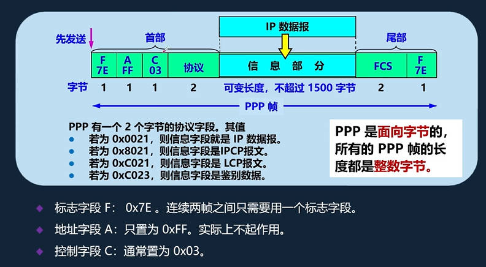
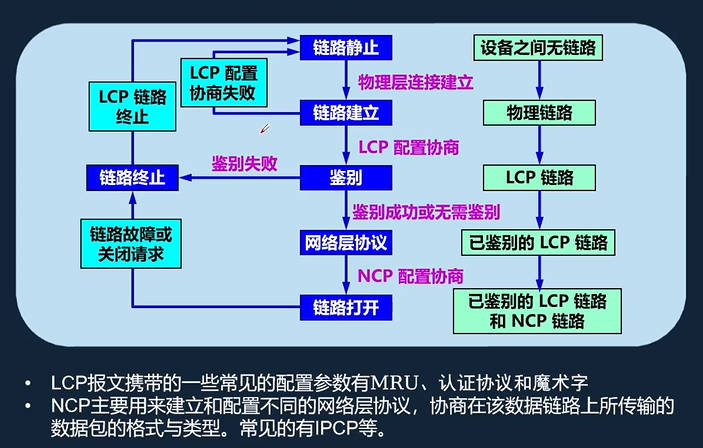
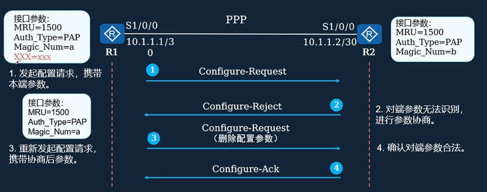
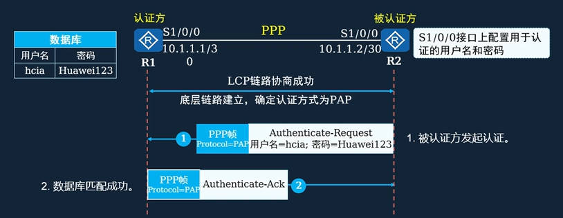
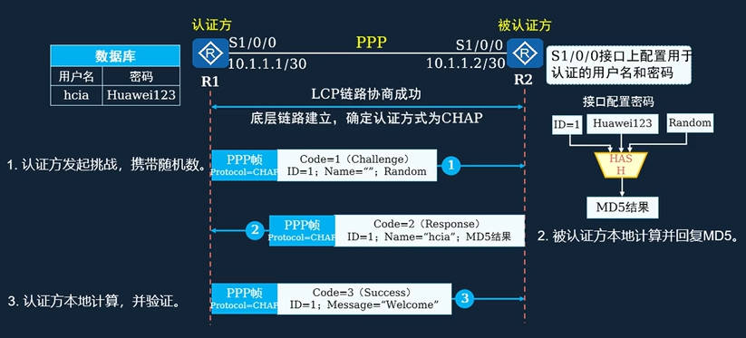
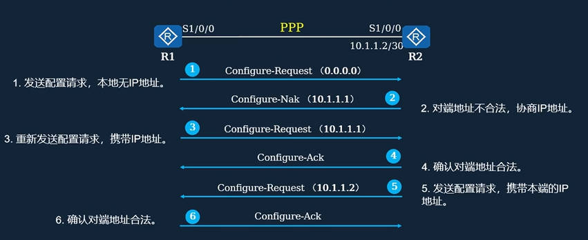
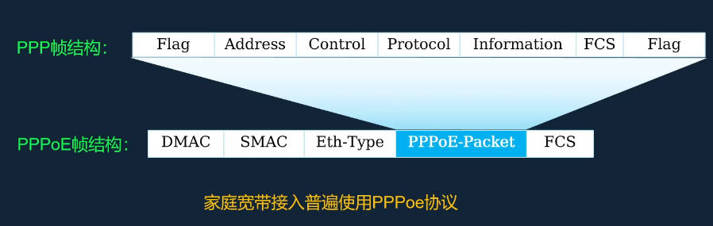
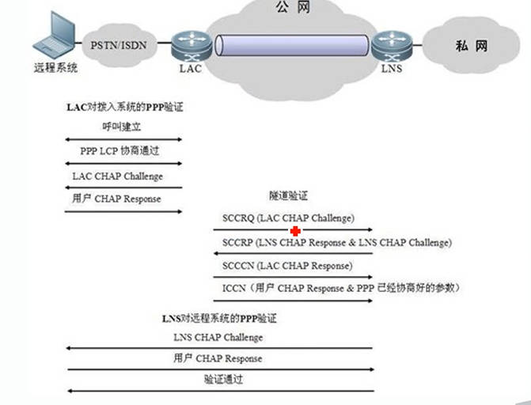
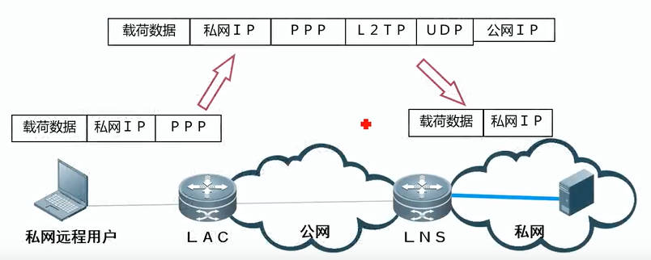

[[toc]]

# ppp 点对点协议
主要包含两部分：
- LCP: 链路控制协议，主要用于认证
- NCP: 网络控制协议，主要用于分配IP

帧格式

ppp 协议的工作流程


## LCP

LCP主要协商MRU，认证方式，必须相同

magic num 必须不同，magic num 用于检查回环链路，如果设备收到的magicNum 和自己一样，就认为发生了链路回环

下面是协商异常并自动调整的过程

主要注意响应方的：
Configure-Ack : 参数都能识别，且值在可接受
Configure-Nack : 参数都能识别，但是值不在可接受范围内
Configure-reject : 有未识别参数

## 认证

在LCP阶段会协商认证方式，有两种方式 ： PAP, CHAP

### PAP

被认证方直接发送用户名密码



### CHAP

认证方给被认证方一个随机数，被认证方用随机数结合用户名密码hash得到结果，传输用户名和hash结果



## NCP 申请IP



## pppoe

由于以太网没有认证机制，所以将ppp协议结合到以太网协议，得到 pppoe, 如此便可以实现认证上网



## 总结
ppp的组成 : LCP NCP
ppp的工作流程 : LCP，PAP/CHAP, NCP
pppoe协议: 以太网结合ppp，实现用户认证

# l2tp

l2tp本质是udp隧道 + 认证(PAP/CHAP/MSCHAP)

其中认证功能由 ppp 协议提供 

l2tp不提供加密，所以l2tp通常和ipsec一起使用。

```
20 bytes 8 bytes 16 bytes 2 bytes 20 bytes        +
+-------------------------------------------------+
|new IP |UDP TP  |L2TP TP|PPP    |original|Data   +
|header |header  |header |header |header  |       +
+-------------------------------------------------+
                 |         |                       
              |                 |                  
          |                          |             
      |                                   |        
  |                                            |   
0              7        12     16                31
+-------------------------------------------------+
|T|L|X|X|S|X|O|P|X|X|X|X| Ver |    Length(opt)    |
+-------------------------------------------------+
|           Tunnel ID         |     Session ID    |
+-------------------------------------------------+
|            Ns(opt)          |       Nr(opt)     |
+-------------------------------------------------+
|       offset size(opt)      |offset padding(opt)|
+-------------------------------------------------+
```

## 两种报文 

(可靠)控制报文用于隧道和会话的建立，维护和控制
(不可靠)数据报文：将用户数据封装成ppp帧并在隧道上传输

l2tp使用 hello包检查隧道的连通性，客户端定时发送hello包，若多次没有回复则拆除隧道

l2tp数据使用UDP传输。注册使用UDP 1701，但这个端口只用于初始隧道建立过程

## l2tp认证过程



## l2tp 和 ppp结合使用 



# pptp
