# 生成树协议
# 为什么要STP
交换机收到广播包，回给每个port发送一个拷贝（除了广播包的源port），当出现环路时，会出现广播风暴。

为了解决广播风暴

三层协议用 ttl 解决 

二层协议用 stp 解决 

如果使用单链路，存在无冗余的问题，即一条链路断了，必须人工连接另一条链路

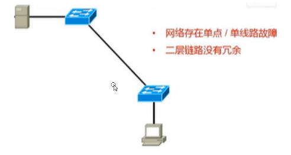

如果使用双链路，解决了冗余问题，但是带来ARP广播风暴

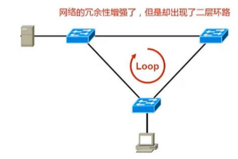

使用STP解决ARP广播风暴，原理是主链路工作正常时，不使用备份链路，当主链路断了，则自动启用备份链路

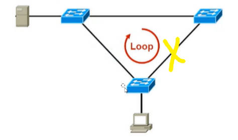

# 生成树工作流程

生成树的目的就是如何选哪条链路做备份。

流程

1. 确认桥角色
2. 确认端口角色
3. 封禁无角色端口
4. 当主链路断了，启动备用链路

## 桥的角色
桥的角色分为：根桥，非根桥

根桥: 生成发送BDPU包的桥, BDPU用于实现STP协议的包。

通过桥的桥优先级和MAC地址确定谁是根桥

优先级越小的做根桥，

优先级一样，比较MAC，MAC地址越小做根桥

如下场景，

1. 优先级都一样
2. 比较MAC地址，确定SW1 为根桥

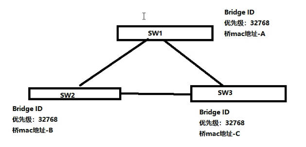

## 端口的角色
端口角色分为：根端口(RP)，指定端口(DP)

根端口: 用于接受BDPU包的端口

指定端口: 发送/转发BPDU包的端口

1. 非根桥的端口，选举一个作为根端口，选举标准为哪个端口距离根桥近，哪个做根端口
2. 每根链路上选举一个端口做指定端口, 其中根桥的端口一定都为指定端口

## 选举根端口

如何计算非根桥的端口和根桥的距离？

使用cost值。

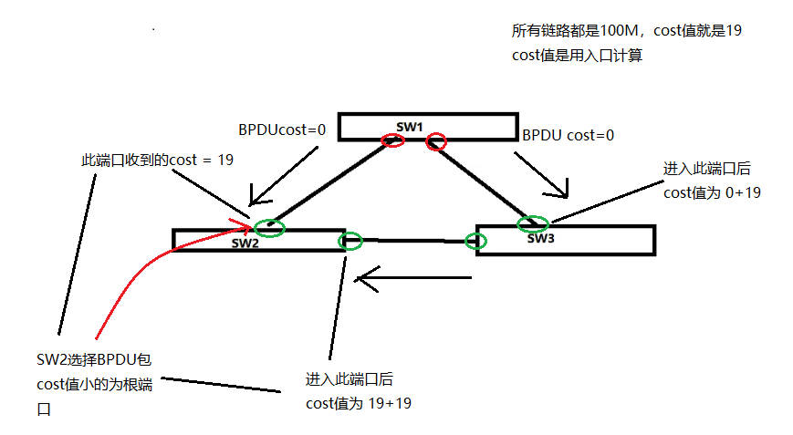

上面情况的根端口为

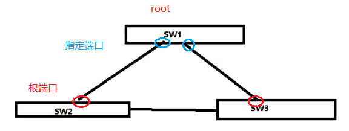

不同带宽的cost值

| port速率 | IEEE802.1d 标准 cost |
| -------- | -------------------- |
| 10Mbps   | 100                  |
| 100Mbps  | 19                  |
| 1000Mbps | 4                  |
| 10Gbps   | 2                  |
| 40Gbps   | 1                  |

当非根桥所有端口收到的BPDU的cost值一样，如何确定哪个端口为根端口？

根据BPDU发送者的优先级判断，优先级越小对应端口做根端口

如果优先级一样，则发送方MAC地址越小对应端口做根端口

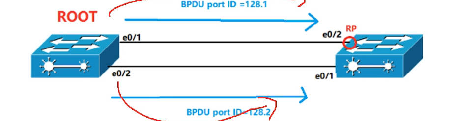

如果优先级一样(bridge id一样)，MAC地址一样，则发送这的 port id越小对应端口做根端口

port id 由两部分组成 : 接口优先级 + 接口编号

## 选举指定端口
有根桥端口的链路，根桥的端口为指定端口

对于没有根桥端口的链路，根据cost值比较，谁小谁做指定端口，cost值一样，比较优先级bridge id，有一样比较 mac

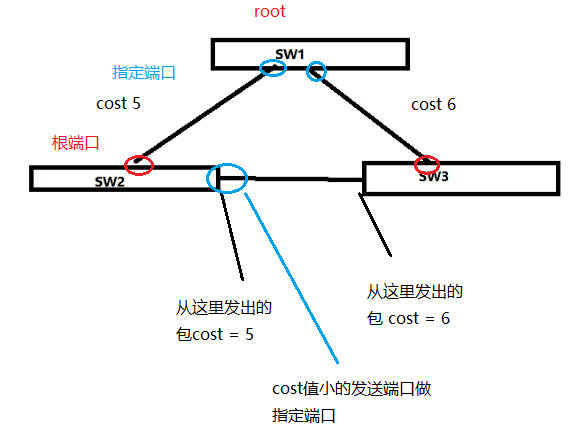

## 封掉没有角色的端口

没有角色的端口不能发送转发数据包，导致相关链路被禁用，链路无环，则无广播风暴

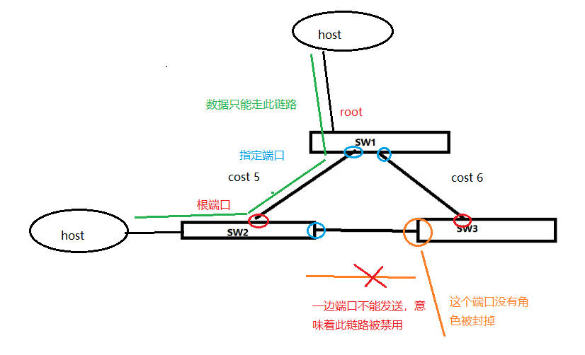

当主链路断了，备用链路启用，让网路有冗余

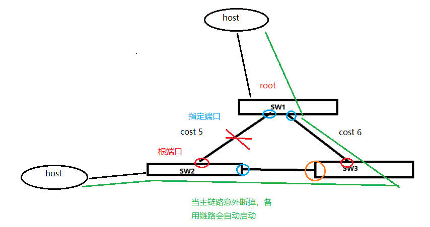

# BPDU
BPDU 包括内容

* ROOT ID 根桥ID，包含根桥优先级，根桥MAC地址，一直不变

* bridge id ，包含了转发者的优先级，桥MAC地址，传递时会改变

* port id, 端口ID 

* cost 值

根桥会每隔2s发送一次 BPDU

发送BPDU的示例

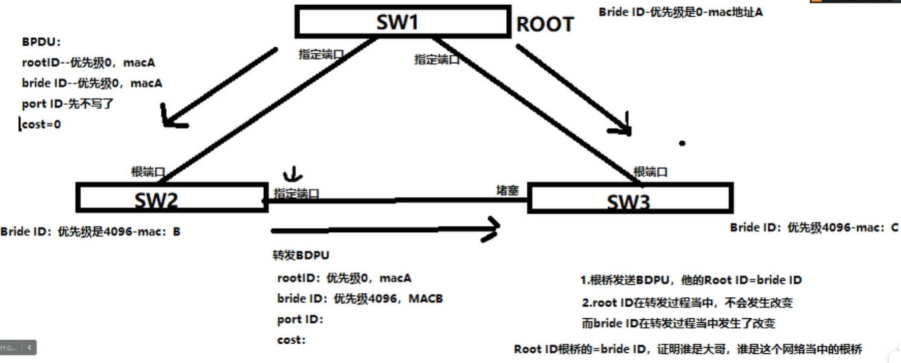

# 端口状态

## blocking 阻塞
switch刚开机，处于blocking状态，或者NDP端口。

可以接受BPDU，不转发BPDU，不学习mac地址，不转发数据包

## listening 监听
不接受，不转发数据，接受BPDU,发送BPDU，不学习mac地址，维持15s，以选举出端口角色

## learning 学习
不接受，不转发数据，学习mac地址，是 DP和 RP的状态, 维持15s

## forwarding 转发
接受数据，转发数据，学习mac地址，转发接受BPDU 

## disable 禁用
不接受任何报文，链路断了

## 状态转换

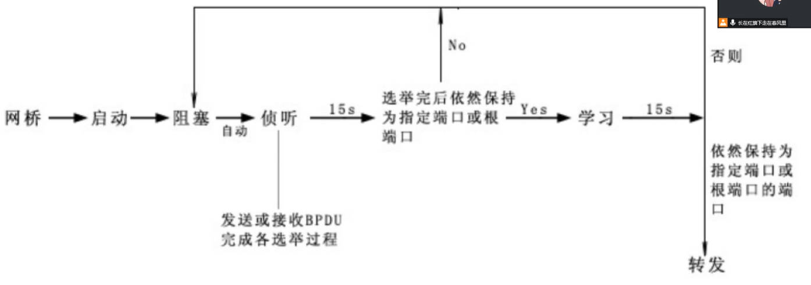

为什么 learning 状态要维持 15s，不立即转发数据？

因为此时桥没有MAC转发表，会导致大量广播泛洪，为了解决这个问题，用15s学习mac地址

# 链路异常
## 根桥挂了

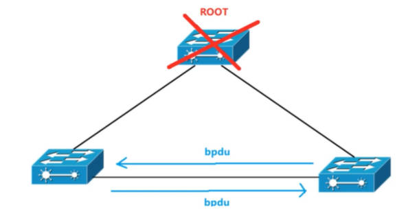

1. 根桥挂了，非根桥收不到BPDU，等待20s，开始选举新的根桥

2. 选举过程需要30s，包括学习+监听，所以包括前面等待的20s，根桥故障一共要等待50s 网络才能恢复。

