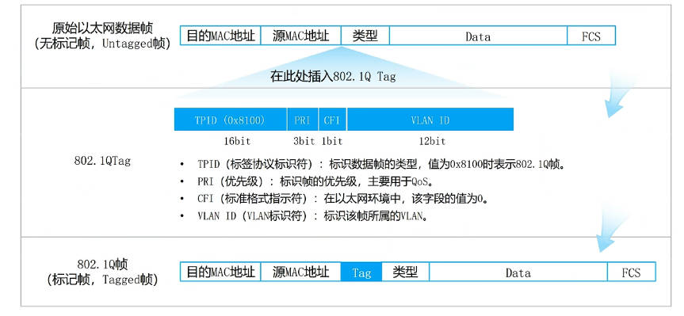
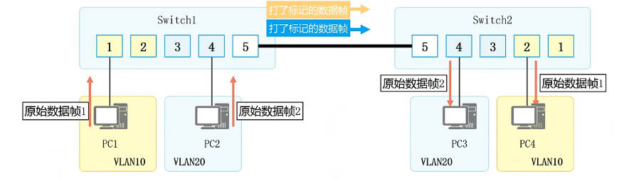
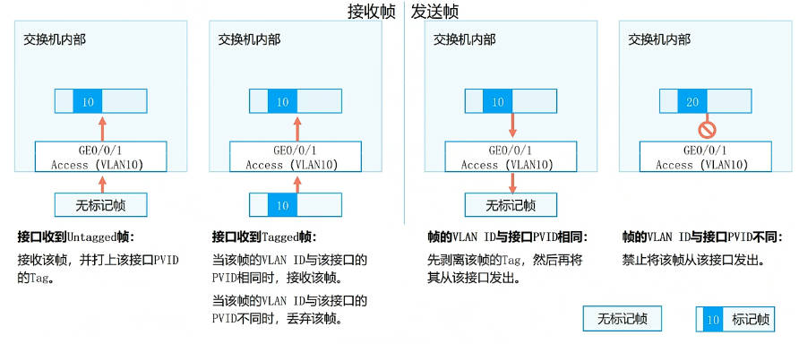
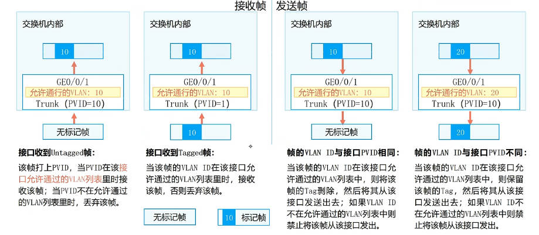
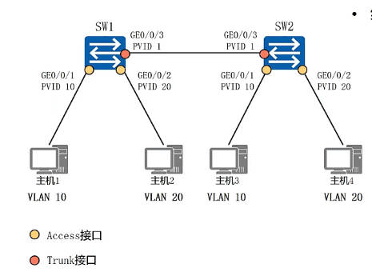
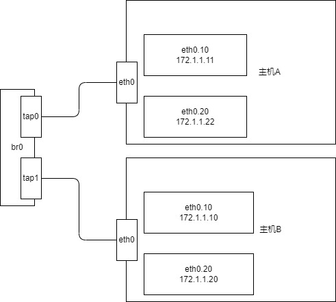
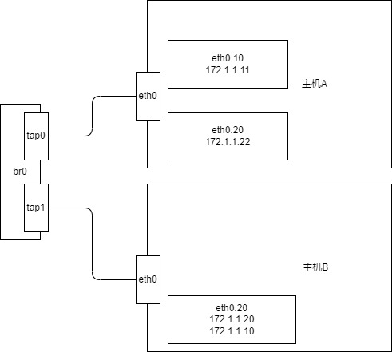

# VLAN数据帧



802.1Qtag 中最重要的是vlan id

vlan id 取值 : 0-4095, 

实际可用 1-4094, 

1为缺省ID，

新建ID必须从2开始

# VLAN的实现



## 端口接受数据帧

需要考虑
* 数据帧的 vlan id, 可能没有
* 端口允许的 vlan id，可能是单个，或多个
* 端口自己的 PVID

### 接受无tag的数据帧
端口接受所有无tag的数据帧，并根据自己的PVID，给数据帧添加 tag

### 接受有tag的数据帧
端口只接受数据帧的vlan id 和 自己的vlan id匹配的数据帧（端口可能加入多个vlan id）

## 端口发送数据帧
### 发送无tag的数据帧
宿主机发送的数据帧不带tag，端口直接发送。

给数据帧加上tag的操作只在端口接受数据帧时

### 发送带tag的数据帧
只有数据帧的tag和port加入的id匹配时才发送

## access接口



access接口特点：
* 支持一个PVID
* 只支持一个VLANID, vlanid == pvid
* 只发送数据帧的id和vlanid相同时才发送数据帧，对于没有tag 的数据帧直接发送
* 由于发送的数据帧的id和 pvid相等，所以对所有发送的数据帧进行untag操作

## trunk接口



trunk的特点：
* 支持多个VlanID, 接受数据帧时，支持接受多种vlanid的数据帧或无tag的数据帧
* 支持一个 PVID, 对于无tag的数据帧，使用pvid给数据帧加上tag
* 当数据帧id和vlanid列表中相等时，允许发送, 对于没有tag 的数据帧直接发送
* 只有当发送帧的id为pvid时才进行untag操作

# 典型应用



# 示例
## 


进入主机A
```shell
# 添加vlan
sudo ip link add link eth0 name eth0.10 type vlan id 10
sudo ip link add link eth0 name eth0.20 type vlan id 20

# 给vlan设备添加ip
ip addr add 172.1.1.11/24 dev eth0.10
ip addr add 172.1.1.22/24 dev eth0.20

# 启动设备
ip link set eth0 up
ip link set eth0.10 up
ip link set eth0.20 up

# 添加路由
ip route add 172.1.1.10/32 dev eth0.10
ip route add 172.1.1.20/32 dev eth0.20
```

进入主机B
```shell
# 添加vlan
sudo ip link add link eth0 name eth0.10 type vlan id 10
sudo ip link add link eth0 name eth0.20 type vlan id 20

# 给vlan设备添加ip
ip addr add 172.1.1.10/24 dev eth0.10
ip addr add 172.1.1.20/24 dev eth0.20

# 启动设备
ip link set eth0 up
ip link set eth0.10 up
ip link set eth0.20 up

# 先不添加路由
# ip route add 172.1.1.11/32 dev eth0.10
# ip route add 172.1.1.22/32 dev eth0.20
```

测试
```shell
# 进入主机A

# 可以收到回复 
ping -I eth0.10 172.1.1.11

# 不能收到
ping -I eth0.10 172.1.1.22

# 可以收到
ping 172.1.1.22

# 进入桥主机，抓包
tcpdump -i tap0 -e

04:11:53.721117 52:54:00:12:34:55 (oui Unknown) > 52:54:00:12:34:56 (oui Unknown), ethertype 802.1Q (0x8100), length 102: vlan 10, p 0, ethertype IPv4 (0x0800), 172-1-1-10.lightspeed.hstntx.sbcglobal.net > 172-1-1-22.lightspeed.hstntx.sbcglobal.net: ICMP echo reply, id 30976, seq 1, length 64
04:11:54.724385 52:54:00:12:34:56 (oui Unknown) > 52:54:00:12:34:55 (oui Unknown), ethertype 802.1Q (0x8100), length 102: vlan 20, p 0, ethertype IPv4 (0x0800), 172-1-1-22.lightspeed.hstntx.sbcglobal.net > 172-1-1-10.lightspeed.hstntx.sbcglobal.net: ICMP echo request, id 30976, seq 2, length 64
```
可以发现发送的包带 vlan id 10，返回的包带 vlan id 20，

回忆内核代码， vlan id 20 的回复包会查询 vlan id proto，发现接受设备为 eth0.20，但是ping程序绑定到 eth0.10，所以ping收不到响应

解决方法在B主机添加路由，让回复对应vlan id 的设备回复
```shell
ip route add 172.1.1.11/32 dev eth0.10
ip route add 172.1.1.22/32 dev eth0.20
```

对网络环境进行修改

```shell
#进入B主机
ip link del eth0.10

ip link add addr 172.1.1.10/24 dev eth0.20
```

测试
```shell
# 进入A主机,

# 使用vlan id 10 ，不通
ping -I eth0.10 172.1.1.10

# 抓包，发现是主机B的eth口没有 vlan id 10，所以拒绝接受
04:21:28.261424 52:54:00:12:34:56 (oui Unknown) > Broadcast, ethertype 802.1Q (0x8100), length 46: vlan 10, p 0, ethertype ARP (0x0806), Request who-has 172-1-1-10.lightspeed.hstntx.sbcglobal.net tell 172-1-1-11.lightspeed.hstntx.sbcglobal.net, length 28
04:21:30.215406 52:54:00:12:34:56 (oui Unknown) > Broadcast, ethertype 802.1Q (0x8100), length 46: vlan 10, p 0, ethertype ARP (0x0806), Request who-has 172-1-1-10.lightspeed.hstntx.sbcglobal.net tell 172-1-1-11.lightspeed.hstntx.sbcglobal.net, length 28

# 使用vlan id 20 ，
ping -I eth0.20 172.1.1.10

# 抓包
04:25:52.998684 52:54:00:12:34:56 (oui Unknown) > 52:54:00:12:34:55 (oui Unknown), ethertype 802.1Q (0x8100), length 102: vlan 20, p 0, ethertype IPv4 (0x0800), 172-1-1-22.lightspeed.hstntx.sbcglobal.net > 172-1-1-10.lightspeed.hstntx.sbcglobal.net: ICMP echo request, id 32768, seq 3, length 64
04:25:52.999921 52:54:00:12:34:55 (oui Unknown) > 52:54:00:12:34:56 (oui Unknown), ethertype 802.1Q (0x8100), length 102: vlan 20, p 0, ethertype IPv4 (0x0800), 172-1-1-10.lightspeed.hstntx.sbcglobal.net > 172-1-1-22.lightspeed.hstntx.sbcglobal.net: ICMP echo reply, id 32768, seq 3, length 64
```


