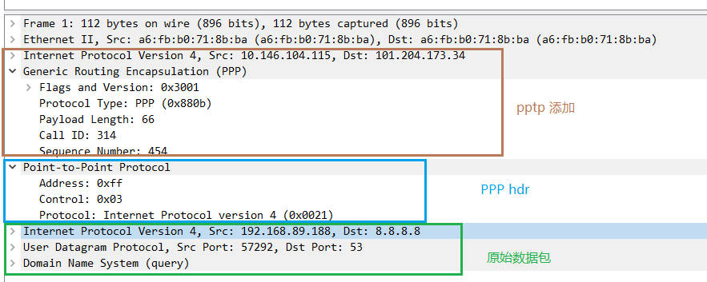
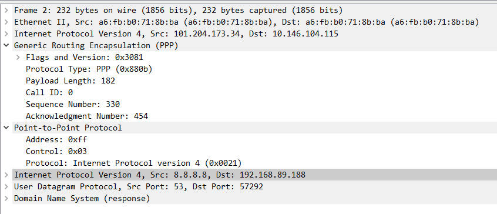

# 源码分析

## PPTP

### ppp驱动
创建ppp设备

```c
static const struct file_operations ppp_device_fops = {
	.owner		= THIS_MODULE,
	.read		= ppp_read,
	.write		= ppp_write,
	.poll		= ppp_poll,
	.unlocked_ioctl	= ppp_ioctl,
#ifdef CONFIG_COMPAT
	.compat_ioctl	= ppp_compat_ioctl,
#endif
	.open		= ppp_open,
	.release	= ppp_release,
	.llseek		= noop_llseek,
};


static int __init ppp_init(void)
	err = register_chrdev(PPP_MAJOR, "ppp", &ppp_device_fops);
	..
```

### VPN 设备的创建
用户程序调用 ppp 字符设备 的 ioctl 创建 ppp网络设备

```c
ppp_ioctl
	ppp_unattached_ioctl(current->nsproxy->net_ns, pf, file, cmd, arg);
		case PPPIOCNEWUNIT:
			ppp_create_interface(net, file, &unit);
```

```c
static struct rtnl_link_ops ppp_link_ops __read_mostly = {
	.kind		= "ppp",
	.maxtype	= IFLA_PPP_MAX,
	.policy		= ppp_nl_policy,
	.priv_size	= sizeof(struct ppp),
	.setup		= ppp_setup,
	.validate	= ppp_nl_validate,
	.newlink	= ppp_nl_newlink,
	.dellink	= ppp_nl_dellink,
	.get_size	= ppp_nl_get_size,
	.fill_info	= ppp_nl_fill_info,
	.get_link_net	= ppp_nl_get_link_net,
};


static int ppp_create_interface(struct net *net, struct file *file, int *unit)
{
	struct ppp_config conf = {
		.file = file,
		.unit = *unit,
		.ifname_is_set = false,
	};
	struct net_device *dev;
	struct ppp *ppp;
	int err;

	dev = alloc_netdev(sizeof(struct ppp), "", NET_NAME_ENUM, ppp_setup);
	if (!dev) {
		err = -ENOMEM;
		goto err;
	}
	dev_net_set(dev, net);
	dev->rtnl_link_ops = &ppp_link_ops;

	rtnl_lock();

	err = ppp_dev_configure(net, dev, &conf);
	if (err < 0)
		goto err_dev;
	ppp = netdev_priv(dev);
	*unit = ppp->file.index;

	rtnl_unlock();

	return 0;

err_dev:
	rtnl_unlock();
	free_netdev(dev);
err:
	return err;
}

static void ppp_setup(struct net_device *dev)
{
	dev->netdev_ops = &ppp_netdev_ops;
	SET_NETDEV_DEVTYPE(dev, &ppp_type);

	dev->features |= NETIF_F_LLTX;

	dev->hard_header_len = PPP_HDRLEN;
	dev->mtu = PPP_MRU;
	dev->addr_len = 0;
	dev->tx_queue_len = 3;
	dev->type = ARPHRD_PPP;
	dev->flags = IFF_POINTOPOINT | IFF_NOARP | IFF_MULTICAST;
	dev->priv_destructor = ppp_dev_priv_destructor;
	netif_keep_dst(dev);
}

static const struct net_device_ops ppp_netdev_ops = {
	.ndo_init	 = ppp_dev_init,
	.ndo_uninit      = ppp_dev_uninit,
	.ndo_start_xmit  = ppp_start_xmit,
	.ndo_do_ioctl    = ppp_net_ioctl,
	.ndo_get_stats64 = ppp_get_stats64,
};
```

上面代码说明当 ppp设备发送数据包时，调用 ppp_start_xmit

### pptp连接
为了理解pptp_xmit 先看 pptp_connect
```c
struct pptp_opt {
	struct pptp_addr src_addr; // 主机真实设备的IP地址
	struct pptp_addr dst_addr; // 这是服务器的公网地址
	u32 ack_sent, ack_recv;
	u32 seq_sent, seq_recv;
	int ppp_flags;
};
#include <net/sock.h>

struct pppox_sock {
	/* struct sock must be the first member of pppox_sock */
	struct sock sk;
	struct ppp_channel chan;
	struct pppox_sock	*next;	  /* for hash table */
	union {
		struct pppoe_opt pppoe;
		struct pptp_opt  pptp;
	} proto;
	__be16			num;
};


static int pptp_connect(struct socket *sock, struct sockaddr *uservaddr,
	int sockaddr_len, int flags)
{
	struct sock *sk = sock->sk;
	// uservaddr包括vpn服务器的地址
	struct sockaddr_pppox *sp = (struct sockaddr_pppox *) uservaddr;
	struct pppox_sock *po = pppox_sk(sk);
	struct pptp_opt *opt = &po->proto.pptp;
	struct rtable *rt;
	struct flowi4 fl4;
	int error = 0;

	if (sockaddr_len < sizeof(struct sockaddr_pppox))
		return -EINVAL;

	if (sp->sa_protocol != PX_PROTO_PPTP)
		return -EINVAL;

	// 查看此链路是否已经完成拨号，如果已完成则退出
	if (lookup_chan_dst(sp->sa_addr.pptp.call_id, sp->sa_addr.pptp.sin_addr.s_addr))
		return -EALREADY;

	lock_sock(sk);
	/* Check for already bound sockets */
	if (sk->sk_state & PPPOX_CONNECTED) {
		error = -EBUSY;
		goto end;
	}

	/* Check for already disconnected sockets, on attempts to disconnect */
	if (sk->sk_state & PPPOX_DEAD) {
		error = -EALREADY;
		goto end;
	}

	if (!opt->src_addr.sin_addr.s_addr || !sp->sa_addr.pptp.sin_addr.s_addr) {
		error = -EINVAL;
		goto end;
	}

	po->chan.private = sk;
	po->chan.ops = &pptp_chan_ops;

	// 查询路由确保可以连接，并设置mtu
	rt = ip_route_output_ports(sock_net(sk), &fl4, sk,
				   opt->dst_addr.sin_addr.s_addr,
				   opt->src_addr.sin_addr.s_addr,
				   0, 0,
				   IPPROTO_GRE, RT_CONN_FLAGS(sk),
				   sk->sk_bound_dev_if);
	if (IS_ERR(rt)) {
		error = -EHOSTUNREACH;
		goto end;
	}
	sk_setup_caps(sk, &rt->dst);

	po->chan.mtu = dst_mtu(&rt->dst);
	if (!po->chan.mtu)
		po->chan.mtu = PPP_MRU;
	po->chan.mtu -= PPTP_HEADER_OVERHEAD;

	po->chan.hdrlen = 2 + sizeof(struct pptp_gre_header);
	error = ppp_register_channel(&po->chan);
	if (error) {
		pr_err("PPTP: failed to register PPP channel (%d)\n", error);
		goto end;
	}

	// 保存
	opt->dst_addr = sp->sa_addr.pptp;
	sk->sk_state |= PPPOX_CONNECTED;

 end:
	release_sock(sk);
	return error;
}
```

成功连接后获得 call id, 保存call id 和 服务器外网地址到  opt->dst_addr

### ppp


pptp成功拨号后，默认发送设备为 pptp设备，根据前面分析此处应该调用 ppp_start_xmit


此时的数据包有 L5 L4 L3 层内容

注意这里L3层的

源IP为ppp设备IP，也就是内网IP地址

目的IP为真实目的主机的IP，通常是外网IP

ppp_start_xmit 主要工作为设置 ppp hdr

```c
static netdev_tx_t
ppp_start_xmit(struct sk_buff *skb, struct net_device *dev)
{
	struct ppp *ppp = netdev_priv(dev);
	int npi, proto;
	unsigned char *pp;

	npi = ethertype_to_npindex(ntohs(skb->protocol));
	if (npi < 0)
		goto outf;

	/* Drop, accept or reject the packet */
	switch (ppp->npmode[npi]) {
	case NPMODE_PASS:
		break;
	case NPMODE_QUEUE:
		/* it would be nice to have a way to tell the network
		   system to queue this one up for later. */
		goto outf;
	case NPMODE_DROP:
	case NPMODE_ERROR:
		goto outf;
	}

	/* Put the 2-byte PPP protocol number on the front,
	   making sure there is room for the address and control fields. */
	if (skb_cow_head(skb, PPP_HDRLEN))
		goto outf;

	//  设置 ppp hdr
	pp = skb_push(skb, 2);
	proto = npindex_to_proto[npi];
	put_unaligned_be16(proto, pp);

	// 把skb->dst清零,
	skb_scrub_packet(skb, !net_eq(ppp->ppp_net, dev_net(dev)));
		skb->pkt_type = PACKET_HOST;
		skb->skb_iif = 0;
		skb->ignore_df = 0;
		skb_dst_drop(skb);
		skb_ext_reset(skb);
		nf_reset_ct(skb);
		nf_reset_trace(skb);
		ipvs_reset(skb);
		skb->mark = 0;
		skb->tstamp = 0;


	ppp_xmit_process(ppp, skb);
		if (!ppp->closing) {
			ppp_push(ppp);
			if (skb)
				skb_queue_tail(&ppp->file.xq, skb);
			// 发送ppp设备发送队列中所有skb
			while (!ppp->xmit_pending &&
				   (skb = skb_dequeue(&ppp->file.xq)))
				ppp_send_frame(ppp, skb);
			if (!ppp->xmit_pending && !skb_peek(&ppp->file.xq))
				netif_wake_queue(ppp->dev);
			else
				netif_stop_queue(ppp->dev);
		}


	return NETDEV_TX_OK;

 outf:
	kfree_skb(skb);
	++dev->stats.tx_dropped;
	return NETDEV_TX_OK;
}
```

#### pptp_xmit 


```c
static const struct ppp_channel_ops pptp_chan_ops = {
	.start_xmit = pptp_xmit,
	.ioctl      = pptp_ppp_ioctl,
};


static int pptp_xmit(struct ppp_channel *chan, struct sk_buff *skb)
{
	struct sock *sk = (struct sock *) chan->private;
	struct pppox_sock *po = pppox_sk(sk);
	struct net *net = sock_net(sk);
	struct pptp_opt *opt = &po->proto.pptp;
	struct pptp_gre_header *hdr;
	unsigned int header_len = sizeof(*hdr);
	struct flowi4 fl4;
	int islcp;
	int len;
	unsigned char *data;
	__u32 seq_recv;
	struct rtable *rt;
	struct net_device *tdev;
	struct iphdr  *iph;
	int    max_headroom;

	if (sk_pppox(po)->sk_state & PPPOX_DEAD)
		goto tx_error;

	// 以服务器地址为目标查询路由
	rt = ip_route_output_ports(net, &fl4, NULL,
				   opt->dst_addr.sin_addr.s_addr,
				   opt->src_addr.sin_addr.s_addr,
				   0, 0, IPPROTO_GRE,
				   RT_TOS(0), sk->sk_bound_dev_if);
	if (IS_ERR(rt))
		goto tx_error;

	tdev = rt->dst.dev;

	max_headroom = LL_RESERVED_SPACE(tdev) + sizeof(*iph) + sizeof(*hdr) + 2;

	if (skb_headroom(skb) < max_headroom || skb_cloned(skb) || skb_shared(skb)) {
		struct sk_buff *new_skb = skb_realloc_headroom(skb, max_headroom);
		if (!new_skb) {
			ip_rt_put(rt);
			goto tx_error;
		}
		if (skb->sk)
			skb_set_owner_w(new_skb, skb->sk);
		consume_skb(skb);
		skb = new_skb;
	}

	data = skb->data;
	islcp = ((data[0] << 8) + data[1]) == PPP_LCP && 1 <= data[2] && data[2] <= 7;

	/* compress protocol field */
	if ((opt->ppp_flags & SC_COMP_PROT) && data[0] == 0 && !islcp)
		skb_pull(skb, 1);

	/* Put in the address/control bytes if necessary */
	if ((opt->ppp_flags & SC_COMP_AC) == 0 || islcp) {
		data = skb_push(skb, 2);
		data[0] = PPP_ALLSTATIONS;
		data[1] = PPP_UI;
	}

	len = skb->len;

	seq_recv = opt->seq_recv;

	if (opt->ack_sent == seq_recv)
		header_len -= sizeof(hdr->ack);

	// 添加GRE头
	/* Push down and install GRE header */
	skb_push(skb, header_len);
	hdr = (struct pptp_gre_header *)(skb->data);

	hdr->gre_hd.flags = GRE_KEY | GRE_VERSION_1 | GRE_SEQ;
	hdr->gre_hd.protocol = GRE_PROTO_PPP;
	hdr->call_id = htons(opt->dst_addr.call_id);

	hdr->seq = htonl(++opt->seq_sent);
	if (opt->ack_sent != seq_recv)	{
		/* send ack with this message */
		hdr->gre_hd.flags |= GRE_ACK;
		hdr->ack  = htonl(seq_recv);
		opt->ack_sent = seq_recv;
	}
	hdr->payload_len = htons(len);

	/*	Push down and install the IP header. */

	skb_reset_transport_header(skb);
	skb_push(skb, sizeof(*iph));
	skb_reset_network_header(skb);
	memset(&(IPCB(skb)->opt), 0, sizeof(IPCB(skb)->opt));
	IPCB(skb)->flags &= ~(IPSKB_XFRM_TUNNEL_SIZE | IPSKB_XFRM_TRANSFORMED | IPSKB_REROUTED);

	// 加ip  hdr ，这样就完成了对数据包的封装
	iph =	ip_hdr(skb);
	iph->version =	4;
	iph->ihl =	sizeof(struct iphdr) >> 2;
	if (ip_dont_fragment(sk, &rt->dst))
		iph->frag_off	=	htons(IP_DF);
	else
		iph->frag_off	=	0;
	iph->protocol = IPPROTO_GRE;
	iph->tos      = 0;
	iph->daddr    = fl4.daddr; // 服务器地址,做目标地址
	iph->saddr    = fl4.saddr; // 主机真实设备IP地址
	iph->ttl      = ip4_dst_hoplimit(&rt->dst);
	iph->tot_len  = htons(skb->len);

	skb_dst_drop(skb);
	skb_dst_set(skb, &rt->dst);

	nf_reset_ct(skb);

	skb->ip_summed = CHECKSUM_NONE;
	ip_select_ident(net, skb, NULL);
	ip_send_check(iph);

	// 再次查询路由并发送，正常情况应该查询到使用真实的网络设备发送
	ip_local_out(net, skb->sk, skb);
	return 1;

tx_error:
	kfree_skb(skb);
	return 1;
}
```

# 数据包示例
DNS请求



DNS响应


