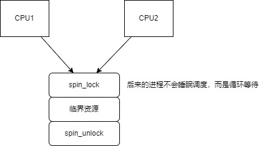

# 原子操作 

## 为什么需要原子操作
如下驱动希望实现只有一个程序占用。
```c
static int vaild = 1;
static sszie_t gpio_drv_open(struct inode *inode, struct file *file)
{
    if (!vaild) {
        return -EBUSY;
    }
    else {
        vaild = 0;  // APP1 将要执行这句时发生抢占，导致APP2也成功调用驱动
    }
    return 0;
}

static sszie_t gpio_drv_close(struct inode *inode , struct file *file)
{
    vaild = 1;
    return 0;
}
```
但由于进程的抢占，互斥无法实现


C语言无论如何优化代码依旧会有冲突，因为C语言一条语句会被编译成多条汇编，每一步汇编都可能被打断
```c
static sszie_t gpio_drv_open(struct inode *inode, struct file *file)
{
    if (--vaild) { //     1. 读取vaild到寄存器
                   //     2. 修改寄存器
                   //     3. 写入vaild
        return -EBUSY;
    }
    return 0;
}

```

## 如何实现原子操作

### armv6之前的版本
对于arm版本小于v6的版本，不支持smp，只有单CPU，所以通过关闭中断的方式可以实现互斥

### armv6之后的版本
对于arm版本大于等于v6 : 要考虑多核情况，通过关闭中断只能防止本CPU不会调度导致冲突，只能通过arm内存标记指令
```c

```
# 锁
## 自旋锁


### 多CPU

未获得锁的进程会自旋等待，而非睡眠调度，所以优点效率高，但临界资源要短

### 单CPU
单CPU时不存在并发执行，但是高版本的内核存在抢占，所以spin_lock会进行禁止抢占。

什么是抢占 preempt

进程的调度只能发生在用户态，当程序进入内核态就不能被调度，但是如果驱动写的很难，会导致其他进程一直得不到调度，

所以新的内核支持内核态的进程调度（中断除外），当发生时间中断，如果有更高优先级的进程，则会进行调度（抢占）


## 睡眠锁

