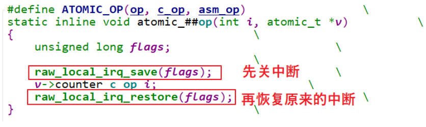

# 原子操作 

## 为什么需要原子操作
如下驱动希望实现只有一个程序占用。
```c
static int vaild = 1;
static sszie_t gpio_drv_open(struct inode *inode, struct file *file)
{
    if (!vaild) {
        return -EBUSY;
    }
    else {
        vaild = 0;  // APP1 将要执行这句时发生抢占，导致APP2也成功调用驱动
    }
    return 0;
}

static sszie_t gpio_drv_close(struct inode *inode , struct file *file)
{
    vaild = 1;
    return 0;
}
```
但由于进程的抢占，互斥无法实现


C语言无论如何优化代码依旧会有冲突，因为C语言一条语句会被编译成多条汇编，每一步汇编都可能被打断
```c
static sszie_t gpio_drv_open(struct inode *inode, struct file *file)
{
    if (--vaild) { //     1. 读取vaild到寄存器
                   //     2. 修改寄存器
                   //     3. 写入vaild
        return -EBUSY;
    }
    return 0;
}

```

## 如何实现原子操作

### armv6之前的版本
对于arm版本小于v6的版本，不支持smp，只有单CPU，所以通过关闭中断的方式可以实现互斥


### armv6之后的版本
对于arm版本大于等于v6 : 要考虑多核情况，通过关闭中断只能防止本CPU不会调度导致冲突，通过ldrex strex 指令实现互斥

- ldrex r0, [r1]
  - 读取 r1 所指内存的数据，存入 r0；并且标记 r1 所指内存为“独占访问”。
  - 如果有其他程序再次执行“ldrex r0, [r1]”，一样会成功，一样会标记 r1 所指内存为“独占访问”。
- 修改 r0 的值
- 写入：strex r2, r0, [r1]：
  - 如果 r1 的“独占访问”标记还存在，则把 r0 的新值写入 r1 所指内存，并且清除“独占访问”的标记，
  - 把 r2 设为 0 表示成功。
  - 如果 r1 的“独占访问”标记不存在了，就不会更新内存，并且把 r2 设为 1 表示失败。


## Linux实现的原子操作 
| 函数名 | 作用 |
| --- | --- |
| atomic_read(v)  | 读出原子变量的值，即 v->counter |
| atomic_set(v,i)  | 设置原子变量的值，即 v->counter = i |
| atomic_inc(v) | v->counter++ |
| atomic_dec(v) | v->counter-- |
| atomic_add(i,v) | v->counter += i |
| atomic_sub(i,v) | v->counter -= i |
| atomic_inc_and_test(v) | 先加 1，再判断新值是否等于 0；等于 0 的话，返回值为 1 |
| atomic_dec_and_test(v) |  先减 1，再判断新值是否等于 0；等于 0 的话，返回值为 1 |

使用原子操作实现驱动独占

```c
static atomic_t valid = ATOMIC_INIT(1);

static ssize_t gpio_key_drv_open (struct inode *node, struct file *file)
{
    if (atomic_dec_and_test(&valid))
        return 0;

    atomic_inc(&valid);
    return -EBUSY;
}

static int gpio_key_drv_close (struct inode *node, struct file *file)
{
    atomic_inc(&valid);
    return 0;
}
```

原子位操作

| 函数名 | 作用 |
| --- | --- |
| set_bit(nr,p) | 设置(\*p)的 bit nr 为 1 |
| clear_bit(nr,p)  | 清除(\*p)的 bit nr 为 0 |
| change_bit(nr,p) |  改变(\*p)的 bit nr，从 1 变为 0，或是从 0 变为 1 |
| test_and_set_bit(nr,p) | 设置(\*p)的 bit nr 为 1，返回该位的老值 |
| test_and_clear_bit(nr,p) | 清除(\*p)的 bit nr 为 0，返回该位的老值 |
| test_and_change_bit(nr,p) | 改变(\*p)的 bit nr，从 1 变为 0，或是从 0 变为 1；返回该位的老值 |

# 锁
## 自旋锁

无法获得锁时，不会休眠，会一直循环等待

自旋锁是为SMP系统设计的，当CPU0获得了自旋锁，CPU1也尝试获得锁，CPU1的进程不会挂起而是原地等待，CPU0用完资源释放锁，CPU1获得锁。

如此希望获得锁的进程就不需要被调度，相对睡眠锁，有很高的效率。

### 多CPU如何实现自旋锁

所有SMP系统的自旋锁都会调用到arch_spin_lock

使用 ldrex, strex 指令实现互斥。进而实现自旋锁

#### 公平原则
当锁被CPU0占用，CPU1和CPU2都等待锁，则哪个CPU先获得锁呢？

显然先排队的CPU应该先获得锁。

自旋锁如何实现公平呢？


spinlock的核心属性是 u16 next, 和u16 owner

next 表示下一个可获得锁的ID
owner 表示当前使用锁的ID


1. next owner 各占16bit，所以一次ldrex获得两个属性
2. 将next加1，并将结果(next owner)保存到临时变量lockval
3. 并尝试将lockval 写回lock，如果发生冲突，则重新尝试 
4. 否则，获得了自己的ID
5. 循环检查当前ID是否到自己了
6. 如果到自己了，则说明获得了锁，可以使用临界区


unlock时，将owner++即可

### 单CPU如何实现自旋锁

单CPU时不存在并发执行，但是高版本的内核存在抢占，所以spin_lock会进行禁止抢占。

如果Linux版本很低没有抢占，则自旋锁为空

什么是抢占 preempt

进程的调度只能发生在用户态，当程序进入内核态就不能被调度，但是如果驱动写的很难，会导致其他进程一直得不到调度，

所以新的内核支持内核态的进程调度（中断除外），当发生时间中断，如果有更高优先级的进程，则会进行调度（抢占）

### 函数
| 函数名 | 作用 |
| --- | --- |
| spin_lock_init(\_lock) | 初始化自旋锁为 unlock 状态 |
| void spin_lock(spinlock_t \*lock) | 获取自旋锁(加锁)，返回后肯定获得了锁 |
| int spin_trylock(spinlock_t \*lock) | 尝试获得自旋锁，成功获得锁则返回 1，否则返回 0 |
| void spin_unlock(spinlock_t \*lock) |  释放自旋锁，或称解锁 |
| int spin_is_locked(spinlock_t \*lock) | 返回自旋锁的状态，已加锁返回 1，否则返回 0 |

| 后缀 | 描述 |
| --- | --- |
| \_bh() | 加锁时禁止下半部(软中断)，解锁时使能下半部(软中断) |
| \_irq() | 加锁时禁止中断，解锁时使能中断 |
| \_irqsave/restore() | 加锁时禁止并中断并记录状态，解锁时恢复中断为所记录的状态 |

## 睡眠锁
无法获得锁时，当前线程就会休眠

| 休眠锁 | 描述 |
| --- | --- |
| mutex | mutual exclusion，彼此排斥，即互斥锁(后面讲解) |
| rt_mutex | |
| semaphore | 信号量、旗语(后面讲解) |
| rw_semaphore | 读写信号量，读写互斥，但是可以多人同时读 |
| ww_mutex | |
| percpu_rw_semaphore | 对 rw_semaphore 的改进，性能更优 |

### 信号量 semaphore
信号量的定义


#### down 原理


信号量是利用互斥锁实现的，

因为信号量有两个临界资源，counter，wait_list

- 调用down的进程首先获得互斥锁
- 检查counter是大于0，等于0则需要等待
- 将进程挂到wait_list，并设置进程状态为 interrupt 或 uninterrupt
- 释放自旋锁，后调度
- 当再被调度时，说明被其他进程唤醒，首先获得自旋锁
- 检查释放获得机会，如果没有则再次睡眠

#### up原理


- 首先获得自旋锁
- 如果有进程等待资源则将资源交给他，并将他踢出等待队列，并唤醒(设置他的状态为可调度 )他
- 如果没有进程等待，则将资源增加
- 然后释放锁

#### 函数
| 函数名 | 作用 |
| --- | --- |
| DEFINE_SEMAPHORE(name) | 定义一个 struct semaphore name 结构体，count 值设置为 1 |
| void sema_init(struct semaphore \*sem, int val) | 初始化 semaphore |
| void down(struct semaphore \*sem) | 获得信号量，如果暂时无法获得就会休眠 , 在休眠过程中无法被唤醒，即使有信号发给这个进程也不处理 |
| int down_interruptible(struct semaphore \*sem) | 获得信号量，如果暂时无法获得就会休眠，休眠过程有可能收到信号而被唤醒， <br>要判断返回值：<br>0：获得了信号量 <br>-EINTR：被信号打断 |
| int down_killable(struct semaphore \*sem) | 跟 down_interruptible 类似，down_interruptible 可以被任意信号唤醒，但 down_killable 只能被“fatal signal”唤醒<br> 返回值： <br> 0：获得了信号量 <br> -EINTR：被信号打断 |
| int down_trylock(struct semaphore \*sem) | 尝试获得信号量，不会休眠<br>返回值：<br>0：获得了信号量<br>1：没能获得信号量|
| int down_timeout(struct semaphore \*sem, long jiffies) | 获得信号量，如果不成功，休眠一段时间<br>返回值: <br>0：获得了信号量<br>-ETIME：这段时间内没能获取信号量，超时返回 |
| down_timeout | 休眠过程中，它不会被信号唤醒 |
| void up(struct semaphore \*sem) | 释放信号量，唤醒其他等待信号量的进程 |


### 互斥量mutex


mutx和semaphore一样是睡眠锁，但mutex只能有一个资源。

#### owner优化mutex性能

mutex的owner属性是可选的，用于优化性能。

在SMP系统，当CPU0获得了mutex，这时CPU1也想获得mutex，此时mutex->owner为CPU0的进程，通过此进程可以知道mutex在哪个CPU，所以CPU1的进程就知道了mutex在CPU0上占用，并且当前只有自己在等mutex，所以他可以自旋等待，而非睡眠。

kernel对mutex做了很多优化

所以mutex的性能比semaphore高。

#### lock实现


counter
- 0 : locked
- 1 : unlocked
- 负数 : locked，并且还有其他进程在等待


大部分情况下，mutex当前值都是1，所以通过fastpath函数可以非常快速地获得mutex。


如果mutex当前值是0或负数，则需要调用\__mutex_lock_slowpath慢慢处理：可能会休眠等待。


##### slowpath


#### unlock实现


#### 函数
| 函数名 | 作用 |
| --- | --- |
| mutex_init(mutex) | 初始化一个 struct mutex 指针 |
| DEFINE_MUTEX(mutexname) | 初始化 struct mutex mutexname |
| int mutex_is_locked(struct mutex \*lock) | 判断 mutex 的状态 <br>1：被锁了(locked)<br>0：没有被锁 |
| void mutex_lock(struct mutex \*lock) | 获得 mutex，如果暂时无法获得，休眠返回之时必定是已经获得了 mutex |
| int mutex_lock_interruptible(struct mutex\*lock) | 获得 mutex，如果暂时无法获得，休眠; 休眠过程中可以被信号唤醒，返回值：<br>0：成功获得了 mutex<br>-EINTR：被信号唤醒了 |
| int mutex_lock_killable(struct mutex \*lock) | 跟 mutex_lock_interruptible 类似，mutex_lock_interruptible 可以被任意信号唤醒，但 mutex_lock_killable 只能被“fatal signal”唤醒，<br> 返回值：<br>0：获得了 mutex<br>-EINTR：被信号打断|
| int mutex_trylock(struct mutex \*lock) | 尝试获取 mutex，如果无法获得，不会休眠，<br>返回值：<br>1：获得了 mutex，<br>0：没有获得<br>注意，这个返回值含义跟一般的 mutex 函数相反 |
| void mutex_unlock(struct mutex \*lock) | 释放 mutex，会唤醒其他等待同一个 mutex 的线程 |
| int atomic_dec_and_mutex_lock(atomic_t \*cnt, struct mutex \*lock) | 让原子变量的值减 1，如果减 1 后等于 0，则获取 mutex，<br>返回值：<br>1：原子变量等于 0 并且获得了 mutex<br>0：原子变量减 1 后并不等于 0，没有获得 mutex |

### semaphore 和 mutex的区别 
semaphore 中可以指定 count 为任意值

mutex 的值只能设置为 1 或 0

mutex 定义


struct task_struct \*owner”, 指向某个进程。一个 mutex 只能在进程上下文中使用：谁给 mutex 加锁，就只能由谁来解锁。

semaphore 的锁定与释放，并不限定为同一个进程

| |semaphore | mutex|
| --- | --- | --- |
| 几把锁 | 任意, 可设置 | 1 |
| 谁能解锁 | 别的程序、中断等都可以 | 谁加锁，就得由谁解锁 |
| 多次解锁 | 可以 | 不可以，因为只有 1 把锁 |
| 循环加锁 | 可以 | 不可以，因为只有 1 把锁 |
| 任务在持有锁的期间可否退出 | 可以 | 不建议，容易导致死锁 |
| 硬件中断、软件中断上下文中使用 | 可以 | 不可以 |

# 背景知识
## 内核抢占
早期的的 Linux 内核是“不可抢占”的，假设有 A、B 两个程序在运行，当前是程序 A 在运行，什么时候轮到程序 B 运行呢？
- 程序 A 主动放弃 CPU：
  - 比如它调用某个系统调用、调用某个驱动，进入内核态后执行了 schedule()主动启动一次调度。
- 程序 A 调用系统函数进入内核态，从内核态返回用户态的前夕：
  - 这时内核会判断是否应该切换程序。
- 程序 A 正在用户态运行，发生了中断：
  - 内核处理完中断，继续执行程序 A 的用户态指令的前夕，它会判断是否应该切换程序。

从这个过程可知，对于“不可抢占”的内核，当程序 A 运行内核态代码时进程是无法切换的(除非程序
A 主动放弃)，比如执行某个系统调用、执行某个驱动时，进程无法切换。
这会导致 2 个问题：
- 优先级反转：
  - 一个低优先级的程序，因为它正在内核态执行某些很耗时的操作，在这一段时间内更高优先级的程序也无法运行。
- 在内核态发生的中断不会导致进程切换

为了让系统的实时性更佳，Linux 内核引入了“抢占”(preempt)的功能：进程运行于内核态时，进程调度也是可以发生的。

回到上面的例子，程序 A 调用某个驱动执行耗时的操作，在这一段时间内系统是可以切换去执行更高优先级的程序。

对于可抢占的内核，编写驱动程序时要时刻注意：你的驱动程序随时可能被打断、随时是可以被另一个进程来重新执行。对于可抢占的内核，在驱动程序中要考虑对临界资源加锁。

# 使用示例
## 进程上下文 和 进程上下文

假设只有程序 A、程序 B 会抢占资源，这 2 个程序都是可以休眠的，所以可以使用信号量，代码如下：
```c
// 资源自由一个
static DEFINE_SPINLOCK(clock_lock); // 或 struct semaphore sem; sema_init(&sem, 1);

// 如果被中断打断则会返回 -EINTR
if (down_interruptible(&sem)) // if (down_trylock(&sem))
{
    /* 获得了信号量 */
}

/* 释放信号量 */
up(&sem);
```

使用互斥量
```c
static DEFINE_MUTEX(mutex); //或 static struct mutex mutex; mutex_init(&mutex);
mutex_lock(&mutex);
/* 临界区 */
mutex_unlock(&mutex)
```

一般来说在同一个函数里调用 mutex_lock 或 mutex_unlock，不会长期持有它。这只是惯例，如果你使用 mutex 来实现驱动程序只能由一个进程打开，在 drv_open 中调用 mutex_lock，在 drv_close 中调用 mutex_unlock，这也完全没问题

### 进程上下文 和 Softirq

假设这么一种情况：程序 A 运行到内核态时，正在访问一个临界资源；这时发生了某个硬件中断，在硬件中断处理完后会处理 Softirq，而某个 Softirq 也会访问这个临界资源。

怎么办？

在程序 A 访问临界资源之前，干脆禁止 Softirq 好了！

可以使用 spin_lock_bh 函数，它会先禁止本地 CPU 的中断下半部即 Softirq，这样本地 Softirq 就不会跟它竞争了；假设别的 CPU 也想获得这个资源，它也会调用 spin_lock_bh 禁止它自己的 Softirq。这 2个 CPU 都禁止自己的 Softirq，然后竞争 spinlock，谁抢到谁就先执行。可见，在执行临界资源的过程中，本地 CPU 的 Softirq、别的 CPU 的 Softirq 都无法来抢占当前程序的临界资源。

释放锁的函数是 spin_unlock_bh。

spin_lock_bh/spin_unlock_bh 的后缀是“\_bh”，表示“Bottom Halves”，中断下半部，这是软件中断的老名字。这些函数改名为 spin_lock_softirq 也许更恰当，请记住：spin_lock_bh 会禁止 Softirq，而不仅仅是禁止“中断下半部”(timer、tasklet 里等都是 Softirq，中断下半部只是 Softirq 的一种)。

```c
static DEFINE_SPINLOCK(lock); // static spinlock_t lock; spin_lock_init(&lock);
spin_lock_bh(&lock);
/* 临界区 */
spin_unlock_bh(&lock);
```

如果是CPU1上的进程调用 spin_lock_bh，CPU2发生中断，到处理软中断，也会调用 spin_lock_bh，这时会进行自旋，CPU1上的进程使用完临界区后，调用 spin_unlock_bh，CPU2便可以获得临界区

### 进程上下文 和 Tasklet 之间
Tasklet 也是 Softirq 的一种，所以跟前面是“在用户上下文与 Softirqs 之间加锁”完全一样。

### 进程上下文 和 Timer 之间
Timer 也是 Softirq 的一种，所以跟前面是“在用户上下文与 Softirqs 之间加锁”完全一样。


### Tasklet 和 Timer
假设在 Tasklet 中访问临界资源，另一个 CPU 会不会同时运行这个 Tasklet？不会的，所以如果只是在某个 Tasklet 中访问临界资源，无需上锁。

假设在 Timer 中访问临界资源，另一个 CPU 会不会同时运行这个 timer？不会的，所以如果只是在某个Timer 中访问临界资源，无需上锁

如果在有 2 个不同的 Tasklet 或 Timer 都会用到一个临界资源，那么可以使用 spin_lock()、spin_unlock()来保护临界资源。不需要用 spin_lock_bh()，因为一旦当前 CPU 已经处于 Tasklet 或 Timer中，同一个 CPU 不会同时再执行其他 Tasklet 或 Timer。

### 在 Softirq 之间加锁
这里讲的 softirq 不含 tasklet、timer。

同一个 Softirq 是有可能在不同 CPU 上同时运行的，所以可以使用 spin_lock()、spin_unlock()来访问临界区。如果追求更高的性能，可以使用“per-CPU array”

不同的 Softirq 之间，可以使用 spin_lock()、spin_unlock()来访问临界区。

### 硬中断上下文

假设一个硬件中断服务例程与一个 Softirq 共享数据，需要考虑 2 点：
- Softirq 执行的过程中，可能会被硬件中断打断；
- 临界区可能会被另一个 CPU 上的硬件中断进入。

怎么办？

在 Softirq 获得锁之前，禁止当前 CPU 的中断。

在硬件中断服务例程中不需要使用 spin_lock_irq()，因为当它在执行的时间 Softirq 是不可能执行的；它可以使用 spin_lock()用来防止别的 CPU 抢占。

如果硬件中断 A、硬件中断 B 都要访问临界资源，怎么办？这篇文章里说要使用 spin_lock_irq()：

但是我认为使用 spin_lock()就足够了。因为 Linux 不支持中断嵌套，即当前 CPU 正在处理中断 A 时，中断 B 不可能在当前 CPU 上被处理，不需要再次去禁止中断；当前 CPU 正在处理中断 A 时，假如有另一个CPU 正在处理中断 B，它们使用 spin_lock()实现互斥访问临界资源就可以了。

spin_lock_irq()/spin_unlock_irq() 会禁止 / 使能中断，

另一套函数是spin_lock_irqsave()/spin_unlock_irqrestore()，spin_lock_irqsave()会先保存当前中断状态(使能还是禁止)，再禁止中断；spin_unlock_irqrestore()会恢复之前的中断状态(不一定是使能中断，而是恢复成之前的状态)。


