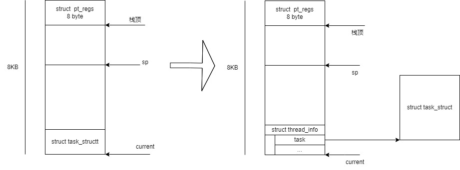
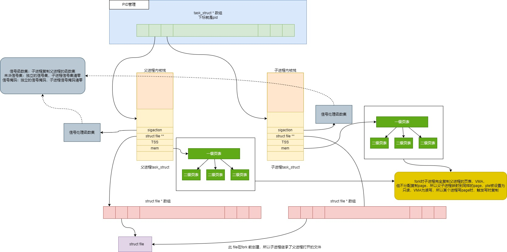
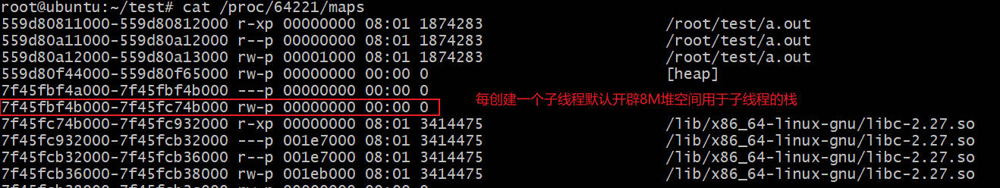
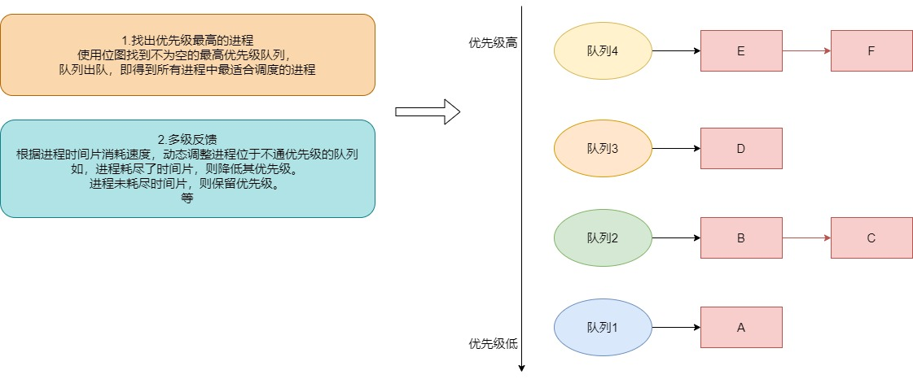
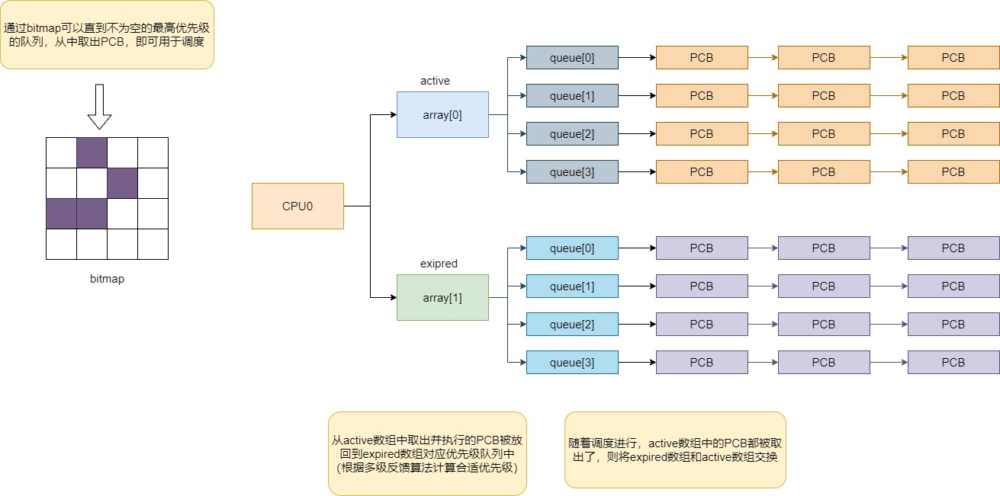
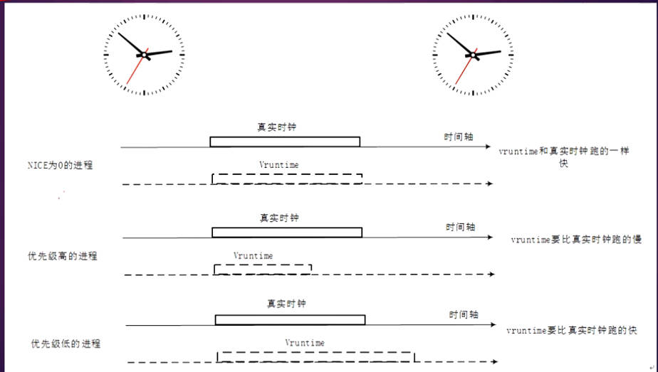
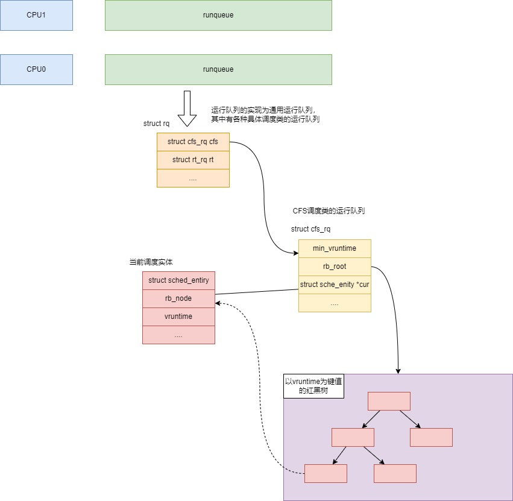

# 1. 理解什么是进程
## 进程的概念
要理解进程的概念，必须回顾历史，最早是单片机程序，程序独占完整的硬件资源，后来IBM做了多道批处理程序，让硬件计算机上可以运行多个程序，且每个程序认为自己独占完整的系统资源，IBM将这些运行的程序成为process，而管理这些process和让他们觉得资源独占的程序则为OS。

所以进程是软件抽象的概念，对操作系统而言进程是管理的基本单位，对程序而言进程让程序占用的资源独立

这些资源包括：
1. CPU资源 : CPU时间片，CPU上下文，调度类型
2. 内存资源 : VMA，页表
3. 文件相关 : 文件会话，进程根目录
4. 信号 : 未决信号集，阻塞信号集，信号处理函数
5. 定时器
6. 内核栈

为了方便管理task_struct，增加了如下概念
1. 进程状态
2. 进程和其他进程的关系

## Linux中对进程的定义
从Linux.0.11定义了进程基础属性
```c
struct task_struct {

/* these are hardcoded - don't touch */
	// 1. 调度相关
	// 进程状态
	long state;	/* -1 unrunnable, 0 runnable, >0 stopped */
	// 调度时间片 和 优先级
	long counter;
	long priority;

	// 2. 信号相关
	// 抵达的信号
	long signal;
	// 处理信号的方法
	struct sigaction sigaction[32];
	// 信号屏蔽字
	long blocked;	/* bitmap of masked signals */

/* various fields */
	// 进程退出原因
	int exit_code;

	// 3. 虚拟内存
	// 虚拟空间代码段，数据段，堆栈范围
	unsigned long start_code,end_code,end_data,brk,start_stack;

	// 4. 进程间关系
	// 进程号，父进程号，组进程号，会话号，组长
	long pid,father,pgrp,session,leader;
	// 进程所属的权限
	unsigned short uid,euid,suid;
	// 进程组所属的权限
	unsigned short gid,egid,sgid;

	// 5. 定时器
	// 定时器计数器，当为0时标记 SIGALRM
	long alarm;

	// 6. 运行时间 
	// 运行时间等
	long utime,stime,cutime,cstime,start_time;

	unsigned short used_math;

/* file system info */
	// 7. 文件相关
	// 绑定的终端
	int tty;		/* -1 if no tty, so it must be signed */
	// 创建文件使用的umask
	unsigned short umask;
	// 进程当前目录
	struct m_inode * pwd;
	// 初始目录
	struct m_inode * root;
	struct m_inode * executable;
	// fork时，子进程是否关闭已打开文件
	unsigned long close_on_exec;
	// 文件会话
	struct file * filp[NR_OPEN];

/* ldt for this task 0 - zero 1 - cs 2 - ds&ss */
	// 8. 内存管理相关
	// 页表
	struct desc_struct ldt[3];

/* tss for this task */
	// 9. 进程上下文
	struct tss_struct tss;
};
```
大致可以分为以下几类
- 进程管理: 
 - 调度 : state counter priority
 - 进程间关系 : pid father pgrp session leader
 - 杂项

- 资源
 - 定时器 : alarm
 - 信号资源 : signal sigaction blocked
 - 文件资源 : umask pwd root close_on_exec filp
 - 内存资源 : ldt

## 有关进程的重要概念
1. 进程的状态及其切换
2. 进程PID
3. 内核栈和task_struct

### 进程的运行状态
```c
/* Used in tsk->state: */
// 进程正在运行，或进程在就绪队列
#define TASK_RUNNING			0x0000
// 进程因等待资源被挂起，但可以被信号打断挂起状态
#define TASK_INTERRUPTIBLE		0x0001
// 进程因等待资源被挂起，但不可以被信号打断
#define TASK_UNINTERRUPTIBLE		0x0002
// 进程暂停
#define __TASK_STOPPED			0x0004
#define __TASK_TRACED			0x0008
/* Used in tsk->exit_state: */
// 进程退出
#define EXIT_DEAD			0x0010
// 进程退出，但task_struct没有被回收
#define EXIT_ZOMBIE			0x0020
```

#### 设置进程状态
设置进程状态推荐使用内核提供的宏，因为做了并发处理
```c
#define set_current_state(state_value)				\
	do {							\
		WARN_ON_ONCE(is_special_task_state(state_value));\
		current->task_state_change = _THIS_IP_;		\
		smp_store_mb(current->state, (state_value));	\
	} while (0)
```

### 进程的PID
* pid是进程的唯一编号
* pid的类型是int，默认最大32768
* 内核使用bitmap机制管理已分配的PID和空闲的PID,以循环使用pid
* 线程组使用组长的pid为自己pid

### task_struct 和内核栈

struct pt_reg : 用于保存进程上下文
sp : 指向当前栈顶
current : 早期指向task_struct，后来由于task_struct越来越大，为了不占用过多内核栈，则指向thread_info

#### 如何从sp找到task_struct
将sp指针按照THREAD_SIZE 8KB对齐，则获得current

```c
#define get_current() (current_thread_info()->task)
#define current get_current()

static inline struct thread_info *current_thread_info(void) __attribute_cons  t__;

static inline struct thread_info *current_thread_info(void)
{
  return (struct thread_info *)
	  (current_stack_pointer & ~(THREAD_SIZE - 1));
}
```

# 2. 进程创建
## fork
```asm
.align 2
_sys_fork:
    // 找空闲的process槽，返回index，返回值通过%eax传递
	call find_empty_process
    // testl 与操作，如果%eax为0，则跳转到ret，返回0
	testl %eax,%eax
	js 1f
    // 进行copy_process函数的压栈
    // 从右往左压栈
	push %gs
	pushl %esi
	pushl %edi
	pushl %ebp
	pushl %eax  // nr = %eax，传递process槽
    // 构造子进程
	call copy_process
	addl $20,%esp // 子进程从这里开始执行
1:	ret

// 获得空闲pid
int find_empty_process(void)
{
	int i;

	repeat:
		if ((++last_pid)<0) last_pid=1;
		for(i=0 ; i<NR_TASKS ; i++)
			if (task[i] && task[i]->pid == last_pid) goto repeat;
	for(i=1 ; i<NR_TASKS ; i++)
		if (!task[i])
			return i;
	return -EAGAIN;
}

int copy_process(int nr,long ebp,long edi,long esi,long gs,long none,
		long ebx,long ecx,long edx,
		long fs,long es,long ds,
		long eip,long cs,long eflags,long esp,long ss)
{
	struct task_struct *p;
	int i;
	struct file *f;

    // 分配内核栈，并从低地址处分配task_struct
	p = (struct task_struct *) get_free_page();
	if (!p)
		return -EAGAIN;
    // 将子进程的task_struct记录到全局task表，如此内核就能调度子进程了
	task[nr] = p;
    // 初始化子进程
    // 首先按照父进程task_struct所有内容设置子进程
	*p = *current;	/* NOTE! this doesn't copy the supervisor stack */
    // 再修改子进程task_struct不同的部分
    // 父进程是 TASK_RUNNING，子进程要改成 TASK_UNINTERRUPTIBLE，因为他还不能运行
	p->state = TASK_UNINTERRUPTIBLE;
    // 设置子进程的pid
	p->pid = last_pid;
    // 设置子进程的父进程pid
	p->father = current->pid;
    // 设置子进程的时间片或优先级
	p->counter = p->priority;
    // 子进程的未决信号集清零
	p->signal = 0;
    // 定时器清零
	p->alarm = 0;
	p->leader = 0;		/* process leadership doesn't inherit */
    // 运行时间清零
	p->utime = p->stime = 0;
	p->cutime = p->cstime = 0;
    // 开始时间重置
	p->start_time = jiffies;
    // 设置任务状态段（Task State Segment，TSS
	p->tss.back_link = 0;
    // 设置内核栈，从高地址往低地址分配
	p->tss.esp0 = PAGE_SIZE + (long) p;
	p->tss.ss0 = 0x10;
    // 设置子进程开始运行的指令地址，也就是call copy_process后一条指令
	p->tss.eip = eip;
	p->tss.eflags = eflags;
    // 设置fork返回值，子进程返回0
	p->tss.eax = 0;
	p->tss.ecx = ecx;
	p->tss.edx = edx;
	p->tss.ebx = ebx;
	p->tss.esp = esp;
	p->tss.ebp = ebp;
	p->tss.esi = esi;
	p->tss.edi = edi;
	p->tss.es = es & 0xffff;
	p->tss.cs = cs & 0xffff;
	p->tss.ss = ss & 0xffff;
	p->tss.ds = ds & 0xffff;
	p->tss.fs = fs & 0xffff;
	p->tss.gs = gs & 0xffff;
    // 给子进程分配页表
	p->tss.ldt = _LDT(nr);
	p->tss.trace_bitmap = 0x80000000;
	if (last_task_used_math == current)
		__asm__("clts ; fnsave %0"::"m" (p->tss.i387));
	// 复制页表和物理内存
    // linux0.11没有实现写时复制，所以必须复制父进程所有的page
	if (copy_mem(nr,p)) {
		task[nr] = NULL;
		free_page((long) p);
		return -EAGAIN;
	}
    // 子进程继承父进程的struct file
	for (i=0; i<NR_OPEN;i++)
		if (f=p->filp[i])
			f->f_count++;
    // 子进程的当前目录继承父进程
	if (current->pwd)
		current->pwd->i_count++;
    // 根目录继承父进程
	if (current->root)
		current->root->i_count++;
	if (current->executable)
		current->executable->i_count++;
	set_tss_desc(gdt+(nr<<1)+FIRST_TSS_ENTRY,&(p->tss));
	set_ldt_desc(gdt+(nr<<1)+FIRST_LDT_ENTRY,&(p->ldt));
	// 子进程可以被调度了
	p->state = TASK_RUNNING;	/* do this last, just in case */
    // 以上都是父进程在执行，返回子进程的pid
	return last_pid;
}
```

## 总结进程的创建

创建子进程重点：
- 分配PID, 内核通过PID获得对应进程的task_struct
- 分配task_struct和内核栈，并初始化task_struct, 内核通过task_struct管理进程资源和调度
  - state : 进程状态，决定进程是否参与调度
  - pid, father
  - counter : 决定优先级和运行时长
  - signal, alarm
  - tss : 用于CPU上下文切换，其中保存和EIP（决定进程从哪里开始运行），ESP0(记录进程内核栈)，EAX(函数返回值)，其他通用寄存器
  - mem : 虚拟内存和页表
  - files : 打开的文件
  - root, pwd

### vfork

### clone
```c
/*
 * fn : 
 * child_stack :
 * flags : 
 */
int clone(int (*fn)(void *), void *child_stack,
         int flags, void *arg, ...
         /* pid_t *ptid, void *newtls, pid_t *ctid */ );
```
clone 用于创建新的进程，

与fork(2)不同，clone()允许子进程与调用进程共享部分执行上下文，例如虚拟地址空间、文件描述符表和信号处理程序表

fn : 子进程通过调用参数fn指向的函数开始执行，当fn(arg)函数返回时，子进程终止，fn返回的整数是子进程的退出状态。子进程也可以通过调用exit(2)或接收致命信号来显式终止。

child_stack : child_stack参数指定子进程使用的堆栈的位置。由于子进程和调用进程可能共享内存，因此子进程无法在与调用进程相同的堆栈中执行。因此，调用进程必须为子堆栈设置内存空间，并将指向此空间的指针传递给clone()。在运行Linux的所有处理器上（除了HP PA处理器），堆栈向下增长，因此child_stack通常指向为子堆栈设置的内存空间的最高地址。

flags : flags的低字节包含子进程终止时发送给父进程的终止信号编号。如果指定的信号不是SIGCHLD，则父进程在使用wait(2)等待子进程时必须指定__WALL或__WCLONE选项。如果未指定信号，则子进程终止时不会向父进程发送信号。

flags还可以与以下常量之一按位或运算，以指定调用进程和子进程之间共享的内容：
#### 创建进程和创建线程
```c
fork
  clone(child_stack=NULL, flags=CLONE_CHILD_CLEARTID|CLONE_CHILD_SETTID|SIGCHLD, child_tidptr=0x7f1c3f73c790) = 63487

pthread_create
  clone(child_stack=0x7fa42fde6fb0, flags=CLONE_VM|CLONE_FS|CLONE_FILES|CLONE_SIGHAND|CLONE_THREAD|CLONE_SYSVSEM|CLONE_SETTLS|CLONE_PARENT_SETTID|CLONE_CHILD_CLEARTID, parent_tidptr=0x7fa42fde79d0, tls=0x7fa42fde7700, child_tidptr=0x7fa42fde79d0) = 63972
```


pthread_create 的 child_stack 指向开辟的堆空间

- CLONE_VM : 如果设置了CLONE_VM标志，调用进程和子进程将在同一个内存空间中运行，即父子进程使用同一个页表
- CLONE_FS : 如果设置了CLONE_FS，调用进程和子进程共享相同的文件系统信息。这包括文件系统的根目录、当前工作目录和umask。由调用进程或子进程执行的任何chroot(2)、chdir(2)或umask(2)调用也会影响另一个进程。
- CLONE_FILES : 如果设置了CLONE_FILES，调用进程和子进程共享相同的文件描述符表。由调用进程或子进程创建的任何文件描述符在另一个进程中也是有效的。同样，如果其中一个进程关闭文件描述符或更改其关联的标志（使用fcntl(2)的F_SETFD操作），另一个进程也会受到影响。如果共享文件描述符表的进程调用execve(2)，其文件描述符表会被复制（不共享）
- CLONE_SIGHAND : 用于控制创建的子进程是否与调用进程共享相同的信号处理程序表。
  - 如果设置了CLONE_SIGHAND标志，调用进程和子进程将共享相同的信号处理程序表。
  - 如果调用进程或子进程调用sigaction(2)来更改与某个信号相关联的行为，该行为也会在另一个进程中改变。然而，调用进程和子进程仍然具有不同的信号屏蔽和待处理信号集。因此，它们中的一个可以使用sigprocmask(2)来阻塞或解除阻塞信号，而不会影响另一个进程。
  - 如果未设置CLONE_SIGHAND标志，子进程在调用clone()时继承了调用进程的信号处理程序的副本。之后由其中一个进程执行的sigaction(2)调用对另一个进程没有影响。
- CLONE_THREAD : 
  - 用于将创建的子进程放置在与调用进程相同的线程组中。
  - 用于支持POSIX线程的概念，即一组共享单个PID的线程。
  - 在内部，这个共享的PID被称为线程组标识符（TGID）。调用getpid(2)会返回调用者的TGID。
  - 线程组中的线程可以通过它们的（系统范围内的）唯一线程ID（TID）进行区分。线程可以使用gettid(2)获取自己的TID。
  - 当调用clone()而没有指定CLONE_THREAD时，结果线程将被放置在一个新的线程组中，其TGID与线程的TID相同。这个线程是新线程组的领导者。
  - 使用CLONE_THREAD创建的新线程具有与clone()调用者相同的父进程（类似于CLONE_PARENT），因此对于线程组中的所有线程，调用getpid(2)会返回相同的值。
  - 当一个CLONE_THREAD线程终止时，使用clone()创建它的线程不会收到SIGCHLD（或其他终止）信号；也无法使用wait(2)获取这样一个线程的状态。
  - 在线程组中的所有线程终止后，线程组的父进程会收到一个SIGCHLD（或其他终止）信号。
  - 如果线程组中的任何一个线程执行了execve(2)，则除线程组领导者之外的所有线程都会被终止，并在线程组领导者中执行新程序。
  - 如果线程组中的一个线程使用fork(2)创建了一个子进程，则线程组中的任何一个线程都可以使用wait(2)等待该子进程。
  - 如果指定了CLONE_THREAD，标志中还必须包括CLONE_SIGHAND，CLONE_VM
  - 信号可以作为整个线程组（即TGID）使用kill(2)发送，也可以作为特定线程（即TID）使用tgkill(2)发送。
  - 信号的处理和动作是进程范围的：如果一个未处理的信号被传递给一个线程，它将影响线程组中的所有成员（终止、停止、继续、被忽略）。
  - 每个线程都有自己的信号掩码，由sigprocmask(2)设置，但信号可以挂起在整个进程（即可传递给线程组的任何成员）或单个线程上，当使用kill(2)发送时。调用sigpending(2)返回一个信号集，其中包含整个进程挂起的信号和调用线程挂起的信号的并集。
  - 如果使用kill(2)向线程组发送信号，并且线程组已经安装了该信号的处理程序，则该处理程序将在线程组中的一个未阻塞该信号的成员中被调用。如果线程组中的多个线程都在使用sigwaitinfo(2)等待接收相同的信号，内核将任意选择其中一个线程来接收使用kill(2)发送的信号。
CLONE_SYSVSEM : 用于在子进程和调用进程之间共享一个System V信号量调整（semadj）值的列表。如果设置了CLONE_SYSVSEM标志，则子进程和调用进程共享一个System V信号量调整（semadj）值的列表。在这种情况下，共享列表会累积所有共享该列表的进程的semadj值，并且只有当最后一个共享该列表的进程终止（或使用unshare(2)停止共享该列表）时，才会执行信号量调整。如果未设置此标志，则子进程具有一个单独的semadj列表，该列表最初为空。
CLONE_VFORK : 父子进程共享页表，即子进程连页表的复制都省略了，父进程进入睡眠等待子进程完成工作，直到子进程exit()或调用execve()

# 3. 进程的终止
- 主动终止
  - 从main返回，链接程序会自动添加exit()调用
  - 主动调用exit()
- 被动终止 
  - 进程收到一个自己不能处理的信号 
  - 进程在内核态执行的时候产生异常，进程就会收到信号
  - 进程收到SIGKILL信号

# 4. 特殊的进程
0号进程 : 0号进程的task_struct在源码中被定义，是内核进程，也成为idle进程 swap进程
1号进程 : 1号进程，也称init进程，是第一个用户态运行的进程，所有孤儿进程交给1号进程处理


# 进程的调度
- 本质 : 进程调度就是从TASK_RUNNING 可运行的进程中找出一个进程，切换运行该进程
- 背景 : 而进程调度要考虑进程的类型，即 IO消耗性，CPU消耗性
- 目标 : 我们既希望切换运行的进程能有效利用CPU，又希望IO响应迅速

## 从Linux0.11理解调度的本质

Linux0.11 进程调度的算法是，从所有TASK_RUNNING的进程中找出剩余时间片最大数的进程，切换运行，如果所有进程的时间片都消耗完了，则按照进程优先级将时间片复位，再找出最大时间片的进程进行切换运行

```c
void schedule(void)
{
	int i,next,c;
	struct task_struct ** p;

	for(p = &LAST_TASK ; p > &FIRST_TASK ; --p)
		if (*p) {
            // 进程定时器触发，给进程发送 SIGALRM
			if ((*p)->alarm && (*p)->alarm < jiffies) {
					(*p)->signal |= (1<<(SIGALRM-1));
					(*p)->alarm = 0;
				}
            // 如果进程有待处理的信号，且没有被屏蔽，且信号为 TASK_INTERRUPTIBLE，则将其状态置为 TASK_RUNNING
			if (((*p)->signal & ~(_BLOCKABLE & (*p)->blocked)) &&
			(*p)->state==TASK_INTERRUPTIBLE)
				(*p)->state=TASK_RUNNING;
		}

/* this is the scheduler proper: */

	while (1) {
		c = -1;
		next = 0;
		i = NR_TASKS;
		// 找到状态为TASK_RUNNING且剩余时间片最大的进程
		p = &task[NR_TASKS];
		while (--i) {
			if (!*--p)
				continue;
			if ((*p)->state == TASK_RUNNING && (*p)->counter > c)
				c = (*p)->counter, next = i;
		}
		// 如果找到了，则进行切换
		if (c) break;
		// 如果没有，则说明所有进程的时间片都使用完了，则将所有
		// 进程的时间片复位
		for(p = &LAST_TASK ; p > &FIRST_TASK ; --p)
			if (*p)
				(*p)->counter = ((*p)->counter >> 1) +
						(*p)->priority;
	}
	switch_to(next);
}
```

## 时钟中断，时间片递减

从上面的调度算法可知，切换哪个进程的关键是看进程的当前时间片，

进程的当前时间片的改变是由时钟中断处理函数处理的,

时间中断做两件事:
- 当前进程的时间片减少
- 可能的调度 : 时钟中断发生时，如果进程运行在内核态，即使时间片耗尽，也不会强制调度，由进程自己择机主动调度，如果进程运行在，时间片耗尽，则会强制进行调度

### _timer_interrupt

每次时钟中断，调用 `_timer_interrupt` 处理，

`_timer_interrupt`调用 `do_timer`

```c
.align 2
_timer_interrupt:
	push %ds		# save ds,es and put kernel data space
	push %es		# into them. %fs is used by _system_call
	push %fs
	pushl %edx		# we save %eax,%ecx,%edx as gcc doesn't
	pushl %ecx		# save those across function calls. %ebx
	pushl %ebx		# is saved as we use that in ret_sys_call
	pushl %eax
	movl $0x10,%eax
	mov %ax,%ds
	mov %ax,%es
	movl $0x17,%eax
	mov %ax,%fs
	incl _jiffies
	movb $0x20,%al		# EOI to interrupt controller #1
	outb %al,$0x20
	movl CS(%esp),%eax
	andl $3,%eax		# %eax is CPL (0 or 3, 0=supervisor)
    // 给_do_timer压栈传参，如果当前运行在内核态则传0，如果运行在用户态则传3
	pushl %eax
	call _do_timer		# 'do_timer(long CPL)' does everything from
	addl $4,%esp		# task switching to accounting ...
	jmp ret_from_sys_call
```

##### do_timer
```c
// cpl : 0 或者 3，
//       0表示当前中断发生时进程运行在内核态
//       3表示当前中断发生时进程运行在用户态           
void do_timer(long cpl)
{
	extern int beepcount;
	extern void sysbeepstop(void);

	if (beepcount)
		if (!--beepcount)
			sysbeepstop();

	if (cpl)
		current->utime++; // 用户态运行时间增加
	else
		current->stime++; // 内核态运行时间增加

	if (next_timer) {
		next_timer->jiffies--;
		while (next_timer && next_timer->jiffies <= 0) {
			void (*fn)(void);
			
			fn = next_timer->fn;
			next_timer->fn = NULL;
			next_timer = next_timer->next;
			(fn)();
		}
	}
	if (current_DOR & 0xf0)
		do_floppy_timer();
	// 将当前进程的时间片递减，如果时间片为0，则进行进程调度
	if ((--current->counter)>0) return;
	current->counter=0;
	// 如果时钟中断发生在内核态，则不进行调度
	// 只有用户态才进行调度
	if (!cpl) return;
	// 当前为用户态且时间片为0，进行调度
	schedule();
}
```

## 进程调度的改进
### O(n)
在直到Linux2.4，Linux的调度器都是O(n)的算法，即要找到最适合调度的进程需要遍历所有进程，原理和上面类似

### 多级反馈队列 O(1)



### Linux2.6 O(1)



Linux给每个CPU构造一个运行队列，使用bitmap算法快速找到被调度的PCB，使用多级反馈算法动态调整进程的优先级

### CFS O(logN)


CFS算法没有时间片的概念，而是使用虚拟时钟，优先级高的进程虚拟时钟慢，优先级低的进程虚拟时钟快，

CFS以nice值为0的虚拟时钟为基准，每次调度虚拟时钟刻度最晚的进程。

vruntime的计算方法：
```
vruntime = (delta_exec * nice_0_weight) / weight
delta_exec : 实际运行时间
nice_0_weight : nice0的权重比
weight : 当前进程的权重比
```

CFS将所有PCB放入红黑树，红黑树的键值为vruntime，要找到被调度的进程，就只需要找到vruntime最小的进程，也就是红黑树最左边的节点。
所以CFS 是O(logN)调度算法，


CFS的时钟中断中不会减少时间片，而是重新计算本进程的vruntime，并调整红黑树，如果进程运行在内核态，则会被标记为 need_reschedule并返回，如果运行在用户态则再次调度，即选出当前vruntime最小的节点，切换进程

## 调度类
Linux实现了多种调度类，用于不同类型的进程

- SCHED_FAIR : 普通进程，使用CFS调度类
- SCHED_RT : 实时进程
- SCHED_DEADLINE : deadline进程
- SCHED_IDLE : idle进程

进程在用户态使用可以通过下面接口设置自己的调度类
```c
       int sched_setscheduler(pid_t pid, int policy,
           const struct sched_param *param);
       int sched_getscheduler(pid_t pid);
```

## 调度器的数据结构



## 调度时机
- 阻塞操作(进程被阻塞会被移出runqueue，cfs的红黑树被改变，需要重新调度 )
- 中断处理和系统调用后，返回用户态前
- 将要被唤醒的进程(唤醒的进程会被加入runqueue，所以需要找到当前最适合运行的进程)

内核抢占和调度

如果程序一直运行不调用系统调用，它会被时钟中断而强制调度。

但程序若运行在内核空间，并且没有主动调用调度，则会一直运行，时钟中断只能增加其vruntime。

但若内核支持抢占，则内核态下也会被动调度

# 进程的切换
```asm
#define switch_to(prev,next,last)					\
do {									\
	last = __switch_to(prev,task_thread_info(prev), task_thread_info(next));	\
} while (0)

/*
 * 从 previous 线程切换到 next 线程
 * r0 = previous task_struct, r1 = previous thread_info, r2 = next thread_info
 * previous and next are guaranteed not to be the same.
 */
ENTRY(__switch_to)
										@ 1. 保存当前线程的cpu_context
	add	ip, r1, #TI_CPU_SAVE            @ 获得当前进程 cpu_context的内存基地址，存放在ip寄存器
	stmia	ip!, {r4 - sl, fp, sp, lr}	@ 保存当前线程的寄存器
	                                    @ 以ip为基地址，将 r4 - sl 寄存器和
										@ fp sp lr 寄存器全部保存到 thread_info.cpu_context

										@ 2. 调用 atomic_notifier_call_chain
	mov	r5, r0                          @ 用r5暂存 previously task_struct
	add	r4, r2, #TI_CPU_SAVE
	ldr	r0, =thread_notify_head         @ 函数参数0 =thread_notify_head
	mov	r1, #THREAD_NOTIFY_SWITCH       @ 函数参数1 #THREAD_NOTIFY_SWITCH
	bl	atomic_notifier_call_chain      @ 调用函数 atomic_notifier_call_chain
	mov	r0, r5                          @ r0记录 previously task_struct

										@ 3. 切换next线程的cpu_context
	ldmia	r4, {r4 - sl, fp, sp, pc}	@ Load all regs saved previously
```


### thread_info 和 进程上下文 cpu_context
```c
// thread_info保存在线程内核栈区底部
// cpu_context字段用于记录线程上下文
struct thread_info {
	unsigned long		flags;		/* low level flags */
	int			preempt_count;	/* 0 => preemptable, <0 => bug */
	mm_segment_t		addr_limit;	/* address limit */
	struct task_struct	*task;		/* main task structure */
	struct exec_domain	*exec_domain;	/* execution domain */
	__u32			cpu;		/* cpu */
	__u32			cpu_domain;	/* cpu domain */
	struct cpu_context_save	cpu_context;	/* cpu context */
	__u32			syscall;	/* syscall number */
	__u8			used_cp[16];	/* thread used copro */
	unsigned long		tp_value;
	struct crunch_state	crunchstate;
	union fp_state		fpstate __attribute__((aligned(8)));
	union vfp_state		vfpstate;
	struct restart_block	restart_block;
};


struct cpu_context_save {
	__u32	r4;
	__u32	r5;
	__u32	r6;
	__u32	r7;
	__u32	r8;
	__u32	r9;
	__u32	sl;
	__u32	fp;
	__u32	sp;
	__u32	pc;
	__u32	extra[2];		/* Xscale 'acc' register, etc */
};
```

### 新进程从哪里开始运行
```asm
ENTRY(__switch_to)
	stmia	ip!, {r4 - sl, fp, sp, lr}	
	ldmia	r4, {r4 - sl, fp, sp, pc}	
```

因为进程保存上下文是将lr寄存器的值保存到 `thread_info.cpu_context.pc` ，所以当切换运行时，pc的值为lr的值，也就是 `__switch_to` 的返回地址开始运行, 其调用关系如下，所以最后从 schedule 返回

```c
schedule
	context_switch(rq, prev, next);		
		switch_to(prev, next, prev);
			__switch_to
```

# 进程的睡眠和唤醒
## wait_event
```c

/*
 * wait_event : 进程睡眠在等待队列wq上，直到表达式 condition 结果
 * 为真，进程会被置位 TASK_UNINTERRUPTIBLE ，然后主动调度，由于
 * 进程状态不是TASK_RUNNING，所以进程之后都不会被调度，直到用户发现
 * 某些变量改变导致condition为真时，就调用 wake_up() 唤醒wq上所有
 * 进程，也就是将进程的运行状态改成TASK_RUNNING
 */
#define wait_event(wq, condition) 					\
do {									\
	if (condition)	 						\
		break;							\
	__wait_event(wq, condition);					\
} while (0)

#define __wait_event(wq, condition) 					\
do {									\
	// 创建等待队列节点，并将当前进程记录到节点
	DEFINE_WAIT(__wait);						\
	wait_queue_t __wait = {						\
		.private	= current,				\
		.func		= autoremove_wake_function,		\
		.task_list	= LIST_HEAD_INIT((__wait).task_list),	\
	}
									\
	for (;;) {							\
		// 将__wait节点加入wq，并改变进程状态为TASK_UNINTERRUPTIBLE
		prepare_to_wait(&wq, &__wait, TASK_UNINTERRUPTIBLE);	\
		// 如果条件为真，则退出
		if (condition)						\
			break;						\
		// 调度进程，由于当前进程状态为TASK_UNINTERRUPTIBLE
		// 所以之后都不会被调度，除非wake_up
		schedule();						\
	}								\
	// 设置进程状态为TASK_RUNNING
	// 并将节点移除等待队列
	finish_wait(&wq, &__wait);					\
} while (0)

#define is_sync_wait(wait)	(!(wait) || ((wait)->private))

void
prepare_to_wait(wait_queue_head_t *q, wait_queue_t *wait, int state)
{
	unsigned long flags;

	wait->flags &= ~WQ_FLAG_EXCLUSIVE;
	spin_lock_irqsave(&q->lock, flags);
	// 如果节点task_list为空，说明节点没有加入等待队列
	// 则加入等待队列q，否则说明已经加入了等待队列,则
	// 不进行加入
	if (list_empty(&wait->task_list))
		__add_wait_queue(q, wait);
			list_add(&new->task_list, &head->task_list);
	// 改变进程状态
	if (is_sync_wait(wait))
		set_current_state(state);
	spin_unlock_irqrestore(&q->lock, flags);
}

void finish_wait(wait_queue_head_t *q, wait_queue_t *wait)
{
	unsigned long flags;

	__set_current_state(TASK_RUNNING);
	// 如果节点加入了等待队列，则进行移除
	if (!list_empty_careful(&wait->task_list)) {
		spin_lock_irqsave(&q->lock, flags);
		list_del_init(&wait->task_list);
		spin_unlock_irqrestore(&q->lock, flags);
	}
}
```

### wake_up
```c
// 唤醒等待队列x上，状态为 TASK_UNINTERRUPTIBLE 或 TASK_INTERRUPTIBLE 的线程
// 如果被唤醒的为独占线程，则唤醒一个线程后就返回，好让他尽快被调度执行
// 如果被唤醒的为普通线程，则可能会唤醒多个线程，调度时，他们进行争抢，获得运行权力
// 线程的状态置为 TASK_RUNNING 则为被唤醒
#define wake_up(x)          __wake_up((x),TASK_UNINTERRUPTIBLE | TASK_INTERRUPTIBLE, 1)

/*
 * mode : 哪类线程被唤醒
 * nr_exclusive : 被唤醒的独占线程数量
 */
void __wake_up(wait_queue_head_t *q, unsigned int mode, int nr_exclusive)
{
  unsigned long flags;

  spin_lock_irqsave(&q->lock, flags);
  __wake_up_common(q, mode, nr_exclusive, 0);
  spin_unlock_irqrestore(&q->lock, flags);
}


static void __wake_up_common(wait_queue_head_t *q, unsigned int mode, int nr_exclusive, int sync)
{
  struct list_head *tmp, *next;

  list_for_each_safe(tmp, next, &q->task_list) {
      wait_queue_t *curr;
      unsigned flags;
      curr = list_entry(tmp, wait_queue_t, task_list);
      flags = curr->flags;
      // 唤醒curr线程，如果线程唤醒成功，
      // 并且是独占线程，
      // 则将nr_exclusive减一，
      // 如果nr_exclusive为0则提前退出，否则进行唤醒其他线程 
      if (curr->func(curr, mode, sync) &&
          (flags & WQ_FLAG_EXCLUSIVE) &&
          !--nr_exclusive)
          break;
  }
}

int autoremove_wake_function(wait_queue_t *wait, unsigned mode, int sync, void *key)
{
	int ret = default_wake_function(wait, mode, sync, key);
		return try_to_wake_up(curr->private, mode, sync);
            rq = task_rq_lock(p, &flags); // 获得进程相关CPU的运行队列
            if (!p->array)  // 如果进程没有加入运行队列
                activate_task(p, rq);  //则将其加入运行队列
			p->state = TASK_RUNNING; // 并设置状态为可运行
            return success; // 返回成功
    
    // 将等待队列项移出等待队列
	if (ret)
		list_del_init(&wait->task_list);
	return ret;
}
```

# PID
## 线程组的PID

# INIT_TASK

# current 和内核栈
## thread_info


