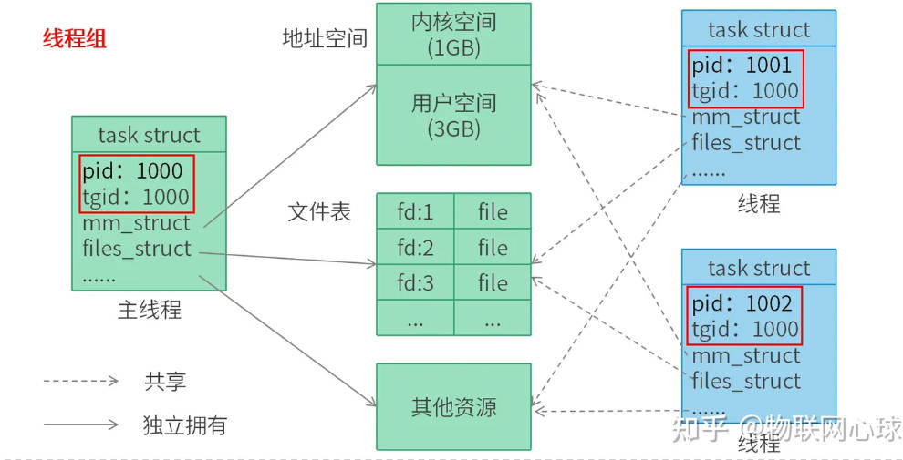

# 程序和进程和线程

## 程序和进程

进程 = 执行期的程序 + 占用的资源

程序 : .text .bss .data .rodata

占用资源 : 
- 信号资源 : 阻塞信号集，未决信号队列，信号处理函数
- 内存资源 : 虚拟内存，页表
- 文件系统资源 : 当前目录，进程根目录
- 文件会话资源 : 打开的文件
- cpu上下文 : cpu寄存器

## 线程和进程

Linux没有实现真正的线程，而是轻量级进程，但从用户空间视角，其行为表现为线程。

Linux使用线程组将进程实现为轻量级进程，即线程。

多个线程构成一个线程组，

组长线程有独立的资源：内存，信号，文件系统，文件会话等资源

其他线程共享组长线程的资源。

* 线程getpid

线程的task_struct有不同的pid，但是子线程的tgid等于组线程的tgid。

组线程的tgid等于自己的pid

系统调用`getpid()`返回子线程的pid时，实际返回的是自己的tgid，即主线程的pid

* 进程视角的top命令：

不带参数的top命令(默认情况)，显示的是进程对单核CPU的利用率，

例如，一个进程内有三个线程，主线程创建了线程1和线程2，

对双核CPU而言，线程1和线程2各用一个核，占用率都是100%，

则top命令看到的进程CPU利用率是200%，进程ID是主线程的PID(也就是TGID)。

* 线程视角的top命令：

`top –H`命令从线程视角显示CPU占用率，上例中，将会显示，线程1占用率100%，线程2占用率100%。

说线程的PID，是指用户空间的进程ID，值就是TGID；当特别指出，线程在内核空间的PID，则指线程在内核中task_struct里特有的PID。

## 线程和信号

见 ipc.md

# task_struct

## init 进程

