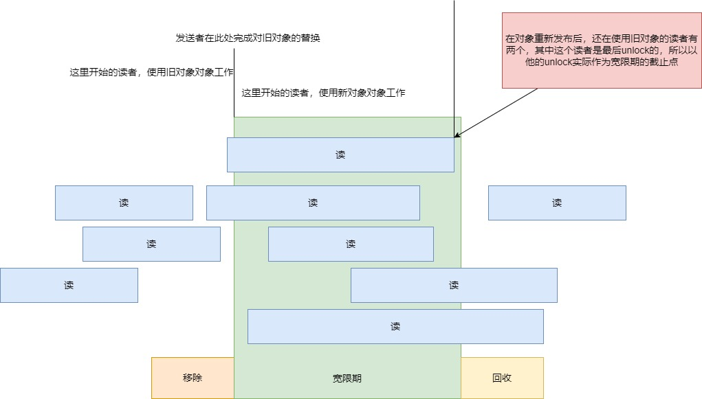

# 原子操作 

## 什么是原子操作

源代码中一条语句，即使是汇编代码，经过cpu解码后，实际执行的是多条代码，当多个cpu并发执行时，语义就可能异常，

比如 ++i，一条语句，cpu会分为三个步骤完成。

1. 加载i的值到寄存器

2. 增加寄存器中i的值

3. 根据寄存器中的值写回到i的内存

若两个线程同时执行++i，当线程1修改i内存前，线程2开始++i的工作时，语义就错误。

为了解决这个问题，硬件必须提供指令隔离两个操作，这就是原子指令。

当使用原子指令执行 ++i，

CPU1开始执行时，会让其他CPU对i的操作暂停

可见原子操作本质上是最小粒度的自旋锁

# 缓存一致性

CPU直接操作内存的是自己的缓存，在SMP场景下，内存中的变量i，会在每个CPU缓存中有一个副本。

当一个CPU修改i时，需要将i的修改值同步给其他CPU缓存，

这是由硬件实现的，当进行同步时，其他CPU的工作也会被暂停。

为了避免缓存一致性导致的性能损耗，高性能程序会使用per cpu解决

# 内存屏障

## 硬件基础


### cache

cache是一定大小的高速内存，并使用硬件实现哈希表，根据目标地址求哈希获得操作的位置

cache未命中是软件开发者要关注

### 写操作缓存

当cpu进行写操作时，若发生cache未命中，通常cpu需要等待加载，但现代cpu增加了写操作缓存，将未执行的写操作记录到写操作缓存中，cpu便可以继续执行，

当变量加载到cache后，变量的值将根据写操作缓存的内容被立即覆盖。


### 消息队列

在SMP场景下，同一个变量，每个cpu的cache中一个变量的副本.

为保持cache中变量的同步，使用MESI协议，

比如当某个cpu0执行a = 1后，cpu0不仅会修改自己a的值，还会发送"使a无效"消息，

消息会存放到消息队列，当cpu1有空时，会处理消息，如读到 "使a无效" 消息，则会将缓存a标记为无效。

当cpu1读取a时，由于缓存无效，会发送 "读a" 消息，并从cpu1中获得a的最新值.

## 为什么需要内存屏障

在SMP多线程环境下，很容易出现cache中变量未及时同步的问题，所以需要内存屏障

### 为什么会有cache变量未及时同步

cpu0
    a = 1;
    b = 1;

cpu1
    while (b == 0) continue;
    assert(a == 1);

有如上代码，并假设 cpu0 cache已缓存b，cpu1 cache已缓存a

1. cpu0 : a = 1; 缓存未命中，a=1操作存放到写缓存，并发送 "读使无效" 消息

2. cpu1 : while(b == 0) 缓存未命中，发送 "读"消息

3. cpu0 : b = 1; 缓存命中，修改缓存中b的值

4. cpu0 : 处理 "读b" 消息，发送响应

5. cpu1 : while(b == 0) 缓存命中，且b为 1，退出循环

6. cpu1 : assert(a == 1) ，a为0，触发错误

7. cpu1 ：处理 "读使无效"，将 a标记为无效，并回复响应

可见导致异常的原因为
1. cpu0并没有确认执行完 a = 1，而是将a = 1放到写操作缓存，然后就执行b=1，完成了b的更新，而a的更新被延后了
2. cpu1没有及时处理 "使a无效" 的消息，可能在执行完 assert(a == 1)后再处理消息

简单说就是 使无效队列 或 写操作缓冲区 没有及时处理

## smp_mb

cpu0
    a = 1;
    smp_mb(); 
    b = 1;

cpu1
    while (b == 0) continue;
    smp_mb(); 
    assert(a == 1);

1. cpu0 : a = 1; 缓存未命中，a=1操作存放到写缓存，并发送 "读a使a无效" 消息

2. cpu1 : while(b == 0) 缓存未命中，发送 "读b"消息

3. cpu0 : smp_mb(); 读写内存屏障，标记 使无效队列 和 写操作缓存区

4. cpu0 : b = 1; 缓存命中，由于标记了 写操作缓存区，写操作缓冲区中已有操作必须先执行，所以将 b = 1的操作存入写操作缓存，并发送 "使b无效"

5. cpu1 : 处理 "读a" 消息，发送响应

6. cpu0 : 处理响应消息，缓存中写入a = 0

7. cpu0 : 由于缓存中a存在，执行 写操作缓存 a = 1，b = 1

8. cpu0 : 发送 "读b" 消息的响应

9. cpu1 : while(b == 0) 退出循环

10. cpu1 : smp_mb(), 读写内存屏障，标记 使无效队列 和 写操作缓存区

11. cpu1 : 由于标记了 使无效队列，必须处理完消息队列中的 "使无效" 消息，所以标记a无效

12. cpu1 : 发送 "读a" 消息

13. cpu0 : 响应 "读a"

14. cpu1 : 程序正常


## 更小粒度的内存屏障

很多CPU体系结构提供更弱的内存屏障指令，这些指令仅仅做其中一项或者几项工作。

不准确的说，

读内存屏障 : 仅仅标记它的使无效队列

写内存屏障 : 仅仅标记它的存储缓冲区

完整的内存屏障 : 同时标记无效队列及存储缓冲区。

这样的效果是，

读内存屏障仅仅保证执行该指令的CPU上面的装载顺序，因此所有在读内存屏障之前的装载，将在所有随后的装载前完成。

写内存屏障仅仅保证写之间的顺序，所有在内存屏障之前的存储操作，将在其后的存储操作完成之前完成。

完整的内存屏障同时保证写和读之间的顺序，这也仅仅针对执行该内存屏障的CPU来说的。


cpu0
    a = 1;
    smp_wmb(); 
    b = 1;

cpu1
    while (b == 0) continue;
    smp_rmb(); 
    assert(a == 1);

# volatile和多线程

编译器的视角是局部单线程的，所以对于栈上的数据，编译器能较好的理解语义，并优化代码，

但对于堆上和静态数据，编译器只能片面的理解语义，特别是无法考虑中断，多线程的情况，

有些代码是需要结合多处语句，才能得到正确语义，这导致编译器无法理解这些语句存在的意义，进行代码优化，最终导致程序异常。

要解决这个问题，需要用 volatile 。

## XXX_ONCE

XXX_ONCE 是对volatile 局部使用的封装

```c
#define ACCESS_ONCE(x) (*(volatile typeof(x) *)&(x))
#define READ_ONCE(x) \
                ({ typeof(x) ___x = ACCESS_ONCE(x); ___x; })
#define WRITE_ONCE(x, val) \
                do { ACCESS_ONCE(x) = (val); } while (0)
```

下面示例说明其作用

比如下面的场景
```c
static int should_continue;
static void do_something(void);

while (should_continue)
do_something();
```

若do_something中没有修改should_continue，则编译器可以优化代码为

```c
if (should_continue)
for (;;)
do_something();
```

再单线程中没有问题，但若是多线程环境，另一个线程修改了should_continue，则程序语义完全改变。

正确的做法是
```c
static int should_continue;
static void do_something(void);

while (READ_ONCE(should_continue))
do_something();
```

再比如

```c
p = global_ptr;
if (p && p->s && p->s->func)
p->s->func();
```

编译器可以优化为

```c
if (global_ptr && global_ptr->s && global_ptr->s->func)
global_ptr->s->func();
```

可是另一个线程修改global_ptr为NULL，则会导致段错误

正确的做法是

```c
p = READ_ONCE(global_ptr);
if (p && p->s && p->s->func)
p->s->func();
```

再比如

```c
for (;;) {
still_working = 1;
do_something();
}
```

建设do_something的实现是可见的，且没有修改still_working，则编译器会优化代码为

```c
still_working = 1;
for (;;) {
do_something();
}
```

若其他线程执行了

```c
for (;;) {
still_working = 0;
sleep(10);
if (!still_working)
panic();
}
```

则会导致其他线程panic

正确的做法为

```c
for (;;) {
WRITE_ONCE(still_working, 1);
do_something();
}
```
## atomic_xxx 是否还需要 volatile

原子变量不需要volatile，因为编译器不会优化原子变量的相关操作

比如下面的代码

```c
void func1()
{
    atomic_uint a;
    atomic_init(&a, 1);

    atomic_store(&a, 2);
}

void func2()
{
    unsigned int a = 1;
    a = 2;
}
```

arm-linux-gcc -O2

```asm
func1:
        sub     sp, sp, #16
        mov     w1, 1
        add     x0, sp, 12
        str     w1, [x0]
        mov     w1, 2
        stlr    w1, [x0]
        add     sp, sp, 16
        ret
func2:
        ret
```

如果func2使用XXX_ONCE

```c
void func2()
{
    unsigned int a;
    WRITE_ONCE(a, 1);
    WRITE_ONCE(a, 2);
}
```

```asm
func1:
        sub     sp, sp, #16
        mov     w1, 1
        add     x0, sp, 12
        str     w1, [x0]
        mov     w1, 2
        stlr    w1, [x0]
        add     sp, sp, 16
        ret
func2:
        sub     sp, sp, #16
        mov     w0, 1
        str     w0, [sp, 12]
        mov     w0, 2
        str     w0, [sp, 12]
        add     sp, sp, 16
        ret
```

## 原子变量和 volatile 的对比

原子变量相当于volatile的升级版，不仅不会被gcc优化，而且使用原子指令

volatile 虽然使用一般指令，但是由于原子指令会导致cpu性能下降，所以当对数据的更新值获取不严格时，可以使用volatile


# CAS

CAS(obj, expected, desired)

其逻辑为

bool CAS(_Atomic long *obj, long *expected, long desired) {
    bool ret = false;
    if (*obj == *expected) {
        *obj = desired;
        ret = true;
    }
    *expected = obj;
    return ret;
}

## CAS_strong 和 CAS_weak

要理解为什么会有两种CAS实现，需要知道CAS导致的致命ABA问题

### ABA问题

在多线程计算中，ABA问题发生在同步过程中，当一个位置被读取两次，两次读取的值相同，并且读取值相同被用来得出结论认为中间没有发生任何事情；

然而，另一个线程可以在两次读取之间执行，改变值，做其他工作，然后将值改回，从而欺骗第一个线程认为没有发生变化，尽管第二个线程做了违反该假设的工作。

#### ABA问题的示例

// 用 CAS 实现无锁stack
class Stack {
  std::atomic<Obj*> top_ptr;

  Obj* Pop() {
    while (1) {
      Obj* ret_ptr = top_ptr;

      if (ret_ptr == nullptr) return nullptr;

      Obj* next_ptr = ret_ptr->next;

      // 如果 top_ptr == ret_ptr, 就说明stack没有改变过，则将 top_ptr指向下一个节点(top_ptr = next_ptr)，并返回出栈元素(ret_ptr)
      // 此处没有考虑ABA问题，所以有bug
      if (top_ptr.compare_exchange_weak(ret_ptr, next_ptr)) {
        return ret_ptr;
      }
      // 如果 top_ptr != ret_ptr，就说明stack被其他线程移动了，需要重新获得next_ptr和ret_ptr
    }
  }

  void Push(Obj* obj_ptr) {
    while (1) {
      Obj* next_ptr = top_ptr;
      obj_ptr->next = next_ptr;

      // 如果 top_ptr == next_ptr 说明stack没有改变过，top_ptr = obj_ptr，实现入栈，并结束push
      // 此处没有考虑ABA问题，所以有bug
      if (top_ptr.compare_exchange_weak(next_ptr, obj_ptr)) {
        return;
      }

      // 如果 top_ptr != ret_ptr，就说明stack被其他线程移动了，需要重新获得next_ptr和ret_ptr
    }
  }
};


上面代码可以防止并发执行问题，但存在ABA问题，考虑一下序列 ：

栈的内容为 top -> A -> B -> C

线程1 : pop
top = A
ret = A
next = B
线程1在调用compare_exchange_weak前被调度，

线程2 : pop
top = A
ret = A
next = B
compare_exchange_weak(top, ret, next_ptr) // true
return A

栈的内容为 top -> B -> C

线程2 : pop
top = B
ret = B
next = C
compare_exchange_weak(top, ret, next_ptr) // true
return B

栈的内容为 top -> C

线程2 : push A
obj = A
top = C
next_ptr = C
compare_exchange_weak(top, next_ptr, obj) // true
return

栈的内容为 top -> A -> C

线程1被调度,进行pop
top = A
ret = A
next = B
compare_exchange_weak(top, ret, next_ptr) // true

栈的内容为 top -> B

泄漏的节点 A -> C

#### ABA问题的解决方法

1. 避免内存的重复使用，比如pop A后，push A必须使用不同的内存地址

2. 给容器增加版本号，每次修改容器还需要修改版本号，CAS时除了比较指针，还要比较版本号

#### 从根本上解决ABA

ABA的原因是内存地址虽然没有变，但内存的内容变了，所以若能检查到内容是否改变，就能完美解决ABA问题

对于内容变更检查，有 LL/SC 指令，语义为

word LL( word * pAddr )
    return *pAddr ;

bool SC( word * pAddr, word New ) {
if ( data in pAddr has not been changed since the LL call) {
    *pAddr = New ;
    return true ;
else
    return false ;

使用LL/SC指令实现的CAS，称为CAS_weak

bool CAS_weak( word * pAddr, word nExpected, word nNew ) {
    if ( LL( pAddr ) == nExpected ) // 比较指针是否改变
        return SC( pAddr, nNew ) ;  // 若指针没有改变，检查内容是否改变
    return false ;
}

可见CAS_weak是非原子的，当内核调度时，CAS_weak会被打断，当CAS_weak恢复后 SC会恒返回false

所以CAS_weak即使指针没有修改，也可能返回false

所以使用CAS_weak需要增加while循环

而CAS_strong是严格按照CAS实现的原子操作，不会被打断，但无法避免ABA问题

### CAS_weak 和 cache line
#### false sharing
cache以 cache line为单位, 一个cache line长度L为64-128字节,

主存储和cache数据交换在 L 字节大小的 L 块中进行，

即使缓存行中的一个字节发生变化，所有行都被视为无效，主存储和cache数据交换在 L 字节大小的 L 块中，

若有两个变量a和b在同个cache line，但是a被CPU0操作，b被CPU1操作，

当CPU0改变a时，b虽然没有被改变，也会导致CPU1中的b被视为无效。

这被称为伪共享 false sharing

#### CAS_weak 和 false sharing

由于当cache line 中一个字节被修改，导致整个cache line无效，

若存在false sharing，CPU0每次对变量 a检查CAS时，

其他CPU修改了某变量导致 a 无效，将导致CPU0出现活锁，即CAS一直返回false，导致CPU0被占满。

#### 避免false sharing

为了杜绝这样的False sharing情况，我们应该使得不同的共享变量处于不同cache line中，

一般情况下，如果变量的内存地址相差住够远，那么就会处于不同的cache line，

于是我们可以采用填充（padding）来隔离不同共享变量，如下：

```c
struct Foo {
int volatile nShared1;
char _padding1[64]; // padding for cache line=64 byte
int volatile nShared2;
char _padding2[64]; // padding for cache line=64 byte
};
```

上面，nShared1和nShared2就会处于不同的cache line，

cpu core1对nShared1的CAS操作就不会被其他core对nShared2的修改所影响了。


# RCU
RCU是一种同步机制；其次RCU实现了读写的并行；

RCU利用一种Publish-Subscribe的机制，在Writer端增加一定负担，使得Reader端几乎可以Zero-overhead。

RCU适合用于同步基于指针实现的数据结构（例如链表，哈希表等），同时由于他的Reader 0 overhead的特性，特别适用用读操作远远大与写操作的场景。

RCU是读者无锁，写者有锁，所以RCU并不是完全的无锁化

## 发布订阅机制


发布订阅机制指，写端更新数据时，新分配一个对象，基于新对象更新数据。

语义如下

发布者
struct foo *gp = NULL;
struct foo *p;
p = malloc(sizeof(*p));
p->a = 1;
p->b = 1;
gp = p; 

订阅者
p = gp;
if (p != NULL) {
    do_something(p->a, p->b); 
}

### rcu_assign_pointer 和 rcu_dereference

由于CPU和编译器优化可能导致指令乱序执行，导致bug

发布者
struct foo *gp = NULL;
struct foo *p;
// 可能 gp = p 最先执行
p = malloc(sizeof(*p));
p->a = 1;
p->b = 1;
gp = p; 

订阅者
// 在某些CPU环境下， 读取 p->a,p->b  可能比 p = gp先执行
p = gp;
if (p != NULL) {
    do_something(p->a, p->b); 
}

要解决这些问题需要 volatile 和内存屏障，但二者并不便于使用，常见操作是将其封装成宏

#define rcu_assign_pointer(p, v)                                          \
    ({                                                                    \
        (__typeof__(*p) __force *) atomic_xchg_release((rcu_uncheck(&p)), \
                                                       rcu_check(v));     \
    })

// 包含原子写和写内存屏障
#define atomic_xchg_release(x, v)                                            \
    ({                                                                       \
        __typeof__(*x) ___x;                                                 \
        atomic_exchange_explicit((volatile _Atomic __typeof__(___x) *) x, v, \
                                 memory_order_release);                      \
    })


#define rcu_dereference(p)                                              \
    ({                                                                  \
        __typeof__(*p) *___p = (__typeof__(*p) __force *) READ_ONCE(p); \
        rcu_check_sparse(p, __rcu);                                     \
        ___p;                                                           \
    })

// 包含原子读和读写内存屏障
#define READ_ONCE(x)                                                      \
    ({                                                                    \
        barrier();                                                        \
        __typeof__(x) ___x = atomic_load_explicit(                        \
            (volatile _Atomic __typeof__(x) *) &x, memory_order_consume); \
        barrier();                                                        \
        ___x;                                                             \
    })


使用rcu原语实现

struct foo *gp = NULL;
struct foo *p;
p = malloc(sizeof(*p));
p->a = 1;
p->b = 1;
// 确保p已经完成了赋值
rcu_assign_pointer(gp, p);

订阅者
p = rcu_dereference(gp);
// 确保gp已经完成了读取
if (p != NULL) {
    do_something(p->a, p->b); 
}

### synchronize_rcu 对副本旧对象的释放



要释放旧对象前，必须确保相关的读者已经不使用该对象了，如果还在使用则自旋等待，

相关原语是 synchronize_rcu

而读者需要一个机制宣告自己读完成了.

相关原语是 rcu_read_lock, rcu_read_unlock

发布者
struct foo *gp = NULL;
struct foo *p, *tmp;
// 可能 gp = p 最先执行
p = malloc(sizeof(*p));
p->a = 1;
p->b = 1;
rcu_assign_pointer(tmp, gp);
rcu_assign_pointer(gp, p);
synchronize_rcu(); // 等待所有读者都完成了读操作
free(tmp);

订阅者
// 在某些CPU环境下， 读取 p->a,p->b  可能比 p = gp先执行
rcu_read_lock();
p = rcu_dereference(gp);
if (p != NULL) {
    do_something(p->a, p->b); 
}
rcu_read_unlock();
// 保证之后不会再访问 p 指向的对象

### RCU原语的实现


### 应用

使用 rcu_assign_pointer 和 rcu_dereference 实现 RCU容器，主要是链表结构的容器

需要注意
1. 对于会修改链表结构的的操作视为写端，否则视为读端
2. 对于写端，遍历操作需要带锁，并用非RCU遍历
3. 对于读端，编译操作不需要锁，并用RCU遍历
4. 读写指针都用RCU方式，确保cache的一致性和指令顺序执行

#### RCU链表

##### list_add_rcu list_del_rcu

static inline void __list_add_rcu(struct list_head *new,
                                  struct list_head *prev,
                                  struct list_head *next)
{
    next->prev = new;
    new->next = next;
    new->prev = prev;
    barrier();
    rcu_assign_pointer(list_next_rcu(prev), new);
}

static inline void list_add_rcu(struct list_head *new, struct list_head *head)
{
    __list_add_rcu(new, head, head->next);
}

static inline void __list_del_rcu(struct list_head *prev,
                                  struct list_head *next)
{
    next->prev = prev;
    barrier();
    rcu_assign_pointer(list_next_rcu(prev), next);
}

static inline void list_del_rcu(struct list_head *node)
{
    __list_del_rcu(node->prev, node->next);
    list_init_rcu(node);
}


##### for each

/*
 * 仅供写端使用（写端必须持有锁）
 */
#define list_for_each(n, head) for (n = (head)->next; n != (head); n = n->next)

#define list_for_each_from(pos, head) for (; pos != (head); pos = pos->next)

#define list_for_each_safe(pos, n, head)                   \
    for (pos = (head)->next, n = pos->next; pos != (head); \
         pos = n, n = pos->next)

/* 仅供读端使用 */
#define list_for_each_entry_rcu(pos, head, member)                     \
    for (pos = list_entry_rcu((head)->next, __typeof__(*pos), member); \
         &pos->member != (head);                                       \
         pos = list_entry_rcu(pos->member.next, __typeof__(*pos), member))

##### 使用示例

static void *reader_side(void *argv)
{
    struct test __allow_unused *tmp;
    rcu_init();
    rcu_read_lock();
    list_for_each_entry_rcu(tmp, &head, node) {}
    rcu_read_unlock();
    pthread_exit(NULL);
}

static void *updater_side(void *argv)
{
    struct test *newval = test_alloc(current_tid());
    list_add_tail_rcu(&newval->node, &head);
    synchronize_rcu();
    pthread_exit(NULL);
}

##### 分析遍历链表同时进行插入删除操作


由于对指针的读写操作都是原子，且使用了内存屏障，所以可以保证执行顺序和cache一致性，

所以在修改链表的同时是可以并发读


# 数据私有化
## gcc per thread

使用 __thread 修饰的符号会被编译为per thread

int __thread a;
void *do_work()
{
    ++a; // a 全部是1
    return NULL;
}


