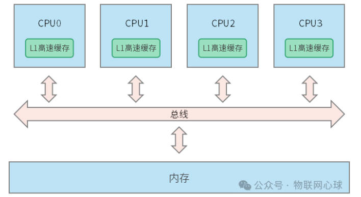

# 原子操作
## 缓存一致性问题



缓存一致性问题发生在多核处理器中，当多个处理器共享同一主内存时，为了提高数据访问速度，每个处理器都有自己的本地高速缓存。

当处理器修改了缓存中的数据后，如果缓存之间没有得到正确的同步更新，可能会导致多个处理器看到的数据不一致，从而引发错误。

现代处理器通过缓存一致性协议（MESI）解决缓存一致性问题。

## 原子操作

原子操作，它指的是在单个处理器执行期间，一组操作被视为不可分割的整体，要么全部完成，要么全部不执行。

这些操作不会被其他并发线程或中断所打断，因此保证了数据的一致性和完整性，

原子操作的特点包括：

- 封装性：操作内部的细节对外部不可见，保证了操作的可见性和顺序一致性。
- 隔离性：在同一时间点内，只有单个线程能够执行原子操作，避免了竞态条件（race condition）。
- 原子性：即使在并发环境中，整个操作也表现为不可分割的单位。

常见的原子操作包括读取/写入操作（如 CAS, compare-and-swap）、自旋锁、递增/递减计数等

### 原子操作实现原理

多个线程同时访问内存中一个变量，未使用原子操作的线程，将会并行访问同一个变量，造成缓存一致性问题，从而导致程序逻辑出现问题。


多个线程采用原子操作的方式访问内存中变量，原子操作通常是独占加载和独占存储，在一个原子操作执行期间，其他的线程无法访问内存中同一变量，

这样避免了缓存不一致性问题，原子操作将并行访问变成串行访问。


## 原子操作编程

### C语言原子操作

### 原子变量
原子变量是一种特殊的数据类型，原子操作访问的对象是原子变量。

原子变量定义方式：atomic_数据类型 变量名。

```c
typedef _Atomic(bool) atomic_bool;
typedef _Atomic(char) atomic_char;
typedef _Atomic(signed char) atomic_schar;
typedef _Atomic(unsigned char) atomic_uchar;
typedef _Atomic(short) atomic_short;
typedef _Atomic(unsigned short) atomic_ushort;
typedef _Atomic(int) atomic_int;
typedef _Atomic(unsigned int) atomic_uint;
typedef _Atomic(long) atomic_long;
typedef _Atomic(unsigned long) atomic_ulong;
typedef _Atomic(long long) atomic_llong;
typedef _Atomic(unsigned long long) atomic_ullong;
```

### 原子操作

#### 原子变量初始化

```c
/*
 * obj : 原子变量地址
 * val : 数值
 * 如 atomic_init(&lock, 1);
 */
void atomic_init(obj, val);
```

#### 原子加载和存储

```c
/*
 * object : 原子变量地址
 * order : 内存顺序
 */

void atomic_store(object, desired);
void atomic_store_explicit(object, desired, memory_order order);
T atomic_load(object);
T atomic_load_explicit(object, memory_order order);
```

#### 原子交换
```c
/*
 * 设置原子变量的值，并返回原子变量旧值。
 */

T atomic_exchange(object, desired);
T atomic_exchange_explicit(object, desired, memory_order order);
```

#### 原子比较交换（CAS）

```c
/*
 * 如果原子变量object和expected值相等，把原子变量设置成desired，返回true。
 * 如果原子变量object和expected值不相等，则把expected设置成object，返回false。
 *
 * weak和strong的区别在于weak系列函数存在一定的误判，需要通过while循环再次判断。
 *
 * object：原子变量地址。
 * expected：预期值，需填变量内存地址。
 * desired：数值。
 * suc：成功时的内存顺序。
 * fail：失败时的内存顺序。
 */
bool atomic_compare_exchange_strong(object, expected, desired);
bool atomic_compare_exchange_strong_explicit(object, expected, desired，memory_order suc, memory_order fail);
bool atomic_compare_exchange_weak(object, expected, desired);
bool atomic_compare_exchange_weak_explicit(object, expected, desired);
```

#### 原子运算

```c
/*
 * 执行原子变量加，减，或，异或，与操作，返回原子变量之前旧值。
 *
 * operand：数值
 */
T atomic_fetch_add(object, operand);
T atomic_fetch_add_explicit(object, operand);
T atomic_fetch_sub(object, operand);
T atomic_fetch_sub_explicit(object, operand);
T atomic_fetch_or(object, operand);
T atomic_fetch_or_explicit(object, operand);
T atomic_fetch_xor(object, operand);
T atomic_fetch_xor_explicit(object, operand);
T atomic_fetch_and(object, operand);
T atomic_fetch_and_explicit(object, operand);
```

#### 内存顺序（Memory Order）
```c
/*
 * memory_order_relaxed：最宽松的顺序，不保证操作的顺序，可能会导致数据竞争（data races）。
 * memory_order_consume：主要用于无须保持历史状态的读操作，可以优化某些场景下的性能。
 * memory_order_acquire：确保之前的写操作已经对其他线程可见，但可能重排序。
 * memory_order_release：确保当前写操作对其他线程立即可见，但之前的读操作可以重排序。
 * memory_order_acq_rel：同时满足 acquire 和 release，适合于读-修改-写的情况。
 * memory_order_seq_cst：最严格的顺序，保证操作的顺序与单线程程序一致，包括内存顺序和程序顺序。
 */
typedef enum memory_order {
  memory_order_relaxed = __ATOMIC_RELAXED,
  memory_order_consume = __ATOMIC_CONSUME,
  memory_order_acquire = __ATOMIC_ACQUIRE,
  memory_order_release = __ATOMIC_RELEASE,
  memory_order_seq_cst = __ATOMIC_SEQ_CST
  memory_order_acq_rel = __ATOMIC_ACQ_REL,
} memory_order;
```


## 原子锁
原子锁初始化

atomic_bool atomic_lock; //定义原子锁

atomic_init(&atomic_lock, false); //初始化原子锁

2）原子锁加锁

bool val = false; //通过CAS指令实现原子锁加锁
while(!atomic_compare_exchange_weak_explicit(&atomic_lock, &val, true, memory_order_acquire, memory_order_relaxed)) { 
  val = false;
}

3）原子锁解锁

//通过store指令设置原子锁的值为false
atomic_store_explicit(&atomic_lock, false, memory_order_release);

