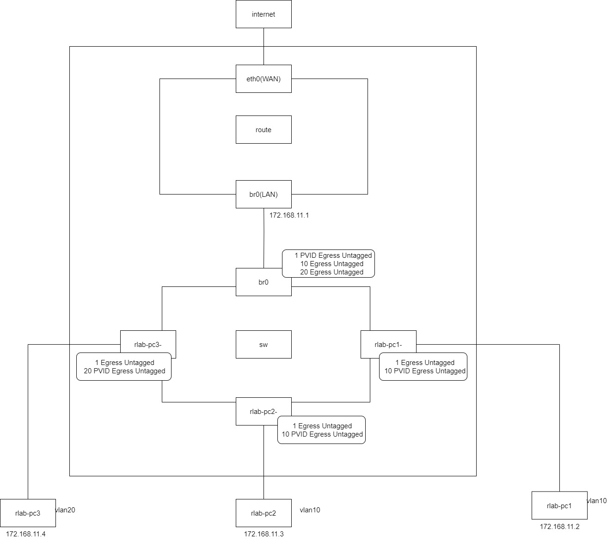
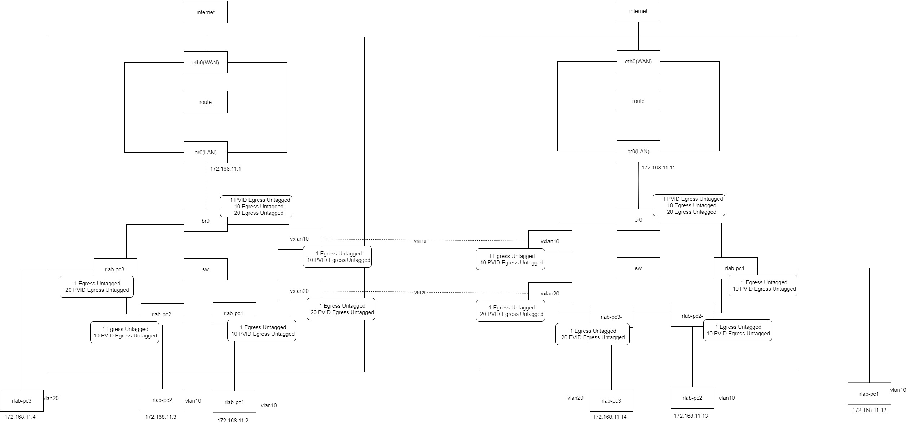

# MAN
## option

       -s, -stats, -statistics
              输出更多信息。如果多次使用此选项，信息量会增加。通常情况下，这些信息包括统计数据或某些时间值。

       -d, -details
           要打印关于MDB路由器端口的详细信息

       -b, -batch <FILENAME>
              从提供的文件或标准输入读取命令并执行。第一次失败将导致桥接命令的终止。

       -force 
              在批处理模式下，不要因错误终止桥接命令。如果在执行命令期间出现任何错误，应用程序的返回代码将为非零值

       -json  
           要以JSON格式显示VLAN和FDB的结果


## OBJ

### bridge monitor - state monitoring
```shell
bridge monitor [ all | neigh | link | mdb ]
```

桥实用工具能够连续地监视设备和地址的状态。此选项的格式略有不同。
具体来说，监控命令是命令行中的第一个命令，然后是对象列表跟随其后：
桥监控器（bridge monitor）[所有 | 对象列表] 
对象列表是我们想要监控的对象类型的列表。
它可能包含链接（link）、FDB和MDB。如果没有给出文件参数，
桥实用工具会打开RTNETLINK进行监听并将在以前的部分中描述的格式的状态更改进行转储。 
如果给出了文件名，则不会监听RTNETLINK，而是打开包含以二进制格式保存的RTNETLINK消息的文件并将其转储出来。

### mdb multicast group database entry
```shell
bridge mdb { add | del } dev DEV port PORT grp GROUP [ permanent | temp ] [ vid VID ]
bridge mdb show [ dev DEV ]
```


### fdb - forwarding database entry
```shell
bridge fdb { add | append | del | replace } LLADDR dev DEV { local | static | dynamic } [ self ] [ master ] [ router ] [ use ] [ dst IPADDR ] [ vni VNI ] [ port
       PORT ] [ via DEVICE ]
bridge fdb [ show ] [ dev DEV ] [ br BRDEV ] [ brport DEV ] [ vlan VID ] [ state STATE ]
```


FDB对象包含链接上的已知以太网地址。

相应的命令可以显示FDB条目、添加新条目、追加条目和删除旧条目。

`bridge fdb add` - 添加新的FDB条目
此命令创建一个新的FDB条目。

- **LLADDR** 以太网MAC地址。
- **dev DEV**
  - 与此地址关联的接口。
  - **local** - 是一个本地永久FDB条目
  - **static** - 是一个静态（无ARP）FDB条目
  - **dynamic** - 是一个动态可达可老化的FDB条目
  - **self** - 地址与端口驱动程序的FDB关联。通常是硬件。
  - **master** - 地址与主设备的FDB关联。通常是软件（默认）。
  - **router** - 目标地址与路由器关联。仅在引用设备为VXLAN类型设备且启用了路由短路时有效。
  - **use** - 地址正在使用中。用户空间可以使用此选项来通知内核该FDB条目正在被使用。

以下命令行参数仅适用于指定设备DEV为VXLAN类型时。

- **dst IPADDR**
  - 以太网MAC地址所在的目的VXLAN隧道端点的IP地址。

- **vni VNI**
  - 用于连接到远程VXLAN隧道端点的VXLAN VNI网络标识符（或VXLAN段ID）。如果省略，将使用创建VXLAN设备时指定的值。

- **port PORT**
  - 用于连接到远程VXLAN隧道端点的UDP目的端口号。如果省略，将使用默认值。

- **via DEVICE**
  - 用于到达远程VXLAN隧道端点的VXLAN设备驱动程序的出站接口的设备名称。

`bridge fdb append` - 添加转发数据库条目  
此命令添加一个新的fdb条目，使用一个已知的LLADDR。仅适用于多播链路层地址。
此命令支持广播和多播以太网MAC地址。以太网MAC地址将多次添加到转发数据库，并且vxlan设备驱动程序会将数据包的副本发送到找到的每个条目。  
参数与`bridge fdb add`相同。

`bridge fdb delete` - 删除转发数据库条目  
此命令删除现有的fdb条目。  
参数与`bridge fdb add`相同。

`bridge fdb replace` - 替换转发数据库条目  
如果没有找到匹配的条目，将创建一个新的条目。  
参数与`bridge fdb add`相同。

`bridge fdb show` - 列出转发条目。  
此命令显示当前的转发表。  
使用`-statistics`选项后，命令将变得更加详细。它将打印每个条目的最后更新和最后一次使用时间。


### link - bridge port
```shell
bridge link set dev DEV  [ cost COST ] [ priority PRIO ] [ state STATE] [ guard { on | off } ] [ hairpin { on | off } ] [ fastleave { on | off } ] [ root_block
       { on | off } ] [ learning { on | off } ] [ learning_sync { on | off } ] [ flood { on | off } ] [ hwmode { vepa | veb } ] [ mcast_flood { on | off } ] [
       neigh_suppress { on | off } ] [ vlan_tunnel { on | off } ] [ self ] [ master ]
bridge link [ show ] [ dev DEV ]
```


链路对象对应于桥接的端口设备。

相关命令用于设置和显示端口状态以及桥接特定属性。

以下是这段文本的中文翻译：

`dev NAME`
端口接口名称

`cost COST`
指定端口的STP路径成本。

`priority PRIO`
STP端口优先级。优先级值是一个无符号的8位数值（介于0和255之间）。此指标用于指定端口和根端口的选择算法。

`state STATE`
端口的状态。主要用于用户空间STP/RSTP实现。可以输入小写端口状态名称或以下数字。负输入会被忽略，未识别的名称会返回错误。状态包括：

* 0 - 端口已禁用。使此端口完全处于非活动状态。
* 1 - STP侦听状态。仅在桥启用STP时有效。在此状态下，端口侦听STP BPDU并丢弃所有其他交通帧。
* 2 - STP学习状态。仅在桥启用STP时有效。在此状态下，端口仅用于更新MAC地址表而接受交通。
* 3 - STP转发状态。端口处于完全活动状态。
* 4 - STP阻塞状态。仅在桥启用STP时有效。此状态用于STP选举过程。在此状态下，端口仅处理STP BPDU。

`guard on or guard off`
控制STP BPDU是否由桥端口处理。默认关闭BPDU处理标志。打开此标志将导致端口停止处理STP BPDU。

`hairpin on or hairpin off`
控制是否可以将交通发送回接收它的端口。默认情况下，此标志处于关闭状态，桥不会将交通转发回接收端口。

`fastleave on or fastleave off`
此标志允许桥在接收到IGMP Leave消息时立即停止多播交通。仅在与桥启用IGMP窥探一起使用时有效。默认情况为关闭状态。 以及其他多个控制端口功能的选项。   

`hwmode`

某些网络接口卡支持HW桥功能，并且可以在不同模式下配置。当前支持的模式是：vepa和veb。

`学习模式配置（learning）`

learning on 或 learning off：控制给定端口是否从接收到的流量中学习MAC地址。如果关闭学习模式，对于没有FDB条目的任何流量，桥接器将会进行泛洪处理。默认情况下此标志是开启的。

`学习同步配置（learning_sync）`
learning_sync on 或 learning_sync off：控制给定端口是否将设备端口上学习到的MAC地址同步到桥的FDB。

`泛洪配置（flooding）`
flooding on 或 flooding off：控制给定端口是否会对没有FDB条目的单播流量进行泛洪处理。默认情况下此标志是开启的。

`硬件模式（hwmode）`
某些网络接口卡支持硬件桥接功能，并且可以在不同的模式下配置。目前支持的模式是：vepa（硬件端口间发送的数据发送到外部交换机）和veb（桥接发生在硬件中）。

`多播泛洪配置（mcast_flood）`
mcast_flood on 或 mcast_flood off：控制对于没有MDB条目的多播流量是否会在给定端口上进行泛洪处理。默认情况下此标志是开启的。

`邻居发现抑制配置（neigh_suppress）`
neigh_suppress on 或 neigh_suppress off：控制端口上是否启用邻居发现（arp和nd）代理和抑制功能。默认情况下此标志是关闭的。

`VLAN隧道配置（vlan_tunnel）`
vlan_tunnel on 或 vlan_tunnel off：控制是否在端口上启用VLAN到隧道的映射。默认情况下此标志是关闭的。

`self link`
设置是在指定的物理设备上配置的，

`master link`
设置是在软件桥接器上配置的（默认设置）。

### vlan - vlan filter list

```shell
bridge vlan { add | del } dev DEV vid VID [ tunnel_info TUNNEL_ID ] [ pvid ] [ untagged ] [ self ] [ master ]
bridge vlan [ show | tunnelshow ] [ dev DEV ]
```

VLAN对象包含已知链接的VLAN ID。

相应的命令用于显示VLAN过滤器条目、添加新条目以及删除旧条目。

#### bridge vlan add - 添加一个新的VLAN过滤器条目
此命令创建一个新的VLAN过滤器条目。

- **dev NAME**  
  与此VLAN关联的接口。

- **vid VID**  
  用于标识VLAN的VLAN ID。

- **tunnel_info TUNNEL_ID**  
  与此VLAN相对应的TUNNEL ID。该TUNNEL ID在每个属于此VLAN的数据包的`dst_metadata`中设置（适用于设置了`vlan_tunnel`标志的桥端口）。

- **pvid**  
  在入口处，指定的VLAN被视为PVID。任何未标记的帧都将分配给此VLAN。

- **untagged**  
  在出口处，指定的VLAN被视为未标记。

- **self**  
  VLAN在指定的物理设备上配置。如果设备是桥设备，这是必需的。

- **master**  
  VLAN在软件桥上配置（默认）。

#### bridge vlan delete - 删除VLAN过滤器条目
此命令删除现有的VLAN过滤器条目。

参数与`bridge vlan add`相同。`pvid`和`untagged`标志被忽略。

#### bridge vlan show - 列出VLAN配置
此命令显示当前的VLAN过滤器表。

使用`-statistics`选项时，该命令将显示每个VLAN的流量统计信息。

#### bridge vlan tunnelshow - 列出VLAN隧道映射
此命令显示当前的VLAN隧道信息映射。

# VLAN filter support on bridge

## 交换机的VLAN

Linux实现 bridge vlan后，bridge可以实现真正交换机的以下link

- Access : 用于连接用户终端，Access接口只收发无tagged帧，只加入一个VLAN
- Trunk : 常用于交换机，路由器等网络设备互联，收发带tagged帧，允许加入多个VLAN
- Hybrid : 和Trunk类似，允许加入多个VLAN，但收发的帧包括带tagged和不带tagged

## 示例

```shell
ip link set br0 type bridge vlan_filtering 1
bridge vlan add dev br0 vid 10 untagged self
bridge vlan add dev rlab-pc1- vid 10 pvid untagged
bridge vlan add dev br0 vid 10 untagged self
bridge vlan add dev rlab-pc2- vid 10 pvid untagged
bridge vlan add dev br0 vid 20 untagged self
bridge vlan add dev rlab-pc3- vid 20 pvid untagged
```



```shell
bridge vlan show

port    vlan ids
br0      1 PVID Egress Untagged
         10 Egress Untagged
         20 Egress Untagged

rlab-pc1-        1 Egress Untagged
         10 PVID Egress Untagged

rlab-pc2-        1 Egress Untagged
         10 PVID Egress Untagged

rlab-pc3-        1 Egress Untagged
         20 PVID Egress Untagged
```

1. rlab-pc1 ping rlab-pc2

进入端口rlab-pc1-的包是untagged frame，会加上pvid 10的tag，sw转发到rlab-pc2-端口，找到vlan entry(10 PVID Egress Untagged), 会去除帧的tag，

rlab-pc2会收到正常的包，并回复，rlab-pc2-端口收到包后根据pvid项，加上tag，并转发到rlab-pc1-端口，根据entry(10 PVID Egress Untagged),会去除tag

rlab-pc1会收到正常的包。

2. rlab-pc1 ping br0
进入端口rlab-pc1-的包是untagged frame，会加上pvid 10的tag，转发到br0端口，找到vlan entry(10 Egress Untagged), 会去除帧的tag，

本机收到包，并响应，br0端口会给包加上tag(1 PVID)，rlab-pc1-会转发包，根据entry(1 Egress untagged)，会接受并去除帧tag，

rlab-pc1会收到正常的响应 

3. rlab-pc3 ping rlab-pc1
进入端口rlab-pc3-的包是untagged frame，会加上pvid 20的tag，由于没有rlab-pc1-端口的vlan group中有vid 20导致包被丢弃

## 示例2 vxlan 和 vlan



使用vxlan结合bridge可以实现支持vlan的虚拟交换机。

原理是用vxlan设备做bridge的端口，并分配vlan，将vxlan 的VNI和vlan id对应


