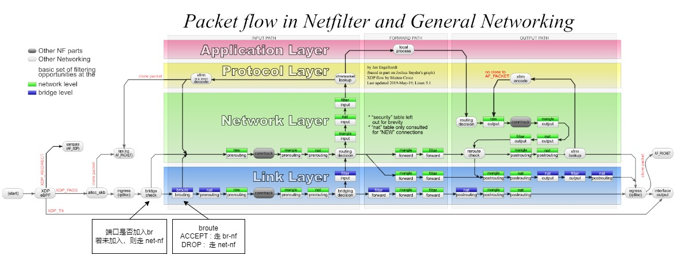

# 语法
```shell
ebtables [-t table ] -[ACDI] chain rule specification [match extensions] [watcher extensions] target
ebtables [-t table ] -P chain ACCEPT | DROP | RETURN
ebtables [-t table ] -F [chain]
ebtables [-t table ] -Z [chain]
ebtables [-t table ] -L [-Z] [chain] [ [--Ln] | [--Lx] ] [--Lc] [--Lmac2]
ebtables [-t table ] -N chain [-P ACCEPT | DROP | RETURN]
ebtables [-t table ] -X [chain]
ebtables [-t table ] -E old-chain-name new-chain-name
ebtables [-t table ] --init-table
ebtables [-t table ] [--atomic-file file] --atomic-commit
ebtables [-t table ] [--atomic-file file] --atomic-init
ebtables [-t table ] [--atomic-file file] --atomic-save
```

# 介绍

ebtables程序是一个用于基于Linux的桥接防火墙的过滤工具。它可以实现对通过Linux桥接的网络流量的透明过滤。过滤功能仅限于链路层过滤和一些基本的高层网络过滤。还包括高级日志记录、MAC DNAT/SNAT和brouter功能。

ebtables工具可以与其他Linux过滤工具（iptables、ip6tables和arptables）结合使用，以创建一个既能过滤链路层又能过滤这些高层网络的桥接防火墙。这是通过桥接-网络过滤器架构实现的，该架构是Linux内核的一部分。

ebtables和arptables代码库由netfilter开发人员维护，他们很慷慨地接管了该软件的维护工作。该网站主要作为文档参考保留。

## 特征
您可以使用类似于iptables的方式进行以太网过滤。具体来说，您可以使用以下功能：

1. MAC NAT（网络地址转换）：能够更改以太网数据包的源和目标MAC地址。这在某些特殊的设置中非常有用（有一个真实的例子可供参考）。

2. Brouting（桥接路由）：决定在两个接口之间桥接哪些流量，以及在同样的两个接口之间路由哪些流量。这两个接口属于一个逻辑桥接设备，但它们具有自己的IP地址，并且可以属于不同的子网。

3. 将数据包传递给用户空间程序，使用netlink套接字（ulog watcher）。这允许您将数据包传递给用户空间中的程序进行处理。

请注意，与iptables类似，这些功能可能需要使用适当的工具和配置来实现。具体实现方式可能因您使用的操作系统和网络设备而有所不同。

## 能做什么
* 以太网协议过滤。
* MAC地址过滤。
* 简单IP头过滤。
* ARP头过滤。
* 802.1Q VLAN过滤。
* 输入/输出接口过滤（逻辑和物理设备）。
* MAC地址网络地址转换（NAT）。
* 日志记录。
* 帧计数器。
* 能够添加、删除和插入规则；清空链；清零计数器。
* 网桥路由器功能。
* 能够将包含您创建的规则的完整表原子加载到内核中。请参阅手册和示例部分。
* 支持用户定义的链。
* 支持标记帧和匹配标记帧。

## 不能做什么
* 完整的IPv4/IPv6/ARP过滤（使用iptables/ip6tables/arptables）。
* 过滤802.3以太网上的高层协议，例如在802.3以太网帧上过滤ARP数据包。{Ip,Ip6,Arp}tables目前也无法过滤802.3以太网帧上的IPv4/IPv6/ARP流量。
* 可能还有很多其他的事情...

## bridge-netfilter
bridge-netfilter代码实现了以下功能：

* {Ip,Ip6,Arp}tables可以过滤桥接的IPv4/IPv6/ARP数据包，即使这些数据包被封装在802.1Q VLAN或PPPoE头中。这使得透明状态防火墙的功能成为可能

所有过滤、日志记录和NAT功能都可以在桥接帧上使用这三个工具。

- 结合ebtables，bridge-nf代码使得Linux成为一个非常强大的透明防火墙。
- 这使得可以创建一个透明的伪装机器（即所有本地主机认为它们直接连接到互联网）。
- 可以使用位于/proc/sys/net/bridge/目录下的相应proc条目来启用或禁用让{ip,ip6,arp}tables看到桥接流量的功能：
 - bridge-nf-call-arptables
 - bridge-nf-call-iptables
 - bridge-nf-call-ip6tables
- 同样，在相同目录中，可以使用一个proc条目来启用或禁用上述防火墙工具看到桥接的802.1Q VLAN和PPPoE封装数据包的功能：
 - bridge-nf-filter-vlan-tagged
 - bridge-nf-filter-pppoe-tagged

这些proc条目实际上是普通文件。将'1'写入文件（echo 1 > file）启用特定功能，而将'0'写入文件则禁用它。

# chain
内核中有三个带有内置链的ebtables表。这些表用于将功能分为不同的规则集。每个规则集称为一个链。每个链是一个有序的规则列表，可以匹配以太网帧。如果规则与以太网帧匹配，则处理规范告诉如何处理该匹配帧。处理规范称为“目标”。但是，如果帧与链中的当前规则不匹配，则会检查下一个规则，依此类推。用户可以创建新的（用户定义的）链，可以用作规则的“目标”。用户定义的链非常有用，可以在线性遍历规则之上获得更好的性能，并且对于将过滤规则组织成良好组织和可维护的规则集非常重要。

# target
防火墙规则指定以太网帧的条件和称为目标的帧处理规范。当帧与规则匹配时，内核执行的下一个操作由目标指定。目标可以是以下值之一：ACCEPT、DROP、CONTINUE、RETURN、一个“扩展”（参见下文）或跳转到用户定义的链。

ACCEPT表示允许帧通过。DROP表示帧必须被丢弃。但是，在BROUTING链中，ACCEPT和DROP目标具有不同的含义（请参阅-t选项提供的信息）。CONTINUE表示必须检查下一个规则。这对于知道通过某个链中的某一点的帧数量、记录这些帧或对帧应用多个目标很方便。RETURN表示停止遍历该链，并在前一个（调用）链的下一个规则处恢复。有关扩展目标，请参阅本手册的“目标扩展”部分。

# table
Linux内核中有三个ebtables表。这些表的名称分别是filter、nat和broute。这三个表中，filter表是命令默认操作的表。如果您正在使用filter表，则可以省略“-t filter”参数。但是，对于其他两个表，您需要提供-t参数。此外，如果使用，-t参数必须是ebtables命令行上的第一个参数。

## filter

filter是默认表，包含三个内置链：INPUT（用于桥本身的帧，以太网目标地址的级别）、OUTPUT（用于本地生成或（b）路由的帧）和FORWARD（用于由桥转发的帧）。

## nat

nat主要用于更改MAC地址，其中包含三个内置链：PREROUTING（用于在帧进入时更改帧）、OUTPUT（用于在桥接之前更改本地生成或（b）路由的帧）和POSTROUTING（用于在帧即将发送时更改帧）。关于PREROUTING和POSTROUTING链命名的一个小注释：更准确地称为PREFORWARDING和POSTFORWARDING可能更好，但对于那些从iptables世界来到ebtables的人来说，使用相同的名称更容易。请注意，如果您不喜欢默认的名称，可以更改名称（-E）。

## broute

broute用于创建一个brouter，它有一个内置链：BROUTING。

用于控制进来的数据包是需要进行bridge转发还是进行route转发，即2层转发和3层转发。

DROP和ACCEPT目标在broute表中具有特殊含义（使用这些名称而不是更具描述性的名称是为了保持实现的通用性）。

DROP : 实际上意味着帧必须被路由, 即传递给上层处理

ACCEPT : 意味着帧必须被桥接。

# EBTABLES命令行参数

在初始的ebtables“-t表”命令行参数之后，剩余的参数可以分为几个组。这些组是命令、杂项命令、规则规范、匹配扩展、观察器扩展和目标扩展。

## 命令
ebtables命令参数指定要在使用-t参数定义的表上执行的操作。如果不使用-t参数来命名表，则命令适用于默认的filter表。一次命令行中只能使用一个命令，除非将-L和-Z命令组合在一起，将-N和-P命令组合在一起，或者使用--atomic-file命令。

### -A，--append
将规则追加到所选链的末尾。

### -D，--delete
从所选链中删除指定的规则或规则。有两种使用此命令的方法。第一种是通过指定要删除的规则号的范围（紧跟在-D之后）。语法：start_nr[:end_nr]（使用-L --Ln列出规则及其规则号）。当省略end_nr时，从start_nr开始的所有规则都将被删除。允许使用负数，有关使用负数的更多详细信息，请参见-I命令。第二种用法是通过指定添加规则时所指定的完整规则。只删除与此指定规则相同的第一个遇到的规则，换句话说，具有最低（正）规则号的匹配规则将被删除。

### -C，--change-counters
更改所选链中指定的规则或规则的计数器。有两种使用此命令的方法。第一种是通过指定要进行更改的规则号的范围（紧跟在-C之后）。语法：start_nr[:end_nr]（使用-L --Ln列出规则及其规则号）。详细信息与-D命令相同。第二种用法是通过指定添加规则时所指定的完整规则。只更改与此指定规则相同的第一个遇到的规则的计数器，换句话说，具有最低（正）规则号的匹配规则的计数器将被更改。在第一种用法中，计数器直接在间隔规范之后指定，在第二种用法中直接在-C之后指定。首先指定数据包计数器，然后是字节计数器。如果指定的计数器以“+”开头，则将计数器值添加到相应的当前计数器值。如果指定的计数器以“-”开头，则将计数器值从相应的当前计数器值减少。不进行边界检查。如果计数器不以“+”或“-”开头，则将当前计数器更改为指定的计数器。

### -I，--insert
将指定的规则插入到所选链的指定规则号处。如果未指定规则号，则在链的开头添加规则。如果当前规则数等于N，则指定的数字可以在-N和N+1之间。对于正数i，有i和i-N-1指定规则应插入的相同位置。规则号0指定链中的最后一条规则之后的位置，并且使用此数字等效于使用-A命令。规则号小于0的情况在需要在链中插入多个规则时很有用。

### -P，--policy
将链的策略设置为给定的目标。策略可以是ACCEPT、DROP或RETURN。

### -F，--flush
清除所选链。如果没有选择链，则将清除所有链。清除链不会更改链的策略，但是会将所有计数器设置为零。

### -Z，--zero
将所选链的计数器设置为零。如果没有选择链，则所有计数器都将设置为零。可以将-Z命令与-L命令一起使用。以这种方式同时使用-Z和-L命令将在将计数器设置为零之前将计数器打印到屏幕上。

### -L，--list
列出所选链中的所有规则。如果没有选择链，则列出所有链。

以下选项更改-L命令的输出。

* --Ln
在每个规则前面放置规则号。此选项与--Lx选项不兼容。

*  --Lc
在-L命令显示的每个规则末尾显示计数器。显示帧计数器（pcnt）和字节计数器（bcnt）。帧计数器显示与特定规则匹配的帧数，字节计数器显示这些匹配帧的帧大小的总和。将此选项与--Lx选项组合使用会导致计数器以“-c <pcnt> <bcnt>”选项格式写出。

* --Lx
更改输出，使其产生一组构造链内容的ebtables命令，如果指定了链，则构造表内容的ebtables命令，包括用于创建用户定义链的命令（如果有）。您可以在ebtables引导或重新加载脚本中使用此组命令。例如，输出可以在系统启动时使用。--Lx选项与--Ln列表选项不兼容。将--Lx选项与--Lc选项一起使用将导致计数器以“-c <pcnt> <bcnt>”选项格式写出。

* --Lmac2
显示具有相同长度的所有MAC地址，如果需要，添加前导零。默认表示在地址中省略前导零。

* -N，--new-chain
使用给定的名称创建新的用户定义链。用户定义链的数量仅受可能的链名称数量的限制。用户定义链名称的最大长度为31个字符。可以使用-P命令结合-N命令来将新链的策略初始化为不同的标准目标。在这种情况下，不需要为-P命令指定链名称。

* -X, --delete-chain
删除指定的用户定义链。如果有对指定链的引用（跳转），则ebtables将拒绝删除它。如果未指定链，则将删除未被引用的所有用户定义链。

* -E, --rename-chain
将指定的链重命名为新名称。除了重命名用户定义链外，还可以将标准链重命名为适合您的喜好的名称。例如，如果您喜欢PREFORWARDING而不是PREROUTING，则可以使用-E命令将PREROUTING链重命名为PREFORWARDING。如果确实重命名了其中一个标准的ebtables链，请务必在发布ebtables邮件列表上的问题时提到这一事实。最好在您的帖子中使用标准名称。以此方式以这种方式重命名标准的ebtables链对ebtables内核表的结构或功能没有影响。

* --init-table
用初始表数据替换当前表数据。

* --atomic-init
将内核的初始表数据复制到指定的文件中。这可以作为第一个操作使用，在此之后将规则添加到文件中。可以使用--atomic-file命令指定文件，也可以通过设置EBTABLES_ATOMIC_FILE环境变量来指定文件。

* --atomic-save
将内核的当前表数据复制到指定的文件中。这可以作为第一个操作使用，在此之后将规则添加到文件中。可以使用--atomic-file命令指定文件，也可以通过设置EBTABLES_ATOMIC_FILE环境变量来指定文件。

* --atomic-commit
使用指定文件中包含的数据替换内核表数据。这是一个有用的命令，允许您一次将某个表的所有规则加载到内核中，从而为内核节省大量宝贵的时间，并允许对表进行原子更新。构建包含表数据的文件的方法是使用--atomic-init或--atomic-save命令生成起始文件。之后，在构建规则或设置EBTABLES_ATOMIC_FILE环境变量时使用--atomic-file命令允许您扩展文件并在提交到内核之前构建完整的表。此命令在引导脚本中非常有用，以快速方式填充ebtables表。

## 其他命令
### -V, --version
显示ebtables用户空间程序的版本。

### -h, --help [module names]
提供有关命令语法的简要说明。在这里，您还可以指定扩展名，并且ebtables将尝试编写有关这些扩展的帮助信息。例如，ebtables -h snat log ip arp。指定list_extensions以列出用户空间实用程序支持的所有扩展。

### -j, --jump target
规则的目标。这是以下值之一：ACCEPT、DROP、CONTINUE、RETURN、目标扩展（参见目标扩展）或用户定义的链名称。

### --atomic-file file
让命令操作指定的文件。将从文件中提取要操作的表的数据，并将操作的结果保存回文件中。如果指定此选项，则此选项应在命令规范之前。首选的替代方法是设置EBTABLES_ATOMIC_FILE环境变量。

### -M, --modprobe program
与内核通信时，使用此程序尝试自动加载缺失的内核模块。

### --concurrent
使用文件锁来支持并发脚本更新ebtables内核表。

## 规则规范
以下命令行参数构成规则规范（用于添加和删除命令中）。在规范之前，“!”选项反转该规范的测试。除了这些标准规则规范之外，还有一些其他有趣的命令行参数。请参见匹配扩展和观察器扩展。

###  -p, --protocol [!] protocol
创建帧的协议。可以是一个大于0x0600的十六进制数、一个名称（例如ARP）或LENGTH。以太网帧的协议字段可用于表示标头的长度（802.2/802.3网络）。当该字段的值小于或等于0x0600时，该值等于标头的大小，不应将其用作协议号。相反，假定使用协议字段作为长度字段的所有帧都被视为具有相同的“协议”。在ebtables中，这些帧的协议名称是LENGTH。可以使用/etc/ethertypes文件显示协议的可读字符，而不是十六进制数。例如，0x0800将表示为IPV4。对于此文件的使用不区分大小写。有关更多信息，请参见该文件。--proto标志是此选项的别名。

### -i, --in-interface [!] name
通过接收帧的接口（桥端口）（此选项在INPUT、FORWARD、PREROUTING和BROUTING链中非常有用）。如果接口名称以“+”结尾，则任何以此名称开头（忽略“+”）的接口名称都将匹配。--in-if标志是此选项的别名。

### --logical-in [!] name
通过接收帧的（逻辑）桥接口（此选项在INPUT、FORWARD、PREROUTING和BROUTING链中非常有用）。如果接口名称以“+”结尾，则任何以此名称开头（忽略“+”）的接口名称都将匹配。

### -o, --out-interface [!] name
通过要发送帧的接口（桥端口）（此选项在OUTPUT、FORWARD和POSTROUTING链中非常有用）。如果接口名称以“+”结尾，则任何以此名称开头（忽略“+”）的接口名称都将匹配。--out-if标志是此选项的别名。

### --logical-out [!] name
通过要发送帧的（逻辑）桥接口（此选项在OUTPUT、FORWARD和POSTROUTING链中非常有用）。如果接口名称以“+”结尾，则任何以此名称开头（忽略“+”）的接口名称都将匹配。

### -s, --source [!] address[/mask]
源MAC地址。地址和掩码都写为由冒号分隔的6个十六进制数。或者，可以指定单播、多播、广播或BGA（桥组地址）：单播=00:00:00:00:00:00/01:00:00:00:00:00，多播=01:00:00:00:00:00/01:00:00:00:00:00，广播=ff:ff:ff:ff:ff:ff/ff:ff:ff:ff:ff:ff或BGA=01:80:c2:00:00:00/ff:ff:ff:ff:ff:ff。请注意，广播地址也将与多播规范匹配。--src标志是此选项的别名。

### -d, --destination [!] address[/mask]
目标MAC地址。有关MAC地址的更多详细信息，请参见-s（上述）。--dst标志是此选项的别名。

### -c, --set-counter pcnt bcnt
如果与-A或-I一起使用，则新规则的数据包和字节计数器将设置为pcnt和bcnt。如果与-C或-D命令一起使用，只有数据包和字节计数等于pcnt和bcnt的规则将匹配。

## 匹配扩展
ebtables扩展是动态加载到用户空间工具中的，因此不需要像在iptables中那样使用-m选项显式加载它们。这些扩展处理与核心ebtables代码补充的内核模块支持的功能相关的功能。

### 802_3
指定802.3 DSAP/SSAP字段或SNAP类型。协议必须指定为LENGTH（参见上面的-p选项）。

--802_3-sap [!] sap

DSAP和SSAP是两个一个字节的802.3字段。字节始终相等，因此只需要一个字节（十六进制）作为参数。

--802_3-type [!] type

如果802.3 DSAP和SSAP值为0xaa，则必须查看SNAP类型字段以确定有效载荷协议。这是一个两个字节（十六进制）的参数。仅检查DSAP/SSAP为0xaa的802.3帧的类型。

### among
将MAC地址或MAC/IP地址对与MAC地址和MAC/IP地址对列表进行比较。列表条目的格式如下：xx:xx:xx:xx:xx:xx[=ip.ip.ip.ip][,]。多个列表条目由逗号分隔，可以指定与MAC地址对应的IP地址，指定与MAC地址不同的IP地址（反之亦然）的多个MAC/IP地址对。如果MAC地址与列表中的任何条目不匹配，则帧不匹配该规则（除非使用了“!”）。

--among-dst [!] list

将目标MAC地址与给定列表进行比较。如果以太网帧的类型为IPv4或ARP，则可以与列表中的MAC/IP目标地址对进行比较。

--among-src [!] list

将源MAC地址与给定列表进行比较。如果以太网帧的类型为IPv4或ARP，则可以与列表中的MAC/IP源地址对进行比较。

--among-dst-file [!] file

与--among-dst相同，但列表从指定的文件中读取。

--among-src-file [!] file

与--among-src相同，但列表从指定的文件中读取。

### arp
指定（R）ARP字段。协议必须指定为ARP或RARP。

--arp-opcode [!] opcode

（R）ARP操作码（十进制或字符串，有关详细信息，请参见ebtables -h arp）。

--arp-htype [!] hardware type

硬件类型，可以是十进制或字符串以太网（将类型设置为1）。大多数（R）ARP数据包都具有以太网作为硬件类型。

--arp-ptype [!] protocol type

用于（R）ARP的协议类型（十六进制或字符串IPv4，表示0x0800）。大多数（R）ARP数据包都具有协议类型IPv4。

--arp-ip-src [!] address[/mask]

（R）ARP IP源地址规范。

--arp-ip-dst [!] address[/mask]

（R）ARP IP目标地址规范。

--arp-mac-src [!] address[/mask]

（R）ARP MAC源地址规范。

--arp-mac-dst [!] address[/mask]

（R）ARP MAC目标地址规范。

[!] --arp-gratuitous

检查ARP伪造数据包：检查ARP标头内的IPv4源地址和IPv4目标地址是否相等。

### ip
指定IPv4字段。协议必须指定为IPv4。

--ip-source [!] address[/mask]

源IP地址。--ip-src标志是此选项的别名。

--ip-destination [!] address[/mask]

目标IP地址。--ip-dst标志是此选项的别名。

--ip-tos [!] tos

IP服务类型，以十六进制数表示。IPv4。

--ip-protocol [!] protocol

IP协议。--ip-proto标志是此选项的别名。

--ip-source-port [!] port1[:port2]

IP协议6（TCP）、17（UDP）、33（DCCP）或132（SCTP）的源端口或端口范围。必须将--ip-protocol选项指定为TCP、UDP、DCCP或SCTP。如果省略port1，则使用0:port2；如果省略port2但指定了冒号，则使用port1:65535。--ip-sport标志是此选项的别名。

--ip-destination-port [!] port1[:port2]

IP协议6（TCP）、17（UDP）、33（DCCP）或132（SCTP）的目标端口或端口范围。必须将--ip-protocol选项指定为TCP、UDP、DCCP或SCTP。如果省略port1，则使用0:port2；如果省略port2但指定了冒号，则使用port1:65535。--ip-dport标志是此选项的别名。


### ip6
指定IPv6字段。协议必须指定为IPv6。

--ip6-source [!] address[/mask]

源IPv6地址。--ip6-src标志是此选项的别名。

--ip6-destination [!] address[/mask]

目标IPv6地址。--ip6-dst标志是此选项的别名。

--ip6-tclass [!] tclass

IPv6流量类别，以十六进制数表示。

--ip6-protocol [!] protocol

IP协议。--ip6-proto标志是此选项的别名。

--ip6-source-port [!] port1[:port2]

IPv6协议6（TCP）、17（UDP）、33（DCCP）或132（SCTP）的源端口或端口范围。必须将--ip6-protocol选项指定为TCP、UDP、DCCP或SCTP。如果省略port1，则使用0:port2；如果省略port2但指定了冒号，则使用port1:65535。--ip6-sport标志是此选项的别名。

--ip6-destination-port [!] port1[:port2]

IPv6协议6（TCP）、17（UDP）、33（DCCP）或132（SCTP）的目标端口或端口范围。必须将--ip6-protocol选项指定为TCP、UDP、DCCP或SCTP。如果省略port1，则使用0:port2；如果省略port2但指定了冒号，则使用port1:65535。--ip6-dport标志是此选项的别名。

--ip6-icmp-type [!] {type[:type]/code[:code]|typename}

指定ipv6-icmp类型和代码进行匹配。支持类型和代码的范围。类型和代码由斜杠分隔。类型和范围的有效数字为0到255。要匹配单个类型（包括所有有效代码），可以使用符号名称而不是数字。已知类型名称的列表由以下命令显示

  ebtables --help ip6

此选项仅对--ip6-prococol ipv6-icmp有效。

### limit
此模块使用令牌桶过滤器以有限的速率进行匹配。使用此扩展的规则将在达到此限制之前匹配。可以与--log观察器一起使用，以进行有限的记录，例如。其使用与iptables的limit匹配相同。

--limit [value]

最大平均匹配速率：以数字表示，带有可选的/second、/minute、/hour或/day后缀；默认值为3/hour。

--limit-burst [number]

匹配的最大初始数据包数：每次未达到上述指定的限制时，此数字将增加1，最多增加到此数字；默认值为5。

### mark_m

--mark [!] [value][/mask]

匹配具有给定无符号标记值的帧。如果指定了值和掩码，则在将帧的标记值与用户指定的掩码进行逻辑与操作之前，将其与用户指定的标记值进行比较。当仅指定标记值时，仅当帧的标记值等于用户指定的标记值时，数据包才匹配。如果只指定了掩码，则将帧的标记值与用户指定的掩码进行逻辑与操作，并且当此逻辑与的结果非零时，帧匹配。仅指定掩码对于匹配多个标记值很有用。

### pkttype

--pkttype-type [!] type

匹配帧的以太网“类”，由通用网络代码确定。可能的值：广播（MAC目的地址是广播地址）、多播（MAC目的地址是多播地址）、主机（MAC目的地址是接收网络设备）或其他主机（以上都不是）。

### stp
指定stp BPDU（桥协议数据单元）字段。目标地址（-d）必须指定为桥组地址（BGA）。对于可以指定值范围的所有选项，如果省略了下限（但冒号没有省略），则使用该选项的最低下限，而如果省略了上限（但冒号没有省略），则使用该选项的最高上限。

--stp-type [!] type

BPDU类型（0-255），识别的非数字类型是config，表示配置BPDU（=0），以及tcn，表示拓扑变化通知BPDU（=128）。

--stp-flags [!] flag

BPDU标志（0-255），识别的非数字标志是topology-change，表示拓扑变化标志（=1），以及topology-change-ack，表示拓扑变化确认标志（=128）。

--stp-root-prio [!] [prio][:prio]

根优先级（0-65535）范围。

--stp-root-addr [!] [address][/mask]

根MAC地址，请参阅选项-s以获取更多详细信息。

--stp-root-cost [!] [cost][:cost]

根路径成本（0-4294967295）范围。

--stp-sender-prio [!] [prio][:prio]

BPDU的发送者优先级（0-65535）范围。

--stp-sender-addr [!] [address][/mask]

BPDU的发送者MAC地址，请参阅选项-s以获取更多详细信息。

--stp-port [!] [port][:port]

端口标识符（0-65535）范围。

--stp-msg-age [!] [age][:age]

消息时钟（0-65535）范围。

--stp-max-age [!] [age][:age]

最大时钟（0-65535）范围。

--stp-hello-time [!] [time][:time]

Hello时钟（0-65535）范围。

--stp-forward-delay [!] [delay][:delay]

转发延迟时钟（0-65535）范围。

### vlan
指定802.1Q标记控制信息字段。协议必须指定为802_1Q（0x8100）。

--vlan-id [!] id

VLAN标识符字段（VID）。十进制数从0到4095。

--vlan-prio [!] prio

用户优先级字段，一个从0到7的十进制数。VID应设置为0（“null VID”）或未指定（在后一种情况下，VID故意设置为0）。

--vlan-encap [!] type

封装的以太网帧类型/长度。指定为0x0000到0xFFFF之间的十六进制数或/etc/ethertypes中的符号名称。

## WATCHER扩展
观察者只查看通过的帧，它们不修改它们，也不决定是否接受帧。这些观察者仅在帧与规则匹配时才能看到它们，并且它们在目标执行之前看到它们。

### log
日志观察者将帧的描述性数据写入系统日志。

--log

使用默认的日志选项：log-level=info，log-prefix=""，无IP日志记录，无ARP日志记录。

--log-level level

定义日志级别。有关可能的值，请参见ebtables -h log。默认级别为info。

--log-prefix text

定义要在日志信息开头打印的前缀文本。

--log-ip

当由IP协议生成的帧与规则匹配时，将记录IP信息。默认情况下，不记录IP信息日志。

--log-ip6

当由IPv6协议生成的帧与规则匹配时，将记录IPv6信息。默认情况下，不记录IPv6信息日志。

--log-arp

当由（R）ARP协议生成的帧与规则匹配时，将记录（R）ARP信息。默认情况下，不记录（R）ARP信息日志。

### nflog
nflog观察者将数据包传递给加载的日志后端，以记录数据包。通常与nfnetlink_log一起使用，后者将数据包通过netlink套接字组播到指定的多播组。一个或多个用户空间进程可以订阅该组以接收数据包。

--nflog

使用默认的日志选项。

--nflog-group nlgroup

将数据包发送到的netlink组（1-2^32-1）（仅适用于nfnetlink_log）。默认值为1。

--nflog-prefix prefix

包含在日志消息中的前缀字符串，最长可达30个字符，用于区分日志中的消息。

--nflog-range size

要复制到用户空间的字节数（仅适用于nfnetlink_log）。nfnetlink_log实例可以指定自己的范围，此选项将覆盖它。

--nflog-threshold size

在将数据包发送到用户空间之前，在内核中排队的数据包数（仅适用于nfnetlink_log）。较高的值会减少每个数据包的开销，但会增加数据包到达用户空间的延迟。默认值为1。

### ulog
ulog观察者使用netlink组播套接字将数据包传递给用户空间日志守护程序。与日志观察者不同，完整的数据包发送到用户空间，而不是发送描述性文本，并且使用netlink组播套接字，而不是syslog。此观察者允许使用用户空间程序解析数据包，物理桥入口和出口端口也包含在netlink消息中。加载ulog观察者模块时，可以为内核加载模块（例如，使用modprobe）指定2个参数：nlbufsiz指定每个netlink组的缓冲区有多大。例如，如果您指定nlbufsiz=8192，那么最多8 KB的数据包将在内核中累积，直到它们发送到用户空间。不可能分配超过128KB。还请记住，此缓冲区大小为每个使用的nlgroup分配的，因此总内核内存使用量增加了该因子。默认值为4096。flushtimeout指定在未填满队列的情况下多少百分之一秒后刷新队列。默认值为10（一秒钟的十分之一）。

--ulog

使用默认设置：ulog-prefix=""，ulog-nlgroup=1，ulog-cprange=4096，ulog-qthreshold=1。

--ulog-prefix text

定义包含发送到用户空间的数据包的前缀。

--ulog-nlgroup group

定义要使用的netlink组编号（从1到32的数字）。确保用于iptables ULOG目标的netlink组编号与用于ebtables ulog观察者的组编号不同。默认组号为1。

--ulog-cprange range

定义要复制到用户空间的最大范围，用于与规则匹配的数据包。默认范围为0，这意味着最大复制范围由nlbufsiz给出。大于128*1024的最大复制范围没有意义，因为发送到用户空间的数据包有一个上限大小为128*1024。

--ulog-qthreshold threshold

在使用netlink套接字将数据包发送到用户空间之前，最多将threshold数量的数据包排队。请注意，数据包可以在队列填满之前发送到用户空间，这是当ulog内核定时器触发时发生的（此定时器的频率取决于flushtimeout）。

## 目标扩展
### arpreply

arpreply目标可以在nat表的PREROUTING链中使用。如果此目标看到ARP请求，它将自动回复ARP回复。可以指定用于回复的MAC地址。必须指定协议为ARP。当ARP消息不是ARP请求或ARP请求不是以太网网络上的IP地址时，此目标将忽略它（CONTINUE）。当ARP请求格式错误时，将丢弃它（DROP）。

--arpreply-mac address
指定要回复的MAC地址：以太网源MAC和ARP有效载荷源MAC将使用此地址填充。

--arpreply-target target
指定标准目标。发送ARP回复后，规则仍然必须给出标准目标，以便ebtables知道如何处理ARP请求。默认目标为DROP。

### dnat
dnat目标只能在broute表的BROUTING链和nat表的PREROUTING和OUTPUT链中使用。它指定必须更改目标MAC地址。

--to-destination address

将目标MAC地址更改为指定的地址。标志--to-dst是此选项的别名。

--dnat-target target

指定标准目标。进行dnat后，规则仍然必须给出标准目标，以便ebtables知道如何处理已更改目标MAC地址的帧。默认目标为ACCEPT。将其设置为CONTINUE可以让您在链的后续规则中对帧执行其他操作。使其为DROP只有在BROUTING链中有意义，但在那里使用重定向目标更合理。RETURN也是允许的。请注意，在基本链中使用RETURN是不允许的（出于明显的原因）。

### mark
mark目标可以在每个表的每个链中使用。如果将bridge-nf代码编译到内核中，可以在ebtables和iptables中同时使用帧/数据包的标记，因为它们将标记放在相同的位置。这允许ebtables和iptables之间进行一种形式的通信。

--mark-set value

用指定的非负值标记帧。

--mark-or value

用指定的非负值对帧进行逻辑或操作。

--mark-and value

用指定的非负值对帧进行逻辑与操作。

--mark-xor value

用指定的非负值对帧进行逻辑异或操作。

--mark-target target

指定标准目标。标记帧后，规则仍然必须给出标准目标，以便ebtables知道如何处理。默认目标为ACCEPT。将其设置为CONTINUE可以让您在链的后续规则中对帧执行其他操作。

### redirect
重定向目标将MAC目标地址更改为帧到达的桥设备的MAC地址。此目标只能在broute表的BROUTING链和nat表的PREROUTING链中使用。在BROUTING链中，使用桥端口的MAC地址作为目标地址，在PREROUTING链中，使用桥的MAC地址。

--redirect-target target

指定标准目标。进行MAC重定向后，规则仍然必须给出标准目标，以便ebtables知道如何处理已重定向的帧。默认目标为ACCEPT。将其设置为CONTINUE可以让您在同一帧上使用多个目标扩展。在BROUTING链中使用DROP是有意义的，但在那里使用重定向目标更合乎逻辑。也允许使用RETURN。请注意，在基本链中使用RETURN是不允许的。

### snat
snat目标只能在nat表的POSTROUTING链中使用。它指定必须更改源MAC地址。

--to-source address

将源MAC地址更改为指定的地址。标志--to-src是此选项的别名。

--snat-target target

指定标准目标。进行snat后，规则仍然必须给出标准目标，以便ebtables知道如何处理已更改源MAC地址的帧。默认目标为ACCEPT。将其设置为CONTINUE可以让您在同一帧上使用多个目标扩展。在BROUTING链中使用DROP没有意义，但您也可以这样做。也允许使用RETURN。请注意，在基本链中使用RETURN是不允许的。

--snat-arp

如果数据包是ARP消息并且ARP头中的硬件地址长度为6字节，则还更改ARP头中的硬件源地址。

## 文件
/etc/ethertypes /var/lib/ebtables/lock

## 环境变量
EBTABLES_ATOMIC_FILE

# 示例
## basic
```shell
ebtables -P FORWARD DROP
ebtables -A FORWARD -p IPv4 -j ACCEPT
ebtables -A FORWARD -p ARP -j ACCEPT
ebtables -A FORWARD -p LENGTH -j ACCEPT
ebtables -A FORWARD --log-level info --log-ip --log-prefix EBFW
ebtables -P INPUT DROP
ebtables -A INPUT -p IPv4 -j ACCEPT
ebtables -A INPUT -p ARP -j ACCEPT
ebtables -A INPUT -p LENGTH -j ACCEPT
ebtables -A INPUT --log-level info --log-ip --log-prefix EBFW
ebtables -P OUTPUT DROP
ebtables -A OUTPUT -p IPv4 -j ACCEPT
ebtables -A OUTPUT -p ARP -j ACCEPT
ebtables -A OUTPUT -p LENGTH -j ACCEPT
ebtables -A OUTPUT --log-level info --log-ip --log-arp --log-prefix EBFW -j DROP
```

这是一个基本的过滤器配置，只允许通过由IPv4和ARP协议生成的帧。此外，网络中有一些使用以太网帧的协议字段作为长度字段的旧机器（它们使用以太网802.2或802.3协议）。没有理由不让这些机器通过，更确切地说：有理由让它们通过；-）。因此，接受那些带有表示长度字段的协议LENGTH的帧。当然，你可以根据这些旧机器的MAC地址进行过滤，以防其他机器使用旧的以太网802.2或802.3协议。所有其他帧都会被记录并丢弃。记录包括协议号、MAC地址、IP/ARP信息（如果是IP/ARP数据包的话）以及输入和输出接口。

重要提示：
如果你不是绝对需要让那些使用802.2或803.2以太网协议的旧机器通过网桥，请不要让它们通过。使用`ebtables -A FORWARD -p LENGTH -j ACCEPT`打开它实际上会破坏安全性，因为如果你正在使用iptables过滤IP网桥流量，使用802.2或802.3以太网协议通过网桥的IP流量将不会被iptables过滤（这在待办事项列表中）。

## mac 和 IP 绑定
将IP地址关联到MAC地址（反欺骗规则）：

```shell
ebtables -A FORWARD -p IPv4 --ip-src 172.16.1.4 -s ! 00:11:22:33:44:55 -j DROP
```

这是一个反欺骗过滤规则。它表示使用IP地址172.16.1.4的计算机必须使用以太网卡00:11:22:33:44:55发送此流量。

注意：也可以使用iptables来完成此操作。在iptables中，规则如下所示：

```shell
iptables -A FORWARD -s 172.16.1.4 -m mac ! --mac-source 00:11:22:33:44:55 -j DROP
```

不同之处在于，如果使用ebtables规则，帧将在iptables之前被丢弃，因为ebtables在iptables之前检查帧。还要注意默认源地址类型的微妙差异：在iptables中是IP地址，在ebtables中是MAC地址。

如果有多个这样的规则，还可以使用among匹配来加快过滤。

```shell
ebtables -N MATCHING-MAC-IP-PAIR
ebtables -A FORWARD -p IPv4 --among-dst 00:11:22:33:44:55=172.16.1.4,00:11:33:44:22:55=172.16.1.5 \
-j MATCHING-MAC-IP-PAIR
```

首先，我们创建一个名为MATCHING-MAC-IP-PAIR的新用户定义链，并使用among匹配将具有匹配的MAC-IP源地址对的所有流量发送到该链。MATCHING-MAC-IP-PAIR链中的过滤可以假定MAC-IP源地址对是正确的。

## mac nat
```shell
ebtables -t nat -A PREROUTING -d 00:11:22:33:44:55 -i eth0 -j dnat --to-destination 54:44:33:22:11:00
```

这个命令是使用ebtables工具进行网络地址转换（NAT）的一个实际示例。

它的作用是将所有目的MAC地址为00:11:22:33:44:55且经过eth0接口到达的数据帧转发到MAC地址为54:44:33:22:11:00的主机。

这个转发动作发生在nat表的PREROUTING链中，因此在桥接代码做出转发决策之前就完成了。

这意味着MAC地址为00:11:22:33:44:55和54:44:33:22:11:00的主机不需要位于桥的同一侧。

如果MAC地址为54:44:33:22:11:00的主机在数据包到达的同一侧，该数据包将不会再次发送出去。

因此，只有在目的MAC地址为54:44:33:22:11:00的主机位于桥的另一侧时才能使用这个命令。

需要注意的是，这种MAC地址转换并不关心更高层协议。

例如，当网络层为IP时，MAC地址为54:44:33:22:11:00的主机将发现目的IP地址与自己的IP地址不同，并且可能会丢弃该数据包（除非它是一个路由器）。如果你想使用IP地址转换（IP NAT），请使用iptables工具。


## 只转发特定MAC地址的IPv4流量：
有人描述了这样的情况：

"对于一个奇怪的设置，我需要一个通用的基于MAC源地址的过滤器。我需要阻止特定MAC源地址的ARP和其他基于第二层的数据包, 通过桥接器，以防止出现环路。"

这可以通过使用ebtables来解决：
```shell
ebtables -A FORWARD -s 00:11:22:33:44:55 -p IPV4 -j ACCEPT
ebtables -A FORWARD -s 00:11:22:33:44:55 -j DROP
```

## 制作一个brouter：
以下是一个带有以下情况的brouter的示例设置：br0具有eth0和eth1端口。
```shell
ifconfig br0 0.0.0.0
ifconfig eth0 172.16.1.1 netmask 255.255.255.0
ifconfig eth1 172.16.2.1 netmask 255.255.255.0
ebtables -t broute -A BROUTING -p ipv4 -i eth0 --ip-dst 172.16.1.1 -j DROP
ebtables -t broute -A BROUTING -p ipv4 -i eth1 --ip-dst 172.16.2.1 -j DROP
ebtables -t broute -A BROUTING -p arp -i eth0 -d $MAC_OF_ETH0 -j DROP
ebtables -t broute -A BROUTING -p arp -i eth1 -d $MAC_OF_ETH1 -j DROP
ebtables -t broute -A BROUTING -p arp -i eth0 --arp-ip-dst 172.16.1.1 -j DROP
ebtables -t broute -A BROUTING -p arp -i eth1 --arp-ip-dst 172.16.2.1 -j DROP
```
如man页面中所述，BROUTING链中的DROP目标实际上是将帧进行broute处理。这意味着桥接代码不会处理该帧，而是将其发送到更高的网络层。这导致帧进入主机，就好像它不是通过桥接端口而是直接到达设备本身。

前两个ebtables命令很容易解释：它们确保必须进行路由的IP数据包通过eth0（或eth1）设备进入IP路由代码，而不是通过br0设备。如果您希望该主机还路由具有不同于路由器的MAC目标地址的流量，您需要使用redirect目标，该目标将MAC目标地址更改为桥接的MAC地址（请参见后续示例）。

最后四个命令是为了使ARP工作。当brouter发送一个针对例如172.16.1.5的ARP请求时，此请求通过eth0或eth1设备发送（我们假设没有使用输出设备br0的路由）。如果没有第三个ebtables规则，ARP回复将到达br0设备而不是eth{0,1}设备，至少从ARP代码的角度来看是这样的。然后，此回复将被ARP代码丢弃。使用第三个规则，回复将到达eth0设备，ARP代码将正常工作。因此，第三和第四个规则是使ARP代码使用ARP回复的必需。如果没有第三个规则，brouter将不会向172.16.1.5发送IP数据包（除非它已经知道172.16.1.5的MAC地址，因此在第一次发送ARP请求时不会发送）。最后两个命令是为了回答172.16.1.1和172.16.2.1的ARP请求。您可以在ARP数据包上使用更严格的匹配（例如，只在最后两个规则中匹配ARP请求）。


## 重定向目标
这是一个简单的例子，它将使进入一个（转发）桥接端口的所有IP流量被路由而不是桥接（假设eth0是桥接br0的一个端口）：
```shell
ebtables -t broute -A BROUTING -i eth0 -p ipv4 -j redirect --redirect-target DROP
```
如man手册中所述，BROUTING链中的DROP目标实际上是桥接帧。redirect目标将欺骗网络代码，使其认为数据包最初是针对该主机的。

使用以下规则具有类似的效果：
```shell
ebtables -t nat -A PREROUTING --logical-in br0 -p ipv4 -j redirect --redirect-target ACCEPT
```
区别在于第二种情况下，IP代码和路由代码将认为IP数据包通过br0设备进入。而在第一种情况下，IP代码和路由代码将认为IP数据包通过eth0设备进入。在哪个链中使用redirect目标取决于具体情况。例如，如果您的路由表只使用br0，则redirect应放在PREROUTING链中。


## 自动更新table
为什么我们希望能够以原子方式加载或更新表格？

因为这样可以一次性将表格数据传递给内核。这在添加多个规则时防止竞争条件时有时是可取的。然而，最明显的用例是在初始填充表格规则时。一次性将表格提交给内核可以节省大量的上下文切换和内核时间，从而实现更快的配置。以下是如何进行此操作的简要描述。示例将使用nat表，当然，这适用于任何表格。

最简单的情况是内核表已经包含了正确的数据。我们可以按照以下步骤进行操作：

首先，将内核的表格保存到文件nat_table中：
```shell
ebtables --atomic-file nat_table -t nat --atomic-save
```

然后，我们（可选地）将文件中的规则计数器清零：
```shell
ebtables -t nat --atomic-file nat_table -Z
```

在启动时，我们使用以下命令一次性将所有内容提交到内核表中：
```shell
ebtables --atomic-file nat_table -t nat --atomic-commit
```

我们还可以在文件中构建完整的表格。我们可以使用环境变量EBTABLES_ATOMIC_FILE。首先设置环境变量：
```shell
export EBTABLES_ATOMIC_FILE=nat_table
```

然后，使用默认表格初始化文件，该表格具有空链和ACCEPT策略：
```shell
ebtables -t nat --atomic-init
```

然后，我们添加自定义规则、用户定义的链、更改策略：
```shell
ebtables -t nat -A PREROUTING -j DROP
```

我们可以使用以下命令检查表格的内容：
```shell
ebtables -t nat -L --Lc --Ln
```

然后，我们使用以下命令一次性将所有内容提交到内核表中：
```shell
ebtables -t nat --atomic-commit
```

不要忘记取消设置环境变量：
```shell
unset EBTABLES_ATOMIC_FILE
```

现在，所有的ebtables命令将再次在实际的内核表上执行，而不是在文件nat_table上执行。

## 在未被从属于桥接的接口上使用ebtables进行过滤
如果您真的需要在接口上进行过滤，而且无法使用标准的方法（即该协议没有标准的过滤工具），那么如果您只需要基本的过滤，有一个解决方案。

我们在这里考虑的是需要基本的Appletalk过滤的情况。由于Linux没有Appletalk过滤机制，我们需要其他方法。下面的示例是针对一个同时使用IP协议的计算机。显然，如果您只需要过滤IP相关内容，只需使用iptables即可。包括IP协议在内是为了给出配置其他协议（例如Appletalk）可能需要的思路。如果计算机确实也使用IP协议，则需要进行以下IP设置。

假设您当前的设置包括具有IP地址172.16.1.10的eth0设备。

前三个命令确保ebtables将看到进入eth0的所有流量，该接口将是br0的一个桥接端口。其他命令与IP相关。

首先创建一个桥接设备：
```shell
brctl addbr br0
```

然后（也许）在该桥接上禁用生成树协议：
```shell
brctl stp br0 off
```

然后将物理设备eth0添加到逻辑桥接设备：
```shell
brctl addif br0 eth0
```

将eth0的IP地址分配给桥接设备，并从eth0中删除它：
```shell
ifconfig br0 172.16.1.10 netmask 255.255.255.0
ifconfig eth0 0.0.0.0
```

还必须更正路由表，例如：
```shell
route del -net 172.16.1.0 netmask 255.255.255.0 dev eth0
route add -net 172.16.1.0 netmask 255.255.255.0 dev br0
route del default gateway $DEFAULT_GW dev eth0
route add default gateway $DEFAULT_GW dev br0
```

现在，所有原本通过eth0传输的IP流量都将通过br0传输。请注意，这种方法有点像一个小技巧：使用只有一个从属设备的桥接。但是，现在ebtables将看到通过eth0传递的所有流量，因为eth0现在是桥接设备br0的一个端口。

使用的其他协议（例如Appletalk）将需要配置为接受来自br0的流量（而不是eth0），并将流量传输到br0（而不是eth0）。

或者，这可以与brouter功能结合使用。在"真实示例"部分可以找到用于过滤Appletalk的实际示例，该示例使用了这种方法。出于性能原因，实际上更好地使用brouter方法，下一个示例将说明原因。

## 加快发送到桥本身的流量：

在某些情况下，桥不仅充当桥接盒，还与其他主机通信。到达桥端口并且目的地为桥本身的数据包默认会进入iptables的INPUT链，输入设备为逻辑桥接端口。这些数据包将被网络代码排队两次，第一次是在网络设备接收到它们后排队。第二次是在桥代码检查目的地MAC地址并确定它是本地目标数据包后，决定将帧传递到更高级的协议栈之后排队。

让本地目标数据包只排队一次的方法是在broute表的BROUTING链中进行桥路由。假设br0具有一个IP地址，并且br0的桥接端口没有IP地址。使用以下规则应该使所有本地定向流量只排队一次：
```shell
ebtables -t broute -A BROUTING -d $MAC_OF_BR0 -p ipv4 -j redirect --redirect-target DROP
```
桥的回复将通过br0设备发送出去（假设您的路由表正确并将所有流量通过br0发送），因此一切都保持整洁，而无需由于数据包被排队两次而导致性能损失。

需要使用重定向目标是因为桥接端口的MAC地址不一定等于桥设备的MAC地址。发往桥盒的数据包的目的地MAC地址等于桥br0的MAC地址，因此必须将该目的地地址更改为桥接端口的地址。

## 使用标记匹配和目标
假设有3种类型的流量需要标记。最佳的标记值是2的幂次，因为这些值可以在无符号长整型的标记值中设置一个位。因此，由于我们有三种类型的流量，我们将使用标记值1、2和4。

我们如何标记流量呢？简单地过滤出您需要的确切流量，然后使用标记目标。例如：

在过滤表的FORWARD链中，标记所有通过eth0进入的IP流量为第二个标记值，并让后续规则有机会查看帧/数据包。
```shell
ebtables -A FORWARD -p ipv4 -i eth0 -j mark --set-mark 2 --mark-target CONTINUE
```
假设我们想对所有标记为第一个标记值的帧执行某些操作：
```shell
ebtables -A FORWARD --mark 1/1
```
假设我们想对所有标记为第一个或者第三个标记值的帧执行某些操作：
```shell
ebtables -A FORWARD --mark /5
```

1 + 4 = 5。我们只指定了标记掩码，这将对帧的标记值与指定的标记掩码进行逻辑与操作，并检查结果是否非零。因此，如果结果非零，即标记值为1、4或5，则规则匹配。

请注意，iptables在其标记匹配和MARK目标中使用相同的无符号长整型值。因此，这使得ebtables和iptables之间可以进行通信。请确保在iptables和ebtables中使用的标记值不会冲突。

## 使用arpreply响应ARP请求并让ARP请求填充ARP缓存

arpreply目标只能在nat表的PREROUTING链中使用，其默认目标是DROP。因此，像下面这样的规则将阻止更新桥接盒的ARP缓存：
```shell
ebtables -t nat -A PREROUTING -p arp --arp-opcode Request -j arpreply \
--arpreply-mac 10:11:12:13:14:15
```

可以通过将目标更改为ACCEPT或CONTINUE来修复此问题：

```shell
ebtables -t nat -A PREROUTING -p arp --arp-opcode Request -j arpreply \
--arpreply-mac 10:11:12:13:14:15 --arpreply-target ACCEPT
```

## 将目标IP和MAC地址更改为相应的广播地址是

将目标IP和MAC地址更改为相应的广播地址是不可能的。

但是，可以通过一些技巧实现。假设您想将流量定向到192.168.0.255，则可以尝试以下操作：

```shell
# 假设还没有到达192.168.0.0的路由
route add -net 192.168.0.0 netmask 255.255.255.0 dev br0
ifconfig br0 0.0.0.0
arp -s 192.168.0.255 ff:ff:ff:ff:ff:ff
iptables -t nat -A PREROUTING -j DNAT --to-destination 192.168.0.255
```

桥接设备不应该在192.168.0.0/24范围内具有地址，因为如果有的话，路由代码将不会决定通过桥接设备发送数据包。

## 将数据包复制到用户空间进行日志记录：

ulog watcher使用netlink组播套接字将数据包传递给用户空间的日志记录守护程序。这与日志监视器不同，因为它发送完整的数据包到用户空间，而不是描述性文本，并且使用netlink组播套接字而不是syslog。该监视器使得用户空间程序能够解析数据包。将此信息发送到用户空间很简单，只需使用ulog watcher。netlink消息中还包括物理桥输入和输出端口。

例如，以下规则将在丢弃数据包之前将所有要转发的数据包发送到监听netlink组号为5的用户空间程序：

```shell
ebtables -A FORWARD --ulog-nlgroup 5 -j DROP
```

要读取发送到用户空间的数据包，需要编写一个程序。在ebtables目录的examples/ulog/下，您可以找到一个使用C语言编写的工作示例，该示例查找ICMP回显请求和回复。有关编译，请参阅INSTALL。

## 启用同时运行ebtables工具的支持：

更新ebtables内核表是一个两阶段的过程。

首先，用户空间程序将新表发送到内核，并接收旧表中规则的数据包计数器。

第二阶段，用户空间程序使用这些计数器值来确定新表的初始计数器值，该表已经在内核中激活。这些值被发送到内核，内核将这些值添加到内核的计数器值中。

由于这个两阶段的过程，当多个实例同时运行时，可能会混淆ebtables用户空间工具。请注意，即使在一阶段的过程中，也有可能混淆工具。

ebtables工具支持一个名为--concurrent的选项，该选项使ebtables工具首先在读取和更新内核表之前在特定文件上获取锁定。只要确保所有的ebtables进程都启用了这个选项，同时运行ebtables进程就没有问题。如果您的防火墙脚本可以并发运行，请确保启用此选项。

另一种方法是在脚本中使用flock工具。

当ebtables进程在持有文件锁时意外崩溃时，后续执行程序将无法获取锁定。在这种情况下，您需要显式删除锁定文件：/var/lib/ebtables/lock。

## 关闭多个网络中的IP安全漏洞
当配置桥接允许iptables或ip6tables过滤桥接流量时，必须小心以防止意外的安全漏洞。iptables链会遍历所有桥接的IP数据包。如果存在多个桥接，必须确保由不同桥接转发的数据包不会干扰iptables规则。一种简单的避免方法是为每个桥接网络使用不同的IP子网，当然这并不总是可能的。当允许iptables过滤以vlan或pppoe头封装的桥接IP流量时，也会出现类似的问题。

多桥接场景对于连接跟踪尤其是潜在的问题，因为连接跟踪不考虑输入和输出接口。对于所有其他IP流量，vlan/pppoe场景也是一个潜在的问题，因为iptables本身不知道vlan id或pppoe会话id。

然而，可以通过使用ebtables的标记目标间接地让iptables了解这些细节。在下面的示例中，我们使用netfilter的连接跟踪区域机制来区分具有vlan id 1和5的桥接vlan流量的连接跟踪。
```shell
# 设置连接跟踪区域
iptables -t raw -A PREROUTING -m mark --mark 1 -j CT --zone 1
iptables -t raw -A PREROUTING -m mark --mark 2 -j CT --zone 2
# 根据vlan id标记数据包
ebtables -t nat -A PREROUTING -p 802_1Q --vlan-id 1 -j mark --mark-set 1
ebtables -t nat -A PREROUTING -p 802_1Q --vlan-id 5 -j mark --mark-set 2
```

# 真实示例
## Linux brouting, MAC snat and MAC dnat all in one
这个设置和说明是由Enrico Ansaloni和Alessandro Eusebi共同完成的。

简要描述：
使用两个802.1Q VLAN、一个HP 4000 M交换机  和   一个带有iptables和ebtables的Linux桥接器。

HP交换机用于VLAN切换，Linux桥接器用于桥接特定帧和IP路由。

需要进行良好的过滤以防止重复的流量。

Enrico的故事：

为什么我使用Linux桥接器：我必须桥接两个VLAN，只允许DEC LAT流量通过，而IP流量必须按照正常的路由决策进行处理：这是通过ebtables实现的。

桥接器有两个IP地址，每个VLAN一个，以便路由工作，最终可能与iptables一起进行一些流量整形和内部控制（从内部到外部允许的TCP端口等）。

第一次尝试：将两个IP地址分配给桥接设备（br0）

HP交换机的问题是，它不允许在两个不同的端口上使用相同的MAC地址，而当我连接具有两根电缆的桥接器时（它连接到两个端口），它具有一个MAC地址；即使端口属于不同的VLAN，这也会发生。换句话说，HP的VLAN实现并没有完全隔离VLAN，而是在整个交换机中检查MAC地址的一致性，而不考虑VLAN设置...相反，思科Catalyst系列做得对，但价格是HP的三倍，我的客户不愿支付那么多...

第二次尝试：使用ebtables的MAC SNAT为两个桥接IP地址提供不同的MAC源地址

所以我决定尝试一下MAC地址转换，我设置了以下的ebtables规则：
```shell
ebtables -t nat -A POSTROUTING -o $INSIDE_IF_NAME -s $DMZ_IF_MAC \
-j snat --to-source $INSIDE_IF_MAC
ebtables -t nat -A PREROUTING -i $INSIDE_IF_NAME -d $INSIDE_IF_MAC \
-j dnat --to-destination $DMZ_IF_MAC
```
如你所见，我试图让交换机认为桥接器的每个接口都有不同的MAC地址：这个规则是正确的，因为我可以通过使用Ethereal捕获流量来验证，但是有一个问题：ebtables仅在第2层工作，因此仅在第2层以太网帧中正确地进行MAC地址转换；交换机现在接受了转换后的数据包，但ARP数据包位于第3层，它们保留了来自Linux内核网络栈的原始MAC地址，因此客户端的回复是错误的，永远无法通过...

第三次尝试：使用brouting + MAC SNAT + MAC DNAT
如ebtables的帮助文档中的示例部分所述，我从以下规则开始：

```shell
***********************************************************
Bridge table: broute

Bridge chain: BROUTE
Policy: ACCEPT
条目数: 4
1. -p IPV4 -i eth0 -j DROP，计数 = 47959
2. -p IPV4 -i eth1 -j DROP，计数 = 47
3. -p ARP -i eth0 -j DROP，计数 = 371
4. -p ARP -i eth1 -j DROP，计数 = 141
***********************************************************
```
但这还不够...使用这个规则，IP路由和ARP都可以正常工作，适用于两个网络（VLAN），我可以使用iptables控制IP相关的内容，但桥接器还没有工作...这是因为HP交换机中重复的MAC地址位于不同的VLAN中的问题：当我使用桥接时，桥接客户端的相同MAC地址出现在两个端口上，每个VLAN一个，交换机会自动禁用第一个端口！但我通过使用ebtables的MAC NAT解决了这个问题，像这样：

```shell
***********************************************************
Bridge table: nat

Bridge chain: PREROUTING
Policy: ACCEPT
条目数: 2
1. -d 10:50:da:e7:18:51 -i eth1 -j dnat --to-dst 0:50:da:e7:18:51 --dnat-target ACCEPT，计数 = 1260
2. -d 10:10:a4:9b:30:d -i eth0 -j dnat --to-dst 0:10:a4:9b:30:d --dnat-target ACCEPT，计数 = 1252

Bridge chain: OUTPUT
Policy: ACCEPT
条目数: 0

Bridge chain: POSTROUTING
Policy: ACCEPT
条目数: 2
1. -s 0:50:da:e7:18:51 -o eth1 -j snat --to-src 10:50:da:e7:18:51 --snat-target ACCEPT，计数 = 1362
2. -s 0:10:a4:9b:30:d -o eth0 -j snat --to-src 10:10:a4:9b:30:d --snat-target ACCEPT，计数 = 1346
***********************************************************
```
你看到的MAC地址是两个网络客户端，每个VLAN一个。当客户端通过桥接器时，我必须更改他的MAC地址（我将第一个00:更改为10:），以使交换机满意。
我还编写了一个小脚本，你可以为每个VLAN指定一个MAC地址列表。以下是脚本的内容：

```shell
***********************************************************
#!/bin/bash
###############################################################
# EBTables test script
###############################################################
# Binaries

EBTABLES=/usr/local/sbin/ebtables
###############################################################
# Interface names

INSIDE_IF_NAME=eth0
DMZ_IF_NAME=eth1
BRIDGE_IF_NAME=br0
###############################################################
# Bridge mac address list

INSIDE_IF_MAC="00:04:76:14:74:99"
DMZ_IF_MAC="00:01:03:e2:e9:4c"
###############################################################
# Client mac address list

LAN_CLIENT_MACS="00:50:DA:E7:18:51 00:50:DA:E7:F1:A0 00:10:A4:9B:E8:21"
DMZ_CLIENT_MACS="00:10:A4:9B:30:0D 00:01:03:E2:12:9C 00:50:DA:E7:11:2B"
NEW_PREFIX="10:"
###############################################################
# Set default policy
#
$EBTABLES -P INPUT ACCEPT
$EBTABLES -P OUTPUT ACCEPT
$EBTABLES -P FORWARD ACCEPT
# clear existing tables
$EBTABLES -F
$EBTABLES -t nat -F
$EBTABLES -t broute -F

################################################################
# BRoute

$EBTABLES -t broute -A BROUTE -p ipv4 -i $INSIDE_IF_NAME -j DROP
$EBTABLES -t broute -A BROUTE -p ipv4 -i $DMZ_IF_NAME -j DROP
$EBTABLES -t broute -A BROUTE -p arp -i $INSIDE_IF_NAME -j DROP
$EBTABLES -t broute -A BROUTE -p arp -i $DMZ_IF_NAME -j DROP

################################################################
# Bridged clients

for MAC in $LAN_CLIENT_MACS; do
        NEW_MAC="${NEW_PREFIX}`echo ${MAC} | cut -f2- -d':'`"
        $EBTABLES -t nat -A POSTROUTING -o $DMZ_IF_NAME -s $MAC -j snat --to-source $NEW_MAC
        $EBTABLES -t nat -A PREROUTING -i $DMZ_IF_NAME -d $NEW_MAC -j dnat --to-destination $MAC
done

for MAC in $DMZ_CLIENT_MACS; do
        NEW_MAC="${NEW_PREFIX}`echo ${MAC} | cut -f2- -d':'`"
        $EBTABLES -t nat -A POSTROUTING -o $INSIDE_IF_NAME -s $MAC -j snat --to-source $NEW_MAC
        $EBTABLES -t nat -A PREROUTING -i $INSIDE_IF_NAME -d $NEW_MAC -j dnat --to-destination $MAC
done

################################################################
# END
################################################################
```
希望这对你或其他人有用...如果你不幸需要处理HP 4000交换机及其VLAN实现的问题 :)

## Filtering AppleTalk using ebtables
这个设置和描述是由Ashok Aiyar提供的。他在一个已经不再可用的网站上发布了这个设置，但是网站在这里被存档了。为了更新原始文本，将其从Linux 2.4时代的内容更新到最新。

### 为什么要过滤AppleTalk？

有许多情况下过滤AppleTalk是合适的，以下是其中之一。我们使用netatalk在五个网络之间进行AppleTalk的隧道/路由。在其中两个网络中有非常相似名称的Tektronix Phaser打印机，经常会将本来打算发送到一个打印机的打印作业错误地发送到另一个打印机。我们希望每个Phaser只在其所在的网络中可见，而不是在所有五个网络中都可见。与CAP不同，netatalk不支持过滤。因此，在这个页面上，我描述了一种基于与AppleTalk对象或节点关联的MAC地址添加外部过滤器到netatalk的方法。

基于MAC地址进行过滤有其优缺点。它们的优点是更可靠，因为AppleTalk节点号在每次重新启动时都可能发生变化，而MAC地址不会发生变化。它们的缺点是不够细粒度；基于MAC地址的过滤将阻止与过滤的AppleTalk节点关联的所有服务。一般来说，我们网络中的AppleTalk节点与单个服务关联。

### Iptables与Ebtables
Linux netfilter代码支持根据MAC地址对IPV4、IPV6和DECnet数据包进行过滤。然而，这样的过滤器不适用于任何其他类型的以太网帧。因此，像下面这样的iptables规则：
```shell
iptables -I INPUT -m mac --mac-source TE:KP:HA:SE:R8:60 -j DROP
```
只会丢弃来自该源地址的IPV4、IPV6和DECnet数据包。更重要的是，来自相同源地址的DDP和AARP数据包不会被丢弃。Ebtables似乎非常适合根据MAC地址和以太网协议类型过滤以太网帧。然而，它只支持桥接接口，而不支持常规以太网接口。ebtables的作者Bart De Schuymer提醒我，Linux桥接接口只能有一个以太网接口。在Bart慷慨的建议下，下面描述了一个工作的以太网过滤设置。

### 设置Ebtables
要设置一个只有一个接口的桥接，首先创建桥接接口（br0）。然后将相关的以太网接口添加到桥接接口上。最后，将之前分配给以太网接口的IP地址分配给桥接接口。执行以下命令来完成这个设置：
```shell
brctl addbr br0             # 创建桥接接口
brctl stp br0 off           # 在br0上禁用生成树协议
brctl addif br0 eth0        # 将eth0添加到br0
ifconfig br0 aaa.bbb.ccc.ddd netmask 255.255.255.0 broadcast aaa.bbb.ccc.255
ifconfig eth0 0.0.0.0
route add -net aaa.bbb.ccc.0 netmask 255.255.255.0 br0
route add default gw aaa.bbb.ccc.1 netmask 0.0.0.0 metric 1 br0
```
现在，网络流量将通过br0接口而不是底层的eth0进行路由。可以启动atalkd来在br0和其他所需的接口之间路由AppleTalk。注意，必须修改atalkd.conf，将对eth0的引用替换为br0。例如，我在我的AppleTalk隧道页面上显示的PC1的atalkd.conf被修改为：
```shell
br0  -seed -phase 2 -net 2253  -addr 2253.102  -zone "Microbio-Immun"
tap0 -seed -phase 2 -net 60000 -addr 60000.253 -zone "Microbio-Immun"
tap1 -seed -phase 2 -net 60001 -addr 60001.253 -zone "Microbio-Immun"
tap2 -seed -phase 2 -net 60002 -addr 60002.253 -zone "Microbio-Immun"
tap3 -seed -phase 2 -net 60003 -addr 60003.253 -zone "Microbio-Immun"
```
验证AppleTalk路由是否正常工作，然后继续使用ebtables设置以太网过滤器。为此，必须了解不希望路由的AppleTalk节点的MAC地址。一种简单的方法是向AppleTalk对象发送几个aecho数据包，然后从/proc/net/aarp中读取MAC地址。下面是一个示例的ebtables过滤器：
```shell
ebtables -P INPUT ACCEPT
ebtables -P FORWARD ACCEPT
ebtables -P OUTPUT ACCEPT
ebtables -A INPUT -p LENGTH -s TE:KP:HA:SE:R8:60 -j DROP
```
目前，ebtables不支持过滤802.2和802.3数据包，例如AppleTalk使用的DDP和AARP数据包。然而，根据长度字段来丢弃所有这些数据包是可行的，如果我正确理解了Bart de Schuymer的解释的话。因此，在上面的示例中，来自具有MAC地址TE:KP:HA:SE:R8:60的节点的所有以太网802.2、802.3数据包都会被丢弃。这包括AppleTalk数据包，但不包括IPV4和ARP数据包。该节点在其所在的网络中可见，但不在任何通过AppleTalk路由的网络中可见。

致谢、最后的评论和有用的链接：
非常感谢Bart de Schuymer的建议和耐心的解释。根据我的经验，绑定到br0接口的atalkd与绑定到eth0接口的atalkd一样稳定。此外，这里描述的基于MAC地址的过滤器对于其预期的目的非常有效。虽然这个设置可以工作，但是通过br0接收所有IP流量而不是eth0会带来性能损失。这是因为流向桥接的流量会被排队两次（比正常情况多一次）-这是很大的开销。可以使用ebtables的broute表来避免这个问题，并直接将进入桥接端口的流量路由。这样，它只会被排队一次，消除了性能损失。在上面的示例中：
```shell
brctl addbr br0
brctl stp br0 off
brctl addif br0 eth0
ifconfig br0 0.0.0.0
ifconfig eth0 a.b.c.d netmask 255.255.255.0 broadcast a.b.c.255
```
应该使用以下两个ebtables BROUTE表规则：
```shell
ebtables -t broute -A BROUTING -p IPv4 -i eth0 --ip-dst a.b.c.d -j DROP
ebtables -t broute -A BROUTING -p ARP -i eth0 -d MAC_of_eth0 -j DROP
```
Atalkd仍然应该绑定到br0，这样可以通过ebtables对AppleTalk进行过滤。据我所知，这个配置可以消除IP流量吞吐量的性能损失。因为我们通过IP隧道传输AppleTalk，所以这个配置消除了使用桥接接口和ebtables路由AppleTalk时的吞吐量惩罚。

## Transparent routing with Freeswan1
```
              br0 (192.168.100.254)
           +-------------------------+
           !                         !          192.168.100.253 +------------+
-- eth0 ---+                         +- eth1 ---------/---------+   Router   +---> 互联网
  机构     !                         !            Cross         +------------+
   LAN     +-----------+-------------+            Cable
                       !
                       !    ipsec0
                       /    (192.168.100.254)
                       !
                       v
          公司网络 (192.168.0.0/19)
```

这个设置由Dominique Blas提供。

- eth0和eth1没有任何地址。
- br0是建立在eth0和eth1之上的。
- STP已关闭。
- ipsec0默认使用br0的地址。
- 默认网关当然是192.168.100.253。
- 当建立隧道时，freeswan使用接口ipsec0创建通往192.168.0.0/19的路由。经典配置。
- 站点配置
- 地址方案：192.168.100.0/24。
- 默认网关是192.168.100.253。

现在的挑战是

自动将目的地址位于公司网络地址范围内的数据包注入到ipsec0。

其他数据包继续通过eth1传送。

也就是说：ping www.yahoo.com（通过eth1访问互联网）必须有响应，ping 192.168.0.33（通过ipsec0访问内部网络）必须有响应。

人们可能会问为什么这么复杂。只需将站点的默认网关（或路由表中的子网列表）配置为指向br0地址，路由器将根据需要将数据包路由到内部网络或互联网。

非常准确。

但是想象一下，如果你有几十个这样的本地站点，没有DHCP来管理它们的网络配置，并且你距离这些站点数千英里。你只需发送机器，要求某人用你提供的正确电缆将其连接到路由器和交换机上。

就这样。

一个解决方案
所以
```shell
ebtables -t nat -A PREROUTING -i eth0 -p ipv4 --ip-dst 192.168.0.0/19 \
-j dnat --to-dst  $MAC_ADDR_OF_IPSEC0 --dnat-target ACCEPT
```
实际上是有效的，并且足以满足这个挑战。

关于$MAC_ADDR_Of_IPSEC0的注意事项。

由于规则在启动ipsec之前设置，此时ipsec0的MAC地址尚未设置。这并不重要，因为ipsec0的MAC地址将与出站接口的MAC地址相同，而出站接口等于eth1的MAC地址。

因此，这个规则是：
```shell
ebtables -t nat -A PREROUTING -i eth0 -p ipv4 --ip-dst 192.168.0.0/19 \
-j dnat --to-dst $MAC_ADDR_OF_ETH1 --dnat-target ACCEPT
```
当然，这只是第一步。接下来可以考虑一些其他事情：

在IP层（通过iptables）或MAC层（通过ebtables或iptables进行反欺骗）保护eth1，

保护内部网络免受试图通过eth1访问隧道的设备，

确保该MAC地址与该IP地址关联，而无需使用arp -s，使用ebtables进行关联，

等等。

## 流量控制
这个例子是由Dave Stahr（dave<at>stewireless.com）提供的。

目标
我正在使用Fedora Core 3，使用bridge-utils-0.9.6-2和ebtables-v2.0.6来为我们的无线用户进行带宽限制，基于他们的MAC地址。这个桥接设备位于我们的核心无线链路和连接到我们服务器和互联网网关的交换机之间。一个Perl脚本在cron中运行，连接到我们的MySQL数据库来自动创建流量队列。我在这里没有包含这个脚本，但任何程序员都可以根据自己的数据库编写适合自己的脚本，或者为较小的网络手动编写配置。我们使用一台400MHz的Pentium II计算机，配备128MB的RAM，运行得很顺畅。我们大约有500个客户，每个客户都在自己的独立队列中进行带宽限制。理论上，这个设置可以支持多达20,000个独立的流量队列。

这是一个非常简单的设置，但在尝试弄清楚如何做的过程中，我发现了许多未解答的帖子，这些帖子是由许多网络论坛上的人发布的，他们试图做同样的事情。

桥接配置
这使我们能够登录到桥接设备，并使桥接设备能够连接到我们的MySQL数据库服务器等：

```shell
------------- ifcfg-br0 -------------
DEVICE=br0
ONBOOT=no
BOOTPROTO=static
IPADDR=192.168.111.11
NETMASK=255.255.255.0

----------- bridge_up.sh --------------------
#!/bin/bash

ifdown eth0
ifdown eth1

ifconfig eth0 0.0.0.0 up
ifconfig eth1 0.0.0.0 up

brctl addbr br0

brctl addif br0 eth0
brctl addif br0 eth1

ifconfig br0 up

----------- bridge_down.sh --------------------
#!/bin/bash

ifdown eth0
ifdown eth1
ifconfig br0 down
brctl delbr br0
```

带宽限制部分

我们使用tc来实现带宽限制。这是我第一次尝试，所以可能有一些地方做得不对，特别是tc命令方面 - 但它确实可行 - 所以我觉得以后再修复也可以。你可以使用ebtables -L --Lc命令来查看客户的使用情况。我每小时将其转储出来，并添加-Z选项将计数器清零，然后有一个Perl脚本解析该输出并将其转储到一个MySQL表中，我可以更好地利用它。

```shell
--------------------------- rateshape -----------------------
#!/bin/bash
#
# 所有速率都以Kbits为单位，所以为了得到字节，除以8
# 例如：25Kbps == 3.125KB/s
#
TC=/sbin/tc
EBTABLES=/sbin/ebtables   # ebtables的位置

cd /usr/local/bridge

tc_start() {
    $TC qdisc add dev eth0 root handle 1:0 cbq bandwidth 100Mbit avpkt 1000 mpu 64
    $TC qdisc add dev eth1 root handle 1:0 cbq bandwidth 100Mbit avpkt 1000 mpu 64

# 客户A
# 两个MAC地址：00:0D:BD:A4:E1:C8和00:20:78:B0:25:7D
# 下载速度256kbps
${TC} class add dev eth0 parent 1:0 classid 1:1 cbq rate 256KBit allot 1514 prio 1 avpkt 1000 bounded
${TC} filter add dev eth0 parent 1:0 protocol ip handle 1 fw flowid 1:1
${EBTABLES} -A FORWARD -d 00:0D:BD:A4:E1:C8 -j mark --set-mark 1 --mark-target ACCEPT
${EBTABLES} -A FORWARD -d 00:20:78:B0:25:7D -j mark --set-mark 1 --mark-target ACCEPT
# 上传速度128kbps
${TC} class add dev eth1 parent 1:0 classid 1:1 cbq rate 128KBit allot 1514 prio 1 avpkt 1000 bounded
${TC} filter add dev eth1 parent 1:0 protocol ip handle 1 fw flowid 1:1
${EBTABLES} -A FORWARD -s 00:0D:BD:A4:E1:C8 -j mark --set-mark 1 --mark-target ACCEPT
${EBTABLES} -A FORWARD -s 00:20:78:B0:25:7D -j mark --set-mark 1 --mark-target ACCEPT

# 客户B
# MAC地址：00:0D:BD:A4:D6:54
# 下载速度800kbps
${TC} class add dev eth0 parent 1:0 classid 1:2 cbq rate 800KBit allot 1514 prio 1 avpkt 1000 bounded
${TC} filter add dev eth0 parent 1:0 protocol ip handle 2 fw flowid 1:2
${EBTABLES} -A FORWARD -d 00:0D:BD:A4:D6:54 -j mark --set-mark 2 --mark-target ACCEPT
# 上传速度64kbps
${TC} class add dev eth1 parent 1:0 classid 1:2 cbq rate 64KBit allot 1514 prio 1 avpkt 1000 bounded
${TC} filter add dev eth1 parent 1:0 protocol ip handle 2 fw flowid 1:2
${EBTABLES} -A FORWARD -s 00:0D:BD:A4:D6:54 -j mark --set-mark 2 --mark-target ACCEPT

# 客户C
# MAC地址：00:0A:5E:22:D1:A3
# 不进行带宽限制！
${EBTABLES} -A FORWARD -s 00:0A:5E:22:D1:A3 -j ACCEPT
${EBTABLES} -A FORWARD -d 00:0A:5E:22:D1:A3 -j ACCEPT

# 阻止我们上面没有指定的任何东西。
${EBTABLES} -A FORWARD -j DROP --log

# <我的配置中有超过500个客户和1100多个MAC地址>
# 只需为每个客户的独立速度队列递增classid、handle、flowid和mark的值。
}

tc_stop() {

    ./save_and_reset_counters

    ${EBTABLES} -F

    $TC qdisc del dev eth0 root
    $TC qdisc del dev eth1 root
}

tc_restart() {

    tc_stop
    sleep 1
    tc_start

}

tc_show() {

    echo ""
    echo "eth0"
    $TC qdisc show dev eth0
    $TC class show dev eth0
    $TC filter show dev eth0
    echo ""
    echo "eth1"
    $TC qdisc show dev eth1
    $TC class show dev eth1
}

tc_stop() {

    ./save_and_reset_counters

    ${EBTABLES} -F

    $TC qdisc del dev eth0 root
    $TC qdisc del dev eth1 root
}

tc_restart() {

    tc_stop
    sleep 1
    tc_start

}

tc_show() {

    echo ""
    echo "eth0"
    $TC qdisc show dev eth0
    $TC class show dev eth0
    $TC filter show dev eth0
    echo ""
    echo "eth1"
    $TC qdisc show dev eth1
    $TC class show dev eth1
    $TC filter show dev eth1

}
case "$1" in

  start)

    echo -n "Starting bandwidth shaping: "
    tc_start
    echo "done"
    ;;

  stop)

    echo -n "Stopping bandwidth shaping: "
    tc_stop
    echo "done"
    ;;

  restart)

    echo -n "Restarting bandwidth shaping: "
    tc_restart
    echo "done"
    ;;

  show)

    tc_show
    ;;

  *)

    echo "Usage: rateshape {start|stop|restart|show}"
    ;;

esac
```
