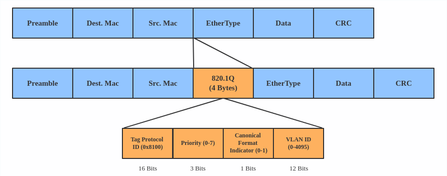
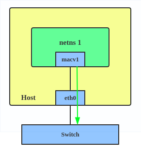
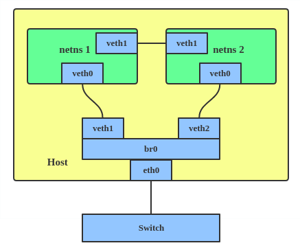

# Linux Advanced Routing & Traffic Control HOWTO
https://lartc.org/howto/index.html

# ip route
```shell
root@u22:/# ip route show
default via 192.168.4.2 dev ens38 proto dhcp metric 101
default via 192.168.3.1 dev ens33 proto static metric 20100
169.254.0.0/16 dev ens33 scope link metric 1000
192.168.3.0/24 dev ens33 proto kernel scope link src 192.168.3.2 metric 100
192.168.4.0/24 dev ens38 proto kernel scope link src 192.168.4.128 metric 101
```

第一项用于比较目的地址

带 via 192... 指网关，也就是下一跳的MAC地址为此主机的MAC

dev ensxx 指输出设备

proto dhcp/static 指这条路由项怎么被设置的

metric 表示路由的度量值（metric）。度量值用于确定路由选择的优先级，较低的度量值表示更优先的路由。
当存在多个匹配的路由时，系统会选择度量值最低的路由进行数据包转发。

## 查询路由


linux在做路由时，大致分为本机入栈，出栈，和转发的情况

以下皆以如以下路由表为测试环境
```shell
172.168.10.0/24 dev veth0 scope link
172.168.11.0/24 via 172.168.10.1 dev veth0
172.168.13.0/24 dev veth3- proto kernel scope link src 172.168.13.1
172.168.200.0/24 dev tunl0 proto kernel scope link src 172.168.200.1
```

对目的地址查询路由时，使用前缀树匹配，找到最长的叶子条目

用人类的方式查询路由

先用目的地址和掩码做与运算，然后看和谁相等

如目的地址为 172.168.200.231 和每条路由的掩码做与运算 得到 172.168.200.0 和 第4条路由匹配

### 出栈路由
对于出栈数据包，查询路由时不使用源地址，只使用目标地址（不考虑绑定输出设备的情况）

当发送ICMP到 172.168.11.23 时，会找到路由条目
```
172.168.11.0/24 via 172.168.10.1 dev veth0
```
那么数据包的源IP会被设置为 veth0 的IP，oif 为 veth0，下一跳为 172.168.10.1

使用ip 可以验证

因为出栈数据包之确定目的IP，所以可以写为
```shell
root@ubuntu:~/test# ip route get from 0.0.0.0 to 172.168.13.23 oif veth3-
172.168.13.23 dev veth3- src 172.168.13.1 uid 0
    cache
```

也可以简写为
```shell
ip route get 172.168.11.23
```
### 入栈路由

有一入栈数据包

源IP 172.168.13.2 目的IP为 172.168.10.2 输入设备为 veth3-

```shell
root@ubuntu:~/test# ip route get from 172.168.13.2 to 172.168.10.2 iif veth3-
local 172.168.10.2 from 172.168.13.2 dev lo
    cache <local> iif veth3-
```

使用 ip 命令验证，数据包的 route 类型是 local，说明是入栈

可以发现main路由表内没有这条路由，之所以能路由，是因为 local表

如果数据包

源IP 172.168.14.2 目的IP为 172.168.10.2 输入设备为 veth3-

由于源IP不在输入设备的网段，linux会认为是攻击包，会丢弃，使用 iptables 跟踪会发现 PREROUTING有计数，route之后就被丢弃了

使用 ip 验证 

```shell
root@ubuntu:~/test# ip route get from 172.168.14.2 to 172.168.10.2 iif veth3-
RTNETLINK answers: Invalid cross-device link
```

可见 route 模块会丢弃没有路由的包，而没有路由的原因通常是 

目的地址找不到同网段的设备做输出设备 或

源地址和输入设备网段不匹配


### 转发数据包

数据包为

源IP 172.168.13.2 目的IP为 172.168.10.5 输入设备为 veth3-

源IP在veth3-网段，且能找到目的IP的网段做输出设备

数据包可以进行转发

使用ip验证

```shell
root@ubuntu:~/test# ip route get from 172.168.13.2 to 172.168.10.5 iif veth3-
172.168.10.5 from 172.168.13.2 dev veth0
    cache iif veth3-
```

### 路由的 res.type
IP层收到数据包后，要判断数据包是发送给自己还是单播或广播或组播，通过 ip_route_input 
```c
ip_route_input
	fib_lookup(net, &fl, &res);
	if (res.type == RTN_BROADCAST)
		goto brd_input;
	if (res.type == RTN_LOCAL) {
		goto local_input;
local_input:
		rth = dst_alloc(&ipv4_dst_ops);
		rth->fl.fl4_dst	= daddr;
		rth->rt_dst	= daddr;
		rth->rt_src	= saddr;
		rth->fl.iif	= dev->ifindex;
		rth->u.dst.dev	= net->loopback_dev; // 如果目的地址是本地的数据包交给 loopback_dev 设备进行发送
		                                     // 所以主机内网络通信，传输到链路层后交给的网络设备是loopback_dev，所以不会传输到网线上
		rth->idev	= in_dev_get(rth->u.dst.dev);
		rth->rt_gateway	= daddr; // 本地路由的下一跳就是目的地址
	}

	// 处理单播, 单播的下一跳通常不是目的地址且输出设备也不是 loopback
	// 所以需要根据查询到的路由项res 构造路由缓存
	ip_mkroute_input(skb, &res, &fl, in_dev, daddr, saddr, tos);
		struct rtable* rth = NULL;
		__mkroute_input(skb, res, in_dev, daddr, saddr, tos, &rth);
			rth = dst_alloc(&ipv4_dst_ops);
			rth->fl.fl4_dst	= daddr;
			rth->rt_dst	= daddr;
			rth->fl.fl4_tos	= tos;
			rth->fl.fl4_src	= saddr;
			rth->rt_src	= saddr;
			rth->rt_gateway	= daddr;
			rth->rt_iif 	=
				rth->fl.iif	= in_dev->dev->ifindex; //输出设备由路由项决定
			rth->u.dst.dev	= (out_dev)->dev;
			rth->idev	= in_dev_get(rth->u.dst.dev);
			rth->u.dst.input = ip_forward; // 对于输入的数据包进行转发处理
			rth->u.dst.output = ip_output;

			rt_set_nexthop(rth, res, itag); // 设置下一跳也就是网关
				struct fib_info *fi = res->fi;
				// 只有当路由条目的使用范围为 link 才设置网关
				if (FIB_RES_GW(*res) &&
					FIB_RES_NH(*res).nh_scope == RT_SCOPE_LINK)
					rt->rt_gateway = FIB_RES_GW(*res);


// res.type 有如下可能：
enum
{
	RTN_UNSPEC,
	RTN_UNICAST,		/* Gateway or direct route	*/
	RTN_LOCAL,		/* Accept locally		*/
	RTN_BROADCAST,		/* Accept locally as broadcast,
				   send as broadcast */
	RTN_ANYCAST,		/* Accept locally as broadcast,
				   but send as unicast */
	RTN_MULTICAST,		/* Multicast route		*/
	RTN_BLACKHOLE,		/* Drop				*/
	RTN_UNREACHABLE,	/* Destination is unreachable   */
	RTN_PROHIBIT,		/* Administratively prohibited	*/
	RTN_THROW,		/* Not in this table		*/
	RTN_NAT,		/* Translate this address	*/
	RTN_XRESOLVE,		/* Use external resolver	*/
	__RTN_MAX
};

// 其中 RTN_LOCAL 表示发送给本机
//      RTN_UNICAST 表示需要转发的单播
// 使用 ip-route可以知道路由项的 res.type
// main表内没有一项为local,所以匹配main表任意一项都不会本地接受
root@u22:/# ip route show table main type local

// local表大量为local，匹配local表内，表示本地接受
root@u22:/# ip route show table local type local
local 127.0.0.0/8 dev lo proto kernel scope host src 127.0.0.1
local 127.0.0.1 dev lo proto kernel scope host src 127.0.0.1
local 169.254.7.114 dev ens37 proto kernel scope host src 169.254.7.114
local 192.168.3.2 dev ens33 proto kernel scope host src 192.168.3.2
local 192.168.4.128 dev ens38 proto kernel scope host src 192.168.4.128

// local表内没有一项为unicast，所以不会有转发
root@u22:/# ip route show table local type unicast
// main表内有很多unicast，会转发
root@u22:/# ip route show table main type unicast
default via 192.168.4.2 dev ens38 proto dhcp metric 101
default dev ens37 scope link metric 1003 linkdown
default via 192.168.3.1 dev ens33 proto static metric 20100
169.254.0.0/16 dev ens37 proto kernel scope link src 169.254.7.114 linkdown
169.254.0.0/16 dev ens33 scope link metric 1000
192.168.3.0/24 dev ens33 proto kernel scope link src 192.168.3.2 metric 100
192.168.4.0/24 dev ens38 proto kernel scope link src 192.168.4.128 metric 101

另外使用ip-route还可以查看一个目标地址使用哪条路由项
root@u22:/# ip route get 192.168.5.5
192.168.5.5 via 192.168.4.2 dev ens38 src 192.168.4.128 uid 0
    cache

root@u22:/# ip route get 192.168.3.1
192.168.3.1 dev ens33 src 192.168.3.2 uid 0
    cache
```

## 设置路由
```shell
# default: 所有数据包匹配
# via : 下一跳为 192.168.1.1，即MAC地址，即网关
ip route add default via 192.168.1.1

# 匹配条件为目标地址为192.168.4.0/24网段，
# via : 下一调为 192.168.166.1
# dev : 输出设备的wlan0
ip route add 192.168.4.0/24 via 192.168.166.1 dev wlan0

# 匹配条件为目标地址为192.168.1.9
# via : 下一跳为 192.168.166.1
# dev : 输出设备为wlan0
ip route add 192.168.1.9 via 192.168.166.1 dev wlan0

ip route add default via 192.168.1.1 table 1

ip route add 192.168.0.0/24 via 192.168.166.1 table 1

# 删除192.168.4.0网段的网关
ip route del 192.168.4.0/24

# 删除默认网关
ip route del default

# 删除特定路由
ip route flush 10.38.0.0/16

# 清空路由表
ip route flush table main

# src : 当数据包匹配此路由项时，如果数据包没有设置源地址（没有用bind）
#       则使用 src 指定的地址作为源地址进行发送
#       如果数据包有源地址，则不使用src指定的参数
#       src 只作用于本机发出的数据包，且没有显示指定源地址
ip route add 78.22.45.0/24 via 10.45.22.1 src 10.45.22.12

# 修改mac
ip link set eth0 addr 52:54:00:12:34:55
```

### 在VPN拨号程序的ip route应用
当vpn拨号前调用 routing_init, routing_start, 设置到vpn server 的路由，关闭vpn时 routing_end 
```c
char *route;

void routing_init(char *ip) 
{
	char buf[256];
	snprintf(buf, 255, "/bin/ip route get %s", ip);
	FILE *p = popen(buf, "r");
	fgets(buf, 255, p);
	/* TODO: check for failure of fgets */
	route = strdup(buf);
	pclose(p);
	/* TODO: check for failure of command */
}

void routing_start() {
	char buf[256];
	snprintf(buf, 255, "/bin/ip route replace %s", route);
	FILE *p = popen(buf, "r");
	pclose(p);
}

void routing_end() {
	char buf[256];
	snprintf(buf, 255, "/bin/ip route delete %s", route);
	FILE *p = popen(buf, "r");
	pclose(p);
}

```

## ip addr
```shell
root@u22:/# ip addr show
1: lo: <LOOPBACK,UP,LOWER_UP> mtu 65536 qdisc noqueue state UNKNOWN group default qlen 1000
    link/loopback 00:00:00:00:00:00 brd 00:00:00:00:00:00
    inet 127.0.0.1/8 scope host lo
       valid_lft forever preferred_lft forever
    inet6 ::1/128 scope host
       valid_lft forever preferred_lft forever
2: ens33: <BROADCAST,MULTICAST,UP,LOWER_UP> mtu 1500 qdisc fq_codel state UP group default qlen 1000
    link/ether 00:0c:29:89:30:6d brd ff:ff:ff:ff:ff:ff
    altname enp2s1
    inet 192.168.3.2/24 brd 192.168.3.255 scope global noprefixroute ens33
       valid_lft forever preferred_lft forever
    inet6 fe80::da3a:e4d2:87f2:80f0/64 scope link noprefixroute
       valid_lft forever preferred_lft forever
```
需要注意的子网掩码，以127.0.0.1 IP地址为例
255.0.0.0 -> 127.0.0.1/8
255.255.0.0 -> 127.0.0.1/16
255.255.255.0 -> 127.0.0.1/24
255.255.255.255 -> 127.0.0.1/32
显然 8，16，24，32表示为1的bit位数量

还需注意 qdisc


# ip neigh
```shell
root@u22:/# ip neigh show
192.168.4.254 dev ens38 lladdr 00:50:56:ef:b6:3d STALE
192.168.4.2 dev ens38 lladdr 00:50:56:e3:4b:0d STALE
192.168.3.1 dev ens33 lladdr 00:50:56:c0:00:01 REACHABLE

```

```shell
# 删除ARP项
ip neigh delete <IP> dev <dev_name>

# 添加ARP项
ip neigh add 192.168.111.100 lladdr 00:0c:29:c0:5a:ef dev enp0s3
```

# ip rule

## 查看策略
```
root@u22:/mnt/share/study_kernel/network# ip rule list
0:      from all lookup local
220:    from all lookup 220
32766:  from all lookup main
32767:  from all lookup default
其中 main 表就是 ip route 默认操作的表
```

## 示例 简单的源策略路由
```
有两个moden,希望源地址为 10.0.0.10的数据包走 ppp2
ppp0 212.64.94.251 -  212.64.94.1
ppp2 212.64.78.148 - 195.96.98.253
```

### 当前main表有两个默认路由 ppp2 ppp0
```
ip route list table main
195.96.98.253 dev ppp2 proto kernel scope link src 212.64.78.148
212.64.94.1 dev ppp0 proto kernel scope link src 212.64.94.251
10.0.0.0/8 dev eth0 proto kernel scope link src 10.0.0.1
127.0.0.0/8 dev lo scope link
default via 212.64.94.1 dev ppp0

# 添加一个表名为 200,别名John
echo 200 John >> /etc/iproute2/rt_tables
# 让源地址为 10.0.0.10 的数据包使用 John 表
ip rule add from 10.0.0.10 table John

# John 表在 main表前
ip rule ls
0:from all lookup local
32765:from 10.0.0.10 lookup John
32766:from all lookup main
32767:from all lookup default

# John表添加规则，所有数据包走 ppp2
ip route add default via 195.96.98.253 dev ppp2 table John

# 刷新路由缓存
ip route flush cache
```

### 示例 wireguard的路由
```shell
[#] ip link add wg0 type wireguard
[#] wg setconf wg0 /dev/fd/63
[#] ip -4 address add 10.10.10.85/24 dev wg0
[#] ip link set mtu 1420 up dev wg0
[#] resolvconf -a tun.wg0 -m 0 -x
[#] wg set wg0 fwmark 51820
[#] ip -6 route add ::/0 dev wg0 table 51820
[#] ip -6 rule add not fwmark 51820 table 51820
[#] ip -6 rule add table main suppress_prefixlength 0
[#] nft -f /dev/fd/63
[#] ip -4 route add 0.0.0.0/0 dev wg0 table 51820
[#] ip -4 rule add not fwmark 51820 table 51820
[#] ip -4 rule add table main suppress_prefixlength 0
[#] sysctl -q net.ipv4.conf.all.src_valid_mark=1
[#] nft -f /dev/fd/63
```

```shell
root@u22:~/linux-2.6.29.6# ip rule list
0:      from all lookup local
218:    from all lookup main suppress_prefixlength 0
219:    not from all fwmark 0xca6c lookup 51820
220:    from all lookup 220
32766:  from all lookup main
32767:  from all lookup default
```
wireguard 加了两个策略

```shell
 对于所有报文，并且 suppress_prefixlength 0 为真使用 main 表
 suppress_prefixlength 可以通过 man ip-rule
              suppress_prefixlength NUMBER
                     reject routing decisions that have a prefix length of
                     NUMBER or less.
                     拒绝路由条目其前缀长度小于等于NUMBER
 所以 suppress_prefixlength 0 就是拒绝 xx.xx.xx.xx/0 的路由条目，也就是默认路由条目

218:    from all lookup main suppress_prefixlength 0

所以main表中除了默认路由都能生效，比如用户设置的内网路由
所以当发送一个到外网的数据包时首先使用 main 表，但是由于默认路由都被拒绝了，所以main表匹配不到，走下面的表

除掉fwmark 0xca6c 的数据包都匹配策略，查询 51820 表
wireguard口出来的包都会被打上 0xca6c的fwmark
219:    not from all fwmark 0xca6c lookup 51820

所以一般的数据包会匹配此策略，并查询 51820 表

51820 表包含一条默认路由，将所有数据包走 wg0 设备
wg0将数据包封装，目的地址为VPN服务器地址，通常是外网地址
root@u22:~/linux-2.6.29.6# ip route show table 51820
default dev wg0 scope link

然后再次查询路由，由于需要默认路由，且被标记了 0xca6c，
所以策略 218 219 都不匹配，220 是空，最终匹配策略 32766
32766:  from all lookup main

所以封装的数据包使用默认路由发送给网关，最终发送到VPN服务器
VPN服务器去除封装，得到原始数据包，
然后基于原始数据包目的IP查询路由，确定是转发，还是本机
root@u22:~/linux-2.6.29.6# ip route show table main
default via 192.168.4.2 dev ens38 proto dhcp metric 101
default via 192.168.3.1 dev ens33 proto static metric 20100
10.10.10.0/24 dev wg0 proto kernel scope link src 10.10.10.85
169.254.0.0/16 dev ens33 scope link metric 1000
192.168.3.0/24 dev ens33 proto kernel scope link src 192.168.3.2 metric 100
192.168.4.0/24 dev ens38 proto kernel scope link src 192.168.4.128 metric 101
```

# ip netns

```shell
ip netns add net0

// 列出所有netns
ip netns list

// 当前所处的netns
ip netns id

ip netns exec net0 command
ip netns exec net0 bash
```

## veth 和 netns
```shell
增加一对veth虚拟网卡
ip link add type veth

删除veth0 veth1 虚拟网卡对
ip link del veth0

指定名称的方式添加
ip link add veth01 type veth peer name veth10

将veth0 添加到net0虚拟网络环境
ip link set veth0 netns net0

将虚拟网卡eth1改名并添加到net1虚拟网络环境中
ip link set dev  veth1 name net1-bridge netns net1

为虚拟网络环境net0的veth0设备增加IP地址
ip netns exec net0 ip address add 10.0.1.1/24 dev veth0
```


# ip link set 改变设备属性

```shell
ip link add name br0 type bridge
ip link set br0 up
ip link set dev veth0 master br0
```
 
## bridge_slave

```shell
ip link set type bridge_slave [ fdb_flush ] [ state STATE ] [ priority PRIO ] [ cost COST ] [ guard { on | off } ] [ hairpin { on | off } ] [ fastleave {
on | off } ] [ root_block { on | off } ] [ learning { on | off } ] [ flood { on | off } ] [ proxy_arp { on | off } ] [ proxy_arp_wifi { on | off } ] [
mcast_router MULTICAST_ROUTER ] [ mcast_fast_leave { on | off} ] [ mcast_flood { on | off } ] [ group_fwd_mask MASK ] [ neigh_suppress { on | off } ] ] [
vlan_tunnel { on | off } ]
```

`fdb_flush` 
清除桥接从设备的fdb动态条目。

`state STATE` 
设置端口状态。STATE是一个数字，代表以下状态：0（禁用），1（监听），2（学习），3（转发），4（阻塞）。

`priority PRIO` 
设置端口优先级（允许的值介于0到63之间，包括两端）。

`cost COST`  
设置端口成本（允许的值介于1到65535之间，包括两端）。

`guard { on | off }` 
在此端口上阻止传入BPDU数据包。

`hairpin { on | off }`
在此端口上启用发夹模式。这将允许在此端口上接收到的数据包被反射回来。

`fastleave { on | off }` 
在此端口上启用多播快速离开。

`root_block { on | off }` 
阻止此端口成为桥的根端口。

`learning { on | off }` 
在此端口上允许MAC地址学习。

`mcast_router MULTICAST_ROUTER` 
为此端口配置具有多播路由器的情况。具有多播路由器的端口将接收所有多播流量。
MULTICAST_ROUTER可以是0以在此端口上禁用多播路由器，也可以是1让系统自动检测路由器的存在（这是默认值），

`proxy_arp { on | off }`
在此端口上启用代理ARP（Proxy ARP）。

`ip link set dev rlab-pc1- type bridge_slave proxy_arp on`

`proxy_arp_wifi { on | off }`
在满足IEEE 802.11和Hotspont 2.0规范的扩展要求的端口上启用代理ARP。

`mcast_router MULTICAST_ROUTER`
为附加的多播路由器配置此端口。具有多播路由器的端口将接收所有多播流量。

MULTICAST_ROUTER可以是0（在此端口上禁用多播路由器）、1（让系统检测路由器的存在，这是默认值）、

2（永久在此端口上启用多播流量转发）或3（临时在此端口上启用多播路由器，不依赖于传入查询）。

`mcast_fast_leave { on | off }`
这是上面fastleave选项的同义词。

`mcast_flood { on | off }`
控制给定端口是否会被没有MDB条目的多播流量淹没。

`group_fwd_mask MASK`
设置组转发掩码。这是应用于决定是否转发目标为链路本地地址的传入帧的位掩码，即地址形式为01:80:C2:00:00:0X（默认值为0，即桥不会转发从此端口进来的任何链路本地帧）。

`neigh_suppress { on | off }`
控制端口上是否启用邻居发现（ARP和ND）代理和抑制。默认情况下此标志为关闭状态。

`vlan_tunnel { on | off }`
控制端口上是否启用VLAN到隧道的映射。默认情况下此标志为关闭状态。

# 隧道
linux支持3种隧道 
- ipip    IP over IP              tunl0
- sit     IPv6 over IP            sit0
- gre     Any over GRE over IP    gre

所有类型隧道的创建使用一种命令
```
ip tunnel add <NAME> mode <MODE> [ local <S> ] [ remote <D> ]
```
NAME 是任意字符串
mode MODE 设置隧道类型，ipip sit gre
remote D 设置隧道对端的地址
local S 为隧道设置固定的本地地址

远程和本地都可以省略。在这种情况下，我们说它们是零或通配符。

隧道被分为两类：点对点隧道和 NBMA（即非广播多路访问）隧道。

点对点隧道有一些固定的远程地址，并将所有数据包发送到该目的地。

然而NBMA隧道，既没有远程地址也没有本地地址。

创建隧道设备后，您应该像配置其他设备一样进行配置。

点对点隧道上的协议配置与其他设备的配置没有区别。您应该使用ifconfig设置协议地址，并使用route实用程序添加路由。

NBMA隧道是不同的。要通过NBMA隧道进行路由选择，您需要向驱动程序解释数据包应发送到的位置。

实现它的唯一方法是创建特殊的路由，网关地址指向所需端点。

例如，当数据包需要穿过特定的NBMA隧道时，您需要配置这些路由以确保它们正确地指向隧道的另一端点。这样，数据包就可以通过隧道正确地路由到其目标地址。

```
// 创建 NBMA 隧道
// A 是为对端地址
// 由于 A 通常是本机不可达的，所以必须加 onlink 避免报错
    ip route add 10.0.0.0/24 via <A> dev tunl0 onlink
```

使用onlink选项是很重要的，否则内核会拒绝通过tunl0设备无法直接访问的网关创建路由的请求。

对于IPv6来说，情况要简单得多：当您启动sit0设备时，它会通过映射所有IPv4地址到IPv6空间自动配置自己，这样所有IPv4互联网实际上都可以通过sit0访问！太棒了，这个命令。

```
  ip route add 3FFE::/16 via ::193.233.7.65 dev sit0
```

将通过sit0路由转发3FFE::/16，将所有目标为此前缀的数据包发送到193.233.7.65。


## option

添加命令“ip tunnel add”有几个额外的选项：

- ttl N —— 在隧道数据包上设置固定的TTL值N。N是在范围1-255之间的数字。特殊值0表示数据包继承TTL值。默认值是“继承”。
- tos T —— 在隧道数据包上设置固定的服务质量T。默认值是“继承”。
- dev DEV —— 将隧道绑定到设备DEV，这样隧道数据包将仅通过此设备路由，并且在端点更改路由时不会转移到其他设备。
- nopmtudisc ——在此隧道上禁用路径MTU发现。默认情况下是启用的。请注意，固定TTL与此选项不兼容：具有固定TTL的隧道始终执行pmtu发现。

IPIP和sit隧道没有其他选项了。GRE隧道则更复杂一些：
- key K ——使用带有密钥K的GRE加密技术。K是数字或者像IP地址的四进制数形式的IP地址。
- csum —— 对隧道数据包进行校验和计算。
- seq ——序列化数据包。请注意，这个选项可能不工作。至少我没有测试过它，没有调试过它，甚至不知道思科打算用它来做什么目的以及如何预期其工作原理。实际上，这些GRE选项可以针对输入和输出方向分别进行设置，通过在相应的关键字前添加字母i或o来实现。例如，icsum命令要求仅接受具有正确校验和的数据包，而ocsum表示我们的主机将计算和发送校验和。

## 多播

可以针对GRE隧道设置远程多播地址。这样的隧道变为广播隧道（虽然在这种情况下使用“隧道”这个词并不十分恰当，更准确的说法是虚拟网络）。

创建隧道：

```
// 创建一个名为Universe的隧道，本地地址为193.233.7.65，远程地址为多播地址224.66.66.66，TTL设置为16
ip tunnel add Universe local 193.233.7.65 remote 224.66.66.66 ttl 16 

// 为Universe隧道添加IP地址
ip addr add 10.0.0.1/16 dev Universe 

// 启动Universe隧道
ip link set Universe up 
```

这个隧道是真正的广播网络，广播数据包会被发送到多播组 224.66.66.66。

默认情况下，此隧道将通过ARP/NDISC解析IP和IPv6地址，因此如果周围网络支持多播路由，所有GRE节点会自动相互找到并形成虚拟以太网广播网络。

如果不支持多播路由也没关系，但意味着此功能被阻碍会导致这个隧道变成非广播多址访问网络（NBMA）。

可以通过以下命令禁用动态ARP请求：

```
// 将Universe隧道的动态ARP请求设置为禁用
echo 0 > /proc/sys/net/ipv4/neigh/Universe/mcast_solicit 
```

手动添加所需的ARP表信息：

```
// 添加永久邻居条目
ip neigh add 10.0.0.2 lladdr 128.6.190.2 dev Universe nud permanent 
```

在这种情况下，发送到 10.0.0.2 的数据包将被封装在GRE中并发送到相应的地址。

可以使用其他非广播多址访问网络的典型方法简化地址解析，例如启动用户级别的arpd守护程序来维护GRE虚拟网络的主机数据库或询问专门的ARP或NHRP服务器来获取信息。

实际上，这种配置对于隧道是最自然的配置方式，它具有很高的灵活性、可扩展性和可管理性，因此强烈建议在使用GRE隧道时使用它而不是使用丑陋的NBMA模式和onlink修饰符。

不幸的是，由于历史原因，IPIP隧道不支持广播模式，但这可能在将来会发生变化。

## 示例


# vxlan

## 应用场景和特点


L2层 overlay

相比vlan有支持更多的网络隔离

## vxlan报文


VNI : 相当于vlanid
目的UDP : 默认4789

## vxlan的基本概念

NVE 网络虚拟边缘, 是运行vxlan的设备


VTEP (vxlan隧道端点)

VTEP是vxlan隧道的端点IP，具体是两个NVE的WAN口IP。


VNI(vxlan网络标识)

不同vxlan id 的虚拟机不能通信

BD(桥域)

类似于vlan划分广播域，在vxlan中网络一个BD就表示一个大二层广播域

VNI以1:1的方式映射到BD，同BD的终端可以进行二层通信


## linux vxlan

VXLAN（Virtual eXtensible LAN）协议是一种隧道协议，旨在解决IEEE 802.1Q中有限的VLAN ID（4096个）的问题。

使用VXLAN时，标识符的大小扩展到24位（16777216个），使得能够管理更多的虚拟网络。

该协议使用单个目的端口在UDP上运行。

与大多数隧道不同，VXLAN是一个1对N的网络，而不仅仅是点对点的连接。VXLAN设备可以通过类似于学习桥的方式动态地学习其他端点的IP地址，或者使用静态配置的转发条目。

VXLAN的管理方式与其最接近的两个邻居GRE和VLAN相似。配置VXLAN需要使用与首次上游合并VXLAN的内核版本匹配的iproute2版本。

```shell
ip link add vxlan0 type vxlan id 42 group 239.1.1.1 dev eth1 dstport 4789
```

这创建了一个名为vxlan0的新设备。该设备使用eth1上的多播组239.1.1.1来处理转发表中不存在的流量。

目标端口号设置为IANA分配的4789值。VXLAN的Linux实现早于IANA选择标准目标端口号的时期，并且默认使用Linux选择的值以保持向后兼容性。

可以使用新的桥接命令创建、销毁和显示VxLAN转发表。

```shell
bridge fdb add to 00:17:42:8a:b4:05 dst 192.19.0.2 dev vxlan0
bridge fdb delete 00:17:42:8a:b4:05 dev vxlan0
bridge fdb show dev vxlan0
```

## bridge fdb add
添加一个新的fdb条目
此命令用于创建新的fdb条目。
LLADDR 是以太网MAC地址。
- dev（DEV）是与该地址相关联的接口。
 - local ：是一个本地永久fdb条目
 - static：是一个无ARP的静态fdb条目
 - dynamic ：是一个可到达的、可老化的动态fdb条目
 - self ：地址与端口驱动程序的fdb相关联。通常是硬件相关。
 - master ：地址与主设备的fdb相关联。通常是软件默认关联。
 - router ：目标地址与路由器相关联。如果引用的设备是VXLAN类型设备并且启用了路由短路，则此选项有效。
 - use ：地址正在使用中。用户空间可以使用此选项向内核指示fdb条目正在使用中。

接下来的命令行参数仅适用于类型为VXLAN的指定设备（DEV）。
- dst IPADDR：目标VXLAN隧道端点的IP地址，以太网MAC地址位于该处。
- vni VNI：用于连接到远程VXLAN隧道端点的VXLAN VNI网络标识符（或VXLAN段ID）。如果省略，将使用在vxlan设备创建时指定的值。
- port（PORT）：用于连接到远程VXLAN隧道端点的UDP目标端口号。如果省略，将使用默认值。
- via （DEVICE）：对于VXLAN设备驱动程序到达远程VXLAN隧道端点的传出接口的设备名称。

## man手册

```shell
  ip link add DEVICE type vxlan id VNI [ dev PHYS_DEV  ] [ { group | remote } IPADDR ] [ local { IPADDR | any } ] [ ttl TTL ] [ tos TOS ] [ flowlabel
  FLOWLABEL ] [ dstport PORT ] [ srcport MIN MAX ] [ [no]learning ] [ [no]proxy ] [ [no]rsc ] [ [no]l2miss ] [ [no]l3miss ] [ [no]udpcsum ] [
  [no]udp6zerocsumtx ] [ [no]udp6zerocsumrx ] [ ageing SECONDS ] [ maxaddress NUMBER ] [ [no]external ] [ gbp ] [ gpe ]
```
- id VNI：指定使用的VXLAN网络标识符（或VXLAN段标识符）。
- dev PHYS_DEV：指定用于隧道端点通信的物理设备。
- group IPADDR：指定要加入的组播IP地址。此参数不能与远程参数一起指定。
- remote IPADDR：当VXLAN设备转发数据库中未知目标链路层地址时，指定出站数据包中使用的单播目标IP地址。此参数不能与组参数一起指定。
- local IPADDR：指定出站数据包中要使用的源IP地址。
- ttl TTL：指定出站数据包中要使用的TTL（Time To Live）值。
- tos TOS：指定出站数据包中要使用的服务类型（Type of Service）值。
- flowlabel FLOWLABEL：指定出站数据包中要使用的流标签。
- dstport PORT：指定用于与远程VXLAN隧道端点通信的UDP目标端口。
- 源端口范围的端口号，以与远程VXLAN隧道端点进行通信。
- [no]learning：指定是否将未知的源链路层地址和IP地址添加到VXLAN设备转发数据库。
- [no]rsc：指定是否开启路由短路功能。
- [no]proxy：指定是否开启ARP代理功能。
- [no]l2miss：指定是否生成netlink链路层地址缺失通知。
- [no]l3miss：指定是否生成netlink IP地址缺失通知。
- [no]udpcsum：指定是否在通过IPv4传输的出站数据包上计算UDP校验和。srcport MIN MAX：指定用作UDP
- [no]udp6zerocsumtx：跳过IPv6上出站数据包的UDP校验和计算。允许针对传入数据包的优化，提升性能效率的同时不会影响功能使用或传输的数据正确性保证与稳定性；

## 示例

### 点对端


### 利用ARP广播设置 VTEP

当每个router的LAN在同个网段，可以利用ARP实现组网


### 手动设置VTEP 过路由不同网段
当每个router的LAN在不同网段，让对端路由做路由中转


# bound
Linux bonding 驱动提供了一种将多个网络接口聚合为一个单一逻辑“绑定”接口的方法。

绑定接口的行为取决于模式；一般来说，模式提供热备或负载均衡服务。这种技术有助于提高网络冗余性和性能，因为它允许系统通过多个网络接口同时处理流量。


当您想要提高链接速度或在服务器上进行故障切换时，请使用绑定接口。

以下是创建绑定接口的方法：

ip link add bond1 type bond miimon 100 mode active-backup
ip link set eth0 master bond1
ip link set eth1 master bond1

这将创建一个名为 bond1 的绑定接口，模式为 active-backup。有关其他模式，请参阅内核文档。

https://www.kernel.org/doc/Documentation/networking/bonding.txt

## bound模式

在使用命令 

`ip link add bond0 type bond` 

创建 Bond 接口时，可以指定不同的 Bond 模式。

常见的 Bond 模式有以下几种： 

`mode=balance-rr`
即 Round-robin 模式，是默认的 Bond 模式。在该模式下，数据包会按照轮流分发到不同的物理接口上，从而实现负载均衡。 

`mode=active-backup`
即 Active-backup 模式，也称为 failover 模式。在该模式下，只有一个物理接口处于工作状态，其余接口处于备份状态，当工作接口发生故障时，备份接口会自动接管工作。 

`mode=balance-xor`
即 XOR 模式，会将源 MAC 地址和目标 MAC 地址的异或值作为哈希值，然后根据哈希值将数据包分发到不同的物理接口上。 

`mode=802.3ad`
即 LACP 模式，需要支持 IEEE 802.3ad 协议的交换机。该模式通过协商确定哪些物理接口可以组成 Bond 接口，从而实现负载均衡。 

`mode=broadcast`
即广播模式，数据包会广播到所有物理接口上，适用于 IPMI 等特殊场景下的通信。 

`mode=balance-tlb`
即 Transmit Load Balancing 模式，类似于 balance-rr 模式，但是会根据每个物理接口的负载情况动态调整数据包的发送顺序。 

`mode=balance-alb`
即 Active Load Balancing 模式，可以在发送数据包时动态调整每个数据包的源 MAC 地址，从而实现负载均衡。


```shell
ip link add bond0 type bond miimon 100 mode balance-rr xmit_hash_policy layer3+4
ip link set bond0 up
ip link set dev eth1 master bond0
ip link set dev eth2 master bond0
ip link set dev bond0 address 00:11:22:33:44:58
ip link set dev eth1 address 00:11:22:33:44:58
ip link set dev eth2 address 00:11:22:33:44:58
```

# bridge
Linux 桥接的行为类似于网络交换机。它在连接的接口之间转发数据包。

它通常用于路由器上的数据包转发、网关或主机上的虚拟机和网络命名空间之间的数据包转发。

它还支持 STP（生成树协议）、VLAN 过滤和多播侦听。通过配置桥接，您可以控制网络流量，实现不同的网络拓扑和配置，以满足特定的需求。


当您想在虚拟机、容器和主机之间建立通信通道时，请使用桥接。

以下是创建桥接的方法：

```shell
# ip link add br0 type bridge
# ip link set eth0 master br0
# ip link set tap1 master br0
# ip link set tap2 master br0
# ip link set veth1 master br0
```

这将创建一个名为 br0 的桥接设备，并将两个 TAP 设备（tap1、tap2）、一个 VETH 设备（veth1）和一个物理设备（eth0）设置为其从属设备，如上图所示。

# Team device

与绑定接口类似，team设备的目的是在 L2 层提供一种机制，将多个网卡（端口）组合成一个逻辑设备（teamdev）。这有助于提高网络的冗余性和带宽利用率。


明白了team设备的主要目标是解决相同的问题，但采用不同于绑定接口的方法，例如使用无锁（RCU）的TX/RX路径和模块化设计。

然而，bound接口和team之间也存在一些功能上的差异。例如，team支持LACP负载均衡、NS/NA（IPV6）链接监控、D-Bus接口等，这些都是bound接口所没有的。

关于bound和team之间的差异的更详细信息，请参阅bound与team功能对比。

https://github.com/jpirko/libteam/wiki/Bonding-vs.-Team-features

如果你想使用bound接口不提供的一些功能，那么应该使用team。下面是创建team的步骤：

```shell
# teamd -o -n -U -d -t team0 -c '{"runner": {"name": "activebackup"},"link_watch": {"name": "ethtool"}}'
# ip link set eth0 down
# ip link set eth1 down
# teamdctl team0 port add eth0
# teamdctl team0 port add eth1
```

这段描述创建了一个名为team0的团队接口，并设置了模式为active-backup。同时，将eth0和eth1添加为team0的子接口。

最近，Linux中添加了一个新的驱动程序，名为net_failover。这是一个用于虚拟化的故障转移主网络设备，

它管理一个主要（直通/虚拟功能设备）的附属网络设备和另一个备用的（原始虚拟接口）附属网络设备。

简而言之，net_failover提供了一种机制来在主要的网络设备出现问题时自动切换到备用设备，从而提高网络连接的可靠性和容错能力。

这种功能在虚拟化环境中尤其有用，因为它可以确保即使在主要网络设备出现故障的情况下，虚拟机仍然可以保持网络连接。


# VLAN

VLAN，也被称为虚拟局域网，它通过向网络包添加标签来分隔广播域。VLANs允许网络管理员将主机分组在同一个交换机下或不同的交换机之间。VLAN头部看起来像这样：



使用VLAN时，您想要将虚拟机、命名空间或主机中的子网分隔开来。下面是创建VLAN的步骤：

首先，通过执行以下命令来创建VLAN：

```bash
# ip link add link eth0 name eth0.2 type vlan id 2
# ip link add link eth0 name eth0.3 type vlan id 3
```


注意：在配置VLAN时，需要确保连接到主机的交换机能够处理VLAN标签，例如，通过将交换机端口设置为trunk模式。

## kernel实现vlan设备 
当使用vlan 设备发送时，发出的数据包一定会加上vlan header

当接受数据包时，一个真实设备，如eth0，可以连接多个vlan 设备，每个vlan设备的id不同，

所以在接受vlan数据包时，只要数据包的vlan id在eth0相关vlan设备的vlan id号内，则能接受，

如果接受vlan数据包时，vlan id不在此范围内，则视为发送给其他主机的数据包，则丢弃。

所以vlan id 相当于在 L2层多了一个地址域，即以前是只比较目的地址和mac地址，现在还要比较vlan id

对于接受不带vlan的数据包时，由真实设备接受，但是需要注意，若主机使用了vlan，则发送响应包时会查询路由，

可能路由的结果是通过 vlan 设备发送，所以响应包会带 vlan id，但接受方的网口没有添加对应vlan id 的设备，

所以无法通信, 这时要么添加合适的路由，要么让接受方也使用vlan

## tag untag

当vlan设备发送包时，会发送带tag的包

当非vlan设备收到带tag的包时，会查看自己是否有相关的vlan设备，如果没有则丢弃，如果有，则去除tag并将输入设备改为对应的vlan设备

## vid pvid

每个vlan设备有一个vid，一个非vlan设备可以关联多个vlan设备，这些vlan设备的vid不同，相当于此非vlan设备能接受多个不同的vid包 

pvid当交换机端口接受到无tag的包时，但端口是vlan口，则用pvid给包加上tag(vlan设备无法实现，bridge可以)

## 示例

```shell
1. 保证eth0没有IP

2. 添加vlan
sudo ip link add link eth0 name eth0.10 type vlan id 10

sudo ip link add link eth0 name eth0.20 type vlan id 20

3. 给vlan设备添加ip
ip addr add 172.1.1.10/24 dev eth0.10
ip addr add 172.1.1.20/24 dev eth0.20

4. 启动设备
ip link set eth0 up
ip link set eth0.10 up
ip link set eth0.20 up

5. 查看vlan
cat /proc/net/vlan/config
```
## 示例2


## 示例3


注意在br中vlan是无法隔离的，vlan只能过滤输入的包，在br内部的包的转发不考虑tag

所以拓扑图应该这样做


更简单的方法应该使用 bridge 命令

# VXLAN

VXLAN（Virtual eXtensible Local Area Network）是一种隧道协议，旨在解决IEEE 802.1q中VLAN ID数量有限（4,096个）的问题。它被IETF RFC 7348所描述。

VXLAN通过使用24位的段ID，也称为VXLAN网络标识符（VNI），允许创建多达2^24（即16,777,216）个虚拟局域网，这是VLAN容量的4,096倍。

VXLAN通过将第2层的帧与一个VXLAN头封装在一个UDP-IP数据包中，其结构大致如下：


VXLAN通常在数据中心的虚拟化主机上部署，这些主机可能分布在多个机架中。


```bash
# ip link add vx0 type vxlan id 100 local 1.1.1.1 remote 2.2.2.2 dev eth0 dstport 4789
```

https://www.kernel.org/doc/Documentation/networking/vxlan.txt
https://vincent.bernat.ch/en/blog/2017-vxlan-linux

# MACVLAN

VLAN允许你在单个接口上创建多个接口，并根据VLAN标签过滤数据包。

而MACVLAN允许你在单个接口上创建具有不同第2层（即以太网MAC）地址的多个接口。

在MACVLAN之前，如果你想从虚拟机或命名空间连接到物理网络，你需要创建TAP/VETH设备，

并将一侧连接到桥接器上，同时在主机上将物理接口连接到同一桥接器上，如下所示。


通过这种方式，你可以在主机上为虚拟机提供访问物理网络的路径。

但请注意，由于虚拟化环境中的限制和复杂性，这种方式可能会面临诸多挑战和问题。

而随着技术的发展和演变，出现了像MACVLAN这样的技术，可以简化这种连接方式并提高其灵活性。

现在，通过MACVLAN，你可以将与MACVLAN关联的物理接口直接绑定到命名空间，而无需使用桥接器。


有五种MACVLAN类型：

1. 私有（Private）：

不允许同一物理接口上的MACVLAN实例之间进行通信，即使外部交换机支持发夹模式。


2. VEPA（Virtual Ethernet Protocol Acceleration）: 

它允许在同一物理接口上的多个MACVLAN实例之间进行通信。当从一个MACVLAN实例向另一个实例发送数据时，这些数据会通过物理接口进行传输。

为了确保这种通信能够发生，连接的交换机需要支持发圈模式（hairpin mode），或者在物理路径上存在一个TCP/IP路由器来转发这些数据包。

这样，不同的虚拟网络或租户可以共享同一物理网络基础设施，同时保持彼此之间的隔离和通信能力。这种技术常用于数据中心和虚拟化环境中，以提高资源利用率和网络性能。


3. 桥接（Bridge）：所有端点通过物理接口直接与简单桥接器相连。


4. 直通（Passthru）：允许单个虚拟机直接连接到物理接口。




5. 源(source)模式: 
用于根据允许的源MAC地址列表进行流量过滤，以创建基于MAC的VLAN关联。

你可以根据需要选择不同的类型，但最常用的通常是桥接模式。当你希望从容器直接连接到物理网络时，可以使用MACVLAN。下面是设置MACVLAN的步骤：

首先，你需要确保你的网络设备已经正确配置并连接到网络。然后，你可以按照以下步骤设置MACVLAN：

```bash
# ip link add macvlan1 link eth0 type macvlan mode bridge
# ip link add macvlan2 link eth0 type macvlan mode bridge
# ip netns add net1
# ip netns add net2
# ip link set macvlan1 netns net1
# ip link set macvlan2 netns net2
```

这会在桥接模式下创建两个新的MACVLAN设备，并将这两个设备分配到两个不同的命名空间。

# IPVLAN
IPVLAN与MACVLAN相似，不同之处在于端点具有相同的MAC地址。


IPVLAN支持第2层和第3层模式。IPVLAN的第2层模式类似于桥接模式下的MACVLAN。父接口看起来像一个桥接器或交换机。


在IPVLAN的第3层模式中，父接口充当路由器，数据包在端点之间进行路由，这提供了更好的可扩展性。


关于何时使用IPVLAN，IPVLAN内核文档指出，MACVLAN和IPVLAN在许多方面非常相似，具体的使用场景可以很好地定义选择哪种设备。

如果你的使用场景符合以下情况之一，你可以选择使用IPVLAN：

a. 连接到外部交换机/路由器的Linux主机有策略配置，只允许每个端口一个MAC地址。

   在这种情况下，使用IPVLAN可以帮助你避免MAC地址冲突，因为它为每个虚拟接口分配一个独立的IP地址，而不是共享MAC地址。

b. 在主机上创建的虚拟设备数量超过了MAC地址容量，并且网络的NIC被置于混杂模式，这会导致性能下降。

   在这种情况下，使用IPVLAN可以提高网络性能，因为它避免了在主机上处理过多的MAC地址。

c. 如果要将从设备放入敌对/不受信任的网络命名空间，其中从设备的L2可能会更改/滥用。

   在这种情况下，使用IPVLAN可以提供更好的安全性和隔离性，因为它将虚拟网络接口与物理网络接口分离，
   
   只允许特定的虚拟网络接口与物理网络进行通信。这有助于保护从设备免受恶意攻击或未经授权的访问。

总的来说，选择使用IPVLAN还是MACVLAN取决于你的具体需求和网络环境。了解你的使用场景和需求，并根据这些因素来选择合适的设备。

```bash
# ip netns add ns0
# ip link add name ipvl0 link eth0 type ipvlan mode l2
# ip link set dev ipvl0 netns ns0
```

这会创建一个名为ipvl0的IPVLAN设备，使用L2模式，并分配给命名空间ns0。

# MACVTAP/IPVTAP

MACVTAP/IPVTAP是一个新的设备驱动程序，旨在简化虚拟化桥接网络。

当在物理接口上创建MACVTAP/IPVTAP实例时，内核还会创建一个字符设备/dev/tapX，就像TUN/TAP设备一样使用，可以直接由KVM/QEMU使用。

通过MACVTAP/IPVTAP，您可以用单个模块替换TUN/TAP和桥接驱动程序组合。这意味着它可以简化和改进虚拟化的网络性能和管理。

MACVTAP/IPVTAP提供了更高效和更灵活的虚拟化网络解决方案，因为它允许直接通过物理接口进行通信，而无需经过额外的桥接层。

此外，它可能还提供了更好的性能，因为它能够更有效地处理数据包并减少网络延迟。总的来说，MACVTAP/IPVTAP可能是虚拟化环境中网络配置的一种改进方案。


通常，MACVLAN/IPVLAN被用于使客人和主机直接出现在主机所连接的交换机上。MACVTAP和IPVTAP之间的区别与MACVLAN/IPVLAN相同。

下面是创建MACVTAP实例的步骤：

```bash
# ip link add link eth0 name macvtap0 type macvtap
```

# VETH




# NLMON

NLMON 是netlink监控器设备

使用一个NLMON 设备，你可以监控系统的netlink消息

```bash
# ip link add nlmon0 type nlmon
# ip link set nlmon0 up
# tcpdump -i nlmon0 -w nlmsg.pcap
```

创建一个NLMON 设备，并使用tcpdump 捕获netlink消息，使用Wireshark解析nlmsg.pcap

# Dummy interface

虚拟接口完全是虚拟的，比如回环接口。虚拟接口的目的是提供一个设备来路由数据包，而实际上并不传输它们。

使用虚拟接口可以使一个不活动的SLIP（串行线路互联网协议）地址看起来像一个真实的地址，供本地程序使用。如今，虚拟接口主要用于测试和调试。

```bash
# ip link add dummy1 type dummy
# ip addr add 1.1.1.1/24 dev dummy1
# ip link set dummy1 up
```

# IFB
IFB（中间功能模块）驱动程序提供了一个设备，它允许从多个来源集中流量，并形成进入的流量而不是丢弃它。

当您想要排队和形成进入的流量时，请使用IFB接口。

```bash
# ip link add ifb0 type ifb
# ip link set ifb0 up
# tc qdisc add dev ifb0 root sfq
# tc qdisc add dev eth0 handle ffff: ingress
# tc filter add dev eth0 parent ffff: u32 match u32 0 0 action mirred egress redirect dev ifb0
```

这创建了一个名为ifb0的IFB设备，并将根队列调度器替换为SFQ（随机公平队列），这是一种无类的队列调度器。

然后它在eth0上添加了一个入口队列调度器，并将所有入口流量重定向到ifb0。

有关更多IFB队列调度器的使用案例，请参考Linux Foundation关于IFB的wiki。

https://wiki.linuxfoundation.org/networking/ifb

# netdevsim
netdevsim是一个模拟的网络设备，用于测试各种网络API。目前，它特别专注于测试硬件卸载、tc/XDP BPF和SR-IOV。

```bash
# ip link add dev sim0 type netdevsim
# ip link set dev sim0 up

To enable tc offload:

# ethtool -K sim0 hw-tc-offload on
To load XDP BPF or tc BPF programs:

# ip link set dev sim0 xdpoffload obj prog.o
To add VFs for SR-IOV testing:

# echo 3 > /sys/class/net/sim0/device/sriov_numvfs
# ip link set sim0 vf 0 mac 
To change the vf numbers, you need to disable them completely first:

# echo 0 > /sys/class/net/sim0/device/sriov_numvfs
# echo 5 > /sys/class/net/sim0/device/sriov_numvfs
```


