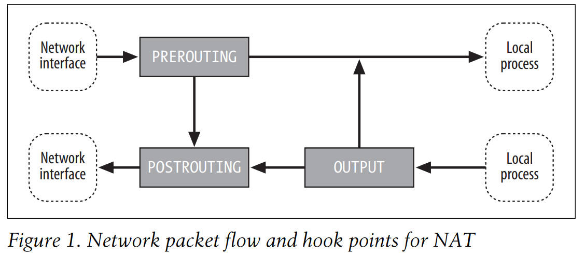
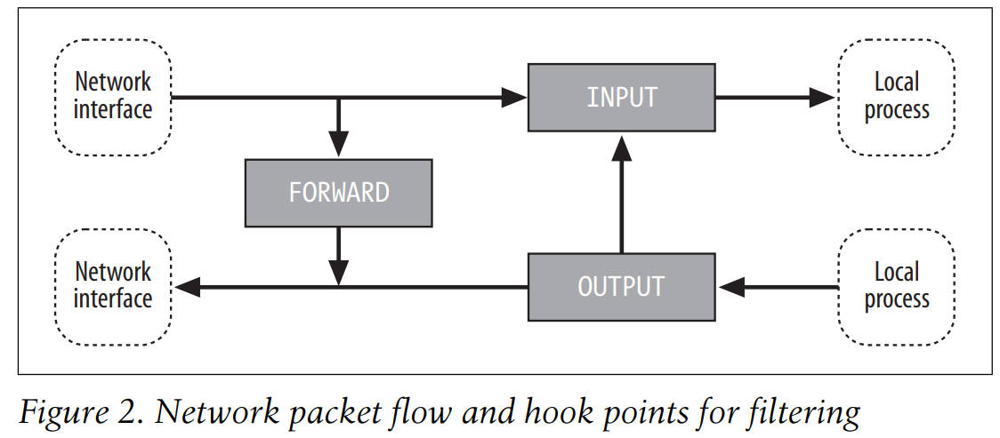
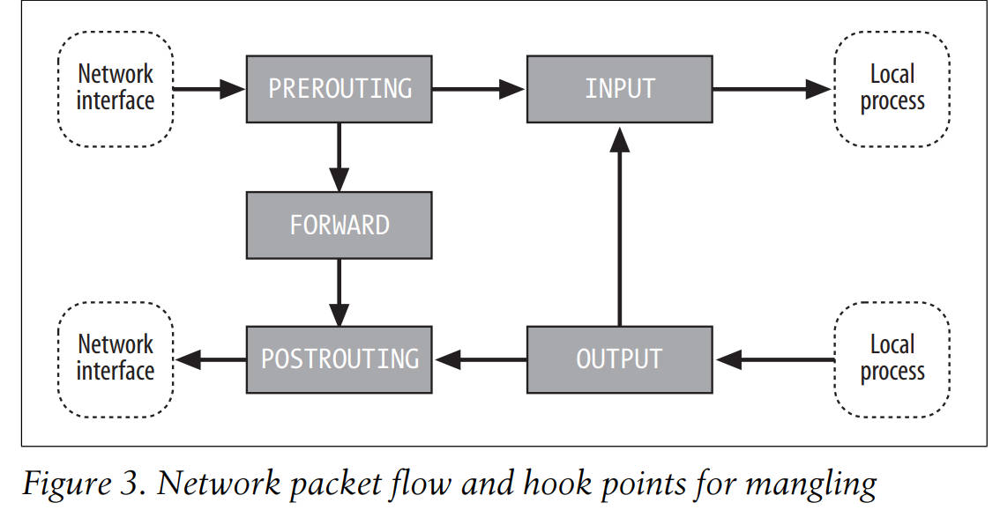
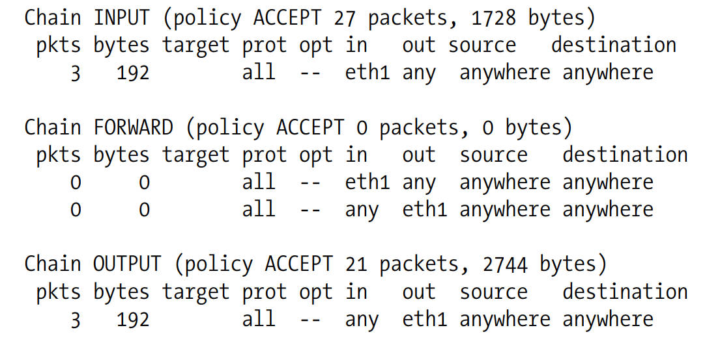

# 介绍
Linux 网络报文处理子系统被称为 netfilter，iptables是用于配置它的命令。

iptables 组织网络数据包处理规则到表中，按照规则的功能（过滤，地址转换，数据包修改）。这些表都有有序规则链。规则由match（用于决定本规则用于哪种数据包）和targets(决定会对匹配的数据包做什么)

iptables工作于 L3层，对于L2层，使用ebtables (Ether-net Bridge tables)


```shell
iptables -t nat -A PREROUTING -i eth1 -p tcp --dport 80 -j DNAT --to-destination 192.168.1.3:8080

-t nat     工作于NAT表
-A PREROUTING  将改规则追加到PREROUTING链
-i eth1    匹配从eth1入栈的数据包
-p tcp     该数据包使用tcp协议
--dport 80 该数据包目的端口为80
-j DNAT    跳转到DNAT target
--to-destination 192.168.1.3:8080 DNAT改变目的地址为192.168.1.3:8080
```

## 概念

netfilter 定义了5个hook点在内核协议栈处理数据包的路线上： PREROUTING, INPUT, FORWARD, POSTROUTING, OUTPUT
内置链被链接到这些hook点，你可以添加一系列规则对每个hook点，每个规则表示一个机会用于影响或监控数据流。

注意：
通常会说，nat表的PREROUTING链，暗示了链属于表，但是链和表只有部分关联，两者都不会真正属于哪一方，chain表示hook点在数据流。table表示hook点上可能发生的处理类型。
下面的图展示了所有的合法组合，和他们遇到数据包的顺序。

下图展示NAT工作时，数据包如何遍历。
这些是用于NAT表的各种链


这些是用于filter表的各种链


这些是用于mangle表的各种链



你选择链应该基于需要在数据流的哪里应用你的规则，如你希望过滤输出数据包，最好在OUTPUT链，因为POSTROUTING链不和filter表关联。

### tables

iptables有三个内建的表：filter, mangle, nat，他们都被预配置了chains，对应这一个或多个hook点，

nat : 用于配合连接跟踪以重定向连接以实现地址转换；典型的基于源地址或目标地址，内置链是 OUTPUT, POSTROUTING, PREROUTING

filter : 用于设置策略，以实现数据流的允许入栈，转发，出栈，除非你明确指定不同的表，否则iptables默认基于FORWARD, INPUT, OUTPUT 进行工作。

mangle : 用于专门的数据包改造，如剥离IP选项。它的内置链是 FORWARD INPUT OUTPUT POSTROUTING PREROUTING

注意：默认表是filter，如果你不显示指定表在iptables命令行中, filter会被假设

### chains

默认情况下，每个表都有链，链表初始化为空，用于一些或所有hook点。
另外，你可以创建自定义链用于组织你的规则。
chain's policy 决定了数据包的命运，这些数据包指通过其他规则，到达链的末尾。只有内置 targets ACCEPT 和 DROP 可以被用于作为内置链的 policy, 并且默认是 ACCEPT，所有自定义链有一个隐式policy是 RETURN，

如果你想一个更复杂的policy用于内置链或一个 policy（不是RETURN）用于自定义链，你可以添加一个规则到链的结尾，这个规则匹配所有的数据包，可以带任何你想要的target。

### packet flow
数据包遍历链，同一时间被呈现给链的一个规则按照顺序。如果数据包不匹配链的标准，包会被移动到此链的下一个规则。如果包到达了链的最后一个规则也不匹配，链的policy会被应用给它。(本质上，policy就是链的默认target)

### Rules
一个规则包含一个或多个匹配标准，标准决定了规则影响哪种数据包，所有的匹配项都要被满足，target设置规则如何影响数据包。
系统维护数据包和字节计数器为所有规则。每当一个数据包达到一个规则且匹配该规则的标准时，数据包计数器被增加，字节数计数器被增加。

规则的 match 和 target 都是可选的，如果没有match标准，所有的数据包都会被当作匹配。如果没有target，不对数据包做任何事(就像规则不存在一样，数据包继续流动，只有计数器更新).你可以添加一个null规则到FORWARD链 filter表，使用下面命令
```shell
iptables -t filter -A FORWARD
```

### Matches
有一系列可用的matches，虽然有些matche必须kernel开启了某些特征。IP协议的matches(如协议，源地址，目的地址)可以被应用到任何IP包的匹配，不需要任何扩展。

itpables可以动态加载扩展（使用 iptables -m 或 --match 选项 以告诉iptables你想使用哪个扩展）

使用mac匹配扩展可以基于MAC地址实现访问控制。

### targets
targets 用于设置规则匹配时的动作和chain的 policy。有4个内置targets，扩展模块提供了其他targets。

ACCEPT : 让包到下阶段。停止遍历本chain，从下一个chain头开始遍历

DROP : 完全停止处理包。不再检查它和其他规则，链，表 是否匹配，如果你想提供一些响应给发送方，使用 REJECT target 扩展

QUEUE :  发送包到用户空间，查看 libipq 获得更多信息

RETURN : 如果从自定义链使用RETURN，停止处理这个链，并返回遍历调用链（调用链的一个规则的目标时自定义链的名称）。如果是内置链使用RETURN，则停止匹配数据包，直接使用链的policy。

# 应用
下面提供了包处理技术的简介和一些应用

Packet filtering
涉及一些hook点，检查数据包是否通过内核
决定包应该如何处理，入栈，丢弃，REJECT

Accounting
涉及使用字节/包计数器结合包匹配标准，以监控流量

Connection tracking
根据已知协议设计匹配规则以识别报文。

Packet managling
改变数据包的头部或payload

NAT
NAT是一类packet managling, 涉及修改源目的地址端口，有SNAT DNAT
SNAT涉及修改源地址和端口
DNAT涉及修改目的地址和端口

Masquerading
Masquerading 是特殊的SNAT。
普通的SNAT是静态的，如果地址改变，则需要重新配置SNAT。
Masquerading能保证获取当前IP地址，确保显示包来自哪里

Port Forwarding
Port Forwarding 是DNAT的一类，用于让一个主机(如防火墙)做其他主机的代理。
防火墙接受外网主机发给他的包，修改包的目的地址和端口然后转发给内网主机。
另外，内网主机发送的回复报文给外网主机的包，被防火墙使用SNAT修改源地址和端口并转发，以显示他们来自防火墙。

端口转发常用于提供公共访问的网络服务（如web email等），通过不需要公网IP的主机。

Load balancing
Load balancing 涉及分发连接给一组服务，以便达到更高的吞吐量。
一种实现load balancing的简单方法是使用 Port Forwarding 以便目的地址被选择在一个循环列表可使用的目的地址。

# 配置iptables
配置iptables的步骤因发行商而不同。
这里以红帽提供的信息


## 配置项
内核的网络和iptables行为可以被一些伪文件监控和控制。
/etc/sysctl.conf  
包含设置 /proc/sys 目录的配置，在boot时被使用。如 /proc/sys/net/ipv4/ip_forward 可以被设置为1在boot时通过添加一项 net.ipv4.ip_forward = 1 到此文件

/proc/net/ip_conntrack
转储 connection tracking 结构体的内容，如果你读取此文件

/proc/sys/net/ipv4/ip_conntrack_max
控制 Connection tracking table 的大小在内核中，默认值时基于你电脑的总的RAM计算。你可能需要增加它如果你得到 "ip_conntrack: table full, dropping packet" 的报错在你的日志文件。也可以该条目在/etc/sysctl.conf

/proc/sys/net/ipv4/ip_forward
你需要设置它为1让主机作为网关工作（转发数据包）

## 编译内核
iptables 配置可以被找到使用名为 CONFIG_IP_NF_\*
下面配置项必须被选择
CONFIG_PACKET 使用网络接口直接通信
CONFIG_NETFILTER 内核支持基本的iptables
CONFIG_IP_NF_CONNTRACK 需要NAT和 Masquerading
CONFIG_IP_NF_FILTER 添加filter 表
CONFIG_IP_NF_IPTABLES 支持基本的用户层 iptables 工具
CONFIG_IP_NF_MANGLE 添加mangle表
CONFIG_IP_NF_NAT 添加nat表

警告：你可能被诱惑打开 CONFIG_NET_FASTROUTE ，因为fast routing 听起来对防火墙相当有魅力。别这样做，fast routing会绕过netfilter's hook

## Connection Tracking
iptables 关联报文根据他们属于的逻辑连接。甚至能处理某些UDP通信，即使UDP是无连接的.
为了做到这点，它追踪连接贯穿他们的生命周期，并且追踪信息在整个 conntrack 匹配扩展都是可以获得的。
conntrack 分配了一些连接状态为每个连接。

ESTABLISHED 连接已经看到双向数据包 也可以看 SEEN_REPLY 状态
INVALID 数据包不属于任何conntrack
NEW 数据包触发一个新的conntrack，或者数据包是一个connection的一部分，相关conntrack还没有看到双向数据包
RELATED 数据包触发一个新conntrack, 但是连接和一个已存在连接相关（如数据连接对一个FTP）

conntrack 维护三个状态信息和相关的每个连接，
状态码被实现在 conntrack 的 match extension ( --ctstatus 选项)
ASSURED 对于TCP连接，表明TCP连接启动已经完成，对于UDP连接，表示它看上去像 UDP stream to the kernel
EXPECTED 表示连接被期待
SEEN_REPLY 表示数据包已经在两个方向，看 ESTABLISHED 状态

iptables 连接状态逻辑允许补丁模块，以帮助识别新的连接（和已存在连接相关的连接）。你需要使用这些补丁如果你想多连接协议工作正确。

ip_conntrack_amanda Amanda备份协议
ip_conntrack_ftp FTP协议
ip_conntrack_irc IRC协议
ip_conntrack_tftp tftp协议

## Accounting
内核自动追踪数据包和字节计数对每个规则，这些信息可以被用于做统计网络使用情况。
如，如果你添加下面四个规则到一个网关主机。（假设两个网络接口：eth0 用于内网，eth1用于外网），内核追踪数据包和字节交换对外网。
```shell
iptables -A FORWARD -i eth1
iptables -A FORWARD -o eth1
iptables -A INPUT -i eth1
iptables -A OUTPUT -o eth1
```
允许这些命令后， iptables -L -v 显示（注意 INPUT 和 OUPUT的计数，非零计数表示一些流量已经遍历chains。



## NAT
NAT 修改数据包的地址和端口，当他们经过主机。

警告：NAT需要 conntrack 

iptables NAT 逻辑允许插件模块帮助处理在正在交换的数据中嵌入地址的协议的数据包, 没事使用帮助模块时，数据包的IP层可以进行NAT，但是数据包应用层部分数据仍然使用pre-NAT的地址。

NAT helper modules
ip_nat_amanda
ip_nat_ftp
ip_nat_irc
ip_nat_snmp_basic
ip_nat_tftp

如果你希望某些报文通过绕过NAT，你可以写规则数据包你感兴趣的，并且跳转到ACCEPT，你需要有这种规则在你的NAT规则前
iptables -t nat -i eth1 ... -j ACCEPT

### source NAT 和 Masquerading
充当网关的主机使用SNAT（伴随着 conntrack） 重写数据包以连接外网和内网。出去的数据包的源地址被替代成网关连接外网的静态IP地址。当外网主机响应，它会设置目标IP地址为网关的外网地址，网关会截获这些数据包，改变他们的目标地址成正确的内网主机，并且转发给他们。

因为SNAT包含修改源地址和端口在他们离开kenrel，他会被执行在POSTROUTING链 nat 表


有两种方法完成SNAT，
SNAT target用于解决网关使用静态IP地址
MASQUERADE target 用于解决网络使用动态IP地址。

MASQUERADE提供额外的逻辑处理网络接口关闭并使用不同的地址恢复。额外的开销会被涉及，所以如果你使用静态IP，你应该使用SNAT

iptables -t nat -A POSTROUTING -o eth1 -j SNAT
iptables -t nat -A POSTROUTING -o eth1 -j MASQUERADE

### DNAT
DNAT暴露指定的服务在内网到外网.只要一个端口只被一个主机使用。
网关主机重定向连接到指定的端口到配置的内部主机，并且安排恢复的流量恢复原始的地址在外部网络

因为DNAT包含修改目标地址和端口，在数据包路由前，被它执行在 PREROUTING 链 nat 表

例如，转发inbound连接来自网段的80端口到内部web服务器运行在8080端口主机192.168.1.3，你可以使用这条规则
iptables -t nat -A PREROUTING -i eth1 -p tcp --dport 80 -j DNAT --to-destination 192.168.1.3:8080

### 透明代理
transparent proxying 是一种方法用于截获指定的输出连接并且重定向他们到一个主机，此主机会代替原始目的主机而提供服务。
这个计数运行你设置代理为了服务，不用配置每个主机在内网的。
因为所有流量到外网的，会经过网关，给定端口上与外部世界的连接都会被透明代理。
如果你有一个HTTP代理（如 squid）配置成运行一个透明代理在你的防火墙主机，并监听8888端口，你可以添加一个条规则用于重定向outbound 的 HTTP流量到 HTTP 代理
iptable -t nat -A PREROUTING -i eth0 -p tcp --dport 80 -j REDIRECT --to-port 8888
更复杂的规则可以实现透明代理到不同的主机


REDIRECT和DNAT是iptables中用于端口转发的两个选项，它们的主要差别如下：

REDIRECT：REDIRECT选项用于将流量重定向到本地的另一个端口。它通常用于将流量从一个端口重定向到另一个正在运行的服务或应用程序。REDIRECT选项只能在本地主机上使用，无法用于将流量重定向到其他主机。

DNAT：DNAT选项用于将流量的目标IP地址和端口修改为另一个主机的IP地址和端口。它通常用于端口映射或负载均衡等场景。DNAT选项可以将流量重定向到本地主机上的服务，也可以将流量转发到其他主机上的服务。

总结起来，REDIRECT用于将流量重定向到本地的另一个端口，而DNAT用于将流量的目标IP地址和端口修改为另一个主机的IP地址和端口。


### 负载均衡
你可以使用DNAT实现负债均衡。


### 无状态和有状态防火墙
防火墙是网关主机提供限制网络流量

无状态防火墙使用简单的规则，这些规则不需要连接或其他状态跟踪。如匹配源地址和目的地址端口。
有状态防火墙允许更高级的数据包处理，涉及连接跟踪和其他状态，如保持最近活跃的连接

iptables 提供两种类型的防火墙规则

### 网络工具
有些网络工具用于排除故障在你的防火墙或其他网络功能。

Nessus
nmap
ntop    网络流量探测
ping 
tcpdump
traceroute


