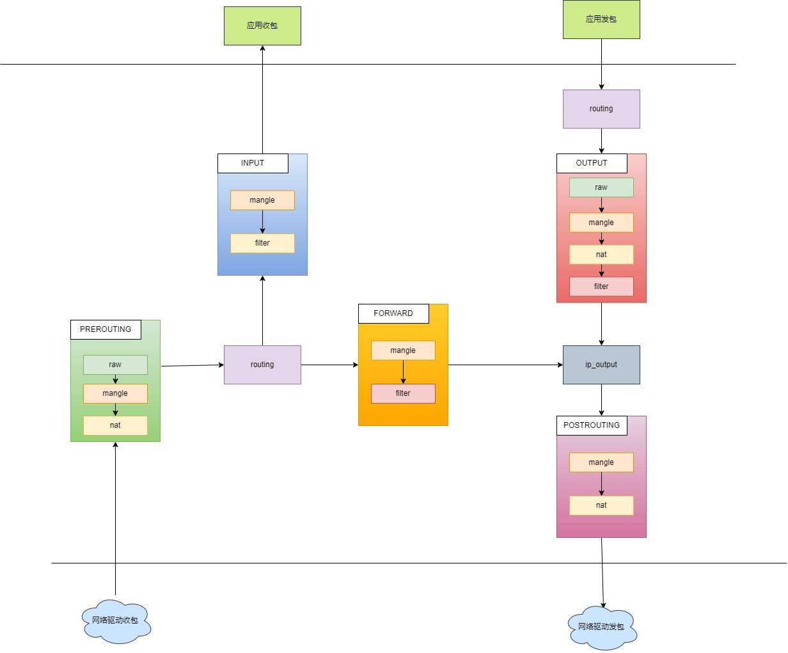

# 1. iptables

iptables 工作在IP层，TC工作在IP层和MAC层之间。

常见场景

* 做防火墙（filter表的INPUT链）
* 局域网共享上网(nat表的POSTROUTING链)，NAT功能
* 端口及IP映射(nat表的PREROUTING链)
* 实现IP一对一映射(DMZ)

工作流程：

1. 防火墙是一层一层过滤的，按照配置规则的顺序，从上到下，从前到后进行过滤。
2. 如果匹配了规则，明确说明是阻止还是通过，此时数据包就不在向下进行匹配新规则
3. 如果所有规则没有明确表明是阻止还是通过此数据包，将匹配默认规则，默认规则一定会给出明确的去向。

4表5链
表，同类功能规则的集合
    filter (做防火墙), 默认的表
    nat (端口或IP映射)
    mangle (配置路由标记 ttl tos mark)
    raw

链，作用于相同路径数据流的规则集合
    filter : INPUT, OUTPUT, FORWARD 
    NAT : POSTROUTING, PREROUTING, OUPUT 
    mangle : INPUT, OUTPUT, FORWARD, POSTROUTING. PREROUTING
    raw

INPUT : 流入主机的数据包 
OUPUT : 流出主机的数据包
FORWARD : 流经主机的
PREROUTING : 进入主机时，最先经过的链，位于路由表之前
POSTROUTING : 流出主机时，最后经过的链，位于路由表之后


netfilter对包的处理流程


做主机防火墙：
    Filter:INPUT

做网关：
    NAT:PREROUTING Filter:FORWARD NAT:POSTROUTING

相关内核模块
modprobe ip_tables
modprobe iptable_filter
modprobe iptable_nat
modprobe ip_conntrack
modprobe ip_conntrack_ftp
modprobe ip_nat_ftp
modprobe ipt_state

实践
清零表

封22端口
iptables -t filter -A INPUT -p tcp --dport 22 -j DROP
-p (tcp, udp, icmp, all)
--dport 目的端口
--sport 源端口
-j jump到处理方法ACCEPT DROP REJECT SNAT/DNAT
    DROP : 丢弃不响应
    REJECT : 丢弃，要响应
    SNAT 源地址转换，DNAT 目的地址转换

查看filter表规则
iptables -nL --line-numbers

删除filter表INPUT链1规则
iptalbes -D INPUT 1

# NAT

NAT主要有两种：SNAT(source network address translation) 和 DNAT
使用iptables可以实现。

## SNAT

如，多个PC使用ADSL路由器共享上网。
发包时需要将每个PC的源IP替换成路由器的IP，

## DNAT

如，web服务器放在内网，使用内网IP，前端有个防火墙使用公网IP，
客户访问的数据包使用防火墙公网IP，防火墙需要将包的目的IP修改成web服务器的内网IP，再发给web服务器。

## MASQUERADE

地址伪装。属于SNAT的特列，实现自动化SNAT。

下面说明MASQUERADE 和 SNAT 的差别，
使用SNAT，需要修改成的IP可以是一个也可以是多个，但必须要明确指定要SNAT成的IP。

把所有10.8.0.0网段的数据包SNAT成192.168.5.3发出去。
iptables -t nat -A POSTROUTING -s 10.8.0.0/255.255.255.0 -o eth0 -j snat --to-source 192.168.5.3

把所有10.8.0.0网段的数据包SNAT成192.168.5.3 或 192.168.5.4 或 192.168.5.5多个IP 
iptables -t nat -A POSTROUTING -s 10.8.0.0/255.255.255.0 -o eth0 -j snat --to-source 192.168.5.3-192.168.5.5

但是使用ADSL动态拨号时，网关获得出口IP会变化，很可能超出SNAT预定的地址。
总不能每次地址改变都重新设置SNAT吧。

MASQUERADE就是为了解决上述场景的问题。
MASQUERADE会从指定的网卡获得当前IP，做SNAT。

iptables -t nat -A POSTROUTING -s 10.8.0.0/255.255.255.0 -o eth0 -j MASQUERADE

如此，不论eth0获得什么IP，MASQUERADE都会自动读取eth0的IP，然后做SNAT。

# 扩展

## 网卡如何发送数据

网卡驱动将IP包封装成MAC包，将MAC包拷贝到网卡芯片内部缓冲区。
网卡芯片对MAC包再次封装，得到物理帧，添加头部不同信息和CRC校验，丢到网线上。
所有挂在同网线的网卡都看到此物理帧。

## 网卡如何接受数据

### 正常情况

网卡获得物理帧，检查CRC，确保完整性，
网卡将物理帧头去掉得到MAC包，
网卡检查MAC包的目的地址是否匹配，不一致就丢弃，一致则拷贝到网卡内缓冲区，触发中断。
驱动程序，处理中断，将帧拷贝到系统中，构建sk_buff，告诉上层。
上层去掉帧头，获得IP包

### 不正常模式（混淆）

网卡获得物理帧，检查CRC，确保完整性，
网卡将物理帧头去掉得到MAC包，
网卡发现自己是混淆模式，不对MAC地址进行过滤，将帧拷贝到网卡内部缓冲区，触发中断。
驱动程序，处理中断，将帧拷贝到系统中，构建sk_buff，告诉上层。
上层去掉帧头，获得IP包.
显然这里的IP包不一定是发给自己的。

### 总结
q
如果程序希望检查网线上所有报文，通常需要让网卡开启混淆模式，但这会加大CPU的负荷，
某些程序可以直接访问网卡，可能是dpdk.

# BR_NETFILTER
使用此模块 netfilter 可以过滤网桥的数据包
使用 /proc/sys/net/bridge/bridge-nf-call-iptables 控制释放开启过滤

# table

## mangle
这个表格主要用于处理数据包，应该主要用于数据包的混淆。

注意：
强烈建议您不要在此表格中进行任何过滤操作；任何DNAT、SNAT或Masquerading操作在此表格中都不起作用。

以下目标仅在混淆表中有效，不能在混淆表之外使用：
* TOS 用于设置和/或更改数据包中的服务类型字段
* TTL 更改ttl
* MARK 用于向数据包设置特殊的标记值。这些标记可以被iproute2程序识别，根据它们的标记对数据包进行不同的路由，我们还可以根据这些标记进行带宽限制和基于类别的排队。
* SECMARK 为单个数据包设置安全上下文标记，以供SELinux和其他能够处理这些标记的安全系统使用。这用于对系统的子系统能够触及哪些数据包等进行非常精细的安全控制
* CONNSECMARK 将安全上下文从整个连接复制到单个数据包中，或者从单个数据包复制到整个连接中。这由SELinux和其他安全系统用于在连接级别上进行更细粒度的安全控制。

## nat
这个表格只应该用于不同数据包的网络地址转换（NAT）。请注意，只有stream中的第一个数据包会命中这个table。之后，其余的数据包将自动采取与第一个数据包相同的操作。执行这些操作的实际目标包括：

DNAT : 目标主要用于当您拥有一个公共IP并希望将访问重定向到防火墙上的其他主机时（例如在DMZ上）。换句话说，我们改变数据包的目标地址并将其重定向到主机。

SNAT : 主要用于更改数据包的源地址。大部分情况下，您会隐藏本地网络或DMZ等。一个很好的例子是防火墙，我们知道其外部IP地址，但需要用防火墙的IP地址替换我们本地网络的IP地址。使用此目标，防火墙将自动进行SNAT和逆向SNAT操作，从而使局域网能够与互联网建立连接。例如，如果您的网络使用192.168.0.0/netmask，数据包将无法从互联网返回，因为IANA将这些网络（以及其他一些）规定为私有网络，只能在隔离的局域网中使用。

MASQUERADE : 目标与SNAT完全相同，但MASQUERADE目标需要更多的计算开销。原因是，每当MASQUERADE目标被数据包命中时，它会自动检查要使用的IP地址，而不像SNAT目标那样只使用单个配置的IP地址。MASQUERADE目标使得能够正确处理ISP为您的PPP、PPPoE或SLIP连接提供的动态DHCP IP地址的情况。

REDIRECT 

## raw
raw table主要用于一个目的，那就是在数据包上设置一个标记，告诉连接跟踪系统不处理这些数据包。这是通过在数据包上使用NOTRACK目标来实现的。如果一个连接被应用了NOTRACK目标，那么连接跟踪系统将不会跟踪该连接。在没有添加raw table的情况下，这是不可能解决的问题，因为在连接跟踪实际运行并将数据包添加到连接跟踪表中或与已有连接匹配之前，其他表都不会被调用。您可以在状态机章节中了解更多相关信息。

该表只有PREROUTING和OUTPUT链。其他链不是必需的，因为这些是在数据包实际进入连接跟踪之前处理数据包的唯一位置。

## filter
主要用于过滤数据包。我们可以根据需要匹配和过滤数据包。这是我们实际对数据包采取行动的地方，我们可以查看它们的内容并根据内容进行丢弃（DROP）或接受（ACCEPT）操作。

## user chain
如果一个数据包进入了过滤表中的INPUT链，我们可以指定一个跳转规则到同一表中的另一个链。新的链必须是用户指定的，不能是内置链，例如INPUT或FORWARD链。
当指针指向一个内置链的规则，指针将从规则到规则，从顶部到底部进行遍历，直到链的遍历由目标(accept/drop)或到链的结束。一旦这种情况发生，将应用内置链的默认策略。

注意：
用户指定的链不能在链的末尾设置默认策略，只有内置链才能这样做。可以通过在链的末尾附加一个没有匹配项的单个规则来规避这个问题，因此它将起到默认策略的作用。如果在用户指定的链中没有匹配到任意规则，将默认跳回到原始链。如上图所示，规则执行从链2跳回到链1的规则4，这是在开始时将规则执行发送到链2的规则之下。

在用户指定的链中，每个规则都会被遍历，直到其中一个规则匹配——然后目标规定遍历是否应该结束或继续——或者到达链的末尾。如果到达了用户指定链的末尾，数据包将被发送回调用链。调用链可以是用户指定的链或内置链。


# 连接跟踪 状态机
## 介绍
状态机是iptables中的一个特殊部分，实际上不应该被称为状态机，因为它实际上是一个连接跟踪机制。然而，大多数人都使用第一个名称来识别它。连接跟踪是为了让Netfilter框架了解特定连接的状态。实现这一功能的防火墙通常被称为有状态防火墙。有状态防火墙通常比无状态防火墙更安全，因为它允许我们编写更严格的规则集。

在iptables中，数据包可以与四种不同的跟踪连接状态相关联，这些状态被称为NEW、ESTABLISHED、RELATED和INVALID。通过--state匹配，我们可以轻松地控制谁或什么被允许启动新会话。

所有的连接跟踪都是由内核中的一个特殊框架称为conntrack完成的。我们需要和希望比默认的conntrack引擎更具体的连接跟踪。因此，conntrack还有处理TCP、UDP或ICMP等协议的更具体的部分。这些模块从数据包中提取特定而独特的信息，以便它们可以跟踪每个数据流。conntrack收集的信息然后用于告诉conntrack流当前处于哪个状态。例如，UDP流通常通过目标IP地址、源IP地址、目标端口和源端口来唯一标识。

在以前的内核中，我们有可能打开和关闭碎片重组。然而，自从引入iptables和Netfilter，特别是连接跟踪以后，这个选项被取消了。原因是连接跟踪在没有进行碎片重组的情况下无法正常工作，因此碎片重组已经被合并到conntrack中，并且自动进行。除非关闭连接跟踪，否则无法关闭碎片重组。只要打开连接跟踪，就会始终进行碎片重组。

所有的连接跟踪都在PREROUTING链中处理，除了本地生成的数据包(这些数据包在OUTPUT链中处理)。这意味着iptables将在PREROUTING链中进行所有状态的重新计算等操作。如果我们在一个流中发送初始数据包，状态会在OUTPUT链中设置为NEW，当我们接收到返回数据包时，状态会在PREROUTING链中更改为ESTABLISHED，依此类推。如果第一个数据包不是由我们自己发起的，当然会在PREROUTING链中设置为NEW状态。因此，所有状态的更改和计算都在nat表的PREROUTING和OUTPUT链中进行。

## 连接跟踪条目

让我们简要介绍一下连接跟踪条目以及如何在/proc/net/nf_conntrack中读取它们。这提供了您的连接跟踪数据库中所有当前条目的列表。如果您加载了ip_conntrack模块，那么/proc/net/nf_conntrack的内容可能如下所示：
```shell
tcp      6 117 SYN_SENT src=192.168.1.6 dst=192.168.1.9 sport=32775 \
     dport=22 [UNREPLIED] src=192.168.1.9 dst=192.168.1.6 sport=22 \
     dport=32775 [ASSURED] use=2
 ```
     
这个示例包含了连接跟踪模块维护的所有信息，用于确定特定连接的状态。
首先，我们有一个协议，这里是tcp。接下来是相同的值，使用十进制编码。
然后，我们看到这个连接跟踪条目的存活时间。当前设置为117秒，并定期递减，直到看到更多的流量。然后，该值将被重置为该特定状态在相关时间点的默认值。
接下来是此条目在当前时间点的实际状态。在上述情况中，我们正在查看一个处于SYN_SENT状态的数据包。连接的内部值与iptables外部使用的值略有不同。SYN_SENT告诉我们，我们正在查看一个只在一个方向上收到TCP SYN数据包的连接。
接下来，我们看到源IP地址、目标IP地址、源端口和目标端口。
此时，我们看到一个特定的关键字，告诉我们这个连接没有收到返回流量。
最后，我们看到了我们期望的返回数据包的信息。该信息详细说明了源IP地址和目标IP地址（它们都是反转的，因为数据包将被定向回我们）。同样，源端口和目标端口也是一样的。这些值对我们来说应该是感兴趣的。

连接跟踪条目可以具有一系列不同的值，这些值在linux/include/netfilter-ipv4/ip_conntrack.h文件中的连接跟踪头文件中指定。这些值取决于我们使用的IP的子协议。TCP、UDP或ICMP协议在linux/include/netfilter-ipv4/ip_conntrack.h中指定了特定的默认值。我们将在查看每个协议时更详细地了解这一点；然而，在本章中，我们不会广泛使用它们，因为它们在连接跟踪内部之外不使用。此外，根据状态的更改方式，连接被销毁之前的默认时间值也会发生变化。

可以通过使用/proc/sys/net/ipv4/netfilter目录中提供的特定系统调用来更改这些值。您应该特别关注/proc/net/netfilter/nf_conntrack_\*变量。


当连接在两个方向上都收到流量时，连接跟踪条目将清除[UNREPLIED]标志，然后重新设置它。
告诉我们连接在两个方向上都没有收到流量的条目将被[ASSURED]标志替换，该标志位于条目末尾附近。[ASSURED]标志告诉我们，此连接是可靠的，如果达到最大可能的跟踪连接数，它将不会被删除。
因此，标记为[ASSURED]的连接不会被删除，与非可靠连接（未标记为[ASSURED]的连接）相反。连接跟踪表可以容纳多少个连接取决于一个可以通过最近内核中的ip-sysctl函数设置的变量。该条目所持有的默认值根据您拥有的内存量而大幅变化。您可以通过/proc/sys/net/netfilter/nf_conntrack_max 设置来读取和设置您的设置。

## state

正如您所提到的，数据包在内核中可能处于几种不同的状态，这取决于所讨论的协议。然而，在内核之外，我们只有之前描述的4种状态。这些状态主要可以与状态匹配（state match）结合使用，从而能够根据数据包的当前连接跟踪状态进行匹配。有效的状态包括NEW（新建）、ESTABLISHED（已建立）、RELATED（相关）和INVALID（无效）。下表将简要解释每种可能的状态。

用户空间状态
* NEW	NEW状态告诉我们该数据包是我们看到的第一个数据包。这意味着连接跟踪模块看到的特定连接中的第一个数据包将被匹配。例如，如果我们看到一个SYN数据包，并且它是我们看到的连接中的第一个数据包，它将匹配。但是，该数据包也可能不是SYN数据包，但仍被视为NEW。在某些情况下，这可能导致某些问题，但在需要从其他防火墙中恢复丢失的连接或实际上未关闭的连接超时时，这也可能非常有帮助。

* ESTABLISHED	ESTABLISHED状态已经在两个方向上看到了流量，并将持续匹配这些数据包。很容易理解ESTABLISHED连接。进入ESTABLISHED状态的唯一要求是一个主机发送一个数据包，并在稍后从另一个主机接收到回复。当接收到回复数据包时，NEW状态将转变为ESTABLISHED状态。如果我们创建了一个生成回复ICMP消息的数据包，那么该回复ICMP消息也可以视为ESTABLISHED。

* RELATED	RELATED状态是比较棘手的状态之一。当一个连接与另一个已经建立的连接相关联时，该连接被视为RELATED。这意味着，为了将连接视为RELATED，我们必须首先有一个被视为ESTABLISHED的连接。然后，该ESTABLISHED连接将在主连接之外生成一个连接。如果连接跟踪模块能够理解该连接是RELATED，那么新生成的连接将被视为RELATED。一些可以被视为RELATED的连接的很好例子是被视为与FTP控制端口相关的FTP数据连接，以及通过IRC发起的DCC连接。这可以用于允许ICMP错误消息、FTP传输和DCC正常通过防火墙工作。请注意，大多数依赖于此机制的TCP协议和一些依赖于此机制的UDP协议非常复杂，并在TCP或UDP数据段的有效负载中发送连接信息，因此需要特殊的辅助模块才能正确理解。

* INVALID	INVALID状态表示无法识别该数据包或该数据包没有任何状态。这可能由于多种原因，例如系统内存耗尽或不响应任何已知连接的ICMP错误消息。通常，最好将处于此状态的所有内容丢弃。

* UNTRACKED	这是UNTRACKED状态。简而言之，如果在原始表中使用NOTRACK目标标记数据包，那么该数据包将在状态机中显示为UNTRACKED。这也意味着所有相关的连接将不可见，因此在处理UNTRACKED连接时必须谨慎，因为状态机将无法看到相关的ICMP消息等。

可以使用这些状态与--state匹配一起使用，根据连接跟踪状态匹配数据包。这就是状态机在防火墙中如此强大和高效的原因。以前，我们经常不得不打开所有大于1024的端口，以便将所有流量重新引入我们的本地网络。有了状态机，这就不再必要了，因为我们现在只需为返回流量打开防火墙，而不是为各种其他流量打开防火墙。


## TCP 连接
在这一节和接下来的几节中，我们将更详细地了解TCP、UDP和ICMP这三种基本协议的状态以及它们在iptables中的处理方式。此外，我们还将仔细研究默认情况下如何处理无法归类为这三种协议的连接。我们选择从TCP协议开始，因为它本身就是一个有状态的协议，并且在iptables的状态机中有很多有趣的细节。

TCP连接总是通过三次握手来建立和协商实际的数据传输连接。整个会话从一个SYN数据包开始，然后是一个SYN/ACK数据包，最后是一个ACK数据包来确认整个会话的建立。此时连接已经建立起来，可以开始发送数据了。那么，连接跟踪是如何参与其中的呢？实际上非常简单。

对于用户而言，无论是哪种类型的连接，连接跟踪基本上都是同样的工作方式。请看下面的图片，了解连接在不同阶段进入的状态。从图中可以看出，连接跟踪代码实际上并不按照用户视角下TCP连接的流程进行处理。一旦它接收到一个数据包（SYN），它将把连接视为NEW状态。一旦它接收到返回的数据包（SYN/ACK），它将把连接视为ESTABLISHED状态。如果你仔细思考一下，你就会明白为什么要这样设计。通过这种特定的实现方式，你可以允许NEW和ESTABLISHED数据包离开你的本地网络，只允许ESTABLISHED连接返回，这样就能完美地工作了。相反，如果连接跟踪机制将整个连接建立过程都视为NEW状态，我们就永远无法真正阻止外部连接进入我们的本地网络，因为我们将不得不再次允许NEW数据包进入。更复杂的是，内核中还有许多用于TCP连接的其他内部状态，但在用户空间中无法访问。大致上，它们遵循RFC 793《传输控制协议》第21-23页中指定的状态标准。我们将在本节后面更详细地讨论这些状态。


正如你所看到的，从用户的角度来看，这是非常简单的。然而，从内核的角度来看，整个构建过程就要复杂一些。让我们看一个例子，考虑一下在/proc/net/nf_conntrack表中连接状态是如何变化的。第一个状态是在连接接收到第一个SYN数据包时报告的。

```shell
tcp      6 117 SYN_SENT src=192.168.1.5 dst=192.168.1.35 sport=1031 \
     dport=23 [UNREPLIED] src=192.168.1.35 dst=192.168.1.5 sport=23 \
     dport=1031 use=1
```

从上面的条目可以看出，我们有一个确切的状态，即已发送了一个SYN数据包（设置了SYN_SENT标志），但到目前为止还没有收到回复（可以看到[UNREPLIED]标志）。当我们在另一个方向上看到另一个数据包时，将达到下一个内部状态。

tcp      6 57 SYN_RECV src=192.168.1.5 dst=192.168.1.35 sport=1031 \
     dport=23 src=192.168.1.35 dst=192.168.1.5 sport=23 dport=1031 \
     use=1

现在我们收到了相应的SYN/ACK回复。一旦收到这个数据包，状态再次改变，这次是变为SYN_RECV。SYN_RECV告诉我们原始的SYN已经正确地传递了，并且SYN/ACK回复数据包也正确地通过了防火墙。此外，这个连接跟踪条目现在已经在两个方向上看到了流量，因此被认为是已经回复了。这并不是显式的，而是假设的，就像上面的[UNREPLIED]标志一样。最后一步将在我们看到3次握手中的最后一个ACK时达到。

tcp      6 431999 ESTABLISHED src=192.168.1.5 dst=192.168.1.35 \
     sport=1031 dport=23 src=192.168.1.35 dst=192.168.1.5 \
     sport=23 dport=1031 [ASSURED] use=1

在最后一个例子中，我们得到了3次握手中的最后一个ACK，并且连接已经进入了已建立（ESTABLISHED）状态，就内部的iptables机制而言。通常情况下，此时流量将被认为是已确认（ASSURED）的。

一个连接也可能进入已建立（ESTABLISHED）状态，但不被认为是已确认（ASSURED）。如果我们启用了连接拾取（需要tcp-window-tracking补丁，并且将ip_conntrack_tcp_loose设置为1或更高），就会发生这种情况。默认情况下，没有tcp-window-tracking补丁时会有这种行为，且无法更改。

当关闭TCP连接时，它会按照以下方式进行，并经历以下状态。

