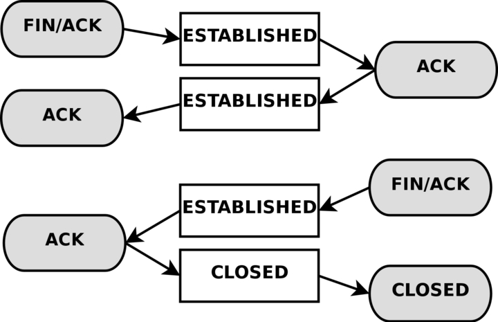

# 1. iptables

iptables 工作在IP层，TC工作在IP层和MAC层之间。

常见场景

* 做防火墙（filter表的INPUT链）
* 局域网共享上网(nat表的POSTROUTING链)，NAT功能
* 端口及IP映射(nat表的PREROUTING链)
* 实现IP一对一映射(DMZ)

工作流程：

1. 防火墙是一层一层过滤的，按照配置规则的顺序，从上到下，从前到后进行过滤。
2. 如果匹配了规则，明确说明是阻止还是通过，此时数据包就不在向下进行匹配新规则
3. 如果所有规则没有明确表明是阻止还是通过此数据包，将匹配默认规则，默认规则一定会给出明确的去向。

4表5链
表，同类功能规则的集合
    filter (做防火墙), 默认的表
    nat (端口或IP映射)
    mangle (配置路由标记 ttl tos mark)
    raw

链，作用于相同路径数据流的规则集合
    filter : INPUT, OUTPUT, FORWARD 
    NAT : POSTROUTING, PREROUTING, OUPUT 
    mangle : INPUT, OUTPUT, FORWARD, POSTROUTING. PREROUTING
    raw

INPUT : 流入主机的数据包 
OUPUT : 流出主机的数据包
FORWARD : 流经主机的
PREROUTING : 进入主机时，最先经过的链，位于路由表之前
POSTROUTING : 流出主机时，最后经过的链，位于路由表之后


netfilter对包的处理流程


做主机防火墙：
    Filter:INPUT

做网关：
    NAT:PREROUTING Filter:FORWARD NAT:POSTROUTING

相关内核模块
modprobe ip_tables
modprobe iptable_filter
modprobe iptable_nat
modprobe ip_conntrack
modprobe ip_conntrack_ftp
modprobe ip_nat_ftp
modprobe ipt_state

实践
清零表

封22端口
iptables -t filter -A INPUT -p tcp --dport 22 -j DROP
-p (tcp, udp, icmp, all)
--dport 目的端口
--sport 源端口
-j jump到处理方法ACCEPT DROP REJECT SNAT/DNAT
    DROP : 丢弃不响应
    REJECT : 丢弃，要响应
    SNAT 源地址转换，DNAT 目的地址转换

查看filter表规则
iptables -nL --line-numbers

删除filter表INPUT链1规则
iptalbes -D INPUT 1

# NAT

NAT主要有两种：SNAT(source network address translation) 和 DNAT
使用iptables可以实现。

## SNAT

如，多个PC使用ADSL路由器共享上网。
发包时需要将每个PC的源IP替换成路由器的IP，

## DNAT

如，web服务器放在内网，使用内网IP，前端有个防火墙使用公网IP，
客户访问的数据包使用防火墙公网IP，防火墙需要将包的目的IP修改成web服务器的内网IP，再发给web服务器。

## MASQUERADE

地址伪装。属于SNAT的特列，实现自动化SNAT。

下面说明MASQUERADE 和 SNAT 的差别，
使用SNAT，需要修改成的IP可以是一个也可以是多个，但必须要明确指定要SNAT成的IP。

把所有10.8.0.0网段的数据包SNAT成192.168.5.3发出去。
iptables -t nat -A POSTROUTING -s 10.8.0.0/255.255.255.0 -o eth0 -j snat --to-source 192.168.5.3

把所有10.8.0.0网段的数据包SNAT成192.168.5.3 或 192.168.5.4 或 192.168.5.5多个IP 
iptables -t nat -A POSTROUTING -s 10.8.0.0/255.255.255.0 -o eth0 -j snat --to-source 192.168.5.3-192.168.5.5

但是使用ADSL动态拨号时，网关获得出口IP会变化，很可能超出SNAT预定的地址。
总不能每次地址改变都重新设置SNAT吧。

MASQUERADE就是为了解决上述场景的问题。
MASQUERADE会从指定的网卡获得当前IP，做SNAT。

iptables -t nat -A POSTROUTING -s 10.8.0.0/255.255.255.0 -o eth0 -j MASQUERADE

如此，不论eth0获得什么IP，MASQUERADE都会自动读取eth0的IP，然后做SNAT。

# 扩展

## 网卡如何发送数据

网卡驱动将IP包封装成MAC包，将MAC包拷贝到网卡芯片内部缓冲区。
网卡芯片对MAC包再次封装，得到物理帧，添加头部不同信息和CRC校验，丢到网线上。
所有挂在同网线的网卡都看到此物理帧。

## 网卡如何接受数据

### 正常情况

网卡获得物理帧，检查CRC，确保完整性，
网卡将物理帧头去掉得到MAC包，
网卡检查MAC包的目的地址是否匹配，不一致就丢弃，一致则拷贝到网卡内缓冲区，触发中断。
驱动程序，处理中断，将帧拷贝到系统中，构建sk_buff，告诉上层。
上层去掉帧头，获得IP包

### 不正常模式（混淆）

网卡获得物理帧，检查CRC，确保完整性，
网卡将物理帧头去掉得到MAC包，
网卡发现自己是混淆模式，不对MAC地址进行过滤，将帧拷贝到网卡内部缓冲区，触发中断。
驱动程序，处理中断，将帧拷贝到系统中，构建sk_buff，告诉上层。
上层去掉帧头，获得IP包.
显然这里的IP包不一定是发给自己的。

### 总结
q
如果程序希望检查网线上所有报文，通常需要让网卡开启混淆模式，但这会加大CPU的负荷，
某些程序可以直接访问网卡，可能是dpdk.

# BR_NETFILTER
使用此模块 netfilter 可以过滤网桥的数据包
使用 /proc/sys/net/bridge/bridge-nf-call-iptables 控制释放开启过滤

# table

## mangle
这个表格主要用于处理数据包，应该主要用于数据包的混淆。

注意：
强烈建议您不要在此表格中进行任何过滤操作；任何DNAT、SNAT或Masquerading操作在此表格中都不起作用。

以下目标仅在混淆表中有效，不能在混淆表之外使用：
* TOS 用于设置和/或更改数据包中的服务类型字段
* TTL 更改ttl
* MARK 用于向数据包设置特殊的标记值。这些标记可以被iproute2程序识别，根据它们的标记对数据包进行不同的路由，我们还可以根据这些标记进行带宽限制和基于类别的排队。
* SECMARK 为单个数据包设置安全上下文标记，以供SELinux和其他能够处理这些标记的安全系统使用。这用于对系统的子系统能够触及哪些数据包等进行非常精细的安全控制
* CONNSECMARK 将安全上下文从整个连接复制到单个数据包中，或者从单个数据包复制到整个连接中。这由SELinux和其他安全系统用于在连接级别上进行更细粒度的安全控制。

## nat
这个表格只应该用于不同数据包的网络地址转换（NAT）。请注意，只有stream中的第一个数据包会命中这个table。之后，其余的数据包将自动采取与第一个数据包相同的操作。执行这些操作的实际目标包括：

DNAT : 目标主要用于当您拥有一个公共IP并希望将访问重定向到防火墙上的其他主机时（例如在DMZ上）。换句话说，我们改变数据包的目标地址并将其重定向到主机。

SNAT : 主要用于更改数据包的源地址。大部分情况下，您会隐藏本地网络或DMZ等。一个很好的例子是防火墙，我们知道其外部IP地址，但需要用防火墙的IP地址替换我们本地网络的IP地址。使用此目标，防火墙将自动进行SNAT和逆向SNAT操作，从而使局域网能够与互联网建立连接。例如，如果您的网络使用192.168.0.0/netmask，数据包将无法从互联网返回，因为IANA将这些网络（以及其他一些）规定为私有网络，只能在隔离的局域网中使用。

MASQUERADE : 目标与SNAT完全相同，但MASQUERADE目标需要更多的计算开销。原因是，每当MASQUERADE目标被数据包命中时，它会自动检查要使用的IP地址，而不像SNAT目标那样只使用单个配置的IP地址。MASQUERADE目标使得能够正确处理ISP为您的PPP、PPPoE或SLIP连接提供的动态DHCP IP地址的情况。

REDIRECT 

## raw
raw table主要用于一个目的，那就是在数据包上设置一个标记，告诉连接跟踪系统不处理这些数据包。这是通过在数据包上使用NOTRACK目标来实现的。如果一个连接被应用了NOTRACK目标，那么连接跟踪系统将不会跟踪该连接。在没有添加raw table的情况下，这是不可能解决的问题，因为在连接跟踪实际运行并将数据包添加到连接跟踪表中或与已有连接匹配之前，其他表都不会被调用。您可以在状态机章节中了解更多相关信息。

该表只有PREROUTING和OUTPUT链。其他链不是必需的，因为这些是在数据包实际进入连接跟踪之前处理数据包的唯一位置。

## filter
主要用于过滤数据包。我们可以根据需要匹配和过滤数据包。这是我们实际对数据包采取行动的地方，我们可以查看它们的内容并根据内容进行丢弃（DROP）或接受（ACCEPT）操作。

## user chain
如果一个数据包进入了过滤表中的INPUT链，我们可以指定一个跳转规则到同一表中的另一个链。新的链必须是用户指定的，不能是内置链，例如INPUT或FORWARD链。
当指针指向一个内置链的规则，指针将从规则到规则，从顶部到底部进行遍历，直到链的遍历由目标(accept/drop)或到链的结束。一旦这种情况发生，将应用内置链的默认策略。

注意：
用户指定的链不能在链的末尾设置默认策略，只有内置链才能这样做。可以通过在链的末尾附加一个没有匹配项的单个规则来规避这个问题，因此它将起到默认策略的作用。如果在用户指定的链中没有匹配到任意规则，将默认跳回到原始链。如上图所示，规则执行从链2跳回到链1的规则4，这是在开始时将规则执行发送到链2的规则之下。

在用户指定的链中，每个规则都会被遍历，直到其中一个规则匹配——然后目标规定遍历是否应该结束或继续——或者到达链的末尾。如果到达了用户指定链的末尾，数据包将被发送回调用链。调用链可以是用户指定的链或内置链。


# 连接跟踪 状态机
## 介绍
状态机是iptables中的一个特殊部分，实际上不应该被称为状态机，因为它实际上是一个连接跟踪机制。然而，大多数人都使用第一个名称来识别它。连接跟踪是为了让Netfilter框架了解特定连接的状态。实现这一功能的防火墙通常被称为有状态防火墙。有状态防火墙通常比无状态防火墙更安全，因为它允许我们编写更严格的规则集。

在iptables中，**数据包可以与四种不同的跟踪连接状态相关联，这些状态被称为NEW、ESTABLISHED、RELATED和INVALID。通过--state匹配**，我们可以轻松地控制谁或什么被允许启动新会话。

所有的连接跟踪都是由内核中的一个特殊框架称为conntrack完成的。我们需要和希望比默认的conntrack引擎更具体的连接跟踪。因此，conntrack还有处理TCP、UDP或ICMP等协议的更具体的子模块。这些模块从数据包中提取特定而独特的信息，以便它们可以跟踪每个数据流。conntrack收集的信息然后用于告诉conntrack此流当前处于哪个状态。例如，UDP流通常通过目标IP地址、源IP地址、目标端口和源端口来唯一标识。

在以前的内核中，我们有可能打开和关闭碎片重组。然而，自从引入iptables和Netfilter，特别是连接跟踪以后，这个选项被取消了。原因是连接跟踪在没有进行碎片重组的情况下无法正常工作，因此**碎片重组已经被合并到conntrack中，并且自动进行**。除非关闭连接跟踪，否则无法关闭碎片重组。只要打开连接跟踪，就会始终进行碎片重组。

**所有的连接跟踪都在PREROUTING链中处理，除了本地生成的数据包(这些数据包在OUTPUT链中处理)**。这意味着iptables将在PREROUTING链中进行所有状态的重新计算等操作。如果我们在一个流中发送初始数据包，状态会在OUTPUT链中设置为NEW，当我们接收到返回数据包时，状态会在PREROUTING链中更改为ESTABLISHED，依此类推。如果第一个数据包不是由我们自己发起的，当然会在PREROUTING链中设置为NEW状态。因此，所有状态的更改和计算都在nat表的PREROUTING和OUTPUT链中进行。

总结下:

在 Linux 中，当收到数据包时，数据包会首先经过 netfilter 的 PREROUTING 链。在这个过程中，数据包可能会被 raw 表的 PREROUTING 链处理，其中可能包括 NOTRACK 标记。这个标记的作用是告诉 netfilter 不要对这个数据包进行连接跟踪。

如果数据包没有被标记为 NOTRACK，那么它将会被 conntrack 模块处理。conntrack 是 netfilter 的一部分，它负责跟踪连接的状态，包括 TCP 连接的建立、维持和终止，以及其他协议的连接状态。

经过 conntrack 模块处理后，数据包会再次通过 netfilter，这次是 NAT 表的 PREROUTING 链。

## 连接跟踪条目

让我们简要介绍一下连接跟踪条目以及如何在/proc/net/nf_conntrack中读取它们。这提供了您的连接跟踪数据库中所有当前条目的列表。如果您加载了ip_conntrack模块，那么/proc/net/nf_conntrack的内容可能如下所示：
 ```shell
tcp(TCP连接)      6(传输层协议号7) 117(此跟踪条目存在时间117秒) SYN_SENT(发现一个SYN_SENT的数据包) src=192.168.1.6 dst=192.168.1.9 sport=32775 \
     dport=22 [UNREPLIED(此连接没有收到响应数据包)] src=192.168.1.9 dst=192.168.1.6 sport=22 \
     dport=32775 [ASSURED(此连接是稳定的，不是偶然的，恶意的)] use=2(有两个进程或线程引用此连接，用于内核内部的引用计数，并不直接反映出对外的连接状态或者使用情况)

ASSURED : 带此标记的条目在内存不足时不会被删除, 因为他们被视为重要记录，不带此关键字的条目在内存不足时被删除
 ```
这个示例包含了连接跟踪模块维护的所有信息，用于确定特定连接的状态。

首先，我们有一个协议，这里是tcp。接下来是相同的值，使用十进制编码。
然后，我们看到这个连接跟踪条目的存活时间。当前设置为117秒，并定期递减，直到看到更多的流量。然后，该值将被重置为该特定状态在相关时间点的默认值。
接下来是此条目在当前时间点的实际状态。在上述情况中，我们正在查看一个处于SYN_SENT状态的数据包。连接的内部值与iptables外部使用的值略有不同。SYN_SENT告诉我们，我们正在查看一个只在一个方向上收到TCP SYN数据包的连接。
接下来，我们看到源IP地址、目标IP地址、源端口和目标端口。
此时，我们看到一个特定的关键字，告诉我们这个连接没有收到返回流量。
最后，我们看到了我们期望的返回数据包的信息。该信息详细说明了源IP地址和目标IP地址（它们都是反转的，因为数据包将被定向回我们）。同样，源端口和目标端口也是一样的。这些值对我们来说应该是感兴趣的。

连接跟踪条目可以具有一系列不同的值，这些值在linux/include/netfilter-ipv4/ip_conntrack.h文件中的连接跟踪头文件中指定。这些值取决于我们使用的IP的子协议。TCP、UDP或ICMP协议在linux/include/netfilter-ipv4/ip_conntrack.h中指定了特定的默认值。我们将在查看每个协议时更详细地了解这一点；然而，在本章中，我们不会广泛使用它们，因为它们在连接跟踪内部之外不使用。此外，根据状态的更改方式，连接被销毁之前的默认时间值也会发生变化。

可以通过使用/proc/sys/net/ipv4/netfilter目录中提供的特定系统调用来更改这些值。您应该特别关注/proc/net/netfilter/nf_conntrack_\*变量。
```shell
ls /proc/sys/net/ipv4/netfilter/ip_conntrack_*
/proc/sys/net/ipv4/netfilter/ip_conntrack_buckets
/proc/sys/net/ipv4/netfilter/ip_conntrack_checksum
/proc/sys/net/ipv4/netfilter/ip_conntrack_count
/proc/sys/net/ipv4/netfilter/ip_conntrack_generic_timeout
/proc/sys/net/ipv4/netfilter/ip_conntrack_icmp_timeout
/proc/sys/net/ipv4/netfilter/ip_conntrack_log_invalid
/proc/sys/net/ipv4/netfilter/ip_conntrack_max
/proc/sys/net/ipv4/netfilter/ip_conntrack_tcp_be_liberal
/proc/sys/net/ipv4/netfilter/ip_conntrack_tcp_loose
/proc/sys/net/ipv4/netfilter/ip_conntrack_tcp_max_retrans
/proc/sys/net/ipv4/netfilter/ip_conntrack_tcp_timeout_close
/proc/sys/net/ipv4/netfilter/ip_conntrack_tcp_timeout_close_wait
/proc/sys/net/ipv4/netfilter/ip_conntrack_tcp_timeout_established
/proc/sys/net/ipv4/netfilter/ip_conntrack_tcp_timeout_fin_wait
/proc/sys/net/ipv4/netfilter/ip_conntrack_tcp_timeout_last_ack
/proc/sys/net/ipv4/netfilter/ip_conntrack_tcp_timeout_max_retrans
/proc/sys/net/ipv4/netfilter/ip_conntrack_tcp_timeout_syn_recv
/proc/sys/net/ipv4/netfilter/ip_conntrack_tcp_timeout_syn_sent
/proc/sys/net/ipv4/netfilter/ip_conntrack_tcp_timeout_syn_sent2
/proc/sys/net/ipv4/netfilter/ip_conntrack_tcp_timeout_time_wait
/proc/sys/net/ipv4/netfilter/ip_conntrack_udp_timeout
/proc/sys/net/ipv4/netfilter/ip_conntrack_udp_timeout_stream
```

当连接在两个方向上都收到流量时，连接跟踪条目将清除[UNREPLIED]标志，然后重新设置它。
告诉我们连接在两个方向上都没有收到流量的条目将被[ASSURED]标志替换，该标志位于条目末尾附近。[ASSURED]标志告诉我们，此连接是可靠的，如果达到最大可能的跟踪连接数，它将不会被删除。
因此，标记为[ASSURED]的连接不会被删除，与非可靠连接（未标记为[ASSURED]的连接）相反。连接跟踪表可以容纳多少个连接取决于一个可以通过最近内核中的ip-sysctl函数设置的变量。该条目所持有的默认值根据您拥有的内存量而大幅变化。您可以通过/proc/sys/net/netfilter/nf_conntrack_max 设置来读取和设置您的设置。

## state
正如您所提到的，数据包在内核中可能处于几种不同的状态，这取决于所讨论的协议。然而，在内核之外，我们只有之前描述的4种状态。这些状态主要可以与状态匹配（state match）结合使用，从而能够根据数据包的当前连接跟踪状态进行匹配。有效的状态包括NEW（新建）、ESTABLISHED（已建立）、RELATED（相关）和INVALID（无效）。下表将简要解释每种可能的状态。

用户空间状态
* NEW	NEW状态告诉我们该数据包是我们看到的第一个数据包。这意味着连接跟踪模块看到的特定连接中的第一个数据包将被匹配。例如，如果我们看到一个SYN数据包，并且它是我们看到的连接中的第一个数据包，它将匹配。但是，该数据包也可能不是SYN数据包，但仍被视为NEW。在某些情况下，这可能导致某些问题，但在需要从其他防火墙中恢复丢失的连接或实际上未关闭的连接超时时，这也可能非常有帮助。

* ESTABLISHED	ESTABLISHED状态已经在两个方向上看到了流量，并将持续匹配这些数据包。很容易理解ESTABLISHED连接。进入ESTABLISHED状态的唯一要求是一个主机发送一个数据包，并在稍后从另一个主机接收到回复。当接收到回复数据包时，NEW状态将转变为ESTABLISHED状态。如果我们创建了一个生成回复ICMP消息的数据包，那么该回复ICMP消息也可以视为ESTABLISHED。

* RELATED	RELATED状态是比较棘手的状态之一。当一个连接与另一个已经建立的连接相关联时，该连接被视为RELATED。这意味着，为了将连接视为RELATED，我们必须首先有一个被视为ESTABLISHED的连接。然后，该ESTABLISHED连接将在主连接之外生成一个连接。如果连接跟踪模块能够理解该连接是RELATED，那么新生成的连接将被视为RELATED。一些可以被视为RELATED的连接的很好例子是被视为与FTP控制端口相关的FTP数据连接，以及通过IRC发起的DCC连接。这可以用于允许ICMP错误消息、FTP传输和DCC正常通过防火墙工作。请注意，大多数依赖于此机制的TCP协议和一些依赖于此机制的UDP协议非常复杂，并在TCP或UDP数据段的有效负载中发送连接信息，因此需要特殊的辅助模块才能正确理解。

* INVALID	INVALID状态表示无法识别该数据包或该数据包没有任何状态。这可能由于多种原因，例如系统内存耗尽或不响应任何已知连接的ICMP错误消息。通常，最好将处于此状态的所有内容丢弃。

* UNTRACKED	这是UNTRACKED状态。简而言之，如果在原始表中使用NOTRACK目标标记数据包，那么该数据包将在状态机中显示为UNTRACKED。这也意味着所有相关的连接将不可见，因此在处理UNTRACKED连接时必须谨慎，因为状态机将无法看到相关的ICMP消息等。

可以使用这些状态与--state匹配一起使用，根据连接跟踪状态匹配数据包。这就是状态机在防火墙中如此强大和高效的原因。以前，我们经常不得不打开所有大于1024的端口，以便将所有流量重新引入我们的本地网络。有了状态机，这就不再必要了，因为我们现在只需为返回流量打开防火墙，而不是为各种其他流量打开防火墙。
意思是，当主机被定义以为只做客户端时（不接受任何连接时），在FORWARD的filter表只接受state为 ESTABLISHED和 RELATED的数据包

## TCP 连接
在这一节和接下来的几节中，我们将更详细地了解TCP、UDP和ICMP这三种基本协议的状态以及它们在iptables中的处理方式。此外，我们还将仔细研究默认情况下如何处理无法归类为这三种协议的连接。我们选择从TCP协议开始，因为它本身就是一个有状态的协议，并且在iptables的状态机中有很多有趣的细节。

TCP连接总是通过三次握手来建立和协商实际的数据传输连接。整个会话从一个SYN数据包开始，然后是一个SYN/ACK数据包，最后是一个ACK数据包来确认整个会话的建立。此时连接已经建立起来，可以开始发送数据了。那么，连接跟踪是如何参与其中的呢？实际上非常简单。

对于用户而言，无论是哪种类型的连接，连接跟踪基本上都是同样的工作方式。请看下面的图片，了解连接在不同阶段进入的状态。从图中可以看出，连接跟踪代码实际上并不按照用户视角下TCP连接的流程进行处理。一旦它接收到一个数据包（SYN），它将把连接视为NEW状态。一旦它接收到返回的数据包（SYN/ACK），它将把连接视为ESTABLISHED状态。如果你仔细思考一下，你就会明白为什么要这样设计。通过这种特定的实现方式，**你可以允许NEW和ESTABLISHED数据包离开你的本地网络，只允许ESTABLISHED连接返回**，这样就能完美地工作了。相反，如果连接跟踪机制将整个连接建立过程都视为NEW状态，我们就永远无法真正阻止外部连接进入我们的本地网络，因为我们将不得不再次允许NEW数据包进入。更复杂的是，内核中还有许多用于TCP连接的其他内部状态，但在用户空间中无法访问。大致上，它们遵循RFC 793《传输控制协议》第21-23页中指定的状态标准。我们将在本节后面更详细地讨论这些状态。


正如你所看到的，从用户的角度来看，这是非常简单的。然而，从内核的角度来看，整个构建过程就要复杂一些。让我们看一个例子，考虑一下在客户端的/proc/net/nf_conntrack表中连接状态是如何变化的。第一个状态是在连接接收到第一个SYN数据包时报告的。

```shell
tcp      6 117 SYN_SENT src=192.168.1.5 dst=192.168.1.35 sport=1031 \
     dport=23 [UNREPLIED] src=192.168.1.35 dst=192.168.1.5 sport=23 \
     dport=1031 use=1
```

从上面的条目可以看出，我们有一个确切的状态，即已发送了一个SYN数据包（设置了SYN_SENT标志），但到目前为止还没有收到回复（可以看到[UNREPLIED]标志）。当我们在另一个方向上看到另一个数据包时，将达到下一个内部状态。

```shell
tcp      6 57 SYN_RECV src=192.168.1.5 dst=192.168.1.35 sport=1031 \
     dport=23 src=192.168.1.35 dst=192.168.1.5 sport=23 dport=1031 \
     use=1
```

现在我们收到了相应的SYN/ACK回复。一旦收到这个数据包，状态再次改变，这次是变为SYN_RECV。SYN_RECV告诉我们原始的SYN已经正确地传递了，并且SYN/ACK回复数据包也正确地通过了防火墙。此外，这个连接跟踪条目现在已经在两个方向上看到了流量，因此被认为是已经回复了。这并不是显式的，而是假设的，就像上面的[UNREPLIED]标志一样。最后一步将在我们看到3次握手中的最后一个ACK时达到。

```shell
tcp      6 431999 ESTABLISHED src=192.168.1.5 dst=192.168.1.35 \
     sport=1031 dport=23 src=192.168.1.35 dst=192.168.1.5 \
     sport=23 dport=1031 [ASSURED] use=1
```

在最后一个例子中，我们得到了3次握手中的最后一个ACK，并且连接已经进入了已建立（ESTABLISHED）状态，就内部的iptables机制而言。通常情况下，此时流量将被认为是已确认（ASSURED）的。

一个连接也可能进入已建立（ESTABLISHED）状态，但不被认为是已确认（ASSURED）。如果我们启用了连接拾取（需要tcp-window-tracking补丁，并且将ip_conntrack_tcp_loose设置为1或更高），就会发生这种情况。默认情况下，没有tcp-window-tracking补丁时会有这种行为，且无法更改。

总之使用了tcp 子模块的 conntrack可以显示三次握手时TCP状态


当关闭TCP连接时，它会按照以下方式进行，并经历以下状态。




如您所见，直到最后一个 ACK 被发送之前，连接实际上从未真正关闭。请注意，这张图片只描述了在正常情况下如何关闭连接。例如，连接也可以通过发送 RST（重置）来关闭，如果连接被拒绝。在这种情况下，连接将立即关闭。

当 TCP 连接关闭时，连接进入 TIME_WAIT 状态，默认设置为 2 分钟。这样做是为了确保所有乱序的数据包仍然可以通过我们的规则集，即使连接已经关闭。这被用作一种缓冲时间，以便那些在拥塞的路由器中卡住的数据包仍然可以到达防火墙或连接的另一端。

如果连接通过 RST 数据包重置，状态将变为 CLOSE。这意味着连接在完全关闭之前默认有 10 秒的时间。RST 数据包不会在任何意义上得到确认，并且会直接中断连接。除了我们迄今告诉您的状态之外，还有其他状态。下面是 TCP 流可能采用的所有状态及其超时值的完整列表。

| State				| Timeout value |
| ----------------  | ------------  |
| NONE				| 30 minutes 	|
| ESTABLISHED		| 5 days		|
| SYN_SENT			| 2 minutes		|
| SYN_RECV			| 60 seconds	|
| FIN_WAIT			| 2 minutes		|
| TIME_WAIT			| 2 minutes		|
| CLOSE				| 10 seconds	|
| CLOSE_WAIT		| 12 hours		|
| LAST_ACK			| 30 seconds	|
| LISTEN			| 2 minutes		|

这些值绝对不是固定的。它们可能会随着内核版本的更新而改变，也可以通过位于/proc/sys/net/ipv4/netfilter/ip_ct_tcp_\*变量的proc文件系统进行更改。然而，默认值在实践中应该是相当稳定的。这些值以秒为单位进行设置。

注意：
还要注意，用户空间的状态机不会查看TCP数据包中设置的TCP标志（即RST、ACK和SYN是标志）。这通常是不好的，因为您可能希望允许处于NEW状态的数据包通过防火墙，但当您指定NEW标志时，大多数情况下您的意思是SYN数据包。

然而，当前的状态实现并不是这样的；相反，即使是没有任何位设置或只有ACK标志的数据包，也会被计为NEW。这可以用于冗余的防火墙设置等，但在家庭网络中通常非常不好，因为您只有一个防火墙。为了解决这个问题，您可以使用附录中“State NEW packets but no SYN bit set”部分中解释的命令。另一种方法是安装patch-o-matic的tcp-window-tracking扩展，并将/proc/sys/net/ipv4/netfilter/ip_conntrack_tcp_loose设置为零，这将使防火墙丢弃除了SYN标志以外的所有NEW数据包。

## UDP连接
UDP连接本身并不是有状态的连接，而是无状态的连接。这主要是因为UDP连接不包含任何连接建立或连接关闭的过程，最重要的是它们缺乏顺序控制。按照特定顺序接收两个UDP数据报并不能说明它们被发送的顺序。然而，在内核中仍然可以对连接设置状态。让我们来看一下如何跟踪连接以及在连接跟踪中的表示方式。


正如你所看到的，连接的建立方式与TCP连接几乎完全相同，从用户层面来看是如此。在内部，连接跟踪信息看起来有些不同，但本质上细节是相同的。首先，让我们来看一下初始UDP数据包发送后的条目。
```
# host发送UDP, 状态为NEW
udp      17(传输层协议号17为UDP) 20(连接存在时间20秒) src=192.168.1.2 dst=192.168.1.5 sport=137 dport=1025 \
     [UNREPLIED] src=192.168.1.5 dst=192.168.1.2 sport=1025 \
     dport=137 use=1
```
从第一个和第二个值可以看出，这是一个UDP数据包。第一个是协议名称，第二个是协议号。这与TCP连接的情况完全相同。第三个值表示此状态条目的存活时间（以秒为单位）。之后，我们得到了已经收到的数据包的值，以及我们从发起数据包的发送方预期接收到的未来数据包的值。这些值包括源IP地址、目标IP地址、源端口和目标端口。在这一点上，[UNREPLIED]标志告诉我们到目前为止还没有对该数据包的响应。最后，我们得到了一份有关返回数据包的简要期望列表。请注意，后面的条目与前面的值是相反的顺序。此时的超时时间设置为默认的30秒。


```
# host接收到回复, 状态为 ESTABLISHED
udp      17 170 src=192.168.1.2 dst=192.168.1.5 sport=137 \
     dport=1025 src=192.168.1.5 dst=192.168.1.2 sport=1025 \
     dport=137 [ASSURED] use=1
```
此时，服务器已经收到了对第一个发送出去的数据包的回复，连接现在被视为已建立（ESTABLISHED）。这在连接跟踪中没有显示，正如你所看到的。主要的区别是，[UNREPLIED]标志已经消失了。此外，默认超时时间已更改为180秒，但在这个例子中，它已经减少到了170秒，再过10秒钟，它将变为160秒。然而，有一件事情是缺失的，而且可能会有所变化，那就是上面描述的[ASSURED]标志。要在跟踪的连接上设置[ASSURED]标志，必须对NEW数据包进行了合法的回复。

```
# 这是另一个UDP连接的例子
udp      17 175 src=192.168.1.5 dst=195.22.79.2 sport=1025 \
     dport=53 src=195.22.79.2 dst=192.168.1.5 sport=53 \
     dport=1025 [ASSURED] use=1
```

此时，连接已经被确认。连接看起来与前面的例子完全相同。如果该连接在180秒内没有使用，它将超时。180秒是一个相对较低的值，但对于大多数情况来说应该足够了。对于与同一条目匹配并通过防火墙的每个数据包，该值将被重置为其完整值，就像所有内部状态一样。

## ICMP连接
ICMP数据包不同于有状态的流，因为它们仅用于控制，不应建立任何连接。然而，有四种ICMP类型会生成返回数据包，并且这些类型有两种不同的状态。这些ICMP消息可以处于NEW和ESTABLISHED状态。我们所讨论的ICMP类型包括回显请求和回复、时间戳请求和回复、信息请求和回复，以及地址掩码请求和回复。其中，时间戳请求和信息请求已经过时，很可能可以被删除。然而，回显消息在多种设置中被使用，比如ping主机。地址掩码请求并不经常使用，但有时可能很有用，值得允许。为了了解这个过程的大致情况，可以看下面的图片。


如上图所示，主机向目标发送一个回显请求，防火墙将其视为NEW状态。然后目标以回显回复的形式响应，防火墙将其视为ESTABLISHED状态。当第一个回显请求被检测到时，以下状态条目将进入ip_conntrack。
```
icmp     1(L4层协议号) 25(超时时间) src=192.168.1.6 dst=192.168.1.10 type=8(ICMP类型) code=0(ICMP code) \
     id=33029(ICMP id) [UNREPLIED](说明为NEW状态) src=192.168.1.10 dst=192.168.1.6 \
     type=0 code=0 id=33029 use=1
```
如你所见，这个条目与TCP和UDP的标准状态有些不同。协议字段和超时字段仍然存在，还有源地址和目标地址。然而，之后的字段有所不同。现在有三个新字段，分别是type、code和id。它们并没有特殊之处，type字段包含ICMP类型，code字段包含ICMP代码。所有这些信息都可以在ICMP类型附录中找到。最后的id字段包含ICMP的ID。每个ICMP数据包在发送时都会被赋予一个ID，当接收方收到ICMP消息时，它会在新的ICMP消息中设置相同的ID，以便发送方能够识别回复并将其与正确的ICMP请求关联起来。

接下来的字段，我们再次看到了之前见过的[UNREPLIED]标志。与之前一样，该标志告诉我们当前正在查看只有单向流量的连接跟踪条目。最后，我们看到了回复ICMP数据包的期望，它是原始源地址和目标地址的反转。至于类型和代码，这些都被更改为返回数据包的正确值，因此回显请求被更改为回显回复，依此类推。ICMP的ID保持与请求数据包相同。

回复数据包被视为ESTABLISHED，正如我们之前解释的。然而，我们可以确定，在ICMP回复之后，同一连接中绝对不会再有合法的流量。因此，一旦回复完全通过Netfilter结构传输，连接跟踪条目就会被销毁。

在上述每种情况下，请求被视为NEW，而回复被视为ESTABLISHED。让我们仔细考虑一下。当防火墙看到一个请求数据包时，它将其视为NEW。当主机向请求发送回复数据包时，它被视为ESTABLISHED。

注意：
请注意，这意味着回复数据包必须符合连接跟踪条目给出的条件才能被视为已建立，就像其他所有流量类型一样。

ICMP请求的默认超时时间为30秒，你可以在/proc/sys/net/ipv4/netfilter/ip_ct_icmp_timeout中进行更改。这通常是一个很好的超时值，因为它能够捕获大多数正在传输的数据包。

ICMP的另一个非常重要的部分是它用于告知主机特定的UDP和TCP连接或连接尝试的结果。因此，ICMP回复往往会被认为是与原始连接或连接尝试相关的。一个简单的例子是ICMP主机不可达或ICMP网络不可达。如果我们的主机尝试与其他主机建立连接，但是该网络或主机可能已经关闭，因此最后一个尝试到达目标站点的路由器将返回一个ICMP消息告诉我们这一情况。在这种情况下，ICMP回复被视为相关数据包。下面的图片应该能够解释它的样子。


在上面的例子中，我们向特定地址发送一个SYN数据包。防火墙将其视为NEW连接。然而，该数据包试图到达的网络不可达，所以一个路由器向我们返回了一个网络不可达的ICMP错误。连接跟踪代码可以根据已添加的跟踪条目识别此数据包为RELATED。因此，ICMP回复被正确地发送给客户端，希望客户端会中止连接。同时，防火墙销毁了连接跟踪条目，因为它知道这是一个错误消息。

对于遇到任何问题的UDP连接，其行为与上述情况相同。所有回复UDP连接的ICMP消息都被视为RELATED。考虑下面的图片。


这次我们向主机发送一个UDP数据包。这个UDP连接被视为NEW。然而，在传输过程中，网络被某个防火墙或路由器禁止。因此，我们的防火墙收到一个ICMP网络禁止的回复。防火墙知道这个ICMP错误消息与已经打开的UDP连接相关，因此将其作为RELATED数据包发送给客户端。此时，防火墙销毁了连接跟踪条目，客户端接收到了ICMP消息，并希望中止连接。

## 默认连接
在某些情况下，连接跟踪机制不知道如何处理特定的协议。这种情况可能是因为它不熟悉该特定协议，或者不知道它的工作原理。在这些情况下，它会回到默认行为。默认行为用于NETBLT、MUX和EGP等协议。这种行为与UDP连接跟踪非常相似。第一个数据包被视为NEW，回复流量等被视为ESTABLISHED。

当使用默认行为时，所有这些数据包将获得相同的默认超时值。可以通过/proc/sys/net/ipv4/netfilter/ip_ct_generic_timeout变量进行设置。默认值为600秒，即10分钟。根据您尝试通过使用默认连接跟踪行为的链路发送的流量，可能需要更改此值。特别是如果您要通过卫星等方式传输流量，可能需要很长时间。

## 为追踪的连接和RAW表
在Linux中，"UNTRACKED"是与连接跟踪相关的一个特殊关键字。基本上，它用于匹配在原始表中被标记为不进行跟踪的数据包。

原始表是专门为此目的创建的。在该表中，您可以在不希望在netfilter中进行跟踪的数据包上设置一个NOTRACK标记。

重要提示：
请注意，我说的是数据包，而不是连接，因为实际上是对进入的每个数据包设置标记。否则，我们仍然需要对连接进行某种跟踪，以知道它不应该被跟踪。

正如我们在本章中已经提到的，连接跟踪和状态机需要相当多的资源。因此，有时关闭连接跟踪和状态机可能是一个好主意。

一个例子是，如果您有一个流量繁忙的路由器，您希望对进出的流量进行防火墙处理，但不对路由的流量进行处理。您可以在原始表中接受所有目标为防火墙本身的数据包，并为所有其他流量设置NOTRACK标记。这样，您可以对路由器本身的传入流量进行有状态匹配，同时节省处理能力，不处理所有的交叉流量。

另一个可以使用NOTRACK的例子是，如果您有一个高流量的Web服务器，希望进行有状态跟踪，但不想浪费处理能力来跟踪Web流量。您可以设置一个规则，在所有本地拥有的IP地址或实际提供Web流量的IP地址上关闭端口80的跟踪。这样，除了Web流量之外，您可以享受所有其他服务的有状态跟踪，从而在已经过载的系统上节省一些处理能力。

然而，使用NOTRACK存在一些问题，您必须考虑到这一点。如果整个连接都被设置为NOTRACK，那么您将无法跟踪相关的连接，连接跟踪和NAT助手对于未跟踪的连接将不起作用，相关的ICMP错误也不会起作用。换句话说，您必须手动打开这些功能。对于诸如FTP和SCTP等复杂协议，这可能非常难以管理。只要您意识到这一点，您应该能够处理好这个问题。

## 复杂协议的连接跟踪
某些协议比其他协议更复杂。就连接跟踪而言，这意味着这些协议可能更难正确跟踪。ICQ、IRC和FTP协议是这方面的典型例子。每个协议都在数据包的实际数据载荷中携带信息，因此需要特殊的连接跟踪辅助程序才能使其正常工作。

让我们以FTP协议作为第一个例子。FTP协议首先打开一个称为FTP控制会话的单个连接。当我们通过该会话发出命令时，会打开其他端口来传输与该特定命令相关的其余数据。这些连接可以通过两种方式进行，主动方式或被动方式。当使用主动方式进行连接时，FTP客户端向服务器发送一个端口和IP地址进行连接。之后，FTP客户端打开该端口，服务器从一个随机的非特权端口（>1024）连接到指定的端口，并通过该端口发送数据。

问题在于防火墙不会知道这些额外的连接，因为它们是在协议数据的实际载荷中协商的。因此，防火墙将无法知道它应该允许服务器通过这些特定端口连接到客户端。

解决此问题的方法是向连接跟踪模块添加一个特殊的辅助程序，该辅助程序将扫描控制连接中的数据以查找特定的语法和信息。当它遇到正确的信息时，它将将该特定信息添加为RELATED，服务器将能够通过该RELATED条目跟踪连接。请参考以下图片以了解FTP服务器在连接回客户端时的状态。


被动FTP的工作方式与此相反。FTP客户端告诉服务器它想要一些特定的数据，服务器回复一个IP地址和端口供连接。收到这些数据后，客户端将从自己的端口20（FTP数据端口）连接到该特定端口，并获取所需的数据。如果在防火墙后面有一个FTP服务器，你需要在标准的iptables模块之外，还需要这个模块，以便让互联网上的客户端正确连接到FTP服务器。如果你对用户非常严格，只想让他们访问互联网上的HTTP和FTP服务器，并阻止所有其他端口，情况也是如此。请参考以下图片以了解被动FTP的情况。


一些连接跟踪辅助程序已经在内核中可用。具体来说，FTP和IRC协议在撰写本文时已经具备连接跟踪辅助程序。如果在内核中找不到所需的连接跟踪辅助程序，可以查看用户空间iptables中的patch-o-matic树。patch-o-matic树可能包含更多的连接跟踪辅助程序，例如ntalk或H.323协议的辅助程序。如果它们在patch-o-matic树中不可用，你有几个选择。你可以查看iptables的CVS源代码，如果它最近已经包含在该树中，或者你可以联系Netfilter-devel邮件列表，询问是否可用。如果不可用，并且没有计划添加它，你只能自己动手，最有可能想要阅读Rusty Russell的不可靠的**Netfilter Hacking HOW-TO**，该文档链接在其他资源和链接附录中。

连接跟踪辅助程序可以静态编译到内核中，也可以作为模块。如果它们被编译为模块，可以使用以下命令加载它们：
```shell
modprobe ip_conntrack_ftp
modprobe ip_conntrack_irc
modprobe ip_conntrack_tftp
modprobe ip_conntrack_amanda
```
请注意，连接跟踪与NAT无关，因此如果你还要进行连接的NAT转换，可能需要更多的模块。例如，如果你想进行FTP连接的NAT转换和跟踪，你还需要NAT模块。所有NAT辅助程序以ip_nat_开头，遵循该命名约定；因此，FTP NAT辅助程序将被命名为ip_nat_ftp，IRC模块将被命名为ip_nat_irc。连接跟踪辅助程序遵循相同的命名约定，因此IRC连接跟踪辅助程序将被命名为ip_conntrack_irc，而FTP连接跟踪辅助程序将被命名为ip_conntrack_ftp。

# 保存和恢复大量的iptables 规则
iptables软件包附带两个非常有用的工具，特别是在处理较大的规则集时。这两个工具分别称为iptables-save和iptables-restore，用于将规则集保存和恢复到一个特定的文件格式，该文件格式与本教程其余部分中的标准shell代码有很大区别。

提示
iptables-restore可以与脚本语言一起使用。大问题是你需要将结果输出到iptables-restore的stdin中。如果你正在创建一个非常庞大的规则集（几千条规则），这可能是一个很好的主意，因为插入所有新规则将更快。例如，你可以运行make_rules.sh | iptables-restore。

## iptables-restore 优点 速度

使用iptables-save和iptables-restore命令的最大原因之一是它们可以显著加快加载和保存较大规则集的速度。在运行包含iptables规则的shell脚本时，主要问题是脚本中每次调用iptables都会首先从Netfilter内核空间提取整个规则集，然后插入、追加规则或执行所需的规则集更改。最后，它将从自己的内存中将新的规则集插入到内核空间中。使用shell脚本，对于每个要插入的规则，都会执行此操作，而每次执行此操作，提取和插入规则集所需的时间就会更多。

为了解决这个问题，有iptables-save和iptables-restore命令。iptables-save命令用于将规则集保存到特定格式的文本文件中，而iptables-restore命令用于再次将该文本文件加载到内核中。这些命令的最大优点是它们将规则集在一个单独的请求中加载和保存。iptables-save将整个规则集从内核中获取并以一个动作保存到文件中。iptables-restore将为每个表将特定的规则集上传到内核中。换句话说，对于非常大的规则集，我们不再需要将规则集从内核中删除30,000次，然后再次将其上传到内核中相同的次数，而是可以将整个规则集一次性保存到文件中，然后根据使用的表的数量，将整个规则集以至少三个动作上传到内核中。

正如您可以理解的那样，如果您正在处理需要插入的大规模规则集，这些工具绝对适合您。然而，它们也有一些缺点，我们将在下一部分进行更详细的讨论。

## iptables-restore 缺点

您可能已经想过，iptables-restore能否处理任何类型的脚本？到目前为止，不行，它可能永远也无法做到。这是使用iptables-restore的主要缺陷，因为您将无法使用这些文件执行大量操作。例如，如果您有一个具有动态分配IP地址的连接，并且您希望在计算机启动时每次都获取此动态IP地址，然后在脚本中使用该值，那么使用iptables-restore几乎不可能实现这一点。

解决此问题的一种可能性是创建一个小脚本，该脚本获取您想在脚本中使用的值，然后使用sed命令在iptables-restore文件中查找特定关键字，并用通过小脚本收集的值替换它们。此时，您可以将其保存到临时文件中，然后使用iptables-restore加载新值。然而，这会引起很多问题，您将无法正确使用iptables-save，因为它可能会擦除您在恢复脚本中手动添加的关键字。换句话说，这是一个笨拙的解决方案。

第二种可能性是按照先前描述的方式进行操作。创建一个以iptables-restore格式输出规则的脚本，然后将其作为标准输入传递给iptables-restore命令。对于非常大的规则集，这比直接运行iptables要好，因为如本章前面所述，对于非常大的规则集，iptables往往会占用大量的处理能力。

另一种解决方案是先加载iptables-restore脚本，然后加载一个特定的shell脚本，以在适当的位置插入更多动态规则。当然，正如您可以理解的那样，这与第一种解决方案一样笨拙。iptables-restore在配置中不太适用于防火墙动态分配IP地址或根据配置选项等不同行为的情况。

iptables-restore和iptables-save的另一个缺点是，它们在撰写本文时并不完全功能齐全。问题在于，目前并没有很多人使用它，因此没有很多人发现错误，因此某些匹配和目标可能会被错误地插入，这可能会导致一些意外的行为。尽管存在这些问题，我强烈建议使用这些工具，因为它们在大多数规则集中应该非常有效，只要它们不包含一些它不知道如何正确处理的新目标或匹配。

## iptables-save
```shell
iptables-save [-c] [-t 表名]

```
-c : 告诉iptables-save命令保留字节和数据包计数器中指定的值。这在某些情况下很有用，比如我们想重新启动主防火墙，但不想丢失用于统计目的的字节和数据包计数器。使用带有-c参数的iptables-save命令可以让我们在重新启动时不中断统计和计费程序。当使用该命令时，默认值是不保留计数器的值。

-t : 告诉iptables-save命令要保存哪些表。如果没有指定该参数，命令将自动保存所有可用的表到文件中。

下面是一个示例，展示了如果没有加载任何规则集，iptables-save命令的输出内容。

```shell
# Generated by iptables-save v1.2.6a on Wed Apr 24 10:19:17 2002
*filter
:INPUT ACCEPT [404:19766]
:FORWARD ACCEPT [0:0]
:OUTPUT ACCEPT [530:43376]
COMMIT
# Completed on Wed Apr 24 10:19:17 2002
# Generated by iptables-save v1.2.6a on Wed Apr 24 10:19:17 2002
*mangle
:PREROUTING ACCEPT [451:22060]
:INPUT ACCEPT [451:22060]
:FORWARD ACCEPT [0:0]
:OUTPUT ACCEPT [594:47151]
:POSTROUTING ACCEPT [594:47151]
COMMIT
# Completed on Wed Apr 24 10:19:17 2002
# Generated by iptables-save v1.2.6a on Wed Apr 24 10:19:17 2002
*nat
:PREROUTING ACCEPT [0:0]
:POSTROUTING ACCEPT [3:450]
:OUTPUT ACCEPT [3:450]
COMMIT
# Completed on Wed Apr 24 10:19:17 2002
```
