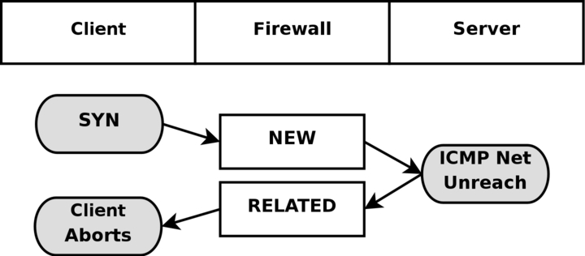
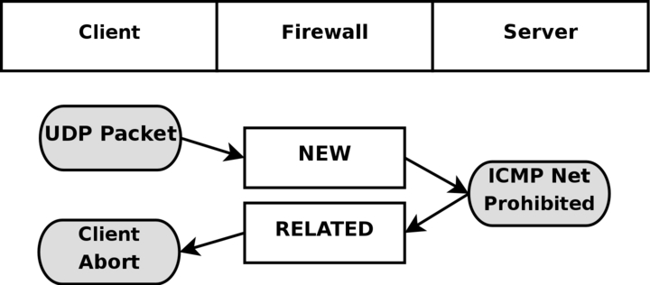
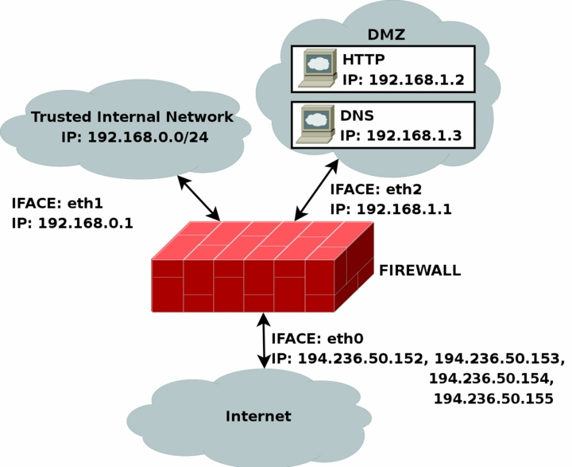
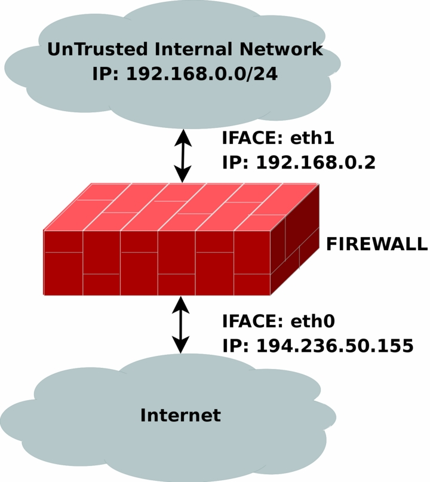

# table

## mangle
这个表格主要用于处理数据包，应该主要用于数据包的混淆。

注意：
强烈建议您不要在此表格中进行任何过滤操作；任何DNAT、SNAT或Masquerading操作在此表格中都不起作用。

以下目标仅在混淆表中有效，不能在混淆表之外使用：
* TOS 用于设置和/或更改数据包中的服务类型字段
* TTL 更改ttl
* MARK 用于向数据包设置特殊的标记值。这些标记可以被iproute2程序识别，根据它们的标记对数据包进行不同的路由，我们还可以根据这些标记进行带宽限制和基于类别的排队。
* SECMARK 为单个数据包设置安全上下文标记，以供SELinux和其他能够处理这些标记的安全系统使用。这用于对系统的子系统能够触及哪些数据包等进行非常精细的安全控制
* CONNSECMARK 将安全上下文从整个连接复制到单个数据包中，或者从单个数据包复制到整个连接中。这由SELinux和其他安全系统用于在连接级别上进行更细粒度的安全控制。

## nat
这个表格只应该用于不同数据包的网络地址转换（NAT）。请注意，只有stream中的第一个数据包会命中这个table。之后，其余的数据包将自动采取与第一个数据包相同的操作。执行这些操作的实际目标包括：

DNAT : 目标主要用于当您拥有一个公共IP并希望将访问重定向到防火墙上的其他主机时（例如在DMZ上）。换句话说，我们改变数据包的目标地址并将其重定向到主机。

SNAT : 主要用于更改数据包的源地址。大部分情况下，您会隐藏本地网络或DMZ等。一个很好的例子是防火墙，我们知道其外部IP地址，但需要用防火墙的IP地址替换我们本地网络的IP地址。使用此目标，防火墙将自动进行SNAT和逆向SNAT操作，从而使局域网能够与互联网建立连接。例如，如果您的网络使用192.168.0.0/netmask，数据包将无法从互联网返回，因为IANA将这些网络（以及其他一些）规定为私有网络，只能在隔离的局域网中使用。

MASQUERADE : 目标与SNAT完全相同，但MASQUERADE目标需要更多的计算开销。原因是，每当MASQUERADE目标被数据包命中时，它会自动检查要使用的IP地址，而不像SNAT目标那样只使用单个配置的IP地址。MASQUERADE目标使得能够正确处理ISP为您的PPP、PPPoE或SLIP连接提供的动态DHCP IP地址的情况。

REDIRECT 

## raw
raw table主要用于一个目的，那就是在数据包上设置一个标记，告诉连接跟踪系统不处理这些数据包。这是通过在数据包上使用NOTRACK目标来实现的。如果一个连接被应用了NOTRACK目标，那么连接跟踪系统将不会跟踪该连接。在没有添加raw table的情况下，这是不可能解决的问题，因为在连接跟踪实际运行并将数据包添加到连接跟踪表中或与已有连接匹配之前，其他表都不会被调用。您可以在状态机章节中了解更多相关信息。

该表只有PREROUTING和OUTPUT链。其他链不是必需的，因为这些是在数据包实际进入连接跟踪之前处理数据包的唯一位置。

## filter
主要用于过滤数据包。我们可以根据需要匹配和过滤数据包。这是我们实际对数据包采取行动的地方，我们可以查看它们的内容并根据内容进行丢弃（DROP）或接受（ACCEPT）操作。

## user chain
如果一个数据包进入了过滤表中的INPUT链，我们可以指定一个跳转规则到同一表中的另一个链。新的链必须是用户指定的，不能是内置链，例如INPUT或FORWARD链。
当指针指向一个内置链的规则，指针将从规则到规则，从顶部到底部进行遍历，直到链的遍历由目标(accept/drop)或到链的结束。一旦这种情况发生，将应用内置链的默认策略。

注意：
用户指定的链不能在链的末尾设置默认策略，只有内置链才能这样做。可以通过在链的末尾附加一个没有匹配项的单个规则来规避这个问题，因此它将起到默认策略的作用。如果在用户指定的链中没有匹配到任意规则，将默认跳回到原始链。如上图所示，规则执行从链2跳回到链1的规则4，这是在开始时将规则执行发送到链2的规则之下。

在用户指定的链中，每个规则都会被遍历，直到其中一个规则匹配——然后目标规定遍历是否应该结束或继续——或者到达链的末尾。如果到达了用户指定链的末尾，数据包将被发送回调用链。调用链可以是用户指定的链或内置链。


# 连接跟踪 状态机
## 介绍
状态机是iptables中的一个特殊部分，实际上不应该被称为状态机，因为它实际上是一个连接跟踪机制。然而，大多数人都使用第一个名称来识别它。连接跟踪是为了让Netfilter框架了解特定连接的状态。实现这一功能的防火墙通常被称为有状态防火墙。有状态防火墙通常比无状态防火墙更安全，因为它允许我们编写更严格的规则集。

在iptables中，**数据包可以与四种不同的跟踪连接状态相关联，这些状态被称为NEW、ESTABLISHED、RELATED和INVALID。通过--state匹配**，我们可以轻松地控制谁或什么被允许启动新会话。

所有的连接跟踪都是由内核中的一个特殊框架称为conntrack完成的。我们需要和希望比默认的conntrack引擎更具体的连接跟踪。因此，conntrack还有处理TCP、UDP或ICMP等协议的更具体的子模块。这些模块从数据包中提取特定而独特的信息，以便它们可以跟踪每个数据流。conntrack收集的信息然后用于告诉conntrack此流当前处于哪个状态。例如，UDP流通常通过目标IP地址、源IP地址、目标端口和源端口来唯一标识。

在以前的内核中，我们有可能打开和关闭碎片重组。然而，自从引入iptables和Netfilter，特别是连接跟踪以后，这个选项被取消了。原因是连接跟踪在没有进行碎片重组的情况下无法正常工作，因此**碎片重组已经被合并到conntrack中，并且自动进行**。除非关闭连接跟踪，否则无法关闭碎片重组。只要打开连接跟踪，就会始终进行碎片重组。

**所有的连接跟踪都在PREROUTING链中处理，除了本地生成的数据包(这些数据包在OUTPUT链中处理)**。这意味着iptables将在PREROUTING链中进行所有状态的重新计算等操作。如果我们在一个流中发送初始数据包，状态会在OUTPUT链中设置为NEW，当我们接收到返回数据包时，状态会在PREROUTING链中更改为ESTABLISHED，依此类推。如果第一个数据包不是由我们自己发起的，当然会在PREROUTING链中设置为NEW状态。因此，所有状态的更改和计算都在nat表的PREROUTING和OUTPUT链中进行。

### 总结下

在 Linux 中，当收到数据包时，数据包会首先经过 netfilter 的 PREROUTING 链。在这个过程中，数据包可能会被 raw 表的 PREROUTING 链处理，其中可能包括 NOTRACK 标记。这个标记的作用是告诉 netfilter 不要对这个数据包进行连接跟踪。

如果数据包没有被标记为 NOTRACK，那么它将会被 conntrack 模块处理。conntrack 是 netfilter 的一部分，它负责跟踪连接的状态，包括 TCP 连接的建立、维持和终止，以及其他协议的连接状态。

经过 conntrack 模块处理后，数据包会再次通过 netfilter，这次是 NAT 表的 PREROUTING 链。

## 连接跟踪条目

注意默认情况 nf_conntrack 为空，需要添加一条nat，conntrack才开始记录

让我们简要介绍一下连接跟踪条目以及如何在/proc/net/nf_conntrack中读取它们。这提供了您的连接跟踪数据库中所有当前条目的列表。如果您加载了ip_conntrack模块，那么/proc/net/nf_conntrack的内容可能如下所示：
 ```shell
tcp(TCP连接)      6(传输层协议号7) 117(此跟踪条目存在时间117秒) SYN_SENT(发现一个SYN_SENT的数据包) src=192.168.1.6 dst=192.168.1.9 sport=32775 \
     dport=22 [UNREPLIED(此连接没有收到响应数据包)] src=192.168.1.9 dst=192.168.1.6 sport=22 \
     dport=32775 [ASSURED(此连接是稳定的，不是偶然的，恶意的)] use=2(有两个进程或线程引用此连接，用于内核内部的引用计数，并不直接反映出对外的连接状态或者使用情况)

ASSURED : 带此标记的条目在内存不足时不会被删除, 因为他们被视为重要记录，不带此关键字的条目在内存不足时被删除
 ```
这个示例包含了连接跟踪模块维护的所有信息，用于确定特定连接的状态。

首先，我们有一个协议，这里是tcp。接下来是相同的值，使用十进制编码。
然后，我们看到这个连接跟踪条目的存活时间。当前设置为117秒，并定期递减，直到看到更多的流量。然后，该值将被重置为该特定状态在相关时间点的默认值。
接下来是此条目在当前时间点的实际状态。在上述情况中，我们正在查看一个处于SYN_SENT状态的数据包。连接的内部值与iptables外部使用的值略有不同。SYN_SENT告诉我们，我们正在查看一个只在一个方向上收到TCP SYN数据包的连接。
接下来，我们看到源IP地址、目标IP地址、源端口和目标端口。
此时，我们看到一个特定的关键字，告诉我们这个连接没有收到返回流量。
最后，我们看到了我们期望的返回数据包的信息。该信息详细说明了源IP地址和目标IP地址（它们都是反转的，因为数据包将被定向回我们）。同样，源端口和目标端口也是一样的。这些值对我们来说应该是感兴趣的。

连接跟踪条目可以具有一系列不同的值，这些值在linux/include/netfilter-ipv4/ip_conntrack.h文件中的连接跟踪头文件中指定。这些值取决于我们使用的IP的子协议。TCP、UDP或ICMP协议在linux/include/netfilter-ipv4/ip_conntrack.h中指定了特定的默认值。我们将在查看每个协议时更详细地了解这一点；然而，在本章中，我们不会广泛使用它们，因为它们在连接跟踪内部之外不使用。此外，根据状态的更改方式，连接被销毁之前的默认时间值也会发生变化。

可以通过使用/proc/sys/net/netfilter目录中提供的特定系统调用来更改这些值。您应该特别关注/proc/net/netfilter/nf_conntrack_\*变量。
```shell
ls /proc/sys/net/netfilter/ip_conntrack_*
/proc/sys/net/netfilter/ip_conntrack_buckets
/proc/sys/net/netfilter/ip_conntrack_checksum
/proc/sys/net/netfilter/ip_conntrack_count
/proc/sys/net/netfilter/ip_conntrack_generic_timeout
/proc/sys/net/netfilter/ip_conntrack_icmp_timeout
/proc/sys/net/netfilter/ip_conntrack_log_invalid
/proc/sys/net/netfilter/ip_conntrack_max
/proc/sys/net/netfilter/ip_conntrack_tcp_be_liberal
/proc/sys/net/netfilter/ip_conntrack_tcp_loose
/proc/sys/net/netfilter/ip_conntrack_tcp_max_retrans
/proc/sys/net/netfilter/ip_conntrack_tcp_timeout_close
/proc/sys/net/netfilter/ip_conntrack_tcp_timeout_close_wait
/proc/sys/net/netfilter/ip_conntrack_tcp_timeout_established
/proc/sys/net/netfilter/ip_conntrack_tcp_timeout_fin_wait
/proc/sys/net/netfilter/ip_conntrack_tcp_timeout_last_ack
/proc/sys/net/netfilter/ip_conntrack_tcp_timeout_max_retrans
/proc/sys/net/netfilter/ip_conntrack_tcp_timeout_syn_recv
/proc/sys/net/netfilter/ip_conntrack_tcp_timeout_syn_sent
/proc/sys/net/netfilter/ip_conntrack_tcp_timeout_syn_sent2
/proc/sys/net/netfilter/ip_conntrack_tcp_timeout_time_wait
/proc/sys/net/netfilter/ip_conntrack_udp_timeout
/proc/sys/net/netfilter/ip_conntrack_udp_timeout_stream
```

当连接在两个方向上都收到流量时，连接跟踪条目将清除[UNREPLIED]标志，然后重新设置它。
告诉我们连接在两个方向上都没有收到流量的条目将被[ASSURED]标志替换，该标志位于条目末尾附近。[ASSURED]标志告诉我们，此连接是可靠的，如果达到最大可能的跟踪连接数，它将不会被删除。
因此，标记为[ASSURED]的连接不会被删除，与非可靠连接（未标记为[ASSURED]的连接）相反。连接跟踪表可以容纳多少个连接取决于一个可以通过最近内核中的ip-sysctl函数设置的变量。该条目所持有的默认值根据您拥有的内存量而大幅变化。您可以通过/proc/sys/net/netfilter/nf_conntrack_max 设置来读取和设置您的设置。

## state
正如您所提到的，数据包在内核中可能处于几种不同的状态，这取决于所讨论的协议。然而，在内核之外，我们只有之前描述的4种状态。这些状态主要可以与状态匹配（state match）结合使用，从而能够根据数据包的当前连接跟踪状态进行匹配。有效的状态包括NEW（新建）、ESTABLISHED（已建立）、RELATED（相关）和INVALID（无效）。下表将简要解释每种可能的状态。

用户空间状态
* NEW	NEW状态告诉我们该数据包是我们看到的第一个数据包。这意味着连接跟踪模块看到的特定连接中的第一个数据包将被匹配。例如，如果我们看到一个SYN数据包，并且它是我们看到的连接中的第一个数据包，它将匹配。但是，该数据包也可能不是SYN数据包，但仍被视为NEW。在某些情况下，这可能导致某些问题，但在需要从其他防火墙中恢复丢失的连接或实际上未关闭的连接超时时，这也可能非常有帮助。

* ESTABLISHED	ESTABLISHED状态已经在两个方向上看到了流量，并将持续匹配这些数据包。很容易理解ESTABLISHED连接。进入ESTABLISHED状态的唯一要求是一个主机发送一个数据包，并在稍后从另一个主机接收到回复。当接收到回复数据包时，NEW状态将转变为ESTABLISHED状态。如果我们创建了一个生成回复ICMP消息的数据包，那么该回复ICMP消息也可以视为ESTABLISHED。

* RELATED	RELATED状态是比较棘手的状态之一。当一个连接与另一个已经建立的连接相关联时，该连接被视为RELATED。这意味着，为了将连接视为RELATED，我们必须首先有一个被视为ESTABLISHED的连接。然后，该ESTABLISHED连接将在主连接之外生成一个连接。如果连接跟踪模块能够理解该连接是RELATED，那么新生成的连接将被视为RELATED。一些可以被视为RELATED的连接的很好例子是被视为与FTP控制端口相关的FTP数据连接，以及通过IRC发起的DCC连接。这可以用于允许ICMP错误消息、FTP传输和DCC正常通过防火墙工作。请注意，大多数依赖于此机制的TCP协议和一些依赖于此机制的UDP协议非常复杂，并在TCP或UDP数据段的有效负载中发送连接信息，因此需要特殊的辅助模块才能正确理解。

* INVALID	INVALID状态表示无法识别该数据包或该数据包没有任何状态。这可能由于多种原因，例如系统内存耗尽或不响应任何已知连接的ICMP错误消息。通常，最好将处于此状态的所有内容丢弃。

* UNTRACKED	这是UNTRACKED状态。简而言之，如果在原始表中使用NOTRACK目标标记数据包，那么该数据包将在状态机中显示为UNTRACKED。这也意味着所有相关的连接将不可见，因此在处理UNTRACKED连接时必须谨慎，因为状态机将无法看到相关的ICMP消息等。

可以使用这些状态与--state匹配一起使用，根据连接跟踪状态匹配数据包。这就是状态机在防火墙中如此强大和高效的原因。以前，我们经常不得不打开所有大于1024的端口，以便将所有流量重新引入我们的本地网络。有了状态机，这就不再必要了，因为我们现在只需为返回流量打开防火墙，而不是为各种其他流量打开防火墙。
意思是，当主机被定义以为只做客户端时（不接受任何连接时），在FORWARD的filter表只接受state为 ESTABLISHED和 RELATED的数据包

## TCP 连接
在这一节和接下来的几节中，我们将更详细地了解TCP、UDP和ICMP这三种基本协议的状态以及它们在iptables中的处理方式。此外，我们还将仔细研究默认情况下如何处理无法归类为这三种协议的连接。我们选择从TCP协议开始，因为它本身就是一个有状态的协议，并且在iptables的状态机中有很多有趣的细节。

TCP连接总是通过三次握手来建立和协商实际的数据传输连接。整个会话从一个SYN数据包开始，然后是一个SYN/ACK数据包，最后是一个ACK数据包来确认整个会话的建立。此时连接已经建立起来，可以开始发送数据了。那么，连接跟踪是如何参与其中的呢？实际上非常简单。

对于用户而言，无论是哪种类型的连接，连接跟踪基本上都是同样的工作方式。请看下面的图片，了解连接在不同阶段进入的状态。从图中可以看出，连接跟踪代码实际上并不按照用户视角下TCP连接的流程进行处理。一旦它接收到一个数据包（SYN），它将把连接视为NEW状态。一旦它接收到返回的数据包（SYN/ACK），它将把连接视为ESTABLISHED状态。如果你仔细思考一下，你就会明白为什么要这样设计。通过这种特定的实现方式，**你可以允许NEW和ESTABLISHED数据包离开你的本地网络，只允许ESTABLISHED连接返回**，这样就能完美地工作了。相反，如果连接跟踪机制将整个连接建立过程都视为NEW状态，我们就永远无法真正阻止外部连接进入我们的本地网络，因为我们将不得不再次允许NEW数据包进入。更复杂的是，内核中还有许多用于TCP连接的其他内部状态，但在用户空间中无法访问。大致上，它们遵循RFC 793《传输控制协议》第21-23页中指定的状态标准。我们将在本节后面更详细地讨论这些状态。


正如你所看到的，从用户的角度来看，这是非常简单的。然而，从内核的角度来看，整个构建过程就要复杂一些。让我们看一个例子，考虑一下在客户端的/proc/net/nf_conntrack表中连接状态是如何变化的。第一个状态是在连接接收到第一个SYN数据包时报告的。

```shell
tcp      6 117 SYN_SENT src=192.168.1.5 dst=192.168.1.35 sport=1031 \
     dport=23 [UNREPLIED] src=192.168.1.35 dst=192.168.1.5 sport=23 \
     dport=1031 use=1
```

从上面的条目可以看出，我们有一个确切的状态，即已发送了一个SYN数据包（设置了SYN_SENT标志），但到目前为止还没有收到回复（可以看到[UNREPLIED]标志）。当我们在另一个方向上看到另一个数据包时，将达到下一个内部状态。

```shell
tcp      6 57 SYN_RECV src=192.168.1.5 dst=192.168.1.35 sport=1031 \
     dport=23 src=192.168.1.35 dst=192.168.1.5 sport=23 dport=1031 \
     use=1
```

现在我们收到了相应的SYN/ACK回复。一旦收到这个数据包，状态再次改变，这次是变为SYN_RECV。SYN_RECV告诉我们原始的SYN已经正确地传递了，并且SYN/ACK回复数据包也正确地通过了防火墙。此外，这个连接跟踪条目现在已经在两个方向上看到了流量，因此被认为是已经回复了。这并不是显式的，而是假设的，就像上面的[UNREPLIED]标志一样。最后一步将在我们看到3次握手中的最后一个ACK时达到。

```shell
tcp      6 431999 ESTABLISHED src=192.168.1.5 dst=192.168.1.35 \
     sport=1031 dport=23 src=192.168.1.35 dst=192.168.1.5 \
     sport=23 dport=1031 [ASSURED] use=1
```

在最后一个例子中，我们得到了3次握手中的最后一个ACK，并且连接已经进入了已建立（ESTABLISHED）状态，就内部的iptables机制而言。通常情况下，此时流量将被认为是已确认（ASSURED）的。

一个连接也可能进入已建立（ESTABLISHED）状态，但不被认为是已确认（ASSURED）。如果我们启用了连接拾取（需要tcp-window-tracking补丁，并且将ip_conntrack_tcp_loose设置为1或更高），就会发生这种情况。默认情况下，没有tcp-window-tracking补丁时会有这种行为，且无法更改。

总之使用了tcp 子模块的 conntrack可以显示三次握手时TCP状态


当关闭TCP连接时，它会按照以下方式进行，并经历以下状态。


如您所见，直到最后一个 ACK 被发送之前，连接实际上从未真正关闭。请注意，这张图片只描述了在正常情况下如何关闭连接。例如，连接也可以通过发送 RST（重置）来关闭，如果连接被拒绝。在这种情况下，连接将立即关闭。

当 TCP 连接关闭时，连接进入 TIME_WAIT 状态，默认设置为 2 分钟。这样做是为了确保所有乱序的数据包仍然可以通过我们的规则集，即使连接已经关闭。这被用作一种缓冲时间，以便那些在拥塞的路由器中卡住的数据包仍然可以到达防火墙或连接的另一端。

如果连接通过 RST 数据包重置，状态将变为 CLOSE。这意味着连接在完全关闭之前默认有 10 秒的时间。RST 数据包不会在任何意义上得到确认，并且会直接中断连接。除了我们迄今告诉您的状态之外，还有其他状态。下面是 TCP 流可能采用的所有状态及其超时值的完整列表。

| State				| Timeout value |
| ----------------  | ------------  |
| NONE				| 30 minutes 	|
| ESTABLISHED		| 5 days		|
| SYN_SENT			| 2 minutes		|
| SYN_RECV			| 60 seconds	|
| FIN_WAIT			| 2 minutes		|
| TIME_WAIT			| 2 minutes		|
| CLOSE				| 10 seconds	|
| CLOSE_WAIT		| 12 hours		|
| LAST_ACK			| 30 seconds	|
| LISTEN			| 2 minutes		|

这些值绝对不是固定的。它们可能会随着内核版本的更新而改变，也可以通过位于/proc/sys/net/ipv4/netfilter/ip_ct_tcp_\*变量的proc文件系统进行更改。然而，默认值在实践中应该是相当稳定的。这些值以秒为单位进行设置。

注意：
还要注意，用户空间的状态机不会查看TCP数据包中设置的TCP标志（即RST、ACK和SYN是标志）。这通常是不好的，因为您可能希望允许处于NEW状态的数据包通过防火墙，但当您指定NEW标志时，大多数情况下您的意思是SYN数据包。

然而，当前的状态实现并不是这样的；相反，即使是没有任何位设置或只有ACK标志的数据包，也会被计为NEW。这可以用于冗余的防火墙设置等，但在家庭网络中通常非常不好，因为您只有一个防火墙。为了解决这个问题，您可以使用附录中“State NEW packets but no SYN bit set”部分中解释的命令。另一种方法是安装patch-o-matic的tcp-window-tracking扩展，并将/proc/sys/net/ipv4/netfilter/ip_conntrack_tcp_loose设置为零，这将使防火墙丢弃除了SYN标志以外的所有NEW数据包。

## UDP连接
UDP连接本身并不是有状态的连接，而是无状态的连接。这主要是因为UDP连接不包含任何连接建立或连接关闭的过程，最重要的是它们缺乏顺序控制。按照特定顺序接收两个UDP数据报并不能说明它们被发送的顺序。然而，在内核中仍然可以对连接设置状态。让我们来看一下如何跟踪连接以及在连接跟踪中的表示方式。


正如你所看到的，连接的建立方式与TCP连接几乎完全相同，从用户层面来看是如此。在内部，连接跟踪信息看起来有些不同，但本质上细节是相同的。首先，让我们来看一下初始UDP数据包发送后的条目。
```
# host发送UDP, 状态为NEW
udp      17(传输层协议号17为UDP) 20(连接存在时间20秒) src=192.168.1.2 dst=192.168.1.5 sport=137 dport=1025 \
     [UNREPLIED] src=192.168.1.5 dst=192.168.1.2 sport=1025 \
     dport=137 use=1
```
从第一个和第二个值可以看出，这是一个UDP数据包。第一个是协议名称，第二个是协议号。这与TCP连接的情况完全相同。第三个值表示此状态条目的存活时间（以秒为单位）。之后，我们得到了已经收到的数据包的值，以及我们从发起数据包的发送方预期接收到的未来数据包的值。这些值包括源IP地址、目标IP地址、源端口和目标端口。在这一点上，[UNREPLIED]标志告诉我们到目前为止还没有对该数据包的响应。最后，我们得到了一份有关返回数据包的简要期望列表。请注意，后面的条目与前面的值是相反的顺序。此时的超时时间设置为默认的30秒。


```
# host接收到回复, 状态为 ESTABLISHED
udp      17 170 src=192.168.1.2 dst=192.168.1.5 sport=137 \
     dport=1025 src=192.168.1.5 dst=192.168.1.2 sport=1025 \
     dport=137 [ASSURED] use=1
```
此时，服务器已经收到了对第一个发送出去的数据包的回复，连接现在被视为已建立（ESTABLISHED）。这在连接跟踪中没有显示，正如你所看到的。主要的区别是，[UNREPLIED]标志已经消失了。此外，默认超时时间已更改为180秒，但在这个例子中，它已经减少到了170秒，再过10秒钟，它将变为160秒。然而，有一件事情是缺失的，而且可能会有所变化，那就是上面描述的[ASSURED]标志。要在跟踪的连接上设置[ASSURED]标志，必须对NEW数据包进行了合法的回复。

```
# 这是另一个UDP连接的例子
udp      17 175 src=192.168.1.5 dst=195.22.79.2 sport=1025 \
     dport=53 src=195.22.79.2 dst=192.168.1.5 sport=53 \
     dport=1025 [ASSURED] use=1
```

此时，连接已经被确认。连接看起来与前面的例子完全相同。如果该连接在180秒内没有使用，它将超时。180秒是一个相对较低的值，但对于大多数情况来说应该足够了。对于与同一条目匹配并通过防火墙的每个数据包，该值将被重置为其完整值，就像所有内部状态一样。

## ICMP连接
ICMP数据包不同于有状态的流，因为它们仅用于控制，不应建立任何连接。然而，有四种ICMP类型会生成返回数据包，并且这些类型有两种不同的状态。这些ICMP消息可以处于NEW和ESTABLISHED状态。我们所讨论的ICMP类型包括回显请求和回复、时间戳请求和回复、信息请求和回复，以及地址掩码请求和回复。其中，时间戳请求和信息请求已经过时，很可能可以被删除。然而，回显消息在多种设置中被使用，比如ping主机。地址掩码请求并不经常使用，但有时可能很有用，值得允许。为了了解这个过程的大致情况，可以看下面的图片。


如上图所示，主机向目标发送一个回显请求，防火墙将其视为NEW状态。然后目标以回显回复的形式响应，防火墙将其视为ESTABLISHED状态。当第一个回显请求被检测到时，以下状态条目将进入ip_conntrack。
```
icmp     1(L4层协议号) 25(超时时间) src=192.168.1.6 dst=192.168.1.10 type=8(ICMP类型) code=0(ICMP code) \
     id=33029(ICMP id) [UNREPLIED](说明为NEW状态) src=192.168.1.10 dst=192.168.1.6 \
     type=0 code=0 id=33029 use=1
```
如你所见，这个条目与TCP和UDP的标准状态有些不同。协议字段和超时字段仍然存在，还有源地址和目标地址。然而，之后的字段有所不同。现在有三个新字段，分别是type、code和id。它们并没有特殊之处，type字段包含ICMP类型，code字段包含ICMP代码。所有这些信息都可以在ICMP类型附录中找到。最后的id字段包含ICMP的ID。每个ICMP数据包在发送时都会被赋予一个ID，当接收方收到ICMP消息时，它会在新的ICMP消息中设置相同的ID，以便发送方能够识别回复并将其与正确的ICMP请求关联起来。

接下来的字段，我们再次看到了之前见过的[UNREPLIED]标志。与之前一样，该标志告诉我们当前正在查看只有单向流量的连接跟踪条目。最后，我们看到了回复ICMP数据包的期望，它是原始源地址和目标地址的反转。至于类型和代码，这些都被更改为返回数据包的正确值，因此回显请求被更改为回显回复，依此类推。ICMP的ID保持与请求数据包相同。

回复数据包被视为ESTABLISHED，正如我们之前解释的。然而，我们可以确定，在ICMP回复之后，同一连接中绝对不会再有合法的流量。因此，一旦回复完全通过Netfilter结构传输，连接跟踪条目就会被销毁。

在上述每种情况下，请求被视为NEW，而回复被视为ESTABLISHED。让我们仔细考虑一下。当防火墙看到一个请求数据包时，它将其视为NEW。当主机向请求发送回复数据包时，它被视为ESTABLISHED。

注意：
请注意，这意味着回复数据包必须符合连接跟踪条目给出的条件才能被视为已建立，就像其他所有流量类型一样。

ICMP请求的默认超时时间为30秒，你可以在/proc/sys/net/ipv4/netfilter/ip_ct_icmp_timeout中进行更改。这通常是一个很好的超时值，因为它能够捕获大多数正在传输的数据包。

ICMP的另一个非常重要的部分是它用于告知主机特定的UDP和TCP连接或连接尝试的结果。因此，ICMP回复往往会被认为是与原始连接或连接尝试相关的。一个简单的例子是ICMP主机不可达或ICMP网络不可达。如果我们的主机尝试与其他主机建立连接，但是该网络或主机可能已经关闭，因此最后一个尝试到达目标站点的路由器将返回一个ICMP消息告诉我们这一情况。在这种情况下，ICMP回复被视为相关数据包。下面的图片应该能够解释它的样子。



在上面的例子中，我们向特定地址发送一个SYN数据包。防火墙将其视为NEW连接。然而，该数据包试图到达的网络不可达，所以一个路由器向我们返回了一个网络不可达的ICMP错误。连接跟踪代码可以根据已添加的跟踪条目识别此数据包为RELATED。因此，ICMP回复被正确地发送给客户端，希望客户端会中止连接。同时，防火墙销毁了连接跟踪条目，因为它知道这是一个错误消息。

对于遇到任何问题的UDP连接，其行为与上述情况相同。所有回复UDP连接的ICMP消息都被视为RELATED。考虑下面的图片。



这次我们向主机发送一个UDP数据包。这个UDP连接被视为NEW。然而，在传输过程中，网络被某个防火墙或路由器禁止。因此，我们的防火墙收到一个ICMP网络禁止的回复。防火墙知道这个ICMP错误消息与已经打开的UDP连接相关，因此将其作为RELATED数据包发送给客户端。此时，防火墙销毁了连接跟踪条目，客户端接收到了ICMP消息，并希望中止连接。

## 默认连接
在某些情况下，连接跟踪机制不知道如何处理特定的协议。这种情况可能是因为它不熟悉该特定协议，或者不知道它的工作原理。在这些情况下，它会回到默认行为。默认行为用于NETBLT、MUX和EGP等协议。这种行为与UDP连接跟踪非常相似。第一个数据包被视为NEW，回复流量等被视为ESTABLISHED。

当使用默认行为时，所有这些数据包将获得相同的默认超时值。可以通过/proc/sys/net/ipv4/netfilter/ip_ct_generic_timeout变量进行设置。默认值为600秒，即10分钟。根据您尝试通过使用默认连接跟踪行为的链路发送的流量，可能需要更改此值。特别是如果您要通过卫星等方式传输流量，可能需要很长时间。

## 为追踪的连接和RAW表
在Linux中，"UNTRACKED"是与连接跟踪相关的一个特殊关键字。基本上，它用于匹配在原始表中被标记为不进行跟踪的数据包。

原始表是专门为此目的创建的。在该表中，您可以在不希望在netfilter中进行跟踪的数据包上设置一个NOTRACK标记。

重要提示：
请注意，我说的是数据包，而不是连接，因为实际上是对进入的每个数据包设置标记。否则，我们仍然需要对连接进行某种跟踪，以知道它不应该被跟踪。

正如我们在本章中已经提到的，连接跟踪和状态机需要相当多的资源。因此，有时关闭连接跟踪和状态机可能是一个好主意。

一个例子是，如果您有一个流量繁忙的路由器，您希望对进出的流量进行防火墙处理，但不对路由的流量进行处理。您可以在原始表中接受所有目标为防火墙本身的数据包，并为所有其他流量设置NOTRACK标记。这样，您可以对路由器本身的传入流量进行有状态匹配，同时节省处理能力，不处理所有的交叉流量。

另一个可以使用NOTRACK的例子是，如果您有一个高流量的Web服务器，希望进行有状态跟踪，但不想浪费处理能力来跟踪Web流量。您可以设置一个规则，在所有本地拥有的IP地址或实际提供Web流量的IP地址上关闭端口80的跟踪。这样，除了Web流量之外，您可以享受所有其他服务的有状态跟踪，从而在已经过载的系统上节省一些处理能力。

然而，使用NOTRACK存在一些问题，您必须考虑到这一点。如果整个连接都被设置为NOTRACK，那么您将无法跟踪相关的连接，连接跟踪和NAT助手对于未跟踪的连接将不起作用，相关的ICMP错误也不会起作用。换句话说，您必须手动打开这些功能。对于诸如FTP和SCTP等复杂协议，这可能非常难以管理。只要您意识到这一点，您应该能够处理好这个问题。

## 复杂协议的连接跟踪
某些协议比其他协议更复杂。就连接跟踪而言，这意味着这些协议可能更难正确跟踪。ICQ、IRC和FTP协议是这方面的典型例子。每个协议都在数据包的实际数据载荷中携带信息，因此需要特殊的连接跟踪辅助程序才能使其正常工作。

让我们以FTP协议作为第一个例子。FTP协议首先打开一个称为FTP控制会话的单个连接。当我们通过该会话发出命令时，会打开其他端口来传输与该特定命令相关的其余数据。这些连接可以通过两种方式进行，主动方式或被动方式。当使用主动方式进行连接时，FTP客户端向服务器发送一个端口和IP地址进行连接。之后，FTP客户端打开该端口，服务器从一个随机的非特权端口（>1024）连接到指定的端口，并通过该端口发送数据。

问题在于防火墙不会知道这些额外的连接，因为它们是在协议数据的实际载荷中协商的。因此，防火墙将无法知道它应该允许服务器通过这些特定端口连接到客户端。

解决此问题的方法是向连接跟踪模块添加一个特殊的辅助程序，该辅助程序将扫描控制连接中的数据以查找特定的语法和信息。当它遇到正确的信息时，它将将该特定信息添加为RELATED，服务器将能够通过该RELATED条目跟踪连接。请参考以下图片以了解FTP服务器在连接回客户端时的状态。


被动FTP的工作方式与此相反。FTP客户端告诉服务器它想要一些特定的数据，服务器回复一个IP地址和端口供连接。收到这些数据后，客户端将从自己的端口20（FTP数据端口）连接到该特定端口，并获取所需的数据。如果在防火墙后面有一个FTP服务器，你需要在标准的iptables模块之外，还需要这个模块，以便让互联网上的客户端正确连接到FTP服务器。如果你对用户非常严格，只想让他们访问互联网上的HTTP和FTP服务器，并阻止所有其他端口，情况也是如此。请参考以下图片以了解被动FTP的情况。


一些连接跟踪辅助程序已经在内核中可用。具体来说，FTP和IRC协议在撰写本文时已经具备连接跟踪辅助程序。如果在内核中找不到所需的连接跟踪辅助程序，可以查看用户空间iptables中的patch-o-matic树。patch-o-matic树可能包含更多的连接跟踪辅助程序，例如ntalk或H.323协议的辅助程序。如果它们在patch-o-matic树中不可用，你有几个选择。你可以查看iptables的CVS源代码，如果它最近已经包含在该树中，或者你可以联系Netfilter-devel邮件列表，询问是否可用。如果不可用，并且没有计划添加它，你只能自己动手，最有可能想要阅读Rusty Russell的不可靠的**Netfilter Hacking HOW-TO**，该文档链接在其他资源和链接附录中。

连接跟踪辅助程序可以静态编译到内核中，也可以作为模块。如果它们被编译为模块，可以使用以下命令加载它们：
```shell
modprobe ip_conntrack_ftp
modprobe ip_conntrack_irc
modprobe ip_conntrack_tftp
modprobe ip_conntrack_amanda
```
请注意，连接跟踪与NAT无关，因此如果你还要进行连接的NAT转换，可能需要更多的模块。例如，如果你想进行FTP连接的NAT转换和跟踪，你还需要NAT模块。所有NAT辅助程序以ip_nat_开头，遵循该命名约定；因此，FTP NAT辅助程序将被命名为ip_nat_ftp，IRC模块将被命名为ip_nat_irc。连接跟踪辅助程序遵循相同的命名约定，因此IRC连接跟踪辅助程序将被命名为ip_conntrack_irc，而FTP连接跟踪辅助程序将被命名为ip_conntrack_ftp。

# 保存和恢复大量的iptables 规则
iptables软件包附带两个非常有用的工具，特别是在处理较大的规则集时。这两个工具分别称为iptables-save和iptables-restore，用于将规则集保存和恢复到一个特定的文件格式，该文件格式与本教程其余部分中的标准shell代码有很大区别。

提示
iptables-restore可以与脚本语言一起使用。大问题是你需要将结果输出到iptables-restore的stdin中。如果你正在创建一个非常庞大的规则集（几千条规则），这可能是一个很好的主意，因为插入所有新规则将更快。例如，你可以运行make_rules.sh | iptables-restore。

## iptables-restore 优点 速度

使用iptables-save和iptables-restore命令的最大原因之一是它们可以显著加快加载和保存较大规则集的速度。在运行包含iptables规则的shell脚本时，主要问题是脚本中每次调用iptables都会首先从Netfilter内核空间提取整个规则集，然后插入、追加规则或执行所需的规则集更改。最后，它将从自己的内存中将新的规则集插入到内核空间中。使用shell脚本，对于每个要插入的规则，都会执行此操作，而每次执行此操作，提取和插入规则集所需的时间就会更多。

为了解决这个问题，有iptables-save和iptables-restore命令。iptables-save命令用于将规则集保存到特定格式的文本文件中，而iptables-restore命令用于再次将该文本文件加载到内核中。这些命令的最大优点是它们将规则集在一个单独的请求中加载和保存。iptables-save将整个规则集从内核中获取并以一个动作保存到文件中。iptables-restore将为每个表将特定的规则集上传到内核中。换句话说，对于非常大的规则集，我们不再需要将规则集从内核中删除30,000次，然后再次将其上传到内核中相同的次数，而是可以将整个规则集一次性保存到文件中，然后根据使用的表的数量，将整个规则集以至少三个动作上传到内核中。

正如您可以理解的那样，如果您正在处理需要插入的大规模规则集，这些工具绝对适合您。然而，它们也有一些缺点，我们将在下一部分进行更详细的讨论。

## iptables-restore 缺点

您可能已经想过，iptables-restore能否处理任何类型的脚本？到目前为止，不行，它可能永远也无法做到。这是使用iptables-restore的主要缺陷，因为您将无法使用这些文件执行大量操作。例如，如果您有一个具有动态分配IP地址的连接，并且您希望在计算机启动时每次都获取此动态IP地址，然后在脚本中使用该值，那么使用iptables-restore几乎不可能实现这一点。

解决此问题的一种可能性是创建一个小脚本，该脚本获取您想在脚本中使用的值，然后使用sed命令在iptables-restore文件中查找特定关键字，并用通过小脚本收集的值替换它们。此时，您可以将其保存到临时文件中，然后使用iptables-restore加载新值。然而，这会引起很多问题，您将无法正确使用iptables-save，因为它可能会擦除您在恢复脚本中手动添加的关键字。换句话说，这是一个笨拙的解决方案。

第二种可能性是按照先前描述的方式进行操作。创建一个以iptables-restore格式输出规则的脚本，然后将其作为标准输入传递给iptables-restore命令。对于非常大的规则集，这比直接运行iptables要好，因为如本章前面所述，对于非常大的规则集，iptables往往会占用大量的处理能力。

另一种解决方案是先加载iptables-restore脚本，然后加载一个特定的shell脚本，以在适当的位置插入更多动态规则。当然，正如您可以理解的那样，这与第一种解决方案一样笨拙。iptables-restore在配置中不太适用于防火墙动态分配IP地址或根据配置选项等不同行为的情况。

iptables-restore和iptables-save的另一个缺点是，它们在撰写本文时并不完全功能齐全。问题在于，目前并没有很多人使用它，因此没有很多人发现错误，因此某些匹配和目标可能会被错误地插入，这可能会导致一些意外的行为。尽管存在这些问题，我强烈建议使用这些工具，因为它们在大多数规则集中应该非常有效，只要它们不包含一些它不知道如何正确处理的新目标或匹配。

## iptables-save
```shell
iptables-save [-c] [-t 表名]

```
-c : 告诉iptables-save命令**保留字节和数据包计数器中指定的值**。这在某些情况下很有用，比如我们想重新启动主防火墙，但不想丢失用于统计目的的字节和数据包计数器。使用带有-c参数的iptables-save命令可以让我们在重新启动时不中断统计和计费程序。当使用该命令时，默认值是不保留计数器的值。

-t : 告诉iptables-save命令要保存哪些表。如果**没有指定该参数，命令将自动保存所有可用的表**到文件中。

下面是一个示例，展示了如果没有加载任何规则集，iptables-save命令的输出内容。

```shell
# Generated by iptables-save v1.2.6a on Wed Apr 24 10:19:17 2002
*filter
:INPUT ACCEPT [404:19766]
:FORWARD ACCEPT [0:0]
:OUTPUT ACCEPT [530:43376]
COMMIT
# Completed on Wed Apr 24 10:19:17 2002
# Generated by iptables-save v1.2.6a on Wed Apr 24 10:19:17 2002
*mangle
:PREROUTING ACCEPT [451:22060]
:INPUT ACCEPT [451:22060]
:FORWARD ACCEPT [0:0]
:OUTPUT ACCEPT [594:47151]
:POSTROUTING ACCEPT [594:47151]
COMMIT
# Completed on Wed Apr 24 10:19:17 2002
# Generated by iptables-save v1.2.6a on Wed Apr 24 10:19:17 2002
*nat
:PREROUTING ACCEPT [0:0]
:POSTROUTING ACCEPT [3:450]
:OUTPUT ACCEPT [3:450]
COMMIT
# Completed on Wed Apr 24 10:19:17 2002
```
每个表格都以\*<表格名称>标记，例如\*mangle。然后在每个表格中，我们有链规范和规则。

链规范的格式如下：<链名称> <链策略> [<数据包计数器>:<字节计数器>]。链名称可以是例如PREROUTING，策略在前面已经描述过，例如可以是ACCEPT。最后，数据包计数器和字节计数器与iptables -L -v命令的输出中的计数器相同。最后，每个表格声明以COMMIT关键字结束。COMMIT关键字告诉我们此时应该将当前在管道中的所有规则提交给内核。

上面的示例非常基本，因此我认为展示一个包含非常小的iptables-save规则集的简短示例是合适的。如果我们对其运行iptables-save命令，输出将类似于以下内容：

```
# Generated by iptables-save v1.2.6a on Wed Apr 24 10:19:55 2002
*filter
:INPUT DROP [1:229]
:FORWARD DROP [0:0]
:OUTPUT DROP [0:0]
-A INPUT -m state --state RELATED,ESTABLISHED -j ACCEPT
-A FORWARD -i eth0 -m state --state RELATED,ESTABLISHED -j ACCEPT
-A FORWARD -i eth1 -m state --state NEW,RELATED,ESTABLISHED -j ACCEPT
-A OUTPUT -m state --state NEW,RELATED,ESTABLISHED -j ACCEPT
COMMIT
# Completed on Wed Apr 24 10:19:55 2002
# Generated by iptables-save v1.2.6a on Wed Apr 24 10:19:55 2002
*mangle
:PREROUTING ACCEPT [658:32445]
:INPUT ACCEPT [658:32445]
:FORWARD ACCEPT [0:0]
:OUTPUT ACCEPT [891:68234]
:POSTROUTING ACCEPT [891:68234]
COMMIT
# Completed on Wed Apr 24 10:19:55 2002
# Generated by iptables-save v1.2.6a on Wed Apr 24 10:19:55 2002
*nat
:PREROUTING ACCEPT [1:229]
:POSTROUTING ACCEPT [3:450]
:OUTPUT ACCEPT [3:450]
-A POSTROUTING -o eth0 -j SNAT --to-source 195.233.192.1
COMMIT
# Completed on Wed Apr 24 10:19:55 2002
```
如您所见，每个命令现在都已经添加了字节和数据包计数器作为前缀，因为我们使用了"-c"参数。除此之外，命令行与脚本完全一致。现在唯一的问题是如何将输出保存到文件中。这非常简单，如果您之前使用过Linux，应该已经知道如何做到这一点。只需要将命令的输出导入到您想要保存的文件中即可。具体操作如下：
```shell
iptables-save -c > /etc/iptables-save
```
上述命令将整个规则集保存到名为"/etc/iptables-save"的文件中，并且字节和数据包计数器仍然保持不变。

## iptables-restore
iptables-restore命令用于恢复使用iptables-save命令保存的iptables规则集。它从标准输入中获取所有输入，目前还无法从文件中加载（很遗憾）。以下是iptables-restore的命令语法：
```shell
iptables-restore [-c] [-n]
```
-c参数用于恢复字节和数据包计数器，并且如果您想要恢复之前使用iptables-save保存的计数器，必须使用该参数。该参数也可以用其长格式--counters来表示。

-n参数告诉iptables-restore不要覆盖先前写入的表格中的规则。iptables-restore的默认行为是刷新和销毁所有先前插入的规则。简短的-n参数也可以用较长的格式--noflush来替代。

要使用iptables-restore命令加载规则集，有几种方法可以做到，但我们主要在这里介绍最简单和最常见的方法。
```shell
    cat /etc/iptables-save | iptables-restore -c
```
以下方法也可以工作：
```shell
     iptables-restore -c < /etc/iptables-save
```
这将首先将位于/etc/iptables-save文件中的规则集通过cat命令输出，并通过管道传递给iptables-restore命令，该命令从标准输入接收规则集，然后进行恢复，包括字节和数据包计数器。就是这么简单。这个命令可以根据需要进行变化，我们可以展示不同的管道可能性，但是这超出了本章的范围，因此我们将跳过这部分，并将其作为读者实验的练习。

规则集现在应该已正确加载到内核中，并且一切都应该正常工作。如果不是这样，您可能遇到了这些命令中的一个错误。


# 如何编写规则
iptables命令的基础知识
正如我们已经解释过的，每条规则都是内核查看以确定如何处理数据包的一行。如果所有的条件（或匹配）都满足，我们执行目标（或跳转）指令。通常，我们会使用类似以下的语法来编写规则：
```shell
iptables [-t 表格] 命令 [匹配] [目标/跳转]
```
并没有规定目标指令必须是行中的最后一个函数。然而，通常遵循这个语法可以获得最佳的可读性。无论如何，你将会看到大多数规则都是以这种方式编写的。因此，如果你阅读别人的脚本，你很可能会认出这种语法并轻松理解规则的含义。

如果你想使用除了标准表格以外的表格，你可以在[table]指定的位置插入表格说明。然而，没有必要明确指定要使用的表格，因为默认情况下iptables使用过滤表格来实现所有命令。你也不必在规则中的特定位置指定表格。它可以几乎放在任何位置。然而，将表格说明放在开头是比较常见的做法。

需要注意的一点是：命令应该始终放在第一位，或者紧随表格说明之后。我们使用“命令”来告诉程序要做什么，例如插入规则、在链的末尾添加规则或删除规则。我们将在下面进一步讨论这个问题。

匹配是规则的一部分，我们将其发送给内核，以详细说明数据包的特定特征，即与所有其他数据包的不同之处。在这里，我们可以指定数据包来自哪个IP地址、哪个网络接口、目标IP地址、端口、协议等等。我们可以使用许多不同的匹配方式，我们将在本章后面更详细地介绍它们。

最后，我们有数据包的目标。如果数据包的所有匹配都满足，我们告诉内核如何处理它。例如，我们可以告诉内核将数据包发送到我们自己创建的另一个链中，该链是这个特定表格的一部分。我们可以告诉内核直接丢弃数据包并不进行进一步处理，或者我们可以告诉内核向发送者发送指定的回复。与本节中的其他内容一样，我们将在本章后面更详细地介绍它。

## table

-t选项指定要使用的表格。默认情况下，使用过滤表（filter table）。我们可以使用-t选项指定以下表格之一。请注意，这只是对表格和链路遍历章节内容的极简概述。

表格9-1. 表格

| 表格	| 说明 |
| ----- | ---- |
| nat	|    nat表格主要用于网络地址转换（Network Address Translation）。经过"NAT"处理的数据包会根据我们的规则改变其IP地址。数据流中的数据包只会经过此表格一次。我们**假设数据流的第一个数据包是允许通过的。同一数据流中的其他数据包会自动进行"NAT"处理或伪装等操作，并且将受到与第一个数据包相同的动作影响。换句话说，这些数据包不会再次经过此表格，但仍将被视为数据流中的第一个数据包进行处理。这是为什么您不应在此表格中进行任何过滤的主要原因**，我们稍后将对此进行更详细的讨论。PREROUTING链用于在数据包到达防火墙时立即修改数据包。OUTPUT链用于在本地生成的数据包（即在防火墙上）在进行路由决策之前进行修改。最后，我们有POSTROUTING链，用于在数据包即将离开防火墙时进行修改。 |
| mangle |	此表格主要用于篡改数据包。我们可以更改不同数据包及其头部的内容，例如更改TTL、TOS或MARK。请注意，MARK实际上并不是对数据包的更改，而是在内核空间中设置的数据包标记值。其他规则或程序可以在防火墙中进一步使用此标记进行过滤或进行高级路由，例如tc。该表格由五个内置链组成，即PREROUTING、POSTROUTING、OUTPUT、INPUT和FORWARD链。PREROUTING用于在数据包进入防火墙并进行路由决策之前修改数据包。POSTROUTING用于在所有路由决策完成后篡改数据包。OUTPUT用于在进入路由决策后修改本地生成的数据包。INPUT用于在数据包路由到本地计算机本身之后，但在用户空间应用程序实际看到数据之前修改数据包。FORWARD用于在数据包经过第一个路由决策后，但在实际经过最后一个路由决策之前篡改数据包。请注意，**mangle不能用于任何类型的网络地址转换或伪装**，nat表格专门用于这些操作。 |
| filter | filter表格应仅用于过滤数据包。例如，我们可以无问题地丢弃（DROP）、记录（LOG）、接受（ACCEPT）或拒绝（REJECT）数据包，就像在其他表格中一样。该表格内置了三个链。第一个称为FORWARD，用于处理所有非本地生成且不是发送到本地主机（即防火墙）的数据包。INPUT用于处理发送到本地主机（即防火墙）的所有数据包，而OUTPUT最后用于处理所有本地生成的数据包。 |
| raw | raw表格及其链路在netfilter中位于其他表格之前。它被引入以使用NOTRACK目标。该表格相对较新，只在编译了较晚的2.6内核及更高版本时可用。raw表格包含两个链，即PREROUTING和OUTPUT链，它们将在数据包进入其他netfilter子系统之前处理数据包。PREROUTING链可用于该机器的所有传入数据包或转发的数据包，而OUTPUT链可用于在数据包进入其他netfilter子系统之前修改本地生成的数据包。 |

上述内容应该已经解释了可用的三个不同表格的基本知识。它们应该用于完全不同的目的，您应该知道如何使用每个链路。如果您不理解它们的用途，您可能会在防火墙中为自己挖下一个陷阱，一旦有人发现并将您推入其中，您将掉进该陷阱。我们已经在表格和链路遍历章节中更详细地讨论了所需的表格和链路。如果您对此还不完全理解，我建议您返回并再次阅读。

## Command

在本节中，我们将介绍所有不同的命令以及它们的用途。命令告诉iptables如何处理我们发送给解析器的规则的其余部分。通常，我们要么想在某个表中添加或删除某些内容。以下是iptables可用的命令：

表 9-2. Command

| 命令	| -A, --append |
| ----- | ----------- |
| 示例	| iptables -A INPUT ... |
| 解释	| 此命令将规则追加到链的末尾。换句话说，该规则将始终放在规则集的最后 |
| 命令	| -D, --delete |
| 示例	| iptables -D INPUT --dport 80 -j DROP, iptables -D INPUT 1 |
| 解释	| 此命令删除链中的规则。可以通过两种方式完成：一种是输入要匹配的完整规则（如第一个示例中所示），另一种是指定要匹配的规则编号。如果使用第一种方法，输入必须与链中的条目完全匹配。如果使用第二种方法，必须匹配要删除的规则的编号。规则从每个链的顶部开始编号，从1开始递增。 |
| 命令	| -R, --replace |
| 示例	| iptables -R INPUT 1 -s 192.168.0.1 -j DROP |
| 解释	| 此命令替换指定行的旧条目。它的工作方式与--delete命令相同，但不是完全删除条目，而是用新条目替换它。这个命令的主要用途可能是在使用iptables进行实验时。 |
| 命令	| -I, --insert |
| 示例	| iptables -I INPUT 1 --dport 80 -j ACCEPT |
| 解释	| 在链的某个位置插入规则。规则将插入为我们指定的实际编号。换句话说，上面的示例将插入为INPUT链中的第1条规则，因此从现在开始它将是链中的第一条规则。 |
| 命令	| -L, --list |
| 示例	| iptables -L INPUT |
| 解释	| 列出指定链中的所有条目。在上述情况下，我们将列出INPUT链中的所有条目。也可以不指定任何链。在这种情况下，命令将列出指定表中的所有链（要指定表，请参阅表格部分）。实际输出受其他发送给解析器的选项的影响，例如-n和-v选项等。 |
| 命令	| -F, --flush |
| 示例	| iptables -F INPUT |
| 解释	| 清除指定链中的所有规则，相当于逐个删除每个规则，但速度要快得多。该命令可以不带选项使用，然后将删除指定表中所有链中的所有规则。 |
| 命令	| -Z, --zero |
| 示例	| iptables -Z INPUT |
| 解释	| 此命令告诉程序将特定链或所有链中的所有计数器归零。如果您在使用-L命令时使用了-v选项，您可能已经看到了每个字段开头的数据包计数器。要将此数据包计数器归零，请使用-Z选项。此选项的工作方式与-L相同，但-Z不会列出规则。如果-L和-Z一起使用（这是合法的），则首先会列出链，然后将数据包计数器归零。 |
| 命令	| -N, --new-chain |
| 示例	| iptables -N allowed |
| 解释	| 此命令告诉内核在指定表中创建一个具有指定名称的新链。在上面的示例中，我们创建了一个名为allowed的链。请注意，不能存在具有相同名称的链或目标。 |
| 命令	| -X, --delete-chain |
| 示例	| iptables -X allowed |
| 解释	| 此命令从表中删除指定的链。要使此命令起作用，不能有引用要删除的链的规则。换句话说，在实际删除链之前，您必须替换或删除所有引用该链的规则。如果此命令在不带任何选项的情况下使用，则将删除除指定表内置链之外的所有链。 |
| 命令	| -P, --policy |
| 示例	| iptables -P INPUT DROP |
| 解释	| 此命令告诉内核在链上设置指定的默认目标或策略。所有不符合任何规则的数据包将被强制使用链的策略。合法的目标是DROP和ACCEPT |
| 命令	| -E, --rename-chain |
| 示例	| iptables -E allowed disallowed |
| 解释	| -E命令告诉iptables将链的第一个名称更改为第二个名称。在上面的示例中，我们将链的名称从allowed更改为disallowed。请注意，这不会影响表的实际工作方式。换句话说，它只是对表进行的一种表面上的更改。 |


## option
表 9-3. option

| 选项	| -v, --verbose |
| ----- | ------------- |
| 可与命令一起使用	| --list、--append、--insert、--delete、--replace |
| 解释	| 此命令提供详细输出，主要与--list命令一起使用。如果与--list命令一起使用，它会输出接口地址、规则选项和TOS掩码。如果设置了--verbose选项，--list命令还将为每个规则包括字节和数据包计数器。这些计数器使用K（x1000）、M（x1,000,000）和G（x1,000,000,000）乘法器。要覆盖此设置并获得精确的输出，可以使用后面描述的-x选项。如果此选项与--append、--insert、--delete或--replace命令一起使用，则程序将详细输出有关如何解释规则以及是否正确插入规则等的信息。 |
| 选项	| -x, --exact |
| 可与命令一起使用 | --list |
| 解释	| 此选项展开数字。换句话说，--list的输出不会包含K、M或G乘法器。相反，我们将获得与该规则匹配的数据包和字节计数器的精确输出。请注意，此选项仅适用于--list命令，对于其他任何命令都不相关。 |
| 选项	| -n, --numeric |
| 可与命令一起使用 | --list |
| 解释	| 此选项告诉iptables输出数值。IP地址和端口号将使用它们的数值而不是主机名、网络名或应用程序名进行打印。此选项仅适用于--list命令。此选项覆盖将所有数值解析为主机和名称的默认设置，如果可能的话。 |
| 选项	| --line-numbers |
| 可与命令一起使用 | --list |
| 解释	| --line-numbers命令与--list命令一起使用，用于输出行号。使用此选项，每个规则都带有其编号进行输出。在插入规则时，了解每个规则的编号可能很方便。此选项仅适用于--list命令。 |
| 选项	| -c, --set-counters |
| 可与命令一起使用 | --insert、--append、--replace |
| 解释	| 创建规则或以某种方式修改规则时使用此选项。然后，我们可以使用该选项初始化规则的数据包和字节计数器。语法类似于--set-counters 20 4000，这将告诉内核将数据包计数器设置为20，字节计数器设置为4000。 |
| 选项	| --modprobe |
| 可与所有命令一起使用 | |
| 解释	| --modprobe选项用于告诉iptables在探测模块或将模块添加到内核时使用哪个模块。如果您的modprobe命令不在搜索路径中等情况下，可能需要使用此选项，以便程序知道在需要加载所需模块时该怎么做。此选项可与所有命令一起使用。 |

## match
在本章中，我们将更详细地讨论匹配。我选择将匹配细分为五个不同的子类别。首先是通用匹配，可以在所有规则中使用。然后是仅适用于TCP数据包的TCP匹配。我们还有仅适用于UDP数据包的UDP匹配，以及仅适用于ICMP数据包的ICMP匹配。最后，我们还有特殊匹配，例如状态、所有者和限制匹配等。这些最终的匹配又进一步细分为更多的子类别，尽管它们可能并不一定是不同的匹配。我希望这是一个合理的分类，所有人都能理解。

如果您已经阅读了前面的章节，您可能已经了解到，**匹配是指在数据包中指定必须为真（或假）的特殊条件。单个规则可以包含多个任意类型的匹配。**例如，我们可能希望匹配来自本地区域网络上特定主机的数据包，并且还要求这些数据包仅来自该主机上的特定端口。我们可以使用匹配来告诉规则仅在具有特定源地址的数据包上应用目标（或跳转）规范，并且这些数据包必须是指定的端口之一，并且是通过连接到局域网的接口进入的。如果其中任何一个匹配失败（例如，源地址不正确，但其他条件都为真），整个规则将失败，并且下一个规则将对该数据包进行测试。然而，如果所有匹配都为真，则应用规则指定的目标。

### 通用匹配
本节将介绍通用匹配。通用匹配是一种始终可用的匹配类型，无论我们正在处理什么类型的协议，或者加载了什么类型的匹配扩展。使用这些匹配不需要任何特殊参数。我还包括了--protocol匹配在这里，尽管它更适用于协议匹配。例如，如果我们想使用TCP匹配，我们需要使用--protocol匹配，并将TCP作为匹配选项发送。然而，--protocol本身也是一种匹配，因为它可以用于匹配特定的协议。以下匹配始终可用。

表10-1. 通用匹配

| 匹配	| -p，--protocol |
| ----- | -------------- |
| 示例	| iptables -A INPUT -p tcp |
| 说明	| 此匹配用于检查特定协议。协议的示例包括TCP、UDP和ICMP。协议必须是内部指定的TCP、UDP或ICMP之一。它还可以采用/etc/protocols文件中指定的值，如果在该文件中找不到协议，它将返回错误。协议还可以是整数值。例如，ICMP协议的整数值为1，TCP为6，UDP为17。最后，它还可以取值ALL。ALL表示仅匹配TCP、UDP和ICMP。如果给定此匹配的整数值为零（0），则表示所有协议，这也是默认行为（如果未使用--protocol匹配）。此匹配还可以使用!符号进行反转，因此--protocol ! tcp 表示匹配UDP和ICMP。 |
|  | |
| 匹配	| -s，--src，--source |
| 示例	| iptables -A INPUT -s 192.168.1.1 |
| 说明	| 这是源匹配，用于根据源IP地址匹配数据包。主要形式可用于匹配单个IP地址，例如192.168.1.1。它还可以与CIDR“位”形式的网络掩码一起使用，通过指定网络掩码左侧的1的数量。这意味着我们可以添加/24以使用255.255.255.0的网络掩码。然后，我们可以匹配整个IP范围，例如我们的本地网络或防火墙后面的网络段。该行将类似于192.168.0.0/24。这将匹配192.168.0.x范围内的所有数据包。另一种方法是使用255.255.255.255形式的常规网络掩码（即192.168.0.0/255.255.255.0）。我们还可以使用!反转匹配，就像之前一样。换句话说，如果我们使用--source ! 192.168.0.0/24的形式进行匹配，我们将匹配所有源地址不在192.168.0.x范围内的数据包。默认情况下，匹配所有IP地址。 |
|  | |
| 匹配	| -d，--dst，--destination |
| 示例	| iptables -A INPUT -d 192.168.1.1 |
| 说明	| --destination匹配用于基于目标地址或目标地址的数据包。它的工作方式与--source匹配几乎相同，并且具有相同的语法，只是匹配基于数据包的目的地。要匹配一个IP范围，我们可以在精确的网络掩码形式中添加一个网络掩码，或者在从网络掩码位的左侧计算的1的数量形式中添加一个网络掩码。示例包括：192.168.0.0/255.255.255.0和192.168.0.0/24。这两者是等价的。我们还可以使用!符号反转整个匹配，就像之前一样。--destination ! 192.168.0.1将匹配除目标为192.168.0.1的所有数据包之外的所有数据包。 |
|  | |
| 匹配	| -i，--in-interface |
| 示例	| iptables -A INPUT -i eth0 |
| 说明	| 此匹配用于匹配数据包进入的接口。请注意，**此选项仅在INPUT、FORWARD和PREROUTING链中合法**，在其他任何地方使用时将返回错误消息。如果未指定特定接口，此匹配的默认行为是假定一个字符串值为+。+值用于匹配一串字母和数字。换句话说，单个+将告诉内核匹配所有数据包，而不考虑其进入的接口。**可以将+字符串附加到接口类型上，因此eth+将匹配所有以eth开头的以太网设备。我们还可以使用!符号反转此选项的含义。该行的语法将类似于-i ! eth0，这将匹配除eth0之外的所有传入接口。** |
|  | |
| 匹配	| -o，--out-interface |
| 示例	| iptables -A FORWARD -o eth0 |
| 说明	| --out-interface匹配用于基于数据包离开的接口的数据包。请注意，此匹配仅在OUTPUT、FORWARD和POSTROUTING链中可用，与--in-interface匹配正好相反。除此之外，它的工作方式与--in-interface匹配几乎相同。+扩展被理解为匹配所有相似类型的设备，因此eth+将匹配所有eth设备等等。要反转匹配的含义，您可以使用!符号，方式与--in-interface匹配相同。如果未指定--out-interface，则此匹配的默认行为是匹配所有设备，而不考虑数据包的目的地。 |
|  | |
| 匹配	| -f，--fragment |
| 示例	| iptables -A INPUT -f |
| 说明	| 此匹配用于匹配分段数据包的第二部分和第三部分。原因是，**在分段数据包的情况下，无法确定分段的源或目标端口，也无法确定ICMP类型等**。此外，在某些特殊情况下，分段数据包可能被用于对其他计算机进行攻击。这样的分段数据包不会与其他规则匹配，因此创建了此匹配。此选项也可以与!符号一起使用；但是，在这种情况下，!符号必须在匹配之前，即! -f。当反转此匹配时，我们匹配所有标头分段和/或未分段的数据包。这意味着我们匹配分段数据包的第一个分段，而不是第二个、第三个等等。我们还匹配在传输过程中未分段的所有数据包。还要注意，内核中有非常好的碎片重组选项，您可以使用它们。另外需要注意的是，**如果使用连接跟踪，您将看不到任何分段的数据包，因为它们在到达iptables中的任何链或表之前就已处理。** |

### 隐式匹配
本节将描述隐式加载的匹配。隐式匹配是暗示的，被默认接受的，自动加载的。例如，当我们在没有任何其他条件的情况下匹配--protocol tcp时。会自动加载 netfilter tcp匹配的子模块。当前有三种类型的隐式匹配，分别适用于三种不同的协议。这些是基于TCP的匹配、基于UDP的匹配和基于ICMP的匹配。基于TCP的匹配包含一组仅适用于TCP数据包的唯一条件。基于UDP的匹配包含另一组仅适用于UDP数据包的条件。对于ICMP数据包也是如此。另一方面，还可以显式加载显式匹配。显式匹配不是暗示或自动的，您必须明确指定它们。对于这些匹配，您使用-m或--match选项，我们将在下一节中讨论。

#### TCP 匹配
这些匹配规则是特定于TCP数据包和流的，并且仅在使用TCP数据包和流时才可用。要使用这些匹配规则，在尝试使用它们之前，您需要在命令行中指定 --protocol tcp。请注意，--protocol tcp 匹配规则必须位于协议特定的匹配规则的左侧。这些匹配规则在某种程度上是隐式加载的，就像UDP和ICMP匹配规则一样。在本节的后续部分，将继续介绍其他匹配规则。

表格 10-2. TCP匹配规则

| 匹配规则	| --sport, --source-port | 
| --------- | ---------------------- |
| 示例	| iptables -A INPUT -p tcp --sport 22 | 
| 说明	| --source-port 匹配规则用于根据源端口匹配数据包。如果没有指定该规则，将默认匹配所有源端口。该匹配规则可以接受服务名称或端口号作为参数。如果指定了服务名称，服务名称必须在 /etc/services 文件中存在，因为iptables使用该文件来查找服务名称对应的端口号。如果通过端口号指定端口，规则加载速度会稍快，因为iptables不需要查找服务名称。但是，使用端口号可能会比使用服务名称更难阅读。如果您正在编写包含200个或更多规则的规则集，绝对应该使用端口号，因为差异非常明显。（在较慢的计算机上，如果配置了包含大约1000个规则的大规模规则集，这可能会导致多达10秒的差异）。您还可以使用 --source-port 匹配规则来匹配任意范围的端口，例如 --source-port 22:80。此示例将匹配22到80之间的所有源端口。如果省略指定第一个端口，将默认为端口0（隐式）。--source-port :80 将匹配端口0到80。如果省略最后一个端口，则默认为端口65535。如果您编写 --source-port 22:，您将指定匹配从端口22到端口65535的所有端口。如果反转端口范围，iptables会自动反转您的反转。如果编写 --source-port 80:22，它会简单地解释为 --source-port 22:80。您还可以通过添加 ! 符号来反转匹配。例如，--source-port ! 22 表示您要匹配除端口22之外的所有端口。反转也可以与端口范围一起使用，形式为 --source-port ! 22:80，这将意味着您要匹配除端口22到80之外的所有端口。请注意，此匹配规则不处理多个分隔的端口和端口范围。有关更多关于这些内容的信息，请查看 multiport 匹配扩展。 | 
| | |
| 匹配规则	| --dport, --destination-port | 
| 示例	| iptables -A INPUT -p tcp --dport 22 | 
| 说明	| 该匹配规则用于根据目标端口匹配TCP数据包。它使用与 --source-port 匹配规则完全相同的语法。它可以理解端口和端口范围的指定，以及反转高位和低位端口的情况，与上述说明相同。该匹配规则还可以处理服务名称，只要它们在 /etc/services 文件中可用。请注意，此匹配规则不处理多个分隔的端口和端口范围。有关更多关于这些内容的信息，请查看 multiport 匹配扩展。 | 
| | |
| 匹配规则	| --tcp-flags | 
| 示例	| iptables -p tcp --tcp-flags SYN,FIN,ACK SYN | 
| 说明	| 该匹配规则用于根据数据包中的TCP标志进行匹配。首先，该匹配规则接受要进行比较的标志列表（掩码），其次，它接受应设置为1或打开的标志列表。两个列表应以逗号分隔。该匹配规则了解 SYN、ACK、FIN、RST、URG、PSH 标志，并识别 ALL 和 NONE 这两个词。ALL 和 NONE 的含义很明显：ALL 表示使用所有标志，NONE 表示不使用任何标志。换句话说，--tcp-flags ALL NONE 意味着检查所有TCP标志，并在没有任何标志设置时进行匹配。此选项也可以使用 ! 符号进行反转。例如，如果指定 ! SYN,FIN,ACK SYN，则会匹配设置了 ACK 和 FIN 位，但未设置 SYN 位的数据包。还请注意，逗号分隔符不应包含空格。您可以在上面的示例中看到正确的语法。 | 
| | |
| 匹配规则	| --syn | 
| 示例	| iptables -p tcp --syn | 
| 说明	| --syn 匹配规则在某种程度上是来自 ipchains 时代的遗留物，仍然存在是为了向后兼容并使过渡变得更加容易。它用于匹配具有设置了 SYN 位和未设置 ACK 和 RST 位的数据包。这个命令实际上与 --tcp-flags SYN,RST,ACK SYN 匹配规则完全相同。这样的数据包主要用于从服务器请求新的TCP连接。如果阻止这些数据包，您应该有效地阻止了所有传入的连接尝试。但是，您将没有阻止传出的连接，而现在许多攻击利用这一点（例如，入侵一个合法服务，然后安装一个程序或类似的东西，以启用对您主机的现有连接的初始化，而不是在其上打开一个新端口）。这个匹配规则也可以通过在 ! 后加上 --syn 标记进行反转，即 ! --syn。这将匹配具有设置了 RST 或 ACK 位的所有数据包，换句话说，匹配已经建立的连接中的数据包。 | 
| | |
| | 匹配规则	--tcp-option | 
| 示例	| iptables -p tcp --tcp-option 16 | 
| 说明	| 该匹配规则用于根据TCP选项匹配数据包。TCP选项是标头的一部分。该部分包含3个不同的字段。第一个字段长度为8位，告诉我们在该流中使用了哪些选项，第二个字段也是8位，告诉我们选项字段的长度。这个长度字段的原因是TCP选项是可选的。为了符合标准，我们不需要实现所有选项，而是只需查看选项的类型，如果我们不支持它，我们只需查看长度字段，然后可以跳过此数据。该匹配规则用于根据十进制值匹配不同的TCP选项。它也可以与 ! 标志一起进行反转，使匹配与给定的选项不同。有关所有选项的完整列表，请查看维护互联网标准数字列表的互联网工程任务组的详细信息。 | 

#### UDP匹配规则
本节介绍仅与UDP数据包一起使用的匹配规则。当您指定 --protocol UDP 匹配规则时，这些匹配规则会隐式加载，并在此规范后可用。请注意，UDP数据包不是面向连接的，因此不存在在数据包中设置不同标志以提供有关数据报应该执行的操作的情况，例如打开或关闭连接，或者它们只是发送数据。UDP数据包也不需要任何确认。如果数据包丢失，它们就会丢失（不考虑 ICMP 错误消息等）。这意味着UDP数据包上可用的匹配规则要比TCP数据包上的匹配规则少得多。请注意，状态机在所有类型的数据包上都可以工作，即使UDP或ICMP数据包被视为无连接协议。状态机在UDP数据包上的工作方式与在TCP数据包上的工作方式几乎相同。

表格 10-3. UDP匹配规则

| 匹配规则	| --sport, --source-port |
| 示例	| iptables -A INPUT -p udp --sport 53 |
| 说明	| 此匹配规则与其TCP对应规则完全相同。它用于根据源UDP端口对数据包进行匹配。它支持端口范围、单个端口和端口反转，语法相同。要指定UDP端口范围，您可以使用 22:80，它将匹配UDP端口从22到80。如果省略第一个值，则默认为端口0。如果省略最后一个端口，则默认为端口65535。如果高端口位于低端口之前，则端口会自动交换位置。单个UDP端口的匹配规则如上面的示例所示。要反转端口匹配，添加一个 ! 符号，--source-port ! 53。这将匹配除端口53之外的所有端口。该匹配规则可以理解服务名称，只要它们在 /etc/services 文件中可用。请注意，此匹配规则不处理多个分隔的端口和端口范围。有关更多关于此的信息，请查看 multiport 匹配扩展。 |
| | | 
| 匹配规则	| --dport, --destination-port |
| 示例	| iptables -A INPUT -p udp --dport 53 |
| 说明	| 对于此匹配规则，情况与上述 --source-port 相同。它与等效的TCP匹配规则完全相同，但适用于UDP数据包。它根据UDP目标端口匹配数据包。该匹配规则处理端口范围、单个端口和反转。要匹配单个端口，您可以使用 --destination-port 53，要反转匹配，您可以使用 --destination-port ! 53。前者将匹配所有发送到端口53的UDP数据包，而后者将匹配所有发送到目标端口53之外的数据包。要指定端口范围，您可以使用 --destination-port 9:19。此示例将匹配所有目标为UDP端口9到19的数据包。如果省略第一个端口，则默认为端口0。如果省略第二个端口，则默认为端口65535。如果高端口位于低端口之前，它们会自动交换位置，因此低端口位于高端口之前。请注意，此匹配规则不处理多个端口和端口范围。有关更多关于此的信息，请查看 multiport 匹配扩展。 |

#### ICMP匹配规则
这些是ICMP匹配规则。这些数据包比UDP数据包更短暂，也就是说，它们是无连接的，因为它们不是面向连接的。ICMP协议主要用于错误报告、连接控制等方面。ICMP不是IP协议的下属协议，而更像是增强IP协议并帮助处理错误的协议。ICMP数据包的头部与IP头部非常相似，但在许多方面有所不同。该协议的主要特征是类型头部，它告诉我们数据包的用途。例如，如果我们尝试访问一个无法访问的IP地址，通常会收到一个 ICMP 目标不可达的响应。有关所有ICMP类型的完整列表，请参阅 ICMP 类型附录。对于ICMP数据包，只有一种特定的匹配规则可用，希望这足够满足需求。当我们使用 --protocol ICMP 匹配规则时，这个匹配规则会隐式加载，并且我们会自动获得对它的访问。请注意，所有通用匹配规则也可以使用，因此我们可以根据源地址和目标地址进行匹配，等等。

表格 10-4. ICMP匹配规则

| 匹配规则	| --icmp-type |
| 示例	| iptables -A INPUT -p icmp --icmp-type 8 |
| 说明	| 此匹配规则用于指定要匹配的ICMP类型。ICMP类型可以通过其数字值或名称指定。数字值在 RFC 792 中进行了说明。要查找所有ICMP名称值的完整列表，请执行 iptables --protocol icmp --help 命令，或查看 ICMP 类型附录。此匹配规则也可以通过在 ! 后加上 --icmp-type 标记进行反转，例如 --icmp-type ! 8。请注意，某些ICMP类型已经过时，而其他一些可能对于未受保护的主机来说是“危险”的，因为它们可能会将数据包重定向到错误的位置。类型和代码也可以通过它们的类型名称、数字类型和类型/代码来指定。例如，--icmp-type network-redirect、--icmp-type 8 或 --icmp-type 8/0。要获取名称的完整列表，请执行 iptables -p icmp --help 命令。 |

注意：
请注意，netfilter 使用 ICMP 类型 255 来匹配所有 ICMP 类型。如果您尝试匹配此 ICMP 类型，您将匹配所有 ICMP 类型。

#### SCTP匹配规则
略

### 显式匹配
显式匹配是指必须使用"-m"或"--match"选项来明确加载的匹配。例如，状态匹配需要在使用实际匹配之前加上"-m state"指令。其中一些匹配可能是协议特定的，而另一些可能与任何特定协议无关，例如连接状态。这些可能是NEW（尚未建立连接的第一个数据包）、ESTABLISHED（已在内核中注册的连接）、RELATED（由旧连接创建的新连接）等等。其中一些可能仅用于测试或实验目的，或者仅用于说明iptables的功能。这意味着并非所有这些匹配乍看之下都有用。然而，你个人可能会发现特定的显式匹配有用。而且，每个新的iptables版本都会引入新的匹配。你是否会发现它们有用取决于你的想象力和需求。隐式加载的匹配和显式加载的匹配之间的区别在于，当你匹配TCP数据包的属性时，隐式加载的匹配将自动加载，而显式加载的匹配永远不会自动加载，你需要自己发现并激活显式匹配。

#### Addrtype匹配
addrtype模块根据地址类型对数据包进行匹配。地址类型在内核中用于将不同的数据包放入不同的类别中。使用这个匹配，你将能够根据内核中的地址类型匹配所有数据包。需要注意的是，不同地址类型的确切含义在第3层协议之间有所不同。在这里我将简要介绍一下，但是如果需要更多信息，我建议阅读《Linux高级路由和流量控制HOW-TO》和《使用Linux进行策略路由》。可用的类型如下：

Linux Advanced Routing & Traffic Control
Policy Routing using Linux

表10-6.地址类型

| 类型	| 描述 |
| ----- | ---- |
| ANYCAST	| 这是一种一对多的关联连接类型，只有其中一个接收主机实际接收数据。这在DNS中实现。你有一个单一的地址到根服务器，但它实际上有几个位置，你的数据包将被定向到最近的工作服务器。在Linux IPv4中未实现。 |
| BLACKHOLE	| 黑洞地址将简单地删除数据包并不发送回复。它的作用类似于太空中的黑洞。这在Linux的路由表中进行配置。 |
| BROADCAST	| 广播数据包是发送到特定网络中的每个人的单个数据包，是一对多的关系。例如，在ARP解析中使用广播数据包，发送一个单个数据包请求有关如何到达特定IP的信息，然后授权的主机用该主机的正确MAC地址回复。 |
| LOCAL	| 一个本地主机的地址。例如，127.0.0.1。 |
| MULTICAST	| 多播数据包通过最短路径发送到多个主机，并且每个订阅特定多播地址的主机/路由器只发送一个数据包，但每个主机/路由器会有多个副本。在单向流媒体（如视频或声音）中常用。 |
| NAT	| 内核进行了网络地址转换（NAT）的地址。 |
| PROHIBIT	| 与BLACKHOLE相同，只是会生成一个禁止的回复。在IPv4的情况下，这意味着会生成一个ICMP通信禁止（类型3，代码13）的回复。 |
| THROW	 | inux内核中的特殊路由。如果一个数据包在路由表中被抛弃，它的行为就像在表中找不到路由一样。在普通路由中，这意味着数据包的行为就像它没有路由一样。在策略路由中，可能会在另一个路由表中找到另一条路由。 |
| UNICAST	| 单个地址的真实可路由地址。最常见的路由类型。 |
| UNREACHABLE	| 表示我们不知道如何到达的不可达地址。数据包将被丢弃，并生成一个ICMP主机不可达（类型3，代码1）的回复。 |
| UNSPEC	| 没有实际含义的未指定地址。 |
| XRESOLVE	| 这种地址类型用于将路由查找发送到用户空间应用程序，应用程序将为内核进行查找。这可能是用于将丑陋的查找发送到内核外部，或者让应用程序为你进行查找。在Linux中未实现。 |

使用"-m addrtype"关键字加载addrtype匹配。加载后，以下表中的额外匹配选项将可供使用。

表10-7. Addrtype匹配选项

| 匹配项	| --src-type |
| --------- | ---------- |
| 示例	| iptables -A INPUT -m addrtype --src-type UNICAST |
| 说明	| "--src-type"匹配选项用于匹配数据包的源地址类型。它可以接受单个地址类型或用逗号分隔的多个地址类型，例如"--src-type BROADCAST,MULTICAST"。匹配选项也可以通过在前面添加感叹号来取反，例如"! --src-type BROADCAST,MULTICAST"。 |
匹配项	| --dst-type |
| 示例	| iptables -A INPUT -m addrtype --dst-type UNICAST |
| 说明	| "--dst-type"的工作方式与"--src-type"完全相同，并且具有相同的语法。唯一的区别是它将根据目标地址类型匹配数据包。 |

#### AH/ESP匹配
这些匹配用于IPSEC的AH和ESP协议。IPSEC用于在不安全的Internet连接上创建安全隧道。AH和ESP协议用于IPSEC创建这些安全连接。AH和ESP匹配实际上是两个单独的匹配，但由于它们看起来非常相似，并且都用于相同的功能，所以在这里一起描述。

我不会详细介绍IPSEC的内容，请参阅以下页面和文档获取更多信息：
* RFC 2401 - 互联网协议的安全体系结构
* FreeS/WAN
* IPSEC Howto
* Linux高级路由和流量控制HOW-TO

在互联网上还有很多关于这方面的文档，你可以根据需要自行查找。

要使用AH/ESP匹配，你需要使用"-m ah"加载AH匹配，使用"-m esp"加载ESP匹配。

注意：
在2.2和2.4内核中，Linux使用称为FreeS/WAN的东西来实现IPSEC，但是从Linux内核2.5.47开始，Linux内核直接实现了IPSEC，不需要对内核进行任何修补。这是对Linux上的IPSEC实现的完全重写。

表10-8. AH匹配选项

| 匹配项	| --ahspi |
| --------- | ------- |
| 示例	| iptables -A INPUT -p 51 -m ah --ahspi 500 |
| 说明	| 这将匹配AH数据包的AH安全参数索引（SPI）号。请注意，由于AH运行在与标准TCP、UDP或ICMP协议不同的协议上，因此必须指定协议。SPI号与源地址、目标地址和密钥一起用于创建安全关联（SA）。SA唯一标识与所有主机之间的每个IPSEC隧道。SPI用于唯一区分连接同一对对等体之间的每个IPSEC隧道。使用"--ahspi"匹配，我们可以根据数据包的SPI匹配数据包。这个匹配可以使用冒号来匹配一整个SPI值范围，例如500:520，将匹配整个SPI范围。 |

表10-9. ESP匹配选项

| 匹配项	| --espspi |
| --------- | ------- |
| 示例	| iptables -A INPUT -p 50 -m esp --espspi 500 |
| 说明	| ESP对应的安全参数索引（SPI）的使用方式与AH变种完全相同。匹配看起来完全一样，只是有esp/ah的区别。当然，这个匹配也可以匹配一整个SPI号范围，就像AH变种的SPI匹配一样，例如"--espspi 200:250"将匹配整个SPI范围。 |

#### 注释匹配
注释匹配用于在iptables规则集和内核中添加注释。这可以使你的规则集更容易理解，便于调试。例如，你可以添加注释来记录哪个bash函数向netfilter添加了特定的规则集，并说明原因。需要注意的是，这实际上不是一个匹配。使用"-m comment"关键字加载注释匹配。此时，将提供以下选项。

表10-10. 注释匹配选项

| 匹配项	| --comment |
| --------- | ------- |
| 示例	| iptables -A INPUT -m comment --comment "A comment" |
| 说明	| "--comment"选项指定要添加到内核规则中的注释。注释最多可以有256个字符。 |

#### Connmark匹配
Connmark匹配与标记匹配（mark match）在MARK/mark目标和匹配组合中的使用方式非常相似。Connmark匹配用于匹配使用CONNMARK目标在连接上设置的标记（mark）。它只需要一个选项。

重要提示：
要在与创建连接标记的第一个数据包上相同的分组上匹配标记，必须在CONNMARK目标设置标记后使用connmark匹配。

表10-11. Connmark匹配选项

| 匹配项 | --mark |
| --------- | ------- |
| 示例 | iptables -A INPUT -m connmark --mark 12 -j ACCEPT |
| 说明 | mark选项用于匹配与连接关联的特定标记。标记匹配必须完全匹配，如果您想在实际匹配任何内容之前过滤掉连接标记中的不需要的标志，可以指定一个掩码与连接标记进行按位与操作。例如，如果您在连接上将连接标记设置为33（二进制中的10001），并且只想匹配第一个位，您可以运行类似于--mark 1/1的命令。掩码（00001）将被掩码为10001，因此10001 && 00001等于1，然后与1进行匹配。 |

#### Conntrack匹配
Conntrack匹配是状态匹配的扩展版本，它可以以更精细的方式匹配数据包。它允许您直接查看连接跟踪系统中的信息，而无需使用任何“前端”系统，例如状态匹配。有关连接跟踪系统的更多信息，请参阅状态机章节。

Conntrack匹配将几个不同的匹配项组合到连接跟踪匹配中，用于连接跟踪系统的多个不同字段。这些匹配项编译到下面的列表中。要加载这些匹配项，您需要指定-m conntrack。

表10-12. Conntrack匹配选项

| 匹配项 | --ctstate |
| --------- | ------- |
| 示例 | iptables -A INPUT -p tcp -m conntrack --ctstate RELATED |
| 说明 | 此匹配用于根据conntrack状态匹配数据包。它用于匹配与原始状态匹配中相同的状态。此匹配的有效条目包括 |
* INVALID : 连接没有状态。
* ESTABLISHED : 已建立的连接。
* NEW : 新建的连接。
* RELATED : 相关的连接。
* SNAT : 源地址转换。
* DNAT : 目标地址转换。

这些条目可以一起使用，用逗号分隔。例如，-m conntrack --ctstate ESTABLISHED,RELATED。也可以通过在--ctstate前面加上!来进行反转。例如：-m conntrack ! --ctstate ESTABLISHED,RELATED，它匹配除了已建立和相关状态之外的所有状态。

| 匹配项 | --ctproto |
| --------- | ------- |
| 示例 | iptables -A INPUT -p tcp -m conntrack --ctproto TCP |
| 说明 | 此匹配用于匹配协议，与--protocol相同。它可以接受相同类型的值，并使用!符号进行反转。例如，-m conntrack ! --ctproto TCP匹配除了TCP协议之外的所有协议。 |
| | |
| 匹配项 | --ctorigsrc |
| 示例 | iptables -A INPUT -p tcp -m conntrack --ctorigsrc 192.168.0.0/24 |
| 说明 | --ctorigsrc基于数据包相关的conntrack条目的原始源IP规范进行匹配。可以通过在--ctorigsrc和IP规范之间使用!来反转匹配，例如--ctorigsrc ! 192.168.0.1。它还可以采用CIDR形式的网络掩码，例如--ctorigsrc 192.168.0.0/24。 |
| | |
| 匹配项 | --ctorigdst |
| 示例 | iptables -A INPUT -p tcp -m conntrack --ctorigdst 192.168.0.0/24 |
| 说明 | 此匹配与--ctorigsrc完全相同，只是匹配连接跟踪条目的目标字段。在其他方面，它具有相同的语法。 |
| | |
| 匹配项 | --ctreplsrc |
| 示例 | iptables -A INPUT -p tcp -m conntrack --ctreplsrc 192.168.0.0/24 |
| 说明 | --ctreplsrc匹配基于数据包的原始conntrack回复源。基本上，这与--ctorigsrc相同，但我们匹配即将到来的数据包的预期回复源。此目标当然可以被反转并寻址一系列地址，与此类别中的先前目标相同。 |
| | |
| 匹配项 | --ctrepldst |
| 示例 | iptables -A INPUT -p tcp -m conntrack --ctrepldst 192.168.0.0/24 |
| 说明 | --ctrepldst匹配与--ctreplsrc匹配相同，只是匹配与匹配数据包的conntrack条目的回复目标。它也可以被反转并接受范围，就像--ctreplsrc匹配一样。 |
| | |
| 匹配项 | --ctstatus |
| 示例 | iptables -A INPUT -p tcp -m conntrack --ctstatus RELATED |
| 说明 | 此匹配用于匹配连接的状态，如状态机章节中所述。它可以匹配以下状态： |
* NONE  连接没有任何状态。
* EXPECTED  此连接是预期的，并由其中一个期望处理程序添加。
* SEEN_REPLY  此连接已收到回复，但尚未保证。
* ASSURED  连接已保证，并且在超时或连接被任一端关闭之前不会被删除。

这也可以通过使用!符号进行反转。例如，-m conntrack ! --ctstatus ASSURED将匹配除了ASSURED状态之外的所有状态。

| 匹配项 | --ctexpire |
| --------- | ------- |
| 示例 | iptables -A INPUT -p tcp -m conntrack --ctexpire 100:150 |
| 说明 | 此匹配用于基于conntrack条目的过期计时器剩余时间（以秒为单位）匹配数据包。它可以接受单个值进行匹配，或者像上面的示例中一样的范围。它也可以通过使用!符号进行反转，例如-m conntrack ! --ctexpire 100。这将匹配所有剩余时间不等于100秒的过期时间。 |

#### Hashlimit匹配

Hashlimit匹配是Limit匹配的修改版本。它不仅可以设置单个令牌桶，还可以设置指向目标IP、源IP、目标端口和源端口元组的令牌桶的哈希表。例如，您可以设置每个IP地址每秒最多接收1000个数据包，或者可以说每个特定IP地址上的每个服务每秒最多接收200个数据包。通过指定-m hashlimit关键字来加载hashlimit匹配。

使用hashlimit匹配的每个规则都创建一个单独的哈希表，该哈希表具有特定的最大大小和最大桶数。该哈希表包含单个或多个值的哈希。这些值可以是目标IP、源IP、目标端口和源端口的任意组合。然后，每个条目指向一个作为限制匹配的令牌桶。

表10-16. Hashlimit匹配选项

| 匹配项	| --hashlimit |
| --------- | ----------- |
| 示例	| iptables -A INPUT -p tcp --dst 192.168.0.3 -m hashlimit --hashlimit 1000/sec --hashlimit-mode dstip,dstport --hashlimit-name hosts |
| 说明	| --hashlimit指定每个桶的限制。在此示例中，hashlimit设置为1000。在此示例中，我们将hashlimit-mode设置为dstip，dstport和目标192.168.0.3。因此，对于目标主机上的每个端口或服务，它可以每秒接收1000个数据包。这与limit匹配的相同设置。限制可以使用/sec、/minute、/hour或/day后缀。如果未指定后缀，则默认后缀为每秒。 |

重要提示	此选项对所有hashlimit匹配都是必需的。

| 匹配项	| --hashlimit-mode |
| --------- | ----------- |
| 示例	| iptables -A INPUT -p tcp --dst 192.168.0.0/16 -m hashlimit --hashlimit 1000/sec --hashlimit-mode dstip --hashlimit-name hosts |
| 说明	| --hashlimit-mode选项指定要用作哈希值的值。在此示例中，我们仅使用dstip（目标IP）作为哈希值。因此，192.168.0.0/16网络中的每个主机将被限制为每秒最多接收1000个数据包。--hashlimit-mode的可能值为dstip（目标IP）、srcip（源IP）、dstport（目标端口）和srcport（源端口）。所有这些值也可以用逗号分隔，以包含多个哈希值，例如--hashlimit-mode dstip,dstport。 |

重要提示	此选项对所有hashlimit匹配都是必需的。

| 匹配项	| --hashlimit-name |
| --------- | ----------- |
| 示例	| iptables -A INPUT -p tcp --dst 192.168.0.3 -m hashlimit --hashlimit 1000 --hashlimit-mode dstip,dstport --hashlimit-name hosts |
| 说明	| 此选项指定此特定哈希的名称，可以在/proc/net/ipt_hashlimit目录中查看。上述示例将在/proc/net/ipt_hashlimit/hosts文件中可见。只需指定文件名。 |

重要提示	此选项对所有hashlimit匹配都是必需的。

| 匹配项	| --hashlimit-burst |
| --------- | ----------- |
| 示例	| iptables -A INPUT -p tcp --dst 192.168.0.3 -m hashlimit --hashlimit 1000 --hashlimit-mode dstip,dstport --hashlimit-name hosts --hashlimit-burst 2000 |
| 说明	| 此匹配与--limit-burst相同，它设置桶的最大大小。每个桶都有一个突发限制，即在单个时间单位内可以匹配的最大数据包数。有关令牌桶工作原理的示例，请参阅Limit匹配。 |

| 匹配项	| --hashlimit-htable-size |
| --------- | ----------- |
| 示例	| iptables -A INPUT -p tcp --dst 192.168.0.3 -m hashlimit --hashlimit 1000 --hashlimit-mode dstip,dstport --hashlimit-name hosts --hashlimit-htable-size 500 |
| 说明	| 这将设置可用的最大桶数。在此示例中，这意味着最多可以同时打开和活动的端口数为500。 |

| 匹配项	| --hashlimit-htable-max |
| --------- | ----------- |
| 示例	| iptables -A INPUT -p tcp --dst 192.168.0.3 -m hashlimit --hashlimit 1000 --hashlimit-mode dstip,dstport --hashlimit-name hosts --hashlimit-htable-max 500 |
| 说明	| --hashlimit-htable-max设置哈希表条目的最大数量。这意味着所有连接，包括当前不需要任何令牌桶的非活动连接。 |

| 匹配项	| --hashlimit-htable-gcinterval |
| --------- | ----------- |
| 示例	| iptables -A INPUT -p tcp --dst 192.168.0.3 -m hashlimit --hashlimit 1000 --hashlimit-mode dstip,dstport --hashlimit-name hosts --hashlimit-htable-gcinterval 1000 |
| 说明	| 垃圾收集函数应该运行的频率。一般来说，此值应低于过期值。该值以毫秒为单位。如果设置得太低，它将占用不必要的系统资源和处理能力，但如果设置得太高，它可能会让未使用的令牌桶长时间保留，从而使其他连接无法使用。在此示例中，垃圾收集器将每秒运行一次。 |

| 匹配项	| --hashlimit-htable-expire |
| --------- | ----------- |
| 示例	| iptables -A INPUT -p tcp --dst 192.168.0.3 -m hashlimit --hashlimit 1000 --hashlimit-mode dstip,dstport --hashlimit-name hosts --hashlimit-htable-expire 10000 |
| 说明	| 此值设置空闲哈希表条目应在多长时间后过期。如果一个桶在此时间段内未使用，则将过期，并且下一个垃圾收集运行将将其从哈希表中删除，以及与之相关的所有信息。 |

#### helper匹配
帮助匹配与其他匹配相比是相当不正规的匹配，因为它使用了一些特定的语法。该匹配用于根据数据包相关的连接跟踪助手来匹配数据包。例如，让我们看看FTP会话。控制会话被打开，并且在控制会话中为数据会话协商端口/连接。ip_conntrack_ftp助手模块将找到此信息，并在连接跟踪表中创建一个相关条目。现在，当数据包进入时，我们可以看到它与哪个协议相关，并可以根据使用的助手在规则集中匹配数据包。使用-m helper关键字加载匹配。

表10-17. Helper匹配选项

| 匹配项 |	--helper |
| --------- | ----------- |
| 示例 |	iptables -A INPUT -p tcp -m helper --helper ftp-21 |
| 说明 |	--helper选项用于指定字符串值，告诉匹配使用哪个连接跟踪助手进行匹配。在基本形式中，它可能看起来像--helper irc。这是语法开始与正常语法不同的地方。我们还可以选择仅基于原始期望捕获的端口来匹配数据包。例如，FTP控制会话通常在端口21上传输，但也可能是端口954或任何其他端口。然后，我们可以指定期望应在哪个端口上捕获，如--helper ftp-954。 |

#### IP范围匹配
IP范围匹配用于匹配IP范围，就像--source和--destination匹配也可以做到一样。但是，这种匹配方式提供了一种不同类型的匹配，即可以按照从IP到IP的方式匹配，而--source和--destination匹配无法做到这一点。在某些特定的网络设置中，可能需要这种匹配方式，而且它更加灵活。通过使用-m iprange关键字加载IP范围匹配。

表10-18. IP范围匹配选项

| 匹配项 |	--src-range |
| --------- | ----------- |
| 示例 |	iptables -A INPUT -p tcp -m iprange --src-range 192.168.1.13-192.168.2.19 |
| 说明 |	这将匹配一系列源IP地址。该范围包括从第一个到最后一个的每个IP地址，因此上述示例包括从192.168.1.13到192.168.2.19的所有IP地址。使用!可以反转匹配。上述示例将变为-m iprange ! --src-range 192.168.1.13-192.168.2.19，这将匹配除指定的IP地址之外的所有IP地址。 |

| 匹配项 |	--dst-range |
| --------- | ----------- |
| 示例 |	iptables -A INPUT -p tcp -m iprange --dst-range 192.168.1.13-192.168.2.19 |
| 说明 |	--dst-range的工作方式与--src-range匹配相同，只是它匹配目标IP而不是源IP。 |

#### 长度匹配
长度匹配用于根据数据包的长度进行匹配。它非常简单。如果由于某种奇怪的原因您想限制数据包长度，或者想阻止类似ping-of-death的行为，可以使用长度匹配。

表10-19. 长度匹配选项

| 匹配项 |	--length |
| --------- | ----------- |
| 示例 |	iptables -A INPUT -p tcp -m length --length 1400:1500 |
| 说明 |	上述示例--length将匹配长度在1400到1500字节之间的所有数据包。可以使用!符号对匹配进行反转，例如 -m length ! --length 1400:1500。也可以只匹配特定长度，删除:符号和后面的内容，例如 -m length --length 1400。范围匹配是包容的，这意味着它包括您指定的值之间的所有数据包长度。 |

#### 限制匹配
限制匹配扩展必须使用-m limit选项显式加载。此匹配可以用于有限地记录特定规则等。例如，您可以使用它来匹配所有不超过给定值的数据包，并在超过该值后限制记录相关事件。考虑一个时间限制：您可以限制在特定时间范围内某个规则匹配的次数，例如减少DoS syn flood攻击的影响。这是它的主要用途，但当然还有其他用途。限制匹配也可以通过在limit匹配前添加!标志来进行反转。这样，一旦超过限制，所有数据包都将匹配。

为了进一步解释限制匹配，它基本上是一种令牌桶过滤器。想象一下有一个漏桶，这个漏桶每个时间单位会漏掉X个数据包。X的定义取决于我们获得的匹配数据包数，因此如果我们获得3个数据包，那么这个时间单位漏掉3个数据包。--limit选项告诉我们每个时间单位要用多少个数据包填充桶，而--limit-burst选项告诉我们桶的初始容量是多少。因此，设置--limit 3/minute --limit-burst 5，然后接收5个匹配将清空桶。20秒后，桶将再次填充一个令牌，依此类推，直到达到--limit-burst或使用完。

下面是一个示例，进一步解释它的工作原理。

我们设置一个规则，使用-m limit --limit 5/second --limit-burst 10/second。limit-burst令牌桶初始设置为10。每个匹配的数据包使用一个令牌。

我们得到匹配的数据包，1-2-3-4-5-6-7-8-9-10，全部在1/1000秒内。

令牌桶现在已经空了。一旦令牌桶为空，如果数据包在此期间符合规则，它将不再匹配规则并转到下一个规则（如果有的话），或者命中链的策略。

每隔1/5秒没有匹配的数据包，令牌计数就会增加1，最多增加到10。在收到10个数据包之后的1秒钟后，令牌桶将再次有5个令牌。

当然，桶将通过每个接收到的数据包来清空1个令牌。

表10-20. 限制匹配选项

| 匹配项 |	--limit |
| ---- | ---------- |
| 示例 |	iptables -A INPUT -m limit --limit 3/hour |
| 说明 |	这设置了限制匹配的最大平均匹配速率。您可以使用数字和可选的时间单位进行指定。当前支持以下时间单位：/second /minute /hour /day。默认值为每小时3次，或3/hour。这告诉限制匹配允许每个时间单位（例如每分钟）发生多少次匹配。 |

| 匹配项 |	--limit-burst |
| ---- | ---------- |
| 示例 |	iptables -A INPUT -m limit --limit-burst 5 |
| 说明 |	这是限制匹配的突发限制设置。它告诉iptables在开始时或桶满时桶中可用的最大令牌数。每个到达的数据包将使该值减少1，直到最低可能值1。桶将每个时间单位（由--limit选项指定）以--limit值重新填充。默认的--limit-burst值为5。要简单地检查这是如何工作的，可以使用示例Limit-match.txt一个规则脚本。使用此脚本，您可以通过以不同的间隔和不同的突发数发送ping数据包来自己查看限制规则的工作方式。超过突发值后，所有回显回复都将被阻止，并且然后每秒重新填充限制值。 |

```shell
#!/bin/bash
#
# limit-match.txt - Example rule on how the limit match could be used.
#

iptables -A INPUT -p icmp --icmp-type echo-reply -m limit --limit \
3/minute --limit-burst 5 -j DROP
```

#### Mac匹配
MAC（以太网介质访问控制）匹配可用于根据数据包的MAC源地址进行匹配。在编写本文档时，此匹配有点有限，但在将来可能会更加发展，并且可能更有用。此匹配可仅根据先前匹配的MAC地址源匹配数据包。

注意	请注意，要使用此模块，我们需要使用-m mac选项显式加载它。我之所以这样说，是因为很多人想知道它是否不应该是-m mac-source，但实际上不是。

表10-21. Mac匹配选项

| 匹配项 |	--mac-source |
| ---- | ---------- |
| 示例 |	iptables -A INPUT -m mac --mac-source 00:00:00:00:00:01 |
| 说明 |	此匹配用于根据数据包的MAC源地址进行匹配。指定的MAC地址必须采用XX:XX:XX:XX:XX:XX的形式，否则将不合法。匹配可以通过添加!来反转，例如--mac-source ! 00:00:00:00:00:01。换句话说，它将反转匹配的含义，使得除指定的MAC地址之外的所有数据包都将匹配。请注意，由于MAC地址仅在以太网类型网络上使用，因此此匹配仅适用于以太网接口。**MAC匹配仅在PREROUTING、FORWARD和INPUT链中有效，其他地方无效**。 |

#### Mark匹配
标记匹配扩展用于根据数据包设置的标记进行匹配。标记是一个特殊字段，仅在内核中维护，与数据包一起传输。标记可以由不同的内核程序用于流量整形和过滤等任务。截至目前，Linux中设置标记的唯一方法是使用iptables中的MARK目标。以前使用ipchains中的FWMARK目标进行设置，这就是人们在高级路由领域仍然提到FWMARK的原因。标记字段当前设置为无符号整数，即32位系统上有4294967296个可能的值。换句话说，您可能不会在相当长的一段时间内遇到此限制。

表10-22. Mark匹配选项

| 匹配项 |	--mark |
| ---- | ---------- |
| 示例 |	iptables -t mangle -A INPUT -m mark --mark 1 |
| 说明 |	此匹配用于匹配先前设置的标记的数据包。标记可以使用我们将在下一节中讨论的MARK目标设置。经过Netfilter的所有数据包都会与一个特殊的标记字段关联。请注意，此标记字段不会以任何方式在数据包内部或外部传播。它保留在创建它的计算机内部。如果标记字段与标记匹配，则它是一个匹配。标记字段是一个无符号整数，因此最多可以有4294967296个不同的标记。您还可以使用掩码与标记一起使用。标记规范将如下所示，例如--mark 1/1。如果指定了掩码，则在实际比较之前，它会逻辑AND与指定的标记进行AND操作。 |

#### Multiport匹配
multiport匹配扩展可用于指定多个目标端口和端口范围。如果没有此匹配提供的可能性，您将不得不使用相同类型的多个规则，仅匹配不同的端口。

注意	不能同时使用标准端口匹配和multiport匹配，例如无法编写：--sport 1024:63353 -m multiport --dport 21,23,80。这样根本不起作用。实际上，如果这样做，iptables将尊重规则中的第一个元素，并忽略multiport指令。

表10-23. Multiport匹配选项

| 匹配项 |	--source-port |
| ---- | ---------- |
| 示例 |	iptables -A INPUT -p tcp -m multiport --source-port 22,53,80,110 |
| 说明 |	此匹配用于匹配多个源端口。最多可以指定15个单独的端口。端口必须以逗号分隔，如上述示例。该匹配只能与-p tcp或-p udp匹配一起使用。它主要是普通--source-port匹配的增强版本。 |

| 匹配项 |	--destination-port |
| ---- | ---------- |
| 示例 |	iptables -A INPUT -p tcp -m multiport --destination-port 22,53,80,110 |
| 说明 |	此匹配用于匹配多个目标端口。它的工作方式与上述源端口匹配相同，只是匹配目标端口。它也有15个端口的限制，只能与-p tcp和-p udp一起使用。 |

| 匹配项 |	--port |
| ---- | ---------- |
| 示例 |	iptables -A INPUT -p tcp -m multiport --port 22,53,80,110 |
| 说明 |	此匹配扩展可用于基于目标端口和源端口同时匹配数据包。它的工作方式与上述--source-port和--destination-port匹配相同。它最多可以接受15个端口，并且只能与-p tcp和-p udp一起使用。请注意，--port匹配只能匹配从同一端口发送到的数据包，例如从端口80到端口80，从端口110到端口110等。 |

#### Owner匹配
owner匹配扩展用于根据创建数据包的进程的标识进行匹配。所有者可以指定为命令的进程ID，用户发出命令的用户的进程ID，进程的进程ID，会话的会话ID，或命令本身的进程ID。此扩展最初是作为iptables可用用途的示例编写的。owner匹配仅在OUTPUT链中有效，出于明显的原因：几乎不可能在接收方之外的其他端点找到有关发送数据包的实例的任何信息，或者在实际目标之间存在中间跳跃。即使在OUTPUT链中，由于某些数据包可能没有所有者，它的可靠性也不是很高。这种数据包的典型示例是（除其他内容外）不需要任何令牌桶的各种ICMP响应。ICMP响应永远不会匹配。

表10-24. Owner匹配选项

| 匹配项 |	--cmd-owner |
| ---- | ---------- |
| 示例 |	iptables -A OUTPUT -m owner --cmd-owner httpd |
| 说明 |	这是命令所有者匹配，用于基于发送数据包的进程的命令名称进行匹配。在示例中，匹配httpd。此匹配也可以使用感叹号来反转，例如-m owner ! --cmd-owner ssh。 |

| 匹配项 |	--uid-owner |
| ---- | ---------- |
| 示例 |	iptables -A OUTPUT -m owner --uid-owner 500 |
| 说明 |	此数据包匹配将匹配如果数据包由给定的用户ID（UID）创建。这可以用于基于创建数据包的用户来匹配出站数据包。一个可能的用途是阻止除root以外的所有用户从防火墙外部打开新连接。另一个可能的用途是仅允许http用户以外的所有用户从HTTP端口发送数据包。 |

| 匹配项 |	--gid-owner |
| ---- | ---------- |
| 示例 |	iptables -A OUTPUT -m owner --gid-owner 0 |
| 说明 |	此匹配用于根据创建数据包的用户所在的组ID（GID）匹配所有数据包。这意味着我们根据创建数据包的用户所在的组来匹配所有数据包。这可以用于阻止除网络组成员以外的所有用户进入互联网，或者如上所述，仅允许http组的成员从HTTP端口创建数据包。 |

| 匹配项 |	--pid-owner |
| ---- | ---------- |
| 示例 |	iptables -A OUTPUT -m owner --pid-owner 78 |
| 说明 |	此匹配用于根据负责创建数据包的进程的进程ID进行匹配。这种匹配有点困难，但一个示例是仅允许PID 94从HTTP端口发送数据包（如果HTTP进程不是线程化的话）。或者，我们可以编写一个小脚本，从ps输出中获取特定守护进程的PID，然后为其添加规则。例如，您可以在Ppid-owner.txt示例中查看规则。 |

| 匹配项 |	--sid-owner |
| ---- | ---------- |
| 示例 |	iptables -A OUTPUT -m owner --sid-owner 100 |
| 说明 |	此匹配用于根据所讨论的程序使用的会话ID匹配数据包。进程的SID（会话ID）的值是进程本身及其衍生的所有进程的值。后者可以是线程或原始进程的子进程。例如，如果我们的HTTPD是多线程的（大多数HTTPD都是，如Apache和Roxen），那么我们所有的HTTPD进程应该与它们的父进程（即原始HTTPD进程）具有相同的SID。为了以示例形式展示这一点，我们创建了一个名为Sid-owner.txt的小脚本。可以每小时运行此脚本，并与一些额外的代码一起检查HTTPD是否实际在运行，并在必要时重新启动它，然后根据需要刷新并重新进入我们的OUTPUT链。 |

```shell
#!/bin/bash
#
# pid-owner.txt - Example rule on how the pid-owner match could be used.
#

PID=`ps aux |grep inetd |head -n 1 |cut -b 10-14`

/usr/local/sbin/iptables -A OUTPUT -p TCP -m owner --pid-owner $PID -j ACCEPT
```

```shell
#!/bin/bash
#
# sid-owner.txt - Example rule on how the sid-owner match could be used.
#

SID=`ps -eo sid,args |grep httpd |head -n 1 |cut -b 1-5`

/usr/local/sbin/iptables -A OUTPUT -p TCP -m owner --sid-owner $SID -j ACCEPT
```

#### 包类型匹配
包类型匹配用于根据包的类型进行匹配。例如，它们是发送给特定人员、发送给所有人还是发送给特定组的机器或用户。这三个组通常被称为单播（unicast）、广播（broadcast）和组播（multicast），如TCP/IP重复章节中所讨论的。使用`-m pkttype`加载该匹配。

表10-25. 包类型匹配选项

| 匹配项 | `--pkt-type` |
| ------ | ------------ |
| 示例 | `iptables -A OUTPUT -m pkttype --pkt-type unicast` |
| 说明 | `--pkt-type`匹配用于告诉包类型匹配要匹配的包类型。它可以使用单播（unicast）、广播（broadcast）或组播（multicast）作为参数，如示例中所示。还可以使用`!`进行反转匹配，例如`-m pkttype --pkt-type ! broadcast`，这将匹配所有其他包类型。 |

#### 领域匹配
领域匹配用于根据包所属的路由领域进行匹配。在Linux中，路由领域用于复杂的路由场景和设置，例如使用BGP等。通过在命令行中添加`-m realm`关键字来加载领域匹配。

在Linux中，路由领域用于将路由分类为逻辑路由组。在大多数专用路由器中，路由信息库（RIB）和转发引擎非常接近，例如在内核中。由于Linux实际上不是一个专用的路由系统，它被迫将其RIB和转发信息库（FIB）分开。RIB位于用户空间，而FIB位于内核空间。由于这种分离，快速在RIB中进行搜索变得非常耗费资源。路由领域是Linux对此的解决方案，实际上使系统更加灵活和丰富。

Linux领域可以与BGP和其他提供大量路由的路由协议一起使用。路由守护程序可以根据前缀、aspath或源等对路由进行排序，并将它们放入不同的领域。领域是数值型的，但也可以通过`/etc/iproute2/rt_realms`文件命名。

表10-26. 领域匹配选项

| 匹配项 | `--realm` |
| ------ | ------------ |
| 示例 | `iptables -A OUTPUT -m realm --realm 4` |
| 说明 | 此选项匹配领域编号，可选地带有掩码。如果不是数字，它还将尝试从`/etc/iproute2/rt_realms`文件中解析领域。如果使用命名领域，则不能使用掩码。匹配也可以通过设置感叹号来进行反转，例如`--realm ! cosmos`。 |

#### 最近匹配
最近匹配是一个相当大且复杂的匹配系统，允许我们根据先前匹配的最新事件来匹配数据包。例如，如果我们看到一个出站的IRC连接，我们可以将IP地址添加到主机列表中，并使用另一条规则，允许在看到原始数据包后的15秒内来自IRC服务器的identd请求。

>IRC（Internet Relay Chat）服务器的identd请求是一种用于验证用户身份的协议。当一个用户连接到IRC服务器时，服务器可以发送一个identd请求到用户所连接的主机上的identd服务。
>identd（Identification Protocol）是一种用于识别连接到服务器的用户身份的协议。它运行在TCP端口113上，并通过查询用户的身份信息来验证用户的身份。
>当IRC服务器发送一个identd请求时，它会向用户所连接的主机的TCP端口113发送一个特定的查询请求。主机上的identd服务会接收到这个请求，并尝试查询与该请求相关联的用户身份信息。
>一旦identd服务接收到请求，它会尝试查询操作系统的用户数据库或其他相关的身份验证机制，以确定连接到服务器的用户的身份。然后，identd服务将查询结果返回给IRC服务器。
>IRC服务器在收到identd服务返回的查询结果后，可以使用这些信息来验证用户的身份，并根据需要执行进一步的操作，例如限制用户的权限或记录用户的活动。

在我们更详细地查看匹配选项之前，让我们尝试解释一下它的工作原理。首先，**我们使用几个不同的规则来实现最近匹配的使用**。最近匹配使用几个不同的最新事件列表。默认使用的列表是DEFAULT列表。我们使用set选项在列表中创建一个新条目，因此一旦完全匹配一条规则（set选项始终是匹配项），我们还会在指定的最新列表中添加一个条目。列表条目包含时间戳和触发set选项的数据包中使用的源IP地址。完成后，我们可以使用一系列不同的最近选项来匹配这些信息，并更新条目的时间戳等。

最后，如果出于某种原因我们想要删除列表条目，可以使用最近匹配的`--remove`选项来执行此操作。所有使用最近匹配的规则都必须像往常一样加载最近模块（`-m recent`）。在继续使用最近匹配的示例之前，让我们看一下所有选项。

表10-27. 最近匹配选项

| 匹配项 | `--name` |
| ------ | ------------ |
| 示例 | `iptables -A OUTPUT -m recent --name examplelist` |
| 说明 | `name`选项指定要使用的列表的名称。默认情况下使用DEFAULT列表，如果我们使用多个列表，则这可能不是我们想要的。 |

| 匹配项 | `--set` |
| ------ | ------------ |
| 示例 | `iptables -A OUTPUT -m recent --set` |
| 说明 | `--set`选项在指定的最新列表中创建一个新的列表条目，其中包含时间戳和触发该规则的主机的源IP地址。该匹配项始终返回成功，除非它之前带有`!`符号，此时它将返回失败。 |

| 匹配项 | `--rcheck` |
| ------ | ------------ |
| 示例 | `iptables -A OUTPUT -m recent --name examplelist --rcheck` |
| 说明 | `--rcheck`选项将检查数据包的源IP地址是否在指定的列表中。如果是，则匹配返回true，否则返回false。可以使用`!`符号进行反转。在后一种情况下，如果源IP地址不在列表中，则返回true，如果在列表中，则返回false。 |

| 匹配项 | `--update` |
| ------ | ------------ |
| 示例 | `iptables -A OUTPUT -m recent --name examplelist --update` |
| 说明 | 如果源组合在指定的列表中可用，则此匹配项为true，并更新列表中的最后查看时间。可以通过在匹配项前面设置`!`标记来反转此匹配项。例如，`! --update`。 |

| 匹配项 | `--remove` |
| ------ | ------------ |
| 示例 | `iptables -A INPUT -m recent --name example --remove` |
| 说明 | 此匹配项将尝试在列表中查找数据包的源地址，并在列表中存在时返回true。它还将从列表中删除相应的列表条目。可以使用`!`符号将命令反转。 |

| 匹配项 | `--seconds` |
| ------ | ------------ |
| 示例 | `iptables -A INPUT -m recent --name example --check --seconds 60` |
| 说明 | 此匹配项仅与`--check`和`--update`匹配项一起使用。`--seconds`匹配用于指定自上次在最近列表中更新“最后查看”列以来的时间。如果最后查看列的时间比指定的秒数旧，则匹配返回false。除此之外，最近匹配的工作方式与正常情况下相同，因此源地址仍必须在列表中才能返回匹配的true。 |

| 匹配项 | `--hitcount` |
| ------ | ------------ |
| 示例 | `iptables -A INPUT -m recent --name example --check --hitcount 20` |
| 说明 | `--hitcount`匹配项必须与`--check`或`--update`匹配项一起使用，它将限制匹配仅包括已看到至少指定数量的数据包的数据包。如果此匹配与`--seconds`匹配项一起使用，则要求在指定的时间范围内看到指定数量的数据包。可以通过在匹配项前面添加`!`符号来反转此匹配项。与`--seconds`匹配项一起使用，这意味着在指定的时间范围内最多可以看到此数量的数据包。如果两个匹配项都被反转，则在最后最小秒数内最多可以看到此数量的数据包。 |

| 匹配项 | `--rttl` |
| ------ | ------------ |
| 示例 | `iptables -A INPUT -m recent --name example --check --rttl` |
| 说明 | `--rttl`匹配项用于验证当前数据包的TTL值是否与用于在最近列表中设置原始条目的原始数据包的TTL值相同。这可以用于验证人们是否在欺骗其源地址，以阻止其他人访问您的服务器，通过使用最近匹配。 |

| 匹配项 | `--rsource` |
| ------ | ------------ |
| 示例 | `iptables -A INPUT -m recent --name example --rsource` |
| 说明 | `--rsource`匹配项用于告诉最近匹配保存源地址和端口到最近列表中。这是最近匹配的默认行为。 |

| 匹配项 | `--rdest` |
| ------ | ------------ |
| 示例 | `iptables -A INPUT -m recent --name example --rdest` |
| 说明 | `--rdest`匹配项与`--rsource`匹配项相反，它告诉最近匹配将目标地址和端口保存到最近列表中。 |

我创建了一个最近匹配的小型示例脚本，您可以在Recent-match.txt部分找到。

```shell
#!/bin/bash
#
# recent-match.txt - Example rule on how the recent match could be used.
#

iptables -N http-recent
iptables -N http-recent-final
iptables -N http-recent-final1
iptables -N http-recent-final2

iptables -A INPUT -p tcp --dport 80 -j http-recent


#
# http-recent-final, has this connection been deleted from httplist or not?
#
#
iptables -A http-recent-final -p tcp -m recent --name httplist -j \
http-recent-final1
iptables -A http-recent-final -p tcp -m recent --name http-recent-final -j \
http-recent-final2

#
# http-recent-final1, this chain deletes the connection from the httplist
# and adds a new entry to the http-recent-final
#
iptables -A http-recent-final1 -p tcp -m recent --name httplist \
--tcp-flags SYN,ACK,FIN FIN,ACK --close -j ACCEPT
iptables -A http-recent-final1 -p tcp -m recent --name http-recent-final \
--tcp-flags SYN,ACK,FIN FIN,ACK --set -j ACCEPT

#
# http-recent-final2, this chain allows final traffic from non-closed host
# and listens for the final FIN and FIN,ACK handshake.
#
iptables -A http-recent-final2 -p tcp --tcp-flags SYN,ACK NONE -m recent \
--name http-recent-final --update -j ACCEPT
iptables -A http-recent-final2 -p tcp --tcp-flags SYN,ACK ACK -m recent \
--name http-recent-final --update -j ACCEPT
iptables -A http-recent-final2 -p tcp -m recent --name http-recent-final \
--tcp-flags SYN,ACK,FIN FIN --update -j ACCEPT
iptables -A http-recent-final2 -p tcp -m recent --name http-recent-final \
--tcp-flags SYN,ACK,FIN FIN,ACK --close -j ACCEPT

#
# http-recent chain, our homebrew state tracking system.
#

# Initial stage of the tcp connection SYN/ACK handshake
iptables -A http-recent -p tcp --tcp-flags SYN,ACK,FIN,RST SYN -m recent \
--name httplist --set -j ACCEPT
iptables -A http-recent -p tcp --tcp-flags SYN,ACK,FIN,RST SYN,ACK -m recent \
--name httplist --update -j ACCEPT
# Note that at this state in a connection, RST packets are legal (see RFC 793).
iptables -A http-recent -p tcp --tcp-flags SYN,ACK,FIN ACK -m recent \
--name httplist --update -j ACCEPT

# Middle stage of tcp connection where data transportation takes place.
iptables -A http-recent -p tcp --tcp-flags SYN,ACK NONE -m recent \
--name httplist --update -j ACCEPT
iptables -A http-recent -p tcp --tcp-flags SYN,ACK ACK -m recent \
--name httplist --update -j ACCEPT

# Final stage of tcp connection where one of the parties tries to close the
# connection.
iptables -A http-recent -p tcp --tcp-flags SYN,FIN,ACK FIN -m recent \
--name httplist --update -j ACCEPT
iptables -A http-recent -p tcp --tcp-flags SYN,FIN,ACK FIN,ACK -m recent \
--name httplist -j http-recent-final

# Special case if the connection crashes for some reason. Malicious intent or
# no.
iptables -A http-recent -p tcp --tcp-flags SYN,FIN,ACK,RST RST -m recent \
--name httplist --remove -j ACCEPT
```

简而言之，这是netfilter中可用的状态引擎的一个较差的替代品。这个版本是针对一个HTTP服务器创建的，但可以与任何TCP连接一起使用。首先，我们创建了两个名为http-recent和http-recent-final的链。http-recent链用于连接的起始阶段和实际数据传输，而http-recent-final链用于最后的FIN/ACK、FIN握手。

警告：这是内置状态引擎的一个非常糟糕的替代品，可能无法处理所有可能性，也无法解决所有不干净的数据包或问题。最近匹配尝试匹配看起来格式错误或异常的数据包，例如具有错误头或校验和的数据包等。这可以用于丢弃连接和检查错误流，但请注意，它可能会破坏合法连接。

例如，它无法处理连接关闭时的关闭端口、异步FIN握手（其中连接的一方关闭，而另一方继续发送数据）等情况。

让我们通过示例规则集跟踪一个数据包。首先，数据包进入INPUT链，我们将其发送到http-recent链。

第一个数据包应该是一个SYN数据包，并且不应设置ACK、FIN或RST位。因此，我们使用`--tcp-flags SYN,ACK,FIN,RST SYN`行进行匹配。在此时，我们使用`-m recent --name httplist --set`将连接添加到httplist中。最后，我们接受数据包。

在第一个数据包之后，我们应该收到一个SYN/ACK数据包来确认已接收到SYN数据包。这可以使用`--tcp-flags SYN,ACK,FIN,RST SYN,ACK`行进行匹配。此时，FIN和RST也应该是非法的。在此时，我们使用`-m recent --name httplist --update`更新httplist中的条目，最后我们接受数据包。

现在，我们应该收到一个来自连接的原始创建者的最终ACK数据包，以确认服务器发送的SYN/ACK。此时连接不能包含任何SYN数据包，但应包含ACK数据包以确认发送的数据包。每次看到此类数据包时，我们更新列表并接受数据包。

数据传输可以通过两种方式结束，最简单的是RST数据包。RST将重置连接并使其关闭。使用FIN/ACK，另一端点回复一个FIN，这将关闭连接，使原始FIN/ACK的源不再能够发送任何数据。FIN的接收者仍然能够发送数据，因此我们将连接发送到“final”阶段链以处理剩余部分。

在http-recent-final链中，我们检查数据包是否仍在httplist中，如果是，则将其发送到http-recent-final1链。在该链中，我们将连接从httplist中移除，并将其添加到http-recent-final列表中。如果连接已经被删除并移动到http-recent-final列表中，则将数据包发送到http-recent-final2链。

在最终的http-recent-final2链中，我们等待未关闭的一侧完成发送其数据，并从其一侧关闭连接。完成后，连接将完全删除。

正如您所见，最近列表可能会变得非常复杂，但如果需要，它将为您提供一组巨大的可能性。然而，请尽量记住不要重复造轮子。如果您需要的功能已经实现，请尝试使用它而不是尝试创建自己的解决方案。

#### 状态匹配
状态匹配扩展与内核中的连接跟踪代码配合使用。状态匹配访问来自连接跟踪机制的数据包的连接跟踪状态。这使我们可以了解连接所处的状态，并适用于几乎所有协议，包括无状态协议（如ICMP和UDP）。在所有情况下，连接都将具有默认超时时间，然后从连接跟踪数据库中删除。此匹配需要通过在规则中添加`-m state`语句来显式加载。然后，您将可以访问一个名为state的新匹配项。状态匹配的概念在状态机章节中更详细地介绍，因为它是一个庞大的主题。

表10-28. 状态匹配选项

| 匹配项 | `--state` |
| ---- | ---- |
| 示例 | `iptables -A INPUT -m state --state RELATED,ESTABLISHED` |
| 说明 | 此匹配选项告诉状态匹配要匹配的数据包的状态。目前有4个可以使用的状态。INVALID表示数据包与任何已知流或连接无关，并且可能包含错误的数据或标头。ESTABLISHED表示数据包是已经建立的连接的一部分，该连接已经在两个方向上收到了数据包并且是完全有效的。NEW表示数据包已经或将要开始一个新的连接，或者与尚未在两个方向上收到数据包的连接相关联。最后，RELATED表示数据包正在开始一个新的连接，并且与已经建立的连接相关联。例如，这可能意味着FTP数据传输或与TCP或UDP连接相关的ICMP错误。请注意，NEW状态不会查找尝试启动新连接的TCP数据包中的SYN位，并且因此不应在只有一个防火墙且没有在不同防火墙之间进行负载平衡的情况下使用未修改的状态。然而，有时可能会有用。有关如何使用它的更多信息，请阅读状态机章节。 |

#### Tcpmss匹配
Tcpmss匹配用于根据TCP中的最大段大小（MSS）匹配数据包。此匹配仅对SYN和SYN/ACK数据包有效。有关MSS值的更完整解释，请参阅TCP选项附录、RFC 793 - 传输控制协议和RFC 1122 - 互联网主机要求-通信层文档。使用`-m tcpmss`加载此匹配，并且只需要一个选项。

表10-29. Tcpmss匹配选项

| 匹配项 | `--mss` |
| ---- | ---- |
| 示例 | `iptables -A INPUT -p tcp --tcp-flags SYN,ACK,RST SYN -m tcpmss --mss 2000:2500` |
| 说明 | `--mss`选项告诉tcpmss匹配要匹配的最大段大小（MSS）。它可以是单个特定的MSS值，也可以是由冒号分隔的MSS值范围。该值也可以像往常一样使用`!`进行反转，例如以下示例： |

`-m tcpmss ! --mss 2000:2500`

此示例将匹配除2000到2500范围内的所有MSS值之外的所有MSS值。

#### Tos匹配
Tos匹配可以根据数据包的TOS字段进行匹配。TOS代表服务类型（Type Of Service），由8位组成，位于IP头部中。通过添加`-m tos`显式加载此匹配。TOS通常用于向中间主机提供有关流和内容优先级的信息（实际上并不是这样，但它通知流的任何特定要求，例如它必须尽快发送，或者它需要能够尽可能发送尽可能多的有效负载）。不同的路由器和管理员处理这些值的方式各不相同。大多数人根本不在意，而其他人则尽力处理相关数据包和它们提供的数据。

表10-30. Tos匹配选项

| 匹配项 | `--tos` |
| --- | --- |
| 示例 | `iptables -A INPUT -p tcp -m tos --tos 0x16` |
| 说明 | 此匹配项根据TOS字段和其值匹配数据包。这可以与Linux中的iproute2和高级路由功能一起使用，以标记以供以后使用的数据包，其中匹配项使用十六进制或数值作为选项，或者可能是来自`iptables -m tos -h`的名称之一。在撰写本文时，它包含以下命名值：Minimize-Delay 16（0x10）、Maximize-Throughput 8（0x08）、Maximize-Reliability 4（0x04）、Minimize-Cost 2（0x02）和Normal-Service 0（0x00）。Minimize-Delay表示尽量减少将数据包通过的延迟-标准服务的示例包括telnet、SSH和FTP控制。Maximize-Throughput表示找到允许尽可能大吞吐量的路径-标准协议将是FTP数据。Maximize-Reliability表示最大化连接的可靠性，并使用尽可能可靠的线路-一些典型的示例是BOOTP和TFTP。Minimize-Cost表示将数据包通过每个连接的成本最小化-例如找到在旅行中成本最低的路径。使用此选项的标准协议示例将是RTSP（实时流控制协议）和其他流媒体视频/音频协议。最后，Normal-Service表示没有特殊需求的任何正常协议。 |

#### Ttl匹配
Ttl匹配用于根据IP头部中的TTL（生存时间）字段匹配数据包。TTL字段包含8位数据，每次在客户端和接收方主机之间的中间主机处理时递减一次。如果TTL达到0，则将向发送数据包的一方发送ICMP类型11代码0（传输期间TTL为0）或代码1（重组期间TTL为0），并通知其存在的问题。此匹配仅用于根据TTL匹配数据包，而不是更改任何内容。后者，顺便说一下，适用于所有类型的匹配。要加载此匹配，需要通过在规则中添加`-m ttl`来加载它。

表10-31. Ttl匹配选项

| 匹配项 | `--ttl-eq` |
| --- | --- |
| 示例 | `iptables -A OUTPUT -m ttl --ttl-eq 60` |
| 说明 | 此匹配选项用于指定要完全匹配的TTL值。它接受一个数值，并在数据包中匹配该值。它不能进行反转匹配。例如，它可以用于调试本地网络，例如在LAN主机似乎无法连接到Internet上的主机，或者查找木马等可能的入侵。但是，它的使用相对有限，它的有用性实际上取决于您的想象力。一个例子是找到具有错误默认TTL值的主机（可能是由于错误实现的TCP/IP堆栈，或者仅仅是由于错误的配置）。 |

| 匹配项 | `--ttl-gt` |
| --- | --- |
| 示例 | `iptables -A OUTPUT -m ttl --ttl-gt 64` |
| 说明 | 此匹配选项用于匹配大于指定值的任何TTL。该值可以介于0和255之间，并且匹配不能被反转。例如，它可以用于匹配任何大于特定值的TTL，并将其强制为标准化的值。这可以用于克服ISP进行简单的窥探，以查找您是否在防火墙后运行多台计算机，违反了他们的政策。 |

| 匹配项 | `--ttl-lt` |
| --- | --- |
| 示例 | `iptables -A OUTPUT -m ttl --ttl-lt 64` |
| 说明 | `--ttl-lt`匹配用于匹配小于指定值的任何TTL。它与`--ttl-gt`匹配几乎相同，但如前所述，它匹配较小的TTL。它也可以用于与`--ttl-gt`匹配相同的方式，或者仅对离开您的网络的数据包进行统一处理。 |

#### Unclean匹配
unclean匹配不需要任何选项，只需要在使用时显式加载。请注意，此选项被视为实验性的，可能无法始终工作，也无法处理所有不干净的数据包或问题。unclean匹配尝试匹配似乎格式错误或异常的数据包，例如具有错误头或校验和的数据包等。这可以用于丢弃连接和检查错误流，但请注意，它可能会破坏合法连接。

## target / jump
目标/跳转指示规则在与规则的匹配部分完全匹配的数据包上执行何种操作。有几个基本的目标，我们首先来处理ACCEPT和DROP目标。然而，在此之前，让我们简要了解一下如何进行跳转。

跳转规范的定义方式与目标定义完全相同，只是需要跳转到**同一表中的一个链**。要跳转到特定的链，前提是该链存在。正如我们已经解释过的那样，可以使用-N命令创建用户定义的链。例如，假设我们在过滤表中创建了一个名为tcp_packets的链，如下所示：
```shell
iptables -N tcp_packets
```
然后，我们可以像这样向其添加一个跳转目标：
```shell
iptables -A INPUT -p tcp -j tcp_packets
```
然后，我们将从INPUT链跳转到tcp_packets链，并开始遍历该链。当/如果我们到达该链的末尾时，我们将返回到INPUT链，并从跳转到其他链（在本例中为tcp_packets）的规则下一步开始遍历该链。**如果在子链中接受了数据包，它也将在超集链中被接受，并且不会再遍历任何超集链**。但是，请注意数据包将以正常方式遍历其他表中的所有其他链。有关表和链遍历的更多信息，请参阅表和链遍历章节。

另一方面，目标指定对所讨论的数据包采取的操作。例如，我们可以根据需要丢弃或接受数据包。我们可能还想采取其他一些操作，我们将在本节中进一步描述。跳转到目标可能会产生不同的结果。某些目标将导致数据包停止遍历该特定链和上级链，如上述所述。这些规则的循环将不会通过链中的任何其他规则或上级链中的任何规则。其他目标可能会对数据包采取操作，之后数据包将继续通过其余的规则。这种情况的一个很好的例子是LOG、ULOG和TOS目标。这些目标可以记录数据包、篡改数据包，然后将其传递给同一组链中的其他规则。例如，我们可能希望这样做，以便我们可以篡改特定数据包/流的TTL和TOS值。某些目标将接受额外的选项（如何使用TOS值等），而其他目标不一定需要任何选项-但如果需要，我们可以包含它们（日志前缀、伪装端口等）。我们将尝试在描述目标时涵盖所有这些要点。让我们看一下有哪些目标。

### ACCEPT目标
此目标不需要进一步的选项。一旦数据包的匹配规范完全满足，并且我们指定ACCEPT作为目标，该规则将被接受，并且**不会继续遍历当前链或同一表中的任何其他链**。但是，**请注意，在一个链中被接受的数据包仍然可能通过其他表中的链，并且可能在那里被丢弃**。这个目标没有任何特殊之处，它不需要添加选项。要使用此目标，我们只需指定-j ACCEPT。

### CLASSIFY目标
CLASSIFY目标可用于对数据包进行分类，以便可以被一些不同的qdisc（队列调度器）使用。例如，atm、cbq、dsmark、pfifo_fast、htb和prio qdiscs。有关qdisc和流量控制的更多信息，请访问Linux高级路由和流量控制HOW-TO网页。

**CLASSIFY目标仅在mangle表的POSTROUTING链中有效。**

表11-1. CLASSIFY目标选项

| 选项 |	--set-class |
| --- | --- |
| 示例 |	iptables -t mangle -A POSTROUTING -p tcp --dport 80 -j CLASSIFY --set-class 20:10 |
| 解释 |	CLASSIFY目标只接受一个参数，即--set-class。这告诉目标如何对数据包进行分类。类别由逗号分隔的两个值组成，如MAJOR:MINOR。再次，如果您想获取更多关于此的信息，请查看Linux高级路由和流量控制HOW-TO网页。 |

### CLUSTERIP目标
CLUSTERIP目标用于以循环方式创建以相同IP和MAC地址回答请求的节点的简单集群。这是一种简单的集群形式，在参与集群的所有主机上设置虚拟IP（VIP），然后在每个应该回答请求的主机上使用CLUSTERIP。CLUSTERIP匹配不需要特殊的负载均衡硬件或机器，它只是在集群中的每个主机上完成工作。这是一个非常简单的集群解决方案，不适用于大型和复杂的集群，也没有内置的心跳处理，但可以很容易地实现为一个简单的脚本。

集群中的所有服务器使用一个共同的多播MAC地址作为VIP，然后在CLUSTERIP中使用特殊的哈希算法来确定集群参与者中的哪个主机应该响应每个连接。多播MAC是以01:00:5e开头的MAC地址，前24位。多播MAC的示例是01:00:5e:00:00:20。VIP可以是任何IP地址，但在所有主机上必须相同。

重要
请记住，CLUSTERIP可能会破坏SSH等协议。连接将正常进行，但如果您再次尝试连接到同一主机，您可能会连接到集群中的另一台机器，其密钥集不同，因此您的SSH客户端可能会拒绝连接或给出错误。因此，这在某些协议中效果不佳，可能是一个好主意添加用于维护和管理的单独地址。另一种解决方案是在参与集群的所有主机上使用相同的SSH密钥。

集群可以使用三种散列模式进行负载平衡。第一种只有源IP（sourceip），第二种是源IP和源端口（sourceip-sourceport），第三种是源IP、源端口和目标端口（sourceip-sourceport-destport）。第一种可能是一个好主意，当您需要在连接之间保留状态时，例如具有保持连接状态的购物车的Web服务器，这种负载平衡可能会变得有点不均衡-来自相同源IP的连接将转到同一台服务器。源IP-sourceport散列可能是一个好主意，其中您希望获得更加均匀的负载平衡，并且不需要在每个服务器上保持连接之间的状态。例如，大型信息网页可能希望在此处使用。最后一个散列模式，源IP-sourceport-destport，可能适用于在同一主机上运行多个不需要在连接之间保留任何状态的服务。这可能是在同一主机上运行的简单ntp、dns和www服务器的示例。因此，每个到达每个新目标的连接将被“重新协商”-实际上没有进行任何协商，基本上只是一个轮询系统，每个主机接收一个连接。

每个CLUSTERIP集群在/proc/net/ipt_CLUSTERIP目录中获得一个单独的文件，该目录基于集群的VIP。例如，如果VIP是192.168.0.5，您可以使用cat /proc/net/ipt_CLUSTERIP/192.168.0.5查看此机器回答的节点。要使机器回答另一台机器，例如节点2，请使用echo "+2" >> /proc/net/ipt_CLUSTERIP/192.168.0.5添加它。要删除它，请运行echo "-2" >> /proc/net/ipt_CLUSTERIP/192.168.0.5。

表11-2. CLUSTERIP目标选项

| 选项 |	--new |
| --- | --- |
| 示例 |	iptables -A INPUT -p tcp -d 192.168.0.5 --dport 80 -j CLUSTERIP --new ... |
| 解释 |	创建新的CLUSTERIP条目。它必须设置为VIP的第一个规则，并用于创建新的集群。如果您有多个连接到相同CLUSTERIP的规则，可以在对同一VIP的任何次要引用中省略--new关键字。 |

| 选项 |	--hashmode |
| --- | --- |
| 示例 |	iptables -A INPUT -p tcp -d 192.168.0.5 --dport 443 -j CLUSTERIP --new --hashmode sourceip ... |
| 解释 |	--hashmode关键字指定应创建的哈希类型。哈希模式可以是以下三种之一。 sourceip, sourceip-sourceport, sourceip-sourceport-destport 上面已经详细解释了这些散列模式。基本上，sourceip将提供更好的性能和更简单的连接状态，但在机器之间的负载平衡方面效果不佳。sourceip-sourceport将提供稍慢的散列和更好的负载平衡特性，但在每个服务器上不需要在连接之间保持状态。例如，具有简单搜索引擎的大型信息网页可能在这里是一个好主意。最后一个散列模式，sourceip-sourceport-destport，可能适用于在同一主机上运行多个不需要在连接之间保留任何状态的服务。这可能是在同一主机上运行的简单ntp、dns和www服务器的示例。因此，每个到达每个新目标的连接将被“重新协商”-实际上没有进行任何协商，基本上只是一个轮询系统，每个主机接收一个连接。 |

| 选项 |	--clustermac |
| --- | --- |
| 示例 |	iptables -A INPUT -p tcp -d 192.168.0.5 --dport 80 -j CLUSTERIP --new --hashmode sourceip --clustermac 01:00:5e:00:00:20 ... |
| 解释 |	集群侦听新连接的MAC地址。这是所有主机都在侦听的共享多播MAC地址。有关此内容的更详细解释，请参见上文。 |

| 选项 |	--total-nodes |
| --- | --- |
| 示例 |	iptables -A INPUT -p tcp -d 192.168.0.5 --dport 80 -j CLUSTERIP --new --hashmode sourceip --clustermac 01:00:5e:00:00:20 --total-nodes 2 ... |
| 解释 |	--total-nodes关键字指定参与集群并回答请求的主机数量。有关更详细的解释，请参见上文。 |

| 选项 |	--local-node |
| --- | --- |
| 示例 |	iptables -A INPUT -p tcp -d 192.168.0.5 --dport 80 -j CLUSTERIP --new --hashmode sourceip --clustermac 01:00:5e:00:00:20 --total-nodes 2 --local-node 1 |
| 解释 |	这是该机器在集群中的编号。集群以循环方式回答，因此一旦建立到集群的新连接，下一个机器回答，然后再下一个，依此类推。 |

| 选项 |	--hash-init |
| --- | --- |
| 示例 |	iptables -A INPUT -p tcp -d 192.168.0.5 --dport 80 -j CLUSTERIP --new --hashmode sourceip --clustermac 01:00:5e:00:00:20 --hash-init 1234 |
| 解释 |	指定哈希初始化的随机种子。 |


### CONNMARK目标

CONNMARK目标用于在整个连接上设置一个标记，与MARK目标的方式非常相似。然后可以与connmark匹配一起使用，以在将来匹配连接。例如，假设我们在标头中看到一个特定的模式，并且我们不想仅标记该数据包，而是整个连接。在这种情况下，CONNMARK目标是一个完美的解决方案。

CONNMARK目标在所有链和所有表中都可用，但请记住，nat表只由连接中的第一个数据包遍历，因此如果您尝试在此之后的后续数据包中使用CONNMARK目标，它将没有效果。它可以采用下面四个不同的选项之一。

表11-3. CONNMARK目标选项

| 选项 | --set-mark |
| --- | --- |
| 示例 | iptables -t nat -A PREROUTING -p tcp --dport 80 -j CONNMARK --set-mark 4 |
| 说明 | 此选项在连接上设置一个标记。标记可以是无符号长整型，这意味着有效值介于0和4294967295之间。每个位也可以通过执行 --set-mark 12/8 进行掩码。这将只允许在掩码中设置的位设置为标记中的所有位中。在此示例中，只设置第4位，而不是第3位。12在二进制中表示为1100，8表示为1000，只有掩码中设置的位允许设置。因此，实际标记中只设置第4位，即8。 |

| 选项 | --save-mark |
| --- | --- |
| 示例 | iptables -t mangle -A PREROUTING --dport 80 -j CONNMARK --save-mark |
| 说明 | --save-mark目标选项用于将数据包标记保存到连接标记中。例如，如果您使用MARK目标设置了数据包标记，然后可以使用 --save-mark匹配将此标记移动到整个连接上。标记也可以通过使用下面描述的 --mask 选项进行掩码处理。 |

| 选项 | --restore-mark |
| --- | --- |
| 示例 | iptables -t mangle -A PREROUTING --dport 80 -j CONNMARK --restore-mark |
| 说明 | 此目标选项从CONNMARK定义的连接标记中恢复数据包标记。还可以使用 --mask 选项定义掩码，如下所示。如果设置了掩码，则仅设置掩码选项。请注意，此目标选项仅在mangle表中使用时有效。 |

| 选项 | --mask |
| --- | --- |
| 示例 | iptables -t mangle -A PREROUTING --dport 80 -j CONNMARK --restore-mark --mask 12 |
| 说明 | --mask选项必须与 --save-mark 和 --restore-mark 选项一起使用。--mask选项指定应用于其他两个选项给出的标记值的与掩码。例如，如果上面示例中恢复的标记为15，则表示标记为二进制的1111，而掩码为1100。1111和1100等于1100。 |

### CONNSECMARK目标
CONNSECMARK目标将SELinux安全上下文标记设置为数据包标记或从数据包标记中设置。有关SELinux的更多信息，请阅读Security-Enhanced Linux主页。该目标仅在mangle表中有效，并与SECMARK目标一起使用，其中SECMARK目标用于设置原始标记，然后CONNSECMARK用于设置整个连接的标记。

SELinux超出了本文档的范围，但基本上它是将强制访问控制添加到Linux的一种方式。这比大多数Linux和Unix安全控制的原始安全系统更细粒度。每个对象可以具有与之关联的安全属性或安全上下文，并且在允许或拒绝执行特定任务之前，这些属性将与彼此匹配。该目标允许在连接上设置安全上下文。

表11-4. CONNSECMARK目标选项

| 选项 | --save |
| --- | --- |
| 示例 | iptables -t mangle -A PREROUTING -p tcp --dport 80 -j CONNSECMARK --save |
| 说明 | 如果连接之前未标记连接，则将安全上下文标记从数据包保存到连接。 |

| 选项 | --restore |
| --- | --- |
| 示例 | iptables -t mangle -A PREROUTING -p tcp --dport 80 -j CONNSECMARK --restore |
| 说明 | 如果数据包上没有设置安全上下文标记，则 --restore 选项将在数据包上设置与连接关联的安全上下文标记。 |

### DNAT 目标
DNAT目标用于进行目标网络地址转换，即用于重写数据包的目标IP地址。如果数据包匹配规则并且规则的目标是DNAT目标，那么数据包以及同一流中的所有后续数据包都将被转换，然后路由到正确的设备、主机或网络。这个目标非常有用，例如，当您在LAN内有一个托管Web服务器的主机，但没有真实的可用于Internet的IP地址时。然后，您可以告诉防火墙将所有发送到自己的HTTP端口的数据包转发到LAN内的真实Web服务器。我们还可以指定一整个目标IP地址范围，DNAT机制将为每个流随机选择目标IP地址。因此，我们可以通过这种方式处理负载均衡的一种方式。

请注意，**DNAT目标仅在nat表中的PREROUTING和OUTPUT链以及从这些链中调用的任何链中可用。**请注意，包含DNAT目标的链不能从任何其他链（例如POSTROUTING链）中使用。

表11-5. DNAT目标选项

| 选项 | --to-destination |
| --- | --- |
| 示例 | iptables -t nat -A PREROUTING -p tcp -d 15.45.23.67 --dport 80 -j DNAT --to-destination 192.168.1.1-192.168.1.10 |
| 说明 | --to-destination选项告诉DNAT机制在IP头中设置哪个目标IP，并将匹配的数据包发送到指定的目标。上面的示例将所有目标IP地址为15.45.23.67的数据包发送到一系列LAN IP，即192.168.1.1到10。请注意，**正如前面所述，单个流将始终使用相同的主机，并且每个流将随机分配一个IP地址，该IP地址将始终是该流中的目标地址。**我们还可以只指定一个IP地址，这样我们将始终连接到同一主机。还要注意，**我们可以添加一个端口或端口范围，将流量重定向到该端口。**这可以通过在要DNAT数据包的IP地址后添加例如 :80 语句来实现。例如，规则可以如 --to-destination 192.168.1.1:80 或 --to-destination 192.168.1.1:80-100，如果我们想指定一个端口范围。正如您所看到的，DNAT目标的语法与SNAT目标非常相似，尽管它们执行两个完全不同的操作。请注意，端口规范仅对使用 --protocol 选项指定TCP或UDP协议的规则有效。 |

由于DNAT需要相当多的工作才能正常工作，因此我决定对如何使用它进行更详细的解释。让我们简要介绍一下通常应该如何操作的示例。我们希望通过Internet连接发布我们的网站。我们只有一个IP地址，而HTTP服务器位于我们的内部网络上。我们的防火墙具有外部IP地址$INET_IP，HTTP服务器具有内部IP地址$HTTP_IP，最后防火墙具有内部IP地址$LAN_IP。首先要做的是将以下简单规则添加到nat表的PREROUTING链中：
```shell
iptables -t nat -A PREROUTING --dst $INET_IP -p tcp --dport 80 -j DNAT \
--to-destination $HTTP_IP
```
现在，所有从Internet发送到我们防火墙上的端口80的数据包都被重定向（或DNAT）到我们的内部HTTP服务器。如果您从Internet进行测试，一切应该正常工作。那么，如果您尝试从与HTTP服务器相同的本地网络上的主机进行连接会发生什么？它将根本无法工作。这实际上是一个与路由有关的问题。我们首先来分析正常情况下会发生什么。外部主机具有IP地址$EXT_BOX，为了保持可读性。

数据包离开连接主机，目的地是$INET_IP，源地址是$EXT_BOX。

数据包到达防火墙。

防火墙对数据包进行DNAT处理并通过所有不同的链等。

数据包离开防火墙并传输到$HTTP_IP。

数据包到达HTTP服务器，并且如果HTTP服务器的路由数据库中输入的网关是$EXT_BOX的默认网关，HTTP服务器将通过防火墙回复数据包。

防火墙取消DNAT处理，因此数据包看起来好像是从防火墙本身回复的。

回复数据包按照通常的方式返回给客户端$EXT_BOX。

现在，我们将考虑如果数据包是由与HTTP服务器本身相同的网络上的客户端生成的会发生什么。客户端具有IP地址$LAN_BOX，而其他机器保持相同的设置。

数据包离开$LAN_BOX，目的地是$INET_IP。

数据包到达防火墙。

数据包进行DNAT处理，并采取所有其他所需的操作，但是数据包没有进行SNAT处理，因此数据包上使用相同的源IP地址。

数据包离开防火墙并到达HTTP服务器。

HTTP服务器尝试回复数据包，并在路由数据库中看到数据包来自与本地网络上的本地主机，因此尝试直接将数据包发送到原始源IP地址（现在变为目标IP地址）。

数据包到达客户端，并且客户端感到困惑，因为返回的数据包不是来自它发送原始请求的主机。因此，客户端丢弃回复数据包，并等待“真正”的回复。

解决此问题的简单方法是对进入防火墙并离开以前我们知道要DNAT的主机或IP的所有数据包进行SNAT处理。例如，考虑上面的规则。我们对进入防火墙并目标为$HTTP_IP端口80的数据包进行SNAT处理，以使它们看起来好像来自$LAN_IP。这将强制HTTP服务器将数据包发送回我们的防火墙，防火墙取消DNAT处理并将其发送到客户端。规则可能如下所示：
```shell
iptables -t nat -A POSTROUTING -p tcp --dst $HTTP_IP --dport 80 -j SNAT \
--to-source $LAN_IP
```
请记住，POSTROUTING链是最后处理的链，因此一旦数据包到达该特定链，它已经进行过一次DNAT处理。这就是我们根据内部地址匹配数据包的原因。

警告：
此最后一条规则将严重影响您的日志记录，因此建议不要使用此方法，但整个示例仍然有效。将发生的情况是，数据包来自Internet，进行了SNAT和DNAT处理，最后到达HTTP服务器（例如）。HTTP服务器现在仅将请求视为来自防火墙，并且因此将来自Internet的所有请求记录为来自防火墙。

这也可能产生更严重的影响。例如，在LAN上有一个允许来自内部网络的SMTP服务器，并且您的防火墙设置为将SMTP流量转发到该服务器。您现在实际上创建了一个开放中继SMTP服务器，并且日志记录非常糟糕！

解决此问题的一种方法是在匹配部分中使SNAT规则更加具体，并仅在从我们的LAN接口进入的数据流上工作。换句话说，还要添加一个 `--src $LAN_IP_RANGE` 到整个命令中。这将使规则仅在从LAN进入的流上工作，因此不会影响源IP，因此日志记录将显示正确，除了来自我们的LAN的流之外。

换句话说，通过设置单独的DNS服务器或实际上设置单独的DMZ来解决这些问题可能更好。

您现在应该足够了解这个问题，实际上确实如此，除非考虑到整个场景的最后一个方面。如果防火墙本身尝试访问HTTP服务器，它会去哪里？目前看起来，它将不幸地尝试连接到自己的HTTP服务器，而不是位于$HTTP_IP上的服务器。为了解决这个问题，我们还需要在OUTPUT链中添加一个DNAT规则。根据上面的示例，它应该如下所示：
```shell
iptables -t nat -A OUTPUT --dst $INET_IP -p tcp --dport 80 -j DNAT \
--to-destination $HTTP_IP
```
添加此最后一个规则应该使一切正常运行。所有不在与HTTP服务器相同网络上的单独网络都将正常运行，与HTTP服务器相同网络上的所有主机都将能够连接，最后，防火墙也将能够进行正确的连接。现在一切都正常工作，不应该出现任何问题。

注意：
每个人都应该意识到这些规则仅影响如何正确地对数据包进行DNAT和SNAT处理。除了这些规则之外，您可能还需要在过滤器表（FORWARD链）中添加额外的规则，以允许数据包通过这些链。不要忘记所有数据包已经通过了PREROUTING链，并且因此应该已经通过DNAT重写了其目标地址。


### DROP目标
DROP目标执行其名称所示的操作，它直接丢弃数据包，并且不会执行任何进一步的处理。匹配规则并被DROP的数据包将被阻止。请注意，这种操作在某些情况下可能会产生意外的影响，因为它可能会在主机上留下无效的套接字。在这种情况下，更好的解决方案是使用REJECT目标，特别是当您希望阻止端口扫描程序获取太多信息时，例如在过滤的端口上等。还要注意，如果在子链中对数据包采取DROP操作，那么数据包在当前表中的任何其他主链或其他表中都不会被处理。换句话说，数据包完全丢失。正如我们之前所看到的，该目标不会向任何方向发送任何类型的信息，也不会发送给路由器等中间设备。

### ECN目标

这个目标可以在正确的方式下发挥巨大作用。简单来说，ECN目标可用于重置IPv4头部中的ECN位，或者更准确地说，将它们至少重置为0。由于ECN在网络上是相对较新的东西，因此存在一些问题。例如，它使用了在TCP协议的原始RFC中定义为0的2个位。一些路由器和其他互联网设备将不会转发将这些位设置为1的数据包。如果您想至少利用主机的部分ECN功能，您可以例如将ECN位重置为0，以便针对您知道由于ECN而无法到达的特定网络。

注意：
请注意，在数据流中间无法启用ECN。根据RFC的规定，这是不允许的，也是不可能的。数据流的两个端点必须协商ECN。如果我们启用了它，那么其中一个主机将不知道它，并且无法正确响应ECN通知。

表11-7. ECN目标选项

| 选项 | --ecn-tcp-remove |
| --- | --- |
| 示例 | iptables -t mangle -A FORWARD -p tcp --dport 80 -j ECN --ecn-tcp-remove |
| 说明 | ECN目标只接受一个参数，即 --ecn-tcp-remove 参数。它告诉目标在TCP头部中移除ECN位。请参阅上文获取更多信息。 |

### LOG目标选项

LOG目标专门用于记录有关数据包的详细信息。这些信息可能被视为非法。或者，日志记录可以纯粹用于调试和查找错误。LOG目标将返回有关数据包的特定信息，例如大部分IP头部和其他有趣的信息。它通过内核日志机制（通常是syslogd）实现这一点。然后，可以直接使用dmesg命令、syslogd日志或其他程序或应用程序读取这些信息。这是一个非常好的目标，用于调试您的规则集，以便您可以看到数据包的流向以及应用于哪些数据包的规则。还要注意，在测试生产防火墙上的不确定的规则时，使用LOG目标而不是DROP目标可能是一个非常好的主意，因为规则集中的语法错误可能导致用户的严重连接问题。此外，如果您使用了非常详细的日志记录，ULOG目标可能会很有趣，因为ULOG目标支持直接将日志记录到MySQL数据库等。

注意：
请注意，如果您在控制台上直接获得不需要的日志记录，这不是iptables或Netfilter的问题，而是由您的syslogd配置引起的问题，最有可能是/etc/syslog.conf。有关此类问题的更多信息，请参阅man syslog.conf。
您可能还需要调整dmesg设置。dmesg是更改应在控制台上显示的内核错误的命令。dmesg -n 1应防止所有消息显示在控制台上，除了紧急消息。dmesg消息级别与syslogd级别完全匹配，并且仅适用于内核设施的日志消息。有关更多信息，请参阅man dmesg。

LOG目标目前有五个选项，如果您有特定的信息需求或想要将不同的选项设置为特定值，这些选项可能会很有用。它们都列在下面。

表11-8. LOG目标选项

| 选项 | --log-level |
| --- | --- |
| 示例 | iptables -A FORWARD -p tcp -j LOG --log-level debug |
| 说明 | 这是告诉iptables和syslog要使用的日志级别的选项。有关日志级别的完整列表，请阅读syslog.conf手册。通常有以下日志级别或优先级：debug、info、notice、warning、warn、err、error、crit、alert、emerg和panic。关键字error与err相同，warn与warning相同，panic与emerg相同。请注意，这三个关键字都已被弃用，换句话说，请不要使用error、warn和panic。优先级定义了所记录消息的严重程度。所有消息都通过内核设施记录。换句话说，在syslog.conf文件中设置kern.=info /var/log/iptables，然后让iptables中的所有LOG消息使用info日志级别，将使所有消息显示在/var/log/iptables文件中。请注意，此处可能还有其他消息，来自使用info优先级的内核的其他部分。有关日志记录的更多信息，建议您阅读syslog和syslog.conf的man页面以及其他HOWTO等。 |

| 选项 | --log-prefix |
| --- | --- |
| 示例 | iptables -A INPUT -p tcp -j LOG --log-prefix "INPUT packets" |
| 说明 | 此选项告诉iptables在所有日志消息前加上特定的前缀，然后可以轻松地与grep或其他工具结合使用，以跟踪特定问题和不同规则的输出。前缀最多可以包含29个字母，包括空格和其他特殊符号。 |

| 选项 | --log-tcp-sequence |
| --- | --- |
| 示例 | iptables -A INPUT -p tcp -j LOG --log-tcp-sequence |
| 说明 | 此选项将记录TCP序列号，以及日志消息。TCP序列号是标识每个数据包及其在TCP序列中的位置以及如何重新组装流的特殊号码。请注意，如果日志可被未经授权的用户或世界可读取，此选项构成安全风险，就像任何包含iptables输出的日志一样。 |

| 选项 | --log-tcp-options |
| --- | --- |
| 示例 | iptables -A FORWARD -p tcp -j LOG --log-tcp-options |
| 说明 | --log-tcp-options选项记录TCP数据包头部的不同选项，在尝试调试可能出错或实际出错的情况下可能很有价值。此选项不接受任何可变字段或类似的内容，就像大多数LOG选项一样。 |

| 选项 | --log-ip-options |
| --- | --- |
| 示例 | iptables -A FORWARD -p tcp -j LOG --log-ip-options |
| 说明 | --log-ip-options选项将记录大部分IP数据包头部选项。这与--log-tcp-options选项完全相同，但是适用于IP选项。在尝试调试或跟踪特定罪犯以及进行调试时，这些日志消息可能很有价值，就像前面的选项一样。 |

### MARK目标

MARK目标用于设置与特定数据包关联的Netfilter标记值。此目标仅在mangle表中有效，在其他地方无效。标记值可以与Linux中的高级路由功能结合使用，通过不同的路由发送不同的数据包，并告诉它们使用不同的队列调度（qdisc）等。有关高级路由的更多信息，请查阅Linux高级路由和流量控制HOW-TO。请注意，标记值不是设置在实际数据包中的值，而是与内核中的数据包关联的值。换句话说，您不能为数据包设置一个标记，然后期望该标记仍然存在于另一台主机上。如果这是您想要的效果，最好使用TOS目标，该目标将修改IP头部中的TOS值。

表11-9. MARK目标选项

| 选项 | --set-mark |
| --- | --- |
| 示例 | iptables -t mangle -A PREROUTING -p tcp --dport 22 -j MARK --set-mark 2 |
| 说明 | --set-mark选项是设置标记所必需的选项。--set-mark匹配接受一个整数值。例如，我们可以在特定数据流或来自特定主机的所有数据包上设置标记2，然后在该主机上进行高级路由，以减少或增加网络带宽等。 |

### MASQUERADE目标

MASQUERADE目标与SNAT目标基本相同，但不需要任何 --to-source 选项。这是因为MASQUERADE目标是为与拨号连接或DHCP连接一起使用而设计的，这些连接在连接到相关网络时获取动态IP地址。这意味着您应该仅在动态分配IP连接上使用MASQUERADE目标，我们无法始终知道其实际地址。如果您有静态IP连接，应改用SNAT目标。

当您进行连接伪装时，意味着我们设置在特定网络接口上使用的IP地址，而不是 --to-source 选项，IP地址会自动从有关特定接口的信息中获取。MASQUERADE目标还具有这样的效果：当接口关闭时，连接会被遗忘，这在我们关闭特定接口时非常好。如果我们使用SNAT目标，可能会留下大量旧的连接跟踪数据，这些数据会在几天内一直存在，占用有用的连接跟踪内存。这通常是处理可能在每次启动时分配不同IP的拨号线路时的正确行为。如果分配了不同的IP，则无论如何都会丢失连接，并且保留该条目是多余的。

即使在具有静态IP的情况下，仍然可以使用MASQUERADE目标而不是SNAT目标，但这并不可取，因为它会增加额外的开销，并且未来可能存在不一致性，这将破坏您现有的脚本并使其“无法使用”。

请注意，MASQUERADE目标仅在nat表中的POSTROUTING链中有效，就像SNAT目标一样。MASQUERADE目标接受下面列出的一个可选选项。

表11-10. MASQUERADE目标选项

| 选项 | --to-ports |
| --- | --- |
| 示例 | iptables -t nat -A POSTROUTING -p TCP -j MASQUERADE --to-ports 1024-31000 |
| 说明 | --to-ports选项用于设置出站数据包使用的源端口或端口。您可以指定单个端口，例如 --to-ports 1025，也可以指定端口范围，例如 --to-ports 1024-3000。换句话说，使用连字符分隔的较低端口范围界定符和较高端口范围界定符。这会更改默认的SNAT端口选择，如SNAT目标部分所述。--to-ports选项仅在规则匹配部分指定了TCP或UDP协议的情况下有效，使用 --protocol 匹配。 |

### MIRROR目标

警告：
请注意，MIRROR是危险的，仅作为新的连接跟踪和NAT代码的示例代码开发。如果使用不当，它可能导致严重的DDoS/DoS问题。请尽量避免使用它！它已从2.5和2.6内核中删除，因为它具有严重的安全隐患！

MIRROR目标仅用作实验和演示目标，强烈建议不要使用它，因为它可能导致非常严重的循环，从而导致严重的拒绝服务。MIRROR目标用于反转IP头部中的源和目标字段，然后重新传输数据包。这可能会产生一些非常有趣的效果，我敢打赌，多亏了这个目标，不止一个红脸的黑客已经通过它破解了自己的系统。使用此目标的效果非常明显。假设我们在计算机A上为端口80设置了MIRROR目标。如果主机B来自yahoo.com，并尝试访问主机A上的HTTP服务器，MIRROR目标将返回yahoo主机自己的网页（因为请求来自那里）。

请注意，MIRROR目标仅在INPUT、FORWARD和PREROUTING链以及从这些链调用的任何用户定义的链中有效。还要注意，由MIRROR目标产生的出站数据包不会被过滤器、nat或mangle表中的任何正常链路看到，这可能会导致循环和其他问题。这可能使该目标成为意想不到的头痛的原因。例如，一个主机可能向另一个使用MIRROR命令的主机发送伪造的数据包，其TTL为255，同时伪造自己的数据包，使其似乎来自使用MIRROR命令的第三个主机。然后，该数据包将不断来回跳动，直到完成所需的跳数。如果只有1个跳数，数据包将来回跳动240-255次。对于黑客或脚本小子来说，这是一个不错的情况，发送1500字节的数据并占用您连接的380 kbyte。请注意，对于黑客或脚本小子来说，这是一个最理想的情况。

注意：
适用于Linux内核2.3和2.4。由于其固有的不安全性，它已从2.5和2.6内核中删除。请不要使用此目标！

### NETMAP目标

NETMAP目标是SNAT和DNAT目标的新实现，其中IP地址的主机部分不会改变。它为整个网络提供了一对一的NAT功能，这在标准的SNAT和DNAT功能中是不可用的。例如，假设我们有一个包含254个主机的网络，使用私有IP地址（/24网络），我们刚刚获得了一个新的/24网络的公共IP地址。我们不需要逐个更改每个主机的IP地址，只需使用NETMAP目标，例如-j NETMAP -to 10.5.6.0/24，所有主机在离开防火墙时都被视为10.5.6.x。例如，192.168.0.26将变为10.5.6.26。

表11-11. NETMAP目标选项

| 选项 | --to |
| --- | --- |
| 示例 | iptables -t mangle -A PREROUTING -s 192.168.1.0/24 -j NETMAP --to 10.5.6.0/24 |
| 说明 | 这是NETMAP目标的唯一选项。在上面的示例中，192.168.1.x主机将直接转换为10.5.6.x。 |

### NFQUEUE目标
NFQUEUE目标与QUEUE目标的使用方式类似，并且基本上是其扩展。NFQUEUE目标允许将数据包发送到单独和特定的队列。队列由16位ID标识。

此目标需要nfnetlink_queue内核支持才能运行。有关使用NFQUEUE目标的更多信息，请参见QUEUE目标。

表11-12. NFQUEUE目标选项

| 选项 | --queue-num |
| --- | --- |
| 示例 | iptables -t nat -A PREROUTING -p tcp --dport 80 -j NFQUEUE --queue-num 30 |
| 说明 | --queue-num选项指定要使用和发送队列的队列。如果省略此选项，则使用默认队列0。队列号是一个16位无符号整数，可以取0到65535之间的任何值。默认的0队列也被QUEUE目标使用。 |

### NOTRACK目标
此目标用于关闭对所有匹配此规则的数据包的连接跟踪。该目标在《状态机》章节的《未跟踪连接和原始表》部分已经详细讨论过。

该目标不接受任何选项，使用非常简单。匹配您不希望跟踪的数据包，然后在匹配这些数据包的规则上设置NOTRACK目标。

注意
该目标仅在原始表内有效。

### QUEUE目标
QUEUE目标用于将数据包排队到用户空间程序和应用程序。它与iptables之外的程序或实用程序一起使用，例如网络账户或用于代理或过滤数据包的特定和高级应用程序。我们不会深入讨论此目标，因为编写此类应用程序不在本教程的范围之内。首先，这将花费太多时间，其次，此类文档与Netfilter和iptables的编程方面无关。所有这些应该在Netfilter Hacking HOW-TO中得到很好的涵盖。

重要提示
从内核2.6.14开始，netfilter的行为已经发生了变化。开发了一种与之相连的新系统，称为nfnetlink_queue。QUEUE目标现在基本上是指向NFQUEUE 0的指针。有关编程问题，请仍然参阅上面的链接。这需要nfnetlink_queue.ko模块。

### REDIRECT目标
REDIRECT目标用于将数据包和流重定向到本机。这意味着我们可以将所有目标为HTTP端口的数据包重定向到本机上的HTTP代理，例如squid。本地生成的数据包被映射到127.0.0.1地址。换句话说，这将将目的地址重写为我们自己的主机，以便转发的数据包看起来像来自单个主机，即我们的防火墙。

请注意，REDIRECT目标仅在nat表的PREROUTING链和OUTPUT链中有效。它也在只从这些链调用的用户定义链中有效，而不在其他任何地方。REDIRECT目标只接受一个选项，如下所述。

表11-13. REDIRECT目标选项

| 选项 | --to-ports |
| --- | --- |
| 示例 | iptables -t nat -A PREROUTING -p tcp --dport 80 -j REDIRECT --to-ports 8080 |
| 说明 | --to-ports选项指定要使用的目标端口或端口范围。如果没有--to-ports选项，目标端口将永远不会更改。在上面的示例中，:1024-32000指定了目标端口为8080。如果我们想指定一个端口范围，可以使用--to-ports 8080-8090，这告诉REDIRECT目标将数据包重定向到8080到8090端口。请注意，此选项仅在指定了TCP或UDP协议的规则中可用，并且使用--protocol匹配器，因为在其他任何地方都没有意义。 |

### REJECT目标
REJECT目标的工作原理与DROP目标基本相同，但它还向发送被阻止的数据包的主机发送错误消息。REJECT目标目前仅在INPUT、FORWARD和OUTPUT链或其子链中有效。毕竟，只有在这些链中才有意义放置此目标。请注意，使用REJECT目标的所有链只能由INPUT、FORWARD和OUTPUT链调用，否则它们将不起作用。目前只有一个选项控制此目标的工作方式，尽管这可能涉及一组巨大的变量。其中大多数都很容易理解，如果您对TCP/IP有基本的了解。

表11-14. REJECT目标选项

| 选项 | --reject-with |
| --- | --- |
| 示例 | iptables -A FORWARD -p TCP --dport 22 -j REJECT --reject-with tcp-reset |
| 说明 | 此选项告诉REJECT目标要向发送被拒绝的数据包的主机发送什么响应。一旦我们获得与规则中指定此目标的数据包匹配的数据包，我们的主机首先发送相关的回复，然后该数据包将被丢弃，就像DROP目标会丢弃它一样。当前有效的拒绝类型有：icmp-net-unreachable、icmp-host-unreachable、icmp-port-unreachable、icmp-proto-unreachable、icmp-net-prohibited和icmp-host-prohibited。默认错误消息是向主机发送端口不可达。上述所有都是ICMP错误消息，可以根据需要进行设置。您可以在附录ICMP类型中找到有关它们各自用途的更多信息。最后，还有一种名为tcp-reset的选项，只能与TCP协议一起使用。tcp-reset选项将告诉REJECT目标向发送主机发送TCP RST数据包作为回复。TCP RST数据包用于优雅地关闭打开的TCP连接。有关TCP RST的更多信息，请阅读RFC 793 - 传输控制协议。如iptables手册中所述，这主要用于阻止识别探针，这些探针在向无法接受您的邮件的故障邮件主机发送邮件时经常发生。 |

### RETURN目标
RETURN目标将导致当前数据包停止在命中该规则的链中继续传递。如果它是另一个链的子链，数据包将继续在上级链中传递，就像什么都没有发生一样。如果链是主链，例如INPUT链，数据包将采取其默认策略。默认策略通常设置为ACCEPT、DROP或类似的策略。

例如，假设一个数据包进入INPUT链，然后命中一个与之匹配的规则，并告诉它--jump EXAMPLE_CHAIN。然后，数据包将开始遍历EXAMPLE_CHAIN，突然它匹配到一个具体规则，该规则具有设置--jump RETURN目标。然后，它将跳回到INPUT链。另一个例子是，如果数据包在INPUT链中命中一个--jump RETURN规则。然后，它将根据先前描述的方式被丢弃到默认策略，并且在此链中不再执行任何操作。

### SAME目标
SAME目标的工作方式与SNAT目标几乎相同，但仍有所不同。基本上，SAME目标将尝试始终为由网络中的单个主机发起的所有连接使用相同的出站IP地址。例如，假设您有一个/24网络（192.168.1.0）和3个IP地址（10.5.6.7-9）。现在，如果192.168.1.20第一次通过.7地址离开，防火墙将尝试始终使该主机始终通过该IP地址离开。

表11-15. SAME目标选项

| 选项 | --to |
| --- | --- |
| 示例 | iptables -t mangle -A PREROUTING -s 192.168.1.0/24 -j SAME --to 10.5.6.7-10.5.6.9 |
| 说明 | 如您所见，--to参数采用由连字符连接的2个IP地址。这些IP地址以及其中的所有地址都是我们使用SAME算法进行NAT的IP地址。 |
| 选项 | --nodst |
| --- | --- |
| 示例 | iptables -t mangle -A PREROUTING -s 192.168.1.0/24 -j SAME --to 10.5.6.7-10.5.6.9 --nodst |
| 说明 | 在正常情况下，SAME目标根据目标和源IP地址一起计算后续连接。使用--nodst选项，它仅使用源IP地址来确定NAT函数应该为特定连接使用的出站IP。如果没有此参数，它将使用目标和源IP地址的组合。 |

### SECMARK目标
SECMARK目标用于在单个数据包上设置安全上下文标记，由SELinux和安全系统定义。这在Linux中仍处于初级阶段，但在未来应该会越来越普及。由于SELinux超出了本文档的范围，建议访问Security-Enhanced Linux网页以获取更多信息。

简而言之，SELinux是一个新的改进的安全系统，通过NSA作为概念证明来为Linux添加强制访问控制（MAC）。SELinux基本上为不同的对象设置安全属性，然后将它们匹配到安全上下文中。SECMARK目标用于在数据包上设置安全上下文，然后安全子系统可以使用它来进行匹配。

注意
SECMARK目标仅在mangle表中有效。

表11-16. SECMARK目标选项

| 选项 | --selctx |
| --- | --- |
| 示例 | iptables -t mangle -A PREROUTING -p tcp --dport 80 -j SECMARK --selctx httpcontext |
| 说明 | --selctx选项用于指定要在数据包上设置的安全上下文。然后可以在Linux的安全子系统中使用该上下文进行匹配。 |

### SNAT目标
SNAT目标用于进行源网络地址转换（Source Network Address Translation），这意味着此目标将重写数据包IP头中的源IP地址。这是我们想要的，例如，当多个主机必须共享一个Internet连接时。我们可以在内核中打开IP转发，并编写一个SNAT规则，将我们本地网络中的所有数据包转换为我们自己的Internet连接的源IP。如果不这样做，外部世界将不知道将回复数据包发送到哪里，因为我们的本地网络大多使用为LAN网络分配的IANA指定的IP地址。如果我们按原样转发这些数据包，互联网上的任何人都不会知道它们实际上是来自我们的。SNAT目标将执行所有必要的转换工作，以实现此类工作，使我们本地网络中的所有数据包看起来像来自单个主机，即我们的防火墙。

SNAT目标仅在nat表的POSTROUTING链中有效。换句话说，只有在POSTROUTING链中才能使用SNAT。SNAT只对连接中的第一个数据包进行操作，之后，所有使用相同连接的未来数据包也将进行SNAT操作。此外，POSTROUTING链中的初始规则将应用于同一流中的所有数据包。

表11-17. SNAT目标选项

| 选项 | --to-source |
| --- | --- |
| 示例 | iptables -t nat -A POSTROUTING -p tcp -o eth0 -j SNAT --to-source 194.236.50.155-194.236.50.160:1024-32000 |
| 说明 | --to-source选项用于指定数据包应使用的源。该选项在其最简单的形式下采用一个IP地址，我们希望在IP头的源IP地址中使用该地址。如果我们要在多个IP地址之间进行平衡，可以使用IP地址范围，用连字符分隔。如上面的示例中所示，--to-source IP数字可以是194.236.50.155-194.236.50.160。我们打开的每个流的源IP将从这些IP地址中随机分配，并且单个流将始终对该流中的所有数据包使用相同的IP地址。我们还可以指定要由SNAT使用的端口范围。然后，所有源端口将限制在指定的端口范围内。端口位规则将如上面的示例中所示，:1024-32000。这仅适用于在规则中指定了TCP或UDP协议并使用--protocol匹配器的情况下，因为在其他任何地方都没有意义。iptables始终会尝试避免进行任何端口更改，但是如果两个主机尝试使用相同的端口，则iptables将将其中一个映射到另一个端口。如果未指定端口范围，则如果需要，所有低于512的源端口将被映射到低于512的其他端口。512到1023之间的所有端口将被映射到低于1024的端口。所有其他端口将被映射到1024或更高的端口。如前所述，iptables始终会尝试保持实际工作站使用的源端口。请注意，这与目标端口无关，因此如果客户端尝试与防火墙外的HTTP服务器建立联系，它将不会被映射到FTP控制端口。 |

### TCPMSS目标
TCPMSS目标可用于修改防火墙看到的TCP SYN数据包的最大段大小（Maximum Segment Size，MSS）值。MSS值用于控制特定连接的数据包的最大大小。在正常情况下，这意味着MTU（最大传输单元）值减去40字节。这用于克服一些ISP和服务器阻止ICMP分段所需数据包的问题，这可能导致非常奇怪的问题，主要可以描述为一切从防火墙/路由器正常工作，但是在防火墙后面的本地主机无法交换大数据包。这可能意味着一些诸如邮件服务器能够发送小邮件但无法发送大邮件、Web浏览器可以连接但接收不到数据、SSH可以正常连接但是scp在初始握手后停滞等问题。换句话说，使用任何大数据包的所有内容都无法正常工作。

TCPMSS目标可以解决这些问题，通过更改通过连接发送的数据包的大小。请注意，我们只需要在SYN数据包上设置MSS，因为主机在此之后会自动处理MSS。该目标接受两个参数。

表11-18. TCPMSS目标选项

| 选项 | --set-mss |
| --- | --- |
| 示例 | iptables -t mangle -A POSTROUTING -p tcp --tcp-flags SYN,RST SYN -o eth0 -j TCPMSS --set-mss 1460 |
| 说明 | --set-mss参数显式设置所有出站数据包的特定MSS值。在上面的示例中，我们将所有通过eth0接口离开的SYN数据包的MSS设置为1460字节，以太网的常规MTU为1500字节，减去40字节为1460字节。只需在SYN数据包上正确设置MSS，然后主机会自动处理MSS。 |

| 选项 | --clamp-mss-to-pmtu |
| --- | --- |
| 示例 | iptables -t mangle -A POSTROUTING -p tcp --tcp-flags SYN,RST SYN -o eth0 -j TCPMSS --clamp-mss-to-pmtu |
| 说明 | --clamp-mss-to-pmtu选项自动将MSS设置为适当的值，因此您不需要显式设置它。它自动设置为PMTU（路径最大传输单元）减去40字节，这对于大多数应用程序来说应该是一个合理的值。 |

### TOS目标
TOS目标用于设置IP头中的服务类型字段（Type of Service，TOS）。TOS字段由8位组成，用于帮助路由数据包。这是可以直接在iproute2及其用于路由策略的子系统中使用的字段之一。值得注意的是，如果您处理多个单独的防火墙和路由器，这是在实际数据包之间在包中传播路由信息的唯一方法。如前所述，与内核一起使用的可以设置与特定数据包相关联的MARK的MARK目标仅适用于内核，并且无法与数据包一起传播。因此，如果您需要传播特定数据包或流的路由信息，应设置TOS字段，该字段为此而开发。

当前互联网上有很多路由器在这方面做得很糟糕，因此现在在将数据包发送到互联网之前尝试进行TOS操作可能会有点无用。在最好的情况下，路由器将不会注意到TOS字段。在最坏的情况下，它们将查看TOS字段并执行错误操作。但是，如上所述，如果您拥有具有多个路由器的大型广域网或局域网，则实际上可以利用TOS字段。实际上，您有可能根据TOS值为数据包提供不同的路由和首选项，尽管这可能仅限于您自己的网络。

注意
TOS目标仅在mangle表中有效，并且不能在其他任何地方使用。

TOS目标只接受一个选项，如下表所述。

表11-19. TOS目标选项

| 选项 | --set-tos |
| --- | --- |
| 示例 | iptables -t mangle -A PREROUTING -p TCP --dport 22 -j TOS --set-tos 0x10 |
| 说明 | --set-tos选项告诉TOS操作器在匹配的数据包上设置哪个TOS值。该选项采用数字值，可以是十六进制或十进制值。由于TOS值由8位组成，因此该值可以是0-255或十六进制0x00-0xFF。请注意，在标准TOS目标中，您只能使用可用的命名值（应该是更多或更少标准化的值），如上面的警告中所提到的。这些值是最小化延迟（十进制值16，十六进制值0x10）、最大化吞吐量（十进制值8，十六进制值0x08）、最大化可靠性（十进制值4，十六进制值0x04）、最小化成本（十进制值2，十六进制0x02）或正常服务（十进制值0，十六进制值0x00）。大多数数据包的默认值是正常服务，或0。请注意，您当然可以使用实际名称而不是实际的十六进制值来设置TOS值；实际上，这通常是推荐的，因为与名称相关联的值可能会在将来更改。有关“描述性值”的完整列表，请执行iptables -j TOS -h。 |


### TTL目标
TTL目标用于修改IP头中的生存时间字段（Time To Live，TTL）。其中一个有用的应用是将所有出站数据包的生存时间值更改为相同的值。这样做的一个原因是，如果您的ISP不允许您将多台主机连接到同一Internet连接，并且积极追踪此事。将所有TTL值设置为相同的值，将使他们更难注意到您正在这样做。我们可以将所有出站数据包的TTL值重置为标准化值，例如Linux内核中指定的64。

有关如何设置Linux中使用的默认值的更多信息，请阅读ip-sysctl.txt，您可以在其他资源和链接附录中找到该文件。

TTL目标仅在mangle表中有效，其他地方无效。它接受3个选项，如下表所述。

表11-20. TTL目标选项

| 选项 | --ttl-set |
| --- | --- |
| 示例 | iptables -t mangle -A PREROUTING -i eth0 -j TTL --ttl-set 64 |
| 说明 | --ttl-set选项告诉TTL目标在所讨论的数据包上设置哪个TTL值。一个好的值可能在64左右。它既不太长也不太短。不要将此值设置得太高，因为它可能会影响您的网络，并且将此值设置得太高有点不道德，因为数据包可能在两个配置错误的路由器之间来回反弹，TTL值越高，在这种情况下浪费的带宽越多。此目标可用于限制客户端的距离。这可以很好地用于DNS服务器，其中我们不希望客户端距离太远。 |

| 选项 | --ttl-dec |
| --- | --- |
| 示例 | iptables -t mangle -A PREROUTING -i eth0 -j TTL --ttl-dec 1 |
| 说明 | --ttl-dec选项告诉TTL目标将生存时间值减小指定的--ttl-dec选项后面的数量。换句话说，如果入站数据包的TTL为53，并且我们设置--ttl-dec 3，那么数据包将以TTL值49离开我们的主机。原因是网络代码将自动将TTL值减小1，因此数据包将减小4步，从53减小到49。这可以用于限制使用我们服务的人的距离。例如，用户应始终使用附近的DNS，因此我们可以匹配离开我们的DNS服务器的所有数据包，然后将其减小几步。当然，--set-ttl可能是更好的选择。 |

| 选项 | --ttl-inc |
| --- | --- |
| 示例 | iptables -t mangle -A PREROUTING -i eth0 -j TTL --ttl-inc 1 |
| 说明 | --ttl-inc选项告诉TTL目标将生存时间值增加指定的--ttl-inc选项的值。这意味着我们应该使用--ttl-inc选项指定的值增加TTL值，如果我们指定--ttl-inc 4，那么以TTL 53进入的数据包将以TTL 56离开主机。请注意，与--ttl-dec选项的示例中所述的先前示例相同，网络代码将自动将TTL值减小1，它总是这样做的。这可以用于使我们的防火墙对跟踪路由等事物更隐蔽一些。通过为所有入站数据包将TTL值增加一个值，我们有效地使防火墙在跟踪路由中隐藏起来。跟踪路由是一个又爱又恨的东西，因为它提供了有关连接问题和发生问题的位置的出色信息，但同时，它为黑客/骇客提供了关于您的上游提供商的一些有用信息，如果他们以您为目标。有关如何使用此功能的很好示例，请参阅Ttl-inc.txt脚本。 |

### ULOG目标
ULOG目标用于提供匹配数据包的用户空间日志记录。如果匹配了数据包并设置了ULOG目标，数据包信息将通过netlink套接字作为整个数据包进行多播。然后，一个或多个用户空间进程可以订阅各种多播组并接收数据包。换句话说，这是一个更完整且更复杂的日志记录功能，目前仅由iptables和Netfilter使用，并且它包含更好的用于记录数据包的功能。该目标使我们能够将信息记录到MySQL数据库和其他数据库中，从而更容易搜索特定数据包并对日志条目进行分组。您可以在ULOGD项目页面找到ULOGD用户空间应用程序。

表11-21. ULOG目标选项

| 选项 | --ulog-nlgroup |
| --- | --- |
| 示例 | iptables -A INPUT -p TCP --dport 22 -j ULOG --ulog-nlgroup 2 |
| 说明 | --ulog-nlgroup选项告诉ULOG目标要将数据包发送到哪个netlink组。有32个netlink组，它们简单地指定为1-32。如果我们想要达到netlink组5，我们只需写--ulog-nlgroup 5。使用的默认netlink组是1。 |

| 选项 | --ulog-prefix |
| --- | --- |
| 示例 | iptables -A INPUT -p TCP --dport 22 -j ULOG --ulog-prefix "SSH connection attempt: " |
| 说明 | --ulog-prefix选项与标准LOG目标的前缀值完全相同。此选项为所有日志条目添加用户指定的日志前缀。它可以是32个字符长，并且绝对最有用以区分不同的日志消息及其来源。 |

| 选项 | --ulog-cprange |
| --- | --- |
| 示例 | iptables -A INPUT -p TCP --dport 22 -j ULOG --ulog-cprange 100 |
| 说明 | --ulog-cprange选项告诉ULOG目标将数据包的多少字节发送到用户空间的ULOG守护程序。如果我们指定了100，我们将复制整个数据包的100个字节到用户空间，其中将包括整个头部和实际数据包中的一些前导数据。如果我们指定0，将复制整个数据包到用户空间，而不管数据包的大小如何。默认值为0，因此将整个数据包复制到用户空间。 |

| 选项 | --ulog-qthreshold |
| --- | --- |
| 示例 | iptables -A INPUT -p TCP --dport 22 -j ULOG --ulog-qthreshold 10 |
| 说明 | --ulog-qthreshold选项告诉ULOG目标在将数据发送到用户空间之前在内核中排队多少个数据包。例如，如果我们将阈值设置为10，内核将首先在内核中累积10个数据包，然后将其作为一个单一的netlink多部分消息传输到用户空间。默认值为1，因为为了向后兼容而使用了多部分消息之前，用户空间守护程序以前不知道如何处理多部分消息。 |

### NFLOG
用于将匹配的数据包发送到一个网络日志（Netlink）接口，从而允许用户空间程序对这些数据包进行进一步处理和记录。通过使用 NFLOG 目标，用户可以捕获特定匹配规则的数据包，以便进一步分析、记录或调试网络流量。

tcpdump 通常在netfilter前进行抓包，使用NFLOG可以在netfilter 种或netfilter后进行抓包

```shell
sudo iptables -A INPUT -p tcp --dport 22 -j NFLOG --nflog-prefix "SSH_Traffic"

sudo tcpdump -i nflog -nn -e -vv
```

# Debug你的脚本
对于受限防火墙的最佳预防措施之一是使用cron定时任务添加一个脚本，每隔5分钟运行一次以重置防火墙，然后在确保安装正常工作后删除该cron行。cron行可以类似下面的方式，使用命令crontab -e输入。
```
*/5 * * * * /etc/init.d/rc.flush-iptables.sh stop
```
在开始执行可能会导致服务器冻结的操作之前，务必确保该行实际上能够按照您的期望工作。

另一个常用于调试脚本的工具是syslog。这是一个记录大量不同程序创建的所有日志消息的设施。实际上，几乎所有大型程序都支持syslog日志记录，包括内核。发送到syslog的所有消息都有两个基本变量，非常重要，即设施和日志级别/优先级。

设施告诉syslog服务器日志条目来自哪个设施，并在哪里记录它。有几个指定的设施，但目前我们关注的是Kern设施，或者也可以称为内核设施。所有netfilter生成的消息都使用此设施发送。

日志级别告诉syslog日志消息的优先级有多高。可以使用多个优先级，如下所示：
* debug
* info
* notice
* warning
* err
* crit
* alert
* emerg

根据这些优先级，我们可以使用syslog.conf将它们发送到不同的日志文件。例如，要将来自kern设施且具有警告优先级的所有消息发送到名为/var/log/kernwarnings的文件中，可以按照下面的示例进行操作。此行应该放在/etc/syslog.conf中。
```
kern.warning                       /var/log/kernwarnings
```
正如您所看到的，这非常简单。现在，希望您能在重启或HUP（挂起）syslog服务器后在文件/var/log/kernwarnings中找到您的netfilter日志。当然，这也取决于您在netfilter日志规则中设置的日志级别。可以使用--log-level选项在那里设置日志级别。

输入到此文件中的日志将为您提供有关通过规则集中的特定日志规则记录的所有数据包的信息。通过这些信息，您可以查看是否有任何特定的问题。例如，您可以在所有链的末尾设置日志规则，以查看是否有任何超出链边界的数据包。日志条目可能如下所示，并包含大量信息，如您所见。
```
  Oct 23 17:09:34 localhost kernel: IPT INPUT packet died: IN=eth1 OUT= 
MAC=08:00:09:cd:f2:27:00:20:1a:11:3d:73:08:00 SRC=200.81.8.14 DST=217.215.68.146 
LEN=78 TOS=0x00 PREC=0x00 TTL=110 ID=12818 PROTO=UDP SPT=1027 DPT=137 LEN=58
```
正如您所理解的，syslog可以在调试规则集时帮助您。查看这些日志可以帮助您了解为什么某个您想要打开的端口无法工作。

# 一个示例
本章将介绍一个示例防火墙设置以及脚本文件的外观。我们使用了一个基本的设置，并深入了解了它的工作原理和我们在其中所做的工作。

注意
请注意，可能有更有效的方法来制定规则集，然而，该脚本是为了可读性而编写的，以便每个人在阅读本文之前无需太多了解BASH脚本。


示例rc.firewall
好的，所以您已经设置好了一切，准备查看一个示例配置脚本。如果您已经走到这一步，您至少应该准备好了。这个示例rc.firewall.txt（也包含在示例脚本代码附录中）相当大，但是没有很多注释。我建议您不要寻找注释，而是阅读脚本文件以了解其外观，然后再返回这里以获取关于整个脚本的详细信息。

rc.firewall的解释

设置proc
在这一点上，我们通过将1写入/proc/sys/net/ipv4/ip_forward来启动IP转发，如下所示：
```shell
echo "1" > /proc/sys/net/ipv4/ip_forward
```

如果需要动态IP支持，例如如果您使用SLIP、PPPoE或DHCP，则可以通过执行以下操作启用ip_dynaddr选项：
```shell
echo "1" > /proc/sys/net/ipv4/ip_dynaddr
```

我将所有不同的用户链都分散在一起，以尽可能节省CPU，并同时将主要重点放在安全性和可读性上。我不是让TCP数据包遍历ICMP、UDP和TCP规则，而是匹配所有TCP数据包，然后让TCP数据包遍历用户指定的链。这样，我们就不会因此而增加太多开销。让我们明确一下。整个示例脚本基于以下假设：我们正在查看一个包含一个本地网络、一个防火墙和连接到防火墙的Internet连接的场景。该示例还基于我们拥有一个静态IP与Internet连接（与DHCP、PPPoE、SLIP等相对）。在这种情况下，我们还希望允许防火墙作为Internet上某些服务的服务器，并且我们完全信任我们的本地网络，因此我们不会阻止来自本地网络的任何流量。此外，该脚本的主要优先级是仅允许我们明确希望允许的流量。为此，我们希望在链中设置默认策略为DROP。这将有效地阻止我们的网络或防火墙内部未明确允许的所有连接和数据包。


在这种情况下，我们还希望让本地网络连接到Internet。由于完全信任本地网络，我们希望允许本地网络向Internet发送各种流量。但是，Internet绝对不是一个受信任的网络，因此我们希望阻止它们进入我们的本地网络。基于这些一般假设，让我们看看我们需要做什么以及不需要和不希望做什么。


首先，我们当然希望本地网络能够连接到Internet。为此，我们需要对所有数据包进行SNAT，因为没有一个本地计算机具有真实的IP地址。所有这些都在POSTROUTING链中完成，该链在此脚本中最后创建。这意味着我们还需要在FORWARD链中进行一些过滤，因为否则我们将允许外部人员完全访问我们的本地网络。我们完全信任我们的本地网络，因此我们明确允许从本地网络到Internet的所有流量。由于不允许任何Internet上的人员与我们的本地网络计算机联系，因此我们希望阻止从Internet到本地网络的所有流量，除非已建立的和相关的连接，这样就可以允许从Internet到本地网络的所有返回流量。


至于我们的防火墙，我们可能有点资金不足，或者只是想为Internet上的人们提供一些服务。因此，我们决定允许HTTP、FTP、SSH和IDENTD访问实际的防火墙。所有这些协议都可在实际防火墙上使用，因此应该允许它们通过INPUT链，并且我们需要允许返回流量通过OUTPUT链。但是，我们还完全信任本地网络，本地回环设备和IP地址也是受信任的。因此，我们希望添加特殊规则以允许来自本地网络以及本地回环网络接口的所有流量。此外，我们不希望允许特定数据包或数据包头在特定的情况下，也不希望允许某些IP范围从Internet到防火墙。例如，10.0.0.0/8地址范围保留用于本地网络，因此我们通常不希望允许来自此类地址范围的数据包，因为它们几乎可以肯定是伪造的。但是，请在实施此之前注意某些Internet服务提供商实际上在其自己的网络中使用这些地址范围。有关此问题的更详细讨论，请阅读常见问题和问题附录。

由于我们在服务器上运行FTP服务器，并且出于相同的原因，我们希望将规则拆分成子链。通过这样做，我们的数据包希望只需要遍历尽可能少的规则。通过遍历更少的规则，我们使规则集对于每个数据包的耗时更少，并减少了网络中的延迟。

在此脚本中，我们选择按照协议族（例如TCP、UDP或ICMP）将不同的数据包拆分。所有TCP数据包遍历名为tcp_packets的特定链，该链包含我们希望允许的所有TCP端口和协议的规则。此外，我们希望对TCP数据包进行一些额外的检查，因此我们希望创建一个更多的子链，用于接受使用防火墙的有效端口号的所有数据包。我们选择将此链称为allowed链，并且应在最终接受数据包之前包含一些额外的检查。至于ICMP数据包，它们将遍历icmp_packets链。当我们决定如何创建此链时，如果我们同意ICMP数据包的类型和代码，我们在不需要额外检查的情况下直接接受它们。最后，我们有需要处理的UDP数据包。这些数据包将发送到udp_packets链，该链处理所有传入的UDP数据包。所有传入的UDP数据包都应该发送到此链，如果它们是允许的类型，则应立即接受它们，而无需进行进一步的检查。

由于我们在一个相对较小的网络上运行，此框架还用作辅助工作站，并为此提供了一些额外的灵活性，因此我们希望允许某些特定的协议与防火墙本身进行通信，例如Speak Freely和ICQ。


最后，我们有防火墙的OUTPUT链。由于我们实际上非常信任防火墙，我们允许几乎所有离开防火墙的流量。我们不执行任何特定的用户阻止，也不阻止特定的协议。但是，我们不希望人们使用此框来伪造离开防火墙本身的数据包，因此我们只希望允许从分配给防火墙本身的IP地址发送的流量。我们很可能通过添加接受所有从防火墙离开的数据包的规则来实施此目标，如果它们来自分配给防火墙的IP地址之一，否则它们将被OUTPUT链中的默认策略丢弃。

## 设置默认策略

在创建规则集的早期阶段，我们设置了默认策略。我们使用一个相当简单的命令在不同的链上设置默认策略，如下所述：
```shell
iptables [-P {chain} {policy}]
```
默认策略在数据包不匹配链中的任何规则时使用。例如，假设我们收到一个在整个规则集中都没有匹配的数据包。如果发生这种情况，我们必须决定对该数据包采取什么操作，这就是默认策略的作用。默认策略用于所有与规则集中的其他规则不匹配的数据包。

注意：
在其他表中设置链的默认策略时要小心，因为它们并不适用于过滤，可能导致非常奇怪的行为。

## 在过滤表中设置用户指定的链

现在，您对我们希望通过这个防火墙实现的目标有了一个很好的了解，让我们开始实际实施规则集。现在是时候设置我们想要创建和使用的所有规则和链以及链中的所有规则集了。

在此之后，我们使用-N命令创建我们想要在过滤表中使用的不同特殊链。新的链被创建并设置为没有任何规则。正如之前所描述的，我们将使用的链是icmp_packets、tcp_packets、udp_packets以及被tcp_packets链使用的allowed链。来自$INET_IFACE的ICMP类型的传入数据包将被重定向到icmp_packets链。TCP类型的数据包将被重定向到tcp_packets链，来自$INET_IFACE的UDP类型的传入数据包将被重定向到udp_packets链。在下面的INPUT链部分将更详细地解释所有这些内容。创建链非常简单，只需要简单地声明链，如下所示：
```shell
iptables [-N chain]
```
在接下来的部分中，我们将更详细地查看我们现在创建的每个用户定义的链。让我们更详细地看看它们的样子、它们包含的规则以及我们将在其中实现的目标。

### bad_tcp_packets链

bad_tcp_packets链用于包含检查传入数据包的格式错误头部或其他问题的规则。目前，我们只选择包含一个数据包过滤器，用于阻止所有被视为NEW但没有设置SYN位的传入TCP数据包，以及阻止被视为NEW的SYN/ACK数据包的规则。该链可以用于检查所有可能的不一致性，例如上述的XMAS端口扫描等。我们还可以添加查找INVALID状态的规则。

如果您想完全理解NEW not SYN，您需要查看附录中关于NEW状态和非SYN数据包通过其他规则的部分的详细信息。在某些情况下，可以允许这些数据包，但在99%的情况下，我们不希望这些数据包通过。因此，我们将它们记录到日志中，然后将其丢弃。

我们之所以拒绝被视为NEW的SYN/ACK数据包也非常简单。在附录中的SYN/ACK和NEW数据包部分对此进行了更详细的描述。基本上，我们这样做是出于对其他主机的礼貌，因为我们将阻止它们受到序列号预测攻击。

### allowed链

如果一个数据包在$INET_IFACE上进入，并且是TCP类型的，它将通过tcp_packets链进行处理，如果连接是针对我们希望允许的端口的，我们希望对其进行一些最终的检查，以确定我们是否真的想要允许它。所有这些最终的检查都在allowed链中进行。

首先，我们检查数据包是否为SYN数据包。如果是SYN数据包，它很可能是一个新连接的第一个数据包，因此，当然，我们允许它。然后，我们检查数据包是否来自已建立或相关的连接，如果是，我们再次允许它。已建立的连接是指在两个方向上都有流量的连接，由于我们已经收到了一个SYN数据包，根据状态机，连接必须处于已建立状态。该链中的最后一条规则将丢弃其他所有数据包。在这种情况下，这几乎意味着所有那些没有在两个方向上看到流量的数据包，也就是说，我们没有回复SYN数据包，或者它们试图使用非SYN数据包启动连接。除了对于进行端口扫描的人来说，没有实际上不使用SYN数据包来启动连接的实际用途。据我所知，目前没有可用的TCP/IP实现支持使用除SYN数据包以外的其他数据包来建立TCP连接，因此，我们将其丢弃，因为它99%肯定是一个端口扫描。

注意：
关于ESTABLISHED,RELATED数据包的规则实际上在此脚本中是多余的，并且不会被使用，但为了完整起见已包含在内。将使用的规则放置在INPUT链的顶部，其中也包含了ESTABLISHED,RELATED。

### TCP链

tcp_packets链指定了允许从Internet访问防火墙的端口。然而，还有更多的检查要做，因此我们将每个数据包发送到之前描述的allowed链中。

-A tcp_packets告诉iptables在哪个链中添加新规则，规则将被添加到链的末尾。-p TCP告诉它匹配TCP数据包，-s 0/0匹配所有源地址为0.0.0.0和子网掩码为0.0.0.0的源地址，换句话说，所有源地址。这实际上是默认行为，但我使用它只是为了尽可能清晰明了。--dport 21表示目标端口21，换句话说，如果数据包的目的地是端口21，它们也匹配。如果所有的条件都匹配，那么数据包将被定位到allowed链。如果它不匹配任何规则，它们将被传递回将数据包发送到tcp_packets链的原始链中。

目前，我允许TCP端口21，即FTP控制端口，用于控制FTP连接，稍后我还允许所有相关连接，这样我们就可以允许被动和主动连接，因为希望加载ip_conntrack_ftp模块。如果我们根本不想允许FTP，我们可以卸载ip_conntrack_ftp模块，并从rc.firewall.txt文件中删除`$IPTABLES -A tcp_packets -p TCP -s 0/0 --dport 21 -j allowed`行。

端口22是SSH，如果您想允许外部任何人在您的主机上使用shell，这比在端口23上允许telnet要好得多。请注意，您正在处理防火墙。给予除自己以外的任何人对防火墙的任何形式的访问都是一个坏主意。防火墙应始终保持最低限度，不多不少。

端口80是HTTP，换句话说，是您的Web服务器，如果您不想直接在防火墙上运行Web服务器，请删除它。

最后，我们允许端口113，这是IDENTD，对于某些协议（如IRC等）的正常工作可能是必需的。请注意，如果您在本地网络上进行了多个主机的NAT，使用oidentd软件包可能是值得的。oidentd支持将IDENTD请求转发到本地网络中的正确主机。

如果您想通过此脚本添加更多的开放端口，那么如何做到这一点应该非常明显。只需复制并粘贴tcp_packets链中的其他行之一，并将其更改为您要打开的端口即可。

### UDP链

如果在INPUT链上收到UDP数据包，我们将它们发送到udp_packets链，然后再次使用-p UDP进行UDP协议匹配，然后使用源地址为0.0.0.0和子网掩码为0.0.0.0进行匹配，换句话说，再次匹配所有内容。但是这一次，我们只接受我们希望对Internet上的主机开放的特定UDP端口。请注意，我们不需要根据发送主机的源端口打开漏洞，因为这应该由状态机处理。我们只需要在我们的主机上打开端口，如果我们要在任何UDP端口上运行服务器，例如DNS等。进入防火墙并且属于已建立连接的数据包（由我们的本地网络）将自动被--state ESTABLISHED,RELATED规则在INPUT链的顶部接受回来。

目前，我们不允许从端口53接收的UDP数据包，这是我们用于进行DNS查询的端口。该规则已经存在，但默认情况下被注释掉了。如果您希望防火墙充当DNS服务器，请取消注释此行。

我个人还允许端口123，这是NTP或网络时间协议。该协议用于将计算机时钟设置为具有非常准确时钟的某些其他时间服务器的时间相同。您们中大多数人可能不使用此协议，因此我默认情况下不允许它。同样的事情也适用于这里，不过该规则已经存在，取消注释以使其正常工作非常简单。

我们目前不允许端口2074，该端口用于某些实时多媒体应用程序，例如Speak Freely，您可以使用扬声器和麦克风或更好的是耳麦与其他人进行实时对话。如果您想使用它，可以通过删除注释来启用它。

端口4000是ICQ协议。这应该是一个非常著名的协议，被Mirabilis的ICQ应用程序使用。至少有2-3个不同的Linux ICQ克隆版本，它是世界上使用最广泛的聊天程序之一。我想不需要进一步解释它是什么了。

在这一点上，如果您遇到许多日志条目的问题，还有两条额外的规则可供选择。第一条规则将阻止广播数据包发送到目的端口135到139。这些端口由大多数Microsoft用户用于NetBIOS或SMB。这将阻止我们在防火墙外部记录Microsoft网络活动的所有日志条目。第二条规则也是为了解决过多的日志问题，但是它处理的是来自外部的DHCP查询。如果您的外部网络是非交换式以太网类型的网络，并且客户端通过DHCP接收其IP地址，那么在这些情况下，您可能会遇到大量的日志。

注意：
请注意，最后两条规则是明确选择退出的，因为有些人可能对这些类型的日志感兴趣。如果您遇到过多的合法日志记录问题，请尝试在此时丢弃这些类型的数据包。在INPUT链的日志规则之前，还有更多类似的规则。

### ICMP链

这是我们决定允许哪些ICMP类型的地方。如果在INPUT链上收到了一个ICMP类型的数据包，并且它是通过eth0进入的，我们将把它重定向到之前解释过的icmp_packets链。在这里，我们检查要允许的ICMP类型。目前，我只允许传入的ICMP Echo请求、传输期间的TTL等于0以及重新组装期间的TTL等于0。之所以在此处默认情况下不允许任何其他ICMP类型，是因为几乎所有其他ICMP类型都应该被相关状态规则覆盖。

注意：
如果发送的ICMP数据包是对已存在的数据包或数据包流的回复，则被视为与原始流相关。有关状态的更多信息，请阅读状态机章节。

我允许这些ICMP数据包的原因如下：Echo请求用于请求回显回复，而回显回复主要用于对其他主机进行ping测试，以查看它们是否在任何网络上可用。如果没有这个规则，其他主机将无法ping我们，以查看我们是否在任何网络连接上可用。请注意，有些人可能倾向于删除此规则，因为他们根本不想在互联网上被看到。删除此规则将使来自互联网的任何ping对我们的防火墙完全无效，因为防火墙将不会对它们做出响应。

超时（即传输期间的TTL等于0和重新组装期间的TTL等于0）允许我们进行路由跟踪某个主机，或者如果数据包的生存时间设置为0，我们将收到关于此的回复。例如，当您对某个主机进行路由跟踪时，您从TTL = 1开始，它在第一跳处降为0，并从第一跳到我们要跟踪的主机的途中发送回一个超时。然后TTL = 2，第二个网关发送超时，依此类推，直到我们从最终要到达的主机收到实际回复。这样，我们将从我们到达实际主机的每个主机那里得到一个回复，我们可以看到每个主机之间的所有主机，并找出哪个主机出了问题。

有关所有ICMP类型的完整列表，请参见ICMP类型附录。有关ICMP类型及其使用方法的更多信息，请阅读以下文档和报告：

RFC 792 - 互联网控制消息协议，作者：J. Postel。

注意：
作为一个附注，我可能在阻止某些ICMP类型方面是错误的，但在我的情况下，阻止我不允许的所有ICMP类型的所有ICMP类型都可以正常工作。

### INPUT链

我编写的INPUT链主要使用其他链来完成艰苦的工作。通过这种方式，我们不会因为iptables的负载过重而丢失太多的数据包，对于可能在高负载下丢弃数据包的慢速机器，它将工作得更好。这是通过检查应该对许多不同数据包相同的特定细节，并将这些数据包发送到特定的用户指定的链中来完成的。通过这样做，我们可以将规则集分解为包含较少需要每个数据包遍历的规则的规则集，从而使防火墙在数据包过滤方面的开销减少。

首先，我们对恶意数据包进行某些检查。这是通过将所有TCP数据包发送到bad_tcp_packets链来完成的。该链包含一些规则，用于检查不能接受的格式错误的数据包或其他问题。有关bad_tcp_packets链的完整说明，请参阅本章中的bad_tcp_packets链部分。

在这一点上，我们开始寻找来自一般可信网络的流量。这些包括本地网络适配器和来自本地网络的所有流量，以及与我们的环回接口之间的所有流量，包括我们当前分配的所有IP地址（这意味着所有地址，包括我们的Internet IP地址）。目前，我们选择将允许LAN活动的规则放在防火墙的顶部，因为我们的本地网络生成的流量比互联网连接多。这样做可以减少尝试将每个数据包与每个规则匹配的开销，并且查看大多数流经防火墙的流量总是一个好主意。通过这样做，我们可以重新排列规则以提高效率，从而减少防火墙的开销，并减少网络拥塞。

在我们开始处理决定允许从Internet接口通过的“真实”规则之前，我们设置了一个相关的规则以减少我们的开销。这是一个状态规则，允许所有属于已建立或相关流的数据包通过到Internet IP地址。这条规则在allowed链中也有一个等效的规则，这些规则被此规则所冗余，该规则将在allowed规则之前进行评估。但是，allowed链中的--state ESTABLISHED,RELATED规则由于多种原因而被保留，例如人们希望剪切和粘贴该功能。

在此之后，在INPUT链中匹配所有通过$INET_IFACE接收的TCP数据包，并将它们发送到先前描述的tcp_packets链中。现在，我们在INPUT链上对UDP数据包进行相同的匹配，如果数据包通过$INET_IFACE进入，则将其发送到udp_packets链中，然后将所有ICMP数据包发送到icmp_packets链中。通常情况下，防火墙受到TCP数据包的影响最大，然后是UDP数据包，最后是ICMP数据包。这是在正常情况下，但请注意，对于您来说可能是错误的。在编写自己的本地网络的规则集时，应该完全考虑到这一点。哪种类型的流量最多？规则是否应该重新排列以减少开销？在发送大量数据的网络上，这是绝对必要的，因为如果规则集编写得不好，一个等效的Pentium III机器可能会在包含100个规则和一个运行在全速运行的100mbit以太网卡的简单规则集中被拖垮。在编写自己的本地网络的规则集时，这是需要考虑的一个重要因素。

在此时，我们有一条额外的规则，默认情况下选择退出，可以用来消除FORWARD链中的一些过多的日志记录。这通常会显示出一个或另一个的不良形成的数据包或其他问题。原因可能是黑客攻击，也可能是格式错误的数据包。这与INPUT链中使用的规则完全相同，只是日志前缀为"IPT FORWARD packet died: "。日志前缀主要用于分隔日志条目，并可用于区分日志条目，以找出日志条目从何处记录以及一些标题选项。

所有尚未被捕获的数据包将根据INPUT链上的默认策略进行DROP。默认策略在本章的"设置默认策略"部分中设置。


### FORWARD链

在这种情况下，FORWARD链包含相当多的规则。我们有一条将所有数据包发送到先前描述的bad_tcp_packets链的单个规则，该链也在之前的INPUT链中使用过。bad_tcp_packets链的构造方式使其可以在多个调用链中循环使用，而不管穿越它的数据包是什么样的。

在首次检查坏的TCP数据包后，我们在FORWARD链中有主要规则。第一条规则将允许所有从$LAN_IFACE到任何其他接口的流量自由流动，没有限制。换句话说，这条规则将允许我们的LAN中的所有流量流向互联网。第二条规则将允许已建立和相关的流量自由通过防火墙返回。换句话说，这将允许属于从我们的内部网络发起的连接的数据包自由返回到我们的本地网络。这些规则对于我们的本地网络能够访问Internet是必需的，因为FORWARD链的默认策略之前已经设置为DROP。这非常聪明，因为它将允许我们的本地网络上的主机连接到Internet上的主机，但同时阻止Internet上的主机连接到我们的内部网络上的主机。

最后，我们还有一条日志规则，将记录那些在某种方式上不允许通过FORWARD链的数据包。这很可能会显示出一个或另一个格式错误的数据包或其他问题的出现。原因可能是黑客攻击，也可能是格式错误的数据包。这与INPUT链中使用的规则完全相同，只是日志前缀为"IPT FORWARD packet died: "。日志前缀主要用于分隔日志条目，并可用于区分日志条目，以找出日志条目从何处记录以及一些标题选项。

### OUTPUT链
由于我知道除了我之外几乎没有人使用这个盒子，它目前部分用作防火墙和工作站，我允许从中出去的几乎所有东西都具有源地址$LOCALHOST_IP、$LAN_IP或$STATIC_IP。其他所有东西可能以某种方式被欺骗，尽管我怀疑我认识的任何人都不会在我的盒子上这样做。最后，我们记录所有被丢弃的内容。如果它被丢弃，我们肯定会想知道，这样我们就可以采取措施解决问题。不管是一个严重的错误，还是一个被欺骗的奇怪数据包。最后，我们在默认策略中丢弃该数据包。

### nat表的PREROUTING链
PREROUTING链基本上就是它所说的，在数据包实际到达将其发送到过滤表中的INPUT或FORWARD链之前，对数据包进行网络地址转换。我们之所以在这个脚本中谈论这个链是因为我们再次觉得有必要指出您不应该在其中进行任何过滤。PREROUTING链只由流中的第一个数据包遍历，这意味着所有后续的数据包在此链中完全不受检查。就像这个脚本一样，我们根本不使用PREROUTING链，但是，如果我们想对任何特定的数据包进行DNAT，比如在本地网络中托管Web服务器，我们现在将在这个位置工作。有关PREROUTING链的更多信息，请阅读表和链的遍历章节。

注意
不应在PREROUTING链中进行任何过滤，因为这个链只由流中的第一个数据包遍历。PREROUTING链只应用于网络地址转换，除非您真的知道自己在做什么。

### 启动SNAT和POSTROUTING链
那么，我们的最终任务是启动网络地址转换，对吗？至少对我来说是这样。首先，我们在nat表的POSTROUTING链中添加一条规则，该规则将对连接到互联网的接口上发出的所有数据包进行NAT。对我来说，这将是eth0。然而，所有示例脚本中都添加了特定的变量，可以用于自动配置这些设置。-t选项告诉iptables将规则插入到哪个表中，在这种情况下是nat表。-A命令告诉我们要将新规则追加到名为POSTROUTING的现有链中，-o $INET_IFACE告诉我们要匹配INET_IFACE接口（或默认设置中的eth0）上的所有出站数据包，最后我们将目标设置为SNAT数据包。因此，所有符合此规则的数据包将被SNAT为从您的互联网接口发出的样子。请注意，您必须使用发送给SNAT目标的--to-source选项设置要为出站数据包提供的IP地址。

在这个脚本中，我们选择使用SNAT目标而不是MASQUERADE，原因有几个。第一个原因是这个脚本应该在具有静态IP地址的防火墙上运行。第一个原因的后续原因是，如果可能的话，使用SNAT目标会更快、更高效。当然，它也用于展示它的工作原理以及在实际示例中如何使用它。如果您没有静态IP地址，您应该考虑使用MASQUERADE目标，它提供了一个简单易用的功能，也会为您执行NAT，但它会自动获取应该使用的IP地址。这需要一点额外的计算能力，但如果您使用DHCP，这绝对是值得的。如果您想更详细地了解MASQUERADE目标的使用方式，您应该查看rc.DHCP.firewall.txt脚本。

# 其他脚本
本章的目标是对本教程中提供的每个脚本进行相当简短的解释，并概述这些脚本及其提供的服务。这些脚本并不完美，可能无法完全符合您的意图。换句话说，您需要根据自己的需求使这些脚本适合您的需要。本教程的其余部分应该对此有所帮助。本教程的第一部分介绍了每个脚本中我建立的实际结构，以便我们在脚本中更容易找到所需部分。

rc.firewall.sh脚本结构
本教程中的所有脚本都按照特定的结构编写。之所以这样做，是因为它们应该相互之间非常相似，以及为了更容易找到脚本之间的差异。这个结构应该在本章的简要介绍中有相当好的文档记录。这一章应该能够让您对为什么以这种方式编写所有脚本有一个简要的理解，以及为什么我选择保持这种结构。

注意：
尽管这是我选择的结构，但请注意，这可能不是您的脚本的最佳结构。这只是我选择使用的一种结构，因为它符合易于阅读和按照我的逻辑进行操作的需求。

## 结构
这是本教程中所有脚本应该遵循的结构。如果它们在某些方面有所不同，那可能是我的错误，除非明确解释了为什么我打破了这个结构。

- 配置 - 首先，我们有脚本的配置选项，其余部分应该使用这些配置选项。配置选项几乎总是任何shell脚本中的第一件事。
	- 互联网 - 这是与互联网连接相关的配置部分。如果没有任何互联网连接，可以跳过此部分。请注意，可能会有比这里列出的更多子部分，但只涉及我们的互联网连接。
	- DHCP - 如果这个特定脚本可能有任何特殊的DHCP要求，我们将在此处添加特定的DHCP配置选项。
	- PPPoE - 如果用户想要使用这个特定脚本，并且存在任何特殊情况，增加了他使用PPPoE连接的可能性，我们将在此处添加特定的选项。
	- 局域网 - 如果防火墙后面有任何局域网可用，我们将在此部分添加与其相关的选项。这是最常见的情况，因此这一部分几乎总是可用的。
	- DMZ - 如果有任何原因需要，我们将在此处添加DMZ区域配置。大多数脚本都缺少这个部分，主要是因为任何正常的家庭网络或小型企业网络都不会有这个。
	- 本地主机 - 这些选项与我们的本地主机有关。这些变量很可能不会改变，但我们仍然将大部分内容放入变量中。希望没有理由更改这些变量。
	- iptables - 此部分包含iptables特定的配置。在大多数脚本和情况下，这应该只需要一个变量，告诉我们iptables二进制文件的位置。
	- 其他 - 如果有任何其他特定的选项和变量，它们首先应该适应正确的子部分（如果涉及互联网连接，则应该在那里进行子分组，等等）。如果没有适合的地方，它应该直接作为配置选项的子部分。

- 设置规则 - 到目前为止，脚本应该已经准备好插入规则集。我选择按表和链名称将所有规则分解，以使它们更容易跟踪和阅读。在对系统内置链进行任何操作之前，我们首先创建所有用户指定的链。我还选择按照iptables -L命令的输出顺序设置链和它们的规则规范。
	- filter表 - 首先，我们处理过滤表及其内容。首先，我们应该设置表中的所有策略。
		- 设置策略 - 为系统链设置所有默认策略。通常，我会在过滤表的链上设置DROP策略，并具体接受我希望在内部允许的服务和流量。这样，我们就可以摆脱我们不希望让人们使用的所有端口。
		- 创建用户指定的链 - 在此处创建我们稍后在该表中使用的所有用户指定的链。如果这些链尚未创建，我们将无法在系统链中使用它们，所以我们可能会尽早创建它们。
		- 在用户指定的链中创建内容 - 创建用户指定的链后，我们可以在这些链中输入所有规则。我之所以在此时输入这些数据，只是因为您可能希望将其放在创建用户指定的链的附近。您也可以将其放在脚本的后面，完全取决于您。
		- INPUT链 - 当我们到达这一步时，在过滤表中我们没有太多事情要做了，所以我们进入INPUT链。此时，我们应该添加INPUT链中的所有规则。
		- FORWARD链 - 在这一点上，我们继续添加FORWARD链中的规则。没有什么特别的决定。
		- OUTPUT链 - 在过滤表中的最后，我们添加与OUTPUT链相关的规则。此时应该没有太多事情要做。

	- nat表 - 在过滤表之后，我们处理nat表。由于这些脚本中的许多脚本都依赖于您有一个或多个我们想要防火墙阻止对互联网的访问的本地网络，因此我们在过滤表之后处理nat表。主要情况下，我们将尝试使用SNAT目标，但在某些情况下，我们被迫使用MASQUERADE目标。
		- 设置策略 - 首先，我们在nat表中设置所有默认策略。通常情况下，我会满足于一开始设置的默认策略，即接受策略。无论如何，该表不应用于过滤，我们不应该在这里丢弃数据，因为根据我们自己的假设，这可能会导致一些非常糟糕的情况发生。我将这些链设置为接受，因为没有理由不这样做。
		- 创建用户指定的链 - 在此处创建nat表中的任何用户指定的链。通常情况下，我没有这样的链，但我仍然添加了此部分，以防万一。请注意，用户指定的链必须在实际使用它们之前创建。
		- 在用户指定的链中创建内容 - 到目前为止，应该是时候在nat表中的用户指定的链中添加所有规则了。在过滤表中的用户指定链的情况与此相同。我们在这里添加这些内容，因为我没有看到任何不这样做的理由。
		- PREROUTING链 - 如果有需要，PREROUTING链用于对数据包执行DNAT。在大多数脚本中，此功能未被使用，或者至少被注释掉。原因是我们不希望在不知情的情况下向本地网络打开大洞。在某些脚本中，默认情况下会启用此功能，因为这些脚本的唯一目的就是提供此类服务。
		- POSTROUTING链 - 在我编写的大多数脚本中，POSTROUTING链应该被广泛使用，因为它们大多依赖于您有一个或多个本地网络，我们希望防火墙阻止对互联网的访问。主要情况下，我们将尝试使用SNAT目标，但在某些情况下，我们被迫使用MASQUERADE目标。
		- OUTPUT链 - 在大多数教程中，OUTPUT链几乎不使用。目前看来，它没有问题，但我找不到使用此链的好理由。如果有人有使用此链的理由，请给我留言，我将把它添加到教程中。

	- mangle表 - 最后一个需要处理的表是mangle表。通常情况下，我不会使用这个表，因为除非有特殊需求，否则通常不会使用它，例如将所有框架掩码为使用完全相同的TTL或更改TOS字段等。换句话说，我选择将脚本的这些部分几乎留空，只在一些例外情况下添加了一些可能用途的示例。
		- 设置策略 - 设置链中的默认策略。与nat表类似，这里也是如此。该表不适用于过滤，因此应避免使用。我没有在mangle表中的任何脚本中设置任何策略，您也被鼓励不要这样做。
		- 创建用户指定的链 - 创建所有用户指定的链。由于我几乎没有在脚本中使用mangle表，因此我在这里也没有创建任何链，因为没有任何数据可用时，它几乎无法使用。然而，为了以防万一，我添加了这一部分。
		- 在用户指定的链中创建内容 - 如果您在此表中有任何用户指定的链，可以在此处添加所需的规则。
		- PREROUTING - 在这一点上，这个教程中的任何脚本中几乎没有任何规则位于此处。基本上，PREROUTING链可用于在每个数据包或每个连接的基础上设置netfilter、路由和SEC标记。
		- INPUT链 - 当前教程中的脚本几乎不使用INPUT链，但它可以用于处理标记等。
		- FORWARD链 - mangle表中的FORWARD链可用于处理标记和修改通过防火墙传输的数据包头。例如，更改TTL和TOS。
		- OUTPUT链 - OUTPUT链可用于修改离开防火墙或主机本身的数据包，例如设置不同的标记或设置TTL或TOS值。在这里的大多数脚本中没有这样做，但是已经添加了这一部分。
		- POSTROUTING链 - 此链在教程中的脚本中基本上没有使用，但可以用于设置离开主机或防火墙本身以及穿过该机器的所有数据包的值。例如，它可以用于重置数据包的MTU、设置TTL或TOS等。

希望以上内容更详细地解释了每个脚本的结构以及它们为什么以这种方式结构化的原因。

注意：
请注意，这些描述非常简要，主要只是对脚本按照这种方式进行拆分的内容和原因的简要解释。这并不意味着这是唯一和最佳的方法。

## rc.DMZ.firewall

rc.DMZ.firewall.sh脚本是为那些拥有一个受信任的内部网络、DMZ是一对一的NAT，并且需要在防火墙上进行一些IP别名设置，即您必须使该设备能够识别多个IP的数据包。有几种方法可以实现这个目标，一种是设置一对一的NAT，另一种是如果您有一个整个子网，可以创建一个子网络，为防火墙在内部和外部都分配一个IP地址。然后，您可以根据需要为非军事区的设备设置IP地址。请注意，这将为您“占用”两个IP地址，一个用于广播地址，一个用于网络地址。这基本上取决于您自己的决定和实施。本教程将为您提供实际完成防火墙和NAT部分所需的工具，但不会告诉您需要做什么，因为这超出了教程的范围。

从图片中可以看出，您需要在此脚本中拥有两个内部网络。一个使用IP范围192.168.0.0/24，是一个受信任的内部网络。另一个使用IP范围192.168.1.0/24，是一个我们将进行一对一NAT的非军事区。例如，如果有人从互联网发送一个数据包到我们的DNS_IP，那么我们使用DNAT将数据包发送到我们的DMZ网络上的DNS。当DNS收到我们的数据包时，数据包将被发送到实际的DNS内部网络IP，而不是我们的外部DNS IP。如果数据包没有被转换，DNS将不会回答该数据包。我们将展示一个简短的DNAT代码示例：
```shell
$IPTABLES -t nat -A PREROUTING -p TCP -i $INET_IFACE -d $DNS_IP \
--dport 53 -j DNAT --to-destination $DMZ_DNS_IP
``` 
首先，DNAT只能在nat表的PREROUTING链中执行。然后，我们在$INET_IFACE上查找TCP协议，并且目标IP与$DNS_IP匹配，并且目标端口为53，这是域名服务器之间进行区域传输的TCP端口。如果我们实际上收到这样的数据包，我们将使用DNAT作为目标。然后，我们使用--to-destination选项指定我们希望数据包去往的位置，并给出$DMZ_DNS_IP的值，也就是我们DMZ网络上的DNS的IP地址。这就是基本的DNAT工作原理。当DNAT的数据包通过防火墙发送回复时，它会自动取消DNAT。

## rc.DHCP.firewall

rc.DHCP.firewall.txt脚本与原始的rc.firewall.txt脚本基本相同。然而，这个脚本不再使用STATIC_IP变量，这是对原始rc.firewall.txt脚本的主要更改。原因是这与动态IP连接不兼容。对原始脚本需要进行的实际更改很小，但是我收到了一些人的邮件询问这个问题，所以这个脚本对你来说是一个很好的解决方案。这个脚本允许使用DHCP、PPP和SLIP连接的用户连接到互联网。

对脚本进行的主要更改包括删除STATIC_IP变量，并删除所有对该变量的引用。脚本现在主要使用INET_IFACE变量进行过滤。换句话说，-d $STATIC_IP已更改为-i $INET_IFACE。这几乎是唯一的更改，也是唯一需要的更改。

然而，还有一些需要考虑的事项。我们不能再根据INPUT链中的参数进行过滤，例如--in-interface $LAN_IFACE --dst $INET_IP。这反过来迫使我们只能基于接口进行过滤，在内部机器必须访问可互联网的IP地址的情况下。一个很好的例子是，如果我们在防火墙上运行HTTP服务。如果我们访问主页（例如，http://192.168.0.1/），主页中包含指向同一主机的静态链接（例如，http://foobar.dyndns.net/fuubar.html），这可能是某种动态DNS解决方案，那么就会出现一个小问题。NAT后的主机将向DNS请求HTTP服务器的IP，然后尝试访问该IP。如果我们基于接口和IP进行过滤，NAT后的主机将无法访问HTTP，因为INPUT链会将数据包直接丢弃。这在某种程度上也适用于我们拥有静态IP的情况，但在这种情况下，可以通过添加规则来检查LAN接口数据包是否为INET_IP，并在是的情况下接受它们来解决这个问题。

正如你从上面所读到的，获取一个处理动态IP的脚本可能是个好主意，或者自己编写一个。例如，我们可以编写一个脚本，在Internet连接启动时从ifconfig获取IP并将其添加到一个变量中。一个好的方法是使用pppd和其他一些程序提供的ip-up脚本。你可以在linuxguruz.org的iptables网站上找到一个很好的示例，该网站提供了大量可供下载的脚本。你可以从其他资源和链接附录中找到指向linuxguruz.org网站的链接。

注意：这个脚本可能比rc.firewall.txt脚本不太安全。如果可能的话，我强烈建议你使用那个脚本，因为这个脚本更容易受到外部攻击。

另外，你可以在你的脚本中添加类似以下的内容：
```shell
INET_IP=`ifconfig $INET_IFACE | grep inet | cut -d : -f 2 | \
cut -d ' ' -f 1`
``` 
上面的代码将自动获取$INET_IFACE变量的IP地址，然后使用grep命令找到包含IP地址的正确行，并将其截取为可管理的IP地址。为了更详细地执行此操作，你可以使用retreiveip.txt脚本中提供的代码片段，该脚本在运行时会自动获取你的互联网IP地址。请注意，这可能会导致一些“奇怪”的行为，例如在内部网络中防火墙与其他主机之间的连接中断。下面是一些常见的奇怪行为的描述：

如果脚本是从由PPP守护程序执行的脚本中运行的，它将阻塞所有当前活动的连接，因为它使用了NEW而不是SYN规则（见State NEW packets but no SYN bit set部分）。如果你去掉NEW而不是SYN规则，可能可以解决这个问题，但是这是值得怀疑的。

如果你有一些静态的规则，它们总是存在的，那么在不损害已经存在的规则的情况下，不断添加和删除规则可能会比较困难。例如，如果你想阻止LAN上的主机连接到防火墙，但同时又要从PPP守护程序运行脚本，那么如何在不删除已经存在的阻止LAN规则的情况下做到这一点呢？

这可能会变得不必要地复杂，如上所述，从而可能导致安全妥协。如果脚本保持简单，就更容易发现问题并保持秩序。

### rc.UTIN.firewall

rc.UTIN.firewall.txt脚本与其他脚本相比，会阻止位于我们后方的局域网。换句话说，我们不信任我们连接到的任何网络上的任何人。我们还禁止我们局域网上的人在互联网上执行除特定任务以外的任何操作。我们实际上只允许访问互联网的协议是POP3、HTTP和FTP。我们也不信任内部用户访问防火墙的程度超过对互联网上用户的信任程度。

这个脚本遵循一个黄金准则，即不信任任何人，甚至不信任我们自己的员工。这是一个令人沮丧的事实，但是公司遭受的大部分黑客攻击和破解都是由自己的员工发起的。这个脚本希望能给你一些关于如何加强防火墙的线索。它与原始的rc.firewall.txt脚本并没有太大区别，但是会给出一些我们通常允许通过的提示等。

### rc.test-iptables
rc.test-iptables.txt脚本可用于测试所有不同的链，但根据您的配置可能需要进行一些调整，例如打开ip_forwarding和设置masquerading等。对于大多数已完成基本设置并将所有基本表加载到内核的用户，该脚本将起作用。它实际上只是设置了一些LOG目标，用于记录ping的回复和ping请求。这样，您将获得有关所经过的链以及顺序的信息。例如，运行此脚本，然后执行以下命令：
```shell
ping -c 1 host.on.the.internet
```
同时执行第一个命令时，执行`tail -n 0 -f /var/log/messages`。这应该显示使用的所有不同的链以及它们的顺序，除非由于某种原因日志条目被交换。

注意：
此脚本仅用于测试目的。换句话说，拥有像这样记录所有内容的规则并不是一个好主意，因为您的日志分区可能会很快填满，并且这可能会对您构成有效的拒绝服务攻击，并且可能导致实际攻击对您进行未记录的进攻。

### rc.flush-iptables.txt
实际上，rc.flush-iptables.txt脚本不能被称为一个独立的脚本。rc.flush-iptables.txt脚本将重置并清除所有表和链。脚本首先将过滤表的INPUT、OUTPUT和FORWARD链的默认策略设置为ACCEPT。然后，我们重置nat表的PREROUTING、POSTROUTING和OUTPUT链的默认策略。我们首先这样做是为了不必担心关闭的连接和未通过的数据包。该脚本旨在实际设置和故障排除防火墙，因此我们只关心完全打开它并将其重置为默认值。

完成上述操作后，我们首先在过滤表中清除所有链，然后在NAT表中清除所有链。这样，我们知道没有多余的规则留在任何地方。完成所有这些后，我们跳转到下一节，在其中擦除NAT和过滤表中所有用户指定的链。完成此步骤后，我们认为脚本完成。如果使用了mangle表，您可以考虑添加清除mangle表的规则。

# 扩展

## 网卡如何发送数据

网卡驱动将IP包封装成MAC包，将MAC包拷贝到网卡芯片内部缓冲区。
网卡芯片对MAC包再次封装，得到物理帧，添加头部不同信息和CRC校验，丢到网线上。
所有挂在同网线的网卡都看到此物理帧。

## 网卡如何接受数据

### 正常情况

网卡获得物理帧，检查CRC，确保完整性，
网卡将物理帧头去掉得到MAC包，
网卡检查MAC包的目的地址是否匹配，不一致就丢弃，一致则拷贝到网卡内缓冲区，触发中断。
驱动程序，处理中断，将帧拷贝到系统中，构建sk_buff，告诉上层。
上层去掉帧头，获得IP包

### 不正常模式（混淆）

网卡获得物理帧，检查CRC，确保完整性，
网卡将物理帧头去掉得到MAC包，
网卡发现自己是混淆模式，不对MAC地址进行过滤，将帧拷贝到网卡内部缓冲区，触发中断。
驱动程序，处理中断，将帧拷贝到系统中，构建sk_buff，告诉上层。
上层去掉帧头，获得IP包.
显然这里的IP包不一定是发给自己的。

### 总结
如果程序希望检查网线上所有报文，通常需要让网卡开启混淆模式，但这会加大CPU的负荷，
某些程序可以直接访问网卡，可能是dpdk.

# BR_NETFILTER
使用此模块 netfilter 可以过滤网桥的数据包
使用 /proc/sys/net/bridge/bridge-nf-call-iptables 控制释放开启过滤

# iptables-extensions

## string

这个模块使用某种模式匹配策略来匹配给定的字符串。
* --algo: 选择模式匹配策略。有两种可选策略：Boyer-Moore（bm）和Knuth-Pratt-Morris（kmp）。
Boyer-Moore从右向左搜索匹配项，而Knuth-Pratt-Morris则使用不同的方法。根据使用情况选择合适的算法。

* --from offset 和 --to offset：设置搜索匹配的起始和结束偏移量。如果不传递这些参数，默认分别为0和包大小。

* --string pattern：匹配给定的字符串模式。

* --hex-string pattern：匹配以十六进制表示的模式。这对于非打印字符（如\x0D\x0A）特别有用。

* --icase：在搜索时忽略大小写。

例如，可以使用该模块来监视HTTP请求或检测特定UDP端口上的数据包。

由于Boyer-Moore算法的特性，如果匹配项跨越多个块（例如数据包片段），则可能无法找到匹配项。

因此，对于安全相关的用途（如过滤或NIDS），建议选择Knuth-Pratt-Morris算法。

对于关注性能的应用（如QoS策略），可以选择Boyer-Moore算法，但要注意可能错过某些匹配项。


