# ICMPv6
## 概述
- IPv6 header 的 next header 字段值为 58 对应为 ICMPv6报文
- ICMPv6 除了 ping 和 traceroute 功能外，还广泛用于其他协议中，包括 NDP, Path MTU等
- ICMPv6 还是IPv6地址自动配置，地址解析，地址冲突检测，路由选择，差错控制等功能的关键基础

## ICMPv6的格式
IPv6_header.next_header 为 58 时，IPv6_payload 为 ICMPv6

ICMPv6的header为 type + code + checksum

type分为错误消息和信息消息，当为错误消息时，code对错误进行进一步解释。

当为信息消息时，code无效

消息类型  type   名称        code
差错消息  1      目的不可达  0 无路由
                             1 因管理原因禁止访问
          2      数据包过长  0
          3      超时        0 跳数到0
                             1 分片重组超时
          4      参数错误    0 错误的包头字段
          ...
信息消息  128   echo request 0
          129   echo reply   0

## ICMPv6的应用

### PMTU
在IPv6中，中间设备不进行分片，分片只在原设备进行。

这导致个问题，如果原设备设置的MTU过大，中间设备可能丢弃报文。所以原设备需要知道从源端到目的端整个路线最小MTU

确定PMTU使用ICMPv6的PMTUD报文实现

原理是原设备首先假设 PMTU为 1500 ，并发送 PMTUD，上级设备发现超过自己的MTU，则响应自己的MTU，

否则上级设备转发PMTUD到自己的下一跳，依次类推直到目的端。

### 其他应用

- 邻居发现 
 - type=133, 路由请求(router solicitation)
 - type=134, 路由公告(router Adervertisement)
 - type=135, 邻居请求(neighbor solicitation)
 - type=136, 邻居公告(neighbor Adervertisement)
 - type=137, 重定向(redirect)

- 组播管理 , 类似于IPv4的IGMP
 - type=130, 查询消息 
 - type=131, 报告消息
 - type=132, 离开消息
 - type=143, MLDv2报告消息

# NDP
NDP是基于ICMPv6 的重要组件，功能包括
- 路由发现 ：发现上级路由，获取路由公告
- 无状态自动配置 ： 同个路由公告前缀，自动生成IPv6地址
- 重复地址检测 : 获得地址后，进行地址是否重复的检测，确保地址不冲突
- 地址解析  : 请求网络地址对应的数据链路层，类似于IPv4的 ARP
- 邻居状态跟踪 : 通过NDP发现链路上的邻居并跟踪邻居状态
- 前缀重编址 : 路由器对所公告的前缀进行重新公告，实现网络重编地址
- 重定向 : 告知其他设备，到达目标网络的更优下一跳

## NDP常用报文
- RS(router solicitation) 路由器请求
- RA(router Adervertisement) 路由器公告
- NS(neighbor solicitation) 邻居请求
- NA(neighbor Adervertisement) 邻居公告

## RS RA

### RS
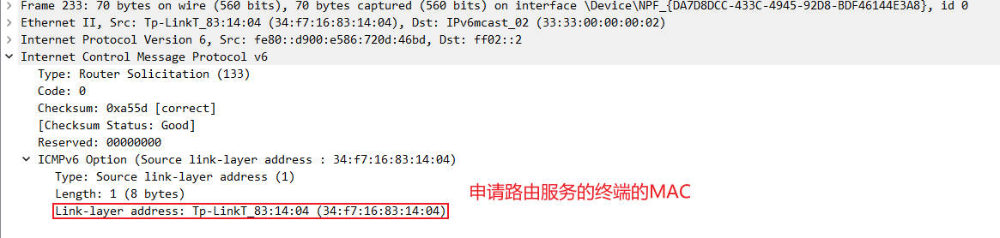

### RA
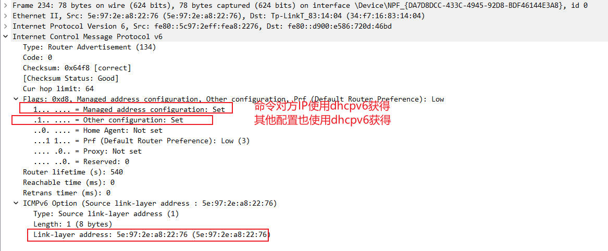

## NS NA
### 用ICMPv6实现地址解析的原理
#### NS
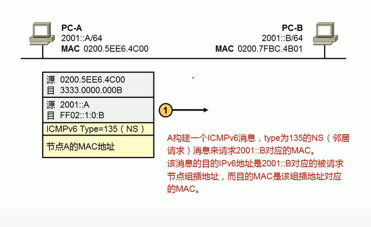

PC-A只知道PC-B的IP，需要解析其MAC，

使用 NS 组播完成解析，

NS的目的IP为组播地址，目的MAC也为组播地址，都是使用 PC-B 的IP后一段位数据组合固定前缀生成。

PC-B的IPv6地址决定了L2层L3层会接受对应的组播包。

#### NA
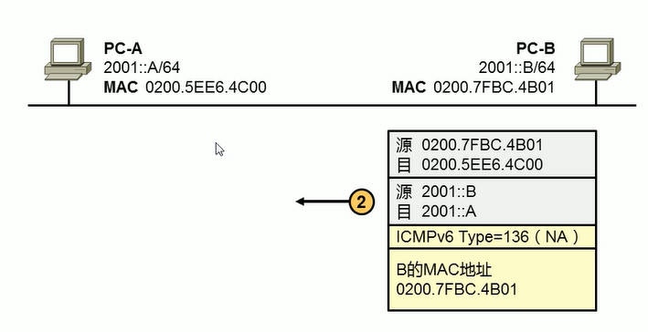

PC-B接受到NS组播后，会回复 NA 单播，其中携带了自己了 MAC

### 抓包

#### NS
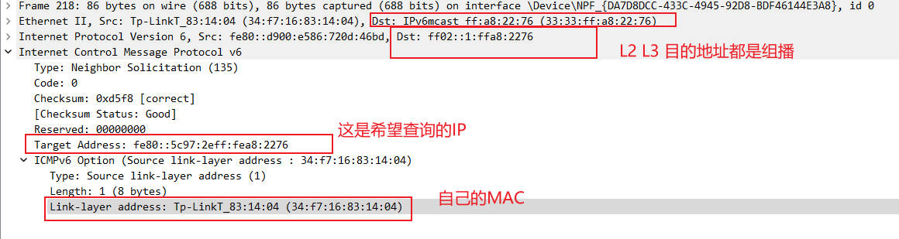

#### NA
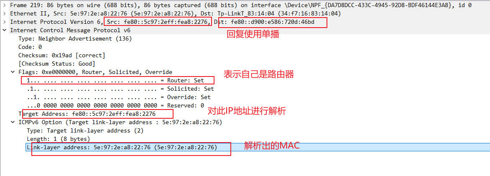

# IPv6分配地址

- 无状态
  - 主机发送RS (请求前缀信息)，路由器回复 RA(通告前缀信息)
  - 主机收到前缀信息后，根据前缀信息，生成自己的地址
  - 好处：不需要dhcpv6 服务器
  - 坏处：只能前缀信息，所以只能生成地址，没有DNS等信息，另外网络管理员无法知道主机和IP的关联
- EVI-64 
  - 链路自动生成的地址FE80:: 开头
- 手动
- DHCPv6
  - 也叫有状态, 即服务器会记录分配状态，并且有续期
  - 能自动配置IP和DNS等信息

## 无状态地址分配
1. PC根据本地接口ID生成IPv6地址，此地址仅用于本地链路通信。
2. PC针对该地址进行DAD检查，确保此地址没有冲突
3. PC发送RS报文，尝试发现链路上的路由器

PC （Link-Local = FF80::1002)
路由器 （Link-Local = FF80:1001)
       （IPv6-Address = 2001:DB8::1/64）

RS报文
FF80::1002 -> FF02::2
FF02::2 是组播,表示链路上所有主机和路由器

4. 路由器响应RA报文，该报文可以携带IPv6地址前缀，路由器在没有收到RS报文时，也可以主动发送RA报文

PC （Link-Local = FF80::1002)
路由器 （Link-Local = FF80:1001)
       （IPv6-Address = 2001:DB8::1/64）

RA报文
FF80:1001 -> FF02::1
(M=0, Prefix=2001:DB8::/64)

5. PC收到RA报文，使用IPv6地址前缀和本地链路地址，生成单播IPv6地址
6. PC针对单播IPv6地址进行DAD检查，确保此地址没有冲突

### M-bit O-bit
RS  RA都是基于ICMPv6协议

RA的flag字段有8bit，前两个bit为 M位和O位

- M位(manager) : 管理地址配置标志位
  - M-bit默认为0，表示终端设备使用无状态地址自动配置，也就是根据PD自动生成IPv6地址
  - M-bit设置为1，表示终端设备使用有状态地址配置，也就是dhcpv6方式获取地址
- O位(other) : 其他有状态配置标识
  - O-bit默认位0，使用除dhcpv6外其他方式设置除IPv6外的配置，如DNS
  - O-bit设置位1，标识终端设备使用dhcpv6的方式配置除了IPv6地址外的其他配置，如DNS

M-bit 和 O-bit的常见组合
M0 O0 : 使用无状态配置IPv6和其他配置
M0 O1 : 使用无状态配置IPv6，使用 dhcpv6配置DNS等
M1 O1 : 使用dhcpv6配置IPv6和DNS等

#### A-bit
RA的ICMPv6 option（prefix information)

- A位(auto addr-config) 终端设备是否能使用前缀进行地址自动生成
  - 0-bit 不能使用 
  - 1-bit 能

#### IPv6的地址的生存周期
RA中还有 vaild lifttime 和 preferred lifttime

vaild lifttime 是长于preferred lifttime

                    | ---------------------------- vaild lifttime ----------------|
  DAD               | -----preferred lifttime---------------|
| --- Tentative --->| ---- preferred ---------------------->| ---- deprecated --->| invailed --->

当终端获得IPv6地址后，会进行DAD检查，确保地址没有冲突后，整个 preferred lifttime 都是正常使用此IPv6地址，当 preferred lifttime 结束，

进入 deprecated期间，IPv6地址依旧可以使用，但不能使用改地址建立新的连接，vaild lifttime 结束，IPv6地址不能使用

## 有状态地址分配
### 协议

客户端发送和接受的端口 UDP 546
服务端发送和接受的端口 UDP 547

### 网络结构

客户端 - 服务器

客户端和服务器在同一个VLAN

客户端 - 中继 - 服务器

客户端和服务器在不同一个VLAN

### DUID

用于标识 服务器或客户端，通常用MAC地址加时间生成

当链路中有多个服务器时，客户端使用服务器的DUID选择使用哪个dhcp服务器。

服务器也使用客户端的DUID区分客户端，不是MAC地址

### 通信的整个流程

#### RS RA 确定使用有状态地址分配
PC发送ICMPv6 RS包，

路由器响应ICMPv6 RA包，M=1 O=1，表示客户端需要使用dhcpv6获得IPv6地址

#### dhcpv6 4阶段分配地址

1. dhcpv6 client发送 solicit 组播包，以发现链路上的dhcpv6服务器，solicit内容为 谁能为我提供 IPv6地址，DNS，Domain等信息
2. dhcpv6服务器收到 solicit后，发送 Adervertise 单播包，内容为我能为你提供如下信息，包括具体的IPv6, DNS, domain
3. client 可能收到多个dhcpv6服务器的 Adervertise 包，选择一个优先级高的报文，并回复 request单播包，内容为我希望用你提供的信息
4. dhcpv6服务器收到 request包，确认无误后，回复 reply包，内容为 你可以使用，同时记录 有一个客户端的DUID和对应的IPv6地址 

### 报文详解

#### 整个流程
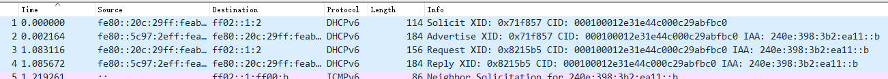

#### solicit
客户端发送组播，以发现能提供dhcpv6服务的对端
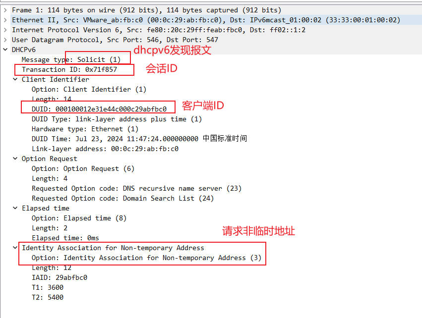

#### Adervertise
服务器回复单播，告知客户端自己能提供服务，并且可用的配置如下
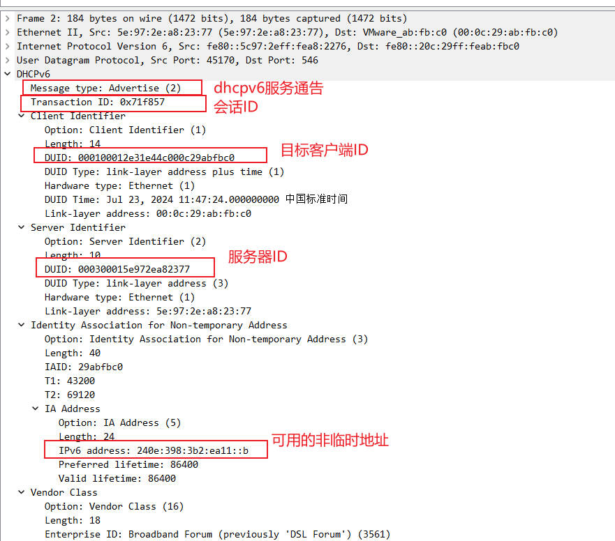

#### request
客户端此时可能收到了多组可用的配置，选择优先级高的，发送组播，告知某服务器，我要使用你的服务，同时通知其他服务器，我不使用你们的配置
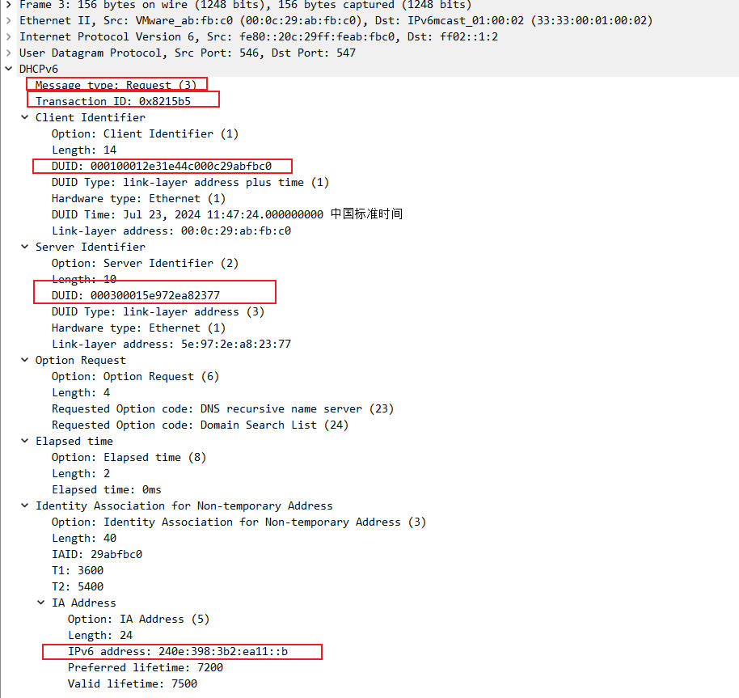

#### reply
服务器发送单播，告知客户端你可以使用我的服务，配置如下
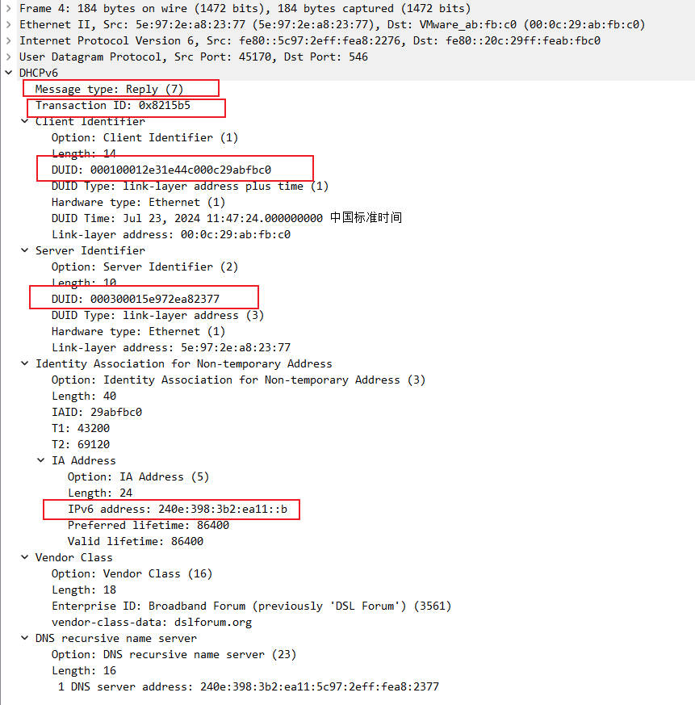

## dhcpv6无状态自动配置
RA 的 M = 0， O =1 ，
终端使用前缀自动配置IPv6，并使用 DPD 确保地址不重复，

终端使用 dhcpv6 配置 DNS, domain 等

### 通信流程

0. PC 自动生成仅在链路使用的链路地址
1. PC 发送RS 组播
2. 路由器回复 RA 单播，其中 M=0 O=1，并且带前缀
3. PC 根据前缀生成IPv6地址，并进行地址冲突检查
4. PC 发送 information-Request(dhcpv6) 以请求 dns domain
5. dhcp服务器回复 reply(dhcpv6) 携带 dns domain

## dhcpv6 中继

当 dhcpv6服务器 和 dhcpv6 客户端不在同一链路时，在两者中加中继器。

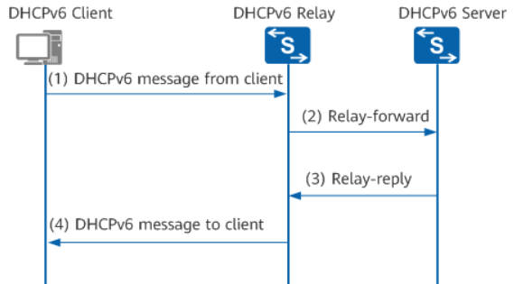

DHCPv6中继工作交互过程如下：

DHCPv6客户端向所有DHCPv6服务器和DHCPv6中继发送目的地址为FF02::1:2（组播地址）的请求报文。

根据DHCPv6中继转发报文有如下两种情况：

如果DHCPv6中继和DHCPv6客户端位于同一个链路上，即DHCPv6中继为DHCPv6客户端的第一跳中继，中继转发直接来自客户端的报文，

此时DHCPv6中继实质上也是客户端的IPv6网关设备。DHCPv6中继收到客户端的报文后，

将其封装在Relay-Forward报文的中继消息选项（Relay Message Option）中，并将Relay-Forward报文发送给DHCPv6服务器或下一跳中继。

如果DHCPv6中继和DHCPv6客户端不在同一个链路上，中继收到的报文是来自其他中继的Relay-Forward报文。

中继构造一个新的Relay-Forward报文，并将Relay-Forward报文发送给DHCPv6服务器或下一跳中继。

DHCPv6服务器从Relay-Forward报文中解析出DHCPv6客户端的请求，为DHCPv6客户端选取IPv6地址和其他配置参数，构造应答消息，

将应答消息封装在Relay-Reply报文的中继消息选项中，并将Relay-Reply报文发送给DHCPv6中继。

DHCPv6中继从Relay-Reply报文中解析出DHCPv6服务器的应答，转发给DHCPv6客户端。如果DHCPv6客户端接收到多个DHCPv6服务器的应答，

则根据报文中的服务器优先级选择一个DHCPv6服务器，后续从该DHCPv6服务器获取IPv6地址和其他网络配置参数。

