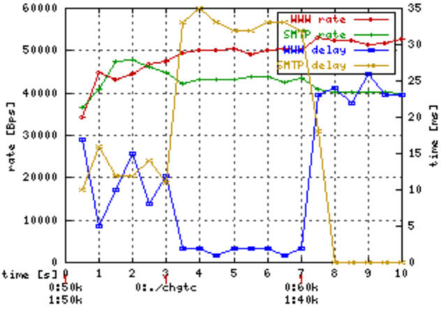

# man
HTB(8)                                                                     Linux                                                                     HTB(8)

NAME
       HTB - Hierarchy Token Bucket

SYNOPSIS
       tc qdisc ... dev dev ( parent classid | root) [ handle major: ] htb [ default minor-id ] [ r2q divisor ] [ offload ]

       tc class ... dev dev parent major:[minor] [ classid major:minor ] htb rate rate [ ceil rate ] burst bytes [ cburst bytes ] [ prio priority ] [ quan‐
       tum bytes ]

DESCRIPTION
	HTB（Hierarchical Token Bucket）旨在作为 Linux 中 CBQ（Class-Based Queueing）qdisc 的更易理解和直观的替代品。CBQ 和 HTB 都帮助你控制给定链路上的出站带宽的使用。它们都允许你使用一个物理链路来模拟多个较慢的链路，并在不同的模拟链路上发送不同类型的流量。在两种情况下，你需要指定如何将物理链路分割为模拟链路，并决定对于要发送的特定数据包使用哪个模拟链路。
	与 CBQ 不同，HTB 根据令牌桶过滤器（Token Bucket Filter）算法来塑形流量，该算法不依赖于接口特性，因此不需要知道出站接口的底层带宽。

SHAPING ALGORITHM
       Shaping works as documented in tc-tbf (8).

CLASSIFICATION
	在一个 HTB 实例中可以存在多个类（class）。每个类包含另一个 qdisc，默认为 tc-pfifo(8)。

	当将数据包加入队列时，HTB 从根节点开始，并使用各种方法确定应该接收数据的类。

	在没有不常见的配置选项的情况下，这个过程相当简单。在每个节点上，我们寻找一个指令，然后转到指令所指向的类。如果找到的类是一个没有子节点的叶节点，我们将数据包加入该节点的队列。如果它还不是叶节点，我们从该节点重新开始整个过程。

	在访问每个节点时，按照以下顺序执行以下操作，直到其中一个将我们发送到另一个节点或终止该过程：

	(i)    查看附加到该类的过滤器。如果发送到叶节点，则完成。否则，重新开始。

	(ii)   如果上述操作都没有返回指令，则将数据包加入当前节点的队列。

	这个算法确保数据包始终会被发送到某个位置，即使在构建配置过程中也是如此。

LINK SHARING ALGORITHM
       FIXME

CLASSES
	类（class）有许多参数可以配置它们的操作。

	parent major:minor
	该类在层次结构中的位置。如果直接连接到 qdisc 而不是另一个类，则可以省略次要号码。这是必需的。

	classid major:minor
	与 qdisc 一样，类也可以被命名。主要号码必须与其所属的 qdisc 的主要号码相同。这是可选的，但如果这个类将有子类，则需要。

	prio priority
	在循环调度过程中，优先级字段最低的类首先尝试处理数据包。

	rate rate
	该类及其所有子类的最大保证速率。这是必需的。

	ceil rate
	如果该类的父类有多余的带宽，该类可以发送的最大速率。默认值为配置的速率，这意味着不进行借用。

	burst bytes
	以超过配置速率的 ceil 速度可以突发的字节数量。应至少与所有子类的最高突发值一样高。

	cburst bytes
	以“无限”速度可以突发的字节数量，换句话说，与接口可以传输的速度一样快。为了完全均衡，应该至多等于一个平均数据包的大小。应至少与所有子类的最高 cburst 值一样高。

	quantum bytes
	在调度器转到下一个类之前，从该类中提供的字节数量。默认值为速率除以 qdisc 的 r2q 参数。如果指定了该值，则忽略 r2q 参数。

		在 `tc` 命令中，`rate` 和 `ceil rate` 参数用于限制类（class）及其子类的传输速率，它们之间的区别在于如下：

		- `rate` 参数指定了类及其子类的最大保证速率。这是一个强制性的参数，表示类可以以指定的速率发送数据。超过这个速率的数据将被限制。

		- `ceil rate` 参数表示在父类有可用带宽的情况下，类可以发送的最大速率。它是一个可选参数，默认值为配置的速率（即 `rate` 参数）。当父类有剩余带宽时，类可以以 `ceil rate` 参数指定的速率发送数据。如果父类的带宽已经被其他类使用完，则类将被限制在 `rate` 参数指定的速率。

		换句话说，`rate` 是类的保证速率，而 `ceil rate` 是类的最大速率（在父类有可用带宽时）。当带宽有限时，类将按照 `rate` 参数限制的速率发送数据，而当带宽充足时，类可以以 `ceil rate` 参数指定的速率发送数据。

SEE ALSO
       tc(8)

       HTB website: http://luxik.cdi.cz/~devik/qos/htb/

# 官网介绍
问题：我们有两个客户，A 和 B，它们都通过 eth0 连接到互联网。我们希望将 60 kbps 的带宽分配给 B，将 40 kbps 的带宽分配给 A。接下来，我们希望将 A 的带宽细分为 30kbps 用于 WWW，10kbps 用于其他所有内容。任何未使用的带宽可以按照分配的份额比例被其他需要的类别使用。

HTB 确保每个类别提供的服务量至少是其请求量和分配给它的量之间的最小值。当某个类别请求的量少于分配的量时，剩余的（超额的）带宽将分配给其他请求服务的类别。

还可以参考关于 HTB 内部工作原理的文档，该文档更详细地描述了上述目标。

注意：在文献中，这被称为“借用”超额带宽。为了与文献一致，我们在下文中使用这个术语。然而，需要提到的是，这似乎是一个不好的术语，因为没有义务偿还被“借用”的资源。


上述不同类型的流量在 HTB 中通过类别（classes）表示。最简单的方法如右图所示。
让我们看看如何使用命令：

```shell
tc qdisc add dev eth0 root handle 1: htb default 12
```

这个命令将 HTB 队列规则（queue discipline）附加到 eth0，并给它一个叫做 "handle" 的标识符，即 1:。这只是一个名称或标识符，下面可以用它来引用。default 12 表示如果流量没有被其他分类规则匹配到，将被分配到类别 1:12。

注意：一般情况下（不仅仅适用于 HTB，而是适用于 tc 中的所有队列规则和类别），标识符（handles）的格式为 x:y，其中 x 是用于标识队列规则的整数，y 是属于该队列规则的类别的整数标识符。队列规则的标识符的 y 值必须为零，而类别的标识符的 y 值必须为非零值。上面的 "1:" 被视为 "1:0"。

```shell
tc class add dev eth0 parent 1: classid 1:1 htb rate 100kbps ceil 100kbps
tc class add dev eth0 parent 1:1 classid 1:10 htb rate 30kbps ceil 100kbps
tc class add dev eth0 parent 1:1 classid 1:11 htb rate 10kbps ceil 100kbps
tc class add dev eth0 parent 1:1 classid 1:12 htb rate 60kbps ceil 100kbps
```

第一行创建了一个 "root" 类别，即位于队列规则 1: 下的类别 1:1。根类别的定义是将 htb 队列规则作为其父类别。根类别和其他在 htb 队列规则下的类别一样，允许其子类别相互借用带宽，但一个根类别不能从另一个根类别中借用带宽。我们也可以直接在 htb 队列规则下创建其他三个类别，但那样的话，一个类别的多余带宽将无法提供给其他类别使用。在这种情况下，我们确实希望允许借用，所以我们必须创建一个额外的类别作为根类别，并将承载实际数据的类别放在其中。下面的三行定义了这些类别。ceil 参数的含义将在下文中描述。


注意：有时人们问我为什么他们在使用 handle 或 parent 时还需要重复指定 dev eth0。原因是标识符（handles）是特定于接口的，例如，eth0 和 eth1 可以各自具有 handle 为 1:1 的类别。

我们还需要描述哪些数据包属于哪个类别。这实际上与 HTB 队列规则无关。有关详细信息，请参阅 tc filter 的文档。命令的格式将类似于以下示例：

```shell
tc filter add dev eth0 protocol ip parent 1:0 prio 1 u32 \
match ip src 1.2.3.4 match ip dport 80 0xffff flowid 1:10
tc filter add dev eth0 protocol ip parent 1:0 prio 1 u32 \
match ip src 1.2.3.4 flowid 1:11
```
（我们通过 IP 地址来识别 A，这里假设为 1.2.3.4。）
注意：U32 分类器存在一个未记录的设计缺陷，当使用具有不同 prio 值的 U32 分类器时，"tc filter show" 命令会列出重复的条目。

您可能会注意到我们并没有为 1:12 类别创建过滤器。这样做可能更清晰，但这展示了使用默认设置的情况。任何未被上述两个规则分类的数据包（即不来自源地址 1.2.3.4 的任何数据包）将被放入类别 1:12。

现在，我们可以选择性地将排队规则（queuing disciplines）附加到叶子类别上。如果没有指定排队规则，则默认使用 pfifo。

```shell
tc qdisc add dev eth0 parent 1:10 handle 20: pfifo limit 5
tc qdisc add dev eth0 parent 1:11 handle 30: pfifo limit 5
tc qdisc add dev eth0 parent 1:12 handle 40: sfq perturb 10
```

这些就是我们需要的所有命令。现在让我们看看如果我们以90kbps的速率发送每个类别的数据包，然后逐个停止发送某个类别的数据包时会发生什么。图表底部的注释中包含类似于 "0:90k" 的标记。标签中心的水平位置（在此示例中靠近数字 9，还用红色的 "1" 标记）表示某个流量类别的速率发生变化的时间。冒号前面是类别的标识符（0 表示类别 1:10，1 表示类别 1:11，2 表示类别 1:12），冒号后面是从注释出现的时间开始的新速率。例如，类别 0 的速率在时间 0 改变为 90k，在时间 3 改变为 0k，在时间 6 再次改变为 90k。
最初，所有类别生成的速率都是 90kbps。由于这高于指定的任何速率，因此每个类别都被限制在其指定的速率上。在时间 3，当我们停止发送类别 0 的数据包时，分配给类别 0 的速率按比例重新分配给其他两个类别，类别 1 分配 1 部分，类别 2 分配 6 部分（类别 1 的增加很难看到，因为只有 4 kbps）。类似地，在时间 9，当类别 1 的流量停止时，带宽被重新分配给其他两个类别（类别 0 的增加也同样难以看到）。在时间 15，我们可以更清楚地看到分配给类别 2 的带宽被分为 3 部分给类别 0，1 部分给类别 1。在时间 18，类别 1 和类别 2 都停止，所以类别 0 获得了它所请求的全部 90 kbps。


如果 A 和 B 不是不同的客户，这可能是一个不错的解决方案。然而，如果 A 支付的是 40kbps 的费用，那么他可能更希望他未使用的 WWW 带宽用于他自己的其他服务，而不是给 B。HTB 中的类别层次结构可以表示这个要求。


在这张图片中，使用类层次结构解决了前一章节中提到的问题。现在，客户A通过自己的类进行明确表示。回顾前面提到的，每个类所提供的服务量至少是其请求量和分配给它的量中的最小值。这适用于不是其他htb类的父类的htb类，我们称之为叶子类。对于其他htb类的父类，我们称之为内部类，规则是其服务量至少是分配给它的量和其子类请求量之和的最小值。在这种情况下，我们将40kbps分配给客户A。这意味着如果A请求的速率低于WWW的分配速率，多余的带宽将用于A的其他流量（如果有需求），至少直到总和达到40kbps。

注：数据包分类规则也可以分配给内部节点。然后，您必须将其他过滤器列表附加到内部节点。最后，您应该到达叶子节点或特殊的1:0类。父节点的速率应该是其子节点速率的总和。

现在的命令如下：
```shell
tc class add dev eth0 parent 1: classid 1:1 htb rate 100kbps ceil 100kbps
tc class add dev eth0 parent 1:1 classid 1:2 htb rate 40kbps ceil 100kbps
tc class add dev eth0 parent 1:2 classid 1:10 htb rate 30kbps ceil 100kbps
tc class add dev eth0 parent 1:2 classid 1:11 htb rate 10kbps ceil 100kbps
tc class add dev eth0 parent 1:1 classid 1:12 htb rate 60kbps ceil 100kbps
```

现在我们转向显示层次解决方案结果的图表。当A的WWW流量停止时，其分配的带宽将重新分配给A的其他流量，以便A的总带宽仍为分配的40kbps。
如果A的总请求量少于40kbps，多余的带宽将分配给B。


### ceil
ceil参数指定了一个类可以使用的最大带宽。这限制了该类可以借用的带宽量。默认的ceil值与rate值相同。（这就是为什么我们在上面的示例中必须指定它来展示借用的原因。）现在，我们将前一章中类1:2（A）和1:11（A的其他）的ceil从100kbps更改为60kbps和20kbps。

右侧的图表与之前的图表在时间3（WWW流量停止时）有所不同，因为A/other的带宽被限制为20kbps。因此，客户A总共只获得20kbps，多余的20kbps分配给了B。

第二个不同之处出现在时间15，当B停止时。在没有ceil的情况下，所有的带宽都被分配给了A，但现在A只被允许使用60kbps，所以剩下的40kbps没有被使用。

这个功能对于互联网服务提供商(ISP)来说应该是有用的，因为他们可能希望在其他客户没有请求服务时限制某个客户获得的服务量。（ISP可能希望客户支付更多的费用以获得更好的服务。）请注意，根类是不允许借用的，因此为它们指定ceil没有实际意义。

注意：一个类的ceil应该始终至少与其rate一样高。此外，一个类的ceil应该始终至少与其子类中任何一个的ceil一样高。

### burst
网络硬件一次只能发送一个数据包，并且只能以硬件相关的速率发送。链路共享软件利用这种能力来近似多个以不同（较低）速度运行的链路的效果。因此，速率和ceil并不是真正的瞬时度量，而是在发送多个数据包所需的时间内的平均值。实际上，一个类的流量会以最大速度一次发送几个数据包，然后为其他类提供服务一段时间。burst和cburst参数控制在不尝试为另一个类提供服务的情况下，可以以最大（硬件）速度发送的数据量。

如果cburst较小（理想情况下为一个数据包大小），它将调整突发以不超过ceil速率，就像TBF的peakrate一样。

当您将父类的burst设置为小于某个子类的burst时，您应该预期父类有时会出现堵塞（因为子类会消耗超过父类处理能力的数据）。HTB将在1分钟内记住这些负突发。

您可能会问为什么我要使用突发。嗯，这是一种廉价且简单的方式，可以改善拥塞链路上的响应时间。例如，WWW流量是突发性的。您请求页面，以突发方式获取它，然后阅读它。在这段空闲期间，突发将再次“充电”。

## 优先考虑带宽份额
优先处理流量有两个方面。首先，它影响超额带宽在同级之间的分配方式。到目前为止，我们已经看到超额带宽是根据速率比例进行分配的。现在，我使用第3章的基本配置（没有ceil和burst的层次结构），将所有类别的优先级设置为1，除了SMTP（绿色）类别，我将其设置为0（更高优先级）。

从共享的角度来看，您可以看到该类别获得了所有的超额带宽。规则是优先级较高的类别首先获得超额带宽。但是，对于保证速率和ceil的规则仍然得到满足。

问题的第二个方面是数据包的总延迟。在以太网上很难测量延迟，因为它太快了（延迟可以忽略不计）。但是有一个简单的方法可以帮助我们。我们可以添加一个简单的HTB，将其类别的速率限制在100kbps以下，并将第二个HTB（我们要测量的）作为子类别添加进去。然后，我们可以模拟延迟较大的较慢链路。

为了简单起见，我使用了一个简单的两个类别的场景：

```shell
# qdisc for delay simulation
tc qdisc add dev eth0 root handle 100: htb
tc class add dev eth0 parent 100: classid 100:1 htb rate 90kbps

# real measured qdisc
tc qdisc add dev eth0 parent 100:1 handle 1: htb
AC="tc class add dev eth0 parent"
$AC 1: classid 1:1 htb rate 100kbps
$AC 1:2 classid 1:10 htb rate 50kbps ceil 100kbps prio 1
$AC 1:2 classid 1:11 htb rate 50kbps ceil 100kbps prio 1
tc qdisc add dev eth0 parent 1:10 handle 20: pfifo limit 2
tc qdisc add dev eth0 parent 1:11 handle 21: pfifo limit 2
```

注意：一个HTB作为另一个HTB的子类别，并不等同于在同一个HTB中的另一个类别下。这是因为当HTB中的类别可以发送时，它将尽快发送，只受硬件设备的限制，而不受祖先的限制。

在HTB下的HTB情况下，外部HTB模拟了具有所有后果的新硬件设备（更大的延迟）。

模拟器设置为为两个类别生成50kbps的速率，并在3秒时执行以下命令：
```shell
tc class change dev eth0 parent 1:2 classid 1:10 htb \
 rate 50kbps ceil 100kbps burst 2k prio 0
```
正如您所看到的，WWW类别的延迟几乎降低到零，而SMTP的延迟增加。当您优先考虑延迟时，其他类别的延迟会变得更差。



稍后（时间为7秒），模拟器开始以60kbps的速率生成WWW流量，以40kbps的速率生成SMTP流量。在那里，您可以观察到下一个有趣的行为。当类别超出限制（WWW）时，HTB首先优先考虑低于限制的部分带宽。

应该优先考虑哪个类别？通常情况下，应该优先考虑那些真正需要低延迟的类别。例如，视频或音频流量（您需要正确设置速率以防止流量占用其他流量）或交互式（telnet、SSH）流量，其具有突发性质并且不会对其他流量产生负面影响。

常见的技巧是优先处理ICMP流量，以获得良好的ping延迟，即使在完全利用的链路上也是如此（但从技术角度来看，这并不是在测量连通性时所期望的）。

## 搞懂统计
The tc工具允许您在Linux中收集队列调度的统计信息。不幸的是，作者没有对统计结果进行解释，因此您经常无法使用它们。在这里，我将尝试帮助您理解HTB的统计数据。

首先是整个HTB的统计信息。下面的片段是从第3章的模拟中提取的。

```shell
# tc -s -d qdisc show dev eth0
 qdisc pfifo 22: limit 5p
 Sent 0 bytes 0 pkts (dropped 0, overlimits 0)

 qdisc pfifo 21: limit 5p
 Sent 2891500 bytes 5783 pkts (dropped 820, overlimits 0)

 qdisc pfifo 20: limit 5p
 Sent 1760000 bytes 3520 pkts (dropped 3320, overlimits 0)

 qdisc htb 1: r2q 10 default 1 direct_packets_stat 0
 Sent 4651500 bytes 9303 pkts (dropped 4140, overlimits 34251)
```
首先，头三个disicplines是HTB的子级。让我们忽略它们，因为PFIFO的统计数据是很容易理解的。
overlimits告诉您disicpline延迟了多少次数据包。direct_packets_stat告诉您有多少数据包通过直接队列发送。其他统计数据是很容易理解的。让我们来看一下类的统计数据：

```shell
tc -s -d class show dev eth0
class htb 1:1 root prio 0 rate 800Kbit ceil 800Kbit burst 2Kb/8 mpu 0b
    cburst 2Kb/8 mpu 0b quantum 10240 level 3
 Sent 5914000 bytes 11828 pkts (dropped 0, overlimits 0)
 rate 70196bps 141pps
 lended: 6872 borrowed: 0 giants: 0

class htb 1:2 parent 1:1 prio 0 rate 320Kbit ceil 4000Kbit burst 2Kb/8 mpu 0b
    cburst 2Kb/8 mpu 0b quantum 4096 level 2
 Sent 5914000 bytes 11828 pkts (dropped 0, overlimits 0)
 rate 70196bps 141pps
 lended: 1017 borrowed: 6872 giants: 0

class htb 1:10 parent 1:2 leaf 20: prio 1 rate 224Kbit ceil 800Kbit burst 2Kb/8 mpu 0b
    cburst 2Kb/8 mpu 0b quantum 2867 level 0
 Sent 2269000 bytes 4538 pkts (dropped 4400, overlimits 36358)
 rate 14635bps 29pps
 lended: 2939 borrowed: 1599 giants: 0
```
我删除了1:11和1:12类以缩短输出。正如您所看到的，有一些我们设置的参数。还有level和DRR quantum的信息。
overlimits显示了类被要求发送数据包的次数，但由于速率/上限的限制，它无法发送（目前仅计算叶子节点）。
rate和pps告诉您通过该类的实际速率（10秒平均）。这与门控使用的速率相同。
lended是该类捐赠的数据包数量（从其速率中），borrowed是我们从父级借用的数据包数量。捐赠总是在类级别上计算，而借用是传递的（当1:10从1:2借用，而1:2又从1:1借用时，1:10和1:2的借用计数器都会增加）。
giants是大于tc命令中设置的mtu的数据包数量。HTB将处理这些数据包，但速率将不准确。请将mtu添加到您的tc命令中（默认为1600字节）。

