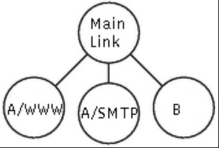

# man
HTB(8)                                                                     Linux                                                                     HTB(8)

NAME
   HTB - Hierarchy Token Bucket

## SYNOPSIS
tc qdisc ... dev dev ( parent classid | root) [ handle major: ] htb [ default minor-id ] [ r2q divisor ] [ offload ]

tc class ... dev dev parent major:[minor] [ classid major:minor ] htb rate rate [ ceil rate ] burst bytes [ cburst bytes ] [ prio priority ] [ quan‐
tum bytes ]

## DESCRIPTION
HTB（Hierarchical Token Bucket）旨在作为 Linux 中 CBQ（Class-Based Queueing）qdisc 的更易理解和直观的替代品。CBQ 和 HTB 都帮助你控制给定链路上的出站带宽的使用。它们都允许你使用一个物理链路来模拟多个较慢的链路，并在不同的模拟链路上发送不同类型的流量。在两种情况下，你需要指定如何将物理链路分割为模拟链路，并决定对于要发送的特定数据包使用哪个模拟链路。
与 CBQ 不同，HTB 根据令牌桶过滤器（Token Bucket Filter）算法来塑形流量，该算法不依赖于接口特性，因此不需要知道出站接口的底层带宽。

## SHAPING ALGORITHM
Shaping works as documented in tc-tbf (8).

## CLASSIFICATION
在一个 HTB 实例中可以存在多个类（class）。每个类包含另一个 qdisc，默认为 tc-pfifo(8)。

当将数据包加入队列时，HTB 从根节点开始，并使用各种方法确定应该接收数据的类。

在没有不常见的配置选项的情况下，这个过程相当简单。在每个节点上，我们寻找一个指令，然后转到指令所指向的类。如果找到的类是一个没有子节点的叶节点，我们将数据包加入该节点的队列。如果它还不是叶节点，我们从该节点重新开始整个过程。

在访问每个节点时，按照以下顺序执行以下操作，直到其中一个将我们发送到另一个节点或终止该过程：

(i)    查看附加到该类的过滤器。如果发送到叶节点，则完成。否则，重新开始。

(ii)   如果上述操作都没有返回指令，则将数据包加入当前节点的队列。

这个算法确保数据包始终会被发送到某个位置，即使在构建配置过程中也是如此。

## CLASSES
类（class）有许多参数可以配置它们的操作。

parent major:minor
该类在层次结构中的位置。如果直接连接到 qdisc 而不是另一个类，则可以省略次要号码。这是必需的。

classid major:minor
与 qdisc 一样，类也可以被命名。主要号码必须与其所属的 qdisc 的主要号码相同。这是可选的，但如果这个类将有子类，则需要。

prio priority
在循环调度过程中，优先级字段最低的类首先尝试处理数据包。

rate rate
该类及其所有子类的最大保证速率。这是必需的。

ceil rate
如果该类的父类有多余的带宽，该类可以发送的最大速率。默认值为配置的速率，这意味着不进行借用。

burst bytes
以超过配置速率的 ceil 速度可以突发的字节数量。应至少与所有子类的最高突发值一样高。

cburst bytes
以“无限”速度可以突发的字节数量，换句话说，与接口可以传输的速度一样快。为了完全均衡，应该至多等于一个平均数据包的大小。应至少与所有子类的最高 cburst 值一样高。

quantum bytes
在调度器转到下一个类之前，从该类中提供的字节数量。默认值为速率除以 qdisc 的 r2q 参数。如果指定了该值，则忽略 r2q 参数。

在 `tc` 命令中，`rate` 和 `ceil rate` 参数用于限制类（class）及其子类的传输速率，它们之间的区别在于如下：

- `rate` 参数指定了类及其子类的最大保证速率。这是一个强制性的参数，表示类可以以指定的速率发送数据。超过这个速率的数据将被限制。

- `ceil rate` 参数表示在父类有可用带宽的情况下，类可以发送的最大速率。它是一个可选参数，默认值为配置的速率（即 `rate` 参数）。当父类有剩余带宽时，类可以以 `ceil rate` 参数指定的速率发送数据。如果父类的带宽已经被其他类使用完，则类将被限制在 `rate` 参数指定的速率。

换句话说，`rate` 是类的保证速率，而 `ceil rate` 是类的最大速率（在父类有可用带宽时）。当带宽有限时，类将按照 `rate` 参数限制的速率发送数据，而当带宽充足时，类可以以 `ceil rate` 参数指定的速率发送数据。


# 官网介绍
HTB website: http://luxik.cdi.cz/~devik/qos/htb/

## 问题描述
问题：我们有两个客户，A 和 B，它们都通过 eth0 连接到互联网。我们希望将 60 kbps 的带宽分配给 B，将 40 kbps 的带宽分配给 A。接下来，我们希望将 A 的带宽细分为 30kbps 用于 WWW，10kbps 用于其他所有内容。任何未使用的带宽可以按照分配的份额比例被其他需要的类别使用。

HTB 确保每个类别提供的服务量至少是其请求量和分配给它的量之间的最小值。当某个类别请求的量少于分配的量时，剩余的（超额的）带宽将分配给其他请求服务的类别。

还可以参考关于 HTB 内部工作原理的文档，该文档更详细地描述了上述目标。

注意：在文献中，这被称为“借用”超额带宽。为了与文献一致，我们在下文中使用这个术语。然而，需要提到的是，这似乎是一个不好的术语，因为没有义务偿还被“借用”的资源。



## 方案一
上述不同类型的流量在 HTB 中通过类别（classes）表示。最简单的方法如右图所示。
让我们看看如何使用命令：

```shell
tc qdisc add dev eth0 root handle 1: htb default 12
```

这个命令将 HTB 队列规则（queue discipline）附加到 eth0，并给它一个叫做 "handle" 的标识符，即 1:。这只是一个名称或标识符，下面可以用它来引用。default 12 表示如果流量没有被其他分类规则匹配到，将被分配到类别 1:12。

注意：一般情况下（不仅仅适用于 HTB，而是适用于 tc 中的所有队列规则和类别），标识符（handles）的格式为 x:y，其中 x 是用于标识队列规则的整数，y 是属于该队列规则的类别的整数标识符。队列规则的标识符的 y 值必须为零，而类别的标识符的 y 值必须为非零值。上面的 "1:" 被视为 "1:0"。

```shell
tc class add dev eth0 parent 1: classid 1:1 htb rate 100kbps ceil 100kbps
tc class add dev eth0 parent 1:1 classid 1:10 htb rate 30kbps ceil 100kbps
tc class add dev eth0 parent 1:1 classid 1:11 htb rate 10kbps ceil 100kbps
tc class add dev eth0 parent 1:1 classid 1:12 htb rate 60kbps ceil 100kbps
```

第一行创建了一个 "root" 类别，即位于队列规则 1: 下的类别 1:1。根类别的定义是将 htb 队列规则作为其父类别。根类别和其他在 htb 队列规则下的类别一样，允许其子类别相互借用带宽，但一个根类别不能从另一个根类别中借用带宽。我们也可以直接在 htb 队列规则下创建其他三个类别，但那样的话，一个类别的多余带宽将无法提供给其他类别使用。在这种情况下，我们确实希望允许借用，所以我们必须创建一个额外的类别作为根类别，并将承载实际数据的类别放在其中。下面的三行定义了这些类别。ceil 参数的含义将在下文中描述。


注意：有时人们问我为什么他们在使用 handle 或 parent 时还需要重复指定 dev eth0。原因是标识符（handles）是特定于接口的，例如，eth0 和 eth1 可以各自具有 handle 为 1:1 的类别。

我们还需要描述哪些数据包属于哪个类别。这实际上与 HTB 队列规则无关。有关详细信息，请参阅 tc filter 的文档。命令的格式将类似于以下示例：

```shell
tc filter add dev eth0 protocol ip parent 1:0 prio 1 u32 \
match ip src 1.2.3.4 match ip dport 80 0xffff flowid 1:10
tc filter add dev eth0 protocol ip parent 1:0 prio 1 u32 \
match ip src 1.2.3.4 flowid 1:11
```
（我们通过 IP 地址来识别 A，这里假设为 1.2.3.4。）
注意：U32 分类器存在一个未记录的设计缺陷，当使用具有不同 prio 值的 U32 分类器时，"tc filter show" 命令会列出重复的条目。

您可能会注意到我们并没有为 1:12 类别创建过滤器。这样做可能更清晰，但这展示了使用默认设置的情况。任何未被上述两个规则分类的数据包（即不来自源地址 1.2.3.4 的任何数据包）将被放入类别 1:12。

现在，我们可以选择性地将排队规则（queuing disciplines）附加到叶子类别上。如果没有指定排队规则，则默认使用 pfifo。

```shell
tc qdisc add dev eth0 parent 1:10 handle 20: pfifo limit 5
tc qdisc add dev eth0 parent 1:11 handle 30: pfifo limit 5
tc qdisc add dev eth0 parent 1:12 handle 40: sfq perturb 10
```


从图中可以看出当A的WWW或 SNMP 没有使用时，剩余的流量被A和B按照比例分得


### htb详细分析
内核调用root qdisc enter queue: 
数据包首先被加入到根qdisc，然后根据filter规则被转发到相应的class，最后被加入到相应的qdisc。
如果没有设置filter和default，则无法确定数据包的走向，可能导致数据包丢弃。
如上面情况，1:0 有filter和default，首先按照filter的优先级和顺序依次调用filter节点处理pkt，如果匹配则将pkt转发到目标class，如果都不匹配则使用default，由于 classs htb只有一个子节点，直接转发到叶子qdisc，加入队列

内核调用root qdisc out queue:
root qdisc没有数据包，所以他会遍历树，从叶子节点获得数据包，根据class的优先级，
他先从20:0叶子节点取pkt，取出的数据包会经过class 1:10，class 1:10是htb 需要消耗token才能网上传递，并且 class 1:1也需要消耗token，最终传递给 root qdisc，root qdisc 返回给内核。
当20:0  30:0 40:0 的pkt都满时，20:0的token被消耗完，再消耗30:0，最后消耗40:0

当一个class的token被消耗完，但其父class（在这个例子中是1:1）还有剩余token时，子class可以向父class借用token。这是HTB的借用机制。
然而，这种借用是有条件的。首先，父class必须有剩余的token才能被借用。其次，子class的数据包必须在队列中等待发送.
否能成功借用，以及借用多少，还取决于HTB的配置。例如，每个class都可以设置一个ceil参数，这个参数定义了这个class可以借用到的最大带宽。
如果ceil参数设置得过低，那么即使父class有剩余的token，子class也可能无法借用到足够的token。

如当20:0  30:0 满时，1:10 1:11的 token消耗完，但是1:1的token还没有消耗完，所以按照借给 1:10 1:11

## 方案二

如果 A 和 B 不是不同的客户，这可能是一个不错的解决方案。然而，如果 A 支付的是 40kbps 的费用，那么他可能更希望他未使用的 WWW 带宽用于他自己的其他服务，而不是给 B。HTB 中的类别层次结构可以表示这个要求。


在这张图片中，使用类层次结构解决了前一章节中提到的问题。现在，客户A通过自己的类进行明确表示。回顾前面提到的，每个类所提供的服务量至少是其请求量和分配给它的量中的最小值。这适用于不是其他htb类的父类的htb类，我们称之为叶子类。对于其他htb类的父类，我们称之为内部类，规则是其服务量至少是分配给它的量和其子类请求量之和的最小值。在这种情况下，我们将40kbps分配给客户A。这意味着如果A请求的速率低于WWW的分配速率，多余的带宽将用于A的其他流量（如果有需求），至少直到总和达到40kbps。

注：数据包分类规则也可以分配给内部节点。然后，您必须将其他过滤器列表附加到内部节点。最后，您应该到达叶子节点或特殊的1:0类。父节点的速率应该是其子节点速率的总和。

现在的命令如下：
```shell
tc class add dev eth0 parent 1: classid 1:1 htb rate 100kbps ceil 100kbps
tc class add dev eth0 parent 1:1 classid 1:2 htb rate 40kbps ceil 100kbps
tc class add dev eth0 parent 1:2 classid 1:10 htb rate 30kbps ceil 100kbps
tc class add dev eth0 parent 1:2 classid 1:11 htb rate 10kbps ceil 100kbps
tc class add dev eth0 parent 1:1 classid 1:12 htb rate 60kbps ceil 100kbps
```


现在我们转向显示层次解决方案结果的图表。当A的WWW流量停止时，其分配的带宽将重新分配给A的其他流量，以便A的总带宽仍为分配的40kbps。
如果A的总请求量少于40kbps，多余的带宽将分配给B。


### ceil
ceil：这是一个class可以借用到的最大带宽。如果一个class的token被消耗完，但它的父class还有剩余的token，那么这个class可以尝试向父class借用token。然而，借用的带宽不能超过ceil参数设定的值。ceil参数的默认值是class的最大带宽（也就是rate参数设定的值）。如果没有显式设定ceil参数，那么它的值就等于rate参数的值。

### burst
token的缓存，当没有消耗token时，生成的token会缓存到token bucket，当消耗token时，先消耗 token bucket的token，若消耗完了，则只有期望token 的生成速度和pkt的消耗速度一样了

burst 可以改善拥塞链路上的响应时间。例如，WWW流量是突发性的。您请求页面，以突发方式获取它，然后阅读它。在这段空闲期间，突发将再次“充电”。

### prio
使用 prio 参数来设置一个类（class）的优先级。prio 值越小，优先级越高。这意味着在借用带宽时，具有较低 prio 值的类将优先获取带宽。
```shell
# 设置 1:10  的优先级最高，则当借用带宽时能最先得到token
tc class add dev eth0 parent 1:2 classid 1:10 htb rate 30kbps ceil 100kbps prio 0
```

## 搞懂统计
The tc工具允许您在Linux中收集队列调度的统计信息。不幸的是，作者没有对统计结果进行解释，因此您经常无法使用它们。在这里，我将尝试帮助您理解HTB的统计数据。

首先是整个HTB的统计信息。下面的片段是从第3章的模拟中提取的。

```shell
# tc -s -d qdisc show dev eth0
 qdisc pfifo 22: limit 5p
 Sent 0 bytes 0 pkts (dropped 0, overlimits 0)

 qdisc pfifo 21: limit 5p
 Sent 2891500 bytes 5783 pkts (dropped 820, overlimits 0)

 qdisc pfifo 20: limit 5p
 Sent 1760000 bytes 3520 pkts (dropped 3320, overlimits 0)

 qdisc htb 1: r2q 10 default 1 direct_packets_stat 0
 Sent 4651500 bytes 9303 pkts (dropped 4140, overlimits 34251)
```
overlimits告诉您disicpline延迟了多少次数据包。
direct_packets_stat告诉您有多少数据包通过直接队列发送。

```shell
tc -s -d class show dev eth0
class htb 1:1 root prio 0 rate 800Kbit ceil 800Kbit burst 2Kb/8 mpu 0b
    cburst 2Kb/8 mpu 0b quantum 10240 level 3
 Sent 5914000 bytes 11828 pkts (dropped 0, overlimits 0)
 rate 70196bps 141pps
 lended: 6872 borrowed: 0 giants: 0

class htb 1:2 parent 1:1 prio 0 rate 320Kbit ceil 4000Kbit burst 2Kb/8 mpu 0b
    cburst 2Kb/8 mpu 0b quantum 4096 level 2
 Sent 5914000 bytes 11828 pkts (dropped 0, overlimits 0)
 rate 70196bps 141pps
 lended: 1017 borrowed: 6872 giants: 0

class htb 1:10 parent 1:2 leaf 20: prio 1 rate 224Kbit ceil 800Kbit burst 2Kb/8 mpu 0b
    cburst 2Kb/8 mpu 0b quantum 2867 level 0
 Sent 2269000 bytes 4538 pkts (dropped 4400, overlimits 36358)
 rate 14635bps 29pps
 lended: 2939 borrowed: 1599 giants: 0
```
overlimits显示了类被要求发送数据包的次数，但由于速率/上限的限制，它无法发送（目前仅计算叶子节点）。
rate和pps告诉您通过该类的实际速率（10秒平均）。这与门控使用的速率相同。
lended是该类捐赠的数据包数量（从其速率中），borrowed是我们从父级借用的数据包数量。捐赠总是在类级别上计算，而借用是传递的（当1:10从1:2借用，而1:2又从1:1借用时，1:10和1:2的借用计数器都会增加）。
giants是大于tc命令中设置的mtu的数据包数量。HTB将处理这些数据包，但速率将不准确。请将mtu添加到您的tc命令中（默认为1600字节）。


# 补充
## r2q
r2q 是 tc-htb 中的一个参数，用于设置 HTB 类别中的 rate 和 quantum 之间的比率。

HTB 使用令牌桶来限制数据包的发送速率，并使用量子（quantum）来确定每个类别或流量类的最大传输单元。

r2q 参数定义了 rate 和 quantum 之间的比率。rate 表示类别或流量类的速率，而 quantum 表示每个数据包的最大传输单元大小。r2q 的默认值为 10，它表示 rate 和 quantum 之间的比率为 10:1。换句话说，每个数据包的大小是 rate 的 1/10。

通过调整 r2q 参数，可以改变 rate 和 quantum 之间的比率，从而影响数据包的大小。较小的 r2q 值会导致较大的数据包，而较大的 r2q 值会导致较小的数据包。

需要注意的是，r2q 参数的值应该根据具体的网络需求进行调整。较小的 r2q 值可能会增加网络开销和延迟，而较大的 r2q 值可能会导致较小的数据包无法充分利用网络带宽。因此，在配置 tc-htb 时，需要综合考虑网络环境和性能需求来选择合适的 r2q 值。
