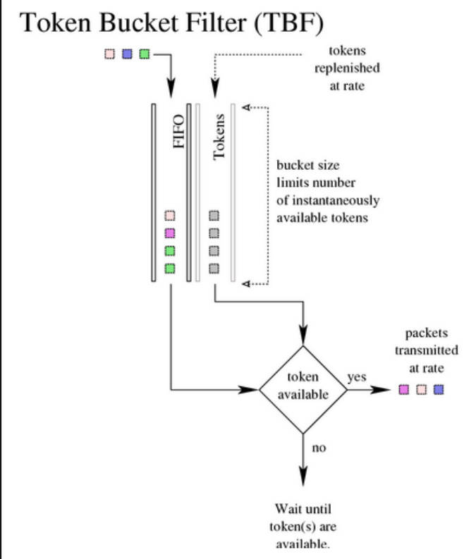
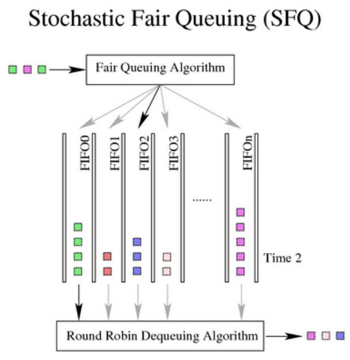
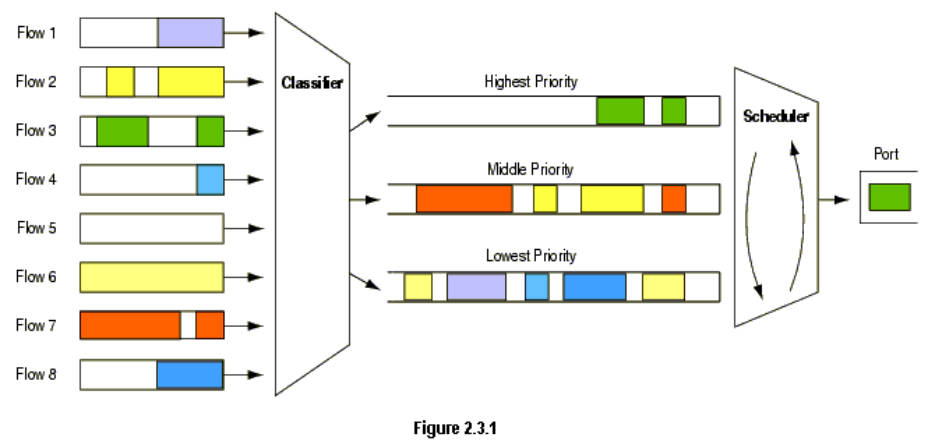
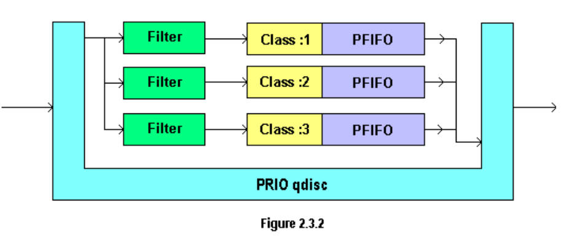
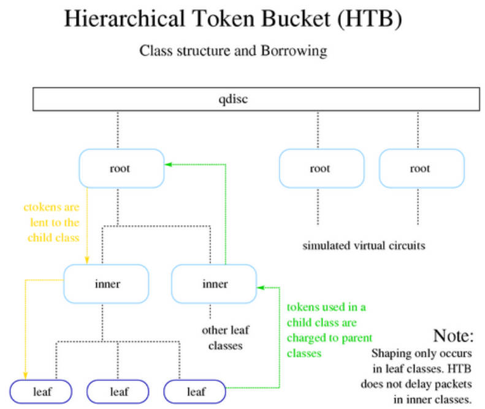

# 基本介绍

# 无类型排队规则
不分类（或称无类别）排队规则（classless queueing disciplines）可以对某个网络 接口（interface）上的所有流量进行无差别整形。包括对数据进行：
* 重新调度（reschedule）
* 增加延迟（delay）
* 丢弃（drop）

## pfifo_fast 

pfifo_fast 和 prio 不要搞混了，pfifo_fast是无class的，意味着pfifo_fast通常做叶子节点。
pfifo_fast 通常是设备默认的 qdisc，比如下面
```shell
/root # ./tc qdisc show dev eth0
qdisc pfifo_fast 0: root refcnt 2 bands 3 priomap 1 2 2 2 1 2 0 0 1 1 1 1 1 1 1 1
/root # ./tc class show dev eth0
```
### priomap
```shell
/root # ./tc qdisc show dev eth0
qdisc pfifo_fast 0: root refcnt 2 bands 3 priomap 1 2 2 2 1 2 0 0 1 1 1 1 1 1 1 1
```
band : 他有三个通道，当band0有数据时，先发送完band0的数据包，然后在发送完band1的数据包，最后发送完band2的数据包
priomap : 当数据包加入pfifo_fast时，应该加入哪个band呢？根据数据包的tos 和 priomap 得到他应该加入的band


### tos
怎么根据tos 和 priomap 得到数据包的优先级序号呢？
数据包的tos字段一共4bit，能表示16
tcpdump -vv 可以显示包的tos
```
    0     1     2     3     4     5     6     7
 +-----+-----+-----+-----+-----+-----+-----+-----+
 |                 |                       |     |
 |   PRECEDENCE    |          TOS          | MBZ |
 |                 |                       |     |
 +-----+-----+-----+-----+-----+-----+-----+-----+

 Binary Decimcal  Meaning
 -----------------------------------------
 1000   8         Minimize delay (md)
 0100   4         Maximize throughput (mt)
 0010   2         Maximize reliability (mr)
 0001   1         Minimize monetary cost (mmc)
 0000   0         Normal Service
```

priomap 数组的索引号就和 tos 的值一一对应，所以根据tos就可以知道数据包应该加入哪个band
```
/root # ./tc qdisc show dev eth0
qdisc prio 1: root refcnt 2 bands 3 priomap 1 2 2 2 1 2 0 0 1 1 1 1 1 1 1 1

 TOS     Bits  Means                    Linux Priority    Band
 ------------------------------------------------------------
 0x0     0     Normal Service           0 Best Effort     1
 0x2     1     Minimize Monetary Cost   1 Filler          2
 0x4     2     Maximize Reliability     0 Best Effort     2
 0x6     3     mmc+mr                   0 Best Effort     2
 0x8     4     Maximize Throughput      2 Bulk            1
 0xa     5     mmc+mt                   2 Bulk            2
 0xc     6     mr+mt                    2 Bulk            0
 0xe     7     mmc+mr+mt                2 Bulk            0
 0x10    8     Minimize Delay           6 Interactive     1
 0x12    9     mmc+md                   6 Interactive     1
 0x14    10    mr+md                    6 Interactive     1
 0x16    11    mmc+mr+md                6 Interactive     1
 0x18    12    mt+md                    4 Int. Bulk       1
 0x1a    13    mmc+mt+md                4 Int. Bulk       1
 0x1c    14    mr+mt+md                 4 Int. Bulk       1
 0x1e    15    mmc+mr+mt+md             4 Int. Bulk       1
```

不同的协议，会设置不同的tos, 根据rfc获得
```
 TELNET                   1000           (minimize delay)
 FTP     Control          1000           (minimize delay)
         Data             0100           (maximize throughput)

 TFTP                     1000           (minimize delay)

 SMTP    Command phase    1000           (minimize delay)
         DATA phase       0100           (maximize throughput)

 DNS     UDP Query        1000           (minimize delay)
         TCP Query        0000
         Zone Transfer    0100           (maximize throughput)

 NNTP                     0001           (minimize monetary cost)

 ICMP    Errors           0000
         Requests         0000 (mostly)
         Responses        <same as request> (mostly)
```
## TBF (Token Bucket Filter，令牌桶过滤器)
TBF 是一个简单 qdisc，对于没有超过预设速率的流量直接透传，但也能容忍超过预 设速率的短时抖动（short bursts in excess of this rate）。 
TBF 非常简洁，既能提供可靠的网络限速，也对CPU消耗低
如果只是想实现接口限速，那 TBF 是第一选择。


Tokens生成器按照特定速率生成tokens，packet会消耗tokens，当tokens生成过快会缓存到 bucket ，所以有两个重要参数
* bucket buffer : 决定能缓存多少tokens
* tokens rate : 决定生成tokens的速度

当数据包到达时有三种情况：
1. 数据速率 == token 速率：每个包都能找到一个对应的token，然后直接从队列出去，没有延时（delay）。
2. 数据速率 < token 速率：正常到来的数据都能及时发送出去，然后删除一个 token。 由于 token 速率大于数据速率，会产生 bucket 积压，极端情况会将 bucket 占满。如果数据速率突然高于 token 速率，就可以消耗这些积压的 token 。因此积压的 token 有一个额外好处：能够容忍短时数据速率抖动（burst）。
3. 数据速率 > token 速率：token 很快就会用完，然后 TBF 会关闭（throttle ）一会。这种 情况称为 overlimit（超过限制）。如果包还是源源不断地到来，就会产生丢包。

利用第三种情况，可以实现限流

积压的 token 使得超过限速的短时抖动数据仍然能发送，不会丢包，但持续的 overload 会导致数据不断被 delay，然后被丢弃。

注意：在实际的实现中，token 是基于字节数，而不是包数。

### 参数和用法
* limit or latency
limit：因等待可用 token 而被放入队列的字节数。
latency：每个包在 TBF 中停留的最长时间。随后会基于 latency、bucket size、rate 和 peakrate（如果设置了）来计算 limit。

* burst/buffer/maxburst
bucket 的大小，单位是字节。这是累积可用的 token 所支持的最大字节数。总体来说，越大的整流速率（shaping rates）需要越大的缓冲区。要在 Intel 网卡 上实现 10Mbps 整流，你至少需要 10KB 缓冲区。
如果缓冲区太小，可能会丢包，因为 token 到来太快导致无法放入 bucket 中。

* mpu
“零长度”的包占用的并不是零带宽（A zero-sized packet does not use zero bandwidth）。例如对于以太网，任何一个包的字节数不会少于 64。 Minimum Packet Unit（最小包单元）决定了一个包所使用的最小 token 量（the minimal token usage for a packet）。

* rate
速度旋钮（speedknob）。
如果当前 bucket 中有 token，并且没有禁止 bucket 的 token 删除动作，那默认情况下 ，它会全速删除。如果不期望这种行为，那可以设置下面几个参数：

* peakrate
如前所述，默认情况下，包到了之后只要有 token 就会被立即发送。这可能不是你期 望的，尤其当 bucket 很大的时候。
peakrate 可指定 bucket 发送数据的最快速度。通常来说，这需要做的 就是：放行一个包 - 等待恰当的时长 - 放行下一个包。通过计算等待时长，最终实现 了 peakrate 效果。
但实际中，由于 Unix 默认的 10ms 定时器精读限制，如果平均每个包 10K bits ， 我们只能做到 1Mbps peakrate！（10Kb/10ms = 1000Kbps = 1Mbps，译注）。

* mtu/minburst
1Mbit/s 的 peakrate 通常并不是很有用，因为实际中的带宽要远大于此。实现更高 peakrate 的一种方式是：每个 timer tick 发送多个包，在效果上就好像我们创建 了第二个 bucket！
这第二个 bucket 默认只有一个包（defaults to a single packet），完全算不上一个 bucket。
计算最大可能的 peakrate 时，用 MTU 乘以 100（更准确地说，乘以 HZ 数，例如 Intel 上是 100，Alpha 上是 1024）。

### 示例
```shell
$ tc qdisc add dev ppp0 root tbf rate 220kbit latency 50ms burst 1540
```
使用 man tc-qdisc 可以查看更多参数
使用 man 8 tc 可以查看rate等参数的单位


## sfq
随机公平排队（SFQ）是公平排队算法族的一个简单实现。相比其他算法，SFQ 精准性要差 一些，但它所需的计算量也更少，而结果几乎是完全公平的（almost perfectly fair）。


SFQ 中的核心是 conversion（会话）或 flow（流），大部分情况下都对应一个 TCP session 或 UDP stream。每个 conversion 对应一个 FIFO queue，然后将流量分到不 同 queue。发送数据时，按照 round robin 方式，每个 session 轮流发送。

这种机制会产生非常公平的结果，不会因为单个 conversion 太大而把其他 conversion 的带宽都 挤占掉。SFQ 被称为“随机的”（stochastic）是因为它其实并没有为每个 session 分配一个 queue，而是用算法将流量哈希到了一组有限的 queue。

但这里会出现另一个问题：多个 session 会可能会哈希到同一个 bucket（哈希槽）， 进而导致每个 session 的 quota 变小，达不到预期的整流带宽（或速度）。为避免这个 问题过于明显，SFQ 会不断变换它使用的哈希算法，最终任何两个会话冲突的持续时间 都不会很长，只会有几秒钟。

SFQ 只有在实际出向带宽已经非常饱和的情况下才有效，这一点非常重要！否则， Linux 机器上就不存在 queue，因此也就没用效果。稍后会看到如何将 SFQ 与其他 qdisc 相结合来实现一般情况下的公平排队。

说的更明确一点：没用配套的整流配置的话，单纯在（连接 modem 的）以太网接口上配 置SFQ 是毫无意义的。

### 参数与用法
SFQ 大部分情况下默认参数就够了，

* perturb
每隔多少秒就重新配置哈希算法。如果这个参数没设，哈希算法就永远不会重新配置。 建议显式设置这个参数，不要为空。10s 可能是个不错的选择。

* quantum
在轮到下一个 queue 发送之前，当前 queue 允许出队（dequeue）的最大字节数。默认是 一个 MTU。不建议设置为小于 MTU 的值。

* limit
SFQ 能缓存的最大包数（超过这个阈值将导致丢包）。

### 示例
```shell
$ tc qdisc add dev ppp0 root sfq perturb 10

$ tc -s -d qdisc ls
qdisc sfq 800c: dev ppp0 quantum 1514b limit 128p flows 128/1024 perturb 10sec
 Sent 4812 bytes 62 pkts (dropped 0, overlimits 0)

# 800c:：自动分配的 handle number（句柄编号）
# limit 128p：最大缓存 128 个包
# flows 128/1024：这个 sfq 有 1024 个哈希槽（hash buckets），其中 128 个当前有 数据待发送。
# perturb 10sec：每隔 10s 换一次哈希算法。
```

## fq
tc-fq和tc-sfq都是Linux中的队列规则，用于网络流量调度和公平性管理。它们在实现公平性和拥塞控制方面有一些差异。

1. tc-fq（Fair Queueing）：

* tc-fq是一种公平队列规则，旨在提供公平的带宽分配和流量调度。
* 它使用虚拟时钟（Virtual Clock）算法对数据包进行排序和调度，以确保每个流量流（flow）都能够公平地共享网络带宽。
* tc-fq根据流量流的优先级和权重进行调度，较高优先级的流量流将获得更多的带宽份额。
* 它还具有拥塞控制机制，通过丢弃一部分数据包来减轻网络拥塞的影响。

2. tc-sfq（Stochastic Fairness Queueing）：

* tc-sfq也是一种公平队列规则，旨在提供公平的带宽分配和拥塞控制。
* 它使用随机算法对数据包进行排序和调度，以实现公平性。
* tc-sfq将数据包分配到不同的队列中，并使用随机算法从队列中选择数据包进行发送。
* 它也具有拥塞控制机制，通过丢弃一部分数据包来应对网络拥塞。
主要差异：

* 调度算法：tc-fq使用虚拟时钟算法，而tc-sfq使用随机算法。
* 数据包选择：tc-fq根据优先级和权重选择数据包，而tc-sfq使用随机选择。
* 具体实现：tc-fq是内核中的一个模块，而tc-sfq是tc命令的一个队列规则选项。
在实际应用中，你可以根据具体需求选择适合的队列规则类型。如果你需要更精细的带宽分配和调度控制，可以考虑使用tc-fq。如果你对带宽分配要求不那么严格，但仍需要公平性和拥塞控制，可以选择使用tc-sfq。


# 使用建议
总结起来，上面几种都是简单的 qdisc，通过重排序（reordering）、降速（slowing）或 丢包（dropping）来实现流量管理。

选择使用哪种 qdisc 时，下面几点可供参考。其中提到了几种在第 14 章才会介绍到的 qdisc。

* 单纯对出向流量限速（slow down outgoing traffic），推荐使用 TBF。如果是 针对大带宽进行限速，需要将 bucket 调大。
* 如果带宽已经打满，想确保带宽没有被任何单个 session 占据，推荐使用 SFQ。
* If you have a big backbone and know what you are doing, consider Random Early Drop (see Advanced chapter).
* 对（不再转发的）入向流量整形，使用 Ingress Policer。顺便说一句，入向整形称为 ‘policing’，而不是 ‘shaping’。
* 对需要本机转发的流量整形，
* 如果目的端是单个设备，那在目的端设备上使用 TBF。
* 如果目的端是多个设备（同一个入向设备分流到多个目的设备），使用 Ingress Policer。
* 如果你不需要整形，只是想看看网络接口（interface）是否过载（so loaded that it has to queue）， 使用 pfifo queue（注意不是 pfifo_fast）。pfifo 内部没有 bands，但会记录 backlog 的大小。
* 最后 —— 你还可以尝试“社会学整形”（”social shaping”）。有时候一些问题是无法单纯 用技术解决的。用户会对技术限制充满敌意。和气地对别人说几句好话，也许你需要的 带宽就解决了。

# 术语
* Scheduling（调度）
在分类器的协助下，一个 qdisc 可以判断某些包是不是要先于其他包发送出去，这 个过程称为调度，可以通过例如前面提到的 pfifo_fast qdisc 完成。调度也被 称为重排序（reordering），但后者容易引起混淆。

* Shaping（整形）
在包发送出去之前进行延迟处理，以达到预设的最大发送速率的过程。整形是在 egress 做的（前面提到了，ingress 方向的不叫 shaping，叫 policing，译者注）。 不严格地说，丢弃包来降低流量的过程有时也称为整形。

* Classifier（分类器）
每个 classful qdisc 需要判断每个包应该放到哪个 class。这是通过分类器完成的。

* Filter（过滤器）
分类过程（Classification）可以通过过滤器（filters）完成。过滤器包含许多的判 断条件，匹配到条件之后就算 filter 匹配成功了。

* Classes（类别）
每个 classful qdisc 可能会包含几个 class，这些都是 qdisc 内部可见的。对于每 个 class，也是可以再向其添加其他 class 的。因此，一个 class 的 parent 可以 是一个 qdisc，也可以是另一个 class。
Leaf class 是没有 child class 的 class。这种 class 中 attach 了一个 qdisc ，负责该 class 的数据发送。
创建一个 class 时会自动 attach 一个 fifo qdisc。而当向这个 class 添加 child class 时，这个 fifo qdisc 会被自动删除。对于 leaf class，可以用一个更合适的 qdisc 来替换掉这个fifo qdisc。你甚至能用一个 classful qdisc 来替换这个 fifo qdisc，这样就可以添加其他 class了。

* root qdisc（根排队规则）
attach 到网络设备的那个 qdisc。

* Classless qdisc（无类别排队规则）
不对数据包区分类别，使用统一的策略处理 

* Classful qdisc（有类别排队规则）
对数据包分类，不同类别使用不同qdisc
一个 classful qdisc 会包含多个类别（classes）。每个类别（class）可以进一步包 含其他 qdisc，可以是 classful qdisc，也可以是 classless qdisc。
严格按定义来说，pfifo_fast 属于有类别排队规则（classful），因为它内部包 含了三个 band，而这些 band 实际上是 class。但从用户配置的视角来说，它是 classless 的，因为这三个内部 class 用户是无法通过 tc 命令配置的。

```
                Userspace programs
                     ^
                     |
     +---------------+-----------------------------------------+
     |               Y                                         |
     |    -------> IP Stack                                    |
     |   |              |                                      |
     |   |              Y                                      |
     |   |              Y                                      |
     |   ^              |                                      |
     |   |  / ----------> Forwarding ->                        |
     |   ^ /                           |                       |
     |   |/                            Y                       |
     |   |                             |                       |
     |   ^                             Y          /-qdisc1-\   |
     |   |                            Egress     /--qdisc2--\  |
  --->->Ingress                       Classifier ---qdisc3---- | ->
     |   Qdisc                                   \__qdisc4__/  |
     |                                            \-qdiscN_/   |
     |                                                         |
     +----------------------------------------------------------+
```
上图中的框代表 Linux 内核。最左侧的箭头表示流量从外部网络进入主机。然后进入 Ingress Qdisc，这里会对包进行过滤（apply Filters），根据结果决定是否要丢弃这个 包。这个过程称为 “Policing”。这个过程发生在内核处理的很早阶段，在穿过大部 分内核基础设施之前。因此在这里丢弃包是很高效的，不会消耗大量 CPU。

如果判断允许这个包通过，那它的目的端可能是本机上的应用（local application），这 种情况下它会进入内核 IP 协议栈进行进一步处理，最后交给相应的用户态程序。另外，这 个包的目的地也可能是其他主机上的应用，这种情况下就需要通过这台机器 Egress Classifier 再发送出去。主机程序也可能会发送数据，这种情况下也会通过 Egress Classifier 发送。

Egress Classifier 中会用到很多 qdisc。默认情况下只有一个：pfifo_fast qdisc ，它永远会接收包，这称为“入队”（”enqueueing”）。

此时包位于 qdisc 中了，等待内核召唤，然后通过网络接口（network interface）发送出去。 这称为“出队”（”dequeueing”）。

以上画的是单网卡的情况。在多网卡的情况下，每个网卡都有自己的 ingress 和 egress hooks。

# 有类型的qdisc
## class qdisc 和 class 的 flow
当流量进入一个 classful qdisc 时，该 qdisc 需要将其发送到内部的某个 class —— 即 需要对这个包进行“分类”。而要这个判断过程，实际上是查询所谓的“过滤器”（ ‘filters’）。过滤器是在 qdisc 中被调用的，而不是其他地方，理解一点非常重要！

过滤器返回一个判决结果给 qdisc，qdisc 据此将包 enqueue 到合适的 class。 每个 subclass 可能会进一步执行其他 filters，以判断是否需要进一步处理。如果没有 其他过滤器，这个 class 将把包 enqueue 到它自带的 qdisc。

除了能包含其他 qdisc，大部分 classful qdisc 还会执行流量整形。这对包调 度（packet scheduling，例如，基于 SFQ）和速率控制（rate control）都非常有用。 当高速设备（例如，以太网）连接到一个低速设备（例如一个调制解调器）时，会用到这个 功能。

## qdisc 大家庭：roots, handles, siblings and parents
* 每个接口都有一个 egress "root qdisc"。默认情况下，这个 root qdisc 就是前面提到的 classless pfifo_fast qdisc。
回忆前面实体邮箱的类比。理论上 egress 流量是本机可控的，所以需要配备一个 qdisc 来提供这种控制能力。译注。

* 每个 qdisc 和 class 都会分配一个相应的 handle（句柄），可以指定 handle 对 qdisc 进行配置。

* 每个接口可能还会有一个 ingress qdisc，用来对入向流量执行策略（which polices traffic coming in）。
理论上 ingress 基本是不受本机控制的，主动权在外部，所以不一定会有 qdisc。译注。


### handle：
每个 handle 由两部分组成，<major>:<minor>。
按照惯例，root qdisc 的 handle 为 1:，这是 1:0 的简写。
每个 qdisc 的 minor number 永远是 0。

### class：
每个 class 的 major number 必须与其 parent 一致。
major number 在一个 egress 或 ingress 内必须唯一。
minor number 在一个 qdisc 或 class 内必须唯一。

### 如何用过滤器（filters ）对流量进行分类
一个典型的 handle 层级如下：
```
                     1:   root qdisc
                      |
                     1:1    child class
                   /  |  \
                  /   |   \
                 /    |    \
                 /    |    \
              1:10  1:11  1:12   child classes
               |      |     |
               |     11:    |    leaf class
               |            |
               10:         12:   qdisc
              /   \       /   \
           10:1  10:2   12:1  12:2   leaf classes
```
但不要被这棵树迷惑！不要以为内核位于树的顶点，网络位于下面。实际上这是一个递归规程，数据包的出入都通过root qdisc.
包只会通过 root qdisc 入队或出队（get enqueued and dequeued），这也是内核唯一与之交互的部分（

一个包可能会被链式地分类如下
```
1: -> 1:1 -> 1:12 -> 12: -> 12:2
```
最后到达 attach 到 class 12:2 的 qdisc 的队列。在这个例子中，树的每个“节点”（ node）上都 attach 了一个 filter，每个 filter 都会给出一个判断结果，根据判断结果 选择一个合适的分支将包发送过去。这是常规的流程。但下面这种流程也是有可能的：
```
1: -> 12:2
```
在这种情况下，attach 到 root qdisc 的 filter 决定直接将包发给 12:2。

### 包是如何从 qdisc 出队（dequeue）然后交给硬件的
当内核决定从 qdisc dequeue packet 交给接口（interface）发送时，它会

1. 向 root qdisc 1: 发送一个 dequeue request
2. 1: 会将这个请求依次转发给 1:1，后者会进一步向下传递，按照优先级依次转发给 10:、11:、12:
3. 每个 qdisc 会查询它们的 siblings，并尝试在上面执行 dequeue() 方法。

在这个例子中，需要遍历整棵树，因为只有 12:2 中有数据包。

如此子节点就会返回数据包给父节点，最终返回给根节点，根节点返回给内核

简单来说，嵌套类（nested classes）只会和它们的 parent qdiscs 通信，而永远不会直 接和接口交互。内核只会调用 root qdisc 的 dequeue() 方法！

最终结果是，classes dequeue 的速度永远不会超过它们的 parents 允许的速度。
而这正 是我们所期望的：这样就能在内层使用一个 SFQ 做纯调度，它不用做任何整形的工作 ；然后在外层使用一个整形 qdisc 专门负责整形。

## prio
PRIO qdisc 实际上不会整形行，只会根据设置的过滤器对流量分类。



可以将 PRIO qdisc 理解为 pfifo_fast qdisc 的升级版，它也有多个 band，但 每个 band 都是一个独立的 class，而不是简单的 FIFO。



当一个包 enqueue 到 PRIO qdisc 之后，它会根据设置的 filters 选择一个 class ，并将包送到这个 class。默认情况下会创建三个 class。每个 class 默认情况下都包含一 个纯 FIFO qdisc，没有其他内部结构，但你可以用其他类型的 qdisc 替换掉 FIFO。

当从 PRIO qdisc 取出（dequeue）一个包时，会先尝试 :1。只有 lower bands/classes 没有数据包可取时，才会尝试 higher classes。

如果想基于 tc filters 而不仅仅是 TOS flags 做流量优先级分类时，这个 qdisc 会非常 有用。还可以向这三个预置的 classes 添加额外的 qdisc，毕竟 pfifo_fast 只能提供简 单的 FIFO qdisc。

由于 PRIO 没有流量整形功能，因此针对 SFQ 的忠告也适用于这里：

* 如果你的物理链路已经打满了，可以用 PRIO qdisc （对流量进行分类），或者
* 在外层嵌套一个 classful qdisc，后者负责流量整形。

用正式的术语来说，PRIO qdisc 是一个 work-conserving 调度器

### 参数和用法
下面几个参数能被 tc 识别：

* bands
需要创建的 band 数量。这个每个 band 实际上都是一个 class。如果改变这个配置， 还需要同时修改 priomap 参数。

* priomap
如果没有提供 tc filters 来指导如何对流量分类，那 PRIO qdisc 将依据 TC_PRIO 优先级来决定优先级。这里的工作方式与 pfifo_fast qdisc 是类似的

PRIO qdisc 里面的 band 都是 class，默认情况下名字分别为 major:1、 major:2、 major:3， 因此如果你的 PRIO qdisc 是 12:，那 tc filter 送到 12:1 的流量就有更高的优先级。

重复一遍：band 0 对应的 minor number 是 1！ band 1 对应的 minor number 是 2 ，以此类推。

### 示例
我们将创建一棵如下所示的树：
```
          1:   root qdisc
         / | \
        /  |  \
       /   |   \
     1:1  1:2  1:3    classes
      |    |    |
     10:  20:  30:    qdiscs    qdiscs
     sfq  tbf  sfq
band  0    1    2
```
高吞吐流量（Bulk traffic）将送到 30:，交互式流量（interactive traffic）将送到 20: 或 10:。

```shell
$ tc qdisc add dev eth0 root handle 1: prio # This *instantly* creates classes 1:1, 1:2, 1:3

$ tc qdisc add dev eth0 parent 1:1 handle 10: sfq
$ tc qdisc add dev eth0 parent 1:2 handle 20: tbf rate 20kbit buffer 1600 limit 3000
$ tc qdisc add dev eth0 parent 1:3 handle 30: sfq

/root # ./tc class show dev eth0
class prio 1:1 parent 1:
class prio 1:2 parent 1:
class prio 1:3 parent 1:

$ tc -s qdisc ls dev eth0
qdisc sfq 30: quantum 1514b
 Sent 0 bytes 0 pkts (dropped 0, overlimits 0)

 qdisc tbf 20: rate 20Kbit burst 1599b lat 667.6ms
 Sent 0 bytes 0 pkts (dropped 0, overlimits 0)

 qdisc sfq 10: quantum 1514b
 Sent 132 bytes 2 pkts (dropped 0, overlimits 0)

 qdisc prio 1: bands 3 priomap  1 2 2 2 1 2 0 0 1 1 1 1 1 1 1 1
 Sent 174 bytes 3 pkts (dropped 0, overlimits 0)
```

## CBQ
除了是 classful qdisc 之外，CBQ 还是一个整流器（shaper），作为一个整流器来说， 其实它工作地并不是非常理想。理想的工作方式应该是这样的：如果想将一个 10Mbps 的连 接整形为 1Mbps，那这条链路应该有 90% 的时间是空闲的。否则，我们就需要 throttle 来确保链路 90% 的时间是空闲的。

但空闲时间是很难测量的，CBQ 的方式是：用硬件层连续两次请求数据的时间间隔（ 毫秒）来推算。这可以用来近似估计链路的空闲状态（how full or empty the link is）。

这种测量方式是非常间接的，因此结果并不总是很准确。例如，接口的物理带宽是 100Mbps ，但它可能永远打不到 100Mbps，而原因可能是网卡驱动写的太烂。另一个例子，PCMCIA 网 卡永远打不到 100Mbps，这是由于其总线设计导致的 —— 因此，又回到那个问题：应该 如何计算空闲时间？

当考虑到非纯物理网络设备（not-quite-real network devices）时，例如 PPP over Ethernet 或 PPTP over TCP/IP，情况会更加糟糕。在这些场景中，有效带 宽可能是由到用户空间的管道（pipe）效率决定的 —— 这个值可能很高。

CBQ 的工作原理是：在发送包之前等待足够长的时间，以将带宽控制到期望 的阈值。为实现这个目标，它需要计算包之间的等待间隔。


### 示例
```
               1:           root qdisc
               |
              1:1           child class
             /   \
            /     \
          1:3     1:4       leaf classes
           |       |
          30:     40:       qdiscs
         (sfq)   (sfq)
```

这个例子将
* webserver 限制为5Mbps。
* SMTP 流量限制到 3Mbps。
* webserver + SMTP 总共不超过6Mbps。
* 物理网卡是 100Mbps。
* 每个 class 之间可以互借带宽。

```shell
$ tc qdisc add dev eth0 root handle 1:0 cbq bandwidth 100Mbit         \
  avpkt 1000 cell 8
$ tc class add dev eth0 parent 1:0 classid 1:1 cbq bandwidth 100Mbit  \
  rate 6Mbit weight 0.6Mbit prio 8 allot 1514 cell 8 maxburst 20      \
  avpkt 1000 bounded
```
上面两条命令创建了 root qdisc 和相应的 1:1 class。这个 1:1 class 是 bounded 类型，因此总带宽不会超过设置的 6Mbps 限制。如前所述，CBQ 需要很多 速度选项（knobs，旋钮式开关）。但用到的参数前面都介绍过了。如果 HTB 来实现这个 功能，就会简单很多。

```shell
$ tc class add dev eth0 parent 1:1 classid 1:3 cbq bandwidth 100Mbit  \
  rate 5Mbit weight 0.5Mbit prio 5 allot 1514 cell 8 maxburst 20      \
  avpkt 1000
$ tc class add dev eth0 parent 1:1 classid 1:4 cbq bandwidth 100Mbit  \
  rate 3Mbit weight 0.3Mbit prio 5 allot 1514 cell 8 maxburst 20      \
  avpkt 1000
```
上面两个创建的是叶子节点（leaf classes）。注意其中是如何配置速率的。两个 class 都没有配置 bounded 参数，但它们都连着到了 1:1 class，后者是有限速不超 过6Mbps 的。因此这两个 leaf class 的总带宽不会超过 6Mbps。另外需要注意， classid 中的 major number 必须要和 parent qdisc 中的 major number 一样！
```shell
$ tc qdisc add dev eth0 parent 1:3 handle 30: sfq
$ tc qdisc add dev eth0 parent 1:4 handle 40: sfq
```
每个 class 默认都有一个 FIFO qdisc。但我们将其替换成了 SFQ 这样每条 flow 都能被 独立、平等对待了。
```shell
$ tc filter add dev eth0 parent 1:0 protocol ip prio 1 u32 match ip \
  sport 80 0xffff flowid 1:3
$ tc filter add dev eth0 parent 1:0 protocol ip prio 1 u32 match ip \
  sport 25 0xffff flowid 1:4
```
这些过滤规则直接作用在 root qdisc 上，作用是将流量分类到下面正确的 qdisc。

注意其中是先用 tc class add 命令往 qdisc 内添加 class，然后又用 tc qdisc add命令向 class 内添加 qdisc。

你可能会好奇：没有匹配到以上两条规则的流量怎么办？在本例中，它们会进入 1:0 接受处理，而这里是没有限速的。

如果 SMTP+web 的总带宽超过 6Mbps，那总带宽将根据给定的权重参数分为两部分， 5/8 给 webserver，3/8 给邮件服务。也可以说，在这个配置下，webserver 流量在 任何时候至少能获得 5/8 * 6Mbps = 3.75Mbps 带宽。

## HTB
Martin Devera (devik) 意识到 CBQ 太复杂了，并且没有针对很多典型的场景进 行优化。因此他设计了 HTB，这种层级化的方式对下面这些场景很适用：

* 有一个固定总带宽，想将其分割成几个部分，分别用作不同目的
* 每个部分的带宽是有保证的（guaranteed bandwidth）
* 还可以指定每个部分向其他部分借带宽



HTB 的工作方式与 CBQ 类似，但不是借助于计算空闲时间（idle time）来实现整形

### 示例
功能几乎与 前面的 CBQ 示例配置 一样的 HTB 配置：
```shell
$ tc qdisc add dev eth0 root handle 1: htb default 30

$ tc class add dev eth0 parent 1: classid 1:1 htb rate 6mbit burst 15k

$ tc class add dev eth0 parent 1:1 classid 1:10 htb rate 5mbit burst 15k
$ tc class add dev eth0 parent 1:1 classid 1:20 htb rate 3mbit ceil 6mbit burst 15k
$ tc class add dev eth0 parent 1:1 classid 1:30 htb rate 1kbit ceil 6mbit burst 15k
```
HTB 作者推荐在这些 class 内部使用 SFQ：
```shell
$ tc qdisc add dev eth0 parent 1:10 handle 10: sfq perturb 10
$ tc qdisc add dev eth0 parent 1:20 handle 20: sfq perturb 10
$ tc qdisc add dev eth0 parent 1:30 handle 30: sfq perturb 10
```
最后，将流量导向这些 class 的过滤器（filters）：
```shell
$ U32="tc filter add dev eth0 protocol ip parent 1:0 prio 1 u32"
$ $U32 match ip dport 80 0xffff flowid 1:10
$ $U32 match ip sport 25 0xffff flowid 1:20
```

如果 10: 和 20: 都获得了保证的带宽（guaranteed bandwidth），并且总带宽中还有很多剩余，它们还可以 5:3 的比例借用额外带宽
未分类的流量（unclassified traffic）会进入 30:，这个 band 只有很小的带宽，但能 够从剩余的可用带宽中借带宽来用。
由于我们用了的 SFQ（随机公平调度），我们还获得了 公平调度而没有增加额外成本！

## fq_codel
这种 qdisc 组合了 FQ 和 ColDel AQM，使用一个随机模型（a stochastic model） 将入向包分为不同 flow，确保使用这个队列的所有 flow 公平分享总带宽。

每个 flow 由 CoDel 排队规则来管理，每个 flow 内不能重排序，因为 CoDel 内部使用了一个 FIFO 队列。

# 用过滤器对流量进行分类
每次要判断将包送到哪个 class 进行处理时，都会调用所谓的“classifier chain”（分类 器链）。这个 chain 由 attach 到 classful qdisc 的所有 filter 构成。

还是前面那个例子（包最终到 12:2）：
```
                    root 1:
                      |
                    _1:1_
                   /  |  \
                  /   |   \
                 /    |    \
               10:   11:   12:
              /   \       /   \
           10:1  10:2   12:1  12:2
```
当 enqueue 一个包时，在每一个分叉的地方都需要查询相关的过滤规则。

一种典型的配置是：

1. 在 1:1 配置一个 filter，将包送到 12:。
2. 在 12: 配置一个 filter，将包送到12:2。

另外一种配置：将两个 filters 都配置在 1:1，但将更精确的 filter 下放到更下面 的位置有助于提升性能。

需要注意的是，包是无法向上过滤的（filter a packet ‘upwards’）。 另外，使用 HTB 时，所有的 filters 必须 attach 到 root！

包只能向下 enqueue！当 dequeue 时，它们会重新上来，到达要发送它的网络接口。 包并不是一路向下，最后从叶子节点到达网卡的！

## 示例
正如在 Classifier 章节中介绍的，匹配语法非常复杂，但功能强大，可以对几乎任 何东西进行匹配。

这里先从简单的开始。假设有一个名为 10: 的 PRIO qdisc，其中包含了三个 class，我们想将所有端口 22 的流量都导向优先级最高的 band，那 filters 将如下：

```
$ tc filter add dev eth0 protocol ip parent 10: prio 1 u32 match \
  ip dport 22 0xffff flowid 10:1
$ tc filter add dev eth0 protocol ip parent 10: prio 1 u32 match \
  ip sport 80 0xffff flowid 10:1
$ tc filter add dev eth0 protocol ip parent 10: prio 2 flowid 10:2
```
这几行命令是什么意思？第一条命令：

1. tc filter add dev eth0：attach 到 eth0 设备。
2. parent 10:：父设备是 10:。
3. prio 1：优先级为 1（数字越小，优先级越高）。
4. u32 match ip dport 22 0xffff filter：精确匹配 dst port 22，并将匹配的包发送到 band 10:1。

第二条命令与第一条类似，不过匹配的源端口 80。第三条命令表示所有未匹配到上面的包 ，都发送到优先级次高的 band 10:2。

要精确匹配单个 IP 地址，使用下面的命令：
```shell
$ tc filter add dev eth0 parent 10:0 protocol ip prio 1 u32 \
  match ip dst 4.3.2.1/32 flowid 10:1
$ tc filter add dev eth0 parent 10:0 protocol ip prio 1 u32 \
  match ip src 1.2.3.4/32 flowid 10:1
$ tc filter add dev eth0 protocol ip parent 10: prio 2      \
  flowid 10:2
```
这会将 dst_ip=4.3.2.1 或 src_ip=1.2.3.4 的流量送到优先级最高的队列，其他流量 送到优先级次高的队列。

还可以将多个 match 级联起来，同时匹配源 IP 和 port：
```
$ tc filter add dev eth0 parent 10:0 protocol ip prio 1 u32 match ip src 4.3.2.1/32 \
  match ip sport 80 0xffff flowid 10:1
```

大部分整形的命令都会以这样的命令开头：
```shell
$ tc filter add dev eth0 parent 1:0 protocol ip prio 1 u32 ..
```
这种是所谓的 u32 匹配，特点是能匹配包的任何部分：

* 匹配源/目的 IP 地址

** match ip src 1.2.3.0/24
** match ip dst 4.3.2.0/24
** 匹配单个 IP：指定掩码 /32，或者直接省略掩码部分

* 匹配源/目的端口，任何 IP 协议
** match ip sport 80 0xffff
** match ip dport 80 0xffff
** 匹配 ip protocol（tcp, udp, icmp, gre, ipsec）
	使用 /etc/protocols 里面的协议号，例如，ICMP 是 1：match ip protocol 1 0xff。

* 匹配 fwmark
可以用 ipchains/iptables 等工具对包打标（mark），这些 mark 在不同接口 之间路由时是不会丢失的（survive routing across interfaces）。这非常有用，例 如，实现“只对从 eth0 进入 eth1 的流量进行整形”的功能。语法：
```shell
$ tc filter add dev eth1 protocol ip parent 1:0 prio 1 handle 6 fw flowid 1:1
```
注意这里用的已经不是 u32 匹配了！

对包打标（mark）：
```shell
  $ iptables -A PREROUTING -t mangle -i eth0 -j MARK --set-mark 6
```
上面的 6 只是本例随便设置的一个数字，可以是任意值。
如果不想理解完整的 tc filter 语法，那可以选择用 iptables 来打标，根据fwmark 完成分类功能。
iptables 还可以打印统计信息，有助于判断你设置的规则是否生效。下面的命令会打 印 mangle 表内所有的 mark 规则，已经每个规则已经匹配到多少包和字节数：
```shell
  $ iptables -L -t mangle -n -v
```
* 匹配 TOS 字段
选择交互式、最小延迟（interactive, minimum delay）流量：
```shell
  $ tc filter add dev ppp0 parent 1:0 protocol ip prio 10 u32 \
    match ip tos 0x10 0xff flowid 1:4
```
高吞吐流量（bulk traffic）对应的过滤条件是 0x08 0xff。

# IMQ
IMQ 并不是一种 qdisc，但其使用是与 qdisc 紧密关联的。

在 Linux 中，所有 qdisc都是 attach 到网络设备上的，所有 enqueue 到设备的东西都 是先 enqueue 到设备 qdisc 上。从概念上来说，这会存在两个限制：

1. 只有出方向（egress）能做整形：入方向的 qdisc 实际上也是有的，但与 classful qdiscs 相比，其发挥空间非常有限。
2. 任何一个 qdisc 只能看到一个接口（interface）的流量，没有全局限流功能（global limitations can’t be placed）。
IMQ 就是用来解决以上两点限制的。简单来说，你可以将选中的任何东西放到 qdisc 里面。打了标的包在经过 netfilter NF_IP_PRE_ROUTING 和 NF_IP_POST_ROUTING hook 点时会被捕获，送到 IMQ 设备上 attach 的 qdisc。

因此对外部进来的包先打上标记（mark），就能实现入向整型（ingress shaping）， ；将接口们作为 classes（treat interfaces as classes），就能设置全局限速。

你还可以做很多其他事情，例如将 http 流量放到一个 qdisc，将新连接请求放到另一个 qdisc，等等。

## 示例
首先能想到的例子就是用入向整形（ingress shaping）给自己一个受保证的高带宽 ;)

配置如下：

```shell
$ tc qdisc add dev imq0 root handle 1: htb default 20

$ tc class add dev imq0 parent 1: classid 1:1 htb rate 2mbit burst 15k

$ tc class add dev imq0 parent 1:1 classid 1:10 htb rate 1mbit
$ tc class add dev imq0 parent 1:1 classid 1:20 htb rate 1mbit

$ tc qdisc add dev imq0 parent 1:10 handle 10: pfifo
$ tc qdisc add dev imq0 parent 1:20 handle 20: sfq

$ tc filter add dev imq0 parent 10:0 protocol ip prio 1 u32 match \
  ip dst 10.0.0.230/32 flowid 1:10
```
这个例子用的是 u32 做分类，用其他分类器也行。

接下来，需要选中流量，给它们打上标记，以便能被正确送到 imq0 设备：
```shell
$ iptables -t mangle -A PREROUTING -i eth0 -j IMQ --todev 0

$ ip link set imq0 up
```
在 mangle 表内的 PREROUTING 和 POSTROUTING chain，IMQ 都是有效的 target。 语法：
```shell
IMQ [ --todev n ]	n : number of imq device
```
注意，流量并不是在命中 target 的时候放入 imq 队列的，而是在更后面一点（not enqueued when the target is hit but afterwards）。流量进入 imq 设备的精确位置与 流量方向（in/out）有关。下面这些是预定义的 netfilter hooks，iptables 会用到它们：
```shell
enum nf_ip_hook_priorities {
        NF_IP_PRI_FIRST = INT_MIN,
        NF_IP_PRI_CONNTRACK = -200,
        NF_IP_PRI_MANGLE = -150,
        NF_IP_PRI_NAT_DST = -100,
        NF_IP_PRI_FILTER = 0,
        NF_IP_PRI_NAT_SRC = 100,
        NF_IP_PRI_LAST = INT_MAX,
};
```
对于 ingress 流量，imq 会将自己注册为 NF_IP_PRI_MANGLE + 1 优先级，这意味包 经过 PREROUTING chain 之后就会直接进入 imq 设备后。
对于 egress 流量，imq 使用 NF_IP_PRI_LAST，which honours the fact that packets dropped by the filter table won’t occupy bandwidth.

# filter
过滤器用于把数据包分类并放入相应子节点

可用的分类器
fw 根据netfiler对数据包标记进行分类
u32 根据数据包各个字段进行匹配
route 根据数据包的路由项进行分类
...

通用参数
protocol 分类器接受的L3层协议，必要参数
parent 分类附着在哪个句柄上
prio 分类器的优先级。值越小优先级越高
handle 对于不同过滤器，意义不同


分类器 = 分类器描述 + 选择器 + 动作

分类器描述：
```shell
tc filter add dev IF [protocol PROTO]
                     [ (preference| priority) PRIO]
					 [ parent CBQ ]
```

选择器用于与IP包匹配，一旦成功匹配就执行指定动作，如将数据包发送到特定的类队列

## U32
U32选择器基于哈希实现，有稳定的性能。
定义了与数据包哪些字节进行匹配
```shell
tc filter add dev eth0 protocol ip parent 1:0 pref 1 u32 \
	match u32 00100000 00ff0000 at 0 flowid 1:10
```
第一行为分类器描述
u32 指定使用u32选择器
match u32 00100000 00ff0000 at 0 flowid 1:10 相当于下面的伪代码
```c
	char *p = ((char *)iphdr + 0); // at 0 从IP头偏移0字节
	u32 data = *(u32 *)p;          // u32 表示比较 32 bit长度的数据
	if ((data & 0x00ff0000) ^ 0x00100000  == 0) // u32 00100000 00ff0000 后面为掩码，前面为比较数字
		Forward_pkt(f_1_10);	   // 和目标值一样则转发给目标节点
```
所以将tos为 0x10的报文转发到 1:10


```shell
tc filter add dev eth0 protocol ip parent 1:0 pref 1 u32 \
	match u32 00000016 0000ffff at nexthdr+0 flowid 1:10
```
match u32 00000016 0000ffff at nexthdr+0 flowid 1:10
nexthdr+0 为L4层头偏移0字节
所以将目标端口为 0x0016的报文转发到 1:10


```shell
tc filter add dev eth0 protocol ip parent 1:0 pref 1 u32 \
	match u32 c0a80100 ffffff00 flowid 1:10
```
将目的IP为192.168.1.0/24的包转发到 1:10

### 通用比较器
```shell
match [u32 | u16 | u8] pattern mask [at offet | nexthdr+offet]
```

```shell
# 匹配TTL为64
# tc filter add dev ppp14 parent 1:0 prio 10 u32 \
 match u8 64 0xff at 8 \
 flowid 1:4
```
### 特殊比较器
```shell
 match ip protocol 
       ip tos
	   tcp dport
```

```shell
# 匹配带ACK位的TCP数据包
# tc filter add dev ppp14 parent 1:0 prio 10 u32 \
 match ip protocol 6 0xff \
 match u8 0x10 0xff at nexthdr+13 \
 flowid 1:3

## 比较小于64字节的ACK包
## match acks the hard way, 
## IP protocol 6, 
## IP header length 0x5(32 bit words), 
## IP Total length 0x34 (ACK + 12 bytes of TCP options) 
## TCP ack set (bit 5, offset 33) 
# tc filter add dev ppp14 parent 1:0 protocol ip prio 10 u32 \
 match ip protocol 6 0xff \
 match u8 0x05 0x0f at 0 \
 match u16 0x0000 0xffc0 at 2 \
 match u8 0x10 0xff at 33 \
 flowid 1:3

# tc filter add dev ppp0 parent 1:0 prio 10 u32 \
 match ip tos 0x10 0xff \
 flowid 1:4

# tc filter add dev ppp0 parent 1:0 prio 10 u32 \
 match tcp dport 53 0xffff \
 match ip protocol 0x6 0xff \
 flowid 1:2
```

## 路由分类器
```shell
# tc filter add dev eth1 parent 1:0 protocol ip prio 100 route
```
当数据包到达这个节点时，就会查询路由表，如果匹配就会被发送到给定的类

要最后完成，你还要添加一条适当的路由项
这里的窍门就是基于目的或者源地址来定义“realm”。像这样
```shell
# ip route add Host/Network via Gateway dev Device realm RealmNumber
# 例如，我们可以把目标网络 192.168.10.0 定义为 realm 10：
ip route add 192.168.10.0/24 via 192.168.10.1 dev eth1 realm 10
```
我们再使用路由过滤器的时候，就可以用 realm 号码来表示网络或者主机了，并
可以用来描述路由如何匹配过滤器：

```shell
tc filter add dev eth1 parent 1:0 protocol ip prio 100 \
 route to 10 classid 1:10
```
这个规则说：凡是去往 192.168.10.0 子网的数据包匹配到类 1:10

路由过滤器也可以用来匹配源策略路由。比如，一个 Linux 路由器的 eth2 上连接
了一个子网
```shell
ip route add 192.168.2.0/24 dev eth2 realm 2 
tc filter add dev eth1 parent 1:0 protocol ip prio 100 \
 route from 2 classid 1:2
```
这个规则说：凡是来自 192.168.2.0 子网(realm 2)的数据包，匹配到 1:2。

## 分类器和散列表
当你定义很多 filter时（比如你有很多QoS的客户机），你会发现内核花费大量时间用于匹配规则。
默认情况下，所有filter基于链表组织，链表按照Priority 排列。如果有1000个filter，可能要匹配1000次.

如果使用哈希，比如使用256 bucket的哈希，则没有bucket平均4个filter，则最多匹配4次。

比如你有1024个用户，他们被分配的IP范围是 1.2.0.0 - 1.2.3.255，你需要根据源IP将他们分到3个不同class 1:1 , 1:2, 1:3 ，则你可能需要写1024个规则，如
```shell
tc filter add dev eth1 parent 1:0 protocol ip prio 100 match ip src \
.2.0.0 classid 1:1
tc filter add dev eth1 parent 1:0 protocol ip prio 100 match ip src \
.2.0.1 classid 1:1
.
tc filter add dev eth1 parent 1:0 protocol ip prio 100 match ip src \
.2.3.254 classid 1:3
tc filter add dev eth1 parent 1:0 protocol ip prio 100 match ip src \
 1.2.3.255 classid 1:2
```
现在用散列表实现，使用IP地址后半部分作为散列因子，建立256个散列项。
```shell
tc filter add dev eth1 parent 1:0 protocol ip prio 100 match ip src \
.2.0.0 classid 1:1
tc filter add dev eth1 parent 1:0 protocol ip prio 100 match ip src \
.2.1.0 classid 1:1
tc filter add dev eth1 parent 1:0 protocol ip prio 100 match ip src \
.2.2.0 classid 1:3
tc filter add dev eth1 parent 1:0 protocol ip prio 100 match ip src \
 1.2.3.0 classid 1:2
```

首先生成一个root的 filter，然后创建一个256项散列表
```shell
# tc filter add dev eth1 parent 1:0 prio 5 protocol ip u32
# tc filter add dev eth1 parent 1:0 prio 5 handle 2: protocol ip u32 divisor 256
```


