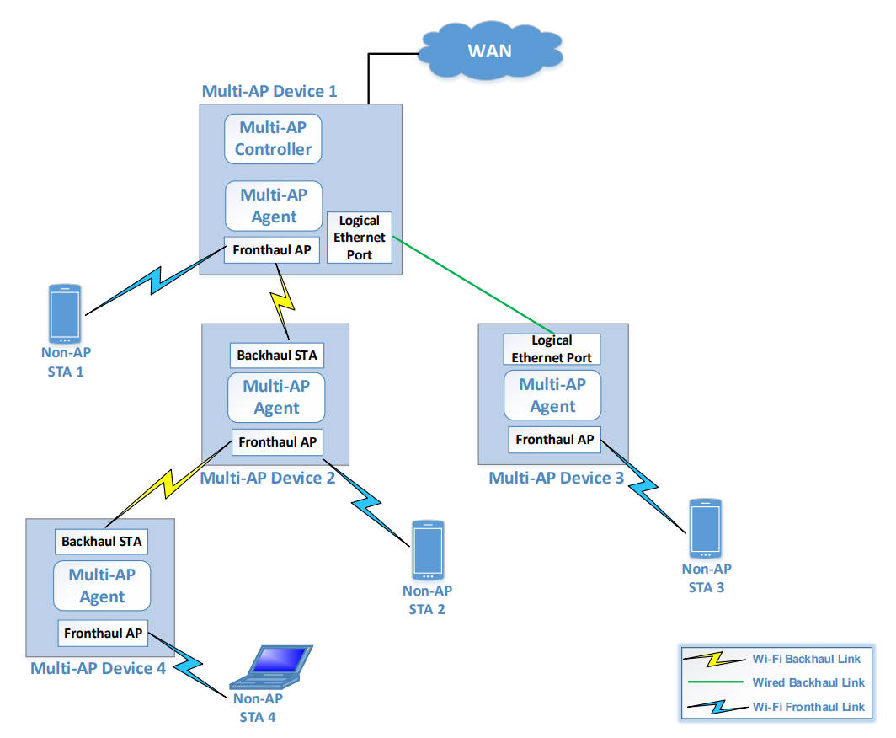
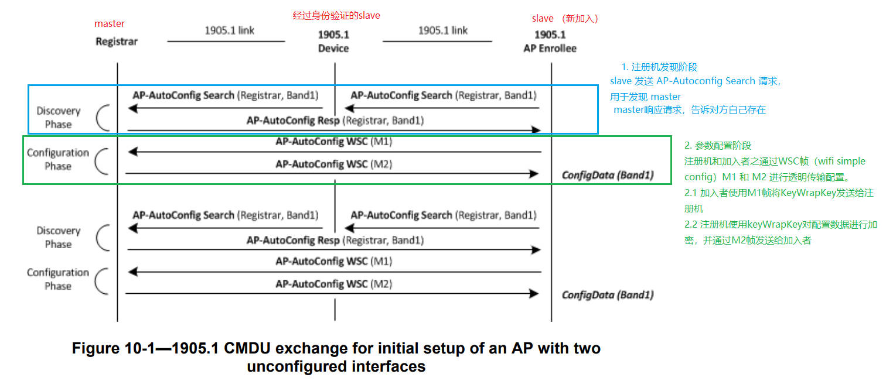
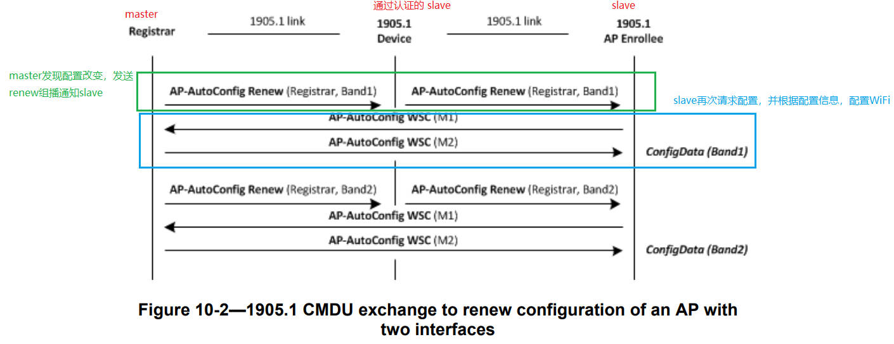

# easymesh

easymesh就是通过无线有线进行设备组网，组网成功后用户可以通过controller节点对整个网络所有节点，包括接入节点的STA进行读取信息和配置

如上图所示，

easymesh的组网结构为树形，

根节点有两个进程 controller 和 agent，agent 连接上 controller

用户通过控制controller，以控制所有agent，agent又控制所属他的STA

agent会建立两个BSS(根节点只有一个) 
- Fronthaul BSS : 用于让STA连接
- Backhaul BSS : 用于让子设备连接，这个BSS是匿名的，通常通过WPS进行连接

做子节点的设备只会启动 agent

子节点可以使用wifi或有线进行组网，

如果使用wifi

子节点通过做client连接附近的 Backhaul BSS，最终和根节点的controller组网成功

如果通过有线

子节点可以直接和controller组网

子节点会提供Fronthaul BSS给STA， Backhaul BSS给其他子节点

组网成功后controller可以下发配置，和链路优化，强制剔除STA让STA漫游等功能

# WPS
Wi-Fi Protected Setup（WPS）是一种用于简化无线网络连接设置的标准。它旨在简化用户在设备之间建立安全的 Wi-Fi 连接的过程，而无需手动输入复杂的密码。

WPS 提供了两种主要的连接方法：

1. PIN（Personal Identification Number）方法：用户可以在路由器或其他支持 WPS 的设备上找到一个预设的 PIN 码，并将其输入到需要连接的设备上。这种方法可以自动建立 Wi-Fi 连接，而无需手动输入密码。

2. PBC（Push Button Configuration）方法：用户可以按下路由器或其他支持 WPS 的设备上的物理按钮，然后在一定时间内按下需要连接的设备上的相应按钮。通过这种方法，设备之间可以进行自动连接。

# ieee1905

## 拓扑发现协议 - topology discovery
1905.1拓扑发现协议使得1905.1管理实体能够发现其他1905.1设备和IEEE 802.1桥接器，并填充1905.1拓扑数据库。该协议还能够通知网络拓扑的变化。

1905.1拓扑发现协议使得1905.1管理实体能够确定哪些设备可以通过它进行访问，并且如果需要的话，推断出更完整的网络拓扑。该协议还能够使得高级逻辑实体（HLE）在其他1905.1设备的拓扑发生变化时得到通知。

1905.1拓扑发现协议由组播发现过程、单播拓扑查询/响应过程和中继组播拓扑通知过程组成。发现过程使得每个1905.1管理实体能够发现其邻居的存在，并推断出它与相邻1905.1设备之间是否存在一个或多个IEEE 802.1桥接器。拓扑查询/响应过程使得1905.1管理实体能够获取关于另一个1905.1设备及其邻居的信息。拓扑通知过程使得1905.1管理实体能够被通知另一个1905.1设备的拓扑发生了变化。

### IEEE802.1 bridge discovery

每个1905.1设备在其每个接口上发送两种类型的组播发现消息：IEEE 802.1桥接器发现消息和拓扑发现消息。IEEE 802.1桥接器发现消息是发送到LLDP(link layer discovery protocol)最近桥接器组播地址（01-80-C2-00-00-0E）的LLDPDU(LLDP data unit)，不会被IEEE 802.1桥接器转发。1905.1抽象层不会影响LLDP的正常操作。拓扑发现消息发送到1905.1组播MAC地址，会被IEEE 802.1桥接器转发，但不会被1905.1设备转发。

从与LLDPDUs相同的1905.1接口发送的1905.1拓扑发现消息应在其MAC地址TLV（表6-8）中使用与LLDPDU的PortID TLV（IEEE Std 802.1AB-2009的8.5.3.3）相同的MAC地址。

这两种消息允许1905.1管理实体推断另一个1905.1管理实体是否通过一个或多个IEEE 802.1桥接器连接到特定接口，具体如下：

- 未检测到IEEE 802.1桥接器：1905.1管理实体通过其1905.1设备的特定接口同时接收到来自邻居1905.1管理实体的最近桥接器组地址广告和1905.1 MAC组地址广告。在这种情况下，该特定接口的布尔标志“IEEE802.1BridgeFlag”被设置为FALSE。

- 通过一个或多个IEEE 802.1桥接器连接：1905.1管理实体要么：

  - 1）只在该特定接口上从邻居1905.1管理实体接收到1905.1 MAC组地址广告。

  - 2）在特定接口上同时接收到具有不同MAC地址的LLDPDUs和1905.1拓扑发现消息（在1905.1拓扑发现消息的MAC地址TLV（表6-8）和LLDPDU的PortID TLV（IEEE Std 802.1AB-2009的8.5.3.3）中）。

  - 在这种情况下，该特定接口的布尔标志“IEEE802.1BridgeFlag”被设置为TRUE。

该方案无法使1905.1管理实体发现不符合IEEE Std 802.1D-2004（即将任何地址透明地转发到所有端口的集线器）的桥接器。

通过向每个相邻的1905.1管理实体发送拓扑查询消息（通过拓扑响应消息），1905.1管理实体可以构建一个更完整的网络映射。相邻设备是接收到组播拓扑发现消息的1905.1设备。1905.1管理实体可以查询任何其他1905.1设备，例如通过将拓扑查询消息发送给邻居的邻居等，以达到所需的程度。

## AP-AutoConfiguration
AP自动配置过程使用CMDU（Configuration and Management Data Units）将IEEE 802.11参数从master传递给slave，以设置初始配置或更新现有的IEEE 802.11接口配置。该操作提供了一种自动方法来设置多个AP的扩展服务集并保持它们的同步。具有未配置的IEEE 802.11接口的IEEE 802.11 AP充当slave，并使用经过身份验证的1905.1接口(中间节点)与充当注册机的另一个1905.1设备进行通信。

1905.1网络应配置一个单一的master，以便在包含IEEE 802.11接口的1905.1设备上正确运行1905.1按钮配置（参见9.2.2）。

成功认证1905.1接口会触发AP自动配置过程。AP自动配置过程分为以下两个阶段：
a) master发现阶段：获取在1905.1网络上可用的master的信息。
b) IEEE 802.11参数配置阶段：在master和slave之间传输ConfigData（如Wi-Fi简单配置中所指定）。1905.1抽象层为WSC帧M1和M2提供了透明的传输协议。

master接收到M1后，它会在M2中使用KeyWrapKey（如Wi-Fi简单配置中所指定）对ConfigData进行加密。

该过程针对每个接口进行定义，并且应针对每个未配置的IEEE 802.11 AP接口重复执行。

### 发现注册机阶段 - discovery
如果slave设备发现未配置的IEEE 802.11 AP接口，则在成功验证1905.1接口后，开始master发现阶段

slave 发送  AP-autoconfiguration search 消息以发现master，这是多播搜索消息，包含 UnconfiguredFreqBand TLV，这个值用于master检查其是否支持slave的频率完成自动配置。如果master支持，则回复单播  AP-autoconfiguration response

 AP-autoconfiguration search 消息包含一个新的MID值，对应的 AP-autoconfiguration response 消息包含相同的MIB值。

### 配置下发 - AP-AutoConfiguration
在接收到AP自动配置响应消息后，IEEE 802.11参数配置阶段将开始。

IEEE 802.11参数配置阶段通过交换消息来完成：AP自动配置WSC（M1）和AP自动配置WSC（M2）（M1和M2的内容和格式如Wi-Fi简单配置中所定义）。

IEEE 802.11配置数据在M2中传递给AP加入者。

AP自动配置WSC消息应包含一个新的MID值，

注册机接收到M1后，应在M2中使用KeyWrapKey（如Wi-Fi简单配置中所指定的）对ConfigData进行加密发送。

### 配置更新 - AP-AutoConfig Renew
注册机应通过组播发送AP自动配置更新消息，以通知使用AP自动配置过程配置的AP受训者重新启动过程以获取更新的值。这种配置的更新对于在1905.1网络的生命周期中保持扩展服务集中的配置参数同步非常重要（重新启动、升级操作等）。

AP自动配置续订消息应包含一个新的MID值

由注册机之前配置的所有AP受训者应在接收到AP自动配置续订消息后开始IEEE 802.11参数配置阶段。

此AP自动配置过程针对频段进行定义，如果注册机支持多个频段的配置，则应重复多次。

